# Linear Bottleneck Assignment and Maximum-Cardinality Matching in C++

## Table of Contents

- [1. Technical Terminology](#1-technical-terminology)
  - [1.1 Mathematical Notation Conventions](#13-mathematical-notation-conventions)
  - [1.2 Graph Theory and Optimization Terms](#14-graph-theory-and-optimization-terms)
  - [1.3 Algorithmic Terms](#15-algorithmic-terms)
  - [1.4 C++ and Standard Library Terms](#16-c-and-standard-library-terms)
- [2. Problem Statement](#2-problem-statement)
  - [2.1 The Assignment Graph](#23-the-assignment-graph)
  - [2.2 Concrete Example](#24-concrete-example)
  - [2.3 What Counts as a Valid Assignment?](#25-what-counts-as-a-valid-assignment)
  - [2.4 What Is Being Minimized?](#26-what-is-being-minimized)
- [3. The Central Idea of the Implementation](#3-the-central-idea-of-the-implementation)
- [4. File Architecture and Function Responsibilities](#4-file-architecture-and-function-responsibilities)
- [7. Call Stack and Runtime Flow](#7-call-stack-and-runtime-flow)
- [8. Small C++ Usage Example](#8-small-c-usage-example)
- [9. Utility Function: `GetMapMedianValue`](#9-utility-function-getmapmedianvalue)
- [8. How the Matching Is Represented](#8-how-the-matching-is-represented)
- [9. Reverse Lookup with `GetMatchFromRight`](#9-reverse-lookup-with-getmatchfromright)
- [10. Maximum-Cardinality Bipartite Matching](#10-maximum-cardinality-bipartite-matching)
- [11. Why Greedy Matching Alone Fails](#11-why-greedy-matching-alone-fails)
- [12. Alternating and Augmenting Paths](#12-alternating-and-augmenting-paths)
- [13. Labels as Search-Tree Predecessors](#13-labels-as-search-tree-predecessors)
- [14. Working Sets and Graph Exploration](#14-working-sets-and-graph-exploration)
- [15. `ScanLeftVertex`](#15-scanleftvertex)
- [16. `ScanRightVertex`](#16-scanrightvertex)
- [17. How Matching Augmentation Works](#17-how-matching-augmentation-works)
- [18. Why the Search State Is Reset](#18-why-the-search-state-is-reset)
- [19. `MaximumCardinalityMatching`](#19-maximumcardinalitymatching)
- [20. What the Code Means by a "Perfect" Matching](#20-what-the-code-means-by-a-perfect-matching)
- [21. The Bottleneck Assignment Search](#21-the-bottleneck-assignment-search)
- [22. Filtering Edges by Threshold](#22-filtering-edges-by-threshold)
- [23. Why Feasibility Is Monotonic](#23-why-feasibility-is-monotonic)
- [24. Cost Bounds and Median Threshold Selection](#24-cost-bounds-and-median-threshold-selection)
- [25. Updating the Search Bounds](#25-updating-the-search-bounds)
- [26. `GetBoundedEdges` vs. `UpdateFilteredEdges`](#26-getboundededges-vs-updatefilterededges)
- [27. Complete Threshold-Search Example](#27-complete-threshold-search-example)
- [28. Why `c_lower` Is Tested Again](#28-why-c_lower-is-tested-again)
- [29. The Full-Graph Fallback](#29-the-full-graph-fallback)
- [30. C++ Language Features Used](#30-c-language-features-used)
- [31. Hidden Type Requirements](#31-hidden-type-requirements)
- [32. Important Algorithmic Invariants](#32-important-algorithmic-invariants)
- [33. Complexity](#33-complexity)
- [34. Design Strengths](#34-design-strengths)
- [35. Design Weaknesses and Review Concerns](#35-design-weaknesses-and-review-concerns)
- [36. A Simpler Mental Model](#36-a-simpler-mental-model)
- [37. Suggested Improvements](#37-suggested-improvements)
- [38. Summary](#38-summary)

---

## Rendering This File in VS Code

This document uses syntax compatible with VS Code's built-in Markdown preview:

- inline math: `$x\in\mathbb{R}$`
- display math: `$$ ... $$`
- Mermaid diagrams: fenced `mermaid` code blocks

If equations appear as literal dollar-delimited source instead of rendered mathematics, verify that the VS Code setting `markdown.math.enabled` is enabled.

Open the built-in preview with **Ctrl+Shift+V** on Windows/Linux or **Shift+Cmd+V** on macOS.

---


# 1. Technical Terminology

Before reading the implementation, it helps to establish the vocabulary used by the graph algorithm, the optimization problem, and the C++ code.

The same words appear repeatedly throughout the implementation. Understanding them first makes the later sections much easier to follow.

## 1.1 Mathematical Notation Conventions

This document uses a consistent mathematical notation throughout:

| Object | Notation | Example and dimensionality | Meaning |
|---|---|---|---|
| Scalar | italic lowercase, e.g. $x$, $t$, $c$ | $t\in\mathbb{R}$ | A single numeric value, such as a threshold or edge cost. |
| Integer scalar | italic lowercase | $n\in\mathbb{N}$ | A count or index, such as the number of vertices. |
| Vector | bold lowercase | $\mathbf{x}\in\mathbb{R}^{n}$ | An ordered collection of $n$ scalar values. |
| Matrix | bold uppercase | $\mathbf{C}\in\mathbb{R}^{m\times n}$ | A rectangular array with $m$ rows and $n$ columns. |
| Set | uppercase italic | $L$, $R$, $E$, $M$ | A collection of vertices, edges, or matching edges. |
| Graph | uppercase italic | $G=(L,R,E)$ | A bipartite graph with left vertices $L$, right vertices $R$, and edges $E$. |
| Function | lowercase italic | $c:E\rightarrow\mathbb{R}$ | A mapping; here, $c(e)$ gives the scalar cost of edge $e$. |
| Cardinality | vertical bars | $\lvert L\rvert=m$ | The number of elements in a set. |
| Matrix entry | lowercase scalar with indices | $c_{ij}\in\mathbb{R}$ | The cost at row $i$, column $j$ of $\mathbf{C}$. |

For a dense assignment formulation, the cost data can be represented as a matrix

$$
\mathbf{C}
=
[c_{ij}]
\in
\mathbb{R}^{m\times n},
$$

where

$$
c_{ij}\in\mathbb{R}
$$

is the scalar cost of assigning left vertex $l_i$ to right vertex $r_j$.

The graph implementation in the source code is sparse: instead of storing every entry of $\mathbf{C}$, it stores only allowed edges and their scalar costs. A missing graph edge therefore represents an unavailable assignment rather than merely a very large matrix entry.

> **Notation note:** bold uppercase is used for matrices, not vectors. Bold lowercase is reserved for vectors. This convention makes expressions such as $\mathbf{C}\mathbf{x}$ visually unambiguous.

---

## 1.2 Graph Theory and Optimization Terms

The graph-theory symbols below are used consistently in the rest of the document. In particular, $m=\lvert L\rvert$ and $n=\lvert R\rvert$ denote the sizes of the two partitions.

| Term | Mathematical notation | Definition | Why It Matters Here |
|---|---|---|---|
| **Graph** | $G=(L,R,E)$ | A mathematical structure consisting of vertices and edges. | The assignment problem is represented as a bipartite graph. |
| **Left partition** | $L=\{l_1,\ldots,l_m\}$, $\lvert L\rvert=m$ | The set of left-side vertices. | C++ represents an element $l_i\in L$ using `LeftVertex`. |
| **Right partition** | $R=\{r_1,\ldots,r_n\}$, $\lvert R\rvert=n$ | The set of right-side vertices. | C++ represents an element $r_j\in R$ using `RightVertex`. |
| **Vertex / node** | $l_i\in L$ or $r_j\in R$ | A single object participating in the graph. | A candidate item that may be assigned to one item on the opposite side. |
| **Edge** | $e_{ij}=(l_i,r_j)\in E\subseteq L\times R$ | A connection between one left and one right vertex. | Represents one allowed assignment. |
| **Edge cost** | $c_{ij}=c(e_{ij})\in\mathbb{R}$ | A scalar weight attached to an edge. | Measures the cost of selecting assignment $(l_i,r_j)$. |
| **Cost matrix** | $\mathbf{C}=[c_{ij}]\in\mathbb{R}^{m\times n}$ | Dense matrix form of all pairwise assignment costs. | Useful mathematical representation even though the C++ code stores a sparse edge map. |
| **Matching** | $M\subseteq E$ | A set of edges with no shared endpoint. | Represents a legal one-to-one assignment. |
| **Matching cardinality** | $\lvert M\rvert\in\mathbb{N}$ | Number of selected matching edges. | The inner algorithm maximizes this quantity. |
| **Matched vertex** | $l_i\in V(M)$ or $r_j\in V(M)$ | A vertex incident to a selected edge. | Indicates that an item already participates in an assignment. |
| **Unmatched vertex** | $v\notin V(M)$ | A vertex not incident to any selected matching edge. | Augmenting paths begin and end at unmatched vertices. |
| **Maximum-cardinality matching** | $M^\star\in\arg\max_{M}\lvert M\rvert$ | A matching containing as many edges as possible. | Used as the feasibility test for each threshold. |
| **Perfect matching** | $\lvert M\rvert=\lvert L\rvert=\lvert R\rvert$ | A matching that saturates every vertex on both sides. | The source uses this term more loosely than standard graph theory. |
| **Smaller-partition saturation** | $\lvert M\rvert=\min(m,n)$ | Every vertex in the smaller partition participates in the matching. | This is the actual completeness condition used by the code. |
| **Threshold** | $t\in\mathbb{R}$ | Candidate upper bound on permitted scalar edge cost. | Edges satisfying $c_{ij}\le t$ remain available. |
| **Thresholded edge set** | $E_t=\{e\in E:c(e)\le t\}$ | Edges whose costs do not exceed $t$. | Defines the graph sent to the matching feasibility test. |
| **Thresholded graph** | $G_t=(L,R,E_t)$ | Bipartite graph remaining after threshold filtering. | Feasibility of $G_t$ tells the optimizer whether $t$ is large enough. |
| **Bottleneck value** | $b(M)=\max_{e\in M}c(e)\in\mathbb{R}$ | Largest scalar edge cost in matching $M$. | This is the quantity minimized by LBAP. |
| **LBAP optimum** | $t^\star=\min_M b(M)$ | Smallest possible bottleneck among complete feasible assignments. | The final scalar objective returned with the matching. |

---

## 1.3 Algorithmic Terms

| Term | Definition | Why It Matters Here |
|---|---|---|
| **Greedy algorithm** | Makes locally valid choices without reconsidering the global consequence. | Used only to initialize the matching; it is not sufficient by itself. |
| **Alternating path** | A path whose edges alternate between unmatched and matched edges. | The matching search explores these paths. |
| **Augmenting path** | An alternating path that begins and ends at unmatched vertices. | Flipping its edges increases matching size by exactly one. |
| **Symmetric difference** | Set operation $A \triangle B$ containing elements in exactly one of the two sets. | Describes mathematically how an augmenting path is applied to a matching. |
| **Labeling algorithm** | Search algorithm that marks discovered vertices with predecessor information. | The implementation stores predecessors in `left_labels` and `right_labels`. |
| **Predecessor** | The previous vertex from which another vertex was discovered. | Used to reconstruct an augmenting path. |
| **Search frontier** | Discovered vertices that still need to be processed. | Represented by the working sets. |
| **Working set** | A collection of vertices waiting to be scanned. | `working_left_set` and `working_right_set` implement the frontier. |
| **Invariant** | A property that remains true at a specified point of an algorithm. | Useful for understanding correctness. |
| **Monotonic predicate** | A Boolean condition that, after becoming true as a search parameter increases, stays true. | Matching feasibility becomes monotonic with respect to the cost threshold. |
| **Binary-search-style threshold search** | Repeatedly narrowing an interval based on a monotonic predicate. | Used to locate the smallest feasible edge-cost threshold. |
| **Median** | The middle value in an ordered collection. | Candidate thresholds are selected using a median edge cost. |
| **Order statistic** | The element occupying a specified rank in sorted order. | `std::nth_element` computes the needed middle element without full sorting. |
| **Adjacency** | The relation saying two vertices are connected by an edge. | `ScanLeftVertex` repeatedly checks adjacency. |
| **Adjacency list** | Data structure storing only the actual neighbors of each vertex. | A possible improvement over the current representation. |
| **Sparse graph** | A graph with relatively few edges compared with all possible edges. | The current scanning strategy is inefficient for sparse graphs. |
| **Dense graph** | A graph containing many of the possible edges. | Scanning all right vertices is less wasteful in this case. |
| **Brute-force verification** | Exhaustively trying every candidate solution for small inputs. | Useful for validating this implementation against edge cases. |
| **Time complexity** | How runtime grows with input size. | Used to evaluate the matching and threshold-search implementation. |
| **Space complexity** | How memory usage grows with input size. | Relevant because the code stores several maps, sets, and copies. |

---

## 1.4 C++ and Standard Library Terms

| Term | Definition | Why It Matters Here |
|---|---|---|
| **Template** | C++ mechanism for parameterizing code by types or values. | The algorithm works with generic vertex and cost types. |
| **Template parameter** | A type or value supplied to a template. | Examples are `LeftVertex`, `RightVertex`, and `V`. |
| **Generic programming** | Writing algorithms independently of specific concrete types. | The entire file follows this style. |
| **`std::optional<T>`** | A wrapper containing either a `T` or no value. | Represents unmatched vertices and overall failure. |
| **`std::nullopt`** | The empty state of `std::optional`. | Used to mean "no match" or "no result". |
| **`std::unordered_map`** | Hash-table associative container mapping keys to values. | Stores costs, labels, and matching state. |
| **`std::unordered_set`** | Hash-table set container. | Stores the working/search-frontier sets. |
| **Hash function** | Function mapping a key to a hash value used by hash tables. | Required for types placed in unordered containers. |
| **Structured binding** | Syntax such as `auto& [a, b]` that decomposes tuple-like objects. | Used throughout map iteration. |
| **Type inference** | Compiler deduction of a type from an initializer. | Used through `auto`. |
| **Lambda expression** | Anonymous callable object written inline. | Used to compare map entries by cost. |
| **Generic lambda** | Lambda whose parameters use `auto`. | Allows the comparator to avoid spelling out long types. |
| **`std::tie`** | Utility for binding existing variables into a tuple-like assignment target. | Used to unpack updated lower and upper bounds. |
| **`std::nth_element`** | STL algorithm placing the nth element in the position it would occupy after sorting. | Used for median selection. |
| **`std::min_element`** | Finds the smallest element under a comparison rule. | Finds the minimum edge cost. |
| **`std::max_element`** | Finds the largest element under a comparison rule. | Finds the maximum edge cost. |
| **Range-based `for` loop** | Loop syntax `for (auto x : container)`. | Used extensively throughout the implementation. |
| **Alternative operator tokens** | C++ keywords such as `and` and `not` equivalent to `&&` and `!`. | The file mixes symbolic and keyword operators. |
| **Copy semantics** | Creating a new independent object containing the same values. | `old_matching = matching` preserves pre-augmentation state. |
| **C++20 concept** | Compile-time predicate describing requirements on template arguments. | Could make the hidden type requirements explicit. |
| **`std::expected`** | Modern result type representing either a value or a typed error. | Could improve error reporting compared with `std::nullopt`. |

---

# 2. Problem Statement

The code solves a weighted one-to-one assignment problem.

At a high level, imagine that you have one collection of things on the left and another collection on the right. Not every left item can necessarily be paired with every right item. Each allowed pairing has a cost.

The goal is to produce as many one-to-one assignments as necessary while minimizing the cost of the **worst** selected assignment.

## 2.1 The Assignment Graph

Formally, the input is a weighted bipartite graph

$$
G=(L,R,E),
$$

where:

$$
L=\{l_1,l_2,\ldots,l_m\}
$$

is the left partition,

$$
R=\{r_1,r_2,\ldots,r_n\}
$$

is the right partition, and

$$
E\subseteq L\times R
$$

is the set of allowed edges.

Every edge has a scalar cost

$$
c:E\rightarrow\mathbb{R}.
$$

For a dense formulation, collect these scalar costs into the matrix

$$
\mathbf{C}
=
[c_{ij}]
\in
\mathbb{R}^{m\times n},
$$

where the scalar

$$
c_{ij}\in\mathbb{R}
$$

is the cost associated with assigning $l_i$ to $r_j$.

If we need a vector representation of all costs incident to one left vertex $l_i$, we can write

$$
\mathbf{c}_i
=
\begin{bmatrix}
c_{i1} & c_{i2} & \cdots & c_{in}
\end{bmatrix}^{\mathsf T}
\in
\mathbb{R}^{n}.
$$

The C++ implementation does **not** store a dense $\mathbf{C}$. Instead it stores only those pairs $(l_i,r_j)$ for which an edge actually exists. In other words, the source uses a sparse graph representation.

The generic C++ cost type `V` plays the role of the scalar mathematical type used for $c_{ij}$, subject to the arithmetic and comparison operations required by the implementation.

The graph itself is not merely a visualization. It precisely encodes the constraints:

- a missing edge means an assignment is not permitted,
- an existing edge means an assignment is allowed,
- the edge label gives the assignment cost.

---

## 2.2 Concrete Example

Consider three left vertices

$$
L=\{A,B,C\}
$$

and three right vertices

$$
R=\{X,Y,Z\}.
$$

Suppose the allowed assignments have the following costs:

| Edge | Cost |
|---|---:|
| $A\leftrightarrow X$ | 1 |
| $A\leftrightarrow Y$ | 6 |
| $B\leftrightarrow X$ | 4 |
| $B\leftrightarrow Y$ | 5 |
| $B\leftrightarrow Z$ | 9 |
| $C\leftrightarrow Y$ | 2 |
| $C\leftrightarrow Z$ | 7 |

The graph is:

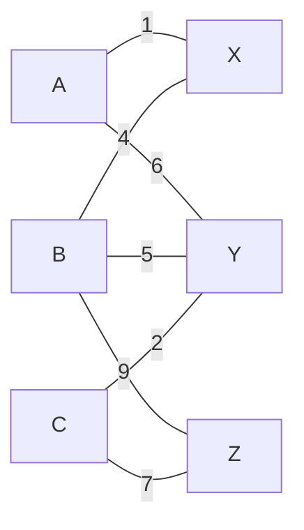

The node names are the assignment entities. The numbers on the edges are their costs.

For example,

$$
c(A,X)=1
$$

means assigning $A$ to $X$ costs 1.

There is no edge from $A$ to $Z$, so that assignment is not allowed.

---

## 2.3 What Counts as a Valid Assignment?

A valid assignment must be a **matching**.

That means a left vertex cannot be assigned to two right vertices, and a right vertex cannot receive two left vertices.

For example,

$$
M_1=
\{
(A,X),
(B,Y),
(C,Z)
\}
$$

is a valid matching.

It corresponds to:

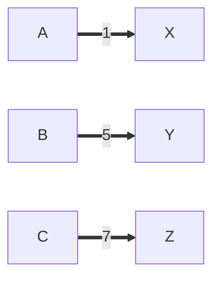

Each vertex participates in exactly one selected edge.

By contrast,

$$
\{
(A,X),
(B,X),
(C,Z)
\}
$$

is not a valid matching because both $A$ and $B$ are assigned to $X$.

The one-to-one restriction is therefore not an optimization preference. It is a hard feasibility constraint.

---

## 2.4 What Is Being Minimized?

For the valid matching

$$
M_1=
\{
(A,X),
(B,Y),
(C,Z)
\},
$$

the selected edge costs are

$$
1,\ 5,\ 7.
$$

Its bottleneck value is

$$
\max(1,5,7)=7.
$$

Now consider another valid matching:

$$
M_2=
\{
(A,Y),
(B,X),
(C,Z)
\}.
$$

Its costs are

$$
6,\ 4,\ 7
$$

and therefore its bottleneck value is also

$$
7.
$$

The objective is

$$
\boxed{
\min_M \max_{e\in M} c(e)
}.
$$

This is fundamentally different from minimizing

$$
\sum_{e\in M}c(e).
$$

The bottleneck formulation asks:

> What is the smallest maximum cost we can guarantee across all assigned pairs?

This is useful when a single extremely bad assignment is undesirable even if the total cost remains small.

---

# 3. The Central Idea of the Implementation

The implementation does not solve the bottleneck objective directly.

Instead, it converts optimization into a sequence of yes/no feasibility questions.

For a candidate threshold $T$, define

$$
E_T=
\{
e\in E\mid c(e)\le T
\}.
$$

This creates a new graph

$$
G_T=(L,R,E_T)
$$

that contains only assignments whose cost is acceptable under threshold $T$.

The algorithm then asks:

> Can this thresholded graph support a matching that saturates the required vertices?

If yes, then the threshold is high enough.

If no, then the threshold is too restrictive.

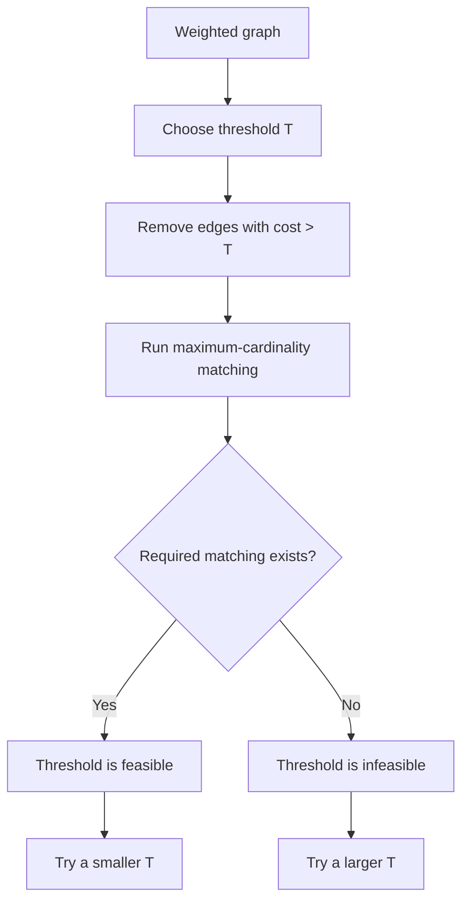

This decomposition is the key to understanding the entire file:

$$
\boxed{
\text{LBAP}
=
\text{threshold optimization}
+
\text{matching feasibility}
}
$$

The rest of the source is essentially machinery supporting one of those two tasks.

---

# 4. File Architecture and Function Responsibilities

The implementation can be divided into three conceptual layers.

| Layer | Responsibility | Main Functions |
|---|---|---|
| Utility | Compute statistics or manipulate cost bounds | `GetMapMedianValue`, `UpdateCostBounds`, `GetBoundedEdges`, `UpdateFilteredEdges` |
| Matching | Determine whether a sufficiently large bipartite matching exists | `GetMatchFromRight`, `ScanLeftVertex`, `ScanRightVertex`, `MaximumCardinalityMatching` |
| Optimization | Search for the minimum feasible threshold | `BottleneckAssignment` |

The approximate call graph is:

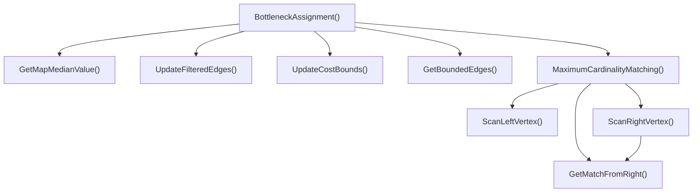

A useful reading strategy is therefore:

1. understand the representation of a matching,
2. understand how the matching grows through augmenting paths,
3. then understand how that matching solver is repeatedly invoked by the bottleneck search.

---

# 5. Call Stack and Runtime Flow

The earlier call graph shows which functions may call which other functions. A **call stack** diagram adds another useful perspective: it shows the nested runtime path for one typical execution.

At the top level, application code calls:

```cpp
volley::BottleneckAssignment(...)
```

That function repeatedly performs threshold-selection work and invokes the matching solver.

A representative nested call sequence looks like this:

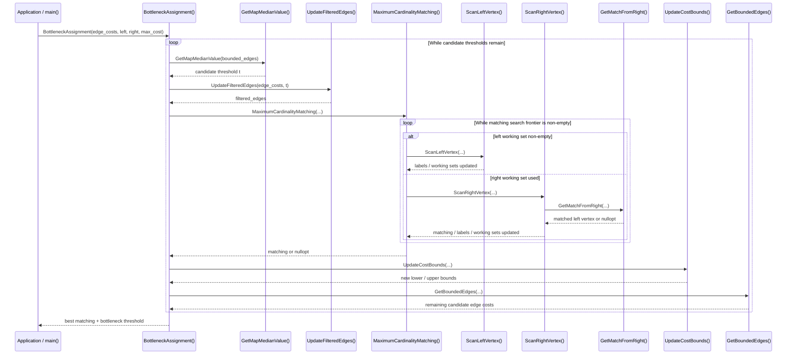

The corresponding stack nesting for one representative matching step can be pictured more compactly as:

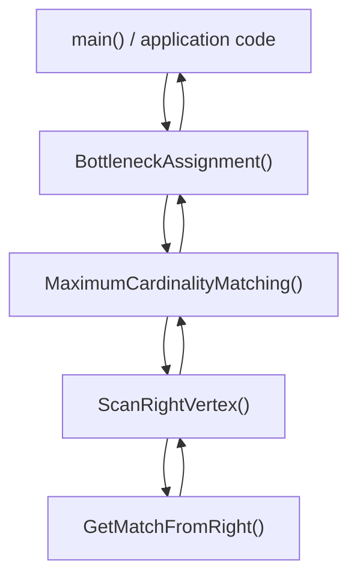

The important distinction is:

- the **outer stack** belongs to threshold optimization,
- the **inner stack** belongs to graph matching.

The expensive work is not just one call to `MaximumCardinalityMatching()`. The bottleneck solver can call it multiple times, once for each tested threshold.

So conceptually the runtime has two nested loops:

```text
threshold search
    matching search
        left/right graph scans
```

This is useful when thinking about performance, profiling, or debugging because a slowdown inside the matching layer may be multiplied by the number of threshold tests.

---

# 6. Small C++ Usage Example

The algorithm is generic, so the concrete vertex types can be simple types such as strings or integers.

A minimal example could use strings for left and right vertices and `double` for edge costs.

The example below assumes the header containing the algorithm is available as:

```cpp
#include "bottleneck_assignment.hpp"
```

and that the project already provides hashing support for:

```cpp
std::pair<LeftVertex, RightVertex>
```

because the algorithm stores edge costs in an `std::unordered_map` keyed by a pair.

```cpp
#include <iostream>
#include <optional>
#include <string>
#include <unordered_map>
#include <utility>
#include <vector>

#include "bottleneck_assignment.hpp"

int main() {
    using LeftVertex = std::string;
    using RightVertex = std::string;
    using Cost = double;

    const std::vector<LeftVertex> left_vertices{
        "A",
        "B",
        "C",
    };

    const std::vector<RightVertex> right_vertices{
        "X",
        "Y",
        "Z",
    };

    std::unordered_map<
        std::pair<LeftVertex, RightVertex>,
        Cost
    > edge_costs{
        {{"A", "X"}, 1.0},
        {{"A", "Y"}, 6.0},
        {{"B", "X"}, 4.0},
        {{"B", "Y"}, 5.0},
        {{"B", "Z"}, 9.0},
        {{"C", "Y"}, 2.0},
        {{"C", "Z"}, 7.0},
    };

    // The implementation requires max_cost to be strictly greater
    // than every real edge cost.
    const Cost max_cost = 100.0;

    const auto result = volley::BottleneckAssignment(
        edge_costs,
        left_vertices,
        right_vertices,
        max_cost);

    if (!result.has_value()) {
        std::cout << "No complete assignment exists.\n";
        return 1;
    }

    const auto& [matching, bottleneck] = result.value();

    std::cout << "Optimal bottleneck cost: "
              << bottleneck
              << '\n';

    for (const auto& left : left_vertices) {
        const auto& right_opt = matching.at(left);

        if (right_opt.has_value()) {
            std::cout
                << left
                << " -> "
                << right_opt.value()
                << '\n';
        }
        else {
            std::cout
                << left
                << " -> unmatched\n";
        }
    }

    return 0;
}
```

For the graph used earlier, one valid optimal result may look like:

```text
Optimal bottleneck cost: 7
A -> X
B -> Y
C -> Z
```

The exact matching may differ if multiple optimal matchings share the same bottleneck threshold.

That is expected.

The important guarantee is not necessarily a unique assignment. It is that the returned matching satisfies the assignment constraints and that its worst selected edge has the minimum achievable bottleneck value.

For the example above:

$$
M
=
\{
(A,X),
(B,Y),
(C,Z)
\},
$$

with costs:

$$
1,\ 5,\ 7.
$$

Therefore:

$$
\max_{e\in M} c(e)=7.
$$

---

## 6.1 What the Return Type Means in Practice

The conceptual return type is:

```cpp
std::optional<
    std::pair<
        std::unordered_map<
            LeftVertex,
            std::optional<RightVertex>
        >,
        Cost
    >
>
```

That is easier to understand by decomposing it.

The outer:

```cpp
std::optional<...>
```

means:

> Did the algorithm find a complete feasible assignment at all?

The `std::pair` contains:

```text
first  -> matching
second -> optimal bottleneck threshold
```

The matching itself maps:

```text
LeftVertex -> optional<RightVertex>
```

because individual left vertices can be represented as unmatched internally.

So this line:

```cpp
const auto& [matching, bottleneck] = result.value();
```

uses a structured binding to unpack the pair returned by the algorithm.

---

## 6.2 Important Practical Requirement: Pair Hashing

The example uses:

```cpp
std::unordered_map<
    std::pair<LeftVertex, RightVertex>,
    Cost
>
```

That means the key type:

```cpp
std::pair<LeftVertex, RightVertex>
```

must be hashable.

If the surrounding project already defines a suitable `std::hash` specialization or custom hasher, nothing additional is needed.

Otherwise, a standalone example would need a pair hasher such as:

```cpp
struct PairHash {
    template <typename T1, typename T2>
    std::size_t operator()(
        const std::pair<T1, T2>& value) const {

        const auto h1 = std::hash<T1>{}(value.first);
        const auto h2 = std::hash<T2>{}(value.second);

        return h1 ^ (h2 << 1);
    }
};
```

and then:

```cpp
std::unordered_map<
    std::pair<LeftVertex, RightVertex>,
    Cost,
    PairHash
> edge_costs;
```

However, the exact algorithm signature in the source expects its specific `unordered_map` type, so whether a custom hasher can be supplied directly depends on the actual function declaration and project-level hashing utilities.

The practical takeaway is:

> Before copying the usage example into another project, verify how the source project makes `std::pair<LeftVertex, RightVertex>` hashable.

---

## 6.3 Direct Use of the Matching Solver

If the bottleneck optimization is not needed and the caller already knows which edges should be allowed, the inner matcher can be called directly:

```cpp
const auto matching_opt =
    volley::MaximumCardinalityMatching(
        left_vertices,
        right_vertices,
        edge_costs);

if (matching_opt.has_value()) {
    const auto& matching = matching_opt.value();

    // Use matching...
}
```

This asks only:

> Does the supplied graph contain a matching that saturates the smaller partition?

It does **not** minimize any edge cost.

That difference is important:

```text
MaximumCardinalityMatching
    solves feasibility / cardinality

BottleneckAssignment
    repeatedly calls matching
    to optimize the worst edge cost
```

---

# 7. Utility Function: `GetMapMedianValue`

The conceptual signature is:

```cpp
template <typename K, typename V>
std::optional<V> GetMapMedianValue(
    const std::unordered_map<K, V>& value_map);
```

The function receives an unordered map and computes the median of its **values**.

The keys are irrelevant to the median calculation.

The function first copies the values into a vector:

```cpp
std::vector<V> values;

for (const auto& [k, v] : value_map) {
    values.push_back(v);
}
```

The structured binding

```cpp
[k, v]
```

decomposes each map entry into its key and value.

Although `k` is not needed mathematically, it is exposed because map iteration yields key-value pairs.

If the map is empty, no median exists, so the function returns:

```cpp
std::nullopt
```

This is an example of `std::optional` being used to represent the mathematical fact that the requested value may not exist.

---

## 5.1 Why `std::nth_element` Is Used

A straightforward way to find a median is:

1. sort all values,
2. select the middle value.

Sorting costs approximately

$$
O(n\log n).
$$

But computing the median does not require knowing the complete sorted order.

The implementation therefore uses:

```cpp
std::nth_element(...)
```

This rearranges the range so that the selected position contains the element that would appear there after a full sort.

For odd $n$,

$$
\operatorname{median}(x)
=
x_{\lfloor n/2\rfloor}.
$$

The average complexity of `std::nth_element` is

$$
O(n).
$$

This matters because median selection happens repeatedly during the outer threshold search.

---

## 5.2 Even-Sized Inputs

For even $n$, the implementation obtains the two middle order statistics and returns

$$
\frac{x_{n/2-1}+x_{n/2}}{2}.
$$

That immediately tells us something important about the supposedly generic type `V`.

`V` cannot be arbitrary.

It must support operations compatible with:

- ordering,
- addition,
- division by `2`.

Those requirements are implicit in the template rather than stated explicitly.

---

# 8. How the Matching Is Represented

The current matching is stored as:

```cpp
std::unordered_map<
    LeftVertex,
    std::optional<RightVertex>
>
```

Conceptually:

```text
left vertex -> right vertex or no match
```

For example:

```text
A -> X
B -> nullopt
C -> Z
```

means:

$$
A\leftrightarrow X,
$$

$$
B \text{ is unmatched},
$$

and

$$
C\leftrightarrow Z.
$$

The use of `std::optional` is significant.

Instead of inventing a special fake `RightVertex` meaning "unmatched", the type system explicitly models two states:

$$
\text{matched}
$$

or

$$
\text{not matched}.
$$

This reduces the chance of confusing a legitimate vertex value with a sentinel.

---

# 9. Reverse Lookup with `GetMatchFromRight`

The matching representation supports efficient lookup in one direction:

```text
LeftVertex -> RightVertex
```

But the matching algorithm also needs to answer the reverse question:

> Is this right vertex already matched, and if so, to which left vertex?

That is the purpose of:

```cpp
GetMatchFromRight(right_vertex, matching)
```

The function scans entries conceptually like:

```text
A -> X
B -> Y
C -> nullopt
```

until it finds a value equal to the requested right vertex.

Mathematically, it asks whether

$$
\exists l\in L
\quad\text{such that}\quad
M(l)=r.
$$

If a match is found, it returns:

```cpp
std::optional<LeftVertex>
```

containing that left vertex.

Otherwise it returns `std::nullopt`.

The design is simple, but the reverse lookup costs approximately

$$
O(\lvert L\rvert).
$$

A later design section discusses how maintaining a second right-to-left map could make this average $O(1)$.

---

# 10. Maximum-Cardinality Bipartite Matching

The inner matching algorithm tries to maximize

$$
\lvert M\rvert,
$$

the number of selected matching edges.

Consider:

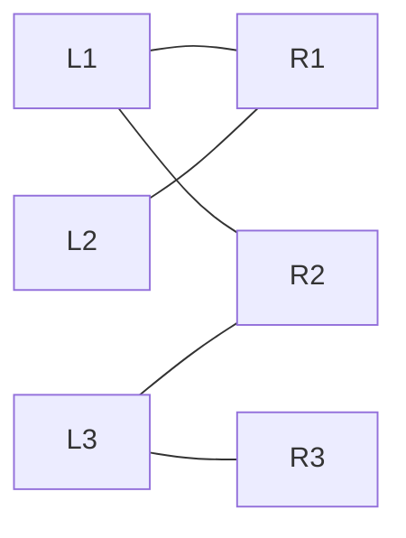

A valid matching is:

$$
M=
\{
(L_1,R_2),
(L_2,R_1),
(L_3,R_3)
\}.
$$

Its cardinality is

$$
\lvert M\rvert=3.
$$

No matching can contain more than three edges because the left side contains only three vertices.

Thus, in this graph, the matching is maximum-cardinality.

The important challenge is that finding such a matching may require changing earlier assignments.

---

# 11. Why Greedy Matching Alone Fails

Consider:

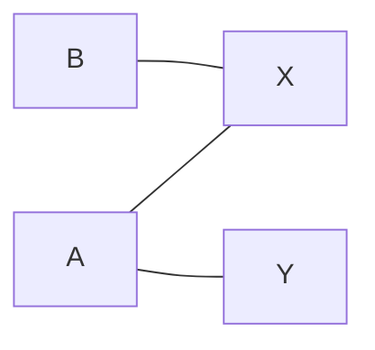

Suppose a greedy algorithm examines $A$ first and chooses

$$
A\rightarrow X.
$$

Then when it examines $B$, its only possible edge is also

$$
B\rightarrow X.
$$

But $X$ is already occupied.

The greedy algorithm appears stuck with a matching of size

$$
1.
$$

However, the graph clearly supports:

$$
A\rightarrow Y
$$

and

$$
B\rightarrow X,
$$

which has size

$$
2.
$$

The problem is not that the first choice was illegal. It was merely globally inconvenient.

Therefore, a correct maximum-matching algorithm must be able to **rearrange existing matches**.

This is what augmenting paths accomplish.

---

# 12. Alternating and Augmenting Paths

An **alternating path** alternates between edges outside the current matching and edges inside the current matching.

The pattern is:

$$
\text{unmatched},
\text{matched},
\text{unmatched},
\text{matched},
\dots
$$

An **augmenting path** is an alternating path whose two endpoints are currently unmatched.

Example:

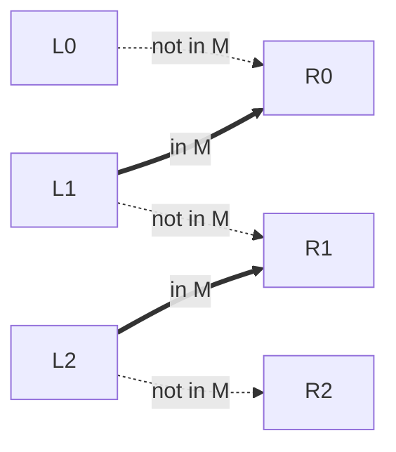

The path is:

$$
L_0
\rightarrow
R_0
\rightarrow
L_1
\rightarrow
R_1
\rightarrow
L_2
\rightarrow
R_2.
$$

Initially, the path contains:

- three unmatched edges,
- two matched edges.

If every edge on the path changes status, the three unmatched edges become matched and the two matched edges become unmatched.

Therefore the matching size changes by

$$
3-2=1.
$$

So:

$$
\boxed{|M'|=\lvert M\rvert+1}.
$$

This operation can be written mathematically as:

$$
M'=M\triangle P,
$$

where $\triangle$ denotes the symmetric difference and $P$ is the augmenting path.

This theorem is the foundation of augmenting-path matching algorithms.

---

# 13. Labels as Search-Tree Predecessors

The code does not store an explicit tree object while searching.

Instead, it records how each discovered vertex was reached.

For left vertices:

```cpp
std::unordered_map<
    LeftVertex,
    std::optional<RightVertex>
> left_labels;
```

For right vertices:

```cpp
std::unordered_map<
    RightVertex,
    std::optional<LeftVertex>
> right_labels;
```

If

```cpp
right_labels[R] = L;
```

then the algorithm is recording:

> The search reached right vertex `R` from left vertex `L`.

Similarly,

```cpp
left_labels[L] = R;
```

means:

> The search reached left vertex `L` from right vertex `R`.

This gives a chain such as:

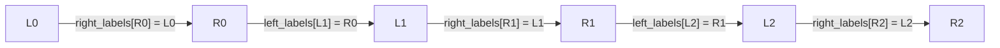

The labels are therefore not arbitrary metadata. They are the data structure used to reconstruct the augmenting path after an unmatched endpoint is discovered.

---

# 14. Working Sets and Graph Exploration

The code maintains:

```cpp
std::unordered_set<LeftVertex> working_left_set;
std::unordered_set<RightVertex> working_right_set;
```

A useful way to think about these is:

> These are vertices that have been discovered by the search but have not yet been fully expanded.

Initially, all unmatched left vertices are candidates:

```text
working_left_set = all unmatched left vertices
working_right_set = empty
```

The search then moves between the two partitions.

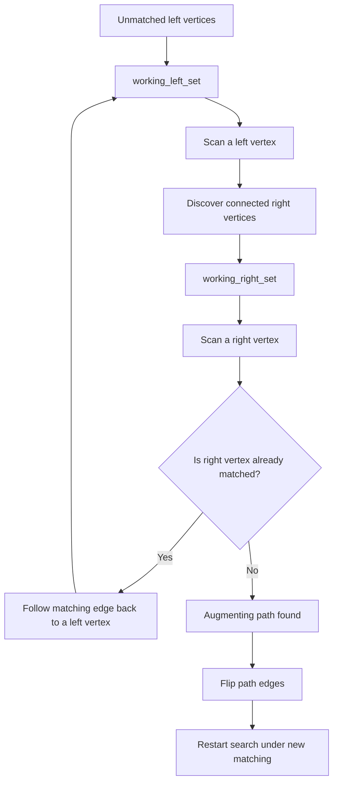

This is essentially a graph search over a derived alternating-edge structure.

The direction of traversal depends on which partition the search is currently visiting:

- left-to-right traversal considers available graph edges,
- right-to-left traversal follows current matching edges.

---

# 15. `ScanLeftVertex`

A left-side scan examines which right vertices can be reached from a particular left vertex.

The implementation loops over every right vertex:

```cpp
for (const auto& right_vertex : right_vertices) {
```

and tests whether the edge

```cpp
(left_vertex, right_vertex)
```

exists in the `edge_costs` map.

If not, the candidate is skipped.

If the edge exists and the right vertex has not previously been labeled, the code performs:

```cpp
right_labels[right_vertex] = left_vertex;
working_right_set.insert(right_vertex);
```

That does two things:

1. records the predecessor,
2. schedules the newly discovered right vertex for scanning.

Once all possible right-side neighbors have been examined, the left vertex is removed from the working set.

Conceptually:

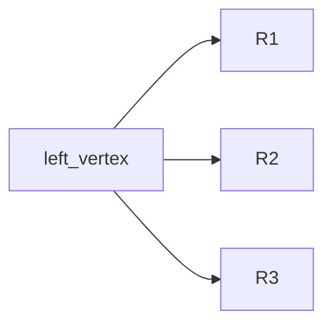

results in predecessor information resembling:

```text
right_labels[R1] = L
right_labels[R2] = L
right_labels[R3] = L
```

for previously unlabeled reachable vertices.

---

# 16. `ScanRightVertex`

Right-side scanning is the point where the search decides whether to continue or augment.

The function asks:

```cpp
GetMatchFromRight(right_vertex, matching)
```

There are two possibilities.

## 14.1 The Right Vertex Is Already Matched

Suppose:

$$
R_1
$$

is matched to

$$
L_2.
$$

The search has reached $R_1$ through an unmatched edge, but because $R_1$ is already occupied, the alternating-path rule says that the next step must follow its matched edge.

So the code records:

```cpp
left_labels[L2] = R1;
working_left_set.insert(L2);
```

This continues the search on the left side.


---

## 14.2 The Right Vertex Is Unmatched

If no left vertex is matched to the right vertex, then the search has reached an unmatched endpoint.

Because the search began from an unmatched left vertex, the predecessor chain now describes an augmenting path.

At this point, continuing the search would be unnecessary.

Instead, the algorithm reconstructs the path and changes the matching.

---

# 17. How Matching Augmentation Works

Suppose the search discovered the following alternating path:

$$
L_0
\rightarrow
R_0
\rightarrow
L_1
\rightarrow
R_1
\rightarrow
L_2
\rightarrow
R_2.
$$

Assume the old matching contains:

$$
(L_1,R_0)
$$

and

$$
(L_2,R_1).
$$

After augmentation, the new matching contains:

$$
(L_0,R_0),
$$

$$
(L_1,R_1),
$$

and

$$
(L_2,R_2).
$$

The old matched edges are removed and the previously unmatched edges are added.

The implementation first saves:

```cpp
auto old_matching = matching;
```

This snapshot matters because the live `matching` map is about to be modified.

Without the old copy, later iterations could no longer reliably determine whether a path edge was matched before augmentation.

The current code updates assignments incrementally while walking backward through the label maps.

This is operationally more complicated than the compact mathematical statement:

$$
M'=M\triangle P,
$$

but the effect is intended to be the same.

---

# 18. Why the Search State Is Reset

After augmentation,

$$
\lvert M\rvert\rightarrow \lvert M\rvert+1.
$$

The matching has changed.

But every label currently stored was discovered under the old matching.

That means the old alternating-search structure may no longer be valid.

For example, an edge that was previously a matching edge may now be unmatched, and vice versa.

Therefore the implementation clears:

- `working_left_set`,
- `working_right_set`,
- all left labels,
- all right labels.

Then it repopulates the left working set with left vertices that are still unmatched.

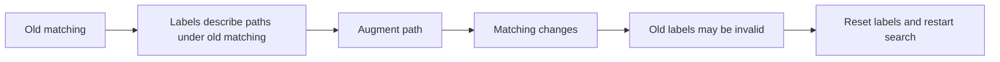

This reset makes the algorithm easier to reason about, at the cost of potentially repeating some search work.

---

# 19. `MaximumCardinalityMatching`

The conceptual return type is:

```cpp
std::optional<
    std::unordered_map<
        LeftVertex,
        std::optional<RightVertex>
    >
>
```

There are two different levels of optionality.

The inner:

```cpp
std::optional<RightVertex>
```

means:

> This particular left vertex may currently be unmatched.

The outer:

```cpp
std::optional<...>
```

means:

> The algorithm may fail to find a matching satisfying the requested completeness condition.

Those are semantically distinct.

The function performs approximately these stages:

1. validate that edge endpoints exist in the supplied vertex sets,
2. initialize matching and label maps,
3. greedily construct an initial matching,
4. repeatedly scan vertices and find augmenting paths,
5. stop when no search frontier remains,
6. verify that the smaller partition has been fully saturated,
7. return the matching or `std::nullopt`.

The greedy phase is an optimization, not the correctness mechanism.

The augmenting-path phase is what allows the algorithm to escape locally inconvenient choices.

---

# 20. What the Code Means by a "Perfect" Matching

Strictly speaking, a perfect matching in graph theory matches **every vertex**.

That normally requires:

$$
\lvert L\rvert=\lvert R\rvert.
$$

This implementation permits unequal partition sizes.

If

$$
\lvert L\rvert\le \lvert R\rvert,
$$

it requires every left vertex to be matched.

If

$$
\lvert R\rvert<\lvert L\rvert,
$$

it requires every right vertex to be matched.

Thus the actual condition is:

$$
\boxed{
\lvert M\rvert=\min(\lvert L\rvert,\lvert R\rvert)
}.
$$

A more precise description would be:

> A matching that saturates the entire smaller partition.

This terminology matters because readers familiar with graph theory may otherwise infer a stronger condition than the code actually enforces.

---

# 21. The Bottleneck Assignment Search

Once `MaximumCardinalityMatching` can answer the feasibility question, the outer problem becomes simpler.

For a threshold $T$, retain only edges satisfying:

$$
c(e)\le T.
$$

Then ask whether the resulting graph can saturate the smaller partition.

The optimal threshold is:

$$
\boxed{
T^\star
=
\min
\left\{
T
\mid
G_T
\text{ admits a matching of size }
\min(\lvert L\rvert,\lvert R\rvert)
\right\}.
}
$$

Notice that the matching itself matters, but the outer search can reason almost entirely in terms of the Boolean question:

$$
\text{feasible}(T)?
$$

That is what makes the optimization problem reducible to a threshold search.

---

# 22. Filtering Edges by Threshold

The helper `UpdateFilteredEdges` constructs the graph used by a feasibility test.

Given threshold $T$, it retains exactly those edges satisfying:

$$
c(e)\le T.
$$

Suppose edge costs are:

$$
\{2,4,7,9,12\}
$$

and

$$
T=7.
$$

The resulting graph contains only edges with costs:

$$
\{2,4,7\}.
$$

Edges costing $9$ or $12$ are treated as though they do not exist during this particular matching test.

This is important conceptually:

> The threshold does not modify the edge costs. It modifies which edges are allowed to participate.

---

# 23. Why Feasibility Is Monotonic

This is the mathematical property that makes the outer search possible.

Let:

$$
F(T)=
\begin{cases}
1,& \text{if a complete required matching exists at threshold }T,\\
0,& \text{otherwise.}
\end{cases}
$$

If:

$$
T_1<T_2,
$$

then every edge allowed under $T_1$ is also allowed under $T_2$.

Therefore:

$$
E_{T_1}\subseteq E_{T_2}.
$$

Adding edges cannot destroy a matching that already exists.

So:

$$
F(T_1)=1
\implies
F(T_2)=1.
$$

The Boolean sequence over increasing thresholds therefore has the form:

$$
0,0,0,\ldots,0,1,1,\ldots,1.
$$

The optimizer is searching for the transition:

$$
0\rightarrow1.
$$

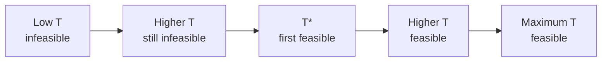

That transition threshold is exactly the bottleneck optimum.

---

# 24. Cost Bounds and Median Threshold Selection

The search begins with:

$$
c_{\text{lower}}
=
\min_{e\in E}c(e)
$$

and

$$
c_{\text{upper}}
=
\max_{e\in E}c(e).
$$

Rather than choosing the arithmetic midpoint

$$
\frac{c_{\text{lower}}+c_{\text{upper}}}{2},
$$

the algorithm chooses a median among remaining actual edge costs.

Why?

Suppose the candidate costs are:

$$
\{1,2,5,1000,50000\}.
$$

The numeric midpoint of the extremes is:

$$
25000.5.
$$

But nothing about the graph changes at threshold $25000.5$ compared with threshold $1000$, because there are no edge costs in between.

Feasibility changes only when the threshold crosses an actual edge cost.

So actual edge values are the meaningful search states.

Using the median attempts to discard roughly half of the remaining candidate costs after each feasibility test.

---

# 25. Updating the Search Bounds

Let the selected candidate threshold be $c_m$.

If matching succeeds at $c_m$, then $c_m$ is a valid upper bound on the optimum:

$$
c_u\leftarrow c_m.
$$

If matching fails, the optimum must be larger:

$$
c_l\leftarrow c_m.
$$

Thus:

$$
(c_l,c_u)
\leftarrow
\begin{cases}
(c_l,c_m), & F(c_m)=1,\\
(c_m,c_u), & F(c_m)=0.
\end{cases}
$$

This is the threshold-search equivalent of binary search.

The comparison is not against an ordered scalar target. Instead, it is against a monotonic feasibility predicate.

---

# 26. `GetBoundedEdges` vs. `UpdateFilteredEdges`

These two helpers both create edge subsets, but for completely different reasons.

This distinction is easy to miss.

| Function | Condition | Purpose |
|---|---|---|
| `UpdateFilteredEdges` | $c(e)\le T$ | Construct the graph on which matching is tested |
| `GetBoundedEdges` | $c_l<c(e)<c_u$ | Construct the set of threshold candidates still worth considering |

`filtered_edges` answers:

> Which edges may be used in a matching at threshold $T$?

`bounded_edges` answers:

> Which edge costs are still unresolved as possible thresholds?

They should not be thought of as two versions of the same filtering operation.

They live at different conceptual layers.

---

# 27. Complete Threshold-Search Example

Suppose the distinct candidate edge costs are:

$$
\{1,2,3,4,5,6,7,8,9\}.
$$

Assume the true minimum feasible threshold is:

$$
T^\star=6.
$$

Initially:

$$
c_l=1,
\qquad
c_u=9.
$$

The median candidate is:

$$
5.
$$

Suppose the graph formed by edges costing at most 5 has no complete matching.

Then:

$$
c_l=5.
$$

Now the unresolved candidate values are approximately:

$$
\{6,7,8\}.
$$

The median is:

$$
7.
$$

Suppose threshold 7 is feasible.

Then:

$$
c_u=7.
$$

Only:

$$
6
$$

remains strictly between the bounds.

Suppose threshold 6 is feasible.

Then:

$$
c_u=6.
$$

No candidate values remain inside:

$$
5<c<6.
$$

So the optimum is:

$$
\boxed{T^\star=6}.
$$

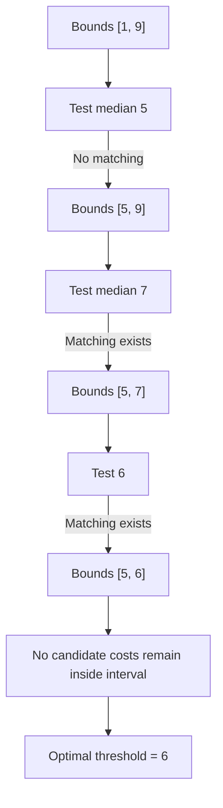

The important idea is that matching is acting as an oracle:

```text
threshold -> feasible / infeasible
```

The outer algorithm uses that answer to narrow the search interval.

---

# 28. Why `c_lower` Is Tested Again

`GetBoundedEdges` uses strict inequalities:

$$
c_l<c(e)<c_u.
$$

Therefore, once a value becomes the lower bound, it is excluded from future `bounded_edges` candidate sets.

But that does not necessarily mean it was already tested under every path through the search logic.

The implementation therefore performs an explicit final feasibility check at `c_lower` when it could improve the current best threshold.

This is a boundary-condition correction.

It reflects a general lesson in binary-search-style algorithms:

> When the maintained interval and candidate set use different inclusive/exclusive conventions, boundary values require special care.

---

# 29. The Full-Graph Fallback

If no feasible threshold has been saved, the implementation performs a final matching test using all edges up to the maximum observed cost.

That is effectively the complete input graph.

If no required matching exists even there, then no threshold can possibly work.

Why?

Because no larger threshold would introduce any additional edges.

So failure on the complete graph proves infeasibility.

However, the source comments reportedly describe this fallback as compensating for a suspected bug in the threshold search.

That is important from a software-engineering perspective.

The fallback may recover a valid matching, but its existence means the main search logic deserves stronger correctness testing.

A particularly good strategy would be exhaustive small-instance comparison with a brute-force reference solver.

---

# 30. C++ Language Features Used

## 28.1 Function Templates

Example:

```cpp
template <
    typename LeftVertex,
    typename RightVertex,
    typename V
>
```

This means the function is not tied to a particular concrete vertex or cost type.

The compiler generates a concrete specialization when the function is instantiated.

For example:

```cpp
MaximumCardinalityMatching<
    int,
    std::string,
    double
>(...);
```

would imply:

```text
LeftVertex  = int
RightVertex = std::string
V           = double
```

Generic programming is useful here because graph algorithms conceptually do not care whether a vertex is represented by an integer, enum, string, or application-specific type.

---

## 28.2 `std::optional`

`std::optional<T>` represents either:

$$
T
$$

or

$$
\text{no value}.
$$

For example:

```cpp
std::optional<RightVertex> match;
```

can mean either:

```text
this left vertex is matched
```

or:

```text
this left vertex is not matched
```

The empty value is represented with:

```cpp
std::nullopt
```

This is semantically safer than choosing a magic sentinel such as `-1`, empty string, or a special enum value.

---

## 28.3 Structured Bindings

This syntax:

```cpp
for (const auto& [edge, cost] : edge_costs) {
```

decomposes each key-value map element into two local names.

Conceptually it replaces:

```cpp
for (const auto& item : edge_costs) {
    const auto& edge = item.first;
    const auto& cost = item.second;
}
```

Structured bindings are especially useful when working with maps and pairs.

---

## 28.4 `auto`

Example:

```cpp
auto matching_opt =
    MaximumCardinalityMatching(...);
```

The compiler determines the exact type from the right-hand side.

This is useful because the inferred type may otherwise be something long like:

```cpp
std::optional<
    std::unordered_map<
        LeftVertex,
        std::optional<RightVertex>
    >
>
```

Using `auto` avoids repeating the type while preserving static typing.

---

## 28.5 Lambda Expressions

Example:

```cpp
const auto by_cost =
    [](const auto& lhs, const auto& rhs) {
        return lhs.second < rhs.second;
    };
```

This creates an anonymous callable object.

It answers the comparison question:

> Does `lhs` have a lower cost than `rhs`?

It can then be passed to algorithms such as:

```cpp
std::min_element
std::max_element
```

Because its parameters are declared with `auto`, it is a generic lambda.

---

## 28.6 `std::tie`

Suppose:

```cpp
UpdateCostBounds(...)
```

returns:

```cpp
std::pair<V,V>.
```

The code can write:

```cpp
std::tie(c_lower, c_upper) =
    UpdateCostBounds(...);
```

This assigns:

```text
pair.first  -> c_lower
pair.second -> c_upper
```

without introducing a temporary named pair.

Conceptually it is equivalent to:

```cpp
auto bounds = UpdateCostBounds(...);

c_lower = bounds.first;
c_upper = bounds.second;
```

---

## 28.7 Alternative Operator Tokens

C++ defines word-based alternatives for several symbolic operators.

For example:

```cpp
not x
```

means the same thing as:

```cpp
!x
```

and:

```cpp
a and b
```

means:

```cpp
a && b
```

These are part of the language.

They are not macros and do not require a special header.

---

# 31. Hidden Type Requirements

The templates look unrestricted:

```cpp
template <typename LeftVertex, typename RightVertex, typename V>
```

but the implementation imposes real requirements.

For a type used as a key in:

```cpp
std::unordered_map
```

or:

```cpp
std::unordered_set,
```

the type must support hashing and equality.

Conceptually:

$$
\texttt{std::hash<T>}
$$

must be usable, and comparisons for equality must work.

The edge key is a pair:

```cpp
std::pair<LeftVertex, RightVertex>
```

so that composite key must also be hashable under the project's environment.

The cost type `V` must support the operations actually used by the code.

At minimum, that includes behavior compatible with:

$$
<,
\quad
\le,
\quad
+,
\quad
/.
$$

Modern C++20 concepts could express some of these constraints directly in the function interface.

That would improve compiler diagnostics by turning accidental template-instantiation failures into explicit contract violations.

---

# 32. Important Algorithmic Invariants

Understanding invariants makes the implementation much easier to reason about.

## 30.1 Matching Invariant

A matching may never assign one vertex twice.

For any two distinct selected edges:

$$
(l_1,r_1),(l_2,r_2)\in M,
$$

we require:

$$
l_1\ne l_2
$$

and:

$$
r_1\ne r_2.
$$

---

## 30.2 Label Invariant

A populated label records a predecessor in the current alternating search.

For example:

$$
\text{right\_labels}[r]=l
$$

means the search reached $r$ from $l$.

Labels are meaningful only relative to the current matching.

That is why they are reset after augmentation.

---

## 30.3 Working-Set Invariant

A vertex in a working set has been discovered but has not yet been completely scanned.

This gives the sets queue-like semantics even though the implementation uses `unordered_set`.

---

## 30.4 Threshold Invariant

Every edge in `filtered_edges` must satisfy:

$$
c(e)\le T.
$$

So any matching found in that graph automatically has bottleneck value at most $T$.

---

## 30.5 Bound Invariant

The search attempts to maintain lower and upper values surrounding the feasibility transition.

Conceptually:

```text
lower side -> known or suspected infeasible
upper side -> known feasible or best current upper region
```

Understanding exactly how this invariant is maintained is important when analyzing the suspected threshold-search edge case.

---

# 33. Complexity

Let:

$$
L=|V_L|,
$$

$$
R=|V_R|,
$$

and

$$
E=\lvert E\rvert.
$$

## 31.1 Median Threshold Search

Median splitting aims to reduce the number of unresolved edge-cost candidates by approximately half per iteration.

That suggests approximately:

$$
O(\log E)
$$

matching feasibility tests in the ideal case.

Each test, however, is relatively expensive.

---

## 31.2 Left-Vertex Scanning

`ScanLeftVertex` iterates across every right vertex and asks whether each potential edge exists.

That means one scan costs approximately:

$$
O(R)
$$

hash lookups.

If the graph is sparse and a left vertex has only a few actual neighbors, most iterations are wasted.

An adjacency list could reduce this to:

$$
O(\deg(l)).
$$

---

## 31.3 Reverse Matching Lookup

`GetMatchFromRight` scans all left-side matching entries.

Therefore each reverse lookup costs approximately:

$$
O(L).
$$

Maintaining a second mapping:

```text
RightVertex -> LeftVertex
```

could reduce average lookup cost to:

$$
O(1).
$$

---

## 31.4 Comparison With Hopcroft-Karp

A standard high-performance algorithm for maximum bipartite matching is Hopcroft-Karp.

Its complexity is:

$$
O(E\sqrt{V}),
$$

where:

$$
V=L+R.
$$

The current implementation appears optimized more for direct correspondence with the textbook labeling algorithm than for asymptotically optimal performance.

That can be a reasonable tradeoff if:

- input sizes are modest,
- code clarity relative to the reference algorithm is important,
- matching is not the dominant runtime cost.

---

# 34. Design Strengths

## 32.1 Strong Problem Decomposition

The best architectural feature is the separation between:

$$
\text{threshold optimization}
$$

and:

$$
\text{matching feasibility}.
$$

This mirrors the mathematics and makes each subproblem easier to reason about.

---

## 32.2 Explicit Missing-State Representation

Using:

```cpp
std::optional
```

makes unmatched state visible in the type system.

That is preferable to relying on magic values.

---

## 32.3 Helper Functions Correspond to Mathematical Operations

Functions such as:

```text
UpdateFilteredEdges
GetBoundedEdges
UpdateCostBounds
```

have meanings that closely match the algorithm description.

That reduces the semantic gap between the implementation and the mathematical pseudocode.

---

## 32.4 Augmenting-Path Logic Is General

The matching stage is not tied to a particular greedy ordering.

Even if the initial greedy choices are poor, augmenting paths allow the algorithm to repair and rearrange them.

That is the core reason the matcher can find maximum-cardinality solutions rather than merely maximal greedy ones.

---

# 35. Design Weaknesses and Review Concerns

## 33.1 Reverse Lookup Is Expensive

The one-directional matching representation makes right-to-left lookup linear in the number of left vertices.

A bidirectional representation would likely be cleaner and faster:

```cpp
unordered_map<LeftVertex, optional<RightVertex>> left_to_right;
unordered_map<RightVertex, optional<LeftVertex>> right_to_left;
```

---

## 33.2 Adjacency Is Represented Indirectly

Instead of iterating actual neighbors, `ScanLeftVertex` loops over all right vertices and tests whether an edge exists.

For sparse graphs, this is inefficient.

An adjacency list such as:

```cpp
unordered_map<
    LeftVertex,
    vector<RightVertex>
>
```

would more directly represent graph topology.

---

## 33.3 Nested `optional` Semantics Are Hard to Read

The function can conceptually return:

```text
optional<map<LeftVertex, optional<RightVertex>>>
```

The outer absence and inner absence mean different things.

This is legal but cognitively heavy.

A custom result structure could make the API easier to interpret.

---

## 33.4 Error Conditions Are Conflated

Several logically distinct states collapse to:

```cpp
std::nullopt.
```

Examples include:

- malformed graph input,
- empty input,
- no feasible complete matching.

A typed error system would distinguish these cases.

For example:

```cpp
enum class AssignmentError {
    EmptyGraph,
    InvalidVertex,
    NoFeasibleMatching,
};
```

or a modern `std::expected`-style result.

---

## 33.5 "Perfect Matching" Terminology Is Potentially Misleading

The implementation requires:

$$
\lvert M\rvert=\min(\lvert L\rvert,\lvert R\rvert),
$$

not necessarily that every vertex in both partitions be matched.

Using more precise terminology would reduce confusion for readers familiar with graph theory.

---

## 33.6 The Threshold Fallback Indicates a Correctness Concern

The most significant review concern is that the implementation reportedly contains a fallback whose own comment suggests the threshold search may contain a bug.

That does not automatically mean the final returned answer is wrong, but it weakens confidence in the proof structure of the implementation.

This area deserves exhaustive testing.

For small graphs, a brute-force oracle is practical:

1. enumerate all legal matchings,
2. keep those saturating the required partition,
3. compute each matching's maximum edge cost,
4. take the minimum,
5. compare with `BottleneckAssignment`.

Any discrepancy becomes a concrete regression test.

---

# 36. A Simpler Mental Model

If the implementation feels complicated, ignore the C++ temporarily and reduce it to two algorithms.

## Outer Algorithm

```text
For a candidate cost threshold T:

    keep only edges costing <= T

    ask whether a complete assignment exists

If yes:
    try a smaller threshold

If no:
    try a larger threshold
```

The objective is to locate the smallest threshold for which the answer changes to "yes."

---

## Inner Algorithm

```text
Start with some matching.

Search for an augmenting path.

If one exists:
    flip matched/unmatched edges along the path
    matching size increases by one

Repeat until no augmentation is possible.
```

This gives the compact identity:

$$
\boxed{
\text{Linear Bottleneck Assignment}
=
\text{Monotonic Threshold Search}
+
\text{Augmenting-Path Matching}
}
$$

---

# 37. Suggested Improvements

A stronger production implementation could consider:

1. maintaining both left-to-right and right-to-left match maps,
2. representing graph adjacency explicitly,
3. expressing template requirements with C++20 concepts,
4. replacing ambiguous `std::nullopt` errors with typed results,
5. renaming the generalized "perfect matching" condition,
6. using sorted distinct edge costs for a simpler threshold binary search,
7. adding exhaustive small-graph correctness tests,
8. comparing against brute-force assignment enumeration,
9. considering Hopcroft-Karp for larger graphs,
10. avoiding full matching copies during path augmentation if profiling shows that cost matters.

A particularly simple threshold strategy would be:

1. collect all distinct edge costs,
2. sort them,
3. binary-search their indices,
4. run the feasibility matcher at each selected cost.

That approach may use a conventional:

$$
O(E\log E)
$$

initial sort, but its correctness argument is straightforward and it eliminates several boundary-management complications.

---

# 38. Summary

The code solves a weighted bipartite assignment problem whose objective is not minimum total cost, but minimum **worst selected edge cost**.

Formally:

$$
\boxed{
\min_M \max_{e\in M} c(e)
}
$$

subject to the matching saturating the smaller partition.

The implementation solves this by repeatedly choosing a threshold $T$, retaining edges satisfying:

$$
c(e)\le T,
$$

and running a maximum-cardinality matching algorithm.

Matching feasibility is monotonic in the threshold because larger thresholds only add edges.

The matching solver itself grows the assignment through augmenting paths. Labels store predecessor relationships, working sets store the search frontier, and path augmentation increases matching cardinality by one.

The two fundamental ideas are therefore:

$$
\boxed{
\text{Augmenting paths solve matching}
}
$$

and:

$$
\boxed{
\text{Monotonic threshold search solves the bottleneck objective}
}
$$

Combined:

$$
\boxed{
\text{LBAP}
=
\text{threshold search}
+
\text{maximum-cardinality bipartite matching}.
}
$$

That is the conceptual structure to keep in mind when reading the implementation.
