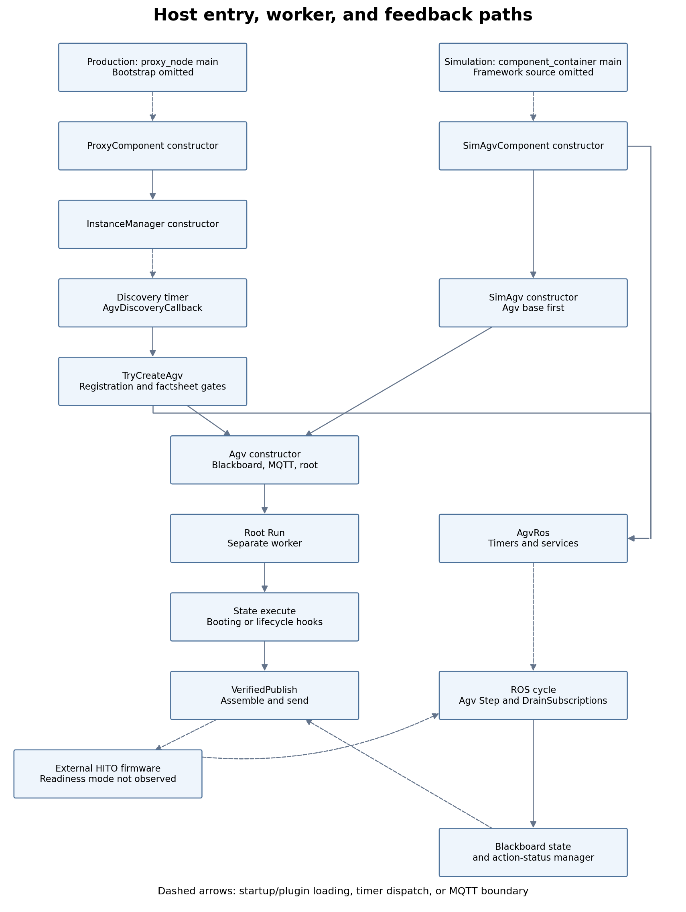

# SW2-876 — Background and existing execution

[Problem and proposed solution](SW2-876-problem-and-solution.md)

Source status: this revision is checked against the attached `agvhito-repomix(1).md`. Its paths are package-relative; this document uses full-checkout paths prefixed with `src/agvhito/`. Launcher and `yasminx` excerpts retained from the previous analysis are historical context: their source pack is not attached here. Proposed C++ snippets and tests have not been built.

## Terminology

| Term | Meaning here |
| --- | --- |
| AGV | Automated guided vehicle; the physical HITO robot. |
| HITO | Vendor/project label in this source; its formal expansion is not supplied. |
| ROS 2 | Robot Operating System 2; provides service requests and callbacks. |
| MQTT | Broker-based publish/subscribe protocol, historically MQ Telemetry Transport; carries robot orders and instant actions. |
| VDA5050 | VDA = Verband der Automobilindustrie, the German Association of the Automotive Industry; 5050 is the robot communication specification number. |
| YASMIN | Yet Another State MachINe; the upstream control-state library. |
| yasminx | Volley's C++ extension layer over YASMIN. |
| SM / bb | State machine / blackboard; shared state-machine data. Exact source identifiers retain these abbreviations. |
| API | Application programming interface. |
| ID / GUID | Identifier / globally unique identifier; action IDs correlate commands with firmware status. |
| QoS | Quality of service; MQTT/ROS delivery policy. |
| E-stop | Emergency stop. A hardware E-stop and a requested software E-stop are distinct mechanisms. |
| UTC | Coordinated Universal Time; the supplied firmware log uses UTC+8. |
| ms / s | Milliseconds / seconds. |
| YAML | YAML Ain’t Markup Language; configuration format, not the definition of this state graph. |
| RAII | Resource acquisition is initialization; C++ scope-based resource lifetime management. |
| JSON | JavaScript Object Notation; the serialized protocol payload format. |
| GoogleTest / CMake / colcon | C++ testing framework / build-system tool / ROS workspace build tool. |

`startPause`, `stopPause`, `auto_run`, `FINISHED`, and `FAILED` are exact protocol or firmware identifiers. `stdx::Expected` is the repository's value-or-error result type, not necessarily `std::expected`.

## 1. Start with the command sequence, not the state diagram

Read these files first, in this order. Paths are relative to the repository root; the Repomix extraction is a snapshot and does not establish the current checkout's commit.

| Order | Repository file and symbols | Why start here? |
| --- | --- | --- |
| 1 | `src/agvhito/src/sm/context_utils.cpp`: both `VerifiedPublish` overloads, `VerifyState` | Establish precisely what “verified” means. Instant-action verification waits for each action ID to report `FINISHED`; order verification waits for the robot to echo the order ID. Neither establishes `auto_run` readiness. |
| 2 | `src/agvhito/src/sm/booting_state.cpp`: `BootingState::Execute` | Find the first boot unpause and the following map operations. |
| 3 | `src/agvhito/src/sm/execution_paused_state.cpp`: `OnEntry`, `Step`, `OnExit` | Find explicit pause and resume, and their relationship to state transitions. |
| 4 | `src/agvhito/src/sm/executing_order_state.cpp`: `OnEntry`, `VerifiedUnpause` | Find the redundant order-start unpause and subsequent map/order publication. |
| 5 | `src/agvhito/src/sm/idle_state.cpp`, `stopped_state.cpp`, `error_state.cpp`, `execution_recovery_state.cpp` | Inventory automatic pauses, software-stop activation, and software-stop release. Recovery is an additional case absent from the ticket's removal list. |
| 6 | `src/agvhito/src/agv.cpp`: `RequestPause`, `RequestResume`, `RequestSoftEStop`, `Step`; `src/agvhito/src/agv_ros.cpp`: `SetupServiceServers` | Separate state-machine policy from explicit stop services and terminal-failure behavior. |
| 7 | `src/core/yasminx/src/lifecycle_state.cpp`, `root_state_machine.cpp` | Understand cancellation, `OnExit`, the worker thread, and shutdown before adding a wait. |

Use the checkout to repeat the inventory before editing:

```bash
rg -n 'MakeStartPauseAction|MakeStopPauseAction|MakeSoftEStopAction|VerifiedUnpause' \
  src/agvhito/include src/agvhito/src
```

Also read `src/agvhito/include/agvhito/sm/state_strings.hpp` and `src/agvhito/src/sm/root.cpp`. The former defines C++ outcome-to-state transition maps; the latter registers concrete state objects with those maps. The architecture is compiled C++, not YAML. This proposal changes state behavior and helper functions while preserving the nine-state routing graph.

### 1.0 From executable `main()` to robot control: two host paths

**There is no hand-written AGV `main()` body in the supplied pack.** `agvhito` defines ROS components and asks a build helper to provide standalone executables. Production launches `proxy_node`; the supplied simulation launch instead starts the framework-owned `rclcpp_components/component_container`, which loads `SimAgvComponent`. `sim_agv_node` is also declared as a standalone executable, but that is not the executable selected by this simulation launch.

The exact standalone `main()` implementation, the `volley_add_component` macro implementation and the container's `main()` are outside the pack. Do not invent a source filename or executor selection for production. The diagram starts at these executable entry boundaries, then shows confirmed constructors, callbacks and the worker. Dotted edges cross process startup/plugin loading, timer dispatch or MQTT, so the whole diagram is a **call path**, not a single uninterrupted C++ stack trace.



Editable Mermaid source (shown as text so VS Code does not need to generate SVG):

```text
flowchart TB
    P["Production: proxy_node main; bootstrap omitted"]
    S["Simulation: component_container main; framework source omitted"]
    PC["ProxyComponent constructor"]
    IM["InstanceManager constructor"]
    D["Discovery timer: AgvDiscoveryCallback"]
    TC["TryCreateAgv: registration and factsheet gates"]
    SC["SimAgvComponent constructor"]
    SA["SimAgv constructor: Agv base first"]
    A["Agv constructor: blackboard, MQTT, root"]
    R["AgvRos: timers and services"]
    W["Root Run: separate worker"]
    B["State execute: Booting or lifecycle hooks"]
    PUB["VerifiedPublish: assemble and send"]
    F["External HITO firmware; readiness mode not observed"]
    CY["ROS cycle: Agv Step and DrainSubscriptions"]
    BB["Blackboard state and action-status manager"]
    P -.-> PC
    PC --> IM
    IM -.-> D
    D --> TC
    TC --> A
    TC --> R
    S -.-> SC
    SC --> SA
    SA --> A
    SC --> R
    A --> W
    W --> B
    B --> PUB
    PUB -.-> F
    R -.-> CY
    F -.-> CY
    CY --> BB
    BB -.-> PUB
```

The firmware box describes the physical production path. In simulation, `SimAgv` and `SimMqttClient` replace that external robot/transport boundary; the shared adapter and state-machine code still execute. `AgvRos` contains per-robot mutually exclusive ROS callbacks, while the root worker runs independently.

#### Production entry selection and component registration

`src/launcher/launcher/central_nodes.py`, function `get_standalone_nodes(params)`, selects the executable only for non-simulation runs:

```python
def get_standalone_nodes(params):
    # ... other standalone nodes omitted ...
    if not params.get("is_simulation"):
        launch_description_entities.append(
            Node(
                package="agvhito",
                executable="proxy_node",
                name=PROXY_NAME,
                # ... parameters and remappings omitted ...
            )
        )
    return launch_description_entities
```

**File:** `src/agvhito/CMakeLists.txt`  
**Build scope:** proxy component/executable declaration, excerpt:

```cmake
volley_add_component(
  ${PROJECT_NAME}_proxy_component
  src/instance_manager.cpp
  src/proxy_component.cpp
  PLUGIN "volley::agvhito::ProxyComponent"
  EXECUTABLE proxy_node
  LINK_LIBRARIES
    ${PROJECT_NAME}_agv_ros_lib
    ${PROJECT_NAME}_comms_lib
    ${PROJECT_NAME}_topics_lib
)
```

`src/agvhito/src/proxy_component.cpp` ends with `RCLCPP_COMPONENTS_REGISTER_NODE(volley::agvhito::ProxyComponent)`. That registration exposes the component to the ROS loading machinery; it is not the robot's business-logic loop. The constructor creates the node and, after layout/connection configuration, its manager:

```cpp
// File: src/agvhito/src/proxy_component.cpp
ProxyComponent::ProxyComponent(const rclcpp::NodeOptions& options) {
  const auto node = std::make_shared<volley::Node>("hito_proxy", options);
  SetNode(node);
  // ... layout, firmware-version and connection parameter checks omitted ...
  instance_manager_ = std::make_unique<InstanceManager>(InstanceManager::Context {
      .node = node,
      // ... layout, connection options, speed and firmware specification omitted ...
  });
}
```

This shortened constructor preserves the relevant calls; it is not the complete aggregate initialization. `InstanceManager::InstanceManager(Context)` connects MQTT, initializes maps, subscribes to central registration state, and installs a two-second discovery timer. Discovery calls `TryCreateAgv`; it does not create a managed robot until central tracks it and its factsheet/firmware checks pass:

```cpp
// File: src/agvhito/src/instance_manager.cpp
InstanceManager::InstanceManager(Context context) : context_(std::move(context)) {
  // ... MQTT, maps, subscriptions and service client setup omitted ...
  agv_discovery_timer_ = context_.node->create_timer(
      2s, [this]() { AgvDiscoveryCallback(); });
  // ... health and factsheet timers omitted ...
}

void InstanceManager::AgvDiscoveryCallback() {
  // ... identify reported robots and populate pending_agvs_ omitted ...
  std::erase_if(pending_agvs_, [this](auto& entry) {
    return TryCreateAgv(entry.second);
  });
  // ... diagnostics omitted ...
}

bool InstanceManager::TryCreateAgv(PendingAgv& pending_agv) {
  const AgvId id = pending_agv.id;
  // ... central registration, factsheet and firmware gates omitted ...
  auto sub_node = context_.node->create_sub_node(std::format("agv/a{}", id));
  auto agv = std::make_unique<Agv>(id, Agv::Context {
      // ... clock, layout, publisher connection and map configuration omitted ...
  });
  agvs_.emplace(id, std::make_unique<AgvRos>(std::move(agv), std::move(sub_node)));
  return true;
}
```

#### Simulation entry selection

**File:** `src/launcher/launcher/sim_nodes.py`  
**Function:** `get_sim_launch_description_entities(...)`, relevant excerpts:

```python
def get_sim_launch_description_entities(
    params,
    initial_conditions,
    scenario_filepath,
    record_artifacts=True,
    artifacts_output_dir=None,
    artifact_basename=None,
    run_visualization=True,
    run_rviz=True,
    use_remote_meshes=False,
    remote_mesh_prefix=None,
    real_time_factor=1.0,
):
    # ... scenario loading and other component descriptions omitted ...
    for agv in agvs:
        agv_id = agv["id"]
        composable_nodes.append(
            ComposableNode(
                package="agvhito",
                plugin="volley::agvhito::sim::SimAgvComponent",
                # ... robot namespace and initial-state parameters omitted ...
            )
        )
    # ... other launch actions omitted ...
    sim_node = ComposableNodeContainer(
        name="sim_nodes",
        package="rclcpp_components",
        executable="component_container",
        arguments=["--executor-type", "multi-threaded"],
        # ... descriptions, namespace and output configuration omitted ...
    )
    launch_description_entities.append(sim_node)
    # ... remaining launch actions and return omitted ...
```

The launch description selects the process and plugin; its Python function is not a C++ `main()`. Plugin construction calls `SimAgvComponent::SimAgvComponent`, which builds maps/context/options, then constructs `SimAgv` and `SimAgvRos`. `SimAgv::SimAgv` first invokes the base `Agv` constructor, so the shared state-machine path begins there. It then initializes simulated robot state and its local protocol subscriptions.

#### After construction: two execution paths cooperate

The following adapter excerpt shows where ROS callbacks are installed. Production creates `AgvRos`; simulation uses `SimAgvRos`, derived from it.

```cpp
// File: src/agvhito/src/agv_ros.cpp
AgvRos::AgvRos(AgvUPtr agv, rclcpp::Node::SharedPtr node) :
    agv_(std::move(agv)),
    logger_(agv_->GetLogger()),
    node_(std::move(node)),
    callback_group_(node_->create_callback_group(
        rclcpp::CallbackGroupType::MutuallyExclusive)),
    is_terminal_(false) {
  SetupPublishers();
  SetupServiceServers();
  // ... initial version report omitted ...
}

void AgvRos::SetupPublishers() {
  timers_.cycle = node_->create_timer(
      kCyclePeriod, [this]() { CycleCallback(); }, callback_group_);
  // ... report publishers and other timers omitted ...
}

void AgvRos::CycleCallback() {
  const auto step = agv_->Step();
  // ... fault reporting and callback reset if Step fails omitted ...
}

// File: src/agvhito/src/agv.cpp
stdx::Result Agv::Step() {
  const auto pre_step = PreStep();
  if(!pre_step.has_value()) {
    return stdx::Unexpected(pre_step.error());
  }
  DrainSubscriptions();
  ReportMessageStaleness();
  // ... terminal/PostStep checks and failure handling omitted ...
  return step_result;
}
```

`kCyclePeriod` is 50 ms. `step_result` is declared in the omitted body; the excerpt is not a replacement implementation. The cycle drains feedback into shared trackers/managers. Independently, `RootStateMachine::Run` calls the graph on its worker, which invokes a concrete state's execution path and waits on those shared observations. **The ROS cycle does not directly call `BootingState::Execute` every 50 ms.**

To locate actual bootstrap bodies in a complete checkout, inspect `volley_add_component` and generated build sources rather than search for a nonexistent AGV handwritten main:

```bash
rg -n 'volley_add_component|int main\(' src build/agvhito
rg -n 'int main\(|executor|spin' build/agvhito
```

Run those in a built checkout; `build/agvhito` is not included in the pack and might not yet exist. The missing bootstrap implementation limits what this document can assert about production executor details, but not the confirmed business-logic path from the component constructor onward.

### 1.1 Read the existing execution as three separate acknowledgments

The following snippets are **existing source excerpts**, not the proposed replacements in sections 3–5 of the [problem and solution](SW2-876-problem-and-solution.md). Every function excerpt identifies its file, qualified function name and actual signature. Some show only relevant statements inside that function; explicit omission comments mark missing code. Signatures and enclosing scopes are retained to make each excerpt easy to locate; omitted statements mean these are not replacement implementations. They are context, not standalone compilable examples.

| Boundary | Existing code observes | What that observation does not establish |
| --- | --- | --- |
| Host transport | The MQTT publish future returns `PublishResult::Ok`. | That firmware accepted/executed the action, or is ready for another operation. |
| Robot action report | The matching action ID reports `ActionStatus::FINISHED`. | That the firmware's delayed transition into `auto_run` is complete. |
| Reported state | A nonstale state satisfies `PausedIs(false)` and, at boot, no E-stop. | That maps/orders are accepted at this exact instant. |

**The central defect is an incorrect readiness condition.** The C++ does serialize calls, but serializing after an acknowledgment that arrives too early still permits the next command to race the firmware. Separately, automatic pause/software-stop commands keep otherwise inactive robots in firmware modes that the ticket says prevent low-power standby.

### 1.2 Startup creates shared data, transport, and a separate worker

The `Agv` constructor initializes the blackboard before subscribing and starting the state machine. `SetupStateMachine` constructs the registered graph and calls `Run`:

**File:** `src/agvhito/src/agv.cpp`  
**Function:** `Agv::Agv` (existing source excerpt)

```cpp
Agv::Agv(AgvId id, Context context) :
    id_(id),
    hito_serial_number_(std::to_string(id_)),
    context_(std::move(context)),
    instant_assembler_((nullptr != context_.instant_assembler)
                           ? context_.instant_assembler
                           : std::make_shared<InstantActionAssembler>(id_, context_.clock)),
    order_assembler_(std::make_unique<OrderAssembler>(
        OrderAssembler::Config {context_.layout, context_.floor_map_ids, context_.speed_limits})),
    blackboard_(std::make_shared<yasmin::Blackboard>()) {
  InitializeBlackboard();
  SetupMqtt();
  SetupStateMachine();
  // ... initial state-request publication omitted ...
}
```

**File:** `src/agvhito/src/agv.cpp`  
**Function:** `Agv::SetupStateMachine` (existing source excerpt)

```cpp
void Agv::SetupStateMachine() {
  state_machine_ = sm::MakeRootStateMachine(context_.clock, context_.logger);

  state_machine_->Run(blackboard_);
}
```

`InitializeBlackboard` installs the action-state manager, tracked robot state, action assembler, order queue and MQTT publisher. States read those shared objects by typed keys. `src/agvhito/src/sm/root.cpp` registers `BootingState` first and binds each concrete class to its transition map. `Run` starts the graph on its own worker:

**File:** `src/core/yasminx/src/root_state_machine.cpp`  
**Function:** `RootStateMachine::Run` (existing source excerpt)

```cpp
void RootStateMachine::Run(yasmin::Blackboard::SharedPtr blackboard) {
  // Return early if the thread is already running.
  if(thread_.joinable()) {
    return;
  }
  thread_ = std::jthread([this, blackboard = std::move(blackboard)]() {
    try {
      (*this)(blackboard);
    }
    catch(const yasmin::StateMachineCancelException&) {  // NOLINT(bugprone-empty-catch)
      // cancel_state_machine() aborts the execution loop by throwing, which is the expected clean shutdown.
    }
    catch(const std::exception& ex) {
      // In the event this exception was not caused by rclcpp signal handler, make sure to report the
      // exception
      if(!is_canceled() && rclcpp::ok()) {
        LOG_FATAL(context_.logger, "State machine '{}' aborted: {}", get_name(), ex.what());
        // Bypass StateMachine::cancel_state, which leaves is_canceled() false once the loop is dead.
        yasmin::State::cancel_state();  // NOLINT(bugprone-parent-virtual-call)
      }
    }
  });
}
```

Here `(*this)(blackboard)` invokes the upstream state-machine execution interface. The enclosing `std::jthread` belongs to the root; execution is asynchronous with respect to the constructor and ROS callbacks. The worker may wait for telemetry while the ROS cycle continues to drain incoming messages. This separation is why the proposed delay belongs on this worker: sleeping in a ROS callback could obstruct the very feedback needed for verification.

### 1.2a `State` versus `LifecycleState`: execution body versus polling lifecycle

The exact class spelling is **`LifecycleState`**, not `LifeCycleState`. There are three layers: upstream `yasmin::State`, Volley `yasminx::State`, and Volley `yasminx::LifecycleState`.

| Type | Source | What a concrete subclass implements | Who manages repeated work? |
| --- | --- | --- | --- |
| `yasmin::State` | Upstream YASMIN, implementation not supplied | Upstream execution contract. | Upstream routing/execution framework. |
| `yasminx::State` | `src/core/yasminx/include/yasminx/state.hpp` and `src/core/yasminx/src/state.cpp` | `Execute(blackboard, from_transition)` returning an outcome or structured error. | The concrete `Execute` body; the base does not add periodic polling. |
| `yasminx::LifecycleState` | `src/core/yasminx/include/yasminx/lifecycle_state.hpp` and `src/core/yasminx/src/lifecycle_state.cpp` | Required `Step`; optional `OnEntry` and `OnExit`. | A final `Execute` implementation owns entry, repeated steps, rate sleep and exit. |

`State` is not necessarily non-blocking or instantaneous. `BootingState` derives directly from it and performs its own telemetry waits and verified action/map calls inside one `Execute` invocation. The other eight AGV control states derive from `LifecycleState` because they repeatedly inspect state/requests until a condition yields a transition. This custom state lifecycle is unrelated to the managed ROS lifecycle-node API.

**File:** `src/core/yasminx/src/state.cpp`  
**Function/scope:** `State::execute`

```cpp
Outcome State::execute(yasmin::Blackboard::SharedPtr blackboard) {
  // Get the from transition that got us here (if it exists)
  Transition from_transition;
  if(const auto transition = bb::Get(*blackboard, bb::kTransition)) {
    from_transition = transition.value();
  }
  // Execute the state providing the transition details
  auto step = Execute(blackboard, from_transition);
  if(step.has_value()) {
    return std::move(step).value();
  }
  const yasminx::ErrorOutcome& error_outcome = step.error();
  const std::string state_name = GetName();
  LOG_ERROR(GetLogger(), "Caught error outcome in '{}': {}", state_name, error_outcome);
  // Put the error information on the shared blackboard
  bb::Set(*blackboard, bb::kStateError, {.state_name = state_name, .error = error_outcome.error});
  return error_outcome.outcome;
}
```

The lowercase `execute` is the framework entry point and is declared `final` in the header. It reads the previous transition and invokes the virtual capitalized `Execute`. Success returns the transition outcome; an error stores detailed diagnostic data on the blackboard and returns the error's routing outcome. A derived class overrides `Execute`, not `execute`.

**File:** `src/core/yasminx/src/lifecycle_state.cpp`  
**Function/scope:** `LifecycleState::Execute`

```cpp
stdx::Expected<Outcome, ErrorOutcome> LifecycleState::Execute(
    yasmin::Blackboard::SharedPtr blackboard, const Transition& from_transition) {
  step_rate_.reset();
  if(auto on_entry = OnEntry(blackboard, from_transition); !on_entry.has_value()) {
    return stdx::Unexpected(std::move(on_entry).error());
  }
  std::optional<Outcome> step_outcome;
  while(true) {
    if(is_canceled()) {
      step_outcome = kOutcomeCanceled;
      break;
    }
    auto step = Step(blackboard);
    if(!step.has_value()) {
      return stdx::Unexpected(std::move(step).error());
    }
    if(std::holds_alternative<Finished>(step.value())) {
      step_outcome = std::move(std::get<Finished>(step.value()).outcome);
      break;
    }
    step_rate_.sleep();
  }
  auto on_exit = OnExit(blackboard, std::move(step_outcome));
  // A canceled state must always transition on the canceled outcome, regardless of what OnExit returns
  if(is_canceled()) {
    if(!on_exit.has_value()) {
      LOG_WARN(GetLogger(), "Canceled state '{}' OnExit failed with {}, returning '{}'", GetName(),
          on_exit.error(), kOutcomeCanceled);
    }
    else if(on_exit.value() != kOutcomeCanceled) {
      LOG_WARN(GetLogger(), "Canceled state '{}' OnExit returned '{}', returning '{}'", GetName(),
          on_exit.value(), kOutcomeCanceled);
    }
    return kOutcomeCanceled;
  }
  if(!on_exit.has_value()) {
    return stdx::Unexpected(std::move(on_exit).error());
  }
  return std::move(on_exit).value();
}
```

Read this loop in order: reset rate → `OnEntry` → cancellation check → `Step` → either repeat after `step_rate_.sleep()` or extract `Finished.outcome` → `OnExit` → enforce canceled outcome if necessary. The AGV subclasses pass the 100 ms `kDefaultStepPeriod`; ROS feedback has its separate 50 ms cycle.

`StepResult` is a `std::variant<Continue, Finished>`; `Finished` carries `std::optional<Outcome>`. Defaults matter: `OnEntry` succeeds without work; default `OnExit` forwards a supplied outcome but returns a logic error if no outcome exists. Paused and recovery return `Finished{}` and therefore supply their final routing outcome in their own `OnExit`.

**`OnExit` is not guaranteed cleanup.** Entry or Step error returns before exit. Normal completion and loop cancellation call exit, and cancellation then overrides the returned outcome. This is why a canceled paused state needs to avoid unpause inside its exit hook; a later canceled result cannot retract an already sent command. Throwing exceptions is a separate worker failure path.

The proposed `UnpauseAndSettle` helper fits both kinds: Booting calls it inside `Execute`, while the paused lifecycle state calls it inside `OnExit`. Neither requires changing `yasminx` itself.

### 1.3 Boot unpauses and then immediately prepares map commands

After waiting for a fresh state message, `BootingState::Execute` sends this batch and checks observable state:

**File:** `src/agvhito/src/sm/booting_state.cpp`  
**Function:** `BootingState::Execute` (existing source excerpt)

```cpp
stdx::Expected<yasminx::Outcome, yasminx::ErrorOutcome> BootingState::Execute(
    yasmin::Blackboard::SharedPtr blackboard, const yasminx::Transition& /*from_transition*/) {
  // ... preceding statements omitted ...
  LOG_INFO(GetLogger(),
      "Performing booting actions: clearing soft-estop, canceling previous order, setting pause");
  const auto boot_actions = VerifiedPublish(
      {
          MakeSoftEStopAction(false),
          MakeCancelOrderAction(),
          MakeExceptionClearAction(),
          MakeStopPauseAction(),
      },
      *blackboard, GetContext(), [this] { return is_canceled(); });
  if(!boot_actions.has_value()) {
    return yasminx::MakeUnexpected(kOutcomeErrored, boot_actions.error());
  }

  const auto ready = VerifyState(
      *blackboard, GetContext(), All({AnyEStopIs(false), PausedIs(false)}), [this] { return is_canceled(); });
  if(!ready.has_value()) {
    return yasminx::MakeUnexpected(kOutcomeErrored, ready.error());
  }
  // ... remaining function body omitted ...
}
```

Read this in order: release software E-stop, request cancellation of the previous order, clear exceptions, and unpause. `MakeStopPauseAction()` means **deactivate pause**, despite the old log saying “setting pause.” `VerifiedPublish` waits for every action in this batch to report completion, then `VerifyState` checks no E-stop and not paused. There is no `auto_run` readiness check and no mandatory settling interval between those successes and map preparation.

The same function then builds a map-action vector containing `enableMap` and publishes it:

**File:** `src/agvhito/src/sm/booting_state.cpp`  
**Function:** `BootingState::Execute` (existing source excerpt)

```cpp
stdx::Expected<yasminx::Outcome, yasminx::ErrorOutcome> BootingState::Execute(
    yasmin::Blackboard::SharedPtr blackboard, const yasminx::Transition& /*from_transition*/) {
  // ... preceding statements omitted ...
  LOG_INFO(GetLogger(), "Requesting to enable localization map '{}'", localization_map_id);
  map_actions.push_back(MakeEnableMapAction(localization_map_id, kHitoMapVersion));

// ... intervening source omitted ...

  const auto verify_map_actions =
      VerifiedPublish(map_actions, *blackboard, GetContext(), [this] { return is_canceled(); });
  if(!verify_map_actions.has_value()) {
    return yasminx::MakeUnexpected(kOutcomeErrored, verify_map_actions.error());
  }
  // ... remaining function body omitted ...
}
```

The omitted code handles optional downloads, deletion of old maps and additional floor maps. The important boundary is **successful boot-action verification → successful state predicate → map publication**, all in one execution body. If firmware has reported unpause complete and `paused == false` before entering `auto_run`, both C++ checks can pass while `enableMap` is still forbidden. Waiting longer for a map failure afterward cannot prevent the too-early send.

### 1.4 The action factory creates a command; it does not send or wait

The factory's implementation makes the distinction visible:

**File:** `src/agvhito/include/agvhito/topics/instant_actions.hpp`  
**Function:** `MakeStopPauseAction` (existing source excerpt)

```cpp
inline vda5050_interfaces::v2::instant_actions::Action MakeStopPauseAction() {
  return MakeAction(kActionStopPause, vda5050_interfaces::v2::instant_actions::BlockingType::NONE);
}
```

`MakeAction` assigns a generated action ID and the supplied `BlockingType`. `MakeStopPauseAction` only returns a message value; publication happens later in `VerifiedPublish`. `BlockingType::NONE` does not insert a host-side barrier or provide a firmware readiness guarantee. The source explicitly uses NONE for instant actions so they can run concurrently with movement/running actions; a vector's element order should not be read as proof that every firmware side effect has settled before the next action.

`InstantActionAssembler::AssembleMessage` wraps that vector into an MQTT message for this robot. The payload is the serialized protocol envelope, with header ID, timestamp, robot serial number and action IDs:

**File:** `src/agvhito/src/instant_action_assembler.cpp`  
**Function:** `InstantActionAssembler::AssembleMessage` (existing source excerpt)

```cpp
stdx::Expected<mqtt::Message> InstantActionAssembler::AssembleMessage(std::vector<vinstant::Action> actions) {
  auto assembled_or = Assemble(std::move(actions));
  if(!assembled_or.has_value()) {
    return stdx::Unexpected(assembled_or.error());
  }

  return mqtt::Message {
      .topic = topic_,
      .payload = ToPayload(assembled_or.value()),
      .qos = mqtt::ToQoS(vinstant::kQos),
      .retained = false,
  };
}
```

This is a transport message, not a ROS service request. The production MQTT client sends it to firmware; simulation uses the same logical interface with local transport. Neither message assembly nor its `retained = false` setting changes unpause readiness.

### 1.5 `VerifiedPublish` first verifies transport, then reads robot action status

The instant-action overload saves the IDs before moving the vector into the assembler, so it can correlate each later firmware status to the command it sent. Its publication stage is:

**File:** `src/agvhito/src/sm/context_utils.cpp`  
**Function:** `VerifiedPublish` (existing source excerpt)

```cpp
stdx::Expected<void, yasminx::Error> VerifiedPublish(std::vector<vinstant::Action> actions,
    const yasmin::Blackboard& blackboard, const yasminx::StateContext& context,
    std::function<bool()> is_canceled) {
  // ... preceding statements omitted ...
  // Capture pending actions before the assembler consumes the vector
  std::vector<PendingAction> pending;
  pending.reserve(actions.size());
  for(const auto& action : actions) {
    pending.emplace_back(PendingAction {
        .id = action.action_id,
        .type = action.action_type,
    });
  }

// ... intervening source omitted ...

  // Publish the message and wait for a result ok result
  auto publish_future = mqtt_pub->Publish(std::move(message_or).value());
  if(publish_future.wait_for(kPublishTimeout) != std::future_status::ready) {
    return stdx::Unexpected(yasminx::Error {
        .type = kErrorMqttPublishTimeout,
        .message = std::format("Timed out after {} waiting for instant action publish", kPublishTimeout),
    });
  }
  if(const auto publish_result = publish_future.get(); publish_result != mqtt::PublishResult::Ok) {
    return stdx::Unexpected(yasminx::Error {
        .type = kErrorMqttPublishFailed,
        .message = std::format("Instant action publish failed: {}", mqtt::ToString(publish_result)),
    });
  }
  // ... remaining function body omitted ...
}
```

The first check is a future becoming ready within the existing 250 ms publication timeout; the second is the future's `PublishResult::Ok`. Failure here becomes a transport error. **Neither check is robot-action completion.** Only after transport success does the helper poll the action-state manager.

To see where that manager's observations come from, follow the return path. `Agv::Step` calls `DrainSubscriptions`; received protocol state messages update both the action-state manager and tracked state:

**File:** `src/agvhito/src/agv.cpp`  
**Function:** `Agv::DrainSubscriptions` (existing source excerpt)

```cpp
void Agv::DrainSubscriptions() {
  // ... common-message subscription omitted ...
  {
    auto state_msgs = Drain<vstate::State>(context_.logger, *mqtt_state_sub_, vstate::Validate);
    for(auto& state_msg : state_msgs) {
      yasminx::bb::Get(*blackboard_, bb::kKeyActionStateManager).value()->Upsert(state_msg.action_states);
      if(state_msg.agv_position.has_value()) {
        const auto& position = state_msg.agv_position.value();
        yasminx::bb::Get(*blackboard_, bb::kKeyPoseFilter)
            .value()
            ->Set(FromIso8601(state_msg.timestamp, context_.clock->get_clock_type()), position.x, position.y,
                position.theta);
      }
      yasminx::bb::Get(*blackboard_, bb::kKeyState).value()->Set(std::move(state_msg));
    }
  }
  // ... visualization subscription omitted ...
}
```

The manager records `action_id → action_status` under its mutex. Its query returns an optional status; absent means no status for that ID has been stored yet:

**File:** `src/agvhito/src/action_state_manager.cpp`  
**Function:** `ActionStateManager::GetActionStatus` (existing source excerpt)

```cpp
std::optional<vstate::ActionStatus> ActionStateManager::GetActionStatus(const std::string& action_id) const {
  std::lock_guard<std::mutex> lock(mutex_);
  if(!action_states_.contains(action_id)) {
    return {};
  }

  return action_states_.at(action_id);
}
```

That mutex makes the status lookup synchronized with insertion. It does not attach a readiness timestamp, wait for `auto_run`, or reinterpret firmware's meaning of `FINISHED`.

The decisive part of the verification loop is:

**File:** `src/agvhito/src/sm/context_utils.cpp`  
**Function:** `VerifiedPublish` (existing source excerpt)

```cpp
stdx::Expected<void, yasminx::Error> VerifiedPublish(std::vector<vinstant::Action> actions,
    const yasmin::Blackboard& blackboard, const yasminx::StateContext& context,
    std::function<bool()> is_canceled) {
  // ... preceding statements omitted ...
  const auto deadline = context.clock->now() + rclcpp::Duration(kVerifyTimeout);
  while(!is_canceled()) {
    const auto manager = yasminx::bb::Get(blackboard, bb::kKeyActionStateManager).value();
    for(auto it = pending.begin(); it != pending.end();) {
      const auto status_or = manager->GetActionStatus(it->id);
      if(!status_or.has_value()) {
        ++it;
        continue;
      }

      const auto& status = status_or.value();
      if(status == vstate::ActionStatus::FAILED) {
        return stdx::Unexpected(yasminx::Error {
            .type = kErrorActionStatusFailed,
            .message = std::format("Action {} ({}) reported FAILED", it->id, it->type),
        });
      }

      if(status == vstate::ActionStatus::FINISHED) {
        it = pending.erase(it);
      }
      else {
        ++it;
      }
    }

    if(pending.empty()) {
      return {};
    }
  // ... remaining function body omitted ...
  }
}
```

**The exact release point is `if(pending.empty()) { return {}; }`.** Every reported `FINISHED` removes one pending action; once the last is removed, the caller continues immediately. For firmware that reports `stopPause` complete too early, the host has correctly observed the action status but has incorrectly used it as readiness for the next kind of command.

The relevant constants in this same file are:

```cpp
constexpr auto kPollPeriod {100ms};
constexpr auto kPublishTimeout {250ms};
constexpr auto kVerifyTimeout {35s};
```

The existing `kPollPeriod` is 100 ms and `kVerifyTimeout` is 35 s. The poll sleep occurs only while something remains pending; it is after the success return. It therefore cannot enforce even a 100 ms delay **after** completion, much less the requested 200 ms. A completion already stored before the first lookup produces no poll sleep at all. Timeout limits failed waiting; it is not a minimum settling time.

### 1.6 `VerifyState` adds a predicate, not an independent readiness signal

The next boot check uses `VerifyState`, whose successful path is:

**File:** `src/agvhito/src/sm/context_utils.cpp`  
**Function:** `VerifyState` (existing source excerpt)

```cpp
stdx::Expected<void, yasminx::Error> VerifyState(const yasmin::Blackboard& blackboard,
    const yasminx::StateContext& context, StatePredicate predicate, std::function<bool()> is_canceled) {
  const auto start = context.clock->now();
  const auto deadline = start + rclcpp::Duration(kVerifyTimeout);
  while(!is_canceled()) {
    const auto state_or = yasminx::bb::Get(blackboard, bb::kKeyState).value()->GetIfNotStale();
    if(state_or.has_value() && predicate.holds(state_or.value())) {
      return {};
    }
  }
}
```

`GetIfNotStale` means the cached state meets the tracker’s age policy. It does not require a state message sampled after this particular unpause or after entry to `auto_run`. Once a cached fresh state satisfies the predicate, the function returns immediately.

For `PausedIs(false)`, the underlying helpers are:

**File:** `src/agvhito/include/agvhito/topics/state_predicates.hpp`  
**Function:** `PausedIs` (existing source excerpt)

```cpp
inline StatePredicate PausedIs(bool paused) {
  return {
      .description = paused ? "the AGV to report paused" : "the AGV to report un-paused",
      .holds = [paused](
                   const vda5050_interfaces::v2::state::State& state) { return IsPaused(state) == paused; },
  };
}
```

**File:** `src/agvhito/include/agvhito/topics/state.hpp`  
**Function:** `IsPaused` (existing source excerpt)

```cpp
inline bool IsPaused(const vda5050_interfaces::v2::state::State& state) {
  return state.paused.value_or(false);
}
```

The predicate checks a pause flag, not firmware run mode. Furthermore, an absent optional `paused` field is interpreted as false by `value_or(false)`. That existing convention is another reason not to equate “predicate passed” with positive evidence of readiness. The proposed delay complements this observation; it does not turn the flag into an authoritative signal.

### 1.7 Idle causes another unpause immediately before a new map/order

The current Idle entry deliberately pauses the robot and verifies that state:

**File:** `src/agvhito/src/sm/idle_state.cpp`  
**Function:** `IdleState::OnEntry` (existing source excerpt)

```cpp
stdx::Expected<void, yasminx::ErrorOutcome> IdleState::OnEntry(
    yasmin::Blackboard::SharedPtr blackboard, const yasminx::Transition& /*transition*/) {
  // ... preceding statements omitted ...
  LOG_INFO(GetLogger(), "Requesting the AGV to pause");

  const auto pause =
      VerifiedPublish({MakeStartPauseAction()}, *blackboard, GetContext(), [this] { return is_canceled(); });
  if(!pause.has_value()) {
    return yasminx::MakeUnexpected(kOutcomeErrored, pause.error());
  }

  const auto state_paused =
      VerifyState(*blackboard, GetContext(), PausedIs(true), [this] { return is_canceled(); });
  if(!state_paused.has_value()) {
    return yasminx::MakeUnexpected(kOutcomeErrored, state_paused.error());
  }

  LOG_INFO(GetLogger(), "AGV is currently paused");
  // ... remaining function body omitted ...
}
```

Later, Idle's `Step` sees a queued order and returns `order-requested`, routing to `ExecutingOrderState`. New-order entry reads a fresh state into the local `state` variable and performs this automatic unpause:

**File:** `src/agvhito/src/sm/executing_order_state.cpp`  
**Function:** `ExecutingOrderState::OnEntry` (existing source excerpt)

```cpp
stdx::Expected<void, yasminx::ErrorOutcome> ExecutingOrderState::OnEntry(
    yasmin::Blackboard::SharedPtr blackboard, const yasminx::Transition& transition) {
  // ... preceding statements omitted ...
  if(IsPaused(state)) {
    LOG_INFO(GetLogger(), "Un-pausing and clearing past exceptions");

    if(const auto unpause = VerifiedUnpause(*blackboard); !unpause.has_value()) {
      return stdx::Unexpected(unpause.error());
    }
  }

  LOG_INFO(GetLogger(), "AGV is reporting un-paused");
  // ... remaining function body omitted ...
}
```

Its private helper publishes unpause plus exception-clear, then checks the same insufficient pause flag:

**File:** `src/agvhito/src/sm/executing_order_state.cpp`  
**Function:** `ExecutingOrderState::VerifiedUnpause` (existing source excerpt)

```cpp
stdx::Expected<void, yasminx::ErrorOutcome> ExecutingOrderState::VerifiedUnpause(
    const yasmin::Blackboard& blackboard) {
  const auto clear_pause = VerifiedPublish({MakeStopPauseAction(), MakeExceptionClearAction()}, blackboard,
      GetContext(), [this] { return is_canceled(); });
  if(!clear_pause.has_value()) {
    return yasminx::MakeUnexpected(kOutcomeErrored, clear_pause.error());
  }

  const auto unpaused_verified =
      VerifyState(blackboard, GetContext(), PausedIs(false), [this] { return is_canceled(); });
  if(!unpaused_verified.has_value()) {
    return yasminx::MakeUnexpected(kOutcomeErrored, unpaused_verified.error());
  }

  return {};
}
```

After it returns, `OnEntry` may enable a different map and then publish the new order:

**File:** `src/agvhito/src/sm/executing_order_state.cpp`  
**Function:** `ExecutingOrderState::OnEntry` (existing source excerpt)

```cpp
stdx::Expected<void, yasminx::ErrorOutcome> ExecutingOrderState::OnEntry(
    yasmin::Blackboard::SharedPtr blackboard, const yasminx::Transition& transition) {
  // ... preceding statements omitted ...
  // If new order map_id is not the enabled map id
  const std::string& order_map_id = new_order.map_id;
  const auto current_enabled_map_id = GetEnabledMapId(state);
  if(!current_enabled_map_id.has_value() || current_enabled_map_id.value() != order_map_id) {
    LOG_INFO(GetLogger(), "Enabling new order map '{}'", order_map_id);

    const auto enable_order_map = VerifiedPublish({MakeEnableMapAction(order_map_id, kHitoMapVersion)},
        *blackboard, GetContext(), [this] { return is_canceled(); });
    if(!enable_order_map.has_value()) {
      return yasminx::MakeUnexpected(kOutcomeErrored, enable_order_map.error());
    }
  }

// ... intervening source omitted ...

  const auto order_verified =
      VerifiedPublish(new_order, *blackboard, GetContext(), [this] { return is_canceled(); });
  if(!order_verified.has_value()) {
    return yasminx::MakeUnexpected(kOutcomeErrored, order_verified.error());
  }
  // ... remaining function body omitted ...
}
```

**This is the second concrete race chain: automatic Idle pause → new-order unpause → predicate success → enableMap/order publication before `auto_run`.** If the map already matches, the new order itself is the first readiness-sensitive publication. Both cases need the firmware to accept new work.

Notice that `GetEnabledMapId(state)` uses the local snapshot obtained before `VerifiedUnpause`; the helper checks newer blackboard state without replacing that local variable. Refreshing this snapshot might improve map selection, but it does not solve the main problem: neither old nor new `paused == false` proves readiness.

The ticket's policy removes the automatic Idle pause and this order-start unpause. That avoids repeatedly entering the problematic firmware transition at each new order, while the remaining boot/resume unpauses receive the explicit guard.

### 1.8 Explicit resume follows a service, blackboard request and lifecycle exit

The ROS endpoints are registered to adapter methods rather than publishing robot commands directly:

**File:** `src/agvhito/src/agv_ros.cpp`  
**Function:** `AgvRos::SetupServiceServers` (existing source excerpt)

```cpp
void AgvRos::SetupServiceServers() {
  // ... preceding statements omitted ...
  srv_servers_.pause = create_trigger_service(kPauseServiceTopic, &Agv::RequestPause);
  srv_servers_.resume = create_trigger_service(kResumeServiceTopic, &Agv::RequestResume);
  // ... remaining function body omitted ...
}
```

The `create_trigger_service` callback invokes the member function and sets `response->success` from the returned result. `Agv::RequestResume` checks the current state/request slot and stores a Resume request:

**File:** `src/agvhito/src/agv.cpp`  
**Function:** `Agv::RequestResume` (existing source excerpt)

```cpp
stdx::Result Agv::RequestResume() {
  const auto current_state = state_machine_->get_current_state();
  // Order is already executing, can return early
  if(current_state == sm::kStateExecutingOrder) {
    return {};
  }

  if(current_state != sm::kStateExecutionPaused) {
    return stdx::Unexpected("Cannot resume outside of the '{}' state, current state is '{}'",
        sm::kStateExecutionPaused, current_state);
  }

  // There should not be a active request on the blackboard at this point
  // If there is one return unexpected
  if(const auto request = yasminx::bb::Get(*blackboard_, bb::kKeyRequest)) {
    return stdx::Unexpected(
        "Blackboard unexpectedly contains an active request w/ command '{}'", request.value());
  }

  yasminx::bb::Set(*blackboard_, bb::kKeyRequest, bb::Request::Resume);

  return {};
}
```

The service call can return before firmware sees an unpause. While in the paused state, the worker consumes the request and finishes the polling loop:

**File:** `src/agvhito/src/sm/execution_paused_state.cpp`  
**Function:** `ExecutionPausedState::Step` (existing source excerpt)

```cpp
stdx::Expected<yasminx::LifecycleState::StepResult, yasminx::ErrorOutcome> ExecutionPausedState::Step(
    yasmin::Blackboard::SharedPtr blackboard) {
  // ... preceding statements omitted ...
  if(bb::TakeRequest(*blackboard) == bb::Request::Resume) {
    LOG_INFO(GetLogger(), "Processed {} request", bb::Request::Resume);
    return yasminx::LifecycleState::Finished {};
  }
  // ... remaining function body omitted ...
}
```

`LifecycleState::Execute` detects `Finished`, then invokes the concrete `OnExit`. The current paused-state exit is:

**File:** `src/agvhito/src/sm/execution_paused_state.cpp`  
**Function:** `ExecutionPausedState::OnExit` (existing source excerpt)

```cpp
stdx::Expected<yasminx::Outcome, yasminx::ErrorOutcome> ExecutionPausedState::OnExit(
    yasmin::Blackboard::SharedPtr blackboard, std::optional<yasminx::Outcome> /*step_outcome*/) {
  LOG_INFO(GetLogger(), "Un-pausing AGV to enable order execution");
  const auto unpause =
      VerifiedPublish({MakeStopPauseAction()}, *blackboard, GetContext(), [this] { return is_canceled(); });
  if(!unpause.has_value()) {
    return yasminx::MakeUnexpected(kOutcomeErrored, unpause.error());
  }

  return kOutcomeResumed;
}
```

It returns `resumed` as soon as action completion is verified, with no settle delay and no separate post-unpause state check. The transition table routes `resumed` back to `executing-order`.

Importantly, that re-entry **does not immediately send enableMap or republish the already accepted order**:

**File:** `src/agvhito/src/sm/executing_order_state.cpp`  
**Function:** `ExecutingOrderState::OnEntry` (existing source excerpt)

```cpp
stdx::Expected<void, yasminx::ErrorOutcome> ExecutingOrderState::OnEntry(
    yasmin::Blackboard::SharedPtr blackboard, const yasminx::Transition& transition) {
  // ... preceding statements omitted ...
  const bool from_paused = (transition.from_state == kStateExecutionPaused);
  const bool from_recovery = (transition.from_state == kStateExecutionRecovery);
  if(from_paused || from_recovery) {
    return {};
  }
  // ... remaining function body omitted ...
}
```

An onboard order may physically resume as firmware becomes ready; the adapter resumes monitoring it. Later work still needs the barrier, but it would be inaccurate to portray every explicit Resume call as immediately issuing a map command. In this source snapshot, the unpause inside ExecutingOrderState belongs to the separate new-order entry path in section 1.7. This identifies the code path; the supplied log alone does not establish that firmware incidents used precisely this repository revision.

There is also an exit-lifecycle issue: the generic library calls `OnExit` on cancellation and overrides its result afterward. The current exit ignores `step_outcome`; `VerifiedPublish` does check `is_canceled`, but an explicit canceled-exit guard makes the intent clear and avoids relying solely on a helper's pre-send check. Section 4.2 proposes that guard and the shared delay.

### 1.9 Stopped/Error and recovery expose the separate policy problem

Stopped entry currently requests software E-stop before clearing queued orders:

**File:** `src/agvhito/src/sm/stopped_state.cpp`  
**Function:** `StoppedState::OnEntry` (existing source excerpt)

```cpp
stdx::Expected<void, yasminx::ErrorOutcome> StoppedState::OnEntry(
    yasmin::Blackboard::SharedPtr blackboard, const yasminx::Transition& /*transition*/) {
  // ... preceding statements omitted ...
  LOG_INFO(GetLogger(), "Requesting soft-estop as we have entered the state");
  const auto estop = VerifiedPublish(
      {MakeSoftEStopAction(true)}, *blackboard, GetContext(), [this] { return is_canceled(); });
  if(!estop.has_value()) {
    return yasminx::MakeUnexpected(kOutcomeErrored, estop.error());
  }
  // ... remaining function body omitted ...
}
```

Error entry also requests software E-stop and even tolerates failure of its verification:

**File:** `src/agvhito/src/sm/error_state.cpp`  
**Function:** `ErrorState::OnEntry` (existing source excerpt)

```cpp
stdx::Expected<void, yasminx::ErrorOutcome> ErrorState::OnEntry(
    yasmin::Blackboard::SharedPtr blackboard, const yasminx::Transition& transition) {
  // ... preceding statements omitted ...
  LOG_ERROR(GetLogger(), "Requesting Soft-EStop as the state machine has errored");

  const auto estop = VerifiedPublish(
      {MakeSoftEStopAction(true)}, *blackboard, GetContext(), [this] { return is_canceled(); });
  if(!estop.has_value()) {
    LOG_ERROR(GetLogger(),
        "Unable to verify AGV accepted Soft-EStop, continuing in error as this may be a connection issue");
  }
  // ... remaining function body omitted ...
}
```

These commands are not a race workaround; they deliberately select a firmware stop mode. Combined with Idle's pause, they explain why “no dispatched work” is not the same as “eligible for low-power standby.” The firmware standby restriction and battery attribution come from the ticket, not from a power model in this C++ code.

The source's additional recovery path sends pause on stale-data entry and unpause on recovery exit. Its unpause failure policy is especially important:

**File:** `src/agvhito/src/sm/execution_recovery_state.cpp`  
**Function:** `ExecutionRecoveryState::OnExit` (existing source excerpt)

```cpp
stdx::Expected<yasminx::Outcome, yasminx::ErrorOutcome> ExecutionRecoveryState::OnExit(
    yasmin::Blackboard::SharedPtr blackboard, std::optional<yasminx::Outcome> /*step_outcome*/) {
  // ... preceding statements omitted ...
  const auto unpause =
      VerifiedPublish({MakeStopPauseAction()}, *blackboard, GetContext(), [this] { return is_canceled(); });
  if(!unpause.has_value()) {
    // During testing, the un-pause instant action was stuck in waiting, since we are un-pausing, we will
    // allow this to continue
    LOG_WARN(GetLogger(), "Continuing even with un-pause verification error, {}", unpause.error());
  }

  return kOutcomeRecovered;
}
```

It can return `recovered` after a failed verification, rather than requiring successful unpause. Updating only boot and `ExecutionPausedState` would leave this unguarded unpause in place. The strict two-case proposal removes recovery pause/unpause; keeping it requires an explicit policy exception plus the shared guard and a defined failure route.

