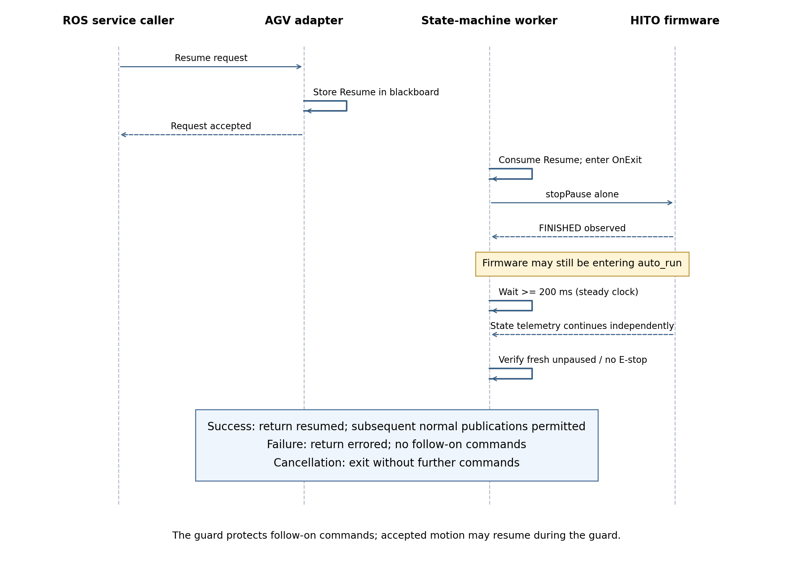

# SW2-876 — Problem description and proposed solution

[Background and existing execution](SW2-876-background.md)

Source status: this revision is checked against the attached `agvhito-repomix(1).md`. Its paths are package-relative; this document uses full-checkout paths prefixed with `src/agvhito/`. Launcher and `yasminx` excerpts retained from the previous analysis are historical context: their source pack is not attached here. Proposed C++ snippets and tests have not been built.

The proposal removes routine pause/software-stop commands and adds a shared, cancellation-aware 200 ms steady-clock guard after verified unpause. Boot and explicit resume are its normal callers. Recovery policy and physical-stop guarantees remain explicit review questions.

## Problem description

### 1.10 Connect the code to the observed firmware failure

The ticket reports that firmware marks `stopPause` complete before entering `auto_run`. In the supplied trace, EnableMap failed at 05:44:34.331 and `auto_run` followed at 05:44:34.336: a roughly 5 ms too-early map operation. The trace does not itself show when the host observed `FINISHED`. The aggregate 8–18 ms mid-order and 45–105 ms boot timings measure the interval after StopPause as reported in the ticket; they should not be silently relabeled as measured host-observation latencies.

| Existing observation or policy | Its limitation or failure | Proposed response |
| --- | --- | --- |
| `PublishResult::Ok` completes the transport stage. | It proves transport success only. Existing code correctly goes on to action-status verification, but that still does not prove readiness. | Preserve transport/action verification and add the readiness guard. |
| `FINISHED` means all consequences of unpause have settled. | Firmware reports completion before it accepts maps/orders in `auto_run`. | After verified unpause, enforce the named 200 ms elapsed-time barrier. |
| `PausedIs(false)` supplies the missing readiness guarantee. | It checks a cached pause flag, with missing flag interpreted as false; it does not check run state. | Retain useful state checks while treating the delay as a temporary guard, not proof. |
| The 100 ms poll interval provides a settling delay. | Success returns before the sleep; status may already be available at the first poll. | Start a separate deadline after successful unpause verification. |
| Routine pause/software E-stop is harmless while idle. | The ticket says these modes prevent firmware standby. | Remove routine commands from idle/stopped/error and resolve recovery policy explicitly. |
| The service returns success when it accepts Resume. | The callback stores a request; the worker publishes later. The response does not confirm physical resumption. | Preserve and document asynchronous acceptance semantics. |

This is why the implementation should begin with `context_utils.cpp` and its callers: the problem crosses transport, action-status reporting, cached telemetry, state lifecycle and firmware mode. A state graph shows legal routing, but cannot reveal that the particular acknowledgment used to permit the next command arrives too early.

### 1.10a Where does “firmware reports stopPause FINISHED immediately” appear?

**The physical firmware handler is not in this pack.** The statement is an observation in the ticket/logs. The Volley host code does not cause or specify the physical firmware's early completion; it receives an action-status report and uses that report as a condition to proceed.

The code connection is: `MakeStopPauseAction` creates an ID-bearing command → `VerifiedPublish` sends it → physical firmware responds on its state topic → `Agv::DrainSubscriptions` stores `state_msg.action_states` in `ActionStateManager` → `VerifiedPublish` reads the matching ID → a `FINISHED` value removes it from `pending` → empty pending set returns success. Sections 1.4–1.6 of the [background](SW2-876-background.md) show each host-side step.

The closest **local equivalent**, which helps identify the protocol behavior but is not vendor firmware, is the simulator handler:

**File:** `src/agvhito/src/sim/sim_agv.cpp`  
**Function/scope:** `SimAgv::HandleActionStopPause`

```cpp
ActionResult SimAgv::HandleActionStopPause() {
  if(state_.estop) {
    return {.status = vstate::ActionStatus::FAILED, .error = {}};
  }

  state_.paused = false;

  // If not estopped and pause is released HITO clears the current errors
  state_.errors.clear();

  return {.status = vstate::ActionStatus::FINISHED, .error = {}};
}
```

It changes `state_.paused`, clears errors and returns `FINISHED` in the same call, except that it fails while E-stopped. This `FINISHED` return is an action result, not yet a received host telemetry message. The simulator subsequently puts that result into its stored action states:

**File:** `src/agvhito/src/sim/sim_agv.cpp`  
**Function/scope:** `SimAgv::UpdateActionState`

```cpp
void SimAgv::UpdateActionState(const vinstant::Action& action, const ActionResult& result) {
  if(result.error.has_value()) {
    AddError(result.error.value());
  }
  state_.action_states[action.action_id] =
      MakeActionState(action.action_id, action.action_type, result.status);
}
```

`SimAgv::BuildState()` includes `ToActionStates(state_.action_states)` in the protocol state; `SimAgv::PublishState()` serializes that state and publishes it through the local MQTT transport. The adapter then consumes it through the same `DrainSubscriptions` path as production.

So there are three distinct source locations to keep straight: vendor firmware's handler is **unavailable**; `SimAgv::HandleActionStopPause` is the simulated producer of immediate completion; `VerifiedPublish` is the host consumer whose early success permits the race. Changing the host delay works around observed firmware behavior; it does not change when vendor firmware marks the action finished.

### 1.10b Where does this code detect `auto_run`?

**It does not detect that firmware mode in the inspected sources.** A search of the supplied AGV, launcher and `yasminx` source finds no `auto_run` predicate/guard and no map/order gate based on that mode. Boot checks `AnyEStopIs(false)` and `PausedIs(false)`. New-order unpause checks `PausedIs(false)`. Neither is a firmware readiness signal.

The only use of `operating_mode` found in this AGV snapshot is a simulator report assignment:

```cpp
// File: src/agvhito/src/sim/sim_agv.cpp
// Function: SimAgv::BuildState() -- selected report fields only.
vstate::State SimAgv::BuildState() {
  // ... timestamp, optional pause flag and safety state preparation omitted ...
  return vstate::State {
      // ... other protocol fields omitted ...
      .paused = paused,
      .operating_mode = vstate::OperatingMode::AUTOMATIC,
      // ... position, actions, battery and error fields omitted ...
  };
}
```

That value is emitted unconditionally by the simulator; it is **not** a check by the adapter and does not model a delayed transition into firmware `auto_run`. A protocol “automatic operating mode” and a vendor's internal `auto_run` readiness state cannot be equated without a documented firmware contract. Adding `operating_mode == AUTOMATIC` as a guessed readiness check would therefore not establish the needed guarantee.

The ticket's “accepts maps/orders only after auto_run” is a firmware-side acceptance rule inferred from its logs. The host learns that it sent too early only through failures, such as an action status of `FAILED`; it currently has no positive readiness observation. The proposed 200 ms guard substitutes elapsed time for this missing signal. It must not be described as detecting `auto_run`.

To replace the delay later, ask firmware for a concrete exposed field or event whose documented meaning is **maps/orders are now accepted**, identify its protocol topic/type, and correlate its freshness with the unpause just issued. Until that contract exists, do not invent a run-mode field or infer readiness from a name.

## 2. Define the intended policy before deleting code

| Situation | Current snapshot behavior | Proposed normal lifecycle behavior |
| --- | --- | --- |
| Boot | Batch releases software E-stop, cancels previous order, clears exceptions, and unpauses; checks state; sends maps. | Keep preparation, publish unpause separately, wait 200 ms after observing its completion, verify unpaused/no E-stop, then send maps. |
| Idle entry | Clears software E-stop if present, pauses, verifies paused, possibly cancels previous order. | No automatic stop release or pause. Preserve safety/state checks; cancel unexpected traversal and verify physical traversal completion. |
| Stopped entry | Activates software E-stop and clears queued orders. | Clear queued orders without activating software E-stop. “Stopped” becomes an adapter dispatch state, not a firmware stop mode. |
| Error entry | Attempts software E-stop, logs diagnostics, clears queued orders. | Keep diagnostics, queue clearing and recovery behavior; remove software E-stop activation. An Error state alone will no longer guarantee a robot stop. |
| New order entry | If paused, unpauses and clears exceptions before map/order publication. | Remove automatic unpause and its private helper. Reject unexpected pause/E-stop before publishing; require boot or explicit resume to establish the normal unpaused condition. |
| Explicit pause while executing | Publishes `startPause`; waits for Resume; publishes `stopPause` on exit. | Preserve pause/resume; resume uses the shared unpause barrier. |
| Stale-telemetry recovery | Pauses on entry; unpauses on exit, tolerating verification failure. | For the strict two-case policy, remove both actions; recovery waits for fresh data without commanding pause/resume. This changes behavior during telemetry loss and needs an explicit engineering decision. |
| Explicit severe stop request | `Agv::RequestSoftEStop()` publishes a software E-stop. | Preserve this requested emergency-stop interface. It is not an automatic idle/stopped/error policy. |
| Terminal state-machine or `PostStep` failure | `Agv::Step()` sends a best-effort software E-stop. | Preserve the existing terminal-failure response; document it as an exception to normal lifecycle policy. |

The ticket's “only two cases” cannot literally mean deleting every software-stop command: it also asks to release software E-stop at boot, and the public severe-stop interface is separate. Recommended interpretation: **two normal lifecycle pause/unpause contexts; no routine software-stop activation just because the adapter is idle, stopped, or errored**. If the team instead intends to remove the explicit stop interface or terminal-failure response, that is a separate contract change.

There is a second ambiguity: `RequestPause()` currently returns success without doing anything outside `executing-order`. Keep that behavior for this ticket and correct its misleading comment; making an idle pause request physically pause the robot would require a new idle pause policy, graph behavior, and resume contract.

## 3. Put the barrier in `agvhito`, not in generic `yasminx`

Add a helper named `UnpauseAndSettle` to the existing `sm/context_utils` module. Put `kUnpauseSettlePeriod` in `sm/timing.hpp`. Call the helper from exactly two places: boot and `ExecutionPausedState::OnExit`.

Why this location:

- The delay compensates for HITO firmware behavior, not a general state-machine lifecycle rule.
- `context_utils` already contains action publication, state predicates, cancellation callbacks and result handling.
- A single helper prevents one resume path from omitting the delay.
- Waiting here serializes subsequent commands on the existing state-machine worker without sleeping inside ROS service callbacks or adding threads.
- Leaving generic `VerifiedPublish` unchanged avoids inserting 200 ms delays after unrelated actions or order publications.

### 3.1 Define the time invariant

Let $t_f$ be the host's monotonic time immediately after `VerifiedPublish(stopPause)` returns successfully. Let $t_n$ be the time of the next normal state-machine map/action/order publication. The required lower bound is:

$$
t_n-t_f\ge\tau,\qquad \tau=0.200\ \mathrm{s}.
$$

Starting at the **observed completion**, rather than at publication, is conservative. Transport and verification time do not count toward the 200 ms barrier. A slow completion therefore does not accidentally consume the entire guard interval.

Use `std::chrono::steady_clock` for this new wait. It measures elapsed host time and avoids wall-clock adjustments or advancing ROS simulated time releasing a physical firmware guard early. This deliberately imposes 200 ms of real elapsed time even in accelerated simulation. Existing `VerifiedPublish` and `VerifyState` still use `context.clock`; this proposal does not fix their simulated-clock timeout behavior.

“Before sending anything else” should mean no subsequent **normal state-machine control publication** until the helper succeeds. It is not a global mutex over the MQTT client: ROS stop callbacks, initial state requests and manager traffic use other call paths. Do not delay emergency-stop requests behind this barrier. If the firmware needs all diagnostic traffic suppressed too, inventory those publishers and design a broader per-robot outbound gate as separate scope.

### 3.2 Proposed declarations

In `src/agvhito/include/agvhito/sm/timing.hpp`, retain existing constants and add:

```cpp
/// Temporary HITO readiness guard after stopPause reports FINISHED.
/// Remove when firmware provides an authoritative readiness signal (SW2-876).
inline constexpr std::chrono::milliseconds kUnpauseSettlePeriod {200};
```

In `src/agvhito/include/agvhito/sm/context_utils.hpp`, add within `volley::agvhito::sm`:

```cpp
/// Publish stopPause by itself, verify FINISHED, wait the wall-clock
/// readiness guard, then verify fresh unpaused/no-E-stop state.
/// Does not clear an E-stop or exceptions and does not resume on cancellation.
[[nodiscard]] stdx::Expected<void, yasminx::Error> UnpauseAndSettle(
    const yasmin::Blackboard& blackboard,
    const yasminx::StateContext& context,
    std::function<bool()> is_canceled);
```

### 3.3 Proposed helper implementation

This is concrete proposed C++ using the supplied interfaces; it has not been compiled against the full workspace. In `src/agvhito/src/sm/context_utils.cpp`, add `<algorithm>`, `<chrono>`, `<thread>`, `<rclcpp/utilities.hpp>`, and `"agvhito/topics/instant_actions.hpp"` as direct includes. Existing includes already provide the blackboard, result/error types, timing constants and predicates through the module header.

Add the private wait in the existing anonymous namespace:

```cpp
constexpr auto kUnpauseCancelPollPeriod {10ms};

stdx::Expected<void, yasminx::Error> WaitForUnpauseSettle(
    const std::function<bool()>& is_canceled) {
  using Clock = std::chrono::steady_clock;
  const auto deadline = Clock::now() + kUnpauseSettlePeriod;
  const auto poll_period =
      std::chrono::duration_cast<Clock::duration>(kUnpauseCancelPollPeriod);

  while(true) {
    // Check interruption before success, including after the final sleep.
    if(is_canceled()) {
      return stdx::Unexpected(yasminx::Error {
          .type = kErrorCanceled,
          .message = "Canceled during the HITO unpause settle period",
      });
    }

    const auto now = Clock::now();
    if(now >= deadline) {
      return {};
    }

    std::this_thread::sleep_for(std::min(deadline - now, poll_period));
  }
}
```

Add the public helper in `volley::agvhito::sm`, outside that anonymous namespace:

```cpp
stdx::Expected<void, yasminx::Error> UnpauseAndSettle(
    const yasmin::Blackboard& blackboard,
    const yasminx::StateContext& context,
    std::function<bool()> is_canceled) {
  const auto interrupted = [&is_canceled] {
    return is_canceled() || !rclcpp::ok();
  };

  // Do not put another command in the same batch as stopPause.
  const auto published = VerifiedPublish(
      {MakeStopPauseAction()}, blackboard, context, interrupted);
  if(!published.has_value()) {
    return stdx::Unexpected(published.error());
  }

  LOG_INFO(context.logger, "Waiting {} for HITO unpause to settle",
      kUnpauseSettlePeriod);

  const auto settled = WaitForUnpauseSettle(interrupted);
  if(!settled.has_value()) {
    return stdx::Unexpected(settled.error());
  }

  // This checks observable state after the guard; it is not auto_run proof.
  return VerifyState(blackboard, context,
      All({AnyEStopIs(false), PausedIs(false)}), interrupted);
}
```

The helper starts the deadline slightly after successful action verification, which strengthens the lower bound. The loop checks elapsed time again after each sleep; early wakeups cannot shorten the guard. Ten-millisecond slices provide a cancellation check approximately every 10 ms while sleeping, subject to host scheduling. They are not a guaranteed cancellation-latency bound for publication or verification: those existing operations have their own waits.

The callback is passed as `std::function<bool()>`, matching existing helpers. The `interrupted` lambda captures a reference to this function, but every use is synchronous and completes before `UnpauseAndSettle` returns. Call sites capture their state object's `this`; they execute on the state-machine worker while the root owns the state. No callback is retained by the new helper.

`rclcpp::ok()` follows the supplied root's global-context convention. If production uses a non-default ROS context, use its shutdown predicate instead; do not assume the global context represents every node. `std::jthread` ownership and joining remain in `yasminx`; its stop token is not the cancellation mechanism used by these helpers.

## 4. Change boot first, then explicit resume

### 4.1 `src/agvhito/src/sm/booting_state.cpp`

In `BootingState::Execute`, split the current four-action batch. Retain software-stop release, prior-order cancellation, and exception clearing. Remove `MakeStopPauseAction()` from that batch and call the new helper before reading maps or sending any map actions:

```cpp
// File: src/agvhito/src/sm/booting_state.cpp
// Function: BootingState::Execute(blackboard, from_transition) -- proposed body excerpt.
LOG_INFO(GetLogger(),
    "Boot preparation: release soft E-stop, cancel prior order, clear exceptions");

const auto boot_actions = VerifiedPublish(
    {MakeSoftEStopAction(false), MakeCancelOrderAction(),
        MakeExceptionClearAction()},
    *blackboard, GetContext(), [this] { return is_canceled(); });
if(!boot_actions.has_value()) {
  return yasminx::MakeUnexpected(kOutcomeErrored, boot_actions.error());
}

const auto unpaused = UnpauseAndSettle(
    *blackboard, GetContext(), [this] { return is_canceled(); });
if(!unpaused.has_value()) {
  return yasminx::MakeUnexpected(kOutcomeErrored, unpaused.error());
}

// Existing fresh-state read, expected-map calculation and map actions follow.
```

The helper absorbs the existing boot `VerifyState(All({AnyEStopIs(false), PausedIs(false)}))`; remove that duplicate block. Correct the old log that says “setting pause” even though it sends `stopPause`. Log “unpause guard complete; preparing map actions” after helper success, without claiming actual firmware readiness.

The preliminary batch preserves existing behavior; its action types use non-blocking protocol semantics, so vector order alone is not proof of firmware execution order. If clearing exceptions while the software stop is still engaged can fail on real firmware, serialize software-stop release and its state verification before cancel/exception-clear. That is a separately testable boot ordering concern, not something the new unpause delay fixes.

### 4.2 `src/agvhito/src/sm/execution_paused_state.cpp`

Keep `OnEntry` publishing `MakeStartPauseAction()` and keep `Step` consuming Resume. Replace `OnExit` with the shared unpause helper, and guard cancellation **before** sending anything:

```cpp
stdx::Expected<yasminx::Outcome, yasminx::ErrorOutcome>
ExecutionPausedState::OnExit(
    yasmin::Blackboard::SharedPtr blackboard,
    std::optional<yasminx::Outcome> step_outcome) {
  if(is_canceled() ||
      (step_outcome.has_value() &&
          step_outcome.value() == yasminx::kOutcomeCanceled)) {
    return yasminx::kOutcomeCanceled;
  }

  const auto unpaused = UnpauseAndSettle(
      *blackboard, GetContext(), [this] { return is_canceled(); });
  if(!unpaused.has_value()) {
    return yasminx::MakeUnexpected(kOutcomeErrored, unpaused.error());
  }

  return kOutcomeResumed;
}
```

Why the guard matters: `yasminx::LifecycleState::Execute` calls `OnExit` after cancellation as well as normal completion. It later forces the returned outcome to cancellation, but that does not undo a command already sent by `OnExit`. The exit must therefore avoid publishing unpause during shutdown. The helper independently checks interruption before publication and during the delay. A cancellation racing immediately after the pre-publication check cannot retract an already sent action; this proposal does not provide atomic command/cancellation arbitration.

Normal resume reaches `Finished{}` without a carried outcome, so this overridden `OnExit` must return `kOutcomeResumed` itself. Do not remove the override: default `LifecycleState::OnExit` treats an empty outcome as a logic error.

The existing paused path resumes an already accepted order. `ExecutingOrderState::OnEntry` returns early when entered from paused or recovery, so it does not republish that order. A firmware resume may start existing motion **during the guard**; the guard prevents later commands, not physical resumption of an accepted order.



Editable Mermaid source (shown as text so VS Code does not need to generate SVG):

```text
sequenceDiagram
    participant Caller as ROS service caller
    participant Adapter as AGV adapter
    participant Worker as State-machine worker
    participant Robot as HITO firmware
    Caller->>Adapter: resume request
    Adapter->>Adapter: Store Resume in blackboard
    Adapter-->>Caller: Request accepted
    Worker->>Worker: Consume Resume and enter OnExit
    Worker->>Robot: stopPause alone
    Robot-->>Worker: FINISHED observed
    Note over Worker,Robot: Firmware may still be entering auto_run
    Worker->>Worker: Wait at least 200 ms of steady elapsed time
    Robot-->>Worker: State telemetry continues independently
    Worker->>Worker: Verify fresh unpaused and no E-stop
    alt Guard and state checks succeed
        Worker->>Worker: Return resumed and re-enter execution
        Note over Worker,Robot: Subsequent normal publications are now permitted
    else Verification fails
        Worker->>Worker: Return errored; do not send follow-on commands
    else State canceled
        Worker->>Worker: Exit without further commands
    end
```

## 5. Remove automatic commands, preserving useful checks

### 5.1 Idle: stop pausing and stop clearing software E-stop

In `src/agvhito/src/sm/idle_state.cpp`, `IdleState::OnEntry` currently does more than the ticket's referenced pause line. Remove both the pause/paused-verification block and the automatic `MakeSoftEStopAction(false)`/exception-clear block. Otherwise boot would not be the only lifecycle software-stop release.

Retain the fresh-state check and replace the hard-stop-only check with existing `CheckEStopClear(state)` so a software stop is not silently cleared. Add `kErrorUnexpectedPause {"unexpected-pause"}` to `src/agvhito/include/agvhito/sm/error.hpp` for diagnostics. Return `kOutcomeErrored` if the robot is unexpectedly paused; do not invent an automatic unpause.

For the retained “unexpected active traversal” cancellation block, add `VerifyState(TraversalComplete())` after `VerifiedPublish(cancelOrder)`. Previously the pause provided immediate stopping behavior; merely deleting it leaves a gap because cancel acknowledgment is not proof that deceleration has completed.

Representative replacement logic after obtaining fresh `state`:

```cpp
// File: src/agvhito/src/sm/idle_state.cpp
// Function: IdleState::OnEntry(blackboard, transition) -- proposed body excerpt.
if(const auto clear = CheckEStopClear(state); !clear.has_value()) {
  return stdx::Unexpected(clear.error());
}
if(IsPaused(state)) {
  return yasminx::MakeUnexpected(kOutcomeErrored, yasminx::Error {
      .type = kErrorUnexpectedPause,
      .message = "Unexpected paused AGV on idle entry; refusing automatic unpause",
  });
}

if(!IsTraversalComplete(state)) {
  const auto canceled = VerifiedPublish(
      {MakeCancelOrderAction()}, *blackboard, GetContext(),
      [this] { return is_canceled(); });
  if(!canceled.has_value()) {
    return yasminx::MakeUnexpected(kOutcomeErrored, canceled.error());
  }
  const auto stopped = VerifyState(*blackboard, GetContext(),
      TraversalComplete(), [this] { return is_canceled(); });
  if(!stopped.has_value()) {
    return yasminx::MakeUnexpected(kOutcomeErrored, stopped.error());
  }
}
return {};
```

This specifically returns `errored`, rather than the hardware/software E-stop outcomes, for unexpected pause. Existing Idle transition maps already support all three relevant error outcomes. `VerifyState` has the existing 35 s timeout; a timeout enters Error without an additional software-stop command under the proposed policy. This remains a failure to establish physical stop, not a successful idle state.

### 5.2 Stopped: retain queue clearing

In `src/agvhito/src/sm/stopped_state.cpp`, remove the log, `VerifiedPublish(MakeSoftEStopAction(true))`, and its error return from `StoppedState::OnEntry`. Keep clearing `bb::kKeyOrderQueue` and keep the localization/Activate logic in `Step`.

Controlled stopping during execution still follows `executing-order → canceling-order → stopped`. `CancelingOrderState` publishes cancel and waits for `IsTraversalComplete`. Remove neither this path nor its physical completion check. By contrast, entering Stopped from Error does not prove a current onboard order was canceled; that risk is addressed below, not by renaming the state.

### 5.3 Error: retain diagnostics and recovery delay

In `src/agvhito/src/sm/error_state.cpp`, remove the software-stop publication and its “continuing in error” warning. Retain transition/error/state logging, pending-queue clearing, the entry timestamp, waiting for fresh state and hardware E-stop release, and the existing five-second recovery behavior.

Be explicit in code comments: entering Error is no longer an instruction to stop the robot. Clearing `OrderQueue` affects local pending orders. Removing `bb::kKeyActiveOrder` during recovery removes local tracking; it does not cancel the robot's accepted order. A stale-data or protocol failure can therefore have a different physical consequence after this change.

### 5.4 Executing order: remove both helper declaration and definition

In `src/agvhito/src/sm/executing_order_state.cpp`:

1. Delete the `if(IsPaused(state))` unpause block from `OnEntry`.
2. Delete the misleading unconditional “AGV is reporting un-paused” log.
3. Delete the `ExecutingOrderState::VerifiedUnpause` definition at the end of the file.
4. After obtaining fresh state and **before map/order publication**, add `CheckEStopClear(state)` and the same unexpected-pause error guard shown for Idle.
5. Preserve map selection, order publication, tracking, and early-return behavior for paused/recovery re-entry.

In `src/agvhito/include/agvhito/sm/executing_order_state.hpp`, delete the private `VerifiedUnpause` declaration. Leaving a declaration behind is misleading even if it does not cause a linker error once unused.

The old private helper also sent `MakeExceptionClearAction()`. Its removal intentionally removes that order-start exception-clearing behavior. Boot still clears exceptions; resume previously did not separately clear them. Verify on hardware that `stopPause` clears the expected pause-related exception, rather than assuming the simulator's behavior is firmware proof.

The new guards are on the new-order entry path. They do not redesign every race with external stops or every telemetry check during ongoing execution. Existing `Step` E-stop checks remain.

### 5.5 Recovery: the additional required policy change

In `src/agvhito/src/sm/execution_recovery_state.cpp`, remove `MakeStartPauseAction()` from `OnEntry` and `MakeStopPauseAction()` from `OnExit`. Keep recovery's freshness checks for state, filtered pose and common message. Keep `OnEntry` as a diagnostic-only method, or remove that override and declaration to inherit the no-op entry.

Keep the `OnExit` override because recovery also returns `Finished{}` without an outcome:

```cpp
stdx::Expected<yasminx::Outcome, yasminx::ErrorOutcome>
ExecutionRecoveryState::OnExit(
    yasmin::Blackboard::SharedPtr /*blackboard*/,
    std::optional<yasminx::Outcome> step_outcome) {
  if(is_canceled() ||
      (step_outcome.has_value() &&
          step_outcome.value() == yasminx::kOutcomeCanceled)) {
    return yasminx::kOutcomeCanceled;
  }
  return kOutcomeRecovered;
}
```

If the team elects to retain automatic recovery pause, state the exception to the ticket clearly and route its unpause through `UnpauseAndSettle`, propagating failures instead of logging and continuing. That alternative has **three** lifecycle contexts and does not satisfy the strict two-case policy. Leaving the current recovery unpause untouched would also violate the “after every unpause” guard requirement.

### 5.6 Public service comments and stop exceptions

In `src/agvhito/src/agv.cpp`, correct `RequestPause()`'s comment to say it queues a pause only while executing and otherwise returns a no-op success. Do not describe all other states as paused or E-stopped after this change. Leave `RequestResume()`'s state checks in place.

Keep `RequestSoftEStop()` and the terminal-failure software-stop path in `Agv::Step()`. They remain intentional exceptions, and an explicit stop can still prevent firmware standby. A robot that retains a manually requested software stop is therefore not guaranteed to enter standby under this ticket.

No ROS interface definition needs to change. The `pause`/`resume` services are relative-name `std_srvs::srv::Trigger` endpoints in `agv_ros.cpp`; the adapter stores a blackboard request and returns success. A successful response is **request acceptance or an existing no-op case**, not confirmation that pause/unpause and the 200 ms barrier have completed.

## 6. File change checklist

| Repository path | Proposed change |
| --- | --- |
| `src/agvhito/include/agvhito/sm/timing.hpp` | Add documented `kUnpauseSettlePeriod {200}` milliseconds. |
| `src/agvhito/include/agvhito/sm/context_utils.hpp` | Declare `UnpauseAndSettle` and its verified contract. |
| `src/agvhito/src/sm/context_utils.cpp` | Add monotonic, cancellation-aware wait and shared unpause helper. |
| `src/agvhito/src/sm/booting_state.cpp` | Split boot unpause from preparation batch; call helper before maps; fix logs and remove duplicate state verification. |
| `src/agvhito/src/sm/execution_paused_state.cpp` | Use helper on normal resume; guard cancellation before publication. |
| `src/agvhito/src/sm/idle_state.cpp` | Remove automatic pause/software-stop release; retain safety checks and cancel unexpected traversal with completion verification. |
| `src/agvhito/src/sm/stopped_state.cpp` | Remove automatic software-stop activation; retain queue clearing. |
| `src/agvhito/src/sm/error_state.cpp` | Remove automatic software-stop activation; retain diagnostics/recovery; explain changed physical semantics. |
| `src/agvhito/src/sm/executing_order_state.cpp` | Remove order-start unpause/helper; guard unexpected pause/E-stop before new publications. |
| `src/agvhito/include/agvhito/sm/executing_order_state.hpp` | Remove obsolete private helper declaration. |
| `src/agvhito/include/agvhito/sm/error.hpp` | Add diagnostic `kErrorUnexpectedPause`. |
| `src/agvhito/src/sm/execution_recovery_state.cpp` | For strict policy, remove pause/unpause; preserve freshness polling and recovered/canceled exit outcomes. |
| `src/agvhito/include/agvhito/sm/execution_recovery_state.hpp` | Change only if removing the now-empty `OnEntry` override. |
| `src/agvhito/src/agv.cpp` | Update misleading pause comment; preserve explicit severe-stop and terminal-failure behavior. |
| `src/agvhito/CMakeLists.txt` | Add a state-machine test target linked to `${PROJECT_NAME}_state_machine_lib`. |
| `src/agvhito/test/sm/test_unpause_and_settle.cpp` | Proposed new tests for action ordering, elapsed guard and failure/cancellation. |
| `src/agvhito/test/sm/test_pause_policy.cpp` | Proposed new tests for state-entry policy, resume, recovery and cancellation. |

`state_strings.hpp`, `root.cpp`, `yasminx`, launcher configuration and ROS service schemas should not need changes for this design. No YAML delay parameter is needed: the ticket requests a temporary fixed workaround constant. Adding runtime configurability would add validation and deployment variance without establishing real readiness.

## 7. Tests that demonstrate the behavioral change

The current `agvhito-repomix(1).md` includes test bodies. Reuse the transport construction and round-trip pattern in `test/comms/test_sim_mqtt.cpp`, the action assembly examples in `test/test_instant_action_assembler.cpp`, and tracker construction in `test/test_tracked_message.cpp`. `test/topics/test_state_predicates.cpp` already checks pause/E-stop predicates. None of those tests exercises the new unpause readiness barrier. The earlier analysis references separate `yasminx` tests; that dependency pack is not attached to this revision, so those claims have not been revalidated here.

Add a focused test target inside `if(BUILD_TESTING)`:

```cmake
volley_add_gtest(
  ${PROJECT_NAME}_state_machine_tests
  DIRECTORY test/sm
  LINK_LIBRARIES
    ${PROJECT_NAME}_state_machine_lib
)
```

Check `volley_add_gtest`'s actual directory-globbing behavior in the checkout. If the existing `${PROJECT_NAME}_core_tests` recursively collects `test/sm`, exclude the new directory from that target or use explicitly listed sources. Do not guess the wrapper macro's exclusion API from this pack.

### 7.1 Build a recording transport fixture

Use the included `comms::SimMqttClient` and its `CreatePublisher()` / `CreateSubscription()` interfaces, as demonstrated by `test/comms/test_sim_mqtt.cpp`; this avoids inventing a publisher subclass. The blackboard fixture supplies a real action assembler, an action-state manager, and a fresh tracked state. A recording publisher captures outgoing action/order payloads, IDs, and host monotonic timestamps; its publish future returns the intended transport result. Feed completion statuses for the **actual generated action IDs**, rather than treating a successful future as robot acceptance.

The underlying `mqtt::IPublisher` declaration is external, but the supplied simulated client/publisher implementations and tests provide a usable in-process transport fixture. Subscribe to the instant-action topic before starting the helper, decode the generated action IDs, and feed `ActionStateManager::Upsert`. This tests the real helper without requiring changes to production simulation. Drive fresh telemetry asynchronously while the worker is waiting; a fixture that only updates state on the blocked test thread can deadlock or time out for the wrong reason.

| Test | Stimulus | Required observation |
| --- | --- | --- |
| Boot barrier | Firmware double marks unpause `FINISHED` immediately but remains unavailable for 105 ms. | No map/control publication until at least 200 ms after that completion is observable. Unpause is not batched with any follow-on action. |
| Resume barrier | Resume an accepted order; mark unpause complete immediately. | `kOutcomeResumed` is not returned before the guard and state check succeed. Existing order is not republished on paused re-entry. |
| Slow completion | Delay action completion independently of transport success. | Guard starts after successful action verification, not at send time; elapsed delay is not counted twice incorrectly or consumed early. |
| Action failure | Transport fails, times out, or robot reports `FAILED`. | Return the corresponding error; do not publish maps/order or return resumed. |
| Cancellation before exit | Cancel a paused state/root. | No `stopPause` is published by `OnExit`. |
| Cancellation during guard | Cancel after unpause completion but before deadline. | Helper returns canceled error; no normal follow-on command. Already sent unpause cannot be withdrawn. |
| ROS shutdown | Shutdown while guarding. | New wait exits through interruption; no subsequent normal publications. |
| Observable state failure | Guard completes but fresh state remains paused/E-stopped or becomes stale. | State verification fails/times out and no normal follow-on command is allowed. |
| Idle/stopped/error policy | Enter each state with appropriate fixtures. | No automatic `startPause` or software-stop activation. Idle does not automatically release software stop. Existing queue/diagnostic behavior remains. |
| Idle unexpected traversal | Cancel reports `FINISHED` before deceleration finishes. | Idle entry does not succeed until `TraversalComplete` holds. |
| Unexpected pause at order start | Present a paused fresh state on new-order entry. | Diagnostic error; no automatic unpause, enable-map or order publication. |
| Explicit pause/resume | Request Pause while executing, then Resume. | One pause action; one guarded unpause; correct existing outcomes. |
| Telemetry recovery | Make execution state/pose/common data stale, then fresh. | Under strict policy, recovery publishes neither pause nor unpause and retains its freshness gates. |
| Existing severe stop | Use the severe-stop service and terminal-failure path. | Existing software-stop behavior remains available; controlled stop still waits for traversal completion. |

Measure the guard's **lower bound** with a steady clock; avoid brittle tests demanding completion at exactly 200 ms or under a narrow upper bound. Several real-time guard tests add only fractions of a second. If the test suite later needs deterministic virtual-time testing, extract an internal deadline/wait abstraction; do not add broad clock injection to every state solely for this small workaround.

### 7.1a Required regression test: early FINISHED is not readiness

Add `UnpauseAndSettleTest.EarlyFinishedBlocksFollowOnControl` in `src/agvhito/test/sm/test_unpause_and_settle.cpp`. This is required in the implementation, rather than an optional hardware-only check. Use the real proposed helper and the existing simulated transport. The following is test-harness pseudocode; it is not a compiled test result:

```cpp
// Arrange: real assembler, action manager, tracked state, and SimMqttClient.
// Initialize ROS for the helper's rclcpp::ok() check; clean up owned context.
// Subscribe before launching the state-machine worker.
start_firmware_receiver();  // Parse and correlate actual outgoing action IDs.
start_worker([&] {
  auto result = UnpauseAndSettle(blackboard, context, canceled);
  if (result.has_value()) {
    publish_test_follow_on_control();
  }
  return result;
});

auto unpause = receive_instant_actions();
ASSERT_EQ(unpause.actions.size(), 1);
ASSERT_EQ(unpause.actions.front().action_type, "stopPause");
auto finished_at = steady_clock::now();
// Timestamp BEFORE making FINISHED available; never timestamp after Upsert.
action_manager.Upsert(finished_for(unpause.actions.front().action_id));
keep_fresh_unpaused_no_estop_telemetry();
firmware_acceptance_deadline = finished_at + 105ms;
auto follow_on = receive_follow_on_control();
EXPECT_GE(follow_on.received_at - finished_at, 200ms);
EXPECT_GE(follow_on.received_at, firmware_acceptance_deadline);
EXPECT_TRUE(join_worker().has_value());
```

The fixture rejects control messages before its readiness deadline. It must also assert the **200 ms** lower bound: merely surviving the modeled 105 ms firmware gap does not test the requested guard. The timestamp above precedes host observation of FINISHED, so this integration assertion is a necessary lower bound, not an exact measurement of verification-return time. Add a focused internal-wait test that records entry immediately before the real wait and exit immediately after it to prove the full 200 ms wait independent of transport polling. Keep that seam internal to `context_utils`; no public ROS clock injection is needed.

Include `SlowFinishedDoesNotConsumeGuard`: delay FINISHED by 300 ms, then assert another full 200 ms before follow-on publication. Include `CanceledBeforePublishSendsNothing` and `CanceledDuringSettleReturnsCanceled`: use synchronization at the wait-entry seam so cancellation is definitely within the guard, assert `kErrorCanceled`, and assert no follow-on publication. Give receiver waits generous failure timeouts and always cancel/join workers in cleanup; never use a short timeout as a success assertion.

Verify test sensitivity by temporarily removing the wait: the focused wait test must fail. With the wait removed, the early-completion integration test should reproduce premature control publication; use a bounded, synchronized fixture to avoid accidental passing caused by host scheduling delays. Restore the wait before running the final suite.

Extend `test/topics/test_state_predicates.cpp` with `TraversalCompleteTest.CancelFinishedWhileDrivingIsIncomplete`, since the Idle change relies on physical traversal completion rather than cancel-action completion. Set the state as driving with an unfinished edge, report a finished cancel action, and assert `TraversalComplete().holds(state)` is false; then clear driving/edge traversal and assert true. Use the exact predicate fields from `topics/state.hpp`. This extends an existing test but does not replace the helper regression tests.

Concrete addition to the existing predicate test file (using its existing `vstate` alias):

```cpp
TEST(TraversalCompleteTest, CancelFinishedWhileDrivingIsIncomplete) {
  vstate::State state {};
  state.driving = true;
  state.edge_states.emplace_back();
  vstate::ActionState cancel {};
  cancel.action_id = "cancel-1";
  cancel.action_type = "cancelOrder";
  cancel.action_status = vstate::ActionStatus::FINISHED;
  state.action_states.push_back(cancel);

  const auto complete = volley::agvhito::TraversalComplete();
  EXPECT_FALSE(complete.holds(state));
  state.driving = false;
  EXPECT_FALSE(complete.holds(state));  // Remaining edge still blocks completion.
  state.edge_states.clear();
  state.driving = true;
  EXPECT_FALSE(complete.holds(state));  // Driving alone still blocks completion.
  state.driving = false;
  EXPECT_TRUE(complete.holds(state));
}
```

No ROS/C++ build is available from the packed export alone. These test changes are implementation requirements; they have not been compiled or executed in this documentation revision.

### 7.2 Why normal simulation cannot reproduce the ticket alone

`src/agvhito/src/sim/sim_agv.cpp` immediately clears its pause flag and reports `FINISHED` in `HandleActionStopPause`. It has no delayed `auto_run` readiness gate. Its battery model likewise does not implement the firmware standby behavior described by SW2-815.

Prefer a test-specific firmware/transport double that reports early completion and rejects map/order requests before a configured readiness deadline. It should model the two separate events: **action finished** and **commands accepted**. Keep production simulation unchanged unless a separately requested simulator feature justifies adding standby/readiness modeling. A passing standard simulation is useful regression evidence, not proof that the physical firmware race or overnight battery loss is resolved.

### 7.3 Build and run in the actual workspace

After implementing against the checkout, use its normal build environment:

```bash
colcon build --packages-up-to agvhito --cmake-args -DBUILD_TESTING=ON
colcon test --packages-select agvhito
colcon test-result --verbose
```

These are proposed commands, not results from this documentation task. Run existing AGV tests as well as the new state-machine target, then exercise boot, pause/resume and controlled stop in simulation before hardware validation.

## 8. Risks and design issues to resolve before rollout

| Risk / issue | Why it matters | Proposed treatment |
| --- | --- | --- |
| **Error no longer commands a stop** | An accepted onboard order can outlive local queue clearing or removal of active-order tracking. Entering Stopped after five seconds does not prove the robot is stationary. | Enumerate which failure classes can occur during motion and establish the firmware/external stopping contract. If a cancel/controlled-stop action is required on selected errors, define it separately rather than claiming queue clearing stops the robot. |
| **Recovery no longer pauses on stale telemetry** | The robot may continue its accepted order while central lacks trustworthy feedback. | The strict policy needs explicit agreement about firmware communication-loss handling and allowed blind-motion behavior. Retaining recovery pause is an alternative only if documented as a third case with guarded unpause. |
| **A preexisting software stop remains engaged** | Removing Idle's auto-clear can prevent recovery/activation from restoring operation and can still prevent standby. | Document the supported release path. In this design it is boot; do not silently remove an operator's requested stop during Idle. Test restart/release behavior and identify whether a separate explicit release API is needed. |
| **Hardware E-stop cannot be released in software** | Boot's release command affects software stop, while the predicate requires no E-stop of any kind. | Preserve the hardware distinction and failure diagnostics. Do not treat a fixed delay as permission to override a physical stop. |
| **200 ms is not a readiness signal** | Firmware load/version could produce a longer gap than the observed maximum. | Correlate host action IDs with firmware logs during rollout. Keep a named, documented workaround; request an authoritative readiness field/event from firmware. |
| **Other publishers bypass the barrier** | The root worker serializes its own control sequence, not every ROS callback or manager request. | Audit outbound paths; keep emergency stops immediate. Define exactly which diagnostic traffic firmware tolerates rather than adding an indiscriminate MQTT lock. |
| **Explicit resume can begin motion before guard completion** | An already accepted order can resume when firmware enters `auto_run`. | Explain that the barrier protects follow-on command readiness; it is not a delayed physical-resume mechanism. |
| **Existing clock-based verification can still stall** | `VerifiedPublish`/`VerifyState` use `context.clock` deadlines/sleeps; the new steady wait does not change those. | Keep cancellation tests and record this separate limitation. Do not claim the complete helper has a 200 ms maximum duration. |
| **Blocking waits and shutdown** | Root destruction joins its worker. A monolithic sleep or non-cooperative verification can delay shutdown. | Use short cancellation-aware slices and existing canceled-result convention; test cancellation. No new worker or detached callback. |
| **Stop/cancellation races remain** | A check immediately before sending is not atomic with an asynchronous stop request. | Preserve normal concurrency behavior; test representative races and avoid claiming the helper is a global safety arbiter. |
| **Blackboard request slot is not a queue** | Pause/Resume occupy a shared request key; `TakeRequest` reads and removes it. | Keep existing API semantics and test repeated/conflicting requests. Do not promise ordered processing of arbitrary concurrent service requests. |
| **Terminal failure can repeatedly activate software stop** | `Agv::Step` may run again while the machine remains terminal. | Preserve failure behavior in this ticket; inspect repeated publications and battery effects as a separate fault-latching/backoff issue. |
| **Removing order-start exception clearing** | Firmware errors formerly cleared there may persist. | Test supported firmware behavior after explicit resume and boot. Do not retain a hidden unpause simply to clear errors. |
| **Standby is not established by adapter state** | The ticket attributes battery loss to firmware mode. Simulator fractions/adapter Stopped state are not firmware low-power evidence. | Observe actual standby entry and battery behavior on hardware; inspect whether ongoing diagnostic traffic also prevents standby. |

The first two risks are material behavior changes, not implementation details to hide in a helper. A proposal can be complete while clearly distinguishing the requested policy from the physical stopping guarantees that must be established with the team and firmware supplier.

## 9. Suggested implementation and rollout order

1. Inventory the current checkout and confirm the recovery/explicit-stop interpretation against the ticket. Capture current boot and resume command order with IDs.
2. Add the constant/helper and tests. Update boot and explicit resume first; this isolates the readiness barrier from pause-policy deletions.
3. Remove Idle/Stopped/Error/order-start automatic commands, plus the strict-policy recovery commands. Add unexpected-pause checks and Idle traversal completion verification. Update comments and clean unused includes/declarations.
4. Run focused and existing tests, then simulation regression. Re-run the pause/unpause inventory: `MakeStopPauseAction` should appear in the action factory and the shared helper, with only boot and explicit-resume callers; `MakeStartPauseAction` should remain in the factory and explicit-paused entry.
5. Validate on a controlled physical robot: boot with the relevant map scenarios, repeated pause/resume, queued/new-map orders, controlled stop, operator E-stop, and telemetry recovery under the agreed contract. Correlate command/action IDs and both clocks; the supplied firmware timestamp is UTC+8, so normalize it before comparing central timestamps.
6. Roll out narrowly, monitor map/action failures and actual low-power entry, then compare overnight battery behavior. If rollback is needed, record that restoring the previous policy also restores the known standby issue; avoid treating rollback as resolution of SW2-815.

Do not artificially force a dangerous telemetry outage or stop scenario on an operating parking system; use the team's controlled hardware validation procedure. This proposal does not request deployment or change an active robot.

## 10. Definition of done and questions for the team

The implementation is reviewable when the shared helper enforces the measured lower bound, both normal unpause callers use it, canceled exit cannot deliberately send unpause, and tests demonstrate the absence of routine pause/software-stop commands in the removed paths. The ticket is behaviorally validated only when hardware accepts the first post-unpause map/order operations and eligible idle robots reach standby.

Resolve these concrete questions in review:

- Does “only two cases” include removal of telemetry-recovery pause/unpause? The source currently has that extra case.
- Are explicit severe-stop requests and terminal-failure software stops intentional exceptions? This proposal preserves them.
- What ensures physical stopping when entering Error during an active onboard order, after removing automatic software E-stop?
- What is the allowed robot behavior while execution telemetry is stale? What firmware communication-loss behavior is actually configured?
- How should an operator-requested software stop be released without an automatic Idle release? Is a restart sufficient or is a separate release operation required?
- Does the preliminary boot batch need stronger ordering between software-stop release, cancel, and exception-clear on supported firmware?
- Is the 200 ms guard required only for normal control publications, or must diagnostic traffic also wait? Emergency stops should remain immediate.
- What firmware readiness signal will replace the workaround, and how will its correlation/freshness be established?

The eventual firmware fix should replace the elapsed-time barrier with an authoritative, fresh readiness check while keeping centralized unpause handling. It should not turn `FINISHED` or `paused == false` into readiness assumptions again.
