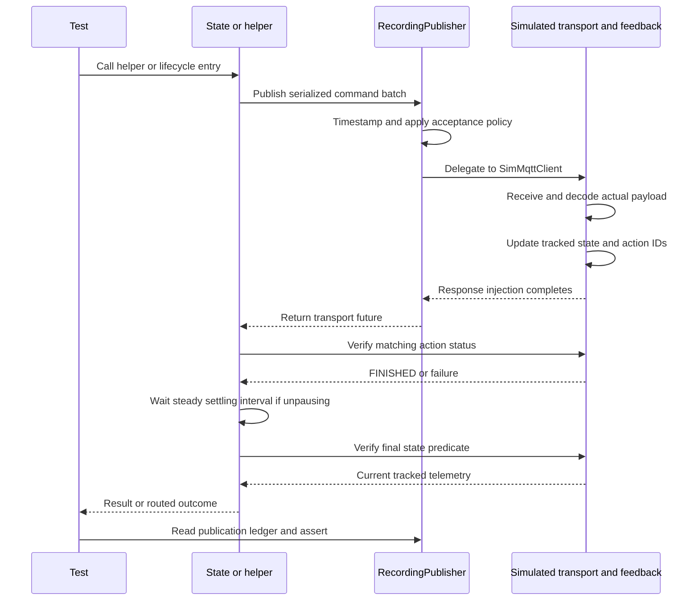

# SW2-876 — Testing architecture, execution, and regression guide

This document explains the tests in the corrected full `SW2-876-pause-estop-policy.patch`, including the lifecycle access fixes. It describes the implemented test design, its entry points, the expected assertions, and its limits. The full ROS test executable has not been built or run in this documentation workspace. Patch application was checked against the supplied `agvhito-repomix.md`; a focused C++20 compile check verified the visitor technique used to inspect protected lifecycle result types.

Paths are relative to the `agvhito` package unless stated otherwise. In the supplied checkout layout, that package is `/home/jon-gonzales/volley/src/agvhito`. The [implementation plan](SW2-876-implementation-plan.md) contains the production design and complete code diffs; the [full patch](SW2-876-pause-estop-policy.patch) contains the same changes in Git-applicable form. This guide does not introduce additional production changes.

## 1. What the tests are trying to prove

The ticket has two related requirements: stop issuing routine mode-changing actions in states where they interfere with auto charging, and prevent follow-on control commands from racing firmware after unpause reports completion.

| Requirement | Observable evidence in the tests | What that evidence does not establish |
| --- | --- | --- |
| Stopped must not activate software E-stop on entry. | Entry clears the queue and produces no recorded publication. | That the physical robot has stopped merely because the adapter entered Stopped. |
| Idle must not release software E-stop or engage pause. | Stationary entry publishes nothing; an existing software stop remains detectable by Step. | Actual charger engagement, standby mode, or battery improvement. |
| New-order entry must not automatically unpause. | Paused dispatch fails before publishing maps/orders or changing the queue/manager. | A global guarantee against changes to firmware mode by other publishers. |
| Telemetry recovery must not pause or unpause. | Entry, freshness waiting, exit, and executing re-entry produce no publication and retain the active order. | Firmware communication-loss behavior or safe motion during an actual outage. |
| Error must activate on entry and release only on recovered exit. | Action parameters distinguish `eStop=true` from `eStop=false`; cancellation and release failure prevent recovered success. | That local queue clearing cancels a retained onboard order. |
| Boot and explicit Resume must use the shared settling guard. | Singleton unpause batch, full measured minimum interval, correct caller outcomes, and no duplicate order after Resume. | Detection of the vendor's internal `auto_run` mode. |
| Failed Error release must have valid routing. | A small root graph ends at terminal rather than entering the Stopped probe. | Full application shutdown, ROS service behavior, or every terminal-fault publication by `Agv::Step`. |

The suite checks both the changed policy and behavior that must survive the deletions: queue clearing, freshness requirements, localization routing, active-order ownership, explicit request processing, and structured error handling.

## 2. Entry point: how the executable reaches a test

### 2.1 Build-time registration

With `BUILD_TESTING=ON`, the patch adds `${PROJECT_NAME}_state_machine_tests`, which resolves to `agvhito_state_machine_tests`. Its explicit source list contains the nine `test/sm/test_*.cpp` files. `state_test_fixture.hpp` is included by those files and is not compiled as a separate translation unit.

The target links the state-machine, core, comms, and topics libraries plus `nlohmann_json`. These are production libraries: tests execute the real state implementations, action assembler, action-state manager, tracked messages, queue, and simulated transport rather than replacing all behavior with mocks.

The existing core test source collection is changed to exclude `test/sm/`. This prevents the new tests from also being registered in a target with a different set of linked libraries. Check the installed `volley_cmake` macro behavior if source collection differs in your checkout; the macro implementation is not in the supplied export.

There is no handwritten `main()` in the new test files. The GoogleTest entry point is supplied through the project's `volley_add_gtest` build convention. The exact generated/link-time arrangement belongs to that macro and the test libraries, so inspect the actual CMake configuration rather than looking for a new AGVHITO test `main.cpp`.

### 2.2 Runtime dispatch

The expected execution path is:

1. `colcon test` invokes the package's registered CTest tests.
2. CTest launches the GoogleTest executable, using the project's test wrapper where configured.
3. GoogleTest selects test cases, including any filter, and constructs the appropriate fixture instance.
4. Fixture `SetUp()` initializes dependencies and telemetry.
5. GoogleTest invokes the generated `TestBody()` for the selected `TEST` or `TEST_F` definition.
6. Assertions inspect returned results, recorded messages, timing, and blackboard contents.
7. Fixture `TearDown()` joins owned workers and shuts down ROS if the fixture initialized it.
8. The runner reports pass/fail results for CTest/colcon to collect.

The executable runs tests; it does not launch the parking-system application, construct an `AgvRos`, spin a ROS executor, or connect to a physical AGV. A real ROS context is used because production helpers inspect `rclcpp::ok()` and use ROS clocks/logging.

### 2.3 `TEST` versus `TEST_F`

```cpp
TEST(UnpauseWaitTest, FullSteadyClockInterval) { /* focused wait test */ }
TEST_F(UnpauseTest, EarlyFinishedBlocksFollowOnControl) { /* fixture-backed test */ }
```

`TEST` is used for focused wait checks that can construct their own dependencies. `TEST_F` uses a fixture, for example `using UnpauseTest = StateTest;`, with per-test setup and cleanup. GoogleTest generates the corresponding test class and `TestBody()`; those generated class names explain the long names in compiler diagnostics.

Aliases such as `BootTest`, `PausedTest`, and `ErrorTest` share `StateTest` support but retain distinct suite names. Each test gets fresh fixture objects. They do not intentionally share a queue, blackboard, action-status history, or publication ledger between test cases.

## 3. The three execution levels

| Level | Entry point used by the patch | Why it is used | Coverage boundary |
| --- | --- | --- | --- |
| Direct helper / wait | `UnpauseAndSettle(...)` or `sm::detail::WaitForUnpauseSettle(...)` | Isolate the guard, verification, and interruption contract. | Does not by itself prove state transitions or caller behavior. |
| Direct state hook | `OnEntry`, `Step`, or `OnExit` on a concrete state | Set precise starting conditions and test one branch without unrelated lifecycle waiting. | Tests can supply an exit outcome directly; this does not prove a real Step generated that outcome. |
| Full lifecycle | `RunLifecycle(state, blackboard, transition)` | Exercise framework entry, repeated Step behavior, exit, and routing result through the public state interface. | Still runs one state, without the entire production graph. |
| Root graph integration | `root(blackboard)` | Verify declared outcomes actually route to a destination. | Uses a deliberately finite two-state test graph and a Stopped entry probe. |

Boot derives directly from `yasminx::State`, and its concrete `BootingState::Execute` is public. Boot tests can call that public override directly. The eight lifecycle states inherit a private `LifecycleState::Execute`, so lifecycle integration must enter through the framework's public callable interface instead.

### 3.1 The private/protected access fix

The first patch attempted to call `recovery.Execute(...)`, `paused.Execute(...)`, and `error.Execute(...)`, and explicitly named `LifecycleState::Continue` and `LifecycleState::Finished` from test bodies. Your compiler showed that `Execute` is private and those alternatives are protected.

The corrected support helper installs the entry transition and invokes the public state interface:

```cpp
template <typename StateT>
yasminx::Outcome RunLifecycle(StateT& state,
    const yasmin::Blackboard::SharedPtr& blackboard,
    const yasminx::Transition& transition) {
  yasminx::bb::Set(*blackboard, yasminx::bb::kTransition, transition);
  return state(blackboard);
}
```

The framework wrapper reads the transition, dispatches to the lifecycle implementation internally, and converts structured errors into routing outcomes. Consequently, `RunLifecycle` returns an `Outcome`, not `Expected<Outcome, ErrorOutcome>`. Corrected tests compare that outcome directly. Tests needing a particular structured error inspect a direct hook result or the framework's stored error information as appropriate.

Step checks use deduction and visitation rather than naming protected nested types:

```cpp
template <typename StepResultT>
bool IsContinuing(const StepResultT& result) {
  return std::visit([](const auto& value) {
    return !requires { value.outcome; };
  }, result);
}

template <typename StepResultT>
std::optional<yasminx::Outcome> FinishedOutcome(const StepResultT& result) {
  return std::visit([](const auto& value) -> std::optional<yasminx::Outcome> {
    if constexpr(requires { value.outcome; }) {
      return value.outcome;
    }
    return std::nullopt;
  }, result);
}
```

For the current two-alternative contract, `Continue` has no `outcome` member and `Finished` does. `FinishedOutcome` also returns `nullopt` for an unnamed `Finished`, so it alone cannot distinguish that from Continue. Use `IsContinuing` where that distinction matters and require a named outcome in tests for explicit Resume/recovery completion.

This approach depends on that current variant structure. If `yasminx` introduces another alternative or changes member names, review the helpers. The fix does not make lifecycle internals public or change production access control. It requires C++20 for `requires`, consistent with the proposed test code.

## 4. Fixture construction and dependency ownership

`StateTest::SetUp()` builds a minimal environment for the state-machine code:

| Object | Construction / blackboard key | Role |
| --- | --- | --- |
| ROS context | Initialize only if `rclcpp::ok()` is false | Makes production shutdown checks meaningful. Fixture records whether it owns initialization. |
| Clock | `rclcpp::Clock(RCL_SYSTEM_TIME)` | Timestamps telemetry and drives existing publication/state verification timeouts. |
| `StateContext` | Clock and `sw2_876_test` logger | Supplies the same context shape as production state construction. |
| Blackboard | New `yasmin::Blackboard` | Typed dependency/request/active-order store used by real states. |
| `ActionStateManager` | `bb::kKeyActionStateManager` | Stores real generated action IDs and their test-reported statuses. |
| `InstantActionAssembler` | `bb::kKeyInstantAssembler`, AGV ID 1 | Generates and serializes real protocol batches. |
| Publisher | `bb::kKeyMqttPublisher` | Recording wrapper around a publisher from the real `SimMqttClient`. |
| State tracker | `bb::kKeyState` | Thread-safe non-stale state feedback consumed by verification and state hooks. |
| Common tracker | `bb::kKeyCommonMessage` | Supplies recovery's common-data freshness input. |
| Pose filter | `bb::kKeyPoseFilter` | Supplies recovery's filtered-pose freshness input. |
| Order queue | `bb::kKeyOrderQueue` | Real queue whose clearing, pop, and retention behavior can be asserted. |
| Map IDs | `bb::kKeyLocalizationMapId`, `bb::kKeyFloorMapIds` | Boot map-policy inputs: `localization` and initially no floor-map inventory. |
| Active order | Added by individual tests through `bb::kKeyActiveOrder` | Tests can compare shared-pointer identity before and after re-entry. |

Subscriptions for instant-action and order topics are created **before** operations start. They use the real topic helpers and a wildcard serial-number segment. The simulated transport routes published bytes to those subscriptions without an external MQTT broker.

The initial state reports no E-stop, no pause, no driving, a nonempty last-node ID, an initialized position with nonzero coordinates, and an enabled `floor` map. These explicit values avoid accidental failure of localization or safety predicates. `Refresh()` stamps and stores state; `RefreshCommon()` does the same for common data. A pose sample is inserted into the real filter.

State/common trackers use 30 s degraded and 60 s stale thresholds in this fixture. Those are **test settings**, chosen to keep initial telemetry usable across the existing 35 s timeout test. They do not change production telemetry thresholds. Tests needing stale data replace the relevant blackboard tracker with an empty tracker rather than waiting one minute.

`Order()` creates a minimal assembled order with ID, map, serial number, manufacturer, and protocol version. Its empty command/node collection is sufficient for entry publication and tracking-ownership tests. These tests are not validating an executable motion trajectory or the full order assembler.

## 5. Publication, transport, and feedback flow



This sequence is intentionally different from real hardware timing. In the normal fixture, the simulated publisher routes synchronously and `RecordingPublisher` invokes the responder before returning its future to the production helper. `FINISHED` can therefore already be present when production first polls the action manager. That deliberately exercises the ticket's early-completion condition instead of relying on polling sleep to introduce a delay.

### 5.1 `RecordingPublisher`

The wrapper implements the real `mqtt::IPublisher` interface. At each `Publish` call it:

1. Records a steady timestamp and parses the outgoing JSON.
2. Applies an optional firmware-acceptance predicate. Rejection returns a transport Error before adding an entry to the ledger.
3. Adds timestamp, topic, and decoded payload to a mutex-protected ledger.
4. Injects transport Error or Timeout if requested; otherwise delegates to the real simulated publisher.
5. Calls the configured responder in Normal mode and returns the delegate's future.

The ledger records accepted-by-test-gate **publication attempts**, including attempts later forced to transport Error or Timeout. It is not a record of physical firmware execution. Acceptance-gate rejections are not recorded in the current implementation; successful early-readiness tests separately assert success and the expected message count.

`Publications()` returns a synchronized copy. `ActionTypes()` flattens instant-action batches in recorded message order. Tests that depend on batch boundaries or boolean parameters inspect the original payloads instead of using only that flattened list.

### 5.2 `Respond` and `Complete`

For instant actions, `Respond` consumes the actual simulated subscription message, decodes `InstantActions`, and processes each contained action. No hand-chosen fake action IDs substitute for generated IDs. `Complete` updates state fields where enabled, then inserts the matching action status into the real manager.

The implemented feedback rules are deliberately small:

| Action | Successful test feedback |
| --- | --- |
| `startPause` | Set `state.paused=true`. |
| `stopPause` | Set `state.paused=false`; record the completion timestamp before exposing status. |
| `eStop` | Read its enable parameter: true → REMOTE E-stop, false → NONE. |
| `cancelOrder` | By default clear driving and outstanding node/edge states; a test can disable this motion completion. |
| `enableMap` | Set the specified map as enabled. |
| Other boot actions | Report action status; the fixture does not model complete map storage or exception-clearing behavior. |

For orders, the responder verifies that an order message reached the simulated subscription, then echoes its `orderId` into tracked state. This satisfies production order-acceptance verification. It does not simulate traversal, lift behavior, or completion accuracy.

## 6. Failure injection and controls

| Fixture control | Effect | Typical purpose |
| --- | --- | --- |
| `publisher->mode=Error` | Recorded attempt returns ready `PublishResult::Error`; no normal response | Verify `kErrorMqttPublishFailed` propagation. |
| `publisher->mode=Timeout` | Recorded attempt returns a pending future backed by a retained promise | Exercise the existing 250 ms transport wait and timeout error. |
| `fail_action="stopPause"` or another type | Matching action receives FAILED; successful state mutations are skipped for it | Distinguish robot action failure from transport failure. |
| `hold_action="stopPause"` | Matching action status is withheld | Exercise the existing 35 s action-verification timeout. State changes may still occur; absence of status is the failure condition. |
| `stop_delay=300ms` | Complete stop-pause later on an owned worker | Prove execution/completion latency does not consume the guard. |
| `apply_state_changes=false` | Report action status without expected state changes | Prove FINISHED does not substitute for final state verification. |
| `complete_cancel_motion=false` | Cancel may be FINISHED while traversal remains | Prove Idle waits for actual traversal completion. |
| `enforce_readiness=true` | Reject map/order controls inside 105 ms after reported stop-pause completion | Model the distinction between early action completion and later command acceptance. |
| Empty tracked message object | Freshness queries fail without a long wall-clock wait | Exercise stale-state/common-data gates. |
| `pose->Reset()` | No usable pose sample | Exercise filtered-pose freshness gate. |
| `state.cancel_state()` or shutdown | Interrupt state/helper exit processing | Verify no unauthorized release and canceled routing. |

The 105 ms acceptance window is a test model based on the discussed ticket interval, not a firmware protocol guarantee. The stronger required 200 ms lower bound is asserted separately.

## 7. Timing tests: what each timestamp means

There are three distinct clocks/events to track:

| Time / clock | Meaning |
| --- | --- |
| Publication ledger timestamp | Host steady time at entry to `RecordingPublisher::Publish`, before routing. |
| `FinishedAt()` | Host steady time recorded immediately before `ActionStateManager::Upsert` makes stop-pause status observable. |
| Guard deadline | Production steady time after `VerifiedPublish(stopPause)` returns successfully, plus 200 ms. |
| Fixture `context.clock` | System-time ROS clock used by existing helper verification deadlines and telemetry timestamps. |
| Test ROS override clock | Separate clock used to demonstrate a ROS-time jump does not shorten the steady wait. |

### 7.1 Focused minimum interval

`UnpauseWaitTest.FullSteadyClockInterval` calls the actual internal production wait. It measures before and after and asserts at least `kUnpauseSettlePeriod`. It does not duplicate the waiting algorithm in the test.

The requirement is a lower bound. Scheduler delays can make the interval longer, so the test does not demand exactly 200 ms or a narrow upper bound. The helper rechecks its deadline after sleeping; an early wakeup cannot authorize early success.

### 7.2 Early FINISHED followed by map publication

`UnpauseTest.EarlyFinishedBlocksFollowOnControl` enables the acceptance gate, calls the real `UnpauseAndSettle`, then publishes a test enable-map action only on helper success. It requires:

- The first message contains exactly one `stopPause` action.
- Both operations succeed and exactly two messages are recorded.
- Follow-on publication occurs at least 200 ms after `FinishedAt()`.
- It also occurs outside the modeled 105 ms acceptance window.

Because `FinishedAt()` precedes the host helper's successful verification return, this integration assertion is a necessary lower bound measured from status exposure. It does not directly measure the precise verification-return timestamp. The focused wait test complements it by measuring the production wait itself.

### 7.3 Slow completion

`SlowFinishedDoesNotConsumeGuard` delays status exposure by 300 ms. It requires another full 200 ms after status exposure and at least 500 ms from initial publication to helper return. Transport success or time spent waiting for FINISHED must not consume the settling interval.

### 7.4 Clock jumps

`RosClockJumpDoesNotShortenSteadyInterval` changes a separate ROS-time override from 1 s to 1000 s inside the interruption callback and still requires the full steady interval. This specifically checks independence of the new wait from that ROS clock. It does not prove that existing `VerifiedPublish` and `VerifyState` timeouts are immune to every clock change; they still use `context.clock`.

### 7.5 Interruption and final telemetry

The direct wait cancellation test uses a promise to signal that execution has entered the wait, then sets an atomic cancellation flag. The shutdown test uses the same synchronization pattern and `!rclcpp::ok()` as its interruption predicate. These are focused wait tests, not full boot-to-root cancellation scenarios.

Final paused/E-stopped/stale tests allow FINISHED to be reported while the final predicate cannot hold. A bounded cancellation callback ends those verification loops after roughly 500 ms and asserts canceled failure. These demonstrate blocked success plus interruption; they are not final-state verification-timeout tests.

`ActionVerificationTimeoutPreservesError` really waits for the existing approximately 35 s timeout. This is expected to be one of the slowest cases in the suite. It avoids a new production timeout injection API.

## 8. State-level regression design

### 8.1 Boot

Boot tests inspect actual batch sizes and order: three preparation actions, singleton stop-pause, then map actions. A map-publication timestamp must clear the guard. Preparation or unpause failure stops downstream work. Cancellation observed after unpause publication prevents maps. An already present localization map is not downloaded again.

The cancellation case injects cancellation synchronously after unpause response handling. It proves the canceled path does not proceed to maps; it is not a claim that the cancellation occurred midway through the 200 ms wait. The focused wait cancellation test covers that separate timing location.

### 8.2 Stopped and Idle

Stopped tests preserve queue clearing and Activate/localization-loss routing while asserting no publication from entry. Idle tests establish no routine mode commands, retained E-stop handling, and retained request/order outcomes.

`IdleTest.CancelFinishedIsNotTraversalCompletion` deliberately leaves driving and an outstanding edge after reporting cancel FINISHED. A worker clears them after 300 ms. Idle entry must remain blocked until the real `TraversalComplete()` predicate holds. The accompanying predicate test in `test/topics/test_state_predicates.cpp` independently shows that a FINISHED cancel action does not satisfy traversal completion.

`StationaryEntryDoesNotInterfereWithCharging` checks absence of adapter commands associated with the charging interference. Despite its name, it does not test a charging model or physical charger.

### 8.3 Executing order

Tests separate a fresh new-order path from paused/recovery re-entry. They check map-before-order sequencing when needed, active-order installation, queue pop, refused paused/software-stopped dispatch, and retained active-order pointer identity on re-entry.

The refused-pause test also seeds the manager with an existing action ID. After refusal, that ID must still exist: new-order validation should occur before action-manager clearing. The queue must remain populated and no active order may be installed.

The self-transition test invokes new-order entry with an executing source state after queuing another order. It proves that this entry path does not silently unpause. It does not exercise all completion-accuracy logic that leads the production Step to request that self-transition.

### 8.4 Explicit pause and Resume

The hook test checks entry pause, Step continuation without Resume, explicit named Resume completion, guarded exit, and the exact start/stop action sequence. Invalid or canceled exit cannot send unpause. Shutdown and the state cancellation flag override an otherwise valid Resume outcome.

The lifecycle integration case installs an active order and a Resume request, runs through the public state interface, and then invokes executing re-entry. It requires no order republication and the same active-order object. This links the lifecycle guard to the caller path rather than testing only the helper.

### 8.5 Telemetry recovery

Each freshness input is made invalid individually. State and common data use empty trackers; pose uses reset. Step must continue until all three are usable, then report recovered. The lifecycle and executing re-entry case retains the active-order pointer and records no publication from the entire recovery round trip.

This models freshness decisions, not a real network partition. No continuing onboard motion is simulated during the outage.

### 8.6 Error

Error tests distinguish entry activation from recovery release by inspecting the `eStop` enable parameter. Two action-type strings alone cannot prove the commands are true then false.

Tests retain tolerated activation-verification failure, queue clearing, hardware-stop gating, and the five-second recovery delay. They separately test recovered exit, invalid/canceled/shutdown exit, stale/hardware changes before release, transport/action release failure, and FINISHED release with stop still reported.

The final case cancels state verification after 300 ms. It must return canceled rather than recovered; the worker is explicitly joined before the local Error state is destroyed because it captures that state by reference.

## 9. Root routing and the Stopped probe

`PolicyTest` builds a small graph with real Error and a `StoppedProbe`. Its declared outcomes include terminal and a test-only `visited-stopped` outcome.

The probe invokes the real `StoppedState::OnEntry`, then finishes immediately with `visited-stopped`. This avoids waiting forever for an Activate request in production Stopped Step while still testing the relevant queue/action entry behavior.

The successful case must exit through `visited-stopped`, with only Error activation and release recorded. A subsequent direct Idle entry must add no routine command. The failure case injects failed E-stop action verification and must exit through terminal, demonstrating the new declared `errored → terminal` route.

The failure injector affects both Error activation and release. Entry failure is intentionally tolerated; exit failure is not. The graph tests production routing without requiring successful activation first.

The root is called synchronously with `root(blackboard)`; this does not test the production root's `Run()` worker lifecycle. The completed root state is the condition consumed by the unchanged `Agv::Step` terminal-failure path, but the policy test does not construct an `Agv` and observe that extra best-effort stop publication.

## 10. Assertions and how to interpret failures

| Assertion style | Reason |
| --- | --- |
| `ASSERT_TRUE(result.has_value())` before using a structured success value | Prevents subsequent invalid access and identifies the failed stage. |
| `EXPECT_EQ(error.type, ...)` | Verifies the failure category survives propagation. |
| Named outcome comparison | Verifies routing behavior, including canceled versus recovered/resumed. |
| Publication count or exact action vector | Detects unexpected extra mode-changing commands and missing expected commands. |
| Exact payload/batch/parameter check | Verifies singleton unpause, preparation batching, and E-stop true/false. |
| Shared-pointer identity | Detects replacement of an accepted active-order object during re-entry. |
| Queue/manager assertions | Detects unintended mutation before new-order preconditions succeed. |
| `EXPECT_GE(elapsed, period)` | Enforces the minimum readiness guard without brittle exact scheduling requirements. |

For a negative publication assertion, read the ledger **after the operation has completed**. An empty ledger then directly demonstrates that the tested operation made no recorded attempt. A short subscription timeout while an operation is still running is weaker and can miss later publication.

## 11. Ownership, synchronization, and cleanup

Most responder activity is synchronous. Asynchronous workers are used only for selected delayed completion/motion/cancellation cases. The real tracked-message objects, pose filter, queue, and action manager synchronize their production access. The publication ledger and completion timestamp have separate mutexes.

The raw `state` member and responder configuration fields are not generally thread-safe. Current tests arrange at most one asynchronous response writer and avoid concurrent test-side mutation of those fields. Adding simultaneous responses or mutating injection settings while a worker runs requires additional synchronization; do not assume the fixture is a general concurrent firmware emulator.

`std::jthread` destruction joins workers. `TearDown()` clears them before fixture dependencies are destroyed. Workers capturing a local state by reference must be joined before that local object leaves the test body; the Error state-verification case does so explicitly. RAII is especially important when `ASSERT_*` exits a test early.

The wait tests use `std::async`, promises, and an atomic cancellation flag. They retrieve the result rather than leaving an unowned thread. The global ROS context is shared within a process: shutdown tests intentionally affect it, and the next fixture reinitializes when needed. Running test bodies concurrently in one process would require a revised context-ownership design. Separate process-level test runs have their own contexts.

The cancellation tests prove behavior when cancellation is observed at their controlled checkpoints. They do not establish an atomic barrier against a stop request racing an already-started publication.

## 12. Running, selecting, and inspecting tests

Run from `/home/jon-gonzales/volley` in the normal configured ROS build environment:

```bash
colcon build --packages-up-to agvhito --cmake-args -DBUILD_TESTING=ON
colcon test --packages-select agvhito
colcon test-result --verbose
```

Confirm the actual CTest registration before using a target filter:

```bash
ctest --test-dir build/agvhito -N
```

With the expected registration name, run the state-machine executable through CTest:

```bash
ctest --test-dir build/agvhito \
  -R agvhito_state_machine_tests --output-on-failure
```

Run focused GoogleTest suites via the environment filter passed to the executable:

```bash
GTEST_FILTER='UnpauseWaitTest.*:UnpauseTest.*' \
  ctest --test-dir build/agvhito \
  -R agvhito_state_machine_tests --output-on-failure

GTEST_FILTER='PausedTest.*:RecoveryTest.*:ErrorTest.*:PolicyTest.*' \
  ctest --test-dir build/agvhito \
  -R agvhito_state_machine_tests --output-on-failure
```

The raw CTest name may differ if `volley_add_gtest` wraps registration differently; use the listed name. To locate the executable, use:

```bash
rg --files build/agvhito | rg '(^|/)agvhito_state_machine_tests$'
```

Run the resulting executable path with `--gtest_list_tests`, `--gtest_filter='Suite.Test'`, or `--gtest_repeat=10`. A direct executable run is useful for console diagnostics; use the project runner for the normal collected package test results.

Start focused work with `UnpauseWaitTest.*` and the state suite you changed. Repeat timing/cancellation cases to detect instability, then run the entire package suite once the focused failures are resolved. The intentional 35 s timeout and multiple real five-second Error recoveries make a full run take noticeably longer than fast hook-only tests. Ensure the actual CTest/CI timeout accommodates those cases before interpreting runner timeout as a production deadlock.

## 13. Troubleshooting

| Symptom | Inspect first |
| --- | --- |
| Private `LifecycleState::Execute` compiler error | Check for an older test file calling capitalized Execute on a lifecycle object. Use the corrected full patch's `RunLifecycle`. Boot's public override is a separate case. |
| Protected Continue/Finished compiler error | Replace explicit nested-type references with the fixture visitor helpers; do not widen production access control. |
| Undefined symbols for state functions | Verify the new target links the state-machine library and that `test/sm` did not leak into the core target. |
| Missing test executable/main or unexpected source collection | Inspect actual `volley_add_gtest` configuration and CMake generation in the full checkout. |
| `SimMqttClient did not route ...` | Check subscriptions were installed first, topic wildcard/serial-number matching, and that the publisher delegates to the same client. |
| JSON field/access exception | Inspect the serialized payload and VDA5050 type version; the fixture uses action/order protocol field names. |
| Action verification hangs until timeout | Compare generated action ID to manager entries; check FAILED/FINISHED injection and `hold_action`. Remember clearing the manager excludes prior IDs. |
| Error recovery waits rather than exits | Check fresh state, hardware E-stop, and elapsed five-second delay; software E-stop must remain releasable by exit. |
| Unpause final verification does not finish | Inspect pause/E-stop state, stale tracker replacement, and `apply_state_changes`. These may be deliberate failure injections. |
| A test unexpectedly reports canceled | Check ROS shutdown, inherited state cancellation flags, and the fixture's bounded cancellation callback. |
| Timing lower bound fails | Check guard starts after verified completion and uses steady time; inspect `FinishedAt` placement before manager Upsert. |
| A charging test passes but hardware still will not charge | The test checks command absence only. Inspect actual firmware mode, stop state, charging eligibility and other publishers on hardware. |

Do not treat `git apply --check` as a C++ build check. It validates patch context and paths. A successful focused access probe likewise verifies one C++ access technique, not all ROS/MQTT interfaces or complete runtime behavior.

## 14. Coverage boundaries and next validation steps

The corrected suite covers the requested policy and important local regressions, but it is not exhaustive. Its principal boundaries are:

- No physical firmware, broker/network scheduling, charging inhibition model, standby transition, or overnight battery measurement.
- No full `AgvRos` service callback/executor integration and no constructor-to-terminal application run.
- Order entry tests use minimal assembled orders; they do not validate a real motion trajectory or the full existing completion/accuracy pipeline.
- Boot tests check map command selection and ordering, not a realistic persistent firmware map inventory or HTTP map server.
- The root routing test uses a small finite graph and tests Stopped entry, not every transition in the production graph.
- Final paused/stale/E-stop guard tests end through cancellation; they do not all exercise final-state timeout errors.
- The ROS clock-jump test changes a separate override clock for the wait; it does not test every production clock-adjustment scenario.
- No exhaustive concurrent request/publication race exploration. The fixture deliberately serializes most feedback.

Keep the existing topic/core/comms/simulator tests enabled to cover their established contracts. After the full build and package tests pass, validate the physical behavior separately: eligible Idle/Stopped robots can charge; Error release is not followed by automatic reactivation; the first post-unpause map/order is accepted; and telemetry loss behaves as agreed without an automatic pause.

Record firmware version, action IDs, observed state/mode, and host steady elapsed time during hardware checks. FINISHED, an unpaused flag, adapter state, and actual firmware command readiness are distinct observations.

## 15. Extending this suite for another patch

Choose the smallest execution level that proves the changed contract. Use a hook test for a branch and a lifecycle/root test when routing or authorization between hooks matters. Keep real helpers for the behavior being tested; do not mock out the settling wait in a regression that is supposed to prove its timing.

For a new action, extend `Complete` only with feedback necessary for its predicate and document the modeled semantics. Use generated action IDs from actual outgoing messages. If the action has distinct acknowledgment and telemetry phases, control them separately rather than returning a single convenient success.

For a new failure, decide whether it is transport Error, transport Timeout, FAILED action status, withheld status, or unsuccessful state verification. Those are different contracts and should produce different diagnostics where the production code distinguishes them.

When changing dispatch, assert both the command sequence and ownership mutations. When changing exit behavior, test named normal completion, missing/unexpected completion, cancellation, and shutdown. If a new error outcome is introduced, exercise its declared root route rather than only comparing an error string.

Use descriptive `///` helper contracts and short `//` comments describing unusual fixture conditions: early FINISHED, delayed traversal completion, canceled guard entry, and retained pending promises. Explain why a delay exists instead of relying on an unexplained sleep. Keep assertions aligned with the comment's exact claimed behavior.

The complete current test-case inventory follows so each described behavior can be located by its actual GoogleTest name.

## 16. Current test-case inventory

The list below is generated from the corrected patch's test source definitions, not from a claimed successful runtime discovery.

### test/sm/test_booting_state.cpp

- `BootTest.UnpauseSeparateFromPreparationAndMapsAfterGuard`
- `BootTest.PreparationFailurePreventsUnpauseAndMaps`
- `BootTest.FailedUnpausePreventsMaps`
- `BootTest.CancellationAfterUnpausePreventsMaps`
- `BootTest.ExistingLocalizationMapDoesNotDownloadItAgain`

### test/sm/test_error_state.cpp

- `ErrorTest.EntryStillActivatesSoftwareStopAndClearsQueue`
- `ErrorTest.EntryActivationVerificationFailureRemainsTolerated`
- `ErrorTest.RecoveredExitReleasesAndStoppedIdleDoNotReactivate`
- `ErrorTest.CanceledAndInvalidExitSendNoRelease`
- `ErrorTest.HardwareStopBeforeReleaseSendsNothing`
- `ErrorTest.StaleStateBeforeReleaseSendsNothing`
- `ErrorTest.ReleaseFailureRoutesToTerminalInsteadOfRecovered`
- `ErrorTest.TransportFailureDoesNotRecover`
- `ErrorTest.HardwareStopAndRecoveryDelayStillGateStep`
- `ErrorTest.LifecycleNormalRecoveryActivatesThenReleases`
- `ErrorTest.CanceledFlagOverridesRecoveredAuthorization`
- `ErrorTest.ShutdownExitDoesNotReleaseStop`
- `ErrorTest.FinishedReleaseWithStopStillReportedCannotRecover`

### test/sm/test_executing_order_state.cpp

- `ExecutingTest.NewOrderDoesNotUnpauseOrClearExceptions`
- `ExecutingTest.DifferentMapRetainsMapThenOrderSequence`
- `ExecutingTest.UnexpectedPauseRefusesPublicationAndKeepsQueueAndManager`
- `ExecutingTest.SoftwareStopRefusesNewOrder`
- `ExecutingTest.ReentryRetainsActiveOrderWithoutPublication`
- `ExecutingTest.NextQueuedOrderSelfTransitionDoesNotUnpause`

### test/sm/test_execution_paused_state.cpp

- `PausedTest.PauseWaitsWithoutUnpauseUntilExplicitResume`
- `PausedTest.CanceledExitDoesNotUnpause`
- `PausedTest.MissingResumeAuthorizationDoesNotUnpause`
- `PausedTest.FailedUnpauseDoesNotReturnResumed`
- `PausedTest.LifecycleResumeAndExecutingReentryDoNotRepublishOrder`
- `PausedTest.CanceledFlagOverridesResumeAuthorization`
- `PausedTest.ShutdownExitDoesNotUnpause`

### test/sm/test_execution_recovery_state.cpp

- `RecoveryTest.HooksDoNotPublishAndKeepActiveOrder`
- `RecoveryTest.EachFreshnessGateMustHold`
- `RecoveryTest.CanceledAndInvalidExitRemainPublicationFree`

### test/sm/test_idle_state.cpp

- `IdleTest.StationaryEntryDoesNotInterfereWithCharging`
- `IdleTest.EntryDoesNotReleaseExistingSoftwareStop`
- `IdleTest.HardwareStopStillRejectsEntry`
- `IdleTest.CancelFinishedIsNotTraversalCompletion`
- `IdleTest.QueuedOrderDoesNotRequirePausedState`
- `IdleTest.ControlledStopOutcomePreserved`
- `IdleTest.CancelFailureCannotCompleteEntry`
- `IdleTest.StaleEntryStillRejectsActivation`

### test/sm/test_state_machine_policy.cpp

- `PolicyTest.RootSuccessfulErrorExitReachesStoppedWithoutReactivation`
- `PolicyTest.RootReleaseFailureTerminatesWithoutEnteringStopped`

### test/sm/test_stopped_state.cpp

- `StoppedTest.EntryClearsQueueWithoutActions`
- `StoppedTest.ActivatePreservesOutcomeWithoutActions`
- `StoppedTest.LostLocalizationPreservesOutcome`

### test/sm/test_unpause_and_settle.cpp

- `UnpauseWaitTest.FullSteadyClockInterval`
- `UnpauseWaitTest.CancellationDuringGuard`
- `UnpauseTest.EarlyFinishedBlocksFollowOnControl`
- `UnpauseTest.SlowFinishedDoesNotConsumeGuard`
- `UnpauseWaitTest.RosClockJumpDoesNotShortenSteadyInterval`
- `UnpauseTest.ShutdownDuringGuardReturnsCanceled`
- `UnpauseTest.FinalStateCheckBlocksSuccessWhileStale`
- `UnpauseTest.CanceledBeforePublishSendsNothing`
- `UnpauseTest.FailedActionPreservesError`
- `UnpauseTest.TransportFailurePreservesError`
- `UnpauseTest.TransportTimeoutPreservesError`
- `UnpauseTest.ActionVerificationTimeoutPreservesError`
- `UnpauseTest.FinalStateCheckBlocksSuccessWhilePaused`
- `UnpauseTest.FinalStateCheckBlocksSuccessWhileEStopped`
- `UnpauseTest.ShutdownBeforePublishSendsNothing`

### Existing predicate target extension

- `TraversalCompleteTest.CancelFinishedWhileDrivingIsIncomplete` in `test/topics/test_state_predicates.cpp`.

The new state-machine target contains 62 test definitions. The traversal predicate regression is an additional test in the existing topics target. Existing tests in that file remain enabled.
