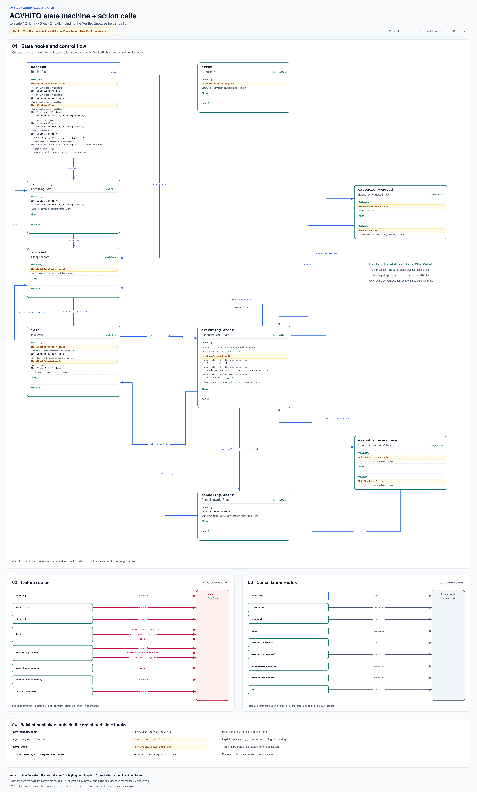

# AGVHITO action map and diagram generators

This companion describes current source behavior, not the proposed SW2-876 changes.



Amber highlights `MakeStartPauseAction`, `MakeStopPauseAction`, and `MakeSoftEStopAction`. `true` activates software E-stop; `false` releases it. All 36 mapped outcome routes are retained; all 23 state call sites are listed below.

## Action call-site inventory

| State | Hook / helper | Exact factory expression | Guard / timing context |
| --- | --- | --- | --- |
| `booting` | `Execute` | **`MakeSoftEStopAction(false)`** | Boot preparation batch; verified together |
| `booting` | `Execute` | `MakeCancelOrderAction()` | Boot preparation batch; verified together |
| `booting` | `Execute` | `MakeExceptionClearAction()` | Boot preparation batch; verified together |
| `booting` | `Execute` | **`MakeStopPauseAction()`** | Boot preparation batch; verified together |
| `booting` | `Execute` | `MakeDownloadMapAction(localization_map_id, kHitoMapVersion)` | If localization map is missing |
| `booting` | `Execute` | `MakeEnableMapAction(localization_map_id, kHitoMapVersion)` | Enable localization map |
| `booting` | `Execute` | `MakeDeleteMapAction(reported_id, reported_map.map_version)` | For each reported map outside the expected set |
| `booting` | `Execute` | `MakeDownloadMapAction(floor_map_id, kHitoMapVersion)` | For each missing floor map |
| `localizing` | `OnEntry` | `MakeEnableMapAction(localization_map_id, kHitoMapVersion)` | Enable the configured localization map on entry |
| `stopped` | `OnEntry` | **`MakeSoftEStopAction(true)`** | Activate software E-stop on entry; failure propagates |
| `idle` | `OnEntry` | **`MakeSoftEStopAction(false)`** | Only when the entry snapshot reports software E-stop |
| `idle` | `OnEntry` | `MakeExceptionClearAction()` | Only when the entry snapshot reports software E-stop |
| `idle` | `OnEntry` | **`MakeStartPauseAction()`** | Always after entry checks |
| `idle` | `OnEntry` | `MakeCancelOrderAction()` | If entry snapshot reports incomplete traversal |
| `executing-order` | `OnEntry` | `MakeEnableMapAction(order_map_id, kHitoMapVersion)` | New-order path: only if enabled map differs / is absent |
| `executing-order` | `OnEntry -> VerifiedUnpause` | **`MakeStopPauseAction()`** | New-order path: only if robot is paused; verified batch |
| `executing-order` | `OnEntry -> VerifiedUnpause` | `MakeExceptionClearAction()` | New-order path: only if robot is paused; verified batch |
| `execution-paused` | `OnEntry` | **`MakeStartPauseAction()`** | Explicit pause entry |
| `execution-paused` | `OnExit` | **`MakeStopPauseAction()`** | Exit after Resume; current hook ignores step_outcome |
| `execution-recovery` | `OnEntry` | **`MakeStartPauseAction()`** | Verification failure is logged and tolerated |
| `execution-recovery` | `OnExit` | **`MakeStopPauseAction()`** | Verification failure is logged and tolerated |
| `canceling-order` | `OnEntry` | `MakeCancelOrderAction()` | Entry always sends cancel, even without local active-order tracking |
| `error` | `OnEntry` | **`MakeSoftEStopAction(true)`** | Software-stop verification failure is logged and tolerated |

## Interpretation

- `Make*Action` constructs a protocol action; `VerifiedPublish` publishes and verifies it.
- `ExecutingOrderState::OnEntry` reaches `MakeStopPauseAction` and exception-clear indirectly through its private `VerifiedUnpause` helper, before enabling a map / publishing a new order. Resume/recovery re-entry skips this new-order path.
- None of the eight lifecycle Step implementations directly calls an instant-action factory. This does not mean Step has no side effects: it can mutate tracking, consume requests, and invoke callbacks.
- Each lifecycle-state card has explicit `OnEntry`, `Step`, and `OnExit` sections separated by dashed lines. Sections without action calls remain blank. Inherited hooks are included as empty sections; a blank section does not mean the method has no other behavior.
- `VerifiedPublish(new_order)` publishes an already assembled order. Embedded actions, such as `MakeLiftAction` in `OrderAssembler`, are assembled elsewhere and are not factory calls inside this state hook.
- Recovery logs/tolerates pause/unpause verification failures; Error logs/tolerates its software-stop verification failure. Other listed verification failures propagate through the existing outcomes.
- Related publishers outside the graph include the initial state request, explicit severe-stop service, terminal/PostStep E-stop, and InstanceManager factsheet discovery request.
- Calls are grouped by hook, not by a promised firmware execution schedule. Multiple actions in a verified batch can have nonblocking protocol semantics.

## Regenerate both diagrams

Use Python 3.10+ with `matplotlib` installed. The scripts do not install packages or access the network. The ZIP includes the exact input snapshot as `agvhito-repomix.md`.

```bash
python3 generate_agvhito_state_machine.py --repo agvhito-repomix.md --out-dir diagrams
python3 generate_agvhito_action_map.py --repo agvhito-repomix.md --out-dir diagrams
```

`generate_agvhito_state_machine.py` reproduces the previously delivered styled state diagram. `generate_agvhito_action_map.py` generates the extended image, SVG, JSON audit inventory, and this companion. Both accept `--dpi`, and export SVG text as paths to avoid font-installation differences in viewers. The preferred fonts are Nimbus Sans / Nimbus Mono PS; Matplotlib uses its available fallback if they are absent.

The layout and guard annotations target this reviewed nine-state snapshot. The audit is a bounded lexical scan, not a C++ compiler, AST parser, or runtime command recorder. It validates 36 mapped routes, 23 action factory sites, and 11 highlighted sites and rejects unexpected changes. When a patch changes the graph, hook calls, helper structure, or guards, update the layout/annotations and review the source before changing these checks. Future action calls are not silently dropped.

## Source anchors

- `include/agvhito/sm/state_strings.hpp` and `src/sm/root.cpp`: names, routing and registration.
- `src/sm/*_state.cpp`: all nine state bodies and the private unpause helper.
- `include/agvhito/topics/instant_actions.hpp`: factory parameters and protocol action types.
- `src/agv.cpp`, `src/instance_manager.cpp`: publishers outside the state hooks.
- `src/order_assembler.cpp`: order payload assembly, including lift actions.
