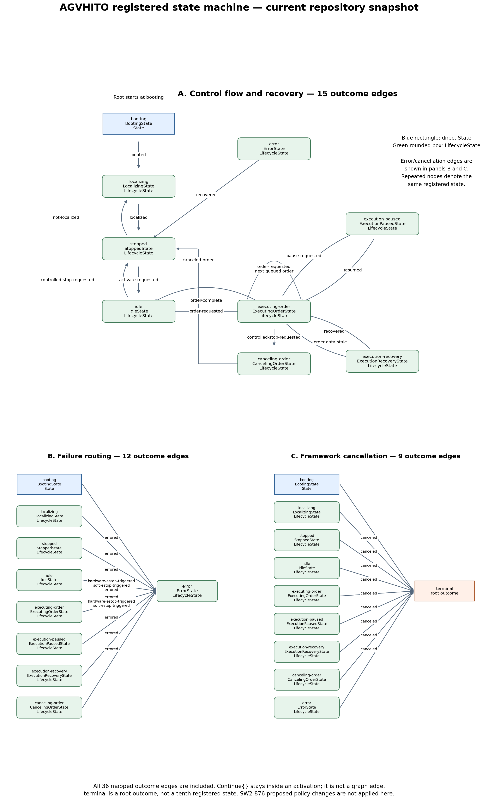
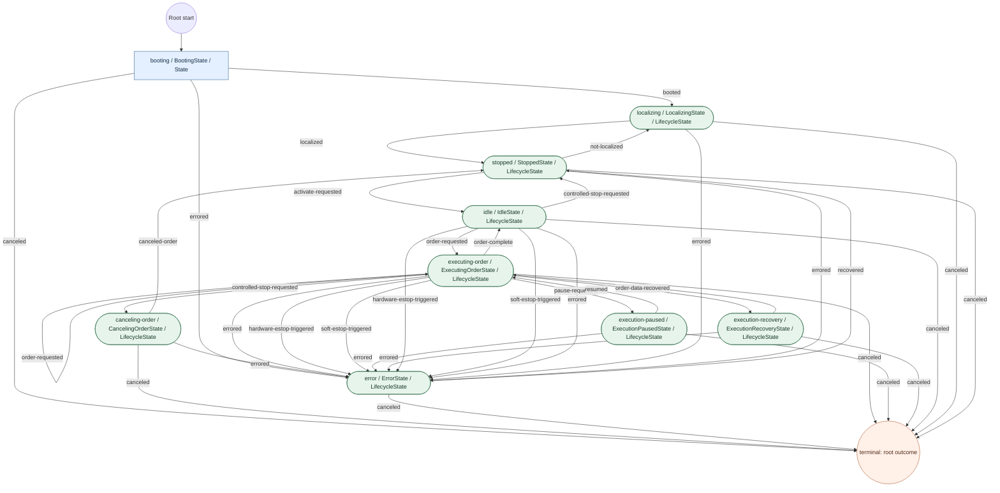

# AGVHITO C++ patch guidelines

Practical reference for implementing patches in this repository, with emphasis on the AGV state machine.

Jump to the [complete graph](#75-complete-registered-state-machine), [transition table](#76-every-mapped-transition-and-its-trigger), [state/blackboard table](#77-state-responsibilities-and-blackboard-dependencies), [50 ms versus 100 ms explanation](#78-the-50-ms-ros-cycle-is-not-a-state-machine-execution-budget), or [state constants, C++ classes, and execution steps](#79-state-constants-c-classes-and-execution-steps).

**Basis:** the attached `agvhito-repomix.md`. Paths below are relative to the AGVHITO package; prepend `src/agvhito/` in the full workspace. **Observed** means a pattern appears in the snapshot. **Recommended** means guidance for new patches, rather than a verified company-wide requirement. Follow the checkout's `AGENTS.md`, formatter, lint configuration, and build settings when available; those policies and the external `stdx`/`yasminx` implementations are not established by this export. The SW2-876 readiness helper remains a proposal, not existing repository behavior.

## 1. Quick reference

| Feature / idiom | Default for a patch | Source examples |
| --- | --- | --- |
| `const auto` | Immutable local values and checked result wrappers; use mutable `auto` when changing or moving the value. | `src/sm/executing_order_state.cpp` |
| `const auto&` | Borrow an existing object when its owner outlives the reference; avoid unnecessary payload copies. | `src/sm/booting_state.cpp` |
| Explicit types | Use when units, ownership, protocol meaning, or conversions need to be visible. | `include/agvhito/sm/timing.hpp`, `src/pose_filter.cpp` |
| Structured bindings | `const auto& [key, value]` for read-only map traversal. | `src/sm/booting_state.cpp` |
| Nested namespaces | Match `volley::agvhito`, `::sm`, `::comms`, or `::sim`; do not invent another namespace for a small helper. | `include/agvhito/sm/context_utils.hpp` |
| Anonymous namespace | File-private constants and implementation helpers in `.cpp` files. | `src/sm/context_utils.cpp` |
| Designated initializers | Name aggregate fields, in declaration order, for context, errors, and protocol values. | `src/sm/root.cpp` |
| `stdx::Expected` | Preserve existing result/error types; check before extracting. | `include/agvhito/sm/context_utils.hpp` |
| `std::optional` | Represent legitimate absence; absence is not automatically failure. | `include/agvhito/comms/i_map_client.hpp` |
| Guard clauses | Return early for stale data, cancellation, and failed operations. | `src/sm/executing_order_state.cpp` |
| `explicit`, `override`, `[[nodiscard]]` | Match existing state declarations and make interface intent visible. | `include/agvhito/sm/localizing_state.hpp` |
| Typed blackboard keys | Use `yasminx::bb::Get/Set/Remove` and declared `bb::kKey...` constants. | `include/agvhito/sm/blackboard.hpp` |
| Outcomes and transition maps | Keep routing constants, supported outcomes, and state registration consistent. | `include/agvhito/sm/state_strings.hpp`, `src/sm/root.cpp` |
| RAII locks and ownership | Use standard scoped locks and smart pointers; respect the framework's ownership. | `src/pose_filter.cpp`, `src/sm/root.cpp` |
| Verification helpers | Separate transport success, robot action completion, telemetry predicates, and physical readiness. | `src/sm/context_utils.cpp` |
| Typed time durations | Use named chrono durations; choose the clock to match the required behavior. | `include/agvhito/sm/timing.hpp` |
| Focused tests | Exercise changed behavior and failure/cancellation paths using existing fixtures. | `test/comms/test_sim_mqtt.cpp`, `test/topics/test_state_predicates.cpp` |

## 2. Local declarations: `auto`, constness, and references

### 2.1 Prefer immutable locals when mutation is unnecessary

**Observed:** state code commonly uses `const auto` for operation results and snapshots:

```cpp
const auto state_or =
    yasminx::bb::Get(*blackboard, bb::kKeyState).value()->GetIfNotStale();
if(!state_or.has_value()) {
  return yasminx::MakeUnexpected(kOutcomeErrored, yasminx::Error {
      .type = kErrorStateStale,
      .message = "State message is stale, preventing order execution",
  });
}
const vstate::State& state = state_or.value();
```

Here `state_or` owns the returned optional snapshot. `state` borrows its contained value and is valid while `state_or` remains alive and unchanged. Explicit `vstate::State&` communicates the protocol type; `const auto& state = state_or.value();` is also reasonable in a small, obvious scope.

| Declaration | Meaning | Use when |
| --- | --- | --- |
| `auto value = expression;` | Usually owns a value; ordinary deduction drops top-level references and constness. | Mutating a local copy or consuming it through a move. |
| `const auto value = expression;` | Owns an immutable local value. | The value/result is only inspected. |
| `auto& value = expression;` | Borrows a mutable lvalue. | Mutation of the original object is intentional. |
| `const auto& value = expression;` | Borrows read-only; can bind to a temporary under applicable lifetime-extension rules. | Avoiding copies with a clear lifetime. |
| `auto&& value = expression;` | Deduces a reference according to value category. | Generic code that needs it; do not use by habit in ordinary state logic. |

**Recommended:** choose ownership first, then constness. `auto` is not automatically a performance improvement; it can copy a large object returned by reference.

### 2.2 Constness of a smart pointer does not make its pointee const

```cpp
const auto queue = yasminx::bb::Get(*blackboard, bb::kKeyOrderQueue).value();
queue->Clear();
```

This is legal: the local smart pointer cannot be reassigned, but the pointed-to queue remains mutable. Use a pointer/reference to a const pointee when the API needs to prevent pointee mutation. Do not infer thread safety from `const auto` or from `shared_ptr` ownership.

### 2.3 Avoid references into temporary result wrappers

```cpp
// Avoid: GetIfNotStale() returns a temporary optional owner.
const auto& state = tracker->GetIfNotStale().value();

// Prefer: keep the owner alive, then validate and borrow.
const auto state_or = tracker->GetIfNotStale();
if(!state_or.has_value()) {
  // Return the appropriate outcome/error for this state.
}
```

The second snippet is a pattern fragment: its absent-value branch must exit before extraction. Binding a reference through `.value()` does not extend the lifetime of the temporary wrapper. Also inspect getters' signatures: a reference to shared mutable storage has different concurrency semantics from an owned snapshot.

### 2.4 Use mutable results when extracting by move

**Observed:** `MapClient::GetMaps` checks `auto map_or`, then extracts with `std::move(map_or).value().value()`.

`std::move` is a cast that permits move-aware overload selection; it does not itself move anything. Moving from a `const` object often selects copying or fails for move-only types. A result that will be consumed should generally be `auto`, not `const auto`.

Do not add `std::move` to every return. Return a local owner normally, as `MakeRootStateMachine` does with `return state_machine;`; return-value optimization or implicit move handles suitable cases. After an actual move, do not assume the source retains its previous content.

## 3. Namespaces, names, headers, and constants

**Observed:** package code uses nested namespace declarations and closing comments:

```cpp
namespace volley::agvhito::sm {

namespace vstate = vda5050_interfaces::v2::state;

namespace {
constexpr auto kPollPeriod {100ms};
}  // namespace

}  // namespace volley::agvhito::sm
```

The duration literal requires `std::chrono_literals` to be in scope. Match the surrounding file's placement. File-level aliases such as `vstate`, `vinstant`, and `vorder` make protocol-heavy code readable.

**Recommended:** keep broad `using namespace` directives out of public headers. Existing `.cpp` files use chrono directives; follow their local style without importing an entire unrelated namespace. Put private helpers in an anonymous namespace in a `.cpp`; expose only helpers that callers need.

Observed naming patterns:

- Types: `BootingState`, `StatePredicate`, `ActionStateManager`.
- Methods/functions: `OnEntry`, `VerifiedPublish`, `GetIfNotStale`.
- Locals: `state_or`, `order_map_id`, `is_canceled`.
- Members: `entry_stamp_`, `order_complete_stamp_`.
- Constants: `kDefaultStepPeriod`, `kOutcomeResumed`, `kErrorStateStale`.

The `_or` suffix appears for both expected results and optional values. Determine semantics from the declared return type, rather than the name alone.

**Observed:** headers use `#pragma once`; `.cpp` files generally include their own header first, then external headers, then package headers. Include what new code directly needs, rather than relying on incidental transitive includes. Preserve intentional `IWYU pragma: keep`, formatting controls, and narrow lint suppressions; do not copy suppressions into unrelated code.

Use `inline constexpr` for shared header constants whose type supports it. The transition maps are `inline const yasmin::Transitions`, not `constexpr`; do not assume every runtime container supports constant evaluation. Keep units in the type or name:

```cpp
inline constexpr std::chrono::milliseconds kDefaultStepPeriod {100};
inline constexpr std::chrono::seconds kDefaultLogThrottlePeriod {5};
```

**Recommended:** use strong/explicit types at boundaries when deduction could conceal a unit, signedness, narrowing conversion, or ownership contract. Braced initialization helps catch many narrowing conversions, but does not make every conversion safe.

## 4. Structured bindings and ranges

**Observed:** boot code reads floor-map entries as:

```cpp
for(const auto& [_, floor_map_id] : floor_map_ids) {
  expected_map_ids.insert(floor_map_id);
}
```

`const auto&` avoids copying the entry and prevents mutation through these bindings. `auto [key, value]` copies an entry; changing the copied value does not update the container. `auto& [key, value]` borrows it for mutation, subject to the container's type rules: a map's key is normally const.

`_` is an ordinary variable name here, not a special discard operator. Use a meaningful name if the value will be used, and follow local lint requirements for unused bindings. Do not keep these references after erasing entries or invalidating the underlying container.

**Observed:** `OutcomesOf` uses `std::views::keys` and constructs an owned outcome container:

```cpp
inline yasmin::Outcomes OutcomesOf(const yasmin::Transitions& transitions) {
  const auto keys = std::views::keys(transitions);
  return {keys.begin(), keys.end()};
}
```

The view refers to `transitions`; the returned outcomes own their elements. Prefer existing `std::ranges::any_of`, `all_of`, and `find_if` patterns for straightforward checks. Do not return a view into a local container or build a complex pipeline that obscures the state-machine decision.

## 5. Aggregates and designated initializers

**Observed:** contexts, errors, lifecycle results, and protocol messages often use named aggregate members:

```cpp
yasminx::StateContext {
    .clock = std::move(clock),
    .logger = std::move(logger),
}

yasminx::Error {
    .type = kErrorStateStale,
    .message = "State is stale",
}

yasminx::LifecycleState::Finished {.outcome = kOutcomeOrderDataStale}
```

**Recommended:** use this style when the type is an aggregate and field names clarify meaning. C++ designated initializers must follow member declaration order. They are not arbitrary-order named constructor arguments; do not use them on a nonaggregate type or mix designated and positional clauses in the same aggregate initializer.

Omitted fields use their default member initializer when provided, or the applicable aggregate-initialization rules otherwise. Inspect the declaration before relying on a default. External protocol structs can contain scalar fields without safe default member initialization; existing predicate tests explicitly set `state.safety_state.e_stop` for meaningful checks. Value initialization (`State state {};`) is useful, but still set the fields that express the test's intended state.

When adding an aggregate member, inspect existing aggregate call sites and defaults. A field addition can change behavior even when old code still compiles.

## 6. Results: `stdx::Expected`, `std::expected`, and optional values

### 6.1 Use the repository abstraction in repository APIs

**Observed:** this package uses `stdx::Expected`, `stdx::Unexpected`, and `stdx::Result`, rather than spelling its APIs with `std::expected`.

| Shape in this package | Meaning |
| --- | --- |
| `stdx::Expected<T, yasminx::Error>` | Helper returns a value or a structured diagnostic error. |
| `stdx::Expected<void, yasminx::Error>` | Helper succeeds without a payload, or returns a diagnostic error. |
| `stdx::Expected<void, yasminx::ErrorOutcome>` | State entry succeeds, or returns failure with routing information. |
| `stdx::Expected<StepResult, yasminx::ErrorOutcome>` | State step continues/finishes, or returns a routed failure. |
| `stdx::Expected<yasminx::Outcome, yasminx::ErrorOutcome>` | State execution/exit returns an outcome or routed failure. |
| `stdx::Expected<T>` / `stdx::Result` | Uses repository defaults/aliases; inspect `stdx/expected.hpp` before depending on their exact definitions. |
| `std::optional<T>` | A value may legitimately be absent. |

`std::expected<T, E>` is the standard C++23 value-or-error facility. It is conceptually related, but the attached export does not establish whether `stdx::Expected` is an alias, wrapper, or separate implementation. Do not replace it opportunistically or assume support for `and_then`, `transform`, or every standard overload.

In particular, the repository has calls such as `stdx::Unexpected("... {}", argument)`. That formatting convenience is not the ordinary `std::unexpected` construction API. Preserve the existing abstraction unless a patch explicitly addresses its migration.

### 6.2 Check the active alternative before extraction

**Observed helper pattern:**

```cpp
const auto published = VerifiedPublish(
    {MakeCancelOrderAction()}, *blackboard, GetContext(),
    [this] { return is_canceled(); });
if(!published.has_value()) {
  return yasminx::MakeUnexpected(kOutcomeErrored, published.error());
}
return {};
```

`.value()` requires a value; `.error()` requires an error. The exact invalid-access behavior of the repository wrapper is external to this pack; never rely on it for ordinary control flow.

For an expected-with-void success, `return {};` expresses successful completion in the observed code. It does not universally mean success: in an optional-returning function `{}` can mean absence; in an expected-with-value it may construct a default value. Make the return type and intent clear.

### 6.3 Preserve the distinction between diagnostics and graph routing

```cpp
// In a helper returning Expected<void, yasminx::Error>:
return stdx::Unexpected(yasminx::Error {
    .type = kErrorVerifyTimeout,
    .message = "Timed out waiting for traversal completion",
});

// At the state boundary, choose an outcome for that helper failure:
return yasminx::MakeUnexpected(kOutcomeErrored, result.error());

// If result already contains ErrorOutcome, preserve its routing:
return stdx::Unexpected(result.error());
```

These are separate pattern fragments with their corresponding return types. `yasminx::Error` carries diagnostics; `ErrorOutcome` adds outcome/routing semantics. Do not wrap an already routed failure as though it were only a diagnostic, or flatten a specific hardware/software-stop outcome to `errored` without intent. `CheckEStopClear` demonstrates routed errors.

### 6.4 Optional absence and operation failure are different

**Observed:** `IMapClient::GetMap` returns `stdx::Expected<std::optional<Map>>`:

1. Outer error: request/decoding failed.
2. Outer success, empty optional: map is absent.
3. Outer success, present optional: map exists.

Handle both layers explicitly. Likewise, a tracked state's empty optional means fresh data is unavailable; a missing active order has different meaning and a different diagnostic. `PausedIs(false)` interprets an unset pause flag as false in the current code; do not equate that default with positive firmware-readiness evidence.

## 7. State-machine interface and routing conventions

### 7.1 Choose the existing state model that fits the task

**Observed:** `BootingState` derives from `yasminx::State` and supplies `Execute`. Most other states derive from `yasminx::LifecycleState` and implement entry and polling hooks.

| Hook | Observed purpose | Return shape |
| --- | --- | --- |
| `Execute` | Entire execution body, such as boot initialization. | Expected outcome / error outcome. |
| `OnEntry` | Initialization, validation, or a one-time entry command. | Expected void / error outcome. |
| `Step` | Inspect fresh telemetry or requests and decide whether to continue. | Expected `StepResult` / error outcome. |
| `OnExit` | Exit work and/or final outcome selection when overridden. | Expected outcome / error outcome. |

A typical declaration uses `explicit` on the constructor, `override` on hooks, and `[[nodiscard]]` on their results. Preserve framework signatures exactly; a similarly named method with the wrong signature is not an override.

Constructors derive their supported outcomes from the transition map:

```cpp
ExecutionPausedState::ExecutionPausedState(yasminx::StateContext context) :
    yasminx::LifecycleState(
        OutcomesOf(kExecutionPausedTransitions),
        std::move(context), kDefaultStepPeriod) {
}
```

### 7.2 Keep the step result separate from the final outcome

**Observed:**

```cpp
return yasminx::LifecycleState::Continue {};
return yasminx::LifecycleState::Finished {.outcome = kOutcomeOrderComplete};
```

`Continue` asks the lifecycle to keep polling; `Finished` ends that polling phase. In paused/recovery states, `Step` returns `Finished {}` and their `OnExit` supplies `kOutcomeResumed` / `kOutcomeRecovered`. Preserve that pairing. Removing an exit override requires checking what happens to a finish without an explicit outcome.

The external `yasminx` implementation is not included here. Check it before relying on the precise order of hooks during cancellation, entry failure, step failure, or exit failure. For a new hook with physical side effects, cancellation behavior must be explicit and covered by a test; do not assume a later canceled outcome undoes an earlier command.

### 7.3 Keep graph declarations and behavior consistent

Adding a routed outcome requires checking:

1. Its name/constant in `include/agvhito/sm/state_strings.hpp`.
2. The source state's transition map, including cancellation.
3. `OutcomesOf(...)` used in the state constructor.
4. Destination state registration in `src/sm/root.cpp`.
5. Tests for both the returned outcome and resulting behavior.

The graph is compiled C++ in this package. A new diagnostic type can be independent of graph routing: several failures can intentionally share `kOutcomeErrored` while preserving distinct `kError...` types.

Do not confuse `kOutcomeCanceledOrder` (robot-order cancellation completed, routing to Stopped) with `yasminx::kOutcomeCanceled` (framework/state execution canceled, routing to the terminal outcome in these maps).

### 7.4 Preserve re-entry behavior and order ownership

**Observed:** `ExecutingOrderState::OnEntry` returns early when re-entered from paused or recovery because the robot already has the order. Re-entering after a queued-order self-transition is different: it dispatches a new order.

**Recommended:** before changing entry code, enumerate initial entry, self-transition, resume, and recovery. A validation or publication placed before the existing early return may alter all of them. Avoid republishing an accepted order as a side effect of resume, and preserve the sequence of verified publication, active-order installation, and pending-queue removal.

Reset per-execution members in the appropriate entry path, as existing code does with `order_complete_stamp_.reset()`. State objects can be reused; constructor initialization alone may not cover re-entry.

### 7.5 Complete registered state machine

This is the **current snapshot**, including its existing automatic pause/software-E-stop commands. It is not the proposed SW2-876 implementation. The graph comes from `include/agvhito/sm/state_strings.hpp`; classes and registration come from the state headers and `src/sm/root.cpp`.

There are **nine registered states**: one direct `yasminx::State` (`BootingState`) and eight `yasminx::LifecycleState` subclasses. `terminal` is a root outcome, not another registered state. The root registers Booting first as the startup state. A lifecycle state is still a state; the distinction is who implements the execution/polling loop.



The static figure partitions all 36 outcome edges across three panels for legibility. Repeated nodes are the same registered state. Blue rectangles denote direct `State`; green rounded boxes denote `LifecycleState`. Error-routing labels that share a target are displayed on separate lines. No `Continue{}` polling loops are represented as graph transitions.

The full graph is also given below as editable Mermaid. It uses ordinary text labels and no HTML/`foreignObject` content. If VS Code's Mermaid rendering fails, use the PNG above; the ZIP includes the PNG and SVG companions.



### 7.6 Every mapped transition and its trigger

The table distinguishes a **declared route** from what the concrete state body currently does. Verification failures include action assembly, transport, action-status, or state-predicate failure where that operation is used. Exact error handling remains state-specific.

| Source state | Outcome | Destination | Current trigger / meaning |
| --- | --- | --- | --- |
| `booting` | `booted` | `localizing` | Boot telemetry/preparation and map action verification succeed. |
| `booting` | `errored` | `error` | Initial fresh-state timeout or boot/map verification failure. |
| `booting` | `canceled` | `terminal` | Framework/state execution canceled; terminal root routing. |
| `localizing` | `localized` | `stopped` | Fresh state satisfies IsPositionLocalized. |
| `localizing` | `errored` | `error` | Enable-localization-map verification fails on entry. |
| `localizing` | `canceled` | `terminal` | Framework/state execution canceled; terminal root routing. |
| `stopped` | `not-localized` | `localizing` | Fresh state no longer satisfies IsPositionLocalized; checked before Activate. |
| `stopped` | `activate-requested` | `idle` | Localized fresh state and consumed Activate request. |
| `stopped` | `errored` | `error` | Software-E-stop verification fails on entry. |
| `stopped` | `canceled` | `terminal` | Framework/state execution canceled; terminal root routing. |
| `idle` | `order-requested` | `executing-order` | Fresh/E-stop-clear state, no handled controlled-stop request, and nonempty pending-order queue. |
| `idle` | `controlled-stop-requested` | `stopped` | ControlledStop request consumed while idle. |
| `idle` | `hardware-estop-triggered` | `error` | Fresh-state hardware E-stop check reports a manual/hardware stop. |
| `idle` | `soft-estop-triggered` | `error` | Fresh-state software E-stop check reports a software stop. |
| `idle` | `errored` | `error` | Stale entry state or software-stop-release/pause/cancel/state verification fails. |
| `idle` | `canceled` | `terminal` | Framework/state execution canceled; terminal root routing. |
| `executing-order` | `order-complete` | `idle` | Order complete, post-completion common telemetry and node-accuracy check pass, and queue is empty. |
| `executing-order` | `order-requested` | `executing-order` | Same completion gates pass, with another queued order; creates a new activation for dispatch. |
| `executing-order` | `order-data-stale` | `execution-recovery` | State, filtered pose, or required common telemetry is unavailable/stale during Step. |
| `executing-order` | `errored` | `error` | Entry/Step failure such as empty queue, stale entry state, missing active order, rejected map/order, failed order progress, or unacceptable node accuracy. |
| `executing-order` | `controlled-stop-requested` | `canceling-order` | ControlledStop request consumed during execution. |
| `executing-order` | `hardware-estop-triggered` | `error` | Fresh-state hardware E-stop check reports a manual/hardware stop. |
| `executing-order` | `soft-estop-triggered` | `error` | Fresh-state software E-stop check reports a software stop. |
| `executing-order` | `pause-requested` | `execution-paused` | Pause request consumed during execution. |
| `executing-order` | `canceled` | `terminal` | Framework/state execution canceled; terminal root routing. |
| `execution-paused` | `resumed` | `executing-order` | Resume consumed; Step finishes; custom exit successfully verifies unpause. |
| `execution-paused` | `errored` | `error` | Pause entry or unpause exit verification fails. |
| `execution-paused` | `canceled` | `terminal` | Framework/state execution canceled; terminal root routing. |
| `execution-recovery` | `recovered` | `executing-order` | Telemetry becomes fresh; custom exit attempts unpause and returns recovered even if its verification failed. |
| `execution-recovery` | `errored` | `error` | Declared route; current hooks tolerate pause/unpause verification failures instead of returning it. |
| `execution-recovery` | `canceled` | `terminal` | Framework/state execution canceled; terminal root routing. |
| `canceling-order` | `canceled-order` | `stopped` | Fresh state reports no remaining traversal states and not driving; active-order tracking removed. |
| `canceling-order` | `errored` | `error` | Cancel-order verification fails on entry. |
| `canceling-order` | `canceled` | `terminal` | Framework/state execution canceled; terminal root routing. |
| `error` | `recovered` | `stopped` | Fresh state, hardware E-stop clear, and 5 s since entry; clears request/active order/queue. |
| `error` | `canceled` | `terminal` | Framework/state execution canceled; terminal root routing. |

Cancellation routes describe framework cancellation, not a robot's completed cancel-order action. In particular, `canceled-order` routes to Stopped; `canceled` routes to the root's terminal outcome. The external framework implements cancellation delivery and error-to-outcome conversion; the attached package exposes the supported maps and subclass hooks.

### 7.7 State responsibilities and blackboard dependencies

`R` means read, `W` means install/update, `D` means remove, `C` means consume via `TakeRequest`, and `M` means mutate an object retrieved through the key. These are logical operations, not claims about atomicity. Entries are the exact C++ key identifiers from `include/agvhito/sm/blackboard.hpp` unless explicitly qualified as a framework key.

The shared **action verification dependencies** are `kKeyInstantAssembler` (R/use), `kKeyMqttPublisher` (R/use), and `kKeyActionStateManager` (R/status lookup), accessed indirectly through `VerifiedPublish(actions)`. The **state verification dependency** is `kKeyState` (R/fresh snapshot) through `VerifyState`; the order overload uses `kKeyMqttPublisher` and then `kKeyState`. These dependencies count even when a state body only calls a helper.

| State / base | Direct blackboard entries | Indirect helper entries | Entry / execution behavior | Polling and exit behavior |
| --- | --- | --- | --- | --- |
| `booting` / `BootingState` / direct `State` | `kKeyState` R; `kKeyLocalizationMapId` R; `kKeyFloorMapIds` R | Action verification dependencies; state verification dependency. | One `Execute` body waits for fresh state, using a 500 ms retry period and 1 minute initial deadline. Verifies a batch releasing software E-stop, canceling prior order, clearing exceptions, and unpausing. Verifies no E-stop/unpaused; reads fresh state again; assembles download/enable/delete-map operations and verifies them. | No lifecycle `Step` loop. Its own synchronous waits can take much longer than 50/100 ms. Returns `booted`, routed failure, or canceled. The snapshot has no SW2-876 settling barrier. |
| `localizing` / `LocalizingState` / `LifecycleState` | `kKeyLocalizationMapId` R on entry; `kKeyState` R in Step | Action verification dependencies. | `OnEntry` enables and verifies the localization map. | Step waits for fresh state satisfying `IsPositionLocalized`. Stale/unlocalized state returns `Continue{}`; localized state finishes with `localized`. No custom exit hook. |
| `stopped` / `StoppedState` / `LifecycleState` | `kKeyOrderQueue` R/M (`Clear`); `kKeyState` R; `kKeyRequest` C | Action verification dependencies. | `OnEntry` requests and verifies software E-stop, then clears pending orders. If verification fails, entry returns before queue clearing. | Step waits for fresh state. Loss of localization finishes with `not-localized`; otherwise an Activate request finishes with `activate-requested`. No custom exit hook. |
| `idle` / `IdleState` / `LifecycleState` | `kKeyState` R; `kKeyRequest` C; `kKeyOrderQueue` R (`Empty`) | Action verification dependencies; state verification dependency. | Entry requires fresh telemetry; hardware E-stop returns its routed error. If software E-stopped, clears it and exceptions. Pauses, verifies pause telemetry, and may cancel traversal based on its earlier state snapshot. | Step continues on stale state; checks E-stops; consumes controlled-stop requests before checking queued orders. Finishes with `controlled-stop-requested` or `order-requested`. No custom exit hook. |
| `executing-order` / `ExecutingOrderState` / `LifecycleState` | `kKeyState` R; `kKeyOrderQueue` R/M (`Front`, `Empty`, `Pop`); `kKeyActionStateManager` R/M (`Clear`); `kKeyActiveOrder` R/W/D/M (`Process`); `kKeyRequest` C; `kKeyPoseFilter` R; `kKeyCommonMessage` R; `kKeyNodeAccuracyCallback` R/invoke | Action verification dependencies; order verification publisher/state dependencies; state verification dependency in existing `VerifiedUnpause`. | Entry resets completion timestamp. Resume/recovery re-entry returns early without publishing an order. New-order entry checks queue and fresh state, may unpause/clear exceptions, enables the needed map, clears action-status tracking, verifies order publication/acceptance, installs `ActiveOrder`, and pops the pending order. | Step checks state, E-stops, pause/controlled-stop requests, active order, filtered pose, and order progress. Stale state/pose/common data routes to recovery; failures route to Error. On completion, waits for common telemetry sampled after completion, reports/checks node accuracy, removes active order, then returns `order-complete` or `order-requested` for a queued successor. No custom exit hook. |
| `execution-paused` / `ExecutionPausedState` / `LifecycleState` | `kKeyRequest` C in Step | Action verification dependencies on entry/exit. | Entry sends and verifies `startPause`. | Step consumes requests until Resume, then returns `Finished{}` with no explicit outcome. Custom exit verifies `stopPause` and supplies `resumed`, or routed failure. Existing exit ignores its `step_outcome`; review cancellation before copying this side effect. |
| `execution-recovery` / `ExecutionRecoveryState` / `LifecycleState` | `kKeyState` R; `kKeyPoseFilter` R; `kKeyCommonMessage` R | Action verification dependencies on entry/exit. | Entry attempts pause; logs verification failure and continues rather than propagating it. | Step waits until all three telemetry sources are nonstale/available. Returns `Finished{}` without outcome. Custom exit attempts unpause, logs failure and continues, then returns `recovered`. The transition map includes `errored`, but current hooks explicitly tolerate their pause/unpause verification failures. |
| `canceling-order` / `CancelingOrderState` / `LifecycleState` | `kKeyState` R; `kKeyActiveOrder` D on completion | Action verification dependencies. | Entry always sends cancel-order and waits for action verification, even without a locally reported active order. | Step waits for fresh state and `IsTraversalComplete` (no node/edge states and not driving). Only then removes active-order tracking and finishes with `canceled-order`. No custom exit hook. |
| `error` / `ErrorState` / `LifecycleState` | `yasminx::bb::kStateError` R (optional diagnostics); `kKeyState` R; `kKeyOrderQueue` R/M (`Clear`); `kKeyRequest` D; `kKeyActiveOrder` D | Action verification dependencies. | Entry attempts software E-stop, tolerates verification failure, logs transition/error/fresh state if available, clears pending orders, and records entry time. | Step waits for fresh telemetry and hardware E-stop release. Once at least 5 s have elapsed since the recorded entry time, removes pending request/active-order tracking, clears the queue again, and finishes with `recovered` to Stopped. It does not require software E-stop to be cleared before recovery. No custom exit hook. |

`kKeyVisualization` is initialized and maintained by `Agv`, but none of these state bodies or the verified-publish/state helpers reads it in this snapshot. Do not list every blackboard key as a dependency of every state. The state context's clock/logger are constructor dependencies rather than blackboard entries.

Framework bookkeeping is separate from these direct accesses. The prior source walkthrough reproduces a `yasminx::State::execute` wrapper that reads `yasminx::bb::kTransition` and writes `yasminx::bb::kStateError` for an error outcome. That external implementation is not contained in `agvhito-repomix.md`; inspect the dependency checkout when changing its contract. The Error state itself does directly read `kStateError`, as shown in this package.

### 7.8 The 50 ms ROS cycle is not a state-machine execution budget

**No: most states do not have self-transitions for unfinished work.** The source has two different periodic mechanisms:

| Mechanism | Configured period | Source | Work performed |
| --- | --- | --- | --- |
| ROS adapter cycle | 50 ms (nominal 20 Hz) | `src/agv_ros.cpp`: `kCyclePeriod`, `SetupPublishers`, `CycleCallback` | Calls `Agv::Step`: PreStep, subscription draining, message-staleness reporting, terminal/PostStep checks. Received action/state feedback updates shared trackers/managers. |
| Lifecycle polling | 100 ms (nominal 10 Hz) | `include/agvhito/sm/timing.hpp`: `kDefaultStepPeriod`; all eight lifecycle constructors | Requests a polling cadence for the active lifecycle state's `Step`, under the framework's execution loop. |
| Helper verification polling | 100 ms | `src/sm/context_utils.cpp`: `kPollPeriod` | Waits within a verification call for action status or a state predicate. This is separate from lifecycle Step polling. |
| Boot's initial telemetry retry | 500 ms | `src/sm/booting_state.cpp` | Retries fresh-state acquisition inside Booting's single Execute call; initial deadline is 1 minute. |

`Agv::SetupStateMachine` separately calls `state_machine_->Run(blackboard_)`; the adapter's 50 ms callback does not directly invoke each state's Step. The previous walkthrough reproduces the root's separate worker implementation; the current export establishes the call to Run, while its implementation is in external `yasminx`.

A lifecycle activation behaves conceptually as follows:

```cpp
// Conceptual flow, not replacement framework code.
OnEntry(...);                 // once for this activation
while(!finished_or_canceled) {
  auto result = Step(...);    // synchronous call; can take longer than a period
  if(result is Continue) {
    wait_for_next_poll();     // remain in the same activation
  } else if(result is Finished) {
    finish_this_activation();
  } else {
    propagate_routed_error();
  }
}
// Finish/cancellation exit behavior follows the framework contract.
```

`Continue{}` is an internal lifecycle-loop result, not a routed outcome. It keeps local members intact, does not call entry again, and does not resend entry actions merely because time passed. `Finished{.outcome = ...}` ends polling and supplies an outcome; paused/recovery use a custom exit to supply the outcome after `Finished{}`.

There is **one explicit graph self-transition**: `executing-order --order-requested--> executing-order`. Its trigger is completion of the current order with another queued order. The resulting new activation runs entry to publish that next order. The repeated state identity also appears in framework examples as a loopback, but it has this specific dispatch meaning—not “ran out of 50 ms.”

Neither 50 ms nor 100 ms is a preemption deadline. Entry, exit, Step, and helper calls are synchronous on their execution path; verified publication can wait up to its own timeout (35 s for verification in this snapshot). A slow call is not automatically interrupted after one tick or converted into a self-transition. The exact rate implementation determines scheduling/overrun behavior, and OS/executor load can delay callbacks. Treat the configured periods as requested cadences, not real-time guarantees.

For future patches, use `Continue{}` when a polling condition has not yet been satisfied. Add a real self-transition only when a fresh activation and repeated entry work are intended. Test that repeated Continue results do not duplicate entry commands, and that the queued-order self-transition publishes one new order rather than republishing the previous accepted order.

### 7.9 State constants, C++ classes, and execution steps

All classes below are in `volley::agvhito::sm`. The first column shows the **actual state-name constant and string**, not an outcome constant. Names/maps are declared in `include/agvhito/sm/state_strings.hpp`; `src/sm/root.cpp` binds each name to its class and transition map. Each class implementation is in the corresponding `src/sm/*_state.cpp` file.

This table describes **current source behavior**. Step numbers express host-side control flow; actions published in the same batch are not thereby guaranteed to execute serially on firmware. On failure, later steps in that execution path are skipped unless the row explicitly says the error is tolerated. `Continue{}` repeats polling within the current activation. Booting derives from `yasminx::State`; all other rows derive from `yasminx::LifecycleState` and pass `kDefaultStepPeriod` (100 ms) to its constructor.

| State-machine name: constant = string | Associated C++ class | Technical execution steps |
| --- | --- | --- |
| `kStateBooting = "booting"` | `BootingState` — direct `State` | **Execute:**<br>**1.** Choose `rclcppx::GetSteadyOrSimClock(GetClock())`; set a 1 minute initial-state deadline.<br>**2.** Repeatedly check cancellation and obtain nonstale `kKeyState`, retrying every 500 ms. Return canceled on interruption or `errored` if the initial state never becomes available.<br>**3.** Use `VerifiedPublish` to send one batch containing software-E-stop release, cancel-order, exception-clear, and `stopPause`; wait for the generated action IDs to report `FINISHED`.<br>**4.** Use `VerifyState(All({AnyEStopIs(false), PausedIs(false)}))` to wait for fresh telemetry satisfying both predicates.<br>**5.** Re-read fresh state; read localization/floor map IDs and construct the expected-map set from them.<br>**6.** Assemble map actions: download the localization map if missing; enable it; delete reported maps outside the expected set; download missing floor maps.<br>**7.** Publish/verify that map-action batch, then return `kOutcomeBooted`. Helper failures are adapted to `kOutcomeErrored` with diagnostic details. This snapshot has no separate post-unpause settling guard. |
| `kStateLocalizing = "localizing"` | `LocalizingState` — `LifecycleState` | **OnEntry:**<br>**1.** Read `kKeyLocalizationMapId`.<br>**2.** Publish `MakeEnableMapAction(localization_map_id, kHitoMapVersion)` and verify its action completion; return routed `errored` if verification fails.<br>**Step:**<br>**3.** Read a nonstale robot state; return `Continue{}` if unavailable.<br>**4.** Evaluate `IsPositionLocalized(state)`. Return `Continue{}` while false, or `Finished{.outcome = kOutcomeLocalized}` when true.<br>**Exit:**<br>**5.** No custom `OnExit` is declared; the lifecycle handles the explicit completion outcome. |
| `kStateStopped = "stopped"` | `StoppedState` — `LifecycleState` | **OnEntry:**<br>**1.** Publish software-E-stop activation and wait for verified action completion. Failure returns routed `errored` before subsequent entry work.<br>**2.** Clear the local pending `OrderQueue`.<br>**Step:**<br>**3.** Read nonstale state; continue polling when stale.<br>**4.** Check `IsPositionLocalized` first. If localization is lost, finish with `kOutcomeNotLocalized` to re-enter Localizing.<br>**5.** Consume the request slot through `TakeRequest`. If it contains Activate, finish with `kOutcomeActivateRequested` to enter Idle; otherwise continue polling.<br>**Exit:**<br>**6.** No custom `OnExit`. The adapter's Stopped state retains its current software-stop policy; this is one of the behaviors SW2-876 proposes changing. |
| `kStateIdle = "idle"` | `IdleState` — `LifecycleState` | **OnEntry:**<br>**1.** Require a fresh state snapshot; otherwise return `errored`. A reported hardware E-stop returns its dedicated routed error.<br>**2.** If software E-stopped, publish/verify software-stop release plus exception-clear.<br>**3.** Publish/verify `startPause`; separately verify fresh telemetry satisfies `PausedIs(true)`.<br>**4.** Inspect traversal using the state snapshot captured at entry. If traversal was incomplete, publish/verify cancel-order. The current entry does not subsequently call `VerifyState(TraversalComplete())`.<br>**Step:**<br>**5.** Read fresh state; continue on stale telemetry. Use `CheckEStopClear` and preserve its hardware/software-stop error routing.<br>**6.** Consume a ControlledStop request and finish with `kOutcomeControlledStopRequested` if present; this check precedes queue dispatch.<br>**7.** If the pending queue is nonempty, finish with `kOutcomeOrderRequested`; otherwise return `Continue{}`.<br>**Exit:**<br>**8.** No custom `OnExit`. |
| `kStateExecutingOrder = "executing-order"` | `ExecutingOrderState` — `LifecycleState` | **OnEntry:**<br>**1.** Reset `order_complete_stamp_`. If the incoming transition is from Paused or Recovery, return entry success immediately: the existing onboard order must not be republished.<br>**2.** For a new dispatch, require a nonempty queue and fresh state; if the state reports paused, run the private `VerifiedUnpause` (unpause plus exception-clear action verification, then unpaused-state verification).<br>**3.** Read `OrderQueue::Front`; compare its map with the currently enabled map and publish/verify enable-map if needed.<br>**4.** Clear action-state tracking; publish/verify the assembled order through the order overload, which waits for its order ID to be echoed.<br>**5.** Install an `ActiveOrder` in the blackboard and pop the dispatched order from the pending queue.<br>**Step:**<br>**6.** Require fresh state; otherwise finish with `kOutcomeOrderDataStale`. Check E-stops, then consume Pause/ControlledStop requests and finish with their corresponding outcomes.<br>**7.** Require an active-order object; missing tracking returns `errored`. Require fresh filtered pose; unavailable pose routes to Recovery.<br>**8.** Call `ActiveOrder::Process(state, pose)`. Failed progress returns `errored`; in-progress work returns `Continue{}` after appropriate diagnostics.<br>**9.** For complete progress, record the state completion timestamp once. Require fresh common telemetry sampled strictly after that timestamp; stale data routes to Recovery, and an older sample keeps polling.<br>**10.** Build node-accuracy data, invoke the registered callback when present/nonempty, then check accuracy tolerances. An unacceptable result returns `errored`.<br>**11.** Remove active-order tracking. Finish with `kOutcomeOrderRequested` if another order is queued (the real graph self-transition), or `kOutcomeOrderComplete` if not.<br>**Exit:**<br>**12.** No custom `OnExit`. |
| `kStateExecutionPaused = "execution-paused"` | `ExecutionPausedState` — `LifecycleState` | **OnEntry:**<br>**1.** Publish/verify `startPause`; failure returns routed `errored`.<br>**Step:**<br>**2.** Consume requests through `TakeRequest`. Until Resume is received, return `Continue{}`.<br>**3.** On Resume, return `Finished{}` with no explicit outcome; this class's exit hook supplies the routing outcome.<br>**OnExit:**<br>**4.** Publish/verify `stopPause`; failure returns routed `errored`.<br>**5.** Return `kOutcomeResumed`, routing back to ExecutingOrder's existing-order entry path. The current exit ignores its `step_outcome` parameter; the SW2-876 proposal adds cancellation protection and shared settling verification. |
| `kStateExecutionRecovery = "execution-recovery"` | `ExecutionRecoveryState` — `LifecycleState` | **OnEntry:**<br>**1.** Attempt verified `startPause`. If verification fails, log the failure and still return entry success because this state is handling telemetry/connectivity problems.<br>**Step:**<br>**2.** Check state tracker staleness, filtered-pose availability, and common-message tracker staleness.<br>**3.** If any required data is unavailable/stale, return `Continue{}`. When all three recover, return `Finished{}` without an explicit outcome.<br>**OnExit:**<br>**4.** Attempt verified `stopPause`; log/tolerate failure rather than returning it.<br>**5.** Return `kOutcomeRecovered`, routing back to ExecutingOrder's existing-order entry path. Its transition map declares an `errored` route, but these pause/unpause failures deliberately do not take it. |
| `kStateCancelingOrder = "canceling-order"` | `CancelingOrderState` — `LifecycleState` | **OnEntry:**<br>**1.** Publish cancel-order even when a local active order is not reported; verify the action completion. Failure returns routed `errored`.<br>**Step:**<br>**2.** Read fresh state. If unavailable, log a throttled warning and return `Continue{}`.<br>**3.** Evaluate `IsTraversalComplete(state)`: no remaining node states, no remaining edge states, and `driving == false`. Continue polling until all hold; a finished cancel action alone is insufficient.<br>**4.** Remove `kKeyActiveOrder` only after traversal completion, then finish with `kOutcomeCanceledOrder` to enter Stopped.<br>**Exit:**<br>**5.** No custom `OnExit`. Robot-order cancellation completion is distinct from framework execution cancellation. |
| `kStateError = "error"` | `ErrorState` — `LifecycleState` | **OnEntry:**<br>**1.** Attempt verified software-E-stop activation; log/tolerate failure rather than failing entry.<br>**2.** Log the incoming transition, optional `yasminx::bb::kStateError`, and latest fresh state when available.<br>**3.** Clear pending orders and record `entry_stamp_` after this entry work completes.<br>**Step:**<br>**4.** Wait for nonstale state; continue polling while unavailable.<br>**5.** If hardware E-stop remains set, continue polling until it is released. The recovery gate does not require software E-stop release.<br>**6.** Check elapsed context-clock time against the 5 s recovery delay. Continue while the delay has not elapsed; this is elapsed time since entry, not a new 5 s delay after hardware-stop release.<br>**7.** Remove the pending request and active-order tracking, clear the pending queue again, and finish with `kOutcomeRecovered` to enter Stopped.<br>**Exit:**<br>**8.** No custom `OnExit`. Removing local active-order tracking is not itself a cancel command to the robot. |

`MakeRootStateMachine` constructs the enclosing `yasminx::RootStateMachine`, supplies its clock/logger context and terminal outcome, and registers these nine class instances with their transition maps. The root is the routing container, not another row/state called `terminal`. For exact blackboard accesses and all error/cancellation routes, use sections 7.7 and 7.6 alongside this execution-step table.

## 8. Blackboard access and telemetry

**Observed:** keys couple the name and value type:

```cpp
inline constexpr yasminx::bb::Key<ActionStateManagerSPtr>
    kKeyActionStateManager {"action-state-manager"};
```

Use declared keys and the typed utilities. Avoid scattering raw key strings or bypassing their type contract. `Agv::InitializeBlackboard` installs required dependencies before `SetupStateMachine` runs the graph.

There are two separate checks in this common expression:

```cpp
const auto state_or =
    yasminx::bb::Get(*blackboard, bb::kKeyState).value()->GetIfNotStale();
```

The first `.value()` assumes the tracker dependency exists. `GetIfNotStale()` can legitimately return no usable telemetry. The export does not include the implementation of typed `bb::Get`; inspect it for exact return/error behavior when modifying initialization.

**Recommended:** unchecked extraction is appropriate only for a documented initialization invariant. Optional keys such as active order or registered callbacks must be checked. New tests must initialize every invariant required by the hook they invoke.

Read a snapshot once for a coherent decision. Re-read after waits or operations when the next decision requires newer data. Do not hold an old snapshot and call it “current” merely because the tracker has since received messages. Even a fresh message does not automatically correlate with the just-issued action: match IDs and, where required, timestamps.

`bb::TakeRequest` reads and removes the shared request key, including requests the caller cannot act on. This is a consumable slot, not a queue. Fetch it once per decision; do not call it repeatedly to test different cases. Its read/remove sequence alone does not prove atomic request consumption under concurrent writers; inspect synchronization before promising stronger semantics.

## 9. Cancellation, callbacks, clocks, and concurrency

### 9.1 Make waits cooperative

**Observed:** helper calls receive `[this] { return is_canceled(); }`, and polling loops inspect cancellation. Boot returns the framework canceled outcome directly; helper waits report `kErrorCanceled`, which callers adapt.

**Recommended:** check cancellation before a new physical command, while waiting, and before allowing follow-on work. Define how that error maps at the state boundary. A check followed by a publish is not atomic with an asynchronous stop request; a command already sent cannot be withdrawn by returning canceled.

For `OnExit` code that can resume/unpause, inspect both `is_canceled()` and the lifecycle's exit reason as applicable. Cancellation should not deliberately initiate new motion. Check the external lifecycle contract and preserve its outcome handling.

### 9.2 Choose clock semantics deliberately

| Requirement | Clock choice to consider |
| --- | --- |
| ROS timestamp comparisons, telemetry age, simulation-driven waits | The existing context/ROS clock and compatible clock types. |
| A physical firmware settling interval that must take real elapsed time | `std::chrono::steady_clock`, explicitly chosen for that requirement. |
| Human-facing logs / timestamp formatting | Existing timestamp utilities and clock conventions. |

The existing `VerifiedPublish` / `VerifyState` deadlines and sleeps use `context.clock`. Boot chooses `rclcppx::GetSteadyOrSimClock`. Do not describe all existing waits as steady wall-clock waits. A paused simulation clock can affect progress; jumping timestamps can affect freshness checks.

Use a deadline, check it after waking, and define interruption behavior. For a new real-time guard, short cancellation-aware waits can improve responsiveness; they do not guarantee a precise cancellation latency under OS scheduling. Verify elapsed-time lower bounds without requiring exact completion times.

### 9.3 Callback capture is a lifetime contract

`[this]` borrows the state object; it does not keep it alive. Existing verification helpers use their cancellation callable synchronously. Do not store that callable or launch detached work from it without designing ownership and shutdown. Reference captures are appropriate only when the referenced object outlives every invocation.

**Recommended:** keep blocking state work on the established execution path. ROS callbacks process subscriptions and requests; a wait that prevents those callbacks from running can starve its own completion condition. Inspect the worker/executor arrangement in the full workspace before adding blocking work or another thread.

### 9.4 RAII does not replace a concurrency design

**Observed:** `PoseFilter` and `ActionStateManager` use scoped locks; `TrackedMessage` declares a mutex and thread-safety annotations. `std::lock_guard lock(mutex_)` uses class template argument deduction; an explicitly typed lock guard also appears in the repo.

Keep locks scoped and avoid sleeping, invoking arbitrary callbacks, or publishing while holding a data mutex unless the design explicitly requires it. `shared_ptr` manages lifetime; it does not synchronize the object. `const` methods can lock a `mutable` mutex and can still need synchronization.

## 10. Command verification and physical semantics

**Observed:** `VerifiedPublish` has different verification contracts for instant actions and orders:

| Observation | What it establishes | What it does not establish |
| --- | --- | --- |
| Publish future returns `PublishResult::Ok` | Transport reported success. | Robot execution or readiness. |
| Matching action ID is `FINISHED` | Robot reports that action complete. | Every delayed firmware consequence has settled. |
| Order ID is echoed | Reported order acceptance condition holds. | Traversal complete or robot stationary. |
| Fresh state satisfies a predicate | The sampled fields meet that predicate. | An undocumented firmware mode or stronger physical guarantee. |
| `IsTraversalComplete(state)` | No remaining node/edge states and not driving, per this snapshot. | Every unrelated stop/readiness condition. |

Reuse `VerifiedPublish`, `VerifyState`, action factories, and named predicates instead of duplicating their protocol plumbing. Keep error propagation and cancellation connected. An action factory creates the action; it does not send or verify it.

Vector order in an instant-action batch is not proof of serial firmware execution. When one action requires another to complete or settle, publish/verify the prerequisite and then the dependent operation under a documented contract.

The SW2-876 proposal adds a HITO-specific unpause guard to `sm/context_utils`; it does not change every `VerifiedPublish` call. Future vendor workarounds should likewise live near vendor behavior, rather than becoming an unexplained delay in a generic state-machine framework.

Removing a physical pause/stop command is a behavioral change even if the adapter's destination state remains named Idle, Stopped, or Error. Local queue clearing or dropping `kKeyActiveOrder` does not cancel an order already accepted by the robot. Review physical effects as well as return values.

## 11. Additional idioms worth following

**Observed ownership patterns:** `unique_ptr` for root ownership, `shared_ptr` for framework-owned states and shared blackboard dependencies, and `weak_ptr` for simulated publisher links. Use `make_unique` / `make_shared` and existing aliases where appropriate. Pass owned configuration/context by value and move into a member when following the established constructor style; borrow read-only inputs through `const&` when ownership is unnecessary.

**Observed concepts:** `TrackedMessage` constrains its template through `VdaMessage`, using `requires` and `std::convertible_to`. This expresses the minimal timestamp operation it needs. Use concepts for real generic interface requirements; a concrete state patch does not need a template merely to look modern.

**Observed variants:** simulation motion code uses `std::visit` for its motion alternatives. Keep variant handling type-aware and cover every relevant alternative. Do not replace distinct protocol or lifecycle states with loosely related flags unless it simplifies an actual invariant.

**Observed boundary handling:** map-client decoding catches exceptions and converts them to expected errors; simulation also throws for certain invalid motion combinations. The package is not universally exception-free. Prefer returned results for expected operational failures in state/helpers; preserve boundary exception handling rather than catching everything in each state and silently continuing.

**Observed logging:** use `LOG_INFO`, `LOG_WARN`, and their throttled variants with the supplied logger/clock. Log IDs, the failed predicate, and meaningful timing when diagnosing protocol behavior. Polling logs should be throttled. Report “request accepted” separately from “action completed”; avoid claiming readiness from transport success alone.

## 12. Language features and build compatibility

| Feature seen or discussed | Standard introduction | Patch implication |
| --- | --- | --- |
| `auto`, lambdas, move semantics, smart pointers | C++11 | Existing baseline idioms. |
| Nested namespace syntax, structured bindings, `std::optional`, `std::variant`, CTAD, `if` initializer, `[[nodiscard]]` | C++17 | Extensively compatible with the snapshot's style. |
| Designated initializers, concepts, ranges | C++20 | Already appear in this export. |
| `std::expected` | C++23 | Do not infer availability from `stdx::Expected`. |

These are feature introduction dates, not proof of the workspace's configured language standard. `CMakeLists.txt` delegates setup to `volley_cmake`; that implementation and the external standard-library compatibility policy are not included. Inspect actual compile flags and dependency headers before adopting an additional feature.

## 13. Tests and patch review checklist

Start with the nearest existing fixture:

| Change | Existing reference |
| --- | --- |
| State predicates | `test/topics/test_state_predicates.cpp` |
| Action ID/status tracking | `test/test_action_state_manager.cpp` |
| Action assembly and generated message fields | `test/test_instant_action_assembler.cpp` |
| In-process MQTT transport | `test/comms/test_sim_mqtt.cpp` |
| Telemetry age and simulated time | `test/test_tracked_message.cpp`, `test/time_utils.hpp` |
| Order progress and queue behavior | `test/test_active_order.cpp`, `test/test_order_queue.cpp` |

**Recommended:** test the externally meaningful change. For a state patch this may include the returned outcome, command presence/absence, order re-entry behavior, stale-data handling, cancellation, and a physical-completion predicate. A test that only reconstructs the implementation's expression provides little regression protection.

Use `ASSERT_TRUE(result.has_value())` before dereferencing in GoogleTest; `EXPECT_TRUE` permits execution to continue after failure. Feed status for the actual generated action ID. Drive telemetry concurrently when the worker waits for it. Ensure failure paths cancel/join work and bound receiver waits. For timing guards, assert a monotonic lower bound and avoid narrow scheduling-dependent upper bounds.

The existing CMake test targets use `volley_add_gtest`; its globbing implementation is outside this export. When adding a new test directory or target, inspect the macro and avoid compiling/registering the same tests twice. Link the library that owns the behavior being tested, not an unrelated library selected solely because its target already exists.

Before submitting a patch:

- Confirm the needed types, APIs, and compiler features in the checkout.
- Match nearby names, namespace placement, includes, and formatting.
- Check every optional/expected extraction and the lifetime of every borrowed value.
- Preserve error diagnostics and intentional outcome routing.
- Keep transition maps, supported outcomes, and state registration aligned.
- Check initial entry, self-transition, resume, recovery, and per-entry resets.
- Make command ordering, telemetry freshness/correlation, and cancellation explicit.
- Distinguish adapter state changes from physical robot actions.
- Add or extend the relevant regression test and run the affected suite.
- Update comments when behavior changes; report validation that actually ran.

## 14. Patterns to review carefully before copying

| Existing or tempting pattern | Review concern |
| --- | --- |
| Unchecked blackboard `.value()` | Depends on initialization invariants; optional runtime data needs checks. |
| `const auto` everywhere | Can introduce copies and block move extraction; choose ownership deliberately. |
| Reference to `.value()` of a temporary wrapper | Can dangle after the full expression. |
| `Finished {}` without an explicit outcome | Depends on exit/default behavior; verify the lifecycle contract. |
| Exit hook that unpauses | Must handle cancellation and object lifetime. |
| Recovery logs verification failure and continues | Existing policy exception, not a general error-handling recommendation. |
| `FINISHED` or `paused == false` means ready | Stronger claim than these observations establish. |
| `TakeRequest` treated as a request queue | Consumption/discard and concurrency semantics differ. |
| Deleting pause/stop but retaining the state name | May change physical guarantees without changing graph routing. |
| Copying a new modern standard-library API | Requires compiler/library support and compatibility with repository wrappers. |

Use this reference to keep patches consistent with the package while reviewing the assumptions behind each copied pattern.
