# 01 — `common`

Package 1 of 37 (bottom-up) · dependency depth 0 · pack `P01-common-part1of1.md` (part 1 of 1)

Workspace dependencies: none.
Used by: agvhito, agvhito_tools, bay, central, central_api, common_ros, cost_functions, lift, motion_planner, planner_core, scheduler, sim, vecs, vis, vrc.

**How to read the evidence markers.**
- **[read]** means the conclusion comes from reading the source.
- **[probed]** means it was confirmed by compiling the extracted sources with g++ 13 and Eigen 3.4 and running a small probe program. That build ran outside the team's ROS build, so compiler flags and library versions may differ.

---

## A. External dependencies

`common` sits at the bottom of the workspace, so everything it needs comes from outside the repository. Its declared dependencies (in `package.xml`) are few: Eigen, rclcpp and rmw, plus the build and test tooling. The less obvious dependencies are the implicit ones: the Linux socket API used by the Modbus client, a vendored and trimmed copy of the magic_enum library, and a set of ROS message packages that are referenced only by name, as strings inside the topic registry.

No versions are pinned anywhere in the pack. The Version column therefore records what the code implies, and where that is only an inference it is marked as such. One useful clue is that `CMakeLists.txt` requires CMake ≥ 3.28, which is the version shipped with Ubuntu 24.04. Eigen 3.4 is therefore likely. For ROS, the next package (`rclcppx`) configures introspection on action servers, an API first released in ROS 2 Kilted Kaiju (May 2025). The workspace therefore builds against Kilted or newer, not Jazzy as the CMake version alone would suggest. See `02-rclcppx.md`, section A.

| Name | Description | Version | Link | Usage in this package |
|---|---|---|---|---|
| Eigen3 | Header-only C++ linear algebra library (fixed-size vectors and matrices). | Not pinned; 3.4 likely on Ubuntu 24.04 (the probe used 3.4.0). | https://eigen.tuxfamily.org | `Eigen::Vector2d` throughout `geometry_utils` (`Segment`, rotations, intersections); `Vector2d`, `Vector3d` and `Matrix3d` in `motion_sim`. Linked explicitly as `Eigen3::Eigen` on `common_lib`. |
| rclcpp | ROS 2 C++ client library. | Not pinned. Kilted or newer, inferred from `rclcppx` (see section A note). Comments in `topic.cpp` link to rmw "rolling" sources. | https://github.com/ros2/rclcpp | Used only in `topic.cpp`, to build `rclcpp::QoS` objects from the shared QoS profiles. The header forward-declares `rclcpp::QoS` so that most users do not need rclcpp headers. |
| rmw | ROS 2 middleware interface (C types for QoS and so on). | Not pinned. | https://github.com/ros2/rmw | `rmw_qos_profile_t` and the `RMW_QOS_*` constants that define `kBestEffortQoS`, `kReliableQoS` and `kReliableQoS_50`. |
| magic_enum (vendored, trimmed) | Compile-time enum reflection that reads names from `__PRETTY_FUNCTION__`. | Fork of unknown upstream revision; "lots of functionality removed". | https://github.com/Neargye/magic_enum | `include/common/enum.hpp` (namespace `common`). It is a copied header, not a link dependency. |
| POSIX sockets / glibc | BSD socket API on Linux. | System. | https://man7.org/linux/man-pages/man7/socket.7.html | `modbus_tcp.cpp`: `socket`, `connect`, `send` with `MSG_NOSIGNAL` (Linux-specific), `recv`, `setsockopt` timeouts, `inet_addr`, `strerror_r`. |
| C++ standard library | `std::filesystem`, `std::thread`, `std::atomic`, `std::optional`, `std::string_view`. | Needs C++17 at least. Designated initializers in `topics_visualizer.cpp` and in the tests need C++20 or a GNU extension. | https://en.cppreference.com | `system_utils` (filesystem), `heartbeat_monitor` (thread, atomics), `enum.hpp` (constexpr machinery). |
| ROS message packages: `interfaces`, `geometry_msgs`, `visualization_msgs`, `std_msgs`, `rcl_interfaces` | Message definitions. | n/a | https://github.com/ros2/common_interfaces | Referenced **only as type-name strings** in `Topic::type_` (used for bag recording). They are not build dependencies of `common`, so nothing checks at compile time that a string matches a real message type. |
| `volley_cmake` | Workspace CMake helpers: `volley_package`, `volley_glob_sources`, `volley_add_library`, `volley_add_gtest`, `volley_ament_auto_package`. | Internal. | Not in this pack. | Build tool for this package (`buildtool_depend`). It is probably where rclcpp and rmw include paths are injected, since the CMake file never mentions them. |
| ament_cmake, ament_cmake_gtest | ROS 2 build system and its gtest integration. | Not pinned. | https://github.com/ament/ament_cmake | Declared as `test_depend`; the actual package export happens through `volley_ament_auto_package()`. |
| GoogleTest | C++ unit-test framework. | Not pinned. | https://github.com/google/googletest | The 11 test executables in `test/`. |

---

## B. Glossary

Some terms below are Volley-specific, and their exact meaning is not spelled out in this pack. Those entries are marked *(inferred)*, and their wording should be checked by someone who knows the system.

| Term | Meaning | Where it shows up |
|---|---|---|
| AGV | Automated Guided Vehicle. Here it is the robot that drives under and lifts car trays. | `agv` namespace, `devices_agv.hpp`, `constants.hpp` (`kAgv*`), AGV topics |
| CAN / CAN ID | Controller Area Network, a bus for embedded devices. A CAN ID identifies a node or message on the bus. | `agv::CanIds`, shared with the satellite-board firmware |
| Satellite board | One of two embedded controller boards on the AGV (front and back). The back board is mounted rotated 180°. | `SatelliteId`, `GetLiftIdFromChannel`, `GetClutchIdFromChannel` |
| Line sensor | Sensor that detects the magnetic guide tape on the floor; the AGV has front, back, left, right and two rotation sensors. | `LineSensorId`, `kTapeWidth`, `kAgvDist*LineSensor` |
| RFID (downward / upward) | Tag readers. The downward reader faces floor tags for pose fixes; the upward reader faces tags on trays. | `RfidSensorId`, `TopicAgvRfidPoseTag` |
| Tray | Platform that carries a car and is lifted and moved by an AGV (14 ft × 7 ft). | `kTray*` constants |
| Bay | The station where a driver parks a car onto a tray. It has a patron side and a system side. | `bay` namespace, `devices_bay.hpp`, bay topics |
| Patron / System side | The customer-facing side of a bay and the robot or garage-facing side *(inferred from "w.r.t. the driver when entering the bay")*. | `LoadCellId`, `doors::Door`, sonar and LIDAR device names |
| ODP / Overdrive | A door-and-platform unit with left and right sides, a car-extend mechanism and a lifting platform; its width equals the garage door width. Expansion of "ODP" not stated *(inferred)*. | `doors::OdpDoor`, `doors::OdpSensor`, `kOdp*` |
| IO-Link | Point-to-point industrial sensor protocol (IEC 61131-9). Devices are identified by vendor ID and device ID. | `bay::IoLinkDevices`, `kSickVendorId`, `kWenglorSensoricVendorId` |
| EVSE | Electric Vehicle Supply Equipment, i.e. an EV charger. | `TopicVecsEvseReport` |
| VECS, VRC | Volley subsystems that each have their own package; their expansions are not given in this pack. | `topics_vecs.hpp`, `/vis/vrcs` |
| Modbus | Request/response industrial protocol. A client reads and writes four data tables on a server. | `modbus*.hpp` |
| Modbus TCP / MBAP | Modbus carried over TCP (usually port 502). Each frame starts with a 7-byte MBAP header: transaction ID (2 bytes), protocol ID (2 bytes, always 0), length (2 bytes), unit ID (1 byte). | `Modbus::kModbus*Field` constants |
| Coil / discrete input | Single-bit outputs (read/write) and single-bit inputs (read-only). | `ReadCoils`, `WriteCoil`, `ReadInputBits` |
| Holding register / input register | 16-bit read/write words and 16-bit read-only words. | `ReadRegisters`, `WriteRegister(s)`, `ReadInputRegisters` |
| Function code | Byte that selects the Modbus operation (0x01–0x06, 0x0F, 0x10 here). On an error reply the server sets bit 0x80 in it. | `Modbus::FunctionCode` |
| Unit ID / slave ID | Address of the target device behind a Modbus TCP endpoint. | `SetSlaveId` (default 1) |
| Modbus exception code | Error number in an error reply (for example 0x02, illegal data address). Volley adds negative codes for transport errors. | `Modbus::ExceptionCode` |
| TCP | Transmission Control Protocol, a reliable byte stream. It does not preserve message boundaries, so the reader must reassemble frames itself. | `ModbusTCP::SendAndReceiveBuffer` |
| Socket / file descriptor | OS handle for a network connection. | `ModbusTCP::socket_` |
| Watchdog / heartbeat | A watchdog is a timer that triggers a safety reaction unless it is "petted" regularly; each petting is a heartbeat. | `HeartbeatMonitor` |
| ROS 2 | Robot Operating System 2, a publish/subscribe framework. | Topic registry |
| Topic | Named publish/subscribe channel with one message type. | `volley::Topic` |
| ROS namespace | Prefix that relative topic names resolve under (`report` in namespace `/a7` becomes `/a7/report`). Names starting with `/` ignore it. | Registry naming |
| QoS | ROS 2 Quality of Service: reliability (reliable or best effort), durability (volatile or transient-local), history (keep-last N) and so on. A publisher and a subscriber must have compatible QoS to connect. | `kReliableQoS`, `Topic::QoS` |
| rmw / DDS | The ROS middleware layer and the DDS implementations underneath it. | `rmw_qos_profile_t` |
| Executor / callback group | rclcpp machinery that runs callbacks. A blocked executor stops its timers too. | Motivation for `HeartbeatMonitor` |
| Body frame / inertial frame | Coordinates attached to the vehicle versus fixed world (garage) coordinates. | `BodyToInertial`, `InertialToBody` |
| Yaw / heading | Rotation about the vertical axis, in radians, measured counter-clockwise from +x. | Everywhere angles appear |
| Angle wrapping | Mapping an angle into one canonical interval, for example $(-\pi, \pi]$. | `Wrap`, `wrapPi`, `Angle` |
| Reciprocal angle | The angle pointing the opposite way (θ + 180°). | `IsReciprocal`, `ReciprocalAngle` |
| AABB | Axis-Aligned Bounding Box. | `DoesLineIntersectWithAABB` |
| Cohen–Sutherland | Classic line-clipping algorithm based on 4-bit region "outcodes". | AABB test |
| Perp-dot product | 2D cross product $a_x b_y - a_y b_x$; it is zero exactly when the two vectors are parallel. | Collinearity and intersection tests |
| Trapezoidal velocity profile | Accelerate, cruise, then decelerate, all at bounded acceleration. It is "bang-bang" when acceleration is always ±max. | `Motion1D` |
| Semi-implicit Euler | Integrator that updates velocity first and then uses the new velocity to update position. | `Motion1D::step` |
| MD5 | 128-bit hash (RFC 1321). It is not collision-resistant and is used here only for change detection. | `md5.hpp` |
| GITSHA / RELEASE | Environment variables baked into deployment Docker images: commit hash and release tag. | `GetGitsha`, `GetRelease` |

---

## 1. Summary

`common` is the foundation library of the workspace. It defines the shared vocabulary that every other package, and in one place the embedded firmware, must agree on, and it supplies the small, dependable building blocks those packages are built from. It contains no ROS node, no executor and no parameters. It is a library of types, functions and three small runtime services.

The contents fall into three groups, and they depend on each other in a clear direction:

1. **Shared definitions.** These are things that must be identical across processes and repositories:
   - device identifiers: AGV CAN IDs, motors, lifts, clutches, sensors, bay doors and IO-Link devices;
   - physical constants: AGV, tray, bay and door dimensions;
   - the **topic registry**, which fixes, in one place, each ROS topic's name, message type and QoS. This removes the most common ROS integration bug: a publisher and subscriber whose QoS settings have drifted apart and silently fail to connect.
2. **Pure computation.**
   - angle and 2D-geometry math, which the planners, the simulator and the visualizer all build on;
   - a reflection-style enum library, which turns enums into strings and back (used for logs, topic names and parsing);
   - a trapezoidal-profile motion simulator, MD5, and small utilities.
3. **Runtime services that touch the OS.**
   - a Modbus TCP client, plus an in-memory mock, for PLC-style devices;
   - `HeartbeatMonitor`, a watchdog that runs on its own thread so that safety reactions still fire when a ROS executor is blocked;
   - helpers for directories, `~` expansion and version strings.

The weave between the groups is mostly sound:
- The enum library feeds the topic registry, which builds per-door topic names from enum names, and the Modbus code, which uses enum casts to validate function and exception codes.
- `math_utils` feeds `geometry_utils`.
- Everything uses the same SI and radians conventions taken from `constants.hpp`.

The seams are where the package becomes a little problematic:
- A "depth-0, pure utility" library links rclcpp, because of one file, and links the socket code, so a user who wants only `Wrap()` inherits ROS.
- Two different angle-wrapping conventions coexist.
- Error handling uses four different styles.
- Several latent bugs sit in code paths the tests do not exercise (section 6.5).

---

## 2. Files

The pack contains 56 files: 25 headers, 18 sources, 11 tests and 2 build files. The headers carry most of the API surface; several modules (enums, most of the math, utils, constants and device definitions) are header-only. Line counts are from the pack, where blank lines were removed, so the real files are somewhat longer.

The files cluster naturally:
- the **topic registry**: `topic.*` plus seven `topics_*.{hpp,cpp}` pairs, following one repeated pattern;
- **math and geometry**: `math_utils`, `geometry_utils`, `motion_sim`, `constants`;
- **devices**: `devices_*`, `agv_can_ids`, `command_status`;
- **Modbus**: three header/source pairs;
- **standalone utilities**: `enum`, `md5`, `system_utils`, `utils`, `types`, `heartbeat_monitor`.

| Path (under `src/common/`) | Lines | Role |
|---|---:|---|
| `CMakeLists.txt` | 51 | Builds `common_lib` (all `src/` files except two), `modbus_mock` and `heartbeat_monitor`; registers 11 gtests. |
| `package.xml` | 18 | ament_cmake package; depends on eigen, rclcpp and rmw; build tool `volley_cmake`. |
| `include/common/agv_can_ids.hpp` | 24 | `agv::CanIds` (uint8): CAN node IDs shared with the satellite firmware. |
| `include/common/command_status.hpp` | 13 | `volley::CommandStatus` {ACCEPTED, REJECTED, IGNORED} for command replies. |
| `include/common/constants.hpp` | 66 | Unit conversions and fixed physical dimensions (AGV, tray, bay, door, ODP, tape, charger). |
| `include/common/devices_agv.hpp` | 52 | AGV device enums and declarations of the channel-mapping functions. |
| `include/common/devices_bay.hpp` | 80 | Bay device enums, IO-Link vendor and device IDs, `DoorHash`. |
| `include/common/enum.hpp` | 436 | Trimmed magic_enum: compile-time enum names, values, casts, ostream operators. |
| `include/common/geometry_utils.hpp` | 79 | `Segment` type and the 2D geometry API. |
| `include/common/heartbeat_monitor.hpp` | 51 | `HeartbeatMonitor` watchdog declaration. |
| `include/common/math_utils.hpp` | 250 | Unit conversions, `vec2f`, `Wrap`, `IsNear`, angle distances, `Clamp`, `RateLimit`, `Angle`. |
| `include/common/md5.hpp` | 20 | MD5 API for streams, files and strings. |
| `include/common/modbus.hpp` | 102 | Abstract `Modbus` client: framing, read/write API, `ExceptionCode`. |
| `include/common/modbus_mock.hpp` | 45 | `ModbusMock`: in-memory server for tests. |
| `include/common/modbus_tcp.hpp` | 26 | `ModbusTCP`: socket-backed implementation. |
| `include/common/motion_sim.hpp` | 104 | `Motion1D`, `MotionSim`, `wrapPi`, homogeneous 2D transforms. |
| `include/common/system_utils.hpp` | 20 | Directory creation, `~` expansion, `GITSHA` and `RELEASE` readers. |
| `include/common/topic.hpp` | 46 | `volley::Topic`, shared QoS profiles, global `make_topic` helpers. |
| `include/common/topics_agv.hpp` | 24 | `TopicAgv` keys and accessors. |
| `include/common/topics_bay.hpp` | 24 | `TopicBay` keys and accessors; per-door topic factories. |
| `include/common/topics_central.hpp` | 46 | `TopicCentral` keys and accessors; per-AGV `TopicAgvCommandSequence`. |
| `include/common/topics_common.hpp` | 7 | `kVersionInfoTopic`, `kEventsTopic`, `kRosout`. |
| `include/common/topics_sim.hpp` | 14 | `TopicSim` keys and accessors. |
| `include/common/topics_vecs.hpp` | 15 | `TopicVecs` keys and accessors. |
| `include/common/topics_visualizer.hpp` | 42 | `TopicVisualizer` keys and accessors (MarkerArray topics). |
| `include/common/types.hpp` | 5 | Global alias `BoolStringPair`. |
| `include/common/utils.hpp` | 41 | `ChronoDurationToSeconds`, `HashCombine`, `VectorStaticCast`, `CreateAndFillArray`. |
| `src/devices_agv.cpp` | 21 | Satellite channel → lift/clutch mapping (back board mirrored). |
| `src/geometry_utils.cpp` | 265 | Geometry implementation, including modified Cohen–Sutherland and segment intersection. |
| `src/heartbeat_monitor.cpp` | 51 | Watchdog thread loop, start, move, join on destroy. |
| `src/math_utils.cpp` | 75 | `Wrap` (int and double), `std::abs(Angle)`, reciprocal checks, axis discretization. |
| `src/md5.cpp` | 243 | RFC 1321 MD5, streaming one byte at a time. |
| `src/modbus.cpp` | 151 | Request building, read/write helpers, response parsing. |
| `src/modbus_mock.cpp` | 223 | Builds Modbus responses from the in-memory maps. |
| `src/modbus_tcp.cpp` | 144 | Connect and close; send/recv with header validation and errno handling. |
| `src/motion_sim.cpp` | 118 | Trapezoidal 1D profile; straight-line plus yaw pose simulation; `brakeNow`. |
| `src/system_utils.cpp` | 50 | std::filesystem and getenv implementations. |
| `src/topic.cpp` | 55 | QoS profile definitions; `Topic::QoS`, `Topic::qos_ptr`. |
| `src/topics_agv.cpp` | 36 | AGV topic table and accessors. |
| `src/topics_bay.cpp` | 25 | Bay topic table and accessors. |
| `src/topics_central.cpp` | 61 | Central topic table and accessors; its comment explains the single-QoS rationale. |
| `src/topics_common.cpp` | 14 | Common topic definitions. |
| `src/topics_sim.cpp` | 26 | Sim topic table and accessors. |
| `src/topics_vecs.cpp` | 26 | VECS topic table and accessors. |
| `src/topics_visualizer.cpp` | 54 | Visualizer topic table (designated initializers) and accessors. |
| `test/devices_agv_tests.cpp` | 17 | Channel → lift/clutch mapping. |
| `test/enum_tests.cpp` | 270 | Enum library. |
| `test/geometry_utils_tests.cpp` | 417 | Geometry. |
| `test/heartbeat_monitor_tests.cpp` | 184 | Watchdog timing, recovery, move, termination. |
| `test/math_utils_tests.cpp` | 317 | Math utilities and `Angle`. |
| `test/md5_tests.cpp` | 46 | MD5 of files and strings. |
| `test/system_utils_tests.cpp` | 61 | Tilde expansion, GITSHA, RELEASE. |
| `test/topic_tests.cpp` | 16 | `Topic::Name()`. |
| `test/topics_bay_tests.cpp` | 7 | Per-door topic name. |
| `test/topics_central_tests.cpp` | 10 | Per-AGV topic name. |
| `test/utils_tests.cpp` | 30 | Small utilities. |

---

## 3. Public API

This section goes module by module. Each part explains why the module exists, how it is designed, how dependents are meant to use it, and where it fits with the rest of the package. Section 6.5 collects the RISK items referenced here (R1, R2, …).

### 3.1 Build targets, namespaces and conventions

The package produces three shared libraries.

`common_lib` contains every `src/*.cpp` file except two. It is the default thing a dependent links, and it explicitly links only Eigen. Its rclcpp and rmw dependencies come from `topic.cpp` and must be supplied by `volley_package()` or package.xml auto-dependencies, which are not visible in the pack. `modbus_tcp.cpp` and its socket code also live in `common_lib`.

The other two targets are deliberately split out:
- `modbus_mock` links `common_lib` and is meant only for tests;
- `heartbeat_monitor` is entirely self-contained, so a safety component can depend on it without pulling anything else.

The consequence is that linking `common_lib` for, say, `Wrap()` also brings in rclcpp and the Modbus TCP client. That is harmless on the robot, but it is the main architectural impurity of a depth-0 package (open question 9).

Code is spread over four namespaces:
- `volley` holds most of the code;
- `common` holds the enum library (inherited from its magic_enum origin);
- `agv` and `bay` / `bay::doors` hold device vocabulary shared with firmware and hardware teams;
- `make_topic` and `BoolStringPair` sit in the global namespace.

The package-wide conventions are:
- SI units and radians internally, with `constants.hpp` converting imperial drawings through `kIn2M`;
- integer degrees only for grid-aligned headings;
- PascalCase free functions and `k`-prefixed constants.

`motion_sim` is the stylistic outlier: it uses lowerCamelCase names and its own wrap convention.

### 3.2 Enum reflection — `include/common/enum.hpp` (namespace `common`)

**Purpose.** Volley code uses enums for device IDs, topic keys, Modbus codes and commands, and needs to print them, parse them from configuration or the wire, and build names from them. Hand-written `switch` statements for every enum drift out of date. This header derives names and value lists automatically at compile time.

**Design.** It is a trimmed fork of magic_enum and works as follows:
1. For each candidate value `V` in `[kMinEnum, kMaxEnum] = [-24, 64]`, it instantiates a function template whose `__PRETTY_FUNCTION__` string contains the enumerator's name if `V` is a named enumerator, or a cast expression if it is not.
2. Parsing that string tells it which values exist and what they are called.
3. The results are stored as `constexpr` arrays, so there is no runtime registration and no cost after compilation.

The trade-offs are:
- compile time grows with the size of the range;
- enumerators outside the range are invisible;
- the parsing relies on hard-coded character offsets (35 for Clang, 50 for GCC) into `__PRETTY_FUNCTION__`, which can break with a compiler upgrade. The extensive enum tests act as the canary.

For non-contiguous ("sparse") enums, lookups fall back to a linear scan.

**API.**

| Function | Returns | Purpose |
|---|---|---|
| `EnumName(v)`, `EnumName<V>()`, `EnumNameString(...)` | `string_view` (empty if unknown) or `std::string` | Printing; building topic names |
| `EnumCast<E>(int)`, `EnumCast<E>(string_view[, pred])`, `EnumCastCaseInsensitive<E>(sv)` | `std::optional<E>` | Validated parsing |
| `EnumValues`, `EnumNames`, `EnumEntries`, `EnumCount` | constexpr `std::array` or `size_t` | Iterating over all enumerators |
| `EnumIndex`, `EnumValue<E>(i)`, `EnumInteger`, `EnumTypeName` | various | Converting between index, value and underlying integer |
| `ostream_operators::operator<<` | — | Streaming an enum or an `optional<enum>` |

**Usage.**

```cpp
using common::EnumName;
RCLCPP_INFO(log, "door %s opened", std::string(EnumName(door)).c_str());

if (auto code = common::EnumCast<Modbus::ExceptionCode>(raw_byte)) { /* known code */ }

for (auto id : common::EnumValues<agv::MotorId>()) { /* per-motor setup */ }
```

**Fit with the rest of the package.** The enum library is the glue under the other modules:
- `TopicBayDoorReport(door)` builds `"PATRON/report"` from `EnumName(door)`;
- `ModbusMock` validates incoming function codes with `EnumCast<FunctionCode>`;
- both Modbus implementations turn the error byte of a reply into an `ExceptionCode` with `EnumCast`;
- `Modbus` logs function codes by name.

Because so much leans on it, its range limit matters. `bay::IoLinkDevices` already reaches 61 (R15). Unsigned enums are also handled oddly: `agv::CanIds::MASTER = 0xFF` is found only because the negative part of the scan range wraps around for `uint8_t`, which is why it appears first in `EnumValues` **[probed]**.

### 3.3 Math utilities — `include/common/math_utils.hpp`, `src/math_utils.cpp`

**Purpose.** Mobile-robot code constantly compares and steps angles. Doing that with raw `double` arithmetic produces the classic "359° vs 1°" bugs. This module centralizes the conventions: radians in $(-\pi, \pi]$ by default, with distances and comparisons that are aware of wraparound.

**Design.** The module is built in layers.

1. **Scalar helpers**: `radians`, `degrees`, `meters` (from mm), `millimeters`, a minimal float `vec2f` (`+`, `-`, `magnitude`, `normal`, `dot`, `Distance`), and the comparisons `IsNear` / `IsZero` / `AllEqual` / `AllNear`.
2. **Wrapping**:
   - `Wrap(int deg, lower = -180)` and `Wrap(double rad, lower = -π)`;
   - the range is half-open, closed at the top when `lower < 0` and closed at the bottom otherwise;
   - implemented by repeated add/subtract, which is exact for normal inputs but loops forever on infinity (R9).
3. **Angle relations** (templates, radians), built on `SignedAngleDist(a, b) = atan2(sin(b−a), cos(b−a))`:
   - `AngleDist`, `IsAngleNear`, `IsNearToAngleOrReciprocal`, `AreInSameHemisphere`;
   - `ClockwiseAngleDistance` and `CounterClockwiseAngleDistance` (from Beard & McLain);
   - `RateLimitAngle`, which steps toward a target by the shortest way round.
   - Integer-degree helpers for grid headings: `IsAngleOrReciprocal`, `IsReciprocal`, `DiscretizeToNearestCartesianAxis`.
4. **Control helpers**: `Clamp` (written before the team adopted `std::clamp`), `AbsMin`, and `RateLimit`, which returns the new value plus −1/0/+1 to say whether and which way it was clipped.
5. **`struct Angle`**: a value type that wraps on construction and defines `+`, a shortest-path `-`, and circular comparisons. A `std::abs(Angle)` overload is placed in namespace `std` so that the generic `IsNear` works on `Angle` (R17).

**Usage.**

```cpp
double err = volley::SignedAngleDist(current_yaw, target_yaw);       // in (-π, π]
double cmd = volley::RateLimitAngle(current_yaw, target_yaw, max_rate, dt);
if (volley::IsAngleNear(yaw, goal, 0.5 * volley::kDeg2Rad)) { /* aligned */ }
int axis = volley::DiscretizeToNearestCartesianAxis(volley::degrees(yaw)); // 0, 90, 180 or -90
```

**Caveats that shape usage.**
- `IsNear` defaults to `numeric_limits<T>::epsilon()` as an **absolute** tolerance, which for typical values means exact equality. Always pass a tolerance (R18).
- `ReciprocalAngle` is correct only for `int` degrees (R8).
- The comparison operators on `Angle` are circular, so `Angle` must never be a `std::map` key or a sort key (R16).

### 3.4 2D geometry — `include/common/geometry_utils.hpp`, `src/geometry_utils.cpp`

**Purpose.** The garage is modelled as floors of straight tape segments, boxes (AGVs, trays, chargers) and headings. The planners, the collision logic and the visualizer need the same small set of robust primitives: rotate a point, test whether two edges are parallel or collinear, intersect segments, test a path against a box, and measure clearance.

**Design.**

`Segment` is the central type: two `Eigen::Vector2d` endpoints, a `floor` ID (the garage is multi-floor and all segments are horizontal), and a cached `heading` and unit `direction`.
- It has no default constructor, so every segment is valid at birth.
- Equality compares endpoints only.
- The cached fields are computed once, so mutating `p1` or `p2` afterwards leaves them stale. Treat segments as immutable.

The functions build on that type:
- **Frame helpers**: `Rotate2D`, `BodyToInertial`, `InertialToBody` (for both scalar pairs and vectors).
- **Direction predicates**: `AreSameDirection`, `AreParallel` and `ArePerpendicular` compute the angle between vectors via `acos` and compare it with an angular tolerance (1° by default). Zero-length vectors deliberately return `false`.
- **`AreCollinear`** uses perp-dot areas, so its tolerance (default 0.01) is an area in m², not an angle.
- **Box tests**: `DoesLineIntersectWithAABB` uses a modified Cohen–Sutherland algorithm that only answers yes or no and accepts early when the segment straddles the box. `DoesLineIntersectWithBox` handles oriented boxes by transforming the line into the box frame first.
- **`CalcLineSegmentsIntersection`** returns a pair of optionals that encodes three outcomes: `{none, none}` (no intersection), `{p, none}` (a single point) and `{a, b}` (a collinear overlap from `a` to `b`).
- **`GetMinimumDistance`** gives the clearance from a point to a segment.

**Usage.**

```cpp
volley::Segment path{{x0, y0}, {x1, y1}, floor_id};
if (volley::DoesLineIntersectWithBox(path, tray_center, kTrayWidth, kTrayLength, tray_yaw)) { /* blocked */ }

auto [a, b] = volley::CalcLineSegmentsIntersection(edge1, edge2);
if (a && b)  { /* collinear overlap a..b */ }
else if (a)  { /* crossing at *a */ }
```

**Fit and friction.**
- The module relies on `math_utils` for `Clamp`, `IsZero` and `Angle`, and on `constants.hpp` for `kDeg2Rad`.
- It inherits the absolute-epsilon problem: the parallel test in `CalcLineSegmentsIntersection` and the on-segment test use the default ε, so their behavior depends on coordinate scale.
- `Rotate2D(Segment)` silently resets `floor` to 0 (R10), which matters precisely because `floor` is part of the type's identity.

### 3.5 Motion simulation — `include/common/motion_sim.hpp`, `src/motion_sim.cpp`

**Purpose.** This is a lightweight kinematic stand-in for a moving vehicle. Given start and goal poses and speed/acceleration limits, it produces plausible poses over time with no physics engine. It suits simulation and visualization.

**Design.**
- `Motion1D` is a one-dimensional "distance remaining" profile. It accelerates at full rate until the remaining distance is within its braking distance, then decelerates. Speed is capped at `vmax`, and it snaps to the goal on arrival (a bang-bang trapezoid, integrated with semi-implicit Euler).
- `MotionSim` runs two of these at once:
  - one for distance along the straight line from start to goal;
  - one for the absolute yaw change, taking the shortest direction when `shortestAngle` is set.
- The two profiles are independent: rotation and translation do not finish at the same time, and the vehicle translates in a straight line while rotating.
- `pose()` returns a homogeneous world-from-body matrix (translate × rotate).
- `brakeNow()` shortens both profiles to the current braking distance, so the next steps decelerate along the current direction of travel.

**Usage.**

```cpp
volley::MotionSim sim;
sim.setlimits(1.0, 0.5, 1.0, 0.5);
sim.setmotion(start_xy, goal_xy, start_yaw, goal_yaw);
while (!sim.done()) { sim.step(dt); publish(sim.position(), sim.yaw()); }
```

**Fit and friction.**
- The module defines its own Eigen aliases and its own `wrapPi`, which maps to $[-\pi, \pi)$, while `math_utils::Wrap` maps to $(-\pi, \pi]$. The two disagree exactly at ±π.
- Its lowerCamelCase naming differs from the rest of the package.
- When motion finishes, yaw is snapped to the raw, unwrapped `goalYaw_` (R19).
- None of this is tested (section 8).

### 3.6 Watchdog — `include/common/heartbeat_monitor.hpp`, `src/heartbeat_monitor.cpp`

**Purpose.** ROS timers run on executors, and if a callback blocks (I/O, a deadlock, a long computation), every timer on that executor stalls too, including any staleness check meant to stop the robot. `HeartbeatMonitor` moves the check onto a dedicated OS thread that no executor can block.

**Design.**
- The owner calls `Heartbeat()` from its normal data path; this is a single atomic store.
- The watchdog thread sleeps for one period, then atomically reads and clears the flag. If the flag was already clear, it calls the disruption function, and it keeps calling it every period until heartbeats resume.
- The flags are `shared_ptr<atomic<bool>>` shared with the thread, so the object can be move-constructed while running.
- The destructor sets a terminate flag and joins, waiting for any callback in progress.
- There are no locks, by design: any synchronization the callback needs is the caller's job.

**Usage.**

```cpp
class DriveNode : public rclcpp::Node {
  // ... state the callback touches is declared first ...
  volley::HeartbeatMonitor watchdog_{[this] { EmergencyStop(); }, std::chrono::milliseconds(100)};
public:
  DriveNode() { watchdog_.Start(); }
  void OnCommand(const Msg&) { watchdog_.Heartbeat(); /* ... */ }
};
```

Declaring the monitor last makes it the first member destroyed, so it is joined before the state its callback uses is torn down.

**Caveats.**
- Detection latency is one to two periods after the last heartbeat, not "within one period" (R2).
- `EmergencyStop()` runs on the watchdog thread, so it must be thread-safe and must not throw.
- The move constructor drops the callback, so a monitor that is moved before `Start()` aborts the process at its first missed heartbeat (R1, **[probed]**).

### 3.7 Modbus client — `modbus.hpp`, `modbus_tcp.hpp`, `modbus_mock.hpp`

**Purpose.** Bay and garage hardware (PLCs, IO modules, door controllers) speak Modbus TCP. Dependents need a small, synchronous client that reports protocol and transport errors uniformly, and a fake they can use in unit tests without hardware.

**Design.** This is a template-method split. The abstract base `Modbus` owns everything about the protocol:
- building the MBAP header and request PDU;
- the transaction ID and unit ID;
- the eight supported function codes (read coils, read inputs, read and write single and multiple registers and coils);
- unpacking replies into `std::vector<bool>` or `std::vector<uint16_t>`.

Subclasses provide only transport, through the protected virtual `SendAndReceiveBuffer(bytes) -> {reply, ExceptionCode}` together with `Connect`, `Connected` and `Close`.
- `ModbusTCP` implements it with a blocking socket:
  - one `send`, then `recv` until the length from the header has arrived;
  - the reply's transaction and protocol IDs are checked against the request;
  - errno values are mapped to Volley codes;
  - the socket is closed on fatal errors, so that later calls short-circuit with `DISCONNECTED`.
- `ModbusMock` implements it by decoding the request and serving it from four `std::map` tables; an address is valid exactly when a test has created it.

Results are returned as values: `pair<data, ExceptionCode>` for reads and `ExceptionCode` for writes. Standard Modbus exception codes are positive; Volley's transport conditions are negative (`BAD_INPUTS`, `BAD_CONNECTION`, `ERROR`, `DISCONNECTED`). The only exception thrown is from the `ModbusTCP` constructor, which connects immediately and refuses to construct a client that cannot connect.

**Usage.**

```cpp
std::unique_ptr<volley::Modbus> io =
    std::make_unique<volley::ModbusTCP>("192.168.10.20", 502);   // dotted IPv4 only; throws on failure
io->SetSlaveId(1);
io->SetLogger([this](std::string m) { RCLCPP_WARN(get_logger(), "%s", m.c_str()); });

auto [regs, ec] = io->ReadRegisters(100, 4);
using EC = volley::Modbus::ExceptionCode;
if (ec == EC::DISCONNECTED || ec == EC::BAD_CONNECTION) io->Connect();   // see R5
else if (ec != EC::OK) { /* device-reported or framing error */ }

// In tests:
auto mock = std::make_unique<volley::ModbusMock>();
mock->Register(100) = 42;            // creating the key makes address 100 valid
```

**Fit and friction.** The abstraction is clean, and a `unique_ptr<Modbus>` is the natural way to inject either implementation. But the two halves disagree on details:
- the mock frames its error replies one byte off, so writes to invalid addresses report `OK` (R3, **[probed]**);
- `ModbusTCP` has an invalid-socket sentinel bug (R4);
- after a receive timeout `ModbusTCP` can stay one frame out of step (R5);
- write sizes are never bounded (R6);
- neither class is thread-safe, and the mock even declares an unused mutex.

### 3.8 Topic registry — `topic.hpp`, `topics_*.hpp/.cpp`

**Purpose.** In ROS 2 a topic is effectively defined by three things that must match on every endpoint: its name, its message type and its QoS. If a publisher and a subscriber disagree on QoS, they silently fail to connect. The comment in `topics_central.cpp` names this as the motivating bug, made worse by having more than one programming language in the system. The registry gives each topic exactly one definition in C++, and the type string doubles as metadata for bag recording.

**Design.**
- `volley::Topic` is a plain aggregate: `{key_, name_, suffix_, type_, qos_}`. It holds `string_view`s and a raw pointer to one of three static `rmw_qos_profile_t` objects:
  - `kBestEffortQoS` (keep-last 1, best effort, volatile);
  - `kReliableQoS` (keep-last 1, reliable, volatile);
  - `kReliableQoS_50` (keep-last 50, reliable, volatile).
- Each subsystem has a family made of three parts:
  - an unscoped `enum TopicX : int32_t` of keys with a `kNumTopicX` sentinel;
  - a `const Topic kTopicsX[kNumTopicX]` table in its `.cpp` file;
  - one accessor function per topic.
- Each accessor looks its key up linearly, deliberately not assuming that key equals array index.
- Topics that exist once per device or agent are made by `constexpr` factories, either `make_topic(EnumName(door), "/report", type)` or `TopicAgvCommandSequence(agv_name)`. `Name()` concatenates name and suffix.
- `Topic::QoS(depth)` returns `rclcpp::QoS(KeepLast(depth), *qos_)`. Note that this **overrides the profile's own history depth**, so the "50" in `kReliableQoS_50` takes effect only through `qos_ptr()` (a reinterpretation of the profile as `rclcpp::QoS*`), not through `QoS(depth)` **[read]**.

**Usage.**

```cpp
const auto& t = volley::TopicCentralSchedule();
auto pub = node->create_publisher<interfaces::msg::Schedule>(t.Name(), t.QoS(10));
// The subscriber, in another package, uses the same accessor:
auto sub = node->create_subscription<interfaces::msg::Schedule>(t.Name(), t.QoS(10), cb);

auto door_topic = volley::TopicBayDoorReport(bay::doors::Door::PATRON);  // "PATRON/report"
```

Relative names (no leading `/`) resolve under the node's namespace, which is how five different subsystems can all publish a topic named `report` (R13). Absolute names (`/vis/...`, `/scheduler/...`) are global.

**Registry contents.** Message types without a package prefix are `interfaces/msg/...`.

| Family | Accessor | Name | Message type | QoS |
|---|---|---|---|---|
| common | `kVersionInfoTopic` (= `TopicCentralVersionInfo()`) | `version_info` | `VersionInfo` | Reliable |
| common | `kEventsTopic` | `events` | `GarageEventStamped` | BestEffort |
| common | `kRosout` | `rosout` | `rcl_interfaces/msg/Log` | BestEffort |
| agv | `TopicAgvReport` | `report` | `AgvReport` | Reliable |
| agv | `TopicAgvEstimatedState` | `estimated_state` | `AgvState` | Reliable |
| agv | `TopicAgvCommandList` | `command_list` | `AgvCommandReportList` | Reliable |
| agv | `TopicAgvJoystick` | `joystick_twist` | `geometry_msgs/msg/Twist` | Reliable |
| agv | `TopicAgvRfidPoseTag` | `rfid/tag/DOWNWARD` | `GaragePoseStamped` | Reliable |
| agv | `TopicAgvFaults` | `faults` | `AgvFault` | Reliable |
| agv | `TopicAgvBatteryFraction` | `batteryfraction` | `AgvBatteryFraction` | Reliable |
| central | `TopicCentralContinousGarageInfo` | `continuous_garage_info` | `ContinuousGarageInfo` | BestEffort |
| central | `TopicCentralDiscreteEvents` | `discrete_events` | `DiscreteGarageEventStamped` | Reliable, depth 50 |
| central | `TopicCentralDiscreteGarageState` | `discrete_garage_state` | `DiscreteGarageState` | BestEffort |
| central | `TopicCentralConsistencyReport` | `consistency_report` | `ConsistencyReport` | BestEffort |
| central | `TopicCentralGarageStatus` | `garage_status` | `GarageStatusReport` | Reliable |
| central | `TopicCentralHeartbeat` | `heartbeat` | `DispatchHeartbeat` | Reliable |
| central | `TopicCentralReport` | `report` | `DispatchReport` | Reliable |
| central | `TopicCentralSchedule` | `schedule` | `Schedule` | Reliable |
| central | `TopicCentralSchedulerReport` | `/scheduler/report` | `SchedulerReport` | Reliable |
| central | `TopicCentralSchedulerVersionInfo` | `/scheduler/version_info` | `VersionInfo` | BestEffort |
| central | `TopicCentralPendingJobs` / `ActiveJobs` / `CompletedJobs` | `pending_jobs` / `active_jobs` / `completed_jobs` | `SchedulerJobList` | Reliable |
| central | `TopicCentralPlanRequest` / `PlanResponse` | `plan_request` / `plan_response` | `PlanRequest` / `PlanResponse` | Reliable |
| central | `TopicCentralAgvSnapshot` | `agv_snapshot` | `AgvSnapshot` | Reliable |
| central | `TopicAgvCommandSequence(agv)` | `<agv>/command_sequence` | `AgvCommandSequence` | BestEffort |
| sim | `TopicSimReport` / `TopicGarageSnapshot` / `TopicSimTrueState` | `report` / `garage_snapshot` / `true_state` | `SimReport` / `GarageSnapshot` / `AgvState` | Reliable |
| vecs | `TopicVecsReport` / `IoReport` / `EvseReport` | `report` / `io/report` / `evse/report` | `VecsReport` / `VecsIoReport` / `VecsEvseReport` | Reliable |
| bay | `TopicBayReport` / `VehiclePose` / `BayGuidance` | `report` / `vehicle_pose` / `guidance/debug/guidance_payload` | `BayReport` / `VehicleBayPose` / `std_msgs/msg/String` | Reliable |
| bay | `TopicBayDoorReport(door)` | `<DOOR>/report` | `DoorReport` | **none (nullptr)** |
| bay | `TopicBayOdpObserver(odp)` | `<ODP_DOOR>/observer` | `OdpObserver` | **none (nullptr)** |
| vis | 17 `TopicVisualizer*` accessors | `/vis/agvs`, `/vis/agv_commands`, `/vis/agv_sensors`, `/vis/bays`, `/vis/chargers`, `/vis/collision_bodies`, `/vis/control_tower_state`, `/vis/schedule_dag`, `/vis/disabled_nodes`, `/vis/discrete_garage_state`, `/vis/edges`, `/vis/layout_spaces`, `/vis/nodes`, `/vis/payloads`, `/vis/tape`, `/vis/trays`, `/vis/vrcs` | `visualization_msgs/msg/MarkerArray` | Reliable |

**Fit and friction.**
- The registry is where the "single source of truth" idea is applied most consistently, and it ties together enums (for parameterized names) and ROS QoS.
- Its weak points are at the edges:
  - factory-made topics carry no QoS, so calling `.QoS()` on them dereferences null (R11), which defeats the registry's purpose for exactly those topics;
  - `TopicAgvCommandSequence(const char*)` keeps a non-owning pointer to its argument (R12);
  - `TopicAgvRfidPoseTag` hard-codes `DOWNWARD`, although its comment suggests it was meant to take an `RfidSensorId`;
  - in release builds an unknown key silently returns entry 0 instead of failing.

### 3.9 Device vocabulary and constants — `devices_agv.hpp`, `devices_bay.hpp`, `agv_can_ids.hpp`, `constants.hpp`, `command_status.hpp`

**Purpose.** These headers give names to physical things so that drivers, planners, simulators and the visualizer refer to the same wheel, lift, door or sensor. They also fix the physical dimensions that geometry and planning compute with.

**Design.**
- **AGV positions** are named by position on the vehicle (FRONT_LEFT, …). The two satellite boards each expose a LEFT and a RIGHT channel. Because the back board is mounted rotated 180°, its LEFT channel drives BACK_RIGHT, and `GetLiftIdFromChannel` / `GetClutchIdFromChannel` encode that mirroring once.
- **`agv::CanIds`** lives here, rather than in the AGV package, because the embedded satellite firmware shares the same IDs.
- **Bay devices**: IO-Link devices are numbered in decades by function (LIDARs 10–13, break-beams 20–21, sonars 30–33, lights 40–41, height LIDARs 50–52, ankle LIDARs 60–61), next to the vendor and device IDs used to verify what is plugged in.
- **Doors**: `doors::Door` is an unscoped `uint8_t` enum, so it can index arrays directly; `DoorHash` lets it key unordered containers.
- **Constants** are SI. Imperial drawing values are converted with `kIn2M`, and derived values are computed rather than copied (for example `kAgvHeightRaised` from `kAgvHeightLowered`, and `kAgvZInertia` from a thin-plate model).
- **`CommandStatus`** (ACCEPTED, REJECTED, IGNORED) is the shared three-way reply for any command interface.

**Fit.** These definitions feed `geometry_utils` (box sizes for intersection tests) and the topic registry (enum names become topic prefixes). The IO-Link numbering is the main pressure on the enum library's 64 ceiling.

### 3.10 Small utilities — `utils.hpp`, `types.hpp`, `md5.hpp`, `system_utils.hpp`

These are independent helpers without much design behind them, but they are used widely.
- **`utils.hpp`**: `ChronoDurationToSeconds(d)` for logging and math with durations; `HashCombine(a, b)` (boost-style) for composite keys; `VectorStaticCast<T>(v)`; and `CreateAndFillArray<T, N>(value)`, a constexpr way to fill a `std::array`.
- **`types.hpp`**: `BoolStringPair`, the conventional "success plus message" return type, also used by `Modbus::Connect`.
- **MD5**: `GetMD5Sum(istream&)`, `GetMD5Sum(path) -> optional`, `GetMD5SumString(str)`. These detect changed files (layouts, configs). The implementation was validated against `md5sum` **[probed]**. It reads one byte at a time, so it is slow for large files.
- **`system_utils.hpp`**:
  - `EnsureDirExists` (creates directories if needed);
  - `ExpandFilepathTilde` (expands a leading `~` only, using `HOME`, and crashes if `HOME` is unset, R14);
  - `GetGitsha` and `GetRelease`, which read the `GITSHA` and `RELEASE` environment variables set in deployment images and are presumably what fills `version_info` messages.

---

## 4. Diagrams

### 4a. Class diagram (ownership on edges)

The diagram shows only the types that own resources or relate to each other. The many plain enums and free functions are left out. Ownership is concentrated in three places:
- `HeartbeatMonitor`, which owns a thread and shares two atomics with it;
- `ModbusTCP`, which owns a socket;
- the static topic tables, which own every `Topic`.

Every `Topic` merely borrows a static QoS profile.

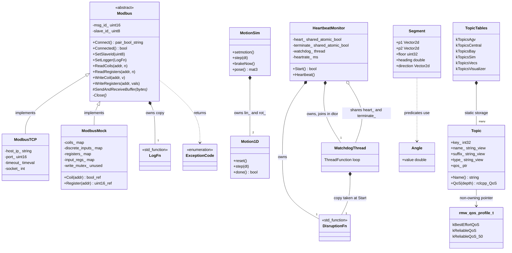

### 4b. Data flow

Because `common` has no node, it publishes and subscribes to nothing itself; its "I/O" is what its components touch on behalf of dependents. There are three real I/O paths:
- the **Modbus socket** to field devices;
- **environment variables and files**, read by the system utilities and MD5;
- the **watchdog thread**, which calls back into the dependent asynchronously.

The topic registry is better thought of as configuration: it hands names, types and QoS to dependents, who create the actual publishers and subscriptions. There are no calls into lower-layer workspace packages (depth 0).

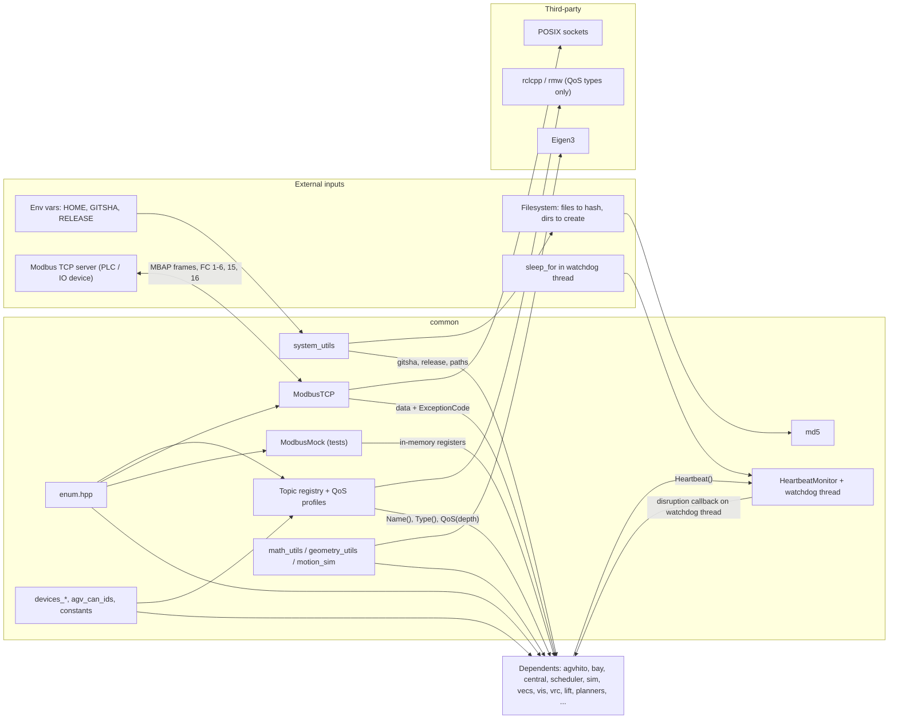

### 4c. State machines

No state machine. The package contains neither a YASMIN state machine nor an enum-driven one. The stateful components (`HeartbeatMonitor`, the connection state of `ModbusTCP`, the phases of `Motion1D`) keep their state in booleans and numbers rather than in an explicit state type. Their behavior over time is described in prose in section 5.

---

## 5. Behavior

**Construction.** Almost nothing in `common` runs at program start. The topic tables and QoS profiles are aggregates of string literals and addresses of other `const` globals, so they are constant-initialized and have no static-initialization-order hazard as written **[read]**. Work happens only when a dependent constructs one of the three runtime components:

- **`ModbusTCP`** validates the host and port, then connects immediately. On failure it throws (`std::invalid_argument` or `std::runtime_error`), so a successfully constructed object is always initially connected. The socket's send and receive timeouts (10 s by default) also bound `connect()` on Linux. A missing device can therefore stall the constructing thread for that long: construct it off the executor thread, or use a shorter timeout.
- **`HeartbeatMonitor`** starts its thread immediately only if `start_now` is true; otherwise it starts on the first `Start()`. Deferring the start lets an owner finish initializing before the watchdog can fire.
- **`MotionSim`** initializes to an all-zero motion, which is already `done()`.

**Steady state.**

- **Watchdog.**
  - The only thread this package creates is the watchdog: sleep one period, then exchange the flag with `false`.
  - Its effective state is implicit:
    - *idle* before `Start()`;
    - *watching* while heartbeats arrive;
    - *disrupted* when a check finds the flag clear, calling the callback once per period until a heartbeat is seen again, which returns it to *watching*;
    - *joined* after destruction.
  - Because the flag starts out `true` and is checked only at the end of each period, the first reaction comes between one and two periods after the last heartbeat.
- **Modbus.**
  - Each call is synchronous on the caller's thread: build the request, send it, then receive until `6 + length` bytes have arrived. Each call uses a new transaction ID, which starts at 1 and wraps at 65535.
  - The connection state is just "socket open or not":
    - fatal socket errors (`EPIPE`, `ECONNRESET`, `ENOTCONN`, peer closed) close the socket, and later calls return `DISCONNECTED` immediately until `Connect()` succeeds;
    - non-fatal errors (timeouts, framing mismatches) keep the socket open, which can leave it one frame out of step (R5).
  - There is no internal locking, so one instance must be used by one thread at a time.
- **No ROS machinery.** There are no executors, callback groups or ROS timers. `Topic::QoS()` only constructs a value. The dependent decides which executor and callback group its publishers and subscriptions use.
- **Motion simulation** is driven by the caller's clock through `step(dt)`. Each 1D profile is implicitly in one of three phases: accelerating, at maximum speed, or braking. Braking begins when the remaining distance is no more than the braking distance.

**Shutdown.**
- `~HeartbeatMonitor` sets the terminate flag and joins, which may block for up to one period plus the duration of a callback in progress. The `CleanTerminate` test relies on this.
- `~ModbusTCP` closes its socket.
- Everything else is trivially destructible.
- No component holds references to ROS objects, so shutdown order relative to `rclcpp::shutdown()` does not matter for `common` itself.

**Parameters and defaults.** There are no ROS parameters. The defaults that matter at the API level are:

| Item | Default | Why it matters |
|---|---|---|
| Enum reflection range | `kMinEnum = -24`, `kMaxEnum = 64` | Enumerators outside this range have no names (R15). |
| `HeartbeatMonitor` | `start_now = false`; flag initially `true` | First reaction comes between 1 and 2 periods. |
| `ModbusTCP` timeout (send, recv, connect) | 10 s | Can block a calling executor thread. |
| Modbus slave ID / first transaction ID | 1 / 1 | — |
| `kMaxBoolWrites` / `kMaxMessageLength` | 2040 / 260 bytes | Read limit for bits; size of the receive buffer. |
| `MotionSim` limits | 1.0 m/s, 0.5 m/s², 1.0 rad/s, 0.5 rad/s²; `dt = 0.1`; `shortestAngle = true` | — |
| `Motion1D::done` | `epsS = 1e-9`, `epsV = 1e-6`; `amax` floored at `1e-12` | — |
| Geometry tolerances | 1° (direction tests), 0.01 m² (collinearity) | The units differ by function. |
| `IsNear` / `IsZero` | `numeric_limits<T>::epsilon()`, absolute | Effectively exact equality (R18). |
| `GetGitsha` / `GetRelease` | `""` / `"release-not-found"` | — |
| QoS profiles | depth 1 (50), volatile, system-default liveliness | `QoS(depth)` overrides the depth. |

---

## 6. Ownership and safety

The package is mostly value types and static data, which keeps the ownership story simple. The exceptions are the three runtime components, and each of them has one sharp edge. The thread-safety model is "single owner, single thread", except for the watchdog, which is explicitly concurrent and lock-free.

### 6.1 Lifetimes

- **`Topic`** is a borrowed view. For registry entries every view and pointer refers to static storage and lives forever. Factory topics are different: `TopicBayDoorReport` points into the enum library's static name strings, which is safe, but `TopicAgvCommandSequence(const char*)` points at the caller's buffer (R12). `Name()` and `Type()` return owning strings, which is the safe way to hold on to a name.
- **`HeartbeatMonitor`** owns its thread. Its two flags are shared with the thread through `shared_ptr`, so they outlive any move. At `Start()` the thread receives its own copy of the callback, but that callback typically captures `this` or references, so the lifetime that actually matters is that of whatever the callback refers to. It must outlive the monitor, which is why the monitor should be the last-declared member of its owner.
- **`Modbus`** objects are non-copyable and non-movable, so they are held through `unique_ptr` (or by reference). `ModbusTCP` owns its socket and closes it in its destructor; the logger `std::function` is copied in.
- **`Segment`** caches values derived at construction; treat it as immutable.
- **`MotionSim`** owns its two `Motion1D` profiles by value and uses no heap.

### 6.2 Callbacks capturing `this`

Nothing inside `common` captures `this`. It does accept two callbacks that dependents usually write as `[this]` lambdas:
- **The `HeartbeatMonitor` disruption callback** runs on a different thread from the rest of the owner's code. It is therefore both a lifetime hazard (the owner must not be destroyed before the monitor is joined) and a concurrency hazard (it must synchronize with the owner's state).
- **The `Modbus` logger** runs synchronously on the calling thread, so it is benign as long as the `Modbus` object does not outlive its owner.

### 6.3 Locks and atomics

- **`HeartbeatMonitor`** uses two `atomic<bool>` with sequentially consistent `exchange`, `store` and `load`, and no mutex. That is correct for a single flag, and `Heartbeat()` is wait-free, so it is safe to call from any callback, even a real-time one.
- **`ModbusMock`** declares `std::mutex write_mutex_` with a TODO and never uses it. Its accessors return references into `std::map`s, so tests must not touch the mock from several threads.
- **`ModbusTCP`** has no lock. The code itself suspects concurrent use: it logs that surplus bytes "could be a concurrent thread operating on the same socket". If several components share one device connection, they need an external mutex or a single owner thread.

### 6.4 Error handling

The package uses four error-reporting styles, roughly by module, and a dependent has to know which one each API uses:

| Style | Where | Comment |
|---|---|---|
| `std::optional` | `EnumCast*`, `EnumIndex`, `GetMD5Sum(path)`, `CalcLineSegmentsIntersection` | "Maybe there is no answer." Composes well. |
| Status returned as a value | `Modbus::ExceptionCode` (in a `pair` with the data), `Connect() → BoolStringPair`, `CommandStatus`, `EnsureDirExists → bool`, `Start() → bool` | Normal for I/O; callers must check it, since nothing marks these returns `[[nodiscard]]`. |
| Exceptions | Only the `ModbusTCP` constructor | Reasonable: there is no usable object to return. Any exception escaping the watchdog callback calls `std::terminate`. |
| `assert` and silent defaults | `EnumValue(index)`, topic `find()` (returns entry 0 in release builds), `EnumName` (returns empty), `GetGitsha` (returns `""`) | Silent fallbacks hide configuration mistakes in release builds. |

The mix is defensible, with exceptions only for construction and values everywhere else. The weak spot is the silent fallbacks: a wrong topic key or an out-of-range enum produces a plausible but wrong answer instead of an error.

### 6.5 RISK items

Ordered roughly by impact on robot-side code.

| ID | Risk | Evidence |
|---|---|---|
| R1 | `HeartbeatMonitor`'s move constructor does not move `disruption_reaction_fn_`. Calling `Start()` on a moved-to monitor that had not been started runs an empty `std::function`, which throws `std::bad_function_call` and terminates the process at the first missed heartbeat. Calling `Start()` or `Heartbeat()` on the moved-from object dereferences a null `shared_ptr`. | **[probed]** abort reproduced; moved-from case **[read]** |
| R2 | Detection latency is between one and two `heartrate` periods after the last heartbeat. The header says "at least once every heartrate ms". Size safety timeouts with this in mind. An exception thrown by the callback terminates the process. | **[read]**; tests allow up to 300 ms for a 100 ms period |
| R3 | `ModbusMock` frames its error replies one byte off (the unit ID is erased), so its exception check never matches. Writes to an unmapped address return `OK`; reads of unmapped addresses return `BAD_CONNECTION` or `ERROR` instead of `ILLEGAL_DATA_ADDRESS`. On success, the length is written into the protocol-ID bytes. | **[probed]** write → `OK`, read → `BAD_CONNECTION` |
| R4 | If `socket()` fails in `ModbusTCP::Connect`, `socket_` is left at `-1`, so `Connected()` returns true and `Close()` calls `close(-1)`. The code also uses fd `0` to mean "closed", although 0 is a valid descriptor if stdin was closed. | **[read]** |
| R5 | After a receive timeout (`BAD_CONNECTION`) the socket is kept open. The late reply stays buffered, so the next transaction reads that stale frame and fails the transaction-ID check, and the connection can stay one frame behind until `Connect()` is called. | **[read]** inference |
| R6 | Write sizes are never bounded. `WriteRegisters` with more than 123 values, or `WriteCoils` with more than 1968, overflows the one-byte length and byte-count fields. The mock's byte count also overflows for reads of more than 127 registers. | **[read]** |
| R7 | `inet_addr` accepts only dotted IPv4 strings. A hostname silently becomes 255.255.255.255. | **[read]** |
| R8 | `ReciprocalAngle<double>` adds 180 to a value in radians: `ReciprocalAngle(0.0) = -2.21`. | **[probed]** |
| R9 | `Wrap(inf)` never returns. Very large inputs are slow, and NaN passes through unchanged. | **[probed]** hang |
| R10 | `Rotate2D(const Segment&)` resets `floor` to 0. | **[probed]** |
| R11 | `Topic::QoS()` dereferences `qos_` unchecked, and factory-made bay topics have `qos_ == nullptr`. `qos_ptr()` reinterprets `rmw_qos_profile_t*` as `rclcpp::QoS*`, which is formally undefined behavior; only `sizeof` is asserted. | **[read]** |
| R12 | `TopicAgvCommandSequence(const char*)` stores a non-owning view, so it dangles if passed `c_str()` of a temporary string. | **[read]** |
| R13 | Five families use the relative name `report`, each with a different message type. Correctness depends on every node running in its own namespace. | **[read]** |
| R14 | `ExpandFilepathTilde` with `HOME` unset computes `nullptr + std::string`, which is undefined behavior. | **[read]** |
| R15 | Enum limits: enumerators outside [-24, 64] are invisible, and `bay::IoLinkDevices` already reaches 61. For unsigned underlying types the order is wrong (`EnumValues<agv::CanIds>()` starts with `MASTER = 255`). The `__PRETTY_FUNCTION__` offsets are specific to compiler versions. | **[probed]** ordering; rest **[read]** |
| R16 | `Angle`'s comparison operators are circular, not a strict weak ordering, so `Angle` must not be used in ordered containers or sorting. | **[read]** |
| R17 | The `std::abs(volley::Angle)` overload is declared inside namespace `std`, which the standard does not permit. | **[read]** |
| R18 | Default tolerances are an absolute epsilon (≈2.2e-16). This makes `IsNear` effectively exact and makes the segment-intersection tests depend on coordinate scale. | **[read]** |
| R19 | `MotionSim::step` snaps yaw to the raw `goalYaw_` when done, while yaw during motion is wrapped. A goal outside $(-\pi, \pi]$ therefore jumps on the final step. | **[read]** |
| R20 | Hygiene: missing `<limits>` / `<utility>` / `<cstdint>` includes; `ModbusMock` declares defaulted copy and move operations that are implicitly deleted; `kRad2Rev = 2π` is really radians per revolution; a comment says `std::clamp` "not defined until C++20" (it is C++17). | **[read]** |
| R21 | `Motion1D` discretization: speed chatters near the braking point, and the final step snaps speed to zero from up to 0.45 m/s (an implied 4.5 m/s² deceleration with `a_max = 0.5`; see Figure 7.8). This is harmless for visualization, but a controller or simulator that differentiates the output would see an acceleration spike. | **[probed]** C++ and Python agree |

---

## 7. Math

All of the math lives in `math_utils`, `geometry_utils`, `motion_sim` and two derived constants. It hangs together around one convention: radians, counter-clockwise from +x, wrapped to $(-\pi, \pi]$, with SI lengths. The formulas below are what the code computes. Where the code departs from the textbook form, it is noted.

The figures in this section were generated with Python (matplotlib) from the same formulas the code uses; the SVG sources live in `figures/01-common/`. The velocity profiles in the `Motion1D` figure come from a Python re-implementation of `Motion1D::step`. It was cross-checked against the compiled C++: both give 59, 25 and 44 steps for the three cases shown, with the same final speeds before the snap to zero **[probed]**.

**Angle wrapping.** For an angle $\theta$ in radians and a lower bound $\ell$ (default $-\pi$):

$$
\operatorname{Wrap}(\theta,\ell)\in
\begin{cases}
(\ell,\ \ell+2\pi] & \ell<0\\
[\ell,\ \ell+2\pi) & \ell\ge 0
\end{cases}
$$

The code adds or subtracts $2\pi$ until $\theta$ is in range. The integer version is the same with 360.

The motion simulator instead uses $\operatorname{wrapPi}(\theta)=\big((\theta+\pi)\bmod 2\pi\big)-\pi \in [-\pi,\pi)$. The two conventions differ only at $\pm\pi$, which is enough to make equality checks between their outputs fail.

**Angular distance.** The basic quantity is the signed difference

$$
\delta(a,b)=\operatorname{atan2}\big(\sin(b-a),\cos(b-a)\big)\in(-\pi,\pi]
$$

and its magnitude $|\delta(a,b)|$ (`AngleDist`).

The directional distances follow Beard & McLain (eqs. 11.7–11.8), re-referenced from north to the $+x$ axis. With $\bar x=\operatorname{Wrap}_{[0,2\pi)}(x)$:

$$
d_{\mathrm{cw}}=\operatorname{Wrap}_{[0,2\pi)}\big(2\pi-\bar b+\bar a\big),\qquad
d_{\mathrm{ccw}}=\operatorname{Wrap}_{[0,2\pi)}\big(2\pi+\bar b-\bar a\big)
$$

The derived predicates are:
- "angle or reciprocal": $\min(|\delta|,\ \pi-|\delta|)\le\varepsilon$;
- "same hemisphere": $|\delta|\le\pi/2$.

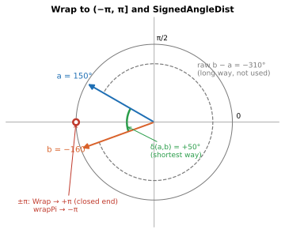

*Figure 7.1 — `SignedAngleDist` takes the short way round (+50°), never the raw difference (−310°). At the seam, `Wrap` maps to +π while `wrapPi` maps to −π.*

**Rate limiting.** `RateLimit` clamps the target into a window of half-width $r\,\Delta t$ around the current value, and reports $\pm1$ when it had to clip:

$$
x_{k+1}=\operatorname{clamp}\big(x^{\star},\ x_k-r\Delta t,\ x_k+r\Delta t\big)
$$

`RateLimitAngle` steps along the shortest way round. Its result is not re-wrapped:

$$
\theta_{k+1}=\theta_k+\operatorname{clamp}\big(\delta(\theta_k,\theta^{\star}),\ -r\Delta t,\ r\Delta t\big)
$$

**Frames.** Points convert between the vehicle (body) frame and the world (inertial) frame by rotating through the yaw $\psi$:

$$
R(\psi)=\begin{bmatrix}\cos\psi&-\sin\psi\\ \sin\psi&\cos\psi\end{bmatrix},\qquad
\mathbf p_I=R(\psi)\,\mathbf p_B,\qquad \mathbf p_B=R(-\psi)\,\mathbf p_I
$$

The motion simulator's pose is the homogeneous world-from-body transform:

$$
T=\begin{bmatrix}R(\psi)&\mathbf p\\ \mathbf 0^\top&1\end{bmatrix}=\operatorname{translate}(\mathbf p)\cdot\operatorname{rotate}(\psi)
$$

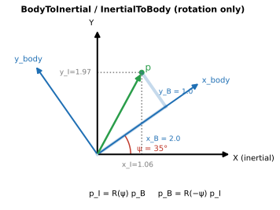

*Figure 7.2 — The same vector p seen in both frames. `BodyToInertial` and `InertialToBody` only rotate; any translation is the caller's job (`MotionSim` adds it through the homogeneous matrix).*

**Direction predicates.** These measure the angle between two vectors:

$$
\phi=\arccos\!\Big(\operatorname{clamp}\big(\tfrac{\mathbf v_1\cdot\mathbf v_2}{\|\mathbf v_1\|\,\|\mathbf v_2\|},-1,1\big)\Big)
$$

The tests are:
- same direction: $\phi\le\varepsilon$;
- parallel: the same-direction test passes for $\mathbf v_1$ or for $-\mathbf v_1$;
- perpendicular: $|\phi-\pi/2|\le\varepsilon$.

The clamp protects `acos` from rounding just outside $[-1,1]$.

**Perp-dot and collinearity.** The perp-dot product is $\mathbf a\times\mathbf b=a_xb_y-a_yb_x$, the signed area of the parallelogram spanned by the two vectors. Two segments count as collinear when all four such areas (each segment's direction against the other segment's endpoints) are within tolerance. That is why the tolerance is an area rather than an angle.

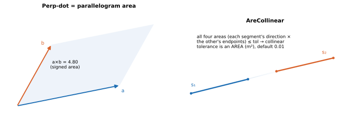

*Figure 7.3 — Left: a×b is the signed area of the parallelogram. Right: `AreCollinear` requires the four triangle-pair areas formed with the other segment's endpoints to be below an area tolerance, so its default 0.01 is in m², not radians.*

**Segment intersection.** Define the two segment directions $\mathbf u=\mathbf p^{(1)}_2-\mathbf p^{(1)}_1$ and $\mathbf v=\mathbf p^{(2)}_2-\mathbf p^{(2)}_1$, the start-to-start offset $\mathbf w=\mathbf p^{(1)}_1-\mathbf p^{(2)}_1$, and $D=\mathbf u\times\mathbf v$.

When $D\ne 0$ the lines cross at

$$
s=\frac{\mathbf v\times\mathbf w}{D},\qquad t=\frac{\mathbf u\times\mathbf w}{D},
$$

and the segments intersect if and only if $s,t\in[0,1]$, at the point $\mathbf p^{(1)}_1+s\,\mathbf u$.

When $D=0$ and the segments are collinear, the code proceeds in four steps:
1. Express $s_1$'s endpoints as parameters $t_0, t_1$ along $s_2$.
2. Sort them.
3. Reject if $t_0>1$ or $t_1<0$.
4. Clip both to $[0,1]$. Equal parameters give a single point; otherwise the result is the overlap.

All the zero tests use the default absolute ε (R18).

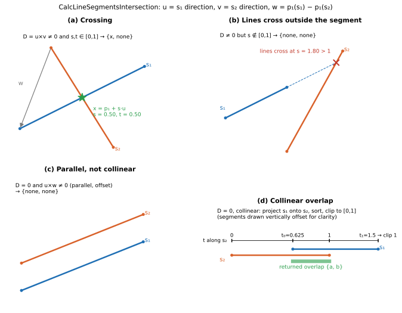

*Figure 7.4 — (a) Skew lines that cross inside both segments return one point. (b) Skew lines that cross outside a segment (here at s = 1.80) return nothing. (c) Parallel, offset segments return nothing. (d) Collinear segments return the endpoints of their overlap, after s₁ is projected onto s₂'s parameter t and clipped to [0, 1].*

**Point–segment distance.** Project the point onto the segment's line and clamp to the segment:

$$
t^{\star}=\operatorname{clamp}\!\left(\frac{(\mathbf p-\mathbf a)\cdot(\mathbf b-\mathbf a)}{\|\mathbf b-\mathbf a\|^2},0,1\right),\qquad
d=\big\|\mathbf p-\mathbf a-t^{\star}(\mathbf b-\mathbf a)\big\|
$$

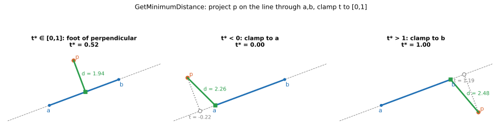

*Figure 7.5 — The foot of the perpendicular is used only when its parameter lies in [0, 1]. Otherwise the nearest endpoint is used, so the distance is measured to a or b rather than to the infinite line.*

**Line versus box.** The test is a modified Cohen–Sutherland algorithm.
1. Give each endpoint a 4-bit outcode: left 1, right 2, bottom 4, top 8.
2. Accept if either code is 0, or if the OR of the two codes is exactly top|bottom or left|right (the segment straddles the box). Accepting at that point is the modification; the classic algorithm would keep clipping.
3. Reject if the AND of the codes is non-zero (both endpoints are on the same outside side).
4. Otherwise, clip the endpoint with the larger code to $y_{\max}$ or $y_{\min}$ using $x=x_0+\frac{\Delta x}{\Delta y}(y_m-y_0)$, and repeat from step 2.

An oriented box with center $\mathbf c$ and yaw $\psi$ is handled by mapping the line through $\mathbf p\mapsto R(-\psi)(\mathbf p-\mathbf c)$ and testing against $[-L/2,L/2]\times[-W/2,W/2]$.

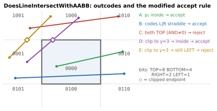

*Figure 7.6 — Outcodes (bits TOP, BOTTOM, RIGHT, LEFT) and the five ways a test ends. Lines D and E both clip their TOP endpoint to y = 3. D lands inside the box and is accepted; E lands in the LEFT region, which now shares a bit with its other endpoint, so it is rejected.*

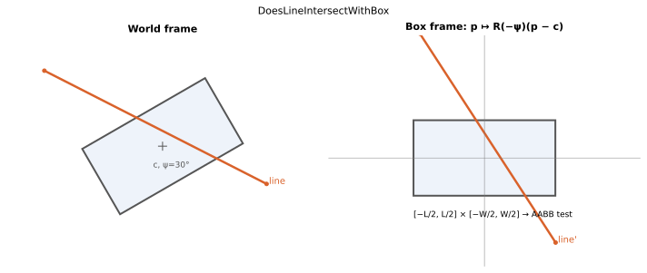

*Figure 7.7 — `DoesLineIntersectWithBox` translates the line by −c and rotates it by −ψ, which reduces the oriented test to the axis-aligned one.*

**Trapezoidal profile (`Motion1D`).** With remaining distance $r=S-s$, the profile brakes as soon as the remaining distance is within the braking distance:

$$
a_k=\begin{cases}-a_{\max}& r\le v_k^2/(2a_{\max})\\ +a_{\max}&\text{otherwise}\end{cases}
$$

$$
v_{k+1}=\operatorname{clamp}(v_k+a_k\Delta t,\,0,\,v_{\max}),\qquad s_{k+1}=s_k+v_{k+1}\Delta t
$$

On arrival it snaps to $s=S,\ v=0$.

The continuous minimum time is:
- $T=S/v_{\max}+v_{\max}/a_{\max}$ when $S\ge v_{\max}^2/a_{\max}$ (the profile reaches cruise speed);
- $T=2\sqrt{S/a_{\max}}$ otherwise (a triangular profile).

The discrete integrator comes close: for 2 m at 1 m/s and 0.5 m/s² it took 39 steps of 0.1 s, against an ideal 4.0 s **[probed]**.

`brakeNow` sets $S\leftarrow s+v^2/(2a_{\max})$ on both axes. The pose is then $\mathbf p=\mathbf p_0+\hat{\mathbf d}\,s_{\text{lin}}$ and $\psi=\psi_0+\sigma\,s_{\text{rot}}$, where $\sigma=\operatorname{sign}\big(\operatorname{wrapPi}(\psi_g-\psi_0)\big)$.

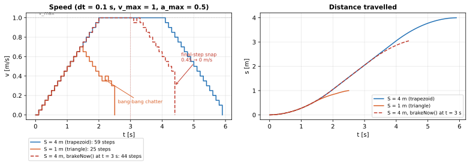

*Figure 7.8 — Speed and distance for a 4 m move (trapezoid), a 1 m move (triangle), and a 4 m move with `brakeNow()` at t = 3 s. Two artefacts of the discrete bang-bang rule are visible. First, chatter: speed alternates up and down near the braking point, because after one braking step the remaining distance again exceeds the new braking distance by $a\,\Delta t^2/2$. Second, a final-step snap: speed drops to zero in a single step, from as much as 0.45 m/s, an implied deceleration of 4.5 m/s² against $a_{\max}=0.5$ (R21).*

In formulas, the chatter comes from one braking step. Starting from $r_k=v_k^2/(2a)$, that step leaves

$$
r_{k+1}-\frac{v_{k+1}^2}{2a}=\frac{a\,\Delta t^2}{2}>0 ,
$$

so the next step accelerates again. Speed therefore oscillates by $\pm a\,\Delta t$ around the ideal braking curve until the snap condition $s\ge S$ fires.

**Heartbeat latency.** With period $T$ and the last heartbeat at $t_h$, the first reaction comes at some

$$
t\in(t_h+T,\ t_h+2T]
$$

plus scheduling jitter.

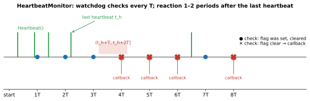

*Figure 7.9 — The watchdog checks at T, 2T, … . After the last heartbeat at t_h = 2.2T, the check at 3T still finds the flag set, and the first reaction comes at 4T, inside (t_h + T, t_h + 2T]. The callback repeats every period until a heartbeat arrives (6.5T).*

**Miscellaneous formulas.**
- `CalculateSquareRadius` $=\tfrac12\sqrt{w^2+l^2}$, the circumscribed radius of a $w\times l$ rectangle.
- `DiscretizeToNearestCartesianAxis` computes $k=\operatorname{lround}\big((\theta\bmod 360)/90\big)\bmod 4$ and outputs $90k$, with 270 mapped to $-90$. Ties round away from zero, so $45\mapsto 90$ **[probed]**.
- `HashCombine` computes $a\oplus\big(b+\texttt{0x9e3779b9}+(a\ll 6)+(a\gg 2)\big)$, the boost recipe.
- The AGV's yaw inertia uses a thin-plate model: $I_z=m(L^2+W^2)/12$.
- MD5 follows RFC 1321. It was checked against `md5sum` at the block-boundary sizes 0, 55, 56, 63, 64 and 65 bytes, and at 1000 bytes **[probed]**.

---

## 8. Tests

There are 70 gtest cases in 11 executables. Coverage is strong exactly where the code is pure and deterministic: enums, math and geometry. It thins out quickly toward I/O and anything stateful. The tests double as documentation of intent. Several conventions that the headers leave implicit are pinned down only by test expectations.

| Test file (cases) | Covers | What it reveals about intended behavior |
|---|---|---|
| `enum_tests` (16) | Casts from integers and strings (case-sensitive, case-insensitive, custom predicate); static and runtime names; values, names and entries order; count; index; ostream output; scoped-ness traits; type name; use in templates | Signed enums with negative values and values at both range ends must work. Unknown values print as their integer. Results must be usable as template arguments. |
| `math_utils_tests` (23) | Unit conversions, `Wrap` at the interval ends, `IsNear`/`IsZero`, angle distances, reciprocal checks, `Clamp` (including `uint8_t`), `RateLimit`, `RateLimitAngle`, `SameSign`, `Angle` operators, `vec2f` | The canonical ranges are $(-180,180]$ and $(-\pi,\pi]$, with `Wrap(-180) == 180`. `Angle` subtraction is the shortest signed difference. |
| `geometry_utils_tests` (11) | Segment fields and floor; rotations; direction predicates, including zero vectors and a float-noise case; AABB and rotated box; segment intersections (point, none, overlaps, degenerate); point–segment distance | Zero-length vectors mean "cannot decide" and return false. Overlaps return the shared sub-segment. |
| `heartbeat_monitor_tests` (5) | Timing of the first disruption, delayed start, recovery and re-trigger, move while running, destructor waiting for a running callback | Bounds of 95–300 ms for a 100 ms period. The 1–2 period latency is accepted behavior, not an accident. |
| `md5_tests` (2) | Digests of files and strings, the empty string, a missing file (`nullopt`) | — |
| `system_utils_tests` (3) | Tilde expansion; `GITSHA` and `RELEASE` defaults and overrides | Only a leading `~` is expanded; `~user` is unsupported. |
| `utils_tests` (4) | `HashCombine` golden value, duration conversion, `VectorStaticCast`, `CreateAndFillArray` | — |
| `topic_tests` (2), `topics_central_tests` (1), `topics_bay_tests` (1) | `Name()` concatenation; `<agv>/command_sequence`; `PATRON/report` | Parameterized topics are named with a device or agent prefix. |
| `devices_agv_tests` (2) | Satellite channel → lift and clutch mapping | The back board is mirrored. |

**Gaps.** The untested areas line up closely with the RISK list, which suggests where new tests would pay off first.
- **No tests at all** for `Modbus`, `ModbusTCP` or `ModbusMock` (a round-trip test through the mock would have caught R3), for `MotionSim`, `Motion1D` and `brakeNow`, for `Topic::QoS` and `qos_ptr` (a test calling `.QoS()` on every registry entry would catch R11), for registry invariants in the AGV, sim, vecs and visualizer families (unique keys, non-null QoS), for `EnsureDirExists`, or for `DiscretizeToNearestCartesianAxis`.
- **Missing edge cases:**
  - `Motion1D` chatter and the final-step snap (R21);
  - a heartbeat monitor moved before `Start()` (R1);
  - enums with unsigned underlying types or values above 64 (R15);
  - `ReciprocalAngle<double>` (R8);
  - non-finite input to `Wrap` (R9);
  - the floor after `Rotate2D(Segment)` (R10).
- **Flakiness:**
  - The heartbeat tests depend on wall-clock timing and will fail on a heavily loaded CI machine.
  - `md5_tests` writes `example.txt` into the current directory, so parallel runs of that test collide.
  - `system_utils_tests` restores `HOME` with `setenv(..., home_orig)`, which crashes when `HOME` was unset to begin with.
- **Cosmetic:** one test suite is misspelled `GeoemtryUtils`.

---

## 9. Idioms to reuse, and open questions

### 9.1 Idioms

These patterns recur in the package. New code here, and in dependents, should follow them, because together they are what keeps the many processes in agreement.

- **One definition per shared fact.** A new topic gets a key enum entry, a table row with one of the three shared QoS profiles, and an accessor. Both ends then use `t.Name()` and `t.QoS(depth)`. Never hand-type a topic name or QoS. The same rule applies to dimensions (`constants.hpp`) and device names (`devices_*.hpp`).
- **Enums as the source of strings.** Build per-device names with `common::EnumName(id)` and parse with `common::EnumCast<E>(...)`, which returns an `optional`. Keep enumerator values within [-24, 64].
- **Radians in $(-\pi, \pi]$ internally.** Compare with `IsAngleNear` or `AngleDist`, step with `RateLimitAngle`, and take differences with `SignedAngleDist` or `Angle`. Use integer degrees only for grid headings, with `Wrap(int)`. Always pass an explicit tolerance to `IsNear`.
- **Frames through the helpers.** Use `BodyToInertial` and `InertialToBody` rather than open-coded sin/cos. Use `Segment` (treated as immutable) for anything that has endpoints and a floor.
- **Errors as values for I/O.** Return `pair<data, ExceptionCode>` or `BoolStringPair`. Throw only from constructors that cannot otherwise produce a usable object.
- **Inject hardware behind an abstract base.** Depend on `Modbus&` or `unique_ptr<Modbus>`, and use `ModbusMock` in tests, keeping R3 in mind until it is fixed.
- **Watchdogs off the executor.** Use `HeartbeatMonitor` for safety staleness checks. Declare it last, start it explicitly, and keep its callback short, thread-safe and non-throwing.
- **House style.** `#pragma once`; `k`-prefixed constants; PascalCase free functions in `volley`; `NOLINT(<rule>)` when deviating from clang-tidy; `// clang-format off` around tables.

### 9.2 Open questions for the team

1. Should `HeartbeatMonitor`'s move constructor also move the callback (R1)? And is the 1–2 period latency (R2) the intended contract for its safety users?
2. Is `ModbusMock`'s error framing (R3) known? Some dependent tests may currently assert `OK` for writes that a real device would reject.
3. Should `ModbusTCP` reconnect after `BAD_CONNECTION` (R5)? And is concurrent use of a single `Modbus` instance ever intended (the unused `write_mutex_` suggests it was considered)?
4. Is `ReciprocalAngle` meant to be `int`-only? If so, constrain the template; if not, fix the radian path (R8).
5. Which QoS should the per-door and per-ODP bay topics use (R11)?
6. Should `TopicAgvRfidPoseTag` take an `RfidSensorId`? An `UPWARD` topic does not exist yet.
7. Is `/scheduler/report` still needed? It is commented "has no subscriber?".
8. Does `bay::IoLinkDevices` have plans to grow past 64 (R15)? That would mean either raising `kMaxEnum` or renumbering.
9. Should `topic.cpp` (rclcpp) and `modbus_tcp.cpp` (sockets) move into their own targets, so that pure math users avoid those dependencies? Where do rclcpp and rmw include paths come from today, `volley_package()`?
10. Is the mix of namespaces (`volley`, `common`, `agv`, `bay`, plus global `make_topic` and `BoolStringPair`) intended layering, or legacy to converge on?
11. Should `MotionSim` adopt `math_utils` wrapping and the package naming style?
12. Is `QoS(depth)` overriding the profile's depth intended? Should callers use `qos_ptr()` for the depth-50 topic?
13. Which C++ standard does the workspace target? Designated initializers imply C++20, while a code comment assumes pre-C++20.
14. `kTrayLegLength` is marked "TODO: use a real measurement". Has it been measured?
