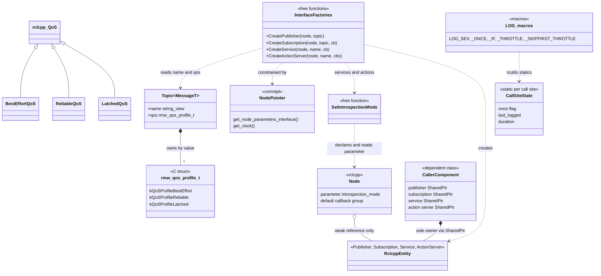
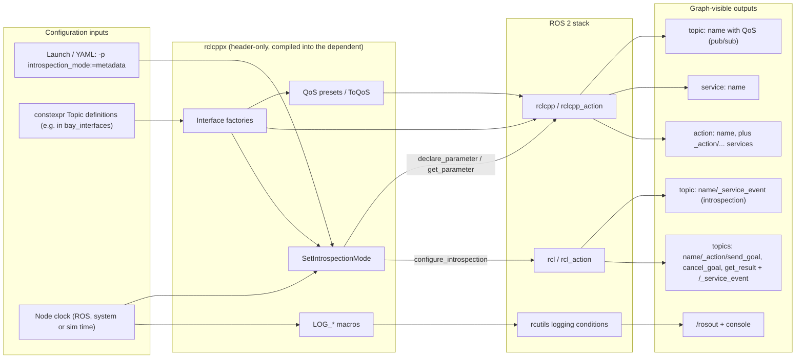
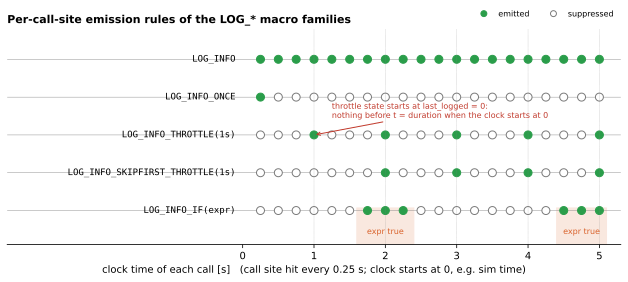
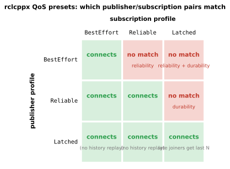

# 02 — `rclcppx`

| Generated | Revision | Source pack | Status |
|---|---|---|---|
| 2026-10-07 | 4 | `P02-rclcppx-part1of1.md` | Draft, generated by Claude, not yet reviewed by the team |

Package 2 of 37 (bottom-up) · dependency depth 0

**Abbreviations used in this document.** Each is also explained in context where it first matters.

| Abbreviation | Meaning |
|---|---|
| AGV | Automated Guided Vehicle |
| `agvhito` | AGV software for HITO vehicles (inferred from the name) |
| API | Application Programming Interface |
| CMake (`cmake` in names) | Cross-platform Make (build-system generator) |
| CPU | Central Processing Unit |
| DDS (`dds` in names) | Data Distribution Service (the middleware under ROS 2) |
| GCC | GNU Compiler Collection |
| GNU | GNU's Not Unix (the free-software project behind GCC) |
| `gtest` | GoogleTest |
| HITO | name of the AGV vendor; not expanded in the code |
| ID | identifier |
| LTS | Long-Term Support |
| QoS (`qos` in names) | Quality of Service |
| `rcl` | ROS Client Library (C core) |
| `rclcpp` | ROS Client Library for C++ |
| `rclcppx` | "rclcpp extensions" (Volley package) |
| `rcutils` | ROS C utilities |
| `rmw` | ROS middleware interface |
| ROS (`ros` in names) | Robot Operating System |
| `sim` | simulation / simulator (also the `sim` package) |
| SVG | Scalable Vector Graphics |
| VECS (`vecs` in names) | not expanded in the code; Volley's vehicle EV-charging subsystem (inferred) |
| VRC (`vrc` in names) | Vertical Reciprocating Conveyor (a freight lift between floors) |
| YAML | YAML Ain't Markup Language |
| YASMIN | Yet Another State MachINe (ROS 2 state-machine library) |
| `yasminx` | "YASMIN extensions" (Volley package) |

Workspace dependencies: none.
Used by: agvhito, bay, bay_interfaces, central, common_ros, dds_discovery, lift, motion_planner, scheduler, sim, vecs, vrc, yasminx.
Related document: `01-common.md`. Its topic registry, shared QoS (Quality of Service) profiles and RISK items R11/R12 are referred to below as *common's registry*.

**How to read the evidence markers.**
- **[read]** means the conclusion comes from reading the source.
- **[probed]** means it was confirmed by compiling code. Here that means the logging header compiled with g++ 13 in C++20 mode against stub `rclcpp` (ROS Client Library for C++) headers, because no ROS (Robot Operating System) install was available.
- **[upstream]** means it was confirmed against the upstream ROS 2 (Robot Operating System 2) source or documentation for code that lives outside this package: rcutils (ROS C utilities) and rclcpp_action (ROS Client Library for C++, action support).

---

## A. External dependencies

`rclcppx` ("rclcpp extensions") is a thin, header-only layer over the ROS 2 C++ client library, so its dependencies are essentially the ROS 2 stack itself plus a modern C++ standard library.

Two details pin the toolchain more tightly than `common` did:

- **It needs ROS 2 Kilted or newer.** `CreateActionServer` calls `configure_introspection` on an `rclcpp_action::Server`. Action introspection is a feature introduced in ROS 2 Kilted Kaiju (May 2025); earlier distributions such as Jazzy have service introspection but not action introspection. So the workspace builds against Kilted or a newer distribution. Kilted is a standard (non-LTS) release supported until November 2026, which is next month (see open question 1).
- **It needs a C++20 compiler and library.** The logging macros use `std::format` and `__VA_OPT__`, and the QoS constants use designated initializers. In practice this means GCC (GNU Compiler Collection; GNU = GNU's Not Unix) 13 or newer with libstdc++ 13, which matches Ubuntu 24.04.

No versions are pinned in `package.xml`; the Version column records what the code requires.

| Name | Description | Version | Link | Usage in this package |
|---|---|---|---|---|
| rclcpp | ROS 2 C++ client library: nodes, publishers, subscriptions, services, parameters, clocks, logging macros. | Kilted or newer (inferred, see above). | https://github.com/ros2/rclcpp | Everything. The factories wrap `create_publisher`, `create_subscription` and `create_service`; `qos.hpp` subclasses `rclcpp::QoS`; `logging.hpp` wraps the `RCLCPP_*` macros. |
| rclcpp_action | ROS 2 C++ actions. | Kilted or newer; this is the API (Application Programming Interface) that pins the distribution. | https://github.com/ros2/rclcpp | `rclcpp_action::create_server`, and `Server<ActionT>::configure_introspection` via `SetIntrospectionMode`. |
| rcl / rcl_action (ROS Client Library in C, action support) | C core beneath rclcpp. | Same distribution. | https://github.com/ros2/rcl | `rcl/service_introspection.h` (the enum `RCL_SERVICE_INTROSPECTION_{OFF,METADATA,CONTENTS}`), `rcl_action_server_get_default_options()`. |
| rmw (ROS middleware interface) | Middleware interface types. | Same distribution. | https://github.com/ros2/rmw | `rmw_qos_profile_t` and the `RMW_QOS_*` constants for the three `constexpr` profiles. |
| rcutils | Lowest ROS C utility layer; implements the logging conditions (once, throttle, skip-first, expression). | Same distribution (transitive). | https://github.com/ros2/rcutils | The actual throttling and once-only logic behind every `LOG_*` macro. Section 7.1 describes its semantics, checked against the upstream source **[upstream]**. |
| C++20 standard library | `std::format`, concepts, `__VA_OPT__`, designated initializers. | GCC ≥ 13 / libstdc++ ≥ 13 (C++20). | https://en.cppreference.com/w/cpp/utility/format | `logging.hpp` (format strings checked at compile time), `NodePointer` concept, `constexpr` QoS profiles. |
| example_interfaces | Standard example messages, services and actions. | Same distribution. | https://github.com/ros2/example_interfaces | **Test only**: `Int32`, `Trigger`, `Fibonacci`. |
| ament_cmake_gtest, GoogleTest | Test integration and framework. | Not pinned. | https://github.com/ament/ament_cmake | Two test executables. |
| `volley_cmake` | Workspace CMake helpers. | Internal. | Not in pack. | `volley_add_library(rclcppx INTERFACE)`, `volley_add_gtest`. |

---

## B. Glossary

Terms already defined in `01-common.md` (topic, QoS, ROS namespace, rmw, executor, and so on) are reused here; this table adds what `rclcppx` introduces or relies on.

| Term | Meaning | Where it shows up |
|---|---|---|
| Node | A ROS 2 participant that owns publishers, subscriptions, services, parameters and a clock. | All factories take a node. |
| Node interfaces | The capability objects a node is composed of (`NodeParametersInterface`, clock, and so on), which can be passed around without the whole node. | `SetIntrospectionMode` takes the parameters interface. |
| Parameter / parameter override | A named, typed node setting. An override is a value supplied at launch (command line, YAML file, or `NodeOptions`; YAML = YAML Ain't Markup Language) that takes effect when the parameter is declared. | `introspection_mode` |
| Publisher / subscription | Endpoints that send and receive messages on a topic. They connect only if their QoS settings are compatible. | `CreatePublisher`, `CreateSubscription` |
| Service | Request/response call between nodes. | `CreateService` |
| Action | Long-running goal with feedback and cancellation, built from three internal services (send goal, cancel goal, get result) plus feedback and status topics. | `CreateActionServer` |
| Callback group | Grouping that tells an executor which callbacks may run concurrently (mutually exclusive or reentrant). `nullptr` means the node's default group. | Optional factory argument |
| QoS history / depth | Keep-last *N* (the depth) or keep-all: how many messages are queued for delivery. | `QoSProfileWithDepth`, preset constructors |
| Reliability | *Reliable* (retransmit until delivered) or *best effort* (send once, may drop). | `kQoSProfileReliable`, `kQoSProfileBestEffort` |
| Durability | *Volatile* (new subscribers get only future messages) or *transient local* (the publisher stores the last *depth* messages and replays them to late joiners). | `kQoSProfileLatched` |
| Latched | Informal name, inherited from ROS 1, for reliable plus transient-local: "late subscribers get the last value". | `LatchedQoS` |
| QoS compatibility | Rule for whether a publisher and a subscription connect: the offered QoS must be at least as strong as the requested QoS, policy by policy. | Section 7.2 |
| `rmw_qos_profile_t` / `rclcpp::QoS` | The C struct of all QoS policies, and the C++ class wrapping it. | `qos.hpp` |
| `QoSInitialization::from_rmw` | Builds an `rclcpp::QoS` whose history and depth come from the profile itself (unlike `KeepLast(n)`, which overrides them). | `ToQoS` |
| Service introspection | ROS 2 feature that publishes an event for each request and response on a hidden topic `<service>/_service_event`. Modes are OFF, METADATA (timestamps, IDs, i.e. identifiers) and CONTENTS (metadata plus full payloads). | `introspection.hpp` |
| Action introspection | The same feature for an action's three internal services. New in Kilted. | `CreateActionServer` |
| `/rosout` | Topic to which ROS logging is also published. | Effect of `LOG_*` |
| Log severity | DEBUG < INFO < WARN < ERROR < FATAL. A message is emitted only if the logger's level allows it. | `LOG_*` family |
| Once / throttle / skip-first / expression | rcutils log conditions: log only the first time; at most once per duration; like throttle but skip the first emission; only when a boolean is true. | `LOG_*_ONCE`, `_THROTTLE`, `_SKIPFIRST_THROTTLE`, `_IF` |
| Call site | One textual occurrence of a logging macro. Once and throttle state is stored in static variables per call site. | Section 6.5, R6–R7 |
| `std::format` compile-time check | In C++20 the format string must be a constant expression and is checked against the argument types at compile time. | All `LOG_*` macros |
| `__VA_OPT__` | C++20 preprocessor feature that inserts its contents only when variadic arguments are present. | Lets `LOG_INFO(l, "text")` work without arguments |
| Concept | C++20 named compile-time constraint on a template parameter. | `NodePointer` |
| `constexpr` literal type | A type whose values can be built at compile time; required for `constexpr` topic constants. | `Topic<MessageT>`, QoS profiles |
| Designated initializers | `{.name = ..., .qos = ...}` aggregate syntax (C++20). | Profiles, topic definitions |
| INTERFACE library | CMake target with no compiled code; it only carries include paths and dependencies (header-only). | `volley_add_library(rclcppx INTERFACE)` |
| Private name `~/` | A topic name relative to the node: `~/x` in node `n` with namespace `/ns` resolves to `/ns/n/x`. | Tested in `CreatePublisherPrivateName` |
| Lifecycle node | Managed node with configure/activate states; its publishers drop messages until activated. | Section 6.5, R8 |
| Kilted Kaiju | ROS 2 distribution released May 2025, standard release (supported to November 2026). | Section A |

---

## 1. Summary

`rclcppx` is a small, header-only extension layer over rclcpp that standardizes how Volley nodes create their ROS interfaces and how they log.

It provides four things:
1. **A typed, `constexpr` topic definition**, `Topic<MessageT>`, which bundles a name and a full QoS profile.
2. **Three named QoS presets**, with intent-revealing names: best effort, reliable, latched.
3. **Factory functions** that create publishers, subscriptions, services and action servers from those definitions, and that switch on ROS service/action introspection consistently, controlled by one node parameter.
4. **A family of `LOG_*` macros** that replace printf-style `RCLCPP_*` logging with `std::format`, checked at compile time, while keeping rclcpp's once, throttle and conditional variants.

The package reads as the second generation of the ideas in `common`. Common's registry already argued that a topic's name, type and QoS must be defined in exactly one place. `rclcppx` carries that idea further, and fixes three weaknesses of common's registry along the way:
- the message type is now a C++ type parameter instead of a string, so a mismatched callback no longer compiles;
- the QoS is stored by value instead of behind a pointer, so the null-QoS crash of common R11 cannot happen;
- `ToQoS` keeps the profile's own history depth, instead of overriding it as `common::Topic::QoS(depth)` does.

The two systems now coexist across the workspace. That is the main tension this package introduces: the same topic could be defined twice with different QoS, which is exactly the failure both registries exist to prevent (R9).

---

## 2. Files

The package has nine files: five public headers, two tests and two build files. There is no `.cpp` source, so the CMake target is an INTERFACE library and all code is compiled inside each dependent.

The headers layer cleanly:
- `topic.hpp` and `qos.hpp` are pure data and depend only on rmw and rclcpp's QoS type;
- `introspection.hpp` depends on parameters and clocks;
- `interface_factories.hpp` sits on top of all three;
- `logging.hpp` is independent of the others.

| Path (under `src/core/rclcppx/`) | Lines | Role |
|---|---:|---|
| `CMakeLists.txt` | 14 | Declares the header-only INTERFACE library and two gtests. |
| `package.xml` | 17 | Depends on rclcpp and rclcpp_action; test-depends on ament_cmake_gtest and example_interfaces. |
| `include/rclcppx/topic.hpp` | 13 | `Topic<MessageT>`: a literal-type struct holding name and QoS profile, usable as a `constexpr` constant. |
| `include/rclcppx/qos.hpp` | 68 | `constexpr` QoS profiles (best effort, latched, reliable), `QoSProfileWithDepth`, `ToQoS`, and the `BestEffortQoS` / `LatchedQoS` / `ReliableQoS` classes. |
| `include/rclcppx/introspection.hpp` | 37 | `introspection_mode` parameter constants and `SetIntrospectionMode`. |
| `include/rclcppx/interface_factories.hpp` | 92 | `NodePointer` concept; `CreatePublisher`, `CreateSubscription`, `CreateService`, `CreateActionServer` (pointer and reference overloads). |
| `include/rclcppx/logging.hpp` | 116 | `LOG_*` macro family (25 macros: 5 severities × 5 variants) and clock/duration adapter helpers. |
| `test/test_qos.cpp` | 30 | QoS presets match their profiles; depth handling. |
| `test/test_interface_factories.cpp` | 96 | Factories create entities with the right names and QoS, and declare the introspection parameter. |

Line counts are from the pack, which has blank lines removed.

---

## 3. Public API

Everything is in namespace `volley::rclcppx`, except the `LOG_*` macros, which are global by nature, and the internal helpers in `volley::rclcppx::detail`. The intended usage pattern is: define topics once as `constexpr` constants (typically in an `*_interfaces` package such as `bay_interfaces`), then create every ROS interface through the factories, and log through `LOG_*`.

### 3.1 Typed topic definitions — `include/rclcppx/topic.hpp`

**Purpose.** A topic is fully specified by three facts: its name, its message type, and its QoS. If these are spread across two packages, they drift. `Topic<MessageT>` packages all three into one value that can live in a header as a compile-time constant.

**Design.** `Topic<MessageT>` is the smallest possible type that does this job:

```cpp
template <typename MessageT>
struct Topic {
  using Message = MessageT;
  std::string_view  name;
  rmw_qos_profile_t qos {};
};
```

- **The message type is a template parameter, not a stored string.** When `CreatePublisher(node, topic)` or `CreateSubscription(node, topic, cb)` is called, the compiler deduces `MessageT` from the topic, so a callback for the wrong message type fails to compile. Common's registry stored the type as text (`"interfaces/msg/AgvReport"`) that nothing checked.
- **Both members are literal types.** That is what allows `constexpr` definitions. It is also why the QoS is the C struct `rmw_qos_profile_t` rather than `rclcpp::QoS`, which is not a literal type.
- **The QoS is stored by value**, so a topic can never be missing its QoS (compare common R11).
- **`name` is a `string_view`.** It is safe for string literals but must not point at a temporary string (R5).

**Usage.**

```cpp
// In a shared header, e.g. in bay_interfaces:
inline constexpr volley::rclcppx::Topic<interfaces::msg::BayReport> kBayReport{
    .name = "report",
    .qos  = volley::rclcppx::QoSProfileWithDepth(volley::rclcppx::kQoSProfileReliable, 10)};
```

### 3.2 QoS presets — `include/rclcppx/qos.hpp`

**Purpose.** ROS QoS has many policies, and picking them per topic invites inconsistency. The package reduces the choice to three intents, each documented with the situation it is meant for:

| Preset | Reliability | Durability | Intended for (from the header comments) |
|---|---|---|---|
| `kQoSProfileBestEffort` / `BestEffortQoS` | best effort | volatile | High-rate streams where the next message replaces a lost one, such as sensor readings. |
| `kQoSProfileReliable` / `ReliableQoS` | reliable | volatile | When the latest message must arrive, such as reports. Raise the depth if every message matters. |
| `kQoSProfileLatched` / `LatchedQoS` | reliable | transient local | State that late subscribers need on connect, such as a map or a configuration. |

All three use keep-last history with depth 1 by default, and system defaults for deadline, lifespan and liveliness.

**Design.** Each preset exists in two forms, for two different situations.
- **`constexpr rmw_qos_profile_t` constants** are used inside `constexpr` `Topic` definitions. The header notes that rmw's own presets (`rmw_qos_profile_sensor_data` and the rest) are not `constexpr`, which is why these copies exist.
  - `QoSProfileWithDepth(profile, n)` is a `constexpr` function that returns a copy with a different depth.
  - `ToQoS(profile)` converts to `rclcpp::QoS` using `QoSInitialization::from_rmw`, so the profile's own history and depth are kept.
- **Small classes deriving from `rclcpp::QoS`** (`BestEffortQoS(depth = 1)`, `ReliableQoS`, `LatchedQoS`) are used where a QoS object is needed directly, for example when creating an entity without a `Topic`. They add no data members, so passing them where an `rclcpp::QoS` is expected (and slicing them) is harmless. The test `ClassMatchesProfile` pins down that each class equals `ToQoS` of the matching profile.

**Relation to `common`.**
- `kQoSProfileReliable` and `kQoSProfileBestEffort` have the same field values as `common`'s `kReliableQoS` and `kBestEffortQoS`.
- `kQoSProfileLatched` is new; nothing in `common` offers transient-local durability.
- The two systems treat depth differently. `ToQoS` keeps the profile's depth, while `common::Topic::QoS(depth)` replaces it with the caller's argument. Code migrating from one system to the other must check every depth.

Which publisher and subscription presets can connect to each other is shown in Figure 7.2.

### 3.3 Service and action introspection — `include/rclcppx/introspection.hpp`

**Purpose.** ROS 2 can publish an event for every request and response a service handles. Since Kilted, this also covers the internal services of an action, so tools like `ros2 service echo`, `ros2 action echo` and rosbag2 can see the traffic. This is valuable for debugging and post-mortems, but it must be switched on per entity, with a clock and a QoS. `SetIntrospectionMode` makes the choice once per node, through a parameter, so the whole system can be turned up or down from launch files.

**Design.**
- A parameter named `introspection_mode` is **declared lazily**: the first time any service or action server is created on a node, if it is not already declared. Its default is `"contents"`.
- The parameter's value maps to the rcl enum: `"metadata"` → METADATA, `"contents"` → CONTENTS, and **anything else → OFF, silently**.
- `configure_introspection(clock, rclcpp::ServicesQoS(), state)` is then called on the entity.
- The function is a template over any pointer-like object with `configure_introspection`, so the same code serves `rclcpp::Service` and `rclcpp_action::Server`. In principle it would also serve clients, but there are no client factories.

**Usage.** Dependents normally do not call this function themselves; they get it by creating entities through the factories in 3.4. The mode is chosen per node at launch:

```bash
ros2 run bay bay_node --ros-args -p introspection_mode:=metadata
```

or in a YAML parameters file. Changing the parameter later with `ros2 param set` has **no effect** on entities that already exist (R3).

**Constants:** `kIntrospectionModeParam` (`"introspection_mode"`), `kIntrospectionModeMetadata`, `kIntrospectionModeContents`, and `kDefaultIntrospectionMode` (= contents).

### 3.4 Interface factories — `include/rclcppx/interface_factories.hpp`

**Purpose.** These factories are the single entry point for creating ROS interfaces in Volley nodes. They guarantee two things that plain rclcpp calls do not:
- topic-based entities always use the name and QoS from their `Topic` definition;
- services and action servers always get the node-wide introspection setting.

**Design.**
- **`NodePointer` concept.** It accepts anything that supports `node->get_node_parameters_interface()` and `node->get_clock()`: `rclcpp::Node::SharedPtr`, `rclcpp::Node*`, `this` inside a node, and also lifecycle-node pointers (see R8).
- **Two overloads per factory.** Each factory is a `NodePointer` template, plus an `rclcpp::Node&` overload that forwards `&node`. Call sites can therefore pass `*this`, `this` or a `shared_ptr` without thinking about it.
- **Every factory returns the rclcpp `SharedPtr` and transfers ownership to the caller.** In rclcpp the node keeps only weak references to its entities, so **discarding the returned pointer destroys the entity immediately** (R1).

| Factory | What it adds over rclcpp |
|---|---|
| `CreatePublisher(node, const Topic<M>&, PublisherOptions = {})` | Name and QoS from the topic (`ToQoS`); `M` deduced from the topic. |
| `CreateSubscription(node, const Topic<M>&, callback, SubscriptionOptions = {})` | The same, and the callback must accept `M`. |
| `CreateService<S>(node, name, callback, qos = ServicesQoS(), group = nullptr)` | Introspection from `introspection_mode`. |
| `CreateActionServer<A>(node, name, handle_goal, handle_cancel, handle_accepted, options = rcl defaults, group = nullptr)` | Introspection from `introspection_mode` (needs Kilted or newer). |

Services and actions take a plain string name rather than a `Topic`. There is no typed `Service<S>` or `Action<A>` definition yet, so their names are not centralized the way topic names are (open question 4).

**Usage.**

```cpp
class BayNode : public rclcpp::Node {
 public:
  BayNode() : Node("bay") {
    report_pub_ = rclcppx::CreatePublisher(this, kBayReport);
    pose_sub_   = rclcppx::CreateSubscription(this, kVehiclePose,
                    [this](const interfaces::msg::VehicleBayPose& m) { OnPose(m); });
    reset_srv_  = rclcppx::CreateService<std_srvs::srv::Trigger>(this, "~/reset",
                    [this](auto req, auto res) { OnReset(req, res); });
  }
 private:
  // Keep every returned pointer, or the entity disappears.
  rclcpp::Publisher<interfaces::msg::BayReport>::SharedPtr report_pub_;
  rclcpp::Subscription<interfaces::msg::VehicleBayPose>::SharedPtr pose_sub_;
  rclcpp::Service<std_srvs::srv::Trigger>::SharedPtr reset_srv_;
};
```

The message names in this example are illustrative, not taken from the pack.

### 3.5 Logging macros — `include/rclcppx/logging.hpp`

**Purpose.** The `RCLCPP_*` macros use printf-style format strings, which are type-unsafe: a wrong `%d` or `%s` compiles and then misbehaves at runtime. `rclcppx` replaces them with `std::format` syntax (`"{}"`), checked at compile time, while keeping every condition variant that rclcpp offers.

**Design.**
- Each `LOG_<SEV>…(logger, fmt, args...)` expands to the matching `RCLCPP_<SEV>…(logger, "%s", std::format(fmt, args...).c_str())`.
- **The format string is checked at compile time.** In C++20, `std::format` requires the format string to be a constant expression, so a mismatched or missing argument, or a runtime format string, is a compile error **[probed]**.
- **Formatting is lazy.** The `std::format` call ends up inside rcutils' "is this severity enabled and is the condition met" block, so a disabled DEBUG line or a throttled WARN costs no formatting **[upstream]**.
- **`__VA_OPT__`** lets messages without arguments compile: `LOG_INFO(l, "ready")`.
- **The throttle variants accept flexible arguments**, through two `detail` helpers:
  - the clock may be an `rclcpp::Clock&` or a `Clock::SharedPtr` (`ToClockRef`);
  - the duration may be any `std::chrono::duration` or an integral count of milliseconds (`ToMsCount`). `bool` and character types are excluded so that mistakes do not compile; a floating-point number without a unit is rejected **[probed]**.

| Variant | Maps to | Emits when (per call site) |
|---|---|---|
| `LOG_<SEV>` | `RCLCPP_<SEV>` | always (if severity enabled) |
| `LOG_<SEV>_ONCE` | `RCLCPP_<SEV>_ONCE` | only the first time |
| `LOG_<SEV>_IF(logger, expr, …)` | `RCLCPP_<SEV>_EXPRESSION` | `expr` is true |
| `LOG_<SEV>_THROTTLE(logger, clock, d, …)` | `RCLCPP_<SEV>_THROTTLE` | at least `d` has passed since the last emission |
| `LOG_<SEV>_SKIPFIRST_THROTTLE(logger, clock, d, …)` | `RCLCPP_<SEV>_SKIPFIRST_THROTTLE` | like throttle, but the first emission is swallowed |

Here `<SEV>` is one of DEBUG, INFO, WARN, ERROR and FATAL. The exact emission rules, including two surprising edge cases, are in section 7.1 and Figure 7.1.

**Usage.**

```cpp
using namespace std::chrono_literals;
LOG_INFO(get_logger(), "door {} opened after {:.2f} s", door_name, dt);
LOG_WARN_THROTTLE(get_logger(), get_clock(), 1s, "pose stale for {} ms", age_ms);
LOG_ERROR_IF(get_logger(), retries > kMax, "giving up after {} retries", retries);
LOG_INFO(get_logger(), "literal braces need doubling: {{}}");
```

**Fit with the rest of the package.** Logging is independent of the factories, but it follows the same philosophy: catch mistakes at compile time (typed topics, checked format strings, constrained duration types) rather than at runtime.

---

## 4. Diagrams

### 4a. Class diagram (ownership on edges)

The interesting ownership facts are these:
- `Topic` owns its QoS profile by value, and only borrows its name;
- the factories create rclcpp entities and hand **sole ownership to the caller**, while the node keeps only weak references;
- the introspection helper writes a parameter into the node as a side effect.



### 4b. Data flow

`rclcppx` has no node of its own. The flow below shows what a dependent node's interfaces read and produce when they are created through `rclcppx`. There are no calls into lower-layer workspace packages; everything goes into rclcpp, rcl and rcutils.



The `_action/...` event topic names follow the standard ROS 2 convention for an action's internal services. They do not appear in the pack.

### 4c. State machines

No state machine. The package contains no YASMIN (Yet Another State MachINe, a ROS 2 state-machine library) and no enum-driven state machine; the goal lifecycle of the action servers it creates belongs to `rclcpp_action`, not to this package.

---

## 5. Behavior

**Construction.** Because the package is header-only, nothing happens at load time. Its `constexpr` profiles and topic definitions are compile-time constants with no static initializers. All runtime behavior happens inside a dependent node's own construction or configuration code, at the moment it calls a factory:

1. **The first `CreateService` or `CreateActionServer` call on a node declares `introspection_mode`** with default `"contents"`, unless the node already has it, for example via `automatically_declare_parameters_from_overrides`. A launch override is applied at this moment. If the override has the wrong type (an integer, say), declaration throws (R4).
2. Each later call reads the parameter's current value and configures that entity. Two services created before and after a parameter change can therefore end up with different modes; in practice all are created in the constructor, so they agree.
3. `CreatePublisher` and `CreateSubscription` never touch parameters. They only convert the topic's profile with `ToQoS`, then forward to rclcpp, which resolves the name (relative, absolute or `~/` private) and may throw on an invalid name.

**Steady state.**
- `rclcppx` adds no threads, timers or executors.
- Entities live in the callback group given to the factory, or in the node's default mutually-exclusive group if none is given. The dependent's executor runs all callbacks; the factories forward `callback_group`, `PublisherOptions` and `SubscriptionOptions` unchanged.
- With introspection on, every service request and response, and every action goal, cancel and result exchange, additionally publishes an event message. In CONTENTS mode that message includes the full payload. Its QoS is fixed at `rclcpp::ServicesQoS()`.
- Logging macros keep their once and throttle state in static variables per call site, using the clock passed to them (section 7.1).

**Shutdown.** Entities are destroyed when the caller releases its `SharedPtr`, usually when the owning node is destroyed. Introspection publishers are owned by the underlying rcl entities and go with them. Logging state is static and lives until the process exits.

**Parameters and defaults.**

| Item | Default | Notes |
|---|---|---|
| `introspection_mode` (node parameter, string) | `"contents"` | `"metadata"`, `"contents"`, anything else → off. Read once per entity at creation. Declared only on nodes that create a service or action server. |
| QoS presets | depth 1, keep-last, volatile (transient local for latched), system-default deadline, lifespan and liveliness | `BestEffortQoS(n)` and the others take a depth; `QoSProfileWithDepth` does the same for `constexpr` profiles. |
| `CreateService` QoS | `rclcpp::ServicesQoS()` | Reliable, volatile, keep-last 10 in rclcpp. |
| `CreateActionServer` options | `rcl_action_server_get_default_options()` | — |
| Callback group | `nullptr` (the node's default group) | — |
| Throttle duration unit | milliseconds (integral) or any `std::chrono::duration` | Truncated to whole milliseconds (R6). |

---

## 6. Ownership and safety

### 6.1 Lifetimes

- **`Topic<MessageT>`** owns its QoS by value and borrows its name. A `constexpr` topic built from a string literal is always safe. A topic built at runtime from a `std::string` (as the private-name test does) is valid only while that string lives (R5).
- **Entities created by the factories** are owned solely by the caller. rclcpp nodes keep weak references to their entities in callback groups, so the caller must store each returned `SharedPtr` for as long as the entity should exist (R1).
- **The introspection parameter** belongs to the node and outlives the entities it configured.
- **Logging state** (once flags, last-logged times, throttle durations) is a set of function-local statics inside the expanded macro. It is shared by every object and thread that reaches the same call site, and it lives for the whole process.

### 6.2 Callbacks capturing `this`

The factories accept arbitrary callables and forward them to rclcpp unchanged, so the usual rclcpp rule applies. A `[this]` lambda is safe as long as the entity holding it (whose `SharedPtr` should be a member of `this`) is destroyed no later than `this`. Storing the entity as a member of the same object does exactly that. The logging macros capture nothing; the clock is passed by reference for the duration of the call only.

### 6.3 Locks and atomics

`rclcppx` has no locks or atomics of its own. Thread safety is inherited from rclcpp: entity creation from multiple threads on one node is generally safe in rclcpp, and parameter declaration is internally locked. There is one exception: the rcutils log conditions use plain `static` variables without synchronization. If a multi-threaded executor runs two callbacks that hit the same throttled call site at the same time, they race on `last_logged` (R7).

### 6.4 Error handling

| Style | Where |
|---|---|
| **Compile-time rejection** | Wrong message type for a topic or callback (template deduction); format string not matching its arguments, or not a constant expression; duration of the wrong kind; node type not satisfying `NodePointer`. This is the package's preferred error channel. |
| Exceptions from rclcpp | Invalid topic or service name; parameter-type errors when declaring or reading `introspection_mode` (R4); any failure inside `create_*` or `configure_introspection`. |
| Silent fallbacks | An unrecognized introspection mode switches introspection off without logging (R2). |
| `std::optional`, `assert` | Not used. |

### 6.5 RISK items

| Item | Risk | Evidence |
|---|---|---|
| R1 | Factories return the only owning `SharedPtr`, and nothing marks them `[[nodiscard]]`. Writing `CreateSubscription(this, kTopic, cb);` without storing the result creates a subscription and destroys it on the same line, with no warning. | **[read]**, standard rclcpp ownership |
| R2 | The default introspection mode is CONTENTS, so every service and action call publishes its full request and response on extra topics. This costs CPU (Central Processing Unit) and bandwidth and exposes payloads to anyone on the DDS (Data Distribution Service) domain. A typo in the mode (e.g. `"meta"`) silently disables introspection, with no warning. | **[read]** |
| R3 | The introspection mode is read once per entity. A later `ros2 param set introspection_mode ...` succeeds but changes nothing, and no parameter callback reports this. The parameter also appears only on nodes that created at least one service or action server, so tooling cannot rely on it existing. | **[read]** |
| R4 | If `introspection_mode` is overridden with a non-string value (for example a YAML integer), `declare_parameter` throws `InvalidParameterTypeException` during service creation, typically in a node constructor. If the parameter was already declared with another type, `as_string()` throws. | **[read]**, rclcpp semantics |
| R5 | `Topic::name` is a `string_view`. A `Topic` built from a temporary or local `std::string` dangles once that string is gone (same class of bug as common R12). | **[read]** |
| R6 | Throttle edge cases, from the rcutils implementation: (a) the duration is stored in a `static` on the first call, so later calls with a different duration (from a parameter, say) keep the first value; (b) durations under 1 ms truncate to 0, which makes the macro unthrottled **[probed]**; (c) `last_logged` starts at 0, so with a clock that starts at 0 (sim time) nothing is emitted until `t ≥ duration`, and after a clock jump backwards (bag loop, simulator reset) messages are suppressed until the clock passes `last_logged + duration`. | **[upstream]** rcutils `logging_macros.h`, rolling and kilted |
| R7 | Once and throttle state is static per call site. All instances of a class share it: with one object per AGV (Automated Guided Vehicle), a throttled warning from AGV 3 silences the same warning from AGV 7. Concurrent use from several threads races on the statics without synchronization. | **[upstream]** |
| R8 | `NodePointer` accepts lifecycle-node pointers, but `CreatePublisher` returns `rclcpp::Publisher<M>::SharedPtr`. That hides the `LifecyclePublisher` interface (`on_activate`), and a lifecycle publisher that is never activated silently drops every message. | **[read]**, inference |
| R9 | Two topic and QoS systems coexist: `common`'s `volley::Topic` (type as a string, QoS by pointer, depth overridden) and `volley::rclcppx::Topic<M>` (typed, QoS by value, depth kept). The same topic name defined in both, with different QoS, recreates the publisher/subscriber mismatch both registries were built to prevent. | **[read]** |
| R10 | `detail::ToClockRef(const Clock::SharedPtr&)` dereferences without a null check, so a null clock pointer is undefined behavior. | **[read]** |
| R11 | `CreateActionServer` compiles only on Kilted or newer (`Server::configure_introspection`). Any attempt to build the workspace on Jazzy fails here first. | **[upstream]** Kilted release notes |
| R12 | The introspection event QoS is hard-coded (`ServicesQoS`); there is no way to make event topics best-effort for high-rate services. | **[read]** |

---

## 7. Math

`rclcppx` contains no geometry or numerical algorithms. Two pieces of its behavior are nevertheless precise rules worth stating formally, because they govern whether a log line appears and whether two endpoints talk to each other at all. The figures were generated with Python (matplotlib); their SVG (Scalable Vector Graphics) sources are in `figures/02-rclcppx/`.

### 7.1 Log emission conditions

The rules below are from the rcutils implementation, checked against the rolling and kilted sources **[upstream]**. For one call site, let $t_k$ be the clock time of the $k$-th call that passes the severity check, and let $d$ be the throttle duration.

The duration is first converted to whole milliseconds, and stored once:

$$
d=\left\lfloor \frac{\text{duration}}{1\,\text{ms}}\right\rfloor\cdot 1\,\text{ms}\quad\text{(captured at the first call)}
$$

The throttle variant emits call $k$ when

$$
\text{emit}_k \iff t_k \ge \ell + d,\qquad \text{then } \ell\leftarrow t_k,\qquad \ell_0 = 0
$$

where $\ell$ is the time of the last emission.

The skip-first variant applies the same test, but the first call that passes it only updates $\ell$, so the first visible message appears about $d$ later.

The once variant emits only for $k=1$. The expression variant emits whenever its expression evaluates to true.

Three consequences follow directly:
- If $d=0$ (any duration below 1 ms), every call passes the test, so the macro is effectively unthrottled.
- If the clock starts at $0$, the first emission happens at $t\ge d$, not at the first call.
- If the clock moves backwards to $t<\ell$, nothing is emitted until it passes $\ell+d$ again.



*Figure 7.1 — One call site hit every 0.25 s, with a 1 s duration, on a clock that starts at 0. `ONCE` emits once. `THROTTLE` cannot emit before t = 1 s because ℓ₀ = 0, then emits once per second. `SKIPFIRST_THROTTLE` swallows that first emission, so it starts at t = 2 s. `IF` follows its expression.*

### 7.2 QoS compatibility of the presets

ROS 2 decides whether an endpoint pair matches policy by policy, using the ordering offered ≥ requested. For the two policies these presets vary:

$$
\text{BestEffort} < \text{Reliable},\qquad \text{Volatile} < \text{TransientLocal}
$$

A publisher with profile $P$ and a subscription with profile $S$ therefore match exactly when

$$
\text{match}(P,S)\iff \mathrm{rel}(P)\ge \mathrm{rel}(S)\ \wedge\ \mathrm{dur}(P)\ge \mathrm{dur}(S).
$$

History depth does not affect matching; it only sizes the queues.

The practical reading is to choose the subscription's preset no stronger than the publisher's. A `LatchedQoS` subscription to a `ReliableQoS` publisher never connects, and rclcpp reports this only as an "incompatible QoS" event. Sharing one `Topic` constant for both ends, which is the whole point of `Topic<MessageT>`, rules the problem out.



*Figure 7.2 — Which preset pairs connect. A latched publisher serves volatile subscribers too, but only a transient-local subscriber receives the stored history.*

---

## 8. Tests

There are 13 test cases in two executables. `qos_tests` is a plain gtest (GoogleTest). `interface_factories_tests` initializes rclcpp in its own `main()` and creates real nodes; it needs a working rmw at test time but no other running processes.

| Test | Covers | What it reveals about intended behavior |
|---|---|---|
| `Qos.BestEffortQoS`, `.LatchedQoS`, `.ReliableQoS` | Each preset class sets the right reliability, durability and depth. | The presets are defined by their intent, not by matching rmw's built-in presets. |
| `Qos.ClassMatchesProfile` | `ToQoS(kQoSProfileX) == XQoS()` for all three. | The `constexpr` profile and the class are meant to be interchangeable. |
| `Qos.QoSProfileWithDepth` | Changing the depth on a profile equals constructing the class with that depth. | Depth is part of the topic definition and survives `ToQoS` (unlike common's registry). |
| `InterfaceFactories.CreateActionServer[FromSharedPtr]` | Both overloads create a server and declare `introspection_mode` = `"contents"`. | Both reference and pointer call styles are supported; contents is the intended default. |
| `InterfaceFactories.CreateService[FromSharedPtr]` | The same for services. | — |
| `InterfaceFactories.CreateServiceParameterIntrospection` | A launch-style override (`metadata`) is honored when the parameter is declared. | The mode is meant to be chosen per node at launch. |
| `InterfaceFactories.CreatePublisher`, `.CreateSubscription` | The resolved name is `/topic`, and the actual QoS has transient-local durability and depth 5. | `constexpr Topic` with `QoSProfileWithDepth` is the intended definition style. A comment notes that the actual QoS can differ in SYSTEM_DEFAULT fields because rmw fills them in, so only the policies the topic sets are compared. |
| `InterfaceFactories.CreatePublisherPrivateName` | `~/topic` in node `test_node`, namespace `/ns`, resolves to `/ns/test_node/topic`. | Private names are supported through the plain name string. |

**Gaps.**
- **No logging tests at all**, not even compile-only tests for the macro variants, the clock and duration adapters, or the rejection of bad durations (the probe above did this ad hoc).
- **Introspection is checked only through the parameter value.** No test verifies that a service actually publishes `_service_event` messages in METADATA or CONTENTS mode, that an unknown mode switches it off (R2), or that a wrongly typed override throws (R4).
- **No test for lifecycle nodes** (R8), for best-effort or reliable topics end to end, or for an actual message flowing from a publisher created by `CreatePublisher` to a subscription created by `CreateSubscription`.
- **Nothing checks QoS compatibility** between the presets (Figure 7.2), or interoperability with `common`'s registry for topics defined in both (R9).
- **Test isolation:** every factory test uses the same node name `test_node` in the same process. That is harmless for these assertions, but it produces duplicate-node-name warnings in the ROS graph.

---

## 9. Idioms to reuse, and open questions

### 9.1 Idioms

- **Define once, `constexpr`, typed.** Put `inline constexpr rclcppx::Topic<Msg> kX{.name = "...", .qos = QoSProfileWithDepth(kQoSProfileReliable, n)};` in the interfaces package that both ends include. Never repeat a topic name or QoS at a call site.
- **Choose QoS by intent.** Use best effort for replaceable streams, reliable for reports and commands, latched for state that late joiners need. Give subscriptions the same `Topic` constant, so compatibility is guaranteed (Figure 7.2).
- **Create through the factories, store the result.** Use `x_ = rclcppx::CreatePublisher(this, kX);` with `x_` a member. Services and action servers go through `CreateService` and `CreateActionServer`, so that they all follow the node's `introspection_mode`.
- **Log with `LOG_*` and `{}` placeholders.**
  - Use `LOG_*_THROTTLE` with `get_clock()` and a chrono literal (`1s`, `500ms`) for anything in a loop.
  - Use `LOG_*_ONCE` for one-time configuration messages.
  - Remember that throttling is per call site, not per object; include the object's identity in the message, or use a per-object timer, when instances must not silence each other (R7).
- **Keep format strings literal.** If a runtime format is really needed, build the message with `std::vformat` first and log it with `LOG_INFO(l, "{}", msg)`.
- **Prefer compile-time failure.** New helpers in this package should keep its pattern: concepts, typed parameters, `constexpr` data, and errors at compile time rather than runtime fallbacks.

### 9.2 Open questions for the team

1. **Distribution.** The workspace needs Kilted or newer (action introspection), and Kilted's support ends in November 2026. Is a move to the 2026 release (Lyrical) planned, and does anything else pin the workspace to Kilted?
2. **Migration.** Is `common`'s registry (`volley::Topic`, `kReliableQoS`, `Topic::QoS(depth)`) being replaced by `rclcppx::Topic<M>`? Which topics are already defined in both (R9), and how will depth be reconciled, given that one system overrides it and the other keeps it?
3. **Introspection default.** Is CONTENTS intended as the production default (cost, data exposure), or only for development? Should an unknown mode log a warning instead of silently turning introspection off?
4. **Typed service and action definitions.** Should `Service<S>` and `Action<A>` constants exist, alongside `Topic<M>`, so that service and action names are centralized too? And should there be `CreateClient` and `CreateActionClient` factories with introspection, since clients support it as well?
5. Should the factories be `[[nodiscard]]` (R1)?
6. Should the introspection mode react to parameter changes at runtime (R3), or should the parameter be declared read-only to make the once-only behavior explicit?
7. Should `CreatePublisher` support lifecycle nodes properly, by returning `LifecyclePublisher` for `LifecycleNode` (R8)?
8. Is per-call-site throttling acceptable for components with many instances, or is a per-object throttle helper wanted (R7)?
9. The test executables depend on `example_interfaces`. Should the workspace's own messages be used instead, to exercise real types?
