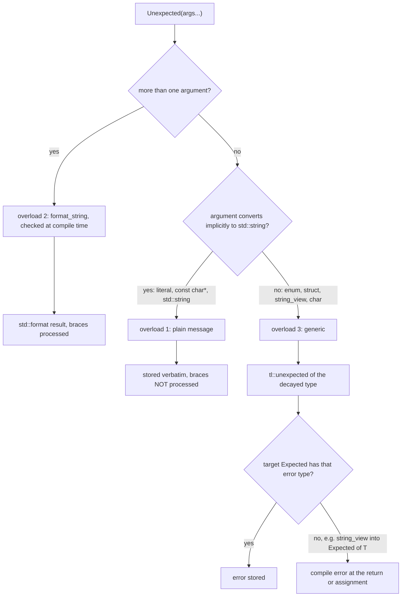
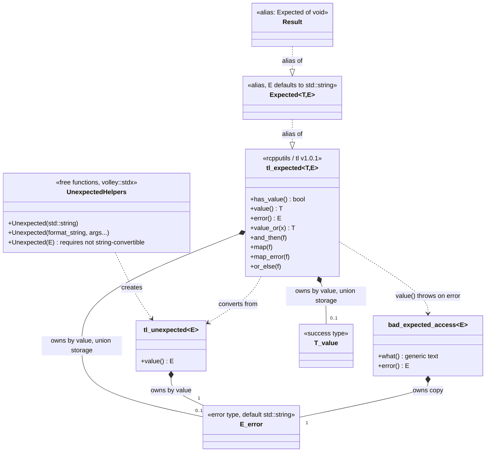
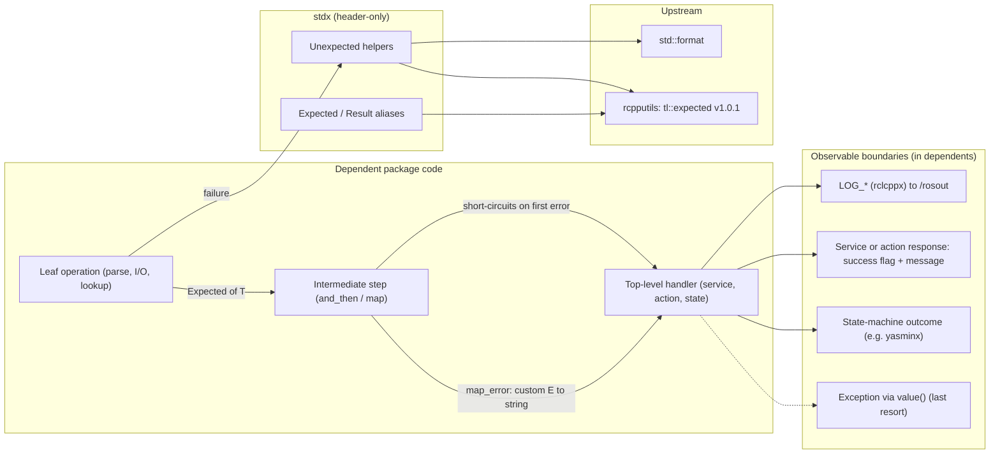

# 03 — `stdx`

| Generated | Revision | Source pack | Status |
|---|---|---|---|
| 2026-10-07 | 3 | `P03-stdx-part1of1.md` | Draft, generated by Claude, not yet reviewed by the team |

Package 3 of 37 (bottom-up) · dependency depth 0

Workspace dependencies: none.
Used by: agvhito, agvhito_tools, bay, common_ros, scheduler, vda5050_interfaces, vrc, yasminx.
Related documents: `01-common.md` (its error-handling styles, section 6.4) and `02-rclcppx.md` (its compile-time-checked `LOG_*` format strings).

**How to read the evidence markers.**
- **[read]** means the conclusion comes from reading the source.
- **[probed]** means it was confirmed by compiling and running code. Here, `expected.hpp` was built with g++ 13.3 in C++20 mode against the real `rcpputils/tl_expected/expected.hpp` from the kilted branch, and the package's own six tests were run; all pass.
- **[upstream]** means it was confirmed in the vendored tl::expected header itself.

---

## A. External dependencies

`stdx` ("standard library extensions") is one header, and almost all of its behavior comes from a single upstream type: **tl::expected** (tl = TartanLlama, the author's online handle), Sy Brand's C++11/14/17 implementation of the result type that was later standardized as `std::expected` in C++23.

Volley does not vendor tl::expected itself. It uses the copy that ROS 2 (Robot Operating System 2) already ships inside `rcpputils` (ROS C++ utilities), so no new third-party dependency enters the workspace. The header in rcpputils' kilted and rolling branches is identical and reports itself as tl::expected **v1.0.1**.

The reason for using tl::expected rather than `std::expected` is the language level. The workspace builds as C++20 (see `02-rclcppx.md`, section A). `std::expected` exists in the installed libstdc++ 13, but only in C++23 mode **[probed]**.

| Name | Description | Version | Link | Usage in this package |
|---|---|---|---|---|
| rcpputils | ROS 2 C++ utility library; vendors tl::expected at `rcpputils/tl_expected/expected.hpp`. | Same ROS distribution (Kilted or newer, see 02). Header identical on kilted and rolling. | https://github.com/ros2/rcpputils | The only real dependency: `Expected` is an alias of `tl::expected`, and `Unexpected` returns `tl::unexpected`. |
| tl::expected (vendored in rcpputils) | `expected<T, E>` with extensions: `map`, `and_then`, `or_else`, `map_error`, `void` support. | v1.0.1 (`TL_EXPECTED_VERSION_*` macros) **[upstream]** | https://github.com/TartanLlama/expected | All value/error semantics, exception behavior and monadic operations described in section 3. |
| C++20 standard library | `std::format`, `std::format_string`, concepts (`std::convertible_to`). | GCC (GNU Compiler Collection; GNU = GNU's Not Unix) ≥ 13 / libstdc++ ≥ 13 (C++20). | https://en.cppreference.com/w/cpp/utility/format/basic_format_string | The formatting overload of `Unexpected`, checked at compile time; the constraint on the generic overload. |
| `std::expected` (not used) | The standard version of the same idea. | C++23; available in libstdc++ 13 with `-std=c++23` **[probed]** | https://en.cppreference.com/w/cpp/utility/expected | Migration target (section 3.5, open question 1). |
| ament_cmake_gtest, GoogleTest | Test integration and framework. | Not pinned. | https://github.com/google/googletest | One test executable, `expected_tests`. |
| `volley_cmake` | Workspace CMake helpers. | Internal. | Not in pack. | `volley_add_library(stdx INTERFACE)`, `volley_add_gtest`. |

---

## B. Glossary

Terms already defined in `01-common.md` and `02-rclcppx.md` (INTERFACE library, `std::format` compile-time check, concept, and others) are reused here.

| Term | Meaning | Where it shows up |
|---|---|---|
| Result type / expected | A value that holds *either* a success value of type `T` *or* an error of type `E`, never both. It is a vocabulary type for fallible functions. | `Expected<T, E>` |
| Sum type / discriminated union | A type whose value is one of several alternatives, with a flag recording which one. `expected<T, E>` is the sum $T + E$. | Section 7 |
| Unexpected (wrapper) | The tag type that marks a value as an *error* when it is converted into an `expected`, so that `return Unexpected(...)` produces an error even when `T` and `E` are the same type. | `tl::unexpected<E>`; Volley's `Unexpected(...)` helpers |
| `Result` | Volley's alias for `Expected<void>`: success carries no value, failure carries a string. | Functions that "just succeed or fail" |
| `has_value()` / `operator bool` | Whether the object holds a value. | Every call site |
| `value()` | Returns the value, or **throws** `bad_expected_access<E>` if the object holds an error. | Section 6.5, R2 |
| `operator*` / `operator->` / `error()` | Access the value or the error **without checking** which one is present. Using the wrong one is undefined behavior. | Section 6.5, R3 |
| `value_or(x)` | The value, or `x` if the object holds an error. | Defaults |
| Monadic operations | Combinators that chain fallible steps without explicit `if` statements. tl's names, with the C++23 equivalents in parentheses: `and_then` (same), `map` (`transform`), `map_error` (`transform_error`), `or_else` (same). | Section 3.4 |
| Railway-oriented style | Writing a pipeline as a chain of `and_then` / `map` calls, where the first error "switches tracks" and skips the remaining steps. | Section 3.4, Figure in 4b |
| `bad_expected_access<E>` | Exception thrown by `value()` on an error. It carries the error, but its `what()` text is the generic "Bad expected access". | R2 |
| `std::format_string<Args...>` | C++20 type that checks a format string against its argument types at compile time. | The formatting `Unexpected` overload |
| Overload resolution tie-breaker | When two overloads need equally good conversions, C++ prefers a non-template function over a template. That is why `Unexpected("text")` picks the plain `std::string` overload. | Section 3.2 |
| `requires` clause | C++20 constraint that removes a template from overload resolution when it is false. | Generic `Unexpected` overload |
| `std::decay_t` | Strips references and cv-qualifiers (and turns arrays into pointers), producing the stored error type. | Generic `Unexpected` overload |
| SSO | Small-string optimization: `std::string` stores short text inline (15 characters in libstdc++) and allocates on the heap for longer text. | Cost of string errors (section 5) |
| rcpputils | ROS 2 C++ utilities package (filesystem helpers, scope exit, tl::expected, and more). | Dependency |

---

## 1. Summary

`stdx` gives the Volley workspace one shared vocabulary for "this can fail". It provides:
- `volley::stdx::Expected<T, E = std::string>`, an alias of the tl::expected type that rcpputils already ships;
- `Result`, the `void` version for operations that just succeed or fail;
- a small overload set of `Unexpected(...)` helpers that build an error from a message, a compile-time-checked `std::format` string, or any custom error type.

Dependents return `Expected<T>` instead of throwing, returning sentinels, or pairing a value with a status code. Callers then branch on `has_value()` or chain steps with `and_then` / `map`.

This package is best read as the answer to a problem visible in `common`. That package uses at least four error styles (`std::optional`, `pair<data, ExceptionCode>`, `BoolStringPair`, exceptions; see `01-common.md`, section 6.4), and `BoolStringPair` is in effect a hand-rolled `Result`.

`stdx` standardizes on one representation, and takes the same stance as `rclcppx`: catch mistakes at compile time. `Unexpected("{} at {}", a)` (too few arguments) does not compile, just like `LOG_INFO` with a bad format string.

The default error type is a plain `std::string`. That choice optimizes for readable messages at the boundaries (logs, service responses, operator UIs, i.e. User Interfaces) over machine-checkable error categories. That trade-off, and a few sharp edges inherited from tl::expected, are the main things to understand before using it (section 6.5).

---

## 2. Files

The package is four files. It has no compiled code, so the CMake target is an INTERFACE library, the same pattern as `rclcppx`. Line counts are from the pack, which has blank lines removed.

| Path (under `src/core/stdx/`) | Lines | Role |
|---|---:|---|
| `CMakeLists.txt` | 13 | Declares the header-only INTERFACE library and the `expected_tests` gtest (GoogleTest). |
| `package.xml` | 15 | Depends on `rcpputils` (for tl::expected); test-depends on `ament_cmake_gtest`. |
| `include/stdx/expected.hpp` | 39 | `Expected<T, E>` and `Result` aliases; three `Unexpected(...)` overloads. |
| `test/test_expected.cpp` | 40 | Six tests: value, error, formatted error, `void` success and failure, custom error type. |

---

## 3. Public API

Everything is in namespace `volley::stdx`, declared in `include/stdx/expected.hpp`.

### 3.1 `Expected<T, E>` and `Result`

```cpp
template <typename T, typename E = std::string>
using Expected = tl::expected<T, E>;

using Result = Expected<void>;
```

**Purpose.** These aliases give a function a single return type that says "here is the answer, or here is why there is none". Unlike exceptions, the possibility of failure is part of the signature, and nothing unwinds the stack. Unlike `std::optional`, the failure carries a reason. Unlike the `pair<value, status>` and `BoolStringPair` patterns in `common`, a caller cannot read the value of a failed call by accident when it uses the checked accessors.

**Design.**
- **Aliases, not wrappers.** `Expected` *is* `tl::expected`, so every tl member function, operator and combinator is available unchanged, and values interoperate freely with code that uses `tl::expected` directly.
- **Strings by default.** The default `E = std::string` means most code never declares an error type. The error is a message meant for a human: it ends up in a log line, a service response's `message` field, or a UI.
- **Custom errors when needed.** Code that needs to branch on the kind of failure can use `Expected<T, MyErrorEnum>` (tested with an `enum class`), and convert at the boundary with `map_error` (section 3.4).
- **`Result` for "just succeed or fail".** `Result` is `Expected<void>`. A default-constructed `Result` is a success, so `return {};` reports success.

**Usage.**

```cpp
#include "stdx/expected.hpp"
namespace stdx = volley::stdx;

stdx::Expected<Pose> LookupDock(std::string_view name);   // value or reason
stdx::Result         OpenDoor(DoorId id);                 // success or reason

if (const auto dock = LookupDock("A3"); dock) {
  Drive(*dock);                                           // checked by the if
} else {
  LOG_WARN(get_logger(), "no dock: {}", dock.error());
}
```

The names `Pose`, `DoorId` and `Drive` are illustrative, not taken from the pack.

### 3.2 `Unexpected(...)` — building errors

The header declares three overloads. Together they let a function write `return Unexpected(...)` for any kind of error without spelling out `tl::unexpected<std::string>(...)`.

| # | Signature | Chosen when | Result |
|---|---|---|---|
| 1 | `Unexpected(std::string msg)` | A single argument that converts to `std::string`: a string literal, a `const char*`, a `std::string`. | `tl::unexpected<std::string>` holding `msg` unchanged (**not formatted**). |
| 2 | `Unexpected(std::format_string<Args...> fmt, Args&&... args)` | A format string followed by one or more arguments. | `tl::unexpected<std::string>` holding `std::format(fmt, args...)`. The format string is checked against `Args` at compile time. |
| 3 | `Unexpected(E&& error)` with `requires !convertible_to<decay_t<E>, std::string>` | A single argument that does *not* implicitly convert to `std::string`: an enum, a struct, a `std::string_view`, a `char`. | `tl::unexpected<decay_t<E>>`. |

**How a call is resolved.** With one string-literal argument, overloads 1 and 2 both need a user-defined conversion (literal → `std::string`, literal → `format_string<>`). C++ breaks that tie in favor of the non-template overload 1, and overload 3 is excluded by its `requires` clause. The probes confirm the consequences **[probed]**:

| Call | Overload | Error stored |
|---|---|---|
| `Unexpected("empty input")` | 1 | `empty input` |
| `Unexpected("too big: {}", 500)` | 2 | `too big: 500` |
| `Unexpected("{} literal")` | 1 | `{} literal` (braces kept, not formatted) |
| `Unexpected("{{x}} {}", 1)` | 2 | `{x} 1` (escape processed) |
| `Unexpected("{{x}}")` | 1 | `{{x}}` (escape **not** processed, R1) |
| `Unexpected(std::string{"runtime"})` | 1 | `runtime` |
| `Unexpected(ErrorCode::kBusy)` | 3 | `ErrorCode::kBusy` as `tl::unexpected<ErrorCode>` |
| `Unexpected(std::string_view{"v"})` | 3 | `tl::unexpected<std::string_view>`, which does **not** convert to `Expected<T>` (R5) |
| `Unexpected("{} {}", 1)` | — | compile error: too few arguments |
| `Unexpected(runtime_fmt, 1)` | — | compile error: the format string is not a constant expression |



**Fit with `rclcppx`.** Overload 2 uses `std::format_string` exactly as the `LOG_*` macros do. Formatting rules, escaping (`{{`, `}}`) and compile-time checking are therefore identical between "log this" and "return this as an error". The only exception is the single-argument case, where overload 1 skips formatting entirely (R1).

### 3.3 Inspecting a result

These members come from `tl::expected` v1.0.1. The table states each one's checking behavior precisely, because that is where bugs hide.

| Member | Value present | Error present |
|---|---|---|
| `has_value()`, `explicit operator bool` | `true` | `false` |
| `value()` | the value | **throws** `tl::bad_expected_access<E>`; `what()` is "Bad expected access" (R2) |
| `operator*`, `operator->` | the value | **undefined behavior**, no assertion even in debug builds (R3) |
| `error()` | **undefined behavior** (R3) | the error |
| `value_or(x)` | the value | `x` |

For `Result` (`T = void`) there is no value to read. `value()` still exists and throws on error, which makes it a terse "assert success" for code that wants an exception.

### 3.4 Chaining fallible steps

tl::expected's monadic operations let a sequence of fallible steps be written without nested `if` statements. The first error short-circuits the rest of the chain:

```cpp
stdx::Expected<int> Parse(const std::string& s) {
  if (s.empty()) return stdx::Unexpected("empty input");
  return std::stoi(s);
}
stdx::Expected<int> Twice(int x) {
  if (x > 100) return stdx::Unexpected("too big: {}", x);
  return 2 * x;
}

auto r = Parse("21").and_then(Twice).map([](int v) { return v + 1; });  // value 43
auto e = Parse("500").and_then(Twice);                                  // error "too big: 500"
```

**[probed]**

| Operation | Called with | Returns | Use for |
|---|---|---|---|
| `and_then(f)` | the value | `f`'s own `expected` | the next fallible step |
| `map(f)` / `transform(f)` | the value | `expected<f's result, E>` | an infallible transformation |
| `map_error(f)` | the error | `expected<T, f's result>` | converting error types at a layer boundary |
| `or_else(f)` | the error | `f`'s `expected`, or `void` | recovery, or logging and passing the error on |

`map_error` is the bridge between custom error types and string errors:

```cpp
stdx::Expected<int, ErrorCode> low = ReadSensor();
stdx::Expected<int> high = low.map_error([](ErrorCode c) { return std::format("sensor: {}", common::EnumName(c)); });
```

This snippet uses `common::EnumName` from `01-common.md`, section 3.2.

### 3.5 Relation to `std::expected` and to the rest of the workspace

**Planned migration (inferred).** The aliases make a future move to C++23 `std::expected` mostly mechanical: change the alias, and the `Unexpected` helpers then return `std::unexpected`. Code that uses tl-specific spellings will need edits. The differences are confirmed in the vendored header **[upstream]**:

| tl::expected v1.0.1 | `std::expected` (C++23) |
|---|---|
| `tl::unexpected<E>::value()` reads the wrapped error | `std::unexpected<E>::error()` |
| `map` (with `transform` as an alias) | `transform` |
| `map_error` | `transform_error` |
| no `[[nodiscard]]` on the class | also no `[[nodiscard]]` on the class in libstdc++ 13 (only on some members) **[probed]**; migrating alone will not catch dropped results |
| `value()` on error throws `tl::bad_expected_access<E>` | throws `std::bad_expected_access<E>` |

**Place in the workspace.** `stdx` is the third depth-0 package, and it complements the other two:
- `common` provides domain vocabulary but mixes error styles;
- `rclcppx` standardizes ROS interfaces and logging;
- `stdx` standardizes failure.

Its users include the AGV (Automated Guided Vehicle) software (`agvhito`), the bay controller (`bay`), the scheduler, the VDA (Verband der Automobilindustrie, the German Association of the Automotive Industry) 5050 interface layer (`vda5050_interfaces`; VDA 5050 is the industry AGV-to-master-control protocol), and the state-machine layer (`yasminx`). A natural place for these errors to surface is the boundary where an `Expected` becomes a ROS service response or a state-machine outcome (Figure in 4b).

---

## 4. Diagrams

### 4a. Class diagram (ownership on edges)

The types are few, and the ownership is simple:
- an `expected` owns either its value or its error by value, in the same storage;
- an `unexpected` owns its error by value;
- nothing is heap-allocated by the types themselves, apart from what a `std::string` error allocates.



### 4b. Data flow

`stdx` performs no I/O. It has no topics, services, actions, timers, parameters, threads or hardware access, and makes no calls into lower-layer workspace packages; its only dependency is the rcpputils header.

What does "flow" is errors through dependents' call chains. The diagram shows the intended path: errors are created deep in the stack, propagated unchanged or converted on the way up, and finally turned into something observable at a ROS or user boundary.



### 4c. State machines

No state machine. An `expected` holds one of two alternatives, but it never changes from one to the other on its own; there is no YASMIN (Yet Another State MachINe, a ROS 2 state-machine library) or enum-driven state machine in this package.

---

## 5. Behavior

**Construction, steady state, shutdown.** There is no runtime component: no node, executor, callback group, thread, timer or parameter. Everything happens at the call sites in dependents, at the cost of the operations below. Nothing has to be initialized or shut down.

**Cost model.** These are the behaviors that matter on real-time-ish paths, such as AGV control loops or the scheduler.

- **Size.** An `Expected<T>` with a string error stores a `std::string` (32 bytes in libstdc++), the `T`, and a flag in one union. `sizeof(Expected<int>)` is 40 bytes **[probed]**. Every function returning `Expected<T>` returns an object at least that large, but returns are elided in practice.
- **Success path.** Constructing or returning a value never touches the string, so there is no allocation.
- **Error path.**
  - An error message of up to 15 characters fits in the small-string buffer.
  - Longer messages, and every formatted message, allocate on the heap.
  - `std::format` adds formatting cost on top.
  - On error-heavy hot paths (for example a validation that fails routinely every cycle), prefer a custom enum error type, which never allocates, and format only at the boundary.
- **Exceptions.** None are thrown unless `value()` is called on an error. With exceptions disabled (not the case in ROS builds), that call becomes `__builtin_unreachable()`, which is undefined behavior **[upstream]**.

**Parameters and defaults.**

| Item | Default | Notes |
|---|---|---|
| Error type `E` of `Expected<T, E>` | `std::string` | Override per function for structured errors. |
| Default-constructed `Result` | success | `Result r;` holds no error. |
| Default-constructed `Expected<T>` | holds a value-initialized `T` (if `T` is default-constructible) | It is *not* an error; `Expected<int> e;` holds `0` **[probed]**. |

---

## 6. Ownership and safety

### 6.1 Lifetimes

An `expected` and an `unexpected` own their contents by value, so they are as safe as `T` and `E` themselves. The vendored header rejects reference types for both, with `static_assert(!is_reference<T>)` and the same for `E` **[upstream]**. The remaining lifetime hazard is non-owning error or value types such as `std::string_view` (R4).

### 6.2 Callbacks capturing `this`

Not applicable inside `stdx`. Lambdas passed to `and_then`, `map` and the other combinators run synchronously, inside the call, so capturing `this` or references there is safe as long as the expression is evaluated immediately, which it always is.

### 6.3 Locks and atomics

None. An `expected` is a plain value type with the thread-safety of its contents: safe to share for concurrent reading, and in need of external synchronization if one thread mutates it.

### 6.4 Error handling

This package *is* the workspace's error-handling policy, so it is worth stating how it relates to the other styles.

| Situation | Recommended style (inferred from this package and its tests) |
|---|---|
| Operation that can fail for a reason the caller should see | `Expected<T>` / `Result` with a string message |
| Caller must branch on the kind of failure | `Expected<T, ErrorEnum>`, converted with `map_error` at the boundary |
| "Maybe absent", where absence is normal and needs no reason | `std::optional` is still fine (as used in `common`) |
| Programming errors and broken invariants | `assert` or `std::terminate`, not `Expected` |
| Constructors that cannot produce a usable object | Exceptions (as `common`'s `ModbusTCP` does), or a static factory returning `Expected<T>` |

### 6.5 RISK items

| Item | Risk | Evidence |
|---|---|---|
| R1 | **Inconsistent brace handling.** `Unexpected` with a single string argument stores the text verbatim, but with arguments it formats. So `Unexpected("{{x}}")` stores `{{x}}` while `Unexpected("{{x}} {}", 1)` stores `{x} 1`, and a message like `"missing {}"` written without its argument compiles and silently keeps the braces. | **[probed]** |
| R2 | **`value()` on an error throws an exception whose text loses the message.** `bad_expected_access<E>::what()` returns "Bad expected access". The real message is available only by catching `bad_expected_access<std::string>` and calling `.error()`. Inside a ROS callback, an uncaught throw takes down the executor thread, typically the whole process. | **[probed]** |
| R3 | **Unchecked accessors.** `operator*`, `operator->` and `error()` do no check at all, not even an assertion in debug builds, in tl v1.0.1. Dereferencing an error, or reading `error()` from a value, is undefined behavior, and the code may appear to work. | **[upstream]** header inspection |
| R4 | **Non-owning error types dangle.** `Expected<T, std::string_view>` accepts `Unexpected("... {}", x)` because `std::string` converts to `string_view`. The view then points into a temporary string that has already been destroyed, and the probe printed garbage. Never use `string_view` (or `const char*` built from formatted text) as `E`. | **[probed]** |
| R5 | **Almost-strings take the generic path.** `Unexpected(std::string_view)` and `Unexpected(char)` produce `tl::unexpected<string_view>` and `tl::unexpected<char>`. These fail to convert to `Expected<T>` (string error), with a long template error at the `return`. Wrap the argument: `Unexpected(std::string(sv))`. | **[probed]** |
| R6 | **Errors can be ignored silently.** tl v1.0.1 has no `[[nodiscard]]`, so calling a `Result`-returning function and dropping the result compiles without any warning, even with `-Wall -Wextra -Wunused-result`. | **[probed]** |
| R7 | **String errors are unstructured.** Callers cannot branch on the cause without parsing text. If different layers choose different `E` types, conversions (`map_error`) are needed at every seam, and that is easy to skip in favor of `value()`. | **[read]** |
| R8 | **Migration friction.** tl-specific spellings (`unexpected::value()`, `map`, `map_error`) will need edits when moving to `std::expected` (section 3.5). | **[upstream]** |
| R9 | **A default-constructed `Expected<T>` is a success.** It holds a value-initialized `T`, which can hide "forgot to set the result" bugs, for example when a function builds `Expected<int> out;` and returns it unchanged on an unexpected code path. | **[read]**, standard expected semantics |

---

## 7. Math

`stdx` contains no numerical algorithms. Its only "math" is the algebra of the result type itself, which is a compact way to state what the combinators guarantee.

An `Expected<T, E>` is a sum type, a value of $T$ or of $E$:

$$
\text{Expected}\langle T,E\rangle \;\cong\; T + E,\qquad \text{Result} \;\cong\; 1 + \text{string}
$$

Here $1$ is the unit type: `void` success carries no information.

For $x$ of type $T+E$, a fallible step $f: T\to U+E$ and a plain function $g: T\to U$:

$$
x.\text{and\_then}(f)=\begin{cases} f(t) & x=\text{value}(t)\\ \text{error}(e) & x=\text{error}(e)\end{cases}
\qquad
x.\text{map}(g)=\begin{cases} \text{value}(g(t)) & x=\text{value}(t)\\ \text{error}(e) & x=\text{error}(e)\end{cases}
$$

So in a chain $x.\text{and\_then}(f_1).\text{and\_then}(f_2)\cdots$, the first error is returned unchanged and no later step runs. `and_then` is associative, which is why a long chain can be split into helper functions without changing its meaning:

$$
\big(x.\text{and\_then}(f)\big).\text{and\_then}(g) \;=\; x.\text{and\_then}\big(t\mapsto f(t).\text{and\_then}(g)\big)
$$

---

## 8. Tests

There are six tests in one executable, `expected_tests`. All six pass when built against the kilted rcpputils header with g++ 13.3 **[probed]**.

| Test | Covers | What it reveals about intended behavior |
|---|---|---|
| `DefaultHoldsValue` | `Expected<int> v = 42;` holds a value. | Values convert implicitly into `Expected`; returning a plain `T` is the success path. |
| `DefaultHoldsError` | `Unexpected(const char*)` produces an error with that exact text. | The single-string overload is the everyday way to fail. |
| `UnexpectedFromFormat` | `Unexpected("code={}, name={}", 7, "test")` gives `"code=7, name=test"`. | Formatted messages are intended to replace manual string building. |
| `ResultVoidSuccess` | A default-constructed `Result` is a success. | `return {};` is the success idiom for `Result`. |
| `ResultVoidError` | `Result = Unexpected(...)` holds the error. | — |
| `CustomError` | `Expected<int, ErrorCode>` with an `enum class` via the generic overload. | Structured error types are intended to work through the same `Unexpected` spelling. |

**Gaps.**
- **No test pins the single-argument behavior with braces** (R1). A test asserting that `Unexpected("{}")` stores `{}` would document the current behavior, or catch a fix.
- **No compile-failure tests** (format argument mismatch, `string_view` into a string `Expected`). These need a "should not compile" harness (for example a CMake `try_compile` test).
- **Nothing exercises the monadic API (Application Programming Interface)** (`and_then`, `map`, `map_error`, `or_else`) or `value_or`, even though that is how dependents are meant to compose results.
- **No test of `value()` throwing**, or of the message visible in the exception (R2).
- **No test for move-only `T`** (for example `Expected<std::unique_ptr<X>>`, which works **[probed]**) or for non-default-constructible `T`. Both are common in dependents and supported by tl.

---

## 9. Idioms to reuse, and open questions

### 9.1 Idioms

- **Return, don't throw.** Fallible functions return `stdx::Expected<T>` or `stdx::Result`. Fail with `return stdx::Unexpected("...")`, or `return stdx::Unexpected("... {}", x)` when there is context to include, which there almost always is. Succeed with `return value;` or `return {};`.
- **Check before reading.** Use `if (r) { use(*r); }` or `value_or`. Reserve `value()` for places where an exception really is the desired outcome, and never use `*r` or `r.error()` without a preceding check.
- **Compose with `and_then` and `map`** rather than nested `if (!r) return r;` blocks. Use `map_error` at layer boundaries to turn structured errors into messages (or messages into a common enum).
- **Format once, at the source.** Put the context into the message where the failure happens. Upper layers should add context by wrapping (`map_error([](auto e) { return std::format("loading layout: {}", e); })`), not by replacing the message.
- **Use owning error types only.** `std::string`, enums and structs are fine; `string_view` and `const char*` from formatted text are not (R4).
- **Prefer this over `BoolStringPair`** and `pair<value, status>` in new code. When touching `common`-style APIs, consider adapting them at the call site: `ok ? Result{} : Unexpected(msg)`.

### 9.2 Open questions for the team

1. **Is migrating to `std::expected` planned** (it requires C++23)? If so, should code avoid tl-only spellings now (`unexpected::value()`, `map`, `map_error`) to keep the switch mechanical?
2. Should the single-argument `Unexpected("...")` also go through `std::format` (with a constant format string), so that braces behave the same with and without arguments (R1)?
3. Should `stdx` provide a `[[nodiscard]]` wrapper, a convention of marking fallible functions `[[nodiscard]]`, or a clang-tidy check (`bugprone-unused-return-value` configured for `tl::expected`) so dropped `Result`s are caught (R6)? Moving to `std::expected` would not fix this on its own.
4. Is there a convention for structured errors (a shared error enum or struct, perhaps per subsystem) for the cases where callers must branch on the cause (R7)?
5. Should `common`'s `BoolStringPair` and the Modbus `pair<data, ExceptionCode>` returns be migrated to `Expected`, and is there an agreed adapter for ROS service responses (success flag plus message)?
6. Should the generic `Unexpected` overload reject `std::string_view` and `char` explicitly, with a clear `static_assert` message instead of a deep template error (R5)?
