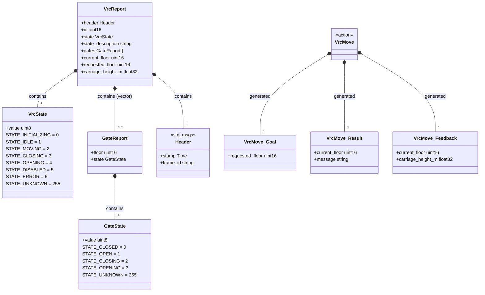
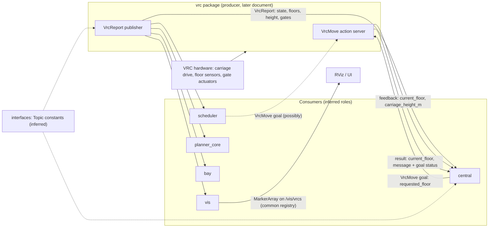
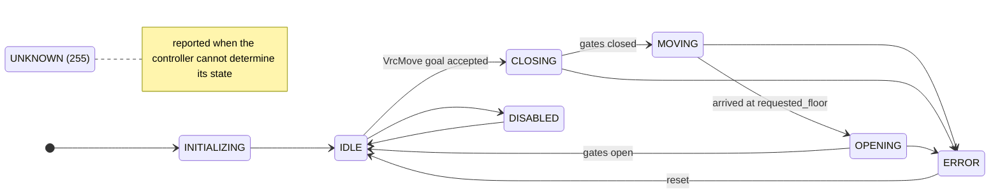
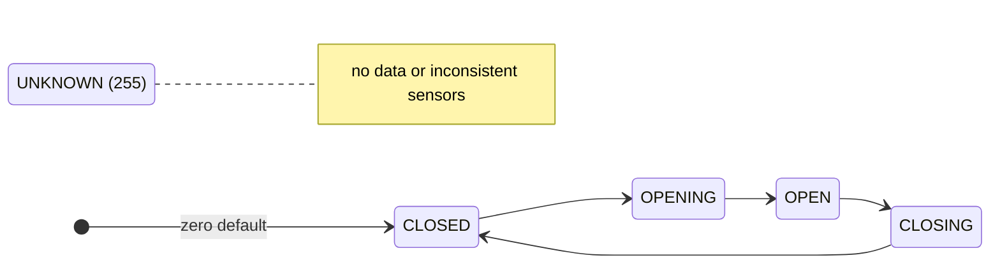
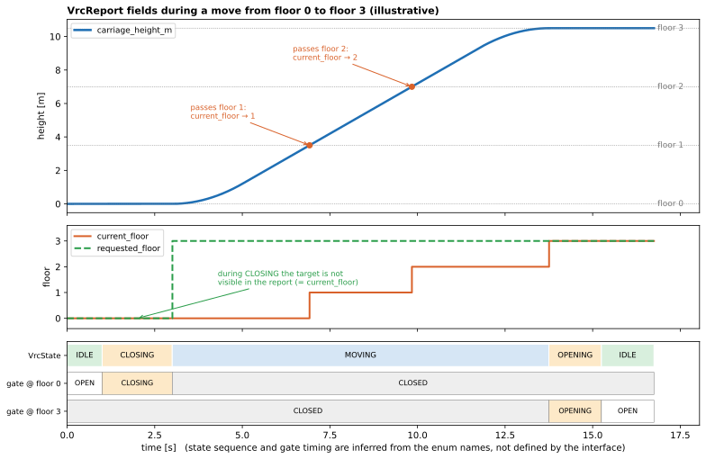

# 04 — `vrc_interfaces`

| Generated | Revision | Source pack | Status |
|---|---|---|---|
| 2026-10-07 | 4 | `P04-vrc_interfaces-part1of1.md` | Draft, generated by Claude, not yet reviewed by the team |

Package 4 of 37 (bottom-up) · dependency depth 0

**Abbreviations used in this document.** Each is also explained in context where it first matters.

| Abbreviation | Meaning |
|---|---|
| AGV | Automated Guided Vehicle |
| API | Application Programming Interface |
| CI | Continuous Integration |
| CMake (`cmake` in names) | Cross-platform Make (build-system generator) |
| ID | identifier |
| IDE | Integrated Development Environment |
| QoS | Quality of Service |
| `rclcpp` | ROS Client Library for C++ |
| `rclcppx` | "rclcpp extensions" (Volley package) |
| ROS | Robot Operating System |
| `rosidl` | ROS Interface Definition Language (code-generation tooling) |
| RViz | ROS visualization tool |
| `stdx` | "standard library extensions" (Volley package) |
| UI | User Interface |
| ULP | Unit in the Last Place |
| `vis` | visualization (the `vis` package) |
| VRC (`vrc` in names) | Vertical Reciprocating Conveyor (a freight lift between floors) |

Workspace dependencies: none.
Used by: bay, central, interfaces, planner_core, scheduler, vis, vrc.
Related documents:
- `01-common.md`: its `/vis/vrcs` visualizer topic, and its constants and enum vocabulary;
- `02-rclcppx.md`: typed `Topic<M>` definitions and the action-server factory;
- `03-stdx.md`: string error messages.

**How to read the evidence markers.**
- **[read]** means the conclusion comes from reading the interface files.
- **[rosidl]** means it follows from standard ROS 2 (Robot Operating System 2) interface-generation rules (rosidl, the ROS Interface Definition Language tooling), which are not part of the pack.
- **[inferred]** means it is a reasonable reading of names and comments that the team should confirm.

Nothing in this package could be compiled here, because no ROS install was available.

---

## A. External dependencies

`vrc_interfaces` is a pure interface-definition package. It contains no C++ or Python of its own. Its four messages and one action are compiled by the ROS 2 interface generators (rosidl) into C, C++ and Python types, plus the serialization support each middleware needs. Its dependencies are therefore build tools and the standard message packages its definitions refer to.

| Name | Description | Version | Link | Usage in this package |
|---|---|---|---|---|
| rosidl_default_generators | ROS 2 interface code generators (C, C++, Python, type support). | Same ROS distribution (Kilted or newer, see `02-rclcppx.md`). | https://github.com/ros2/rosidl_defaults | `rosidl_generate_interfaces(...)` in `CMakeLists.txt`; `buildtool_depend`. |
| rosidl_default_runtime | Runtime libraries the generated code needs. | Same distribution. | https://github.com/ros2/rosidl_defaults | `exec_depend` and `ament_export_dependencies`, so dependents get it transitively. |
| std_msgs | Standard messages. | Same distribution. | https://github.com/ros2/common_interfaces | `std_msgs/Header` inside `VrcReport`; declared in `DEPENDENCIES`. |
| action_msgs, builtin_interfaces, unique_identifier_msgs | Types every ROS 2 action is built from: goal IDs (identifiers), goal status, timestamps. | Same distribution. | https://github.com/ros2/rcl_interfaces | Pulled in implicitly because the package contains an `.action` file **[rosidl]**. They are not declared in `package.xml` (R10). |
| `volley_cmake` | Workspace CMake helpers. | Internal. | Not in pack. | `volley_package()`, `volley_ament_auto_package()`. |
| CMake ≥ 3.28 | Build system. | 3.28 | https://cmake.org/cmake/help/latest/command/file.html#glob-recurse | `file(GLOB_RECURSE … CONFIGURE_DEPENDS)` collects every `msg/*.msg`, `srv/*.srv` and `action/*.action` automatically. |

---

## B. Glossary

Terms already defined in `01-common.md`, `02-rclcppx.md` and `03-stdx.md` (topic, QoS, i.e. Quality of Service, action, node, and so on) are reused here.

| Term | Meaning | Where it shows up |
|---|---|---|
| VRC | Vertical Reciprocating Conveyor: a freight lift with a carriage that moves material between floors. In Volley's garage it presumably carries AGVs (Automated Guided Vehicle) and trays between levels *(inferred)*. | Package name, every type |
| Carriage | The platform of the VRC that moves vertically. | `carriage_height_m` |
| Fall protection gate | Barrier at each floor's VRC opening that stops people or vehicles falling into the shaft when the carriage is elsewhere. | `GateReport`, `GateState` |
| Floor index | Integer number of a floor. "Lowest indexed floor" is the reference for height. Whether indexing starts at 0 or 1 is not stated (R4). | `requested_floor`, `current_floor`, `GateReport.floor` |
| Interface package | ROS package that contains only `.msg`, `.srv` and `.action` definitions and generates code for them. | This package; member of `rosidl_interface_packages` |
| rosidl | The ROS 2 interface definition language and its generators. | `CMakeLists.txt` |
| `.msg` / `.action` | A message definition, and an action definition. An action file has three sections, Goal, Result and Feedback, separated by `---`. | `msg/`, `action/` |
| Message constant | A line like `uint8 STATE_IDLE=1`. It generates a named constant (in C++, a `static constexpr` member), not a C++ `enum`. | `VrcState`, `GateState` |
| Field default value | rosidl lets a field have an initial value (`uint8 value 255`). Without one, numeric fields start at 0 **[rosidl]**. | R1 |
| `std_msgs/Header` | Timestamp (`stamp`) plus coordinate frame name (`frame_id`). | `VrcReport.header` |
| Goal status | Final status of an action goal: SUCCEEDED, ABORTED or CANCELED. Reported by the action machinery, separately from the Result message. | `VrcMove` outcome (R6) |
| Feedback | Periodic progress messages from an action server to the client that sent the goal. | `VrcMove` Feedback |
| Type support | Generated code that tells a middleware how to serialize a type. | Generated by rosidl |
| Type hash | Hash of a message's structure that ROS 2 nodes exchange, so they can detect mismatched definitions of the same type name. ROS 2 Iron added it; Kilted has it. | Interface evolution (R11) |
| `CONFIGURE_DEPENDS` glob | Makes CMake re-run the glob at build time, so newly added `.msg` files are picked up automatically. | `CMakeLists.txt` |
| ULP | Unit in the last place: the spacing between adjacent representable floating-point numbers near a value. | Section 7.2 |

---

## 1. Summary

`vrc_interfaces` defines the contract between the VRC controller (the `vrc` package) and the rest of the system: the planners, the scheduler, the central dispatcher, the bay and the visualizer. It provides two things:
- **a status report**, `VrcReport`, with the VRC's state, its carriage height, its current and requested floors, and the state of every floor's fall-protection gate;
- **a command**, the `VrcMove` action, which sends the carriage to a floor, streams progress back while moving, and finishes with the floor actually reached plus a message.

Because it is an interface package, the code that dependents use is *generated*: `vrc_interfaces::msg::VrcReport`, `vrc_interfaces::action::VrcMove` and so on, in C++, and their Python equivalents.

This is the first package in the series that defines *ROS types* rather than C++ utilities. It sits on the other side of the machinery documented so far:
- `rclcppx` creates publishers, subscriptions and action servers from typed definitions;
- `stdx` carries string errors;
- `common` has a `/vis/vrcs` marker topic.

This package supplies the messages that flow through those pipes.

The definitions are compact and well commented, and the comments act as the specification of field semantics (section 7.1). The main concerns are:
- **an unsafe zero default:** a gate state that was never set reads as **CLOSED** (R1);
- **state "enums" are bare integers**, not checked types (R2);
- **floor numbers have no "unknown" value** (R4);
- **the action's failure reason is free text** (R6).

---

## 2. Files

The package has seven files: four messages, one action and two build files. There is no `srv/` directory, even though the CMake glob looks for one. Line counts are from the pack, which has blank lines removed.

| Path (under `src/interfaces/vrc_interfaces/`) | Lines | Role |
|---|---:|---|
| `action/VrcMove.action` | 17 | Command: move the carriage to `requested_floor`. Result: floor reached plus message. Feedback: current floor and carriage height. |
| `msg/VrcReport.msg` | 18 | Full VRC status: header, id, state, description, gates, current/requested floor, carriage height. |
| `msg/VrcState.msg` | 12 | VRC state values (INITIALIZING, IDLE, MOVING, CLOSING, OPENING, DISABLED, ERROR, UNKNOWN). |
| `msg/GateReport.msg` | 4 | One floor's gate: floor index plus `GateState`. |
| `msg/GateState.msg` | 8 | Gate state values (CLOSED, OPEN, CLOSING, OPENING, UNKNOWN). |
| `CMakeLists.txt` | 24 | Globs all interface files and calls `rosidl_generate_interfaces` with a `std_msgs` dependency. |
| `package.xml` | 17 | Interface package manifest: rosidl generators and runtime, std_msgs, `rosidl_interface_packages` group. |

---

## 3. Public API

The API (Application Programming Interface) of an interface package is the set of generated types. In C++ they live in namespace `vrc_interfaces::msg` and `vrc_interfaces::action`, with headers such as `vrc_interfaces/msg/vrc_report.hpp` and `vrc_interfaces/action/vrc_move.hpp`. In Python they are importable from `vrc_interfaces.msg` and `vrc_interfaces.action` **[rosidl]**.

| `.msg` / `.action` type | C++ type | Field type mapping |
|---|---|---|
| `uint8`, `uint16` | `uint8_t`, `uint16_t` | — |
| `float32` | `float` | — |
| `string` | `std::string` | — |
| `GateReport[]` | `std::vector<GateReport>` | unbounded array |
| `std_msgs/Header` | `std_msgs::msg::Header` | — |

### 3.1 State value types: `VrcState`, `GateState`

**Purpose.** These give the VRC and each gate a small, shared vocabulary of states, so every consumer interprets "moving" or "open" the same way.

**Design.** Each is a one-field message (`uint8 value`) plus named constants. This is the common ROS idiom for an enum, because the ROS message language has no enum type.

| `VrcState` constant | Value | Meaning (from names and comments) |
|---|---:|---|
| `STATE_INITIALIZING` | 0 | Controller starting up; also the value of a default-constructed message (R1). |
| `STATE_IDLE` | 1 | At rest on `current_floor`. |
| `STATE_MOVING` | 2 | Travelling to `requested_floor`. |
| `STATE_CLOSING` | 3 | Gates closing before a move *(inferred)*. |
| `STATE_OPENING` | 4 | Gates opening after arrival *(inferred)*. |
| `STATE_DISABLED` | 5 | Not available for commands; the reason is not specified. |
| `STATE_ERROR` | 6 | Fault. |
| `STATE_UNKNOWN` | 255 | State cannot be determined. |

| `GateState` constant | Value |
|---|---:|
| `STATE_CLOSED` | 0 (also the default value, R1) |
| `STATE_OPEN` | 1 |
| `STATE_CLOSING` | 2 |
| `STATE_OPENING` | 3 |
| `STATE_UNKNOWN` | 255 |

**Usage.** Compare against the generated constants, never against literal numbers:

```cpp
using vrc_interfaces::msg::VrcState;
if (report.state.value == VrcState::STATE_IDLE) { /* current_floor is where the carriage is */ }
```

Because these are integer constants rather than a C++ `enum class`, the compiler cannot warn about a `switch` that misses a state. `common::EnumName` (from `01-common.md`) does not work on them either; the human-readable text is carried separately, in `VrcReport.state_description`.

### 3.2 `GateReport`

`GateReport` pairs a floor index with that floor's `GateState`. `VrcReport` carries an array of them, presumably one per served floor. The type can identify **only one gate per floor**, and the order and uniqueness of the array are not specified (R8).

### 3.3 `VrcReport` — status message

**Purpose.** `VrcReport` is the one message a consumer needs to know where the VRC is, what it is doing, and whether every floor opening is safe.

**Fields.**

| Field | Type | Semantics (from the comments) |
|---|---|---|
| `header` | `std_msgs/Header` | Timestamp of the report. `frame_id` usage is unspecified. |
| `id` | `uint16` | VRC identifier, for sites with several VRCs. |
| `state` | `VrcState` | Current VRC state. |
| `state_description` | `string` | Human-readable explanation of the state. |
| `gates` | `GateReport[]` | Gate state per floor. |
| `current_floor` | `uint16` | If IDLE, the floor the carriage is on. Otherwise, the last floor it was idle on or **passed while moving**. |
| `requested_floor` | `uint16` | If MOVING, the target floor. Otherwise it **equals `current_floor`**. |
| `carriage_height_m` | `float32` | Positive distance from the lowest-indexed floor, in metres. |

**Design notes.**
- The message is a complete snapshot, not a stream of changes. A consumer that sees only the latest report (with keep-last-1 QoS) still has everything it needs.
- The field semantics depend on `state`: `current_floor` and `requested_floor` mean different things in IDLE and in MOVING. Section 7.1 states the rules formally, and Figure 7.1 shows them over a move. The practical consequence: when the state is not MOVING, which includes CLOSING right after a goal is accepted, `requested_floor` does not show where the VRC is about to go (R5).

**Usage.**
- Subscribers (`central`, `scheduler`, `planner_core`, `vis`, presumably `bay`) should read `state` first, then interpret the floors.
- For safety decisions they should treat every gate whose state is not `STATE_CLOSED` as unsafe, and should not assume the `gates` array covers every floor.

The topic name and QoS are **not defined here**. Following `02-rclcppx.md`, they presumably live in a `Topic<vrc_interfaces::msg::VrcReport>` constant in the `interfaces` package, which is listed as a user of this one *(inferred)*.

### 3.4 `VrcMove` — move action

**Purpose.** Command the carriage to a floor, observe the move, and learn the outcome.

```text
Goal:     uint16 requested_floor
Result:   uint16 current_floor      # requested floor if succeeded, else last positioned floor
          string message
Feedback: uint16 current_floor
          float32 carriage_height_m
```

**Design.**
- **An action, not a service**, because a move takes many seconds, needs progress updates, and may be cancelled.
- **Success is signalled by the goal status** (SUCCEEDED, ABORTED or CANCELED), which ROS 2 tracks separately from the Result message. The Result adds the floor actually reached, and a free-text `message` explaining the outcome. That message plays the same role as a `stdx` string error (`03-stdx.md`) **[inferred]**.
- **The goal does not name a VRC.** On a site with several VRCs, the VRC must be selected by the action's name or namespace, for example one action server per VRC node, while reports carry a numeric `id` (R7).
- **Feedback** repeats the floor and height but not the state, so a client cannot tell gates-closing from carriage-moving through feedback alone (R12).
- **A misplaced comment:** the comment "Positive distance from the lowest indexed floor in meters" in the Feedback section sits above `current_floor`, but it describes `carriage_height_m` (R9).

**Generated types** **[rosidl]**:
- `vrc_interfaces::action::VrcMove`, with nested `Goal`, `Result` and `Feedback`;
- the internal `VrcMove_SendGoal` and `VrcMove_GetResult` services and the `VrcMove_FeedbackMessage` type, used by the action machinery.

**Usage.** The `vrc` package presumably serves the action, through `rclcppx::CreateActionServer<VrcMove>` so that introspection is configured consistently. Clients such as `central` or `scheduler` send goals and wait for the result:

```cpp
using VrcMove = vrc_interfaces::action::VrcMove;
VrcMove::Goal goal;
goal.requested_floor = 3;
auto options = rclcpp_action::Client<VrcMove>::SendGoalOptions{};
options.feedback_callback = [this](auto, const auto& fb) {
  LOG_DEBUG(get_logger(), "VRC at {:.2f} m (floor {})", fb->carriage_height_m, fb->current_floor);
};
options.result_callback = [this](const auto& wrapped) {
  if (wrapped.code != rclcpp_action::ResultCode::SUCCEEDED) {
    LOG_WARN(get_logger(), "VRC move failed at floor {}: {}", wrapped.result->current_floor, wrapped.result->message);
  }
};
vrc_client_->async_send_goal(goal, options);
```

The client code is illustrative and not taken from the pack.

---

## 4. Diagrams

### 4a. Class diagram (ownership on edges)

Messages contain their fields by value, including nested messages and arrays, so every edge is composition. The action generates three nested types plus internal wrapper types.



### 4b. Data flow

The package itself has no runtime, so it has no topics, services, timers or parameters of its own, and it makes no calls into lower-layer workspace packages. What it defines is the *shape* of two data paths between the `vrc` controller and its consumers.

The producer and consumer roles below are inferred from the package's "used by" list. Later documents (vrc, central, scheduler and the others) should confirm them.



### 4c. State machines

The package implements no state machine; it has no code at all. It does, however, define the **state vocabularies** (`VrcState`, `GateState`) that the `vrc` package's state machine reports through this API. Consumers have to reason about these states, so the diagrams below show the transitions the names and comments imply.

The transitions are **[inferred]**. Only the meanings of IDLE and MOVING are backed by comments in `VrcReport.msg`. The authoritative machine belongs in the `vrc` document.





---

## 5. Behavior

**Construction, steady state, shutdown.** These do not apply to the package itself: it produces generated types and libraries at build time and has no runtime component. Some behavior of the generated code still matters to every user **[rosidl]**:

- **Default construction zero-initializes every field.** A fresh `VrcReport` therefore says:
  - state `INITIALIZING` (0);
  - floors 0 and height 0;
  - an empty gate list.

  A fresh `GateState` says **`CLOSED`** (0). That is fine for the VRC state, but for a fall-protection gate it means an unset field reports the safe-looking value (R1).
- **Messages are value types.** Copying a `VrcReport` copies the gate vector and strings, and nothing is shared between copies.
- **The build regenerates code whenever a definition changes.** The `CONFIGURE_DEPENDS` glob means adding `msg/Foo.msg` needs no CMake edit. It also means deleting or renaming a file silently removes a type, and the break shows up only when dependents fail to compile.

**Executors, threads, timers.** None in this package. The `VrcMove` action, once served by `vrc` and used by clients, runs in their executors through the standard rclcpp_action (ROS Client Library for C++, action support) machinery.

**Parameters and defaults.** No parameters. Field defaults are the rosidl zero values, because none of the definitions declares an explicit default:

| Field | Default | Meaning of the default |
|---|---|---|
| `VrcState.value` | 0 | `STATE_INITIALIZING` |
| `GateState.value` | 0 | `STATE_CLOSED` (R1) |
| floors, `id` | 0 | Indistinguishable from a real floor 0 or VRC 0 (R4) |
| `carriage_height_m` | 0.0 | At the lowest floor |
| strings, arrays | empty | — |

---

## 6. Ownership and safety

### 6.1 Lifetimes

Generated messages own all their data, including nested messages, the `gates` vector and strings, so they have no lifetime hazards of their own. In rclcpp (ROS Client Library for C++), subscription callbacks typically receive them by `const&` or `SharedPtr`. A consumer that keeps the latest report should copy it, or keep the `SharedPtr`, rather than holding a reference into a callback argument.

### 6.2 Callbacks capturing `this`

Not applicable in this package. Clients of `VrcMove` register feedback and result callbacks that usually capture `this`, as in the example in 3.4. The usual rule from `02-rclcppx.md` applies: the action client, kept as a member, must not outlive the object.

### 6.3 Locks and atomics

None.

### 6.4 Error handling

The interface expresses failure in three ways:
- **`VrcState`** reports ERROR, DISABLED or UNKNOWN;
- **the goal status** of `VrcMove` reports ABORTED or CANCELED;
- **free text** appears in `VrcMove.Result.message` and `VrcReport.state_description`.

There is no machine-readable error code anywhere (R6).

### 6.5 RISK items

| Item | Risk | Evidence |
|---|---|---|
| R1 | **The zero default of a gate state is CLOSED.** `GateState.value` defaults to 0 = `STATE_CLOSED`. A publisher that forgets to set a gate's state, or appends a default `GateReport`, reports that gate as closed. For a fall-protection barrier, "closed" is the state that permits motion or access. Making UNKNOWN the default (`uint8 value 255` in the `.msg`, or renumbering so UNKNOWN = 0) would make the failure safe. | **[read]** + **[rosidl]** zero-initialization |
| R2 | **States are bare integers.** `uint8 value` with constants has no exhaustiveness checking, cannot use `common::EnumName`, and can carry undefined values (7, 42) without complaint. Consumers must decide what an unrecognized value means; treating it as UNKNOWN is the safe choice. | **[read]** |
| R3 | **No explicit "unknown" for the VRC state default.** A default `VrcReport` reads INITIALIZING, which is plausible enough that a never-populated report could pass for a VRC that is starting up. | **[read]** |
| R4 | **Floors have no unknown value, and no defined base.** `current_floor`, `requested_floor` and `GateReport.floor` are `uint16` with no sentinel, so during INITIALIZING, UNKNOWN or ERROR they still carry a number (often 0) that looks valid. The spec does not say whether floor indexing starts at 0 or at 1. | **[read]** |
| R5 | **The target is not visible outside MOVING.** Taken literally, the comment says `requested_floor` equals `current_floor` in every state except MOVING, including CLOSING right after a goal is accepted and OPENING at the destination. A consumer cannot tell "idle at 2" from "about to leave 2 for 4" by floors alone (Figure 7.1). | **[read]** |
| R6 | **Failure reasons are free text.** The `VrcMove` Result and `VrcReport` give only strings, so the scheduler or planner cannot branch on the cause (gate blocked, overload, fault, cancelled) without parsing messages. This is the same trade-off as `stdx` string errors (`03-stdx.md`, R7). | **[read]** |
| R7 | **Two identifiers for one VRC.** The action goal carries no VRC id, so selection depends on the action's name or namespace, while reports carry `id`. The mapping between the two lives outside this package and can drift. | **[read]**, **[inferred]** |
| R8 | **One gate per floor, unordered.** `GateReport` keys a gate by floor only, so a VRC with gates on two sides of a floor cannot report them separately. The array's ordering, completeness and uniqueness are unspecified. | **[read]** |
| R9 | **A misplaced comment in `VrcMove.action`.** The Feedback comment "Positive distance from the lowest indexed floor in meters" is placed above `current_floor` but describes `carriage_height_m`. Generated documentation and IDE (Integrated Development Environment) tooltips will attach it to the wrong field. | **[read]** |
| R10 | **`package.xml` does not declare `action_msgs`.** The ROS 2 action tutorials declare it alongside `rosidl_default_generators`. The build works because rosidl adds the action dependencies itself, but tools that read only `package.xml` (rosdep, dependency graphs) will not see them. | **[read]** + upstream convention |
| R11 | **Interface evolution.** Any change to these definitions changes the type, and its type hash. During a rolling deployment, nodes built from different revisions can fail to communicate. Since many packages depend on this one, a change forces a coordinated rebuild and redeploy. | **[rosidl]**, **[inferred]** |
| R12 | **Feedback carries no state.** A client following a move through feedback cannot see CLOSING, OPENING or ERROR. It must also subscribe to `VrcReport`. | **[read]** |
| R13 | **Overlapping vocabularies.** `VrcState` has CLOSING and OPENING, and so does `GateState`. Whether the VRC's CLOSING means "gates closing" (as assumed here) or something else, such as carriage doors, is not stated. DISABLED and ERROR are not distinguished either. | **[read]** |

---

## 7. Math

The package contains no algorithms. The comments do, however, define precise relationships between fields, and stating them formally makes the contract unambiguous, including one subtlety the prose leaves open: what "passed" means when the carriage moves down.

### 7.1 Field invariants of `VrcReport`

Let $s$ be the state, $h$ the carriage height, $h_i$ the height of floor $i$ (with $h_{\min}=0$ at the lowest-indexed floor), $c$ = `current_floor`, $r$ = `requested_floor`, and $g$ the floor requested by the active goal. The comments state:

$$
r=\begin{cases} g & s=\text{MOVING}\\ c & \text{otherwise}\end{cases}
\qquad\qquad
h\ \ge\ 0
$$

When the carriage is idle, it is at floor $c$: $s=\text{IDLE}\Rightarrow h\approx h_c$.

While moving, $c$ is the last floor passed, which depends on the direction of travel:

$$
c=\begin{cases}\max\{\,i : h_i\le h\,\} & \text{moving up}\\[2pt] \min\{\,i : h_i\ge h\,\} & \text{moving down}\end{cases}
$$

So on the way up $c$ changes as each floor's height is reached from below, and on the way down as it is reached from above. A consumer that computes "nearest floor" from $h$ instead will disagree with $c$ for up to half a floor. The comments do not say whether "passed" means *reached* or *fully cleared*; this document assumes reached.



*Figure 7.1 — Field semantics over a move from floor 0 to floor 3. Floor spacing (3.5 m), speed, timing, and the IDLE → CLOSING → MOVING → OPENING → IDLE sequence with its gate behavior are **illustrative assumptions**. The floor fields follow the comments literally: `current_floor` steps up as each floor is passed, and `requested_floor` shows the target only while MOVING, so during CLOSING the target is invisible in the report (R5).*

### 7.2 Precision of `carriage_height_m`

`float32` has a 24-bit significand, so the spacing between adjacent representable values (the ULP) near a height $h$ is

$$
\operatorname{ulp}(h)=2^{\lfloor \log_2 h\rfloor-23}\ \text{m}.
$$

For any realistic VRC travel (below 64 m), this is at most $2^{5-23}=2^{-18}\approx 3.8\,\mu\text{m}$. The choice of `float32` therefore loses nothing compared with the precision of floor-levelling sensors.

---

## 8. Tests

The package has **no tests**, which is typical for ROS interface packages: the generators themselves are tested upstream, and a definition that does not parse fails the build.

What the definitions themselves reveal about intended behavior:
- **The comments are the specification.** The IDLE/MOVING semantics of the floor fields, the success/failure semantics of the Result, and the height datum are all defined only in comments. Section 7.1 restates them formally.
- **UNKNOWN = 255** in both state types shows deliberate "cannot determine" handling, but the *defaults* still point to real states (R1, R3).

**Gaps.**
- No **contract tests** checking that the `vrc` package's reports obey the invariants of section 7.1 (for example `requested_floor == current_floor` whenever the state is not MOVING). These belong in the `vrc` package, but this document is where the invariants are defined.
- No **compatibility check** that would flag accidental breaking changes to these definitions (R11), for example a CI (Continuous Integration) step comparing type hashes or `.msg` files against the last release.
- No test or lint for **comment placement** (R9) or for **safe defaults** (R1).

---

## 9. Idioms to reuse, and open questions

### 9.1 Idioms

- **One status message per device, as a full snapshot:** state, human-readable description, positions, and per-sub-device state (gates). Pair it with one action per command that takes time and has an outcome.
- **"Enum" fields as one-field messages** (`uint8 value` plus `STATE_*` constants), with UNKNOWN = 255 reserved. In consuming code:
  - always compare against the generated constants;
  - handle unrecognized values as UNKNOWN;
  - give the safe or unknown state the *default* value when defining new types (the lesson of R1).
- **Comments as specification.** Each field's meaning in each state is written next to it. Keep the comments directly above the field they describe (R9). Prefer stating invariants explicitly ("if state is X then this field means Y").
- **Units in names**, as in `carriage_height_m`. Keep doing this.
- **Results carry the achieved state as well as success.** `VrcMove.Result.current_floor` tells the client where the carriage actually ended up after a failure, which is more useful than a bare boolean.
- **Never renumber or reuse constant values**, and add new states only at unused values: these numbers are persisted in bags and shared across deployed nodes (R11).

### 9.2 Open questions for the team

1. **Gate default (R1).** Should `GateState` default to `STATE_UNKNOWN`, through an explicit `.msg` default or by renumbering? Does any consumer make safety-relevant decisions from `GateReport`?
2. Is floor indexing 0-based or 1-based? Should floors (and `id`) have an explicit unknown value (R4)?
3. What exactly do `VrcState` CLOSING and OPENING refer to: the floor gates, or something else? What separates DISABLED from ERROR (R13)? Is the transition sequence in 4c correct?
4. Should the target floor be visible during CLOSING, for example by setting `requested_floor` as soon as a goal is accepted (R5)?
5. Does "passed" a floor mean reached or fully cleared, and how does `current_floor` behave on downward moves (section 7.1)?
6. Should `VrcMove.Result` gain a machine-readable reason code alongside `message` (R6), and should Feedback include `VrcState` (R12)?
7. How are multiple VRCs addressed: one action server per VRC namespace? How is that tied to `VrcReport.id` (R7)?
8. Can a floor have more than one gate (front and back)? Is `gates` guaranteed to contain every served floor exactly once, in floor order (R8)?
9. Where are the `VrcReport` topic name and QoS defined: in `interfaces` as an `rclcppx::Topic`, or in `common`'s registry? Latched QoS would let late joiners see the current VRC state immediately (`02-rclcppx.md`, Figure 7.2).
10. Should `action_msgs` be declared in `package.xml` (R10)? Is there a policy for versioning interface changes (R11)?
