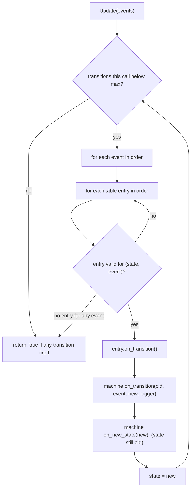
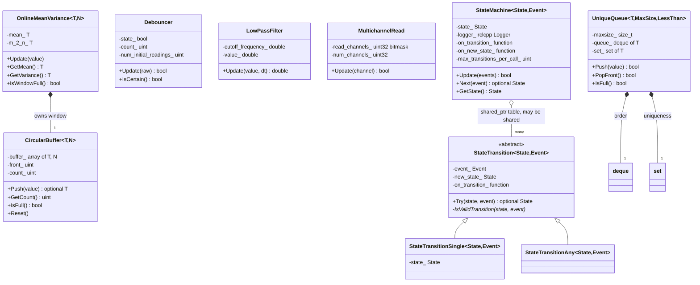
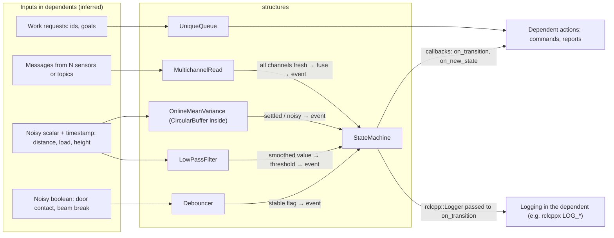
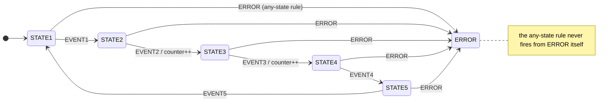
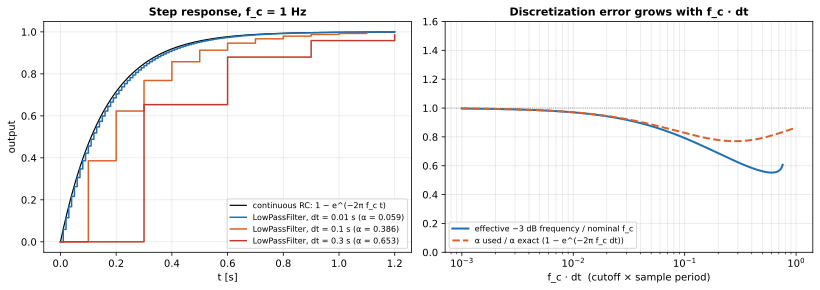
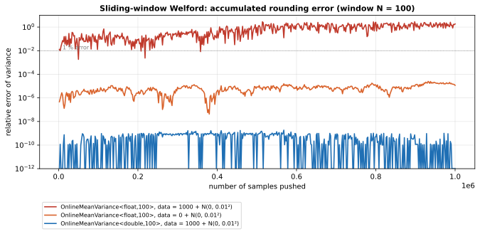
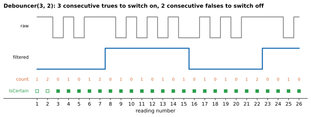

# 05 — `structures`

| Generated | Revision | Source pack | Status |
|---|---|---|---|
| 2026-10-07 | 2 | `P05-structures-part1of1.md` (re-exported) | Draft, generated by Claude, not yet reviewed by the team |

Package 5 of 37 (bottom-up) · dependency depth 0

Workspace dependencies: none.
Used by: bay, lift, sim, vecs.
Related documents:
- `01-common.md`: math utilities such as `RateLimit`, and `HeartbeatMonitor`;
- `02-rclcppx.md`: `LOG_*` macros;
- `03-stdx.md`: `Expected` / `Result`;
- `04-vrc_interfaces.md`: enum-style state values.

**How to read the evidence markers.**
- **[read]** means the conclusion comes from reading the source.
- **[probed]** means it was confirmed by compiling and running code with g++ 13.3 in C++20 mode (Ubuntu 24.04 container), against a minimal stand-in for `rclcpp::Logger`, the only ROS 2 (Robot Operating System 2) type the package uses. All 18 package tests pass in a normal (assert-enabled) build. Undefined behavior was checked with UBSan (UndefinedBehaviorSanitizer, in GCC, the GNU Compiler Collection; GNU = GNU's Not Unix).

---

## A. External dependencies

`structures` is almost free of dependencies: six of its seven components need only the C++ standard library. The one exception is `StateMachine`, which stores an `rclcpp::Logger` and passes it to a user callback. That single use is why `package.xml` declares a dependency on rclcpp (ROS Client Library for C++), so every user of a circular buffer or a debouncer also links ROS 2 (open question 6).

| Name | Description | Version | Link | Usage in this package |
|---|---|---|---|---|
| rclcpp | ROS 2 C++ client library. | Same ROS 2 distribution as the workspace (Kilted or newer, see `02-rclcppx.md`). | https://github.com/ros2/rclcpp | Only `rclcpp::Logger`, from `<rclcpp/logger.hpp>`, in `state_machine.hpp`. |
| C++ standard library | `<array>`, `<deque>`, `<set>`, `<optional>`, `<functional>`, `<memory>`, `<cmath>`. | C++17 features (`std::optional`, structured bindings); the workspace builds as C++20. | https://en.cppreference.com | All containers and math. |
| GoogleTest (via ament_cmake_gtest) | Unit-test framework. | Not pinned. | https://github.com/google/googletest | Seven test executables, including two death tests (R3). |
| `volley_cmake` | Workspace CMake helpers. | Internal. | Not in pack. | `volley_add_library(structures_lib SHARED DIRECTORY src)`, `volley_add_gtest`. |

---

## B. Glossary

Terms already defined in documents 01–04 (QoS, executor, callback, and so on) are reused here.

| Term | Meaning | Where it shows up |
|---|---|---|
| Circular (ring) buffer | Fixed-capacity buffer where a new element overwrites the oldest once full. | `CircularBuffer` |
| Debouncing | Ignoring brief flips of a noisy boolean signal (contact bounce, flickering sensors) until the new value persists. | `Debouncer` |
| Hysteresis (count-based) | Using different persistence thresholds for switching on and switching off. | `Debouncer(num_true, num_false)` |
| Low-pass filter | Filter that passes slow changes and attenuates fast ones (noise). | `LowPassFilter` |
| Cutoff frequency $f_c$ | Frequency at which a low-pass filter's gain has fallen to $1/\sqrt{2}$ (−3 dB, decibels). | `LowPassFilter(cutoff_frequency)` |
| RC filter | Resistor–capacitor circuit; the continuous-time first-order low-pass filter that `LowPassFilter` discretizes. Its time constant is $\tau=1/(2\pi f_c)$. | Section 7.1 |
| EMA | Exponential Moving Average: $y_k=\alpha x_k+(1-\alpha)y_{k-1}$. A first-order IIR (Infinite Impulse Response) filter; `LowPassFilter` is one with a $dt$-dependent $\alpha$. | Section 7.1 |
| Backward Euler | Implicit discretization of a differential equation. It gives the $\alpha = \frac{dt}{\tau+dt}$ used here. | Section 7.1 |
| Welford's algorithm | Numerically stable way to update a mean and variance one sample at a time. | `OnlineMeanVariance` |
| Sliding window | Statistics over only the last $N$ samples. The oldest sample is removed as a new one arrives. | `OnlineMeanVariance<T, N>` |
| Sample variance | $\frac{1}{n-1}\sum (x_i-\bar x)^2$, the unbiased estimator (Bessel's correction). | `GetVariance()` |
| ULP | Unit in the Last Place: the spacing between adjacent floating-point numbers near a value. | Section 7.2 |
| Bitmask | An integer whose individual bits record yes/no flags (here: which channels have been read). | `MultichannelRead` |
| State transition table | A list of (state, event) → new-state rules that fully defines a state machine's behavior. | `StateMachine` |
| Event | An input that may cause a transition. Here it is a plain value, and ownership stays with the caller. | `StateMachine::Update(events)` |
| FIFO | First In, First Out: queue order. | `UniqueQueue` |
| Strict weak ordering / equivalence | What a `std::set` comparator must provide. Two elements are *equivalent* (treated as duplicates) when neither compares less than the other, even if they are not equal. | `UniqueQueue<T, MaxSize, LessThan>` |
| Death test | GoogleTest check that a statement crashes the process (for example via `assert`). | `MultichannelRead` tests (R3) |
| `NDEBUG` | Standard macro that disables `assert` in release builds. | R2, R3 |
| NaN | Not a Number: the floating-point value produced by invalid operations such as $0/0$. | R9 |
| YASMIN | Yet Another State MachINe: a ROS 2 state-machine library, wrapped by the later `yasminx` package. | Section 3.6, open question 1 |

---

## 1. Summary

`structures` is the workspace's toolbox for **signal conditioning and simple control logic**: small, header-mostly building blocks that hardware-facing packages (the bay, the lift, the simulator and VECS, an abbreviation not expanded in the code) use between raw readings and decisions. It provides:
- **sample filters:**
  - `Debouncer` for noisy booleans;
  - `LowPassFilter` for noisy values;
  - `OnlineMeanVariance` for sliding-window statistics;
- **bookkeeping:**
  - `CircularBuffer`, a fixed-memory ring buffer;
  - `UniqueQueue`, a FIFO without duplicates;
  - `MultichannelRead`, which reports when every one of N sources has reported;
- **`StateMachine`**: a table-driven finite-state-machine engine for enum states and events.

**How the pieces fit together.** The intended pipeline is visible in the types themselves:
1. Raw readings are smoothed by `LowPassFilter`, characterized by `OnlineMeanVariance`, or stabilized by `Debouncer`.
2. Readings from several sensors are synchronized with `MultichannelRead`.
3. The resulting clean conditions become *events* fed into a `StateMachine`.
4. Work items can be queued without duplication in a `UniqueQueue`.

This complements, rather than overlaps, `common`. There, `math_utils` handles angles and rate limits and `HeartbeatMonitor` handles staleness; here, the focus is turning noisy streams into dependable signals and states.

**Where it is problematic.** The building blocks are small and mostly correct, but several have sharp edges that only show outside the tested configurations:
- `OnlineMeanVariance<float>` drifts to useless values on long runs with a large offset (R1, Figure 7.2);
- `MultichannelRead` is broken at exactly 32 channels, the maximum its own assertion allows (R2);
- `UniqueQueue::IsFull` ignores the runtime size limit (R4);
- the state machine silently stops at its transition cap (R5).

The package also introduces a **second state-machine framework** alongside YASMIN (wrapped later by `yasminx`), so two different ways of writing state machines will coexist in the workspace. It is the same kind of duplication as the two topic registries in documents 01 and 02 (open question 1).

---

## 2. Files

The package has 18 files: seven public headers, two sources, seven tests and two build files. Only `LowPassFilter` and `MultichannelRead` have `.cpp` implementations; the other five components are header-only (four of them templates).

Unlike documents 02–04, the package lives at `src/structures/` rather than under `src/core/` or `src/interfaces/`. That explains why the first export of this pack came out empty.

Line counts are from the pack, which has blank lines removed.

| Path (under `src/structures/`) | Lines | Role |
|---|---:|---|
| `include/structures/circular_buffer.hpp` | 33 | `CircularBuffer<T, N>`: fixed-size ring buffer on `std::array`; `Push` returns the evicted element. |
| `include/structures/debouncer.hpp` | 60 | `Debouncer`: boolean filter with separate on/off persistence counts and an "is certain" flag. |
| `include/structures/lowpass_filter.hpp` | 12 | `LowPassFilter` declaration: first-order low-pass with cutoff frequency and per-call `dt`. |
| `include/structures/multichannel_read.hpp` | 18 | `MultichannelRead` declaration: bitmask tracking which of up to 32 channels have reported. |
| `include/structures/online_mean_variance.hpp` | 63 | `OnlineMeanVariance<T, N>`: sliding-window mean and sample variance (windowed Welford). |
| `include/structures/state_machine.hpp` | 166 | `StateTransition`, `StateTransitionSingle`, `StateTransitionAny`, `MakeTransition`, `StateMachine<State, Event>`. |
| `include/structures/unique_queue.hpp` | 64 | `UniqueQueue<T, MaxSize, LessThan>`: deque plus set, rejecting duplicates and over-size pushes. |
| `src/lowpass_filter.cpp` | 18 | Validates the cutoff (throws if ≤ 0); backward-Euler update. |
| `src/multichannel_read.cpp` | 19 | Asserts the channel count is in 1–32; sets bits and detects "all read". |
| `test/circular_buffer_tests.cpp` | 49 | Fill, evict, reset (suite misspelled `CicularBuffer`). |
| `test/debouncer_tests.cpp` | 100 | Thresholds 0, 1 and 3; asymmetric (3, 2); reset; certainty. |
| `test/lowpass_filter_tests.cpp` | 34 | Constructor validation; `dt` ≤ 0 and very large `dt`; decay values. |
| `test/multichannel_read_tests.cpp` | 42 | Death tests for 0 and 33 channels; ordering, repeats, out-of-range channels, reset. |
| `test/online_mean_variance_tests.cpp` | 107 | Initialization, window size 1, zero mean, sliding behavior, non-finite inputs. |
| `test/state_machine_tests.cpp` | 87 | Single and chained transitions, transition cap, `Next`, "any state" error transition. |
| `test/unique_queue_tests.cpp` | 108 | FIFO operations, duplicates, custom comparator, compile-time size limit. |
| `CMakeLists.txt` | 29 | Shared library `structures_lib` from `src/`; seven gtests. Two of them compile the sources directly (R12). |
| `package.xml` | 15 | Depends on rclcpp; test-depends on ament_cmake_gtest. |

---

## 3. Public API

The API (Application Programming Interface) is seven components. Everything is in namespace `volley`, with headers under `include/structures/`. All the types are single-threaded value types with no internal synchronization (section 6.3).

### 3.1 `CircularBuffer<T, unsigned N>` — `circular_buffer.hpp`

**Purpose.** A fixed-capacity history with no heap allocation, suitable for real-time paths. Inside this package it serves as the storage behind `OnlineMeanVariance`.

**Design.**
- Storage is a `std::array<T, N>` plus a write index and a count.
- `Push(value)` writes at the current index, advances it modulo $N$, and returns `std::optional<T>` containing the overwritten (oldest) element when the buffer was already full. That is exactly what a sliding-window algorithm needs to subtract the departing sample.
- The other members are `GetCount()`, `IsFull()`, `IsEmpty()` and `Reset()`.
- There is **no way to read stored elements** other than receiving the evicted one; there is no iterator, `operator[]` or "latest" accessor. The type is therefore an eviction helper rather than a general history buffer (R11).
- `T` must be default-constructible.

### 3.2 `Debouncer` — `debouncer.hpp`

**Purpose.** Stabilize a noisy boolean, such as a door contact, a beam-break sensor or a presence flag, before acting on it.

**Design.**
- The internal state starts at `false`.
- A counter tracks consecutive readings that disagree with the state.
- The state flips to `true` after `num_true_detections` consecutive trues, and back to `false` after `num_false_detections` consecutive falses (count-based hysteresis).
- `IsCertain()` becomes true once at least $\max(n_\text{true}, n_\text{false})$ readings have been seen since construction or `Reset()`. This is a pure count, not a check that the readings agreed (R10).
- The header's worked example for thresholds (3, 2) is reproduced exactly by the code **[probed]**, and shown in Figure 7.3.

**Usage.**

```cpp
volley::Debouncer door_closed{3, 2};      // slower to declare closed than open
bool closed = door_closed.Update(raw_contact);
if (door_closed.IsCertain() && closed) { /* act */ }
```

### 3.3 `LowPassFilter` — `lowpass_filter.hpp`, `src/lowpass_filter.cpp`

**Purpose.** Smooth a noisy scalar whose sample period may vary.

**Design.**
- `LowPassFilter(cutoff_frequency, initial_value = 0.0)` throws `std::invalid_argument` if the cutoff is ≤ 0. This is the package's only exception.
- `Update(value, dt)` clamps `dt` to ≥ 0 and applies $y \leftarrow \alpha x + (1-\alpha) y$, with $\alpha = \frac{2\pi f_c\,dt}{1+2\pi f_c\,dt}$ (section 7.1).
- Passing `dt` per call lets the filter work on irregular timestamps (message arrival times), which is the right design for ROS callbacks.
- A NaN input poisons the state permanently (R9).
- `GetValue()` returns the current output.

### 3.4 `MultichannelRead` — `multichannel_read.hpp`, `src/multichannel_read.cpp`

**Purpose.** Know when every one of $n$ sources (for example three sensors on separate topics) has reported at least once since the last complete round, to trigger a fused computation.

**Design.**
- A `uint32_t` bitmask with one bit per channel.
- `Update(channel)`:
  - ignores out-of-range channels (returns `false`);
  - sets the channel's bit;
  - when all $n$ bits are set, clears the mask and returns `true` once.
- Repeated reads of the same channel within a round are harmless.
- The constructor *asserts* $1 \le n \le 32$; it does not throw.

**Caveats.** This is the most defect-dense component (R2, R3):
- with 32 channels a complete round is never reported, because of a shift by 32;
- 31 channels work only through signed-integer overflow;
- the validation disappears entirely in release builds.

### 3.5 `OnlineMeanVariance<T, unsigned N>` — `online_mean_variance.hpp`

**Purpose.** Constant-time, constant-memory mean, sample variance and standard deviation over the last $N$ samples. Typical uses are noise estimation, stability ("has this reading settled?") and outlier thresholds.

**Design.**
- It uses Welford's algorithm while the window fills, then a windowed variant that adds the new sample and removes the evicted one, which `CircularBuffer::Push` returns. Section 7.2 gives the formulas.
- Non-finite inputs are skipped silently.
- The accumulated sum of squares is clamped to ≥ 0 to hide small negative rounding.
- `IsWindowFull()` tells callers when the statistics cover a full window.

**Caveats.**
- The update is incremental and **never re-synchronized**, so rounding errors accumulate indefinitely. With `float` and data whose mean is much larger than its spread, the result becomes meaningless within about $10^5$ samples (R1, Figure 7.2).
- With integer `T`, the mean truncates (R1).
- Use `double`.

### 3.6 `StateMachine<State, Event>` and transitions — `state_machine.hpp`

**Purpose.** A tiny, table-driven engine for enum-based state machines, with the behavior defined entirely by a transition table built at construction.

**Design.**
- **Transitions.** `StateTransition<State, Event>` is an abstract rule: an event, a destination, and an optional `on_transition` callback. It has two concrete forms, created with `MakeTransition`:
  - `MakeTransition(state, event, new_state[, fn])` → `StateTransitionSingle`, valid only from `state`;
  - `MakeTransition(event, new_state[, fn])` → `StateTransitionAny`, valid from **any state except `new_state`**. This is used for global events such as an error.
- **Storage.** The table is a `std::vector<std::shared_ptr<StateTransition>>`, so tables can be shared between machines (R7).
- **Construction.** `StateMachine(start, logger, table, on_transition = {}, on_new_state = {}, max_transitions = 10)`.
- **Evaluation.**
  - `Update(events)` takes the set of currently active events and repeatedly applies the first matching rule. Matching scans events in the given order, then the table in order.
  - It repeats until no rule matches or `max_transitions` have fired.
  - One call can therefore *chain* several transitions (for example A →E1→ B →E2→ C when E1 and E2 are both active). That is a stated design goal in the header comment: "attempt all allowed transitions".
  - `Update(event)` and `Next(event)` are single-event conveniences; `Next` returns the new state, or `nullopt`.
- **Callbacks per transition**, in this order:
  1. the rule's own `on_transition`;
  2. the machine's `on_transition(old, event, new, logger)`, typically for logging;
  3. the machine's `on_new_state(new)`, which is called before the state is updated (R6);
  4. finally the state is assigned.
- **Events are not consumed.** The header says event ownership stays with the client; the client decides when an event has been handled.



**Usage** (from the test):

```cpp
enum class State { STATE1, STATE2, /*...*/ ERROR };
enum class Event { EVENT1, EVENT2, /*...*/ ERROR };

std::vector<std::shared_ptr<volley::StateTransition<State, Event>>> table{
    volley::MakeTransition(State::STATE1, Event::EVENT1, State::STATE2),
    volley::MakeTransition(State::STATE2, Event::EVENT2, State::STATE3, [&] { ++count; }),
    volley::MakeTransition(Event::ERROR, State::ERROR),      // from any state
};
volley::StateMachine<State, Event> sm(State::STATE1, get_logger(), table, OnTransition, OnNewState);
sm.Update({Event::EVENT1, Event::EVENT2});                  // STATE1 -> STATE2 -> STATE3
```

**Fit with the rest of the workspace.**
- The engine fits the enum style used across Volley; `common::EnumName` can turn its states and events into names inside the logging callback.
- Its logging hook takes an `rclcpp::Logger`, so `LOG_INFO(logger, ...)` from `rclcppx` works there.
- It is a **different model from YASMIN**: here a pure transition table with no state "bodies"; in YASMIN, states are objects that run and return outcomes. Section 9.2 asks which model new code should use.

### 3.7 `UniqueQueue<T, size_t MaxSize = SIZE_MAX, LessThan = std::less<T>>` — `unique_queue.hpp`

**Purpose.** A FIFO queue that never holds the same element twice, such as a queue of pending job, goal or device identifiers, where re-requesting an item already waiting should not enqueue it again.

**Design.**
- A `std::deque<T>` keeps the order.
- A `std::set<T, LessThan>` gives logarithmic-time duplicate checks and `HasElement`.
- `Push` returns `false` for a duplicate *or* when the size limit is reached; the two cases cannot be told apart (R4).
- The size limit is either the template `MaxSize` or a constructor argument, but `IsFull()` only checks the template parameter (R4, **[probed]**).
- Uniqueness is defined by `LessThan`-equivalence, not by `==`. The custom-comparator test shows `{1, 2}` and `{2, 1}` being treated as duplicates because the comparator compares sums.
- Other members: `Front`, `Back`, `At`, `PopFront`, `PopBack` (returning `false` on an empty queue), `GetElements()` (a copy as a vector), `Reset`.

---

## 4. Diagrams

### 4a. Class diagram (ownership on edges)

All containers own their elements by value. The one shared-ownership relationship is the state machine's transition table, which can be shared between machines through `shared_ptr`.



### 4b. Data flow

`structures` performs no I/O: no topics, services, actions, timers, parameters, threads or hardware access. Its only reference to a lower layer is the `rclcpp::Logger` *type*, which it stores and hands to a callback; it never logs on its own.

The diagram shows the intended flow through a dependent: raw signals in, conditioned signals and states out. The concrete sensors and events belong to bay, lift, sim and VECS, and later documents should confirm them.



### 4c. State machines

The package provides a state-machine *engine* (section 3.6); concrete machines live in the dependents and will be documented with them. The only concrete machine in this pack is the one in `state_machine_tests.cpp`. It is shown here because it is the reference example of how tables are meant to be written, including the "from any state" error rule.



---

## 5. Behavior

**Construction.** Every component is constructed in a ready state, with no I/O and no threads. The constructor-time checks differ by component:
- `LowPassFilter` throws on a non-positive cutoff;
- `MultichannelRead` asserts a channel count of 1–32, and only in builds without `NDEBUG`;
- the others accept any arguments, including degenerate ones: `Debouncer{0}` (switches immediately and is certain from the start), `CircularBuffer<T, 0>` (throws `std::out_of_range` on the first `Push`), and `UniqueQueue(0)`.

**Steady state.**
- All operations are synchronous and run in the caller's thread. In a ROS node that is whichever executor thread runs the callback that calls them.
- Costs are constant per call, except that:
  - `UniqueQueue` operations take logarithmic time (the set);
  - `StateMachine::Update` takes up to (`max_transitions` × number of events × table size) rule checks, and copies the event vector on every internal pass.
- Nothing allocates after construction, except `UniqueQueue` and the `std::vector` copies in `StateMachine`.

**Shutdown.** These are plain value types: destruction frees their memory, and there is nothing to stop or join.

**Executors, callback groups, threads, timers.** None in this package. When a dependent calls these objects from several callbacks, the callbacks must share a mutually exclusive callback group or a lock (section 6.3).

**Parameters and defaults.** There are no ROS parameters; the configuration is in constructor and template arguments.

| Component | Argument | Default | Notes |
|---|---|---|---|
| `Debouncer` | `num_detections` or (`num_true`, `num_false`) | — (required) | Initial state `false`. |
| `LowPassFilter` | `cutoff_frequency`, `initial_value` | —, `0.0` | Cutoff in hertz, must be > 0; `dt` in seconds per call. |
| `MultichannelRead` | `num_channels` | — | 1–32 asserted; 32 is broken (R2). |
| `OnlineMeanVariance` | `T`, `N` | — | Use `double` (R1). |
| `StateMachine` | `on_transition`, `on_new_state`, `max_transitions` | empty, empty, `10` | Reaching the cap is silent (R5). |
| `UniqueQueue` | `MaxSize`, `maxsize`, `LessThan` | `SIZE_MAX`, `MaxSize`, `std::less<T>` | `IsFull` uses only `MaxSize` (R4). |

---

## 6. Ownership and safety

### 6.1 Lifetimes

- The containers (`CircularBuffer`, `UniqueQueue`) own their elements by value.
- `UniqueQueue::Front`, `Back` and `At` return references into the deque, which are invalidated by `Pop*`, `Reset` and, for deque iterators, `Push`. The test titled "we can still have access to that reference after a queue reset" actually copies the element (`auto front = ...`), so it does not test what its comment says (R13).
- `StateMachine` copies the logger and the callbacks, and shares the transition table through `shared_ptr`. A rule's callback that captures a local by reference (the test captures `num_transitions` this way) must outlive *every* machine holding that table.

### 6.2 Callbacks capturing `this`

The state machine's three callback slots are the natural place for `[this]` lambdas in dependents. Two points matter.
- **Lifetime.** If the machine is a member of the object its callbacks capture, it is destroyed with that object, which is safe. A shared table whose rules capture one object's `this` and are then used by another object's machine is not safe (R7).
- **Re-entrancy.** A callback that calls `Update` on the same machine recurses inside the outer loop, before the outer call has assigned the new state. There is no guard against this (R8).

### 6.3 Locks and atomics

None. Every component is unsynchronized mutable state. Concurrent calls from a multi-threaded executor (for example a `Debouncer` updated from one subscription and read from a timer in a reentrant callback group) are data races. Keep each instance within a single mutually exclusive callback group, or guard it with a mutex.

### 6.4 Error handling

The package uses five different error styles for small components; section 9.2 asks whether they should align with `stdx`.

| Style | Where |
|---|---|
| `std::optional` | `CircularBuffer::Push` (evicted element), `StateTransition::Try`, `StateMachine::Next` |
| `bool` return | `UniqueQueue::Push` / `Pop*`, `MultichannelRead::Update`, `StateMachine::Update` |
| Exception | `LowPassFilter` constructor (`std::invalid_argument`); `CircularBuffer<T, 0>::Push` (`std::out_of_range` from `array::at`) |
| `assert` | `MultichannelRead` constructor, compiled out in release builds |
| Silent skip / clamp | `OnlineMeanVariance` ignores non-finite inputs; `LowPassFilter` clamps negative `dt`; `StateMachine` stops at its cap |

### 6.5 RISK items

| Item | Risk | Evidence |
|---|---|---|
| R1 | **`OnlineMeanVariance` loses accuracy without bound for `float`, and truncates for integers.** The mean and sum of squares are updated incrementally and never recomputed. With `float` data of mean 1000 and standard deviation 0.01, the mean drifts by 0.033 (three standard deviations) after $10^6$ samples, and the variance is off by up to 280 % (Figure 7.2, mechanism in 7.2). `double` stays within about $2\times10^{-9}$. With `int`, the mean of {1, 2, 2, 2} is reported as 1. Nothing restricts `T` to floating-point types. | **[probed]** using the real class |
| R2 | **`MultichannelRead` misbehaves at the top of its allowed range.** `(1 << num_channels_) - 1` is computed in `int`. At 32 channels the shift by 32 is undefined behavior; on g++ the "all read" condition is never met. At 31 channels the subtraction overflows a signed `int` (undefined behavior, works by accident). `1 << channel` for channel 31 relies on C++20 shift rules. The 1–32 check is an `assert`, so release builds accept 0 or 40 channels unchecked. | **[probed]** UBSan messages and behavior |
| R3 | **The `MultichannelRead` tests fail in release builds.** They use `EXPECT_DEATH`, which depends on `assert`. With `NDEBUG` defined, the test executable reports FAILED. | **[probed]** |
| R4 | **Three `UniqueQueue` defects.** (a) `IsFull()` compares against the template `MaxSize`, not the constructor's `maxsize`: `UniqueQueue<int> q(2)` holding two elements reports `IsFull() == false` while `Push(3)` fails. (b) `Push` returns `false` both for "duplicate" and for "full". (c) The header uses `std::numeric_limits` without `#include <limits>`, so it does not compile on its own. | **[probed]** all three |
| R5 | **Hitting the state machine's transition cap is silent.** A cycle reachable under one active event (A →X→ B →X→ A) runs exactly `max_transitions` times, ends wherever the parity leaves it (back at A for the default 10), and `Update` returns `true`. Nothing logs or flags that the cap was hit, which is precisely the infinite-loop bug the cap is meant to expose. | **[probed]** |
| R6 | **`on_new_state` runs before the state changes.** Inside `on_new_state`, `GetState()` still returns the old state. If any callback throws, the rule's own `on_transition` has already run but the state is unchanged, leaving the system partially transitioned. | **[probed]** (old state observed) |
| R7 | **Shared tables share callbacks.** Because rules are `shared_ptr`s and the test reuses one table for seven machines, a rule callback with captured state (counters, `this`) is shared by every machine that uses the table. | **[read]** |
| R8 | **No re-entrancy guard.** Calling `Update` from a state-machine callback recurses while the outer call is mid-transition. | **[read]** |
| R9 | **`LowPassFilter` corner cases.** (a) One NaN input makes the output NaN forever, even after 1000 valid samples, unlike `OnlineMeanVariance`, which skips non-finite values. (b) The backward-Euler discretization lowers the effective cutoff as $f_c\,dt$ grows: −3 dB falls at about 0.8 $f_c$ when $f_c\,dt = 0.1$ (Figure 7.1). (c) The `.cpp` uses `M_PI`, a POSIX (Portable Operating System Interface) extension rather than standard C++. | **[probed]** (a); **[read]** (b, c) |
| R10 | **`Debouncer::IsCertain` only counts readings.** It becomes true after $\max(n_\text{true}, n_\text{false})$ readings whatever their values. After 1, 1, 0 with threshold 3, it reports "certain" with state `false`, although nothing has confirmed false. With threshold 0 it is certain before any reading. | **[read]**, confirmed by the tests |
| R11 | **`CircularBuffer` has no read access.** It exposes only the evicted element, so it cannot serve as a general history buffer. `N = 0` throws on `Push`, and `std::min` is used without `<algorithm>` (it compiles through transitive includes). | **[read]** |
| R12 | **Build and test wiring.** The two non-header components are tested by compiling their `.cpp` files straight into the tests, so `structures_lib` itself is never linked by any test. The rclcpp dependency exists for one `Logger` member. | **[read]** |
| R13 | **A misleading test.** The `UniqueQueue` "reference after reset" check copies the value, so a dangling-reference bug would not be caught. | **[read]** |

---

## 7. Math

Three components implement real numerical algorithms. The figures were generated with Python (matplotlib):
- Figure 7.1 and Figure 7.3 re-implement the exact update rules of the code;
- Figure 7.2 plots data produced by running the real `OnlineMeanVariance` class (`figures/scripts/structures_omv_drift.cpp`).

### 7.1 `LowPassFilter`: discretized RC filter

The continuous-time model is the first-order RC low-pass filter with time constant $\tau = 1/(2\pi f_c)$:

$$
\tau\,\dot y(t) = x(t) - y(t).
$$

Discretizing with backward Euler over a step $dt$ gives the update the code implements:

$$
y_k = \alpha\,x_k + (1-\alpha)\,y_{k-1},\qquad
\alpha = \frac{dt}{\tau+dt} = \frac{2\pi f_c\,dt}{1+2\pi f_c\,dt}.
$$

For a constant input over the step, the *exact* coefficient would be $\alpha^\star = 1-e^{-dt/\tau}$. The two agree to first order: $\alpha \approx \alpha^\star$ when $f_c\,dt \ll 1$. The test values follow directly: from $y=0.5$ with $x=0$, $dt=0.1$, $f_c=1$ Hz, one step gives $\alpha=0.386$ and $y=0.5(1-\alpha)=0.307$.

As a fixed-$dt$ filter, the transfer function and its magnitude response are

$$
H(z)=\frac{\alpha}{1-(1-\alpha)z^{-1}},\qquad
|H(e^{j\omega dt})|^2=\frac{\alpha^2}{1-2(1-\alpha)\cos(\omega\,dt)+(1-\alpha)^2},
$$

so the actual −3 dB frequency $\omega_c$ satisfies

$$
\cos(\omega_c\,dt) = 1-\frac{\alpha^2}{2(1-\alpha)}.
$$

Its ratio to the nominal $2\pi f_c$ stays at 1 for small $f_c\,dt$ and drops as the sample period grows (right panel). In practice the parameter is a "cutoff" only when the update rate is well above $f_c$, roughly $f_c\,dt < 0.015$ for under 5 % deviation (at $f_c\,dt = 0.02$ it is already 6 % low).



*Figure 7.1 — Left: step response for $f_c$ = 1 Hz at three update periods, against the continuous RC response. Right: effective −3 dB frequency relative to the nominal cutoff, and the ratio of the backward-Euler α to the exact α, both as functions of $f_c\,dt$.*

### 7.2 `OnlineMeanVariance`: sliding-window Welford

**While the window fills** ($n \le N$), the code uses Welford's update for a new sample $x$:

$$
\delta = x-\mu_{n-1},\quad \mu_n=\mu_{n-1}+\frac{\delta}{n},\quad M_{2,n}=M_{2,n-1}+\delta\,(x-\mu_n).
$$

**Once the window is full**, adding $x$ evicts $x_{\text{old}}$, and the count stays $N$:

$$
\mu' = \mu + \frac{x-x_{\text{old}}}{N},\qquad
M_2' = M_2 + (x-x_{\text{old}})\,\big(x-\mu' + x_{\text{old}}-\mu\big),
$$

**The outputs** are the sample variance $s^2 = M_2/(n-1)$ for $n>1$ (otherwise 0) and $s=\sqrt{s^2}$. These formulas are algebraically exact, and they match the tests.

**Why `float` drifts.** The mean is never recomputed from the window. Each update adds a small increment $\Delta\mu=(x-x_{\text{old}})/N$, of order $\sigma/N$, to a number of size $|\mu|$. Each addition is rounded to the nearest representable value, with error up to half an ULP: $\tfrac12\,\mathrm{ulp}(\mu)\approx |\mu|\,2^{-24}$ for `float`. Those errors behave like a random walk, so after $n$ samples the mean is off by roughly

$$
|\hat\mu_n-\mu_n| \;\sim\; |\mu|\,2^{-24}\sqrt{n}.
$$

For $\mu=1000$ this gives $6\times10^{-5}\sqrt n$, which predicts the measured drift of $0.033$ at $n=10^6$, three times the data's standard deviation **[probed]**. The variance update uses this stale mean, so $M_2$ is corrupted too. Accuracy is lost once $\sigma/N$ is comparable to $\mathrm{ulp}(\mu)$, that is, when $\sigma/(N|\mu|) \lesssim 2^{-23}\approx 1.2\times10^{-7}$ for `float`. With `double`, the threshold is $2^{-52}\approx 2.2\times10^{-16}$, which is unreachable in practice.



*Figure 7.2 — Relative error of the reported variance against an exact recomputation over the same window, for one million samples. `float` with a mean of 1000 becomes useless; `float` around zero stays near $10^{-5}$; `double` stays near $10^{-9}$.*

### 7.3 `Debouncer`: count-based hysteresis

The debouncer is a two-state machine with a counter $c$ of consecutive readings that disagree with the state $s$. For a reading $r$:

$$
c \leftarrow \begin{cases}0 & r=s\\ c+1 & r\ne s\end{cases},\qquad
s \leftarrow \begin{cases}\text{true}, & r \wedge c\ge n_\text{true}\\ \text{false}, & \neg r \wedge c\ge n_\text{false}\\ s & \text{otherwise}\end{cases}
$$

$c$ is reset to 0 whenever $s$ changes. "Certain" means $k \ge \max(n_\text{true}, n_\text{false})$, where $k$ counts readings since construction or reset.

A signal that toggles faster than the thresholds never changes the output, so with $n_\text{true}=n_\text{false}=n$ the output lags a genuine change by $n$ samples.



*Figure 7.3 — The worked example from `debouncer.hpp` (thresholds 3 and 2): raw input, filtered output, the disagreement counter, and `IsCertain`. The code reproduces the header's expected sequence exactly.*

### 7.4 `MultichannelRead`: completion test

With $n$ channels and mask $m$, a round is complete when $m = 2^{n}-1$. The safe way to compute that constant for $1\le n\le 32$ in unsigned arithmetic is

$$
\text{full}(n) = \begin{cases} \texttt{0xFFFFFFFF} & n = 32\\ 2^{n}-1 \ (\texttt{(1u << n) - 1u}) & n < 32\end{cases}
$$

The current code computes `(1 << n) - 1` in signed `int`, which is undefined for $n \ge 31$ (R2).

---

## 8. Tests

There are 18 test cases in seven executables, and all pass in an assert-enabled build **[probed]**. They are thorough for the main paths of each component, and they document intent well. Several behaviors are pinned down only by tests:
- the debouncer certainty rule;
- `dt ≤ 0` being ignored by the filter;
- events not being consumed by the state machine;
- uniqueness defined by the comparator.

| Test file (cases) | Covers | What it reveals about intended behavior |
|---|---|---|
| `circular_buffer_tests` (1) | Fill, evict oldest, reset when full and when partial. | `Push` returning the evicted element is the core contract. |
| `debouncer_tests` (5) | Thresholds 0, 1 and 3; asymmetric (3, 2); reset. | Threshold 0 is allowed ("doesn't really make sense") and passes input through. Certainty is count-based. |
| `lowpass_filter_tests` (2) | Cutoff validation; initial value; `dt` ≤ 0 ignored; huge `dt` gives full acceptance; decay values. | Variable `dt` is a deliberate feature; negative `dt` is tolerated, not an error. |
| `multichannel_read_tests` (1) | Death on 0 and 33 channels; 1 and 32 construct; arbitrary order; repeats; out-of-range channels; reset. | 32 channels are meant to be supported, but only construction is tested, and that is where the bug hides (R2). |
| `online_mean_variance_tests` (5) | Initialization; window size 1; zero-mean alternating data; sliding updates; non-finite inputs ignored. | Window size 1 is valid (variance always 0). Non-finite inputs are skipped, not propagated. |
| `state_machine_tests` (1) | Single steps; non-matching event; chained transitions; cap of 4; `Next`; any-state error rule from every state. | Chaining several transitions per call, and hitting the cap, are intended behaviors. |
| `unique_queue_tests` (3) | FIFO operations; duplicates; custom comparator; compile-time size limit; pops on an empty queue. | Size limits are expected through the template parameter; the runtime limit is untested (R4). |

**Gaps.**
- **Long runs or large offsets for `OnlineMeanVariance`**, or a test with `float` versus `double` (R1). The existing tests use at most 100 samples.
- **`MultichannelRead` with 31 or 32 channels actually completing a round** (R2); and **no non-death validation** that would also run under `NDEBUG` (R3).
- **`UniqueQueue` with a runtime `maxsize`** (R4a); a compile check that each header builds on its own (R4c; also catches R11's `<algorithm>`).
- **State machine:** callback order and state visibility (R6), re-entrancy (R8), and reporting when the cap is hit (R5).
- **`LowPassFilter`:** NaN input (R9a), and the frequency response at realistic update rates.
- **No test links `structures_lib`** (R12).
- **Cosmetic:** the misspelled suite `CicularBuffer`; leftover commented-out includes (`interfaces/msg/guid.hpp`, `common/ros_utils.hpp`) in `unique_queue_tests.cpp`, which suggest the queue was once used with message identifiers.

---

## 9. Idioms to reuse, and open questions

### 9.1 Idioms

- **Condition signals before deciding.**
  - Debounce booleans, with asymmetric thresholds when one direction is safety-relevant (for example slower to declare "clear" than "blocked").
  - Low-pass filter scalars with the *measured* `dt`.
  - Use `IsCertain()` and `IsWindowFull()` to suppress decisions until enough data exists.
- **Feed events, not raw values, into state machines.** Compute the set of active events from conditioned signals, then call `Update(events)` once per cycle. Let the table express all behavior, including "any state" safety transitions such as the test's `MakeTransition(Event::ERROR, State::ERROR)`.
- **Log transitions centrally.** Pass a machine-level `on_transition` that logs `EnumName(old)`, `EnumName(event)` and `EnumName(new)` through `LOG_INFO`, instead of logging inside every rule.
- **Prefer fixed-size, allocation-free types on control paths** (`CircularBuffer`, `OnlineMeanVariance`, `Debouncer`), and use `double` for statistics.
- **Use `UniqueQueue` for idempotent work queues.** Re-requesting something already queued is a no-op. Choose `LessThan` deliberately, because it defines what "the same" means.

### 9.2 Open questions for the team

1. **Two state-machine frameworks.** This table-driven `StateMachine` and YASMIN (`yasminx`, later) model state machines differently. Which should new code use, and is there a plan to converge? Which dependents (bay, lift, sim, VECS) use this one today?
2. Should `OnlineMeanVariance` be restricted to floating-point types (`static_assert(std::is_floating_point_v<T>)`), or periodically re-synchronize its sums from the buffer to bound drift (R1)?
3. Should `MultichannelRead` compute its masks in unsigned arithmetic, with a runtime check (or an exception) instead of `assert` (R2, R3)?
4. Should `UniqueQueue::IsFull` use `maxsize_`, and should `Push` distinguish duplicate from full, for example through `stdx::Result` (R4)?
5. Should the state machine report hitting `max_transitions` (log or return value), and should `on_new_state` run after the state update (R5, R6)?
6. Can `StateMachine` drop its rclcpp dependency, for example by having callers capture the logger in their callbacks, so that `structures` becomes ROS-free (R12)?
7. Should `LowPassFilter` skip non-finite inputs like `OnlineMeanVariance` does, and use the exact $\alpha = 1-e^{-2\pi f_c dt}$ (R9)?
8. **Numbering.** The re-exported pack's instruction calls this "package 4 of 37" and asks for `04-structures.md`, while the first export said 5 of 37 / `05-structures.md`. This document keeps 05, because `04-vrc_interfaces.md` already exists. Which numbering is canonical?
