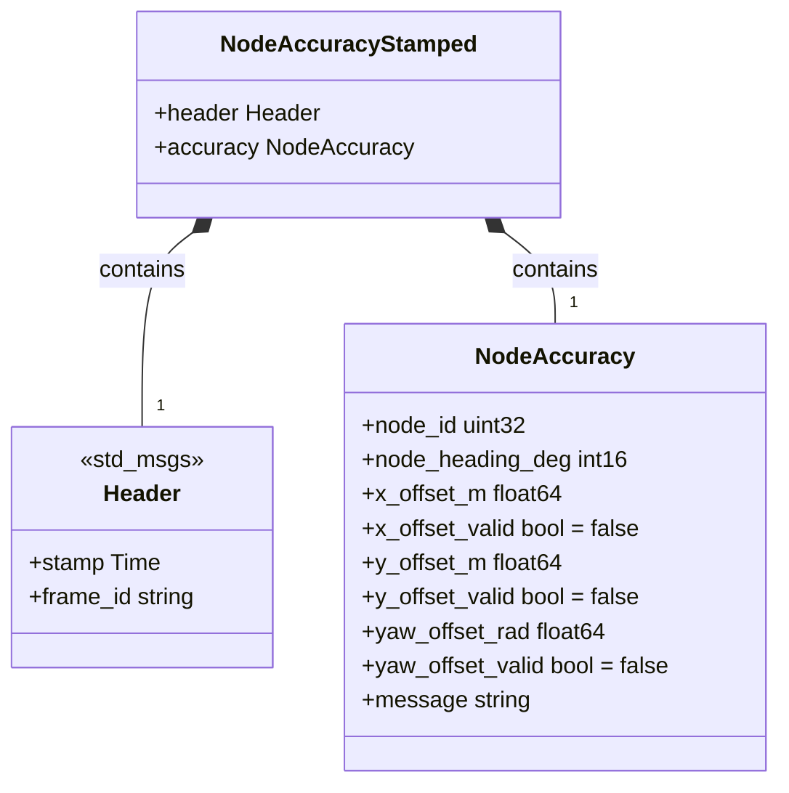
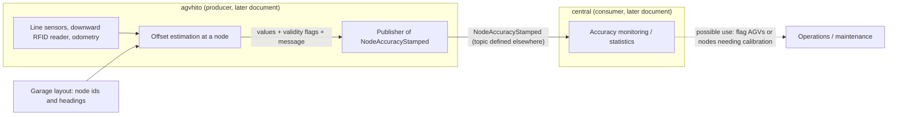
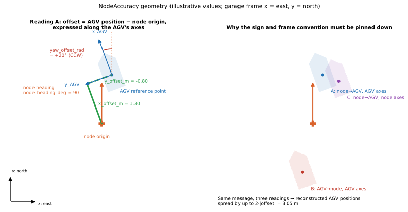

# 06 — `agv_interfaces`

| Generated | Revision | Source pack | Status |
|---|---|---|---|
| 2026-10-07 | 2 | `P06-agv_interfaces-part1of1.md` | Draft, generated by Claude, not yet reviewed by the team |

Package 6 of 37 (bottom-up) · dependency depth 0

Workspace dependencies: none.
Used by: agvhito, central.

Related documents:
- `01-common.md`: frames, angle conventions, AGV (Automated Guided Vehicle) devices;
- `02-rclcppx.md`: typed topics;
- `04-vrc_interfaces.md`: the interface-package pattern and the lesson on field defaults.

**How to read the evidence markers.**
- **[read]** means the conclusion comes from reading the `.msg` files.
- **[rosidl]** means it follows from the standard ROS 2 (Robot Operating System 2) interface-generation rules.
- **[inferred]** means it is a reading of names and comments that the team should confirm.

Nothing in this package could be compiled here, because no ROS install was available.

---

## A. External dependencies

`agv_interfaces` is an interface-definition package with the same build setup as `vrc_interfaces` (document 04): ROS interface generators, a dependency on `std_msgs` for the header, and the workspace's CMake helpers. Since it defines only messages, it does not pull in the action dependencies (`action_msgs`) the way `vrc_interfaces` does.

| Name | Description | Version | Link | Usage in this package |
|---|---|---|---|---|
| rosidl_default_generators | ROS 2 interface code generators (rosidl, the ROS Interface Definition Language tooling): C, C++ and Python types plus serialization support. | Same ROS 2 distribution (Kilted or newer, see document 02). | https://github.com/ros2/rosidl_defaults | `rosidl_generate_interfaces(...)`; `buildtool_depend`. |
| rosidl_default_runtime | Runtime libraries the generated code needs. | Same distribution. | https://github.com/ros2/rosidl_defaults | `exec_depend` and exported dependency. |
| std_msgs | Standard messages. | Same distribution. | https://github.com/ros2/common_interfaces | `std_msgs/Header` in `NodeAccuracyStamped`. |
| `volley_cmake` | Workspace CMake helpers. | Internal. | Not in pack. | `volley_package()`, `volley_ament_auto_package()`. |
| CMake ≥ 3.28 | Build system. | 3.28 | https://cmake.org | `file(GLOB_RECURSE … CONFIGURE_DEPENDS)` over `msg/`, `srv/` and `action/` (only `msg/` exists). |

---

## B. Glossary

Terms already defined in documents 01–05 (body and inertial frames, yaw, angle wrapping, ROS namespace, interface package, field default value, and so on) are reused here.

| Term | Meaning | Where it shows up |
|---|---|---|
| Node (garage graph) | A named point in the garage layout where an AGV can stop or turn, with an identifier and a heading. Not to be confused with a ROS node *(inferred from naming; the layout graph is documented with the planners)*. | `node_id`, `node_heading_deg` |
| Node accuracy | How far an AGV's actual pose is from a node's nominal pose when the AGV is at that node. | `NodeAccuracy` |
| Garage frame | The fixed world frame of the garage: +x east, +y north, +z up. This is an ENU (East-North-Up) convention. Called the *inertial* frame in `01-common.md`. | `node_heading_deg` comment |
| AGV frame | Body frame attached to the AGV. Its exact origin and axis directions are not defined in this package (R3). | Offset fields |
| CCW | Counter-clockwise: positive rotation about +z, viewed from above. | `yaw_offset_rad` |
| Validity flag | A boolean next to a measured value saying whether the value could be computed, so that 0.0 never has to double as "unknown". | `*_valid` fields |
| Stamped message | ROS convention: a message wrapped together with a `std_msgs/Header` (timestamp plus coordinate-frame name). | `NodeAccuracyStamped` |
| `frame_id` | The `Header` field naming the coordinate frame the data is expressed in, in the sense of tf2, the ROS transform library. | R4 |

---

## 1. Summary

`agv_interfaces` defines a single measurement: **how accurately an AGV is positioned at a garage-graph node**. `NodeAccuracy` carries:
- the node's identifier and heading;
- the AGV's x, y and yaw offsets from the node, each paired with its own validity flag;
- an informational message.

`NodeAccuracyStamped` adds a timestamp and frame. The AGV software (`agvhito`) presumably produces these when it arrives at, or passes, a node. The central dispatcher (`central`) presumably consumes them to monitor positioning quality across the fleet *(inferred from the "used by" list)*.

Compared with `vrc_interfaces`, the package shows a clear lesson learned: **each measured value has an explicit validity flag whose `.msg` default is `false`**. A message nobody filled in therefore reads "invalid", not "perfectly accurate", which is exactly the kind of safe default `04-vrc_interfaces.md` (R1) recommends.

The weak spot is geometry. The message mixes integer degrees (node heading, garage frame) and radians (yaw offset, AGV frame). It also says the offsets are "from the node origin, in the AGV frame" without fixing:
- the direction of the vector (node to AGV, or AGV to node);
- where the AGV frame's origin is.

Different consumers could therefore reconstruct different AGV positions from the same message (section 7, Figure 7.1).

---

## 2. Files

The package has four files: two messages and the two standard build files.

Numbering note: the pack's instruction calls this "package 5 of 37" and asks for `05-agv_interfaces.md`. This series already has `05-structures.md`, so this document is numbered 06.

Line counts are from the pack, which has blank lines removed.

| Path (under `src/interfaces/agv_interfaces/`) | Lines | Role |
|---|---:|---|
| `msg/NodeAccuracy.msg` | 18 | Node identifier and heading; x, y and yaw offsets with validity flags; message text. |
| `msg/NodeAccuracyStamped.msg` | 3 | `std_msgs/Header` plus `NodeAccuracy`. |
| `CMakeLists.txt` | 24 | Globs interface files; `rosidl_generate_interfaces` with a `std_msgs` dependency. |
| `package.xml` | 17 | Interface-package manifest (identical in shape to `vrc_interfaces`). |

---

## 3. Public API

The API (Application Programming Interface) consists of the generated types `agv_interfaces::msg::NodeAccuracy` and `agv_interfaces::msg::NodeAccuracyStamped`, with headers `agv_interfaces/msg/node_accuracy.hpp` and `agv_interfaces/msg/node_accuracy_stamped.hpp`, and their Python equivalents in `agv_interfaces.msg` **[rosidl]**.

### 3.1 `NodeAccuracy`

**Purpose.** It reports one sample of positioning accuracy: how far, and how rotated, the AGV is relative to a specific node. This is the quantity behind questions such as "does this AGV consistently stop 2 cm short at node 412?" and "is the fleet's docking accuracy degrading?".

**Fields.**

| Field | Type (C++) | Default | Meaning (from the comments) |
|---|---|---|---|
| `node_id` | `uint32` (`uint32_t`) | 0 | The node the offsets are measured against. |
| `node_heading_deg` | `int16` (`int16_t`) | 0 | The node's heading in the garage frame (+x east, +y north, +z up), in whole degrees. |
| `x_offset_m` | `float64` (`double`) | 0.0 | x-axis offset from the node origin, in the AGV frame. |
| `x_offset_valid` | `bool` | **false** (explicit) | False if `x_offset_m` could not be computed. |
| `y_offset_m` | `float64` | 0.0 | y-axis offset from the node origin, in the AGV frame. |
| `y_offset_valid` | `bool` | **false** (explicit) | False if `y_offset_m` could not be computed. |
| `yaw_offset_rad` | `float64` | 0.0 | Heading offset from the node, in the AGV frame, CCW positive. |
| `yaw_offset_valid` | `bool` | **false** (explicit) | False if `yaw_offset_rad` could not be computed. |
| `message` | `string` | "" | Informational text, for example why a field is invalid. |

**Design.**
- **Per-field validity.** A measurement can be partial. For example, a line sensor may give lateral offset and yaw but no longitudinal offset, or an RFID (Radio-Frequency Identification) tag may give position but no heading *(inferred from the AGV sensors listed in `01-common.md`)*. Separate flags let a producer publish what it knows without inventing values, and the explicit `false` defaults make an unfilled field safe.
- **Self-describing reference.** The message carries the node's heading alongside its identifier, so a consumer can interpret the offsets without looking the node up in the layout.
- **Units in field names** (`_m`, `_rad`, `_deg`), following the convention in documents 01 and 04.
- **Planar only.** There is no z offset, roll or pitch, which is consistent with `common`'s planar `Segment` and frame helpers.

**Usage.** Producers set a value and its flag together. Consumers check the flag before using the value:

```cpp
agv_interfaces::msg::NodeAccuracy acc;
acc.node_id = node.id;
acc.node_heading_deg = node.heading_deg;
if (auto lateral = MeasureLateralOffset(); lateral) {   // e.g. an stdx::Expected<double>
  acc.y_offset_m = *lateral;
  acc.y_offset_valid = true;
} else {
  acc.message = lateral.error();                        // explain the missing field
}
```

```cpp
// Consumer
if (msg.accuracy.y_offset_valid && std::abs(msg.accuracy.y_offset_m) > kLateralTolerance) { /* flag AGV */ }
```

`MeasureLateralOffset`, `node` and `kLateralTolerance` are illustrative names, not from the pack. The pattern matches `stdx`: an `Expected<double>` on the producer side maps naturally onto a value, its validity flag, and an error message.

### 3.2 `NodeAccuracyStamped`

**Purpose.** This is the message actually sent on a topic. It adds a `std_msgs/Header` with `stamp` (when the measurement was taken) and `frame_id`.

**Design note.** The offsets are defined as being in the AGV frame, and the node heading in the garage frame. The header can name only one frame, and nothing says which one `frame_id` should hold (R4).

**Topic.** The topic name and QoS (Quality of Service) are not defined here, nor in `common`'s AGV topic table (document 01, section 3.8). They presumably live in `agvhito` or in an `rclcppx::Topic<agv_interfaces::msg::NodeAccuracyStamped>` constant elsewhere *(inferred)*. Accuracy samples are discrete events; consumers that compute statistics need every sample, which argues for Reliable QoS with a depth above 1 (`02-rclcppx.md`, section 3.2).

---

## 4. Diagrams

### 4a. Class diagram (ownership on edges)



### 4b. Data flow

The package has no runtime: no topics, services, timers or parameters of its own, and no calls into lower-layer workspace packages. It defines the shape of one data path. The producer and consumer roles below are inferred from the "used by" list, and the sensor inputs from the AGV devices in `01-common.md`.



### 4c. State machines

No state machine. The package defines no state or enum types.

---

## 5. Behavior

**Construction, steady state, shutdown.** These do not apply to the package itself: it produces generated types at build time and has no runtime component. Some behavior of the generated messages still matters **[rosidl]**:
- **Defaults on construction.** A default-constructed `NodeAccuracy` has all three validity flags `false`, because the `.msg` sets them explicitly. Everything else is zero or empty: `node_id` 0, heading 0, offsets 0.0, empty message.
- **Value semantics.** Messages own their data, so copying a message copies the string.

**Executors, threads, timers, parameters.** None.

**Defaults table.**

| Field | Default | Safe? |
|---|---|---|
| `*_valid` | `false` (explicit in the `.msg`) | Yes: an unfilled measurement reads as invalid. |
| `x_offset_m`, `y_offset_m`, `yaw_offset_rad` | 0.0 | Only safe because of the flags; 0.0 alone would mean "perfect". |
| `node_id` | 0 | Ambiguous: 0 may be a real node (R5). |
| `node_heading_deg` | 0 (east) | Indistinguishable from a real east-facing node. |

---

## 6. Ownership and safety

### 6.1 Lifetimes

Messages own all their contents. Usual ROS practice applies: a consumer that keeps samples should copy them or keep the `SharedPtr`, not a reference into a callback argument.

### 6.2 Callbacks capturing `this`

Not applicable in this package.

### 6.3 Locks and atomics

None.

### 6.4 Error handling

Failure is expressed **per field**: a validity flag set to `false`, plus a human-readable `message`. This is the cleanest error convention among the interface packages so far:
- it is finer-grained than `vrc_interfaces`, which reports failure as a whole-device state or a free-text action result;
- it is compatible with `stdx::Expected` on the producer side.

### 6.5 RISK items

| Item | Risk | Evidence |
|---|---|---|
| R1 | **The offset vector's direction is unstated.** "Offset from the node origin" can mean the AGV's position relative to the node (node to AGV) or the correction needed (AGV to node). The two readings give opposite signs, and reconstructed positions that differ by twice the offset (Figure 7.1). | **[read]** |
| R2 | **Mixed frames and units in one message.** `node_heading_deg` is in whole degrees in the garage frame; `yaw_offset_rad` is in radians, "in the AGV frame". Combining them needs a degree-to-radian conversion, and a decision about whether the yaw offset is AGV-minus-node or node-minus-AGV. A yaw *difference* is the same in both frames for planar rotation, so "in the AGV frame" adds nothing for yaw and may confuse readers. | **[read]** |
| R3 | **The AGV frame is not defined here.** Its origin (center, a line sensor, a drive axle) and orientation (+x forward?) live elsewhere. The offsets mean nothing without that definition, and in particular `x_offset_m` changes if the reference point changes. | **[read]** |
| R4 | **`header.frame_id` has no defined value.** The message mixes two frames, and nothing says whether `frame_id` should name the AGV frame, the garage frame, or nothing at all. ROS tools that rely on `frame_id`, such as tf2 transforms or RViz (the ROS visualization tool), cannot use it reliably. | **[read]** |
| R5 | **`node_id` has no "unknown" value.** `uint32` 0 may be a valid node. A message whose validity flags are all `false` still names a node, so consumers aggregating per node must not count all-invalid samples. | **[read]** |
| R6 | **The heading's range and resolution are unstated.** `int16` degrees do not say whether the range is (−180, 180] or [0, 360), unlike `common`'s `Wrap(int)` convention of (−180, 180]. One-degree resolution is fine for grid-aligned nodes, but would cap accuracy for arbitrary headings (7.2). | **[read]** |
| R7 | **"Could not be computed" versus "not applicable".** One `false` flag covers both "sensor failed" and "this measurement is not defined at this node type". Statistics would treat them alike. | **[read]**, **[inferred]** |
| R8 | **Interface evolution.** As with `vrc_interfaces` (document 04, R11), any field change alters the type and its hash and requires a coordinated rebuild of `agvhito` and `central`. | **[rosidl]** |

---

## 7. Math

The package has no algorithms, but its fields encode a planar pose difference. Writing that down exactly is the best way to resolve R1–R3, and it shows how much the ambiguity matters.

### 7.1 Pose relationship

The notation:
- the node has position $\mathbf p_n$ and heading $\theta_n$ in the garage frame, with $\theta_n = \texttt{node\_heading\_deg}\cdot\pi/180$;
- the AGV's reference point is at $\mathbf p_a$, with yaw $\psi$;
- $R(\cdot)$ is the 2D rotation matrix from `01-common.md`, section 7;
- $\delta(\cdot,\cdot)$ is `SignedAngleDist` from the same section.

Under **reading A** (the natural reading of the comments: AGV position minus node origin, expressed in the AGV frame):

$$
\begin{bmatrix}\texttt{x\_offset\_m}\\ \texttt{y\_offset\_m}\end{bmatrix}
= R(-\psi)\,(\mathbf p_a - \mathbf p_n),
\qquad
\texttt{yaw\_offset\_rad} = \delta(\theta_n,\psi) = \operatorname{Wrap}(\psi-\theta_n).
$$

A consumer that knows the node can reconstruct the AGV pose:

$$
\psi = \theta_n + \texttt{yaw\_offset\_rad},\qquad
\mathbf p_a = \mathbf p_n + R(\psi)\begin{bmatrix}\texttt{x\_offset\_m}\\ \texttt{y\_offset\_m}\end{bmatrix}.
$$

**Alternative readings** change the reconstruction:
- **reading B**, the vector from AGV to node: $\mathbf p_a = \mathbf p_n - R(\psi)\,\mathbf d$;
- **reading C**, the vector expressed in the node frame rather than the AGV frame: $\mathbf p_a = \mathbf p_n + R(\theta_n)\,\mathbf d$.

The positions reconstructed under readings A and B differ by $2\lVert\mathbf d\rVert$. Readings A and C differ by $2\lVert\mathbf d\rVert\,|\sin(\Delta\psi/2)|$, which is small only when the yaw offset is small.



*Figure 7.1 — Left: reading A, with the offsets drawn along the AGV's axes and the yaw offset measured CCW from the node heading. Right: one message reconstructed under three readings. The values are exaggerated for legibility (1.3 m, −0.8 m, +20°); real offsets are centimetres and a few degrees, but the sign error of reading B scales with them.*

**The longitudinal/lateral interpretation.** When the AGV's +x axis is its driving direction, `x_offset_m` is the *longitudinal* error (stopping short or overshooting) and `y_offset_m` is the *lateral* error (to the side of the path). Expressing the offset in the AGV frame is what makes this split natural.

### 7.2 Effect of whole-degree node headings

If a node's true heading $\theta$ is not a whole number of degrees, storing $\lfloor\theta\rceil$ introduces up to $0.5^\circ$ of heading error. Reconstructing a position $L$ metres away along that heading then shifts it sideways by up to

$$
e_\perp \le L\sin(0.5^\circ) \approx 8.7\ \text{mm per metre}.
$$

This is negligible for grid-aligned nodes (0°, ±90°, 180°), which `common`'s `DiscretizeToNearestCartesianAxis` suggests are the norm. It is not negligible for angled nodes when accuracy is quoted in millimetres.

---

## 8. Tests

The package has **no tests**, which is typical for interface packages.

What the definitions show about intended behavior:
- **Partial measurements are expected**, which is why each value has its own validity flag.
- **Safe defaults are deliberate:** the `false` defaults are spelled out, even though `bool` already defaults to `false` in rosidl. That makes the intent visible to readers.
- **The message text exists to explain invalid fields**, according to its own comment.

**Gaps.**
- No written definition, or test, of the sign and frame conventions (R1–R3). A small round-trip test belongs in the producer package (`agvhito`): node pose plus AGV pose, to `NodeAccuracy`, and back to an AGV pose.
- No check that producers set validity flags and values consistently. For example, a value set but its flag left `false` is silently discarded by careful consumers.
- No compatibility check for interface changes (as noted for document 04).

---

## 9. Idioms to reuse, and open questions

### 9.1 Idioms

- **One validity flag per measured value, defaulting to `false` in the `.msg`.** This is the pattern to copy into new measurement messages, and the fix suggested for `vrc_interfaces` R1.
- **Carry the reference alongside the measurement** (`node_id` together with `node_heading_deg`), so consumers do not need a layout lookup to interpret it.
- **Units in field names**, and a comment stating the frame for every geometric field. Extend these comments with the vector direction ("AGV minus node") and the frame origin to make them complete (R1, R3).
- **Wrap measurements in a `…Stamped` message** that adds a `Header` for transport. Define what `frame_id` contains (R4).
- **Producer side:** compute each component as an `stdx::Expected<double>`, then map it to value plus flag, or to `message` on error.

### 9.2 Open questions for the team

1. Is the offset the AGV's position relative to the node (reading A), or the correction from AGV to node (reading B)? Is the yaw offset AGV heading minus node heading (R1, R2)?
2. Where is the AGV frame defined (origin and +x direction), and is it the same frame `common`'s `kAgvDist*` constants refer to (R3)?
3. What should `header.frame_id` contain for `NodeAccuracyStamped` (R4)?
4. What range does `node_heading_deg` use, and are all nodes grid-aligned? If not, is 1° resolution enough (R6, 7.2)?
5. Is `node_id` 0 reserved? Should "not applicable" be distinguished from "could not be computed" (R5, R7)?
6. Which topic carries `NodeAccuracyStamped`, with which QoS, and what does `central` do with it: logging, dashboards, automatic calibration?
7. **Numbering.** The pack instruction says package 5 / `05-agv_interfaces.md`, but `structures` was already numbered 05 in this series, so this document is 06. Should the series be renumbered to match the packs?
