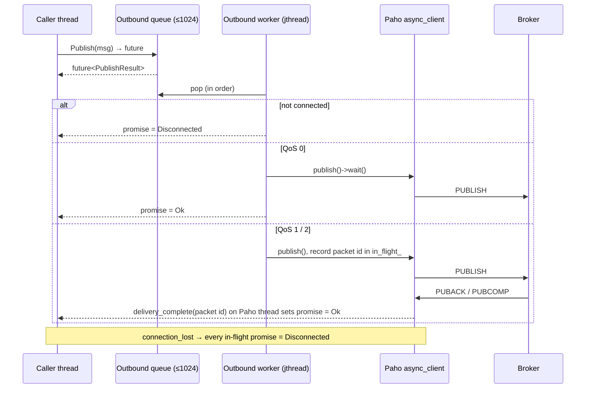
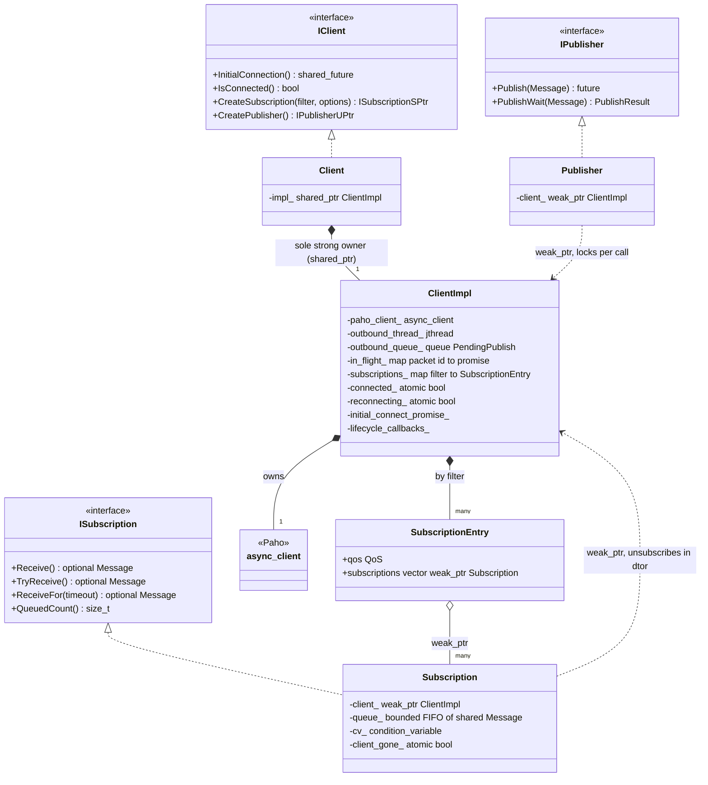
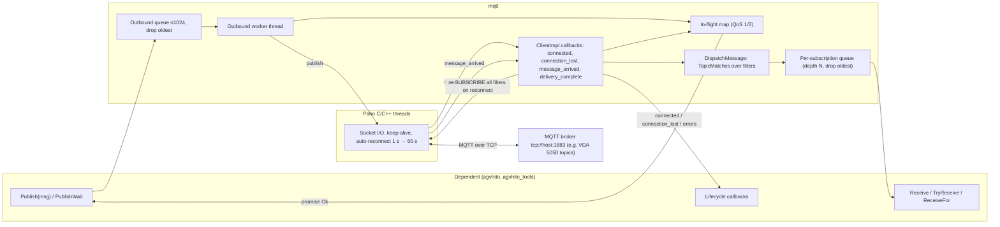
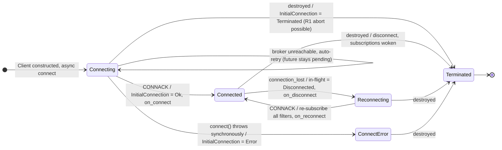
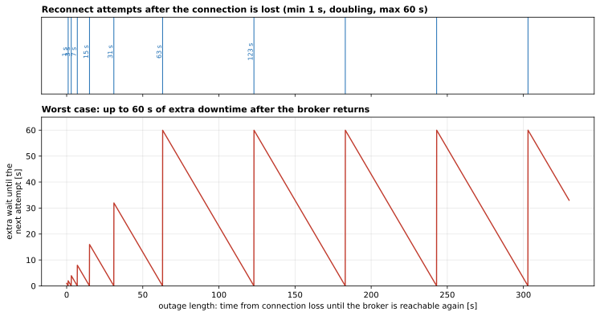

# 07 — `mqtt`

| Generated | Revision | Source pack | Status |
|---|---|---|---|
| 2026-10-07 | 3 | `P07-mqtt-part1of1.md` | Draft, generated by Claude, not yet reviewed by the team |

Package 7 of 37 (bottom-up) · dependency depth 0

**Abbreviations used in this document.** Each is also explained in context where it first matters.

| Abbreviation | Meaning |
|---|---|
| AGV | Automated Guided Vehicle |
| `agvhito` | AGV software for HITO vehicles (inferred from the name) |
| API | Application Programming Interface |
| CI | Continuous Integration |
| CMake (`cmake` in names) | Cross-platform Make (build-system generator) |
| CONNACK | MQTT CONNect ACKnowledgement packet |
| FIFO | First In, First Out |
| GCC | GNU Compiler Collection |
| GNU | GNU's Not Unix (the free-software project behind GCC) |
| `gtest` | GoogleTest |
| HITO | name of the AGV vendor; not expanded in the code |
| ID | identifier |
| JSON | JavaScript Object Notation |
| MQTT (`mqtt` in names) | Message Queuing Telemetry Transport |
| PUBACK | MQTT PUBlish ACKnowledgement packet |
| PUBCOMP | MQTT PUBlish COMPlete packet |
| QoS (`qos` in names) | Quality of Service |
| `rclcpp` | ROS Client Library for C++ |
| `rcpputils` | ROS C++ utilities |
| ROS | Robot Operating System |
| `stdx` | "standard library extensions" (Volley package) |
| TCP | Transmission Control Protocol |
| TLS | Transport Layer Security |
| TSA | Thread Safety Analysis (Clang) |
| URI | Uniform Resource Identifier |
| VDA (`vda5050` in names) | Verband der Automobilindustrie (German Association of the Automotive Industry); VDA 5050 is its AGV interface standard |
| YASMIN | Yet Another State MachINe (ROS 2 state-machine library) |

Workspace dependencies: none.
Used by: agvhito, agvhito_tools.

Related documents:
- `01-common.md`: the Modbus TCP (Transmission Control Protocol) client, which is the other network client in the workspace;
- `03-stdx.md`: result types;
- `05-structures.md`: queues.

**How to read the evidence markers.**
- **[read]** means the conclusion comes from reading the source.
- **[probed]** means it was confirmed by building the package and running it against a real broker:
  - the package was compiled with g++ 13.3 in C++20 mode against the Ubuntu 24.04 packages of Eclipse Paho MQTT (Message Queuing Telemetry Transport) C++ 1.2.0 and Paho C 1.3.13, with a stand-in for one rcpputils header;
  - the probes ran against a local Mosquitto 2.0.18 broker;
  - the team's Paho versions are unknown and may behave differently in details.
- **[upstream]** means it was confirmed in the Paho headers.

---

## A. External dependencies

`mqtt` is a C++ wrapper around **Eclipse Paho MQTT C++** (MQTT = Message Queuing Telemetry Transport), which in turn wraps **Paho MQTT C**. It contains no ROS (Robot Operating System) code at all: it does not depend on rclcpp or on any message package. Its only ROS-ecosystem dependency is rcpputils, used for one set of compile-time annotation macros.

The Paho dependency is not declared as a resolvable dependency: `package.xml` has it commented out, with the note that rosdep cannot resolve it and that it is "available in the environment" (R16).

| Name | Description | Version | Link | Usage in this package |
|---|---|---|---|---|
| Eclipse Paho MQTT C++ (`paho-mqttpp3`) | Asynchronous MQTT client library for C++. | Not pinned. The probes used 1.2.0 (Ubuntu 24.04); the team's version is unknown. | https://github.com/eclipse-paho/paho.mqtt.cpp | `::mqtt::async_client`, `connect_options`, `callback`, `make_message`, tokens. Linked as `PahoMqttCpp::paho-mqttpp3`. |
| Eclipse Paho MQTT C (`paho-mqtt3as`) | The C library underneath, asynchronous and with TLS (Transport Layer Security) support compiled in. | Probes: 1.3.13. | https://github.com/eclipse-paho/paho.mqtt.c | Network threads, automatic reconnect with exponential backoff, packet identifiers. |
| rcpputils | ROS 2 C++ utilities. | Same ROS 2 distribution as the workspace (Kilted or newer, see document 02). | https://github.com/ros2/rcpputils | Only `RCPPUTILS_TSA_GUARDED_BY`, Clang Thread Safety Analysis (TSA) annotations on mutex-protected members. |
| C++20 standard library | `std::jthread`, `std::stop_token`, `std::condition_variable_any`, `std::shared_mutex`, `std::promise` / `std::future`, `std::format`. | GCC (GNU Compiler Collection) ≥ 13. | https://en.cppreference.com/w/cpp/thread | Outbound worker thread, synchronization, futures. |
| An MQTT broker (runtime) | Server that routes messages between MQTT clients. | Any MQTT 3.1.1 broker; the probes used Eclipse Mosquitto 2.0.18. | https://mosquitto.org | Default endpoint `tcp://127.0.0.1:1883`. |
| GoogleTest (ament_cmake_gtest) | Unit tests. | Not pinned. | https://github.com/google/googletest | Topic-utility tests only. |
| `volley_cmake` | Workspace CMake helpers. | Internal. | Not in pack. | `volley_add_library(mqtt SHARED DIRECTORY src LINK_LIBRARIES …)`, `volley_add_gtest`. |

---

## B. Glossary

Terms already defined in documents 01–06 (TCP, socket, QoS (Quality of Service) in the ROS sense, `std::optional`, and so on) are reused here. Note that **MQTT QoS is unrelated to ROS QoS** even though the names coincide.

| Term | Meaning | Where it shows up |
|---|---|---|
| MQTT | Message Queuing Telemetry Transport: a lightweight publish/subscribe protocol over TCP, in which clients exchange messages through a central broker. | Package purpose |
| Broker | The server that receives published messages and forwards them to subscribed clients (for example Mosquitto). | `ConnectionOptions.host/port` |
| Client ID (identifier) | A client's identity at the broker. Must be unique: a second connection with the same ID disconnects the first. | `Client(client_id, …)`, R15 |
| Topic / topic filter | A topic is a slash-separated name (`vda5050/v2/HITO/135/state`). A filter is a subscription pattern that may contain wildcards. | `Message.topic`, `CreateSubscription` |
| `+` / `#` wildcards | `+` matches exactly one level (which may be empty). `#` matches any number of levels, including the parent level itself, and must be the last character. | `TopicMatches` |
| MQTT QoS 0 / 1 / 2 | Delivery guarantee per message: 0 = at most once (no acknowledgement); 1 = at least once (acknowledged with PUBACK, may duplicate); 2 = exactly once (a four-step handshake). | `QoS` enum |
| PUBACK / PUBCOMP | Broker acknowledgements that complete a QoS 1 or QoS 2 publish (PUBlish ACKnowledgement and PUBlish COMPlete). | `delivery_complete` |
| Packet identifier | 16-bit number labelling an in-flight QoS 1 or 2 message, so acknowledgements can be matched to it. | `in_flight_` map |
| Retained message | A message the broker stores and hands to every future subscriber of that topic. | `Message.retained` |
| Clean session | Connect flag. When true, the broker discards the client's subscriptions and queued messages on disconnect. | `ConnectionOptions.clean_session` |
| Keep-alive | Maximum silence before the client must ping, so that both sides can detect a dead connection. | `ConnectionOptions.keep_alive` |
| CONNACK | The broker's reply to a connect request (CONNect ACKnowledgement). | `InitialConnection()` |
| Automatic reconnect | Paho feature that retries a lost connection with exponentially growing intervals. | Section 7.2 |
| Paho | Eclipse Foundation project providing MQTT client libraries; here the C and C++ ones. | Dependency |
| Pimpl | "Pointer to implementation": the public class holds only a pointer to a hidden implementation class, which keeps heavy headers (here Paho's) out of the public API (Application Programming Interface). | `Client` → `ClientImpl` |
| `std::promise` / `std::future` | A one-shot channel: the producer sets a value on the promise; the consumer waits on the future. `shared_future` can be waited on by many. | Publish results, `InitialConnection` |
| `std::jthread` / `stop_token` | C++20 thread that requests stop and joins automatically; waits can be interrupted through the stop token. | Outbound worker |
| `std::shared_mutex` | Reader/writer lock: many readers or one writer. | Subscription map |
| `enable_shared_from_this` / `weak_ptr` | Lets an object hand out non-owning references to itself that can detect when it has been destroyed. | Publisher and subscription back-references |
| VDA 5050 | Interface standard between AGVs (Automated Guided Vehicles) and a master control, run over MQTT, from the VDA (Verband der Automobilindustrie, the German Association of the Automotive Industry). The test topics follow its `vda5050/v2/{manufacturer}/{serial}/{suffix}` scheme. | Tests; open question 1 |

---

## 1. Summary

`mqtt` gives Volley's C++ code a small, thread-safe MQTT client. A `Client` connects to a broker and keeps the connection alive, including automatic reconnects and re-subscription. The `Client` hands out two kinds of handle:
- **publishers**, which queue messages and return a `std::future` with the delivery result;
- **subscriptions**, which buffer matching messages in a bounded queue that the caller *pulls* from with `Receive`, `TryReceive` or `ReceiveFor`.

Users are `agvhito` and `agvhito_tools`. The topic examples in the tests (`vda5050/v2/HITO/135/state`) indicate that the main use is **VDA 5050 communication with the AGVs** *(inferred)*.

**Design quality.** This is the most carefully engineered concurrent code in the series so far, and the contrast with `common`'s blocking Modbus client is instructive:
- the public API is a set of abstract interfaces (`IClient`, `IPublisher`, `ISubscription`), so dependents can mock it;
- Paho is hidden behind a pimpl;
- handles refer back to the client through `weak_ptr`, so neither side can dangle;
- every asynchronous operation resolves a future, including during teardown;
- mutex-guarded members carry thread-safety annotations.

The pull model also fits ROS nodes well: no library thread ever calls into user code with a message.

**Problems at the edges of the connection lifecycle.** Running it against a real broker found several:
- **destroying a client while a connection attempt is in progress aborts the process** (R1);
- **subscribing before the first connection completes throws** (R2);
- **the initial-connection future never reports failure** while the broker is unreachable (R3);
- **a QoS 1/2 publish has no timeout** (R4).

---

## 2. Files

The package has 20 files:
- **nine public headers**: interfaces, value types, the concrete `Client`, and topic utilities;
- **eight private sources**: the Paho-facing implementation, publisher, subscription and topic utilities;
- **one test file and two build files.**

Line counts are from the pack, which has blank lines removed. Numbering note: the pack's instruction says "package 6" and asks for `06-mqtt.md`; this series continues at 07.

| Path (under `src/communication/mqtt/`) | Lines | Role |
|---|---:|---|
| `include/mqtt/i_client.hpp` | 32 | `IClient` interface: `InitialConnection`, `IsConnected`, `CreateSubscription`, `CreatePublisher`. |
| `include/mqtt/i_publisher.hpp` | 18 | `IPublisher`: `Publish` returns `future<PublishResult>`; `PublishWait` blocks. |
| `include/mqtt/i_subscription.hpp` | 26 | `ISubscription`: `Receive`, `TryReceive`, `ReceiveFor`, `TopicFilter`, `QueuedCount`. |
| `include/mqtt/client.hpp` | 60 | Concrete `Client` (pimpl over `ClientImpl`); `LifecycleCallbacks`. |
| `include/mqtt/connection_options.hpp` | 15 | Host, port, credentials, keep-alive, clean session (with defaults). |
| `include/mqtt/subscription_options.hpp` | 10 | Subscription QoS and queue depth (default 1). |
| `include/mqtt/message.hpp` | 19 | `QoS` enum and `Message` (topic, byte payload, QoS, retained). |
| `include/mqtt/results.hpp` | 43 | `ConnectResult`, `PublishResult` and their `ToString` functions. |
| `include/mqtt/topic_utils.hpp` | 17 | `GetTopicSegment`, `TopicMatches`, `ToQoS`, `FromQoS`. |
| `src/client.cpp` | 26 | `Client` forwarding to `ClientImpl`; creates publishers. |
| `src/client_impl.hpp` | 89 | `ClientImpl` declaration: Paho client, worker thread, queues, maps, locks. |
| `src/client_impl.cpp` | 290 | Connect, outbound loop, publish, subscribe and unsubscribe, Paho callbacks, dispatch, teardown. |
| `src/publisher.hpp` / `.cpp` | 20 / 17 | `Publisher`: a `weak_ptr` to `ClientImpl`; enqueues messages. |
| `src/subscription.hpp` / `.cpp` | 59 / 61 | `Subscription`: bounded drop-oldest queue, condition variable, unsubscribes on destruction. |
| `src/topic_utils.cpp` | 56 | Topic segment extraction and wildcard matching. |
| `test/test_topic_utils.cpp` | 69 | Parameterized tests of `TopicMatches`, `GetTopicSegment` and `ToQoS`. |
| `CMakeLists.txt` | 15 | Finds `PahoMqttCpp`; shared library; one gtest. |
| `package.xml` | 19 | Depends on rcpputils; Paho dependency commented out. |

---

## 3. Public API

The API is in namespace `volley::mqtt`, under headers `mqtt/*.hpp`. The intended pattern:
1. create one `Client` per process and broker;
2. wait for `InitialConnection()`;
3. create long-lived publisher and subscription handles;
4. drain subscriptions from a timer or a dedicated thread.

### 3.1 Value types — `message.hpp`, `results.hpp`, `connection_options.hpp`, `subscription_options.hpp`

| Type | Contents | Defaults |
|---|---|---|
| `QoS` | `AtMostOnce` = 0, `AtLeastOnce` = 1, `ExactlyOnce` = 2 | — |
| `Message` | `topic`; `payload` (`std::vector<uint8_t>`); `qos`; `retained` | QoS 0, not retained |
| `ConnectionOptions` | `host`, `port`, `username`, `password`, `keep_alive`, `clean_session` | `127.0.0.1`, 1883, empty credentials, 60 s, `true` |
| `SubscriptionOptions` | `qos`, `queue_depth` | QoS 0, **depth 1** |
| `ConnectResult` | `Ok`, `Error`, `Terminated` | — |
| `PublishResult` | `Ok`, `Timeout`, `Error`, `Disconnected`, `Overflow` | — |

The payloads are raw bytes. Serialization (for example the JSON (JavaScript Object Notation) used by VDA 5050) is left to the caller.

### 3.2 `Client` and `IClient` — `client.hpp`, `i_client.hpp`

**Purpose.** `Client` owns one broker connection and is the factory for publisher and subscription handles.

**Design.**
- **Pimpl.** `Client` holds a `shared_ptr<ClientImpl>`, which owns the Paho `async_client`. Only `Client` holds a strong reference; publisher and subscription handles hold `weak_ptr`s, so a handle can outlive the client and simply report `Disconnected`, or `nullopt`.
- **Copy and move.** `Client` is non-copyable (one connection, one owner) and movable.
- **Construction** starts everything:
  - it registers the Paho callbacks;
  - it starts the outbound worker thread;
  - it issues an **asynchronous** connect with automatic reconnect (retry every 1 s, doubling to at most 60 s).
- **Lifecycle callbacks** (`LifecycleCallbacks`): `on_connect` (first connection), `on_reconnect` (each later connection), `on_disconnect(reason)` and `on_error(message)`. They run on library threads (R9).

**Members.**

| Member | Behavior |
|---|---|
| `InitialConnection()` | `shared_future<ConnectResult>` that resolves once: `Ok` when the first CONNACK arrives; `Error` only if `connect` throws synchronously; `Terminated` if the client is destroyed first. While the broker is unreachable it stays pending, because automatic reconnect keeps trying (R3, **[probed]**). |
| `IsConnected()` | Current connection state (an atomic flag). |
| `CreateSubscription(filter, options)` | Registers a subscription handle. The first handle for a filter sends SUBSCRIBE to the broker. It **throws `mqtt::exception` if the client is not connected yet** (R2, **[probed]**). |
| `CreatePublisher()` | Returns a new `IPublisherUPtr`. Cheap; all publishers share the client's outbound queue. |

### 3.3 Publishing — `IPublisher`

**Design.**
- `Publish(message)` places the message on the client's outbound queue: at most 1024 entries; when full, the **oldest** entry is dropped and its future resolves to `Overflow`. It returns a `std::future<PublishResult>`.
- One worker thread drains the queue in order, so publish order is preserved:
  - **QoS 0:** handed to Paho, resolved `Ok` once Paho has written it out.
  - **QoS 1 and 2:** recorded in an in-flight map keyed by packet identifier, and resolved `Ok` when Paho reports delivery complete (PUBACK or PUBCOMP).
  - **While disconnected:** resolved `Disconnected` immediately. The message is dropped, not buffered.
  - **On connection loss:** every in-flight QoS 1 and 2 message is resolved `Disconnected`.
- `PublishWait(message)` is `Publish(message).get()`.
- `PublishResult::Timeout` exists but is **never produced**, so a QoS 1 or 2 publish to a stalled broker waits until the connection drops (R4, **[probed]**).



**Usage.**

```cpp
auto publisher = client.CreatePublisher();
volley::mqtt::Message msg{.topic = "vda5050/v2/HITO/135/order", .payload = Serialize(order),
                          .qos = volley::mqtt::QoS::AtLeastOnce};
auto result = publisher->Publish(std::move(msg));
// Later, never block an executor indefinitely (R4):
if (result.wait_for(2s) != std::future_status::ready) { /* treat as timeout */ }
```

`Serialize` and `order` are illustrative.

### 3.4 Subscribing — `ISubscription`

**Design.**
- Each handle owns a bounded FIFO (first in, first out) queue of `queue_depth` messages. When the queue is full, the **oldest** message is dropped silently.
- Paho's callback thread dispatches every arriving message to all handles whose filter matches (`TopicMatches`).
- Several handles may share one filter. The broker sees a single SUBSCRIBE, made with the first handle's QoS (R11), and an UNSUBSCRIBE when the last handle is destroyed.
- After a reconnect, every live filter is re-subscribed automatically **[probed]**.
- Methods:
  - `Receive()` blocks until a message arrives, or returns `nullopt` once the client is destroyed **[probed]**;
  - `ReceiveFor(timeout)` blocks for at most `timeout`;
  - `TryReceive()` never blocks;
  - `QueuedCount()` and `TopicFilter()` are informational.
- Messages are returned as copies (`std::optional<Message>`).

**Usage in a ROS node (pull model).**

```cpp
// After client.InitialConnection() reports Ok:
state_sub_ = client.CreateSubscription("vda5050/v2/+/+/state", {.qos = QoS::AtLeastOnce, .queue_depth = 64});
timer_ = create_wall_timer(20ms, [this] {
  while (auto m = state_sub_->TryReceive()) {
    HandleState(volley::mqtt::GetTopicSegment(m->topic, 3), m->payload);  // serial number
  }
});
```

`HandleState` is illustrative.

### 3.5 Topic utilities — `topic_utils.hpp`

- `TopicMatches(filter, topic)`: MQTT wildcard matching. It agreed with a spec-based reference on 20,000 random cases **[probed]**. It does not validate filters, and it does not apply the rule that wildcards at the start of a filter do not match `$`-prefixed system topics (R14).
- `GetTopicSegment(topic, i)`: the *i*-th level of a topic, or an empty string. It is handy for VDA 5050 topics (manufacturer at index 2, serial number at index 3).
- `ToQoS(int)` and `FromQoS(QoS)`: conversions to and from Paho's integers. `ToQoS` only `assert`s its range.

---

## 4. Diagrams

### 4a. Class diagram (ownership on edges)

The ownership graph is deliberately one-directional:
- the user owns the `Client`, and the `Client` solely owns `ClientImpl`;
- all back-references (handle to client, client to handle) are `weak_ptr`s;
- the user owns the handles: subscriptions by `shared_ptr`, publishers by `unique_ptr`.



### 4b. Data flow

This is the first package in the series with real network input and output. It has no ROS topics, services, actions, timers or parameters, and it makes no calls into lower-layer workspace packages.



### 4c. State machines

There is no enum-driven or YASMIN (Yet Another State MachINe) state machine. However, the client's **connection lifecycle** is a real state machine in the code, encoded in two atomic flags (`connected_`, `reconnecting_`) plus the one-shot initial-connection promise. It matters to users because it decides which lifecycle callback fires and what `InitialConnection()` and `IsConnected()` report.



---

## 5. Behavior

**Construction.** `Client(client_id, options, callbacks)` does the following:
1. creates `ClientImpl` with a Paho `async_client` for `tcp://host:port`;
2. registers Paho callbacks;
3. starts the outbound `jthread`;
4. calls `connect` asynchronously, with credentials, keep-alive, clean session and automatic reconnect (1–60 s).

The constructor returns immediately. The connection completes later on a Paho thread; on a local broker the probes saw this take more than 50 ms. Until then:
- `IsConnected()` is `false`;
- publishes resolve `Disconnected`;
- `CreateSubscription` throws (R2).

**Steady state.** These threads run concurrently:

| Thread | Owner | Runs |
|---|---|---|
| Paho C internal threads (send, receive, callbacks) | Paho | `connected`, `connection_lost`, `message_arrived`, `delivery_complete`; the user's lifecycle callbacks; dispatch into subscription queues. |
| Outbound worker (`std::jthread`) | `ClientImpl` | `DoPublish` for each queued message, in order; may call `on_error`. |
| Caller threads | Dependent | `Publish`, `CreateSubscription` and `Receive*`; blocking `Receive` and `PublishWait` block these threads. |

- **No ROS executor or callback group is involved.** A ROS node integrates by polling `TryReceive` from a timer, or by dedicating a thread to `Receive`, and by never calling the blocking methods from a single-threaded executor without a timeout.
- **When the connection drops:**
  - `on_disconnect` fires;
  - in-flight QoS 1/2 publishes resolve `Disconnected`;
  - Paho retries with exponential backoff (section 7.2);
  - on success, every filter is re-subscribed, then `on_reconnect` fires **[probed]**.
- With `clean_session = true`, the broker keeps nothing for the client while it is gone, so messages published by others during the outage are lost to this client.

**Shutdown.** The last owner destroys `Client`. Then `~ClientImpl`:
1. wakes all blocked `Receive` callers (they return `nullopt`);
2. stops and joins the outbound worker, after it has drained the queue;
3. swaps Paho's callback to a no-op;
4. disconnects, waiting for completion;
5. resolves remaining in-flight promises (`Disconnected`) and the initial-connection promise (`Terminated`).

Step 3 throws inside the destructor if a connection attempt is in progress, which terminates the process (R1, **[probed]**).

**Parameters and defaults.** There are no ROS parameters; all configuration is in code.

| Setting | Default | Where |
|---|---|---|
| Broker | `127.0.0.1:1883`, plain TCP | `ConnectionOptions` |
| Credentials | empty | `ConnectionOptions` |
| Keep-alive | 60 s | `ConnectionOptions` |
| Clean session | `true` | `ConnectionOptions` |
| Reconnect interval | 1 s, doubling to 60 s | `kMinRetryInterval`, `kMaxRetryInterval` (fixed) |
| Outbound queue | 1024 messages, drop oldest (`Overflow`) | `kMaxOutboundDepth` (fixed) |
| Subscription | QoS 0, queue depth **1**, drop oldest | `SubscriptionOptions` |
| Message | QoS 0, not retained | `Message` |

---

## 6. Ownership and safety

### 6.1 Lifetimes

- **`Client` is the only strong owner of `ClientImpl`.** Its handles hold `weak_ptr`s:
  - a publisher locks its pointer for the duration of each `Publish` call, which also keeps `ClientImpl` alive while it enqueues;
  - a subscription locks only in its destructor, to unregister itself.
- **Handles may outlive the client safely:** `Publish` then returns `Disconnected`, and `Receive` returns `nullopt` **[probed]**.
- **`ClientImpl` keeps `weak_ptr`s to subscriptions**, so dropping the last `shared_ptr` to a subscription unregisters it, and unsubscribes at the broker if it was the last handle for its filter.
- **Moving a `Client`** leaves the moved-from object with a null `impl_`; any call on it crashes (R12).
- **A stale comment.** `subscription.hpp` says the subscription's "address is registered as a raw pointer" in the client; the code actually uses `weak_ptr`.

### 6.2 Callbacks capturing `this`

- **Lifecycle callbacks** (`on_connect`, `on_reconnect`, `on_disconnect`) run on Paho's threads, concurrently with the user's own threads. `on_error` can also run on the outbound worker or on the caller's thread.
- **Consequences for `[this]` lambdas:**
  - the captured state must be thread-safe;
  - `this` must outlive the `Client`.
- **Safe arrangement:** make the `Client` a member declared *after* everything its callbacks touch, so that it is destroyed first.
- **No messages arrive by callback.** Message delivery is pull-based, so user code never runs on Paho's thread with message data. This is the main design choice that keeps the package easy to use correctly.

### 6.3 Locks and atomics

| Lock or atomic | Protects | Taken by |
|---|---|---|
| `outbound_mutex_` (+ `condition_variable_any`) | Outbound queue | `Publish` (any thread); worker. Released before network I/O. |
| `in_flight_mutex_` | Packet id → promise map | Worker (held *during* the Paho `publish` call, so that `delivery_complete` cannot arrive before the entry exists); Paho thread (`delivery_complete`, `connection_lost`); destructor. |
| `subscription_mutex_` (shared) | Filter → handles map | Shared: dispatch, re-subscribe snapshot, destructor wake-up. Exclusive: create and remove. |
| `Subscription::queue_mutex_` (+ `condition_variable`) | Per-handle queue | Dispatch (Paho thread), `Receive*`, `QueuedCount`. |
| `connected_`, `reconnecting_`, `initial_connect_resolved_`, `client_gone_` | Flags | Lock-free; `exchange` guarantees each promise is set only once. |

The lock order is consistent: the subscription map lock, then a subscription's queue lock. No path takes them in the opposite order **[read]**. The TSA annotations would let Clang check the guarded members at compile time, if the workspace builds with `-Wthread-safety`.

### 6.4 Error handling

| Style | Where |
|---|---|
| Result enums delivered through futures | `PublishResult` for every publish; `ConnectResult` for the initial connection. |
| `std::optional` | `Receive`, `TryReceive`, `ReceiveFor` (`nullopt` = timeout or client gone). |
| Callbacks | `on_error` for asynchronous failures: publish exceptions, failed unsubscribe or re-subscribe, synchronous connect failure. |
| Exceptions (escaping) | `CreateSubscription` when not connected (R2); `~ClientImpl` while a connection attempt is in progress, which terminates the process (R1). Neither is documented. |
| `assert` | `queue_depth > 0` (R13); `ToQoS` range. |

### 6.5 RISK items

| Item | Risk | Evidence |
|---|---|---|
| R1 | **Destroying a client during a connection attempt aborts the process.** `~ClientImpl` calls `paho_client_.set_callback(...)` outside its `try` block. Paho refuses to change callbacks while a connect is in progress and throws `mqtt::exception` ("Failure"). Because destructors are `noexcept`, the process terminates. The window is roughly the first 50 ms after construction with a local broker, and *any time* the broker host is unreachable without a reset (a network outage). Shutting a node down during an outage therefore crashes it. | **[probed]**: abort on destruction at 0–50 ms, and at 2 s against a blackholed address; the backtrace points to the call in `~ClientImpl` |
| R2 | **Subscribing before the first connection throws.** `CreateSubscription` calls Paho's `subscribe` without a `try`. Before CONNACK, Paho throws `MQTT error [-3]: Disconnected`. The first `connected()` callback does not re-issue subscriptions (only reconnects do), so "subscribe early, deliver later" does not work. Callers must wait for `InitialConnection()` first; the interface documents only the `queue_depth` precondition. | **[probed]**: 3 of 3 runs |
| R3 | **`InitialConnection()` never reports failure while the broker is unreachable.** Paho's automatic reconnect keeps retrying the initial connect, so the future stays pending instead of resolving `Error` as its comment says. It did resolve `Ok` once the broker appeared. Anything calling `.get()` at startup blocks indefinitely during an outage. | **[probed]**: pending after 5 s; `Ok` 8 s after the broker started |
| R4 | **No publish timeout.** `PublishResult::Timeout` is never produced. A QoS 1/2 publish to a stalled broker waits until the acknowledgement or the connection loss (up to the keep-alive period, about 60–90 s); `PublishWait` blocks the calling thread just as long. | **[probed]**: pending after 5 s with the broker paused |
| R5 | **"Disconnected" is ambiguous.** (a) Messages published while disconnected are dropped (`Disconnected`), not buffered, even though Paho offers offline buffering. (b) QoS 1/2 messages in flight at connection loss resolve `Disconnected` even if the broker had already received them, so callers that retry can create duplicates. | **[probed]** (a); **[read]** (b) |
| R6 | **Silent message loss in subscription queues.** The default `queue_depth` is 1, and a full queue drops the oldest message without counting or reporting it. Five quick publishes left only the last one. | **[probed]** |
| R7 | **A single outbound worker.** One worker serializes all publishes. A slow QoS 0 `publish()->wait()` delays everything behind it, and shutdown (which joins the worker) waits for it too. The 1024-entry queue drops the oldest messages (`Overflow`) under sustained backlog. | **[read]** |
| R8 | **Teardown can race with Paho callbacks.** Swapping to the no-op callback is not synchronized with a callback already running on Paho's thread. Members are destroyed in reverse order, so `subscriptions_` and its mutex are destroyed *before* `paho_client_`; a late `message_arrived` could touch freed state. | **[read]**, inference (not reproduced) |
| R9 | **Lifecycle callbacks run on library threads**, concurrently with the caller's threads, and must not block: a blocking `on_disconnect` would stall Paho's callback thread, and with it message dispatch and delivery completion. | **[read]** |
| R10 | **No TLS.** The server URI (Uniform Resource Identifier) is always `tcp://`, so usernames, passwords and payloads cross the network in clear text. The `password` field is a plain `std::string`. | **[read]** |
| R11 | **The first subscriber's QoS wins.** Later handles for the same filter with a different QoS silently get the first one's. | **[read]** |
| R12 | **A moved-from `Client` crashes when used**: its `impl_` is null. | **[read]** |
| R13 | **Assert-only preconditions.** With `queue_depth = 0` in a release build, `Enqueue` pops an empty `std::queue`, which is undefined behavior. `ToQoS(7)` produces an invalid enum value. | **[read]** |
| R14 | **Partial topic validation.** `TopicMatches` does not validate filters (`a/#/b`, `fo+o`) and lets `#` and `+` match `$SYS/...` topics, which the spec forbids. The broker applies the real rules, so the effect is limited to local dispatch across overlapping filters. | **[probed]** (spec agreement otherwise) |
| R15 | **Client IDs must be unique per broker.** A second process using the same ID disconnects the first, and the two then evict each other in a reconnect loop. Nothing in the package derives a unique ID. | MQTT protocol rule |
| R16 | **Build reproducibility.** The Paho dependency is commented out in `package.xml` (rosdep cannot resolve it), so builds rely on whatever Paho version the environment provides. Behavior in R1–R3 depends on Paho internals. | **[read]** |

---

## 7. Math

The package has no numerical algorithms, but two of its behaviors are precise rules worth stating: which topics a filter matches, and when a reconnect happens.

### 7.1 Topic-filter matching

Write a filter $f$ and a topic $t$ as level sequences $f=(f_1,\dots,f_m)$ and $t=(t_1,\dots,t_n)$, splitting on `/`. Empty levels are allowed. Then

$$
\text{match}(f,t)\iff
\begin{cases}
k-1\le n\ \wedge\ \forall i<k:\ f_i\in\{\texttt{+},\,t_i\} & \text{if } f_k=\texttt{\#}\ \text{(the last level)}\\[4pt]
m=n\ \wedge\ \forall i\le m:\ f_i\in\{\texttt{+},\,t_i\} & \text{if } f \text{ contains no } \texttt{\#}
\end{cases}
$$

The condition $k-1\le n$ (rather than $k\le n$) is what makes `foo/#` match `foo` itself. The implementation reproduces this rule exactly over 20,000 random filter/topic pairs **[probed]**. The rule omits the `$`-topic exception (R14).

### 7.2 Automatic-reconnect timing

Paho retries a lost connection after an interval that starts at $r_{\min}=1$ s and doubles after each failure, up to $r_{\max}=60$ s **[upstream]**:

$$
r_k=\min\!\left(2^{k}\,r_{\min},\ r_{\max}\right),\qquad
a_k=\sum_{j=0}^{k} r_j\ \ (k=0,1,\dots)
$$

The attempts therefore happen at $a_k = 1, 3, 7, 15, 31, 63, 123, 183, \dots$ seconds after the loss. If the broker becomes reachable again at time $T$, the client reconnects at the first attempt $a_k\ge T$, so the extra downtime is

$$
D(T)=\min_{k:\,a_k\ge T} a_k - T \;\le\; r_{\max}=60\ \text{s}\quad(\text{for } T>63\ \text{s}).
$$

This model ignores the duration of each connection attempt. For long outages, a vehicle may stay disconnected for up to a minute after the broker is back. If that is too slow for VDA 5050 supervision, the maximum interval should be configurable (open question 5).



*Figure 7.1 — Top: reconnect attempts after a connection loss. Bottom: the extra time until the next attempt, as a function of when the broker returns. The sawtooth peaks at 60 s once the doubling has reached its cap.*

### 7.3 Queue semantics

Both queues are bounded and drop the oldest entry when full. A subscription of depth $N$ that is drained every $\Delta$ seconds while messages arrive at rate $\lambda$ loses about

$$
\max\!\left(0,\ \lambda\Delta - N\right)\ \text{messages per drain.}
$$

With the default $N=1$, any rate above one message per polling interval loses data. Size `queue_depth` to at least $\lambda\Delta$ plus a margin; for example 64 for VDA 5050 state messages from many AGVs polled every 20 ms.

---

## 8. Tests

There is one test executable with 36 parameterized cases: 21 for `TopicMatches`, 14 for `GetTopicSegment` and 1 for `ToQoS`. All pass when built against the real topic utilities **[probed]**.

| Test | Covers | What it reveals about intended behavior |
|---|---|---|
| `TopicMatchesTest` | Exact and literal matches; `+` (including empty levels, and not spanning `/`); `#` (including matching the parent level); `+/#`. | The matcher is meant to follow the MQTT 3.1.1 rules, including the parent-level rule for `#`. |
| `GetTopicSegmentTest` | VDA 5050 topics (`vda5050/v2/HITO/135/state`); out-of-range indices; empty, leading and trailing levels. | Topic levels are used to extract the manufacturer and serial number. HITO appears as the manufacturer *(inferred: the AGV vendor behind `agvhito`)*. |
| `ToQoS.ConvertsValidValues` | 0, 1, 2 | — |

**Gaps.** The client, publisher and subscription have **no tests at all**, which is where all the RISK items are. The interfaces (`IClient`, `IPublisher`, `ISubscription`) make dependents mockable, but the package does not test its own concurrency.

The probes for this document show that an integration test against a local Mosquitto broker is cheap to run (a few seconds). Such a test should cover:
- connect and publish/receive at QoS 0, 1 and 2;
- reconnect and re-subscription;
- destruction with blocked `Receive` callers;
- destruction during a connection attempt (R1);
- subscribing before the connection completes (R2);
- the broker being down at startup (R3);
- a stalled broker (R4);
- queue overflow (R6).

---

## 9. Idioms to reuse, and open questions

### 9.1 Idioms

- **Interfaces plus pimpl.** Expose pure-virtual interfaces and hide third-party types behind an implementation pointer, so dependents compile without Paho headers and can mock the client.
- **`weak_ptr` back-references from handles.** Handles survive their factory and degrade to "disconnected" instead of dangling, and destroying a handle cleans up its registration.
- **Every asynchronous operation resolves its future**, including on connection loss and teardown. No caller is left waiting on a promise that will never be set. Use `exchange` on an atomic flag to set one-shot promises exactly once.
- **Pull, don't push.** Hand data to user code through queues the user drains, rather than callbacks on library threads.
- **Release locks before I/O** (the outbound worker), and hold the map lock across "send, then register" when the reply can race the registration (the `in_flight_` lock during `publish`).
- **In ROS nodes:**
  - wait for `InitialConnection()` with a timeout before creating subscriptions (R2, R3);
  - drain subscriptions from a timer with `TryReceive`;
  - never call `PublishWait` or `Receive` without a timeout on an executor thread (R4).

### 9.2 Open questions for the team

1. Is this client used mainly for VDA 5050 with the HITO AGVs? Which broker runs in production, and is TLS required on that network (R10)?
2. **R1 and R2 are probably the most urgent fixes.** Should `~ClientImpl` wrap `set_callback` in its `try` block (or skip it while connecting), and should `CreateSubscription` record the filter and subscribe on first connect instead of throwing?
3. Should `InitialConnection()` resolve `Error` after a configurable timeout (R3), and should `Publish` honor a timeout and actually produce `PublishResult::Timeout` (R4)?
4. Should messages published while disconnected be buffered (Paho offline buffering), and should `clean_session = false` be used so the broker keeps subscriptions and QoS 1 messages across short outages (R5)?
5. Should the reconnect interval cap (60 s), the outbound queue size (1024) and a dropped-message counter be configurable or exposed (section 7.2, R6, R7)?
6. How are client IDs chosen so that two processes never collide (R15)?
7. Which Paho version is installed in the build and runtime images, and can it be declared or vendored (R16)?
8. **Numbering.** The pack's instruction says package 6 / `06-mqtt.md`; this series is numbered 07 here. Should the series be renumbered to match the packs?
