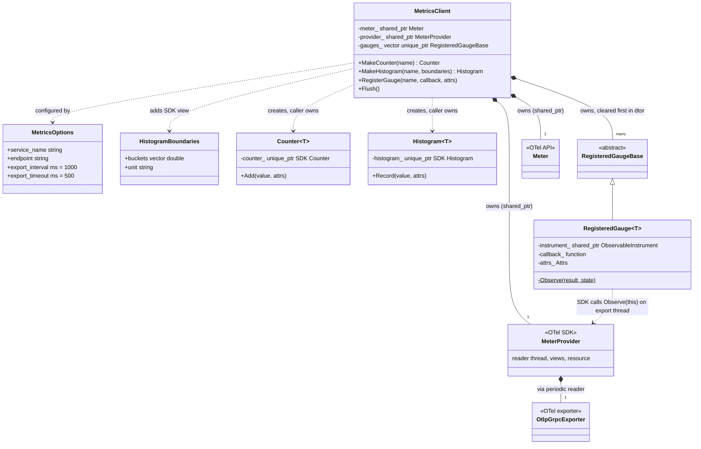
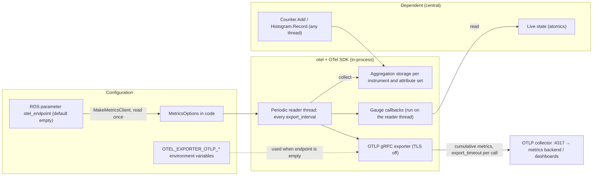
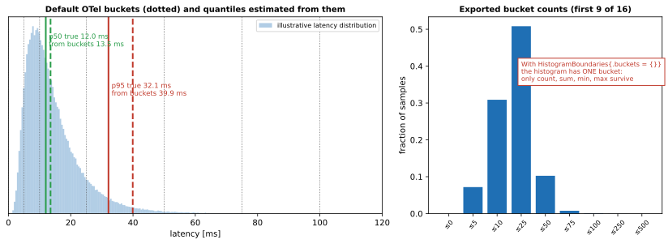
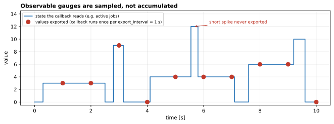

# 08 — `otel`

| Generated | Revision | Source pack | Status |
|---|---|---|---|
| 2026-10-07 | 2 | `P08-otel-part1of1.md` | Draft, generated by Claude, not yet reviewed by the team |

Package 8 of 37 (bottom-up) · dependency depth 0

Workspace dependencies: none.
Used by: central.

Related documents:
- `02-rclcppx.md`: parameters declared by helpers;
- `05-structures.md`: `OnlineMeanVariance`, an in-process alternative to histograms;
- `07-mqtt.md`: the other package wrapping a third-party network client.

**How to read the evidence markers.**
- **[read]** means the conclusion comes from reading the source.
- **[upstream]** means it was confirmed in the OpenTelemetry C++ source code. The main branch was read on 2026-10-07; the version the team builds against is unknown, so details may differ.

OpenTelemetry C++ is not packaged for Ubuntu 24.04 and needs a full gRPC (Google's Remote Procedure Call framework) build, so this package was **not compiled or run** for this document.

---

## A. External dependencies

`otel` wraps the **OpenTelemetry C++ SDK** (OTel; SDK = Software Development Kit) to give Volley code a compact way to emit metrics, which it exports over **OTLP** (OpenTelemetry Protocol) on gRPC to a collector.

Like Paho in `mqtt`, the SDK is found with `find_package(opentelemetry-cpp CONFIG REQUIRED)`, but it is **not declared in `package.xml`**. It must therefore be preinstalled in the build image (R12). The only declared dependency is rclcpp (ROS (Robot Operating System) Client Library for C++), used by one helper that reads the collector address from a ROS parameter.

| Name | Description | Version | Link | Usage in this package |
|---|---|---|---|---|
| opentelemetry-cpp: API (Application Programming Interface) | The vendor-neutral instrumentation interfaces: meters and instruments. | Not pinned (not in `package.xml`). | https://github.com/open-telemetry/opentelemetry-cpp | `metrics::Meter`, `Counter`, `Histogram`, `ObservableInstrument`, `KeyValueIterableView`, `context::Context`. |
| opentelemetry-cpp: SDK (`sdk`, `metrics`) | Implementation: aggregation, views, periodic reader, resource. | Same. | Same | `MeterProviderFactory`, `MeterContextFactory`, `ViewFactory`, `HistogramAggregationConfig`, `PeriodicExportingMetricReaderFactory`, `Resource`. |
| opentelemetry-cpp: OTLP gRPC metrics exporter | Sends metrics to an OTLP endpoint over gRPC. | Same. | Same | `OtlpGrpcMetricExporterFactory`. It pulls in gRPC and Protocol Buffers. |
| rclcpp | ROS 2 C++ client library. | Same ROS 2 distribution as the workspace (Kilted or newer, see document 02). | https://github.com/ros2/rclcpp | `MakeMetricsClient` reads the `otel_endpoint` node parameter. |
| C++20 standard library | Concepts, `std::function`, `std::map`. | GCC (GNU Compiler Collection) ≥ 13. | https://en.cppreference.com | Value-type concepts; attribute maps. |
| An OTLP collector (runtime) | Receives exported metrics, for example the OpenTelemetry Collector, which forwards them to a metrics backend. | Any OTLP/gRPC receiver. | https://opentelemetry.io/docs/collector/ | Default `localhost:4317`, or the `OTEL_EXPORTER_OTLP_*` environment variables. |
| `volley_cmake` | Workspace CMake helpers. | Internal. | Not in pack. | Library and example executable. |

**A link-time detail.** `CMakeLists.txt` wraps the OTel libraries in `-Wl,--no-as-needed … -Wl,--as-needed`. This keeps the exporter in the library's `DT_NEEDED` list, the ELF (Executable and Linkable Format) record of required shared libraries, even though `otel` itself references none of its symbols directly. The comment explains why: composable ROS nodes are loaded with `dlopen`, and they would otherwise fail to resolve the exporter's symbols.

---

## B. Glossary

| Term | Meaning | Where it shows up |
|---|---|---|
| OpenTelemetry (OTel) | Open standard and libraries for telemetry: metrics, traces and logs. This package uses metrics only. | Package purpose |
| OTLP | OpenTelemetry Protocol, the wire format for telemetry; here carried over gRPC (default port 4317). | Exporter |
| Collector | A service that receives OTLP data and forwards it to storage and dashboards. | `endpoint` |
| Meter / meter provider | The provider is the configured pipeline (readers, views, resource). A meter is a named factory for instruments, scoped to one module. | `provider_`, `meter_` |
| Instrument | An object that records measurements: a counter, histogram or gauge. | `Counter`, `Histogram`, `RegisterGauge` |
| Counter (monotonic) | Accumulates non-negative increments; the backend derives rates. | `MakeCounter` |
| Histogram | Records a distribution of values into buckets, plus their count, sum, minimum and maximum. | `MakeHistogram` |
| Explicit bucket boundaries | The sorted edges $b_1<\dots<b_k$ that define $k+1$ buckets. | `HistogramBoundaries.buckets` |
| Observable gauge | An instrument whose value is *read* by a callback each time metrics are collected, rather than pushed. | `RegisterGauge` |
| Attributes | Key/value labels on a measurement (`{"result", "ok"}`). Each distinct set of attributes is a separate time series. | `Attrs` |
| Cardinality | The number of distinct time series, which is driven by distinct attribute combinations. | R8 |
| Resource / `service.name` | Attributes describing the process that emits the telemetry. | `MetricsOptions.service_name` |
| View | An SDK rule that changes how a selected instrument is aggregated, for example its bucket boundaries. | `SetHistogramBoundaries` |
| Periodic exporting reader | SDK component with its own thread: every `export_interval` it collects all instruments and hands the data to the exporter. | `MetricsOptions.export_interval` |
| Temporality | Whether exported values are *cumulative* (since start) or *delta* (since the last export). The OTLP default is cumulative. | Section 7 |
| Span / context / exemplar | Tracing concepts. An exemplar links a metric point to a trace. Not used here; recordings pass an empty context. | `kEmptyContext` |
| Composable node | A ROS 2 node built as a shared library and loaded into a container process at runtime (with `dlopen`). | Link-time detail |
| `OTEL_EXPORTER_OTLP_*` | Standard environment variables that configure the exporter (endpoint, headers, insecure mode, certificates). | Empty `endpoint` |

---

## 1. Summary

`otel` is Volley's metrics library. A `MetricsClient` builds a complete, private OpenTelemetry metrics pipeline:
- a meter provider tagged with `service.name`;
- a periodic reader;
- an OTLP/gRPC exporter.

It then mints three kinds of instrument through a small, type-checked API:
- `Counter<T>` for counts;
- `Histogram<T>` for distributions, with optional custom buckets;
- **observable gauges** for live state the SDK polls.

`MakeMetricsClient(service, node)` is a ROS convenience that takes the collector address from the node's `otel_endpoint` parameter. The only user listed is `central`.

**Fit with the rest of the workspace.** `otel` complements rather than overlaps the other observability tools in the series:
- `rosout` and the `rclcppx` `LOG_*` macros carry *events* (log lines);
- ROS topics carry *state* to other nodes;
- `otel` carries *aggregated numbers* (rates, latency distributions, queue lengths) to an external monitoring backend.

The design is careful about lifetimes:
- each client owns its own provider rather than the OTel global, so several services in one process keep distinct names;
- instruments made from a default-constructed object are harmless no-ops;
- gauges are owned by the client and unregistered before the pipeline shuts down.

**Where it is problematic.** Two problems come from SDK behavior the wrapper does not account for:
- the package's own example passes an empty bucket list "to set the unit", which **removes all bucket boundaries** (R1);
- changing the export interval without also lowering the timeout makes the SDK **silently fall back to a 60-second interval** (R2).

In addition, TLS (Transport Layer Security) is forced off (R3). The package has no tests.

---

## 2. Files

The package has 13 files: five public headers (two of them instrument wrappers), two sources plus a private header, one example program, and two build files. Line counts are from the pack, which has blank lines removed.

Numbering note: the pack's instruction says "package 7" and asks for `07-otel.md`; this series continues at 08.

| Path (under `src/data/otel/`) | Lines | Role |
|---|---:|---|
| `include/otel/metrics_client.hpp` | 99 | `MetricsOptions`, `HistogramBoundaries`, `MetricsClient`, with the counter and histogram factories inline. |
| `include/otel/instruments/counter.hpp` | 23 | `Counter<T>`: no-op by default; wraps an SDK counter once created by the client. |
| `include/otel/instruments/histogram.hpp` | 23 | `Histogram<T>`: same pattern for histograms. |
| `include/otel/instrument_concepts.hpp` | 12 | Concepts `CounterValue`, `HistogramValue` (`uint64_t`, `double`) and `GaugeValue` (`int64_t`, `double`). |
| `include/otel/attributes.hpp` | 11 | `Attrs` (`std::map<string, string>`), `AttrsView`, `kEmptyContext`. |
| `include/otel/metrics_client_ros.hpp` | 9 | `MakeMetricsClient(service_name, node, endpoint_param = "otel_endpoint")`. |
| `src/metrics_client.cpp` | 89 | Pipeline construction, teardown, histogram views, `Flush`, `RegisterGauge` (explicitly instantiated for `int64_t` and `double`). |
| `src/metrics_client_ros.cpp` | 13 | Declares and reads the endpoint parameter; builds the client. |
| `src/registered_gauge.hpp` | 47 | `RegisteredGauge<T>`: registers and removes an SDK callback keyed on its own address. |
| `examples/metrics_usage_example.cpp` | 34 | Counter, histogram and gauge usage against `localhost:4317`; built as `metrics_usage_example`. |
| `CMakeLists.txt` | 25 | Shared library with `--no-as-needed` linking; example executable. |
| `package.xml` | 14 | Depends on rclcpp only; description "OpenTelemetry C++ and ROS SDK". |

---

## 3. Public API

The API is in namespace `data::otel`. Note that this is not `volley::`, unlike the other packages so far.

### 3.1 `MetricsOptions` and `MetricsClient` — `metrics_client.hpp`

**Purpose.** One object that owns a metrics pipeline from configuration to shutdown, so callers never touch SDK factories.

**Design.**
- **Construction** builds, in order:
  1. an OTLP/gRPC exporter: with the given endpoint if one is set, otherwise from the environment or the SDK default; **TLS is forced off**;
  2. a periodic reader with the given interval and timeout;
  3. a resource with `service.name`;
  4. a meter context and provider;
  5. one meter, named after the service with version `"1.0.0"`.
- **Private, not global.** The provider is deliberately *not* installed as the OTel global provider. Each client is independent, which allows several services with distinct names in one process, for example several composable nodes in one container. The cost is that each client runs its own export thread and gRPC channel (R11).
- **Destruction:**
  1. removes all gauge callbacks first, so the export thread cannot call into freed state;
  2. calls `ForceFlush`, which exports pending data (bounded by the export timeout);
  3. calls `Shutdown`.
- **Ownership semantics.** The client is non-copyable and movable. A moved-from client is empty: using it crashes (R6).

| Option | Default | Meaning |
|---|---|---|
| `service_name` | `""` | Becomes the `service.name` resource attribute and the meter name. |
| `endpoint` | `""` | Empty means the `OTEL_EXPORTER_OTLP_*` environment variables apply, or the SDK default `localhost:4317`. |
| `export_interval` | 1000 ms | Collection and export period. |
| `export_timeout` | 500 ms | Deadline per export. **Must be shorter than the interval**, or the SDK resets both to 60 s / 30 s (R2). |

| Member | Behavior |
|---|---|
| `MakeCounter<T>(name, description, unit)` | `T` ∈ {`uint64_t`, `double`}. Returns a `Counter<T>` by value. |
| `MakeHistogram<T>(name, description, boundaries?)` | `T` ∈ {`uint64_t`, `double`}. If `boundaries` is given, adds an SDK view that sets the bucket edges to `boundaries->buckets` **exactly**, even when that list is empty (R1); `boundaries->unit` becomes the instrument unit. |
| `RegisterGauge<T>(name, callback, attrs, description, unit)` | `T` ∈ {`int64_t`, `double`}. The client stores the registration; the SDK calls `callback()` on its export thread once per collection, and reports the value with the fixed `attrs`. There is no way to unregister a single gauge (R5). |
| `Flush()` | Forces an immediate export of buffered metrics. |

### 3.2 `Counter<T>` and `Histogram<T>` — `instruments/*.hpp`

**Design.**
- Thin value wrappers around `unique_ptr`s to SDK instruments.
- A default-constructed wrapper is a **no-op**, so a class can declare instrument members and fill them in later (or never, for example in tests) without null checks.
- They are move-only (because of the `unique_ptr`) and are created only by `MetricsClient`, which is a friend class.
- `Counter::Add(value, attrs = {})` and `Histogram::Record(value, attrs = {})` take per-call attributes.
- Recording is thread-safe, as guaranteed by the SDK.

### 3.3 Value concepts and attributes — `instrument_concepts.hpp`, `attributes.hpp`

- **Concepts.** `CounterValue` and `HistogramValue` accept exactly `std::uint64_t` and `double`; `GaugeValue` accepts `std::int64_t` and `double`. Other types fail at compile time, the same "fail early" stance as `rclcppx`. For example, `MakeCounter<int>` does not compile.
- **Attributes.** `Attrs` is `std::map<std::string, std::string>`: string values only, ordered keys, and an allocation on every call that passes attributes.

### 3.4 ROS helper — `metrics_client_ros.hpp`

`MakeMetricsClient(service_name, node, endpoint_param = "otel_endpoint")`:
- declares the string parameter (default `""`) if it does not exist yet;
- reads it **once**;
- returns a client.

Because the default is empty, a node with no parameter set falls back to the environment variables, or to `localhost:4317`.

**Usage.**

```cpp
class CentralNode : public rclcpp::Node {
  std::atomic<int64_t> active_jobs_{0};                 // 1. state read by gauges
  data::otel::MetricsClient metrics_;                    // 2. client (destroyed before 1)
  data::otel::Counter<uint64_t> jobs_done_;              // 3. instruments (destroyed before 2)
  data::otel::Histogram<double> dispatch_ms_;
 public:
  CentralNode() : Node("central"),
      metrics_({.service_name = "central",
                .endpoint = declare_parameter<std::string>("otel_endpoint", "")}),
      jobs_done_(metrics_.MakeCounter<uint64_t>("central.jobs_done", "Jobs completed", "{job}")),
      dispatch_ms_(metrics_.MakeHistogram<double>("central.dispatch_latency", "Dispatch latency",
          data::otel::HistogramBoundaries{.buckets = {1, 2, 5, 10, 20, 50, 100, 200, 500}, .unit = "ms"})) {
    metrics_.RegisterGauge<int64_t>("central.active_jobs", [this] { return active_jobs_.load(); });
  }
};
```

This is illustrative. It reads the endpoint parameter itself and passes it through `MetricsOptions`, because `MakeMetricsClient` takes an `rclcpp::Node::SharedPtr`, which a node cannot provide for itself during construction (`shared_from_this()` is not valid in a constructor). `MakeMetricsClient` suits code that creates the client after the node exists (open question 5).

---

## 4. Diagrams

### 4a. Class diagram (ownership on edges)



### 4b. Data flow

There are no ROS topics, services, actions or timers. The inputs are a node parameter, environment variables, and the dependent's own calls. The output is OTLP over gRPC to a collector. There are no calls into lower-layer workspace packages.



### 4c. State machines

No state machine. The client's only lifecycle is "constructed, so exporting" followed by "destroyed, so flushed and shut down"; there is no state enum and no YASMIN (Yet Another State MachINe) machine.

---

## 5. Behavior

**Construction.** `MetricsClient(options)` builds the pipeline synchronously. The SDK's periodic reader starts its worker thread when the reader is attached. There is no network activity until the first export. A wrong or unreachable endpoint is not detected at construction: exports fail later, which the SDK logs through its internal logger.

**Steady state.**

| Thread | Does |
|---|---|
| Caller threads (ROS executor callbacks) | `Add` / `Record`: lock-protected aggregation in SDK storage; cheap, no I/O. |
| SDK periodic reader thread (one per client) | Every `export_interval`: collects every instrument; runs gauge callbacks while holding the SDK's callback-registry mutex **[upstream]**; exports through gRPC, waiting at most `export_timeout`. |
| gRPC internal threads | Transport. |

- No ROS executor, callback group or timer is involved. Recording is safe from any callback group, because the SDK instruments are thread-safe.
- Exported values use the OTLP default **cumulative** temporality: counters report their running total and histograms their accumulated buckets. The backend computes rates and windows from those.

**Shutdown.** `~MetricsClient` does three things in order:
1. clears the gauges, each unregistering its callback; this blocks while a collection is running **[upstream]**;
2. calls `ForceFlush`;
3. calls `Shutdown`.

If the collector is unreachable, flushing and shutting down can each take up to `export_timeout`. With the defaults that is about a second of shutdown latency.

**Parameters and defaults.**

| Setting | Default | Source |
|---|---|---|
| `otel_endpoint` (ROS parameter, string) | `""`, which falls back to the environment, then `localhost:4317` | `MakeMetricsClient` (read once; declared if missing) |
| Export interval / timeout | 1000 ms / 500 ms | `MetricsOptions` |
| Fallback when the timeout is not below the interval | 60 000 ms / 30 000 ms, with a log warning | SDK **[upstream]** |
| TLS | off (forced) | `use_ssl_credentials = false` |
| Histogram buckets (no boundaries passed) | 0, 5, 10, 25, 50, 75, 100, 250, 500, 750, 1000, 2500, 5000, 7500, 10000 | SDK default **[upstream]** |
| Meter version | `"1.0.0"` | hard-coded |

---

## 6. Ownership and safety

### 6.1 Lifetimes

There are three lifetime rules, and they suggest one member order for the owning class: **gauge state first, then the client, then the instruments** (the usage example in 3.4).

1. **Gauge callbacks read external state on the reader thread**, so that state must outlive the client. The client unregisters callbacks only in its destructor. The example program says exactly this in a comment.
2. **Instruments should not outlive the client.** `Counter` and `Histogram` hold SDK instruments created by the client's meter. Recording after `Shutdown` is SDK-defined, at best silently dropped (R7).
3. **`RegisteredGauge` is pinned**: non-copyable and non-movable, because the SDK identifies the callback by the object's address. The client stores gauges by `unique_ptr`, so moving the client moves pointers, not gauges.

### 6.2 Callbacks capturing `this`

Gauge callbacks are the place where `[this]` captures happen. They run on the SDK's reader thread, concurrently with the node's executor, so:
- **The callback must be thread-safe.** Read atomics, or take a short lock.
- **The callback must be fast and must never block.** It runs while the SDK holds its callback-registry mutex, and the same mutex is needed to unregister gauges. A callback that waits for a lock held by a thread that is destroying the client deadlocks (R4).
- **The callback must not throw.** The trampoline `RegisteredGauge::Observe` is `noexcept`, so an exception terminates the process (R4).

### 6.3 Locks and atomics

The package itself has none. All synchronization is in the SDK: instrument storage locks, and the callback-registry mutex held during collection and during `AddCallback` / `RemoveCallback` **[upstream]**. The usage example uses `std::atomic` for gauge state, which is the recommended pattern.

### 6.4 Error handling

| Style | Where |
|---|---|
| Compile-time rejection | Wrong value type for an instrument (concepts). |
| No-op objects | Default-constructed `Counter` / `Histogram`. |
| `assert` | Non-null meter; SDK provider cast in `SetHistogramBoundaries`. |
| Silent / SDK-logged | Export failures, invalid interval/timeout pairs, and negative counter increments are left to the SDK's internal logging; the wrapper reports nothing to the caller. |
| Exceptions | From rclcpp in `MakeMetricsClient` (parameter type mismatch); from the SDK factories on failure, not caught. |

### 6.5 RISK items

| Item | Risk | Evidence |
|---|---|---|
| R1 | **An empty bucket list removes the histogram's buckets.** `MakeHistogram` installs a view with `boundaries->buckets` whenever `boundaries` is set. The SDK uses a configured list as-is, so an empty list yields **one bucket**: count, sum, min and max survive, but no distribution. The package's own example does this (`.buckets = {}, .unit = "ms"`) to set only the unit, and the header comment ("bucket edges and/or a measurement unit") suggests that is supported. | **[read]** + **[upstream]** `histogram_aggregation.cc` |
| R2 | **Interval changes can silently fall back to 60 s.** If `export_timeout >= export_interval`, the SDK logs a warning and resets *both* to its defaults of 60 s and 30 s. Setting `export_interval = 500ms` while leaving the default 500 ms timeout therefore makes exports 120 times *slower*. The wrapper does not validate. | **[upstream]** `periodic_exporting_metric_reader.cc` |
| R3 | **TLS is forced off.** `use_ssl_credentials = false` is set after the SDK has read `OTEL_EXPORTER_OTLP_*` (including its insecure flag and certificate settings), so TLS cannot be enabled by configuration. Metrics and resource attributes travel in clear text. | **[read]** + **[upstream]** exporter options |
| R4 | **Gauge callback hazards.** Callbacks run on the export thread while the SDK holds its registry mutex, and `RemoveCallback` (in the gauge destructor) takes the same mutex. A callback that blocks on a user lock held by a thread that is destroying the client deadlocks. A throwing callback terminates the process, because `Observe` is `noexcept`. | **[read]** + **[upstream]** `observable_registry.cc` |
| R5 | **Gauges cannot be removed individually.** `RegisterGauge` returns nothing, so a gauge lives until the client is destroyed, and the state its callback captures must live that long too. Per-object gauges (for example one per AGV (Automated Guided Vehicle)) cannot be retired when the object goes away. | **[read]** |
| R6 | **Moved-from and move-assigned clients.** A moved-from client has a null `meter_`, so `MakeCounter` on it crashes. Default move assignment replaces `meter_`, `provider_` and `gauges_` member by member, in declaration order: the old provider is released *before* the old gauges unregister, and without the explicit `ForceFlush` that the destructor performs. | **[read]** |
| R7 | **Instruments outliving the client.** After the client is destroyed, recording through a remaining `Counter` or `Histogram` goes to a shut-down pipeline. The behavior is SDK-defined and the data is lost. The type system does not prevent it. | **[read]**, inference |
| R8 | **Attribute cardinality.** Every distinct `Attrs` map creates a new time series, which the SDK keeps for the life of the process under cumulative temporality. Attributes containing identifiers (job, AGV, order) grow memory and backend cost without bound. Each call with attributes also allocates a `std::map`. | **[read]**, OTel semantics |
| R9 | **The view selector treats the name as a pattern.** The instrument name is matched with the SDK's *pattern* predicate, so `.` matches any character. Calling `MakeHistogram` twice with the same name adds a second view for it. Both are minor, but surprising. | **[upstream]** `instrument_selector.h` |
| R10 | **Negative counter increments are not checked.** A `double` counter accepts `Add(-1.0)` at compile time; the SDK's handling (drop and warn) is invisible to the caller. | **[read]** |
| R11 | **One pipeline per client.** Each `MetricsClient` runs its own reader thread and gRPC channel. Many clients in one container process multiply threads and connections. The endpoint parameter is read once, and a type mismatch in a launch override throws during construction. | **[read]** |
| R12 | **Build and convention gaps.** OpenTelemetry C++ is required by CMake but undeclared in `package.xml`. The namespace `data::otel` breaks the workspace's `volley::` convention. The example uses no ROS, yet `package.xml` makes rclcpp mandatory for every user. | **[read]** |
| R13 | **No tests.** There is only an example executable, which needs a live collector to show anything. | **[read]** |

---

## 7. Math

The package has no algorithms of its own, but its three instrument kinds have precise semantics that decide what dashboards can show. Two of them interact with this package's defaults in ways worth quantifying.

### 7.1 Histogram buckets and quantile estimates

With explicit boundaries $b_1<\dots<b_k$, a recorded value $x$ goes into bucket

$$
i(x)=\min\{\,i : x \le b_i\,\}\quad(\text{or } k+1 \text{ if } x>b_k),
$$

that is, intervals $(-\infty,b_1],\ (b_1,b_2],\ \dots,\ (b_k,\infty)$. Alongside the counts $c_i$, the SDK exports $\sum x$, $\min x$ and $\max x$.

Backends estimate a quantile $q$ by finding the bucket where the cumulative count crosses $qN$, then interpolating linearly inside it:

$$
\hat x_q = b_{i-1} + (b_i-b_{i-1})\,\frac{qN - C_{i-1}}{c_i},\qquad C_{i}=\sum_{j\le i} c_j .
$$

The error is bounded by the width of that bucket, $|\hat x_q - x_q| \le b_i - b_{i-1}$. The SDK defaults (0, 5, 10, 25, 50, 75, 100, 250, …) are therefore good for latencies of tens of milliseconds but coarse at both ends. In Figure 7.1, a latency distribution with a 12 ms median shows a p95 of 39.9 ms estimated from the buckets, against 32.1 ms true.

With **no** boundaries (R1) there is a single bucket, and only the mean $\sum x / N$ and the range remain.



*Figure 7.1 — Left: an illustrative latency distribution (log-normal, median 12 ms) with the SDK's default bucket edges, the true p50 and p95 (solid), and their bucket-interpolated estimates (dashed). Right: the bucket counts that are actually exported.*

### 7.2 Counters, rates and export timing

Counters are exported cumulatively: at export $n$ the value is $S_n=\sum$ of all increments so far. The backend derives a rate over a window from two exports:

$$
\hat r = \frac{S_n - S_m}{t_n - t_m}.
$$

A measurement recorded at time $t$ becomes visible at the next export, so its latency is at most `export_interval` plus the export duration. That is about 1.5 s with the defaults, or up to 90 s if R2 has triggered.

### 7.3 Gauges are samples

An observable gauge is read once per export, at times $t_n = t_0 + nT$ where $T$ is `export_interval`. Values between samples are never seen. A pulse of width $w$, occurring at a random phase, is captured with probability

$$
P(\text{seen}) = \min\!\left(1,\ \frac{w}{T}\right),
$$

so a 250 ms spike in a gauge sampled every second is missed three times out of four (Figure 7.2). For peaks, use a histogram. For counts, use a counter. Use gauges only for slowly changing levels.



*Figure 7.2 — A step-shaped state read by a gauge callback once per second. Short spikes between export instants never reach the backend.*

---

## 8. Tests

The package has **no tests**. The only executable is `metrics_usage_example`, a manual demonstration that needs a collector at `localhost:4317`.

What the example shows about intended usage:
- **Lifetime ordering is a stated concern.** The gauge state is declared before the client, "so it outlives the gauge callback".
- **Attributes are expected per call:** `{"result", "ok"}`, `{"endpoint", "park"}`.
- **`Flush()` is meant to be called before a short-lived program exits**, so that the last batch is not lost.
- The intended ROS usage is `MakeMetricsClient("bay", node)`, which suggests more users than the listed `central`.

**Gaps.** A unit-test suite needs no collector. The SDK offers an in-memory exporter (`InMemoryMetricExporter`), with which tests could check:
- counter totals and histogram buckets, including the empty-bucket case (R1);
- an interval/timeout validation (R2);
- gauge callback invocation and unregistration on destruction;
- moved-from client behavior (R6);
- that the ROS helper honors the `otel_endpoint` parameter.

---

## 9. Idioms to reuse, and open questions

### 9.1 Idioms

- **No-op default instruments.** Declare `Counter<T>` and `Histogram<T>` members default-constructed, and assign them from the client when metrics are enabled. Code that records never needs `if (metrics)` checks.
- **Member order in the owning class:** gauge state, then the `MetricsClient`, then the instruments (section 6.1).
- **Atomics for gauge state, and trivial callbacks** that only `load()` (R4).
- **Name metrics `<service>.<thing>`, put units in curly braces** for counts (`{request}`, `{job}`), and use real units (`ms`) for measurements, following OTel conventions as the example does.
- **Choose instruments by question:**
  - a counter for "how many / how fast";
  - a histogram for "how long / how big, and its spread";
  - a gauge only for slowly varying levels (section 7.3).
- **Pick histogram boundaries deliberately**, close to the range of interest, and never pass an empty list (R1).
- **Keep attributes low-cardinality:** outcomes, endpoints, types, never identifiers (R8).

### 9.2 Open questions for the team

1. Is `MakeHistogram` with `.buckets = {}` used anywhere outside the example? Should an empty list mean "keep the SDK defaults, set only the unit" (R1)?
2. Should `MetricsClient` validate `export_timeout < export_interval`, or derive the timeout from the interval (R2)?
3. Is the collector always local (a sidecar on `localhost`), which would justify plain text? Or should TLS be configurable (R3)?
4. Should `RegisterGauge` return a handle that unregisters on destruction, so per-object gauges can be retired (R5)?
5. `MakeMetricsClient` takes `rclcpp::Node::SharedPtr`, which is awkward to obtain during node construction. Should it take `rclcpp::Node&` or the parameters interface, the way `rclcppx` does?
6. Where does the collector forward metrics (Prometheus, a hosted backend)? Which dashboards depend on `central`'s metrics?
7. Should the namespace become `volley::otel`, and should OpenTelemetry C++ be declared or vendored for reproducible builds (R12)?
8. **Numbering.** The pack's instruction says package 7 / `07-otel.md`; this series uses 08.
