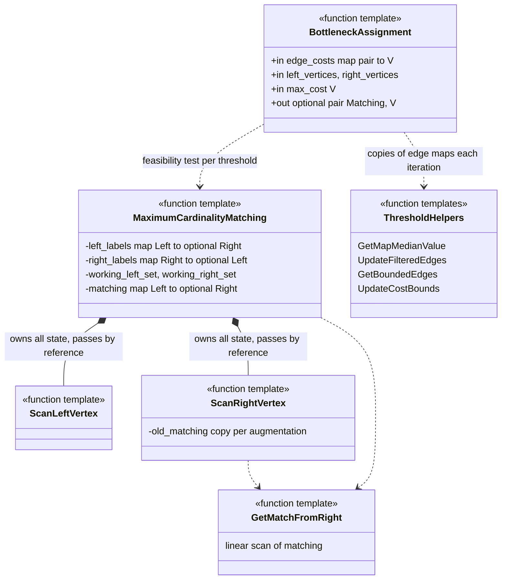
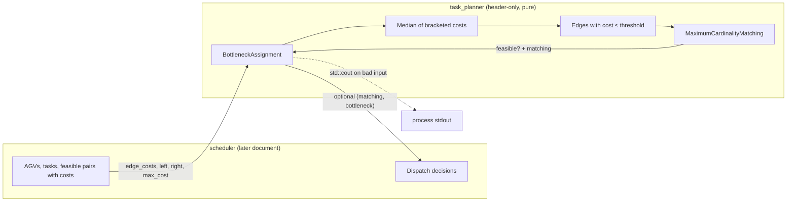
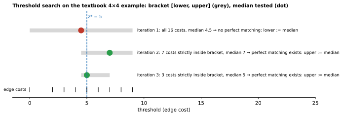
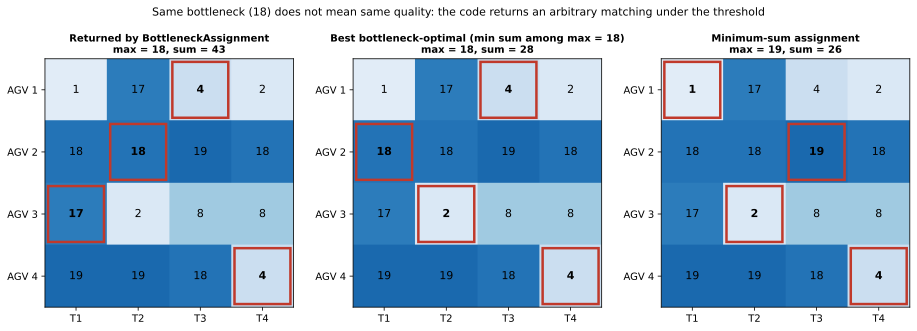

# 09 — `task_planner`

| Generated | Revision | Source pack | Status |
|---|---|---|---|
| 2026-10-07 | 2 | `P09-task_planner-part1of1.md` | Draft, generated by Claude, not yet reviewed by the team |

Package 9 of 37 (bottom-up) · dependency depth 0

Workspace dependencies: none.
Used by: scheduler.

Related documents:
- `03-stdx.md`: `Expected`, relevant to the error-reporting gap;
- `05-structures.md`: other algorithm building blocks.

**How to read the evidence markers.**
- **[read]** means the conclusion comes from reading the source.
- **[probed]** means it was confirmed by compiling and running code: g++ 13.3, C++20, Ubuntu 24.04, with Boost for the package's own tests. All 11 package tests pass. In addition:
  - `BottleneckAssignment` and `MaximumCardinalityMatching` were compared with a brute-force solver on 28,583 random bipartite graphs with up to 5 + 5 vertices;
  - `GetMapMedianValue` was checked on 20,000 random inputs;
  - run times were measured on complete graphs.

---

## A. External dependencies

`task_planner` is a single header-only C++ file with no runtime dependencies beyond the standard library. It has no ROS (Robot Operating System) code. Boost is used only by the tests, to build a hash function for edge keys.

| Name | Description | Version | Link | Usage in this package |
|---|---|---|---|---|
| C++ standard library | `<unordered_map>`, `<unordered_set>`, `<optional>`, `<algorithm>` (`nth_element`, `min_element`). | C++17 or later; the workspace builds as C++20. | https://en.cppreference.com | All data structures and the median. |
| Boost (`boost/functional/hash.hpp`) | C++ utility libraries; here `hash_combine`. | Not pinned (`libboost-dev`, test only); the probes used Ubuntu 24.04's Boost. | https://www.boost.org/doc/libs/release/libs/container_hash/ | The tests' `std::hash<std::pair<int, std::string>>` specialization. |
| GoogleTest (ament_cmake_gtest) | Unit tests. | Not pinned. | https://github.com/google/googletest | `assignment_tests`. |
| `volley_cmake` | Workspace CMake helpers. | Internal. | Not in pack. | Package setup and the gtest target. There is no library target, because the package is header-only. |
| Reference text | R. Burkard, M. Dell'Amico, S. Martello, *Assignment Problems* (SIAM, the Society for Industrial and Applied Mathematics). | Algorithms 3.1 (p. 38) and 6.1 (p. 175). | https://doi.org/10.1137/1.9781611972238 | The code follows both algorithms and quotes their pseudocode. |

---

## B. Glossary

| Term | Meaning | Where it shows up |
|---|---|---|
| Bipartite graph | A graph with two vertex sets ("left" and "right") whose edges only connect left to right. | `left_vertices`, `right_vertices`, `edge_costs` |
| Matching | A set of edges with no shared vertex: each left vertex is paired with at most one right vertex, and vice versa. | Return type `unordered_map<Left, optional<Right>>` |
| Perfect matching (as defined here) | Every vertex of the *smaller* side is matched. The textbook definition requires equal sides; the code generalizes it. | `MaximumCardinalityMatching` |
| Maximum cardinality matching | A matching with as many edges as possible. | Algorithm 3.1 |
| Alternating / augmenting path | A path whose edges alternate between unmatched and matched. If it starts and ends at unmatched vertices, flipping every edge on it grows the matching by one. | `ScanRightVertex` |
| Labeling | Breadth-first bookkeeping: each reached vertex records the vertex it was reached from, so an augmenting path can be traced back. | `left_labels`, `right_labels` |
| Symmetric difference $M \oplus P$ | The edges in exactly one of $M$ and $P$. Applying it with an augmenting path flips that path. | Augmentation |
| LBAP | Linear Bottleneck Assignment Problem: choose a perfect matching that minimizes the **largest** edge cost used. | `BottleneckAssignment` |
| LSAP / Hungarian algorithm | Linear Sum Assignment Problem (minimize the **total** cost) and its classic solver. Not implemented here; used for comparison. | Section 7, Figure 7.2 |
| Threshold algorithm | Solves the LBAP by binary search over cost values, testing at each step whether a perfect matching exists using only edges at or below a threshold. | Algorithm 6.1 |
| Bottleneck value $z^{\star}$ | The optimal largest cost. | Returned `.second` |
| `nth_element` | Partial sort that places the *n*-th smallest element at position *n*, in linear time on average. | `GetMapMedianValue` |

---

## 1. Summary

`task_planner` provides the assignment algorithms the `scheduler` uses to pair two sets: given left vertices, right vertices and a cost for each allowed pair, it finds a one-to-one pairing. Judging by the test data, the sets are most likely AGVs (Automated Guided Vehicles) and tasks such as `"move to 1214"`, and the cost is probably travel time or distance *(inferred)*.

It exposes two levels:
- **`MaximumCardinalityMatching`** answers "can every vertex of the smaller side be paired, using only these edges?" (Burkard et al., Algorithm 3.1).
- **`BottleneckAssignment`** finds the pairing whose **worst** single cost is as small as possible (Algorithm 6.1). It works by binary-searching a cost threshold and calling the matching test at each step.

Optimizing the worst cost rather than the total suits fleet scheduling when the goal is "finish the slowest job as early as possible" (makespan): no vehicle is sent on a very long trip just to save time elsewhere.

**Correctness.** The implementation is faithful to the textbook and, within its own input conventions, exactly correct. Against brute force, every bottleneck value agreed and every returned matching was valid, *except* in one situation: a left vertex with no edges is silently left out, and the function reports success anyway (R1).

**Things callers need to know:**
- the returned matching is only guaranteed to respect the bottleneck. All its other costs can be far from the best possible (R2, Figure 7.2);
- a sentinel argument, `max_cost`, silently produces wrong answers if set too low (R3);
- three different failures all come back as an empty `std::optional`, and one of them also prints to standard output (R4).

---

## 2. Files

The package has four files: one header with all the code, one test file, and two build files. Line counts are from the pack, which has blank lines removed.

Numbering note: the pack's instruction says "package 8" and asks for `08-task_planner.md`; this series continues at 09.

| Path (under `src/planner/task_planner/`) | Lines | Role |
|---|---:|---|
| `include/task_planner/assignment.hpp` | 456 | `GetMapMedianValue`; the matching algorithm (`GetMatchFromRight`, `ScanLeftVertex`, `ScanRightVertex`, `MaximumCardinalityMatching`); the threshold algorithm (`UpdateCostBounds`, `UpdateFilteredEdges`, `GetBoundedEdges`, `BottleneckAssignment`). About 40 % of the file is comments and quoted pseudocode. |
| `test/assignment_tests.cpp` | 493 | Eleven tests: helpers, scan steps, matching successes and failures, the textbook examples, and a regression test for the final fallback. |
| `CMakeLists.txt` | 13 | No library target (header-only); finds Boost and adds the gtest when testing. |
| `package.xml` | 15 | No runtime dependencies; test-depends on ament_cmake_gtest and libboost-dev. |

---

## 3. Public API

The API (Application Programming Interface) is a set of free function templates in namespace `volley`, in `task_planner/assignment.hpp`. They are templated on:
- `LeftVertex` and `RightVertex`, any hashable and equality-comparable types (the tests use `int` and `std::string`);
- `V`, the cost type, which must be ordered and support `+` and `/` for the median.

All inputs and outputs use standard containers:

| Role | Type |
|---|---|
| Edges with costs | `std::unordered_map<std::pair<Left, Right>, V>` (caller must provide `std::hash<std::pair<Left, Right>>`, R5) |
| Vertex sets | `std::vector<Left>`, `std::vector<Right>` |
| Matching | `std::unordered_map<Left, std::optional<Right>>`: a key for each left vertex considered; `nullopt` means unmatched |

### 3.1 `BottleneckAssignment(edge_costs, left_vertices, right_vertices, max_cost)`

**Purpose.** This is the entry point the scheduler is meant to call. It returns `std::optional<std::pair<Matching, V>>`: a perfect matching that minimizes the largest edge cost used, together with that optimal cost (the bottleneck value).

**Algorithm.** Algorithm 6.1 (section 7.2, Figure 7.1):
1. Start with the bracket `[lower, upper]` = `[min cost, max cost]`.
2. Repeatedly take the median of the edge costs strictly inside the bracket. (The first round uses all costs.)
3. Keep only the edges whose cost is at or below the median, and ask `MaximumCardinalityMatching` whether a perfect matching exists.
4. If one exists, set `upper` to the median; otherwise set `lower` to the median.
5. Repeat until no cost lies strictly inside the bracket.
6. Test `lower` once more (it may never have been tried).
7. If no threshold succeeded, test the full edge set, which is the threshold at the maximum cost.

The code comment calls step 7 "probably a bug in the binary search". It is not: it is the textbook's own final step, `FindPerfectMatching(G[c_upper])`. The search never tests `upper` itself, because the bracket is open (R6).

**Contract.**

| Situation | Result |
|---|---|
| Normal | `{matching, z*}`, where `z*` equals the brute-force optimum **[probed]**. |
| No edges at all | `nullopt` |
| An edge mentions a vertex missing from the vertex lists | `nullopt`. For a left vertex, it also prints "Left vertex in edge costs not in left_vertices" to `std::cout` (R4). |
| No perfect matching at any threshold | `nullopt` |
| A left vertex with **no edges** | It is **ignored**, and the result can be a "success" that omits it (R1, **[probed]**). |
| `max_cost` ≤ the optimal value | **Wrong result**: the worst threshold is returned (R3, **[probed]**). |

**Usage.**

```cpp
struct PairHash {  // prefer a named hasher over specializing std::hash (R5)
  size_t operator()(const std::pair<AgvId, TaskId>& e) const { /* combine hashes */ }
};
// Today the API requires std::hash<std::pair<…>>; see open question 4.
std::unordered_map<std::pair<AgvId, TaskId>, double> cost;   // only feasible pairs
for (auto& a : agvs) for (auto& t : tasks) if (auto c = TravelTime(a, t)) cost[{a, t}] = *c;

auto result = volley::BottleneckAssignment(cost, agv_ids, task_ids,
                                           std::numeric_limits<double>::infinity());  // R3
if (!result) { /* infeasible, bad input, or no edges: cannot tell which (R4) */ }
auto& [matching, worst_cost] = *result;
for (auto& id : agv_ids) {
  if (!matching.contains(id)) { /* AGV had no feasible task: silently dropped (R1) */ }
}
```

`AgvId`, `TaskId` and `TravelTime` are illustrative.

### 3.2 `MaximumCardinalityMatching(left_vertices, right_vertices, edge_costs)`

**Purpose.** Decide whether a perfect matching exists using the given edges (their costs are ignored), and return one if it does. This is the feasibility test inside the threshold search, but it can also be called on its own.

**Algorithm.** Algorithm 3.1, a labeling method (section 7.1):
1. **Greedy start.** Walk the edges in map order and pair any two still-free vertices.
2. **Repeat** while a working set is non-empty:
   - scanning a left vertex labels all its unlabeled right neighbors;
   - scanning a right vertex either relabels its matched left partner, or, if it is free, **augments**: it follows the labels back along an alternating path and flips every edge on it, then clears all labels.
3. **Check the result** at the end: every vertex of the smaller side must be matched.

**Contract.**
- It returns the matching, with a key for every left vertex, or `nullopt` if the smaller side cannot be fully matched or an edge mentions an unknown vertex.
- With an empty side it trivially succeeds.
- It agreed with brute-force feasibility on every probe case **[probed]**.

### 3.3 Building blocks (public, used by the tests)

| Function | Role |
|---|---|
| `GetMapMedianValue(map)` | Median of a map's values; for an even count, the mean of the two middle values; `nullopt` if empty. |
| `GetMatchFromRight(right, matching)` | Reverse lookup by linear scan: the left partner of `right`, if any. |
| `ScanLeftVertex(...)`, `ScanRightVertex(...)` | The two steps of Algorithm 3.1. They mutate the label maps, working sets and matching passed by reference. |
| `UpdateCostBounds(median, lower, upper, feasible)` | The bracket update. |
| `UpdateFilteredEdges(edges, threshold)` | The edges with cost ≤ threshold, as a new map. |
| `GetBoundedEdges(edges, lower, upper)` | The edges with lower < cost < upper, as a new map. |

These are exposed mainly so that they can be unit-tested step by step. They are not intended for the scheduler.

---

## 4. Diagrams

### 4a. Class diagram (ownership on edges)

There are no classes, only function templates operating on standard containers. The diagram shows the call structure (as utility "classes") and the data each function owns or borrows. Everything is passed by value or by reference within a single call; nothing persists between calls.



### 4b. Data flow

The package has no I/O of any kind: no topics, services, actions, timers, parameters, threads, MQTT (Message Queuing Telemetry Transport), database or hardware. It makes no calls into lower-layer workspace packages. The only side effect is one `std::cout` line on a malformed input (R4).

The flow below shows the computation as the scheduler is expected to use it *(the scheduler side is inferred; the scheduler is documented later)*.



### 4c. State machines

No state machine.

---

## 5. Behavior

**Construction, steady state, shutdown.** These do not apply. Every function is a pure computation over its arguments: it allocates working containers, returns a result, and keeps no state between calls. Calls are re-entrant, and thread-safe as long as callers do not share mutable arguments.

**Executors, callback groups, threads, timers, parameters.** None. In the scheduler, the call runs synchronously in whichever callback invokes it.

**Cost.** Run time depends on the number of left vertices $n_L$, right vertices $n_R$ and edges $m$:
- `MaximumCardinalityMatching` performs at most $\min(n_L, n_R)$ augmentations. Each phase scans edges, and the reverse lookups (`GetMatchFromRight`) are linear scans, giving roughly $O(n^3)$ per call on a complete graph.
- `BottleneckAssignment` calls it about $\log_2 m$ times, and copies edge maps on every iteration.

Measured on complete $n\times n$ graphs with random costs **[probed]**:

| $n$ | 10 | 20 | 40 | 80 |
|---|---|---|---|---|
| Time | 0.2 ms | 0.7 ms | 3.9 ms | 12.7 ms |

This is comfortably fast for garage-scale fleets.

**Determinism.** The greedy initial matching, the working-set choices and therefore *which* optimal matching is returned all depend on `unordered_map` / `unordered_set` iteration order. That order is a function of the hash, the insertion order and the standard-library implementation. The bottleneck *value* is always the same, but the specific pairing can differ between builds or platforms (R2).

---

## 6. Ownership and safety

### 6.1 Lifetimes

All inputs are taken by `const&` and copied where needed. All results are returned by value. No references or pointers escape. The matching contains copies of the vertex values.

### 6.2 Callbacks capturing `this`

Not applicable.

### 6.3 Locks and atomics

None needed, since there is no shared state.

### 6.4 Error handling

| Style | Where |
|---|---|
| `std::optional` | Every failure of `BottleneckAssignment` and `MaximumCardinalityMatching`, and an empty map in `GetMapMedianValue`. Distinct causes cannot be distinguished; the code itself has a `TODO` about this (R4). |
| `std::cout` | One diagnostic in `BottleneckAssignment` (a left vertex in the edges but not in the vertex list). |
| Sentinel argument | `max_cost` stands for "no threshold found yet", and must exceed every edge cost (R3). |
| Exceptions / asserts | None. `.value()` calls are guarded by invariants that the comments explain. |

### 6.5 RISK items

| Item | Risk | Evidence |
|---|---|---|
| R1 | **Left vertices with no edges are silently dropped.** `BottleneckAssignment` builds its working left set from the left vertices that *appear in the edges* (`seen_left_vertices`), not from `left_vertices`. A left vertex with no feasible pair (for example an AGV that can reach no task) is excluded, the "perfect" test is applied to the rest, and the result can be a success that does not even contain that vertex as a key. `MaximumCardinalityMatching` called directly on the same input would return `nullopt`. All 1,785 disagreements with brute force in the fuzz run (out of 28,583 graphs) were of exactly this kind; with no edgeless left vertex, the results matched perfectly. | **[probed]** |
| R2 | **Only the bottleneck is optimized.** Any matching whose largest cost is at most $z^{\star}$ may be returned. In Figure 7.2 the code returns a matching with total cost 43, although another matching with the same bottleneck costs 28. Which matching is returned depends on hash-container iteration order, so it may change between builds. | **[probed]** |
| R3 | **The `max_cost` sentinel must exceed the optimum.** If it is at or below the optimal bottleneck, the loop never records a "better" threshold, and the fallback returns the **largest** edge cost as the answer. On the textbook example, `max_cost = 5` (the optimum) or `4` returned 9 instead of 5. Only a comment states the requirement. | **[probed]** |
| R4 | **One failure value for three different situations.** "No edges", "inconsistent input" and "no feasible assignment" all return `nullopt`, so the scheduler cannot tell a programming error from an infeasible plan. One of them also writes to `std::cout` from library code, bypassing ROS logging. | **[read]** |
| R5 | **Callers must specialize `std::hash`.** The API requires `std::hash<std::pair<Left, Right>>`. The tests specialize it for `std::pair<int, std::string>`; the standard allows `std` specializations only for program-defined types, so this is technically undefined behavior. Two packages that specialize it differently violate the one-definition rule. A hasher template parameter would remove the need. | **[read]** |
| R6 | **A misleading comment.** The final full-graph check is described as a workaround for "probably a bug in the binary search". It is the textbook's final step, and it is required because the bracket is open at `upper`. The comment invites risky "fixes" to code that is correct. | **[probed]**: the values match brute force |
| R7 | **The median relies on unspecified behavior.** For even counts, it calls `nth_element` twice and reads position $n/2$ after the second call. The standard does not guarantee that position is still the $n/2$-th smallest. It was correct in 20,000 random trials with libstdc++, and the search stays correct even with an imprecise pivot; only the number of iterations would suffer. | **[probed]** |
| R8 | **Copy-heavy implementation.** Every iteration builds two new edge maps, and every augmentation copies the whole matching (`old_matching`). Fine at fleet scale (12.7 ms at 80 × 80), but quadratic memory traffic for large inputs. | **[probed]** timings |
| R9 | **Header hygiene and input validation.** `<iostream>` is included in a public header. `std::tie` is used without `<tuple>`. Duplicate vertices in the input vectors are not detected. | **[read]** |

---

## 7. Math

This package is mostly mathematics. The two problems and their algorithms are stated below, with how the code realizes each step and where its behavior departs from the textbook.

### 7.1 Maximum cardinality matching (Algorithm 3.1)

The bipartite graph is $G=(U\cup V, E)$, with left vertices $U$ and right vertices $V$. A matching $M\subseteq E$ is a set of edges in which no two share a vertex. Here it is called **perfect** if every vertex of the smaller side is covered:

$$
|M| = \min(|U|,|V|).
$$

**Augmenting paths.** An alternating path $P=(u_0,v_0,u_1,v_1,\dots,u_k,v_k)$ starts at an unmatched $u_0$, ends at an unmatched $v_k$, and uses edges that are alternately outside $M$ ($u_i v_i$) and inside it ($v_i u_{i+1}$). It has one more non-matching edge than matching edges, so the symmetric difference

$$
M' = M \oplus P = (M\setminus P)\cup(P\setminus M),\qquad |M'| = |M|+1
$$

is again a matching, one edge larger. By Berge's theorem, $M$ is maximum if and only if no augmenting path exists.

**How the code finds and applies them.** The labels `right_labels[v] = u` and `left_labels[u] = v` record a breadth-first search from all unmatched left vertices at once. `ScanRightVertex` either:
- relabels the left partner of a matched $v$ and continues the search; or
- if $v$ is free, walks the labels back to an unmatched $u_0$ and flips the edges along the way.

There are at most $\min(|U|,|V|)$ augmentations, each followed by a full label reset.

### 7.2 Linear bottleneck assignment (Algorithm 6.1)

Given costs $c_{uv}$ on the edges, the LBAP asks for

$$
z^{\star} = \min_{M \text{ perfect}}\ \max_{(u,v)\in M} c_{uv}.
$$

Define the threshold graph $G[t] = (U\cup V,\ \{(u,v)\in E: c_{uv}\le t\})$. Feasibility is monotone in $t$: if $G[t]$ has a perfect matching, so does $G[t']$ for every $t'\ge t$. Therefore $z^{\star}$ is the smallest edge cost $t$ for which $G[t]$ has a perfect matching, and a binary search over the sorted costs finds it with $O(\log m)$ feasibility tests.

**The code's search keeps an invariant:**
- `lower` is infeasible, or is the original minimum and has not yet been tested;
- `upper` is feasible, or is the original maximum and has not yet been tested.

Each step tests the median $t$ of the costs strictly inside $(\text{lower}, \text{upper})$ and moves one end of the bracket:

$$
(\text{lower},\text{upper}) \leftarrow \begin{cases}(\text{lower},\, t) & G[t]\ \text{has a perfect matching}\\ (t,\,\text{upper}) & \text{otherwise}\end{cases}
$$

When no cost lies strictly inside the bracket, $z^{\star}$ is either `lower` (if it was never tested and turns out feasible) or `upper`. These are exactly the two checks after the loop. For an even number of costs, the median is the mean of the two middle values, which need not be an edge cost (4.5 in the textbook example). That is harmless: it still lies strictly inside the bracket, and every step removes at least one cost from it.

With the probes:
- every computed $z^{\star}$ matched brute force over all permutations whenever every left vertex had at least one edge;
- every returned matching was valid, with all its edges at or below $z^{\star}$ **[probed]**.



*Figure 7.1 — The search on the textbook 4 × 4 example (also a test case). The bracket shrinks from [0, 9] to [4.5, 5] in three feasibility tests, and returns $z^{\star}$ = 5.*

### 7.3 Bottleneck versus total cost

The LBAP optimizes only the worst entry. Among the matchings that achieve $z^{\star}$, the code returns whichever one the last successful feasibility test produced. Nothing considers the other costs, so the returned matching can be much worse in total than necessary.

A lexicographic refinement would fix this without changing the bottleneck. It solves the sum problem (LSAP) restricted to the threshold graph:

$$
\min_{M \text{ perfect in } G[z^{\star}]} \ \sum_{(u,v)\in M} c_{uv}.
$$

This is one Hungarian-algorithm run, $O(n^3)$, on the edges with cost $\le z^{\star}$.



*Figure 7.2 — Left: the matching `BottleneckAssignment` actually returns for this matrix (maximum 18, total 43). Middle: the best matching with the same maximum of 18 (total 28). Right: the minimum-total assignment (total 26, but maximum 19). The matrix was chosen to make the difference visible. The left panel was computed by running the C++ code.*

---

## 8. Tests

There are 11 tests in one executable, and all pass **[probed]**. The suite is unusually thorough at the step level: it checks the internal state of `ScanLeftVertex` and `ScanRightVertex` (labels, working sets, matching) after hand-constructed situations. This documents the algorithm's mechanics well.

| Test | Covers | What it reveals about intended behavior |
|---|---|---|
| `UpdateCostBounds`, `Median`, `GetMatchFromRight`, `UpdateFilteredEdges`, `GetBoundedEdges` | Helpers, including odd and even medians and empty maps. | A threshold equal to a cost keeps that edge (≤); the bracket is open at both ends (<). |
| `ScanLeftVertex`, `ScanRightVertex` | Labeling, matching a free right vertex, re-labeling through a matched one, and an augmentation that completes a perfect matching. | The step functions are meant to be usable on their own, mirroring the textbook pseudocode. |
| `MaximumCardinalityMatchingFails` / `…Succeeds` | Two left vertices competing for one right vertex; trivial cases; unequal sides; empty sides; the textbook 5 × 5 example (p. 39). | "Perfect" means the smaller side is fully matched; an empty side trivially succeeds. |
| `BottleneckAssignment` | A 2 × 2 case and the textbook 4 × 4 example ($z^{\star}$ = 5). | Returns the threshold together with the matching. |
| `BottleneckAssignmentMustUseMaxCost` | The case where the optimum is the largest cost, with task names such as `"move to 1214"`. | A regression test for the final full-graph check. It confirms that this check is needed (R6); the vertex names suggest left = vehicles, right = moves. |

**Gaps.**
- **No test with a left vertex that has no edges** (R1), and **none with `max_cost` at or below the optimum** (R3).
- **No randomized comparison against brute force.** This document's fuzz harness, about 60 lines, would protect future changes to the search.
- **No test of determinism**, or of which optimal matching is returned (R2). No test with integer costs, where the median truncates, or with duplicate costs.
- **No performance test**, which would catch regressions from the copy-heavy implementation (R8).

---

## 9. Idioms to reuse, and open questions

### 9.1 Idioms

- **Quote the reference algorithm next to the code.** The header reproduces the textbook pseudocode and maps every variable to it (`L`, `R`, `l`, `r`). Correctness reviews become comparisons, and the probes found the implementation faithful.
- **Expose algorithm steps for testing.** Making the scan steps and bracket helpers public functions allows tests to check intermediate states, not just final answers.
- **Pure, header-only algorithm packages:** no state, no I/O, value inputs and outputs. They are trivially thread-safe and easy to fuzz.
- **Encode feasibility as edge presence.** Callers leave infeasible pairs out of `edge_costs` instead of giving them a large cost. That keeps the threshold search exact, but it is also how R1 arises when a vertex ends up with no edges at all.
- **Prefer `std::optional` or `stdx::Expected` over sentinels** such as `max_cost` for "nothing found yet" (R3), and over printing for diagnostics (R4).

### 9.2 Open questions for the team

1. **Is dropping edgeless left vertices intended (R1)?** For example: "an AGV that can reach nothing is simply not assigned". If so, should the result say so explicitly, for example by including that vertex with `nullopt`? And should `MaximumCardinalityMatching` behave the same way?
2. Should the scheduler get a secondary objective, a minimum-sum assignment among bottleneck-optimal ones (section 7.3), and a deterministic tie-break so that plans are reproducible (R2)?
3. Can `max_cost` be removed (use `std::optional` for the best threshold), or at least default to infinity (R3)? Should failures return `stdx::Expected` with distinct messages instead of `nullopt` plus `std::cout` (R4)?
4. Should the API take a hasher template parameter (or use `boost::hash`) so callers do not specialize `std::hash` for standard types (R5)?
5. Can the "probably a bug" comment be replaced with the textbook explanation (R6)?
6. What do the left and right sets and the costs represent in the scheduler (AGVs and moves? travel time?), and how large can they get?
7. **Numbering.** The pack's instruction says package 8 / `08-task_planner.md`; this series uses 09.
