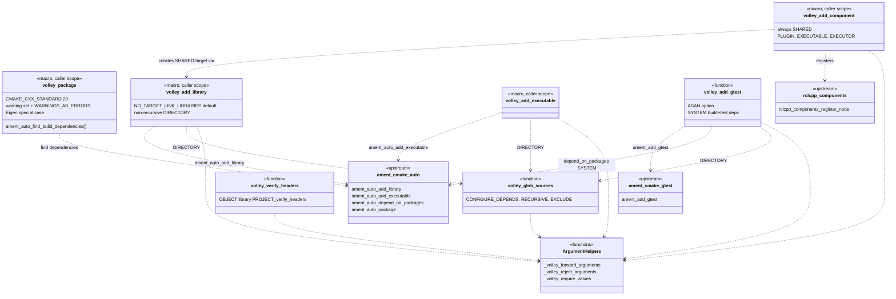
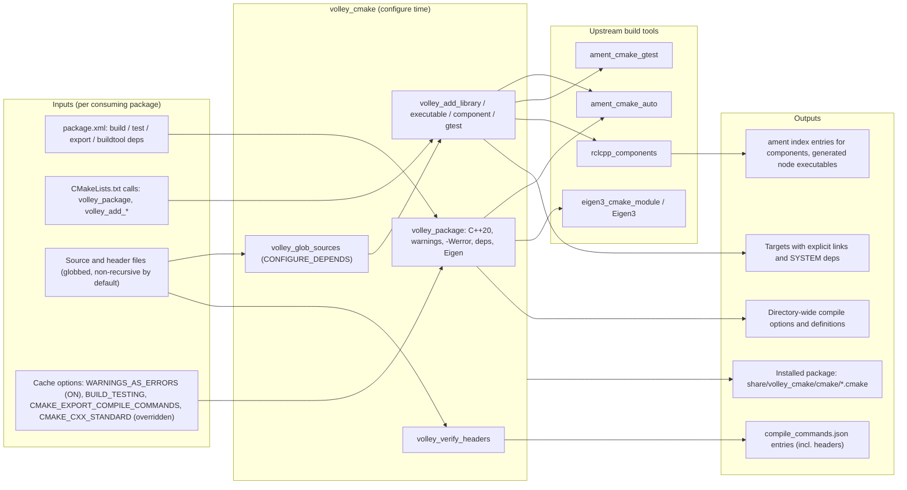

# 10 — `volley_cmake`

| Generated | Revision | Source pack | Status |
|---|---|---|---|
| 2026-10-07 | 3 | `P10-volley_cmake-part1of1.md` | Draft, generated by Claude, not yet reviewed by the team |

Package 10 of 37 (bottom-up) · dependency depth 0

**Abbreviations used in this document.** Each is also explained in context where it first matters.

| Abbreviation | Meaning |
|---|---|
| API | Application Programming Interface |
| ASan | AddressSanitizer (compiler memory-error checker) |
| CMake (`cmake` in names) | Cross-platform Make (build-system generator) |
| GCC | GNU Compiler Collection |
| GNU | GNU's Not Unix (the free-software project behind GCC) |
| `gtest` | GoogleTest |
| JSON (`json` in names) | JavaScript Object Notation |
| MQTT (`mqtt` in names) | Message Queuing Telemetry Transport |
| OpenSSF | Open Source Security Foundation |
| RC | resistor-capacitor (filter) |
| `rclcpp` | ROS Client Library for C++ |
| ROS | Robot Operating System |
| `rosidl` | ROS Interface Definition Language (code-generation tooling) |
| `stdx` | "standard library extensions" (Volley package) |
| UBSan | UndefinedBehaviorSanitizer (compiler checker) |

Workspace dependencies: none.
Used by: listed as "nothing (leaf)" in the task, but in practice **every package documented so far** declares `<buildtool_depend>volley_cmake</buildtool_depend>` and calls its macros. The dependency listing probably ignores build-tool dependencies.

The task mentions two attached repository documents, `volley-cmake.md` and `cpp-style.md`. **They were not included in the upload**, so this document is based on the code alone and could not be reconciled with them (open question 1).

**How to read the evidence markers.**
- **[read]** means the conclusion comes from reading the CMake code.
- **[probed]** means it was confirmed by running the package's CMake scripts with CMake 4.4 against a stub project in which the ament functions were replaced by minimal stand-ins, or by compiling earlier packages' sources with the exact warning flags set here (g++ 13.3).
- **[upstream]** means it was confirmed in the `ament_cmake_auto` sources (kilted and rolling branches, which are identical for the files used).

---

## A. External dependencies

`volley_cmake` is the workspace's build convention layer. It contains no C++ at all, only CMake macros. It sits on top of **ament_cmake_auto** from ROS 2 (Robot Operating System 2), which reads a package's `package.xml` and turns the declared dependencies into `find_package` calls and target links.

| Name | Description | Version | Link | Usage in this package |
|---|---|---|---|---|
| CMake | Build-system generator. | ≥ 3.28 (`cmake_minimum_required`); the probes used 4.4. | https://cmake.org/cmake/help/latest/ | `cmake_parse_arguments` (including `KEYWORDS_MISSING_VALUES`), `file(GLOB … CONFIGURE_DEPENDS)`, `CMAKE_COMPILE_WARNING_AS_ERROR` (CMake ≥ 3.24), `CMAKE_CXX_SCAN_FOR_MODULES`. |
| ament_cmake_auto | ament helpers that derive dependencies from `package.xml`. | Same ROS 2 distribution (Kilted or newer, see document 02). | https://github.com/ament/ament_cmake/tree/rolling/ament_cmake_auto | `ament_auto_find_build_dependencies`, `ament_auto_find_test_dependencies`, `ament_auto_add_library`, `ament_auto_add_executable`, `ament_auto_depend_on_packages`, `ament_auto_package`. Declared as build-tool and build-tool-export dependency. |
| ament_cmake_gtest | GoogleTest integration. | Same. | https://github.com/ament/ament_cmake | `ament_add_gtest`, found lazily inside `volley_add_gtest`. |
| rclcpp_components | Registers composable nodes (ROS 2 node classes built as shared libraries and loaded at runtime). | Same. | https://github.com/ros2/rclcpp/tree/rolling/rclcpp_components | `rclcpp_components_register_node`, called by `volley_add_component`. Not declared in `package.xml`; the calling package must depend on it. |
| eigen3_cmake_module / Eigen3 | Finds the Eigen linear-algebra library. | Same; Eigen 3.4 likely. | https://github.com/ros2/eigen3_cmake_module | Special-cased in `volley_package()`, because the `eigen` rosdep key is not a CMake package name. Declared as build-tool and build-tool-export dependency. |
| Compiler guidance | The OpenSSF (Open Source Security Foundation) Compiler Options Hardening Guide and the cpp-best-practices guide. | — | https://best.openssf.org/Compiler-Hardening-Guides/Compiler-Options-Hardening-Guide-for-C-and-C++.html | The source of the warning set in `volley_package()`. |

---

## B. Glossary

| Term | Meaning | Where it shows up |
|---|---|---|
| ament / ament_cmake | ROS 2's build system layer on top of CMake. | Everything |
| ament_cmake_auto | ament helpers that read `package.xml` and automatically find and link the declared dependencies. | Wrapped by every `volley_*` macro |
| `package.xml` dependency kinds | `build_depend` (needed to compile), `build_export_depend` (needed by consumers' builds), `test_depend`, `buildtool_depend` (tools used to build, such as `volley_cmake` itself). | `${PROJECT_NAME}_BUILD_DEPENDS` and friends |
| rosdep key | The name used in `package.xml` to refer to a system dependency (for example `eigen`, `libboost-dev`). It may differ from the CMake package name. | Eigen special case |
| CMake macro vs function | A *function* has its own variable scope. A *macro* is textually substituted into the caller, so its variables (and `return()`) act in the caller's scope. | R3 |
| `cmake_parse_arguments` | Built-in CMake parser for keyword arguments: options (flags), one-value keywords and multi-value keywords. Whatever it does not recognize ends up in `UNPARSED_ARGUMENTS`. | `_volley_*` helpers |
| `CONFIGURE_DEPENDS` | Flag on `file(GLOB)` that makes the build re-check the glob, so new or removed source files trigger a re-configure. | `volley_glob_sources`, `volley_verify_headers` |
| Composable node (component) | A ROS 2 node class compiled into a shared library, registered by name, and loadable into a container process; an executable wrapper can also be generated. | `volley_add_component` |
| Executor | rclcpp object that runs node callbacks (single- or multi-threaded). | `EXECUTOR` argument |
| `SYSTEM` include directory | An include path from which the compiler suppresses warnings, so third-party headers do not trip `-Werror`. | `include_directories(SYSTEM …)`, `ament_auto_depend_on_packages(... SYSTEM ...)` |
| `-Werror` / `CMAKE_COMPILE_WARNING_AS_ERROR` | Turn every compiler warning into an error. | `WARNINGS_AS_ERRORS` option |
| ASan / UBSan | AddressSanitizer / UndefinedBehaviorSanitizer: compiler run-time checkers for memory errors and undefined behavior. | `volley_add_gtest(... ASAN)` |
| `compile_commands.json` | Per-file compiler command database used by tools such as clang-tidy and the clangd language server. | `volley_verify_headers`, `CMAKE_EXPORT_COMPILE_COMMANDS` |
| C++20 modules scanning | CMake's dependency scanning for C++20 modules. It adds build time and flags that some tools cannot parse. | `CMAKE_CXX_SCAN_FOR_MODULES OFF` |

---

## 1. Summary

`volley_cmake` defines *how every Volley package is built*. Calling `volley_package()` applies the workspace-wide settings:
- C++20, enforced;
- a hardened warning set, with warnings treated as errors by default;
- automatic discovery of the dependencies declared in `package.xml`, plus a fix for Eigen.

The package's other macros replace the ament equivalents with stricter versions:
- **`volley_add_library`, `volley_add_executable`, `volley_add_component`, `volley_add_gtest`** link **only** what they are told (instead of ament's link-everything default), and glob source directories **non-recursively**, re-checking the glob at build time;
- **`volley_glob_sources`** and **`volley_verify_headers`** support those wrappers and clang tooling.

The wrappers also fail loudly on argument mistakes that plain `cmake_parse_arguments` would let slip through.

**Answers to questions from earlier documents.** This package resolves several open questions raised in documents 01–09:
- **The workspace is C++20**, and it is enforced. A package that requests another standard is overridden with a warning **[probed]**. This confirms the inferences made for designated initializers and `std::format`.
- **ROS include paths "appear from nowhere"** (document 01, question 9) because `ament_auto_find_build_dependencies()` finds every `package.xml` build dependency, and `ament_auto_add_library` attaches them to each target.
- **Paho (document 07) and OpenTelemetry (document 08) need an explicit `find_package`**, because they are not in `package.xml`, which is the only source ament_cmake_auto reads.
- **`structures` tests compile sources directly** (document 05, R12) because `volley_add_gtest` links nothing unless asked (`AUTO_LINK_LIBRARIES`).
- **The earlier packages compile cleanly under exactly this warning set** **[probed]** (section 8). That is evidence they are built with it in practice.

**Where the conventions bite.** "Non-recursive by default" differs from ament's recursive glob. Combined with no way to pass `RECURSIVE` through the `volley_add_*` macros, sources in subdirectories are **silently left out** of a target (R1, **[probed]**).

---

## 2. Files

The package has 12 files: nine CMake modules, an "extras" file that loads them into every consumer, and two build files. It has no tests. Line counts are from the pack, which has blank lines removed.

Numbering note: the pack's instruction says "package 9" and asks for `09-volley_cmake.md`; this series continues at 10.

| Path (under `src/infrastructure/volley_cmake/`) | Lines | Role |
|---|---:|---|
| `cmake/volley_package.cmake` | 89 | `volley_package()`: C++20, warnings, `-Werror` option, Boost define, dependency discovery, Eigen fix. Also sets the global `CXX_STANDARD` variable (20). |
| `cmake/volley_add_library.cmake` | 70 | `volley_add_library()`: wrapper over `ament_auto_add_library` with explicit linking and a non-recursive `DIRECTORY` glob. |
| `cmake/volley_add_executable.cmake` | 63 | `volley_add_executable()`: the same for executables. |
| `cmake/volley_add_component.cmake` | 91 | `volley_add_component()`: shared library plus `rclcpp_components_register_node`. |
| `cmake/volley_add_gtest.cmake` | 90 | `volley_add_gtest()`: gtest with explicit linking, `include/` path, `SYSTEM` dependencies, optional ASan. |
| `cmake/volley_glob_sources.cmake` | 61 | `volley_glob_sources()`: globbing of `.c`/`.cc`/`.cpp`/`.cxx` files, with `CONFIGURE_DEPENDS` and optional `RECURSIVE` / `EXCLUDE`. |
| `cmake/volley_verify_headers.cmake` | 58 | `volley_verify_headers()`: compiles each header on its own in an object library, for self-containment and tooling. |
| `cmake/volley_arguments.cmake` | 60 | Private helpers `_volley_forward_arguments`, `_volley_reject_arguments`, `_volley_require_values`. |
| `cmake/volley_ament_auto_package.cmake` | 6 | `volley_ament_auto_package()`: currently a plain pass-through to `ament_auto_package`. |
| `volley_cmake-extras.cmake` | 9 | Includes all nine modules into any package that calls `find_package(volley_cmake)`. |
| `CMakeLists.txt` | 9 | `project(volley_cmake NONE)`; installs `cmake/` to the package's share directory; registers the extras file. |
| `package.xml` | 16 | Build-tool dependencies (and exports) on `ament_cmake_auto` and `eigen3_cmake_module`. |

---

## 3. Public API

The public macros, which form the package's API (Application Programming Interface), are tagged `@public` in their headers. Each consuming package follows the same skeleton, visible in every `CMakeLists.txt` in documents 01–09:

```cmake
cmake_minimum_required(VERSION 3.28)
project(my_pkg)

find_package(volley_cmake REQUIRED)   # loads every volley_* macro; sets CXX_STANDARD 20
volley_package()                      # flags, warnings, dependencies from package.xml

volley_add_library(${PROJECT_NAME} SHARED DIRECTORY src LINK_LIBRARIES Eigen3::Eigen)
volley_add_executable(my_tool tools/my_tool.cpp LINK_LIBRARIES ${PROJECT_NAME})
if(BUILD_TESTING)
  volley_add_gtest(my_pkg_tests DIRECTORY test LINK_LIBRARIES ${PROJECT_NAME})
endif()

volley_ament_auto_package()
```

### 3.1 `volley_package()` — workspace compiler policy

`volley_package()` is a macro, so its settings land in the calling package's directory scope. It must be called after `project()` and before any target is created. In order, it:

1. **Forces C++20.** It warns if `CMAKE_CXX_STANDARD` was already set to something else **[probed]**, then sets `CMAKE_CXX_STANDARD 20` and `CMAKE_CXX_STANDARD_REQUIRED ON`.
2. **Disables C++20 module scanning.** No package uses modules, scanning wastes build time, and it emits flags clang-tidy cannot parse.
3. **Adds the warning set** to C++ compiles for GCC (GNU Compiler Collection; GNU = GNU's Not Unix) and Clang:

   | Warning | Catches |
   |---|---|
   | `-Wall -Wextra -Wpedantic` | Common defects and non-standard extensions. |
   | `-Wcast-align -Wcast-qual -Wold-style-cast` | Unsafe casts: alignment increases, dropping `const`, C-style casts. |
   | `-Wformat=2` | Format-string defects, including non-literal formats. |
   | `-Wnon-virtual-dtor -Woverloaded-virtual` | Polymorphism mistakes. |
   | `-Wunused-macros` | Macros defined but never used, in the file being compiled. |
   | GCC only: `-Wbidi-chars=any -Wduplicated-branches -Wduplicated-cond -Wimplicit-fallthrough=5 -Wlogical-op` | Hidden Unicode bidirectional characters; copy-paste branches and conditions; unannotated switch fall-through; logical/bitwise mix-ups. |

4. **Makes warnings errors**: `option(WARNINGS_AS_ERRORS … ON)` sets `CMAKE_COMPILE_WARNING_AS_ERROR`. Pass `-DWARNINGS_AS_ERRORS=OFF` to relax.
5. **Defines `BOOST_ALLOW_DEPRECATED_HEADERS`**, to silence Boost deprecation warnings coming from system ROS packages.
6. **References `CMAKE_EXPORT_COMPILE_COMMANDS`**, so that CMake does not report the variable as unused when it is passed on the command line.
7. **Finds dependencies**: `find_package(ament_cmake_auto)`, then `ament_auto_find_build_dependencies()`, and when testing `ament_auto_find_test_dependencies()`.
8. **Handles Eigen.** If `eigen` is a build dependency (or a test dependency, when testing), it finds `eigen3_cmake_module` and `Eigen3`, and exports them if `eigen` is a build-export dependency.
9. **Adds Eigen's include directory as `SYSTEM`** for the whole directory, so Eigen's own warnings do not break `-Werror`. Without `SYSTEM`, `common`'s Eigen-using sources fail this warning set on Eigen's headers (`-Wduplicated-branches`) **[probed]**.

### 3.2 Target wrappers — `volley_add_library`, `volley_add_executable`, `volley_add_component`

**Purpose.** These create targets that link **only what they are told**. Plain `ament_auto_add_library` links every earlier library of the package into every later one, and attaches all build dependencies. Volley's wrappers keep the dependency attachment, but make intra-package linking explicit.

**Shared design.**
- **Linking.** `NO_TARGET_LINK_LIBRARIES` is applied by default. Passing it explicitly is an error ("is the default"). `AUTO_LINK_LIBRARIES` restores ament's behavior, and `LINK_LIBRARIES <targets…>` adds explicit links. For `INTERFACE` libraries, the links are added with the `INTERFACE` keyword.
- **Sources.** `DIRECTORY <dir>` globs that directory **non-recursively** through `volley_glob_sources`, with `CONFIGURE_DEPENDS`. ament's own `DIRECTORY` globs recursively and without `CONFIGURE_DEPENDS` **[upstream]**. Explicit source files can be listed as well.
- **Argument checking.** A keyword given without a value (`DIRECTORY` alone) is a fatal error (`_volley_require_values`) **[probed]**. Plain `cmake_parse_arguments` would quietly treat the next word as a source file.
- **Argument forwarding.** Keywords consumed by the wrapper (`SHARED`, `EXCLUDE_FROM_ALL`, …) are re-emitted *before* the sources, because a multi-value keyword would otherwise swallow them (`_volley_forward_arguments`).
- **Dependencies (inherited from ament).** Build dependencies are attached with `SYSTEM`, except for `INTERFACE` libraries **[upstream]**. Each created library is appended to `${PROJECT_NAME}_LIBRARIES`. That append is why these wrappers are macros: the variable must be set in the caller's scope.

| Macro | Specific behavior |
|---|---|
| `volley_add_library(target [STATIC\|SHARED\|MODULE\|INTERFACE] [EXCLUDE_FROM_ALL] [DIRECTORY d] [AUTO_LINK_LIBRARIES] [LINK_LIBRARIES …] sources…)` | Thin wrapper over `ament_auto_add_library`. Also adds `include/` as a public include directory (by ament). |
| `volley_add_executable(target [WIN32] [MACOSX_BUNDLE] [EXCLUDE_FROM_ALL] [DIRECTORY d] [AUTO_LINK_LIBRARIES] [LINK_LIBRARIES …] sources…)` | Wraps `ament_auto_add_executable`; installed by `ament_auto_package`. |
| `volley_add_component(target PLUGIN <Class> EXECUTABLE <name> [EXECUTOR <Exec>] [RESOURCE_INDEX <idx>] [NO_UNDEFINED_SYMBOLS] [DIRECTORY d] [LINK_LIBRARIES …] sources…)` | Always `SHARED`; rejects `STATIC`, `MODULE`, `INTERFACE` and `AUTO_LINK_LIBRARIES`. Registers the class with `rclcpp_components_register_node`, which also generates an executable that runs it with `EXECUTOR` (default `SingleThreadedExecutor`). `NO_UNDEFINED_SYMBOLS` makes the link fail on unresolved symbols, which is recommended (R1); the macro also includes `CheckCXXCompilerFlag`, working around an rclcpp_components bug. |

### 3.3 `volley_add_gtest(target … [DIRECTORY d] [ASAN] [AUTO_LINK_LIBRARIES] [LINK_LIBRARIES …] [RUNNER|TIMEOUT|WORKING_DIRECTORY|ENV|APPEND_ENV|APPEND_LIBRARY_DIRS …] [SKIP_TEST] [SKIP_LINKING_MAIN_LIBRARIES])`

**Purpose.** Unit tests with the same explicit-linking discipline.

**Design.** A function, not a macro: it uses `return()` when gtest is missing, and it needs no caller-scope side effects. It:
1. finds `ament_cmake_gtest`;
2. creates the test from the listed and globbed sources;
3. adds the package's `include/` directory;
4. links `${PROJECT_NAME}_LIBRARIES` only with `AUTO_LINK_LIBRARIES`, plus any `LINK_LIBRARIES`;
5. attaches all build *and* test dependencies as `SYSTEM`;
6. with `ASAN`, compiles and links the test with `-fsanitize=address`.

The default of linking nothing explains why some packages compile library sources directly into their tests (document 05, R12). That pattern means the library *target* itself goes untested (R9).

### 3.4 `volley_glob_sources(out DIRECTORY d [RECURSIVE] [EXCLUDE regex…])`

This collects `.c`, `.cc`, `.cpp` and `.cxx` files relative to the current source directory, with `CONFIGURE_DEPENDS`. Options:
- **`RECURSIVE`** descends into subdirectories;
- **`EXCLUDE`** removes files whose *relative path* matches a regular expression. Matching is by substring: `"test"` also removes `src/latest.cpp` (R2, **[probed]**).

The function is careful about error messages. It fails with a specific message when:
- the directory is empty;
- the directory is empty except for subdirectories (it suggests `RECURSIVE`);
- `EXCLUDE` removed everything.

The `volley_add_*` macros call it **without** `RECURSIVE` or `EXCLUDE` and offer no way to pass them (R1). Callers that need either should glob first and pass the file list as sources.

### 3.5 `volley_verify_headers(DIRECTORY d [EXCLUDE regex…] [LINK_LIBRARIES …])`

**Purpose.** Compile every header on its own, as if it were a `.cpp` file, in an `OBJECT` library named `${PROJECT_NAME}_verify_headers`. This:
- catches headers that are not self-contained, such as `structures/unique_queue.hpp` missing `<limits>` (document 05, R4c) **[probed in 05]**;
- gives each header its own `compile_commands.json` entry, so clang-tidy and clangd see the right flags for headers.

**Design.**
- Recursive glob of `.h`, `.hh`, `.hpp` and `.hxx` files.
- `LANGUAGE CXX` forced on each header.
- `-Wno-pragma-once-outside-header`, which silences the Clang warning that fires because each header is compiled as a main file. **GCC has no such option.** Its "#pragma once in main file" warning is always on, so with GCC and `-Werror` every header using `#pragma once` (all Volley headers) fails to compile (R12, **[probed]** with g++ 13.3).
- Build dependencies attached as `SYSTEM`.
- The target is never linked, installed or exported.

None of the packages in documents 01–09 calls it, at least not in the packed `CMakeLists.txt` files. That is consistent with R12: under GCC with warnings as errors, it cannot currently succeed.

### 3.6 `volley_ament_auto_package(...)`

This forwards to `ament_auto_package(${ARGN})`. It exists as a single hook for future workspace-wide packaging defaults, and every package already calls it instead of the ament original.

### 3.7 Private helpers — `volley_arguments.cmake`

| Helper | Does |
|---|---|
| `_volley_forward_arguments(prefix OPTIONS … VALUES … OUTPUT var)` | Rebuilds an argument list from a `cmake_parse_arguments` result: each option that was set, and each value keyword that was defined, followed by its value(s). The order is the order the receiving command expects. |
| `_volley_reject_arguments(prefix KEYWORDS … REASON "…")` | `FATAL_ERROR "<keyword> <reason>"` for each keyword that was given. |
| `_volley_require_values(prefix)` | `FATAL_ERROR` for each keyword in `<prefix>_KEYWORDS_MISSING_VALUES`. |

---

## 4. Diagrams

### 4a. Class diagram (ownership on edges)

There are no types. The diagram treats each macro or function as a "class", to show which one wraps which, and how scope is shared: a macro runs in its caller's scope, while a function has its own. "Owns" here means "creates the target that the caller's directory then owns".



### 4b. Data flow

There are no ROS topics, services, actions, timers, MQTT (Message Queuing Telemetry Transport), database or hardware connections. The "I/O" of a build convention is its inputs at configure time and the targets, flags and files it produces.



### 4c. State machines

No state machine.

---

## 5. Behavior

"Construction to shutdown" maps onto the **configure and build phases** of a consuming package:

1. **`find_package(volley_cmake)`.** The installed `volley_cmakeConfig.cmake` runs `volley_cmake-extras.cmake`, which `include`s the nine modules. Including `volley_package.cmake` executes `set(CXX_STANDARD 20)` in the caller's scope, as a side effect of `find_package` (R4).
2. **`volley_package()`.** Sets the standard, compile options, definitions and the `-Werror` option for the current directory and its subdirectories, then finds every declared dependency through ament_cmake_auto, special-casing Eigen.
3. **`volley_add_*` calls.** Create targets in order. Each library is appended to `${PROJECT_NAME}_LIBRARIES`; it is linked into later targets only when those pass `AUTO_LINK_LIBRARIES` or list it in `LINK_LIBRARIES`.
4. **`volley_ament_auto_package()`.** Installs headers, libraries and executables, and exports dependencies, through `ament_auto_package`.
5. **Build time.** Every `CONFIGURE_DEPENDS` glob is re-evaluated on each build. If the set of files changed, CMake re-configures automatically (R8).

There are no executors, callback groups, threads or timers, except that `volley_add_component` passes the executor class used by the generated node executable (default `SingleThreadedExecutor`).

**Parameters and defaults.**

| Setting | Default | Notes |
|---|---|---|
| C++ standard | 20, required | Overrides any `CMAKE_CXX_STANDARD`, with a warning. |
| `WARNINGS_AS_ERRORS` (cache option) | `ON` | Sets `CMAKE_COMPILE_WARNING_AS_ERROR`. |
| `CMAKE_CXX_SCAN_FOR_MODULES` | `OFF` | — |
| `BOOST_ALLOW_DEPRECATED_HEADERS` | defined | For every target in the package. |
| Target linking | explicit only | `AUTO_LINK_LIBRARIES` restores ament's behavior. |
| `DIRECTORY` glob | non-recursive, `CONFIGURE_DEPENDS` | `.c`, `.cc`, `.cpp`, `.cxx`. |
| Component executor / resource index | `SingleThreadedExecutor` / `rclcpp_components` | rclcpp_components defaults. |
| gtest sanitizer | none; `ASAN` opt-in | No UBSan option. |

---

## 6. Ownership and safety

For a build convention, "ownership and safety" means **variable scope**, **which settings leak where**, and **how errors surface**.

### 6.1 Lifetimes (scopes)

- **Macros run in the caller's scope.** `volley_package`, `volley_add_library`, `volley_add_executable` and `volley_add_component` leave their working variables behind (`ARG_LIBRARY_*`, `_volley_library_sources`, `_volley_cxx_warnings`, …) **[probed]**. This is required for `${PROJECT_NAME}_LIBRARIES`, but it also means a later call can see a previous call's leftovers, and that names can collide with the caller's own variables (R3).
- **Functions keep their own scope.** `volley_add_gtest`, `volley_glob_sources` and `volley_verify_headers` return results only through explicit `PARENT_SCOPE` variables or targets.
- **Directory-wide settings** from `volley_package()` (`add_compile_options`, `add_compile_definitions`, `include_directories`) apply to every target in the directory and in subdirectories added afterwards, including any vendored third-party sources built there (R5).

### 6.2 Callbacks capturing `this`

Not applicable.

### 6.3 Locks and atomics

Not applicable.

### 6.4 Error handling

The package consistently prefers **failing configuration loudly** to building something subtly wrong:

| Situation | Result |
|---|---|
| Keyword without value | `FATAL_ERROR "<KEYWORD> was given without a value"` **[probed]** |
| Unsupported or default keyword (`NO_TARGET_LINK_LIBRARIES`, `STATIC` for a component, …) | `FATAL_ERROR` with a reason sentence **[probed]** |
| Missing `PLUGIN` / `EXECUTABLE` / `DIRECTORY` (where required) | `FATAL_ERROR` |
| Empty glob, or `EXCLUDE` removed everything | `FATAL_ERROR` with a specific hint, such as "pass RECURSIVE" **[probed]** |
| Non-default C++ standard requested | `WARNING`, then overridden **[probed]** |
| Sources in subdirectories, alongside top-level ones | **Silently excluded** (R1) |

### 6.5 RISK items

| Item | Risk | Evidence |
|---|---|---|
| R1 | **Subdirectory sources are silently dropped.** The `volley_add_*` macros glob `DIRECTORY` non-recursively and cannot forward `RECURSIVE` or `EXCLUDE`. With `src/a.cpp` and `src/sub/b.cpp`, only `a.cpp` is compiled, with no message: the "no source files … pass RECURSIVE" hint appears only when the top level is *empty*. A `SHARED` library then links successfully with undefined symbols (Linux allows this by default), and the failure surfaces later: when an executable links it, or when a component is `dlopen`ed at run time. ament's own `DIRECTORY` is recursive, so code written for ament changes meaning under Volley's wrapper. | **[probed]** + **[upstream]** |
| R2 | **`EXCLUDE` uses unanchored regular expressions on relative paths.** `EXCLUDE "test"` removes `src/latest.cpp` as well as `src/test.cpp`. Patterns need anchors such as `"/test_[^/]*\\.cpp$"`. | **[probed]** |
| R3 | **Macro scope leakage.** Wrapper macros leave many variables in the caller's scope, and macro argument substitution changes the meaning of empty arguments and of arguments containing `;` or `\`. Mostly harmless, but surprising when a package defines a variable with the same name. | **[probed]** (leaked `_volley_library_sources`) |
| R4 | **The standard is forced globally.** The file-level `set(CXX_STANDARD 20)` runs inside `find_package(volley_cmake)` and defines a variable whose name matches a CMake *target property*. Every package is forced to the same standard. That is good for consistency, but a single package cannot adopt C++23 (for example `std::expected`, document 03), and moving the workspace is an all-at-once change. | **[read]**, **[probed]** warning |
| R5 | **Directory-wide flags reach third-party code.** The warning set, `-Werror` and the Boost definition apply to every target in the directory. A package that builds vendored or generated sources in the same directory inherits `-Werror` with the hardened warning set; code generated by rosidl gets its own targets, but those are in the same directory. | **[read]** |
| R6 | **`SYSTEM` coverage is partial.** Build dependencies are attached as `SYSTEM` for libraries, executables and tests, but **not for `INTERFACE` libraries** (an upstream ament_cmake_auto choice). The directory-wide `SYSTEM` include covers only Eigen, and is added even when Eigen is not used. Third-party headers reached through an INTERFACE target, or an explicit `find_package` dependency without imported-target `SYSTEM` semantics, can trip `-Werror`, as Eigen does without `SYSTEM` **[probed]**. | **[upstream]**, **[probed]** |
| R7 | **`-Werror` versus compiler upgrades.** With `WARNINGS_AS_ERRORS` defaulting to `ON`, a new compiler version that adds warnings breaks the build. The warning set also differs between GCC and Clang (five GCC-only flags), so code clean under one compiler can fail under the other. The escape hatch, `-DWARNINGS_AS_ERRORS=OFF`, is global. | **[read]** |
| R8 | **`CONFIGURE_DEPENDS` cost and caveats.** Every build re-runs every glob. CMake documents that `CONFIGURE_DEPENDS` does not work reliably with every generator, and recommends explicit source lists. | **[read]**, CMake documentation |
| R9 | **Tests do not link package libraries by default.** Combined with the default, packages tend to compile library sources straight into their tests (document 05). The installed library target is then never exercised by tests, and link-level mistakes (missing sources, R1) go unnoticed. There is also no UBSan option next to `ASAN`. | **[read]** |
| R10 | **Hidden or implicit dependencies.** `volley_add_component` needs `rclcpp_components`, and `volley_add_gtest` needs `ament_cmake_gtest`. Neither is declared by `volley_cmake`, so the consuming package must declare them itself, which is easy to forget until a clean build. `eigen3_cmake_module` is exported as a build-tool dependency to every user, including those without Eigen. | **[read]** |
| R12 | **`volley_verify_headers` fails under GCC.** The suppression flag `-Wno-pragma-once-outside-header` exists only in Clang. GCC 13 emits "#pragma once in main file" unconditionally, so with `WARNINGS_AS_ERRORS=ON` every Volley header fails, and GCC also notes the unrecognized `-Wno-` option. A fix that works with both compilers is to compile a generated one-line `.cpp` per header (`#include "<header>"`) instead of the header itself. | **[probed]** (g++ 13.3, `-Werror`) |
| R11 | **No tests for the build conventions themselves.** The stub-based probe used for this document (about 30 lines of CMake) shows that configure-time tests of the macros are cheap. | **[read]** |

---

## 7. Math

No algorithms or formulas. The package's only "computation" is argument rewriting and file globbing, described in section 3.

---

## 8. Tests

The package has **no tests**.

Two kinds of evidence were gathered for this document instead:

1. **Configure-time probes.** The macros were run in a stub project with ament replaced by recording stand-ins. They confirmed:
   - non-recursive `DIRECTORY` (R1);
   - `EXCLUDE` substring matching (R2);
   - `FATAL_ERROR` on a missing value and on an explicit `NO_TARGET_LINK_LIBRARIES`;
   - the C++ standard override warning;
   - macro variable leakage (R3).
2. **The warning set against earlier packages.** The packed sources of `common` (all files without ROS headers), `stdx`, `structures`, `task_planner` and `mqtt` were compiled with exactly the flags `volley_package()` adds, under `-Werror`. All compiled **cleanly**, once Eigen was treated as a system include, as `volley_package()` arranges. Without that, Eigen's own headers fail `-Wduplicated-branches`.

What the code shows about intent:
- **Explicit over implicit:** links, keyword values and source sets are all spelled out.
- **Configure-time failure** is preferred to build-time surprises.
- **Tooling support** (clangd, clang-tidy, `compile_commands.json`) is a first-class goal: module scanning is disabled for clang-tidy, and headers get their own compile entries.
- **Security-oriented warnings**, citing the OpenSSF guide.

**Gaps.** A small CMake test suite (configure-only projects, run with `ctest`) could pin down:
- argument forwarding order;
- the rejection messages;
- glob behavior, including subdirectories (R1) and `EXCLUDE` anchoring (R2);
- the `INTERFACE` linking path;
- the Eigen detection;
- the `WARNINGS_AS_ERRORS` toggle.

---

## 9. Idioms to reuse, and open questions

### 9.1 Idioms

- **Every package `CMakeLists.txt`:** `find_package(volley_cmake REQUIRED)`, then `volley_package()`, then the `volley_add_*` calls, then `volley_ament_auto_package()`.
- **Declare dependencies in `package.xml` only.** `volley_package()` finds them. Use `find_package` explicitly only for libraries rosdep cannot resolve (Paho, OpenTelemetry), and document why.
- **Link explicitly:** `LINK_LIBRARIES ${PROJECT_NAME}` for executables and tests of a package's own library. Avoid `AUTO_LINK_LIBRARIES` unless every earlier library really is needed.
- **Keep each target's sources in one flat directory**, or glob with `volley_glob_sources(... RECURSIVE)` and pass the list (R1). Anchor `EXCLUDE` patterns (R2).
- **Use `NO_UNDEFINED_SYMBOLS` for components**, so a missing source fails at link time rather than at `dlopen` (R1).
- **Run `volley_verify_headers(DIRECTORY include)`** in library packages to catch headers that are not self-contained and to give clangd correct header flags, but only with Clang until R12 is fixed.
- **Use `volley_add_gtest(... ASAN)`** for code with manual memory management or threading.

### 9.2 Open questions for the team

1. The task refers to `volley-cmake.md` and `cpp-style.md`, but these were not attached. Could they be added, so this document can be checked against them, and so `cpp-style.md` can be used for the idioms sections of all documents?
2. Should the `volley_add_*` macros accept `RECURSIVE` and `EXCLUDE` (forwarded to `volley_glob_sources`)? Or should `DIRECTORY` warn when the directory has subdirectories containing sources (R1)?
3. Should `NO_UNDEFINED_SYMBOLS` (or `-Wl,--no-undefined`) be the default for shared libraries and components (R1)?
4. Is a path to C++23 planned, and would it be workspace-wide only (R4)?
5. Which compiler does the workspace build with? Under GCC, `volley_verify_headers` cannot pass with `-Werror` (R12). Once that is fixed, should it be required, or called automatically by `volley_add_library` for packages with an `include/` directory? None of the packages so far calls it.
6. Should the task tooling treat `volley_cmake` as a dependency of every package? "Used by: nothing (leaf)" understates its reach.
7. **Numbering.** The pack's instruction says package 9 / `09-volley_cmake.md`; this series uses 10.
