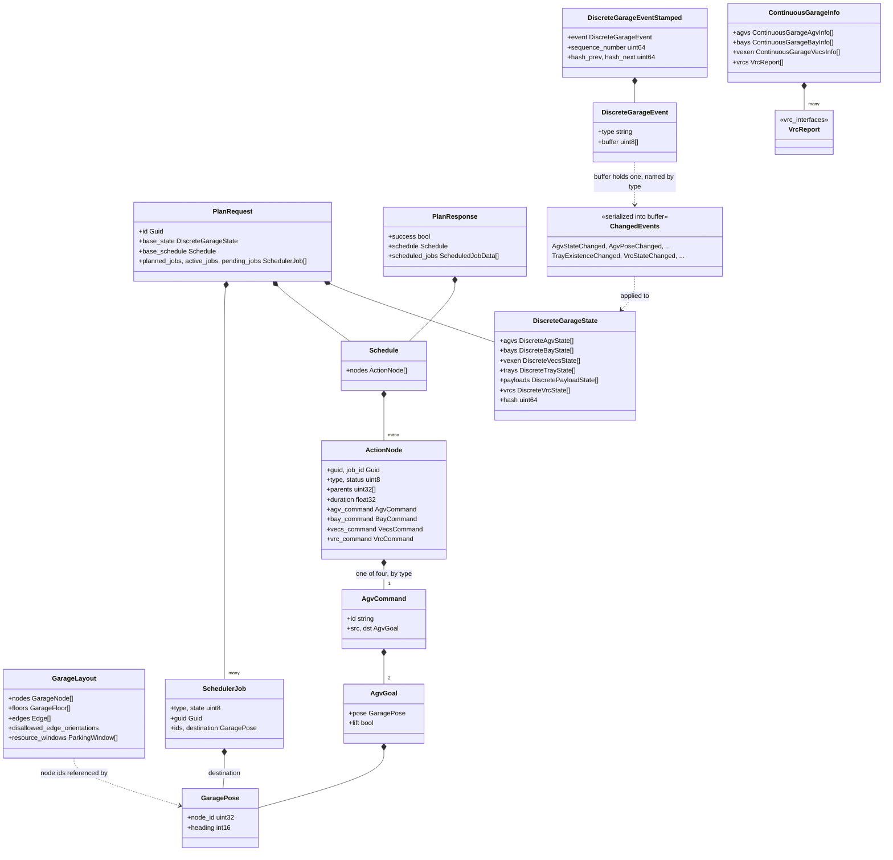
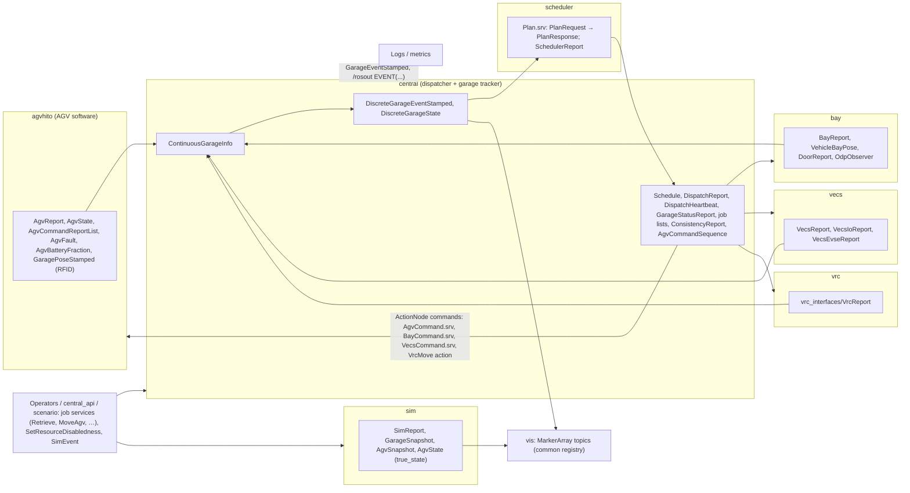
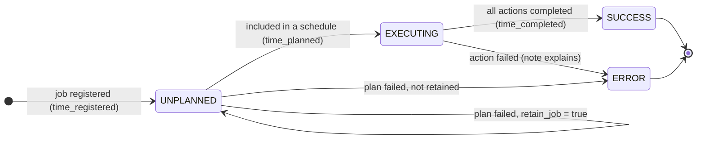
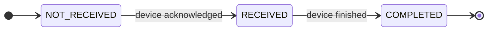
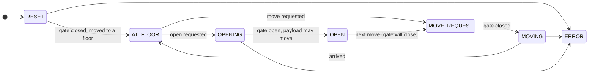

# 11 — `interfaces`

| Generated | Revision | Source pack | Status |
|---|---|---|---|
| 2026-10-07 | 1 | `P11-interfaces-part1of1.md` | Draft, generated by Claude, not yet reviewed by the team |

Package 11 of 37 (bottom-up) · dependency depth 1

Workspace dependencies: vrc_interfaces (document 04).
Used by: agvhito, agvhito_tools, bay, central, central_api, common_py, common_ros, cost_functions, lift, motion_planner, planner_core, scenario, scheduler, sim, sim_metrics, system_tests, vecs, vis (18 packages, several of them Python).

Related documents:
- `01-common.md`: its topic registry names 28 of these message types, all of which exist here **[probed]**;
- `02-rclcppx.md`: typed topics;
- `04-vrc_interfaces.md`: state-default lessons;
- `06-agv_interfaces.md`: validity-flag pattern;
- `09-task_planner.md`: the assignment step behind scheduling.

**How to read the evidence markers.**
- **[read]** means the conclusion comes from reading the definitions.
- **[probed]** means it was confirmed by a script over all 129 definition files: identifier field types, and cross-references to `common`'s topic registry.
- **[rosidl]** means it follows from ROS 2 (Robot Operating System 2) interface-generation rules.
- **[inferred]** means it is a reading of names and comments that the team should confirm.

No ROS install was available, so the package was not built.

---

## A. External dependencies

`interfaces` is the workspace's main ROS interface-definition package: 95 messages and 34 services, compiled by rosidl (the ROS Interface Definition Language tooling) into C, C++ and Python types. It has the same build shape as documents 04 and 06, with two more upstream message packages.

| Name | Description | Version | Link | Usage in this package |
|---|---|---|---|---|
| rosidl_default_generators / rosidl_default_runtime | Interface code generators and their runtime. | Same ROS 2 distribution (Kilted or newer, see document 02). | https://github.com/ros2/rosidl_defaults | `rosidl_generate_interfaces`; runtime export. |
| std_msgs | Standard messages. | Same. | https://github.com/ros2/common_interfaces | `std_msgs/Header` in 34 messages. |
| geometry_msgs | Geometry messages. | Same. | https://github.com/ros2/common_interfaces | `geometry_msgs/Point` in `CollisionBody`. |
| builtin_interfaces | Basic time types. | Same. | https://github.com/ros2/rcl_interfaces | `builtin_interfaces/Time` in `SchedulerJob`. **Not declared** in `package.xml` or in `DEPENDENCIES`; it resolves transitively through std_msgs (R11). |
| `vrc_interfaces` (workspace) | VRC (Vertical Reciprocating Conveyor) report, state and gate types. | Workspace (document 04). | — | `ContinuousGarageInfo.vrcs`, `GarageSnapshot.vrcs`, `DiscreteVrcState`. |
| `volley_cmake` (workspace) | Build conventions. | Workspace (document 10). | — | `volley_package()`, `volley_ament_auto_package()`. |

---

## B. Glossary

The terms below are the domain vocabulary this package fixes for the whole system. Terms already defined in documents 01–10 (AGV (Automated Guided Vehicle), tray, bay, patron/system side, ODP (abbreviation not expanded in the code), VECS (not expanded in the code), EVSE (Electric Vehicle Supply Equipment), QoS (Quality of Service), and so on) are reused. Entries marked *(inferred)* should be confirmed.

| Term | Meaning | Where it shows up |
|---|---|---|
| Garage layout / graph | The fixed network of nodes (positions) and directed edges on which AGVs drive, across several floors. | `GarageLayout`, `GarageNode`, `Edge` |
| Node types | Parking, waypoint, lift, bay, AGV charge, EV (Electric Vehicle) charge, BLift. | `GarageNode.TYPE_*` |
| BLift | A bay with its own lift serving several system floors *(inferred from `BayCommand` and `GarageNode.system_floors`)*. | `TYPE_BLIFT`, `COMMAND_TYPE_MOVE_LIFT_TO_FLOOR` |
| Garage pose | Discrete pose: node id plus heading in whole degrees. | `GaragePose` |
| Geometric pose | Continuous pose: x, y in metres, yaw in radians (east-north-up frame). | `GeometricPose` |
| Reciprocal | Rotated by 180°: a payload or tray facing the opposite way. | `reciprocal_to_tray`, `faces_reciprocal`, `allow_reciprocal` |
| Payload | A parked vehicle (the customer's car), with GUID (Globally Unique Identifier), mass and dimensions. | `Payload` |
| Parking window / resource size | A named size class (`TRAY_16_BY_7`) that limits what a node can hold. | `ParkingWindow`, `max_resource_size_index` |
| Overdrive plate | The bay plate a car drives over; "closed" means deployed for insertion. | `DoorReport`, `OdpObserver` |
| Insert / retrieve | Parking a car into the system / delivering it back to the customer. | Bay states, jobs |
| Dispatcher | Executes the current schedule by sending commands to AGVs, bays, VECS and VRCs; reports status and mode *(inferred: in `central`)*. | `DispatchReport`, `DispatchHeartbeat` |
| Scheduler | Plans jobs into a schedule on request. | `Plan.srv`, `PlanRequest`, `SchedulerReport` |
| Job | A user-level goal (move AGV, retrieve payload, charge, …) tracked from registration to completion. | `SchedulerJob` |
| Schedule / action node | A directed acyclic graph (DAG) of device commands with durations and dependencies. | `Schedule`, `ActionNode` |
| Split | The boundary in a schedule between actions already committed and actions that may change after the next plan call. | `ActionNode.outside_split` |
| Garage tracker | The source of truth for discrete garage state, maintained as a stream of events *(inferred: in `central`)*. | `DiscreteGarageEventStamped` comment |
| Discrete vs. continuous state | Discrete: the scheduler's abstract state (who is where, at which node). Continuous: the latest raw device reports, with staleness. | `DiscreteGarageState`, `ContinuousGarageInfo` |
| Event sourcing | Storing state as an ordered log of change events (`…Changed`), from which state is rebuilt by replaying them. | `DiscreteGarageEvent`, `*Changed` messages |
| Hash chain | Each event carries the state hash before and after it, so a follower can detect divergence. | `hash_prev`, `hash_next` |
| Staleness | Seconds since a device's last report was received. | `ContinuousGarage*Info` |
| Disabledness | Whether a resource is excluded from scheduling. | `*DisablednessChanged`, `SetResourceDisabledness` |
| Installation id | Identifier of a garage installation (site). | `AgvReport`, `DispatchHeartbeat` |
| GUID | A 16-byte globally unique identifier. | `Guid` |
| NOC | Network Operations Center, the remote monitoring display *(inferred)*. | `SchedulerReport` comment |
| PLC | Programmable Logic Controller. | `OdpObserver` |
| HTTP | Hypertext Transfer Protocol. Its status codes are what `GetGarageLayout.status_code` means (the comment says "HTML"). | R6 |

---

## 1. Summary

`interfaces` is **the shared vocabulary of the whole garage system**: every topic and service between Volley's ROS nodes uses its types. It defines:
- **the world:** the garage layout graph, poses, trays and payloads;
- **the devices:** reports and commands for AGVs, bays (doors, overdrive plates, vehicle measurement), VECS chargers and VRCs;
- **the plan:** jobs, schedules as dependency graphs of device commands, and plan calls between dispatcher and scheduler;
- **the state model:** a *discrete* garage state maintained by **event sourcing** (typed `…Changed` events, serialized into a hash-chained stream), alongside a *continuous* view of the latest raw reports;
- **operations:** dozens of services for creating jobs, managing entities, disabling resources and driving the simulator.

**How it connects to the previous documents.**
- `common`'s topic registry names these types by string. All 28 names it uses exist here **[probed]**.
- `rclcppx`'s typed topics will be instantiated with them.
- The VRC part delegates to `vrc_interfaces`.
- Several fields reference C++ code in other packages:
  - `common::CommandStatus` for command responses;
  - the AGV `LineSensorId` order for gyro biases;
  - the VECS state enums.

**The weaknesses are those of a large, long-grown interface set:**
- **identifiers have inconsistent widths and representations** (`agv_id` is `uint8`, `uint16` or `uint32`; GUIDs appear as a message, raw bytes and strings) (R1, R2);
- **events are stringly typed and persisted**, so schema changes threaten stored history (R3);
- **several enums are defined in C++ code** rather than in the messages, which the Python users cannot see (R5);
- **a few comments point at files that do not exist here** (R6).

---

## 2. Files

The package has 131 files: 95 messages, 34 services and two build files. There are no actions and no tests. Line counts are from the pack, which has blank lines removed. Messages whose names end in `Changed` are **event payloads** for the garage event stream (section 3.8).

Numbering note: the pack's instruction says "package 10" and asks for `10-interfaces.md`; this series continues at 11.

| Path (under `src/interfaces/interfaces/`) | Lines | Role |
|---|---:|---|
| `msg/Accel.msg` | 5 | Body-frame acceleration (x, y [m/s²], yaw [rad/s²]). |
| `msg/ActionNode.msg` | 39 | One step of a Schedule: type, status, parent indices, duration, plus one embedded AGV/bay/VECS/VRC command. |
| `msg/AgvBatteryFraction.msg` | 2 | AGV battery level, 0–1. |
| `msg/AgvCommand.msg` | 18 | AGV command: id, source and destination `AgvGoal`. |
| `msg/AgvCommandReport.msg` | 4 | A queued or completed AGV command with its type. |
| `msg/AgvCommandReportList.msg` | 4 | Most recently completed command plus the AGV's command queue. |
| `msg/AgvCommandSequence.msg` | 5 | Per-AGV list of command statuses (dispatcher view). |
| `msg/AgvCommandStamped.msg` | 3 | `AgvCommand` with header. |
| `msg/AgvCommandStatus.msg` | 5 | Status, type and description strings for one command. |
| `msg/AgvDisablednessChanged.msg` | 2 | Event: AGV disabled or enabled in the scheduler. |
| `msg/AgvExistenceChanged.msg` | 8 | Event: AGV added or removed, with its state, pose, lift and tray. |
| `msg/AgvFault.msg` | 11 | AGV fault type enum (CAN (Controller Area Network), motor, localization, MQTT (Message Queuing Telemetry Transport) timeouts) and message. |
| `msg/AgvGoal.msg` | 4 | Garage pose plus lift up/down. |
| `msg/AgvLiftChanged.msg` | 2 | Event: AGV lift raised or lowered. |
| `msg/AgvPoseChanged.msg` | 5 | Event: AGV moved from one node/heading to the next. |
| `msg/AgvReport.msg` | 40 | Top-level AGV status: state and lift enums, poses, goals, battery, tray. |
| `msg/AgvSimState.msg` | 4 | Simulator wrapper: AGV id (uint8) plus `AgvState`. |
| `msg/AgvSnapshot.msg` | 3 | All simulated AGV states. |
| `msg/AgvState.msg` | 43 | Estimator output: pose, velocity, acceleration, lift fractions, intersection centering, covariances, gyro biases, slip. |
| `msg/AgvStateChanged.msg` | 3 | Event: AGV state transition (current → next). |
| `msg/BayCommand.msg` | 12 | Bay command type enum, command id and floor. |
| `msg/BayDisablednessChanged.msg` | 2 | Event: bay disabled or enabled. |
| `msg/BayExistenceChanged.msg` | 4 | Event: bay added or removed. |
| `msg/BayReport.msg` | 44 | Top-level bay status: state, command status, display state, floors, doors reports. |
| `msg/BayState.msg` | 11 | Simulator bay door/light states. |
| `msg/BayStateChanged.msg` | 3 | Event: bay state transition. |
| `msg/CollisionBody.msg` | 19 | Oriented box for collision checking, with body type enum. |
| `msg/ConsistencyReport.msg` | 2 | Whether entity versions are consistent so the scheduler may start. |
| `msg/ContinuousGarageAgvInfo.msg` | 2 | `AgvReport` plus staleness [s]. |
| `msg/ContinuousGarageBayInfo.msg` | 2 | `BayReport` plus staleness [s]. |
| `msg/ContinuousGarageInfo.msg` | 6 | Latest reports for all AGVs, bays, VECS and VRCs. |
| `msg/ContinuousGarageVecsInfo.msg` | 2 | `VecsReport` plus staleness [s]. |
| `msg/DisabledResourceInfo.msg` | 2 | Disabled resource id and time (as string, TODO). |
| `msg/DisallowedEdgeOrientation.msg` | 6 | Edge plus a heading (0–179°) that may not be used on it. |
| `msg/DiscreteAgvState.msg` | 6 | Scheduler's discrete AGV state: pose, lift, tray, disabled. |
| `msg/DiscreteBayState.msg` | 3 | Scheduler's discrete bay state. |
| `msg/DiscreteGarageEvent.msg` | 5 | Type-erased event: type name string plus serialized bytes. |
| `msg/DiscreteGarageEventStamped.msg` | 18 | Event with sequence number and previous/next hash. |
| `msg/DiscreteGarageState.msg` | 14 | Full discrete garage state with hash. |
| `msg/DiscretePayloadState.msg` | 4 | Payload on a tray, reciprocal flag, charging. |
| `msg/DiscreteTrayState.msg` | 5 | Tray pose, carrying AGV, payload. |
| `msg/DiscreteVecsState.msg` | 3 | Scheduler's discrete VECS state. |
| `msg/DiscreteVrcState.msg` | 16 | VRC state, gates and floors (uses `vrc_interfaces`). |
| `msg/DispatchHeartbeat.msg` | 2 | Dispatcher liveness with installation id. |
| `msg/DispatchReport.msg` | 19 | Dispatcher status and mode enums, divergence flags, jobs. |
| `msg/DoorReport.msg` | 12 | One bay door's state and commanded action. |
| `msg/DoorsReport.msg` | 23 | Combined door-interface state for one bay floor. |
| `msg/Edge.msg` | 4 | Directed edge between two node indices. |
| `msg/FaultStateChanged.msg` | 1 | Event: garage faulted or cleared. |
| `msg/GarageEntityId.msg` | 7 | Entity type character plus numeric id. |
| `msg/GarageEvent.msg` | 112 | Special-occurrence enum (customer, AGV, sim events) with entity ids; also logged to /rosout. |
| `msg/GarageEventStamped.msg` | 3 | `GarageEvent` with header. |
| `msg/GarageFloor.msg` | 11 | Floor id and height z. |
| `msg/GarageLayout.msg` | 20 | The garage graph: nodes, floors, edges, disallowed orientations, parking windows. |
| `msg/GarageNode.msg` | 52 | Graph vertex: id, position, floor, type enum, allowed headings, size limits, bay floors. |
| `msg/GaragePayload.msg` | 4 | Payload with discrete and geometric pose. |
| `msg/GaragePose.msg` | 7 | Discrete pose: node id and heading (degrees, −179..180). |
| `msg/GaragePoseStamped.msg` | 3 | `GaragePose` with header. |
| `msg/GarageSnapshot.msg` | 11 | Simulator snapshot: AGVs, trays, payloads, bays, VRCs, collision bodies. |
| `msg/GarageStatusReport.msg` | 12 | Garage up/down, auto mode, uptime, active AGVs and bays. |
| `msg/GarageTray.msg` | 6 | Simulator tray: pose, payload, reciprocal flag. |
| `msg/GeometricPose.msg` | 7 | Continuous pose: x, y [m], yaw [rad]. |
| `msg/Guid.msg` | 4 | 16-byte globally unique identifier. |
| `msg/LiftReport.msg` | 14 | Lift-with-gate state enum and floor. |
| `msg/NodeDisablednessChanged.msg` | 2 | Event: graph node disabled or enabled. |
| `msg/OdpObserver.msg` | 24 | Overdrive-plate (ODP) PLC request/limit-switch flags. |
| `msg/ParkingWindow.msg` | 7 | Named size class (length, width, height). |
| `msg/Payload.msg` | 6 | A parked vehicle: GUID, mass, dimensions, EV charge request. |
| `msg/PayloadExistenceChanged.msg` | 10 | Event: payload added or removed, with dimensions and tray. |
| `msg/PlanRequest.msg` | 11 | Plan call input: base state, base schedule, job lists. |
| `msg/PlanResponse.msg` | 7 | Plan call output: new schedule and modified jobs. |
| `msg/Schedule.msg` | 5 | List of `ActionNode`s forming a DAG. |
| `msg/ScheduledJobData.msg` | 12 | Job, its node indices, chosen bay and arrival node. |
| `msg/SchedulerJob.msg` | 46 | Job type and state enums, ids, times, destination, retrieve hints. |
| `msg/SchedulerJobList.msg` | 3 | List of jobs. |
| `msg/SchedulerReport.msg` | 2 | Bay readiness ratio (for the NOC display). |
| `msg/SimReport.msg` | 4 | Simulator running flag, remaining events, payload queue. |
| `msg/SizedPose.msg` | 2 | Garage pose with resource size index. |
| `msg/TrayDisablednessChanged.msg` | 2 | Event: tray disabled or enabled. |
| `msg/TrayExistenceChanged.msg` | 9 | Event: tray added or removed. |
| `msg/TrayPoseSetManually.msg` | 5 | Event: tray pose overridden by an operator. |
| `msg/Twist.msg` | 5 | Body-frame velocity (x, y [m/s], yaw [rad/s]). |
| `msg/VecsCommand.msg` | 9 | VECS command: start/stop charging. |
| `msg/VecsDisablednessChanged.msg` | 2 | Event: VECS disabled or enabled. |
| `msg/VecsEvseReport.msg` | 10 | EV charger (EVSE) state, currents, power, energy. |
| `msg/VecsExistenceChanged.msg` | 4 | Event: VECS added or removed. |
| `msg/VecsIoLedCommand.msg` | 9 | VECS LED (Light-Emitting Diode) command (all on/all off/stop on). |
| `msg/VecsIoReport.msg` | 10 | VECS buttons and LEDs. |
| `msg/VecsReport.msg` | 23 | VECS state and command-status enums. |
| `msg/VecsStateChanged.msg` | 3 | Event: VECS state transition. |
| `msg/VehicleBayPose.msg` | 51 | Vehicle measurements in a bay: size, mass, position, sensors, error bitfield. |
| `msg/VersionInfo.msg` | 19 | Node name, release, git SHA (Secure Hash Algorithm) commit hash, layout MD5 (Message-Digest algorithm 5) checksum. |
| `msg/VrcCommand.msg` | 9 | VRC move command (dispatcher → VRC). |
| `msg/VrcExistenceChanged.msg` | 2 | Event: VRC added or removed. |
| `msg/VrcStateChanged.msg` | 2 | Event: VRC discrete state transition. |
| `srv/AddAgv.srv` | 9 | Sim/tracker: add an AGV at a node or geometric pose. |
| `srv/AddPayload.srv` | 8 | Add a payload on a tray or at a node. |
| `srv/AddTray.srv` | 9 | Add a tray on an AGV or at a node. |
| `srv/AgvCommand.srv` | 6 | Send one AGV command; response is a `CommandStatus` code. |
| `srv/AgvCommandList.srv` | 6 | Send several AGV commands. |
| `srv/AgvStop.srv` | 25 | Stop an AGV with a severity (next pose, now, hard fault). |
| `srv/BayCommand.srv` | 6 | Send a bay command. |
| `srv/ChargePayload.srv` | 8 | Create a job to EV-charge a payload. |
| `srv/GetGarageLayout.srv` | 7 | Fetch the garage layout. |
| `srv/GetJobState.srv` | 6 | Look up a job by GUID. |
| `srv/LocalizeAgv.srv` | 8 | Tell an AGV where it is. |
| `srv/MoveAgv.srv` | 10 | Create a move-AGV job. |
| `srv/MoveTray.srv` | 10 | Create a move-tray job. |
| `srv/PlacePayloadInBay.srv` | 8 | Put a payload into a bay. |
| `srv/Plan.srv` | 7 | Plan call: `PlanRequest` → `PlanResponse`. |
| `srv/RegisterRetrievalCode.srv` | 10 | Get a retrieval code for a payload. |
| `srv/RemoveAgv.srv` | 5 | Remove an AGV. |
| `srv/RemovePayload.srv` | 5 | Remove a payload. |
| `srv/RemoveTray.srv` | 5 | Remove a tray. |
| `srv/ReparkTray.srv` | 12 | Create a repark job, optionally allowing the reciprocal heading. |
| `srv/Retrieve.srv` | 9 | Create a retrieve job for a payload. |
| `srv/SetFloat32.srv` | 7 | Generic setter: float32. |
| `srv/SetPayload.srv` | 5 | Replace a payload's data. |
| `srv/SetPayloadInfo.srv` | 16 | Update a payload's dimensions, mass and EV request. |
| `srv/SetResourceDisabledness.srv` | 11 | Disable or enable any resource by id. |
| `srv/SetString.srv` | 7 | Generic setter: string. |
| `srv/SetUInt16.srv` | 7 | Generic setter: uint16. |
| `srv/SetUInt32.srv` | 7 | Generic setter: uint32. |
| `srv/SetUInt8.srv` | 7 | Generic setter: uint8. |
| `srv/SimEvent.srv` | 15 | Schedule a typed simulator event with optional fields. |
| `srv/TransitionBayToInsert.srv` | 13 | Create a job to switch a bay to insert. |
| `srv/TransitionBayToRetrieve.srv` | 13 | Create a job to switch a bay to retrieve. |
| `srv/VecsCommand.srv` | 6 | Send a VECS command. |
| `srv/VecsIoLedCommand.srv` | 6 | Send a VECS LED command. |
| `CMakeLists.txt` | 27 | Globs `msg/`, `srv/`, `action/`; generates with dependencies geometry_msgs, std_msgs, vrc_interfaces. |
| `package.xml` | 19 | Interface package; depends on geometry_msgs, std_msgs, vrc_interfaces. |

---

## 3. Public API

The API (Application Programming Interface) is the set of generated types: C++ `interfaces::msg::*` and `interfaces::srv::*` (headers such as `interfaces/msg/agv_report.hpp`), and Python `interfaces.msg` and `interfaces.srv` **[rosidl]**.

The definitions fall into ten families. Each subsection below gives the purpose, the main design choices, and how dependents use the family. Topic names and QoS come from `common`'s registry (document 01, section 3.8). The producer and consumer roles are inferred from those registry families and from the "used by" list, and will be confirmed in the later package documents.

### 3.1 Basic types and identity

- `GaragePose {node_id, heading}` is the discrete pose used throughout: scheduling, jobs, events. Headings are whole degrees in (−180, 180], the same convention as `common`'s `Wrap(int)`.
- `GeometricPose`, `Twist` and `Accel` are planar continuous quantities (metres, radians, per second).
- `Guid` is 16 bytes. It identifies payloads, jobs, schedule nodes and plan calls.
- `GarageEntityId` is a one-character type tag plus a number.
- `VersionInfo` carries `name`, `release`, `gitsha` (bounded to 40 characters) and `layout_md5sum` (32), which are exactly the values `common`'s `GetGitsha`, `GetRelease` and `GetMD5Sum` produce. `ConsistencyReport` tells the scheduler whether these versions agree across entities before it may start.

### 3.2 Layout

**Purpose.** The static garage model the planners work on.

**Design.**
- `GarageLayout` contains: nodes, floors, directed edges, *disallowed edge orientations* (an edge that may not be traversed with a given heading), a parking-window safety buffer, and the list of resource size classes.
- `GarageNode` contains:
  - id; position (east-north-up, metres); floor; type;
  - allowed headings: degrees 0–179, sorted, each also valid flipped by 180°;
  - maximum resource size; rotation permission; `faces_reciprocal` for bays and chargers;
  - for bays, an insert floor and the reachable system floors.
- `GetGarageLayout.srv` returns the layout with a success flag and an HTTP-style status code.

### 3.3 AGVs

| Kind | Types |
|---|---|
| Status | `AgvReport`: top-level state enum (BOOTING … ERROR; "must not be renumbered" because the garage tracker stores it), lift state, poses, current/next/final goals, battery, tray. `AgvState`: the estimator's output (pose, body velocity and acceleration, lift fractions, intersection centering with debouncing, body-frame covariance, controllability flags, gyro biases, slip coefficients). |
| Commands | `AgvCommand {id, src, dst}`, where each `AgvGoal` is a garage pose plus lift up/down; `AgvCommand.srv` and `AgvCommandList.srv` reply with a `uint8` command status "see `common/command_status.hpp`" (`ACCEPTED`/`REJECTED`/`IGNORED`). `AgvStop.srv` has graded severities (next pose < now < hard fault) and an `AgvFault`; `LocalizeAgv.srv`, `MoveAgv.srv`. |
| Feedback | `AgvCommandReportList` (completed command plus queue), `AgvCommandSequence`, `AgvFault` (fault type enum, including the MQTT messaging timeouts of document 07), `AgvBatteryFraction`. |

### 3.4 Bays, doors and vehicle measurement

- **`BayReport`:**
  - the bay state enum (booting, door validation, ready/transitioning/processing for insert and retrieve, error, vehicle inserted);
  - command status, external display state, insert and current floor;
  - an `internal_state` that is "defined in the code";
  - one `DoorsReport` per floor.
- **`BayCommand`** (four command types, including `MOVE_LIFT_TO_FLOOR` for a BLift that owns a VRC) and the matching services `BayCommand.srv`, `TransitionBayToInsert.srv`, `TransitionBayToRetrieve.srv`, `PlacePayloadInBay.srv`.
- **Doors:**
  - `DoorReport` (one door; its states start at 1, so 0 is "unset");
  - `DoorsReport` (the combined state of patron door, system door and overdrive plate on one floor);
  - `OdpObserver` (request/confirmation/limit-switch flags of the overdrive plate's PLC);
  - `BayState` (simulator door and light states).
- **`VehicleBayPose`:** the car's measured size, mass, position on the tray, axle counting, sensor states, and an `error_flags` bitfield (section 7.4).
- **`LiftReport`:** a lift-with-gate model with documented transitions (section 4c). It overlaps with the VRC vocabulary of `vrc_interfaces` (R8).

### 3.5 VECS (EV charging)

- `VecsReport` has the state enum (booting, validation, ready, attaching adapter, charging, detaching, error) and command status. Its header says the enum must mirror `vecs::State` in the VECS package and a `std::to_string` in `common_ros`.
- `VecsEvseReport` carries charger currents, power and energy.
- `VecsIoReport` carries the buttons and LEDs.
- Commands: `VecsCommand` (start/stop charging) and `VecsIoLedCommand`, with services of the same names.

### 3.6 VRC (via `vrc_interfaces`)

- `VrcCommand` (move to floor) is a dispatcher command, embedded in `ActionNode`.
- `DiscreteVrcState` wraps `vrc_interfaces/VrcState` and the gate reports for the discrete state.
- The raw `VrcReport` appears in `ContinuousGarageInfo` and `GarageSnapshot`.

### 3.7 Jobs, schedules and planning

**Purpose.** These types carry the contract between the operator-facing services, the dispatcher and the scheduler.

**Design.**
- **Jobs.** A `SchedulerJob` has:
  - a type: move AGV/tray, ready for insert/retrieve, retrieve, insert, charge AGV/payload, bay transitions, clean, repark, rebalance;
  - a state: unplanned, executing, success, error;
  - timestamps (registered, planned, completed) and the identifiers its type needs;
  - retrieve hints such as `retain_job` and `needs_bay_in_retrieve`.

  Services such as `Retrieve`, `MoveAgv`, `MoveTray`, `ReparkTray`, `ChargePayload` and the bay transitions create jobs and return their `job_id`; `GetJobState` looks one up.
- **Schedules.** A `Schedule` is a list of `ActionNode`s that forms a DAG through `parents` (indices into the same list). Each node has a type (AGV, bay, VECS or VRC command) and embeds all four command fields, of which one is meaningful. It also has a duration ("some actions have infinite duration"), a delivery status (not received → received → completed) and an `outside_split` flag (section 7.1).
- **Planning.** `Plan.srv` sends a `PlanRequest`:
  - the base discrete state;
  - the immutable base schedule;
  - the planned, active and pending jobs.

  The scheduler returns a `PlanResponse`: a new schedule plus modified jobs, each `ScheduledJobData` with its node indices and chosen bay. The same request and response types *also* have topics (`plan_request`, `plan_response`) in `common`'s registry (R9).
- **Dispatcher status.** `DispatchReport` (status and mode enums, consistency and divergence flags, all jobs), `DispatchHeartbeat`, `GarageStatusReport` (up/down, uptime, active AGVs and bays, reason), and `SchedulerReport` (bay readiness ratio).

### 3.8 Garage state: discrete, continuous and the event stream

**Discrete state.** `DiscreteGarageState` is the scheduler's abstract world. It contains discrete AGV, bay, VECS, tray, payload and VRC states, the disabled nodes, a fault flag, and a `hash`.

**Event stream.**
- It changes only through events. Each event is a `…Changed` message, for example `AgvPoseChanged`, `TrayExistenceChanged`, `PayloadExistenceChanged`, `VrcStateChanged` or `FaultStateChanged`.
- The event is serialized into `DiscreteGarageEvent {type: "AgvStateChanged", buffer: bytes}`.
- It is then published as `DiscreteGarageEventStamped` with a strictly increasing `sequence_number` and the state hash before and after (`hash_prev`, `hash_next`).
- Followers replay the events to maintain their own copy, and compare hashes to detect divergence (section 7.3). The `DispatchReport` flags `state_diverged` and `execution_state_diverged` report the result.
- The `AgvReport` comment ("we store the State in the GarageTracker", so states must not be renumbered) shows the events are **persisted** (R3).

**Continuous state.** `ContinuousGarageInfo` holds the latest raw report of every AGV, bay, VECS and VRC, each with `staleness` in seconds.

**Discrete events for operators.** `GarageEvent` is a separate enum of notable occurrences (customer confirmed insert, retrieve requested, AGV stop accepted, sim collision, …). It is published as `GarageEventStamped` and also written to `/rosout` in a parseable `EVENT(...)` format.

### 3.9 Simulation and tooling

- `SimReport`, `GarageSnapshot`, `AgvSnapshot`, `AgvSimState`, `GarageTray`, `GaragePayload` and `CollisionBody` describe the simulator's world.
- `SimEvent.srv` schedules simulator events. It is a type string plus optional fields, a "pseudo polymorphism" flagged with a TODO.
- `AddAgv`, `AddTray`, `AddPayload`, `RemoveAgv`, `RemoveTray`, `RemovePayload`, `SetPayload`, `SetPayloadInfo`, `RegisterRetrievalCode` and `SetResourceDisabledness` manage entities in the sim or the tracker.
- `Set{UInt8,UInt16,UInt32,Float32,String}` are generic one-value setters.

### 3.10 Conventions used across the package

- **Service responses.** Most services answer with `bool success` plus a `string message`. Job-creating services add a `Guid job_id`. Command services answer with a `uint8` status code instead.
- **Enums** are `uint8` (or `uint16`) constants on the message that carries the value, with `*_string` companion fields for human-readable logs.
- **Zero means "none".** Zero is the "none" sentinel for ids (`tray_id` 0 is "no tray"; `GaragePose.node_id` 0 is "not set" in `AddAgv`).
- **Units** are given in comments (`# [m]`) or in field names (`length_m`); the two styles are mixed.

**Usage.**

```cpp
#include <interfaces/msg/agv_report.hpp>
#include <interfaces/srv/retrieve.hpp>
using interfaces::msg::AgvReport;

void OnReport(const AgvReport& r) {
  if (r.state == AgvReport::STATE_ERROR) { LOG_WARN(get_logger(), "AGV {} fault: {}", r.agv_id, r.fault_reason); }
}
auto req = std::make_shared<interfaces::srv::Retrieve::Request>();
req->payload_id = payload_guid;   // interfaces::msg::Guid
retrieve_client_->async_send_request(req, [this](auto f) {
  auto res = f.get();
  if (!res->success) { LOG_WARN(get_logger(), "retrieve rejected: {}", res->message); }
});
```

This is illustrative; `payload_guid` and the client are not from the pack.

---

## 4. Diagrams

### 4a. Class diagram (ownership on edges)

All relationships are composition by value: nested messages and arrays. The diagram covers the backbone types: layout, plan, schedule, discrete and continuous state, and the event stream. Leaf device messages are omitted.



### 4b. Data flow

The package has no runtime of its own. The flow below shows which subsystem exchanges which of its types. The topic names come from `common`'s registry; the producer and consumer roles are **[inferred]** from the registry's families and the "used by" list.



### 4c. State machines

The package implements no state machine. It defines many state *vocabularies* whose transitions belong to the device packages (AGV, bay and VECS states will be diagrammed in their own documents). Three enums are included here, because the messages themselves document or imply their transitions and several packages must agree on them.

**`SchedulerJob.state`** (job lifecycle; transitions inferred from the names and the `retain_job` comment):



**`ActionNode.status`** (delivery of one schedule step to its device; monotonic by definition):



**`LiftReport.state`** (from the per-state comments):



---

## 5. Behavior

**Construction, steady state, shutdown.** These do not apply: the package produces generated code at build time. Generated messages are zero-initialized unless a field has an explicit default **[rosidl]**. That makes the zero values below part of the contract:

| Field | Zero means | Safe? |
|---|---|---|
| `AgvReport.state`, `BayReport.state`, `VecsReport.state` | BOOTING | Plausible; an unfilled report looks like a booting device. |
| `LiftReport.state` | ERROR | Safe. |
| `DoorReport.door_state` | no defined value (states start at 1) | Safe: not CLOSED (compare `vrc_interfaces` R1). |
| `DoorsReport.state`, `GarageEvent.type`, `BayCommand.command_type`, `VecsCommand.command_type`, `CollisionBody.type`, `GarageNode.type`, `SchedulerJob.type` | UNKNOWN | Safe. |
| `ActionNode.type` | no defined value (types start at 1) | Safe. |
| **`VecsIoLedCommand.command_type`** | **LEDS_ALL_ON** | A default command turns all LEDs on (R4). |
| `AgvStop.severity` | INVALID | Safe. |
| `tray_id`, `agv_id` (in tray and payload contexts), `GaragePose.node_id` | "none / not set" | Only if no real entity has id 0. |
| `SchedulerJob.state` | UNPLANNED | Natural initial state. |

**Executors, threads, timers, parameters.** None in this package.

**Rate and size considerations.** Several messages aggregate the whole garage:
- `ContinuousGarageInfo` (published best effort, per `common`'s registry);
- `DiscreteGarageState` and `PlanRequest` (state plus schedule plus job lists);
- `DispatchReport` (all jobs);
- `GarageSnapshot`.

Their size grows with fleet and garage size. Large best-effort messages are delivered whole or not at all, so the loss of one fragment loses the entire message (R12).

---

## 6. Ownership and safety

### 6.1 Lifetimes

Messages own their data by value. The persistent lifetime that matters here is that of **serialized events**: `DiscreteGarageEvent.buffer` holds a `…Changed` message serialized with *today's* definition, and the comments say the garage tracker stores them. Changing a `…Changed` definition therefore affects history, not just live traffic (R3).

### 6.2 Callbacks capturing `this`

Not applicable.

### 6.3 Locks and atomics

Not applicable.

### 6.4 Error handling

| Style | Where |
|---|---|
| `bool success` + `string message` | Most services. |
| `uint8` command-status code | `AgvCommand.srv`, `AgvCommandList.srv`, `AgvStop.srv`. Its values are defined in C++ (`common::CommandStatus`), not in the service (R5). |
| `int16 status_code` | `GetGarageLayout`, documented as "HTML status code", meaning HTTP (R6). |
| State enums with an ERROR value plus a reason string | `AgvReport.fault_reason`, `SchedulerJob.note`, `GarageStatusReport.reason`. |
| Bitfields | `VehicleBayPose.error_flags`. |
| Divergence flags | `DispatchReport.state_diverged`, `execution_state_diverged`; event hashes. |

### 6.5 RISK items

| Item | Risk | Evidence |
|---|---|---|
| R1 | **Inconsistent identifier widths.** `agv_id` is `uint16` in 13 places, `uint32` in 2 (`ActionNode`, `AgvCommandSequence`) and **`uint8` in `AgvSimState`**, so AGV ids above 255 are truncated in simulator snapshots. `bay_id` is `uint16` in 8 places and `uint32` in 5; `BayReport` says the bay id *is* the node id, and node ids are `uint32`. `tray_id` is `uint16` (11) or `uint32` (2); `vecs_id` is `uint16` but documented as a "parking node ID". `floor` is `uint8` (4), `uint16` (VRC) or `uint32` (3). `resource_id` is `int32` in `SimEvent`. Conversions between messages can silently truncate. | **[probed]** (script over all fields) |
| R2 | **Several representations for the same identifiers.** Payload and job ids appear as `Guid` messages, as raw `uint8[16]` (`PayloadExistenceChanged.payload_id`) and as strings (`GarageEvent.payload_id`, `BayCommand.command_id` "GUID string", `AgvCommand.id`). Every boundary needs a conversion, and string formats are not specified. | **[read]** |
| R3 | **Stringly-typed, persisted events.** `DiscreteGarageEvent` carries a free-form `type` name and opaque bytes, with no schema version. Renaming a `…Changed` message, or changing its fields, makes stored events undecodable or misdecoded on replay. The "do not renumber states" comment in `AgvReport` shows the team already relies on stable values for this reason. | **[read]** |
| R4 | **Unsafe zero default.** `VecsIoLedCommand.COMMAND_TYPE_LEDS_ALL_ON = 0`, so a default-constructed command switches all LEDs on. There is no UNKNOWN value. Other device enums use 0 for BOOTING, which makes an unfilled report look like a booting device (see the table in section 5). | **[read]** |
| R5 | **Enums defined outside the messages.** The following values are defined in C++ code, invisible to the Python dependents (`common_py`, `scenario`, `sim_metrics`, `system_tests`) and kept in sync by hand: command-status codes (`common::CommandStatus`); `DoorReport.action` (`open_close_state_machine.hpp`); `BayReport.internal_state` ("defined in the code"); `VecsEvseReport.state` (`vecs::evse::State`); `VecsReport` (mirrored in `vecs::State` and `common_ros` print utilities); the gyro-bias order (`LineSensorId`). | **[read]** |
| R6 | **Dangling or wrong references.** `BayState.patron_light_state` refers to `PatronLightControl.srv`, which is not in this package. `AgvStop.srv` refers to `agv_command_queue.hpp` while `AgvCommand.srv` refers to `common/command_status.hpp` for the same codes. `GetGarageLayout` says "HTML status code" instead of HTTP. | **[read]** |
| R7 | **Two heading conventions.** `GaragePose` headings are in (−180, 180], while node headings and disallowed edge orientations are in [0, 179] *modulo 180*. Every consumer must canonicalize (section 7.2), and nothing in the types enforces either range. | **[read]** |
| R8 | **Overlapping lift models.** There are `LiftReport` (lift with gate) here, `VrcReport`/`GateState` in `vrc_interfaces`, `BayCommand.MOVE_LIFT_TO_FLOOR` for BLift bays, and node types `TYPE_LIFT` and `TYPE_BLIFT`. It is unclear which model is current, and which consumers still use `LiftReport`. | **[read]** |
| R9 | **The plan exchange exists twice.** `Plan.srv` and the `plan_request`/`plan_response` topics in `common`'s registry carry the same `PlanRequest`/`PlanResponse`, so two code paths can drift. | **[probed]** (registry cross-check) |
| R10 | **Pseudo-polymorphic messages.** `ActionNode` carries all four command types but only one is meaningful, with no check that `type` matches the filled field. `SimEvent` has a type string plus optional fields (with a TODO). Mismatches are silently ignored, and every node carries three unused commands on the wire. | **[read]** |
| R11 | **An undeclared dependency.** `SchedulerJob` uses `builtin_interfaces/Time`, but `builtin_interfaces` is neither in `package.xml` nor in `DEPENDENCIES`; it resolves only transitively through std_msgs. Meanwhile `DisabledResourceInfo.disabled_at` stores a time as a string (with a TODO). | **[read]** |
| R12 | **Large aggregate messages.** `ContinuousGarageInfo` (best effort), `DiscreteGarageState`, `PlanRequest` and `DispatchReport` scale with fleet size. With best-effort QoS, the loss of one fragment loses the whole message, and large reliable messages add latency. | **[read]**, ROS 2 transport behavior |
| R13 | **A large blast radius.** 18 packages, several of them Python, depend on this one. Any definition change forces a coordinated rebuild and redeploy, and changes type hashes (document 04, R11). Combined with R3, some changes also need a data migration. | **[read]** |
| R14 | **Implicit array orderings.** `AgvState.gyro_biases[6]` follows `LineSensorId` in C++ code (`common/devices_agv.hpp` has exactly six line sensors). The order of `lift_fractions[4]` is unspecified. | **[read]** |
| R15 | **Unchecked ranges and units.** `battery_fraction` is in [0, 1] by comment only. `GarageStatusReport.active_agv_count` is `uint8` (at most 255) while AGV ids are `uint16`. Units appear sometimes in names (`length_m`) and sometimes in comments (`# [m]`). | **[read]** |

---

## 7. Math

The package defines data rather than algorithms, but four of its structures carry precise semantics that every consumer has to implement identically.

### 7.1 Schedules as DAGs

A `Schedule` is a list of action nodes $n_0,\dots,n_{N-1}$. Each node has a duration $d_i$ (possibly $+\infty$) and a parent set $P_i\subseteq\{0,\dots,N-1\}$ given by the indices in `parents`. If a node may start as soon as all its parents have finished, its earliest start time and the schedule's earliest completion are

$$
s_i=\max_{p\in P_i}\left(s_p+d_p\right)\quad(s_i=0\ \text{if}\ P_i=\varnothing),\qquad
T=\max_{i:\,d_i<\infty}\left(s_i+d_i\right).
$$

The chain of parents that attains these maxima is the **critical path**: delaying any node on it delays $T$.

- **Well-formedness.** The parents must form an acyclic graph, which the message cannot enforce. Indices are only meaningful within one `Schedule`, so `PlanRequest.base_schedule` and `PlanResponse.schedule` must be read with their own index spaces. That is why `ScheduledJobData.node_indices` refers to the response's list.
- **Infinite durations** model actions that only end on an external event, such as waiting for a customer.
- **The `outside_split` flag** marks nodes that are not yet committed while a plan call is in flight.
- **The assignment step.** The bottleneck assignment of document 09 minimizes the largest of a set of costs. It applies to the choice of which AGV serves which job when the costs are path durations like these.


*Figure 7.1 — An illustrative retrieve. AGV 3 fetches tray 12, rides VRC 1 down a floor, and delivers to bay 2, while the bay prepares in parallel. Arrows are `parents` links; outlined bars form the critical path (78 s). The final "process retrieve" step has infinite duration. The data is invented to show the semantics; it does not come from a real schedule.*

### 7.2 Heading conventions

There are two conventions (R7):
- a pose heading $h\in(-180,180]$, in whole degrees (`GaragePose`, matching `common`'s `Wrap(int)`);
- an axis heading $a\in[0,180)$, used for node headings and disallowed edge orientations, "flippable by 180".

They relate through

$$
\operatorname{axis}(h) = h \bmod 180 \in [0,180),\qquad
\text{valid}(h,\text{node}) \iff \operatorname{axis}(h)\in \text{node.headings},
$$

and the *reciprocal* of a pose heading is $\operatorname{Wrap}(h+180)$. An edge with a disallowed orientation $a$ may not be traversed by an AGV whose $\operatorname{axis}(h)=a$. `common`'s `IsAngleOrReciprocal` and `DiscretizeToNearestCartesianAxis` implement parts of this; none of it is enforced by the types.

### 7.3 Event stream consistency

Let $S_n$ be the discrete state after $n$ events, $e_n$ the $n$-th event, and $H$ the state-hash function, which is implemented in the garage tracker and not defined here. The stamped events carry

$$
\texttt{sequence\_number}=n,\qquad \texttt{hash\_prev}=H(S_{n-1}),\qquad \texttt{hash\_next}=H(S_n)=H(\operatorname{apply}(S_{n-1},e_n)).
$$

A follower holding state $\hat S$ accepts event $n$ only if both of these hold:
- it has applied exactly $n-1$ events (no gap in sequence numbers);
- $H(\hat S)=\texttt{hash\_prev}$.

After applying the event, it checks $H(\hat S')=\texttt{hash\_next}$. Any mismatch means divergence, so the follower must resynchronize, for example from a full `DiscreteGarageState`, which carries its own `hash`. This only works if every implementation computes $H$ identically, over a canonical ordering of the state's arrays. That requirement is not written down anywhere in this package.

### 7.4 Error bitfield

`VehicleBayPose.error_flags` is a 16-bit bitfield. Flag $k$ has the value $2^{k}$ for $k=0,\dots,10$ (overweight, too long, too wide, wheelbase, four LIDAR (Light Detection and Ranging) zones, two tire sensors, too tall), so

$$
\texttt{error\_flags}=\sum_{k\in F} 2^{k},\qquad \text{flag } k \text{ set} \iff \left\lfloor \texttt{error\_flags}/2^{k}\right\rfloor \bmod 2 = 1 .
$$

Five bits (11–15) remain free. Consumers should test bits, never compare the whole value to a single constant.

---

## 8. Tests

The package has **no tests**, as is usual for interface packages. Two automated checks were run for this document:
- **Registry cross-check.** All 28 `interfaces/msg/*` type names used in `common`'s topic registry exist in this package **[probed]**.
- **Field-type survey** over all 129 definitions (the basis of R1) **[probed]**.

What the definitions show about intended behavior:
- **Stable numbering is a stated requirement.** It applies at least to `AgvReport`, because of persisted state.
- **Human readability matters.** Most enums come with `*_string` fields.
- **Operations-oriented design.** `GarageEvent` is formatted for log parsing, `SchedulerReport` exists "for the NOC display", and `GarageStatusReport` gives a reason when the garage is down.

**Gaps, cheap to close with a CI (Continuous Integration) lint over the `.msg` and `.srv` files:**
- consistent widths for identifier fields (R1);
- an UNKNOWN zero value for every command enum (R4);
- no references to missing files (R6);
- every referenced package declared (R11);
- a check that the type names in `common`'s registry exist (passes today).

**Gaps that need code in the consumers:**
- **round-trip tests** that serialize and replay each `…Changed` event, with stored samples from older releases (R3);
- **hash-function agreement tests** between the garage tracker and its followers (section 7.3).

---

## 9. Idioms to reuse, and open questions

### 9.1 Idioms

- **One report per device, one command type per device, events per change:** `XReport`, `XCommand` (or service), `XStateChanged`, `XExistenceChanged`, `XDisablednessChanged`. New device types should follow this pattern.
- **Enum constants with stable numbers, plus a `*_string` companion.** Never renumber; append new values (as `AgvReport` instructs). Give 0 the meaning UNKNOWN or INVALID for commands (R4).
- **Uniform service responses:** `bool success` plus `string message`, plus `Guid job_id` when a job is created.
- **Discrete versus continuous.** Keep the scheduler's discrete abstraction (garage poses, ids, flags) separate from raw continuous reports (with staleness), and move between them only through tracked events.
- **Keep comments next to fields as the contract**, including units (`# [m]`) and which fields are set for which `type`.
- **Use `vrc_interfaces` types for anything VRC-related**, rather than extending `LiftReport` (R8).

### 9.2 Open questions for the team

1. Should identifier widths be unified (`uint32` for node, bay and VECS ids; `uint16` or `uint32` for AGV and tray ids), starting with `AgvSimState.agv_id`, which is `uint8` (R1)?
2. Should every GUID be the `Guid` message, with a documented string format where strings are unavoidable (R2)?
3. How are stored `DiscreteGarageEvent`s versioned? Is there a migration path when a `…Changed` message changes (R3)? Where is the hash function specified (section 7.3)?
4. Should `VecsIoLedCommand` get an UNKNOWN = 0 value (R4)? Should the command-status codes and other C++-defined enums move into `.msg` constants, so Python can use them (R5)?
5. Is `LiftReport` still used, or has it been superseded by `vrc_interfaces` and BLift bays (R8)? Is `PatronLightControl.srv` gone (R6)?
6. Which path is current for plan calls: the `Plan` service or the `plan_request`/`plan_response` topics (R9)?
7. What are the typical sizes of `ContinuousGarageInfo` and `PlanRequest` at full fleet size, and is best-effort QoS appropriate for the former (R12)?
8. **Numbering.** The pack's instruction says package 10 / `10-interfaces.md`; this series uses 11.
