# 12 — `vda5050_interfaces`

| Generated | Revision | Source pack | Status |
|---|---|---|---|
| 2026-10-07 | 2 | `P12-vda5050_interfaces-part1of1.md` | Draft, generated by Claude, not yet reviewed by the team |

Package 12 of 37 (bottom-up) · dependency depth 1

Workspace dependencies: stdx (document 03).
Used by: agvhito, agvhito_tools, map_server.

Related documents:
- `07-mqtt.md`: the transport these messages travel on;
- `03-stdx.md`: `Result` / `Unexpected`, used for validation;
- `10-volley_cmake.md`: the warning set that generated code must pass.

**Missing inputs.**
- The task mentions an attached `vda5050.md`, but it **was not included in the upload**.
- The package's `schemas/` directory, the JSON (JavaScript Object Notation) Schema files from which everything is generated, is **not in the pack** either.

This document therefore describes the generators and helpers from the code. The generated output was reconstructed by running the generators on the official VDA (Verband der Automobilindustrie) 5050 2.1.0 schemas (see below), which may differ from Volley's copies.

**How to read the evidence markers.**
- **[read]** means the conclusion comes from reading the source.
- **[probed]** means it was confirmed by running the package's own generators (`gen_cpp.py`, `gen_python.py`, `gen_mqtt.py`) on the **official VDA 5050 2.1.0 JSON schemas** (git tag `2.1.0` of `github.com/VDA5050/VDA5050`), then compiling and running code. The setup:
  - nlohmann/json 3.11 (Ubuntu 24.04) and pboettch/json-schema-validator (current main);
  - g++ 13.3 with the exact warning flags of `volley_package()`, plus `-Werror`;
  - Python 3.12, with Jinja2, datamodel-code-generator 0.83 and pydantic 2.13.

  Two local modifications that the package's tests imply were reproduced on top of the official schemas: `qos: 1` on the connection schema, and optional top-level factsheet sections. Of the package's tests, the 5 C++ and 5 Python tests that do not need HITO's custom schemas pass.

---

## A. External dependencies

`vda5050_interfaces` is a **code generator plus a small validation header**. At build time it turns VDA 5050 JSON Schema files into:
- C++ structs with JSON conversion and an embedded validator;
- Python pydantic models;
- MQTT (Message Queuing Telemetry Transport) topic and QoS (Quality of Service) helpers for both languages.

| Name | Description | Version | Link | Usage in this package |
|---|---|---|---|---|
| VDA 5050 | Interface standard between AGVs (Automated Guided Vehicles) or mobile robots and a master control, over MQTT with JSON payloads. VDA is the Verband der Automobilindustrie, the German Association of the Automotive Industry. | Topic level `v2`; schemas 2.1.0 used for the probes (the tests use `"version": "2.1.0"`). | https://github.com/VDA5050/VDA5050 | The schemas in `schemas/v2/` (not in the pack) and the topic layout `vda5050/v2/{manufacturer}/{serial}/{subtopic}`. |
| nlohmann/json | Header-only JSON library for C++. | Not pinned; rosdep key `nlohmann-json-dev`. | https://github.com/nlohmann/json | Generated structs: `to_json` / `from_json`, `NLOHMANN_JSON_SERIALIZE_ENUM`. |
| pboettch/json-schema-validator | JSON Schema validator built on nlohmann/json, implementing draft-07. | Via `nlohmann_json_schema_validator_vendor` (a ROS (Robot Operating System) vendor package). | https://github.com/pboettch/json-schema-validator | `schema.hpp`: `json_validator`, `default_string_format_check`, `basic_error_handler`. |
| stdx (workspace) | `Expected` / `Result` aliases (document 03). | Workspace. | — | `Validate()` returns `volley::stdx::Result`. |
| Jinja2 | Python template engine. | **Not declared**, not pinned. | https://jinja.palletsprojects.com | C++ header templates (`struct.hpp.j2`, `mqtt.hpp.j2`, `mqtt.py.j2`). |
| datamodel-code-generator | Generates pydantic models from JSON Schema. | **Not declared**, not pinned (the probes used 0.83). | https://github.com/koxudaxi/datamodel-code-generator | `gen_python.py`: pydantic v2 models, Python 3.12 target. |
| pydantic | Python data validation library. | v2 (runtime dependency of the generated modules, not declared). | https://docs.pydantic.dev | Generated Python models. |
| ament_cmake_python, ament_cmake_gtest, ament_cmake_pytest | ROS 2 (Robot Operating System 2) build and test support. | Same ROS distribution. | https://github.com/ament/ament_cmake | Python package installation; C++ and Python tests. |
| `volley_cmake` (workspace) | Build conventions (document 10). | Workspace. | — | `volley_package()`, `volley_add_gtest`, `volley_ament_auto_package`. |

---

## B. Glossary

| Term | Meaning | Where it shows up |
|---|---|---|
| Master control / fleet control | The central system that sends orders to vehicles. In Volley's setup this is the Volley side; the vehicles are HITO AGVs *(inferred from the tests and document 07)*. | Topic direction |
| Order | VDA 5050 message from master control to vehicle: a graph of nodes and edges, with actions, to traverse. | `v2/order` |
| Instant actions | Actions the vehicle must execute immediately, outside an order (for example `stop`). | `v2/instant_actions` |
| State | The vehicle's periodic report: position, order progress, node and edge states, action states, battery, errors, safety. | `v2/state` |
| Visualization | Higher-rate position and velocity, for display only. | `v2/visualization` |
| Connection | Online/offline status of the vehicle, published with QoS 1 and retained; the broker publishes `CONNECTIONBROKEN` as the vehicle's last will. | `v2/connection` |
| Factsheet | The vehicle's self-description: kinematics, geometry, limits, supported actions, versions. | `v2/factsheet` |
| `headerId` | A per-topic message counter. | Every message |
| `sequenceId` | The position of a node or edge within an order, which interleaves nodes and edges. | Orders, state |
| Released / horizon | Released nodes and edges may be traversed now; the horizon shows planned but not-yet-released parts. | Orders |
| Blocking type | `NONE`, `SOFT` or `HARD`: whether an action allows driving or other actions in parallel. | Actions |
| Action status | `WAITING`, `INITIALIZING`, `RUNNING`, `PAUSED`, `FINISHED`, `FAILED`. | `v2/state` |
| HITO / `hitov2` | The AGV vendor, and its custom extension schemas: `common_message` (MQTT) and `map` (HTTP, Hypertext Transfer Protocol). | `hitov2/*` (not in the pack) |
| JSON Schema | A JSON vocabulary for describing and validating JSON documents. VDA 5050 schemas declare *draft 2020-12*; the validator implements *draft-07*. | `schema.hpp` |
| `$ref`, `definitions` | Schema reuse: a reference to a sub-schema elsewhere in the same file. | `gen_cpp.py` |
| `oneOf` / `anyOf` | Schema alternatives. Not mapped to typed C++ (they fall back to `nlohmann::json`). | `gen_cpp.py` |
| `subtopic`, `qos`, `transport` | Top-level schema keys read by the generators: the MQTT topic suffix, the QoS level, and `mqtt` or `http`. `subtopic` is in the official schemas; `qos` and `transport` are Volley/HITO additions *(inferred)*. | `gen_cpp.py`, `gen_python.py` |
| MQTT QoS / retained / last will | Delivery level 0, 1 or 2 (document 07); a retained message is stored by the broker for future subscribers; a last will is published by the broker if the client disconnects unexpectedly. | Connection topic |
| pydantic | Python data-validation library; generated models validate on construction. | Generated Python |
| `NLOHMANN_JSON_SERIALIZE_ENUM` | nlohmann/json macro mapping enum values to strings. **Unknown strings map to the first entry.** | R1 |

---

## 1. Summary

`vda5050_interfaces` gives Volley's C++ and Python code **typed, validated access to VDA 5050 messages**. At build time, each JSON Schema in `schemas/` becomes three things:
- a C++ header (namespace `vda5050_interfaces::<dir>::<file>`), which contains:
  - one struct per object and one `enum class` per string enum, with camelCase JSON keys mapped to snake_case members;
  - `to_json` and `from_json` functions;
  - the schema itself embedded as a string, with a `Validate()` function that returns `stdx::Result`;
  - for MQTT messages, `GetTopic(manufacturer, serial)` and `kQos`;
- a pydantic v2 module with the same models and topic helpers;
- shared MQTT constants (`vda5050/v2`, default QoS 0).

The users are `agvhito` (the AGV integration), `agvhito_tools`, and `map_server`, which presumably serves HITO's HTTP map format.

**How it ties together with the earlier documents.** This package is the **payload layer** above the `mqtt` package (document 07):
- `mqtt` moves bytes on topics such as `vda5050/v2/HITO/135/state`;
- this package knows what those bytes mean, how to name the topics, and with which QoS to send them;
- it validates with `stdx::Result` (document 03), so a schema violation arrives as a readable message listing every offending JSON pointer;
- its generated code must compile under `volley_cmake`'s hardened warning set (document 10). The generated structs do, but *using* them with partial designated initializers trips `-Wmissing-field-initializers`, which is why the package's own test disables that warning (R5).

**Where it is fragile.**
- **C++ parsing is lenient while validation is strict.** Parsing a payload without validating it first silently turns unknown enum values into the *first* enumerator. An unknown connection state becomes `ONLINE` (R1, **[probed]**).
- **The local schemas diverge from the standard** (R3), and the type and member names come from heuristics, so they can change when a schema changes (R5).
- **The Python generator toolchain is undeclared and unpinned** (R8).

---

## 2. Files

The pack has 12 files: a CMake helper module, one public C++ header, three generator scripts, three Jinja templates, two test files, and two build files. The `schemas/` directory, which is the actual source of the generated code, is **not in the pack**. From the tests it contains at least `v2/{connection, factsheet, instantActions, order, state, visualization}.schema` and `hitov2/{commonMessage, map}.schema`. Line counts are from the pack, which has blank lines removed.

| Path (under `src/vda5050/vda5050_interfaces/`) | Lines | Role |
|---|---:|---|
| `include/vda5050_interfaces/schema.hpp` | 90 | `MakeValidator`, `WithoutNulls`, `ContainsNullMember`, `Validate` (returns `stdx::Result` collecting all violations). |
| `scripts/gen_cpp.py` | 241 | Schema → C++ header model (structs, enums, includes), rendered through `struct.hpp.j2`. |
| `scripts/gen_python.py` | 61 | Schema → pydantic v2 module through datamodel-code-generator, plus appended topic helpers. |
| `scripts/gen_mqtt.py` | 36 | Shared topic constants (`vda5050/v2`, default QoS) for C++ and Python. |
| `templates/struct.hpp.j2` | 77 | C++ header template: embedded schema, `Validate`, topic helpers, enums, structs, `to_json` / `from_json`. |
| `templates/mqtt.hpp.j2` | 11 | `vda5050_interfaces::mqtt` constants. |
| `templates/mqtt.py.j2` | 6 | Python `mqtt` constants. |
| `cmake/Codegen.cmake` | 90 | `register_schema()`: custom commands generating one `.hpp` and one `.py` per schema; namespace and file naming. |
| `CMakeLists.txt` | 107 | Finds the JSON libraries, globs `schemas/*.schema`, wires code generation, the `vda5050_interfaces_cpp` INTERFACE target, Python installation and tests. |
| `package.xml` | 20 | Depends on nlohmann-json, the schema-validator vendor package and stdx; tests with gtest and pytest. |
| `test/test_cpp_gen.cpp` | 241 | 15 C++ tests: topics and QoS, embedded schema, round trips, enums, null handling, validation. |
| `test/test_py_gen.py` | 171 | 12 Python tests mirroring the C++ ones, plus pydantic-only checks. |

---

## 3. Public API

There are two kinds of API (Application Programming Interface): the **hand-written** `schema.hpp`, and the **generated** headers and modules, whose shape is fixed by the templates.

### 3.1 Generated C++ headers — `vda5050_interfaces/<dir>/<file>.hpp`

**Location and naming.**
- `schemas/v2/instantActions.schema` produces `#include "vda5050_interfaces/v2/instant_actions.hpp"` and namespace `vda5050_interfaces::v2::instant_actions`. The directory becomes a namespace segment (with non-alphanumeric characters replaced by `_`); the file stem is converted to snake_case.

**Contents of each header, in order:**
1. `kSchemaJson`: the full schema text, as a raw string literal.
2. `stdx::Result Validate(const nlohmann::json&)`: validates against that schema through a function-local static validator, which is built on first use.
3. For MQTT schemas (`transport` absent or `"mqtt"`):
   - `kTopicSuffix`, taken from the schema's `subtopic` or the file stem;
   - `kQos`, the schema's `qos` or `mqtt::kDefaultQos`;
   - `std::string GetTopic(manufacturer, serial_number)`, which builds `vda5050/v2/{manufacturer}/{serial}/{suffix}`.
4. One `enum class` per string enum, with symbols spelled exactly like the values (for example `BlockingType::HARD`), and its `NLOHMANN_JSON_SERIALIZE_ENUM` mapping.
5. One struct per object schema. Each member works as follows:
   - **Name:** the JSON key in snake_case (`serialNumber` → `serial_number`).
   - **Optionality:** required fields are plain members; optional fields are `std::optional<T>`.
   - **Initialization:** required `int64_t`, `double` and `bool` members are value-initialized with `{}`. Required strings, enums, vectors and structs are not given an initializer.
   - **Serialization:** each struct has `to_json` (which omits empty optionals) and `from_json`. In `from_json`, required keys are read with `j.at(…)`, which **throws** if they are missing; optional keys are read only if present and non-null.

**Type mapping** (`gen_cpp.py`):

| JSON Schema | C++ |
|---|---|
| `integer` | `int64_t` |
| `number` | `double` |
| `string` | `std::string` |
| `string` + `enum` | generated `enum class` |
| `boolean` | `bool` |
| `array` | `std::vector<T>` |
| `object` with `properties` | generated struct, named after `title` or the field name (`actions` items → `Action`) |
| `object` with only `additionalProperties` | `std::map<std::string, T>` |
| `$ref` (local only) | the referenced type, deduplicated |
| `oneOf`, `anyOf`, type lists, free objects | `nlohmann::json` (untyped) |

**Names produced from the official 2.1.0 schemas** **[probed]**:

| Header | Types |
|---|---|
| `v2/order.hpp` | `OrderMessage`, `Node`, `NodePosition`, `Edge`, `Trajectory`, `ControlPoint`, `Corridor`, `Action`, `ActionParameter`, `BlockingType`, `CorridorRefPoint` |
| `v2/state.hpp` | `State`, `NodeState`, `EdgeState`, `AgvPosition`, `Velocity`, `Load`, `ActionState`, `BatteryState`, `Error`, `Information`, `SafetyState`, `Map`, … and the enums `OperatingMode`, `ActionStatus`, `ErrorLevel`, `InfoLevel`, `EStop`, `MapStatus` |
| `v2/factsheet.hpp` | `AGVFactsheet` and 23 nested types; enums `AgvKinematic`, `AgvClass`, `LocalizationType`, `NavigationType`, `Support`, `ActionScope`, `ValueDataType`, `Type` |
| `v2/instant_actions.hpp` | `InstantActions`, `Action`, `ActionParameter`, `BlockingType` |
| `v2/connection.hpp` | `Connection`, `ConnectionState` |
| `v2/visualization.hpp` | `Visualization`, `AgvPosition`, `Velocity` |

These match the names the package's tests use, which supports the assumption that Volley's schemas are close to 2.1.0.

**Usage (receive path).**

```cpp
#include "vda5050_interfaces/v2/state.hpp"
namespace state = vda5050_interfaces::v2::state;

void OnState(const volley::mqtt::Message& m) {
  const auto j = nlohmann::json::parse(m.payload, nullptr, /*allow_exceptions=*/false);
  if (j.is_discarded()) { /* not JSON */ return; }
  if (auto ok = state::Validate(j); !ok) {             // validate first (R1, R2)
    LOG_WARN(get_logger(), "invalid state from {}: {}", m.topic, ok.error());
    return;
  }
  const auto s = j.get<state::State>();                 // safe after Validate
  // s.operating_mode, s.node_states, s.battery_state.battery_charge, ...
}
```

**Usage (send path).**

```cpp
#include "vda5050_interfaces/v2/instant_actions.hpp"
namespace ia = vda5050_interfaces::v2::instant_actions;

ia::InstantActions msg{};                 // value-initialize to avoid -Wmissing-field-initializers (R5)
msg.header_id = next_header_id++;
msg.timestamp = NowIso8601();
msg.version = "2.1.0"; msg.manufacturer = "HITO"; msg.serial_number = serial;
ia::Action stop{}; stop.action_type = "stop"; stop.action_id = NewUuid(); stop.blocking_type = ia::BlockingType::HARD;
msg.actions.push_back(stop);
publisher->Publish({.topic = ia::GetTopic("HITO", serial), .payload = ToBytes(nlohmann::json(msg).dump()),
                    .qos = volley::mqtt::ToQoS(ia::kQos)});
```

`NowIso8601`, `NewUuid`, `ToBytes` and `next_header_id` are illustrative.

### 3.2 Hand-written helpers — `include/vda5050_interfaces/schema.hpp` (namespace `vda5050_interfaces::schema`)

| Function | Purpose and design |
|---|---|
| `MakeValidator(schema_json)` | Parses the schema, **removes `$schema`** (the schemas declare draft 2020-12; the validator implements draft-07), and registers the default format checker so `format: date-time` and `uuid` are checked rather than throwing. |
| `ContainsNullMember(j)` / `WithoutNulls(j)` | Detect and remove null-valued *object members*, recursively. Null *array elements* are kept, so array lengths never change silently. |
| `Validate(validator, payload)` | Validates, treating `"key": null` as an absent key. This is needed because HITO sends unused sections as explicit nulls. All violations are collected as `"/json/pointer: message; …"` and returned as `stdx::Unexpected`. The payload is copied only when it contains nulls. |

The generated `Validate(payload)` is a one-line wrapper around these helpers, bound to each header's own schema.

### 3.3 MQTT constants — `vda5050_interfaces/mqtt.hpp` and `vda5050_interfaces.mqtt`

| C++ (`vda5050_interfaces::mqtt`) | Python | Value |
|---|---|---|
| `kInterfaceNameTopicLevel` | `INTERFACE_NAME_TOPIC_LEVEL` | `"vda5050"` (the specification's examples use `uagv`; the level is configurable in the generator) |
| `kMajorVersionTopicLevel` | `MAJOR_VERSION_TOPIC_LEVEL` | `"v2"` |
| `kBaseTopicLevel` | `BASE_TOPIC_LEVEL` | `"vda5050/v2"` |
| `kDefaultQos` | `DEFAULT_QOS` | `0` |

### 3.4 Generated Python modules — `vda5050_interfaces.<dir>.<file>`

- These are pydantic v2 models generated by datamodel-code-generator, with snake_case fields and camelCase aliases. Serialize with `model_dump(by_alias=True, exclude_none=True)`.
- For MQTT schemas, the module also has `TOPIC_SUFFIX`, `QOS` and `get_topic(manufacturer, serial_number)`.
- Python models validate **on construction**: unknown enum values raise `ValidationError` **[probed]**.
- Naming differs from C++ (R7):
  - enum members are lowercase (`ConnectionState.online`, `connectionbroken`);
  - the factsheet class is `AgvFactsheet` in Python but `AGVFactsheet` in C++.

### 3.5 Build integration — `CMakeLists.txt`, `cmake/Codegen.cmake`

- **Target.** Link against `vda5050_interfaces_cpp`, an INTERFACE target. It carries:
  - the include paths for the source and generated headers;
  - nlohmann/json and the schema validator;
  - stdx;
  - a C++20 requirement.

  Python users import `vda5050_interfaces`, which is installed with `ament_python_install_package`.
- **Generation rules.** Code generation is a set of custom commands, one `.hpp` and one `.py` per schema, plus the MQTT constants. They hang off the `vda5050_interfaces_codegen` target, which is part of `ALL`. Each output depends on its schema and its generator script, so editing a schema regenerates only that schema's files.
- **Install layout.** Generated headers install under `include/vda5050_interfaces/`, matching ament's layout for the hand-written header.

---

## 4. Diagrams

### 4a. Class diagrams (ownership on edges)

The overview shows how every generated header relates to the shared helpers. The diagrams after it show **every generated struct and enum, with all of its members**, for the six `v2` headers. They were produced by running the package's own `gen_cpp.py` model (`CppGen.build()`) on the official VDA 5050 2.1.0 schemas, with the two local changes described above **[probed]**. Volley's actual schemas may differ slightly, and HITO's `hitov2` schemas are not in the pack, so `hitov2::map` and `hitov2::common_message` are not drawn.

The generated code has **no inheritance**. Structs own their members by value:
- **required** members are drawn with multiplicity `1`;
- **optional** members (`T?`, a `std::optional<T>`) with `0..1`;
- **arrays and maps** (`T[]`, `map(string→T)`) with `0..*`;
- **enums** are `<<enumeration>>` classes, linked with plain arrows;
- **untyped parts** appear as `json`.

A class marked `see diagram k` is defined in full in the k-th diagram of the same header.

#### 4a.0 Overview: what every generated header contains

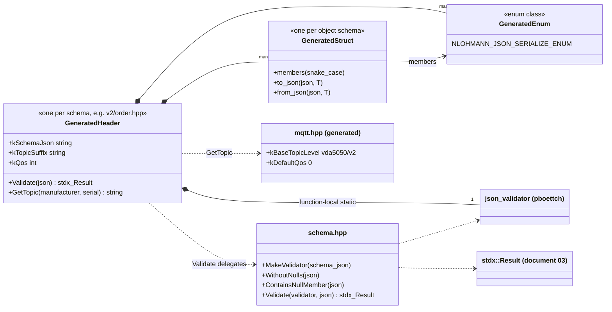

#### 4a.1 `v2/connection.hpp`: `Connection`

The connection message: header fields plus a single enum. Published with QoS 1 (local schema change) and, per VDA 5050, retained, with `CONNECTIONBROKEN` as the broker's last will.

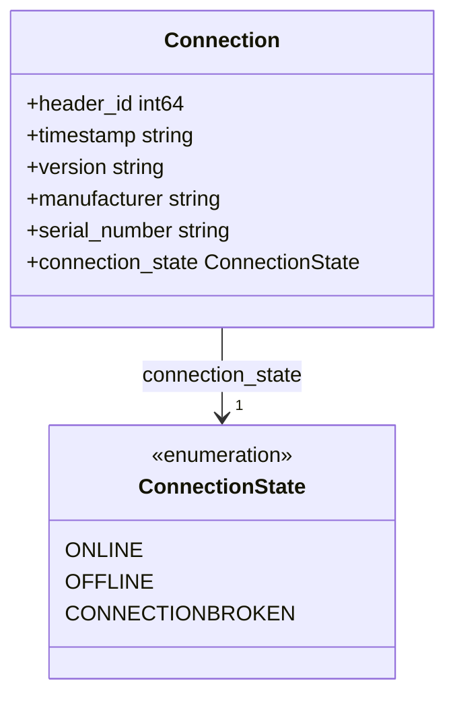

#### 4a.2 `v2/instant_actions.hpp`: `InstantActions`

A list of actions to execute immediately. `ActionParameter.value` is untyped `json`, because the schema allows several types (R6). `Action`, `ActionParameter` and `BlockingType` here are separate C++ types from the ones in `order.hpp`, with the same names in a different namespace.

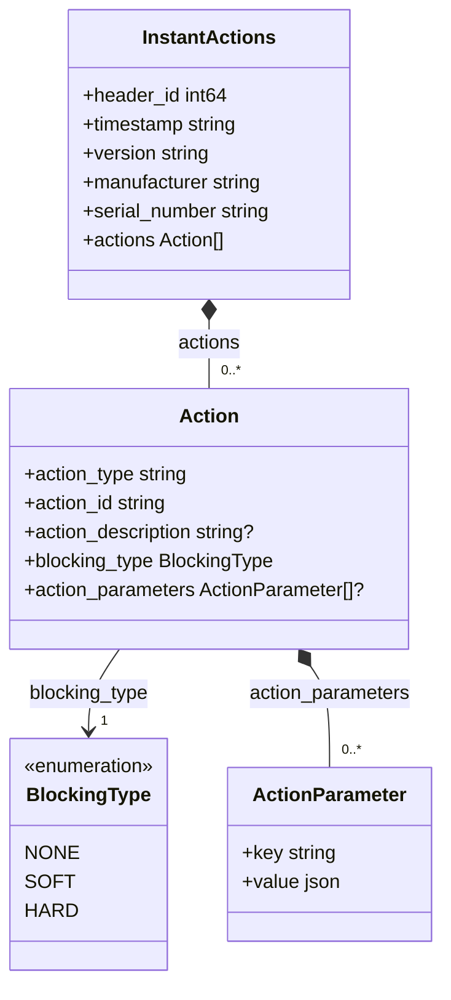

#### 4a.3 `v2/order.hpp`: `OrderMessage`

An order is a graph: nodes and edges interleaved by `sequence_id`, each with actions. Edges may carry a NURBS (Non-Uniform Rational B-Spline) trajectory and a corridor.

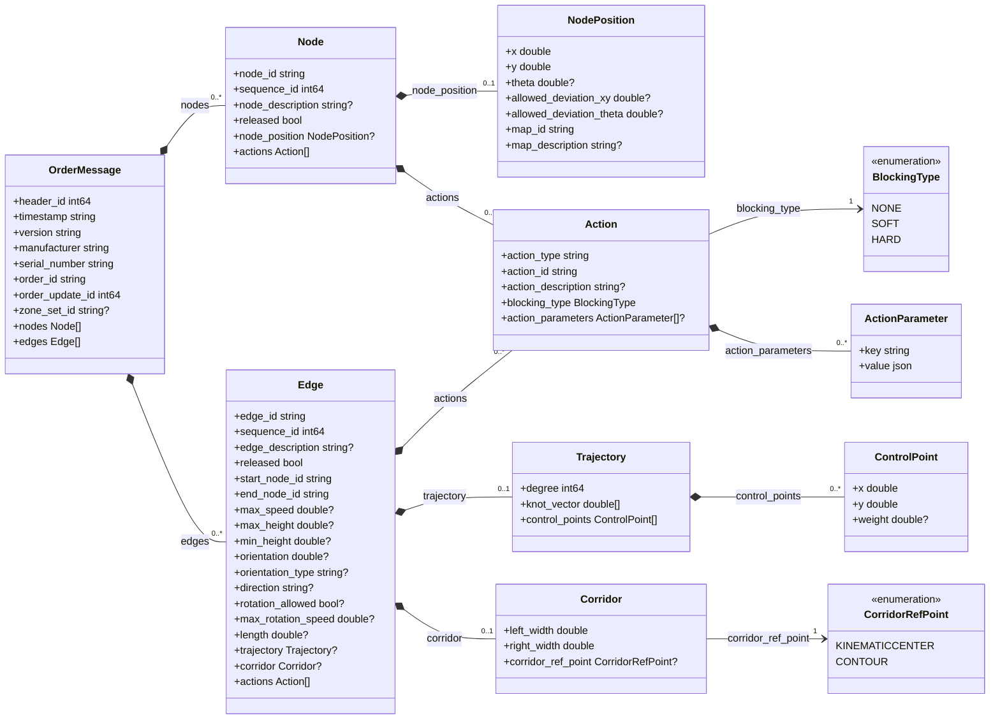

#### 4a.4 `v2/visualization.hpp`: `Visualization`

Position and velocity only, for display.

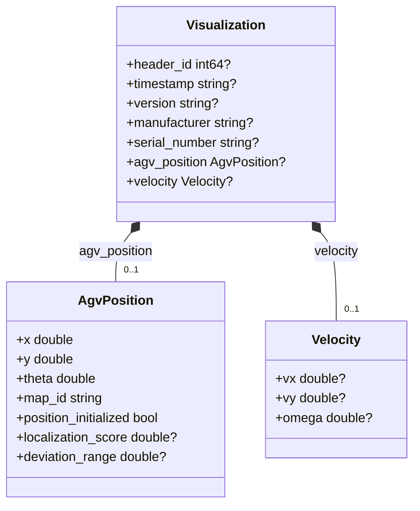

#### 4a.5 `v2/state.hpp`

The vehicle's state message, the largest one at run time. It is split into an overview and three sub-diagrams.

##### 4a.5.1 overview: `State` and its sections

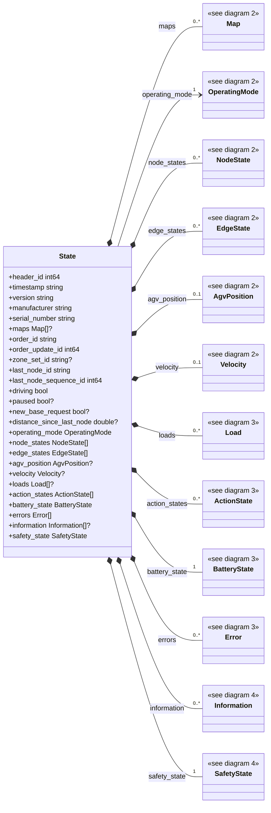

##### 4a.5.2 `Map`, `MapStatus`, `OperatingMode`, `NodeState`, `NodePosition`, `EdgeState` …

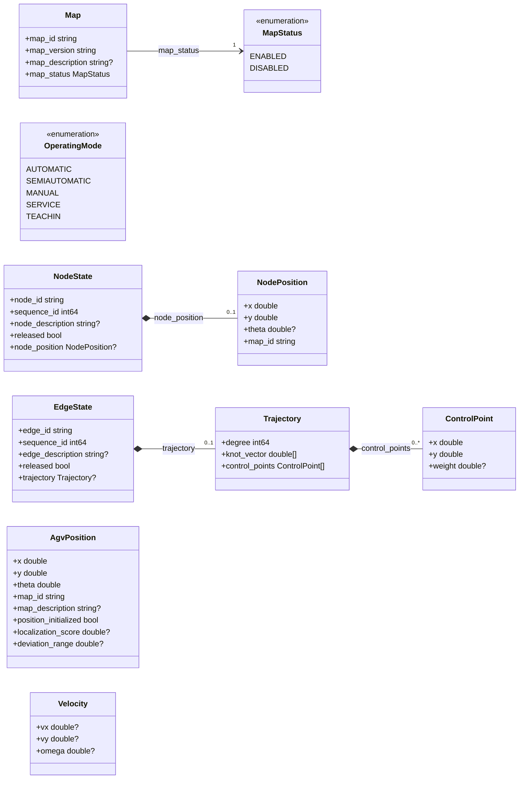

##### 4a.5.3 `Load`, `BoundingBoxReference`, `LoadDimensions`, `ActionState`, `ActionStatus`, `BatteryState` …

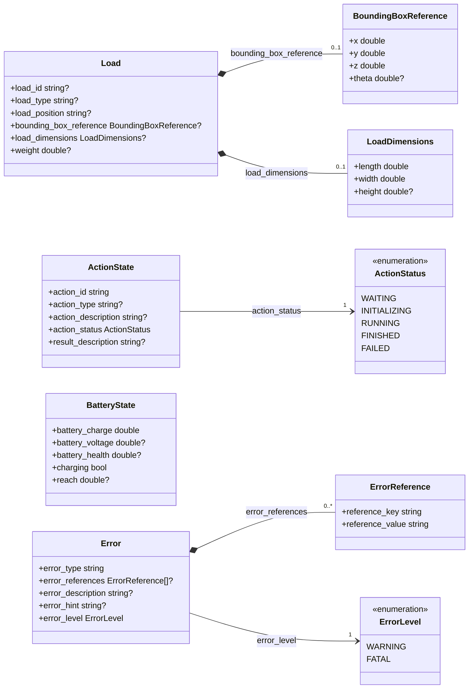

##### 4a.5.4 `Information`, `InfoReference`, `InfoLevel`, `SafetyState`, `EStop`

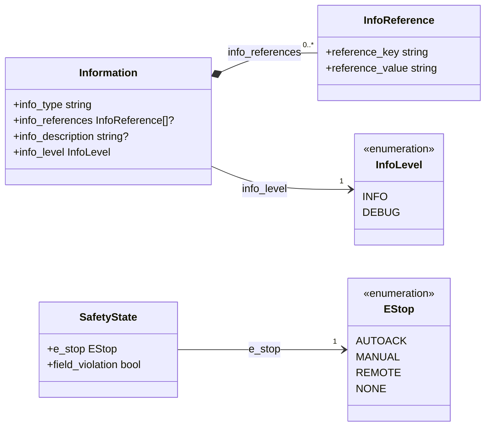

#### 4a.6 `v2/factsheet.hpp`

The vehicle's self-description, the largest schema (24 structs, 8 enums). It is split into an overview and four sub-diagrams; the top-level sections are optional in Volley's copy (R3).

##### 4a.6.1 overview: `AGVFactsheet` and its sections

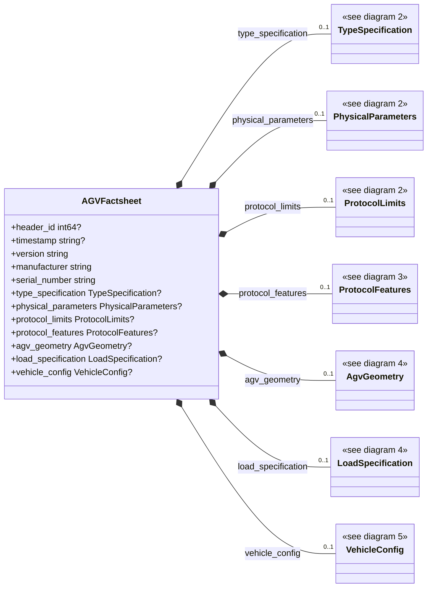

##### 4a.6.2 `TypeSpecification`, `AgvKinematic`, `AgvClass`, `LocalizationType`, `NavigationType`, `PhysicalParameters` …

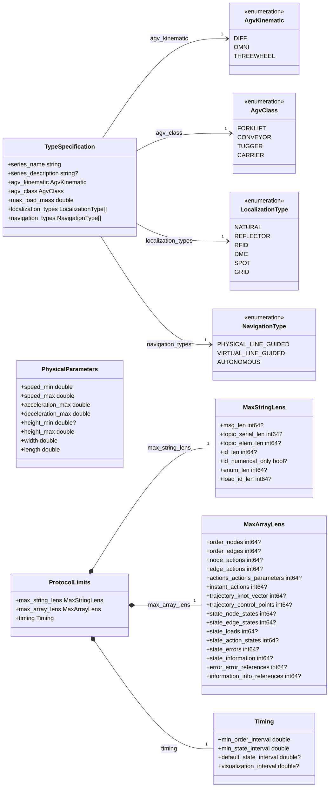

##### 4a.6.3 `ProtocolFeatures`, `OptionalParameter`, `Support`, `AgvAction`, `ActionScope`, `ActionParameter` …

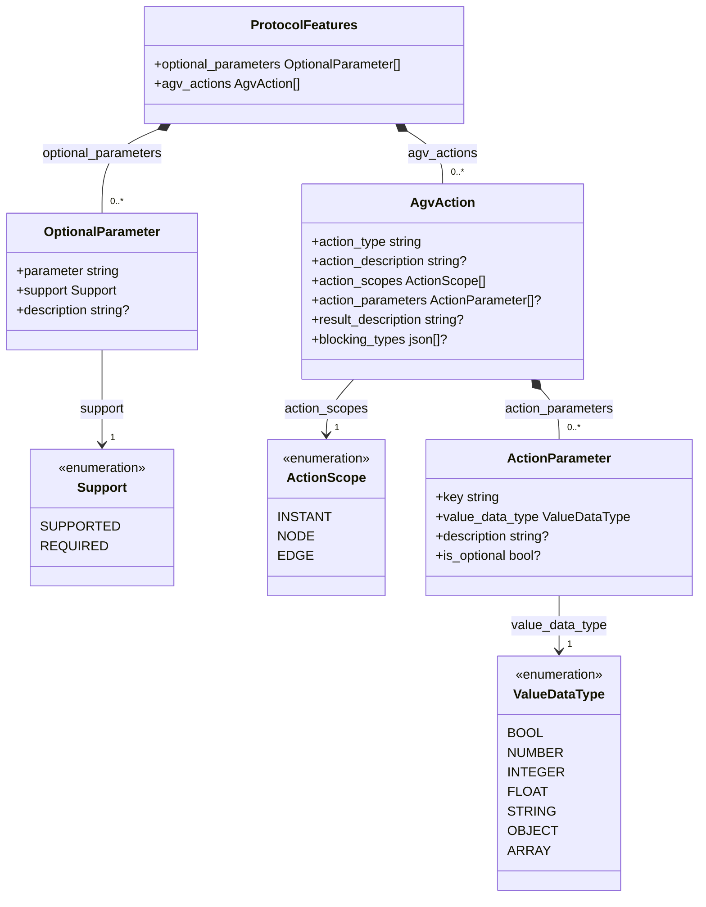

##### 4a.6.4 `AgvGeometry`, `WheelDefinition`, `Type`, `Position`, `Envelopes2d`, `PolygonPoint` …

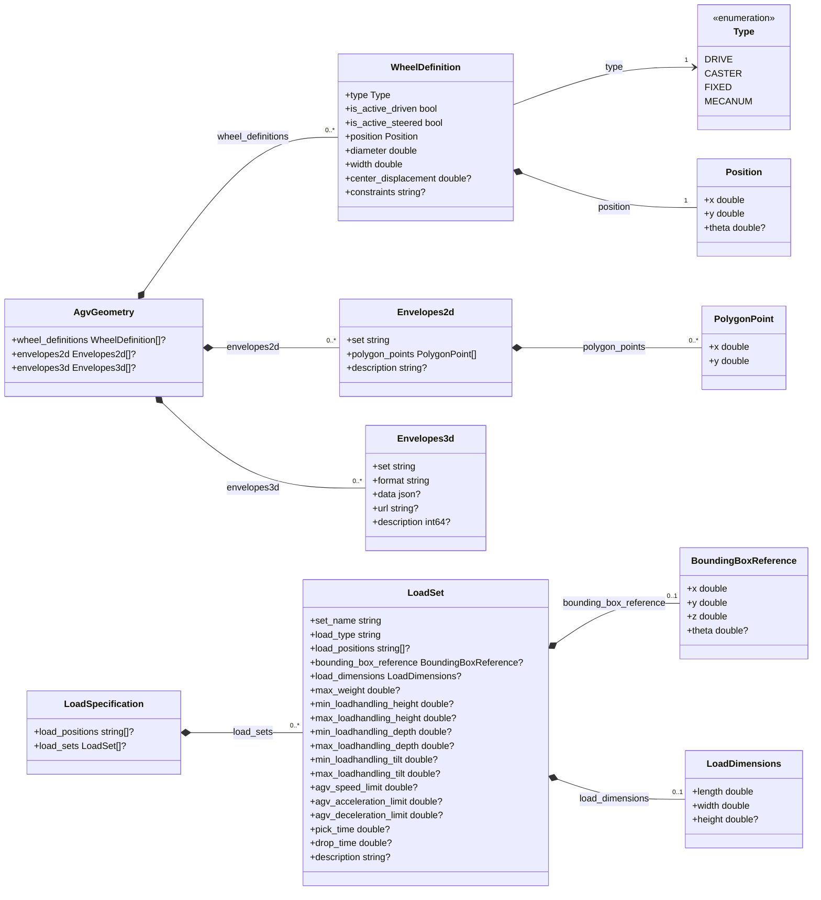

##### 4a.6.5 `VehicleConfig`, `Version`, `Network`

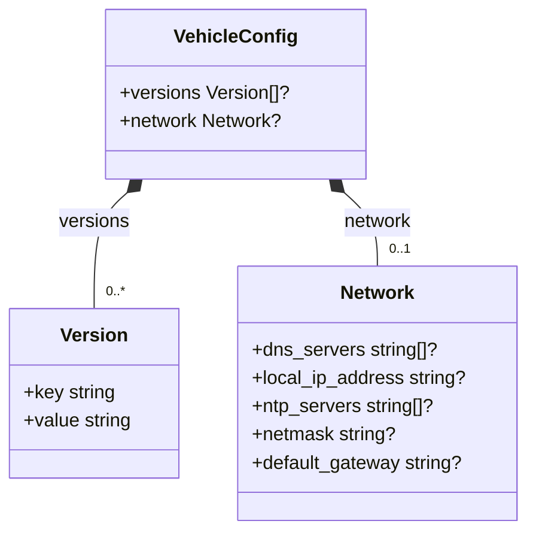

### 4b. Data flow

The package has two flows:
- **build time:** schemas to generated code;
- **run time:** messages through the dependents.

It performs no I/O itself at run time. It makes no ROS topic, service, action or timer calls, and the only lower-layer call is to `stdx`.

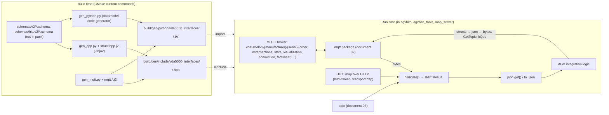

### 4c. State machines

The package implements no state machine. It generates the enums with which VDA 5050 *describes* vehicle and action state (`ActionStatus`, `OperatingMode`, `ConnectionState`, …). Their transitions are defined by the VDA 5050 standard and implemented by the vehicle and by `agvhito`, so they will be documented with `agvhito`.

---

## 5. Behavior

**Build time.**
1. **Configure:**
   - globs every `schemas/**/*.schema`;
   - registers two custom commands per schema;
   - creates the Python package directories and writes empty `__init__.py` files.
2. **Build:** the `vda5050_interfaces_codegen` target runs the generators whenever a schema, script or template changes.
3. **Install:** generated headers go to `include/vda5050_interfaces/`, and the Python package to the ament Python path.

**Run time (in dependents).**
- **The first `Validate()` call for a schema** parses the embedded schema and builds a validator in a function-local `static`. The initialization is thread-safe in C++11 and later; later calls reuse it.
- **Validation cost.** A 2.1.0 `state` message with 200 node states and 200 edge states (20 KB of JSON) validated in **0.39 ms** per call **[probed]**. Section 7 shows what this means at fleet scale.
- **Null handling.** `Validate()` copies the payload only when it contains null members, which is typical for HITO factsheets.
- **No threads, executors, timers or parameters.** The constants are fixed at generation time:

| Setting | Default | Where |
|---|---|---|
| Interface name / version topic levels | `vda5050` / `v2` | `gen_mqtt.py` arguments |
| Default MQTT QoS | 0 | `gen_mqtt.py --default-qos` |
| Per-message QoS | the schema's `qos`, else the default (connection is 1) | schema files |
| Transport | `mqtt` unless the schema says `http` | schema files |
| Python target | 3.12, pydantic v2 | `gen_python.py` |

---

## 6. Ownership and safety

### 6.1 Lifetimes

- Generated structs are plain value types.
- The embedded schema is an `inline constexpr` string literal, with static storage.
- Each schema's validator is a function-local static that lives until the process exits.
- `Validate(validator, payload)` borrows the payload, or a stripped local copy, only for the duration of the call.

### 6.2 Callbacks capturing `this`

Not applicable. The validator's error handler is a local struct, used synchronously.

### 6.3 Locks and atomics

- **None in the package.** The static validator's initialization is guarded by the language.
- **Concurrent validation.** Concurrent calls to `Validate()` share one `json_validator` through its `const` `validate()` member. That is designed to be read-only, but its thread safety is not documented upstream (open question 6).

### 6.4 Error handling

This package mixes two styles, which is why validating *before* parsing matters:

| Step | Style |
|---|---|
| `Validate()` | `stdx::Result`, with all violations joined into one message (for example `/connectionState: instance not found in required enum`) **[probed]**. |
| `json::parse` | Throws `nlohmann::json::parse_error`, unless called with `allow_exceptions = false`. |
| `j.get<T>()` | **Throws** `nlohmann::json::out_of_range` (403, key not found) for a missing required key **[probed]**, and type errors for wrong types. **Does not fail** on unknown enum strings: they map to the first enumerator (R1). |
| Generators | Python exceptions at build time (`ValueError` for non-local `$ref`). |

### 6.5 RISK items

| Item | Risk | Evidence |
|---|---|---|
| R1 | **Unknown enum values parse silently as the first enumerator.** `NLOHMANN_JSON_SERIALIZE_ENUM` maps any unlisted string to the first pair. A connection message with a state unknown to these schemas (a newer firmware, a typo) parses as `ConnectionState::ONLINE`, and an unknown `blockingType` parses as `NONE`. `Validate()` rejects such payloads, but nothing forces callers to call it. The Python models reject them (`ValidationError`). | **[probed]** |
| R2 | **Two-step contract.** Correct use is: parse without exceptions, then `Validate`, then `get<T>()`. Skipping validation leads to R1, or to exceptions from `get<T>()` inside MQTT handling code (document 07 notes that an uncaught throw can take down a thread). A single generated `Parse(json) -> stdx::Expected<T>` would make the safe path the easy one. | **[probed]** |
| R3 | **Local schemas diverge from the standard.** The tests require `connection` QoS 1 (not in the official schema) and factsheet sections that are *optional* (they are required in official 2.1.0). The HITO-specific `transport` key, and the `hitov2` schemas, are Volley additions as well. None of these edits is visible in the pack, and none is documented as a delta against the standard. | **[probed]**: official 2.1.0 fails the factsheet test until those fields are made optional |
| R4 | **The `$schema` declaration is stripped.** The schemas declare draft 2020-12; the validator implements draft-07. The 2.1.0 schemas only use keywords common to both (`definitions`, `$ref`, `enum`, `minimum`/`maximum`, `format`) **[probed: keyword inventory]**. A future schema using 2020-12-only keywords (`$defs`, `prefixItems`, `unevaluatedProperties`, `dependentRequired`) would be partly **ignored silently**, which means under-validation. | **[probed]** |
| R5 | **Generated-struct ergonomics.** (a) Designated initializers that omit optional members fail `-Wmissing-field-initializers` under the workspace's `-Werror`; the package's own test file disables that warning. (b) Required strings, enums and structs have no default member initializer, so `T x;` leaves them default-initialized (enums indeterminate); use `T x{};`. (c) Type names come from heuristics (title, field name, singularization, numeric suffixes on collisions). Running the generator on the VDA 5050 *main* branch (3.0 draft) produced `RequestType` and `RequestType2`, so a schema update can rename types that dependents use. | **[probed]** (a), (c); **[read]** (b) |
| R6 | **Partial typing.** `oneOf`, `anyOf`, type lists and free-form objects become raw `nlohmann::json`; only local `$ref`s are supported. These parts of a message are unchecked at compile time. | **[read]** |
| R7 | **C++ and Python naming drift.** The factsheet class is `AGVFactsheet` in C++ and `AgvFactsheet` in Python; enum members are `ONLINE` / `CONNECTIONBROKEN` in C++ and `online` / `connectionbroken` in Python. Code and documentation that cross languages must translate. | **[probed]** |
| R8 | **Undeclared, unpinned generator toolchain.** Jinja2, datamodel-code-generator and pydantic are required at build time (and pydantic at run time) but are not in `package.xml`. datamodel-code-generator's output, including naming, varies between versions; version 0.83 already warns that its default formatters will change. | **[read]**, **[probed]** warning |
| R9 | **Integer semantics are lost.** All integers become `int64_t` and all numbers `double`. Counters such as `headerId` are unsigned in practice, but the schema has no minimum, so `-5` validates **[probed]**. | **[probed]** |
| R10 | **Unchecked topic segments.** `GetTopic` concatenates `manufacturer` and `serial_number` without checking them. A value containing `/`, `+` or `#` produces a wrong topic, or an MQTT wildcard. | **[read]** |
| R11 | **The MQTT layer cannot express the connection topic's semantics.** VDA 5050 connection messages use QoS 1, the *retained* flag, and the broker's *last will* (`CONNECTIONBROKEN`). The `mqtt` client of document 07 supports retained publishes but has **no last-will option**, so any Volley component that has to act as a vehicle (a simulated AGV in `agvhito_tools`, for example) cannot announce a broken connection correctly. | **[read]** (cross-check with document 07) |
| R12 | **Schema embedded per header.** Every header embeds its full schema (the 2.1.0 factsheet is 46 KB) and the validator code. That costs compile time in every translation unit that includes it, but no run time until `Validate()` is called. | **[read]** |
| R13 | **Missing source material.** The `schemas/` directory and `vda5050.md` are not in the pack, so the exact message definitions Volley ships could not be reviewed (open question 1). | — |

---

## 7. Math

The package has no numerical algorithms. Two quantitative aspects are still useful: how much validation costs at fleet scale, and what the null-handling rule does.

### 7.1 Validation cost at fleet scale

Let $N$ be the number of vehicles, $f$ the state message rate per vehicle, and $c$ the validation time per message. The CPU (Central Processing Unit) share spent validating incoming state messages is

$$
u = N\,f\,c .
$$

With the probed $c \approx 0.39\ \text{ms}$ for a large (20 KB) state message:

| Fleet | Rate | CPU share |
|---|---|---|
| 10 vehicles | 1 Hz | 0.4 % of one core |
| 50 vehicles | 10 Hz | 20 % of one core |

At high rates it is therefore worth validating once at the receive boundary, not again downstream, and not validating `visualization` messages at their higher rates unless needed.

### 7.2 Null normalization

Let $N(\cdot)$ be the transformation applied by `WithoutNulls`: recursively delete every object member whose value is `null`, and leave array elements as they are. `Validate` checks $N(p)$ rather than $p$:

$$
\text{valid}(p) \iff N(p) \models S .
$$

Here $p \models S$ means "payload $p$ conforms to schema $S$". Consequences:
- **an optional field sent as `null`** is accepted, as if it were absent;
- **a required field sent as `null`** is rejected, because it is missing from $N(p)$;
- **a `null` array element** is checked against the item schema, and rejected unless the schema allows null.

The generated `from_json` treats `null` exactly like an absent key for optionals. As long as validation precedes parsing, the C++ objects are consistent with what was validated. The tests cover all three cases.

---

## 8. Tests

The package has 15 C++ tests (gtest) and 12 Python tests (pytest), which mirror each other.

**Reproduced here.** The 5 C++ and 5 Python tests that need only the `v2` schemas pass **[probed]**:
- generated from the official 2.1.0 schemas, plus the two local modifications the tests imply;
- compiled with `volley_package()`'s warning set and `-Werror`.

The remaining tests need HITO's `hitov2` schemas, which are not in the pack.

| Test (C++ / Python) | Covers | What it reveals about intended behavior |
|---|---|---|
| `TopicHelpers.TopicPaths` / `test_topic_paths` | `GetTopic` for VOLLEY and HITO vehicles, and for the HITO common message | Topics are built per manufacturer and serial (Volley vehicles appear as manufacturer `VOLLEY`, serial `16`). |
| `TopicHelpers.TopicQos` / `test_topic_qos` | connection QoS 1; others default (0) | Matches VDA 5050's QoS rules for connection versus other topics. |
| `EmbeddedSchema.NonEmptyAndParseable` | The embedded schema text; HITO map `transport: http` | Not every schema is an MQTT message. |
| `HitoMap.*`, `HitoCommonMessage.*` | Round trips, optional omission, required fields | camelCase on the wire, snake_case in code. |
| `V2Connection.EnumRoundTrip`, `V2InstantActions.ActionItemRoundTrip`, `V2Factsheet.EnumSerialization` | Enums and nested arrays | Enum strings are exactly the schema values. |
| `V2Factsheet.ExplicitNullObjectsDeserializeAsEmptyOptionals` | HITO's real-world factsheet with null sections | The reason for the null handling, and for the factsheet schema modification (R3). |
| `Validation.*` | Accepts valid input; rejects null array elements, null or missing required fields, and wrong types | Error messages name the offending field (`mapId`). |
| Python-only | pydantic rejection; `State` import; `model_json_schema` | Python validates on construction. |

**Gaps.**
- **No test that an unknown enum string is handled** (R1). It would fail today in C++, which silently picks the first enumerator.
- **No test that the generated code compiles without warnings in a consumer.** The suppression pragma hides R5(a).
- **No golden-file or snapshot test of the generated names.** A generator or schema change that renames types (R5c, R8) would only show up in dependents.
- **No test against the official VDA 5050 example messages**, and no diff check between the local schemas and the upstream release (R3).
- **No large-message or performance test** (section 7.1).

---

## 9. Idioms to reuse, and open questions

### 9.1 Idioms

- **Generate types from the authoritative schema; never hand-write VDA 5050 structs.** The generator comments ask that changes go through the generators too ("ripe for Claude").
- **Receive path:** parse with `allow_exceptions = false`, then `Validate()` (log the `Result` error), then `get<T>()`. Never call `get<T>()` on unvalidated input (R1, R2).
- **Send path:** value-initialize (`T msg{};`), fill fields, `nlohmann::json(msg).dump()`, publish on `GetTopic(...)` with `kQos`.
- **Keep all topic layout in `mqtt.hpp` and the per-schema `kTopicSuffix`**, as `common` and `rclcppx` do for ROS topics.
- **Treat `null` as absent consistently.** `schema::Validate` and `from_json` already do; keep custom code consistent with them.
- **Return validation failures as `stdx::Result` with every violation listed.** This pattern is worth reusing for other JSON boundaries (layouts, HTTP APIs).

### 9.2 Open questions for the team

1. Could `vda5050.md` and the `schemas/` directory be shared? This document reconstructs the generated API from the official 2.1.0 schemas; the actual local copies and their deltas (R3) should be reviewed.
2. Should the generator emit a `Parse(json) -> stdx::Expected<T>` that validates and converts in one step, and should unknown enum strings fail in `from_json` instead of mapping to the first value (R1, R2)?
3. Should generated structs get default member initializers for all required fields, so designated initializers and `T x;` are warning-free and safe (R5)?
4. Should Jinja2, datamodel-code-generator and pydantic be declared and pinned, and the generated output checked against snapshots (R7, R8)?
5. Is a VDA 5050 3.0 migration expected? The main-branch schemas already produce different type names (R5c) and may use 2020-12-only keywords (R4).
6. Is `Validate()` called concurrently from several threads? If so, can the upstream validator's thread safety be confirmed (section 6.3)?
7. Does any Volley component act as a VDA 5050 *vehicle* (simulation, test tools)? If so, the `mqtt` package needs last-will support (R11).
