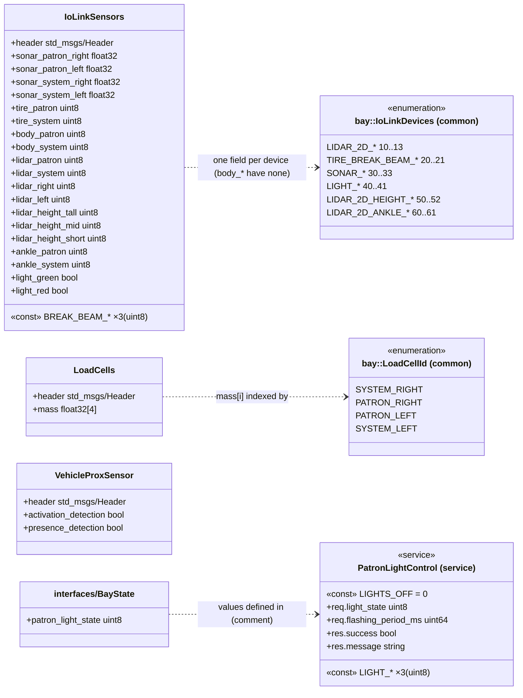
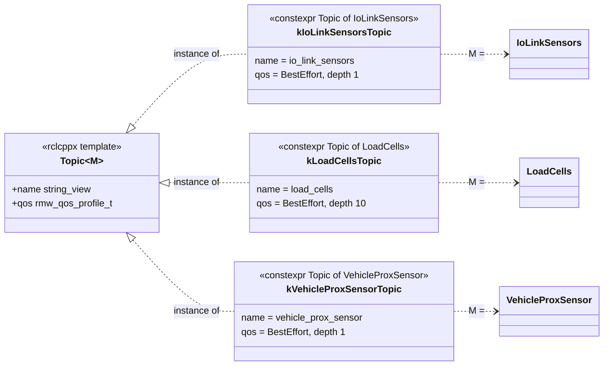
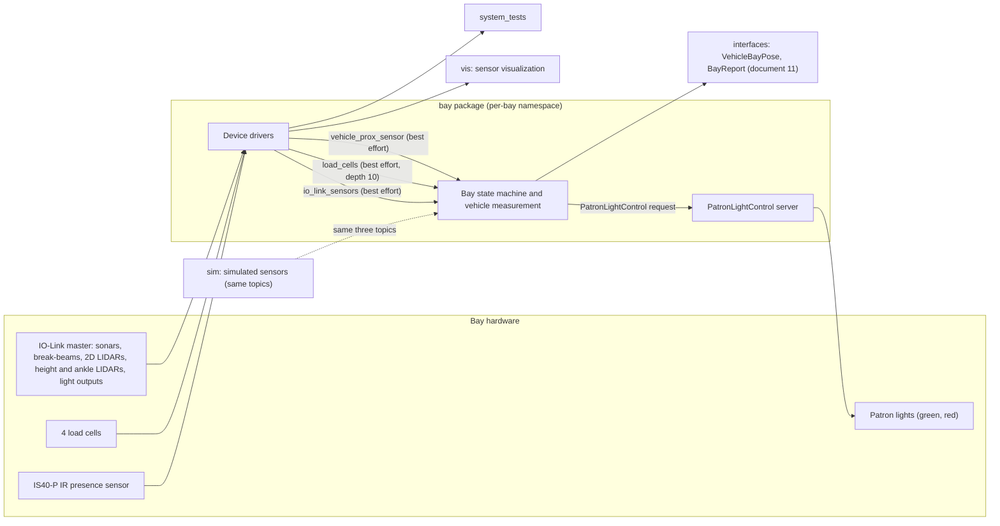
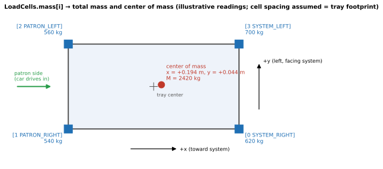
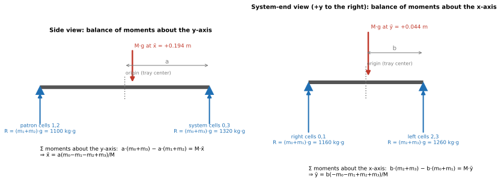
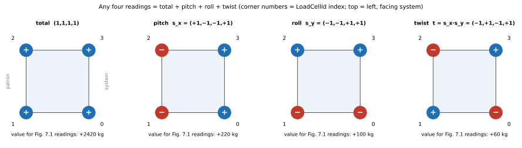

# 13 — `bay_interfaces`

| Generated | Revision | Source pack | Status |
|---|---|---|---|
| 2026-10-07 | 2 | `P13-bay_interfaces-part1of1.md` | Draft, generated by Claude, not yet reviewed by the team |

Package 13 of 37 (bottom-up) · dependency depth 2

Workspace dependencies: rclcppx (document 02); indirectly volley_cmake (document 10).
Used by: bay, sim, system_tests, vis.

Related documents:
- `01-common.md`: `bay::LoadCellId`, `bay::IoLinkDevices` and the tray constants;
- `02-rclcppx.md`: `Topic<M>` and the QoS presets;
- `10-volley_cmake.md`: `volley_verify_headers`, and its GCC (GNU Compiler Collection) problem R12;
- `11-interfaces.md`: `BayReport`, `VehicleBayPose`, and `BayState`, which points to this package's service.

**How to read the evidence markers.**
- **[read]** means the conclusion comes from reading the definitions.
- **[rosidl]** means it follows from ROS 2 (Robot Operating System 2) interface-generation rules.
- **[inferred]** means it is a reading of names and comments that the team should confirm.

No ROS install was available, so the package was not built. The Mermaid diagrams pass the Mermaid 11 parser.

---

## A. External dependencies

`bay_interfaces` is a small interface package: three messages and one service, plus a C++ header of **typed topic constants** built on `rclcppx`. It is the first package in this series that actually uses `rclcppx::Topic<M>`, confirming the definition pattern predicted in document 02.

| Name | Description | Version | Link | Usage in this package |
|---|---|---|---|---|
| rosidl_default_generators / runtime | ROS interface code generators (rosidl, the ROS Interface Definition Language tooling) and their runtime. | Same ROS 2 distribution (Kilted or newer, see document 02). | https://github.com/ros2/rosidl_defaults | `rosidl_generate_interfaces`; `rosidl_get_typesupport_target`. |
| std_msgs | Standard messages. | Same. | https://github.com/ros2/common_interfaces | `std_msgs/Header` in all three messages. |
| `rclcppx` (workspace) | Typed topics and QoS (Quality of Service) presets (document 02). | Workspace. | — | `Topic<M>`, `kQoSProfileBestEffort`, `QoSProfileWithDepth` in `topics.hpp`. |
| `volley_cmake` (workspace) | Build conventions (document 10). | Workspace. | — | `volley_package()`, **`volley_verify_headers`** (its first use in this series), `volley_ament_auto_package()`. |
| Sensor hardware (run time, via `bay`) | IO-Link (a point-to-point industrial sensor protocol, standardized as IEC 61131-9; IEC = International Electrotechnical Commission) sensors from SICK and Wenglor, four load cells, an IS40-P IR (infrared) presence sensor, and patron lights. | — | — | What the messages describe; device and vendor ids are in `common/devices_bay.hpp`. |

---

## B. Glossary

Terms already defined in documents 01–12 (bay, tray, patron and system side, IO-Link, LIDAR (Light Detection and Ranging), QoS, best effort, `Topic<M>`, and so on) are reused here.

| Term | Meaning | Where it shows up |
|---|---|---|
| Break-beam semantics | A sensor reported as a beam that is either *open* (nothing detected) or *broken* (something detected). Here the 2D LIDARs are reported this way too, as virtual beams or zones. | `BREAK_BEAM_*` |
| Sonar | Ultrasonic distance sensor (SICK UM30), reported in metres. | `sonar_*` |
| Tire / body break-beams | Optical beams at tire height and at body height on the patron and system ends. | `tire_*`, `body_*` |
| Height-check LIDARs | Three LIDAR planes at different heights, used to classify vehicle height. | `lidar_height_*` |
| Ankle LIDARs | LIDAR planes near the floor that detect people (feet and ankles) in the bay. | `ankle_*` |
| Load cell | A force sensor under a tray-support corner, reported as mass in kg. | `LoadCells` |
| IS40-P | Model name of the IR presence sensor; comments call it "IR presence sensor" with *activation* and *presence* outputs. | `VehicleProxSensor` |
| Patron lights | The green and red lights outside the bay that tell the driver what to do. | `light_*`, `PatronLightControl` |
| Center of mass | The mass-weighted mean position of the load. | Section 7 |

---

## 1. Summary

`bay_interfaces` defines the **raw sensor and actuator interface of a parking bay**:
- `IoLinkSensors` is a snapshot of every IO-Link sensor (sonars, break-beams, 2D LIDARs used as beams, height and ankle LIDARs) and of the patron light states;
- `LoadCells` holds the four corner masses;
- `VehicleProxSensor` holds the IR presence-sensor bits;
- `PatronLightControl` is a service that sets the patron lights (off, green, red, red flashing).

`topics.hpp` gives each message a **typed, `constexpr` topic definition** with its QoS, so the bay node, the simulator, the visualizer and the system tests all publish and subscribe identically.

**Place in the stack.** This package sits between the hardware and the higher-level bay messages in `interfaces`:
- the `bay` package reads these raw signals;
- it turns them into `interfaces/VehicleBayPose` (vehicle size, mass and position, plus the error bitfield) and `interfaces/BayReport`;
- `sim` presumably publishes the same raw topics, so that the real bay logic can run against a simulated bay *(inferred)*.

The package also **resolves an open item from document 11**: `interfaces/BayState.patron_light_state` refers to `PatronLightControl.srv`, which lives *here*. That is a cross-package reference by comment only, since `interfaces` does not depend on this package (R5).

**Quality.** The definitions are compact and mostly well defaulted. A break-beam that was never set reads `BREAK_BEAM_INVALID`, and an unset light command means "lights off". The concerns are:
- the sonar distances have no "invalid" value (R2);
- the field naming differs from `common`'s device enum, and the body break-beams have no device id at all (R3);
- the package uses `volley_verify_headers`, which document 10 found cannot pass under GCC with warnings as errors. This is a strong hint about which compiler the workspace really uses (R1).

---

## 2. Files

The package has seven files. Line counts are from the pack, which has blank lines removed.

| Path (under `src/interfaces/bay_interfaces/`) | Lines | Role |
|---|---:|---|
| `include/bay_interfaces/topics.hpp` | 18 | `constexpr rclcppx::Topic<M>` definitions for the three message topics (names and best-effort QoS). |
| `msg/IoLinkSensors.msg` | 27 | Break-beam enum, header, 4 sonar distances, 4 break-beams, 4 LIDAR beams, 3 height LIDARs, 2 ankle LIDARs, 2 light states. |
| `msg/LoadCells.msg` | 4 | Header plus `float32[4] mass`, indexed by `bay::LoadCellId`. |
| `msg/VehicleProxSensor.msg` | 4 | Header plus the IS40-P activation and presence bits. |
| `srv/PatronLightControl.srv` | 9 | Light-state enum; request `light_state` and `flashing_period_ms`; response `success`, `message`. |
| `CMakeLists.txt` | 24 | Generates the interfaces; runs `volley_verify_headers` on `include/` against the C++ type support. |
| `package.xml` | 17 | Interface package; depends on rclcppx and std_msgs. |

---

## 3. Public API

The API (Application Programming Interface) consists of:
- the generated types `bay_interfaces::msg::{IoLinkSensors, LoadCells, VehicleProxSensor}` and `bay_interfaces::srv::PatronLightControl`, plus their Python equivalents **[rosidl]**;
- the hand-written C++ header `bay_interfaces/topics.hpp`.

### 3.1 `IoLinkSensors` — one snapshot of all IO-Link inputs

**Purpose.** One message carries the complete state of the bay's IO-Link sensor ring, so consumers see a consistent set of readings.

| Group | Fields | Type and meaning | Device in `common` (`bay::IoLinkDevices`) |
|---|---|---|---|
| Sonars | `sonar_patron_right`, `sonar_patron_left`, `sonar_system_right`, `sonar_system_left` | `float32`, distance in m | `SONAR_PATRON_LEFT` … `SONAR_PATRON_RIGHT` (30–33), UM30 |
| Tire break-beams | `tire_patron`, `tire_system` | `BREAK_BEAM_*` | `TIRE_BREAK_BEAM_PATRON/SYSTEM` (20–21), OPT2130 |
| Body break-beams | `body_patron`, `body_system` | `BREAK_BEAM_*` | **none** (R3) |
| 2D LIDARs (parking window) | `lidar_patron`, `lidar_system`, `lidar_right`, `lidar_left` | `BREAK_BEAM_*` | `LIDAR_2D_PATRON` … `LIDAR_2D_RIGHT` (10–13), TIM150 |
| Height LIDARs | `lidar_height_tall`, `lidar_height_mid`, `lidar_height_short` | `BREAK_BEAM_*` | `LIDAR_2D_HEIGHT_*` (50–52) |
| Ankle LIDARs | `ankle_patron`, `ankle_system` | `BREAK_BEAM_*` (people detection) | `LIDAR_2D_ANKLE_*` (60–61) |
| Lights | `light_green`, `light_red` | `bool`, true = on | `LIGHT_RED`, `LIGHT_GREEN` (40–41) |

The beam states are `BREAK_BEAM_INVALID = 0`, `BREAK_BEAM_OPEN = 1` and `BREAK_BEAM_BROKEN = 2`. Because invalid is 0, a beam that was never filled in reads as invalid, not as clear. That is the safe default that `vrc_interfaces` lacked (document 04, R1).

**How the readings are used.** These raw readings are what `interfaces/VehicleBayPose` summarizes: the `ERROR_FLAG_LIDAR_*_TRIPPED` and `ERROR_FLAG_TIRE_*_TRIPPED` bits, `ERROR_FLAG_TOO_TALL` from the height LIDARs, and `bounding_box_clear` *(inferred)*.

### 3.2 `LoadCells`

`float32[4] mass`, in kg, with the array index equal to the integer value of `bay::LoadCellId`:

| Index | `LoadCellId` | Position (left and right as seen by a driver entering) |
|---:|---|---|
| 0 | `SYSTEM_RIGHT` | system end, right |
| 1 | `PATRON_RIGHT` | patron end, right |
| 2 | `PATRON_LEFT` | patron end, left |
| 3 | `SYSTEM_LEFT` | system end, left |

The order goes *around* the tray rather than row by row. Section 7 shows how total mass and center of mass follow from it. The coupling to a C++ enum in another package is implicit (R4).

### 3.3 `VehicleProxSensor`

This message carries two booleans from the IS40-P infrared presence sensor:
- `activation_detection`: the "activation/pulse detection" output;
- `presence_detection`: the "presence detection" output.

The exact semantics come from the sensor's datasheet and are not described further here.

### 3.4 `PatronLightControl` (service)

| Part | Fields |
|---|---|
| Constants | `LIGHTS_OFF = 0`, `LIGHT_GREEN = 1`, `LIGHT_RED = 2`, `LIGHT_RED_FLASHING = 3` |
| Request | `uint8 light_state`; `uint64 flashing_period_ms` ("if applicable") |
| Response | `bool success`; `string message` |

**Purpose.** Command the outside lights that guide the driver. A default request switches the lights *off*, which is harmless. The service is presumably served by the bay's light controller and called by the bay state machine *(inferred)*.

The reported state in `IoLinkSensors` (`light_green`, `light_red`) is a momentary on/off sample. It cannot show *flashing*: a flashing red light appears as alternating samples.

### 3.5 Typed topics — `include/bay_interfaces/topics.hpp`

```cpp
namespace bay_interfaces {
inline constexpr volley::rclcppx::Topic<msg::IoLinkSensors> kIoLinkSensorsTopic{
    .name = "io_link_sensors", .qos = volley::rclcppx::kQoSProfileBestEffort};
inline constexpr volley::rclcppx::Topic<msg::LoadCells> kLoadCellsTopic{
    .name = "load_cells", .qos = volley::rclcppx::QoSProfileWithDepth(volley::rclcppx::kQoSProfileBestEffort, 10)};
inline constexpr volley::rclcppx::Topic<msg::VehicleProxSensor> kVehicleProxSensorTopic{
    .name = "vehicle_prox_sensor", .qos = volley::rclcppx::kQoSProfileBestEffort};
}
```

| Constant | Topic name (relative) | Message | QoS |
|---|---|---|---|
| `kIoLinkSensorsTopic` | `io_link_sensors` | `IoLinkSensors` | best effort, keep last 1 |
| `kLoadCellsTopic` | `load_cells` | `LoadCells` | best effort, keep last 10 |
| `kVehicleProxSensorTopic` | `vehicle_prox_sensor` | `VehicleProxSensor` | best effort, keep last 1 |

**Design.**
- This is exactly the intended `rclcppx` idiom: typed, `constexpr`, with QoS chosen by intent. Best effort suits these replaceable sensor streams.
- `QoSProfileWithDepth` keeps 10 load-cell samples. That suits a consumer that averages them, such as `VehicleBayPose`'s mass mean and standard deviation.
- The names are relative, so each bay node's namespace separates bays. The topics are therefore `/<bay namespace>/io_link_sensors` and so on.

**Usage.**

```cpp
#include <bay_interfaces/topics.hpp>
#include <rclcppx/interface_factories.hpp>

io_pub_  = volley::rclcppx::CreatePublisher(this, bay_interfaces::kIoLinkSensorsTopic);
lc_sub_  = volley::rclcppx::CreateSubscription(this, bay_interfaces::kLoadCellsTopic,
             [this](const bay_interfaces::msg::LoadCells& m) { OnLoadCells(m); });
light_srv_ = volley::rclcppx::CreateService<bay_interfaces::srv::PatronLightControl>(this, "patron_light_control",
             [this](auto req, auto res) { SetLights(*req, *res); });
```

This is illustrative: the service name is not defined in the package, which has no constant for it (R6). Python users (`system_tests`) cannot use the C++ header and must repeat the names and QoS (R6).

---

## 4. Diagrams

### 4a. Class diagram (ownership on edges)

There is no inheritance. The messages compose `std_msgs/Header` (listed but not drawn as an edge). Each `Topic` constant is a value of the class template `rclcppx::Topic<M>`, typed by its message and owning its QoS profile by value. Dashed arrows show the implicit couplings to C++ enums in `common` and to `interfaces/BayState`.





### 4b. Data flow

The package itself has no runtime. The flow shows how its types connect the hardware, the bay node and the other users. The producers and consumers are **[inferred]** from the "used by" list and document 11.



### 4c. State machines

No state machine. The `BREAK_BEAM_*` and `LIGHT_*` constants are value vocabularies; any sequencing (for example red flashing, then green) belongs to the bay state machine and will be documented with the `bay` package.

---

## 5. Behavior

**Construction, steady state, shutdown.** These do not apply: the package produces generated types and one header, and has no runtime. Behavior worth knowing about the generated code **[rosidl]**:

| Field | Default | Meaning |
|---|---|---|
| Break-beam fields | 0 = `BREAK_BEAM_INVALID` | Safe: unset is "unknown", not "clear". |
| Sonar distances | 0.0 m | Indistinguishable from "object touching the sensor" (R2). |
| `mass[4]` | 0.0 kg each | An unfilled message means an empty tray. |
| `light_*`, proximity bits | `false` | Off / not detected. |
| `PatronLightControl.light_state` | 0 = `LIGHTS_OFF` | Harmless. |
| `flashing_period_ms` | 0 | Undefined behavior for flashing (R7). |

**Build.** `volley_verify_headers(DIRECTORY include LINK_LIBRARIES <cpp typesupport>)` compiles `topics.hpp` on its own, in an object library. That checks the header is self-contained and gives clangd and clang-tidy a compile entry for it. It is linked against the generated C++ type support, so the generated message headers resolve.

**Executors, threads, timers, parameters.** None in this package. Topic names and QoS are fixed at compile time.

---

## 6. Ownership and safety

### 6.1 Lifetimes

- Messages own their data by value.
- The topic constants are `inline constexpr` objects whose `name` views string literals (static storage). That is the safe case of `rclcppx` R5.

### 6.2 Callbacks capturing `this`

Not applicable.

### 6.3 Locks and atomics

Not applicable.

### 6.4 Error handling

| Mechanism | Where |
|---|---|
| Per-reading invalid state | Break-beam values (`BREAK_BEAM_INVALID`). |
| Service response | `success` + `message` (`PatronLightControl`). |
| Compile-time | Typed topics reject a callback with the wrong message type (`rclcppx`). |

### 6.5 RISK items

| Item | Risk | Evidence |
|---|---|---|
| R1 | **`volley_verify_headers` and the compiler.** Document 10 (R12) found that `volley_verify_headers` cannot pass with GCC 13 and `-Werror`, because GCC always warns about `#pragma once` in a main file and has no flag to silence it; `topics.hpp` uses `#pragma once`. Since this package calls it, either the workspace builds with **Clang**, or `WARNINGS_AS_ERRORS` is off, or this target fails on GCC builds. | **[read]** + probe in document 10 |
| R2 | **No invalid value for sonar distances.** `float32` distances have no flag; 0.0 m (the default) looks like an object touching the sensor. Consumers cannot tell "no echo" or "sensor fault" from a reading unless NaN is used by convention, which is not documented. | **[read]** |
| R3 | **Field names and device ids do not line up.** The body break-beams (`body_patron`, `body_system`) have no entry in `bay::IoLinkDevices`; either they are not IO-Link devices or the enum is incomplete. The sonar field order (patron right, patron left, system right, system left) differs from the enum order (patron left, system left, system right, patron right). That is harmless for named fields, but easy to get wrong in mapping tables. | **[read]** (cross-check with `common/devices_bay.hpp`) |
| R4 | **Array index defined by a C++ enum elsewhere.** `mass[i]` is ordered by `bay::LoadCellId` in `common`, which Python consumers (`system_tests`) cannot see. The order goes around the tray (0 system-right, 1 patron-right, 2 patron-left, 3 system-left); a consumer assuming row-major order computes both center-of-mass coordinates wrongly, including a flipped lateral sign in the worked example (section 7.6). | **[read]** |
| R5 | **A reference by comment across packages.** `interfaces/BayState.patron_light_state` says its values are "defined in `PatronLightControl.srv`", which lives in this package. `interfaces` does not depend on `bay_interfaces`, so nothing keeps the two in step. Document 11 had listed this reference as dangling (R6 there); it is resolved, but only informally. | **[read]** |
| R6 | **Names exist only in C++.** Topic names and QoS exist only in `topics.hpp`, and there is no constant for the service name. Python users and the simulator must repeat them. | **[read]** |
| R7 | **`flashing_period_ms` is not validated.** It is `uint64` milliseconds "if applicable": 0, or an absurdly long period, with `LIGHT_RED_FLASHING` is undefined; it is 0 by default. Other light states ignore it. | **[read]** |
| R8 | **Best effort for safety-relevant inputs.** Ankle (people) and LIDAR beam states travel best effort with depth 1, so an individual update can be lost, and the next one replaces it. That is acceptable for continuously refreshed state, but safety decisions must not depend on observing a short transient in one message. Ideally they run in the node that reads the hardware directly. | **[read]**, `rclcppx` semantics |

---

## 7. Math

The messages carry raw readings. The main computation that consumers perform on them is turning the four load-cell readings into the **total mass and the position of the load**, which `interfaces/VehicleBayPose` reports (`mass`, plus `x` and `y` "relative to the center of the tray"). The actual implementation lives in `bay` and will be checked in that document. This section **derives** the standard formulation from first principles, so the implementation can be compared against it **[inferred]**.

### 7.1 Set-up and assumptions

**Coordinates.** These follow `VehicleBayPose`:
- the origin is the tray center;
- $x$ runs along the tray length, positive toward the system side;
- $y$ runs along the width, positive to the left (facing the system side);
- $z$ points up.

The cells sit at the corners of a rectangle with half-spacings $a$ (along $x$) and $b$ (along $y$). In `LoadCellId` order (section 3.2):

$$
p_0=(+a,-b),\quad p_1=(-a,-b),\quad p_2=(-a,+b),\quad p_3=(+a,+b),
$$

where $p_0$ is system-right, $p_1$ patron-right, $p_2$ patron-left and $p_3$ system-left. It is convenient to write each position as $p_i=(a\,s_{x,i},\ b\,s_{y,i})$, with sign vectors

$$
s_x=(+1,-1,-1,+1),\qquad s_y=(-1,-1,+1,+1).
$$

**Readings.** A cell measures the vertical force $F_i$ it supports, reported in kilograms as $m_i = F_i/g$. The factor $g$ cancels in everything below.

**Assumptions:**
1. **Static load:** nothing is accelerating, so the forces are in equilibrium. This is why the bay averages readings, using the depth-10 topic queue (section 3.5) and `mass_total_mean` / `mass_total_standard_deviation` in `VehicleBayPose`.
2. **The cells measure only vertical force:** there are no side loads, and no friction moments.
3. **The tray and car together act as one rigid body**, whose weight $Mg$ acts at its center of mass $(\bar x, \bar y)$.
4. **The cells are tared and calibrated;** offsets and gain errors are discussed in 7.5.

### 7.2 Derivation from static equilibrium

A rigid body at rest has zero net force and zero net moment. For a planar layout with vertical forces only, that gives **three** equations.

**Vertical force balance.** The cells together hold up the whole weight:

$$
\sum_{i=0}^{3} F_i - Mg = 0 \quad\Longrightarrow\quad M=\sum_{i=0}^{3} m_i .
$$

**Moment balance about the $y$-axis (pitch).** A vertical force $F$ at horizontal position $x$ produces a moment $x\,F$ about the $y$-axis through the origin. The cell reactions push up, and the weight pushes down, at $\bar x$. Their moments must cancel:

$$
\sum_{i} x_i\,F_i - \bar x\,Mg = 0
\quad\Longrightarrow\quad
\bar x = \frac{\sum_i x_i\, m_i}{\sum_i m_i}.
$$

**Moment balance about the $x$-axis (roll).** In the same way:

$$
\bar y = \frac{\sum_i y_i\, m_i}{\sum_i m_i}.
$$

These are exactly the definition of a **weighted average**: the center of mass is the average of the cell positions, weighted by how much each cell carries.

**Substituting the corner positions** $x_i = a\,s_{x,i}$ and $y_i = b\,s_{y,i}$:

$$
\boxed{\;\bar x=\frac{a\,(m_0-m_1-m_2+m_3)}{M},\qquad
\bar y=\frac{b\,(-m_0-m_1+m_2+m_3)}{M}\;}
$$

**The intuition.** Group the cells by end. Along $x$, the system pair $(m_0+m_3)$ and the patron pair $(m_1+m_2)$ act like the two supports of a beam of length $2a$. Taking moments about the center:

$$
a\,(m_0+m_3) - a\,(m_1+m_2) = M\,\bar x .
$$

The load sits toward whichever end carries more. If both ends carry the same, $\bar x=0$; if one end carries everything, $\bar x=\pm a$. The $y$ direction works the same way, with the left pair $(m_2+m_3)$ against the right pair $(m_0+m_1)$.



*Figure 7.1 — Top view: the four cells in `LoadCellId` order, with illustrative readings and the resulting center of mass. The cell spacing is assumed equal to the tray footprint (14 ft × 7 ft from `common/constants.hpp`, so $a$ = 2.134 m and $b$ = 1.067 m); the real spacing is not in the pack.*



*Figure 7.2 — The same readings as in Figure 7.1 (620, 540, 560 and 700 kg), seen from the side and from the system end. Each pair of cells acts as one support. The weight $Mg$ = 2,420 kg·g sits where the two moments balance: $\bar x$ = +0.194 m toward the system side, and $\bar y$ = +0.044 m to the left.*

### 7.3 Four readings, three unknowns: the twist mode

Equilibrium provides three equations, but there are four readings. The sign patterns explain how the four readings relate to the three unknowns. Stack the patterns as the rows of a matrix:

$$
H=\begin{bmatrix}
+1&+1&+1&+1\\
+1&-1&-1&+1\\
-1&-1&+1&+1\\
-1&+1&-1&+1
\end{bmatrix}
\begin{matrix}\text{total}\\ s_x\ \text{(pitch)}\\ s_y\ \text{(roll)}\\ t=s_x\!\cdot\!s_y\ \text{(twist)}\end{matrix},
\qquad H H^\top = 4I .
$$

The rows are orthogonal, so any set of readings splits uniquely into four independent *modes*:

$$
m = \tfrac14\,H^\top (H m),\qquad
H m = \begin{bmatrix} M \\ M\bar x/a \\ M\bar y/b \\ \tau \end{bmatrix},\qquad
\tau = -m_0 + m_1 - m_2 + m_3 .
$$

The first three modes are exactly the force and moment balances of 7.2. The fourth, **twist**, compares the two diagonals, $(m_1+m_3)-(m_0+m_2)$. It does not appear in any equilibrium equation: a twist adds force to one diagonal and removes it from the other with no net force or moment, so it says nothing about where the load is.

**What twist tells you instead.** Twist is set by how the structure deflects. For a rigid tray on four supports of equal stiffness, the support deflections must lie on a plane $w(x,y)=c_0+c_1x+c_2y$. On a rectangle, the opposite corners of any plane have equal sums:

$$
w(p_0)+w(p_2) = 2c_0 = w(p_1)+w(p_3),
$$

so equal stiffness implies $\tau\approx 0$. A **persistent nonzero twist** therefore points to:
- an uneven floor, or a tray leg not seated;
- unequal cell stiffness;
- a cell offset or gain error.

That makes it a free health check that costs one subtraction. In the example, $\tau$ = +60 kg, which is 2.5 % of $M$.

Conversely, the forward problem (given a load, predict the four readings) is *statically indeterminate*: equilibrium fixes only three modes, and the twist depends on stiffness. The inverse problem used here (given the readings, find the load) is fully determined by the first three modes.



*Figure 7.3 — The four sign patterns as corner colors (blue +, red −), with each mode's value for the example readings: total 2,420 kg, pitch 220 kg (so $\bar x = a\cdot220/2420$), roll 100 kg (so $\bar y = b\cdot100/2420$), and twist 60 kg.*

### 7.4 Separating the car from the tray

If the cells also support the empty tray (mass $m_T$ = 800 kg, `common::kTrayMass`, with center of mass at $(x_T,y_T)\approx(0,0)$), the measured quantities describe tray and car *together*. The car alone follows from the composite center-of-mass rule, in which total mass adds and the moments $M\bar x$ add:

$$
m_\text{car} = M - m_T,\qquad
\bar x_\text{car} = \frac{M\bar x - m_T x_T}{M-m_T},\qquad
\bar y_\text{car} = \frac{M\bar y - m_T y_T}{M-m_T}.
$$

In the example, $m_\text{car}$ = 1,620 kg, $\bar x_\text{car}$ = +0.290 m and $\bar y_\text{car}$ = +0.066 m: the car's own offset is about 1.5 times the combined offset, because the centered tray dilutes it. Whether the bay reports $M$ or $M-m_T$ in `VehicleBayPose.mass` is not visible in this pack (open question 7).

### 7.5 Sensitivity to noise and calibration

**Noise.** Differentiating $\bar x = a\,(s_x\!\cdot m)/M$ with respect to one reading gives

$$
\frac{\partial \bar x}{\partial m_j} = \frac{a\,s_{x,j} - \bar x}{M}.
$$

For independent noise of standard deviation $\sigma$ on each cell, and using $\sum_j s_{x,j}=0$ and $s_{x,j}^2=1$, the variances add:

$$
\sigma_{\bar x} = \frac{\sigma}{M}\sqrt{\sum_j (a\,s_{x,j}-\bar x)^2} = \frac{2\sigma\sqrt{a^2+\bar x^2}}{M},
\qquad
\sigma_{\bar y} = \frac{2\sigma\sqrt{b^2+\bar y^2}}{M}.
$$

With $\sigma$ = 2 kg per cell and the example values, $\sigma_{\bar x}\approx$ 3.5 mm and $\sigma_{\bar y}\approx$ 1.8 mm. Two consequences:
- **Position is far less precise for light loads,** since the error scales with $1/M$.
- **Removing the tray** (7.4) amplifies the error by $M/(M-m_T)$, about 1.5 here.

**Calibration.** A constant offset $\delta$ on a single cell $j$ biases the result by $\Delta\bar x \approx (a\,s_{x,j}-\bar x)\,\delta/M$, and shows up in the twist $\tau$ as $\pm\delta$. This is another reason to monitor $\tau$.

### 7.6 The index-order pitfall (R4), worked out

`mass[i]` follows `LoadCellId`, whose order goes *around* the tray. Suppose a consumer assumes a row-major order instead: index 0 = patron-left, 1 = patron-right, 2 = system-left, 3 = system-right. Three of the four corners are then misplaced. With the example readings it computes

$$
\bar x' = +0.088\ \text{m}\ \ (\text{true } +0.194),\qquad \bar y' = -0.026\ \text{m}\ \ (\text{true } +0.044),
$$

so both coordinates are wrong, and the lateral one even has the wrong sign. The total mass is unaffected, so the error is easy to miss. A unit test with a load placed at a known corner catches it immediately.

---

## 8. Tests

The package has no unit tests. Its only automated check is **`volley_verify_headers`**, which proves that `topics.hpp` compiles on its own against the generated types (subject to R1).

What the definitions show about intended behavior:
- **Sensor fusion happens downstream**: the messages are raw and per-device, and the interpretation lives in `bay`.
- **The safe-default lesson has been applied:** the invalid beam state is 0, and the default light command is off.
- **The typed-topic pattern** of `rclcppx` is the house standard for new interface packages.

**Gaps.**
- No check that every `IoLinkDevices` entry has a field and vice versa (R3).
- No documented sentinel for invalid sonar readings (R2).
- No Python counterpart of `topics.hpp` (R6).
- No test of the `LoadCellId` index mapping (R4); a two-line test in `bay`, with a load at a known corner (section 7.6), would pin it down.

---

## 9. Idioms to reuse, and open questions

### 9.1 Idioms

- **Interface package plus typed topics.** Ship `msg/` and `srv/` *and* a `topics.hpp` with `constexpr rclcppx::Topic<M>` constants, and verify the header with `volley_verify_headers`. This is the model for `interfaces`, whose topics still live in `common`'s string registry.
- **Best effort for raw, continuously refreshed sensor streams.** Add depth when consumers average (as `load_cells` does).
- **Make 0 the invalid value** for discrete sensor states (`BREAK_BEAM_INVALID = 0`), and the "off" value for actuator commands (`LIGHTS_OFF = 0`).
- **Document array orderings** next to the field, and name the enum that defines them (as `LoadCells` does).

### 9.2 Open questions for the team

1. Which compiler builds the workspace? `volley_verify_headers` succeeds only with Clang, or with warnings-as-errors off (R1; document 10, R12).
2. Should sonar distances carry a validity flag, or a documented NaN convention (R2)?
3. Are the body break-beams IO-Link devices? If so, should `bay::IoLinkDevices` gain entries for them (R3)?
4. Should the `LoadCellId` order and the light constants move into the messages themselves (as constants), so Python consumers can use them, and so `interfaces/BayState` can reference them properly (R4, R5)?
5. Should the service name, and Python versions of the topic definitions, live in this package (R6)?
6. What flashing periods are valid for `LIGHT_RED_FLASHING`, and what should a server do with 0 (R7)?
7. What are the load-cell spacings, and do the cells carry the tray, so that the vehicle mass is $M - 800$ kg (section 7.4)? Is the twist mode $\tau$ monitored as a health check (section 7.3)?
