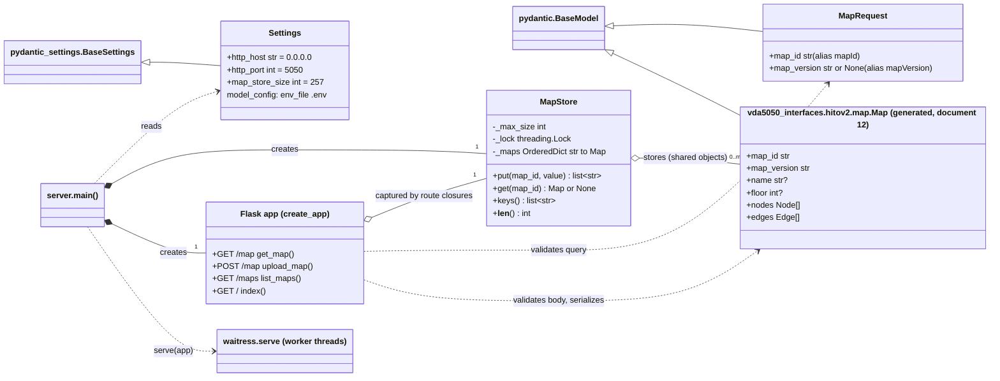
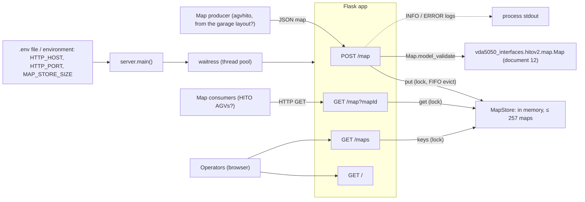

# 14 — `map_server`

| Generated | Revision | Source pack | Status |
|---|---|---|---|
| 2026-10-07 | 2 | `P14-map_server-part1of1.md` | Draft, generated by Claude, not yet reviewed by the team |

Package 14 of 37 (bottom-up) · dependency depth 2

Workspace dependencies: vda5050_interfaces (document 12).
Used by: agvhito.

Related documents:
- `12-vda5050_interfaces.md`: the generated pydantic `hitov2.map.Map` model, and the HTTP (Hypertext Transfer Protocol) `transport` flag;
- `07-mqtt.md`: the other VDA (Verband der Automobilindustrie) 5050 transport.

**How to read the evidence markers.**
- **[read]** means the conclusion comes from reading the source.
- **[probed]** means it was confirmed by running the package's code with Python 3.12, Flask 3.1.3, waitress 3.0.2, pydantic 2.13 and pydantic-settings 2.15.

HITO's `hitov2/map` schema is not in any pack, so the probes used a **stand-in `Map` model**:
- it was generated with the package's own `gen_python.py` (document 12);
- its fields are those used in this package's tests: `mapId`, `mapVersion`, `name`, `floor`, `nodes[{nodeId, x, y}]` and `edges[{edgeId, startNodeId, endNodeId}]`;
- all 14 package tests pass against it.

Findings that depend on the real schema are marked as such.

---

## A. External dependencies

`map_server` is a small Python web service. It is the first package in this series that is neither C++ nor a ROS (Robot Operating System) interface, and despite its `rclpy` dependency it does not use ROS at all. It serves HITO-format maps over HTTP, using a Flask application run by the waitress server.

| Name | Description | Version | Link | Usage in this package |
|---|---|---|---|---|
| Flask | Python web micro-framework. | **Not declared** in `package.xml`; the probes used 3.1.3. | https://flask.palletsprojects.com | Routes, request parsing, `jsonify`, content negotiation, Jinja templates. |
| waitress | Production WSGI (Web Server Gateway Interface) server, pure Python and multi-threaded. | **Not declared**; the probes used 3.0.2. | https://docs.pylonsproject.org/projects/waitress | `serve(app, host, port)` in `server.py`. |
| pydantic | Data validation through Python type hints (v2). | **Not declared**; the generated models require v2. | https://docs.pydantic.dev | `MapRequest` (query parameters), and the generated `Map` model. |
| pydantic-settings | Settings loaded from environment variables and `.env` files. | **Not declared**; the probes used 2.15. | https://docs.pydantic.dev/latest/concepts/pydantic_settings/ | `Settings` in `server.py`. |
| `vda5050_interfaces` (workspace) | Generated VDA 5050 and HITO models (document 12). | Workspace (`exec_depend`). | — | `vda5050_interfaces.hitov2.map.Map`. |
| rclpy | ROS 2 Python client library. | Declared (`exec_depend`). | https://github.com/ros2/rclpy | **Not used** by any file in the package (R8). |
| ament_cmake_pytest, python3-pytest | Python tests. | Declared (`test_depend`). | https://docs.pytest.org | `test/`. Note that the package builds with `ament_python`, so `ament_cmake_pytest` is not what runs them. |

---

## B. Glossary

| Term | Meaning | Where it shows up |
|---|---|---|
| HITO map | HITO's map format (schema `hitov2/map`): map id, version, name, floor, nodes and edges, sent over HTTP rather than MQTT (Message Queuing Telemetry Transport). | `Map` |
| `mapId` / `mapVersion` | The identifier of a map, and the version of the map format (`2.0.1` in the tests). | Query parameters, payload |
| REST | Representational State Transfer: resources addressed by URL (Uniform Resource Locator) and manipulated with HTTP methods. | `/map`, `/maps` |
| `GET` / `POST` | HTTP methods to read and to submit a resource. | Routes |
| Status codes | `200 OK`, `201 Created`, `400 Bad Request`, `404 Not Found`. | Responses |
| Content negotiation | Choosing the response format (JSON, JavaScript Object Notation, or HTML, Hypertext Markup Language) from the client's `Accept` header. | `GET /maps` |
| WSGI | Python's standard interface between web servers and web applications. | waitress runs the Flask app |
| FIFO eviction | First in, first out: when the store is full, the oldest *inserted* entry is removed. | `MapStore` |
| `OrderedDict` | Python dictionary that remembers insertion order. | `MapStore._maps` |
| `.env` file | A file of `NAME=value` lines read as configuration. | `Settings` |
| Autoescaping | Jinja's automatic HTML escaping of template values, which prevents injected markup. | `/maps` page |

---

## 1. Summary

`map_server` is a **small in-memory HTTP map repository** for HITO-format maps:
- `POST /map` validates a map against the generated pydantic `Map` model (document 12) and stores it under its `mapId`;
- `GET /map?mapId=…` returns the map;
- `GET /maps` lists the stored ids, as JSON or as an HTML index;
- `GET /` returns a short landing page.

Up to 257 maps are kept, "256 floor maps (`uint8_t`) plus the localization map". When the store is full, the oldest is evicted. It runs as a standalone process (`ros2 run map_server server`, or the `server` console script) on port 5050.

**Place in the stack.** It complements the MQTT path of documents 07 and 12. VDA 5050 messages travel over MQTT, but HITO's map schema is marked `transport: http`. The generated `Map` model is therefore used here, behind HTTP, presumably so that `agvhito` can publish the garage layout as HITO maps and the vehicles can download them by id *(inferred: the direction of the uploads and downloads is not in the pack)*.

**Quality.** The code is short, clear and tested. The store is guarded by a lock, which is correct because waitress serves requests from several threads. Inputs are validated with pydantic, and the HTML is escaped **[probed]**. The weaknesses are operational:
- **nothing persists:** a restart loses every map (R1);
- **an updated map keeps its old eviction position** and can be evicted first (R2);
- **no authentication and no size limit**, on all interfaces (R3);
- **`mapVersion` is accepted but ignored** (R4);
- **fields outside the schema are silently dropped** on the round trip, with the stand-in model (R5).

---

## 2. Files

The package has 10 files: a four-module Python package, an empty ament marker, two test files, and three packaging files. Line counts are from the pack, which has blank lines removed.

| Path (under `src/vda5050/map_server/`) | Lines | Role |
|---|---:|---|
| `map_server/__init__.py` | 0 | Package marker. |
| `map_server/flask_app.py` | 79 | `MapRequest` query model; `create_app(map_store)` with routes `GET/POST /map`, `GET /maps`, `GET /`. |
| `map_server/map_store.py` | 34 | `MapStore`: thread-safe, FIFO-bounded `OrderedDict` of `mapId` → `Map`. |
| `map_server/server.py` | 35 | `Settings` (host, port, store size, from env and `.env`); `main()` builds the store and app and serves them with waitress. |
| `resource/map_server` | 0 | ament index marker. |
| `test/test_map_store.py` | 37 | Five store tests: put/get, missing key, order, eviction, bound. |
| `test/test_server.py` | 74 | Nine endpoint tests through Flask's test client. |
| `package.xml` | 17 | `ament_python`; `exec_depend` rclpy and vda5050_interfaces; pytest test dependencies. |
| `setup.cfg` | 5 | Installs scripts into `lib/map_server`, so `ros2 run` can find them. |
| `setup.py` | 25 | setuptools package; console script `server = map_server.server:main`. |

---

## 3. Public API

There are two APIs (Application Programming Interfaces): **HTTP**, for clients, and **Python**, for embedding or testing.

### 3.1 HTTP endpoints — `map_server/flask_app.py`

| Method and path | Input | Success | Errors |
|---|---|---|---|
| `POST /map` | JSON body that validates as `hitov2.map.Map` | `201 {"mapId": id, "message": "map stored"}`; logs any evictions | `400 {"error": "invalid payload: …"}` for an invalid or non-JSON body **[probed]** |
| `GET /map?mapId=…[&mapVersion=…]` | Query parameters validated by `MapRequest` (`mapId` required; `mapVersion` optional and **unused**, R4) | `200` with the stored map, serialized with aliases and without `None` values | `400` if `mapId` is missing; `404` if the id is unknown |
| `GET /maps` | `Accept` header | `application/json`: a JSON array of ids in insertion order. Otherwise an HTML list linking to each map (with `mapVersion=2.0.1` hard-coded in the link) | — |
| `GET /` | — | HTML landing page listing the endpoints | — |

**Design.**
- `create_app(map_store)` builds the Flask app around an injected `MapStore`. This dependency injection lets the tests use a small store and Flask's test client without starting a server.
- Validation is done by pydantic: the generated `Map` model for the body, and a two-field `MapRequest` for the query string. Error responses carry pydantic's message.
- The HTML is produced with `render_template_string`, which autoescapes values: a map id `<script>…</script>` is rendered harmlessly **[probed]**.

**Usage (client).**

```bash
curl -X POST http://map-server:5050/map -H 'Content-Type: application/json' -d @floor1.json
curl 'http://map-server:5050/map?mapId=floor1'
curl -H 'Accept: application/json' http://map-server:5050/maps
```

```python
import requests
r = requests.post("http://map-server:5050/map", json=map_model.model_dump(by_alias=True, exclude_none=True), timeout=5)
r.raise_for_status()
```

### 3.2 `MapStore` — `map_server/map_store.py`

A thread-safe, bounded cache. All methods take one `threading.Lock`.

| Method | Behavior |
|---|---|
| `MapStore(max_size)` | An empty store holding at most `max_size` maps. |
| `put(map_id, value) -> list[str]` | Insert or **replace** the value, then evict the oldest entries while over capacity. Returns the evicted ids. Replacing a key keeps its **original insertion position** (R2). |
| `get(map_id) -> Map \| None` | The stored object itself (not a copy), or `None`. |
| `keys() -> list[str]` | A snapshot of the ids in insertion order. |
| `__len__()` | The number of stored maps. |

### 3.3 Entry point and settings — `map_server/server.py`

`main()` does the following:
1. configures logging at INFO, with timestamps;
2. reads `Settings` from the environment, or from a `.env` file in the **current working directory**;
3. builds `MapStore(max_size=map_store_size)` and the Flask app;
4. calls `waitress.serve(app, host, port)` until interrupted.

| Setting | Environment variable (case-insensitive) | Default |
|---|---|---|
| `http_host` | `HTTP_HOST` | `0.0.0.0` (all interfaces) |
| `http_port` | `HTTP_PORT` | `5050` |
| `map_store_size` | `MAP_STORE_SIZE` | `257` (256 floor maps + 1 localization map) |

It is started with `ros2 run map_server server` (through `setup.cfg`'s script directory), or directly with the `server` console script. It is not a ROS node: it has no ROS parameters, topics or logging.

---

## 4. Diagrams

### 4a. Class diagram (ownership on edges)

The classes are plain Python plus pydantic models. `create_app` returns a Flask app whose route functions are closures that capture the injected `MapStore`. `MapRequest` and `Settings` inherit from pydantic base classes; `Map` is the model generated in document 12.



### 4b. Data flow

There are no ROS topics, services, actions, timers or parameters. The inputs are HTTP requests and environment settings; the only lower-layer dependency is the generated `Map` model. The clients are **[inferred]**.



### 4c. State machines

No state machine.

---

## 5. Behavior

**Construction.** `main()` reads the settings, creates an empty store and the app, logs `Server is up @ http=<host>:<port>`, and blocks in `waitress.serve`.

**Steady state.**
- waitress dispatches each request to one of its worker threads (four by default), so route functions run concurrently.
- Each `MapStore` method holds the store's lock only for one dictionary operation. Validation and serialization happen outside the lock, so a slow upload does not block readers.
- `get()` returns the stored `Map` object itself, which is serialized per request; nothing mutates stored maps, so sharing is safe.
- No timers or background work; there is no persistence.

**Shutdown.** Ctrl-C (`KeyboardInterrupt`) returns from `serve`. A SIGTERM (the termination signal) ends the process. Either way, **all maps are lost** (R1).

**Parameters and defaults.** See section 3.3. Flask's `MAX_CONTENT_LENGTH` is not set, so request size is unlimited (R3).

---

## 6. Ownership and safety

### 6.1 Lifetimes

- The store owns its `Map` objects until they are evicted or replaced. Responses serialize them into new dictionaries.
- The app's route closures keep the store alive for the process lifetime.

### 6.2 Callbacks capturing `this`

Not applicable. The Python analogue is the route closures capturing `map_store`, which is safe here: both live for the whole process.

### 6.3 Locks and atomics

There is one `threading.Lock` in `MapStore`, around every access. It is needed because waitress is multi-threaded. The lock is held briefly (no I/O or validation under it), so it cannot deadlock: there is only one lock and no callbacks run under it.

### 6.4 Error handling

| Situation | Response |
|---|---|
| Invalid or missing JSON body | `400` with the pydantic error text; logged at ERROR **[probed]** |
| Missing `mapId` query parameter | `400` |
| Unknown `mapId` | `404` |
| Unexpected exception | Flask's default `500` |

### 6.5 RISK items

| Item | Risk | Evidence |
|---|---|---|
| R1 | **No persistence.** Maps live only in memory. After a restart (crash, deploy, reboot), every `GET /map` returns 404 until a producer uploads the maps again, and nothing in the package triggers that re-upload. | **[read]** |
| R2 | **Replacing a map does not refresh its eviction position.** `OrderedDict` keeps the original position when an existing key is re-assigned. With capacity 2: put A, put B, update A, put C leaves `[B, C]`, so the **just-updated A is evicted first**. That is FIFO by first insertion, not by last update. | **[probed]** |
| R3 | **Open endpoints and unbounded requests.** The server binds to `0.0.0.0` with no authentication, so anyone who can reach port 5050 can overwrite or flood maps. There is no request size limit: a 9.4 MB map was accepted in 0.7 s. The store's worst-case memory is roughly 257 times the largest accepted map (section 7). | **[probed]** |
| R4 | **`mapVersion` is accepted but ignored.** `GET /map` takes `mapVersion` but does not filter by it (`mapVersion=9.9.9` still returns 200). Only one entry per `mapId` can exist, so different versions overwrite each other. The `/maps` page hard-codes `mapVersion=2.0.1` in its links. | **[probed]** |
| R5 | **Unknown fields are dropped silently.** Uploads are parsed into the generated model and returned with `model_dump(...)`. With pydantic's default (ignore extra fields), anything not in the schema is lost: a `vendorExtension` field and a node's `theta` disappeared on the round trip. Whether the real `hitov2/map` model allows extra fields depends on its schema, which is not in the pack. | **[probed]** with the stand-in model |
| R6 | **No referential checks.** An edge may reference a node that does not exist (`endNodeId: "N9"`, and `N2` in the package's own tests), and an empty `mapId` is accepted (201). Consumers must not assume maps are consistent. | **[probed]** |
| R7 | **Undeclared dependencies.** Flask, waitress, pydantic and pydantic-settings are not declared in `package.xml` or `setup.py` (`install_requires` lists only setuptools). The package works only where these are preinstalled. | **[read]** |
| R8 | **Stale or unused declarations.** `rclpy` is declared but never used. The `test_server.py` docstring talks about MQTT and an `mqtt_enabled` flag that do not exist, a leftover of an earlier version. `ament_cmake_pytest` is a test dependency of an `ament_python` package. | **[read]** |
| R9 | **`.env` is read from the working directory.** The configuration therefore depends on where the process is started; `ros2 run` and launch files may start it in different directories. | **[read]** |
| R10 | **Logs may contain the whole payload.** Invalid uploads log the full pydantic error, which can include fragments of large or sensitive payloads. Every eviction is logged at INFO. | **[read]** |

---

## 7. Math

There is no algorithm beyond the bounded FIFO, but its capacity and eviction rule can be stated exactly.

**Eviction.** With capacity $N$ (default 257), let $k_1,\dots,k_n$ be the stored keys in order of **first** insertion. After `put(k, v)`:

$$
\text{keys}' = \begin{cases}
(k_1,\dots,k_n) & k \in \{k_i\} \ \text{(value replaced, position unchanged)}\\
(k_{\max(1,\,n+2-N)},\dots,k_n,\ k) & \text{otherwise}
\end{cases}
$$

When the key is new and $n=N$, exactly one entry is evicted, the one inserted first ($k_1$). This is why R2 can evict a recently *updated* map.

**Memory bound.** With an unlimited request size, the resident size is bounded only by

$$
\text{memory} \lesssim N \cdot s_{\max}\cdot \rho,
$$

where $s_{\max}$ is the largest accepted JSON body and $\rho$ is the expansion factor from JSON text to pydantic objects, typically several times. With $N=257$ and 10 MB maps that is about 2.6 GB of JSON alone, which is a reason to set `MAX_CONTENT_LENGTH` (R3).

---

## 8. Tests

There are 14 tests: 5 for the store and 9 for the endpoints, run with pytest through Flask's test client. All pass against the stand-in model **[probed]**.

| Test file | Covers | What it reveals about intended behavior |
|---|---|---|
| `test_map_store.py` | put/get identity (`is m`), missing key, insertion order, FIFO eviction of the oldest entry, length bound | The store returns the stored object itself, and eviction is by insertion order. |
| `test_server.py` | Landing page; `POST` 201 and 400; `GET` 200, 404 and 400; `/maps` as HTML and as JSON; eviction through the API | 201 with `{mapId, message}` is the success contract. `GET` without `mapId` is a client error. A capacity of 2 in tests mirrors 257 in production. |

**Gaps.**
- **Updating an existing `mapId`** and its eviction position (R2).
- **`mapVersion` handling** (R4).
- **Round-trip fidelity** of real HITO maps, including unknown fields (R5); and **graph consistency** (R6).
- **Request size limits** (R3).
- **Concurrency:** parallel uploads through waitress.
- **The `main()` / settings path.** The tests exercise `create_app` only, never `Settings`.

---

## 9. Idioms to reuse, and open questions

### 9.1 Idioms

- **Application factory with injected state.** `create_app(map_store)` makes the web layer testable with Flask's test client and no server, and is a good pattern for other small services.
- **Validate at the boundary with the generated models** from `vda5050_interfaces` (document 12), and return `400` with the validation message.
- **Serialize with `model_dump(by_alias=True, exclude_none=True)`**, the same convention as document 12, so payloads stay camelCase and omit absent fields.
- **Keep locks short and around data only**, never around I/O or validation.
- **Use pydantic-settings for configuration**, with environment-variable overrides.

### 9.2 Open questions for the team

1. Who uploads maps and who downloads them: does `agvhito` publish layout-derived maps for HITO vehicles to fetch? Should maps survive restarts, by persisting them or by re-uploading on startup (R1)?
2. Should updating a map move it to the end of the eviction order (`move_to_end`), or should eviction be least-recently-*used* (R2)?
3. Is the service reachable outside the garage network? Should it bind to a specific interface, require a token, and limit request size (R3)?
4. Should `mapVersion` be part of the key, or at least checked on `GET` (R4)?
5. Does the real `hitov2/map` model allow extra fields? If not, are any HITO map fields lost on the round trip (R5)?
6. Should Flask, waitress, pydantic and pydantic-settings be declared (or provided through rosdep keys), and should the unused `rclpy` dependency and the stale MQTT docstring be removed (R7, R8)?
