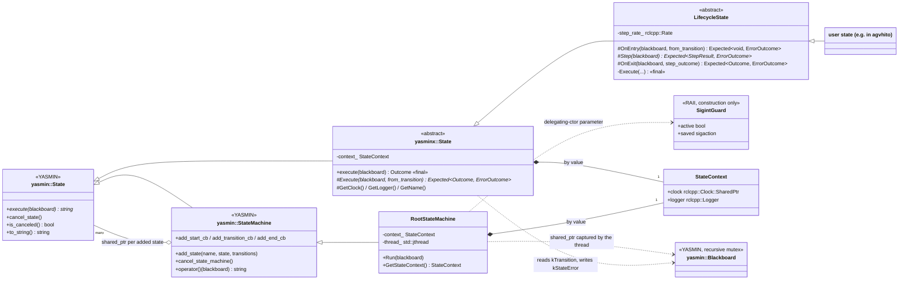
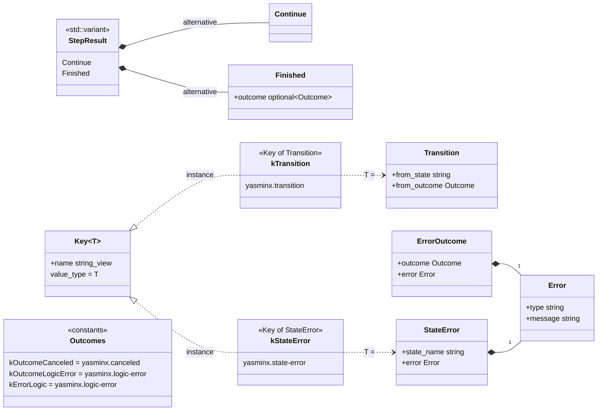
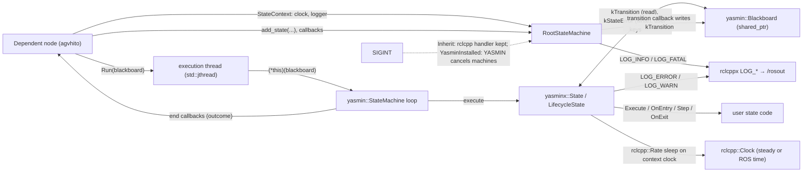
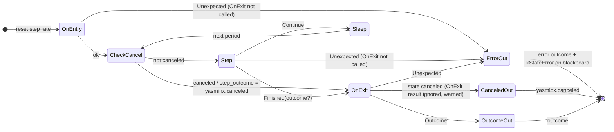
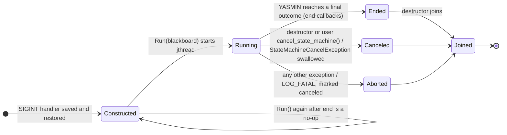
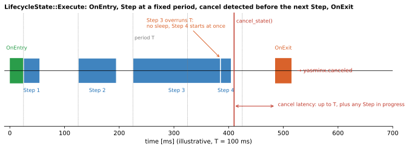

# 15 — `yasminx`

| Generated | Revision | Source pack | Status |
|---|---|---|---|
| 2026-10-07 | 1 | `P15-yasminx-part1of1.md` | Draft, generated by Claude, not yet reviewed by the team |

Package 15 of 37 (bottom-up) · dependency depth 2

Workspace dependencies: rclcppx (document 02), stdx (document 03).
Used by: agvhito.

Related documents:
- `05-structures.md`: the *other* state-machine framework in the workspace (open question 1 there);
- `03-stdx.md`: `Expected` and `Unexpected`, the error transport used here;
- `02-rclcppx.md`: the `LOG_*` macros.

**How to read the evidence markers.**
- **[read]** means the conclusion comes from reading the source.
- **[upstream]** means it was confirmed in the YASMIN (Yet Another State MachINe) source code, main branch, version 6.1.2, read on 2026-10-07. The YASMIN version the workspace uses is not stated, so details may differ.

The package needs rclcpp and YASMIN, neither of which was available here, so it was **not compiled or run**. The Mermaid diagrams pass the Mermaid 11 parser.

---

## A. External dependencies

`yasminx` ("YASMIN extensions") is Volley's layer over **YASMIN**, an open-source state-machine library for ROS 2 (Robot Operating System 2). In YASMIN, a state is an object with a set of possible *outcomes*; a state machine maps (state, outcome) pairs to the next state; and states share data through a *blackboard*. `yasminx` adds:
- ROS context (clock, logger) for every state;
- typed blackboard keys;
- errors carried as `stdx::Expected` and recorded on the blackboard;
- an entry/step/exit lifecycle with a fixed step rate;
- a root state machine that runs on its own thread and plays nicely with the host's signal handling.

| Name | Description | Version | Link | Usage in this package |
|---|---|---|---|---|
| YASMIN (`yasmin`) | C++ and Python state-machine library for ROS 2: states, state machines, blackboard, cancellation, callbacks. | Not pinned; checked against main (6.1.2). The APIs (Application Programming Interfaces) used (`add_start_cb`, `cancel_state_machine`, `StateMachineCancelException`, `set_loggers`) need a recent release. | https://github.com/uleroboticsgroup/yasmin | Base classes `yasmin::State` and `yasmin::StateMachine`, `yasmin::Blackboard`, logging hooks, cancellation. |
| rclcpp | ROS 2 C++ client library. | Same ROS 2 distribution (Kilted or newer, see document 02). | https://github.com/ros2/rclcpp | `rclcpp::Clock`, `rclcpp::Logger`, `rclcpp::Rate` (with a clock), `rclcpp::Duration`, `rclcpp::ok()`. |
| `rclcppx` (workspace) | Logging macros (document 02). | Workspace. | — | `LOG_INFO`, `LOG_WARN`, `LOG_ERROR`, `LOG_FATAL`. |
| `stdx` (workspace) | `Expected` and `Unexpected` (document 03). | Workspace. | — | Every state return type: `stdx::Expected<Outcome, ErrorOutcome>`. |
| POSIX (Portable Operating System Interface) signals | `sigaction`. | System. | https://man7.org/linux/man-pages/man2/sigaction.2.html | Saving and restoring the SIGINT (interrupt signal) handler around YASMIN construction. |
| GoogleTest (ament_cmake_gtest) | Unit tests. | Not pinned. | https://github.com/google/googletest | Four test executables. |

---

## B. Glossary

| Term | Meaning | Where it shows up |
|---|---|---|
| State (YASMIN) | An object with a fixed set of possible outcomes and an `execute(blackboard)` method that returns one of them. | `yasmin::State`, `yasminx::State` |
| Outcome | A string naming how a state finished. The state machine's transition table maps it to the next state, or to a final outcome of the machine. | `Outcome = std::string` |
| Transition | The step from one state to the next. `yasminx` records it as (`from_state`, `from_outcome`). | `Transition` |
| Blackboard | A key/value store shared by all states of a machine, protected by a recursive mutex in YASMIN. | `yasmin::Blackboard` |
| Typed key | A blackboard key that also fixes the value type stored under it. | `bb::Key<T>` |
| Root state machine | The outermost state machine, not nested in another one. | `RootStateMachine` |
| Lifecycle (entry/step/exit) | A state pattern: set up once, repeat a step until done, tear down once. | `LifecycleState` |
| Step period / rate | The fixed interval between `Step` calls, enforced by `rclcpp::Rate` on the state's clock. | `step_period` |
| Cancel state vs cancel state machine | In YASMIN, `cancel_state()` asks the *active child state* to stop (the machine then continues with that state's outcome); `cancel_state_machine()` aborts the whole execution loop by throwing `StateMachineCancelException`. | `~RootStateMachine` |
| SIGINT | The interrupt signal (Ctrl-C). Both rclcpp and YASMIN can install handlers for it. | `SigintHandling` |
| RAII | Resource Acquisition Is Initialization: tie a resource to an object's lifetime, so the destructor releases it. | `SigintGuard` |
| Delegating constructor | A constructor that forwards to another constructor of the same class. Here it is used to keep a guard alive across base-class construction. | `RootStateMachine` |
| `std::jthread` | C++20 thread that joins automatically on destruction. | `thread_` |
| `std::variant` | A type-safe union holding exactly one of several alternatives. | `StepResult` |

---

## 1. Summary

`yasminx` is Volley's convention layer for writing **YASMIN state machines in ROS 2 C++ nodes**. It provides:
- **`yasminx::State`**: a YASMIN state that has a ROS clock and logger, receives the transition that entered it, and returns `stdx::Expected<Outcome, ErrorOutcome>`. An error becomes an outcome plus a `StateError` written to the blackboard and logged.
- **`LifecycleState`**: a state with `OnEntry`, a periodic `Step`, and `OnExit`, which handles cancellation uniformly.
- **`RootStateMachine`**: runs the machine on its own thread, logs every start, transition and end through ROS logging, records the last transition on the blackboard, and controls whether YASMIN may take over SIGINT.
- **Typed blackboard keys** (`bb::Key<T>`, with `Get`, `Set`, `Contains`, …), and `std::format` support for the error types.

The only user listed is `agvhito`, the AGV (Automated Guided Vehicle) software.

**How it fits with the earlier packages.** It combines three conventions already documented:
- errors as values, using `stdx` (document 03);
- `std::format` logging through `rclcppx` (document 02);
- typed keys, the same idea as `rclcppx::Topic<M>` applied to blackboard entries.

It is the second state-machine framework in the workspace. `structures::StateMachine` (document 05) is a table-driven engine with no state bodies. `yasminx` states are objects that run code and return outcomes; it is the richer model, suited to long-running behaviors such as driving or lifting.

**Quality.** The design is careful about lifetimes, shown in a few deliberate choices:
- the thread is declared last so that it is joined first;
- a guard brackets the base-class constructor;
- a no-op YASMIN logger is installed only once;
- a cancel always ends in a fixed outcome.

The risks come mostly from YASMIN semantics the wrapper relies on but does not enforce:
- **every outcome `yasminx` may return** (`yasminx.canceled`, `yasminx.logic-error`, and each error's outcome) **must be declared** in the state's outcomes, or YASMIN throws and the whole machine stops (R1);
- **`GetName()` returns the C++ class name, not the registered state name** (R2);
- **a wrong type behind a blackboard key is undefined behavior**, not an empty result (R3);
- **the error recorded on the blackboard is never cleared** (R4);
- **errors from `Step` skip `OnExit`** (R5).

---

## 2. Files

The package has 23 files: ten public headers, three sources, six test files and two build files. Line counts are from the pack, which has blank lines removed.

| Path (under `src/core/yasminx/`) | Lines | Role |
|---|---:|---|
| `include/yasminx/blackboard_constants.hpp` | 13 | `bb::Key<T>`; the built-in keys `kStateError` and `kTransition`. |
| `include/yasminx/blackboard_utils.hpp` | 38 | `bb::Get` (returns optional), `Set`, `Remove`, `Contains`, `ContainsKeys` over `yasmin::Blackboard`. |
| `include/yasminx/error.hpp` | 25 | `kErrorLogic`; `Error`, `ErrorOutcome`, `StateError`; `MakeUnexpected(outcome, error)`. |
| `include/yasminx/format.hpp` | 28 | `std::formatter` specializations for `Error`, `ErrorOutcome`, `StateError`, `Transition`. |
| `include/yasminx/lifecycle_state.hpp` | 51 | `LifecycleState` with `Continue` / `Finished` step results and the `OnEntry` / `Step` / `OnExit` hooks. |
| `include/yasminx/outcome.hpp` | 7 | `Outcome = std::string`; `kOutcomeCanceled`, `kOutcomeLogicError`. |
| `include/yasminx/root_state_machine.hpp` | 53 | `SigintHandling`; `RootStateMachine` (thread, context, private `SigintGuard`). |
| `include/yasminx/state_context.hpp` | 7 | `StateContext {clock, logger}`. |
| `include/yasminx/state.hpp` | 40 | `yasminx::State` with a final `execute` and the pure virtual `Execute(blackboard, from_transition)`. |
| `include/yasminx/transition.hpp` | 9 | `Transition {from_state, from_outcome}`. |
| `src/lifecycle_state.cpp` | 70 | The lifecycle loop, cancel handling, and the default `OnEntry` / `OnExit`. |
| `src/root_state_machine.cpp` | 87 | Signal guard, YASMIN logger silencing, callbacks, cancellation on destruction, the execution thread. |
| `src/state.cpp` | 27 | `State::execute`: reads `kTransition`, calls `Execute`, converts errors into outcomes plus `kStateError`. |
| `test/test_blackboard_utils.cpp` | 47 | Typed get/set, missing key, contains. |
| `test/test_lifecycle_state.cpp` | 109 | Finish through exit or direct, cancel, cancel overriding exit, entry failure. |
| `test/test_root_state_machine.cpp` | 48 | Two-state machine reaching its final outcome on the thread. |
| `test/test_ros_env.hpp` | 12 | gtest environment calling `rclcpp::init` and `shutdown`. |
| `test/test_state.cpp` | 77 | Success, error to blackboard, received transition, default transition. |
| `test/test_utils.hpp` | 12 | `MakeContext()` with a steady clock and a test logger. |
| `CMakeLists.txt` | 18 | Shared library from `src/`; four gtests (`AUTO_LINK_LIBRARIES`). |
| `package.xml` | 18 | Depends on rclcpp, rclcppx, stdx, yasmin. |

---

## 3. Public API

Everything is in namespace `volley::yasminx`, with headers under `yasminx/`. The typed-key helpers are in `volley::yasminx::bb`. The API is designed around **subclassing**: users derive from `State` or `LifecycleState`, add instances to a `RootStateMachine`, and call `Run`.

### 3.1 Outcomes, transitions, errors — `outcome.hpp`, `transition.hpp`, `error.hpp`, `format.hpp`

| Type or constant | Meaning |
|---|---|
| `Outcome` | `std::string`, as in YASMIN. |
| `kOutcomeCanceled = "yasminx.canceled"` | The outcome every canceled `LifecycleState` returns. |
| `kOutcomeLogicError = "yasminx.logic-error"` | The outcome of the default `OnExit` when `Step` finished without an outcome. |
| `Transition {from_state, from_outcome}` | How the current state was entered. Empty for the first state. |
| `Error {type, message}` | A typed, human-readable error. `kErrorLogic = "yasminx.logic-error"` is the built-in type. |
| `ErrorOutcome {outcome, error}` | What a failing state returns: the outcome to transition on, and why. |
| `StateError {state_name, error}` | What gets written to the blackboard when a state fails. |
| `MakeUnexpected(outcome, error)` | Shorthand for `stdx::Unexpected(ErrorOutcome{…})`. |

The `std::formatter` specializations let `LOG_*` print these types directly, for example `Error{type=…, message=…}`. `Transition` is printed as `'from_state' -> 'from_outcome'`, which reads like a state-to-state arrow although the right side is an outcome.

### 3.2 `State` — `state.hpp`, `src/state.cpp`

**Purpose.** This is the base class for every Volley state. It turns YASMIN's string-returning `execute` into a typed, error-aware `Execute`.

**Design.**
- **Construction.** `State(outcomes, context)` takes the outcome set and a `StateContext {clock, logger}`. States are non-copyable and non-movable, because the state machine owns them through `shared_ptr`.
- **`execute(blackboard)` is `final`.** It does three things:
  1. reads `bb::kTransition` (written by `RootStateMachine`, section 3.4); a missing entry means a default, empty transition;
  2. calls the user's `Execute(blackboard, from_transition)`;
  3. on error, logs `Caught error outcome in '<name>': …`, writes `StateError {GetName(), error}` to `bb::kStateError`, and returns the error's outcome.
- **Helpers:** `GetContext()`, `GetClock()`, `GetLogger()`, and `GetName()`. Note that `GetName()` returns YASMIN's `to_string()`, which is the **demangled C++ class name**, not the name passed to `add_state` (R2, **[upstream]**).

### 3.3 `LifecycleState` — `lifecycle_state.hpp`, `src/lifecycle_state.cpp`

**Purpose.** This is the common shape of a long-running behavior: set up once, act periodically until done, tear down once. Cancellation is built in.

**Design.**
- `LifecycleState(outcomes, context, step_period)` creates an `rclcpp::Rate` on the state's clock.
- **Hooks:**
  - `OnEntry(blackboard, from_transition) -> Expected<void, ErrorOutcome>`: the default does nothing;
  - `Step(blackboard) -> Expected<StepResult, ErrorOutcome>`: pure virtual. It returns `Continue{}` to be called again after one period, or `Finished{optional outcome}`;
  - `OnExit(blackboard, step_outcome) -> Expected<Outcome, ErrorOutcome>`: the default returns the step outcome, or `kOutcomeLogicError` if there is none.
- **Execution, as implemented by `Execute`, which is `final`:**
  1. Reset the rate, then run `OnEntry`. If it fails, return its error; `OnExit` is **not** called.
  2. Loop:
     - if the state was canceled, set the step outcome to `kOutcomeCanceled` and leave the loop;
     - otherwise call `Step`. If it fails, return its error; `OnExit` is **not** called (R5). If it returns `Finished`, take its outcome and leave the loop. If it returns `Continue`, sleep until the next period.
  3. Call `OnExit` with the step outcome.
  4. If the state was canceled, return `kOutcomeCanceled` **whatever `OnExit` returned**, and log a warning if `OnExit` disagreed or failed. Otherwise return `OnExit`'s result.

Figure 7.1 shows the timing, and section 4c the state diagram.

**Usage.**

```cpp
class DriveToNode : public volley::yasminx::LifecycleState {
 public:
  DriveToNode(volley::yasminx::StateContext ctx)
      : LifecycleState({"arrived", "blocked", volley::yasminx::kOutcomeCanceled,
                        volley::yasminx::kOutcomeLogicError}, std::move(ctx), std::chrono::milliseconds(50)) {}
 protected:
  stdx::Expected<void, ErrorOutcome> OnEntry(yasmin::Blackboard::SharedPtr bb, const Transition&) override {
    auto goal = volley::yasminx::bb::Get(*bb, kGoalKey);
    if (!goal) return MakeUnexpected("blocked", {.type = "missing-goal", .message = "no goal on blackboard"});
    target_ = *goal; return {};
  }
  stdx::Expected<StepResult, ErrorOutcome> Step(yasmin::Blackboard::SharedPtr) override {
    if (AtTarget()) return StepResult{Finished{.outcome = "arrived"}};
    return StepResult{Continue{}};
  }
  // OnExit: default (returns the step outcome)
 private:
  Goal target_;
};
```

This is illustrative: `Goal`, `kGoalKey` and `AtTarget` are not from the pack. Note that the outcomes list **includes** `kOutcomeCanceled` and `kOutcomeLogicError` (R1).

### 3.4 `RootStateMachine` — `root_state_machine.hpp`, `src/root_state_machine.cpp`

**Purpose.** The outermost machine of a node. It runs on its own thread, logs its progress, and stops cleanly when destroyed.

**Design.**
- **`RootStateMachine(name, outcomes, context, sigint = SigintHandling::Inherit)`.**
  - With `Inherit`, a private `SigintGuard`, passed into a private delegating constructor, saves the process's SIGINT handler before the YASMIN base class is built and restores it afterwards. The handler that rclcpp installed stays in charge.
  - With `YasminInstalled`, YASMIN is allowed to install its own handler.
- **YASMIN's own logging is disabled once per process** (`std::call_once` with a no-op `set_loggers`). All logging goes through `LOG_*` on the ROS logger instead. This affects every YASMIN machine in the process (R7).
- **Callbacks registered in the constructor:**
  - start: logs `State machine '<name>' starting at '<state>'`;
  - transition: stores `Transition{from_state, outcome}` under `bb::kTransition`, and logs it;
  - end: logs the final outcome.
- **`Run(blackboard)`** starts `std::jthread`, which runs `(*this)(blackboard)`.
  - It must be called after all states are added. A second call is ignored, even after the machine has finished, so a machine cannot be re-run (R8).
  - `StateMachineCancelException` (a normal hard cancel) is swallowed.
  - Any other `std::exception` is logged at FATAL (unless shutting down) and marks the machine canceled.
  - The final outcome is not returned: callers who need it register an end callback, as the test does (R6).
- **The destructor** calls `cancel_state_machine()` if the machine is not canceled, which aborts the YASMIN loop. `thread_` is declared last, so it is destroyed, and joined, first, before `context_` and the base class.
- **`GetStateContext()`** returns the context, to share with the states.

**Usage.**

```cpp
auto ctx = volley::yasminx::StateContext{.clock = get_clock(), .logger = get_logger()};
sm_ = std::make_unique<volley::yasminx::RootStateMachine>("agv", yasmin::Outcomes{"done", "failed"}, ctx);
sm_->add_state("DRIVE", std::make_shared<DriveToNode>(ctx),
               {{"arrived", "LIFT"}, {"blocked", "failed"},
                {volley::yasminx::kOutcomeCanceled, "failed"}, {volley::yasminx::kOutcomeLogicError, "failed"}});
// ... more states ...
sm_->add_end_cb([this](auto, const auto& outcome) { OnMachineDone(outcome); });
sm_->Run(std::make_shared<yasmin::Blackboard>());
```

This is illustrative; the state names and outcomes are not from the pack.

### 3.5 Typed blackboard keys — `blackboard_constants.hpp`, `blackboard_utils.hpp`

`bb::Key<T>{name}` pairs a key string with a value type. The helpers are thin, type-safe wrappers:

| Helper | Behavior |
|---|---|
| `Get(bb, key) -> optional<T>` | `nullopt` if the key is missing (it catches YASMIN's `std::runtime_error`). The value type is **not** checked (R3). `[[nodiscard]]`. |
| `Set(bb, key, value)` | Stores a `T`. |
| `Remove(bb, key)` | Removes the key, if present. |
| `Contains(bb, key)`, `ContainsKeys(bb, keys…)` | Presence checks; the second is a fold over `Contains`. |

The built-in keys are `kStateError` ("yasminx.state-error", `StateError`) and `kTransition` ("yasminx.transition", `Transition`). Dependents define their own keys the same way, as `inline constexpr bb::Key<T>` constants: the blackboard analogue of `rclcppx::Topic<M>`.

---

## 4. Diagrams

### 4a. Class diagrams (ownership on edges)

**Inheritance and ownership.** Volley's states extend YASMIN's, and `RootStateMachine` extends YASMIN's machine, which itself *is* a `yasmin::State`. Machines own their states through `shared_ptr`.



**Value types, results and typed keys.**



### 4b. Data flow

There are no topics, services, actions or ROS parameters. The inputs and outputs are the clock, the logger, the blackboard, SIGINT, and the execution thread. The only calls into lower layers are to `rclcppx` (logging) and `stdx` (types).



### 4c. State machines

The package defines no concrete application state machine; those live in `agvhito`. It does implement two pieces of control flow that every dependent inherits, both coded explicitly.

**`LifecycleState::Execute`** (from `src/lifecycle_state.cpp`):



**`RootStateMachine` execution thread** (from `src/root_state_machine.cpp`; YASMIN semantics **[upstream]**):



---

## 5. Behavior

**Construction.**
1. `RootStateMachine` saves SIGINT (in `Inherit` mode).
2. It builds the YASMIN base without its signal handler, then restores SIGINT.
3. It disables YASMIN's logger once per process.
4. It registers the start, transition and end callbacks.

States are constructed by the dependent with a `StateContext`. A `LifecycleState` creates its `rclcpp::Rate` from the context's clock.

**Steady state.**
- **Threads.** After `Run`, the machine executes on **its own thread**, not on a ROS executor: states run concurrently with the node's callbacks.
  - **Shared data** between state code and callbacks must be synchronized. The blackboard is internally locked by YASMIN with a recursive mutex; other shared members need their own locks.
  - **`LifecycleState` sleeps** with `rclcpp::Rate` on the context clock. With a ROS-time clock under simulation (`use_sim_time`), steps advance with simulated time and stall if the clock is paused (R9).
- **Transitions.** Each one writes `kTransition` (via the transition callback) before the next state's `execute` reads it.
- **Errors.** Each one writes `kStateError`, which is never cleared (R4).

**Shutdown.**
- **The destructor** triggers `cancel_state_machine()`. YASMIN throws `StateMachineCancelException` out of its loop at the next checkpoint, the thread catches it, and `jthread` joins.
- **How long the join takes** depends on the active state:
  - a `LifecycleState` notices only between steps, so up to one period plus any step in progress (Figure 7.1);
  - a plain `State` whose `Execute` never checks `is_canceled()` delays the join until it returns.
- **SIGINT** with `Inherit` goes to rclcpp, which shuts down the context. With `YasminInstalled`, YASMIN cancels its registered machines.

**Parameters and defaults.** There are no ROS parameters.

| Item | Default |
|---|---|
| `SigintHandling` | `Inherit` |
| `LifecycleState::OnEntry` | no-op, succeeds |
| `LifecycleState::OnExit` | returns the step outcome, else the `kOutcomeLogicError` error outcome |
| Built-in blackboard keys | `yasminx.transition`, `yasminx.state-error` |

---

## 6. Ownership and safety

### 6.1 Lifetimes

- **States** are owned by the YASMIN machine through `shared_ptr`, and are non-copyable and non-movable by design.
- **`StateContext`** is copied into every state and into the root machine. It shares the `rclcpp::Clock` (a `shared_ptr`), so the clock outlives the node if any state survives it.
- **The blackboard** is a `shared_ptr` captured by the thread lambda, which keeps it alive as long as the thread runs.
- **Member order in `RootStateMachine`** is deliberate. `context_` is declared first and `thread_` last, so destruction joins the thread before `context_` (used by the callbacks) is destroyed. The YASMIN base, which holds the states and callbacks, is destroyed after both.

### 6.2 Callbacks capturing `this`

- **`RootStateMachine`'s three callbacks** capture `this`. They run on the execution thread, and are safe because of the member order above. They access only `context_.logger` and `get_name()`.
- **User end callbacks** run on the execution thread too. A callback that touches node state must synchronize with the node's executor threads (the test uses a `std::promise`, which is thread-safe).
- **The `SigintGuard`** is a constructor parameter: it lives exactly for the duration of base-class construction, which is the intended RAII bracket.

### 6.3 Locks and atomics

- **`yasminx` adds no locks** of its own. It relies on YASMIN's internal synchronization: a blackboard recursive mutex, atomic cancel flags, and a condition variable for the current state.
- **`std::call_once`** guards the process-wide logger replacement.
- **SIGINT handler swap.** `sigaction` save and restore is not synchronized with other threads installing handlers at the same moment. That is fine during node construction.

### 6.4 Error handling

| Style | Where |
|---|---|
| `stdx::Expected<…, ErrorOutcome>` | Every state hook (`Execute`, `OnEntry`, `Step`, `OnExit`). |
| Error → outcome + blackboard | `State::execute`: logs at ERROR, writes `kStateError`, and returns `error.outcome`. |
| `std::optional` | `bb::Get` (missing key). |
| Exceptions | YASMIN uses them for invalid outcomes (`std::logic_error`) and for cancellation (`StateMachineCancelException`). The thread catches `std::exception` and logs it at FATAL; anything not derived from `std::exception` terminates the process. |
| Cancellation | Always ends in `kOutcomeCanceled` for a `LifecycleState`. |

### 6.5 RISK items

| Item | Risk | Evidence |
|---|---|---|
| R1 | **Undeclared outcomes stop the whole machine.** YASMIN checks every returned outcome against the state's declared outcomes and throws `std::logic_error` otherwise. A `LifecycleState` can return `yasminx.canceled` (any cancel) and `yasminx.logic-error` (the default `OnExit` without an outcome), and any state returns the outcome inside its `ErrorOutcome`. If one of these is not in the state's outcomes, *and* mapped in its transitions, the exception escapes to the thread, which logs FATAL and stops the machine. The tests always declare them, but nothing in the API adds them automatically. | **[upstream]** `state.cpp` outcome check; **[read]** |
| R2 | **`GetName()` returns the C++ class name.** It returns `to_string()`, which YASMIN implements as the demangled class name (`demangle_type(typeid(*this).name())`), not the name given to `add_state`. `StateError.state_name` and the log messages therefore name the *class*, so two states of the same class are indistinguishable. The header comment promises "the state's name as registered". | **[upstream]** `State::to_string` |
| R3 | **A wrong value type is undefined behavior.** YASMIN's `Blackboard::get<T>` returns `*static_pointer_cast<T>(...)` without checking the type. `bb::Key<T>` makes mismatches unlikely, but two keys with the same name and different `T` (or a plain-string `get` elsewhere) read memory as the wrong type, with no exception and no `nullopt`. | **[upstream]** `blackboard.hpp` |
| R4 | **`kStateError` is never cleared.** It keeps the *last* error forever: a later state that reads it to decide recovery may see an error from an earlier, unrelated failure. Nothing resets it after a successful state or a recovery. | **[read]** |
| R5 | **`OnExit` is skipped on errors.** If `Step` returns an error, or `OnEntry` fails, `OnExit` is not called. Cleanup that lives in `OnExit` (stopping motors, releasing resources acquired in `OnEntry`) is therefore skipped on the error path, while it *does* run on cancel and on normal completion. | **[read]**; tests confirm `exit_count == 0` after an entry failure |
| R6 | **No completion signal from `Run`.** The final outcome, and whether the machine aborted, reach the node only through end callbacks and logs. An aborted machine (R1, or any exception) calls no end callback, so a node waiting for "done" waits forever. | **[read]** |
| R7 | **Process-wide side effects.** YASMIN's logger is replaced by a no-op for *every* YASMIN machine in the process, including non-`yasminx` ones, the first time any `RootStateMachine` is built. SIGINT handling is restored around construction only, so YASMIN may still install handlers later. | **[read]**, **[upstream]** |
| R8 | **A finished machine cannot be re-run.** `Run` returns early whenever `thread_.joinable()`, which stays true after the machine has ended, until destruction. | **[read]** |
| R9 | **Cancellation latency, and dependence on the clock.** Cancel is checked only between steps, so the latency is up to one step period plus the running step (Figure 7.1). `rclcpp::Rate` sleeps on the state's clock: with simulated time paused or stopped, `Step` stalls, and shutdown with it. The tests use a steady clock, which hides this. | **[read]** |
| R10 | **A shutdown race.** YASMIN's `cancel_state_machine()` does nothing unless the machine is already running, and starting execution resets the cancel request. A `RootStateMachine` destroyed right after `Run`, before the thread has entered the YASMIN loop, may miss the cancel; the destructor then blocks joining a machine that keeps running. | **[upstream]** `cancel_state_machine`, start sequence; inference (not reproduced) |
| R11 | **Exceptions thrown by user code skip `yasminx`'s error path.** A `State::Execute` that throws bypasses `Expected` entirely: no `kStateError`, and the whole machine is stopped through the thread's FATAL handler. | **[read]** |

---

## 7. Math

The package has no numerical algorithm. The timing of `LifecycleState` is precise enough to state, because it governs control-loop rates and cancellation latency.

**Step schedule.** With step period $T$, the steps start at $t_0, t_1, \dots$, where $t_0$ is the end of `OnEntry`. If every step takes $d_k < T$, `rclcpp::Rate` keeps the phase fixed:

$$
t_k = t_0 + kT .
$$

If a step overruns ($d_k \ge T$), the sleep returns at once, the next step starts immediately, and the schedule continues from there. The rate is therefore an upper bound on the step frequency, never a guarantee.

**Cancellation latency.** Cancellation is only checked at the top of the loop. A cancel requested at time $t_c$, while a step that started at $t_k$ is running or the loop is sleeping, is acted upon at the next check $t_{k+1}$, so

$$
L_\text{cancel} = t_{k+1} - t_c \;\le\; \max(T,\ d_k) .
$$

After that, `OnExit` runs. The end-to-end time to yield `yasminx.canceled` is $L_\text{cancel} + d_\text{exit}$. With a ROS-time clock, $T$ is measured in *clock* time, so a paused simulation makes $L_\text{cancel}$ unbounded (R9).



*Figure 7.1 — `OnEntry`, then periodic steps (T = 100 ms, illustrative). Step 3 overruns the period, so Step 4 follows immediately. A cancel arriving after Step 4 is detected at the next loop check, before any further step; `OnExit` then runs, and the state returns `yasminx.canceled`.*

---

## 8. Tests

There are 16 tests in four executables, with `rclcpp::init` provided by a gtest environment. They were not run here, because YASMIN and rclcpp were not available.

| Test | Covers | What it reveals about intended behavior |
|---|---|---|
| `BlackboardUtils.*` (6) | Typed set/get (including the `Transition` struct), missing key → `nullopt`, `Contains`, `ContainsKeys` | Typed keys are the intended blackboard API. |
| `State.SuccessOutcome`, `.ErrorOutcome` | An error becomes its outcome, and `kStateError` holds the type and message | Errors travel as values and are recorded for later states. |
| `State.Transition`, `.ExecuteWithNoTransitionGetsDefault` | The transition comes from the blackboard; the first state sees an empty transition | `kTransition` is the only channel for "how did we get here". |
| `LifecycleState.FinishedWithStepCount`, `.FinishDirect` | Three steps; outcome via `OnExit`, or straight from `Finished` | `OnExit` decides the outcome unless `Finished` carries one. |
| `LifecycleState.Canceled`, `.CanceledOverridesExitOutcome` | Cancel from inside `Step` → `yasminx.canceled`, with `OnExit` called once | A cancel always wins over `OnExit`'s choice. |
| `LifecycleState.EntryFailure` | Entry error → its outcome; no steps; **no `OnExit`**; `kStateError` set | Confirms R5's asymmetry as intended, or at least as tested, behavior. |
| `RootStateMachine.FinalOutcome` | A → B → `done` on the thread, observed through an end callback within 1 s | End callbacks are the way to observe completion (R6). |

**Gaps.**
- No test of an **undeclared outcome** (R1); of **`GetName()`** in a real machine (R2); or of **`Step` failing** (R5).
- No test of **destruction while running** (cancel and join, including right after `Run`, R10); of **SIGINT handling** in either mode; or of the **exception and FATAL path**.
- No test with a **ROS-time clock** or with a step that overruns (R9).
- `test_root_state_machine.cpp` does not include `test_ros_env.hpp`, so it runs without `rclcpp::init`. That works today only because nothing in it needs an rclcpp context.

---

## 9. Idioms to reuse, and open questions

### 9.1 Idioms

- **Derive from `yasminx::State` or `LifecycleState`, never directly from `yasmin::State`.** That gives logging, transitions and errors uniformly.
- **Declare the `yasminx` outcomes** (`kOutcomeCanceled`, `kOutcomeLogicError`, and every error outcome) in each state, and map them in the transitions, typically to a shared recovery or failure state (R1).
- **Return errors, don't throw.** Use `return MakeUnexpected("outcome", {.type = "...", .message = std::format(...)});`, and read `kStateError` in the recovery state, clearing it once handled (R4).
- **Use typed blackboard keys** (`inline constexpr bb::Key<T> kX{"pkg.x"}`), namespaced by package, as `rclcppx::Topic<M>` does for topics.
- **Keep periodic work in `Step`, and cleanup that must always run outside `OnExit`** (for example a scope guard in `OnEntry`) until R5 is resolved.
- **One `RootStateMachine` per node, built after the node.** Pass `get_clock()` and `get_logger()` in the context, register an end callback, and call `Run` last. Hold the machine as a member declared after anything its states use.

### 9.2 Open questions for the team

1. **Which state-machine framework should new code use?** `structures::StateMachine` (document 05) and `yasminx` model state machines differently. Is `structures` legacy?
2. Should `yasminx` add `kOutcomeCanceled` and `kOutcomeLogicError` to every state's outcomes automatically, or validate the transition maps when `Run` is called (R1)?
3. Should `GetName()` return the registered name, by storing it at `add_state` time or through a YASMIN hook, so that `StateError` and the logs identify the state (R2)?
4. Should `kStateError` be cleared on the next successful transition, or carry the transition at which it occurred (R4)?
5. Is skipping `OnExit` on `OnEntry`/`Step` errors intended? Should there be an `OnAbort`, or a guarantee that `OnExit` runs (R5)?
6. Should `Run` return a future, or should an aborted machine notify the node (R6)? Should a machine be restartable (R8)?
7. Which YASMIN version does the workspace use? Do the R2, R3 and R10 observations, made on main 6.1.2, hold for it?
