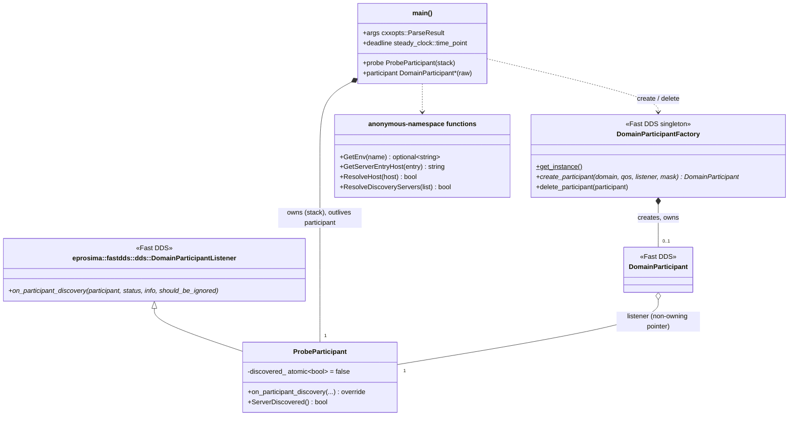
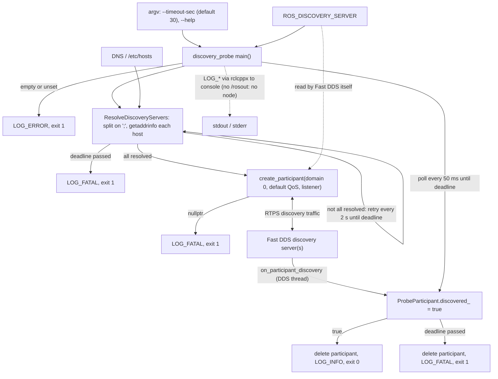

# 16 — `dds_discovery`

| Generated | Revision | Source pack | Status |
|---|---|---|---|
| 2026-10-07 | 1 | `P16-dds_discovery-part1of1.md` | Draft, generated by Claude, not yet reviewed by the team |

Package 16 of 37 (bottom-up) · dependency depth 2

Workspace dependencies: rclcppx (document 02).
Used by: nothing (a leaf; it is an executable, not a library).

Related documents:
- `02-rclcppx.md`: the `LOG_*` macros, including `LOG_INFO_ONCE`;
- `10-volley_cmake.md`: `volley_add_executable`.

**Missing input.** The task mentions an attached `discovery-server.md` (repository docs, possibly stale), but it **was not included in the upload**. This document is based on the code alone.

**How to read the evidence markers.**
- **[read]** means the conclusion comes from reading the source.
- **[probed]** means it was confirmed by compiling the program's parsing and name-resolution functions on their own (g++ 13.3, C++20) and running them on sample `ROS_DISCOVERY_SERVER` values.

The whole program could not be built, because Fast DDS (eProsima's implementation of DDS, the Data Distribution Service) and rclcpp were not available. The Mermaid diagrams pass the Mermaid 11 parser.

---

## A. External dependencies

`dds_discovery` contains one command-line tool, `discovery_probe`. It checks that a **Fast DDS discovery server** is reachable and accepting participants, before anything else in the system relies on it. DDS (Data Distribution Service) is the middleware under ROS 2 (Robot Operating System 2), and Fast DDS is eProsima's implementation of it. In *discovery server* mode, participants find each other through a central server instead of by multicast.

| Name | Description | Version | Link | Usage in this package |
|---|---|---|---|---|
| Fast DDS (eProsima) | DDS implementation, the default ROS 2 middleware for most distributions. | **3.x**: the code relies on the Fast DDS 3 listener API (Application Programming Interface), and a comment refers to a Fast DDS 3 behavior change. | https://fast-dds.docs.eprosima.com | `DomainParticipantFactory`, `DomainParticipant`, `DomainParticipantListener::on_participant_discovery`, `ParticipantDiscoveryStatus`. Linked as `fastdds`. |
| rclcpp | ROS 2 C++ client library. | Same ROS 2 distribution (Kilted or newer, see document 02). | https://github.com/ros2/rclcpp | Only `rclcpp::Logger` and `rclcpp::get_logger`, for console logging. There is no node and no `rclcpp::init`. |
| `rclcppx` (workspace) | `LOG_*` macros (document 02). | Workspace. | — | `LOG_INFO`, `LOG_INFO_ONCE`, `LOG_ERROR`, `LOG_FATAL`. |
| cxxopts | Header-only command-line option parser. | **Not declared** in `package.xml`. | https://github.com/jarro2783/cxxopts | `--timeout-sec` and `-h/--help`. |
| POSIX (Portable Operating System Interface) name resolution | `getaddrinfo` / `freeaddrinfo`. | System. | https://man7.org/linux/man-pages/man3/getaddrinfo.3.html | Checking that each discovery-server host name resolves. |
| C++20 standard library | `std::views::split`, `std::format` (including `std::chrono` durations), `std::atomic`. | GCC (GNU Compiler Collection) 13 or Clang with libstdc++ 13. Formatting durations works with g++ 13 **[probed]**. | https://en.cppreference.com | Parsing, messages, the discovery flag. |

---

## B. Glossary

| Term | Meaning | Where it shows up |
|---|---|---|
| DDS | Data Distribution Service: the publish/subscribe standard underneath ROS 2. | Whole package |
| RTPS | Real-Time Publish-Subscribe, the DDS wire protocol. Participants are identified by a GUID (Globally Unique Identifier) whose first 12 bytes are the *GUID prefix*. | Comment about the server GUID prefix |
| Domain / domain id | An isolated DDS network: participants only see others in the same domain. | `kDomainId = 0` |
| Participant | A process's (or node's) membership in a DDS domain. | `DomainParticipant` |
| Simple discovery | DDS's default peer-to-peer discovery by multicast announcements (SPDP, the Simple Participant Discovery Protocol). | The fallback mode mentioned in the code |
| Discovery server | Fast DDS mode in which participants register with one or more central servers, which tell them about each other. It avoids multicast, and scales better on large or segmented networks. | Purpose of the probe |
| `ROS_DISCOVERY_SERVER` | Environment variable listing the discovery servers as semicolon-separated *locators*; a position in the list encodes the server id, so empty slots are allowed (`;10.0.0.1:11811`). | `kDiscoveryServerEnv` |
| Locator | The address of a server: `host:port`, with an optional transport prefix and brackets (`TCPv4:[host]:port`, `[::1]:11811`). | `GetServerEntryHost` |
| DNS | Domain Name System, which resolves host names to addresses. | `ResolveHost` |
| Listener | An object whose virtual methods DDS calls on events, on DDS's own threads. | `ProbeParticipant` |
| Exit status | `EXIT_SUCCESS` (0) or `EXIT_FAILURE` (1); the probe's only output that other software sees. | `main` |

---

## 1. Summary

`dds_discovery` provides **`discovery_probe`**, a command-line program that **waits until a Fast DDS discovery server is reachable and accepts a participant**, then exits 0. Otherwise, after `--timeout-sec` (default 30 s), it exits 1. It works in two stages:
1. **Name resolution.** It waits until every host in `ROS_DISCOVERY_SERVER` resolves, because Fast DDS would otherwise *silently fall back to simple discovery*, according to the code's comment.
2. **Registration.** It creates a throwaway participant in domain 0 and waits until any other participant is discovered. In discovery-server mode, that can only happen through a server.

**Use.** The package is listed as a leaf with no dependents, because it is used by **deployment, not by code**: presumably as a container entrypoint step, an init container, or a launch-file precondition that keeps ROS nodes from starting before discovery works *(inferred: the deployment files are not in the pack)*.

**How it fits with the rest of the workspace.** It is a small but sensible piece of infrastructure: it turns a silent failure mode, nodes running but never discovering each other, into an explicit startup failure with a log line. It reuses the workspace's logging macros (`rclcppx`) without starting ROS.

**The concerns are:**
- **false positives** if Fast DDS falls back to simple discovery for any reason other than name resolution, since then any participant on the network counts as success (R1);
- **brittle parsing** of a few locator forms (R2);
- **domain 0 is fixed** (R3);
- **cxxopts exceptions are not caught** (R5).

---

## 2. Files

The package has three files. Line counts are from the pack, which has blank lines removed.

| Path (under `src/infrastructure/dds_discovery/`) | Lines | Role |
|---|---:|---|
| `src/discovery_probe.cpp` | 140 | The whole tool: option parsing, environment check, host resolution with retries, the probe participant, a polling loop, and the exit status. |
| `CMakeLists.txt` | 7 | `volley_add_executable(discovery_probe … LINK_LIBRARIES fastdds)`. |
| `package.xml` | 15 | Depends on fastdds, rclcpp, rclcppx (cxxopts is not declared). |

---

## 3. Public API

The only interface is the **command line**. There are no headers, libraries, topics or services. It is installed by `ament_auto_package` under the package's `lib/` directory, so it runs as `ros2 run dds_discovery discovery_probe`, or by path.

### 3.1 Command line and environment

| Input | Default | Meaning |
|---|---|---|
| `--timeout-sec N` | 30 | Total time allowed for **both** stages (resolution and registration), in seconds (`uint32`). |
| `-h`, `--help` | — | Print usage and exit 0. |
| `ROS_DISCOVERY_SERVER` (environment) | — (required) | Semicolon-separated server locators. Empty entries are skipped. Fast DDS also reads this variable itself when the participant is created. |

| Exit | When |
|---|---|
| 0 | Help printed, or a participant was discovered before the deadline. |
| 1 | `ROS_DISCOVERY_SERVER` unset or empty; hosts not resolving before the deadline; participant creation failed; or nothing discovered before the deadline. |
| Abnormal termination | Invalid command-line options: cxxopts throws, and nothing catches it (R5). |

**Usage, for example in a container entrypoint:**

```bash
export ROS_DISCOVERY_SERVER="discovery-server:11811"
ros2 run dds_discovery discovery_probe --timeout-sec 60 || { echo "DDS discovery unavailable"; exit 1; }
exec ros2 launch my_pkg system.launch.py
```

This is illustrative.

### 3.2 Internal components — `src/discovery_probe.cpp` (anonymous namespace)

| Component | Behavior |
|---|---|
| `ProbeParticipant` (a `DomainParticipantListener`) | Sets an atomic `discovered_` flag when `on_participant_discovery` reports `DISCOVERED_PARTICIPANT`. Any participant counts, because "Fast DDS 3 dropped the derived server GUID prefix", so the probe cannot check that the participant it found is the server itself. |
| `GetEnv(name)` | Reads an environment variable as `std::optional<std::string>`. |
| `GetServerEntryHost(entry)` | Extracts the host part of one locator: the text inside `[...]` if there are brackets, otherwise everything before the **last** `:` (or the whole entry if there is none). |
| `ResolveHost(host)` | `getaddrinfo` with `AF_UNSPEC` (IPv4 or IPv6, Internet Protocol versions 4 and 6) and datagram sockets; true if it returns any address. |
| `ResolveDiscoveryServers(list)` | Splits on `;`, skips empty entries, and requires *every* remaining host to resolve and at least one host to exist. |
| Constants | `kPollInterval = 50 ms`, `kResolveRetryInterval = 2 s`, `kDomainId = 0`. |

Locator parsing, as observed **[probed]**:

| `ROS_DISCOVERY_SERVER` entry | Host extracted | Resolves? |
|---|---|---|
| `127.0.0.1:11811` | `127.0.0.1` | yes |
| `localhost` (no port) | `localhost` | yes |
| `[::1]:11811` | `::1` | yes |
| `TCPv4:[127.0.0.1]:42100`, `UDPv4:[127.0.0.1]:11811` | `127.0.0.1` | yes |
| `UDPv4:127.0.0.1:11811` (prefix without brackets) | `UDPv4:127.0.0.1` | **no** (R2) |
| `::1` (IPv6 without brackets) | `:` | **no** |
| ` 127.0.0.1:11811` (leading space) | ` 127.0.0.1` | **no** (R2) |
| list `;127.0.0.1:11811` (empty server-id slot) | — | yes (the empty slot is skipped) |
| list `127.0.0.1:11811; ` (trailing space) | — | **no**: the whole list fails |

---

## 4. Diagrams

### 4a. Class diagram (ownership on edges)

There is one class. `main` owns the stack-allocated listener, and obtains the participant from the Fast DDS factory singleton as a raw pointer, which it hands back to the factory before returning.



### 4b. Data flow

There are no ROS topics, services, actions, timers or parameters. The inputs are the command line, the environment, DNS (Domain Name System) and DDS discovery traffic. The outputs are log lines and the exit status. The only lower-layer call is to `rclcppx` logging.



### 4c. State machines

No state machine. The program is a straight sequence of stages (section 4b) without a state type.

---

## 5. Behavior

**Start.**
1. Parse the options; `--help` prints the usage and exits 0.
2. Read `ROS_DISCOVERY_SERVER`; if it is unset or empty, log an error and exit 1.
3. Compute one deadline, `now + timeout`, for the whole run.

**Stage 1: resolution.** Check every host once. While any fails and the deadline has not passed, log "Waiting for servers … to resolve" once (`LOG_INFO_ONCE`), sleep 2 s, and retry. If the hosts are still unresolved at the deadline, log FATAL and exit 1.

**Stage 2: registration.**
- Create a participant in domain 0 with default QoS (Quality of Service), the probe as its listener, and `StatusMask::none()` (no status callbacks; discovery callbacks are delivered regardless *(inferred from Fast DDS behavior)*). Fast DDS configures discovery-server mode from `ROS_DISCOVERY_SERVER`.
- Poll the atomic flag every 50 ms until it is set or the deadline passes.
- Delete the participant either way; then exit 0 or 1.

**Threads.**
- The main thread does all the waiting.
- Fast DDS runs its own threads (receive, events), and calls `on_participant_discovery` on one of them. The only shared state is `std::atomic<bool>`.
- There are no executors, callback groups or ROS timers, and `rclcpp::init` is never called. Logging works without it, but nothing goes to `/rosout`.

**Parameters and defaults.**

| Setting | Value | Configurable? |
|---|---|---|
| Timeout | 30 s | `--timeout-sec` |
| Resolution retry | 2 s | no (constant) |
| Discovery poll | 50 ms | no (constant) |
| Domain id | 0 | no (constant, R3) |
| Participant QoS | `PARTICIPANT_QOS_DEFAULT` (plus environment and XML (Extensible Markup Language) profiles applied by Fast DDS) | through Fast DDS environment and XML only |

---

## 6. Ownership and safety

### 6.1 Lifetimes

- `probe` is a local declared *before* the participant is created. The participant is deleted on every path that created it, before `probe` goes out of scope, so the listener pointer Fast DDS holds never dangles.
- The factory is a process-wide singleton owned by Fast DDS.

### 6.2 Callbacks capturing `this`

The listener callback runs on a Fast DDS thread and touches only `discovered_`, an atomic member. Nothing else is shared.

### 6.3 Locks and atomics

There is one `std::atomic<bool>`, written by the DDS thread and read by the polling loop, with default sequentially consistent ordering. No locks are used.

### 6.4 Error handling

| Style | Where |
|---|---|
| Exit status plus a log line | Every failure path (unset environment, no resolution, participant creation, timeout). |
| `std::optional` | `GetEnv`. |
| `bool` | `ResolveHost`, `ResolveDiscoveryServers`. |
| Uncaught exceptions | cxxopts parse errors (unknown option, invalid number) terminate the process (R5). |

### 6.5 RISK items

| Item | Risk | Evidence |
|---|---|---|
| R1 | **False positives.** The success criterion is "any participant discovered", which relies on discovery-server mode actually being active. If Fast DDS ends up in simple (multicast) discovery for a reason the probe does not guard against, any other participant on the network satisfies the probe even though the server is down. Possible reasons include a malformed locator that still resolves, an XML profile (`FASTDDS_DEFAULT_PROFILES_FILE`) overriding the discovery settings, or a Fast DDS version that treats the environment variable differently. | **[read]**; Fast DDS's silent fallback is stated in the code's comment |
| R2 | **Brittle locator parsing.** Hosts are taken as "inside the brackets, else before the last colon". A transport prefix without brackets (`UDPv4:127.0.0.1:11811`) yields the host `UDPv4:127.0.0.1`, and any stray whitespace (` 127.0.0.1`, or a trailing `; `) makes resolution fail. The probe then waits out the *full* timeout and reports "did not resolve", which hides a configuration typo behind a 30 s delay. Whether Fast DDS accepts the unbracketed prefix form is not confirmed here. | **[probed]** |
| R3 | **Domain 0 is fixed.** `kDomainId` is hard-coded to 0, and the comment says that is the domain the environment-variable configuration applies to. If the deployment uses a different `ROS_DOMAIN_ID`, the probe still tests domain 0, which may not reflect what the nodes will experience. | **[read]** |
| R4 | **Success does not imply reachability of every server.** Each host is required to *resolve*, but one discovered participant is enough to pass, so a redundant server pair with one server down passes. | **[read]** |
| R5 | **Uncaught option errors.** `options.parse` and `as<std::uint32_t>()` throw cxxopts exceptions on unknown options or bad values (`--timeout-sec -5`, `abc`). Nothing catches them, so the process aborts with `terminate` instead of printing usage and exiting 1. | **[read]** |
| R6 | **Undeclared dependency.** `cxxopts.hpp` is included but cxxopts is not in `package.xml`; it resolves only if the build environment provides it. | **[read]** |
| R7 | **The timeout is per call, not per stage.** A timeout too short for DNS or server start-up in, for example, a container orchestration environment fails the probe permanently. There is no separate setting for "wait for DNS" and "wait for the server", and the 2 s retry and 50 ms poll are fixed. | **[read]** |
| R8 | **Logs bypass ROS.** No `rclcpp::init`, so the `LOG_*` output goes only to the console (no `/rosout`). That is appropriate for a pre-flight tool, but its messages will not appear in ROS log aggregation. | **[read]** |

---

## 7. Math

The tool has no algorithm beyond its waiting loops, but its timing is easy to bound. Let $T$ be `--timeout-sec`, $t_0$ the start, $r=2$ s the resolution retry, and $p=50$ ms the poll interval.

**Resolution stage.** Attempts happen at roughly $t_0, t_0+r, t_0+2r,\dots$ while $t<t_0+T$, giving at most

$$
n_\text{resolve} = \left\lceil T/r \right\rceil + 1
$$

`getaddrinfo` calls, each of which can itself block for the resolver's own timeout. A host that becomes resolvable at time $t_h$ is noticed by $t_h + r$.

**Registration stage.** If the server answers at time $t_s$ (before the deadline), the probe notices within one poll interval:

$$
t_\text{exit} \le t_s + p .
$$

**Total run time.** On failure, the run lasts about $T$, plus up to one $r$ of overshoot in the resolution loop (the deadline is checked before each sleep), plus the duration of a blocking DNS call. On success it lasts

$$
t_\text{exit} \lesssim \max(t_h + r,\ t_s) + p .
$$

---

## 8. Tests

The package has **no tests**.

What the code shows about intended behavior:
- **Silent fallbacks are treated as the real hazard.** The probe resolves names *before* creating the participant, specifically because Fast DDS would otherwise fall back to simple discovery without telling anyone.
- **Pass/fail is all a caller can observe**: the exit status is the API.

**Gaps.**
- Unit tests for `GetServerEntryHost` and `ResolveDiscoveryServers`, which are pure functions and easy to test: the probes in section 3.2 are effectively such a table (R2).
- An integration test that starts a Fast DDS discovery server (`fastdds discovery -i 0`) and runs the probe to success, and that runs the probe with the server down to failure. Ideally this should also run with another participant on the network in simple-discovery mode, to check R1.
- A test of invalid command-line options (R5).

---

## 9. Idioms to reuse, and open questions

### 9.1 Idioms

- **Fail fast at startup when infrastructure is missing.** Turn silent misconfiguration (here, a fallback to multicast discovery) into a clear exit status and a single explanatory log line.
- **Use one deadline for the whole operation** (`steady_clock::now() + timeout`), checked by every loop, so total waiting is bounded however the stages split it.
- **Listeners that only set atomics.** DDS callbacks run on middleware threads; keep them trivial and do the logic in the main thread.
- **Use `LOG_INFO_ONCE` for repeated "waiting" messages**, to avoid log spam during retries.
- **Delete DDS entities through their factory before their listeners go out of scope.**

### 9.2 Open questions for the team

1. Could `discovery-server.md` be shared? It may describe the deployment (which processes run the probe, the server addresses, redundancy) that this document infers.
2. Where is `discovery_probe` run: a container entrypoint, an init container, or a launch precondition? Is 30 s the timeout actually used?
3. Can the probe verify that the discovered participant *is* a server, so that a fallback to simple discovery cannot pass (R1)? For example: check the remote participant's discovery-protocol property, or require that no participants are found by multicast.
4. Should locator parsing trim whitespace and accept transport prefixes without brackets, or reject them with a clear message instead of timing out (R2)?
5. Is domain 0 always the deployment domain? Should the probe read `ROS_DOMAIN_ID` (R3)?
6. With several servers configured, should *each* be required to answer (R4)?
7. Should invalid options be caught and reported with the usage text and exit 1 (R5), and should cxxopts be declared as a dependency (R6)?
