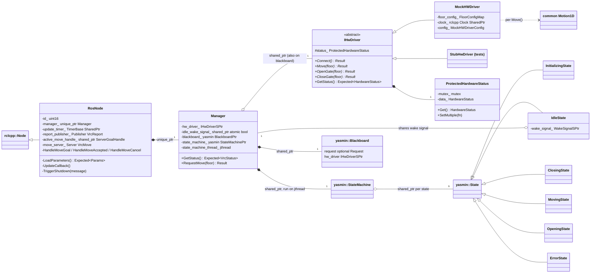
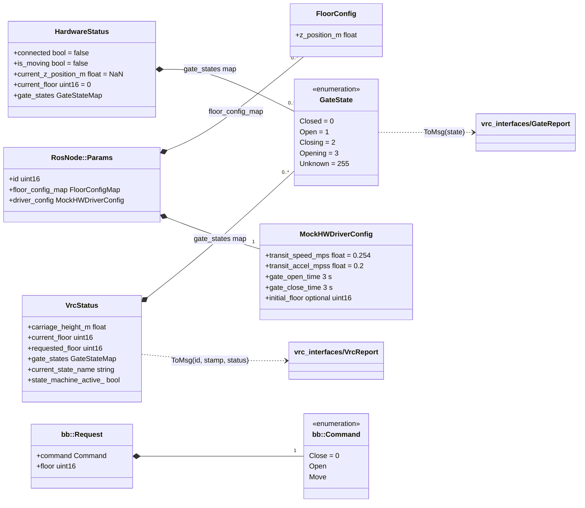
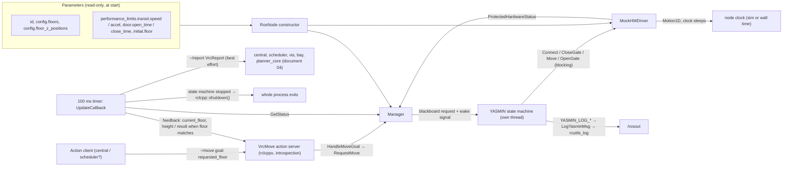
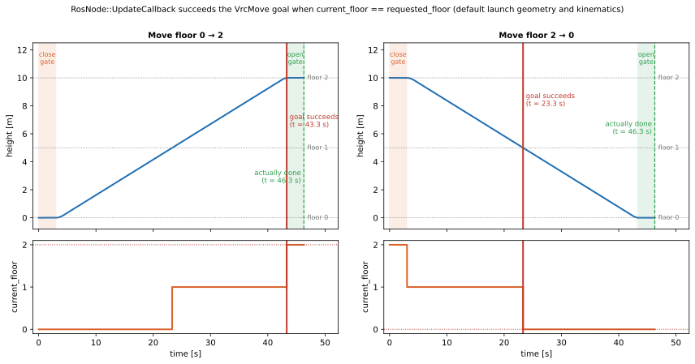

# 17 — `vrc`

| Generated | Revision | Source pack | Status |
|---|---|---|---|
| 2026-10-07 | 2 | `P17-vrc-part1of1.md` | Draft, generated by Claude, not yet reviewed by the team |

Package 17 of 37 (bottom-up) · dependency depth 2

**Abbreviations used in this document.** Each is also explained in context where it first matters.

| Abbreviation | Meaning |
|---|---|
| AGV | Automated Guided Vehicle |
| API | Application Programming Interface |
| CMake (`cmake` in names) | Cross-platform Make (build-system generator) |
| `gtest` | GoogleTest |
| NaN | Not a Number |
| PLC | Programmable Logic Controller |
| `py` | Python (the `.py` file extension; also in names such as `common_py`) |
| QoS | Quality of Service |
| `rclcpp` | ROS Client Library for C++ |
| `rclcppx` | "rclcpp extensions" (Volley package) |
| `rcutils` | ROS C utilities |
| ROS (`ros` in names) | Robot Operating System |
| SIGINT | interrupt signal (Ctrl-C) |
| `sim` | simulation / simulator (also the `sim` package) |
| `stdx` | "standard library extensions" (Volley package) |
| `vis` | visualization (the `vis` package) |
| VRC (`vrc` in names) | Vertical Reciprocating Conveyor (a freight lift between floors) |
| YAML (`yaml` in names) | YAML Ain't Markup Language |
| YASMIN | Yet Another State MachINe (ROS 2 state-machine library) |
| `yasminx` | "YASMIN extensions" (Volley package) |

Workspace dependencies: common (01), rclcppx (02), stdx (03), vrc_interfaces (04); YASMIN (Yet Another State MachINe) directly, not through `yasminx` (15).
Used by: nothing (a leaf: it is a ROS (Robot Operating System) node).

Related documents:
- `04-vrc_interfaces.md`: the `VrcReport` and `VrcMove` contract this node implements; its section 7.1 asked how `current_floor` behaves when moving down, and this package answers it (R1);
- `01-common.md`: `Motion1D`, and its RISK R21;
- `15-yasminx.md`: the Volley YASMIN wrapper, which this package does *not* use;
- `02-rclcppx.md`: `CreateActionServer` and `BestEffortQoS`.

**Missing input.** The task mentions an attached `vrc.md` (repository docs, possibly stale), but it **was not included in the upload**. This document is based on the code alone.

**How to read the evidence markers.**
- **[read]** means the conclusion comes from reading the source.
- **[probed]** means it was confirmed by running code. The mock driver's motion loop was compiled against the real `common` `Motion1D`, with the default kinematics and floor geometry, and timed; one `stdx::Unexpected` call was run.
- **[upstream]** means it was confirmed in the YASMIN or rclcpp behavior documented in earlier documents.

The node itself could not be built, because ROS and YASMIN were not available. The Mermaid diagrams pass the Mermaid 11 parser.

---

## A. External dependencies

`vrc` is the ROS 2 node for a **Vertical Reciprocating Conveyor (VRC)**, the freight lift that carries AGVs (Automated Guided Vehicles) and trays between floors. It implements the `vrc_interfaces` contract (document 04) on top of:
- a YASMIN state machine;
- a hardware-driver interface;
- for now, only a **simulated (mock) driver**.

| Name | Description | Version | Link | Usage in this package |
|---|---|---|---|---|
| YASMIN (`yasmin`) | State-machine library for ROS 2. | Not pinned; semantics checked against main (6.1.2) in document 15. | https://github.com/uleroboticsgroup/yasmin | `yasmin::State`, `StateMachine`, `Blackboard`, `YASMIN_LOG_*`, `set_loggers`, cancellation. |
| rclcpp / rclcpp_action / rclcpp_components | ROS 2 C++ client library, actions, and composable nodes. | Same ROS 2 distribution (Kilted or newer, see document 02). | https://github.com/ros2/rclcpp | `RosNode`; the `VrcMove` action server; a 100 ms timer; registration as a component. |
| `vrc_interfaces` (workspace) | `VrcReport`, `VrcState`, `GateReport`, `GateState`, `VrcMove` (document 04). | Workspace. | — | Published reports and the action. |
| `common` (workspace) | `Motion1D` trapezoidal profile (document 01). | Workspace. | — | Carriage motion in the mock driver. |
| `rclcppx` (workspace) | `CreateActionServer` (with introspection), `BestEffortQoS`. | Workspace. | — | The action server and the report QoS (Quality of Service). |
| `stdx` (workspace) | `Expected`, `Result`, `Unexpected`. | Workspace. | — | Every driver and manager call. |
| backward_ros | Stack traces printed on a crash. | Not pinned. | https://github.com/pal-robotics/backward_ros | Declared in `package.xml`; linked automatically by ament. |
| launch / launch_ros (Python) | ROS launch system. | Same distribution. | https://github.com/ros2/launch | `launch/single.launch.py`. |
| GoogleTest (ament_cmake_gtest) | Unit tests. | Not pinned. | https://github.com/google/googletest | Eight test executables, 40 tests. |

---

## B. Glossary

Terms already defined in documents 04 and 15 (VRC, carriage, gate, floor index, YASMIN state, outcome, blackboard, cancel) are reused here.

| Term | Meaning | Where it shows up |
|---|---|---|
| Hardware driver | The component that talks to the physical VRC: moving the carriage, and opening and closing gates. Defined as an abstract interface, so a real driver can replace the mock. | `IHwDriver` |
| Mock driver | A simulated driver: the carriage follows a trapezoidal speed profile, and gates take fixed times, all on the node's clock. | `MockHWDriver` |
| Hardware status | A snapshot of the connection, motion, height, current floor and gate states, guarded by a mutex. | `HardwareStatus`, `ProtectedHardwareStatus` |
| Request | The command the state machine is working on (Move, Open or Close, and a floor), kept on the blackboard. | `bb::Request` |
| Wake signal | A shared `std::atomic<bool>` on which the idle state waits (C++20 `wait`/`notify`) until a request arrives. | `WakeSignal` |
| Manager | Owns the state machine, the blackboard and the thread that runs them; the node's only entry point into the VRC logic. | `Manager` |
| Action goal handle | rclcpp's object for one accepted action goal, used to publish feedback and finish the goal. | `active_move_handle_` |
| Composable node | A node class built into a shared library and loadable into a container process; ROS also generates a standalone executable. | `RCLCPP_COMPONENTS_REGISTER_NODE` |
| Trapezoidal profile | Accelerate, cruise, then decelerate, within speed and acceleration limits (`common::Motion1D`). | Section 7.1 |

---

## 1. Summary

`vrc` runs one VRC as a ROS node (`RosNode`, registered as the component `volley::vrc::RosNode` with executable `vrc`). It provides:
- the **`~/move` action** (`vrc_interfaces/action/VrcMove`): move the carriage to a floor;
- a **`~/report` topic** (`VrcReport`), published every 100 ms with state, floors, height and gate states.

Inside, a **`Manager`** runs a **YASMIN state machine** on its own thread: initializing → idle → closing → moving → opening → idle, plus an error state. It drives an **`IHwDriver`**. The only implementation today is **`MockHWDriver`**, which simulates the carriage with `common::Motion1D` and gates with fixed delays, using the same kinematics parameters as the scheduler's cost model.

**How it fits with the earlier documents.** This is the first full node in the series, so it shows how the foundations are used in practice:
- **`vrc_interfaces`** gives it its external contract;
- **`rclcppx`** creates its action server (with introspection);
- **`stdx`** carries every error;
- **`common`** provides its motion model.

It uses **raw YASMIN** rather than `yasminx` (document 15): the states return outcome strings, log through `YASMIN_LOG_*` (bridged to ROS logging), and read the blackboard by string key. That is a third way of writing state machines in the workspace, after `structures` and `yasminx`.

**The design is clean in its layering:**
- the node holds only ROS concerns;
- the manager holds the state machine and threading;
- the driver holds the hardware.

Thread safety is deliberate: a mutex-protected status, a locked blackboard, an atomic wake signal, and the thread declared last.

**Problems at the contract boundary.** Running the motion loop with the default configuration showed:
- **The move goal is reported successful too early.** The node succeeds the goal as soon as the driver's `current_floor` equals the target. On a downward move, the driver reports the target floor as soon as the carriage drops below the floor *above* it, so a 2 → 0 move "succeeds" about 23 s before the carriage arrives. On every move, success comes before the destination gate has opened (R1, **[probed]**).
- **Any error is fatal.** It ends the state machine, and the node then calls `rclcpp::shutdown()`, which stops the whole process (R2).
- **The bundled launch file cannot start the node.** It omits four of the seven parameters the node requires (R3).

---

## 2. Files

The package has 35 files:
- 13 public headers: driver interface and mock, six states, blackboard keys, state names, core types, manager, message conversions;
- 10 sources;
- a launch file;
- 9 test files;
- 2 build files.

Line counts are from the pack, which has blank lines removed.

| Path (under `src/vrc/`) | Lines | Role |
|---|---:|---|
| `include/vrc/drivers/i_hw_driver.hpp` | 98 | `HardwareStatus`, the `HardwareStatusMutator` concept, `ProtectedHardwareStatus`, and the abstract `IHwDriver` (Connect, Move, OpenGate, CloseGate, GetStatus). |
| `include/vrc/drivers/mock_hw_driver.hpp` | 42 | `MockHWDriverConfig` (speed, acceleration, gate times, initial floor); `MockHWDriver`. |
| `include/vrc/sm/blackboard.hpp` | 18 | `bb::Command`, `bb::Request`, and the blackboard keys `"request"` and `"hw_driver"` with their types. |
| `include/vrc/sm/{closing,error,idle,initializing,moving,opening}_state.hpp` | 9–13 each | Declarations of the six `yasmin::State` subclasses. |
| `include/vrc/sm/state_strings.hpp` | 22 | State names and outcome strings. |
| `include/vrc/core_types.hpp` | 39 | `FloorNumber`, `FloorConfig(Map)`, `GateState`, `GateStateMap`, `VrcStatus`, `WakeSignal`. |
| `include/vrc/manager.hpp` | 41 | `Manager`: constructor, `GetStatus`, `RequestMove`, owned state machine and thread. |
| `include/vrc/msg_conversions.hpp` | 75 | `ToMsg` overloads: `GateState` → message, state name → `VrcState`, `VrcStatus` → `VrcReport`. |
| `launch/single.launch.py` | 44 | Launches one node (`/vrc/r<id>`) with floors and heights; checks that their lists have equal length. |
| `src/drivers/mock_hw_driver.cpp` | 116 | Mock driver: initial state, simulated connect, gates, and a `Motion1D`-based move loop. |
| `src/sm/closing_state.cpp` | 52 | Closes the current floor's gate (for a move) or the requested gate (for a close). |
| `src/sm/error_state.cpp` | 9 | Returns `terminal`. |
| `src/sm/idle_state.cpp` | 50 | Waits on the wake signal; dispatches the request; treats a move to the current floor as already done. |
| `src/sm/initializing_state.cpp` | 18 | `Connect()`. |
| `src/sm/moving_state.cpp` | 29 | `Move(floor)`. |
| `src/sm/opening_state.cpp` | 57 | Opens the gate; for a move, checks floor and gate, then clears the request. |
| `src/manager.cpp` | 147 | Builds the blackboard and state machine (with the SIGINT (interrupt signal) handler saved and restored), bridges YASMIN logs, runs the thread, implements status and move requests. |
| `src/ros_node.hpp` / `src/ros_node.cpp` | 62 / 232 | `RosNode`: parameters, the manager with the mock driver, the 100 ms update timer, the report publisher, and the `~/move` action server. |
| `test/drivers/stub_hw_driver.hpp` | 53 | Stub driver with settable status and injectable failures. |
| `test/drivers/test_mock_hw_driver.cpp` | 152 | 15 tests of the mock driver. |
| `test/sm/test_*_state.cpp` (6 files) | 10–71 | 22 state tests. |
| `test/test_manager.cpp` | 79 | Three manager tests. |
| `CMakeLists.txt` | 89 | Libraries `vrc_mock_hw_driver` and `vrc_manager`; component `vrc_ros_node` and executable `vrc`; eight gtests; installs `launch/`. |
| `package.xml` | 23 | Dependencies, including backward_ros, rclcpp_action, rclcpp_components and yasmin. |

---

## 3. Public API

The external API (Application Programming Interface) is the node's ROS interface (3.1). The C++ API in `include/vrc/` (namespace `volley::vrc`) is used by the node and the tests, and is designed so that a real hardware driver can be added later.

### 3.1 ROS interface — `RosNode` (`src/ros_node.cpp`)

| Interface | Name (default launch) | Type | Behavior |
|---|---|---|---|
| Action server | `~/move` → `/vrc/r1/move` | `vrc_interfaces/action/VrcMove` | **Goal:** accepted only if the state machine is idle and the floor exists; otherwise rejected. **Feedback:** `current_floor` and `carriage_height_m`, every 100 ms. **Result:** succeeded with `current_floor` once `current_floor == requested_floor` (R1). **Cancel:** always rejected. Only one goal at a time (R4). Introspection is configured by `rclcppx` (document 02). |
| Publisher | `~/report` → `/vrc/r1/report` | `vrc_interfaces/msg/VrcReport` | Every 100 ms, best effort with depth 1 (`rclcppx::BestEffortQoS(1)`). `state` is mapped from the YASMIN state name; `state_description` is that name. |
| Timer | 100 ms | — | `UpdateCallback`: gets the status; shuts the node down if the state machine has stopped; finishes or updates the active goal; publishes the report. |

**Parameters**, all read-only and read once at construction. Note that `declare_parameter(name, type, descriptor)` declares a parameter **without a default**, so it must be set.

| Parameter | Type | Default | Constraint | Purpose |
|---|---|---|---|---|
| `id` | int | **none (required)** | — (truncated to `uint16`) | `VrcReport.id`. |
| `config.floors` | int[] | **none (required)** | 0 … 65535 | Floor numbers. |
| `config.floor_z_positions` | double[] | **none (required)** | ≥ 0 | Floor heights, in metres, one per floor. |
| `performance_limits.transit.speed` | double | **none (required)** | — | Carriage speed [m/s]. Also read by the scheduler's motion cost model, according to a code comment. |
| `performance_limits.transit.accel` | double | **none (required)** | — | Carriage acceleration [m/s²]. |
| `door.open_time` | double | **none (required)** | — | Gate opening time [s]. |
| `door.close_time` | double | **none (required)** | — | Gate closing time [s]. |
| `initial.floor` | int | −1 | −1 … 65535 | Starting floor in simulation (−1 means the lowest floor). |

The comment refers to a `vrc:` section in a `params.yaml` for the four kinematics and gate-timing parameters. That file is not in this package, and `single.launch.py` does not set them (R3).

### 3.2 `Manager` — `include/vrc/manager.hpp`, `src/manager.cpp`

**Purpose.** It hides YASMIN and threading from the node: give it a driver, then ask for status or request moves.

**Construction** (`Manager(name, hw_driver, log_function = nullptr)`):
1. Puts the driver and an empty request on the blackboard.
2. Saves the SIGINT handler, builds the YASMIN machine, and restores the handler. This is the same technique `yasminx` packages up as `SigintGuard`.
3. If a log function is given, installs it as the **process-wide** YASMIN logger through a global trampoline. The last manager to do so wins.
4. Adds the six states and their transitions (section 4c).
5. Starts the machine on a `std::jthread`.

**Members.**

| Member | Behavior |
|---|---|
| `GetStatus() -> Expected<VrcStatus>` | Combines the driver status (height, floor, gates) with the blackboard request (`requested_floor`, during a move) and the machine state (`current_state_name`, `state_machine_active_`). |
| `RequestMove(floor) -> Result` | Fails if the current state is not `idle`, if the driver status is unavailable, or if the floor is unknown. Otherwise it writes `Request{Move, floor}` to the blackboard and wakes the idle state. |
| `~Manager()` | Wakes idle (with no request, idle returns `terminal`), calls `cancel_state_machine()`, then joins the thread (declared last). |

There is **no API to open or close a gate** alone. The `Open` and `Close` commands and their state paths exist, and are tested, but are unreachable from the node (R7).

### 3.3 Hardware driver interface — `include/vrc/drivers/i_hw_driver.hpp`

**`IHwDriver`** is abstract. Its operations are blocking, and return `stdx::Result`:
- `Connect()`;
- `Move(floor)`;
- `OpenGate(floor)`;
- `CloseGate(floor)`.

It also provides `GetStatus() -> Expected<HardwareStatus>`, a locked snapshot of the protected `status_` that every driver shares.

**`ProtectedHardwareStatus`** wraps `HardwareStatus` in a mutex:
- `Get()` returns a consistent copy;
- the setters write a single field;
- `SetMultiple(fn)` applies a lambda under the lock (`HardwareStatusMutator` concept), so related fields change together.

**`MockHWDriver(floor_config, clock, config)`** throws `std::invalid_argument` for an empty floor map or an unknown initial floor. It starts with all gates closed except the initial floor's, and behaves as follows:

| Operation | Mock behavior |
|---|---|
| `Connect` | Sleeps 200 ms on the clock, then sets `connected`. |
| `Open/CloseGate(floor)` | Unknown floor → error. Already in the target state → success. Otherwise sets the gate to Opening or Closing, sleeps the configured time, then sets Open or Closed. **Any floor's gate can be opened, wherever the carriage is** (R8). |
| `Move(floor)` | Same floor → success; unknown floor → error. **The target** gate must be closed, but the current floor's gate is not checked (R8). Otherwise runs a `Motion1D` profile in 50 ms clock steps, updating height and `current_floor` = the highest floor at or below the carriage (R1), then snaps to the target. |

### 3.4 State machine pieces — `include/vrc/sm/*`

- **Six `yasmin::State` subclasses**, each reading the driver and the request from the blackboard by key (`bb::kKeyHWDriver`, `bb::kKeyRequest`) and returning outcome strings from `state_strings.hpp`. The machine itself is shown in section 4c.
- **The blackboard holds two keys:**
  - `"hw_driver"`, of type `IHwDriverSPtr`;
  - `"request"`, of type `std::optional<bb::Request>`, cleared (set to `nullopt`) when a move completes, or when it targets the current floor.

### 3.5 Types and conversions — `core_types.hpp`, `msg_conversions.hpp`

- **`VrcStatus`** carries `carriage_height_m`, `current_floor`, `requested_floor`, `gate_states`, `current_state_name` and `state_machine_active_`. That last member has a trailing underscore, as if private, although it is a public field.
- **`GateState`** mirrors `vrc_interfaces::GateState`, including `Unknown = 255`. The internal value `Closed = 0` matches the message's unsafe zero default, which document 04 flagged as R1.
- **`ToMsg(...)`** maps:
  - gate states one to one;
  - state names to `VrcState` (`initializing`, `idle`, `moving`, `closing`, `opening`, `error`; anything else → `STATE_UNKNOWN`; `STATE_DISABLED` is never produced);
  - `VrcStatus` to `VrcReport`.

**Usage** (how a real driver would plug in):

```cpp
class PlcHwDriver : public volley::vrc::IHwDriver {
 public:
  stdx::Result Connect() override;                       // open the PLC connection, set status_.SetConnected(true)
  stdx::Result Move(FloorNumber floor) override;         // command the PLC, poll, update status_ with SetMultiple
  stdx::Result OpenGate(FloorNumber floor) override;
  stdx::Result CloseGate(FloorNumber floor) override;
};
// In RosNode: std::make_unique<Manager>(get_name(), std::make_shared<PlcHwDriver>(...), log_fn);
```

This is illustrative: there is no real driver in the pack, and `RosNode` hard-codes `MockHWDriver` (R9). PLC means Programmable Logic Controller.

---

## 4. Diagrams

### 4a. Class diagrams (ownership on edges)

**Node, manager, state machine and driver.**



**Value types and message conversion.**



### 4b. Data flow



### 4c. State machines

**The VRC state machine**, exactly as wired in `Manager`'s constructor. The final outcome is `terminal`, which ends the machine, after which the node shuts the process down.

```mermaid
%%{init: {"fontFamily": "JetBrainsMono Nerd Font, FiraCode Nerd Font, Hack Nerd Font, DejaVu Sans Mono, Menlo, Consolas, monospace", "themeVariables": {"fontFamily": "JetBrainsMono Nerd Font, FiraCode Nerd Font, Hack Nerd Font, DejaVu Sans Mono, Menlo, Consolas, monospace"}}}%%
stateDiagram-v2
    direction LR
    [*] --> initializing
    initializing --> idle : initialized (Connect ok)
    initializing --> error : errored
    idle --> idle : idled (move to current floor; request cleared)
    idle --> closing : move_requested
    idle --> closing : close_requested (no API caller)
    idle --> opening : open_requested (no API caller)
    idle --> error : errored (status unavailable)
    idle --> [*] : terminal (woken with no request, i.e. destructor)
    closing --> moving : closed_for_move (current floor gate closed)
    closing --> idle : closed (close command)
    closing --> error : errored
    moving --> opening : moved (Move ok)
    moving --> error : errored
    opening --> idle : opened (gate open; move request cleared)
    opening --> error : errored (gate failed, or wrong floor or gate after move)
    error --> [*] : terminal
```



A move therefore goes idle → closing (the current gate) → moving → opening (the destination gate) → idle. The external `VrcState` reported for each phase follows the inferred sequence in document 04, section 4c, which this code confirms. One difference: there is no recovery from `error`, and `DISABLED` and `UNKNOWN` are never used.

---

## 5. Behavior

**Construction** (`RosNode`):
1. **`LoadParameters()`** declares and reads the parameters.
   - A list-length mismatch returns an error, and `TriggerShutdown` logs FATAL and calls `rclcpp::shutdown()`.
   - A required parameter that is missing throws from `declare_parameter` or `get_parameter`, which escapes the constructor (R3).
2. **The manager is built** with a `MockHWDriver` on the node clock, and with a log bridge that forwards YASMIN messages to rcutils, keeping the original file, function and line.
3. **The interfaces are created:** the 100 ms timer, the `~/report` publisher, and the `~/move` action server (through `rclcppx::CreateActionServer`, which configures introspection).

**Steady state.**

| Thread | Runs |
|---|---|
| Executor thread(s) | The timer callback and the action callbacks, all in the node's default *mutually exclusive* callback group, so `active_move_handle_` is never accessed concurrently. |
| State-machine thread (`jthread` in `Manager`) | The YASMIN loop. States block in driver calls (clock sleeps), and idle blocks in `atomic::wait`. |

- **Shared data** crosses threads only through the YASMIN blackboard (locked by YASMIN), `ProtectedHardwareStatus` (a mutex) and the atomic wake signal.
- **A move takes about 46 s** with the default launch geometry (0, 5 and 10 m floors) and the mock kinematics (0.254 m/s, 0.2 m/s²): 3 s to close the gate, about 40 s of travel, and 3 s to open the gate (section 7, **[probed]**).

**Shutdown.**
- **Node destruction:** the manager destructor wakes idle and cancels the machine. If a state is inside a blocking driver call (for example a 40 s move), the join waits for it to return.
- **After any error:** the error state returns `terminal`, the machine ends, and the next timer tick sees `state_machine_active_ == false` and calls `rclcpp::shutdown()` for the whole context (R2).

---

## 6. Ownership and safety

### 6.1 Lifetimes

- `RosNode` owns the `Manager` (`unique_ptr`). The driver is shared between the manager and the blackboard, and the states are owned by the YASMIN machine.
- **Member order in `Manager`.** The thread is declared last, so it joins before the blackboard, machine and driver are destroyed; the comment says so explicitly.
- **Member order in `RosNode`.** `manager_` is declared *before* `move_server_` and `update_timer_`, so it is destroyed *after* them (members are destroyed in reverse order). Callbacks that call into the manager therefore cannot outlive it.
- **The YASMIN log bridge** captures `get_logger()` by value inside a global `std::function`, which outlives the node. That is safe because a logger is a value, but the global slot is process-wide (R10).

### 6.2 Callbacks capturing `this`

- The timer and the action server lambdas capture `this`. They are owned by members of the same node, and run in one mutually exclusive group, which is safe.
- The manager's thread lambda captures `this` (the manager), and is safe because of the member order above.

### 6.3 Locks and atomics

| Mechanism | Protects | Used by |
|---|---|---|
| `std::mutex` in `ProtectedHardwareStatus` | `HardwareStatus` | The driver (state thread), `GetStatus` (executor thread). |
| YASMIN blackboard recursive mutex | `request`, `hw_driver` | States (state thread), `RequestMove` and `GetStatus` (executor thread). |
| `std::atomic<bool>` wake signal, `wait`/`notify_one` | Idle wake-up | `RequestMove`, `~Manager`, `IdleState`. |

The check in `RequestMove` ("is the state idle?") and its write to the blackboard are not atomic with respect to the state machine. Two goals accepted in the same instant can both pass the check (R4).

### 6.4 Error handling

| Layer | Style |
|---|---|
| Driver | `stdx::Result` with formatted messages; the mock constructor throws `std::invalid_argument`. |
| States | Log through `YASMIN_LOG_ERROR` and return `errored`; every error leads to the terminal error state. |
| Manager | `Expected` / `Result` toward the node. |
| Node | Goal rejection (logged); FATAL log plus `rclcpp::shutdown()` for unrecoverable conditions; exceptions from parameter declaration escape the constructor. |

### 6.5 RISK items

| Item | Risk | Evidence |
|---|---|---|
| R1 | **The move goal succeeds too early, especially downward.** `UpdateCallback` succeeds the goal when `current_floor == requested_floor`. The mock driver's `current_floor` is the highest floor at or below the carriage. On the way **down**, it equals the target as soon as the carriage passes below the floor above the target: a 2 → 0 move succeeds at t = 23.3 s instead of finishing at 46.3 s, and 2 → 1 succeeds 0.1 s after the motion starts. On the way **up**, success arrives when the carriage reaches the floor, but still about 3 s before the destination gate is open, while the state machine is not yet idle. A client that reacts to success by sending the next goal is rejected ("not idle"), or worse, sends an AGV toward a closed gate. The result's `message` is never set. | **[probed]** (Figure 7.1) |
| R2 | **Any error stops the whole process.** All error outcomes go to `error`, then `terminal`; the timer then calls `rclcpp::shutdown()`. There is no retry, reset or `DISABLED` state, and in a component container the shutdown also stops every other node in the process. The active goal is never completed explicitly. | **[read]** |
| R3 | **The bundled launch file cannot start the node.** Seven parameters are declared without defaults. `single.launch.py` sets three of them (`id`, `config.floors`, `config.floor_z_positions`); the other four (`performance_limits.transit.speed/accel`, `door.open_time/close_time`) are missing, so the parameter calls throw during construction. The comment points to a `params.yaml` that is not in this package. | **[read]**, rclcpp parameter semantics |
| R4 | **Single goal, unguarded.** Goals are accepted only when idle, but the idle check and the blackboard write are not atomic with the state machine. Two goals arriving together can both be accepted: the second overwrites the request, and `HandleMoveAccepted` replaces the first handle, which is destroyed unfinished (rclcpp then cancels it). Cancel requests are always rejected, even for a 40 s move. | **[read]** |
| R5 | **Bad kinematics hang the state machine.** Speed and acceleration are not validated: a speed of 0 makes `Motion1D` never finish, so `Move` loops forever, and so does shutdown, which waits for it. Floor heights are only required to be ≥ 0. If floor numbers are not ordered the same way as their heights, `std::ranges::upper_bound` is called on a sequence that is not sorted by height (a precondition violation), giving wrong floors. Duplicate floor numbers are silently dropped by `map::insert`. | **[read]** |
| R6 | **`Motion1D` artifacts reach the reports.** The mock inherits `Motion1D`'s chatter and final snap (document 01, R21), so `carriage_height_m` and the action feedback show small speed oscillations, and an instant stop at arrival. This is harmless for planning, but visible in visualizations. | **[read]** + document 01 |
| R7 | **Unreachable code paths.** The Open and Close commands, with their state transitions, cannot be triggered by any API, yet they are maintained and tested. | **[read]** |
| R8 | **The mock does not model gate interlocks.** `OpenGate` opens any floor's gate wherever the carriage is (a fall hazard in reality), and `Move` checks only the *target* gate, not the current one. The real interlocks are presumably in the PLC; tests against the mock cannot catch logic that would rely on them. | **[read]** |
| R9 | **The driver is hard-coded.** `RosNode` always builds a `MockHWDriver`; there is no parameter or plugin to select a real driver. | **[read]** |
| R10 | **Logging pitfalls.** The YASMIN logger is a single process-wide slot (the last manager wins). Several `YASMIN_LOG_ERROR(status.error().c_str())` calls pass a runtime string as a printf format, so an error message containing `%` is undefined behavior. `bb::Command` (a scoped enum) is passed to `%u`. | **[read]** |
| R11 | **The parameter error message is never filled in.** `stdx::Unexpected("config parameter mismatch for '%s' and '%s'", a, b)` uses printf placeholders with `std::format`, so the message keeps `'%s'` literally. | **[probed]** |
| R12 | **Narrowing and naming.** `id` is cast from `int64` to `uint16` without a range check. `VrcStatus` is a struct whose fields are uninitialized by default, with a public member named like a private one (`state_machine_active_`). | **[read]** |

---

## 7. Math

### 7.1 Carriage motion in the mock driver

`MockHWDriver::Move` uses `common::Motion1D` (document 01, section 7). With travel distance $d=|z_\text{target}-z_\text{start}|$, speed $v$ and acceleration $a$, the ideal move time is

$$
T_\text{move}=\begin{cases}\dfrac{d}{v}+\dfrac{v}{a} & d \ge v^2/a\\[6pt] 2\sqrt{d/a} & \text{otherwise.}\end{cases}
$$

For the defaults ($v=0.254$ m/s, $a=0.2$ m/s², floors 5 m apart) that is $T\approx 20.9$ s per floor, and $40.6$ s for two floors; the discrete loop measured 20.8 s and 40.3 s **[probed]**. A complete move adds the two gate times:

$$
T_\text{goal}=t_\text{close}+T_\text{move}+t_\text{open}\approx 3+40.3+3=46.3\ \text{s}.
$$

The scheduler is said to read the same parameters for its cost model, so planned and simulated durations agree if both use this formula. Whether the scheduler includes both gate times is a question for that document.

### 7.2 Which floor is "current" during a move

With floor heights $z_k$ and carriage height $z$, the mock reports

$$
c_\text{mock}(z)=\max\{\,k : z_k\le z\,\}
$$

for both directions. `vrc_interfaces` defines `current_floor` as the last floor "passed while moving", which depends on the direction (document 04, section 7.1):

$$
c_\text{passed}(z)=\begin{cases}\max\{k : z_k\le z\} & \text{moving up}\\ \min\{k : z_k\ge z\} & \text{moving down.}\end{cases}
$$

The two agree going up, and differ going down by up to one floor for the whole segment between two floors. Combined with the success test $c = \text{requested}$ in `UpdateCallback`, a downward goal completes as soon as the carriage leaves the floor above the target (R1).

The success condition that matches the action's contract ("current floor matches requested floor" *and* the move is finished) would be

$$
\text{succeed} \iff c = r \ \wedge\ \text{state} = \text{idle} \ \wedge\ \text{gate}_r = \text{Open}.
$$



*Figure 7.1 — Moves 0 → 2 and 2 → 0, using the mock driver's loop with the default launch geometry and kinematics. Top: carriage height, with the gate-close and gate-open phases. Bottom: the driver's `current_floor`. The red line marks when `UpdateCallback` succeeds the goal: at arrival, before the gate opens, going up; at 23.3 s, halfway, going down. The dashed line marks the actual completion, at 46.3 s.*

---

## 8. Tests

There are 40 tests in eight executables:
- 15 for the mock driver;
- 22 for the states (1 error, 2 initializing, 5 idle, 5 closing, 4 moving, 5 opening);
- 3 for the manager.

They use a steady clock and a stub driver with injectable failures. They were not run here, because ROS and YASMIN were not available.

| Area | Covers | What it reveals about intended behavior |
|---|---|---|
| Mock driver | Initial state (the start floor's gate open, the others closed); empty config and unknown initial floor throw; connect; open and close (already in that state, unknown floor); move (already there, unknown floor, target gate not closed) | The initial-floor gate starts *open*. A move requires the *target* gate closed. Floors 0.05 m apart keep the tests fast. |
| States | Every outcome of every state, including missing request, wrong command type, and injected driver failures | Each state validates the request it is given; a wrong request leads to `errored`. Moving to the current floor results in `idled`, and clears the request. |
| Manager | Idle at startup; a full move 0 → 1 with the stub (the old gate closed, the new gate open, the request cleared); rejection of an unknown floor | The full sequence closes the old gate and opens the new one; `requested_floor` equals `current_floor` again afterwards. |

**Gaps.**
- **No `RosNode` test at all:** action accept and reject, success timing (R1), feedback, reports, parameter loading (R3), and the shutdown path (R2).
- **No test of a downward move**, of the mock's `current_floor` during motion, or of overlapping goals (R4).
- **No test of invalid kinematics** (speed 0) or of unsorted floor heights (R5).
- **No test that destroying the manager during a move completes in bounded time.**
- **No test of `ToMsg` conversions**, for example that an unknown state name becomes `STATE_UNKNOWN`.

---

## 9. Idioms to reuse, and open questions

### 9.1 Idioms

- **Layering.** The ROS node does only ROS work (parameters, interfaces, timer); a `Manager` owns the logic, threading and state machine; a driver interface isolates the hardware. A mock driver and a test stub make every layer testable alone.
- **Thread-safe status.** Keep hardware status behind a mutex, with snapshot reads and an atomic multi-field update (`SetMultiple` with a concept-constrained lambda).
- **Declare the worker thread last** in owning classes, so it joins before the data it uses is destroyed.
- **Read-only, typed parameter descriptors with ranges**, validated once and returned as an `Expected<Params>` bundle.
- **Bridge library logs into ROS** while keeping the source location (`LogYasminMsg` with `rcutils_log` and a `rcutils_log_location_t`).
- **One timer drives everything observable:** reports, action feedback and results, and health checks.

### 9.2 Open questions for the team

1. Could `vrc.md` be shared? It may describe the intended PLC driver, the deployment parameters (`params.yaml`), and the action semantics.
2. **Goal success (R1).** Should success wait for the machine to return to idle with the destination gate open? Should the mock compute `current_floor` with "passed" semantics on downward moves, as `vrc_interfaces` describes?
3. **Error handling (R2).** Is shutting down the process on any error intended? Should there be a reset or retry path, or a `DISABLED` state, so that one VRC fault does not stop the process?
4. Where are the kinematics and gate-time parameters defined, and should `single.launch.py` load them, or should the node give them defaults (R3)?
5. Should goal acceptance be serialized with the state machine (for example a compare-and-set on the request), and should cancel be supported, at least before motion starts (R4)?
6. Should speed and acceleration be validated as > 0, and floor heights as increasing with floor number (R5)?
7. Is a real hardware driver planned? How will it be selected: by parameter, or by plugin (R9)? Will the open and close commands be exposed then (R7)?
8. Why raw YASMIN instead of `yasminx`, which provides typed keys, error outcomes and ROS logging? Is migrating planned (documents 05 and 15, open question 1)?
