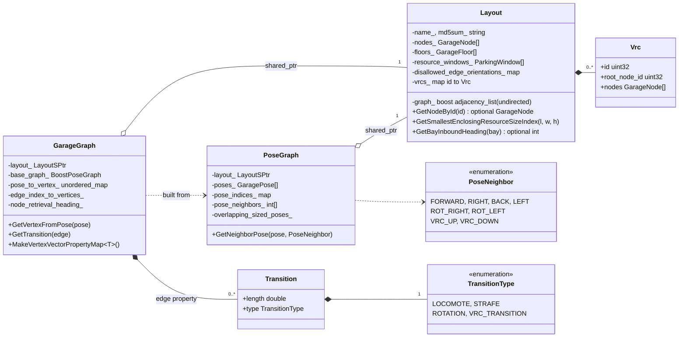
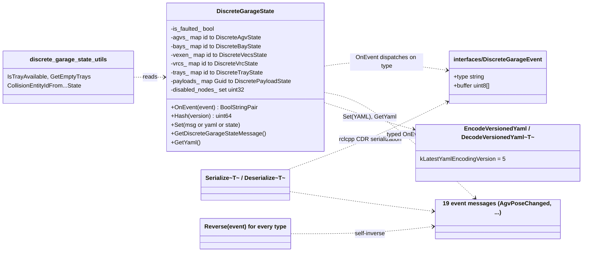
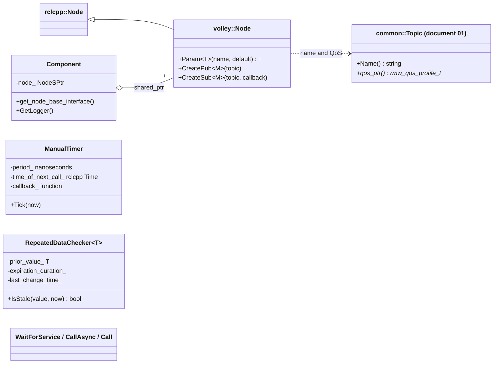
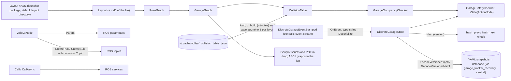

# 18 — `common_ros`

| Generated | Revision | Source pack | Status |
|---|---|---|---|
| 2026-10-07 | 1 | `P18-common_ros-part1of3.md` (part 1 of 3) | **In progress**: covers part 1; parts 2–3 will extend it. Generated by Claude, not yet reviewed by the team |

Package 18 of 37 (bottom-up) · dependency depth 6

**Abbreviations used in this document.** Each is also explained in context where it first matters.

| Abbreviation | Meaning |
|---|---|
| AGV (`agv` in names) | Automated Guided Vehicle |
| `agvhito` | AGV software for HITO vehicles (inferred from the name) |
| API | Application Programming Interface |
| ASan | AddressSanitizer (compiler memory-error checker) |
| ASCII | American Standard Code for Information Interchange (plain text) |
| BLift | bay lift: a bay with its own lift serving several floors (inferred) |
| CDR | Common Data Representation (the DDS serialization format) |
| CI | Continuous Integration |
| CMake (`cmake` in names) | Cross-platform Make (build-system generator) |
| EV | Electric Vehicle |
| `gtest` | GoogleTest |
| GUID | Globally Unique Identifier |
| HITO | name of the AGV vendor; not expanded in the code |
| JSON (`json` in names) | JavaScript Object Notation |
| MD5 (`md5` in names) | Message-Digest algorithm 5 |
| ODP | not expanded in the code; the overdrive door-and-platform unit of a bay (inferred) |
| PDF | Portable Document Format |
| QoS (`qos` in names) | Quality of Service |
| `rclcpp` | ROS Client Library for C++ |
| `rclcppx` | "rclcpp extensions" (Volley package) |
| `rmw` | ROS middleware interface |
| ROS (`ros` in names) | Robot Operating System |
| `sim` | simulation / simulator (also the `sim` package) |
| `stdx` | "standard library extensions" (Volley package) |
| VECS (`vecs` in names) | not expanded in the code; Volley's vehicle EV-charging subsystem (inferred) |
| `vis` | visualization (the `vis` package) |
| VRC (`vrc` in names) | Vertical Reciprocating Conveyor (a freight lift between floors) |
| YAML (`yaml` in names) | YAML Ain't Markup Language |

Workspace dependencies: common (01), interfaces (11), launcher (not yet documented), rclcppx (02), stdx (03); also vrc_interfaces (04) through its headers.
Used by: agvhito, agvhito_tools, bay, central, cost_functions, lift, motion_planner, planner_core, scheduler, scheduler_advanced_tests, sim, vecs, vis (13 packages).

Related documents:
- `11-interfaces.md`: the message types used everywhere here, and the event-sourcing design that this package implements;
- `01-common.md`: geometry, `Wrap`, `HashCombine`, the topic registry used by `volley::Node`;
- `09-task_planner.md`: an assignment solver that runs over the graphs defined here.

**Coverage so far.** This revision documents **part 1 of 3**: all 24 public headers, 4 of the package's source files (`agv_motion_type.cpp`, `collision_geometry.cpp`, `discrete_garage_state.cpp`, `discrete_garage_state_utils.cpp`) and the build files. The other sources (layout, graphs, polygons, tape layout, ROS utilities, the versioned YAML codec, the safety checker) and all tests are expected in parts 2 and 3. Statements that depend on code not yet seen are marked *(pending part 2/3)*.

**How to read the evidence markers.**
- **[read]** means the conclusion comes from reading the source.
- **[probed]** means it was confirmed by running code: the event hasher's byte loop extracted verbatim, Boost.Geometry's rotation direction and polygon orientation checks with Boost 1.83, and nlohmann/json's handling of the collision-table cache format.

The package itself could not be built here, because ROS was not available. The Mermaid diagrams pass the Mermaid 11 parser.

---

## A. External dependencies

`common_ros` is the **ROS-aware foundation library** of the workspace: everything shared that needs ROS messages or rclcpp. It builds one shared library, `common_ros_lib`, plus a `geometry_visualization_tool` executable.

| Name | Description | Version | Link | Usage in this package |
|---|---|---|---|---|
| rclcpp | ROS 2 C++ client library. | Same ROS 2 distribution (Kilted or newer, see document 02). | https://github.com/ros2/rclcpp | `volley::Node`, logging macros, serialization of events, service-call helpers, `rclcpp::Time`. |
| Boost.Graph | Generic graph data structures and algorithms. | Boost (Ubuntu 24.04 ships 1.83). | https://www.boost.org/libs/graph | `GarageGraph` (`adjacency_list`), `Layout`'s node graph. |
| Boost.Geometry | Computational geometry. | Same. | https://www.boost.org/libs/geometry | Polygons, convex hulls, rotations and intersection tests for collision checking. |
| yaml-cpp | YAML (YAML Ain't Markup Language) parser and emitter. | System. | https://github.com/jbeder/yaml-cpp | Layout files; versioned snapshots of the discrete garage state. |
| nlohmann/json | JSON (JavaScript Object Notation) for C++. | System (`nlohmann-json-dev`). | https://github.com/nlohmann/json | The on-disk collision-table cache. |
| Eigen | Linear algebra. | System. | https://eigen.tuxfamily.org | Pose distances (`CalcDistFromPose`). |
| `common`, `interfaces`, `stdx`, `rclcppx`, `vrc_interfaces` (workspace) | Documents 01, 11, 03, 02, 04. | Workspace. | — | Constants, math, message types, `Expected`, VRC state types. |
| `launcher` (workspace) | Not yet documented; provides layout files *(inferred: `exec_depend` and `test_depend`, with `GetLayoutPathByName` using "the default layout directory")*. | Workspace. | — | Layout YAML files at run time and in tests. |
| graph-easy (`libgraph-easy-perl`) | Renders Graphviz `dot` graphs as ASCII text. | Optional system tool. | https://metacpan.org/dist/Graph-Easy | `PrintGraph` (debug output). |
| GoogleTest (ament_cmake_gtest) | Unit tests. | Not pinned. | https://github.com/google/googletest | 20 test targets, most with ASan (AddressSanitizer). |

---

## B. Glossary

Terms defined in documents 01–17 (garage pose, heading, reciprocal, tray, payload, bay, VRC, event sourcing, hash chain, discrete state, …) are reused.

| Term | Meaning | Where it shows up |
|---|---|---|
| Layout | The garage map loaded from a YAML file: nodes, floors, edges, parking windows, bays, VRCs. | `Layout` |
| Pose graph | Every valid (node, heading) pair, with up to eight neighbors each: forward, right, back, left, rotate right, rotate left, VRC up, VRC down. | `PoseGraph` |
| Garage graph | The pose graph as a Boost directed graph, with a `Transition` (type and length) on every edge; used for planning. | `GarageGraph` |
| Transition | The kind of AGV motion along an edge: locomote (along the AGV's body *y* axis), strafe (along body *x*), rotation, or VRC transition. | `TransitionType` |
| Locomote / strafe | Driving along the AGV's long axis / sideways. An omnidirectional AGV does both. | `AgvMotionType`, section 7.1 |
| Collision entity | A shape that can occupy space: AGV, tray, tray legs, bay ODP, or a payload of a given size class. | `CollisionEntity` |
| Collision table | A precomputed lookup: for each entity at each pose or edge, which poses and edges each other entity type cannot occupy. | `CollisionTable` |
| Occupancy checker | Tracks which occupant blocks which locations, using the collision table. | `GarageOccupancyChecker<T>` |
| Safety checker | Uses the occupancy checker to decide whether a schedule step (`ActionNode`) can run without collision. | `GarageSafetyChecker` |
| Bounding circle | The smallest circle around a shape's center that contains it; a cheap first test before an exact polygon test. | `Circle`, `GetBoundingRadius` |
| Convex hull | The smallest convex polygon containing a set of points; here, the area swept by a footprint moving along an edge. | `PolyAtEdge` |
| Resource window | A named size class for payloads (`ParkingWindow`); payload collision ids are `PAYLOAD + window index`. | `PayloadEntity` |
| Self-inverse event | An event whose reversal is the same event with its direction flipped (added ↔ removed, current ↔ next). | `Reverse(...)` |
| Snapshot | The discrete garage state serialized to versioned YAML, for storage and recovery. | `versioned_state_buffer.hpp` |
| Gnuplot | A plotting program; collision queries can be drawn as Gnuplot scripts. | `geometry_visualization.hpp` |

---

## 1. Summary

`common_ros` holds the **garage model and the shared ROS plumbing** that 13 packages build on:

- **The garage model.** `Layout` loads a garage from YAML. `PoseGraph` and `GarageGraph` turn it into a graph of AGV poses and transitions.
- **Collision reasoning.** `CollisionEntity` shapes, the precomputed and disk-cached `CollisionTable`, and the `GarageOccupancyChecker` / `GarageSafetyChecker` built on it decide which poses and edges conflict.
- **The discrete garage state.** `DiscreteGarageState` is the event-sourced state of document 11, implemented here: one `OnEvent` per event type, `Reverse` for every event, serialization into `DiscreteGarageEvent` buffers, and the state **hash** that the event stream's hash chain relies on. A versioned YAML codec stores snapshots and can read older versions.
- **ROS helpers.** `volley::Node` (topics from `common`'s registry, parameters with defaults), blocking and asynchronous service-call helpers, QoS (Quality of Service) presets, GUID (Globally Unique Identifier) utilities, comparators and hashers for message types, `to_string` for messages, a manual timer, and a stale-data checker.

**How it fits with the earlier documents.** This package answers several open questions from document 11:
- **The state hash $H$** of the event stream is `DiscreteGarageState::Hash`, defined over a canonical ordering (sorted `std::map`s), and versioned so older snapshots can be re-hashed (section 7.3).
- **Events are serialized** with rclcpp's CDR (Common Data Representation) serializer, with the `type` field set to the message name without its package prefix.
- **Every event is reversible**, which is what makes replay and rollback possible.

It also introduces a **third set of conventions** next to `common` and `rclcppx`: `volley::Node::CreatePub/CreateSub` (using `common`'s string-typed topic registry), `GetBestEffortQoS` and friends, and `INFOS`/`WARNS` logging macros (R15).

**What part 1 shows about quality.** The code is substantial and mostly careful: events are validated thoroughly, failures return an explanation, and the collision table is cached to avoid a build that takes minutes. The serious findings so far:
- **Some events change the state before failing**, which breaks the class's own promise that a failed event leaves the state untouched, and makes followers diverge (R1).
- **The collision-table cache can be stale**: it is keyed by the layout file only, not by the geometry constants or code that produced it (R2).
- **Footprints are rotated in the wrong direction** for headings that are not multiples of 90° (R3, **[probed]**).
- **The event hasher reads out of bounds** for short events and ignores the last byte (R5, **[probed]**).
- **"Required" parameters are not enforced** (R7).

---

## 2. Files

Part 1 contains 30 files: 24 headers, 4 sources and 2 build files. Line counts are from the pack, which has blank lines removed. Files expected in parts 2–3 are listed after the table.

| Path (under `src/common_ros/`) | Lines | Role |
|---|---:|---|
| `include/common_ros/agv_motion_type.hpp` | 31 | `AgvMotionType` (center, locomote, strafe, rotate, lift, VRC move, stop now, stop at next pose); classification functions. |
| `include/common_ros/collision_geometry.hpp` | 425 | Boost geometry aliases; `Circle`; `ComparableGeometry` (polygon or multipolygon); the `CollisionEntity` hierarchy; `CollisionTable`. |
| `include/common_ros/common_ros_msgs.hpp` | 99 | Short aliases (`GaragePoseMsg`, `AgvCommandMsg`, …) for about 50 `interfaces` message types. |
| `include/common_ros/component.hpp` | 16 | `Component`: holds a `Node` and exposes `get_node_base_interface()`, so a class can be loaded as a composable node. |
| `include/common_ros/discrete_garage_event_io.hpp` | 56 | `Serialize<T>` / `Deserialize<T>`: event message ↔ `DiscreteGarageEvent {type, buffer}`. |
| `include/common_ros/discrete_garage_state_utils.hpp` | 35 | Tray availability and empty-tray queries; collision id from payload, tray or AGV state. |
| `include/common_ros/discrete_garage_state.hpp` | 162 | `Reverse` for all events; `GetAddEvent` helpers; the `DiscreteGarageState` class. |
| `include/common_ros/garage_graph.hpp` | 194 | `std::hash<GaragePoseMsg>`; `TransitionType`, `Transition`; `GarageGraph` over a Boost adjacency list. |
| `include/common_ros/garage_occupancy_checker.hpp` | 199 | `GarageOccupancyChecker<Occupant>`: who occupies and blocks which locations. |
| `include/common_ros/garage_safety_checker.hpp` | 103 | `GarageSafetyChecker`: is an `ActionNode` safe to execute in the current state? |
| `include/common_ros/geometry_visualization.hpp` | 43 | Gnuplot drawing of layouts and collision queries (writes to `/tmp`). |
| `include/common_ros/layout.hpp` | 190 | `Layout` (loaded from YAML), `Vrc`, inbound headings, resource windows, `GetLayoutByName`. |
| `include/common_ros/manual_timer.hpp` | 22 | `ManualTimer`: periodic callbacks driven by explicit `Tick(now)`, for simulated time. |
| `include/common_ros/node.hpp` | 92 | `volley::Node` (parameters, publishers and subscribers from `common::Topic`); `RequiredParam`, `OptionalParam`. |
| `include/common_ros/polygon_utils.hpp` | 36 | Rectangle and circle polygons; `CalcOverlappingSizedPoses`. |
| `include/common_ros/pose_graph.hpp` | 98 | `PoseNeighbor`; `PoseGraph`; resource size indices. |
| `include/common_ros/pose_utils.hpp` | 58 | Pose construction, comparison and distance helpers; `GaragePoseComparator`. |
| `include/common_ros/print_graph.hpp` | 14 | Write a file; render a dot graph as ASCII art to the log. |
| `include/common_ros/print_utils.hpp` | 53 | `std::to_string` overloads for about 20 message types. |
| `include/common_ros/repeated_data_checker.hpp` | 25 | `RepeatedDataChecker<T>`: is a value stuck (unchanged for too long)? |
| `include/common_ros/ros_utils.hpp` | 251 | Colors; QoS presets; message staleness; GUID parsing and formatting; comparators and hashers; `WaitForService`, `CallAsync`, `Call`. |
| `include/common_ros/roslog.hpp` | 11 | `INFOS`/`WARNS`/`ERRORS` and `INFOF`/`WARNF`/`ERRORF` macro aliases. |
| `include/common_ros/tape_layout.hpp` | 24 | Floor-tape segment computation for a layout. |
| `include/common_ros/versioned_state_buffer.hpp` | 245 | Versioned YAML encoding and decoding of the discrete garage state (`kLatestYamlEncodingVersion = 5`). |
| `src/agv_motion_type.cpp` | 105 | Motion classification from source and destination goals. |
| `src/collision_geometry.cpp` | 732 | Entity shapes, edge sweeps, table build, JSON cache save, load and pruning. |
| `src/discrete_garage_state.cpp` | 1601 | All `Reverse`, `GetAddEvent` and `OnEvent` implementations; `Hash`; `Set` from message, YAML or state; conversions. |
| `src/discrete_garage_state_utils.cpp` | 69 | Tray availability; collision-id helpers. |
| `CMakeLists.txt` | 190 | Library (sources globbed with an anchored `EXCLUDE`), the visualization tool, 20 gtest targets. |
| `package.xml` | 30 | Dependencies. |

*Pending part 2/3:* the sources for layout, pose graph, garage graph, polygon and pose utilities, tape layout, ROS utilities, node, print utilities, manual timer, the versioned codec, the safety checker, geometry visualization and its tool; `test/test_layout.yaml`; and the 20 test files named in `CMakeLists.txt`.

---

## 3. Public API

Everything is in namespace `volley`, with headers under `common_ros/`. The API (Application Programming Interface) falls into seven groups.

### 3.1 Layout and graphs — `layout.hpp`, `pose_graph.hpp`, `garage_graph.hpp`, `pose_utils.hpp`

**Purpose.** One loaded representation of the garage, at three levels of detail.

**`Layout`** (constructed from a file path or a YAML node; shared as `LayoutSPtr` or `LayoutSPtrConst`):
- **Nodes and floors:** `GetNodes`, `GetNodeById`, `GetNodeIdsOfType`, `GetBayLikeNodeIds` (bays plus BLift nodes), `GetFloors`, floor heights.
- **Edges:** `HasEdge`, `GetDisallowedEdgeOrientation`, `GetNeighboringNodes`, `IsStraightLine`.
- **Bays:** prioritization, insert floor, system floors, `GetBayInboundHeading`, `GetDistanceToClosestValidBay`.
- **Size classes:** `GetResourceWindows`, `GetBufferedResourceWindow`, `GetSmallestEnclosingResourceSizeIndex`.
- **Geometry:** `GetGeometricPoseAtPose` and its inverse `GetPoseAtGeometricPose` (with tolerances), `GetClosestNeighboringPose`.
- **VRCs:** `GetVrc`, `GetVrcForNodeId`, `IsVrcNode`, `GetRootNodeForVrcNode`.
- **Identity:** `GetName`, `GetMD5Sum` (of the layout file); `GetLayoutByName(name)` loads from the default layout directory, returning `stdx::Expected`.

**`PoseGraph(layout)`** lists every valid pose (sorted by node, then heading) and each pose's up to eight neighbors (`PoseNeighbor`), plus the overlapping sized poses used for size-aware planning. *(The comments still describe six neighbors and a `6*N` array; the implementation is pending part 2/3, R14.)*

**`GarageGraph(pose_graph)`** stores the same information as a Boost bidirectional adjacency list:
- vertices are poses, edges carry `Transition {length, type}`;
- it converts between garage representations (poses, pose pairs) and graph representations (vertices, edges);
- it creates per-vertex and per-edge property maps for graph algorithms;
- it stores an optimal retrieval heading per parking node.

**`pose_utils.hpp`** has pose constructors (`ConstructGaragePose`, `ReciprocalGaragePose`, `ConstructAgvGoal`, …), tolerance-based comparisons (`IsNear`, `IsNearOrReciprocal`), distances, and `GaragePoseComparator` for ordered maps.

### 3.2 Collision geometry — `collision_geometry.hpp`, `polygon_utils.hpp`

**Purpose.** Answer, without real-time geometry: "if entity A is at location X, which poses and edges can entity B not be at?"

**`CollisionEntity`** (abstract) has one subclass per shape:

| Entity | Id | Base shape (body frame) |
|---|---:|---|
| `BayOdpEntity` | 0 | A thin strip (2 in × garage-door width) half a bay length plus 1 in from the node center; always placed at the bay's inbound heading, whatever the pose's heading. It is the only entity that rotates by **−heading** (R3). |
| `TrayLegsEntity` | 1 | Four square legs at the tray corners (a multipolygon); bounding radius taken from a square of tray-length sides, which is conservative |
| `TrayEntity` | 2 | Tray rectangle (14 ft × 7 ft) |
| `AgvEntity` | 3 | AGV rectangle (157.5 in × 73.5 in) |
| `PayloadEntity(window i)` | 4 + *i* | Rectangle of resource window *i* |

Each entity provides:
- `PolyAtPose(pose)`: the base shape rotated by the heading, then translated to the node;
- `PolyAtEdge(src, dst)`: the convex hull of the shape at both ends of a translation, or a circumscribed 32-sided circle for a rotation in place;
- `CircleAtPose` / `CircleAtEdge`: the bounding circles used as a fast pre-test (section 7.2, Figure 7.1).

**`CollisionTable(garage_graph, logger)`** fills four maps (pose–pose, pose–edge, edge–pose, edge–edge), indexed as [fixed entity][fixed location][queried entity] → set of conflicting locations:
- **Loading.** It first tries `~/.cache/volley/<layout>_collision_table_<md5>.json` (or `/tmp` without `$HOME`). If that fails, it builds the table (minutes for real layouts: one test target takes 627 s), saves it, and keeps at most 5 files per layout name (R2).
- **`Query(fixed_id, queried_id, location)`** returns *copies* of the conflicting pose and edge sets. The four-argument overloads test one specific pair. Unknown combinations and non-conflicting ones both return "no conflict" (documented TODO).

### 3.3 Occupancy and safety — `garage_occupancy_checker.hpp`, `garage_safety_checker.hpp`

**`GarageOccupancyChecker<Occupant, Eq, Hash>`** keeps two indexes: location → {occupant → blockage}, and occupant → locations.

| Member | Behavior |
|---|---|
| `AddOccupant(location, entity_id, occupant, lifted)` | Marks every location the occupant blocks, using the collision table. It does **not** check for existing conflicts (documented). |
| `GetBlockers(location, entity_id, lifted)` | The occupants that would block an entity of that type at that location. A tray or payload on the ground conflicts with AGVs only through its legs (`TRAY_LEGS`), since an AGV can drive under a tray. |
| `ClearOccupant`, `ClearAll` | Remove one occupant, or all. |

Errors (a location not in the graph) are returned as `stdx::Expected` / `stdx::Result`.

**`GarageSafetyChecker(collision_table, garage_graph)`** wraps an occupancy checker whose occupants are (entity id, `ActionNode`) pairs:
- `IsSafe(node, state)`: can this action run now?
- `Apply` / `CompleteAction`: track an action's footprint from start to end;
- `OnEvent(event, state)`: follow the discrete-event stream.

Only AGV and bay commands have locations; VRC and VECS actions are deliberately ignored (comment: VRC occupancy is not modeled by the planner, VECS occupies no space). *Implementation pending part 2/3.*

### 3.4 Discrete garage state — `discrete_garage_state*.hpp`, `discrete_garage_event_io.hpp`, `versioned_state_buffer.hpp`

**Purpose.** The scheduler's discrete world, changed only by events (document 11, section 3.8).

**`DiscreteGarageState`:**
- **Queries:** `Has*`, `Get*` (by id, or by node: `GetTrayOnNode`, `GetAgvOnNode`), `GetEnabledBays`, counts, `IsFaulted`, `IsNodeDisabled`.
- **Events:** `OnEvent(DiscreteGarageEventMsg)` dispatches on the `type` string to one of 19 typed `OnEvent` overloads. Each validates the event against the current state and returns `BoolStringPair {success, reason}`. The documented contract: on failure the state is unchanged (R1 shows three exceptions).
- **Setting the whole state:** `Set(DiscreteGarageStateMsg)` (validated by replaying add events), `Set(YAML::Node)`, `Set(DiscreteGarageState)`.
- **Conversions:** `GetDiscreteGarageStateMessage`, `GetYaml`, `std::to_string`.
- **`Hash(version = 5)`**: the state hash of the event stream (section 7.3).

**Free functions:**
- `Reverse(event)` for every event type, plus a type-erased `Reverse(DiscreteGarageEventMsg)`;
- `GetAddEvent(entity state)` and `GetFaultedEvent()`, which build the events that recreate a state;
- `Serialize<T>(event)` → `optional<DiscreteGarageEventMsg>` and `Deserialize<T>(event)` → `optional<T>`.

**Versioned YAML** (`kLatestYamlEncodingVersion = 5`):
- `EncodeVersionedYaml(state, version)` writes any supported version;
- `DecodeVersionedYaml<T>(yaml)` reads any version up to the latest. On failure it returns a YAML copy annotated with `<<<MISSING>>>`, `<<<FAILED TO PARSE>>>` or `<<<UNEXPECTED>>>`, for a recovery tool (`garage_tracker_recovery`) to present to a person;
- `VersionedFieldDecode` decodes one field, honoring the version in which it was introduced or deprecated.

**Helpers** in `discrete_garage_state_utils.hpp`: `IsTrayAvailable`, `GetEmptyTrays`, `CountEmptyTrays`, `CollisionEntityIdFrom{Payload,Tray,Agv}State` (the last two pick the payload's size class when there is one).

**Usage.**

```cpp
volley::DiscreteGarageState dgs;
for (const auto& stamped : event_log) {                       // DiscreteGarageEventStamped (document 11)
  if (dgs.Hash() != stamped.hash_prev) { /* diverged before this event */ }
  auto [ok, why] = dgs.OnEvent(stamped.event);
  if (!ok) { WARNS(logger, "rejected " << stamped.event.type << ": " << why); continue; }
  if (dgs.Hash() != stamped.hash_next) { /* diverged: resynchronize from a snapshot */ }
}
// Undo the last event:
if (auto inverse = volley::Reverse(event_log.back().event)) { dgs.OnEvent(*inverse); }
```

This is illustrative; `event_log` is not from the pack.

### 3.5 Motion classification — `agv_motion_type.hpp`

`GetMotionType(src_goal, dst_goal, layout)` classifies a command. At least two of {node, heading, lift} must be equal, otherwise it throws `std::invalid_argument`:

| Same node | Same heading | Same lift | Result |
|---|---|---|---|
| yes | yes | yes | `CENTER` |
| yes | yes | no | `LIFT` |
| yes | no | yes | `ROTATE` (throws if the node does not allow rotation) |
| no | yes | yes | `VRC_MOVE` if the floors differ; otherwise `LOCOMOTE` or `STRAFE` from the edge direction (section 7.1), throwing if the edge is missing or diagonal |

`IsMoveType` and `AgvMotionTypeStr` complete the API. `STOP_NOW` and `STOP_AT_NEXT_POSE` are never produced by the classifier.

### 3.6 ROS node helpers — `node.hpp`, `component.hpp`, `ros_utils.hpp`, `roslog.hpp`, `print_utils.hpp`, `manual_timer.hpp`, `repeated_data_checker.hpp`

| Helper | Behavior |
|---|---|
| `volley::Node` (an `rclcpp::Node`) | `Param<T>(name, default)` declares the parameter if needed and returns its value, **or the default with a warning if it is unset** (R7). `CreatePub` / `CreateSub` build publishers and subscribers from `common::Topic` registry entries, optionally with a name prefix or an overriding QoS. |
| `RequiredParam<T>`, `OptionalParam<T>` | Wrap `Param` and rethrow any exception with the key named. `RequiredParam` does not actually reject a missing parameter (R7). |
| `Component` | Holds a `NodeSPtr`, for classes registered as composable nodes. |
| QoS presets | `GetBestEffortQoS(depth)`, `GetReliableQoS(depth)`, `GetLatchingQoS(depth)`. |
| Time | `GetMessageStaleness(header, now)`, `GetDt(h1, h2)`. |
| GUIDs | `ParseGuid` (`"936DA01F-9ABD-4d9d-80C7-02AF85C822A8"` format), `GuidToString`, `MakeGuid`, `kEmptyGuid`, `GuidComparator`, `std::hash<GuidMsg>`. |
| Entity ids | `AgvId`, `BayId`, `TrayId`, `VecsId`, `VrcId`, `SystemId`; comparator and hasher. |
| Service calls | `WaitForService`; `CallAsync` (logs the response, optional callback); `Call` (blocks on the future, with a documented deadlock warning: never call it from the client's own mutually exclusive callback group, and only with a multi-threaded executor). |
| Logging | `INFOS`/`WARNS`/`ERRORS` (stream style) and `INFOF`/`WARNF`/`ERRORF` (printf style); `PrintEvent` writes a `GarageEvent` to `/rosout`; `OnTransition` logs state-machine transitions for `structures::StateMachine`. |
| `ManualTimer` | Calls a callback each period, driven by `Tick(now)`; catches up with several calls if `Tick` comes late. |
| `RepeatedDataChecker<T>` | `IsStale(value, now)` is true when the value has not changed for longer than a duration. |
| `std::to_string(...)` | For commands, GUIDs, poses, discrete states and events. |

### 3.7 Debugging and visualization — `geometry_visualization.hpp`, `print_graph.hpp`, `tape_layout.hpp`

- **`DrawLayout`, `DrawQuery`** write Gnuplot scripts to `/tmp` that render a layout or one collision query to PDF.
- **`PrintGraph`** renders a Graphviz graph as ASCII art in the log.
- **`ComputeTapeSegments`** and friends compute the floor tape needed for a layout, which suggests that AGVs follow floor tape *(inferred)*. *Implementations pending part 2/3.*

---

## 4. Diagrams

### 4a. Class diagrams (ownership on edges)

**Layout and graphs.**



**Collision geometry, occupancy and safety.**


**Discrete garage state and its encodings.**



**ROS helpers.**



### 4b. Data flow

The library itself creates no topics, services, timers or parameters; its users do. The flow shows the data paths inside the library that its users rely on.



### 4c. State machines

No state machine in part 1. `AgvMotionType` is a classification, not a state, and `DiscreteGarageState` is an event-sourced data model rather than a state machine. `OnTransition` in `ros_utils.hpp` is a logging hook for `structures::StateMachine` users.

---

## 5. Behavior

`common_ros` is a library; "construction to shutdown" applies to the objects users create.

**Construction.**
- **`Layout`** parses the YAML file and computes the file's MD5 (Message-Digest algorithm 5) hash. **`PoseGraph`** and **`GarageGraph`** are built from it, in memory.
- **`CollisionTable`** is the expensive object: it tries the disk cache first, otherwise builds the table, which logs one INFO line per vertex, and saves it. The build cost grows with (vertices × entity types)², reduced by the bounding-circle pre-test (section 7.2).
- **`volley::Node`** objects are ordinary ROS nodes. Parameters are declared lazily, the first time `Param` is called.

**Steady state.**
- **The checkers and the discrete state are passive data structures:** called synchronously from their users' callbacks, with no internal threads, timers or locks. A user that touches them from several callback groups must synchronize itself.
- **`CallAsync`** returns immediately; its response callback runs on the executor that spins the client's node. **`Call`** blocks the calling thread for up to 1 s waiting for the service to exist and 5 s for the response.
- **`ManualTimer`** runs only when its owner calls `Tick(now)`.

**Shutdown.** Nothing special: no threads or files are held open, except the collision-cache file during save or load.

**Parameters and defaults.** None are declared by the library itself. `Param<T>` uses each caller's default, and `T{}` when none is given.

---

## 6. Ownership and safety

### 6.1 Lifetimes

- **Shared ownership** for the layout: `LayoutSPtr` is held by `PoseGraph`, `GarageGraph` and every `CollisionEntity`.
- **Non-owning references** in four places: `CollisionTable` holds `const GarageGraph&` and `const rclcpp::Logger&`, and both checkers hold `const CollisionTable&` and `const GarageGraph&`. The referenced objects must outlive them. Passing `node->get_logger()`, which returns by value, gives `CollisionTable` a reference to a temporary. Today the logger is only used during construction, so this works, but any later use is undefined behavior (R6).
- **Entity tables** are `std::vector<std::unique_ptr<CollisionEntity>>`. Each occupancy checker builds its own.

### 6.2 Callbacks capturing `this`

- `CallAsync` captures the logger, the service name and the user's callback **by value**, so it is safe even if the caller goes away.
- `ManualTimer` stores a `std::function`; whatever it captures must outlive the timer.

### 6.3 Locks and atomics

There are none. One function-local `static int poly_id` in the Gnuplot writer is shared state that is not thread-safe (debug only).

### 6.4 Error handling

| Style | Where |
|---|---|
| `BoolStringPair {bool, reason}` | `DiscreteGarageState::OnEvent` and `Set`, `GarageSafetyChecker`, `CollisionTable::BuildTable`. |
| `std::optional` | Layout and graph lookups, `Serialize`/`Deserialize`, `Reverse(DiscreteGarageEventMsg)`, `ParseGuid`, `Call`. |
| `stdx::Expected` / `Result` | Occupancy checker, `GetLayoutByName`. |
| Exceptions | `GetMotionType` (`invalid_argument`); `GarageGraph::GetIn/OutEdges` for an invalid vertex; `CollisionTable` construction (`runtime_error`); `Circle` and `SetBoundingRadius` for negative radii; many `.value()` calls on optionals, which throw `bad_optional_access` (R12). |
| Swallowed | `Serialize`/`Deserialize` catch everything (`catch (...)`); collision-cache I/O errors become warnings and a rebuild. |
| Annotated YAML | The versioned decoder returns placeholders instead of throwing, for the recovery tool. |

### 6.5 RISK items

| Item | Risk | Evidence |
|---|---|---|
| R1 | **Some events change the state before failing.** The class promises that a failed event leaves the state untouched. Three handlers break that: (a) `AgvPoseChanged` moves the carried tray to the new pose, *then* rejects the move if another AGV is on the destination node, leaving the tray moved and the AGV not; (b) a tray-removal `TrayExistenceChanged` clears the carrying AGV's `tray_id`, *then* may fail because the tray holds a payload or the event does not match, leaving the AGV and tray disagreeing; (c) `AgvLiftChanged` (raise) attaches trays one by one, and can fail after attaching one if a second tray on the node is not parallel. Every follower that applies the same rejected event ends in the same corrupted state, so the hash chain does *not* reveal the problem. | **[read]** (`discrete_garage_state.cpp`) |
| R2 | **The collision-table cache can be stale.** The cache key is the layout name plus the layout file's MD5. Changing the AGV or tray dimensions, the payload windows' buffer, the entity shapes or the collision algorithm in code does **not** invalidate `~/.cache/volley/...json`, so an upgraded binary silently uses the old collision results. That is a safety issue, because the safety checker relies on them. In addition, pruning deletes the oldest files whose names merely *start with* the layout name (so `eccles` also prunes `eccles_v2_...`), and files are written in place, not atomically, while several processes (central, scheduler, sim) may build or read the same file at startup. | **[read]** |
| R3 | **Footprints rotate in the wrong direction.** `PolyAtPose` rotates the base shape with Boost's `rotate_transformer`, which turns **clockwise** for positive angles **[probed]**, while garage headings are counter-clockwise (east-north-up convention, documents 06 and 11). For headings that are multiples of 90° the symmetric rectangles come out identical, but for any other heading the footprint is mirrored (Figure 7.1a). `BayOdpEntity` alone compensates, rotating by `-1 * heading` (with the comment "I think this is right? who knows."), so the two conventions are mixed in one class hierarchy. Layouts with angled nodes would get wrong collision results for AGVs, trays and payloads. | **[probed]** + **[read]** |
| R4 | **Polygons have the wrong orientation for Boost.** `RectangleFromSize` lists corners counter-clockwise, while Boost's default polygon type expects clockwise ones: `bg::is_valid` reports "wrong orientation" and `bg::area` is negative **[probed]**. `intersects` gave correct answers in the cases tested, but Boost does not define results for invalid geometry; `bg::correct` (or a clockwise corner order) would remove the doubt. The 32-sided circle polygon is correctly clockwise, with a comment saying so. | **[probed]** |
| R5 | **The event hasher reads out of bounds.** `DiscreteGarageEventHasher` hashes the bytes left over after whole 8-byte chunks with an off-by-one index. It **ignores the last byte** (two events differing only there hash equal), and for buffers shorter than 8 bytes the first index underflows to 2⁶⁴−1, an out-of-bounds read **[probed with the verbatim loop]**. A serialized `FaultStateChanged` (4-byte CDR header plus one `bool`) is 5 bytes long. | **[probed]** |
| R6 | **Reference members.** See section 6.1: `CollisionTable` keeps `const rclcpp::Logger&`, which dangles when constructed with `get_logger()`, as is natural. Both checkers keep references to the table and the graph. | **[read]** |
| R7 | **"Required" parameters are not enforced.** `Node::Param<T>` catches `ParameterUninitializedException`, logs a warning and returns the default (`T{}` if none). `RequiredParam` only rethrows *exceptions*, so a missing required parameter silently becomes 0, an empty string, or false. | **[read]** |
| R8 | **Cost of collision queries.** `Query` copies the result sets on every call, and uses exceptions (`out_of_range`) for the common "no conflict" case. The table build is quadratic in vertices and entity types; one test target needs 627 s in CI (Continuous Integration). | **[read]** |
| R9 | **Blind spots in the state hash.** Payload mass and dimensions are cast to integers before hashing, so changes below 1 kg or 1 m (2.1 m vs 2.9 m) are invisible. VRC gates are hashed in message order rather than sorted. The hash is not a cryptographic hash, which is fine for divergence detection, but collisions are possible. | **[read]** |
| R10 | **Not every event is its own inverse.** Add events store a *wrapped* heading (`Wrap(heading)`), while remove events compare the stored heading with the event's raw heading. An add with heading 270 is stored as −90, and its reverse (a remove with heading 270) is rejected. | **[read]** |
| R11 | **Mixed identifier widths.** `SetAgvDisabled(uint32_t)` and `SetBayDisabled(uint32_t)` sit beside `HasAgv(uint16_t)` and `GetBay(uint16_t)`, mirroring the widths in `interfaces` (document 11, R1). | **[read]** |
| R12 | **Many `.value()` calls on lookups that can fail:** `PolyAtPose` and `CircleAtPose` (unknown node), `GetMotionType`, the safety checker's bay heading and AGV lookups, and the payload collision id for a payload larger than every window. An unknown AGV command type maps to the magic collision id 99. Any of these throws `bad_optional_access` far from its cause. | **[read]** |
| R13 | **Swallowed serialization errors, and no type check.** `Serialize`/`Deserialize` catch everything; `Deserialize<T>` does not check that `event.type` names `T`, relying on the caller's dispatch. | **[read]** |
| R14 | **Stale comments in `PoseGraph`.** The comments describe six neighbors and a `6*N` neighbor array, but `PoseNeighbor` has eight values (VRC up and down were added). Whether the implementation uses 6 or 8 is pending part 2/3. | **[read]** |
| R15 | **A third convention layer.** `volley::Node::CreatePub` uses `common`'s string-typed topic registry (`qos_ptr()`, with the null-QoS issue in document 01, R11). `GetBestEffortQoS` and friends duplicate both `common` and `rclcppx` presets, and `INFOS`/`WARNS` duplicate `rclcppx`'s `LOG_*`. | **[read]** |
| R16 | **Fragile padding zeroing.** Entity states are `memset` to zero after insertion "to ensure correct hashing". That is valid only while those messages stay trivially copyable (they are today), and is no longer needed, since `Hash` combines fields rather than raw bytes. | **[read]** |

---

## 7. Math

### 7.1 Locomote or strafe

With source node $s$, destination node $d$ and AGV heading $\theta$ (radians), the edge direction is $\varphi = \operatorname{atan2}(d_y-s_y,\ d_x-s_x)$. `IsLocomoteOrStrafe` classifies the move by comparing angles modulo $\pi$ (direction or reciprocal), with tolerance $10^{-3}$:

$$
\text{locomote} \iff \varphi \equiv \theta + \tfrac{\pi}{2} \pmod{\pi},\qquad
\text{strafe} \iff \varphi \equiv \theta \pmod{\pi}.
$$

Exactly one must hold; otherwise the edge is diagonal relative to the AGV, and `GetMotionType` throws. The convention therefore is: **the AGV drives forward along its body $+y$ axis**, which is at $\theta+90°$ in the garage frame, and strafes along body $x$. This matches the AGV footprint, whose long side is along body $y$ (Figure 7.1), and the bay convention in document 13 ("+y faces the system side").

### 7.2 Collision geometry

**Footprint at a pose.** A shape $P$, given in the body frame, is placed at node $(n_x, n_y)$ with heading $\theta$ as

$$
P(\text{pose}) = \{\, R(\theta)\,p + n \;:\; p \in P \,\},\qquad R(\theta)=\begin{bmatrix}\cos\theta & -\sin\theta\\ \sin\theta & \cos\theta\end{bmatrix}.
$$

The code passes $\theta$ to Boost's rotation, which applies $R(-\theta)$; only the bay ODP passes $-\theta$ and so gets $R(\theta)$ (R3, Figure 7.1a).

**Translation along an edge.** The swept area of a convex shape moving in a straight line from $a$ to $b$ is exactly the convex hull of its two end placements, which is what `PolyAtEdge` computes:

$$
\operatorname{sweep}(P, a\to b) = \operatorname{conv}\big(P(a)\cup P(b)\big).
$$

For the non-convex tray-legs shape, the hull over-approximates, which is conservative.

**Rotation in place.** A shape rotating about the node sweeps a disk whose radius is its largest distance from the center. The code uses half the largest distance between any two vertices, which for a centered rectangle equals half the diagonal:

$$
r = \tfrac12\,\max_{i,j}\lVert v_i - v_j\rVert = \tfrac12\sqrt{L^2+W^2}.
$$

The disk is approximated by a 32-sided polygon whose vertices lie at $r/\cos(\pi/32)$, so that the true disk is *inside* the polygon (again conservative). For the AGV, $r$ = 2.21 m.

**Pre-test.** Each placement also has a bounding circle: at a pose, centered on the node with the shape's circumscribed radius; along an edge, centered on the midpoint with radius $\tfrac12\lVert a-b\rVert + r_\text{bound}$. Two placements are tested exactly only if their circles overlap, $\lVert c_1-c_2\rVert^2 < (r_1+r_2)^2$. The circles contain the polygons, so this never discards a real collision.


*Figure 7.1 — (a) At a 30° heading, the intended counter-clockwise placement (green) and what Boost's clockwise rotation produces (red); they coincide only at multiples of 90°. (b) A translation: the swept area is the convex hull of both end footprints, with the bounding circle used as a pre-test. (c) A rotation in place: the circumscribed 32-sided polygon around the half-diagonal circle, with the footprint at 0°, 45° and 90°. AGV dimensions are from `common/constants.hpp`.*

### 7.3 The state hash and reversible events

**The hash.** `Hash(v)` folds every field of the state into a 64-bit value with `HashCombine` (document 01), visiting entities in ascending id order, because the containers are sorted `std::map`s:

$$
h_0 = 0,\qquad h_{k+1} = \operatorname{HashCombine}(h_k,\ f_k),
$$

over the field sequence $f_1, f_2, \dots$:
- the fault flag, only if it is set;
- each AGV's id, state, lift, pose, tray and disabled flag;
- each bay's id, state and, from version 2, disabled flag;
- from version 3, each VECS's id, state and disabled flag;
- from version 5, each VRC's id, state, floors and gates;
- each tray's id, pose, AGV, payload GUID bytes and disabled flag;
- each payload's GUID, then mass and dimensions **truncated to integers**, then (from version 4) the EV (Electric Vehicle) charge flag, tray, reciprocal flag and charging flag;
- the disabled node ids.

The version parameter lets the recovery tool compute the hash that an *older* software version would have computed, so snapshots can be checked across upgrades and downgrades. This is the function $H$ that document 11, section 7.3, left unspecified.

**Reversibility.** For every event $e$ there is an inverse $\bar e = \operatorname{Reverse}(e)$: the added/removed or raised/lowered flag flipped, or current and next swapped. The intended laws are

$$
\overline{\bar e} = e,\qquad
\operatorname{apply}\big(\operatorname{apply}(S, e),\ \bar e\big) = S \quad\text{whenever } \operatorname{apply}(S,e) \text{ succeeds}.
$$

The first holds by construction. The second fails in the cases of R10 (heading wrapping) and, after a failed event, in the cases of R1, where `apply` partially changes $S$.

### 7.4 The event hasher's tail loop (R5)

For a buffer of $n$ bytes $b_0\dots b_{n-1}$ with $m = n \bmod 8$ trailing bytes, a correct tail hash would combine $b_{n-m},\dots,b_{n-1}$. The loop instead reads indices

$$
n - i - 1,\qquad i = m, m-1, \dots, 1 \quad\Rightarrow\quad b_{n-m-1},\ \dots,\ b_{n-2},
$$

that is, one byte too early: $b_{n-1}$ is never read, and for $n < 8$ (so $m = n$) the first index is $n-n-1 = -1$, which wraps around as an unsigned index.

---

## 8. Tests

The test sources are not in part 1. `CMakeLists.txt` declares **20 test targets**: layout, node, polygon utils, pose graph, pose utils, print utils, ROS utils, tape layout, discrete garage state (and utils), garage graph, manual timer, versioned buffer, repeated data checker, three collision-geometry targets, occupancy checker and safety checker. Most run under AddressSanitizer. Observations from the build file:
- **The collision-geometry tests were split into three targets** because they took 627 s in CI, with a 3000 s timeout each, which confirms the build cost in R8.
- **Several targets disable ASan's `new_delete_type_mismatch` check**, which hints at a known mismatched allocation/deallocation, probably in a third-party library.
- **`versioned_buffer_tests` compiles `src/versioned_state_buffer.cpp` again**, although the library already contains it, so the test binary has two definitions of the same functions (a one-definition-rule hazard).
- **`repeated_data_checker_tests` does not link the library**, consistent with that class being header-only.

*Coverage, behavior shown and gaps: pending parts 2/3.* Gaps visible already: no test of a failed event leaving the state unchanged (R1), of cache invalidation (R2), of non-axis-aligned headings (R3) or of the event hasher on short buffers (R5).

---

## 9. Idioms to reuse, and open questions

### 9.1 Idioms

- **Event-sourced state with validated, reversible events,** and a reason string on every rejection. New state changes should be new event types with `OnEvent`, `Reverse` and `GetAddEvent`, plus a hash and YAML version bump when fields change.
- **Versioned persistence with annotated failure.** Decode old versions where a sensible default exists, and otherwise return the YAML marked up for a person to fix, rather than refusing to start.
- **Precompute expensive geometry once, cache it on disk, and test cheaply** (bounding circles) before testing exactly (polygons).
- **Typed comparators and hashers** for message types used as keys (`GaragePoseComparator`, `GuidComparator`, `std::hash<GaragePoseMsg>`).
- **Prefer `CallAsync`;** use the blocking `Call` only with the documented callback-group and executor conditions.

### 9.2 Open questions for the team

1. Should `OnEvent` validate fully before mutating (or work on a copy and commit), so that failed events never change the state (R1)? Has a rejected `AgvPoseChanged` ever been observed in production logs?
2. Should the collision-table cache key include a hash of the geometry constants and a code or format version, be written atomically, and be pruned by exact layout name (R2)?
3. Are any layout nodes at headings that are not multiples of 90°? If so, the footprint rotation direction must be fixed (R3), and the polygons corrected to clockwise order (R4).
4. Should `Node::Param` distinguish a missing parameter from one equal to its default, so that `RequiredParam` can throw (R7)?
5. Should `DiscreteGarageEventHasher` simply hash the bytes with a standard routine (R5), and should the state hash include payload dimensions without truncation (R9)?
6. Which topic, QoS and logging conventions should new code use: `rclcppx` or `common_ros` (R15; documents 01 and 02)?
7. What is `launcher`, and where do layout files live at run time (`GetLayoutPathByName`)?
