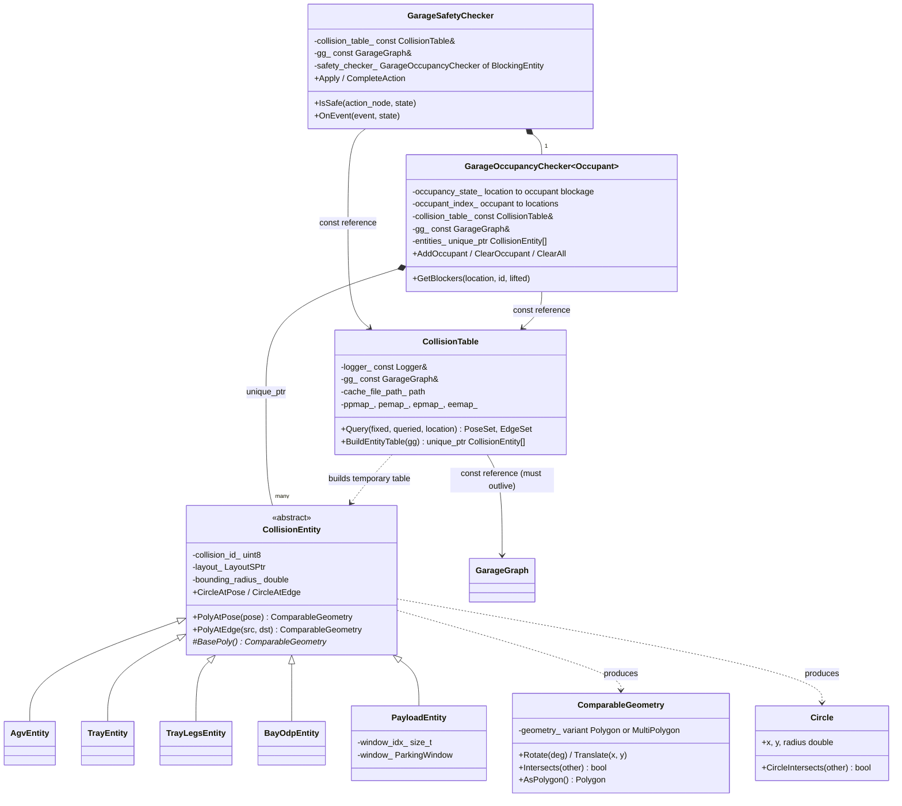
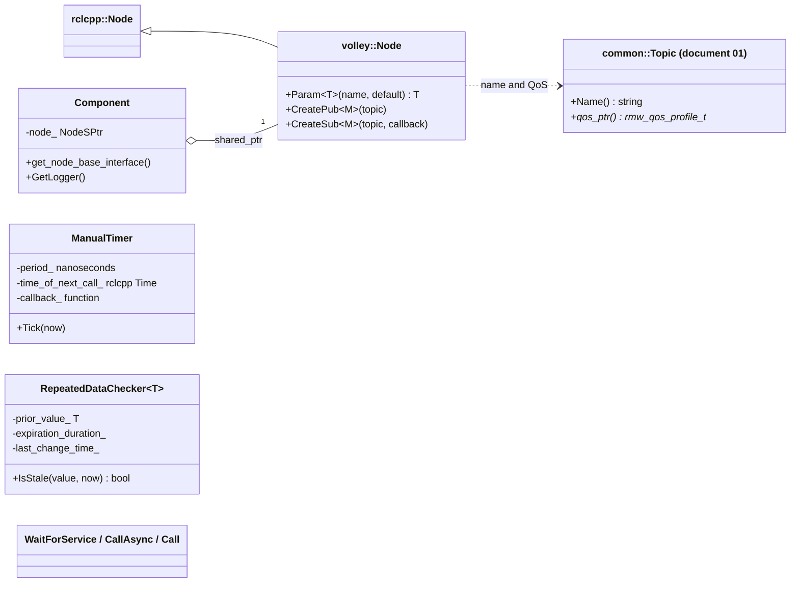
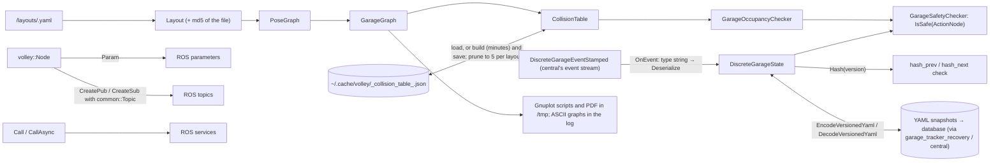
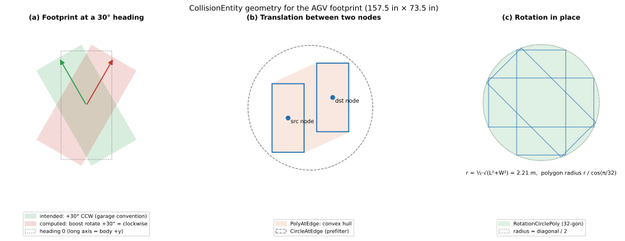

# 18 — `common_ros`

| Generated | Revision | Source pack | Status |
|---|---|---|---|
| 2026-10-07 | 3 | `P18-common_ros-part1of3.md`, `-part2of3.md`, `-part3of3.md` (all 3 parts) | **Complete** (all parts). Draft, generated by Claude, not yet reviewed by the team |

Package 18 of 37 (bottom-up) · dependency depth 6

**Abbreviations used in this document.** Each is also explained in context where it first matters.

| Abbreviation | Meaning |
|---|---|
| AGV (`agv` in names) | Automated Guided Vehicle |
| `agvhito` | AGV software for HITO vehicles (inferred from the name) |
| API | Application Programming Interface |
| ASan | AddressSanitizer (compiler memory-error checker) |
| ASCII | American Standard Code for Information Interchange (plain text) |
| BLift | bay lift: a bay with its own lift serving several floors (inferred) |
| CDR | Common Data Representation (the DDS serialization format) |
| CI | Continuous Integration |
| CMake (`cmake` in names) | Cross-platform Make (build-system generator) |
| EV | Electric Vehicle |
| GCC | GNU Compiler Collection |
| `gtest` | GoogleTest |
| GUID | Globally Unique Identifier |
| HITO | name of the AGV vendor; not expanded in the code |
| JSON (`json` in names) | JavaScript Object Notation |
| MD5 (`md5` in names) | Message-Digest algorithm 5 |
| ODP | not expanded in the code; the overdrive door-and-platform unit of a bay (inferred) |
| PDF | Portable Document Format |
| QoS (`qos` in names) | Quality of Service |
| `rclcpp` | ROS Client Library for C++ |
| `rclcppx` | "rclcpp extensions" (Volley package) |
| `rmw` | ROS middleware interface |
| ROS (`ros` in names) | Robot Operating System |
| `sim` | simulation / simulator (also the `sim` package) |
| `stdx` | "standard library extensions" (Volley package) |
| VECS (`vecs` in names) | not expanded in the code; Volley's vehicle EV-charging subsystem (inferred) |
| `vis` | visualization (the `vis` package) |
| VRC (`vrc` in names) | Vertical Reciprocating Conveyor (a freight lift between floors) |
| YAML (`yaml` in names) | YAML Ain't Markup Language |

Workspace dependencies: common (01), interfaces (11), launcher (not yet documented), rclcppx (02), stdx (03); also vrc_interfaces (04) through its headers.
Used by: agvhito, agvhito_tools, bay, central, cost_functions, lift, motion_planner, planner_core, scheduler, scheduler_advanced_tests, sim, vecs, vis (13 packages).

Related documents:
- `11-interfaces.md`: the message types used everywhere here, and the event-sourcing design that this package implements;
- `01-common.md`: geometry, `Wrap`, `HashCombine`, the topic registry used by `volley::Node`;
- `09-task_planner.md`: an assignment solver that runs over the graphs defined here.

**Coverage.** This revision covers **all three parts**: the 24 public headers, 19 source files, the build files (parts 1–2), and the 19 test files with the test layout (part 3). The test sources in part 3 were compressed to signatures and comments only, so section 8 describes what each test covers, but cannot confirm its exact assertions. Revision 2 resolved R14 and added R17–R26; revision 3 adds the tests and relates them to the RISK items.

**How to read the evidence markers.**
- **[read]** means the conclusion comes from reading the source.
- **[probed]** means it was confirmed by running code: the event hasher's byte loop extracted verbatim, Boost.Geometry's rotation direction and polygon orientation checks with Boost 1.83, nlohmann/json's handling of the collision-table cache format, and GCC's resolution of an unqualified `abs(double)` under different include sets.

The package itself could not be built here, because ROS was not available. The Mermaid diagrams pass the Mermaid 11 parser.

---

## A. External dependencies

`common_ros` is the **ROS-aware foundation library** of the workspace: everything shared that needs ROS messages or rclcpp. It builds one shared library, `common_ros_lib`, plus a `geometry_visualization_tool` executable.

| Name | Description | Version | Link | Usage in this package |
|---|---|---|---|---|
| rclcpp | ROS 2 C++ client library. | Same ROS 2 distribution (Kilted or newer, see document 02). | https://github.com/ros2/rclcpp | `volley::Node`, logging macros, serialization of events, service-call helpers, `rclcpp::Time`. |
| Boost.Graph | Generic graph data structures and algorithms. | Boost (Ubuntu 24.04 ships 1.83). | https://www.boost.org/libs/graph | `GarageGraph` (`adjacency_list`), `Layout`'s node graph. |
| Boost.Geometry | Computational geometry. | Same. | https://www.boost.org/libs/geometry | Polygons, convex hulls, rotations and intersection tests for collision checking. |
| yaml-cpp | YAML (YAML Ain't Markup Language) parser and emitter. | System. | https://github.com/jbeder/yaml-cpp | Layout files; versioned snapshots of the discrete garage state. |
| nlohmann/json | JSON (JavaScript Object Notation) for C++. | System (`nlohmann-json-dev`). | https://github.com/nlohmann/json | The on-disk collision-table cache. |
| Eigen | Linear algebra. | System. | https://eigen.tuxfamily.org | Pose distances (`CalcDistFromPose`). |
| `common`, `interfaces`, `stdx`, `rclcppx`, `vrc_interfaces` (workspace) | Documents 01, 11, 03, 02, 04. | Workspace. | — | Constants, math, message types, `Expected`, VRC state types. |
| `launcher` (workspace) | Not yet documented; its share directory holds the layout files: `GetLayoutPathByName(name)` resolves `<launcher share>/layouts/<name>.yaml` through ament_index. | Workspace. | — | Layout YAML files at run time and in tests. |
| graph-easy (`libgraph-easy-perl`) | Renders Graphviz `dot` graphs as ASCII text. | Optional system tool. | https://metacpan.org/dist/Graph-Easy | `PrintGraph` (debug output), run through a shell with `popen` (R23). |
| ament_index_cpp | Finds installed ROS package directories. | Same ROS distribution. | https://github.com/ament/ament_index | `GetLayoutPathByName` (the `launcher` package's share directory). |
| GoogleTest (ament_cmake_gtest) | Unit tests. | Not pinned. | https://github.com/google/googletest | 19 test targets (214 tests), most with ASan (AddressSanitizer). |

---

## B. Glossary

Terms defined in documents 01–17 (garage pose, heading, reciprocal, tray, payload, bay, VRC, event sourcing, hash chain, discrete state, …) are reused.

| Term | Meaning | Where it shows up |
|---|---|---|
| Layout | The garage map loaded from a YAML file: nodes, floors, edges, parking windows, bays, VRCs. | `Layout` |
| Pose graph | Every valid (node, heading) pair, with up to eight neighbors each: forward, right, back, left, rotate right, rotate left, VRC up, VRC down. | `PoseGraph` |
| Garage graph | The pose graph as a Boost directed graph, with a `Transition` (type and length) on every edge; used for planning. | `GarageGraph` |
| Transition | The kind of AGV motion along an edge: locomote (along the AGV's body *y* axis), strafe (along body *x*), rotation, or VRC transition. | `TransitionType` |
| Locomote / strafe | Driving along the AGV's long axis / sideways. An omnidirectional AGV does both. | `AgvMotionType`, section 7.1 |
| Collision entity | A shape that can occupy space: AGV, tray, tray legs, bay ODP, or a payload of a given size class. | `CollisionEntity` |
| Collision table | A precomputed lookup: for each entity at each pose or edge, which poses and edges each other entity type cannot occupy. | `CollisionTable` |
| Occupancy checker | Tracks which occupant blocks which locations, using the collision table. | `GarageOccupancyChecker<T>` |
| Safety checker | Uses the occupancy checker to decide whether a schedule step (`ActionNode`) can run without collision. | `GarageSafetyChecker` |
| Bounding circle | The smallest circle around a shape's center that contains it; a cheap first test before an exact polygon test. | `Circle`, `GetBoundingRadius` |
| Convex hull | The smallest convex polygon containing a set of points; here, the area swept by a footprint moving along an edge. | `PolyAtEdge` |
| Resource window | A named size class for payloads (`ParkingWindow`); payload collision ids are `PAYLOAD + window index`. | `PayloadEntity` |
| Self-inverse event | An event whose reversal is the same event with its direction flipped (added ↔ removed, current ↔ next). | `Reverse(...)` |
| Snapshot | The discrete garage state serialized to versioned YAML, for storage and recovery. | `versioned_state_buffer.hpp` |
| Gnuplot | A plotting program; collision queries can be drawn as Gnuplot scripts. | `geometry_visualization.hpp` |

---

## 1. Summary

`common_ros` holds the **garage model and the shared ROS plumbing** that 13 packages build on:

- **The garage model.** `Layout` loads a garage from YAML. `PoseGraph` and `GarageGraph` turn it into a graph of AGV poses and transitions.
- **Collision reasoning.** `CollisionEntity` shapes, the precomputed and disk-cached `CollisionTable`, and the `GarageOccupancyChecker` / `GarageSafetyChecker` built on it decide which poses and edges conflict.
- **The discrete garage state.** `DiscreteGarageState` is the event-sourced state of document 11, implemented here: one `OnEvent` per event type, `Reverse` for every event, serialization into `DiscreteGarageEvent` buffers, and the state **hash** that the event stream's hash chain relies on. A versioned YAML codec stores snapshots and can read older versions.
- **ROS helpers.** `volley::Node` (topics from `common`'s registry, parameters with defaults), blocking and asynchronous service-call helpers, QoS (Quality of Service) presets, GUID (Globally Unique Identifier) utilities, comparators and hashers for message types, `to_string` for messages, a manual timer, and a stale-data checker.

**How it fits with the earlier documents.** This package answers several open questions from document 11:
- **The state hash $H$** of the event stream is `DiscreteGarageState::Hash`, defined over a canonical ordering (sorted `std::map`s), and versioned so older snapshots can be re-hashed (section 7.3).
- **Events are serialized** with rclcpp's CDR (Common Data Representation) serializer, with the `type` field set to the message name without its package prefix.
- **Every event is reversible**, which is what makes replay and rollback possible.

It also introduces a **third set of conventions** next to `common` and `rclcppx`: `volley::Node::CreatePub/CreateSub` (using `common`'s string-typed topic registry), `GetBestEffortQoS` and friends, and `INFOS`/`WARNS` logging macros (R15).

**What the code and its tests show about quality.** The code is substantial and mostly careful: events are validated thoroughly, failures return an explanation, and the collision table is cached to avoid a build that takes minutes. The serious findings so far:
- **Some events change the state before failing**, which breaks the class's own promise that a failed event leaves the state untouched, and makes followers diverge (R1).
- **The collision-table cache can be stale**: it is keyed by the layout file only, not by the geometry constants or code that produced it (R2).
- **Footprints are rotated in the wrong direction** for headings that are not multiples of 90° (R3, **[probed]**).
- **The event hasher reads out of bounds** for short events and ignores the last byte (R5, **[probed]**).
- **"Required" parameters are not enforced** (R7).
- **The safety check fails open:** an action whose location is not in the garage graph is reported *safe* (R17).
- **Some safety-checker and graph helpers have outright bugs:** a tray id passed as a node id (R18), and charge and bay-door poses with unwrapped headings that are not in the graph (R19).
- **Layout edges naming unknown nodes are silently attached to the first node** (R20).

---

## 2. Files

The package has 65 files: 24 headers, 19 sources, 2 build files (parts 1–2), and 19 test files plus a test layout (part 3). Line counts are from the packs, which have blank lines removed.

| Path (under `src/common_ros/`) | Lines | Role |
|---|---:|---|
| `include/common_ros/agv_motion_type.hpp` | 31 | `AgvMotionType` (center, locomote, strafe, rotate, lift, VRC move, stop now, stop at next pose); classification functions. |
| `include/common_ros/collision_geometry.hpp` | 425 | Boost geometry aliases; `Circle`; `ComparableGeometry` (polygon or multipolygon); the `CollisionEntity` hierarchy; `CollisionTable`. |
| `include/common_ros/common_ros_msgs.hpp` | 99 | Short aliases (`GaragePoseMsg`, `AgvCommandMsg`, …) for about 50 `interfaces` message types. |
| `include/common_ros/component.hpp` | 16 | `Component`: holds a `Node` and exposes `get_node_base_interface()`, so a class can be loaded as a composable node. |
| `include/common_ros/discrete_garage_event_io.hpp` | 56 | `Serialize<T>` / `Deserialize<T>`: event message ↔ `DiscreteGarageEvent {type, buffer}`. |
| `include/common_ros/discrete_garage_state_utils.hpp` | 35 | Tray availability and empty-tray queries; collision id from payload, tray or AGV state. |
| `include/common_ros/discrete_garage_state.hpp` | 162 | `Reverse` for all events; `GetAddEvent` helpers; the `DiscreteGarageState` class. |
| `include/common_ros/garage_graph.hpp` | 194 | `std::hash<GaragePoseMsg>`; `TransitionType`, `Transition`; `GarageGraph` over a Boost adjacency list. |
| `include/common_ros/garage_occupancy_checker.hpp` | 199 | `GarageOccupancyChecker<Occupant>`: who occupies and blocks which locations. |
| `include/common_ros/garage_safety_checker.hpp` | 103 | `GarageSafetyChecker`: is an `ActionNode` safe to execute in the current state? |
| `include/common_ros/geometry_visualization.hpp` | 43 | Gnuplot drawing of layouts and collision queries (writes to `/tmp`). |
| `include/common_ros/layout.hpp` | 190 | `Layout` (loaded from YAML), `Vrc`, inbound headings, resource windows, `GetLayoutByName`. |
| `include/common_ros/manual_timer.hpp` | 22 | `ManualTimer`: periodic callbacks driven by explicit `Tick(now)`, for simulated time. |
| `include/common_ros/node.hpp` | 92 | `volley::Node` (parameters, publishers and subscribers from `common::Topic`); `RequiredParam`, `OptionalParam`. |
| `include/common_ros/polygon_utils.hpp` | 36 | Rectangle and circle polygons; `CalcOverlappingSizedPoses`. |
| `include/common_ros/pose_graph.hpp` | 98 | `PoseNeighbor`; `PoseGraph`; resource size indices. |
| `include/common_ros/pose_utils.hpp` | 58 | Pose construction, comparison and distance helpers; `GaragePoseComparator`. |
| `include/common_ros/print_graph.hpp` | 14 | Write a file; render a dot graph as ASCII art to the log. |
| `include/common_ros/print_utils.hpp` | 53 | `std::to_string` overloads for about 20 message types. |
| `include/common_ros/repeated_data_checker.hpp` | 25 | `RepeatedDataChecker<T>`: is a value stuck (unchanged for too long)? |
| `include/common_ros/ros_utils.hpp` | 251 | Colors; QoS presets; message staleness; GUID parsing and formatting; comparators and hashers; `WaitForService`, `CallAsync`, `Call`. |
| `include/common_ros/roslog.hpp` | 11 | `INFOS`/`WARNS`/`ERRORS` and `INFOF`/`WARNF`/`ERRORF` macro aliases. |
| `include/common_ros/tape_layout.hpp` | 24 | Floor-tape segment computation for a layout. |
| `include/common_ros/versioned_state_buffer.hpp` | 245 | Versioned YAML encoding and decoding of the discrete garage state (`kLatestYamlEncodingVersion = 5`). |
| `src/agv_motion_type.cpp` | 105 | Motion classification from source and destination goals. |
| `src/collision_geometry.cpp` | 732 | Entity shapes, edge sweeps, table build, JSON cache save, load and pruning. |
| `src/discrete_garage_state.cpp` | 1601 | All `Reverse`, `GetAddEvent` and `OnEvent` implementations; `Hash`; `Set` from message, YAML or state; conversions. |
| `src/discrete_garage_state_utils.cpp` | 69 | Tray availability; collision-id helpers. |
| `src/garage_graph.cpp` | 297 | Graph construction from the pose graph; edge transitions (type and length); VRC edge relabeling and an audit log of missing VRC edges; lookups. |
| `src/garage_safety_checker.cpp` | 509 | Safety bookkeeping per event type; `Set` from a whole state; `IsSafe`, `Apply`, `CompleteAction`; the BLift rule for VRC commands. |
| `src/geometry_visualization.cpp` | 80 | Gnuplot styles and the layout plot behind `DrawLayout` / `DrawQuery`. |
| `src/geometry_visualization_tool.cpp` | 80 | Interactive tool: asks for a layout name, builds the collision table, then answers collision queries as Gnuplot drawings. |
| `src/layout.cpp` | 686 | YAML parsing and validation (parking windows, nodes, edges, bays, VRCs); MD5 of the file; all `Layout` queries; `GetLayoutPathByName`. |
| `src/manual_timer.cpp` | 13 | `Tick` loop: one callback per elapsed period, all with the same `now`. |
| `src/node.cpp` | 18 | `volley::Node` constructors with preferred options: parameter services and events off, intra-process communication on. |
| `src/polygon_utils.cpp` | 115 | Rectangle and circle polygons (correct clockwise order and heading direction); `CalcOverlappingSizedPoses`. |
| `src/pose_graph.cpp` | 200 | Pose enumeration; neighbor classification by relative bearing (±0.1 rad); VRC up/down slots; rotations to the nearest heading each way. |
| `src/pose_utils.cpp` | 98 | Pose comparisons and constructors; `GetAllowedHeadings` (each heading and its reciprocal, wrapped to (−180°, 180°]). |
| `src/print_graph.cpp` | 72 | Writes a `.dot` file to `/tmp` and pipes it through `graph-easy` with `popen`. |
| `src/print_utils.cpp` | 387 | All `std::to_string` overloads. |
| `src/ros_utils.cpp` | 190 | Colors, QoS presets, staleness, GUID parse/format, entity ids, event printing. |
| `src/tape_layout.cpp` | 241 | Floor-tape segments: straight edges plus extensions sized from the AGV's line-sensor offsets, rotation-circle approximations, and consolidation of collinear pieces. |
| `src/versioned_state_buffer.cpp` | 390 | YAML `Encode` per message and target version; `Decode` specializations with placeholders. |
| `CMakeLists.txt` | 190 | Library (sources globbed with an anchored `EXCLUDE`), the visualization tool, 19 gtest targets (revision 1 said 20; corrected). |
| `package.xml` | 30 | Dependencies. |

The test files (part 3) follow. Line counts marked * are for the compressed test sources (signatures and comments only), not the real files.

| Path (under `src/common_ros/`) | Lines | Role |
|---|---:|---|
| `test/collision_geometry_tests.cpp` | 103* | 10 tests: comparable geometry, AGV and tiny-lot collisions, ODP placement (also at the Eccles site), entity table, small table build, perpendicular moves, cache pruning. |
| `test/collision_geometry_tests_eccles.cpp` | 16* | 1 test: the full collision table for a production layout (`576_eccles`). |
| `test/collision_geometry_tests_draw.cpp` | 15* | 1 test: Gnuplot drawing for three production layouts; checks only that it does not crash. |
| `test/discrete_garage_state_tests.cpp` | 429* | 73 tests: serialization, `Reverse` for every event, every event's success and failure paths, hashing, `Set` from message and YAML. |
| `test/discrete_garage_state_utils_tests.cpp` | 55* | 6 tests: tray availability, empty-tray counts, collision ids from states. |
| `test/garage_graph_tests.cpp` | 84* | 14 tests: vertex and edge counts, conversions, iteration, typed vertices, charge and bay-door poses, property maps. |
| `test/garage_occupancy_checker_tests.cpp` | 70* | 6 tests: invalid locations, occupancy at nodes and edges, ODP, tray legs, payload on the ground. |
| `test/garage_safety_checker_tests.cpp` | 99* | 5 tests: basic use, `Set`, dispatching and completing action nodes, a bay retrieve sequence, a loaded AGV's rotation circle. |
| `test/layout_tests.cpp` | 191* | 25 tests: ordering, lookups, edges, windows (with buffer and height), bay data, geometry conversions, invalid nodes. |
| `test/manual_timer_tests.cpp` | 17* | 1 test: tick timing and catch-up. |
| `test/node_tests.cpp` | 22* | 4 tests: parameters, node options (forced and overridable), namespace. |
| `test/polygon_utils_tests.cpp` | 60* | 3 tests: rectangle and circle polygons; overlapping sized poses compared with results from Volley's Python implementation. |
| `test/pose_graph_tests.cpp` | 55* | 6 tests: pose order, lookups, neighbors, bay outbound pose, overlapping sized poses. |
| `test/pose_utils_tests.cpp` | 37* | 12 tests: tolerances, zero checks, distances, reciprocal angles, 2D rotations, pose constructors, allowed headings. |
| `test/print_utils_tests.cpp` | 12* | 4 tests: string forms of GUIDs, entity ids, poses and goals. |
| `test/repeated_data_checker_tests.cpp` | 11* | 1 test: stale detection. |
| `test/ros_utils_tests.cpp` | 102* | 22 tests: colors, QoS presets, staleness, GUIDs, comparators, entity ids, a blocking service `Call`, QoS memory layout. |
| `test/tape_layout_tests.cpp` | 66* | 7 tests: tape segments, consolidation, rotation circles, closest segment. |
| `test/test_layout.yaml` | 127 | The test garage: 11 nodes, 3 parking windows (deliberately out of order), one disallowed edge orientation, two bays (one facing the reciprocal). |
| `test/versioned_state_buffer_tests.cpp` | 150* | 13 tests: decoding every message type; encoding and round trips; every previous version; a worked example of a field change. |


---

## 3. Public API

Everything is in namespace `volley`, with headers under `common_ros/`. The API (Application Programming Interface) falls into seven groups.

### 3.1 Layout and graphs — `layout.hpp`, `pose_graph.hpp`, `garage_graph.hpp`, `pose_utils.hpp`

**Purpose.** One loaded representation of the garage, at three levels of detail.

**`Layout`** (constructed from a file path or a YAML node; shared as `LayoutSPtr` or `LayoutSPtrConst`):
- **Nodes and floors:** `GetNodes`, `GetNodeById`, `GetNodeIdsOfType`, `GetBayLikeNodeIds` (bays plus BLift nodes), `GetFloors`, floor heights.
- **Edges:** `HasEdge`, `GetDisallowedEdgeOrientation`, `GetNeighboringNodes`, `IsStraightLine`.
- **Bays:** prioritization, insert floor, system floors, `GetBayInboundHeading`, `GetDistanceToClosestValidBay`.
- **Size classes:** `GetResourceWindows`, `GetBufferedResourceWindow`, `GetSmallestEnclosingResourceSizeIndex`.
- **Geometry:** `GetGeometricPoseAtPose` and its inverse `GetPoseAtGeometricPose` (with tolerances), `GetClosestNeighboringPose`.
- **VRCs:** `GetVrc`, `GetVrcForNodeId`, `IsVrcNode`, `GetRootNodeForVrcNode`.
- **Identity:** `GetName`, `GetMD5Sum` (of the layout file); `GetLayoutByName(name)` loads from the default layout directory, returning `stdx::Expected`.

**Layout loading and validation** (`layout.cpp`):
- **Parking windows:** a `TRAY` window (14 ft × 7 ft) is always added. The windows are sorted by area and must nest strictly: each at least as long and as wide as the previous one, and no two equal. `height_m` is optional (0 means unconstrained) and may not exceed the bay clearance.
- **Nodes:** each node's type must be known and its `max_resource_size` must name a window. Its headings are sorted.
- **Edges** are undirected, with an optional disallowed orientation. Edges that name an unknown node are *not* rejected (R20).
- **VRCs:** member nodes are sorted by floor, and edges are added between adjacent floors only.
- **MD5:** only the file constructor computes it; a layout built from a YAML node has an empty checksum (R21).
- **Location:** `GetLayoutPathByName(name)` resolves `<launcher share>/layouts/<name>.yaml`.

**`PoseGraph(layout)`** lists every valid pose (sorted by node, then heading) and each pose's up to eight neighbors, stored in a flat array of 8 slots per pose (`EnumCount<PoseNeighbor>()`):
- **Translations** go into one of four slots by the edge's bearing relative to the heading, within ±0.1 rad (about 5.7°): `FORWARD` (0), `LEFT` (+90°), `BACK` (180°) or `RIGHT` (−90°). Any other bearing makes the constructor throw. Edges whose disallowed orientation matches the heading are skipped.
- **The naming is relative to the heading, not to the AGV's drive direction.** The AGV *locomotes* along body +y, which is the pose graph's **`LEFT`**; `FORWARD` is a strafe. `GetBayOutboundPose` relies on this ("a LEFT action from the bay's primary pose").
- **Members of the same VRC** go into `VRC_UP` or `VRC_DOWN` by floor, regardless of bearing, which fixed a historical bug where one VRC direction was silently lost. A warning is logged if any slot is overwritten.
- **Rotations:** `ROT_LEFT` and `ROT_RIGHT` point to the nearest other heading counter-clockwise and clockwise, on nodes that allow rotation.
- **Overlapping sized poses** (`CalcOverlappingSizedPoses`) are computed for size-aware planning (section 7.2; R22).

**`GarageGraph(pose_graph)`** stores the same information as a Boost bidirectional adjacency list:
- vertices are poses, edges carry `Transition {length, type}`;
- it converts between garage representations (poses, pose pairs) and graph representations (vertices, edges);
- it creates per-vertex and per-edge property maps for graph algorithms;
- it stores an optimal retrieval heading per parking node.

**`pose_utils.hpp`** has pose constructors (`ConstructGaragePose`, `ReciprocalGaragePose`, `ConstructAgvGoal`, …), tolerance-based comparisons (`IsNear`, `IsNearOrReciprocal`), distances, and `GaragePoseComparator` for ordered maps.

### 3.2 Collision geometry — `collision_geometry.hpp`, `polygon_utils.hpp`

**Purpose.** Answer, without real-time geometry: "if entity A is at location X, which poses and edges can entity B not be at?"

**`CollisionEntity`** (abstract) has one subclass per shape:

| Entity | Id | Base shape (body frame) |
|---|---:|---|
| `BayOdpEntity` | 0 | A thin strip (2 in × garage-door width) half a bay length plus 1 in from the node center; always placed at the bay's inbound heading, whatever the pose's heading. It is the only entity that rotates by **−heading** (R3). |
| `TrayLegsEntity` | 1 | Four square legs at the tray corners (a multipolygon); bounding radius taken from a square of tray-length sides, which is conservative |
| `TrayEntity` | 2 | Tray rectangle (14 ft × 7 ft) |
| `AgvEntity` | 3 | AGV rectangle (157.5 in × 73.5 in) |
| `PayloadEntity(window i)` | 4 + *i* | Rectangle of resource window *i* |

Each entity provides:
- `PolyAtPose(pose)`: the base shape rotated by the heading, then translated to the node;
- `PolyAtEdge(src, dst)`: the convex hull of the shape at both ends of a translation, or a circumscribed 32-sided circle for a rotation in place;
- `CircleAtPose` / `CircleAtEdge`: the bounding circles used as a fast pre-test (section 7.2, Figure 7.1).

**`CollisionTable(garage_graph, logger)`** fills four maps (pose–pose, pose–edge, edge–pose, edge–edge), indexed as [fixed entity][fixed location][queried entity] → set of conflicting locations:
- **Loading.** It first tries `~/.cache/volley/<layout>_collision_table_<md5>.json` (or `/tmp` without `$HOME`). If that fails, it builds the table (minutes for real layouts: one test target takes 627 s), saves it, and keeps at most 5 files per layout name (R2).
- **`Query(fixed_id, queried_id, location)`** returns *copies* of the conflicting pose and edge sets. The four-argument overloads test one specific pair. Unknown combinations and non-conflicting ones both return "no conflict" (documented TODO).

### 3.3 Occupancy and safety — `garage_occupancy_checker.hpp`, `garage_safety_checker.hpp`

**`GarageOccupancyChecker<Occupant, Eq, Hash>`** keeps two indexes: location → {occupant → blockage}, and occupant → locations.

| Member | Behavior |
|---|---|
| `AddOccupant(location, entity_id, occupant, lifted)` | Marks every location the occupant blocks, using the collision table. It does **not** check for existing conflicts (documented). |
| `GetBlockers(location, entity_id, lifted)` | The occupants that would block an entity of that type at that location. A tray or payload on the ground conflicts with AGVs only through its legs (`TRAY_LEGS`), since an AGV can drive under a tray. |
| `ClearOccupant`, `ClearAll` | Remove one occupant, or all. |

Errors (a location not in the graph) are returned as `stdx::Expected` / `stdx::Result`.

**`GarageSafetyChecker(collision_table, garage_graph)`** wraps an occupancy checker whose occupants are (entity id, `ActionNode`) pairs:
- `IsSafe(node, state)`: can this action run now?
- `Apply` / `CompleteAction`: track an action's footprint from start to end;
- `OnEvent(event, state)`: follow the discrete-event stream.

Only AGV and bay commands have locations; VRC and VECS actions are deliberately ignored (comment: VRC occupancy is not modeled by the planner, VECS occupies no space).

**How it works** (`garage_safety_checker.cpp`):
- **Occupants** are pairs (entity id, `ActionNode`). Entities from the discrete state use an empty `ActionNode`; dispatched actions use their own node, so an AGV can hold both its current pose and its commanded edge or pose.
- **`ApplyIfSafeOrSelf`** adds an occupant only if nothing *other than the same entity* blocks it.
- **Events** keep the occupancy in step with the discrete state, which must already have applied the event:
  - an AGV carrying a tray takes the tray's (or payload's) collision id;
  - lowering swaps back to a tray on the ground plus an AGV;
  - a bay's ODP occupies its pose except while the bay is `READY_TO_RETRIEVE`;
  - payload changes swap between tray and payload size classes.

  Bay removal is not implemented: it returns failure with the message "didn't bother to implement this" (R25).
- **`Set(state)`** replays add events: AGVs first (without trays), then bays, trays and payloads.
- **`IsSafe(node, state)`:**
  - for a VRC command, requires every BLift bay on that VRC to be idle (`READY_TO_RETRIEVE` or `VEHICLE_INSERTED`);
  - otherwise queries the blockers at the action's location, and is safe only if the action's own entity is the only blocker;
  - **if the location is not in the garage graph, it reports *safe*** (R17).
- **`Apply`** checks `IsSafe` and then adds the action as an occupant; **`CompleteAction`** removes it.

### 3.4 Discrete garage state — `discrete_garage_state*.hpp`, `discrete_garage_event_io.hpp`, `versioned_state_buffer.hpp`

**Purpose.** The scheduler's discrete world, changed only by events (document 11, section 3.8).

**`DiscreteGarageState`:**
- **Queries:** `Has*`, `Get*` (by id, or by node: `GetTrayOnNode`, `GetAgvOnNode`), `GetEnabledBays`, counts, `IsFaulted`, `IsNodeDisabled`.
- **Events:** `OnEvent(DiscreteGarageEventMsg)` dispatches on the `type` string to one of 19 typed `OnEvent` overloads. Each validates the event against the current state and returns `BoolStringPair {success, reason}`. The documented contract: on failure the state is unchanged (R1 shows three exceptions).
- **Setting the whole state:** `Set(DiscreteGarageStateMsg)` (validated by replaying add events), `Set(YAML::Node)`, `Set(DiscreteGarageState)`.
- **Conversions:** `GetDiscreteGarageStateMessage`, `GetYaml`, `std::to_string`.
- **`Hash(version = 5)`**: the state hash of the event stream (section 7.3).

**Free functions:**
- `Reverse(event)` for every event type, plus a type-erased `Reverse(DiscreteGarageEventMsg)`;
- `GetAddEvent(entity state)` and `GetFaultedEvent()`, which build the events that recreate a state;
- `Serialize<T>(event)` → `optional<DiscreteGarageEventMsg>` and `Deserialize<T>(event)` → `optional<T>`.

**Versioned YAML** (`kLatestYamlEncodingVersion = 5`):
- `EncodeVersionedYaml(state, version)` writes any supported version: older targets simply drop newer collections and fields (VECS before version 3, the EV flag before 4, VRCs before 5). It always reports success, and it copies the message's `hash` field unchanged whatever the target version (R25);
- `DecodeVersionedYaml<T>(yaml)` reads any version up to the latest. On failure it returns a YAML copy annotated with `<<<MISSING>>>`, `<<<FAILED TO PARSE>>>` or `<<<UNEXPECTED>>>`, for a recovery tool (`garage_tracker_recovery`) to present to a person;
- `VersionedFieldDecode` decodes one field, honoring the version in which it was introduced or deprecated.

**Helpers** in `discrete_garage_state_utils.hpp`: `IsTrayAvailable`, `GetEmptyTrays`, `CountEmptyTrays`, `CollisionEntityIdFrom{Payload,Tray,Agv}State` (the last two pick the payload's size class when there is one).

**Usage.**

```cpp
volley::DiscreteGarageState dgs;
for (const auto& stamped : event_log) {                       // DiscreteGarageEventStamped (document 11)
  if (dgs.Hash() != stamped.hash_prev) { /* diverged before this event */ }
  auto [ok, why] = dgs.OnEvent(stamped.event);
  if (!ok) { WARNS(logger, "rejected " << stamped.event.type << ": " << why); continue; }
  if (dgs.Hash() != stamped.hash_next) { /* diverged: resynchronize from a snapshot */ }
}
// Undo the last event:
if (auto inverse = volley::Reverse(event_log.back().event)) { dgs.OnEvent(*inverse); }
```

This is illustrative; `event_log` is not from the pack.

### 3.5 Motion classification — `agv_motion_type.hpp`

`GetMotionType(src_goal, dst_goal, layout)` classifies a command. At least two of {node, heading, lift} must be equal, otherwise it throws `std::invalid_argument`:

| Same node | Same heading | Same lift | Result |
|---|---|---|---|
| yes | yes | yes | `CENTER` |
| yes | yes | no | `LIFT` |
| yes | no | yes | `ROTATE` (throws if the node does not allow rotation) |
| no | yes | yes | `VRC_MOVE` if the floors differ; otherwise `LOCOMOTE` or `STRAFE` from the edge direction (section 7.1), throwing if the edge is missing or diagonal |

`IsMoveType` and `AgvMotionTypeStr` complete the API. `STOP_NOW` and `STOP_AT_NEXT_POSE` are never produced by the classifier.

### 3.6 ROS node helpers — `node.hpp`, `component.hpp`, `ros_utils.hpp`, `roslog.hpp`, `print_utils.hpp`, `manual_timer.hpp`, `repeated_data_checker.hpp`

| Helper | Behavior |
|---|---|
| `volley::Node` (an `rclcpp::Node`) | Construction forces three options: parameter services **off** and parameter events **off** (parameters are construction-time only, so `ros2 param` cannot inspect or change them), and **intra-process communication on**. `Param<T>(name, default)` declares the parameter if needed and returns its value, **or the default with a warning if it is unset** (R7). `CreatePub` / `CreateSub` build publishers and subscribers from `common::Topic` registry entries, optionally with a name prefix or an overriding QoS. |
| `RequiredParam<T>`, `OptionalParam<T>` | Wrap `Param` and rethrow any exception with the key named. `RequiredParam` does not actually reject a missing parameter (R7). |
| `Component` | Holds a `NodeSPtr`, for classes registered as composable nodes. |
| QoS presets | `GetBestEffortQoS(depth)`, `GetReliableQoS(depth)`, `GetLatchingQoS(depth)`. |
| Time | `GetMessageStaleness(header, now)`, `GetDt(h1, h2)`. |
| GUIDs | `ParseGuid` (`"936DA01F-9ABD-4d9d-80C7-02AF85C822A8"` format), `GuidToString`, `MakeGuid`, `kEmptyGuid`, `GuidComparator`, `std::hash<GuidMsg>`. |
| Entity ids | `AgvId`, `BayId`, `TrayId`, `VecsId`, `VrcId`, `SystemId`; comparator and hasher. |
| Service calls | `WaitForService`; `CallAsync` (logs the response, optional callback); `Call` (blocks on the future, with a documented deadlock warning: never call it from the client's own mutually exclusive callback group, and only with a multi-threaded executor). |
| Logging | `INFOS`/`WARNS`/`ERRORS` (stream style) and `INFOF`/`WARNF`/`ERRORF` (printf style); `PrintEvent` writes a `GarageEvent` to `/rosout`; `OnTransition` logs state-machine transitions for `structures::StateMachine`. |
| `ManualTimer` | Calls a callback each period, driven by `Tick(now)`. If `Tick` comes late, it catches up with several calls in a row, **all given the same `now`** (section 7.5). |
| `RepeatedDataChecker<T>` | `IsStale(value, now)` is true when the value has not changed for longer than a duration. |
| `std::to_string(...)` | For commands, GUIDs, poses, discrete states and events. |

### 3.7 Debugging and visualization — `geometry_visualization.hpp`, `print_graph.hpp`, `tape_layout.hpp`

- **`DrawLayout`, `DrawQuery`** write Gnuplot scripts to `/tmp` that render a layout or one collision query to PDF.
- **`PrintGraph`** renders a Graphviz graph as ASCII art in the log.
- **`ComputeTapeSegments`** and friends compute the floor tape needed for a layout. AGVs follow floor tape with their line sensors: each edge's tape is extended past end nodes by the distance from the AGV center to its front or side line sensor, plus 6 in, and rotation nodes get a circle approximated by short segments. Collinear pieces that touch are then merged (an O(n²) loop, as the header warns).

---

## 4. Diagrams

### 4a. Class diagrams (ownership on edges)

**Layout and graphs.**


**Collision geometry, occupancy and safety.**



**Discrete garage state and its encodings.**


**ROS helpers.**



### 4b. Data flow

The library itself creates no topics, services, timers or parameters; its users do. The flow shows the data paths inside the library that its users rely on.



### 4c. State machines

No state machine in part 1. `AgvMotionType` is a classification, not a state, and `DiscreteGarageState` is an event-sourced data model rather than a state machine. `OnTransition` in `ros_utils.hpp` is a logging hook for `structures::StateMachine` users.

---

## 5. Behavior

`common_ros` is a library; "construction to shutdown" applies to the objects users create.

**Construction.**
- **`Layout`** parses and validates the YAML file (section 3.1) and computes the file's MD5 (Message-Digest algorithm 5) hash; invalid parking windows, node types or resource sizes throw.
- **`PoseGraph`** and **`GarageGraph`** are built from it, in memory. `PoseGraph` throws on an edge that is not along one of the four axes, and logs every VRC neighbor it classifies. `GarageGraph` logs an audit of the VRC edges it found, as errors for any expected edge that is missing.
- **`CollisionTable`** is the expensive object: it tries the disk cache first, otherwise builds the table, which logs one INFO line per vertex, and saves it. The build cost grows with (vertices × entity types)², reduced by the bounding-circle pre-test (section 7.2).
- **`volley::Node`** objects are ordinary ROS nodes, with parameter services and events disabled and intra-process communication enabled. Parameters are declared lazily, the first time `Param` is called, and cannot be changed afterwards from outside.

**Steady state.**
- **The checkers and the discrete state are passive data structures:** called synchronously from their users' callbacks, with no internal threads, timers or locks. A user that touches them from several callback groups must synchronize itself.
- **`CallAsync`** returns immediately; its response callback runs on the executor that spins the client's node. **`Call`** blocks the calling thread for up to 1 s waiting for the service to exist and 5 s for the response.
- **`ManualTimer`** runs only when its owner calls `Tick(now)`.

**Shutdown.** Nothing special: no threads or files are held open, except the collision-cache file during save or load.

**Parameters and defaults.** None are declared by the library itself. `Param<T>` uses each caller's default, and `T{}` when none is given.

---

## 6. Ownership and safety

### 6.1 Lifetimes

- **Shared ownership** for the layout: `LayoutSPtr` is held by `PoseGraph`, `GarageGraph` and every `CollisionEntity`.
- **Non-owning references** in four places: `CollisionTable` holds `const GarageGraph&` and `const rclcpp::Logger&`, and both checkers hold `const CollisionTable&` and `const GarageGraph&`. The referenced objects must outlive them. Passing `node->get_logger()`, which returns by value, gives `CollisionTable` a reference to a temporary. Today the logger is only used during construction, so this works, but any later use is undefined behavior (R6).
- **Entity tables** are `std::vector<std::unique_ptr<CollisionEntity>>`. Each occupancy checker builds its own.

### 6.2 Callbacks capturing `this`

- `CallAsync` captures the logger, the service name and the user's callback **by value**, so it is safe even if the caller goes away.
- `ManualTimer` stores a `std::function`; whatever it captures must outlive the timer.

### 6.3 Locks and atomics

There are none. One function-local `static int poly_id` in the Gnuplot writer is shared state that is not thread-safe (debug only).

### 6.4 Error handling

| Style | Where |
|---|---|
| `BoolStringPair {bool, reason}` | `DiscreteGarageState::OnEvent` and `Set`, `GarageSafetyChecker`, `CollisionTable::BuildTable`. |
| `std::optional` | Layout and graph lookups, `Serialize`/`Deserialize`, `Reverse(DiscreteGarageEventMsg)`, `ParseGuid`, `Call`. |
| `stdx::Expected` / `Result` | Occupancy checker, `GetLayoutByName`. |
| Exceptions | `GetMotionType` (`invalid_argument`); `GarageGraph::GetIn/OutEdges` for an invalid vertex; `CollisionTable` construction (`runtime_error`); `Circle` and `SetBoundingRadius` for negative radii; many `.value()` calls on optionals, which throw `bad_optional_access` (R12). |
| Swallowed | `Serialize`/`Deserialize` catch everything (`catch (...)`); collision-cache I/O errors become warnings and a rebuild. |
| Annotated YAML | The versioned decoder returns placeholders instead of throwing, for the recovery tool. |

### 6.5 RISK items

| Item | Risk | Evidence |
|---|---|---|
| R1 | **Some events change the state before failing.** The class promises that a failed event leaves the state untouched. Three handlers break that: (a) `AgvPoseChanged` moves the carried tray to the new pose, *then* rejects the move if another AGV is on the destination node, leaving the tray moved and the AGV not; (b) a tray-removal `TrayExistenceChanged` clears the carrying AGV's `tray_id`, *then* may fail because the tray holds a payload or the event does not match, leaving the AGV and tray disagreeing; (c) `AgvLiftChanged` (raise) attaches trays one by one, and can fail after attaching one if a second tray on the node is not parallel. Every follower that applies the same rejected event ends in the same corrupted state, so the hash chain does *not* reveal the problem. | **[read]** (`discrete_garage_state.cpp`) |
| R2 | **The collision-table cache can be stale.** The cache key is the layout name plus the layout file's MD5. Changing the AGV or tray dimensions, the payload windows' buffer, the entity shapes or the collision algorithm in code does **not** invalidate `~/.cache/volley/...json`, so an upgraded binary silently uses the old collision results. That is a safety issue, because the safety checker relies on them. In addition, pruning deletes the oldest files whose names merely *start with* the layout name (so `eccles` also prunes `eccles_v2_...`), and files are written in place, not atomically, while several processes (central, scheduler, sim) may build or read the same file at startup. Worse, a `Layout` built from a YAML node (not a file) has an **empty** MD5, so any two such layouts with the same name share one cache file (R21). | **[read]** |
| R3 | **Footprints rotate in the wrong direction.** `PolyAtPose` rotates the base shape with Boost's `rotate_transformer`, which turns **clockwise** for positive angles **[probed]**, while garage headings are counter-clockwise (east-north-up convention, documents 06 and 11). For headings that are multiples of 90° the symmetric rectangles come out identical, but for any other heading the footprint is mirrored (Figure 7.1a). `BayOdpEntity` alone compensates, rotating by `-1 * heading` (with the comment "I think this is right? who knows."), and `polygon_utils.cpp` does too, with the explicit comment "boost rotates clockwise, and our headings are counter-clockwise". The two conventions are therefore mixed within the same library. Layouts with angled nodes would get wrong collision results for AGVs, trays and payloads. | **[probed]** + **[read]** |
| R4 | **Polygons have the wrong orientation for Boost.** `RectangleFromSize` lists corners counter-clockwise, while Boost's default polygon type expects clockwise ones: `bg::is_valid` reports "wrong orientation" and `bg::area` is negative **[probed]**. `intersects` gave correct answers in the cases tested, but Boost does not define results for invalid geometry; `bg::correct` (or a clockwise corner order) would remove the doubt. The 32-sided circle polygon is correctly clockwise, with a comment saying so, and `polygon_utils.cpp`'s rectangles use clockwise order too. | **[probed]** |
| R5 | **The event hasher reads out of bounds.** `DiscreteGarageEventHasher` hashes the bytes left over after whole 8-byte chunks with an off-by-one index. It **ignores the last byte** (two events differing only there hash equal), and for buffers shorter than 8 bytes the first index underflows to 2⁶⁴−1, an out-of-bounds read **[probed with the verbatim loop]**. A serialized `FaultStateChanged` (4-byte CDR header plus one `bool`) is 5 bytes long. | **[probed]** |
| R6 | **Reference members.** See section 6.1: `CollisionTable` keeps `const rclcpp::Logger&`, which dangles when constructed with `get_logger()`, as is natural. Both checkers keep references to the table and the graph. | **[read]** |
| R7 | **"Required" parameters are not enforced.** `Node::Param<T>` catches `ParameterUninitializedException`, logs a warning and returns the default (`T{}` if none). `RequiredParam` only rethrows *exceptions*, so a missing required parameter silently becomes 0, an empty string, or false. | **[read]** |
| R8 | **Cost of collision queries.** `Query` copies the result sets on every call, and uses exceptions (`out_of_range`) for the common "no conflict" case. The table build is quadratic in vertices and entity types; one test target needs 627 s in CI (Continuous Integration). | **[read]** |
| R9 | **Blind spots in the state hash.** Payload mass and dimensions are cast to integers before hashing, so changes below 1 kg or 1 m (2.1 m vs 2.9 m) are invisible. VRC gates are hashed in message order rather than sorted. The hash is not a cryptographic hash, which is fine for divergence detection, but collisions are possible. | **[read]** |
| R10 | **Not every event is its own inverse.** Add events store a *wrapped* heading (`Wrap(heading)`), while remove events compare the stored heading with the event's raw heading. An add with heading 270 is stored as −90, and its reverse (a remove with heading 270) is rejected. | **[read]** |
| R11 | **Mixed identifier widths.** `SetAgvDisabled(uint32_t)` and `SetBayDisabled(uint32_t)` sit beside `HasAgv(uint16_t)` and `GetBay(uint16_t)`, mirroring the widths in `interfaces` (document 11, R1). | **[read]** |
| R12 | **Many `.value()` calls on lookups that can fail:** `PolyAtPose` and `CircleAtPose` (unknown node), `GetMotionType`, the safety checker's bay heading and AGV lookups, and the payload collision id for a payload larger than every window. An unknown AGV command type maps to the magic collision id 99. Any of these throws `bad_optional_access` far from its cause. | **[read]** |
| R13 | **Swallowed serialization errors, and no type check.** `Serialize`/`Deserialize` catch everything; `Deserialize<T>` does not check that `event.type` names `T`, relying on the caller's dispatch. | **[read]** |
| R14 | **Stale comments in `PoseGraph`.** The header still describes six neighbors and a `6*N` neighbor array. The implementation correctly uses 8 slots per pose (`EnumCount<PoseNeighbor>()`), so only the comments are wrong; resolved in revision 2. | **[read]** |
| R15 | **A third convention layer.** `volley::Node::CreatePub` uses `common`'s string-typed topic registry (`qos_ptr()`, with the null-QoS issue in document 01, R11). `GetBestEffortQoS` and friends duplicate both `common` and `rclcppx` presets, and `INFOS`/`WARNS` duplicate `rclcppx`'s `LOG_*`. | **[read]** |
| R16 | **Fragile padding zeroing.** Entity states are `memset` to zero after insertion "to ensure correct hashing". That is valid only while those messages stay trivially copyable (they are today), and is no longer needed, since `Hash` combines fields rather than raw bytes. | **[read]** |
| R17 | **The safety check fails open.** In `GarageSafetyChecker::IsSafe`, when the occupancy checker reports that the action's location is not in the garage graph, the code returns `{true, error}`: the action is reported **safe**, with the error text in the message. A malformed or stale schedule step (an edge that does not exist in this layout, a pose with an unknown heading) passes the safety check instead of failing it. | **[read]** |
| R18 | **Wrong lookup when a lifted AGV is removed.** The safety checker's AGV-removal handler calls `state.GetTrayOnNode(event.tray_id)`, passing a *tray id* as a *node id*. It therefore finds an unrelated tray (on the node whose id equals the tray id) or none, and fails with "no tray on node but agv was lifted". `GetTray(event.tray_id)` was presumably intended. | **[read]** |
| R19 | **Charge and bay-door poses with headings outside the graph.** `GetInboundHeading` returns `headings[0] + 180` for nodes that face the reciprocal, without wrapping. `GetBayInboundHeading` wraps it, but `GarageGraph::GetAgvChargePoses` and `GetBayDoorPoses` do not. For a reciprocal-facing node with a stored heading of 1°–179°, they return headings of 181°–359°, while the graph's poses use (−180°, 180°] (`GetAllowedHeadings` wraps). For example, stored 90° gives 270°, but the graph has −90°. Those poses are not vertices of the graph, so lookups on them fail. | **[read]** |
| R20 | **Layout edges are not validated.** Edges are added with `node_id_to_index_[id]`, and `std::map::operator[]` inserts index 0 for an unknown id, so an edge that names a missing node silently connects to the node with the smallest id. A VRC listed with no nodes makes `vrc.nodes.size() - 1` underflow. | **[read]** |
| R21 | **Layouts built from YAML nodes have no checksum.** Only `Layout(path)` computes the MD5; `Layout(YAML::Node)` leaves it empty, and a failed MD5 also becomes empty. The collision cache key (R2) then degenerates to the layout name. | **[read]** |
| R22 | **Overlapping sized poses ignore floors.** `CalcOverlappingSizedPoses` intersects the polygons of every pose with every other pose, of every size (O(P²·S²) with no pre-test), *without* the floor check the collision table applies. Poses at the same x/y on different floors, such as every VRC stop or stacked parking, are reported as overlapping, which makes planning conservative across floors. | **[read]** |
| R23 | **Shell command built with `sprintf`.** `PrintGraph` formats `cat /tmp/<label>.dot \| graph-easy ...` into a 512-byte buffer with `sprintf` and runs it with `popen`. A long label overflows the buffer, and a label containing shell characters is executed. It is a debug helper, and labels come from code, but `snprintf` and a fixed temporary name would remove both problems. | **[read]** |
| R24 | **`abs` on doubles depends on includes.** `GarageGraph::LocomoteOrStrafe` calls unqualified `abs(cos(...))`. With only `<cmath>` included, GCC resolves this to the C `int abs(int)`, truncating the value to 0 **[probed]**. In this file the right overload is picked today only because `<Eigen/Core>`, reached through `pose_utils.hpp`, brings `<stdlib.h>`'s overloads into scope **[probed]**. Use `std::abs`. | **[probed]** |
| R25 | **Gaps in the safety checker and the YAML encoder.** Bay removal returns failure ("didn't bother to implement this"). VECS actions and VRC carriage occupancy are not modeled (VRC commands are only gated on BLift bay states). `EncodeVersionedYaml` never fails, despite the header's description of placeholders, and writes the latest-version hash into older-version snapshots. The header's YAML example (`state: "\x04"`) no longer matches the encoder, which writes integers. | **[read]** |
| R26 | **Two locomote-vs-strafe classifiers.** `GetMotionType` requires the edge within 10⁻³ rad of an axis and throws otherwise. `GarageGraph` labels every edge by whichever projection is larger, and ties go to strafe. The pose graph admits edges up to 0.1 rad off-axis, so an edge 0.05 rad off is labelled in the graph, but rejected when commanded. | **[read]** |

---

## 7. Math

### 7.1 Locomote or strafe

With source node $s$, destination node $d$ and AGV heading $\theta$ (radians), the edge direction is $\varphi = \operatorname{atan2}(d_y-s_y,\ d_x-s_x)$. `IsLocomoteOrStrafe` classifies the move by comparing angles modulo $\pi$ (direction or reciprocal), with tolerance $10^{-3}$:

$$
\text{locomote} \iff \varphi \equiv \theta + \tfrac{\pi}{2} \pmod{\pi},\qquad
\text{strafe} \iff \varphi \equiv \theta \pmod{\pi}.
$$

Exactly one must hold; otherwise the edge is diagonal relative to the AGV, and `GetMotionType` throws. The convention therefore is: **the AGV drives forward along its body $+y$ axis**, which is at $\theta+90°$ in the garage frame, and strafes along body $x$. This matches the AGV footprint, whose long side is along body $y$ (Figure 7.1), and the bay convention in document 13 ("+y faces the system side").

### 7.2 Collision geometry

**Footprint at a pose.** A shape $P$, given in the body frame, is placed at node $(n_x, n_y)$ with heading $\theta$ as

$$
P(\text{pose}) = \{\, R(\theta)\,p + n \;:\; p \in P \,\},\qquad R(\theta)=\begin{bmatrix}\cos\theta & -\sin\theta\\ \sin\theta & \cos\theta\end{bmatrix}.
$$

The code passes $\theta$ to Boost's rotation, which applies $R(-\theta)$; only the bay ODP passes $-\theta$ and so gets $R(\theta)$ (R3, Figure 7.1a).

**Translation along an edge.** The swept area of a convex shape moving in a straight line from $a$ to $b$ is exactly the convex hull of its two end placements, which is what `PolyAtEdge` computes:

$$
\operatorname{sweep}(P, a\to b) = \operatorname{conv}\big(P(a)\cup P(b)\big).
$$

For the non-convex tray-legs shape, the hull over-approximates, which is conservative.

**Rotation in place.** A shape rotating about the node sweeps a disk whose radius is its largest distance from the center. The code uses half the largest distance between any two vertices, which for a centered rectangle equals half the diagonal:

$$
r = \tfrac12\,\max_{i,j}\lVert v_i - v_j\rVert = \tfrac12\sqrt{L^2+W^2}.
$$

The disk is approximated by a 32-sided polygon whose vertices lie at $r/\cos(\pi/32)$, so that the true disk is *inside* the polygon (again conservative). For the AGV, $r$ = 2.21 m.

**Pre-test.** Each placement also has a bounding circle: at a pose, centered on the node with the shape's circumscribed radius; along an edge, centered on the midpoint with radius $\tfrac12\lVert a-b\rVert + r_\text{bound}$. Two placements are tested exactly only if their circles overlap, $\lVert c_1-c_2\rVert^2 < (r_1+r_2)^2$. The circles contain the polygons, so this never discards a real collision.



*Figure 7.1 — (a) At a 30° heading, the intended counter-clockwise placement (green) and what Boost's clockwise rotation produces (red); they coincide only at multiples of 90°. (b) A translation: the swept area is the convex hull of both end footprints, with the bounding circle used as a pre-test. (c) A rotation in place: the circumscribed 32-sided polygon around the half-diagonal circle, with the footprint at 0°, 45° and 90°. AGV dimensions are from `common/constants.hpp`.*

### 7.3 The state hash and reversible events

**The hash.** `Hash(v)` folds every field of the state into a 64-bit value with `HashCombine` (document 01), visiting entities in ascending id order, because the containers are sorted `std::map`s:

$$
h_0 = 0,\qquad h_{k+1} = \operatorname{HashCombine}(h_k,\ f_k),
$$

over the field sequence $f_1, f_2, \dots$:
- the fault flag, only if it is set;
- each AGV's id, state, lift, pose, tray and disabled flag;
- each bay's id, state and, from version 2, disabled flag;
- from version 3, each VECS's id, state and disabled flag;
- from version 5, each VRC's id, state, floors and gates;
- each tray's id, pose, AGV, payload GUID bytes and disabled flag;
- each payload's GUID, then mass and dimensions **truncated to integers**, then (from version 4) the EV (Electric Vehicle) charge flag, tray, reciprocal flag and charging flag;
- the disabled node ids.

The version parameter lets the recovery tool compute the hash that an *older* software version would have computed, so snapshots can be checked across upgrades and downgrades. This is the function $H$ that document 11, section 7.3, left unspecified.

**Reversibility.** For every event $e$ there is an inverse $\bar e = \operatorname{Reverse}(e)$: the added/removed or raised/lowered flag flipped, or current and next swapped. The intended laws are

$$
\overline{\bar e} = e,\qquad
\operatorname{apply}\big(\operatorname{apply}(S, e),\ \bar e\big) = S \quad\text{whenever } \operatorname{apply}(S,e) \text{ succeeds}.
$$

The first holds by construction. The second fails in the cases of R10 (heading wrapping) and, after a failed event, in the cases of R1, where `apply` partially changes $S$.

### 7.4 The event hasher's tail loop (R5)

For a buffer of $n$ bytes $b_0\dots b_{n-1}$ with $m = n \bmod 8$ trailing bytes, a correct tail hash would combine $b_{n-m},\dots,b_{n-1}$. The loop instead reads indices

$$
n - i - 1,\qquad i = m, m-1, \dots, 1 \quad\Rightarrow\quad b_{n-m-1},\ \dots,\ b_{n-2},
$$

that is, one byte too early: $b_{n-1}$ is never read, and for $n < 8$ (so $m = n$) the first index is $n-n-1 = -1$, which wraps around as an unsigned index.

### 7.5 Pose-graph neighbors and transition lengths

For a pose at node $n$ with heading $\theta$, and a neighboring node $m$ reached by a layout edge, the relative bearing is

$$
\beta = \operatorname{wrap}_{(-\pi,\pi]}\!\big(\operatorname{atan2}(m_y-n_y,\ m_x-n_x) - \theta\big),
$$

and the edge goes into slot $k \in \{\text{FORWARD}, \text{LEFT}, \text{BACK}, \text{RIGHT}\}$ when $\lvert \beta - \beta_k\rvert < 0.1$ rad, with $\beta_k = 0, \tfrac{\pi}{2}, \pi, -\tfrac{\pi}{2}$; otherwise the constructor throws. Since the AGV drives along body $+y$ (section 7.1), `LEFT` is its locomotion direction and `FORWARD`/`BACK` are strafes.

`GarageGraph` then gives each edge a type and a length:

| Edge | Type | Length |
|---|---|---|
| `ROT_LEFT` / `ROT_RIGHT` | rotation | $\lvert\Delta\theta\rvert$ in radians, the smallest angle between the two headings |
| `VRC_UP` / `VRC_DOWN` | VRC transition | $\lvert z_{\text{dst floor}} - z_{\text{src floor}}\rvert$ in metres |
| translation | locomote if $\lvert\cos\alpha\rvert > \lvert\sin\alpha\rvert$, else strafe | $\lVert m-n\rVert$ in metres |

Here $\alpha$ is the angle between the direction of motion and the AGV's drive axis $\theta + \tfrac{\pi}{2}$. The lengths mix units: metres for translations and VRC moves, radians for rotations. Cost models built on the graph must convert each to time with the matching speed (R26 for the classifier mismatch).

### 7.6 Overlapping sized poses

For every pose $i$ and every size class $s$ up to the node's maximum, `CalcOverlappingSizedPoses` builds a polygon $Q_{i,s}$, using the window enlarged by the layout's buffer:
- a rectangle placed at the pose (correctly rotated counter-clockwise, unlike R3); "everything is a crab", so the window's length lies across the heading;
- or, on rotation nodes, a circle of radius $\tfrac12\sqrt{\ell_s^2 + w_s^2}$, circumscribed by a 32-sided polygon.

For each source $(i, s)$ and each other pose $j$, it stores the *smallest* size $t$ with $Q_{i,s} \cap Q_{j,t} \ne \varnothing$:

$$
\operatorname{overlap}(i,s) = \big\{ (j,\ \min\{t : Q_{i,s}\cap Q_{j,t}\neq\varnothing\}) \big\}_j .
$$

Because the windows nest (section 3.1), any size $t' \ge t$ at pose $j$ also overlaps, so the minimum is enough to answer "may a resource of size $t'$ stand at $j$ while one of size $s$ stands at $i$?". The computation compares every pose with every pose, with no bounding-circle pre-test and no floor check (R22).

### 7.7 Manual timer catch-up

With period $T$ and next due time $t_\text{next}$, a call `Tick(now)` runs the callback

$$
k = \max\!\Big(0,\ \Big\lfloor \tfrac{\text{now} - t_\text{next}}{T} \Big\rfloor + 1\Big)
$$

times, then advances $t_\text{next}$ by $kT$. All $k$ calls receive the same `now`, so a callback that integrates over elapsed time must use its own bookkeeping, not the `now` argument, to avoid counting the same interval $k$ times.

---

## 8. Tests

There are **214 tests in 19 executables**, all GoogleTest, most run with ASan (AddressSanitizer). The part-3 sources are compressed to test names and comments, so the table describes coverage and intent; exact assertions are not visible. The tests use `test/test_layout.yaml` (11 nodes) plus production layouts from the `launcher` package (`tiny_lot`, `576_eccles`, `415_east_grand_ave`, `1355_fulton`). That makes `launcher` a real test dependency, despite the comment in `garage_graph_tests.cpp` saying the package avoids one.

| Area (tests) | What is covered | What it reveals about intended behavior |
|---|---|---|
| Discrete garage state (73 + 6) | Serialization round trip, and deserializing into the wrong type; `Reverse` for each of the 17 event types and a bad reverse; for each entity kind: add (also via its state message), safety checks, enable and disable, state changes, removal; tray on AGV, payload reciprocal, manual tray moves including onto another AGV; `AgvOnAgvViolence` (an AGV may not move onto another AGV's node); hashing (`TestHash`, `TestMessageChangeWithoutHashChange`, which records expected hashes per version, and `TestHashDifferentEventOrders`); `Set` from message (including duplicate ids) and YAML (defaults, missing values). | **The hash must be order-independent** ("there should not be hysteresis"): reaching the same state by different event orders gives the same hash. Hash values are pinned per encoding version, so a code change that alters them is caught. Every event type is expected to round-trip through `Reverse`. |
| Versioned YAML (13) | Decoding each message type; encoding the latest version; encode/decode round trip; every previous version; a worked example (`TestExampleFieldChanges`) where version 2 drops a field and derives a new one from it. | The intended upgrade path: old snapshots must load, using deprecated fields to compute defaults; newer YAML must not load into an older structure. |
| Collision geometry (10 + 1 + 1) | Geometry wrapper; AGV collisions; the tiny and test lots; ODP placement, including at the Eccles site; entity table; table build; perpendicular moves; cache pruning (`TestCollisionTableCache` creates more than 5 layout versions with different checksums); drawing three production layouts. | **The cache is meant to be keyed by checksum, and pruned per layout.** The Eccles test asserts that "an AGV can freely be at a pose and move along an edge under a tray", while the tray itself cannot move onto an AGV's pose: the tray-legs model. |
| Occupancy checker (6) | Invalid locations (return `Unexpected`); occupancy at nodes and edges; ODP; tray legs; a payload on the ground behaving as tray legs. | An AGV is *not* blocked by a payload on the ground, even when it drives in along the tray's long side. |
| Safety checker (5) | Basic use; `Set`; dispatching action nodes, which block the bay ODP and other AGVs until completed; a full bay retrieve sequence; a loaded AGV's rotation circle blocking another AGV. | Actions hold their space from `Apply` to `CompleteAction`; the bay's ODP blocks only outside `READY_TO_RETRIEVE`. |
| Layout, pose graph, garage graph, polygons, tape (25 + 6 + 14 + 3 + 7) | Loading (out-of-order nodes and windows, invalid node types, window height limits); lookups; bay prioritization and floors; geometry conversions; neighbors; bay outbound pose; overlapping sized poses (compared with results from Volley's Python implementation); charge and bay-door poses; tape segments. | The C++ planner data must match an existing Python planner's results. |
| ROS helpers (4 + 22 + 12 + 4 + 1 + 1) | Node parameters and options; QoS presets; staleness; GUIDs; comparators; entity ids; a blocking `Call` with separate callback groups; QoS memory layout; pose utilities; printing; the manual timer's catch-up ("advancing 3 periods will call the callback 3 times"); the repeated-data checker. | `RosUtils.QualtyOfServiceAssignmentNoRuleOfFive` asserts `sizeof(rclcpp::QoS) == sizeof(rmw_qos_profile_t)`: this is the justification for the `reinterpret_cast` in `common`'s topic registry (document 01). Equal size does not make that cast well-defined. The `Call` test shows the safe pattern for blocking calls: the client in its own callback group, called from a timer in another. |

Observations from the build file:
- **The collision-geometry tests were split into three targets** because they took 627 s in CI, with a 3000 s timeout each, which confirms the build cost in R8.
- **Several targets disable ASan's `new_delete_type_mismatch` check**, which hints at a known mismatched allocation/deallocation, probably in a third-party library.
- **`versioned_buffer_tests` compiles `src/versioned_state_buffer.cpp` again**, although the library already contains it, so the test binary has two definitions of the same functions (a one-definition-rule hazard).
- **`repeated_data_checker_tests` does not link the library**, consistent with that class being header-only.

**How the RISK items relate to the tests.**

| Item | Covered? |
|---|---|
| R1 (state changed before failing) | No. `AgvOnAgvViolence` checks that the move fails, but (as far as the names and comments show) not with a tray on the AGV, nor that the state is unchanged afterwards. |
| R2, R21 (stale cache) | Partly. Pruning and checksum keying are tested; invalidation after a *code* change, and layouts without a checksum, are not. |
| R3, R4 (rotation direction, polygon orientation) | No. The test layout and the named production layouts use only 0° and 90° headings, where the error is invisible. |
| R5 (event hasher) | No test of `DiscreteGarageEventHasher`. |
| R7 (required parameters) | No. `Node.Parameters` checks repeated reads, not a missing required parameter. |
| R17, R18 (safety checker) | No test of an action outside the graph, or of removing a lifted AGV. |
| R19 (unwrapped inbound heading) | **The test layout contains exactly this case:** bay 1 faces the reciprocal with stored heading 90°, so `GetBayDoorPoses` returns heading 270° for it. `GarageGraphTests.GetBayDoorPoses` exists; whether it expects 270° (which would encode the bug) or −90° cannot be seen in the compressed source. |
| R20 (edges to unknown nodes) | No. `InvalidNodes` tests an invalid node *type* only. |
| R22 (overlaps across floors) | No. The test layout has a single floor. |

**Gaps beyond those:** no test of a VRC command being gated by BLift bay states; no multi-floor or VRC graph test in this package; no test of `PrintGraph`; no performance test that would track the table-build time.

---

## 9. Idioms to reuse, and open questions

### 9.1 Idioms

- **Event-sourced state with validated, reversible events,** and a reason string on every rejection. New state changes should be new event types with `OnEvent`, `Reverse` and `GetAddEvent`, plus a hash and YAML version bump when fields change.
- **Versioned persistence with annotated failure.** Decode old versions where a sensible default exists, and otherwise return the YAML marked up for a person to fix, rather than refusing to start.
- **Precompute expensive geometry once, cache it on disk, and test cheaply** (bounding circles) before testing exactly (polygons).
- **Typed comparators and hashers** for message types used as keys (`GaragePoseComparator`, `GuidComparator`, `std::hash<GaragePoseMsg>`).
- **Prefer `CallAsync`;** use the blocking `Call` only with the documented callback-group and executor conditions.

### 9.2 Open questions for the team

1. Should `OnEvent` validate fully before mutating (or work on a copy and commit), so that failed events never change the state (R1)? Has a rejected `AgvPoseChanged` ever been observed in production logs?
2. Should the collision-table cache key include a hash of the geometry constants and a code or format version, be written atomically, and be pruned by exact layout name (R2)?
3. Are any layout nodes at headings that are not multiples of 90°? If so, the footprint rotation direction must be fixed (R3), and the polygons corrected to clockwise order (R4).
4. Should `Node::Param` distinguish a missing parameter from one equal to its default, so that `RequiredParam` can throw (R7)?
5. Should `DiscreteGarageEventHasher` simply hash the bytes with a standard routine (R5), and should the state hash include payload dimensions without truncation (R9)?
6. Which topic, QoS and logging conventions should new code use: `rclcppx` or `common_ros` (R15; documents 01 and 02)?
7. Layout files live in the `launcher` package's share directory (`layouts/<name>.yaml`). Is that the only source in production, or are layouts also built from YAML received at run time, which would have an empty MD5 (R21)?
8. Should `IsSafe` fail closed when the action's location is not in the graph (R17)? Should the safety checker's AGV-removal handler use `GetTray` (R18)?
9. Should `GetInboundHeading` itself return a wrapped heading, so that `GetAgvChargePoses` and `GetBayDoorPoses` produce graph poses (R19)? Should layout loading reject edges to unknown nodes (R20)?
10. Should `CalcOverlappingSizedPoses` skip pose pairs on different floors, like the collision table does (R22)?
11. Should there be a single locomote-vs-strafe classifier shared by the graph and `GetMotionType`, with one tolerance (R26)?
12. What heading does `GarageGraphTests.GetBayDoorPoses` expect for bay 1 of the test layout: 270° (matching today's code, R19) or −90° (a pose in the graph)?
13. Can tests be added for the uncovered RISK items in section 8? The highest value would be: a failed `AgvPoseChanged` with a carried tray, followed by a hash comparison (R1); a 45° node in the test layout (R3); and an action outside the graph in `IsSafe` (R17).
