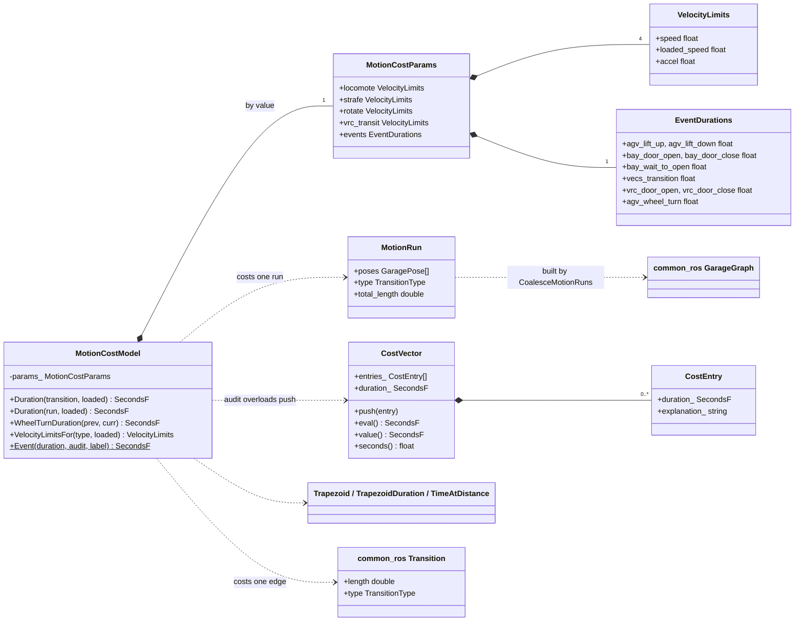
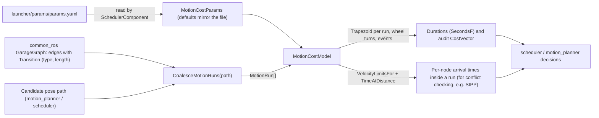
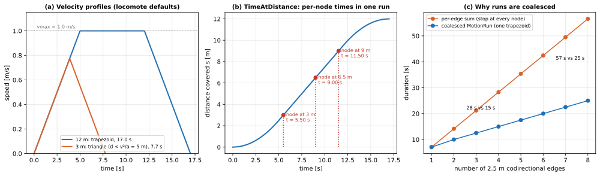

# 20 — `cost_functions`

| Generated | Revision | Source pack | Status |
|---|---|---|---|
| 2026-10-07 | 2 | `P20-cost_functions-part1of1.md` | Draft, generated by Claude, not yet reviewed by the team |

Package 20 of 37 (bottom-up) · dependency depth 7

**Abbreviations used in this document.** Each is also explained in context where it first matters.

| Abbreviation | Meaning |
|---|---|
| AGV (`agv` in names) | Automated Guided Vehicle |
| API | Application Programming Interface |
| ASCII | American Standard Code for Information Interchange (plain text) |
| CMake (`cmake` in names) | Cross-platform Make (build-system generator) |
| EV | Electric Vehicle |
| `gtest` | GoogleTest |
| NaN | Not a Number |
| ROS (`ros` in names) | Robot Operating System |
| SIPP | Safe Interval Path Planning |
| VECS (`vecs` in names) | not expanded in the code; Volley's vehicle EV-charging subsystem (inferred) |
| VRC (`vrc` in names) | Vertical Reciprocating Conveyor (a freight lift between floors) |
| YAML (`yaml` in names) | YAML Ain't Markup Language |

Workspace dependencies: common (01), common_ros (18), interfaces (11).
Used by: motion_planner, scheduler.

**Numbering note.** No pack for package 19 has been received, so this document follows the pack's own number (20). Document 19 will be added if that pack arrives.

Related documents:
- `18-common_ros.md`: `GarageGraph`, `Transition` (edge type and length), and the heading conventions used here;
- `17-vrc.md`: the VRC node's mock kinematics, which use the same speed, acceleration and gate times;
- `01-common.md`: `Motion1D`, the simulator's motion profile.

**How to read the evidence markers.**
- **[read]** means the conclusion comes from reading the source.
- **[probed]** means it was confirmed by running code. `cost_functions.cpp` was compiled on its own with g++ 13.3, the package's 16 pure-math tests were run and pass, and edge cases were tried.

The `motion_run_tests` (12 tests) need ROS (through `common_ros`) and were not run. The Mermaid diagrams pass the Mermaid 11 parser.

---

## A. External dependencies

`cost_functions` is the planners' **time model**: how long each AGV motion, VRC ride and fixed event takes. It describes itself as the "single source of truth for all cost and duration estimates used in motion planning and simulation". It builds two shared libraries:
- `cost_functions`: pure math, no ROS;
- `motion_cost_model`: needs `common_ros` for the garage graph.

| Name | Description | Version | Link | Usage in this package |
|---|---|---|---|---|
| C++ standard library | `<chrono>`, `<numeric>`, `<cmath>`. | C++20. | https://en.cppreference.com | `std::chrono::duration<float>` durations; square roots. |
| Eigen | Linear algebra. | System. | https://eigen.tuxfamily.org | Edge displacement vectors in `CoalesceMotionRuns`. |
| `common` (workspace) | Math utilities (document 01). | Workspace. | — | `Wrap`, `AreSameDirection`. |
| `common_ros` (workspace) | Garage graph, layout, transitions (document 18). | Workspace. | — | `GarageGraph`, `Transition`, `TransitionType`, VRC and floor lookups. |
| `interfaces` (workspace) | Message types (document 11). | Workspace. | — | `GaragePose`. |
| GoogleTest (ament_cmake_gtest) | Unit tests. | Not pinned. | https://github.com/google/googletest | Two test executables, 28 tests. |

---

## B. Glossary

| Term | Meaning | Where it shows up |
|---|---|---|
| Trapezoidal profile | Motion that accelerates at a constant rate up to a maximum speed, cruises, then decelerates at the same rate to rest; plotting speed against time gives a trapezoid. | `Trapezoid` |
| Triangular profile | A move too short to reach the maximum speed: accelerate, then immediately decelerate. | `Trapezoid` |
| Cost | Here always a *duration* in seconds: the planners minimize time. | `CostVector` |
| Audit | A labelled breakdown of a cost into its parts ("turn drive wheels", "lift up", …), for committed plans and event timelines. | `CostEntry`, `CostVector` |
| Loaded | An AGV carrying a tray, which drives at lower speed limits. | `loaded_speed` |
| Motion run | A chain of graph edges driven as *one* continuous motion, without stopping at the intermediate nodes. | `MotionRun` |
| Coalescing | Grouping consecutive edges into motion runs. | `CoalesceMotionRuns` |
| Wheel turn | The time for the AGV to steer its drive wheels when switching between locomote, strafe and rotate. | `agv_wheel_turn` |
| SIPP | Safe Interval Path Planning: a planner that schedules motions in time windows that are free of conflicts. Named in comments as a user of the per-node timing *(motion_planner, a later document)*. | `TimeAtDistance` comments |

---

## 1. Summary

`cost_functions` turns planned motions into **predicted durations**:
- **`Trapezoid(distance, vmax, amax)`** is the duration of a move that starts and ends at rest, for linear (m) or rotational (rad) motion: $T(d) = v/a + d/v$ when the move reaches its top speed $v$, otherwise $2\sqrt{d/a}$.
- **`TimeAtDistance`** gives the time within such a move at which a point along it is reached, so a long motion can be cut into per-node arrival times for collision checks.
- **`MotionCostModel`** maps each `GarageGraph` edge type (locomote, strafe, rotate, VRC ride) to its speed and acceleration limits, loaded or unloaded. It also adds wheel-turn time when the motion mode changes, and holds fixed event durations: lift up and down, bay doors, VECS (Volley's vehicle EV-charging subsystem) transitions, VRC gates.
- **`CoalesceMotionRuns`** groups consecutive codirectional edges, same-direction rotations, and same-direction VRC floors into single runs. This saves an acceleration and deceleration at every intermediate node, $(N-1)\,v/a$ for $N$ edges that each reach top speed: a 4-edge straight run of 2.5 m edges costs 15 s instead of 28 s (Figure 7.1c).
- **`CostVector`** records labelled cost breakdowns.

Its users are the motion planner and the scheduler.

**How it fits with the earlier documents.**
- **Edges** come from `common_ros`'s `GarageGraph` (document 18): `Transition.length` is metres for translations and VRC rides, and radians for rotations, which matches the units of the speed and acceleration limits used here.
- **The heading convention** is confirmed by the tests: "Volley heading 0 = facing +y", so motion along +x at heading 0 is a strafe, and at heading 90° it is a locomote.
- **The VRC defaults** (0.254 m/s, 0.2 m/s², 3 s gates) are exactly those of the VRC node's mock driver (document 17). For a two-floor ride (10 m) this model predicts 40.64 s; the mock's discrete `Motion1D` loop measured 40.3 s, so the model and the simulator agree within 1 % (section 7.4).

**Quality.** The code is small, well commented (including ASCII diagrams of both profiles), and the pure math is tested and correct **[probed]**. The weaknesses:
- **No input validation.** A zero speed or acceleration gives an infinite duration, and a negative distance gives NaN (R1, **[probed]**). This matters because `common_ros`'s `Param<T>` turns a *missing* parameter into 0 (document 18, R7).
- **Several copies of the same defaults.** They exist here, in `params.yaml`, and in the VRC mock (R2).
- **Unchecked coalescing assumptions** (R6).

---

## 2. Files

The package has 11 files. Line counts are from the pack, which has blank lines removed.

| Path (under `src/planner/cost_functions/`) | Lines | Role |
|---|---:|---|
| `include/cost_functions/cost_functions.hpp` | 45 | `SecondsF`; `Trapezoid`, `TrapezoidDuration`, `TimeAtDistance`; `CostEntry`, `CostVector`. |
| `include/cost_functions/motion_cost_model.hpp` | 85 | `VelocityLimits`, `EventDurations`, `MotionCostParams` (with defaults); the `MotionCostModel` class. |
| `include/cost_functions/motion_run.hpp` | 27 | `MotionRun`; `CoalesceMotionRuns`. |
| `src/cost_functions.cpp` | 96 | Profile math, with ASCII diagrams of both profiles. |
| `src/motion_cost_model.cpp` | 67 | Durations for transitions and runs; limit selection; wheel-turn rule; event audit. |
| `src/motion_run.cpp` | 117 | Displacements and the run-extension rules for linear, rotation and VRC edges. |
| `test/cost_functions_tests.cpp` | 232 | 16 tests: profiles, the precision of different duration types, cost vectors and audits. |
| `test/motion_run_tests.cpp` | 184 | 12 tests: `TimeAtDistance`, coalesced costs, coalescing on a test layout, VRC runs. |
| `test/test_vrc_layout.yaml` | 87 | 11-node layout with VRCs over three floors; installed for downstream packages' tests too. |
| `CMakeLists.txt` | 38 | The two libraries and two tests; installs the test layout (only when testing). |
| `package.xml` | 19 | Version 0.2.0; depends on common, common_ros and interfaces. |

---

## 3. Public API

Everything is in namespace `volley::cost`. The API (Application Programming Interface) has three groups.

### 3.1 Profile math — `cost_functions.hpp` (library `cost_functions`)

| Function | Meaning |
|---|---|
| `float Trapezoid(distance, vmax, amax)` | Seconds to cover `distance` from rest to rest: triangular if `distance < vmax²/amax`, trapezoidal otherwise (section 7.1). |
| `SecondsF TrapezoidDuration(...)` | The same value as `std::chrono::duration<float>`. |
| `float TimeAtDistance(s, total, vmax, amax)` | Seconds after the start at which distance `s` is reached, inside a single profile of length `total`. It is 0 at `s = 0`, equals `Trapezoid(total, …)` at `s = total`, and increases in between **[probed]**. |
| `CostEntry {duration_, explanation_}` | One labelled cost. |
| `CostVector` | `push(entry)` appends and adds to the running total; `eval()` recomputes the total from the entries; `value()` and `seconds()` read it. |

In symbols, with distance $d \ge 0$, speed limit $v > 0$ and acceleration limit $a > 0$ (none of which is checked, R1):

$$
\texttt{Trapezoid}(d, v, a) = T(d) = \begin{cases} 2\sqrt{d/a} & d < v^2/a\\ v/a + d/v & d \ge v^2/a,\end{cases}
\qquad
\texttt{TimeAtDistance}(s, d, v, a) = t(s) \ \text{ with } t(0) = 0,\ t(d) = T(d),
$$

where $t(s)$ is the inverse of the profile's position curve (section 7.2). For a cost vector with entries $(\Delta t_i, \text{label}_i)$,

$$
\texttt{duration\_} = \sum_i \Delta t_i ,
$$

kept up to date incrementally by `push`, and recomputed from scratch by `eval`.

**Why `float` seconds.** The tests document the reasoning. Durations are held as `std::chrono::duration<float>`, because accumulating into whole `std::chrono::seconds` truncates every term ("absolutely no bueno"), and milliseconds lose precision too, while a float duration is as precise as a plain `float`.

### 3.2 Motion cost model — `motion_cost_model.hpp` (library `motion_cost_model`)

**`MotionCostParams`** holds all kinematic and timing parameters. The production values come from the scheduler (`SchedulerComponent`, reading `launcher/params/params.yaml`); the struct's defaults are documented to match that file "so unit tests … get reasonable inputs":

| Mode | Speed | Loaded speed | Acceleration |
|---|---|---|---|
| Locomote | 1.0 m/s | 0.8 m/s | 0.2 m/s² |
| Strafe | 0.6 m/s | 0.32 m/s | 0.2 m/s² |
| Rotate | 0.17 rad/s (9.7°/s) | 0.136 rad/s | 0.035 rad/s² |
| VRC ride | 0.254 m/s | — (no load effect) | 0.2 m/s² |

| Event | Default |
|---|---|
| AGV lift up / down | 6.0 s / 5.5 s |
| Bay door open / close / wait to open | 4.0 s / 4.0 s / 10.0 s |
| VECS transition | 120 s |
| VRC gate open / close | 3.0 s / 3.0 s |
| AGV wheel turn | 1.5 s ("90 deg at 60 deg/s") |

**`MotionCostModel(params)`:**

| Member | Behavior |
|---|---|
| `Duration(transition, loaded)` | `Trapezoid(transition.length, limits)` for the edge's type. |
| `Duration(run, loaded)` | One trapezoid over the run's total length. |
| Audit overloads | Each also appends a `CostEntry` with a caller-supplied label to a `CostVector`. |
| `WheelTurnDuration(prev, curr)` | `agv_wheel_turn` for locomote ↔ strafe and locomote ↔ rotation (wheel turns of 90° and 95°), and 0 for strafe ↔ rotation (5°, "essentially no cost") and anything involving a VRC ride. |
| `VelocityLimitsFor(type, loaded)` | The speed and acceleration used for a type, which run-level callers pass on to `TimeAtDistance`. |
| `static Event(duration, audit, label)` | Records a fixed-duration event in the audit. |

Loading changes only the *speed*; the acceleration is the same whether or not the AGV is loaded. The limits used for an edge of type $m$ are

$$
\lambda(m, \text{loaded}) = (v_m^\text{eff},\ a_m),\qquad
v_m^\text{eff} = \begin{cases} v_m^\text{loaded} & \text{loaded} \wedge m \ne \text{VRC}\\ v_m & \text{otherwise,}\end{cases}
$$

and the durations are

$$
\texttt{Duration}(\tau) = T\big(\lambda_\tau;\ \ell_\tau\big),\qquad
\texttt{Duration}(r) = T\Big(\lambda_{m(r)};\ \sum_{e \in r} \ell_e\Big),\qquad
\texttt{WheelTurnDuration}(m, m') = t_w\cdot \mathbb{1}\big[\{m, m'\} \in \mathcal{M}\big],
$$

for a transition $\tau$ of length $\ell_\tau$ and a run $r$, with $t_w$ = `agv_wheel_turn` and the set of costed mode changes

$$
\mathcal{M} = \big\{\{\text{locomote}, \text{strafe}\},\ \{\text{locomote}, \text{rotation}\}\big\}.
$$

The function is symmetric, and zero for strafe ↔ rotation, for anything involving a VRC ride, and when $m = m'$.

### 3.3 Motion runs — `motion_run.hpp`

**`MotionRun {poses, type, total_length}`** is a chain of N edges (N + 1 poses), all of one transition type.

**`CoalesceMotionRuns(pose_path, graph)`** walks a pose path and starts a new run whenever the next edge does not *extend* the current one:

| Run type | The next edge extends the run when |
|---|---|
| Locomote / strafe | Same type, and its displacement points the same way as the previous edge's, within 0.01 rad (about 0.57°, matching the simulator's `FindCollinearMotion`). |
| Rotation | Same node, and the wrapped heading change has the same sign as the previous one. |
| VRC ride | Same VRC (carriage), and the same vertical direction. |

Formally, for a path of poses $p_0, p_1, \dots, p_K$ with edges $e_k = (p_{k-1} \to p_k)$, types $m_k$ and lengths $\ell_k$, edge $e_{k+1}$ extends the run ending with $e_k$ when $m_{k+1} = m_k$ and

$$
\operatorname{ext}(e_k, e_{k+1}) = \begin{cases}
\angle\big(\Delta_k, \Delta_{k+1}\big) \le 0.01\ \text{rad} & m \in \{\text{locomote}, \text{strafe}\},\quad \Delta_k = (x,y)_{p_k} - (x,y)_{p_{k-1}}\\[3pt]
n_{p_{k+1}} = n_{p_k} \ \wedge\ \operatorname{sgn}\delta_k = \operatorname{sgn}\delta_{k+1} \ne 0 & m = \text{rotation},\quad \delta_k = \operatorname{wrap}(h_{p_k} - h_{p_{k-1}})\\[3pt]
\operatorname{vrc}(p_{k}) = \operatorname{vrc}(p_{k+1}) \ \wedge\ \operatorname{sgn}\Delta z_k = \operatorname{sgn}\Delta z_{k+1} \ne 0 & m = \text{VRC},\quad \Delta z_k = z_{p_k} - z_{p_{k-1}}.
\end{cases}
$$

A run $r$ is a maximal chain of edges linked by $\operatorname{ext}$, with $L_r = \sum_{e \in r} \ell_e$ and $|r| + 1$ poses. The runs partition the path's edges, so $\sum_r |r| = K$.

It throws `std::invalid_argument` when two consecutive poses are not joined by an edge, or a pose names an unknown node. A path with fewer than two poses gives no runs.

**Usage.**

```cpp
volley::cost::MotionCostModel model(params);              // params from SchedulerComponent
volley::cost::CostVector audit;
std::optional<volley::TransitionType> previous_mode;
for (const auto& run : volley::cost::CoalesceMotionRuns(path, garage_graph)) {
  if (previous_mode) {
    const auto turn = model.WheelTurnDuration(*previous_mode, run.type);
    if (turn > volley::cost::SecondsF::zero()) { volley::cost::MotionCostModel::Event(turn, audit, "turn drive wheels"); }
  }
  model.Duration(run, audit, std::to_string(run.poses.size() - 1) + "-edge run", loaded);
  previous_mode = run.type;
}
const float total_seconds = audit.seconds();
```

This is illustrative; `path`, `params` and `loaded` are not from the pack.

---

## 4. Diagrams

### 4a. Class diagram (ownership on edges)



### 4b. Data flow

The package has no ROS interfaces of its own: no topics, services, timers or parameters. It is called by the planners.



### 4c. State machines

No state machine.

---

## 5. Behavior

All functions are pure computations: there is no state beyond the parameters held by `MotionCostModel`, no threads, executors, timers or I/O. They are safe to call concurrently on a const model.

**Performance.** The profile functions are $O(1)$: a few floating-point operations and at most one square root. `CoalesceMotionRuns` is $O(K \log |\mathcal{N}|)$ for a path of $K$ edges, since each step does a graph edge lookup and up to three layout lookups (node and floor maps, document 18, section 3.1.1). The plain `Duration` overloads exist for hot search loops; the audit overloads also build a label string per entry.

**Parameters and defaults.** See section 3.2. The package reads no ROS parameters.

---

## 6. Ownership and safety

### 6.1 Lifetimes

Everything is a value type. `MotionCostModel` copies its parameters, and `MotionRun` copies its poses.

### 6.2 Callbacks capturing `this`

Not applicable.

### 6.3 Locks and atomics

None needed.

### 6.4 Error handling

| Style | Where |
|---|---|
| Exceptions | `CoalesceMotionRuns` (`std::invalid_argument` for a missing edge or unknown node); `VelocityLimitsFor` for an unknown type. |
| None | The profile functions do not validate their inputs: they return `inf` or NaN (R1). |

### 6.5 RISK items

| Item | Risk | Evidence |
|---|---|---|
| R1 | **No validation of kinematic inputs.** `Trapezoid(5, 1, 0)` and `Trapezoid(5, 0, 0.2)` return `inf`, and `Trapezoid(-1, 1, 0.2)` returns NaN **[probed]**: the formulas need $v > 0$, $a > 0$ and $d \ge 0$ (and $0 \le s \le d$ for `TimeAtDistance`). `VelocityLimits{}` defaults to zeros, and `common_ros`'s `Param<T>` turns a *missing* parameter into 0 (document 18, R7), so a typo in `params.yaml` can make some motions infinitely expensive. A planner would then silently avoid those motions, rather than failing at startup. | **[probed]** + cross-reference |
| R2 | **The same defaults in several places.** The values in `MotionCostParams` mirror `launcher/params/params.yaml` by comment only, and the VRC numbers are repeated a third time in `MockHWDriverConfig` (document 17). Nothing checks that they agree, although the package calls itself the "single source of truth". | **[read]** |
| R3 | **Units depend on the edge type.** Lengths and limits are metres for translations and VRC rides, radians for rotations. Everything works as long as callers always pass a matching `Transition` type; there is no unit type to catch a mix-up. | **[read]** |
| R4 | **Float durations accumulate error over long sums.** `float` is fine for a single plan (the tests show it beats integer `chrono` types), but summing 200,000 entries of 0.1 s gives 19,959.5 s instead of 20,000 s **[probed]**. The worst-case rounding error of a running float sum of $N$ terms grows like $N \cdot u \cdot \lvert \text{total} \rvert$, with unit roundoff $u = 2^{-24} \approx 6\times10^{-8}$; at 20,000 s each addition can lose up to about 1 ms. Long-running totals, such as a day's timeline, should use `double` or re-anchor regularly. | **[probed]** |
| R5 | **Model and simulator differ slightly.** The VRC ride predicted here (40.64 s for 10 m) is about 0.8 % longer than the mock driver's discrete `Motion1D` loop (40.3 s), which snaps to the target at the end (document 01, R21). The AGV simulator presumably uses `Motion1D` too. Loading changes only speed, not acceleration. | **[probed]** (documents 17, 01) |
| R6 | **Coalescing assumptions.** A run assumes the AGV does not stop at intermediate nodes: no traffic holds, and no stop needed for sensing or centering. For rotations, a 180° step has an ambiguous sign: $\operatorname{wrap}(\pm 180°) = +180°$, so $\operatorname{sgn}\delta = +1$ for either direction, and two opposite 180° turns could be merged. Codirectional means within 0.01 rad, so slightly bent paths split into separate runs. | **[read]** |
| R7 | **Wheel-turn rule edge cases.** No wheel-turn cost is charged around VRC rides, and the first run of a path has no previous mode, so callers must decide whether the wheels start in the right orientation. | **[read]** |
| R8 | **`CostVector` API hygiene.** Members with trailing underscores (normally the private-member style) are public. Editing `entries_` directly leaves `duration_` stale until `eval()` is called. `seconds()` is not `const`. | **[read]** |
| R9 | **A wrong test comment.** In `RightAngleBreaksRun`, the comments say that +x at heading 90° is a strafe and −y is a locomote; by the convention the other tests establish (heading 0 faces +y), it is the reverse. The test asserts only the number of runs, so it passes either way. | **[read]** |
| R10 | **Test layout installed only when testing.** `test_vrc_layout.yaml` is installed only when `BUILD_TESTING` is on, but the build comment says downstream tests (`coalesce_trajectory`, SIPP) use it; their tests fail if this package was built without tests. | **[read]** |

---

## 7. Math

### 7.1 The trapezoidal profile

A move of length $d$ from rest to rest, with maximum speed $v$ and acceleration $a$, accelerates for $t_a = v/a$ over $d_a = v^2/(2a)$, cruises, then decelerates symmetrically. Reaching $v$ and stopping again needs $d_\text{full} = 2d_a = v^2/a$. Hence

$$
T(d) = \begin{cases}
2\sqrt{d/a} & d < v^2/a \quad\text{(triangle, peak speed } \sqrt{a d}\,\text{)}\\[4pt]
\dfrac{v}{a} + \dfrac{d}{v} & d \ge v^2/a \quad\text{(trapezoid)}.
\end{cases}
$$

The two branches agree at $d = v^2/a$, where both give $2v/a$, so $T$ is continuous **[probed]**. The trapezoid formula follows from $t_a + (d - 2d_a)/v + t_a = 2v/a + d/v - v/a$. With the defaults, a 12 m unloaded locomote takes 17.0 s, and a 3 m one 7.7 s (Figure 7.1a).

### 7.2 Time at distance

Inverting the position-versus-time curve of the same profile gives, for $0 \le s \le d$:

$$
t(s) = \begin{cases}
\sqrt{2s/a} & s \le d_a\\
t_a + (s - d_a)/v & d_a < s \le d - d_a\\
T(d) - \sqrt{2(d-s)/a} & s > d - d_a
\end{cases}
$$

In the triangular case, $d_a$ is replaced by $d/2$ and the middle segment disappears. The function is continuous and increasing **[probed]**. It lets a planner cost a run as one motion while still knowing *when* each intermediate node is passed: in Figure 7.1b, a 12 m run passes nodes at 3 m, 6.5 m and 9 m at 5.50 s, 9.00 s and 11.50 s.

### 7.3 What coalescing saves

For $N$ equal codirectional edges of length $e$, with $e \ge v^2/a$ (each edge already reaches cruise speed),

$$
\sum_{i=1}^{N} T(e) - T(Ne) = N\Big(\frac{v}{a}+\frac{e}{v}\Big) - \Big(\frac{v}{a}+\frac{Ne}{v}\Big) = (N-1)\,\frac{v}{a}.
$$

Each avoided stop saves one acceleration-plus-deceleration time $v/a$, which is 5 s for the unloaded locomote. For shorter edges the per-edge profiles are triangles and the saving is larger: with $e$ = 2.5 m, 4 edges cost 28.3 s stopping at each node, but 15.0 s as one run (Figure 7.1c).

A path's total predicted duration is then

$$
T_\text{path} = \sum_{\text{runs } r} T_{m(r)}\big(L_r\big) + \sum_{\text{mode changes}} t_\text{wheel} + \sum_{\text{events}} t_\text{event},
$$

with $T_{m}$ using the limits of the run's mode $m$, loaded or not.

### 7.4 Cross-check with the VRC node

A two-floor VRC ride (10 m) at 0.254 m/s and 0.2 m/s² is in the trapezoid regime ($v^2/a$ = 0.32 m), so $T$ = 0.254/0.2 + 10/0.254 = 40.64 s, plus 3 s for each gate: 46.64 s. Document 17 measured the mock driver at 40.3 s of motion (46.3 s with gates). The 0.3 s difference is the mock's discrete loop and final snap.



*Figure 7.1 — (a) Speed profiles for 12 m (trapezoid) and 3 m (triangle) at the default unloaded locomote limits. (b) `TimeAtDistance` for a 12 m run, with three intermediate nodes. (c) Duration of N codirectional 2.5 m edges costed edge by edge versus as one coalesced run.*

---

## 8. Tests

There are 28 tests in two executables. The 16 in `cost_functions_tests` pass **[probed]**; the 12 in `motion_run_tests` need ROS and were not run here.

| Group | Tests | What they reveal |
|---|---|---|
| Profiles | Trapezoid and triangle, linear and rotational, with expected values (13.3333 s, 4.4721 s, 15.6914 s, 17.7245 s) | The formulas of section 7.1. |
| Duration types | Accumulating as `chrono::seconds` ("absolutely no bueno"), milliseconds ("definitely not good enough"), nanoseconds (fine), and `duration<float>` (fine); conversions | The rationale for `SecondsF`: integer `chrono` types truncate each term. |
| Cost vectors and audits | Empty, single, sum, audit; unloaded and loaded audits including a lift | How a scheduler is expected to build a labelled timeline. |
| `TimeAtDistance` | Endpoints; trapezoidal monotonicity; triangular symmetry (the midpoint is at half the total time) | Section 7.2. |
| Coalescing | Coalesced shorter than the per-edge sum (linear and VRC); single edge; empty input; collinear strafes at heading 0; collinear locomotes at heading 90°; a multi-floor VRC ride as one run; a VRC direction reversal splitting the run; a right angle splitting the run | The run rules of section 3.3, and the heading convention (heading 0 faces +y). |

**Gaps.**
- **No test with zero, negative or missing parameters** (R1), and no check that `MotionCostParams`' defaults match `params.yaml` (R2).
- **No test of `WheelTurnDuration`** (R7), of rotation runs (including 180° steps, R6), or of different VRCs breaking a run.
- **No loaded-versus-unloaded test through `MotionCostModel`:** the loaded audit tests call `Trapezoid` with their own numbers.

---

## 9. Idioms to reuse, and open questions

### 9.1 Idioms

- **Every duration goes through this package.** Use `MotionCostModel` with parameters from `params.yaml`, never ad-hoc speed formulas, so planners and simulators agree.
- **Cost runs, not edges:** `CoalesceMotionRuns`, then `Duration(run)`, then `TimeAtDistance` for per-node timing.
- **Fast overloads in search loops, audit overloads for committed plans,** so explanations are available without slowing the search.
- **`std::chrono::duration<float>` for durations;** never integer `chrono` types for accumulating costs.

### 9.2 Open questions for the team

1. Should `MotionCostModel` validate its parameters (all speeds and accelerations > 0) at construction, and should the scheduler fail at startup if one is missing (R1; document 18, R7)?
2. Can the defaults be generated from `params.yaml` (or the reverse), and can the VRC mock read its kinematics from the same source (R2)?
3. Should long timelines accumulate in `double` (R4)?
4. How should a 180° rotation's direction be represented in runs (R6)? Should wheel-turn cost apply at the start of a path and around VRC rides (R7)?
5. Is package 19's pack still to come?
