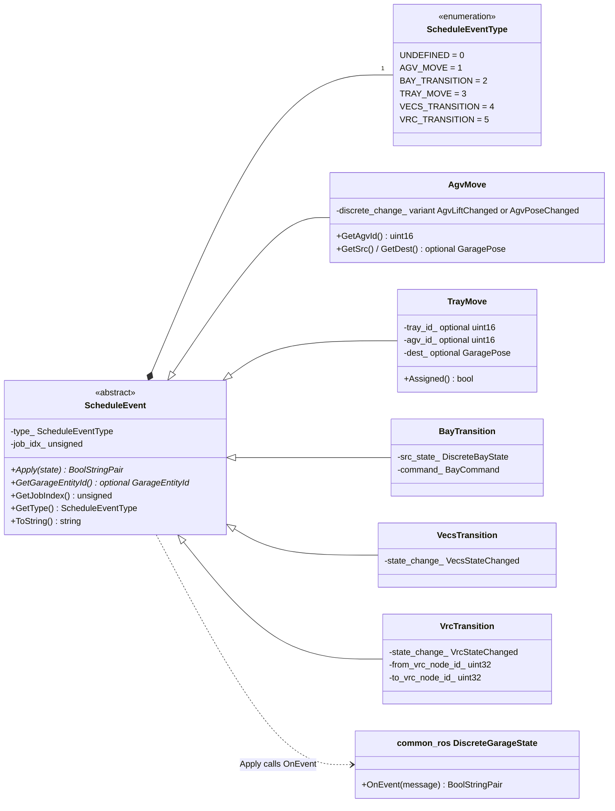
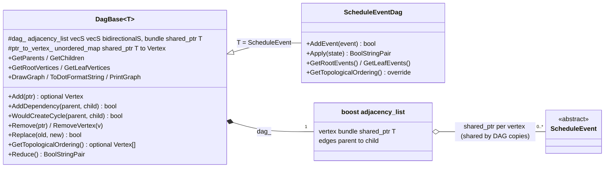
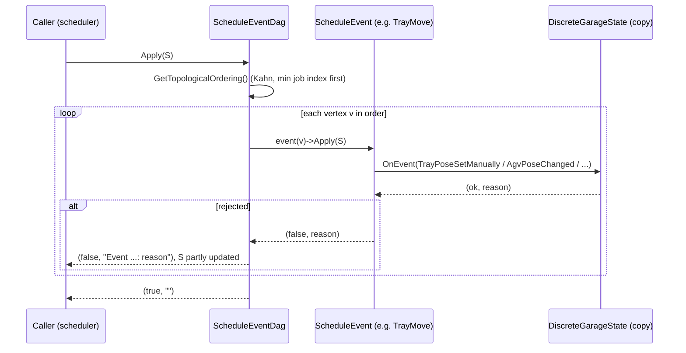
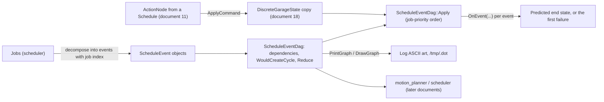
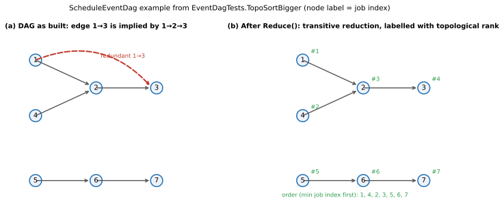

# 21 — `planner_core`

| Generated | Revision | Source pack | Status |
|---|---|---|---|
| 2026-10-07 | 1 | `P21-planner_core-part1of1.md` | Draft, generated by Claude, not yet reviewed by the team |

Package 21 of 37 (bottom-up) · dependency depth 7

**Abbreviations used in this document.** Each is also explained in context where it first matters.

| Abbreviation | Meaning |
|---|---|
| AGV (`agv` in names) | Automated Guided Vehicle |
| API | Application Programming Interface |
| ASCII | American Standard Code for Information Interchange (plain text) |
| CMake (`cmake` in names) | Cross-platform Make (build-system generator) |
| DAG | Directed Acyclic Graph |
| `gtest` | GoogleTest |
| KaTeX | a math-typesetting library used to check the formulas (a name, not an acronym) |
| MB | megabyte |
| `rclcpp` | ROS Client Library for C++ |
| ROS (`ros` in names) | Robot Operating System |
| `sim` | simulation / simulator (also the `sim` package) |
| SIPP | Safe Interval Path Planning |
| VECS | not expanded in the code; Volley's vehicle EV-charging subsystem (inferred) |
| VRC (`vrc` in names) | Vertical Reciprocating Conveyor (a freight lift between floors) |

Workspace dependencies: common (01), common_ros (18), interfaces (11), vrc_interfaces (04).
Used by: motion_planner, scheduler.

Related documents:
- `18-common_ros.md`: `DiscreteGarageState`, its events and `OnEvent`, which every schedule event applies;
- `11-interfaces.md`: `ActionNode`, the `…Changed` event messages, and the schedule as a DAG (section 7.1 there);
- `09-task_planner.md` and `20-cost_functions.md`: the other planner building blocks.

**How to read the evidence markers.**
- **[read]** means the conclusion comes from reading the source.
- **[probed]** means it was confirmed by running code. The `Reduce()` algorithm was re-implemented line for line in Python and compared with networkx's transitive reduction on 3,000 random DAGs (0 mismatches), and the job-priority topological order was recomputed for the test graph.

The package needs ROS (through `common_ros`), so it was not built here. The Mermaid diagrams pass the Mermaid 11 parser, and the formulas pass KaTeX.

---

## A. External dependencies

`planner_core` describes itself as the "shared domain model for the planner group: the schedule event hierarchy and the event DAG that every other package in src/planner plans over". It builds one shared library, `planner_core`.

| Name | Description | Version | Link | Usage in this package |
|---|---|---|---|---|
| Boost.Graph | Generic graph data structures and algorithms. | Boost (Ubuntu 24.04 ships 1.83); `libboost-dev`. | https://www.boost.org/libs/graph | `adjacency_list` (the DAG), `topological_sort`, `write_graphviz`. |
| `common_ros` (workspace) | Discrete garage state and its events (document 18). | Workspace. | — | `DiscreteGarageState::OnEvent`, `Reverse`, `GetAddEvent`, `PrintGraph`, `INFOS` logging. |
| `common` (workspace) | Utilities (document 01). | Workspace. | — | `Wrap`, `EnumNameString`, `BoolStringPair`. |
| `interfaces`, `vrc_interfaces` (workspace) | Messages (documents 11 and 04). | Workspace. | — | `ActionNode`, commands, `…Changed` events, `VrcState`. |
| rclcpp | ROS 2 (Robot Operating System 2) C++ client library. | Same distribution (Kilted or newer, see document 02). | https://github.com/ros2/rclcpp | `rclcpp::Logger` for `PrintGraph`. |
| GoogleTest (ament_cmake_gtest) | Unit tests. | Not pinned. | https://github.com/google/googletest | Two test executables, 21 tests. |

---

## B. Glossary

| Term | Meaning | Where it shows up |
|---|---|---|
| DAG | Directed Acyclic Graph: a directed graph with no cycles, so its vertices can be ordered so that every edge points forward. | `DagBase`, `ScheduleEventDag` |
| Dependency (edge) | An edge $u \to v$ meaning "$u$ must happen before $v$" ($u$ is the parent, $v$ the child). | `AddDependency` |
| Root / leaf | A vertex with no parents / no children. | `GetRootVertices`, `GetLeafVertices` |
| Topological order | A sequence of all vertices in which every parent comes before its children. | `GetTopologicalOrdering` |
| Transitive reduction | The smallest set of edges with the same reachability: an edge $u \to v$ is dropped if $v$ can be reached from $u$ another way. | `Reduce` |
| Job | A user-level request (retrieve, move tray, …; document 11) that the scheduler breaks into events. Events carry their job's index. | `job_idx_` |
| Schedule event | One planned change to the discrete state: an AGV move or lift, a tray move, a bay, VECS or VRC transition. | `ScheduleEvent` and subclasses |
| Expanded / unexpanded tray move | A tray move is first only "from here to there" (applied by teleporting the tray); later it is expanded into the AGV moves that carry it. | `TrayMove` |
| Teleport | Changing a pose in the discrete state without intermediate steps, as the planner's simulation of an action. | `TrayMove`, `VrcTransition` |
| Graphviz / dot | A graph-description language and renderer. | `DrawGraph`, `ToDotFormatString` |

---

## 1. Summary

`planner_core` is the planners' **shared model of a schedule**:
- **Schedule events**: an abstract `ScheduleEvent` (type plus job index), with one subclass per kind of change: `AgvMove` (an AGV lift or pose change), `TrayMove` (a tray's destination, optionally with the AGV that carries it), `BayTransition`, `VecsTransition` and `VrcTransition`. Each can **apply** itself to a `DiscreteGarageState` (document 18), turning planning into simulation.
- **The event DAG**: `DagBase<T>`, a generic DAG of `shared_ptr<T>` on a Boost graph, plus `ScheduleEventDag`. The DAG adds and removes events and dependencies, checks for cycles, computes roots and leaves, the transitive reduction, and a **job-priority topological order** (lowest job index first), and can apply the whole DAG to a state copy and render it as Graphviz.
- **`ApplyCommand`**: applies an `ActionNode` (an AGV or bay command) to the state by translating it into the matching state events.

**How it fits with the earlier documents.**
- **Applying events reuses the discrete state's validated events** (document 18, section 3.4): every `Apply` builds `AgvPoseChanged`, `BayStateChanged` and similar messages and calls `OnEvent`. Planning therefore inherits that state's validation, and its weaknesses: partial mutation on failure (R1 there), and no layout checks.
- **The DAG has the same shape as the published `Schedule`** of document 11, a DAG of `ActionNode`s with parent links, but here over *events* before they become device commands.
- The planners named as its users, the motion planner (with the SIPP algorithm of document 20) and the scheduler, will be documented later.

**Quality.** The DAG code is careful about Boost's vertex-index shifting on removal, and its transitive reduction is correct **[probed]**. The weaknesses:
- **Applying schedules with VECS actions fails:** `ApplyCommand(ActionNode)` has no case for VECS commands (R1).
- **The DAG does not enforce acyclicity:** `AddDependency` accepts cycle-forming edges, so callers must call `WouldCreateCycle` themselves (R2).
- **Several `Apply` paths change the state, then fail midway** (R3).
- **Copying a DAG shares its events** (R4).
- **Unassigned or undestined tray moves silently "succeed"** or remove the tray from the simulated state (R5).

---

## 2. Files

The package has 9 files. Line counts are from the pack, which has blank lines removed.

| Path (under `src/planner/planner_core/`) | Lines | Role |
|---|---:|---|
| `include/planner_core/event_dag.hpp` | 534 | `DagBase<T>` (the whole generic DAG, header-only) and the `ScheduleEventDag` declaration. |
| `include/planner_core/planner_core_msgs.hpp` | 42 | Short aliases for the message types used (`ActionNodeMsg`, `AgvPoseChangedMsg`, …). |
| `include/planner_core/schedule_events.hpp` | 215 | `ApplyCommand` overloads; `ScheduleEventType`; `ScheduleEvent` and its five subclasses. |
| `src/event_dag.cpp` | 81 | `ScheduleEventDag::Apply`, root and leaf events, and the job-priority topological order. |
| `src/schedule_events.cpp` | 388 | `ApplyCommand` implementations; each event's `Apply`. |
| `test/event_dag_tests.cpp` | 346 | 8 tests: add, dependency, topological sort, roots and leaves, reduction, removal. |
| `test/schedule_events_tests.cpp` | 770 | 13 tests: constructing and applying every event type; applying AGV and bay commands; VRC teleports. |
| `CMakeLists.txt` | 31 | Library and two tests. The tests compile the sources directly rather than linking the library (document 10, R9). |
| `package.xml` | 23 | Dependencies; the package description quoted above. |

---

## 3. Public API

Everything is in namespace `volley`. The API (Application Programming Interface) has three parts.

### 3.1 The generic DAG — `DagBase<T>` (`event_dag.hpp`)

**Purpose.** A dependency graph over shared objects, addressable both by object and by Boost vertex.

**Data.** The DAG is a pair:

$$
\mathcal{D} = (G, \kappa),\qquad G = (V, E) \ \text{a Boost } \texttt{adjacency\_list<vecS, vecS, bidirectionalS, shared\_ptr<T>>},\qquad
\kappa : \texttt{shared\_ptr<T>} \to V \ (\texttt{ptr\_to\_vertex\_}).
$$

Vertices are $V = \{0, \dots, |V|-1\}$, and each vertex's bundle holds its object, so $\kappa^{-1}(v)$ is `GetFromVertex(v)`. Objects are identified by **pointer identity**, not by value. An edge $(u, v) \in E$ means $u$ is a dependency (parent) of $v$.

**Operations.**

| Operation | Effect, and cost |
|---|---|
| `Add(ptr)` | $V \leftarrow V \cup \{\lvert V\rvert\}$, $\kappa(\text{ptr}) = \lvert V\rvert$. Refused (`nullopt`) if the pointer is already present. $O(1)$ amortized. |
| `AddDependency(parent, child)` / `AddDependent(child, parent)` | $E \leftarrow E \cup \{(\kappa(p), \kappa(c))\}$ if both exist and the edge is new. **No cycle check** (R2). $O(\deg)$. |
| `WouldCreateCycle(p, c)` | True iff $p = c$ or $p$ is reachable from $c$: a breadth-first search over out-edges, $O(\lvert V\rvert + \lvert E\rvert)$. |
| `Remove(ptr)` / `RemoveVertex(v)` | Removes the vertex and its edges. Boost then renumbers every vertex $w > v$ to $w - 1$; the code updates $\kappa$ accordingly, $O(\lvert V\rvert)$. Vertex numbers held by callers become stale. |
| `Replace(old, new)` / `Replace(v, new)` | Swaps the object at a vertex, keeping its edges. |
| `GetParents`, `GetChildren`, `GetRootVertices`, `GetLeafVertices` | $\{u : (u,v) \in E\}$, $\{w : (v,w) \in E\}$, $\{v : \deg^-(v) = 0\}$, $\{v : \deg^+(v) = 0\}$. |
| `GetTopologicalOrdering()` (virtual) | `boost::topological_sort`, reversed; `nullopt` if $G$ has a cycle. |
| `Reduce()` | Transitive reduction in place (section 7.2). Fails if $G$ has a cycle. |
| `DrawGraph(name)`, `ToDotFormatString()`, `PrintGraph(label, logger)` | Graphviz output: a `/tmp/<name>.dot` file, a string, or ASCII art in the log (through `common_ros`'s `PrintGraph`, document 18, R23). |

Copying a `DagBase` copies the graph and the map, but **not the objects**: both copies point at the same events (R4).

### 3.2 Schedule events — `schedule_events.hpp`

**`ScheduleEvent`** (abstract) carries a type $\theta \in$ {`AGV_MOVE`, `BAY_TRANSITION`, `TRAY_MOVE`, `VECS_TRANSITION`, `VRC_TRANSITION`} and a job index $j \in \mathbb{N}$. It has three virtual members:
- `Apply(state) -> BoolStringPair`;
- `GetGarageEntityId()`: the AGV, tray, bay, VECS or VRC the event is about;
- `ToString()`.

As a function on discrete states, each event is a *partial* map

$$
\operatorname{apply}_\epsilon : \mathcal{S} \rightharpoonup \mathcal{S},\qquad
\operatorname{apply}_\epsilon(S) = \operatorname{OnEvent}(\cdots\operatorname{OnEvent}(S, m_1)\cdots, m_k),
$$

for the sequence of state messages $m_1, \dots, m_k$ that the event translates into (one to four, see below). It fails at the first message the state rejects.

| Event | Holds | `Apply` translates into |
|---|---|---|
| `AgvMove(j, change)` | One `AgvLiftChanged` *or* one `AgvPoseChanged` (a `std::variant`) | That message, unchanged. `GetSrc` and `GetDest` give the poses for a pose change, and nothing for a lift. |
| `TrayMove(j)` | Optional tray id, optional AGV id, optional destination pose | No tray id: **nothing, reports success** (R5). No destination: **removes** the tray, and its payload, from the state (R5). Otherwise: moves any other tray on the destination node to the placeholder pose $(0, 0°)$; then either teleports the tray (no AGV) or moves the carrying AGV, which must be at the tray's pose (or its reciprocal), lifted, and carrying that tray, to the destination with heading $\operatorname{wrap}(h_\text{dst} + \Delta)$, where $\Delta = 0°$ if the AGV and tray headings match and $180°$ otherwise. |
| `BayTransition(j, src_state, command)` | The bay's expected source state and a bay command | Checks that the bay is in `src_state`, then `ApplyCommand(command)`. |
| `VecsTransition(j, change)` | One `VecsStateChanged` | That message. |
| `VrcTransition(j, change, n_from, n_to)` | One `VrcStateChanged` (idle at floor $f$ → idle at floor $f'$) and the VRC's node ids on both floors | Two VRC state changes (idle → moving with requested floor $f'$, then moving → idle at $f'$), then teleports every AGV on $n_\text{from}$ to $n_\text{to}$ (carrying its tray), then every remaining tray on $n_\text{from}$. |

**Usage.**

```cpp
volley::DiscreteGarageState sim = current_state;          // copy: Apply mutates
volley::ScheduleEventDag dag;
auto lift = std::make_shared<volley::AgvMove>(job, lift_changed);
auto drive = std::make_shared<volley::AgvMove>(job, pose_changed);
dag.AddEvent(lift); dag.AddEvent(drive);
if (!dag.WouldCreateCycle(lift, drive)) { dag.AddDependency(lift, drive); }   // R2: check yourself
dag.Reduce();
auto [ok, why] = dag.Apply(sim);                          // events in job-priority topological order
if (!ok) { INFOS(logger, "plan does not simulate: " << why); }
```

This is illustrative: `current_state`, `job`, `lift_changed`, `pose_changed` and `logger` are not from the pack.

### 3.3 Commands and the event DAG — `ApplyCommand`, `ScheduleEventDag`

**`ApplyCommand(command, id, state)`** turns device commands into state events:
- **AGV command** $(g_\text{src} \to g_\text{dst})$, with goals $g = (n, h, \ell)$ (node, heading, lift). Valid only if exactly one component changes:

$$
\mathbb{1}[\ell_\text{src}\ne\ell_\text{dst}] + \mathbb{1}[n_\text{src}\ne n_\text{dst}] + \mathbb{1}[h_\text{src}\ne h_\text{dst}] = 1 .
$$

  The AGV must be at $g_\text{src}$. A lift change becomes `AgvLiftChanged`; otherwise `AgvPoseChanged`. The `CENTER` command of document 18 (no change) is therefore rejected here.
- **Bay command:**
  - to-insert: ready-to-retrieve → ready-to-insert;
  - process-retrieve: the same state change, plus removal of the payload on the bay node's tray;
  - to-retrieve: ready-to-insert or vehicle-inserted → ready-to-retrieve.

  The source state is assumed, and `OnEvent` rejects a mismatch.
- **`ActionNode`:** dispatches AGV and bay commands; a VRC command is a no-op ("handled via `VrcTransition`"); **any other type, including VECS commands, fails** (R1).

**`ScheduleEventDag`** (a `DagBase<ScheduleEvent>`) adds:
- `AddEvent`, `HasEvent`, `GetEventFromVertex`, `GetVertexFromEvent`;
- `GetRootEvents()`, sorted by job index;
- `GetLeafEvents()`;
- `GetTopologicalOrdering()`, which overrides the base version with Kahn's algorithm over a min-priority queue on job index (section 7.1);
- `Apply(state)`: applies every event in that order, stopping at the first failure:

$$
\operatorname{Apply}_\mathcal{D}(S) = \operatorname{apply}_{\epsilon_{\sigma(n)}} \circ \cdots \circ \operatorname{apply}_{\epsilon_{\sigma(1)}}(S),
$$

  where $\sigma$ is the job-priority topological order. The state is left as it was after the last successful event, so callers apply the DAG to a copy, as the header advises.

---

## 4. Diagrams

### 4a. Class diagrams (ownership on edges)

**Events.** `ScheduleEvent` is abstract; each subclass owns the messages it applies, by value.



**The DAG.**



**Applying a DAG.** The call chain of `ScheduleEventDag::Apply` for one event:



### 4b. Data flow

The package has no ROS interfaces of its own: no topics, services, actions, timers or parameters. It is a library for the planners.



### 4c. State machines

There is no state machine in this package. `VrcTransition::Apply` performs the VRC's *idle → moving → idle* change on the discrete state (document 04's state vocabulary), but it does not implement a state machine.

---

## 5. Behavior

Everything is synchronous computation over in-memory objects. There are no threads, executors, timers or parameters. A DAG and its events are not thread-safe, and should be used from one thread.

**Costs** for a DAG with $n = \lvert V\rvert$ vertices and $m = \lvert E\rvert$ edges:

| Operation | Time | Memory |
|---|---|---|
| `Add`, `AddDependency` | $O(1)$, $O(\deg^+)$ (duplicate check) | — |
| `WouldCreateCycle` | $O(n + m)$ | $O(n)$ |
| `RemoveVertex` | $O(n + \deg)$ (renumbering) | — |
| `GetTopologicalOrdering` (event DAG) | $O\big((n + m)\log n\big)$ (priority queue) | $O(n)$ |
| `Reduce` | $O(n \cdot m)$ for reachability, plus the redundancy checks | $O(n^2)$ bits (a reachability matrix) |
| `Apply` | the topological order, plus one `OnEvent` per state message | — |

**Debug output.** `DrawGraph` writes `/tmp/<name>.dot`. `PrintGraph` runs `graph-easy` through a shell (document 18, R23). In the DAG's labels, VRC transitions print as "Unknown event type" because `to_str` has no case for them (R8).

---

## 6. Ownership and safety

### 6.1 Lifetimes

- Events are `shared_ptr`s, kept alive by every DAG that contains them and by any other holder.
- The DAG maps pointer identity to a vertex, so two events with equal content are different vertices.
- Copying a DAG shares the events, so mutating one through a setter (`SetDest`, `SetTrayId`, `SetDiscreteChange`) changes it in every copy (R4).

### 6.2 Callbacks capturing `this`

The Graphviz label writers capture `this` for the duration of the call only.

### 6.3 Locks and atomics

None.

### 6.4 Error handling

| Style | Where |
|---|---|
| `BoolStringPair {ok, reason}` | Every `Apply`, `ApplyCommand`, `Reduce`, and `ScheduleEventDag::Apply`, with the failing event's text prepended. |
| `std::optional` | Lookups; `Add`; `GetTopologicalOrdering` (`nullopt` for a cycle). |
| Exceptions | `GetInEdges` and `GetOutEdges` for an invalid vertex (`std::invalid_argument`); `std::get` and `.value()` on unchecked optionals (R6). |

### 6.5 RISK items

| Item | Risk | Evidence |
|---|---|---|
| R1 | **Applying a VECS action fails.** `ApplyCommand(ActionNode)` handles AGV and bay commands, treats VRC commands as a no-op, and falls through to "Unknown ActionNode type" for everything else, including `TYPE_VECS_COMMAND`, a valid `ActionNode` type (document 11). Any code that replays a published schedule containing charging actions through this function fails at the first one. | **[read]** |
| R2 | **Acyclicity is not enforced.** `AddDependency` adds any new edge, including one that closes a cycle. A cyclic DAG is detected only later, when `GetTopologicalOrdering`, `Reduce` or `Apply` returns failure, far from the edge that caused it. `WouldCreateCycle` exists, but calling it is up to each caller. | **[read]**; tests create cycles on purpose |
| R3 | **`Apply` can change the state, then fail.** `TrayMove::Apply` moves a blocking tray to $(0, 0°)$ and *then* may fail (the comment acknowledges it: "if a later step … fails then we should undo this change"). `VrcTransition::Apply` performs two VRC state changes and then teleports AGVs and trays one by one; a failure in the middle leaves the VRC at the new floor with some entities moved. With the discrete state's own partial mutation (document 18, R1), a failed simulated plan can leave an inconsistent state copy. That is acceptable only if callers discard the copy on failure. | **[read]** |
| R4 | **DAG copies share events.** The defaulted copy constructor copies `shared_ptr`s, so planning variants built by copying a DAG and editing events in place affect each other. | **[read]** |
| R5 | **Silent semantics of incomplete tray moves.** A `TrayMove` without a tray id applies as success, with no change ("Not sure what to do here yet"). Without a destination, it *removes* the tray and its payload from the simulated state. Later events that refer to that tray then fail with misleading reasons, and job planning reasons about a garage with fewer trays. Blocking trays are parked at the placeholder pose $(0, 0°)$, which is not a real node. | **[read]** |
| R6 | **Unchecked optionals.** `TrayMove::Apply` dereferences `state.GetTray(id)->payload_id` without checking that the tray exists (undefined behavior if it does not). Several `.value()` calls throw `bad_optional_access` far from their cause. | **[read]** |
| R7 | **`AgvMove` API stubs.** `SetSrc` and `SetDest` are declared but not implemented ("these aren't implemented anywhere"). Calling them is a link error, and a lift event carries no pose. | **[read]** |
| R8 | **Debug printing gaps.** `DagBase::to_str(ScheduleEvent)` has no case for `VRC_TRANSITION` (it prints "Unknown event type"). `DrawGraph` writes to a fixed `/tmp/<name>.dot`. `PrintGraph` inherits the shell-command risk of document 18, R23. | **[read]** |
| R9 | **Planning teleports bypass the layout.** `VrcTransition` and `TrayMove` change poses in the discrete state with no layout or collision checks, because the discrete state does not check edges either. A plan that simulates successfully can still contain physically impossible steps; feasibility must come from the motion planner and the safety checker (document 18). | **[read]** |

---

## 7. Math

### 7.1 Job-priority topological order

A topological order of $G = (V, E)$ is a bijection $\sigma : \{1, \dots, n\} \to V$ with

$$
(u, v) \in E \ \Rightarrow\ \sigma^{-1}(u) < \sigma^{-1}(v).
$$

It exists if and only if $G$ is acyclic. `ScheduleEventDag::GetTopologicalOrdering` runs Kahn's algorithm. It keeps the *ready set*

$$
R_k = \{ v \notin \{\sigma(1), \dots, \sigma(k)\} : \text{every parent of } v \text{ is in } \{\sigma(1), \dots, \sigma(k)\} \},
$$

and always takes the ready vertex with the smallest job index:

$$
\sigma(k+1) = \arg\min_{v \in R_k} j(v).
$$

Ties between vertices of the same job are broken by the heap, so their order is deterministic for a given construction sequence, but not otherwise specified. If the loop ends with fewer than $n$ vertices visited, $G$ has a cycle and the result is `nullopt`. The cost is $O((n + m)\log n)$.

The effect is that **earlier jobs advance as far as their dependencies allow before later jobs start**, which is what applying a plan for job-by-job feasibility needs. On the test graph of Figure 7.1, a plain topological sort could output 1, 4, 5, 2, 6, 3, 7. The job-priority order is 1, 4, 2, 3, 5, 6, 7 **[probed]**, as `EventDagTests.TopoSortBigger` expects: job 4 runs before 2 because 2 depends on it, and 5–7 wait until jobs 1–4 are done.

### 7.2 Transitive reduction (`Reduce`)

The reachability relation $u \leadsto v$ (a path of length $\ge 1$) is computed by dynamic programming in reverse topological order:

$$
\operatorname{reach}(u) = \bigcup_{(u, v) \in E} \big(\{v\} \cup \operatorname{reach}(v)\big),
$$

stored as an $n \times n$ bit matrix. An edge is redundant when another child of its source already reaches its target:

$$
(u, v) \text{ is removed} \iff \exists\, w \ne v : (u, w) \in E \ \wedge\ v \in \operatorname{reach}(w).
$$

The code also requires $w$ to come before $v$ in the topological order, which is always true when $w \leadsto v$, so it only speeds up the check. For a DAG the transitive reduction is unique, and removing all redundant edges at once is correct. A line-for-line Python re-implementation agreed with networkx's transitive reduction on 3,000 random DAGs of 2–14 vertices **[probed]**. The reachability step costs $O(n \cdot m)$ time and $O(n^2)$ bits of memory: about 12.5 MB for 10,000 events.



*Figure 7.1 — The DAG of `EventDagTests.TopoSortBigger` (each vertex labelled with its job index). (a) As built, edge 1→3 is redundant because 1→2→3 exists. (b) After `Reduce()`, with each vertex's position in the job-priority topological order.*

### 7.3 Applying a DAG as function composition

For events $\epsilon$ with partial state maps $\operatorname{apply}_\epsilon$ (section 3.2), applying the DAG is the composition in the order $\sigma$:

$$
\operatorname{Apply}_\mathcal{D}(S) = \big(\operatorname{apply}_{\epsilon_{\sigma(n)}} \circ \cdots \circ \operatorname{apply}_{\epsilon_{\sigma(1)}}\big)(S).
$$

It is defined (succeeds) only if every intermediate application succeeds. Two orders that respect $E$ can give different results when two unordered events touch the same entity: the DAG's edges must order every pair of events that conflict on an entity, otherwise the outcome depends on the job-index tie-breaking. That requirement is the planner's to meet; the DAG does not check it.

### 7.4 Tray moves carried by an AGV

When an AGV under a tray carries it to a destination pose $(n_d, h_d)$, the AGV's new heading keeps its offset relative to the tray:

$$
h_\text{AGV}' = \operatorname{wrap}\big(h_d + \Delta\big),\qquad \Delta = \begin{cases} 0° & h_\text{AGV} = h_\text{tray}\\ 180° & \text{otherwise,}\end{cases}
$$

with `IsAngleOrReciprocal` required beforehand: the AGV's heading must equal the tray's heading, or its reciprocal.

---

## 8. Tests

There are 21 tests in two executables. They were not run here, because ROS was not available.

| Group | Tests | What they reveal |
|---|---|---|
| DAG basics | Add and has (vertex and event), add dependency (duplicate and missing events fail) | Events are keyed by pointer; a duplicate edge is refused. |
| Ordering | `TopologicalSorting` (1, 2, 3, then a cycle → none); `TopoSortBigger` (1, 4, 2, 3, 5, 6, 7, then a cycle → none) | The job-priority order of section 7.1. Cycles are created *on purpose* through `AddDependency` (R2). |
| Structure | Roots and leaves; `Reduce` (1→2→3 with 1→3 removed); `Remove` and `Remove2` (vertex renumbering) | Removal keeps the pointer-to-vertex map consistent after Boost renumbers the vertices. |
| Events | Constructing each type; storing them in one vector and casting back with `dynamic_cast` | Polymorphic storage through `ScheduleEventSPtr`. |
| Applying | AGV commands (lift and move, plus invalid cases); bay commands (all three); AGV moves with and without a tray; tray moves; bay transitions; VRC transitions that teleport an AGV with its tray, and a tray on its own | Each event's translation into state messages, and that a VRC ride moves everything on the VRC's node to the destination floor's node. |

**Gaps.**
- **No test of `ApplyCommand` with a VECS action node** (R1).
- **No test that a failed `TrayMove` or `VrcTransition` leaves the state unchanged** (R3).
- **No test of copying a DAG** (R4), and **no test of tray moves without a tray id or destination** (R5).
- **No test of `WouldCreateCycle`**, or of `Replace`.
- **No test of `ScheduleEventDag::Apply` on a multi-job DAG.**

---

## 9. Idioms to reuse, and open questions

### 9.1 Idioms

- **Plan by simulation:** copy the discrete state, apply the event DAG to the copy, and accept the plan only if every event applies.
- **Check `WouldCreateCycle` before every `AddDependency`,** and `Reduce()` before publishing a DAG, to keep it minimal.
- **Order by job index:** use `ScheduleEventDag::GetTopologicalOrdering`, not the base class's, whenever events from several jobs are involved.
- **Never keep `Vertex` numbers across a removal;** address events by pointer.
- **Translate commands into validated state events** (`ApplyCommand`), rather than editing the state directly.

### 9.2 Open questions for the team

1. Should `ApplyCommand(ActionNode)` handle VECS commands, for example by building a `VecsStateChanged` from the command (R1)?
2. Should `AddDependency` refuse cycle-forming edges itself, perhaps with a fast path when the caller guarantees acyclicity (R2)?
3. Should `Apply` work on a scratch copy and commit only on success, or should callers be required to discard the state after a failure (R3)?
4. Should `DagBase` have an explicit deep copy for planning variants (R4)?
5. What should a tray move without a tray id or destination mean in simulation: fail, keep the tray at an "unknown" pose, or the current behavior (R5)? Is $(0, 0°)$ a reserved "nowhere" pose in every layout?
6. Can the unimplemented `AgvMove::SetSrc` and `SetDest` be removed (R7)?
7. Which package guarantees that events of different jobs touching the same entity are ordered by an edge (section 7.3)?
