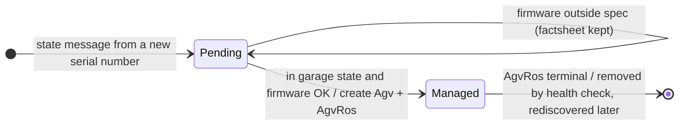
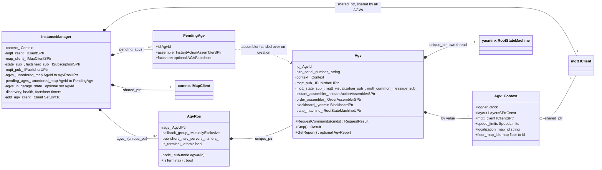
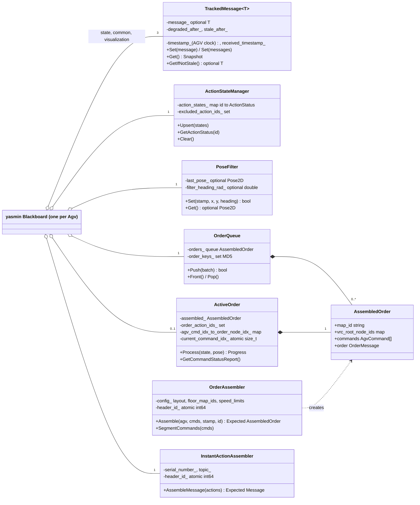
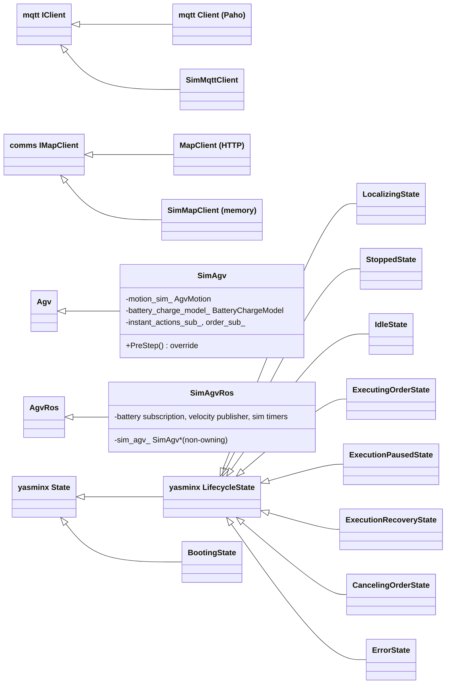
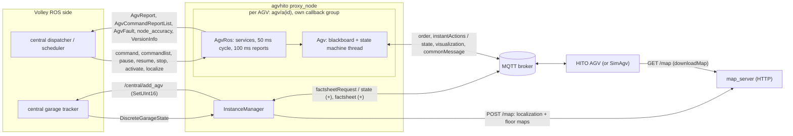
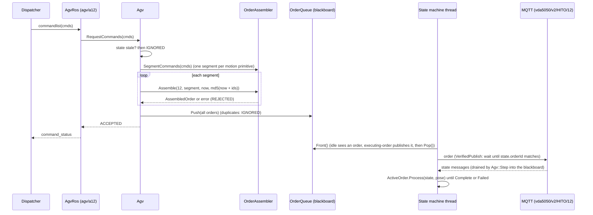
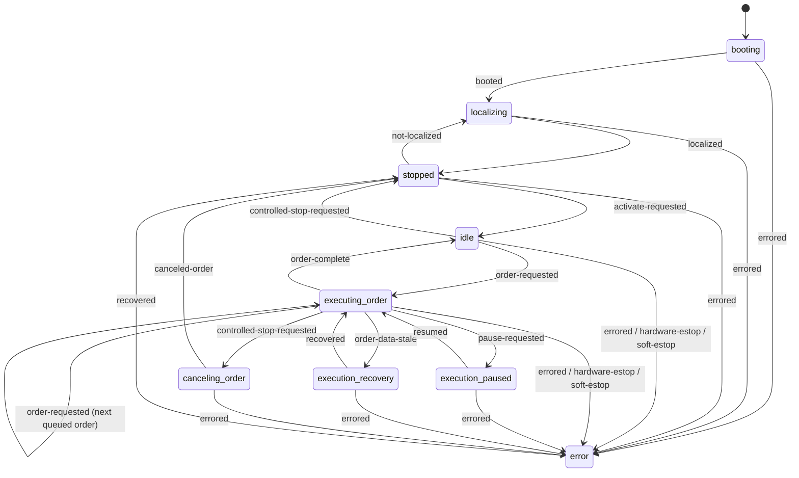
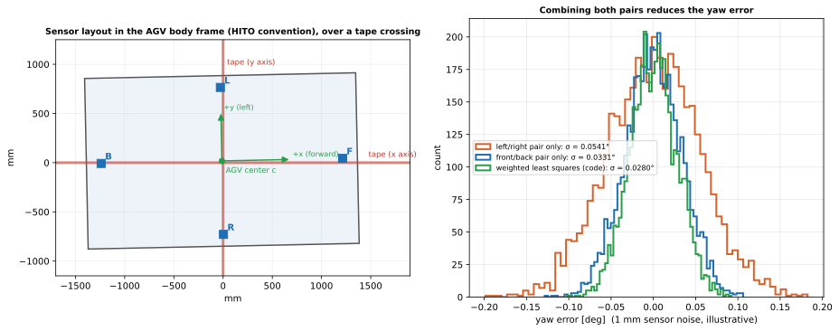
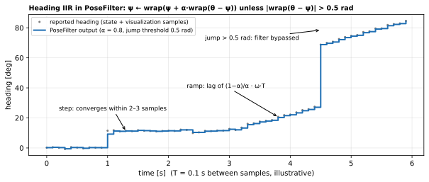
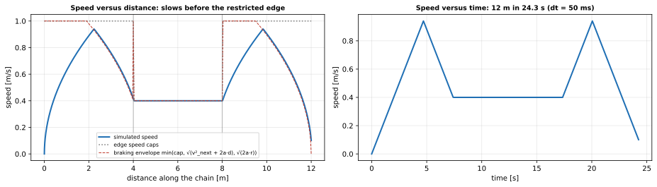

# 22 — `agvhito`

| Generated | Revision | Source pack | Status |
|---|---|---|---|
| 2026-10-07 | 3 | `P22-agvhito-part1of3.md`, `-part2of3.md`, `-part3of3.md` (all 3 parts) | **Complete** (all parts). Draft, generated by Claude, not yet reviewed by the team |

Package 22 of 37 (bottom-up) · dependency depth 7

**Abbreviations used in this document.** Each is also explained in context where it first matters.

| Abbreviation | Meaning |
|---|---|
| AGV (`agv` in names) | Automated Guided Vehicle |
| `agvhito` | AGV software for HITO vehicles (inferred from the name) |
| API | Application Programming Interface |
| BLift | bay lift: a bay with its own lift serving several floors (inferred) |
| FIFO | First In, First Out |
| GUID | Globally Unique Identifier |
| HITO | name of the AGV vendor; not expanded in the code |
| HTTP | Hypertext Transfer Protocol |
| IIR | Infinite Impulse Response (filter) |
| ISO | International Organization for Standardization (as in ISO 8601 date and time format) |
| JSON (`json` in names) | JavaScript Object Notation |
| KaTeX | a math-typesetting library used to check the formulas (a name, not an acronym) |
| MD5 (`md5` in names) | Message-Digest algorithm 5 |
| MGS | Magnetic Guide Sensor |
| MQTT (`mqtt` in names) | Message Queuing Telemetry Transport |
| NTP | Network Time Protocol |
| `py` | Python (the `.py` file extension; also in names such as `common_py`) |
| QoS | Quality of Service |
| `rclcpp` | ROS Client Library for C++ |
| `rclcppx` | "rclcpp extensions" (Volley package) |
| `rcpputils` | ROS C++ utilities |
| RFID | Radio-Frequency Identification |
| ROS (`ros` in names) | Robot Operating System |
| SHA | Secure Hash Algorithm |
| `sim` | simulation / simulator (also the `sim` package) |
| `stdx` | "standard library extensions" (Volley package) |
| UUID | Universally Unique Identifier |
| VDA (`vda5050` in names) | Verband der Automobilindustrie (German Association of the Automotive Industry); VDA 5050 is its AGV interface standard |
| VRC (`vrc` in names) | Vertical Reciprocating Conveyor (a freight lift between floors) |
| YAML (`yaml` in names) | YAML Ain't Markup Language |
| YASMIN | Yet Another State MachINe (ROS 2 state-machine library) |
| `yasminx` | "YASMIN extensions" (Volley package) |

Workspace dependencies: agv_interfaces (06), common (01), common_ros (18), interfaces (11), launcher (not yet documented), map_server (14), mqtt (07), rclcppx (02), stdx (03), vda5050_interfaces (12), yasminx (15).
Used by: agvhito_tools.

Related documents:
- `12-vda5050_interfaces.md`: the generated VDA 5050 message types used throughout;
- `07-mqtt.md`: the MQTT client, whose RISK items R1 and R2 matter here;
- `14-map_server.md`: where the HITO maps are posted;
- `15-yasminx.md`: the state-machine framework, used here as intended;
- `06-agv_interfaces.md`: `NodeAccuracy`, whose open questions about frames this package partly answers;
- `20-cost_functions.md`: the speed defaults that this package repeats;
- `boost-graph-primer.md`: headings and the garage graph.

**Missing input.** The task mentions an attached `agv.md` (repository docs, possibly stale), but it **was not included in the upload**.

**Coverage.** This revision covers **all three parts**: every header and source, the launch file and build files (parts 1–2), and the 30 test files (part 3). Revision 2 replaced the part-1 *pending* notes with the actual state behavior, resolved R9 and added R15–R23. Revision 3 adds the tests (section 8), corrects the magnetic-guide-sensor model to the exact form the tests use (section 7.2), and relates every RISK item to its test coverage.

**How to read the evidence markers.**
- **[read]** means the conclusion comes from reading the source.
- **[probed]** means it was confirmed by running code: the magnetic-guide-sensor estimator, the heading filter and the simulator's braking envelope were re-implemented from the source and run on synthetic data (Figures 7.1–7.3), the serial-number parsing was run with sample strings, and the package's own magnetic-guide-sensor tests were compiled standalone and pass (6/6).

The package needs ROS and a HITO vehicle or its simulator, so it was not built here. The Mermaid diagrams pass the Mermaid 11 parser, and the formulas pass KaTeX.

---

## A. External dependencies

`agvhito` connects Volley to **HITO AGVs (Automated Guided Vehicles)**. The vehicles speak **VDA 5050** (version 2.1.0) over MQTT (Message Queuing Telemetry Transport); Volley's planners speak ROS (Robot Operating System). This package translates between them, one state machine per vehicle. It also contains a **simulated HITO vehicle** for development and tests.

| Name | Description | Version | Link | Usage in this package |
|---|---|---|---|---|
| VDA 5050 / HITO extensions | AGV interface standard (document 12), plus HITO's `commonMessage` and map format. | Protocol 2.1.0 (`kHitoProtocolVersion`); HITO map schema 2.0.1. | https://github.com/VDA5050/VDA5050 ; HITO notes linked in `action_types.hpp` | Orders, instant actions, state, visualization, factsheet, connection; HITO common message and maps. |
| `mqtt` (workspace) | MQTT client over Paho (document 07). | Workspace. | — | One shared client for all AGVs; subscriptions per AGV. |
| `yasminx` (workspace) | State-machine layer over YASMIN (Yet Another State MachINe) (document 15). | Workspace. | — | Every AGV state machine: `State`, `LifecycleState`, `RootStateMachine`, typed blackboard keys. |
| `vda5050_interfaces` (workspace) | Generated message types with validation (document 12). | Workspace. | — | All VDA 5050 messages; `Validate()` on every received payload. |
| `common_ros`, `common`, `interfaces`, `agv_interfaces`, `rclcppx`, `stdx` (workspace) | Documents 18, 01, 11, 06, 02, 03. | Workspace. | — | Layout, motion types, messages, logging, `Expected`. |
| rclcpp, rclcpp_components, std_srvs, geometry_msgs | ROS 2 client library, composable nodes, standard services and geometry messages. | Same distribution (Kilted or newer). | https://github.com/ros2/rclcpp | Nodes, timers, services (`Trigger`), the velocity topic. |
| cpp-httplib | Header-only HTTP (Hypertext Transfer Protocol) client and server. | **Not declared** in `package.xml` (possibly vendored under `tools/third_party`, which the pack excludes). | https://github.com/yhirose/cpp-httplib | `MapClient` → map server. |
| semver (header `semver.hpp`) | Semantic-version parsing and ranges. | **Not declared** (same remark). | — | Firmware version checks. |
| libuuid | UUID (Universally Unique Identifier) generation. | System (`uuid`). | https://man7.org/linux/man-pages/man3/uuid_generate.3.html | Action ids and order ids (`MakeGuid`). |
| nlohmann/json, Eigen, Boost | JSON (JavaScript Object Notation), linear algebra, utilities. | System. | — | Payloads, geometry, MD5 helpers. |
| backward_ros | Stack traces on crash. | Not pinned. | https://github.com/pal-robotics/backward_ros | Linked by ament. |
| launch_testing, map_server (tests) | Launch-based tests; a real map server for `MapClient` tests. | — | — | `test_map_client` launch test. |

---

## B. Glossary

| Term | Meaning | Where it shows up |
|---|---|---|
| HITO | The AGV vendor; also used as the VDA 5050 `manufacturer` field. | `kHitoManufacturer` |
| Serial number | The vehicle's VDA 5050 identifier, a topic level (`vda5050/v2/HITO/<serial>/state`). Volley parses it as the AGV id. | `IdFromSerialNumber` |
| Order | VDA 5050 message telling the vehicle which nodes and edges to traverse, with actions at nodes. | `OrderAssembler` |
| Instant action | VDA 5050 action executed immediately (pause, e-stop, map download, …). | `InstantActionAssembler` |
| State / visualization / factsheet | The vehicle's periodic status, a high-rate position stream, and its self-description. | `TrackedMessage`, `InstanceManager` |
| Common message | HITO's extra topic, carrying raw sensor values in a metadata map. | `GetMgsDeviations` |
| Header id | Per-topic message counter that VDA 5050 requires to increase monotonically. | Assemblers |
| Soft / hard e-stop | Emergency stop triggered remotely (`REMOTE`, clearable by an instant action) or manually on the vehicle (`MANUAL`, only clearable at the vehicle). | `IsSoftEStopped`, `IsHardEStopped` |
| Magnetic guide sensor (MGS) | A sensor reading the lateral offset of a magnetic floor tape; the HITO AGV has four (front, back, left, right). | `ComputeMgsOffset` |
| Node accuracy | How far the AGV stopped from a node: x, y and yaw offsets (document 06). | `ToNodeAccuracy` |
| Localization map / floor map | HITO maps Volley builds from the layout: one with every node (for localizing), and one per floor (for orders). | `MakeLocalizeMap`, `MakeFloorMaps` |
| Virtual VRC node | A layout node for one floor of a VRC (Vertical Reciprocating Conveyor). The vehicle only knows the VRC's *root* node, whose RFID (Radio-Frequency Identification) tag it reads on every floor. | `ResolveOrderNode`, `ResolveVirtualNodeId` |
| Restricted node | A lift, bay, charger or BLift node, near which speed is reduced. | `IsRestrictedNode` |
| Staleness | Whether a tracked message is OK, degraded or stale, by its age. | `TrackedMessage` |
| Firmware spec | A semantic-version range of AGV firmware that this software accepts. | `FirmwareVersionSpec` |
| Sub-node | An rclcpp node view that extends the parent's namespace (here `agv/a<id>`). | `TryCreateAgv` |

---

## 1. Summary

`agvhito` is the **AGV proxy**: a ROS component (`proxy_node`, class `ProxyComponent`) that:
- **discovers HITO vehicles** from their VDA 5050 `state` messages;
- **creates one `Agv` per vehicle**, but only after central's garage tracker knows the AGV and the vehicle's firmware matches the configured version range;
- **exposes each vehicle to the rest of Volley** as ROS services and topics under `agv/a<id>/`:
  - commands, pause, resume, stop, activate and a localization check;
  - `AgvReport`, the command report list, faults, node accuracy and version info.

**What each `Agv` does.** It runs a `yasminx` state machine on its own thread. The states are booting, localizing, stopped, idle, executing an order, paused, recovering, canceling an order, and error. Around that machine, the `Agv`:
- translates Volley `AgvCommand` lists into VDA 5050 **orders**, splitting them into one order per motion type;
- sends **instant actions** (pause, e-stop, maps, state requests) and verifies their effect in the reported state;
- tracks order progress command by command;
- turns the vehicle's state into Volley's `AgvReport`, using a filtered pose and HITO-to-Volley heading conversion;
- computes **node accuracy** from the four magnetic guide sensors.

A **simulator** (`sim_agv_node`, `SimAgv`) plays the vehicle side through a broker-less in-process MQTT client and an in-memory map client, with a kinematic motion model.

**How it fits with the earlier documents.**
- It is the first package that uses `yasminx` as designed (document 15), and it answers that document's R1 for its transition maps: each state's outcomes are *derived* from its transition table (`OutcomesOf`), so declared and mapped outcomes cannot drift apart.
- It uses `mqtt` (document 07) and `vda5050_interfaces` validation (document 12, R1 and R2: it validates before parsing).
- It posts maps to `map_server` (document 14).
- It consumes the layout and motion types of `common_ros` (document 18).
- Its speed defaults equal `cost_functions`' (document 20), but its simulator's wheel-turn and lift timings do not (R7).

**What parts 1–2 show about quality.** The design is careful about threads and shutdown: per-AGV callback groups, terminal AGVs dismantled from inside their own group, thread-safe stores with thread-safety annotations, and stale data refused for commands. The risks visible so far:
- **Message age is measured with the vehicle's clock** against Volley's clock, so unsynchronized clocks make data look stale or fresh incorrectly (R1).
- **Creating an AGV calls `CreateSubscription`**, which throws when the broker is disconnected (document 07, R2), inside a timer callback (R2).
- **The reported heading is snapped to the nearest 90°** (R3).
- **AGV ids are parsed from serial numbers** and the serial is rebuilt from the id, so leading zeros or values above 65,535 break the topic names (R4).
- **The localize service only reports whether the vehicle is localized**, and ignores the pose it is given (R6).
- **Simulator timings differ from the planners' cost model** (R7).

Part 2 adds:
- **A controlled stop requested while paused is silently dropped** (R5).
- **Node accuracy outside 2 cm / 5°, or with an unreadable sensor pair, faults the vehicle after every order** (R15).
- **Edges touching lifts, bays and chargers run with the laser field set "Disabled"** (R18).
- **Booting deletes any map Volley did not create** (R20).
- **The simulator never exercises node accuracy or hardware e-stops** (R19).

---

## 2. Files

The package has 131 files: 61 headers, 37 sources, the launch file and 2 build files (parts 1–2), and 30 test files (part 3). `src/comms/sim_mqtt_client_impl.hpp` is a private header. Line counts are from the packs, which have blank lines removed.

| Path (under `src/agvhito/`) | Lines | Role |
|---|---:|---|
| `include/agvhito/comms/i_map_client.hpp` | 33 | `IMapClient`: probe, post and get HITO maps on the map server. |
| `include/agvhito/comms/map_client_connection_options.hpp` | 10 | Map-server host and port (default 127.0.0.1:5050). |
| `include/agvhito/comms/map_client.hpp` | 33 | `MapClient`: HTTP implementation of `IMapClient` (cpp-httplib). |
| `include/agvhito/comms/sim_map_client.hpp` | 44 | `SimMapClient`: in-memory `IMapClient` for simulation. |
| `include/agvhito/comms/sim_mqtt_client.hpp` | 36 | `SimMqttClient`: broker-less, in-process `mqtt::IClient` for simulation. |
| `include/agvhito/comms/sim_mqtt_publisher.hpp` | 22 | `SimMqttPublisher`: routes publishes straight to matching simulated subscriptions. |
| `include/agvhito/comms/sim_mqtt_subscription.hpp` | 44 | `SimMqttSubscription`: bounded drop-oldest queue with blocking receive. |
| `include/agvhito/sim/action_utils.hpp` | 54 | Simulator helpers: find an action parameter, build action states and errored results. |
| `include/agvhito/sim/agv_motion.hpp` | 67 | `AgvMotion`: one-primitive-at-a-time kinematic simulator with controlled and hard braking. |
| `include/agvhito/sim/battery_charge_model.hpp` | 30 | `BatteryChargeModel`: linear charge (0.268/h) and drain (0.10/h) of the state of charge. |
| `include/agvhito/sim/kinematic_limits.hpp` | 22 | Simulator accelerations, lift time (6 s), wheel-turn time (1.75 s), hard-brake deceleration (0.5 m/s²). |
| `include/agvhito/sim/motion_types.hpp` | 113 | `DriveMode`, `Waypoint`, `KinematicState`, `Velocity`, and the five motion primitives. |
| `include/agvhito/sim/order_parsing_utils.hpp` | 15 | `ParseOrderToMotions`: VDA 5050 order → queue of motion primitives. |
| `include/agvhito/sim/sim_agv_ros.hpp` | 45 | `SimAgvRos`: `AgvRos` plus simulator-only battery subscription, velocity publisher and timers. |
| `include/agvhito/sim/sim_agv.hpp` | 156 | `SimAgv`: an `Agv` that also plays the HITO vehicle (handles orders and instant actions, publishes state). |
| `include/agvhito/sim/topic_conversions.hpp` | 106 | Simulator state builders: maps, loads from lift state, node/edge states, battery. |
| `include/agvhito/sm/blackboard.hpp` | 81 | Typed blackboard keys (tracked messages, assemblers, queues, pose filter, request) and `TakeRequest`. |
| `include/agvhito/sm/booting_state.hpp` | 13 | `BootingState` declaration. |
| `include/agvhito/sm/canceling_order_state.hpp` | 19 | `CancelingOrderState` declaration. |
| `include/agvhito/sm/context_utils.hpp` | 36 | `VerifiedPublish` (instant actions or an order) and `VerifyState` polling helpers. |
| `include/agvhito/sm/error_state.hpp` | 21 | `ErrorState` declaration (auto-recovery unless e-stopped). |
| `include/agvhito/sm/error.hpp` | 62 | Error type strings; hardware and software e-stop error outcomes; `CheckEStopClear`. |
| `include/agvhito/sm/executing_order_state.hpp` | 25 | `ExecutingOrderState` declaration. |
| `include/agvhito/sm/execution_paused_state.hpp` | 23 | `ExecutionPausedState` declaration. |
| `include/agvhito/sm/execution_recovery_state.hpp` | 22 | `ExecutionRecoveryState` declaration. |
| `include/agvhito/sm/idle_state.hpp` | 17 | `IdleState` declaration. |
| `include/agvhito/sm/localizing_state.hpp` | 18 | `LocalizingState` declaration. |
| `include/agvhito/sm/root.hpp` | 8 | `MakeRootStateMachine` declaration. |
| `include/agvhito/sm/state_strings.hpp` | 99 | State and outcome names; the complete transition table; `OutcomesOf`. |
| `include/agvhito/sm/stopped_state.hpp` | 17 | `StoppedState` declaration. |
| `include/agvhito/sm/timing.hpp` | 8 | Default step period (100 ms) and log throttle (5 s). |
| `include/agvhito/topics/action_types.hpp` | 18 | HITO action type names (`cancelOrder`, `liftUp`, `eStop`, …). |
| `include/agvhito/topics/common_msg.hpp` | 57 | Magnetic-guide-sensor deviations read from HITO `commonMessage` metadata. |
| `include/agvhito/topics/core.hpp` | 84 | Manufacturer `HITO`, protocol 2.1.0; GUID, ISO 8601 time, JSON payload helpers. |
| `include/agvhito/topics/factsheet.hpp` | 23 | Firmware version from a factsheet. |
| `include/agvhito/topics/instant_actions.hpp` | 113 | Builders for every instant action Volley sends. |
| `include/agvhito/topics/map.hpp` | 51 | HITO map types, default map, map nodes; localization and per-floor map builders. |
| `include/agvhito/topics/order.hpp` | 143 | `EdgeOrientation`; order node, rotation edge, translation edge and lift-action builders. |
| `include/agvhito/topics/state_predicates.hpp` | 122 | `StatePredicate` combinators used by verified publishing. |
| `include/agvhito/topics/state.hpp` | 190 | State queries: maps, e-stops, traversal, pause, localization, lift state. |
| `include/agvhito/action_state_manager.hpp` | 36 | `ActionStateManager`: thread-safe action id → status store with post-clear exclusion. |
| `include/agvhito/active_order.hpp` | 73 | `ActiveOrder`: tracks progress of one assembled order against the reported state. |
| `include/agvhito/agv_ros.hpp` | 109 | `AgvRos`: ROS publishers, timers and services for one AGV, in its own callback group. |
| `include/agvhito/agv.hpp` | 112 | `Agv`: one HITO vehicle over VDA 5050 MQTT, driven by its state machine. |
| `include/agvhito/aliases.hpp` | 6 | `AgvId = uint16_t`. |
| `include/agvhito/callback_aliases.hpp` | 7 | `NodeAccuracyCallback`. |
| `include/agvhito/conversions.hpp` | 77 | Node and AGV ids from strings; HITO ↔ Volley heading conversions; goal-type classification. |
| `include/agvhito/firmware_version.hpp` | 14 | `FirmwareVersionSpec` (a semantic-version range). |
| `include/agvhito/instance_manager.hpp` | 110 | `InstanceManager`: discovers AGVs on MQTT and owns one `AgvRos` each. |
| `include/agvhito/instant_action_assembler.hpp` | 39 | `InstantActionAssembler`: stamps instant actions with header id and time. |
| `include/agvhito/layout_utils.hpp` | 29 | Restricted node/edge test; virtual VRC node resolution. |
| `include/agvhito/magnetic_guide_sensor.hpp` | 74 | Sensor baselines and limit; `ComputeMgsOffset` (least-squares yaw, x, y). |
| `include/agvhito/msg_conversions.hpp` | 153 | State-machine state → `AgvReport` state; report, command-list and node-accuracy builders. |
| `include/agvhito/order_assembler.hpp` | 62 | `AssembledOrder`; `OrderAssembler` (commands → VDA 5050 order; segmentation). |
| `include/agvhito/order_queue.hpp` | 40 | `OrderQueue`: thread-safe FIFO rejecting duplicate command sets. |
| `include/agvhito/param_utils.hpp` | 48 | Speed limits, firmware spec and layout from ROS parameters. |
| `include/agvhito/pose_filter.hpp` | 62 | `Pose2D`, `PoseFilterConfig`, `PoseFilter` (heading IIR, staleness). |
| `include/agvhito/print_utils.hpp` | 12 | Multi-line state and order printouts. |
| `include/agvhito/speed_limits.hpp` | 32 | `SpeedLimits` with defaults (match `cost_functions`). |
| `include/agvhito/tracked_message.hpp` | 77 | `TrackedMessage<T>`: thread-safe latest message with OK/degraded/stale health. |
| `src/comms/map_client.cpp` | 99 | HTTP calls to `/`, `/map`, `/maps`. |
| `src/comms/sim_mqtt_client_impl.cpp` | 56 | Simulated client: always connected; routes by topic filter. |
| `src/comms/sim_mqtt_client_impl.hpp` | 34 | `SimMqttClientImpl` declaration. |
| `src/comms/sim_mqtt_client.cpp` | 20 | Thin wrapper over the implementation. |
| `src/comms/sim_mqtt_publisher.cpp` | 22 | Publish = synchronous routing. |
| `src/comms/sim_mqtt_subscription.cpp` | 63 | Queue, receive variants, client-gone wake-up. |
| `src/action_state_manager.cpp` | 46 | Upsert, query, clear-with-exclusion. |
| `src/active_order.cpp` | 165 | Order progress: id match, failed actions, command validation by node, lift and heading. |
| `src/agv.cpp` | 466 | Request handling, blackboard setup, MQTT draining, staleness, report building. |
| `src/instance_manager.cpp` | 320 | Map initialization, MQTT setup, discovery, garage-state gating, firmware check, health check. |
| `src/instant_action_assembler.cpp` | 47 | Assembly and serialization. |
| `src/layout_utils.cpp` | 23 | `ResolveVirtualNodeId`. |
| `src/order_assembler.cpp` | 335 | Floor resolution, VRC root nodes, node/edge assembly, segmentation, rotation merging. |
| `src/order_queue.cpp` | 74 | Duplicate keys by MD5 of command ids. |
| `src/pose_filter.cpp` | 74 | Heading IIR with jump bypass and staleness. |
| `CMakeLists.txt` | 186 | Nine libraries, two components (`proxy_node`, `sim_agv_node`), four test targets and a launch test. |
| `package.xml` | 43 | Dependencies (cpp-httplib and the semantic-version library are not declared). |
| `src/agv_ros.cpp` | 264 | Timers (50 ms cycle, 100 ms report and command list, 5 s version), services, terminal handling. |

The part-2 files follow.

| Path (under `src/agvhito/`) | Lines | Role |
|---|---:|---|
| `launch/proxy.launch.py` | 72 | Launches `proxy_node` as `hito_proxy`: layout, parameter file, MQTT broker (127.0.0.1:1883) and map server (127.0.0.1:5050) arguments; `/rosout` remapped. |
| `src/sim/agv_motion.cpp` | 282 | Motion stepping: translation with a braking envelope, rotation, wheel-turn delay, lift; controlled and hard braking. |
| `src/sim/battery_charge_model.cpp` | 27 | Linear drain while moving, charge while stopped on a charger, clamped to [0, 1]. |
| `src/sim/order_parsing_utils.cpp` | 263 | Order → motions: lifts, rotations, chains of same-type translations, wheel-turn delays. |
| `src/sim/sim_agv_component.cpp` | 89 | `sim_agv_node`: one simulated vehicle with its own `Agv` state machine, in-process MQTT and in-memory maps. |
| `src/sim/sim_agv_ros.cpp` | 64 | Simulator timers: common message 1 s, state 2 s, visualization 100 ms, velocity 50 ms; battery-fraction subscription. |
| `src/sim/sim_agv.cpp` | 577 | The simulated HITO vehicle: instant actions, orders, maps, e-stop and pause semantics, state building. |
| `src/sm/canceling_order_state.cpp` | 55 | `cancelOrder`, then wait until traversal is complete. |
| `src/sm/context_utils.cpp` | 187 | `VerifiedPublish` for instant actions and orders, `VerifyState`: 250 ms publish timeout, 35 s verify timeout, 100 ms polling. |
| `src/sm/error_state.cpp` | 80 | Soft e-stop, clear queue; after 5 s without a hardware e-stop, clear everything and recover to `stopped`. |
| `src/sm/executing_order_state.cpp` | 259 | Publish the next order (enable its map first); track progress; check node accuracy at completion. |
| `src/sm/execution_paused_state.cpp` | 49 | `startPause` on entry; wait for Resume; `stopPause` on exit. |
| `src/sm/execution_recovery_state.cpp` | 63 | Pause while order data is stale; un-pause when state, pose and common message are fresh. |
| `src/sm/idle_state.cpp` | 91 | Clear a soft e-stop, pause the vehicle, cancel a lingering order; wait for an order or a controlled stop. |
| `src/sm/localizing_state.cpp` | 49 | Enable the localization map; wait until the vehicle reports a localized position. |
| `src/sm/root.cpp` | 49 | `MakeRootStateMachine`: the nine states with their transition tables. |
| `src/sm/stopped_state.cpp` | 54 | Soft e-stop and clear queue on entry; wait for Activate; fall back to localizing if not localized. |
| `src/topics/map.cpp` | 114 | Floor maps (content-hashed ids, laser field disabled on restricted edges) and the localization map (layout MD5 id). |
| `src/topics/order.cpp` | 130 | Edge orientation by dot product, edge speed rules, orientation constants. |
| `src/print_utils.cpp` | 98 | Human-readable state and order printouts for logs. |
| `src/proxy_component.cpp` | 62 | `ProxyComponent`: layout, speed limits, firmware spec, MQTT and map-server parameters → `InstanceManager`. |
| `src/tracked_message.cpp` | 98 | `TrackedMessage<T>` implementation; ages from the vehicle's timestamp. |
| `src/sm/booting_state.cpp` | 125 | Wait ≤ 1 min for state; clear e-stop, cancel order, clear exceptions, un-pause; sync maps. |

The test files (part 3) follow.

| Path (under `src/agvhito/`) | Lines | Role |
|---|---:|---|
| `test/comms/test_map_client.cpp` | 81 | `MapClient` against a real map server: probe, round trip, missing map, overwrite, several maps (5 tests). |
| `test/comms/test_map_client.test.py` | 41 | Launch test: starts `map_server` and runs the client test binary; checks it completes with exit code 0. |
| `test/comms/test_sim_map_client.cpp` | 74 | The same scenarios against `SimMapClient` (6 tests). |
| `test/comms/test_sim_mqtt.cpp` | 45 | Simulated MQTT: always connected, publish/subscribe round trip, topic-filter mismatch (3). |
| `test/sim/test_agv_motion.cpp` | 340 | Motion simulator: targets, no overshoot, waypoints, sequences, drive-mode checks, controlled and hard braking (25). |
| `test/sim/test_battery_charge_model.cpp` | 51 | Clamping, drain, charge, idle, bounds, zero time step (6). |
| `test/sim/test_order_parsing_utils.cpp` | 183 | Parameterized: 7 orders from `test_orders.json` parsed, executed in the simulator, node visits checked. |
| `test/sim/test_orders.json` | 640 | Seven test orders (lift up, lift down, translation, translation + rotation, strafe, rotation, mixed) with expected motions and node visits. |
| `test/sim/test_topic_conversions.cpp` | 30 | Lift state → loads (4). |
| `test/topics/test_common_msg.cpp` | 87 | Sensor deviations from common-message metadata: alias, missing, unparsable, range limit (7). |
| `test/topics/test_core.cpp` | 68 | GUIDs, ISO 8601 round trips and precision, `ParseDouble` edge cases (14). |
| `test/topics/test_factsheet.cpp` | 62 | Firmware version lookup in factsheets (6). |
| `test/topics/test_map.cpp` | 95 | Localization map (nodes only); floor maps with bidirectional edges (2). |
| `test/topics/test_order.cpp` | 120 | Edge orientation (including heading offsets, diagonal and zero-length motion) and edge speeds (14). |
| `test/topics/test_state_predicates.cpp` | 81 | Predicates and their combination (8). |
| `test/topics/test_state.cpp` | 280 | Every state query: localization workaround, pause, lift, e-stops, traversal, errors, maps (30). |
| `test/test_action_state_manager.cpp` | 65 | Upsert, override, batch, clear, exclusion after clear (6). |
| `test/test_active_order.cpp` | 322 | Order progress with rotations, lifts, loops, VRC virtual nodes, failed actions, stale messages (12). |
| `test/test_conversions.cpp` | 80 | Node and AGV ids, heading conversions, cardinal snapping, goal types (17). |
| `test/test_firmware_version.cpp` | 100 | Version-range parsing and matching (2, table-driven). |
| `test/test_instant_action_assembler.cpp` | 66 | Single and batch assembly, header-id increments, MQTT message (4). |
| `test/test_layout_utils.cpp` | 32 | Restricted node types and edges (3). |
| `test/test_layout.yaml` | 168 | The test garage for core tests. |
| `test/test_magnetic_guide_sensor.cpp` | 86 | Offsets from a forward model of the four sensors, partial pairs, disagreeing pairs (6). |
| `test/test_msg_conversions.cpp` | 106 | Node accuracy from state and common message, with every failure mode (8). |
| `test/test_order_assembler.cpp` | 269 | Order assembly (rotations, lifts, center rejected) and command segmentation (14). |
| `test/test_order_queue.cpp` | 80 | FIFO behavior and duplicate rejection (8). |
| `test/test_pose_filter.cpp` | 88 | Empty, first sample, out-of-order and stale input, smoothing, jump, reset (8). |
| `test/test_tracked_message.cpp` | 123 | Freshness levels, empty timestamps, order of arrival, received age versus age (9). |
| `test/time_utils.hpp` | 27 | Test helper for setting a simulated clock. |

---

## 3. Public API

Everything is in namespace `volley::agvhito` (with `::comms`, `::sim`, `::sm` and `::bb` sub-namespaces). The API (Application Programming Interface) has two faces: **the ROS interface of each AGV**, which the rest of Volley uses, and **the C++ classes**, which this package and `agvhito_tools` use.

### 3.1 ROS interface of one AGV — `AgvRos` (`agv_ros.hpp`, `src/agv_ros.cpp`)

Each managed AGV gets a sub-node `agv/a<id>` of the proxy node, and its own *mutually exclusive* callback group. Under a multi-threaded executor, different AGVs run in parallel, while one AGV's callbacks never overlap.

| Kind | Name | Type | Behavior |
|---|---|---|---|
| Service | `command` | `interfaces/srv/AgvCommand` | One command → `Agv::RequestCommands({cmd})` → `ACCEPTED`, `REJECTED` or `IGNORED` (`common::CommandStatus`). |
| Service | `commandlist` | `interfaces/srv/AgvCommandList` | The same for a list. |
| Service | `activate`, `pause`, `resume` | `std_srvs/srv/Trigger` | Set a request on the blackboard (section 3.3). |
| Service | `stop` | `interfaces/srv/AgvStop` | `STOP_AT_NEXT_POSE` → controlled stop at the next node; **any other severity** → soft e-stop instant action. |
| Service | `localize` | `interfaces/srv/LocalizeAgv` | Reports whether the vehicle says it is localized; **the requested pose is ignored** (R6). |
| Topic | `AgvReport` (common registry name) | `interfaces/msg/AgvReport` | Every 100 ms, if the state is not stale, the vehicle is on a known node and a pose is available. |
| Topic | `AgvCommandReportList` | `interfaces/msg/AgvCommandReportList` | Every 100 ms: last completed command and remaining queue. |
| Topic | `AgvFault` | `interfaces/msg/AgvFault` | When the AGV becomes terminal. |
| Topic | `node_accuracy` | `agv_interfaces/msg/NodeAccuracyStamped` | Reliable, depth 1; `frame_id` is the AGV name. Published from the state-machine thread through a callback. |
| Topic | version info | `interfaces/msg/VersionInfo` | Every 5 s: release, git SHA (Secure Hash Algorithm) commit hash, layout MD5 (Message-Digest algorithm 5). |
| Timer | cycle | 50 ms | `Agv::Step()`: drain MQTT, check staleness. On failure: publish a fault, destroy all timers and services *from inside the group*, set `is_terminal_`. |

### 3.2 Discovery — `InstanceManager` (`instance_manager.hpp`, `src/instance_manager.cpp`)

**Construction:**
1. **MQTT:** creates one `mqtt::Client`, waits up to 10 s for the first connection, and subscribes to `vda5050/v2/HITO/+/state` and `.../+/factsheet`. On failure it shuts the ROS context down.
2. **Maps:** builds a localization map and one map per floor from the layout, and posts to the map server those whose map id the server does not already have.
3. **Garage state:** subscribes to central's `DiscreteGarageState`, and creates a client for `/central/add_agv`.
4. **Timers:** discovery (2 s), health check (1 s), factsheet (2 s).

**Discovery** gates every new AGV through three checks before creating it:

The garage-state gate exists because "an `AgvReport` for an AGV missing from that state makes the garage tracker fault the garage". A factsheet without a firmware version counts as version 1.3.0, the last HITO firmware that did not report one.

### 3.3 One vehicle — `Agv` (`agv.hpp`, `src/agv.cpp`)

**Construction (`Agv(id, Context)`):**
1. sets up the blackboard (section 3.4);
2. subscribes to the vehicle's `state` (queue depth 20), `visualization` (1) and `commonMessage` (1);
3. builds and starts the state machine;
4. sends a "fire-and-forget" `stateRequest`.

The serial number is `std::to_string(id)` (R4).

| Request | Allowed when | Effect |
|---|---|---|
| `RequestCommands(cmds)` | state message not stale | Segment the commands by motion primitive (section 3.5); assemble *all* segments first; enqueue them atomically (duplicates rejected). Each order id is the MD5 of the current time plus the command ids. |
| `RequestActivate()` | state machine in `stopped` | Blackboard request `Activate`. |
| `RequestControlledStop()` | not in booting, localizing, stopped or error (otherwise a successful no-op) | Request `ControlledStop`, overwriting any pending request. |
| `RequestPause()` | in `executing-order`, and no pending request | Request `Pause`. |
| `RequestResume()` | in `execution-paused` (success no-op if executing) | Request `Resume`. |
| `RequestSoftEStop()` | any state but booting or localizing | Publishes `eStop(enable=true)` directly and waits up to 100 ms for the publish to finish. |

**`Step()`** (every 50 ms, from `AgvRos`):
1. drains each subscription;
2. parses and **validates** every payload before converting it;
3. feeds action states into the `ActionStateManager`, and positions into the `PoseFilter` (from both state and visualization);
4. stores the newest messages in their `TrackedMessage`s;
5. logs degraded or stale messages, throttled;
6. returns an error if the state machine has terminated, after firing a soft e-stop.

**`GetReport()`** builds `AgvReport` from the latest non-stale state and the filtered pose:
- the machine's state is mapped to an `AgvReport` state (all order-related states report `ACTIVE`);
- lift state is derived from the reported loads;
- the battery fraction is $\text{charge}/100$;
- the pose yaw is converted from HITO to Volley (section 7.1);
- the garage pose uses the last node, resolved to its virtual VRC node on the current map's floor, with the heading **snapped to a cardinal direction** (R3);
- the current, next and final goals come from the active order;
- `tray_id` is always 0 ("RFIDs on trays were never implemented").

### 3.4 The blackboard — `sm/blackboard.hpp`

Typed keys (`yasminx::bb::Key<T>`, document 15) shared by the states and the `Agv`:

| Key | Type | Written by | Read by |
|---|---|---|---|
| `state`, `common-message`, `visualization` | `TrackedMessageSPtr<…>` | `Agv::Step` | states, `GetReport` |
| `action-state-manager` | `ActionStateManagerSPtr` | `Agv::Step` (upserts) | verified publishing |
| `pose-filter` | `PoseFilterSPtr` | `Agv::Step` | `ActiveOrder`, `GetReport` |
| `order-queue` | `OrderQueueSPtr` | `RequestCommands` | idle and executing states |
| `active-order` | `ActiveOrderSPtr` | `executing-order` (set after publishing), removed by `executing-order`, `canceling-order` and `error` | `GetReport`, command reports |
| `request` | `Request` (Activate, ControlledStop, Pause, Resume) | `Request*` methods | states, through `TakeRequest`, which removes it even if unused |
| `instant-assembler`, `mqtt-publisher` | assembler, publisher | construction | states |
| `floor-map-ids`, `localization-map-id` | map ids | construction | localizing state, report |
| `node-accuracy-callback` | `NodeAccuracyCallback` | `AgvRos` | executing state |

### 3.5 Orders — `OrderAssembler`, `ActiveOrder`, `OrderQueue`

**`OrderAssembler::Assemble(agv_id, cmds, stamp, order_id)`** turns a list of `AgvCommand`s into a VDA 5050 order:
1. **One floor per order:** every non-VRC node must be on the same floor, and every VRC node must serve it. The floor's map id goes into every node.
2. **Start node:** the first command's source node, with sequence id 0.
3. **Per command**, by goal type (exactly one of node, heading or lift changes; `Center` is rejected):

| Goal type | Order content |
|---|---|
| Translate | The layout must have the edge. Adds an **edge** (orientation from the source heading; speed limit loaded or unloaded, reduced near restricted nodes) and a **node** (sequence ids $2k-1$, $2k$). |
| Rotate | Sets the current node's `theta` to the target heading (no node or edge added). |
| Lift | Appends a `liftUp` or `liftDown` action (HARD blocking) to the current node. |

4. **VRC nodes** are replaced by their root node (the tag the vehicle reads), and the mapping is kept in `vrc_root_node_ids`.
5. **Check:** $|\text{edges}| = |\text{nodes}| - 1$.

**`SegmentCommands`** splits a command list into runs of one motion primitive: locomote forward or backward, strafe left or right, rotate, or lift. Rotation-only runs are then **merged into the start of the following run** that contains a translation, because the vehicle cannot execute a standalone rotation order (`MergeRotationSegments`). Each segment becomes its own order, so the vehicle stops between motion types.

**`ActiveOrder`** tracks one assembled order against the reported state:
- **Failed** if the vehicle reports another order id, or any of *this order's* actions reports `FAILED`.
- **Commands advance** while the reported `last_node_sequence_id` has reached the command's order node, and the command is *validated*: last node equal to the target (or its VRC root), lift in the target state, and heading within 5° (section 7.3).
- **Complete** when all commands are done, no node or edge states remain, the vehicle is not driving, and all of the order's actions are `FINISHED`.

**`OrderQueue`** is a mutex-protected FIFO (First In, First Out) of assembled orders. It rejects a batch if any order's key (the MD5 of its command ids) is already queued, or appears twice in the batch.

### 3.6 Instant actions and state checks — `topics/*.hpp`, `sm/context_utils.hpp`

- **Builders** for every instant action Volley sends, all with `NONE` blocking so they never wait for motion: `cancelOrder`, `exceptionClear`, `startPause`, `stopPause`, `eStop(enable)`, `deleteMap`, `downloadMap`, `enableMap`, `stateRequest`, `factsheetRequest`.
- **`InstantActionAssembler`** stamps each message with a per-AGV, monotonically increasing header id and an ISO 8601 (International Organization for Standardization date and time format) timestamp. The id sequence started during discovery continues in the `Agv`, because the instance manager hands over the same assembler.
- **`StatePredicate`** combinators (`PausedIs`, `SoftEStopIs`, `OrderAccepted`, `TraversalComplete`, `LiftIn`, `MapEnabled`, `All`, …) describe conditions on the reported state.
- **`VerifiedPublish` and `VerifyState`** (`context_utils.cpp`) publish and then poll, so a state never assumes an action took effect:
  - **Instant actions:** assemble, publish, and wait ≤ 250 ms for the publish to complete. Then poll the `ActionStateManager` every 100 ms until every action id reports `FINISHED`; fail at the first `FAILED`, or after **35 s**.
  - **Orders:** re-stamp the order with the current time (the HITO vehicle *resets its own clock* to an order's timestamp when the two differ by more than a threshold, so a stale stamp on a queued order would move its clock backwards), publish, then `VerifyState(OrderAccepted(order_id))`.
  - **`VerifyState(predicate)`:** poll the latest non-stale state every 100 ms until the predicate holds; on timeout, the error includes the full last state as JSON.
  - **Cancellation:** every loop polls the state's `is_canceled()`, so stopping the machine interrupts a wait within 100 ms.

### 3.7 Simulation — `comms/sim_*`, `sim/*`

- **`SimMqttClient`** is an `mqtt::IClient` with no broker: always connected, and a publish is delivered synchronously to every live subscription whose filter matches (`mqtt::TopicMatches`), with drop-oldest queues. It has no retained messages and no QoS (Quality of Service) semantics.
- **`SimMapClient`** keeps maps in memory.
- **`SimAgv`** derives from `Agv` and, in its `PreStep`, also *plays the vehicle*:
  - drains orders and instant actions;
  - turns orders into motion primitives (`ParseOrderToMotions`), executed by `AgvMotion`;
  - publishes state, visualization, common message and connection, each with its own header id;
  - models the battery.

  Its semantics mimic HITO:
  - `startPause` and `eStop(true)` **hard-brake** (0.5 m/s²) and leave the vehicle between nodes, with a `FATAL` error entry for the pause;
  - `cancelOrder` brakes to the next reachable node, holding the order until stopped;
  - `exceptionClear` and `stopPause` fail while e-stopped;
  - an order arriving while moving is rejected with a warning error;
  - `factsheetRequest` is unknown, so it fails.

  The simulated magnetic guide sensors always read 0.0, and the e-stop is only ever `REMOTE` (R19).
- **`SimAgvComponent`** (`sim_agv_node`) runs *one* simulated vehicle per process, without the instance manager. The `SimAgv` is both the Volley-side `Agv`, with its full state machine, and the vehicle, connected through a private `SimMqttClient`. Parameters: `agv_id`, `initial_node_id`, `initial_heading` (required), `initial_lifted`, the speed limits, accelerations (`agv.performance_limits.*.accel`), lift times (`agv.lift.up_time`, `agv.lift.down_time`) and `agv.wheel_turn_time`.
- **`SimAgvRos`** adds a battery-fraction subscription, a velocity publisher and simulator timers.

### 3.8 The states, one by one (`src/sm/*.cpp`)

Each state except booting is a `yasminx::LifecycleState`, stepping every 100 ms. In the table, "verify" means `VerifiedPublish` or `VerifyState`, any failure of which leads to `errored` unless noted.

| State | On entry | Each step | Leaves with |
|---|---|---|---|
| `booting` (plain `State`) | — | Wait ≤ 1 min (on a steady clock) for a non-stale state. Verify `eStop(false)`, `cancelOrder`, `exceptionClear`, `stopPause`; verify no e-stop and not paused. Then sync maps: download the localization map if missing, enable it, **delete every reported map that is not one of Volley's current maps**, download missing floor maps; verify all. | `booted`, `errored` |
| `localizing` | Verify `enableMap(localization)`. | Wait until the state reports a localized position. | `localized` |
| `stopped` | Verify `eStop(true)` (soft e-stop); clear the order queue. | If the vehicle is no longer localized → `not-localized`. Take a request: `Activate` → `activate-requested`; any other request is dropped. | `not-localized`, `activate-requested`, `errored` |
| `idle` | Requires fresh state and no hardware e-stop. Clear a soft e-stop (verify `eStop(false)` + `exceptionClear`); verify `startPause` and paused; if the vehicle still has an order, verify `cancelOrder`. | E-stop reported → hardware or software e-stop outcome. Take a request: `ControlledStop` → stop; others dropped. Order queued → `order-requested`. | `order-requested`, `controlled-stop-requested`, e-stop outcomes, `errored` |
| `executing-order` | Unless re-entered from paused or recovery: the queue must be non-empty and the state fresh. Un-pause if paused (verify `stopPause` + `exceptionClear`, verify not paused). Enable the order's floor map if needed. Clear the action states, `VerifiedPublish(order)`, set `active-order`, pop the queue. | Stale state or pose → `order-data-stale`. E-stop → e-stop outcome. Take a request: `Pause` → pause, `ControlledStop` → cancel; others dropped. `ActiveOrder::Process`: failed → `errored`; complete → wait for a common message newer than the completing state, compute and publish **node accuracy**, require it within limits (section 7.3), then `order-requested` if more orders are queued, else `order-complete`. | all of its table's outcomes |
| `execution-paused` | Verify `startPause`. | Take a request: `Resume` → finish; **any other request is dropped** (R5). | `resumed` (from `OnExit`, after verifying `stopPause`), `errored` |
| `execution-recovery` | Send `startPause` (failure only logged: "we had connectivity issues"). | Wait until state, filtered pose and common message are all not stale. | `recovered` (from `OnExit`; un-pause failure only logged) |
| `canceling-order` | Verify `cancelOrder`. | Wait until traversal is complete; remove `active-order`. | `canceled-order`, `errored` |
| `error` | Try a soft e-stop (failure only logged); log the failing state's error and the last state; clear the queue. | Wait for fresh state and no hardware e-stop; after **5 s**, remove any request and the active order, clear the queue. | `recovered` (to `stopped`, which keeps the soft e-stop until an `Activate`) |

**Vehicle posture by state:**
- **Soft e-stop:** in `stopped` and `error`.
- **Paused:** while `idle` (so a stray order cannot move it) and during pause or recovery.
- **Un-paused:** only while executing.

### 3.9 Maps and order edges (`topics/map.cpp`, `topics/order.cpp`)

- **Floor maps.** One per floor:
  - all nodes of that floor, with VRC nodes replaced by their root node;
  - every same-floor layout edge, in both directions, with its length and `maxSpeed` 0 ("use the order's speed");
  - edges touching a restricted node (lift, bay, charger, BLift) carry the HITO extension `LG_A = 1`, which selects laser field set 1, **"Disabled"** (R18).

  The map id is the **MD5 of the map's own JSON** plus `-F<floor>`, so any change to the map's content changes its id.
- **Localization map.** Every node of the layout, id `<layout file MD5>-L`.
- **Order edges.** The orientation primitive comes from the dot product of the motion direction with the HITO forward direction (section 7.1). The speed is the mode's limit, reduced to the loaded limit when lifted, and to `restricted_node_speed_multiplier` × the unloaded limit near restricted nodes, whichever is smaller. The `orientation` uses HITO's literal values 0, 1.57, 3.14 and −1.57.

### 3.10 The proxy component (`src/proxy_component.cpp`, `launch/proxy.launch.py`)

`ProxyComponent` (executable `proxy_node`, node name `hito_proxy`) reads:
- `layout`, the speed limits and the firmware spec (section 5);
- **`mqtt_broker_host`, `mqtt_broker_port`, `map_server_host`, `map_server_port`** as `RequiredParam`s.

It connects with `clean_session = false`, so the broker keeps subscriptions and queued messages across reconnects, then creates the `InstanceManager`. It shuts the ROS context down if the layout or the firmware spec cannot be loaded. The launch file passes a parameter file (`agv_params_file`), the layout and the four connection settings (defaults 127.0.0.1:1883 and 127.0.0.1:5050), an optional command prefix, and remaps `/rosout` to `/hito_proxy/rosout`.

---

## 4. Diagrams

### 4a. Class diagrams (ownership on edges)

**Proxy, per-AGV objects and their owners.**

**The blackboard and the core library.**

**Inheritance: real versus simulated implementations, and the states.**

### 4b. Data flow

**From a command request to an order on the wire:**

### 4c. State machines

**The AGV state machine**, exactly as wired by the transition tables in `sm/state_strings.hpp`. Every state can also return `yasminx.canceled`, which leads to the final outcome `terminal` (omitted below for readability). What each state does, and what triggers each outcome, is in section 3.8.

The `AgvReport.state` published for each state: `booting` → `BOOTING`; `localizing` → `NOT_LOCALIZED`; `stopped` → `STOPPED`; `idle`, `executing-order`, `execution-paused`, `execution-recovery` and `canceling-order` → `ACTIVE`; `error` → `ERROR`.

**Outcomes and transitions are tied together.** Each state is constructed with `OutcomesOf(transitions)`, the keys of its transition table, so YASMIN's declared outcomes always equal the mapped ones (document 15, R1).

Part 2 confirms that no state can return an outcome outside its table:
- **Finishing without an outcome:** the two `LifecycleState`s whose `Step` finishes without one (`execution-paused`, `execution-recovery`) override `OnExit` and always return `resumed`/`recovered` or `errored`, so `yasminx.logic-error` cannot occur.
- **`error` never fails:** its entry and step only log failures, so it never returns `errored`, which its table lacks.

**Requests and states.** A request on the blackboard is consumed (`TakeRequest`) only by `stopped`, `idle`, `executing-order` and `execution-paused`. Each of these drops requests it does not handle, while `execution-recovery` and `canceling-order` leave them for the next state.
---

## 5. Behavior

**Construction.**
1. **The proxy component** loads the layout, speed limits, firmware spec and connection parameters, and creates the instance manager (section 3.10).
2. **The instance manager** connects to MQTT (≤ 10 s), posts the maps, subscribes to the garage state, and starts its three timers.
3. **For each new vehicle**, discovery waits for the garage state, the AGV's presence in it (requesting `/central/add_agv` otherwise), and a factsheet with acceptable firmware. It then creates the `Agv` and its `AgvRos` on a sub-node.

**Steady state.**

| Thread or callback | Period | Work |
|---|---|---|
| Instance-manager timers (node's default group) | 1 s and 2 s | Discovery, health check (remove terminal AGVs), factsheet caching |
| `AgvRos` timers (per-AGV group) | 50 ms / 100 ms / 5 s | `Step` / report and command list / version info |
| `AgvRos` services (per-AGV group) | on request | Requests to the `Agv` |
| State-machine thread (one per AGV, `yasminx`) | 100 ms steps (`kDefaultStepPeriod`); verification loops poll every 100 ms | State logic and verified publishing (section 3.8). A verification blocks this thread for up to 35 s, but never the ROS callbacks. |
| MQTT client thread (`mqtt` package) | — | Network I/O |

**Shared data** between the ROS callbacks and the state-machine thread goes through the blackboard (YASMIN's lock) and through thread-safe objects: `TrackedMessage`, `ActionStateManager`, `PoseFilter` and `OrderQueue` (mutexes, with thread-safety annotations), and `ActiveOrder` (atomics).

**Freshness thresholds** (`agv.cpp`, `pose_filter.hpp`):

| Message | Degraded after | Stale after |
|---|---|---|
| `state` | 4.5 s | 6 s |
| `commonMessage` | 2.5 s | 4 s |
| `visualization` | 2.5 s | 4 s |
| filtered pose | — | 5 s |

**Shutdown of one AGV.** When `Step` fails (the state machine has terminated), `AgvRos` publishes a fault and destroys its timers and services *from inside its own callback group*. Executors keep the running timer alive until its callback returns, so this is safe. It then sets `is_terminal_`. The health check later destroys the `AgvRos` from the instance manager's group, and the vehicle is rediscovered from scratch, including the firmware check.

**Parameters** (`param_utils.hpp`):

| Parameter | Default | Meaning |
|---|---|---|
| `layout` | — (required; empty → error) | Layout name (document 18) |
| `agv.performance_limits.locomote.speed` / `.loaded_speed` | 1.0 / 0.8 m/s | Order edge speeds |
| `agv.performance_limits.strafe.speed` / `.loaded_speed` | 0.6 / 0.32 m/s | ″ |
| `agv.performance_limits.rotate.speed` / `.loaded_speed` | 0.17 / 0.136 rad/s | Rotation edges |
| `agv.performance_limits.restricted_node_speed_multiplier` | 0.4 | Speed factor on edges touching lifts, bays, chargers and BLifts |
| `agv.firmware_version_spec` | `*` (any release version) | Accepted firmware range |

The proxy also requires `mqtt_broker_host`, `mqtt_broker_port`, `map_server_host` and `map_server_port` (section 3.10). All of these are read through `common_ros`'s `Node::Param`, so a missing value silently becomes its default, and for the four "required" connection settings that is an empty host or port 0 (document 18, R7; R22).

**The simulator** (`sim_agv_node`) has its own timers:

| Timer | Period |
|---|---|
| common message | 1 s |
| state | 2 s, and after every batch of instant actions |
| visualization | 100 ms |
| velocity topic | 50 ms |

Its motion advances in `Agv::Step`, every 50 ms.

---

## 6. Ownership and safety

### 6.1 Lifetimes

- The instance manager owns every `AgvRos` (`unique_ptr`), which owns its `Agv`, which owns its blackboard and state machine.
- The MQTT client and the layout are shared (`shared_ptr`) by all AGVs.
- **`SimAgvRos::sim_agv_`** is a non-owning pointer to the `SimAgv` owned by its base class's `agv_`; valid for the object's lifetime.
- **The node-accuracy callback** captures the publisher and the node *by value* (shared pointers), because it is called from the state-machine thread, which may outlive the `AgvRos` members.

### 6.2 Callbacks capturing `this`

- **`AgvRos` timers and services** capture `this`, and live in members of `AgvRos`. They are destroyed from inside the same callback group before `is_terminal_` is set, so the health check can safely destroy the object afterwards.
- **Instance-manager timers and subscriptions** capture `this` (one uses `[&]`); they live as long as the manager. The `add_agv` response callback captures `this` too, and must not outlive the manager.
- **`SimAgvRos`'s own timers** (state, common message, visualization, velocity) are created in the same callback group, but they are *not* in the base class's `timers_`. After a terminal error they keep publishing the simulated vehicle's state, while the `Agv` state machine is gone. Nothing rediscovers a simulated AGV, so it stays dead until the process restarts (R19).

### 6.3 Locks and atomics

| Object | Protection |
|---|---|
| `TrackedMessage`, `ActionStateManager`, `PoseFilter`, `OrderQueue`, `SimMqttSubscription`, `SimMqttClientImpl` | `std::mutex`, with `RCPPUTILS_TSA_GUARDED_BY` annotations for Clang's thread-safety analysis |
| Assembler header ids | `std::atomic<int64_t>`, `fetch_add` relaxed |
| `ActiveOrder` progress | `std::atomic<size_t>`, `std::atomic<bool>` |
| `AgvRos::is_terminal_` | `std::atomic<bool>` |
| Blackboard | YASMIN's internal mutex |

`SimMqttClientImpl::RouteToSubscriptions` holds the client mutex while pushing into each subscription (which takes the subscription mutex). The order is always client, then subscription, so it cannot deadlock.

### 6.4 Error handling

| Style | Where |
|---|---|
| `stdx::Expected` / `Result` with messages | Nearly every function: assembly, map client, requests, conversions |
| `CommandStatus` + message | Command services (`ACCEPTED`, `REJECTED`, `IGNORED`) |
| `yasminx` error outcomes with typed errors | States (`kErrorVerifyTimeout`, `kErrorOrderLost`, …) |
| Validate before parse | Every MQTT payload (`Validate`, then `get<T>()`), avoiding document 12's R1 |
| Fail closed | Stale state → commands ignored; terminal AGV → soft e-stop, fault, rediscovery |
| Exceptions | `std::stoul` in id parsing (caught); `CreateSubscription` (not caught, R2) |

### 6.5 RISK items

| Item | Risk | Evidence |
|---|---|---|
| R1 | **Freshness depends on synchronized clocks.** A `TrackedMessage`'s age is measured from the *vehicle's* timestamp against Volley's clock, and the pose filter rejects samples whose vehicle timestamp is more than 5 s behind Volley's clock. With an offset $\delta$ between the clocks (section 7.4), every state message looks $\delta$ older or younger than it is. If the vehicle's clock runs more than about 6 s behind, every state is stale: commands are ignored and no reports are published. If it runs ahead, stale data looks fresh. The code logs both ages, but nothing checks the offset. | **[read]** |
| R2 | **Creating an AGV can throw.** `TryCreateAgv` constructs an `Agv`, whose `SetupMqtt` calls `CreateSubscription`; the `mqtt` client throws while disconnected (document 07, R2). That happens inside the discovery timer callback, so a broker outage at the moment a vehicle is created would terminate the proxy. In addition, when the initial connection fails, `Shutdown` leaves the client to be destroyed while it may still be connecting (document 07, R1). | **[read]** + document 07 |
| R3 | **The reported heading is snapped to 90° steps.** `AgvReport.garage_pose_and_lift.pose.heading` is `ToCardinalHeading(...)`, because the dispatcher requires a cardinal heading (a non-cardinal one once faulted the system until repaired by hand). Layouts with non-cardinal node headings cannot be represented, and a heading error above 45° snaps to the wrong direction without notice. | **[read]** |
| R4 | **AGV ids from serial numbers do not round-trip.** The id is `static_cast<uint16_t>(std::stoul(serial))`, and the serial used for topics is rebuilt as `std::to_string(id)`. Serials `"0012"`, `" 12"`, `"12abc"` and `"65548"` all become AGV 12 with topics for serial `"12"` **[probed]**: such a vehicle is discovered but never addressed correctly, and two vehicles can collide on one id. | **[probed]** |
| R5 | **Requests can be silently dropped.** The `Request*` methods check the current state and then write the request, while the state machine runs on another thread. States consume requests with `TakeRequest`, which removes the request *even when the state does not handle it*. In particular, a `ControlledStop` (a `stop` service call with `STOP_AT_NEXT_POSE`) arriving while the vehicle is **paused** is taken and discarded by `execution-paused`, which only handles `Resume`. The service reports success, but after the next resume the order continues. Likewise, `RequestControlledStop` overwrites a pending `Pause` or `Resume`. | **[read]** |
| R6 | **The localize service does not localize.** It reports whether the vehicle already says it is localized; the requested `garage_pose` is only logged. Callers expecting it to set the position will be misled. | **[read]** |
| R7 | **The simulator's defaults disagree with the planners' cost model.** Its wheel-turn time defaults to 1.75 s (cost model: 1.5 s), and its lift-down time to 6.0 s (cost model: 5.5 s); speeds and accelerations match (document 20). Both are parameters (`agv.wheel_turn_time`, `agv.lift.down_time`), so a shared parameter file can align them, but the defaults and parameter names differ from the scheduler's. | **[read]** |
| R8 | **Any stop severity other than `STOP_AT_NEXT_POSE` means a soft e-stop**, including the default value 0 (`STOP_INVALID`). That is fail-safe, but an uninitialized request stops the vehicle. | **[read]** |
| R9 | **Map identity (mostly resolved).** Floor-map ids are the MD5 of the map content, so any change produces a new id, a new upload, and (at boot) removal of the old map from the vehicle. The localization map's id is the *layout file's* MD5; for a layout built from YAML in memory, that is empty (document 18, R21), giving the id `-L` for every such layout. | **[read]** |
| R10 | **Two body-frame conventions.** HITO and this package use $+x$ forward, $+y$ left for the AGV body: magnetic guide sensors, node accuracy, simulator velocity. `common_ros` and `cost_functions` describe the AGV as driving along body $+y$ (documents 18 and 20). The heading conversions reconcile the two (section 7.1), but `NodeAccuracy`'s x and y offsets are in the HITO frame. This answers document 06's R1–R3: the offsets are *AGV center relative to the tape*, in the HITO body frame. | **[read]** |
| R11 | **Undeclared build dependencies:** cpp-httplib (`httplib.h`) and a semantic-version library (`semver.hpp`) are included but not in `package.xml`. They may be vendored under `tools/third_party`, which the pack excludes. | **[read]** |
| R12 | **"Consistent snapshot" that is not one.** `ActiveOrder::GetCommandStatusReport` reads the atomic `current_command_idx_` several times while the state-machine thread may advance it, so the last-completed, current and remaining commands can disagree for one report. A comment addressed to Claude ("can you simplify this logic") remains in `UpdateCurrentCommandIdx`. | **[read]** |
| R13 | **Lift state is inferred from loads.** A load of type `shelf` means up, `in-between` means moving, any other type means unknown, and no loads means *down*. A lift raised without a load would be reported down. | **[read]** |
| R14 | **Order-queue keys concatenate command ids without a separator** before hashing, so different id splits (`"ab"+"c"` and `"a"+"bc"`) give the same key. That is harmless with GUID (Globally Unique Identifier) ids, but would wrongly reject batches with short ids. | **[read]** |
| R15 | **Node-accuracy limits fault the vehicle.** After every completed order, the executing state requires $|x|, |y| \le$ 2 cm and $|\psi| \le$ 5°, **with all three offsets valid**; otherwise it goes to `error` (soft e-stop, queue cleared, recovery to `stopped`). An offset is valid only if its sensor *pair* sees tape (section 7.2), so an order ending on a node without a tape *crossing* (only one tape direction) always fails, unless every node sits on a crossing. The simulator always reports perfect readings, so this is never exercised in simulation (R19). | **[read]** |
| R16 | **Three different direction tolerances.** The proxy's `ComputeEdgeOrientation` accepts a locomote within about 27° of the heading axis ($\lvert\cos\rvert > 0.89$) and a strafe within about 5.7° of the perpendicular ($\lvert\cos\rvert < 0.1$). The simulator's order parser uses `common_ros`'s `IsLocomoteOrStrafe` (0.001 rad), and the garage graph uses the larger projection (document 18, R26). An edge 5° off-axis is sent by the proxy but rejected by the simulator. | **[read]** |
| R17 | **Map and order edge ids disagree around VRCs.** Map edges are named `E<start>-<end>` from the *layout* ids (virtual VRC node ids), while their node ids are replaced by the VRC root. Order edges are named from the *resolved* nodes (root ids). If the vehicle matches order edges to map edges by id, VRC edges will not match. | **[read]**; vehicle behavior **[inferred]** |
| R18 | **Laser field disabled near restricted nodes.** Every map edge touching a lift, bay, charger or BLift node carries `LG_A = 1`, the HITO laser field set named "Disabled" in the code. The speed there is reduced (×0.4), but the vehicle drives these edges with its protective laser field disabled. This is a safety-relevant design decision that should be documented and reviewed explicitly. | **[read]** |
| R19 | **Simulator fidelity gaps:** magnetic guide sensors always read 0.0 (node accuracy always passes); only the software e-stop exists; state is published every 2 s (vehicles: faster; each verification waits up to one state period); one simulation step is skipped whenever a new motion starts; rotations always use the unloaded rotation speed; a simulated AGV that becomes terminal is never recreated. | **[read]** |
| R20 | **Booting deletes foreign maps.** `booting` deletes every map the vehicle reports that is not one of Volley's current maps, including maps installed by HITO tools or another system. | **[read]** |
| R21 | **Pausing stops mid-edge.** `idle` pauses the vehicle on entry, and recovery pauses it while data is stale. On HITO (as the simulator mimics), a pause hard-brakes and records a `FATAL` error, leaving the vehicle between nodes when it happens during motion. Recovery then resumes the same order, so that is intended, but `AgvReport` positions during the hold are not node positions. | **[read]** (simulator semantics) |
| R22 | **"Required" connection parameters are not enforced.** `mqtt_broker_host/port` and `map_server_host/port` use `RequiredParam`, which returns an empty string or 0 when unset (document 18, R7). The resulting failures ("connect failed", "probe failed") do not name the missing parameter. | **[read]** + document 18 |
| R23 | **Long verifications.** Every verification may take up to 35 s, and the booting sequence chains about eight of them. A vehicle that never acknowledges an action keeps the state machine waiting up to that long before `error`, during which `AgvReport` still shows the waiting state. | **[read]** |

---

## 7. Math

### 7.1 Heading conventions: HITO versus Volley

HITO reports the vehicle's yaw $\theta_H$ as the direction its body $+x$ axis (forward) points. Volley's heading $h$ is the rotation of a body frame whose drive direction is $+y$ (documents 18 and 20), so the forward direction is $h + 90°$. The two describe the same physical direction when $\theta_H = h + 90°$:

$$
\theta_H = \operatorname{wrap}\!\Big(\tfrac{\pi}{180}(h + 90)\Big)\ \ (\texttt{HeadingToHito}),\qquad
h = \operatorname{wrap}\Big(\operatorname{round}\big(\tfrac{180}{\pi}\theta_H - 90\big)\Big)\ \ (\texttt{HeadingFromHito}).
$$

The report's garage heading then snaps to the nearest cardinal direction, $h_\text{report} = \operatorname{wrap}\big(90\cdot\operatorname{round}(h/90)\big)$ (R3).

**Edge orientation.** For a translation from $\mathbf{s}$ to $\mathbf{d}$ at a fixed heading, with unit motion $\hat{\mathbf{m}} = (\mathbf{d}-\mathbf{s})/\lVert\mathbf{d}-\mathbf{s}\rVert$ and HITO forward direction $\hat{\mathbf{f}} = (\cos\theta_H, \sin\theta_H)$, `ComputeEdgeOrientation` uses $c = \hat{\mathbf{f}}\cdot\hat{\mathbf{m}}$:

$$
\text{orientation} = \begin{cases}
\text{forward} & c > 0.89 \quad(\text{within } \arccos 0.89 \approx 27.1°)\\
\text{backward} & c < -0.89\\
\text{strafe left / right} & |c| < 0.1 \quad(\text{within } 90° \pm 5.7°),\ \text{by the sign of } \hat{\mathbf{f}}^{\perp}\cdot\hat{\mathbf{m}}\\
\text{error (diagonal)} & \text{otherwise.}
\end{cases}
$$

The tolerance is much wider for locomotion than for strafing (R16).

**Edge speed.** With unloaded and loaded limits $v_u$, $v_\ell$ for the edge's mode, and multiplier $\mu$ = 0.4 near restricted nodes:

$$
v_\text{edge} = \min\Big(v_u,\ \ \mathbb{1}_\text{lifted}\,v_\ell + (1-\mathbb{1}_\text{lifted})\,\infty,\ \ \mathbb{1}_\text{restricted}\,\mu v_u + (1-\mathbb{1}_\text{restricted})\,\infty\Big).
$$

For example, a loaded locomote next to a bay gets $\min(1.0, 0.8, 0.4) = 0.4$ m/s.

### 7.2 Node accuracy from four magnetic guide sensors

The AGV has four sensors on its body axes (HITO frame, $+x$ forward, $+y$ left): front and back at $x = \pm L_{FB}/2$, left and right at $y = \pm L_{LR}/2$, with $L_{FB} = 2454$ mm and $L_{LR} = 1494$ mm. Each reads the perpendicular distance to the magnetic tape below it, signed as documented in `MgsDeviations`.

**Model.** Let the AGV center be offset by $(x_0, y_0)$ from the crossing of two perpendicular tapes, with yaw error $\psi$, so that $x_0$ and $y_0$ are the *perpendicular* distances of the center from the two tapes. A sensor at body coordinate $s$ along the AGV's $x$ axis then reads a distance along its own sensing direction of $y_0\sec\psi + s\tan\psi$. With the sensors' sign conventions (this is the forward model in the package's own test, `test_magnetic_guide_sensor.cpp`):

$$
d_F = y_0\sec\psi + \tfrac{L_{FB}}{2}\tan\psi,\quad d_B = -y_0\sec\psi + \tfrac{L_{FB}}{2}\tan\psi,\quad
d_R = x_0\sec\psi + \tfrac{L_{LR}}{2}\tan\psi,\quad d_L = -x_0\sec\psi + \tfrac{L_{LR}}{2}\tan\psi .
$$

**Separating offset and yaw.** Sums cancel the offsets, and differences cancel the yaw:

$$
S_{FB} = d_F + d_B = L_{FB}\tan\psi,\qquad S_{LR} = d_L + d_R = L_{LR}\tan\psi,\qquad
\tfrac12 (d_F - d_B) = y_0\sec\psi,\qquad \tfrac12 (d_R - d_L) = x_0\sec\psi .
$$

**Yaw by least squares.** Each pair gives an estimate of $t = \tan\psi$. The code chooses $t$ to minimize the squared residuals of both pair sums, in millimetres:

$$
\min_t\ \big(S_{FB} - L_{FB}\,t\big)^2 + \big(S_{LR} - L_{LR}\,t\big)^2
\quad\Longrightarrow\quad
t^\star = \frac{L_{FB}\,S_{FB} + L_{LR}\,S_{LR}}{L_{FB}^2 + L_{LR}^2},\qquad \psi = \arctan t^\star .
$$

The longer front/back baseline gets more weight, as the comment says. If one pair is missing, its terms are zero and the formula reduces to the other pair's estimate.

**Outputs.** The reported offsets are

$$
x = \tfrac12 (d_R - d_L)\cos\psi,\qquad y = \tfrac12 (d_F - d_B)\cos\psi,\qquad
r = \frac{S_{FB}}{L_{FB}} - \frac{S_{LR}}{L_{LR}} .
$$

Multiplying by $\cos\psi$ removes the $\sec\psi$ factor, so the recovered $x$ and $y$ (and $\psi$) are exact under this model, which is what the package's tests check to $10^{-9}$ **[probed: the six tests pass when compiled standalone]**. The residual $r$ is the disagreement between the two pairs' yaw estimates: large values indicate a sensor fault or tape damage. Readings with $|d| \ge 75$ mm are discarded as out of range.

With independent sensor noise $\sigma$, the yaw error of each estimate is about $\sqrt{2}\,\sigma / L$ radians, and the combined estimate's is $\sqrt{2}\,\sigma/\sqrt{L_{FB}^2 + L_{LR}^2}$. Re-implementing the estimator with $\sigma$ = 1 mm gives 0.054° (left/right only), 0.033° (front/back only) and 0.028° (combined) **[probed]**.

*Figure 7.1 — Left: the four sensors in the HITO body frame over a tape crossing, with an illustrative offset (−12 mm, 18 mm) and yaw 1.2°. Right: the distribution of the yaw error from each pair alone, and from the code's weighted least squares, for 1 mm of sensor noise; 4,000 synthetic samples (generated with the small-angle form of the model; at 1.2° the difference is negligible).*

### 7.3 Order progress and command validation

Commands advance in order. Command $k$, with target node $n_k$, lift $\ell_k$ and heading $h_k$, counts as completed when the vehicle's reported state $S$ and filtered pose satisfy

$$
\texttt{seq}(S) \ge \sigma_k \ \wedge\ \texttt{last\_node}(S) = \rho(n_k)\ \wedge\ \texttt{lift}(S) = \ell_k\ \wedge\ \big|\operatorname{wrap}(\hat\theta_H - \theta_H(h_k))\big| \le 5°,
$$

where $\sigma_k$ is the sequence id of the order node that command $k$ reaches (unchanged by rotations and lifts), $\rho$ maps a VRC node to its root node, and $\hat\theta_H$ is the filtered yaw. The order is complete when

$$
k_\text{current} = K\ \wedge\ \text{no node or edge states remain}\ \wedge\ \neg\,\text{driving}\ \wedge\ \text{all of this order's actions FINISHED}.
$$

The order's structure, as assembled, alternates nodes and edges with strictly increasing sequence ids:

$$
\underbrace{n_0}_{0},\ \underbrace{e_1}_{1},\ \underbrace{n_1}_{2},\ \dots,\ \underbrace{e_m}_{2m-1},\ \underbrace{n_m}_{2m},\qquad |\text{edges}| = |\text{nodes}| - 1 = m,
$$

where $m$ is the number of translation commands.

**Node-accuracy acceptance.** When the order completes, the executing state waits for a common message $c$ newer than the completing state $S$, $t(c) > t(S)$, both on the vehicle's clock. It then computes the offsets $(x, y, \psi)$ of section 7.2 at the last node, and continues only if

$$
v_x \wedge v_y \wedge v_\psi \ \wedge\ |x| \le 0.02\ \text{m} \ \wedge\ |y| \le 0.02\ \text{m} \ \wedge\ |\psi| \le 5°,
$$

where $v_\cdot$ are the validity flags (R15).

### 7.4 Freshness and clock offset

With $t_\text{now}$ Volley's clock, $t_\text{msg}$ the vehicle's timestamp, and $\delta$ the offset of Volley's clock relative to the vehicle's, the age used for staleness is

$$
a = t_\text{now} - t_\text{msg} = a_\text{true} + \delta,
$$

and a message is degraded when $a > \tau_d$ and stale when $a > \tau_s$ (for `state`, $\tau_d$ = 4.5 s and $\tau_s$ = 6 s). State messages arrive about every $P$ seconds, so even fresh state reads as stale whenever

$$
\delta > \tau_s - P ,
$$

that is, roughly when the vehicle's clock is more than about 5 s behind (R1). The `received_age` that the code logs alongside is measured on Volley's clock alone, so comparing the two gives an estimate of $\delta$, which could be monitored.

### 7.5 Heading filter

`PoseFilter` passes the position through, and smooths the heading with a first-order IIR (Infinite Impulse Response) filter on the circle:

$$
\Delta_k = \operatorname{wrap}(\theta_k - \psi_{k-1}),\qquad
\psi_k = \begin{cases} \theta_k & |\Delta_k| > 0.5\ \text{rad (jump: reset)}\\ \operatorname{wrap}(\psi_{k-1} + \alpha\,\Delta_k) & \text{otherwise,}\end{cases}\qquad \alpha = 0.8 .
$$

- **A step** decays geometrically: after $n$ samples the error is $(1-\alpha)^n$ of the step, 4 % after two samples.
- **During a turn at constant rate $\omega$**, with sample interval $T$, the filter lags by

$$
e_\infty = \frac{1 - \alpha}{\alpha}\,\omega T = 0.25\,\omega T ,
$$

  which is negligible at the AGV's 0.17 rad/s (about 0.25° for $T$ = 0.1 s).
- **Samples** whose timestamp is not newer than the last accepted one are rejected, and so are samples already older than 5 s on Volley's clock (R1). State and visualization positions share the filter, so their timestamps must interleave monotonically.

*Figure 7.2 — The heading filter on a synthetic signal (0.1 s samples with 0.01 rad noise): a step converges in two to three samples, a ramp is followed with a small lag, and a jump larger than 0.5 rad bypasses the filter.*

### 7.6 Simulated battery

The simulator integrates the state of charge $q \in [0, 1]$ linearly, draining while moving and charging only while stopped on a charge node:

$$
q_{k+1} = \operatorname{clamp}_{[0,1]}\!\left(q_k + \frac{\Delta t}{3600}\cdot\begin{cases} -r & \text{moving}\\ +c & \text{stopped on a charger}\\ 0 & \text{otherwise}\end{cases}\right),\qquad c = 0.268\ \text{h}^{-1},\ r = 0.10\ \text{h}^{-1}.
$$

A full charge from empty takes $1/c \approx 3.7$ h, and a full battery lasts $1/r = 10$ h of driving.

### 7.7 Simulated motion

`AgvMotion` advances one primitive at a time, with time step $\Delta t$ (the 50 ms cycle).

**Translations** keep a speed $v$. At distance $s$ traveled, with remaining distance $r$, edge caps $v_i$ (the cap of the edge ending at waypoint $i$, at distance $s_i$) and acceleration $a$, the allowed speed is the braking envelope

$$
v_\text{lim}(s) = \min\Big(v_{\text{cap}}(s),\ \sqrt{2 a r},\ \min_{i : s_i > s} \sqrt{v_{i+1}^2 + 2a\,(s_i - s)}\Big),
$$

so the vehicle can always slow to the next edge's cap by the time it reaches that waypoint, and to rest at the end. The speed then moves toward $v_\text{lim}$ by at most $a\,\Delta t$, and the position advances by $\min(v\Delta t, r)$.

**Braking:**
- A *controlled* brake (`cancelOrder`) stops at the first waypoint beyond $s + v^2/(2a)$, dropping the rest of the motion.
- A *hard* brake (pause, e-stop) retargets the motion to stop after $v^2/(2 a_h)$, with $a_h$ = 0.5 m/s², between nodes.

Since $v^2 \le 2ar$ while on the envelope and $a \le a_h$, a hard brake never overshoots the original end.

**Rotations** accelerate at $\alpha$ up to $\omega_\text{max}$, and decelerate once the remaining angle is within $\omega^2/(2\alpha)$. **Lifts** move at $1/T_\text{lift}$ of the full stroke per second. A **drive-mode change** waits for the wheel-turn time.

*Figure 7.3 — The simulator's translation logic, re-implemented from `StepTranslation`, on a 12 m chain of three 4 m edges whose middle edge is restricted to 0.4 m/s (accelerations 0.2 m/s², step 50 ms). The vehicle slows to 0.4 m/s exactly at the restricted edge, accelerates only after leaving it, and brakes to the final node, taking 24.3 s.*

---

## 8. Tests

There are **230 test functions** in four GoogleTest executables plus a launch test (one function is parameterized over 7 orders). They are pure unit tests of the library pieces. **No test runs the state machine, an `Agv`, `AgvRos` or the instance manager**, even through the simulator: the simulator tests exercise `AgvMotion`, `BatteryChargeModel`, order parsing and conversions, not `SimAgv`. The six magnetic-guide-sensor tests were compiled standalone here and pass **[probed]**; the others need ROS and were not run.

| Area (tests) | What is covered | What it reveals about intended behavior |
|---|---|---|
| Communications (5 + 2 + 6 + 3) | `MapClient` against a *real* `map_server` started by launch testing; `SimMapClient`; simulated MQTT round trip and topic filters | The map server is part of the integration contract (document 14). |
| Topics (7 + 14 + 6 + 2 + 14 + 8 + 30) | Sensor metadata parsing, including the `frontMagDias` alias and the exclusive 75 mm limit; GUIDs and ISO 8601 round trips; `ParseDouble` rejecting leading `+`, whitespace and trailing junk; factsheet firmware lookup; map building; edge orientation and speeds; state predicates and queries | The localization workaround is tested: a pose with a last node and non-zero $x, y$ counts as localized even without `position_initialized`. A lifted AGV on a restricted edge gets `locomote_speed × 0.4`, not the loaded speed (section 7.1). |
| Core (6 + 12 + 17 + 2 + 4 + 3 + 6 + 8 + 14 + 8 + 8 + 9) | Action-state exclusion after clear; order progress (on-node rotations, pass-through rotations, lifts, loops, VRC virtual nodes, failed actions, a single jump in sequence id after a stale period); conversions; firmware ranges; assemblers; segmentation; queue; pose filter; tracked messages | `ActiveOrder` must catch up after missed state messages: one state reporting sequence 2 validates every command up to the last rotation at once. `TrackedMessage.ReceivedAge` documents the clock-offset effect deliberately: with the vehicle's clock 5 s behind, a message received 1 s ago has age 6 s (R1). |
| Simulator (25 + 6 + 7 cases + 4) | Kinematics, braking, battery; seven orders executed end to end in `AgvMotion` | The cases confirm the conventions of section 7.1. In the case named `locomote`, the vehicle faces $-x$ ($\theta_H = \pi$); the first edge goes along $-y$ (orientation 1.57, a strafe) and the second along $-x$ (orientation 0, a locomote). The expected motions are wheel turn, strafe, wheel turn, locomote: a drive-mode change is inserted before every change of primitive. |

**How the RISK items relate to the tests.**

| Item | Covered? |
|---|---|
| R1 (clock offset) | Documented by `TrackedMessage.ReceivedAge`, not mitigated. |
| R2 (exception on creation) | No test of the instance manager. |
| R3 (cardinal snapping) | `ToCardinal` tests the snapping itself, not its consequences. |
| R4 (serial round trip) | `IdFromHitoTest` covers `"16"`, `"0"`, `""` and `"nope"`; not leading zeros, trailing characters or values above 65,535. |
| R5 (dropped requests), R23 (long verifications) | No state-machine tests. |
| R10 (frames) | Heading conversions and edge orientations are tested in the HITO frame; nothing checks the relation to `common_ros`'s body-$+y$ convention. |
| R15 (node-accuracy limits) | `ToNodeAccuracy` and `ComputeMgsOffset` are tested; the 2 cm / 5° acceptance and its consequence (error state) are not. |
| R16 (direction tolerances) | Exact-axis and diagonal (45°) cases only; nothing between 5° and 27°. |
| R17 (VRC edge ids), R18 (laser field), R20 (map deletion) | `test_map.cpp` checks nodes and bidirectional edges; not extension info or VRC naming. Boot map handling is untested. |
| R19 (simulator fidelity) | The simulator is tested, but only against itself. |

**Gaps beyond those:** no test of any state, of `VerifiedPublish`/`VerifyState` timeouts, of `Agv::GetReport`, of `AgvRos` services, or of discovery gating; and no end-to-end test running `SimAgv` with its state machine through boot, an order and completion.

---

## 9. Idioms to reuse, and open questions

### 9.1 Idioms

- **Derive state outcomes from the transition table** (`OutcomesOf`), so outcomes and transitions cannot drift; add `yasminx.logic-error` to tables where `OnExit` can produce it.
- **Publish, then verify against the reported state** (`VerifiedPublish`, `VerifyState`), never assume an action took effect.
- **Validate every inbound payload against its schema before converting it**, and drop invalid messages with a log line.
- **Per-entity callback groups** under a multi-threaded executor, and **self-dismantling on terminal errors** from inside the group, before signaling the owner.
- **Track freshness of every inbound stream** (`TrackedMessage`), and refuse commands on stale data.
- **Interfaces with simulated implementations** (`IMapClient`, `mqtt::IClient`), so the same `Agv` runs against a real vehicle or `SimAgv`.
- **Assemble everything before enqueuing anything**, so a request is accepted or rejected as a whole.

### 9.2 Open questions for the team

1. Could `agv.md` be shared?
2. Are the HITO vehicles' clocks synchronized with Volley's (NTP, the Network Time Protocol)? Should the clock offset be monitored, or staleness be based on `received_age` (R1)?
3. Should `TryCreateAgv` catch exceptions, or check that the MQTT client is connected first (R2; document 07, R2)?
4. Are all layout headings cardinal? If not, how should `AgvReport` represent non-cardinal headings (R3)?
5. What do HITO serial numbers look like in production? Should the serial be stored as given rather than rebuilt from the id, and should ids above 65,535 or with extra characters be rejected (R4)?
6. Should the `localize` service actually localize the vehicle (enable the localization map and set the position), or be renamed (R6)?
7. Should the simulator take its wheel-turn and lift timings from the same parameters as the cost model (R7; document 20, R2)?
8. Do map ids change when the layout changes (R9)?
9. Can `NodeAccuracy` document its frame as the HITO body frame ($+x$ forward), as this package computes it (R10; document 06)?
10. Should `execution-paused` honor a `ControlledStop` (cancel the order after un-pausing), instead of dropping it (R5)?
11. Do all nodes where orders end lie on tape crossings, so that both sensor pairs are valid? Are 2 cm and 5° the intended limits, and should a violation stop the vehicle (R15)?
12. Should the proxy and the simulator share one direction tolerance (R16)? Does HITO match order edges to map edges by id (R17)?
13. Is disabling the laser field on restricted edges reviewed and documented as part of the safety concept (R18)?
14. Should booting delete only maps that Volley created (for example by id pattern) (R20)?
15. Could an end-to-end test drive `SimAgv` through booting, localizing, activation, one order and completion? It would cover the state machine, which no test currently runs (section 8).
