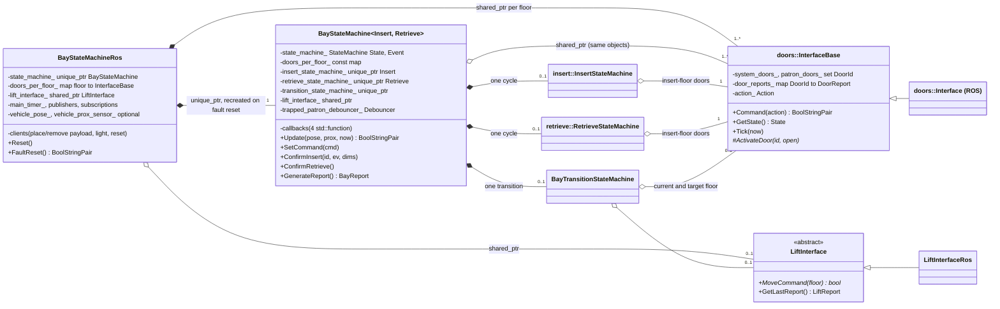
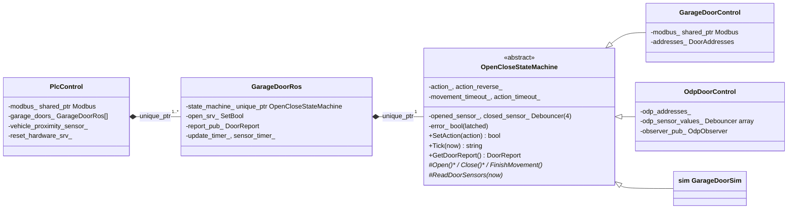
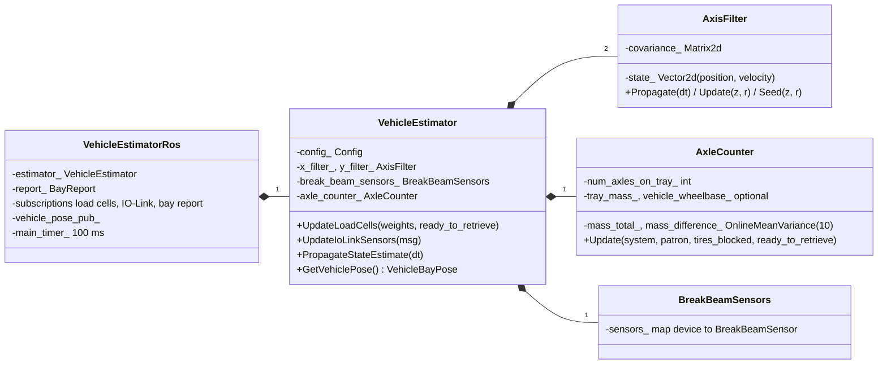
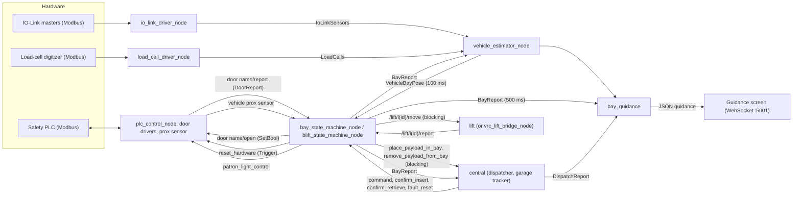
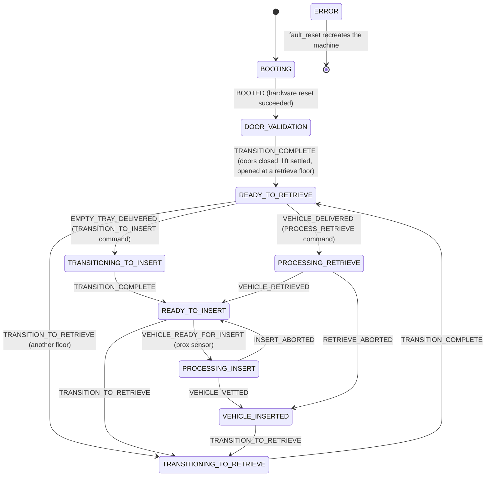
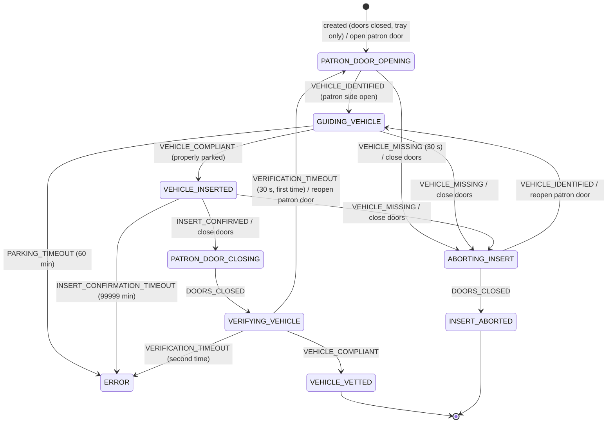
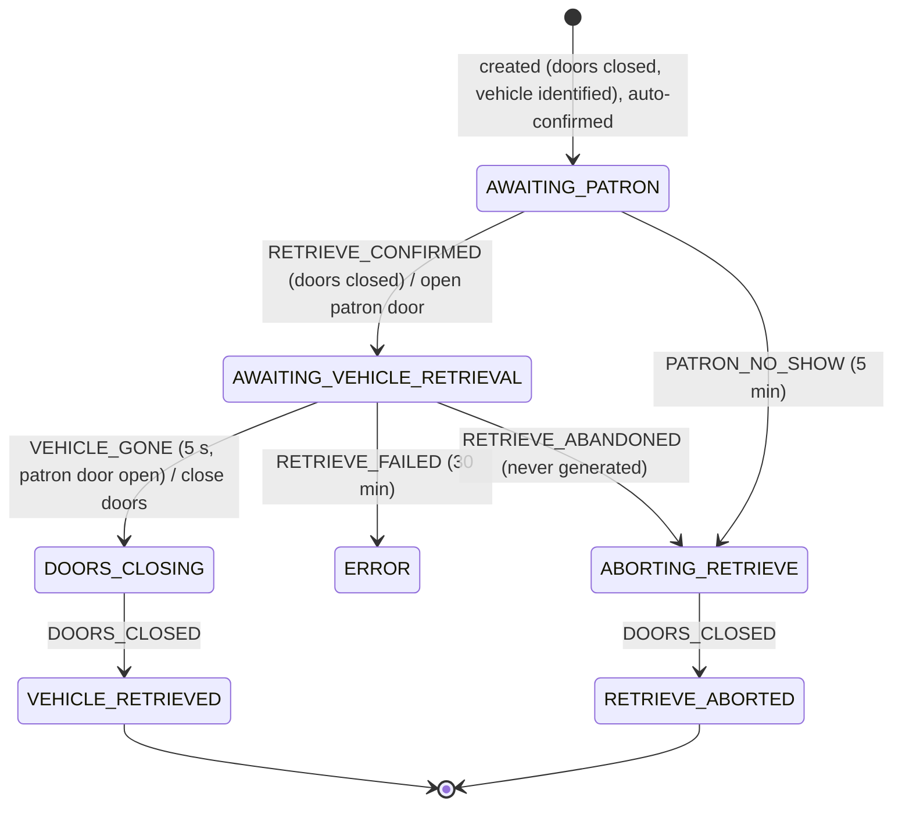
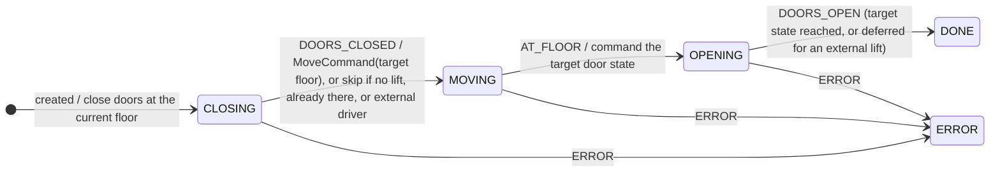
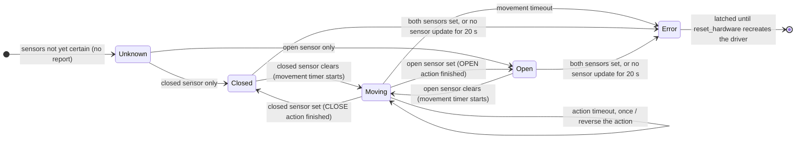
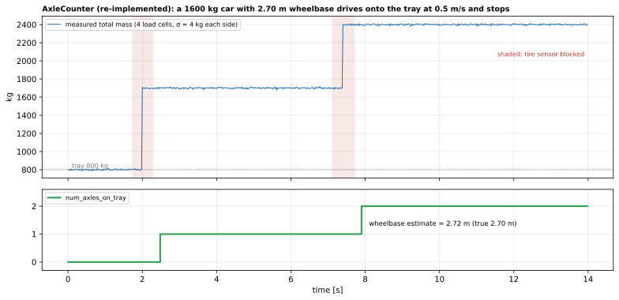

# 23 — `bay`

| Generated | Revision | Source pack | Status |
|---|---|---|---|
| 2026-10-07 | 3 | `P23-bay-part1of3.md`, `-part2of3.md`, `-part3of3.md` (all 3 parts) | **Complete** (all parts). Draft, generated by Claude, not yet reviewed by the team |

Package 23 of 37 (bottom-up) · dependency depth 7

**Abbreviations used in this document.** Each is also explained in context where it first matters.

| Abbreviation | Meaning |
|---|---|
| ADC | Analog-to-Digital Converter |
| AGV | Automated Guided Vehicle |
| AL1342 | IO-Link master model (ifm AL1342), not an acronym |
| API | Application Programming Interface |
| ASCII | American Standard Code for Information Interchange (plain text) |
| BLift | bay lift: a bay with its own lift serving several floors (inferred) |
| CoG | Center of Gravity |
| EV | Electric Vehicle |
| GSL | Guidelines Support Library |
| `gtest` | GoogleTest |
| IFM | ifm electronic (sensor manufacturer, company name) |
| IO | Input/Output |
| IP | Internet Protocol (as in IP address) |
| IR | infrared |
| JSON (`json` in names) | JavaScript Object Notation |
| KaTeX | a math-typesetting library used to check the formulas (a name, not an acronym) |
| MCS | model prefix of the Flintec MCS-08EN load-cell digitizer, not an acronym |
| NaN | Not a Number |
| ODP | not expanded in the code; the overdrive door-and-platform unit of a bay (inferred) |
| PLC | Programmable Logic Controller |
| `py` | Python (the `.py` file extension; also in names such as `common_py`) |
| `rclcpp` | ROS Client Library for C++ |
| `rclcppx` | "rclcpp extensions" (Volley package) |
| `rclpy` | ROS Client Library for Python |
| ROS (`ros` in names) | Robot Operating System |
| `sim` | simulation / simulator (also the `sim` package) |
| `stdx` | "standard library extensions" (Volley package) |
| TCP | Transmission Control Protocol |
| VRC (`vrc` in names) | Vertical Reciprocating Conveyor (a freight lift between floors) |
| WebSocket | full-duplex message protocol over a single TCP connection (a protocol name) |
| YAML (`yaml` in names) | YAML Ain't Markup Language |

Workspace dependencies: bay_interfaces (13), common (01), common_ros (18), interfaces (11), launcher (not yet documented), rclcppx (02), stdx (03), structures (05), vrc_interfaces (04).
Used by: sim.

Related documents:
- `13-bay_interfaces.md`: the bay's sensor messages, and the load-cell center-of-mass math this package relies on;
- `05-structures.md`: `StateMachine`, `Debouncer`, `OnlineMeanVariance`, used throughout;
- `11-interfaces.md`: `BayReport`, `BayCommand`, `VehicleBayPose`, `DoorReport`;
- `21-planner_core.md` and `18-common_ros.md`: how the scheduler and the safety checker see bay states.

**Missing input.** The task mentions an attached `bay.md` (repository docs, possibly stale), but it **was not included in the upload**.

**Coverage.** This revision covers **all three parts**: all headers and sources (parts 1–2), and the 16 test files (part 3). The part-3 test sources were compressed to test names and comments, so section 8 describes coverage and intent, not exact assertions. Revision 2 added the door state machine, the estimator's equations, the lift bridge, and R12–R19. Revision 3 adds the tests, and records that R12 and R13 are *intended and tested* door behavior.

**How to read the evidence markers.**
- **[read]** means the conclusion comes from reading the source.
- **[probed]** means it was confirmed by running code: the axle counter was re-implemented line for line and run on a synthetic drive-on (Figure 7.2), and the package's own `axis_filter.cpp` was compiled and run with zero noise parameters (R16).

The package needs ROS and bay hardware or its simulation, so it was not built here. The Mermaid diagrams pass the Mermaid 11 parser, and the formulas pass KaTeX.

---

## A. External dependencies

`bay` runs a **parking bay**: the room where a patron drives a car onto a tray (insert) or collects it (retrieve). A bay has:
- a **patron door** on the street side;
- a **system door** on the garage side, plus two **overdrive plates (ODPs)** that bridge the gap for AGVs (Automated Guided Vehicles);
- load cells under the tray;
- break-beam and lidar sensors;
- a patron light;
- a guidance screen;
- for a **BLift** bay, a lift serving several floors.

The package contains the hardware drivers, the vehicle estimator, the guidance display server, and the bay's state machines.

| Name | Description | Version | Link | Usage in this package |
|---|---|---|---|---|
| `structures` (workspace) | Table-driven state machine, debouncer, online statistics (document 05). | Workspace. | — | Every bay state machine; sensor debouncing; mass windows. |
| `common`, `common_ros`, `rclcppx`, `stdx` (workspace) | Documents 01, 18, 02, 03. | Workspace. | — | Constants (tray size and mass), `Modbus`, service-call helpers, topics, logging, `Expected`. |
| `bay_interfaces`, `interfaces`, `vrc_interfaces` (workspace) | Documents 13, 11, 04. | Workspace. | — | Sensor messages; bay, door, lift and payload messages; VRC messages for the lift bridge. |
| rclcpp, rclcpp_components, rclcpp_action, std_srvs | ROS 2 client library, components, actions, standard services. | Same distribution. | https://github.com/ros2/rclcpp | Nodes, timers, services; `SetBool` per door. |
| Modbus (through `common`) | Industrial fieldbus protocol over TCP. | — | — | Safety PLC (doors, ODPs, proximity sensor), IO-Link masters, load-cell digitizer. |
| Boost.Asio / Boost.Beast | Asynchronous I/O and WebSocket. | Boost (1.83 on Ubuntu 24.04). | https://www.boost.org/libs/beast | Guidance WebSocket server. |
| nlohmann/json | JSON (JavaScript Object Notation). | System. | https://github.com/nlohmann/json | Guidance payload. |
| Eigen | Linear algebra. | System. | https://eigen.tuxfamily.org | Kalman filters. |
| yaml-cpp | YAML parser. | System. | https://github.com/jbeder/yaml-cpp | Floor-spec files. |
| ament_index_cpp | Package share lookup. | Same distribution. | — | Floor specs in `<launcher share>/params/`. |
| GSL (`libmsgsl-dev`) | Guidelines Support Library. | System. | https://github.com/microsoft/GSL | Declared; no use seen in the sources. |
| GoogleTest, launch_testing | Unit and launch tests. | Not pinned. | — | 15 gtest targets and `bay_reset.test.py`. |

---

## B. Glossary

| Term | Meaning | Where it shows up |
|---|---|---|
| Insert | A patron drives a car onto the empty tray in the bay and leaves; the system then takes the tray away. | `insert::InsertStateMachine` |
| Retrieve | The system delivers a tray with a car; the patron enters and drives it out. | `retrieve::RetrieveStateMachine` |
| Patron door / system door | The street-side and garage-side doors. | `doors::InterfaceBase` |
| ODP | Overdrive plate: one of two plates on the system side that open together with the system door so an AGV can pass. | `OdpDoorControl` |
| Doors state | One consolidated state of all doors on a floor: closed, system open, patron open, system closed, patron closed, error, unknown. | `doors::State` |
| BLift | A bay with a lift, whose floors can support insert, retrieve, or both. | `BliftStateMachineComponent`, `FloorSpec` |
| Floor spec | Per-floor configuration: which operations are supported, and which doors (with PLC addresses) exist. | `FloorSpec` |
| External lift driver | A BLift whose lift is moved by the scheduler (a VRC), with the bay only observing it. | `external_lift_driver_` |
| Tire sensor | A break-beam sensor just outside a tray edge; tripped while a tire crosses the edge. | `AxleCounter`, `BreakBeamSensors` |
| Boundary lidar | A laser sensor detecting whether something is outside the parking window. | `BreakBeamSensors` |
| Vehicle bay pose | The estimator's output: vehicle position, velocity, size, mass, axles, flags. | `VehicleBayPose` (document 11) |
| Guidance | The screen telling the patron how to drive in and when to leave. | `BayGuidance` |
| Patron light | Red, green or flashing light at the bay entrance. | `LightControlOnStateTransition` |
| Fault reset | The service that recreates the bay state machine after `ERROR`. | `FaultReset` |
| IO-Link | A point-to-point protocol for industrial sensors; masters expose ports over Modbus. | `IoLinkMaster` |

---

## 1. Summary

`bay` provides **eight ROS components** that together operate one parking bay:

| Component (executable) | Role |
|---|---|
| `bay_state_machine_node` / `blift_state_machine_node` | The bay's **main state machine** (`BayStateMachine`) and its ROS wrapper: commands from the dispatcher, insert and retrieve cycles, the doors and lift, the patron light, reporting. |
| `plc_control_node` | Drives the doors and ODPs, and reads the proximity sensor, through the **safety PLC** over Modbus. |
| `io_link_driver_node` | Reads the IO-Link sensors (lidars, break beams, sonar) and publishes `IoLinkSensors`. |
| `load_cell_driver_node` | Reads the four tray load cells. |
| `vehicle_estimator_node` | Fuses load cells and sensors into a **vehicle pose** (Kalman filters on the center of gravity, axle counting). |
| `bay_guidance` component | Chooses what the guidance screen shows, and **broadcasts it over WebSocket**. |
| `vrc_lift_bridge_node` | Bridges a VRC (Vertical Reciprocating Conveyor) to the bay's lift interface (section 3.8). |

`sim` uses the simulated doors and the state machines to run bays without hardware.

**The design** is described in the code's own comments:
- **The main state machine has no way out of `ERROR`.** The ROS layer instead *recreates* the whole object on a fault reset, so no member variable needs resetting logic.
- **The insert, retrieve and transition machines are single-use objects**, created for one cycle and destroyed afterwards. They only move forward, or end in an error or abort.
- **The main machine is a template over the insert and retrieve machines**, so tests can inject fakes.
- **All calls to the outside world** (central's payload services, the patron light) are function objects passed in at construction, so the state machine needs no ROS to test.

**What parts 1–2 show about quality.** The safety logic is explicit:
- the doors interface never opens one side unless the other is closed;
- doors on a non-current floor must be closed;
- stale sensor data is an error;
- an unexpected object in a waiting bay opens the patron door and stops.

The findings so far:
- **A rejected `TRANSITION_TO_RETRIEVE` still queues the transition event** (R1): an invalid floor is reported as rejected, but the bay moves anyway, to the *previous* command's floor.
- **Blocking service calls from the main timer** require a multi-threaded executor (R2).
- **`bay_id` is read with `Param`, so a missing value silently becomes bay 0** (R3).
- **Door commands are dropped without error if the door's service is not ready** (R4).
- **The "vehicle ready for insert" notification is a no-op**, since central does not expose that endpoint (R5).

Part 2 adds:
- **A door that is commanded but never starts moving never times out**, so the bay can wait forever without an error (R12). Reverse-on-timeout can repeat indefinitely (R13).
- **`PlcControl` crashes if its first Modbus connection fails** (R14).
- **"Properly parked" ignores position**, since the position limits are defined but unused (R15).
- **Missing estimator parameters give NaN vehicle poses** (R16, **[probed]**).
- **Payload length and width are the bounding-box constants, not measurements** (R17).

---

## 2. Files

The packs contain 83 files: 67 sources, headers and build files (parts 1–2), and 16 test files (part 3). Line counts are from the packs, which have blank lines removed.

| Path (under `src/bay/`) | Lines | Role |
|---|---:|---|
| `include/bay/sim/garage_door_sim.hpp` | 136 | Simulated garage door (`OpenCloseStateMachine` with timed motion); per-bay door timings from parameters. |
| `include/bay/sim/perfect_doors.hpp` | 20 | Doors that report the commanded state immediately (for tests and simulation). |
| `include/bay/bay_floor_spec.hpp` | 59 | `FloorSpec` (floor number, insert/retrieve support, patron and system doors with PLC addresses); YAML loader; default single-floor bay. |
| `include/bay/bay_guidance.hpp` | 50 | `GuidanceState` and the `BayGuidance` node class. |
| `include/bay/bay_insert_state_machine.hpp` | 114 | Insert cycle state machine, its timeouts, and the vehicle-pose predicates. |
| `include/bay/bay_msgs.hpp` | 46 | Short aliases for the message and service types used. |
| `include/bay/bay_retrieve_state_machine.hpp` | 88 | Retrieve cycle state machine and its timeouts. |
| `include/bay/bay_state_machine.hpp` | 807 | The main bay state machine (header-only template over the insert and retrieve machines), commands, safety checks, patron light. |
| `include/bay/bay_timings.hpp` | 10 | Main loop 500 ms (1 s while booting); guidance and estimator 100 ms. |
| `include/bay/bay_transition_state_machine.hpp` | 183 | Close doors → move lift → open doors, for floor and mode changes. |
| `include/bay/break_beam_sensor.hpp` | 29 | Debounced break-beam sensors (tripped until proven otherwise). |
| `include/bay/doors_interface_base.hpp` | 81 | Consolidated doors state and actions per floor; the patron/system interlock. |
| `include/bay/doors_interface.hpp` | 20 | ROS implementation: one `SetBool` client and one report subscription per door. |
| `include/bay/garage_door_control.hpp` | 37 | Hardware door driver over Modbus to the safety PLC (Programmable Logic Controller). |
| `include/bay/garage_door_ros.hpp` | 31 | ROS wrapper for one door: tick timer, `open` service, report publisher. |
| `include/bay/guidance_payload.hpp` | 63 | JSON payload for the guidance display (`bay_guidance.schema`). |
| `include/bay/guidance_websocket_server.hpp` | 57 | Boost.Beast WebSocket broadcaster for the guidance screen. |
| `include/bay/io_link_driver.hpp` | 39 | IO-Link driver node: reads configured masters and publishes `IoLinkSensors`. |
| `include/bay/io_link_master.hpp` | 48 | One 8-port IFM AL1342 IO-Link master over Modbus; device verification. |
| `include/bay/lift_interface_ros.hpp` | 43 | `LiftInterface` over ROS: `/lift/l<id>/move` (blocking call) and `/lift/l<id>/report`. |
| `include/bay/lift_interface.hpp` | 29 | Abstract lift: `MoveCommand(floor)`, last report. |
| `include/bay/load_cell_driver.hpp` | 48 | Flintec MCS-08EN load-cell digitizer over Modbus; zero and calibrate services. |
| `include/bay/odp_door_control.hpp` | 59 | Overdrive-plate (ODP) door driver with extra ODP sensors and an observer topic. |
| `include/bay/open_close_state_machine.hpp` | 114 | Base class for a two-sensor door: debouncing, open/close actions, reverse-on-timeout, error latch. |
| `include/bay/plc_control.hpp` | 38 | PLC node: owns the door drivers, the vehicle proximity sensor and the hardware reset service. |
| `include/bay/plc_modbus_addresses.hpp` | 143 | Door and ODP Modbus address structures; the door-architecture comment. |
| `include/bay/vehicle_proximity_sensor.hpp` | 23 | Patron-side vehicle proximity (IR) sensor read from the PLC. |
| `src/axle_counter.cpp` | 123 | Axle counting from load-cell mass steps around tire-sensor trips; tray detection; wheelbase estimate. |
| `src/bay_floor_spec.cpp` | 88 | Floor-spec YAML parsing and validation. |
| `src/bay_guidance_component.cpp` | 16 | `bay_guidance` component entry point. |
| `src/bay_guidance.cpp` | 266 | Guidance state selection from bay report, dispatch report and vehicle pose; WebSocket broadcast. |
| `src/bay_insert_state_machine.cpp` | 146 | Insert machine: initial checks, events, timeouts. |
| `src/bay_retrieve_state_machine.cpp` | 78 | Retrieve machine: initial checks, events, timeouts. |
| `src/bay_state_machine_component.cpp` | 26 | `bay_state_machine_node`: single-floor bay, parameter `bay_id`. |
| `src/blift_state_machine_component.cpp` | 40 | `blift_state_machine_node`: multi-floor BLift bay with a lift and a floor-spec file. |
| `src/break_beam_sensor.cpp` | 52 | Break-beam debouncing; boundary lidar and tire sensor groups. |
| `src/doors_interface_base.cpp` | 177 | Doors state calculation, staleness, command processing with interlock. |
| `src/doors_interface.cpp` | 58 | ROS doors interface; asynchronous `SetBool` calls; 500 ms tick. |
| `src/garage_door_control.cpp` | 67 | Modbus reads of door sensors; coil writes for open/close. |
| `src/guidance_websocket_server.cpp` | 146 | WebSocket sessions, write queue, broadcast via the I/O context. |
| `src/io_link_driver_component.cpp` | 26 | `io_link_driver_node` entry point. |
| `include/bay/axis_filter.hpp` | 43 | Two-state Kalman filter (position, decaying velocity) for one axis. |
| `include/bay/bay_state_machine_ros.hpp` | 81 | ROS wrapper of the bay state machine: services, clients, topics, reset. |
| `src/axis_filter.cpp` | 48 | Kalman propagate, update and seed. |
| `src/garage_door_ros.cpp` | 48 | Door tick timer, `open` service, report publishing. |
| `package.xml` | 36 | Dependencies (includes `rclpy` and `rclcpp_action`, `libmsgsl-dev`). |
| `include/bay/axle_counter.hpp` | 111 | `AxleCounter` and its assumptions (with an ASCII sketch of the tray). |
| `include/bay/vehicle_estimator_ros.hpp` | 28 | Estimator node: subscribes to load cells, IO-Link sensors and bay report; publishes `VehicleBayPose`. |
| `include/bay/vehicle_estimator.hpp` | 65 | `VehicleEstimator`: CoG Kalman filters, axle counter, break beams, bounding box and height lidars. |
| `src/bay_state_machine_ros.cpp` | 262 | Main timer, hardware reset on boot, central service calls, commands, confirm insert/retrieve, fault reset. |
| `CMakeLists.txt` | 245 | Three libraries, eight components, 15 gtest targets and a launch test. |
| `src/io_link_driver.cpp` | 215 | IO-Link polling and publishing. |

The part-2 files follow.

| Path (under `src/bay/`) | Lines | Role |
|---|---:|---|
| `src/sim/garage_door_sim.cpp` | 144 | Simulated door: timed open/close (real-time and fast variants), an `error` service per door, sensor updates every 100 ms. |
| `src/sim/perfect_doors.cpp` | 55 | Doors that complete any action at once unless blocked or errored. |
| `src/io_link_master.cpp` | 249 | IO-Link master setup over Modbus: access rights, port modes, device and vendor id verification, diagnostics; throws on any mismatch. |
| `src/load_cell_driver_component.cpp` | 31 | `load_cell_driver_node`: `bay.load_cells.{address, port, scale}`. |
| `src/load_cell_driver.cpp` | 258 | MCS-08EN setup (weight mode, fast filter), 50 Hz sampling, reconnects throttled to 1 s, zero and calibrate services. |
| `src/odp_door_control.cpp` | 144 | ODP driver: PLC bits and coils, ODP observer topic, error on bay e-stop. |
| `src/open_close_state_machine.cpp` | 144 | Two-sensor door state, action handling, action timeout with one reversal, movement timeout, sensor staleness, latched error. |
| `src/plc_control_component.cpp` | 53 | `plc_control_node`: `bay_id`, `bay.plc.{ip, port}`, `bay.floor_spec_file`. |
| `src/plc_control.cpp` | 105 | Door drivers per floor spec (Rytec, LiftMaster, ODP, mock), proximity sensor, `reset_hardware`, error-all-doors on any door error. |
| `src/plc_modbus_addresses.cpp` | 58 | Default and "budget" door address sets. |
| `src/vehicle_estimator_component.cpp` | 33 | `vehicle_estimator_node`: the seven `bay.estimator.*` parameters. |
| `src/vehicle_estimator_ros.cpp` | 52 | Subscriptions, 100 ms propagate-and-publish, suppressed when inputs are older than 10 s. |
| `src/vehicle_estimator.cpp` | 207 | CoG from the four load cells into the axis filters; error flags; parked criteria. |
| `src/vehicle_proximity_sensor.cpp` | 28 | Reads two PLC input bits and publishes `VehicleProxSensor`. |
| `src/vrc_lift_bridge_component.cpp` | 133 | `vrc_lift_bridge_node`: VRC report → lift report, lift move service → VRC move action. |

The test files (part 3) follow. Line counts are for the compressed test sources.

| Path (under `src/bay/`) | Lines | Role |
|---|---:|---|
| `test/axle_counter_tests.cpp` | 93 | 9 tests: initialization, drive on and off, wrong tray mass, missing tire sensors, saturation at two axles, too little mass, rest, noisy measurements, ready to retrieve. |
| `test/axis_filter_tests.cpp` | 29 | 7 tests: initialization, reset, seeding with and without velocity, velocity decay, update toward a measurement, constant-velocity tracking. |
| `test/bay_floor_spec_tests.cpp` | 20 | 4 tests: default spec, loading the default and a VRC spec, a bad spec. |
| `test/bay_guidance_tests.cpp` | 145 | 12 tests: each guidance state, door state and vehicle characteristics relayed, reasons for steering and reversing. |
| `test/bay_insert_state_machine_tests.cpp` | 169 | 19 tests: nominal and error transitions, failed preconditions, timeouts, the guiding loophole, not aborting while sensors trip, abort. |
| `test/bay_reset.test.py` | 68 | Launch test: fake door, ODP and reset services; fault reset refused in `BOOTING` and `READY_TO_RETRIEVE`. |
| `test/bay_retrieve_state_machine_tests.cpp` | 84 | 8 tests: nominal and error transitions, preconditions, broken doors, retrieve failure, confirmation only once. |
| `test/bay_state_machine_tests.cpp` | 406 | 33 tests: every main state and transition, commands and command ids, bad doors, stale inputs, trapped patron, startup validation, BLift without doors. |
| `test/bay_transition_state_machine_tests.cpp` | 90 | 4 tests: standard transitions both ways; a BLift deferring the target door until the lift is at the floor. |
| `test/break_beam_sensor_tests.cpp` | 23 | 2 tests: one sensor, the sensor group. |
| `test/doors_interface_tests.cpp` | 92 | 6 tests: interface, blocked doors, fewer doors, door states, open commands waiting for all reports, door report. |
| `test/garage_door_sim_tests.cpp` | 41 | 5 tests: creating simulated doors, instant doors, open and close actions, interface. |
| `test/guidance_websocket_server_tests.cpp` | 17 | 1 test: a connected client receives a broadcast. |
| `test/open_close_state_machine_tests.cpp` | 129 | 14 tests: initialization, state calculation, transitions, timeouts, sensor staleness, sensor errors, self-moving door. |
| `test/vehicle_estimator_ros_tests.cpp` | 19 | 1 test: the node initializes. |
| `test/vehicle_estimator_tests.cpp` | 117 | 6 tests: initialization, propagation, a full insert, error conditions, height, CoG by axle count. |

`schemas/bay_guidance.schema` (referenced by the guidance payload) and the launch files were not in the packs.

---

## 3. Public API

Everything is in namespace `bay` (sub-namespaces `bay::insert`, `bay::retrieve`, `bay::doors`, `bay::open_close`, `bay::timings`). Most consumers use the ROS interface in 3.1; `sim` also uses the C++ classes directly.

### 3.1 ROS interface of the bay state machine — `BayStateMachineRos`

| Kind | Name | Type | Behavior |
|---|---|---|---|
| Service | `command` | `interfaces/srv/BayCommand` | `SetCommand`: `TRANSITION_TO_INSERT`, `PROCESS_RETRIEVE`, `TRANSITION_TO_RETRIEVE` (to a floor). Duplicate `command_id`s are `IGNORED`, which the service reports as success. A successful `PROCESS_RETRIEVE` logs a `PAYLOAD_DELIVERED` garage event. |
| Service | `confirm_insert` | `interfaces/srv/SetPayloadInfo` | The patron confirmed the car: payload id, EV (Electric Vehicle) charging request, and optional dimension override (all-zero means "use the sensed values"). It calls central's `place_payload_in_bay` first, and confirms only if that succeeds. |
| Service | `confirm_retrieve` | `std_srvs/srv/Trigger` | Confirms a retrieve. The main machine already confirms automatically when a retrieve starts. |
| Service | `fault_reset` | `std_srvs/srv/Trigger` | Allowed only in `ERROR`: recreates the state machine. |
| Client | `/central/place_payload_in_bay` | `interfaces/srv/PlacePayloadInBay` | Blocking call, in a separate callback group. |
| Client | `/central/remove_payload_from_bay` | `SetUInt32` | Blocking call, after a retrieve completes. |
| Client | `patron_light_control` | `bay_interfaces/srv/PatronLightControl` | Asynchronous, on every state change. |
| Client | `reset_hardware` | `Trigger` | Called while booting; success sends `BOOTED`. |
| Subscription | vehicle bay pose (`TopicBayVehiclePose`), vehicle proximity sensor | `VehicleBayPose`, `VehicleProxSensor` | Latest values are stored. The machine runs only once both have arrived. |
| Publication | bay report (`TopicBayReport`), version info | `BayReport`, `VersionInfo` | Every main-timer tick. |
| Timer | main | 1 s while booting, then 500 ms | Hardware reset while booting; `Update`; reports. |

Each floor's doors are a `doors::Interface`: a `SetBool` client `<door name>/open` and a subscription `<door name>/report` per door, with a 500 ms tick. For a BLift, `LiftInterfaceRos` uses `/lift/l<bay id>/move` (blocking) and `/lift/l<bay id>/report`.

### 3.2 The main state machine — `BayStateMachine<Insert, Retrieve>` (`bay_state_machine.hpp`)

**Constructor inputs:**
- the doors per floor;
- the insert floor and retrieve floors;
- an optional `LiftInterface`, and whether the lift is driven externally;
- four callbacks: `vehicle_ready_for_insert`, `remove_payload_from_bay`, `place_payload_in_bay`, `patron_light_control`.

Configuration errors (no retrieve floor; several retrieve floors without a lift; separate insert and retrieve floors without a lift) queue an immediate `ERROR`.

| Member | Behavior |
|---|---|
| `Update(pose, prox, now)` | Collects events and runs one state-machine update (section 4c): stale inputs, door and lift consistency, the trapped-patron check, the vehicle at the patron door, the insert/retrieve/transition sub-machines, and queued external events. While `BOOTING` or `DOOR_VALIDATION`, stale inputs just skip the update. |
| `SetCommand(cmd)` | Validates the command against the state, the sensed tray and vehicle, and the lift, then queues an event (R1). |
| `ConfirmInsert(payload_id, ev, override)` | Requires a running insert and a properly parked vehicle. Builds the payload from the sensed dimensions (or the override), calls `place_payload_in_bay`, then confirms. |
| `ConfirmRetrieve()` | Confirms a running retrieve (`ACCEPTED`, or `IGNORED` if already confirmed). |
| `GenerateReport()` | `BayReport`: per-floor door states, main state, the running sub-machine's state, last command and its status, current and insert floors. |
| `Booted()` | Queues `BOOTED`. |

**Patron light** by state:
- off while booting and validating doors;
- **green** while ready to insert or processing an insert;
- **red** while ready to retrieve, transitioning to insert, processing a retrieve, or holding an inserted vehicle;
- **slow red flashing** (750 ms) while transitioning to retrieve, and fast (200 ms) in `ERROR`.

The light also turns red when the insert machine starts guiding a vehicle.

### 3.3 The cycle state machines

| Machine | Starts when | Requires at start (else `ERROR` at once) | Ends in |
|---|---|---|---|
| `insert::InsertStateMachine` | A vehicle is outside the patron door (prox sensor) while `READY_TO_INSERT` | Doors closed; only an empty tray in the bay | `VEHICLE_VETTED`, `INSERT_ABORTED` or `ERROR` |
| `retrieve::RetrieveStateMachine` | After the transition to the insert floor completes during `PROCESSING_RETRIEVE` | Doors closed; a vehicle identified | `VEHICLE_RETRIEVED`, `RETRIEVE_ABORTED` or `ERROR` |
| `BayTransitionStateMachine` | Any change of floor or of door mode | — | `DONE` or `ERROR` |

The insert machine advances at most one transition per update, and the transition machine feeds its events one at a time. Timeouts are in section 7.4.

### 3.4 Doors — `doors::InterfaceBase` and the door drivers

**`InterfaceBase`** consolidates one floor's doors into a single state (section 7.3) and runs one action at a time:
- `CLOSE_DOORS` closes everything.
- `OPEN_SYSTEM` first closes the patron doors, then opens the system doors and ODPs.
- `OPEN_PATRON` first closes the system doors and ODPs, then opens the patron doors.

`Command` refuses an open action for a side with no doors on that floor. `Tick` marks any door report older than 20 s as an error, and re-issues commands until the target state is reached and all doors are stationary.

**Door hardware architecture** (from the comment in `plc_modbus_addresses.hpp`):
1. The interface sends `SetBool` to each door's `open` service.
2. `GarageDoorRos` runs one door's `OpenCloseStateMachine` (debouncing its open and closed sensors, timeouts, reverse-on-timeout) and publishes its `DoorReport`.
3. `GarageDoorControl` or `OdpDoorControl` writes and reads PLC coils and bits over Modbus.

`PlcControl` (`plc_control_node`) owns these drivers, the vehicle proximity sensor, and the `reset_hardware` service:
- **Driver per door type:** Rytec and LiftMaster doors get a `GarageDoorControl` (movement and action timeouts 30 s / 30 s); ODPs get an `OdpDoorControl` (30 s / 15 s, plus extra sensors, and an error on bay e-stop); `MOCK` doors get a simulated door with zero travel time.
- **Every 100 ms (steady clock):** read the proximity sensor; if any door has errored, **error all doors**, so that everything stops.
- **`reset_hardware`:** reconnect Modbus if needed, then recreate every door driver and the proximity sensor. The bay state machine calls it while booting, and a fault reset passes through booting again, so that is the only way to clear a latched door error.

**`OpenCloseStateMachine`** (section 4c, section 7.6):
- debounces the two sensors (4 readings);
- derives the door state from them;
- re-issues `Open()`/`Close()` every tick while an action is pending;
- reverses the action **once** if it has been moving for longer than the action timeout;
- latches an error on a sensor conflict, a movement longer than the movement timeout, or no sensor update for 20 s.

### 3.5 Sensing — `VehicleEstimator`, `AxleCounter`, `AxisFilter`, `BreakBeamSensors`

- **`VehicleEstimator`** (configured with the filter noises, parking bounding box and height-lidar mounting heights):
  - takes load-cell readings, IO-Link readings and periodic propagation;
  - outputs a `VehicleBayPose`: the center of gravity relative to the tray center ($+x$ toward the system side, $+y$ to the left facing the system side), velocities, axles, flags.

  Before any reading, $x = -L_\text{tray}/2$. With one axle, $x$ is the front axle; with two, it is the center of gravity (section 7.5).
- **Estimator outputs** (`vehicle_estimator.cpp`):
  - **Center of gravity:** from the four corner cells, once the payload exceeds 100 kg. It is fed to the axis filters, reseeded whenever the axle count changes.
  - **Height:** the *mounting height of the tallest tripped height lidar* (a lower bound), or a default.
  - **Length and width:** the *bounding-box size* whenever the box is clear; these are not measurements (R17).
  - **Error flags:** overweight (> 6200 lb), too long, too wide, wheelbase too long, too tall, and each boundary lidar or tire sensor tripped.
  - **`vehicle_is_properly_parked`:** tray and vehicle present, speeds below 0.5 and 0.25 m/s, bounding box clear, both axles on the tray, and no error flags. The position limits defined in the file are not used (R15).
- **`VehicleEstimatorRos`** propagates and publishes every 100 ms, and suppresses publication while the load-cell or IO-Link data are older than 10 s.
- **`AxleCounter`** counts axles on the tray from mass steps around tire-sensor trips, detects the tray, and estimates the wheelbase (section 7.2).
- **`AxisFilter`** is a two-state Kalman filter per axis (section 7.1).
- **`BreakBeamSensors`** debounce every break beam, and count a sensor as *tripped until proven clear*.

### 3.6 Guidance — `BayGuidance`, `GuidanceWebSocketServer`

Every 100 ms, `BayGuidance` picks a `GuidanceState` from the bay report, the dispatch report and the vehicle pose: `ERROR`, `DO_NOT_ENTER`, `WELCOME`, `GUIDING`, `PARKING_COMPLETE`, `INSERT_EXIT`, `RETRIEVE_EXIT` or `CANNOT_PARK`.

**How it decides:**
- **Freshness:** stale inputs mean `ERROR` (bay report older than 1.5 s, dispatch report older than 3 s, pose older than 300 ms).
- **While guiding:** any boundary lidar tripped means `GUIDING`. The side lidars are ignored after the first 2 s of `PARKING_COMPLETE`, because open car doors and the patron trip them.
- **After parking:** after 10 s of `PARKING_COMPLETE`, it shows `INSERT_EXIT` and keeps showing it.

The payload (state, lidars, tire sensors, axles, door state, vehicle pose, velocity, dimensions, mass) is serialized to JSON and broadcast to every connected display over WebSocket. The default is `0.0.0.0:5001`; clients are never read from.

### 3.7 Configuration — `FloorSpec` (`bay_floor_spec.hpp`)

A BLift's floor spec is a YAML file under `<launcher share>/params/`. Each floor has a number, `insert` and `retrieve` flags, and lists of patron and system doors with their PLC addresses and type (`rytec` or `odp`). Exactly one floor must support insert. Door ids must be unique per floor, and names unique across floors. `DefaultFloorSpec()` is the standard single-floor bay: patron door, system door and two ODPs.

### 3.8 The VRC lift bridge — `vrc_lift_bridge_node`

A BLift whose carriage is a VRC (document 17) talks to it through this bridge, which converts between the bay's lift protocol and the VRC's.

**Reports:** `/vrc/r<vrc_id>/report` (`VrcReport`, best effort) → `/lift/l<bay_id>/report` (`LiftReport`). The floor is the VRC's `current_floor`, and the state is mapped as follows:

| VRC state | Lift state |
|---|---|
| `INITIALIZING` | `RESET` |
| `IDLE` | `AT_FLOOR` |
| `MOVING` | `MOVING` |
| `CLOSING` | `AT_FLOOR` if the requested floor equals the current one (closing in place), otherwise `MOVE_REQUEST` |
| `OPENING` | `OPENING` |
| anything else (disabled, error, unknown) | `ERROR` |

**Moves:** the `/lift/l<bay_id>/move` service (`SetUInt8`) sends a `VrcMove` action goal to `/vrc/r<vrc_id>/move`. It waits up to 2 s for the action server and up to 5 s for goal acceptance, and **succeeds once the goal is accepted**, not when the carriage arrives. The bay learns of arrival from the lift report (`AT_FLOOR` at the target floor), which also sidesteps the VRC's early goal success (document 17, R1). The action client is in its own callback group.

### 3.9 Hardware drivers — load cells and IO-Link

- **`LoadCellDriver`** (Flintec MCS-08EN digitizer over Modbus TCP):
  - **Startup:** verifies the system and gateway status registers, then puts each ADC into unipolar weight mode with the fast digital filter; any failure throws.
  - **Sampling:** every 20 ms it reads nine registers, checks that all ADCs report "active and OK", and converts each 32-bit reading to kilograms as $2 \times \text{raw} \times \text{scale}$ ("two load cells per digitizer").
  - **Reconnects** are throttled to one per second.
  - **Services:** `zero_load_cells`, `calibrate_load_cells` and `force_calibrate_load_cells`.
- **`IoLinkMaster`** (IFM AL1342, 8 ports): at construction it sets access rights and byte order, configures each port as IO-Link or digital, verifies vendor and device ids and port diagnostics, and throws on any mismatch. At run time it reads two words per configured port.

---

## 4. Diagrams

### 4a. Class diagrams (ownership on edges)

**The bay state machine and what it owns.**

**Door drivers.**

**Vehicle estimation.**

### 4b. Data flow

No package seen so far serves `patron_light_control`; the arrow to `plc_control_node` is an assumption, since `PlcControl` does not offer it either. The service is probably served by another node or package, and the bay only logs a warning when the call fails.

### 4c. State machines

**Main bay state machine** (`BayStateMachine`, table-driven `structures::StateMachine`). Every state also goes to `ERROR` on the `ERROR` event, and `ERROR` has no way out except a fault reset that recreates the object.

`PROCESSING_RETRIEVE` has a hidden first phase: a transition to the insert floor with the doors closed. Only when that finishes is the retrieve machine created ("secret hidden state for retrieves", as the code says).

**Insert cycle** (`insert::InsertStateMachine`). Every state goes to `ERROR` on `ERROR` (doors in error or unknown, system door open, patron door unexpectedly closed while guiding).

**Retrieve cycle** (`retrieve::RetrieveStateMachine`). Every state also goes to `ERROR` on doors in error or unknown.

**Transition** (`BayTransitionStateMachine`):

**One door** (`OpenCloseStateMachine`). The door's *state* comes from its debounced sensors, and its *action* is driven by `Tick`:

---

## 5. Behavior

**Construction.**
- **`bay_state_machine_node`** reads `bay_id` and uses the default floor spec.
- **`blift_state_machine_node`** requires `bay_id` and `bay.floor_spec_file`, reads `bay.external_lift_driver` (default `false`), and creates a `LiftInterfaceRos` whose lift id equals the bay id.
- **`BayStateMachineRos`** builds one doors interface per floor and requires exactly one insert floor (else it throws). It then creates the state machine and starts the main timer at 1 s.

**Boot.**
1. While `BOOTING`, each tick calls `reset_hardware` once the service is ready. On success the machine gets `BOOTED`, and the timer switches to 500 ms.
2. In `DOOR_VALIDATION`, each tick commands every floor's doors closed, and waits until all are closed and idle and the lift is stationary.
3. It then transitions to open the system doors at the current floor, if that is a retrieve floor, or else at the first retrieve floor. A failed transition in this phase is simply retried.

**Steady state.**

| Callback | Period | Work |
|---|---|---|
| Main timer | 500 ms | `Update` with the latest pose and proximity readings; publish `BayReport` and `VersionInfo`. |
| Doors interface tick (per floor) | 500 ms | Staleness check; re-issue door commands. |
| Vehicle estimator | 100 ms (load cells arrive at 50 Hz) | Propagate filters, publish `VehicleBayPose`; each load-cell message updates the filters. |
| PLC control | 100 ms (steady clock) | Proximity sensor; error all doors if one errored; each door's `GarageDoorRos` has its own tick timer. |
| Load-cell driver | 20 ms (steady clock) | Sample and publish; Modbus timeout 500 ms. |
| Guidance | 100 ms | Choose the guidance state and broadcast it. |
| WebSocket I/O thread | — | `std::jthread` running the Boost.Asio I/O context. |

**Blocking calls.** `place_payload_in_bay`, `remove_payload_from_bay` and `/lift/l<id>/move` are blocking `volley::Call`s made from the main timer or service callbacks. Their clients are in separate callback groups, which only helps under a multi-threaded executor (R2).

**Shutdown.** Nothing special. The WebSocket server stops its I/O context in its destructor.

**Parameters** (part 1):

| Parameter | Node | Default |
|---|---|---|
| `bay_id` | both state-machine nodes | read with `Param` (bay node: a missing value becomes 0, R3) or `RequiredParam` (BLift) |
| `bay.floor_spec_file` | BLift | required; empty means the default spec |
| `bay.external_lift_driver` | BLift | `false` |

The other components' parameters, all read with `Param` inside `try` blocks that never catch a missing value (R16):

| Node | Parameters |
|---|---|
| `plc_control_node` | `bay_id`, `bay.plc.ip`, `bay.plc.port`, `bay.floor_spec_file` |
| `vehicle_estimator_node` | `bay.estimator.process_noise.velocity`, `bay.estimator.measurement_noise.load_cells`, `bay.estimator.sensor_bounding_box.{length_m, width_m}`, `bay.estimator.height_lidar.{tall_m, mid_m, short_m}` |
| `load_cell_driver_node` | `bay.load_cells.address`, `bay.load_cells.port`, `bay.load_cells.scale` (0.01 for 10 kN cells, 0.001 for 5 kN) |
| `vrc_lift_bridge_node` | `bay_id`, `vrc_id` |
| simulated doors | `bay.door.open_time`, `bay.door.close_time` |
| `io_link_driver_node` | the IO-Link master configuration (`ReadConfigs`) |

---

## 6. Ownership and safety

### 6.1 Lifetimes

- **`BayStateMachineRos`** owns the state machine (`unique_ptr`, replaced on fault reset). The doors interfaces and the lift are shared between the wrapper and each new machine, so they survive resets.
- **Sub-machines** are owned by the main machine and destroyed at the end of each cycle, or on `ERROR`.
- **The doors interface** owns its ROS clients, subscriptions and timer; its callbacks capture `this` and the door description by value.

### 6.2 Callbacks capturing `this`

- **State-machine callbacks** (light, payload, ready-for-insert) are lambdas capturing the `BayStateMachineRos` `this`, which outlives every machine it creates.
- **`LiftInterfaceRos`** captures `this` in its report subscription, but is declared copyable and movable (`= default`). A copy would share the original's subscription, whose callback writes to the *original* object.
- **`GuidanceWebSocketServer`** must not move after `Start()`, because its handlers capture `this`. The class documents this, and enforces it only by convention.

### 6.3 Locks and atomics

The state machines are single-threaded and have no locks. `LiftInterface::last_report_` is written by the report subscription and read by the main timer; both are in the node's default (mutually exclusive) group, so they do not overlap. The WebSocket server serializes all session access by posting to its I/O context (`net::post`).

### 6.4 Error handling

| Style | Where |
|---|---|
| `ERROR` event with an accumulated message | State machines: inconsistent doors or lift, stale inputs, trapped patron, both cycles running |
| `std::pair<CommandStatus, std::string>` / `BoolStringPair` | Commands, confirmations, door commands, transitions |
| Exceptions | `BayStateMachineRos` (no or several insert floors), `IoLinkMaster` device verification, `doors_per_floor_.at` (a TODO notes it) |
| `exit(1)` | Component constructors on parameter or floor-spec errors |
| Recreate on reset | `FaultReset` replaces the whole machine |

### 6.5 RISK items

| Item | Risk | Evidence |
|---|---|---|
| R1 | **A rejected `TRANSITION_TO_RETRIEVE` still moves the bay.** In `SetCommand`, the `TRANSITION_TO_RETRIEVE` event is queued *before* the requested floor is checked. When the floor is not a retrieve floor, the command is reported `REJECTED` and `last_command_` is not updated, but the queued event still fires on the next `Update`. The transition then uses `last_command_.floor`, the *previous* command's floor. | **[read]** |
| R2 | **Blocking service calls in timer and service callbacks.** `RemovePayloadFromBay` (main timer), `PlacePayloadInBay` (inside `confirm_insert`) and `LiftInterfaceRos::MoveCommand` (main timer, through the transition machine) block on `volley::Call` (document 18: up to 1 s waiting for the service, 5 s for the response). Their clients are in separate callback groups, so this works only under a multi-threaded executor. With a single-threaded one, every call times out. The lift's report subscription and the main timer share the default group, so a blocked timer also delays lift reports. Which executor runs the components is set by the launch configuration, outside this package. | **[read]** |
| R3 | **`bay_id` silently defaults to 0.** `bay_state_machine_node` reads `node->Param<int>("bay_id")` in a `try` block, expecting an exception for a missing parameter, but `common_ros`'s `Param` returns `T{}` instead (document 18, R7). A misconfigured bay reports as bay 0. | **[read]** + document 18 |
| R4 | **Door commands can be dropped silently.** `doors::Interface::ActivateDoor` sends the `SetBool` only if the door's service is ready, and otherwise does nothing. The door then never moves, and the failure surfaces later as a timeout or a doors-state error. The interface re-issues commands every 500 ms, so a briefly unready service recovers. | **[read]** |
| R5 | **The "vehicle ready for insert" callback is a no-op.** `VehicleReadyForInsert` is empty because central does not expose the endpoint, so central learns of a vetted insert only from the bay report. | **[read]** |
| R6 | **Parts of the design are disabled or unfinished.** `RETRIEVE_ABANDONED` is never generated ("not implemented yet"). `kMaxUserInteractionTime` is 99999 min (about 69 days, "set very large for now until we have a recovery plan"). `external_display_state` is always unknown. A `VEHICLE_RETRIEVED_FOR_INSERT` transition is commented out as not working. | **[read]** |
| R7 | **External lift driver: the transition can finish before the doors open.** With `external_lift_driver`, the transition machine treats `MOVING` as done at once, and treats `OPENING` as done without opening the doors when the lift has not arrived. The doors are opened later by `OnExternalLiftMoved`, but only when the bay is in `READY_TO_RETRIEVE`. A transition to retrieve therefore reports `TRANSITION_COMPLETE` with the doors still closed until the carriage arrives. The code intends this, to keep shafts on other floors closed. | **[read]** |
| R8 | **Error messages and logging.** The main machine logs its `ERROR` transition through `rclcpp::get_logger("")`, the root logger, rather than the bay's logger. `CalcDoorsState` does the same, on every evaluation that finds an error. | **[read]** |
| R9 | **Single trapped-patron action.** If something other than an empty tray is sensed for 1 s while `READY_TO_INSERT`, the bay opens the patron door and goes to `ERROR`, using `doors_per_floor_.at(insert_floor_)` (which throws if absent, a noted TODO). Recovery needs a person and a fault reset. | **[read]** |
| R10 | **Duplicate definition.** `kNumLoadCells` is defined as a namespace-scope `constexpr` in both `load_cell_driver.hpp` and `vehicle_estimator.hpp`; a file including both does not compile. | **[read]** |
| R11 | **The lift id is assumed equal to the bay id** in `blift_state_machine_node` (`LiftInterfaceRos(node, bay_id)`). | **[read]** |
| R12 | **A door that never starts moving never times out.** The door state machine measures both its action timeout and its movement timeout from `time_of_movement_started_`, which is updated only when the sensed state *enters* `MOVING`. If a door is commanded but never leaves `CLOSED` (a motor, relay or PLC fault), `Tick` re-issues `Open()` every cycle with no timeout or error. The bay's transition machine has no timeout of its own, so the bay waits in `TRANSITIONING_TO_*` indefinitely while reporting no error. The door behavior is **intended and tested**: `OpenCloseTest.TransitionNoMovementNoTimeout` says "we'll continue to call Open forever as long as the door is closed". The gap is at the bay level, where nothing bounds a transition. | **[read]** + test |
| R13 | **Reverse-on-timeout can repeat.** After a timed-out action is reversed and the reversal completes, `action_reverse_` is cleared but the original `action_` is kept, so the next tick retries the original action. If it times out again, it is reversed again. A door blocked halfway can cycle open-close-open; each new movement restarts the movement timer, so the movement timeout may never fire. This applies to the ODPs (action timeout 15 s, movement timeout 30 s); Rytec and LiftMaster doors have equal timeouts, so the movement error fires first and they never reverse (section 7.6). The retrying is **intended**: `OpenCloseTest.TransitionTimeout` expects the door to try to open again after the reversal completes, until it finally opens. The header describes a single reversal after which "a higher-level module can ask … to close again". In addition, `SetAction(NONE)` is ignored, so an action cannot be cancelled. | **[read]** |
| R14 | **`PlcControl` can dereference null pointers.** If the first Modbus connection fails, `ResetHardware` returns early without creating the proximity sensor, and the 100 ms timer then calls `vehicle_proximity_sensor_->Tick()` on a null pointer, crashing the node. A door type outside Rytec, LiftMaster, ODP and mock yields a null driver, which `GarageDoorRos` then uses. | **[read]** |
| R15 | **"Properly parked" ignores the vehicle's position.** `vehicle_estimator.cpp` defines `kMaxXError` = 2.0 m and `kMaxYError` = 0.1 m with comments explaining them, but `is_vehicle_centered` only checks presence and speed. Lateral position on the tray is therefore enforced only indirectly, by the boundary lidars and tire sensors. | **[read]** |
| R16 | **Missing parameters become zeros, and zero noise gives NaN poses.** All components except the BLift state machine read their parameters with `Param` inside `try` blocks, expecting exceptions that never come (document 18, R7). A missing parameter therefore becomes 0, or an empty string: an empty PLC IP address, port 0, load-cell scale 0 (every mass reads 0), and so on. In particular, a measurement noise of 0 makes the axis filter divide by zero on its second update without propagation, which happens routinely, since load cells update at 50 Hz and propagation runs at 10 Hz. Running the package's own `axis_filter.cpp` with zero noise gives NaN position and velocity **[probed]**. NaN fails every comparison, so the vehicle is never "centered", and inserts time out. | **[probed]** |
| R17 | **The estimator's dimensions are constants, not measurements.** `length` and `width` are the configured bounding-box size whenever the box is clear, and `height` is the mounting height of the tallest tripped height lidar (a lower bound) or a default. `ConfirmInsert` uses these sensed values as the payload's dimensions unless an override is given. Every car therefore gets the same length and width, and the planner's size-class selection (document 18, section 3.1.1) sees the bounding box rather than the car. | **[read]** |
| R18 | **Blocking calls in the lift bridge.** `OnLiftMove` blocks its service callback for up to 7 s (2 s for the action server, 5 s for goal acceptance), while the bay's `LiftInterfaceRos::MoveCommand` waits on it from the bay's main timer (R2). | **[read]** |
| R19 | **Load-cell sampling can stall.** The Modbus timeout is 500 ms against a 20 ms sampling period, so one hung read drops about 25 samples. The estimator then holds its last values until its 10 s staleness limit suppresses publication. | **[read]** |

---

## 7. Math

### 7.1 The axis Kalman filter (`AxisFilter`)

Each axis ($x$ and $y$ of the vehicle's center of gravity) keeps a state and covariance

$$
\mathbf{s} = \begin{bmatrix} p \\ v \end{bmatrix},\qquad P \in \mathbb{R}^{2\times 2},
$$

with a velocity that decays exponentially toward zero at rate $\lambda$ = 0.25 s⁻¹, so the estimate does not drift away while there are no measurements:

$$
\dot p = v,\qquad \dot v = -\lambda v + w,\qquad w \sim \text{white noise with spectral density } q = \sigma_v^2 .
$$

**Propagation over $\Delta t$.** Integrating the deterministic part exactly gives

$$
F = \begin{bmatrix} 1 & \dfrac{1 - e^{-\lambda\Delta t}}{\lambda} \\[4pt] 0 & e^{-\lambda\Delta t}\end{bmatrix},\qquad
\mathbf{s} \leftarrow F\mathbf{s},\qquad P \leftarrow F P F^\top + Q .
$$

The process noise uses the constant-velocity form, ignoring the decay ("slow relative to dt"):

$$
Q = q\begin{bmatrix} \Delta t^3/3 & \Delta t^2/2 \\ \Delta t^2/2 & \Delta t\end{bmatrix}.
$$

**Measurement update** with a position measurement $z$ of variance $r$, so $H = [1\ \ 0]$:

$$
S = P_{00} + r,\qquad K = \frac{1}{S}\begin{bmatrix} P_{00}\\ P_{10}\end{bmatrix},\qquad
\mathbf{s} \leftarrow \mathbf{s} + K(z - p),\qquad P \leftarrow P - K\,P_{0,:},\qquad P \leftarrow \tfrac12(P + P^\top).
$$

The last step restores symmetry lost to rounding.

**Seeding.** A position jump says nothing about velocity, so `Seed` replaces $p$ and $P_{00}$ and clears the cross terms, keeping $v$ if one exists. Otherwise it sets $v = 0$ with standard deviation 0.5 m/s.

### 7.2 Counting axles from the load cells (`AxleCounter`)

The four load cells give a system-side sum $m_s$ and a patron-side sum $m_p$. The counter keeps 10-sample windows (0.2 s at 50 Hz) of

$$
M = m_s + m_p\qquad\text{and}\qquad \Delta = m_s - m_p .
$$

**Tray detection.** When no tire sensor is blocked and the window is full and steady ($\sigma_M < 0.15\,m_\text{tray}$, with $m_\text{tray}$ = 800 kg):
- $|\bar M - m_\text{tray}| \le 0.15\,m_\text{tray}$ means a tray is present, with no vehicle on it;
- $\bar M < 0.15\,m_\text{tray}$ means there is no tray;
- when ready to retrieve, $\bar M > m_\text{tray}$ + 500 kg means a tray with a vehicle (two axles).

**Axle steps.** When a tire sensor trips, the counter freezes the mean mass, $M_\text{before} = \bar M$, and discards the windows. When the sensors clear and a full window is available again, it compares:

$$
\bar M > M_\text{before} + \delta \Rightarrow n \leftarrow n + 1,\qquad
\bar M < M_\text{before} - \delta \Rightarrow n \leftarrow n - 1,\qquad
\delta = \max(1.5\,\sigma_M,\ 0.35 \times 500\ \text{kg}),
$$

clamped to $n \in \{0, 1, 2\}$. An axle of at least 175 kg must step the mass by more than 1.5 standard deviations of the window.

**Where an axle is.** For a point mass $m$ at distance $s$ from the patron edge of a tray of length $L$, a fraction $s/L$ of its weight rests on the system-side cells:

$$
\Delta = m\Big(\frac{s}{L}\Big) - m\Big(1 - \frac{s}{L}\Big) = m\,\frac{2s - L}{L}
\quad\Longrightarrow\quad
s = \frac{L}{2} + \frac{L\,\Delta}{2m}.
$$

The tray itself is symmetric, so it adds nothing to $\Delta$. With one axle on, the code records the front axle's mass $m_f = \bar M - m_\text{tray}$ and its first position $s_0$.

**Wheelbase.** When the second axle has just come on, it is assumed to be at about the same position $s_0$ (both axles are first measured just after clearing the same tire sensor), with the front axle a wheelbase $b$ ahead. Moments about the tray center then give

$$
\frac{L}{2}\Delta = m_f\Big(s_0 + b - \frac{L}{2}\Big) + m_r\Big(s_0 - \frac{L}{2}\Big)
\quad\Longrightarrow\quad
b = \frac{\tfrac{L}{2}\Delta + m_r\big(\tfrac{L}{2} - s_0\big)}{m_f} + \frac{L}{2} - s_0,
$$

with $m_r$ = payload mass − $m_f$, which is the code's formula. Re-implementing the counter and driving a 1600 kg car (900 kg front, 700 kg rear, wheelbase 2.70 m) onto the tray at 0.5 m/s, with 4 kg of noise per side, gives one axle, then two, and a wheelbase estimate of **2.72 m** **[probed]**.

*Figure 7.2 — The re-implemented axle counter on a synthetic drive-on: the total mass steps by each axle's weight, while tire sensors are blocked (shaded) the window is discarded, and the count advances once the mass settles after each step. The wheelbase is estimated when the second axle is counted.*

### 7.3 Doors state and the interlock (`doors::InterfaceBase`)

With $\mathcal{P}$ the patron doors, $\mathcal{S}$ the system doors (system door and ODPs), and $d(i) \in$ {closed, open, moving, error} each door's debounced state, the consolidated state is

$$
\text{State} = \begin{cases}
\text{ERROR} & \exists i: d(i) = \text{error, or } i \notin \mathcal{P}\cup\mathcal{S}\\
\text{UNKNOWN} & \text{not every door has reported}\\
\text{DOORS\_CLOSED} & \forall i\in\mathcal{S}\cup\mathcal{P}: \text{closed}\\
\text{SYSTEM\_OPEN} & \forall i\in\mathcal{S}: \text{open} \ \wedge\ \forall j\in\mathcal{P}: \text{closed}\\
\text{PATRON\_OPEN} & \forall j\in\mathcal{P}: \text{open} \ \wedge\ \forall i\in\mathcal{S}: \text{closed}\\
\text{SYSTEM\_CLOSED} & \forall i\in\mathcal{S}: \text{closed} \quad(\text{patron side moving or mixed})\\
\text{PATRON\_CLOSED} & \forall j\in\mathcal{P}: \text{closed} \quad(\text{system side moving or mixed})\\
\text{ERROR} & \text{otherwise (both sides not closed).}
\end{cases}
$$

The cases are tested in this order, and a door report older than 20 s counts as an error.

**The interlock.** `OPEN_SYSTEM` activates the system side only when every patron door reports closed, and otherwise closes the patron side; `OPEN_PATRON` does the reverse. With commands re-issued every tick, the software invariant is

$$
\neg\big(\exists j \in \mathcal{P}: d(j) \neq \text{closed}\ \wedge\ \exists i \in \mathcal{S}: d(i) \neq \text{closed}\big)
$$

as far as the reported states show, and any state violating it is classified as `ERROR`. Whether the safety PLC enforces the same interlock in hardware is not visible in part 1.

### 7.4 Timeouts and debounce counts

| Quantity | Value | Formula |
|---|---|---|
| Trapped-patron detections before error | 10 | $1\ \text{s} / 100\ \text{ms}$ |
| Guidance: `INSERT_EXIT` after | 100 ticks | $10\ \text{s} / 100\ \text{ms}$ |
| Guidance: side lidars checked for | 20 ticks | $2\ \text{s} / 100\ \text{ms}$ |
| Door sensor debounce | 4 readings | — |
| Door report staleness (doors interface) | 20 s | "Liftmaster = 20 s, Rytec = 5 s" |
| Door sensor staleness (door state machine) | 20 s | — |
| Vehicle pose / prox sensor staleness | 5 s / 15 s | — |
| Insert: vehicle missing, verification | 30 s | after the patron door is fully open, no possible vehicle for 30 s |
| Insert: parking | 60 min | $\min(t - t_\text{transition},\ t - t_\text{vehicle swap})$ |
| Retrieve: confirmation, drive-away, door-close delay | 5 min, 30 min, 5 s | — |

### 7.5 The vehicle's center of gravity from the load cells

With the four corner readings $w_{SL}, w_{SR}, w_{PL}, w_{PR}$ (system or patron side, left or right facing the system side), and the cells spanning the full tray ($\ell_x = L_\text{tray}$, $\ell_y = W_\text{tray}$), the payload mass is the total minus the tray's:

$$
M = \sum w - m_\text{tray}.
$$

The tray is centered and adds no moment, so the static balance of section 7.2 (and document 13, section 7) gives the center of gravity directly:

$$
x = \frac{\ell_x}{2}\cdot\frac{(w_{SL} + w_{SR}) - (w_{PL} + w_{PR})}{M},\qquad
y = \frac{\ell_y}{2}\cdot\frac{(w_{SL} + w_{PL}) - (w_{SR} + w_{PR})}{M},
$$

each clamped to $\pm\ell/2$ (a center of gravity outside the cells can only be noise), and computed only when $M \ge$ 100 kg. With independent cell noise of variance $r$, each difference has variance $4r$, so the measurement variance passed to the axis filter is

$$
r_x = \Big(\frac{\ell_x}{2M}\Big)^2 \cdot 4r = \Big(\frac{\ell_x}{M}\Big)^2 r,\qquad r_y = \Big(\frac{\ell_y}{M}\Big)^2 r .
$$

A heavier vehicle gives a proportionally more precise position. For $r$ = 0, $r_x = 0$, and the filter divides by zero (R16).

**Parked.** With $\dot x$, $\dot y$ the filter velocities:

$$
\text{centered} \iff \text{tray} \wedge \text{vehicle} \wedge |\dot x| < 0.5\ \text{m/s} \wedge |\dot y| < 0.25\ \text{m/s},
$$

$$
\text{properly parked} \iff \text{centered} \wedge \text{box clear} \wedge \text{two axles, no tire sensor} \wedge \text{no error flags}.
$$

There is no condition on $|x|$ or $|y|$ (R15).

### 7.6 One door: sensors to state, and the timeouts

Each door has an *opened* and a *closed* sensor $o, c \in \{0, 1\}$, each debounced over 4 readings, with the state reported only once both are certain:

$$
\text{door}(o, c) = \begin{cases} \text{OPEN} & o \wedge \neg c\\ \text{CLOSED} & c \wedge \neg o\\ \text{MOVING} & \neg o \wedge \neg c\\ \text{ERROR} & o \wedge c .\end{cases}
$$

With $t_m$ the time at which the door last *entered* `MOVING`, an action timeout $T_a$ and a movement timeout $T_m$:

$$
\text{reverse once if } \text{MOVING} \wedge t - t_m > T_a,\qquad
\text{error if } \text{MOVING} \wedge t - t_m > T_m .
$$

| Door | $T_a$ | $T_m$ |
|---|---|---|
| Rytec, LiftMaster | 30 s | 30 s |
| ODP | 15 s | 30 s |

Both conditions require the state to be `MOVING`. A door that never starts moving satisfies neither, and is commanded forever (R12). With equal timeouts (Rytec and LiftMaster), the reversal and the movement error compete at the same instant: the error is checked first and wins, so those doors never reverse.

---

## 8. Tests

There are **132 test functions** in 15 gtest executables, plus the launch test `bay_reset.test.py`. The part-3 sources are compressed to names and comments, so exact assertions are not visible; the table describes coverage and intent. Following the header's advice, the tests are the best executable description of the state machines.

| Area (tests) | What is covered | What it reveals about intended behavior |
|---|---|---|
| Main state machine (33) | Every state and transition; aborts; commands and duplicate command ids; bad tray delivery; bad doors in ready states; stale pose and proximity; startup waiting for fresh inputs; trapped patron; confirm insert requiring proper parking; a BLift floor without doors | Central not acknowledging a payload blocks the insert confirmation (`InsertToRetrieveSchedulerDoesNotGetPayloadId`). A vehicle arriving during a transition to retrieve does **not** start an insert (`NoInsertForInterruptedTransitionToRetrieve`). Something sensed in a waiting bay opens the patron door and errors. |
| Insert (19) | Nominal and error transitions; preconditions (patron door, tray, vehicle at start); timeouts; aborts | A patron driving in and out faster than every 30 s can stay in `GUIDING_VEHICLE` forever, which is accepted as intended (`GuidingVehicleLoophole`, "very lonely user messing with the system for 10 hours"). Guidance does not time out while sensors keep tripping. |
| Retrieve (8), transition (4) | Nominal and error paths; confirmation counted once; BLift door deferral | The transition test reproduces the VRC bridge's mid-move report (floor already at the destination, state still `MOVING`) that once caused a premature `OPEN_SYSTEM`, the bug the `lift_at_target` check fixes. |
| Doors (14 + 6 + 5) | Two-sensor state, timeouts, sensor staleness and conflicts, self-moving doors; the interlock waiting for all reports; simulated doors | Retrying forever without movement, and re-opening after a reversal, are intended (R12, R13). A door moving by itself while idle is an error, after a grace period. |
| Sensing (9 + 7 + 2 + 6 + 1) | Axle counting (wrong tray mass, missing tire sensors, saturation at two axles, noise too large to be significant); the Kalman filter; break beams; the estimator (full insert, error flags, height, CoG by axle count) | The axle counter's statistical gate is tested: a large but insignificant mass change is not counted. |
| Guidance (12 + 1), floor spec (4) | Every guidance state, reasons for steering and reversing, WebSocket broadcast; floor-spec loading | Guidance relays an "axles not counted properly" reason, so the display can tell the patron to back out fully. |
| Reset (launch test) | A fault reset refused in `BOOTING` and `READY_TO_RETRIEVE`, with fake door, ODP and hardware-reset services | `fault_reset` is guarded to `ERROR` only, end to end. |

**How the RISK items relate to the tests.**

| Item | Covered? |
|---|---|
| R1 (rejected transition still moves) | No. `BadTransitionToRetrieve` checks rejection in the wrong *state*, not an invalid floor; a TODO there notes floor handling is incomplete. |
| R2, R18 (blocking calls) | No: the state-machine tests use plain function objects, not ROS services. |
| R3, R16 (parameter defaults, NaN) | No test of components with missing parameters; the axis-filter tests use non-zero noise. |
| R4 (unready door service) | No. |
| R12, R13 (door retries) | Tested as intended behavior at the door level; no bay-level test of a door that never moves during a transition. |
| R14 (PLC null pointer) | No `PlcControl` test. |
| R15 (position limits unused) | `FullInsert` exercises parking; nothing asserts position limits. |
| R17 (dimensions) | `VehiclePhysicalCharacteristicsAreRelayed` checks that dimensions are passed through, not where they come from. |

**Gaps beyond those:** no tests of the PLC, ODP, load-cell or IO-Link drivers (they need hardware or a Modbus fake), none of the VRC lift bridge, and only an initialization test for the estimator node.

---

## 9. Idioms to reuse, and open questions

### 9.1 Idioms

- **No way out of `ERROR`; recreate the object instead.** It avoids partial-reset bugs, at the cost of a fault-reset service guarded to `ERROR` only.
- **Single-use sub-machines** for one cycle or one transition, each created with checked preconditions (or failing at once), and destroyed afterwards.
- **Inject the outside world as `std::function`s and templates**, so state machines run in unit tests without ROS.
- **Consolidate hardware into a few safe states** (`doors::State`), and enforce interlocks where commands are translated into hardware actions.
- **Conservative sensor defaults:** break beams count as tripped until proven clear; missing door reports are `UNKNOWN` and never treated as closed.
- **Explain physical assumptions in comments** (the axle counter's list of assumptions is a good model).

### 9.2 Open questions for the team

1. Could `bay.md` be shared?
2. Should `SetCommand` validate the floor before queuing `TRANSITION_TO_RETRIEVE` (R1)?
3. Which executor do the bay components run in? If single-threaded, the blocking calls of R2 cannot complete.
4. Should `bay_state_machine_node` use `RequiredParam` for `bay_id`, like the BLift node (R3)?
5. Should an unready door service be reported, rather than silently skipped (R4)?
6. Is a "vehicle ready for insert" endpoint planned in central (R5)? What is the recovery plan that would replace the 99999-minute confirmation timeout (R6)?
7. Does the safety PLC enforce the patron/system interlock in hardware as well (section 7.3)?
8. Is the lift id always equal to the bay id (R11)?
9. Should the door state machine time out a commanded action that never produces movement, and should the bay's transition machine have its own timeout (R12)? Should a reversed action be abandoned rather than retried (R13)?
10. Should `PlcControl` keep retrying its Modbus connection with the proximity sensor absent, rather than crashing (R14)?
11. Are the unused `kMaxXError` / `kMaxYError` limits intentionally disabled (R15)?
12. Should the payload's length and width come from a measurement (or the patron's vehicle record) rather than the bounding box (R17)?
13. Which node serves `patron_light_control`?
14. Could the main state-machine tests add an invalid-floor `TRANSITION_TO_RETRIEVE` (R1), and a transition whose door never starts moving (R12)?
