# Boost.Graph (BGL) primer — from the ground up, then in Volley

| Generated | Revision | Source | Status |
|---|---|---|---|
| 2026-10-07 | 3 | `boost-graph-primer.md` revision 2, restructured; Volley facts from the packs documented in documents 01–21 | Draft, generated by Claude, not yet reviewed by the team |

**Abbreviations used in this document.** Each is also explained in context where it first matters.

| Abbreviation | Meaning |
|---|---|
| AGV | Automated Guided Vehicle |
| BFS | Breadth-First Search |
| BGL | Boost Graph Library |
| DAG | Directed Acyclic Graph |
| GCC | GNU Compiler Collection |
| GraphML | Graph Markup Language (an XML format for graphs) |
| KaTeX | a math-typesetting library used to check the formulas (a name, not an acronym) |
| ROS (`ros` in names) | Robot Operating System |
| SIPP | Safe Interval Path Planning |
| VECS (`vecs` in names) | not expanded in the code; Volley's vehicle EV-charging subsystem (inferred) |
| `vis` | visualization (the `vis` package) |
| VRC | Vertical Reciprocating Conveyor (a freight lift between floors) |
| YAML | YAML Ain't Markup Language |


**How this primer is organized.**
- **Part I teaches Boost.Graph on its own**, with one small example graph that grows step by step. Each step introduces exactly one idea (the graph container, its template parameters one at a time, attached data, property maps, algorithms, visitors, DAGs, and tagged properties). Every listing is a complete program that was compiled and run with g++ 13.3 and Boost 1.83; its real output is shown underneath.
- **Part II applies that knowledge to Volley's code.** It starts with a fully worked example, three layout nodes becoming an 8-vertex, 16-edge garage graph, then reads Volley's three BGL types member by member, and ends with pitfalls and open checks.

**How to read the evidence markers.**
- **[run]** means the listing was compiled and executed, with the output shown.
- **[seen: document N]** means the fact comes from Volley source documented in that package document.
- **[illustrative]** marks example code written for this primer against Volley's types, not taken from the repository.

All diagrams pass the Mermaid 11 parser, and all formulas pass KaTeX.

---

## Contents

**Part I — Boost.Graph from the ground up**

1. Graphs in one page
2. Step 1: the smallest program
3. Step 2: reading the `adjacency_list` template
4. Step 3: direction
5. Step 4: storage containers (selectors)
6. Step 5: attaching data to vertices and edges
7. Step 6: property maps
8. Step 7: running an algorithm (Dijkstra)
9. Step 8: visitors, early exit, and A*
10. Step 9: DAGs and topological sort
11. Step 10: tagged properties and an edge index
12. Part I summary: concepts, invalidation, cheat sheet

**Part II — Boost.Graph in Volley**

13. Where Volley uses BGL
14. Worked example: how 3 layout nodes become 8 vertices and 16 edges
15. The layout graph
16. The garage graph
17. The event DAG
18. Property maps and algorithms in Volley
19. Planning on the garage graph
20. Pitfalls, tied to RISK items in the package documents
21. What to check in the motion planner and scheduler packs
22. Glossary

---

# Part I — Boost.Graph from the ground up

## 1. Graphs in one page

A **graph** is a set of **vertices** (points) and **edges** (connections between them):

$$
G = (V, E),\qquad E \subseteq V \times V,\qquad n = |V|,\quad m = |E| .
$$

- In a **directed** graph, an edge is an ordered pair $(u, v)$: you can go from $u$ to $v$, but not back unless $(v, u)$ is also an edge.
- In an **undirected** graph, an edge $\{u, v\}$ can be used both ways.

| Term | Meaning | Notation |
|---|---|---|
| Out-edges of $u$ | Edges that start at $u$ | $E^+(u) = \{(u, v) \in E\}$ |
| In-edges of $v$ | Edges that end at $v$ | $E^-(v) = \{(u, v) \in E\}$ |
| Out-degree, in-degree | How many there are | $\deg^+(u) = \lvert E^+(u)\rvert$, $\deg^-(v) = \lvert E^-(v)\rvert$ |
| Path | A sequence $u_0, u_1, \dots, u_k$ in which each $(u_i, u_{i+1})$ is an edge | $\pi$ |
| Cycle | A path that returns to its start | — |
| DAG | Directed Acyclic Graph: a directed graph with no cycles | — |
| Parallel edges | Two edges with the same endpoints | — |

**Weights.** A weight function gives each edge a cost, $w : E \to \mathbb{R}_{\ge 0}$. The cost of a path, and the shortest-path distance from $s$ to $v$, are

$$
c(\pi) = \sum_{i=0}^{k-1} w(u_i, u_{i+1}),\qquad
d(s, v) = \min_{\pi : s \rightsquigarrow v} c(\pi)\quad (+\infty \text{ if no path exists}).
$$

**The example used throughout Part I.** Four places, A, B, C and D, connected by five one-way roads, with lengths in metres:

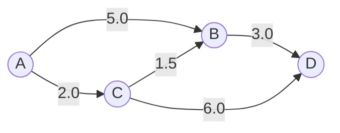

The shortest way from A to D is A → C → B → D, with $d(A, D) = 2.0 + 1.5 + 3.0 = 6.5$ m, shorter than A → B → D (8.0 m) or A → C → D (8.0 m). Part I builds this graph in BGL and makes BGL find that answer.

---

## 2. Step 1: the smallest program

```cpp
#include <boost/graph/adjacency_list.hpp>
#include <iostream>

int main() {
  boost::adjacency_list<> g;            // all seven template parameters left at their defaults
  boost::add_edge(0, 1, g);             // vertices 0 and 1 are created on demand
  boost::add_edge(0, 2, g);
  boost::add_edge(2, 1, g);
  boost::add_edge(1, 3, g);
  boost::add_edge(2, 3, g);
  std::cout << "vertices: " << boost::num_vertices(g) << ", edges: " << boost::num_edges(g) << "\n";
  for (auto [ei, ei_end] = boost::edges(g); ei != ei_end; ++ei) {
    std::cout << "  " << boost::source(*ei, g) << " -> " << boost::target(*ei, g) << "\n";
  }
}
```

Output **[run]**:

```text
vertices: 4, edges: 5
  0 -> 1
  0 -> 2
  1 -> 3
  2 -> 1
  2 -> 3
```

What happened:
- **`boost::adjacency_list<>`** is BGL's main graph container. The empty angle brackets mean "use the default for all seven template parameters" (Step 2 explains each one).
- **`boost::add_edge(u, v, g)`** adds the edge $(u, v)$. With the default settings, vertices are *numbers* $0, 1, 2, \dots$, and adding an edge to a vertex that does not exist yet creates it (and every lower-numbered vertex). That is why the graph has 4 vertices without any `add_vertex` call. Here 0, 1, 2, 3 play the roles of A, B, C, D.
- **`boost::num_vertices(g)`** and **`boost::num_edges(g)`** give $n$ and $m$.
- **`boost::edges(g)`** returns a *pair of iterators* (begin, end) over all edges. C++17 structured bindings unpack it: `auto [ei, ei_end] = ...`.
- **`boost::source(e, g)`** and **`boost::target(e, g)`** give an edge's endpoints. Note the order in the output: edges come grouped by their source vertex (1 → 3 before 2 → 1), not in the order they were added.

**BGL's calling style.** Every operation is a *free function* that takes the graph as its last argument, `f(..., g)`, rather than a member function `g.f(...)`. This lets the same algorithms work on any graph type that provides these functions, including types you write yourself.

---

## 3. Step 2: reading the `adjacency_list` template

`adjacency_list` stores, for every vertex, a list of its outgoing edges, which is what "adjacency list" means. Its full declaration has seven template parameters, each with a default:

```cpp
template <class OutEdgeListS = vecS,       // 1. container for each vertex's out-edges
          class VertexListS = vecS,        // 2. container for the vertices
          class DirectedS = directedS,     // 3. directedS, undirectedS or bidirectionalS
          class VertexProperties = no_property,  // 4. data stored in each vertex
          class EdgeProperties = no_property,    // 5. data stored in each edge
          class GraphProperties = no_property,   // 6. data stored once for the whole graph
          class EdgeListS = listS>         // 7. container for the global list of all edges
class adjacency_list;
```

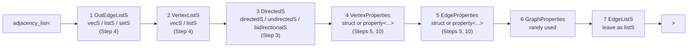

**How to read any `adjacency_list` type:** parameters 1–2 decide *how things are stored* (speed and which operations stay valid), parameter 3 decides *which way edges go*, and parameters 4–5 decide *what data rides along*. Parameters 6–7 are almost never changed. The next steps change one parameter at a time:

| Step | Parameter changed | Example type |
|---|---|---|
| 3 | 3 `DirectedS` | `adjacency_list<vecS, vecS, bidirectionalS>` |
| 4 | 1 `OutEdgeListS`, 2 `VertexListS` | `adjacency_list<setS, vecS, directedS>` |
| 5 | 4 `VertexProperties`, 5 `EdgeProperties` | `adjacency_list<vecS, vecS, directedS, Place, Road>` |
| 10 | 5 `EdgeProperties` as a tagged chain | `adjacency_list<vecS, vecS, bidirectionalS, no_property, property<edge_index_t, size_t, Road>>` |

Because the parameters are positional, **to set parameter 4 you must spell out 1–3**, even if they are the defaults. That is why real code usually has the long form.

---

## 4. Step 3: direction

```cpp
#include <boost/graph/adjacency_list.hpp>
#include <iostream>

template <typename Graph>
void Describe(const char* name) {
  Graph g;
  boost::add_edge(0, 1, g); boost::add_edge(0, 2, g); boost::add_edge(2, 1, g);
  boost::add_edge(1, 3, g); boost::add_edge(2, 3, g);
  std::cout << name << ": edges = " << boost::num_edges(g) << "; out_edges(1) =";
  for (auto [ei, end] = boost::out_edges(1, g); ei != end; ++ei) { std::cout << " " << boost::target(*ei, g); }
  if constexpr (std::is_same_v<typename boost::graph_traits<Graph>::directed_category,
                               boost::bidirectional_tag>) {
    std::cout << "; in_edges(1) from";
    for (auto [ei, end] = boost::in_edges(1, g); ei != end; ++ei) { std::cout << " " << boost::source(*ei, g); }
  }
  std::cout << "\n";
}

int main() {
  Describe<boost::adjacency_list<boost::vecS, boost::vecS, boost::directedS>>("directedS     ");
  Describe<boost::adjacency_list<boost::vecS, boost::vecS, boost::undirectedS>>("undirectedS   ");
  Describe<boost::adjacency_list<boost::vecS, boost::vecS, boost::bidirectionalS>>("bidirectionalS");
}
```

Output **[run]**:

```text
directedS     : edges = 5; out_edges(1) = 3
undirectedS   : edges = 5; out_edges(1) = 0 2 3
bidirectionalS: edges = 5; out_edges(1) = 3; in_edges(1) from 0 2
```

| `DirectedS` | An edge $(u, v)$ is stored in… | `out_edges(v)` gives | `in_edges(v)` | Memory per edge |
|---|---|---|---|---|
| `directedS` | $u$'s out-list | edges leaving $v$ | **not available** | 1 record |
| `undirectedS` | both $u$'s and $v$'s lists | every edge touching $v$ (the other endpoint is reported as the "target") | same as out-edges | 2 records |
| `bidirectionalS` | $u$'s out-list and $v$'s in-list | edges leaving $v$ | edges entering $v$ | 2 records |

In the output, vertex 1 (B) has one outgoing edge (to 3, D) when directed. When undirected, all three edges touching it count. With `bidirectionalS`, it additionally knows its incoming edges, from 0 (A) and 2 (C). **Choose `bidirectionalS` when you need to walk edges backwards**, for example to list the dependencies of a task, at the cost of storing every edge twice.

---

## 5. Step 4: storage containers (selectors)

Parameters 1 and 2 are *selectors*: tag types that choose a standard container.

| Selector | Container | As parameter 1 (out-edges) | As parameter 2 (vertices) |
|---|---|---|---|
| `vecS` | `std::vector` | Fast iteration; **parallel edges allowed**; `add_edge` $O(1)$ | Vertex = index $0 \dots n-1$; **removing a vertex renumbers later ones** |
| `listS` | `std::list` | Parallel edges allowed; edge handles stay valid when other edges are removed | Vertex handles stay valid; you must supply an index map yourself |
| `setS` | `std::set` | **Parallel edges rejected**; `add_edge` and `edge(u, v, g)` $O(\log \deg^+)$ | Rare |

```cpp
#include <boost/graph/adjacency_list.hpp>
#include <iostream>
#include <string>

int main() {
  // 1. Parallel edges: the out-edge container decides whether a repeated edge is kept
  boost::adjacency_list<boost::vecS, boost::vecS, boost::directedS> gv;
  boost::adjacency_list<boost::setS, boost::vecS, boost::directedS> gs;
  boost::add_edge(0, 1, gv); auto [ev, added_v] = boost::add_edge(0, 1, gv);
  boost::add_edge(0, 1, gs); auto [es, added_s] = boost::add_edge(0, 1, gs);
  std::cout << "vecS out-edges: second add_edge added=" << added_v << ", num_edges=" << boost::num_edges(gv) << "\n";
  std::cout << "setS out-edges: second add_edge added=" << added_s << ", num_edges=" << boost::num_edges(gs) << "\n";

  // 2. Removing a vertex renumbers the later ones when vertices are stored in a vecS
  boost::adjacency_list<boost::vecS, boost::vecS, boost::directedS, std::string> g;
  for (const char* name : {"A", "B", "C", "D"}) { boost::add_vertex(name, g); }
  auto cached = 3;                                   // "D", remembered by someone else
  std::cout << "before: vertex 3 is " << g[cached] << "\n";
  boost::clear_vertex(1, g);                         // drop B's edges first (none here)
  boost::remove_vertex(1, g);                        // remove "B"
  std::cout << "after removing vertex 1: vertices =";
  for (auto [vi, end] = boost::vertices(g); vi != end; ++vi) { std::cout << " " << *vi << ":" << g[*vi]; }
  std::cout << "; the cached index 3 is now out of range (num_vertices = " << boost::num_vertices(g) << ")\n";
}
```

Output **[run]**:

```text
vecS out-edges: second add_edge added=1, num_edges=2
setS out-edges: second add_edge added=0, num_edges=1
before: vertex 3 is D
after removing vertex 1: vertices = 0:A 1:C 2:D; the cached index 3 is now out of range (num_vertices = 3)
```

Two lessons:
- **Parallel edges.** With `vecS` out-edges, adding the same edge twice stores it twice, and `add_edge` reports `added = 1` both times. With `setS`, the second call is refused (`added = 0`). If your code must never have duplicate edges and uses `vecS`, it has to check with `boost::edge(u, v, g)` before adding.
- **Renumbering.** With `vecS` vertices, a vertex *is* its position in a vector. Removing B (index 1) moves C and D down to 1 and 2. Anyone who remembered "D is vertex 3" now holds an index that is out of range, or worse, that points at a different vertex. (`clear_vertex` removes a vertex's edges; `remove_vertex` requires that the vertex has none left.)

**Vertex and edge handles** are called **descriptors**, and their types come from `boost::graph_traits<G>`:

```cpp
using Vertex = boost::graph_traits<Graph>::vertex_descriptor;  // std::size_t when VertexListS = vecS
using Edge   = boost::graph_traits<Graph>::edge_descriptor;    // a small struct: source, target, pointer to edge data
```

Descriptors are like iterators: they do not own anything, and they become invalid when the graph changes in certain ways:

| Operation | `VertexListS = vecS` | `VertexListS = listS` |
|---|---|---|
| `add_vertex` | Vertex *iterators* invalidated; descriptors (indices) stay valid | Nothing invalidated |
| `remove_vertex(u)` | **Every vertex numbered above $u$ is renumbered** | Only $u$'s descriptor becomes invalid |
| `add_edge` / `remove_edge` with `OutEdgeListS = vecS` | That vertex's out-edge iterators and descriptors invalidated | same |
| References to vertex data `g[v]` | Invalidated whenever the vertex vector reallocates | Stable |

**Rule of thumb:** a graph that is built once and then only read (a map, a road network) can use `vecS` everywhere and ignore these rules. A graph that keeps changing must either use `listS`, or never keep descriptors across changes.

---

## 6. Step 5: attaching data to vertices and edges

So far vertices and edges carry no data. Parameters 4 and 5 attach a struct to every vertex and every edge. These are called **bundled properties**:

```cpp
#include <boost/graph/adjacency_list.hpp>
#include <iostream>
#include <string>

struct Place {             // the data stored in every vertex (the vertex "bundle")
  std::string name;
  double x_m = 0.0;
  double y_m = 0.0;
};
struct Road {              // the data stored in every edge (the edge "bundle")
  double length_m = 0.0;
};
using Graph = boost::adjacency_list<boost::vecS, boost::vecS, boost::directedS, Place, Road>;

int main() {
  Graph g;
  auto a = boost::add_vertex(Place{"A", 0.0, 0.0}, g);
  auto b = boost::add_vertex(Place{"B", 3.0, 1.0}, g);
  auto c = boost::add_vertex(Place{"C", 2.0, 0.0}, g);
  auto d = boost::add_vertex(Place{"D", 6.0, 1.0}, g);
  boost::add_edge(a, b, Road{5.0}, g);
  boost::add_edge(a, c, Road{2.0}, g);
  boost::add_edge(c, b, Road{1.5}, g);
  boost::add_edge(b, d, Road{3.0}, g);
  boost::add_edge(c, d, Road{6.0}, g);
  g[c].name += " (renamed)";                          // write through g[vertex]
  for (auto [ei, end] = boost::edges(g); ei != end; ++ei) {
    std::cout << g[boost::source(*ei, g)].name << " -> " << g[boost::target(*ei, g)].name
              << " : " << g[*ei].length_m << " m\n";   // read through g[edge]
  }
}
```

Output **[run]**:

```text
A -> B : 5 m
A -> C (renamed) : 2 m
B -> D : 3 m
C (renamed) -> B : 1.5 m
C (renamed) -> D : 6 m
```

- **`add_vertex(Place{...}, g)`** creates a vertex holding a copy of the struct, and returns its descriptor.
- **`add_edge(u, v, Road{...}, g)`** creates an edge holding a `Road`, and returns a pair (descriptor, added).
- **`g[v]`** is the `Place` stored in vertex `v`; **`g[e]`** is the `Road` stored in edge `e`. Both are references, so you can modify them in place (here, renaming C).

The type `adjacency_list<vecS, vecS, directedS, Place, Road>` reads as: vector of out-edges per vertex, vector of vertices, one-way edges, a `Place` per vertex, a `Road` per edge.

---

## 7. Step 6: property maps

Algorithms need data such as "the weight of each edge" or "the distance found so far for each vertex", but they cannot know that your weight lives in `Road::length_m`. BGL solves this with **property maps**: anything that answers

$$
\texttt{get}(\textit{map}, \textit{key}) \to \textit{value},\qquad \texttt{put}(\textit{map}, \textit{key}, \textit{value}),
$$

where the key is a vertex or edge descriptor. An algorithm only ever calls `get` and `put`, so the data can live anywhere.

Steps 6–8 reuse the graph of Step 5 through a small header, `graph_abcd.hpp`:

```cpp
#pragma once
#include <boost/graph/adjacency_list.hpp>
#include <string>
struct Place { std::string name; double x_m = 0.0; double y_m = 0.0; };
struct Road { double length_m = 0.0; };
using Graph = boost::adjacency_list<boost::vecS, boost::vecS, boost::directedS, Place, Road>;
using Vertex = boost::graph_traits<Graph>::vertex_descriptor;
using Edge = boost::graph_traits<Graph>::edge_descriptor;
inline Graph MakeAbcd() {
  Graph g;
  auto a = boost::add_vertex(Place{"A", 0.0, 0.0}, g);
  auto b = boost::add_vertex(Place{"B", 3.0, 1.0}, g);
  auto c = boost::add_vertex(Place{"C", 2.0, 0.0}, g);
  auto d = boost::add_vertex(Place{"D", 6.0, 1.0}, g);
  boost::add_edge(a, b, Road{5.0}, g);
  boost::add_edge(a, c, Road{2.0}, g);
  boost::add_edge(c, b, Road{1.5}, g);
  boost::add_edge(b, d, Road{3.0}, g);
  boost::add_edge(c, d, Road{6.0}, g);
  return g;
}
```

```cpp
#include "graph_abcd.hpp"
#include <boost/property_map/property_map.hpp>
#include <iostream>
#include <vector>

int main() {
  Graph g = MakeAbcd();
  // Interior map: reads Road::length_m straight out of each edge's bundle
  auto length = boost::get(&Road::length_m, g);
  // The vertex index map: vertex -> 0..n-1 (the identity for vecS vertex storage)
  auto index = boost::get(boost::vertex_index, g);
  // Exterior map: a plain std::vector, addressed through the index map
  std::vector<int> visits(boost::num_vertices(g), 0);
  auto visit_map = boost::make_iterator_property_map(visits.begin(), index);

  for (auto [ei, end] = boost::edges(g); ei != end; ++ei) {
    Vertex t = boost::target(*ei, g);
    boost::put(visit_map, t, boost::get(visit_map, t) + 1);       // put / get on the exterior map
    std::cout << "edge into " << g[t].name << ": get(length, e) = " << boost::get(length, *ei)
              << ", index of target = " << boost::get(index, t) << "\n";
  }
  for (Vertex v = 0; v < boost::num_vertices(g); ++v) {
    std::cout << g[v].name << " has in-degree " << visits[v] << "\n";
  }
}
```

Output **[run]**:

```text
edge into B: get(length, e) = 5, index of target = 1
edge into C: get(length, e) = 2, index of target = 2
edge into D: get(length, e) = 3, index of target = 3
edge into B: get(length, e) = 1.5, index of target = 1
edge into D: get(length, e) = 6, index of target = 3
A has in-degree 0
B has in-degree 2
C has in-degree 1
D has in-degree 2
```

The three kinds of map in this listing:

| Map | Created with | Key → value | Where the data lives |
|---|---|---|---|
| **Interior (bundle member)** | `boost::get(&Road::length_m, g)` | edge → its `length_m` | inside the graph |
| **Vertex index** | `boost::get(boost::vertex_index, g)` | vertex → integer $0 \dots n-1$ | computed (with `vecS` vertices, the vertex *is* its index) |
| **Exterior (iterator)** | `boost::make_iterator_property_map(vec.begin(), index)` | vertex → `vec[index[v]]` | in your own `std::vector` |

**Why the vertex index matters.** Exterior maps are just vectors, so they need a way to turn a vertex into a position. The vertex index map provides it. With `vecS` vertex storage you get it for free. With `listS` vertices you must build one yourself, which is the most common source of BGL compile errors.

**Edges have no built-in index.** There is no `edge_index` for free; Step 10 shows how to add one when you need vector-backed edge data.

---

## 8. Step 7: running an algorithm (Dijkstra)

Dijkstra's algorithm finds $d(s, v)$ for every $v$, when all weights are non-negative. It keeps, for every vertex, a tentative distance $d_v$ and a predecessor $p_v$ (the previous vertex on the best path found so far):

$$
d_s = 0,\qquad d_v = +\infty\ (v \ne s),\qquad p_v = v .
$$

It repeatedly takes the unfinished vertex $u$ with the smallest $d_u$, and **relaxes** each out-edge $(u, v)$:

$$
\text{if } d_u + w(u, v) < d_v:\qquad d_v \leftarrow d_u + w(u, v),\quad p_v \leftarrow u .
$$

Because weights are non-negative, once $u$ is taken its distance can no longer improve. BGL's implementation uses a 4-ary heap, giving $O((n + m)\log n)$ time.

```cpp
#include "graph_abcd.hpp"
#include <boost/graph/dijkstra_shortest_paths.hpp>
#include <algorithm>
#include <iostream>
#include <vector>

int main() {
  Graph g = MakeAbcd();
  const Vertex s = 0, t = 3;                                     // A and D
  std::vector<double> dist(boost::num_vertices(g));
  std::vector<Vertex> pred(boost::num_vertices(g));
  auto index = boost::get(boost::vertex_index, g);
  boost::dijkstra_shortest_paths(g, s,
      boost::weight_map(boost::get(&Road::length_m, g))                         // input: w(e)
          .distance_map(boost::make_iterator_property_map(dist.begin(), index))  // output: d(v)
          .predecessor_map(boost::make_iterator_property_map(pred.begin(), index)));  // output: p(v)
  for (Vertex v = 0; v < boost::num_vertices(g); ++v) {
    std::cout << "d(A, " << g[v].name << ") = " << dist[v] << ", predecessor " << g[pred[v]].name << "\n";
  }
  std::vector<Vertex> path;
  for (Vertex v = t; v != s; v = pred[v]) { path.push_back(v); }
  path.push_back(s);
  std::reverse(path.begin(), path.end());
  std::cout << "path:";
  for (Vertex v : path) { std::cout << " " << g[v].name; }
  std::cout << "\n";
}
```

Output **[run]**:

```text
d(A, A) = 0, predecessor A
d(A, B) = 3.5, predecessor C
d(A, C) = 2, predecessor A
d(A, D) = 6.5, predecessor B
path: A C B D
```

**Named parameters.** The algorithm's optional inputs and outputs are passed as a chain, `weight_map(...).distance_map(...).predecessor_map(...)`, in any order. Each piece is a property map: the weight map is an *input* (read with `get`), and the distance and predecessor maps are *outputs* (written with `put`). Anything you leave out, BGL allocates internally for the duration of the call.

**Reading the result.** $d(A, D) = 6.5$, as computed in section 1. The path is recovered by following predecessors backwards from D: $p_D = B$, $p_B = C$, $p_C = A$, which gives A → C → B → D. If $p_t = t$ and $t \ne s$, then $t$ was never reached.

The run of Dijkstra on this graph, step by step:

| Taken vertex $u$ | Its $d_u$ | Relaxations | Distances after this step $(A, B, C, D)$ |
|---|---|---|---|
| A | 0 | B: $0 + 5 = 5$; C: $0 + 2 = 2$ | $(0, 5, 2, \infty)$ |
| C | 2 | B: $2 + 1.5 = 3.5 < 5$ ✓; D: $2 + 6 = 8$ | $(0, 3.5, 2, 8)$ |
| B | 3.5 | D: $3.5 + 3 = 6.5 < 8$ ✓ | $(0, 3.5, 2, 6.5)$ |
| D | 6.5 | none | final |

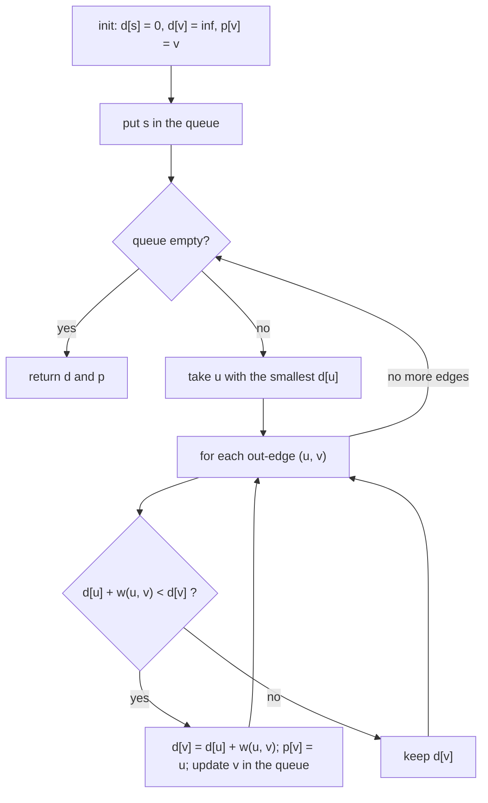

---

## 9. Step 8: visitors, early exit, and A*

**Visitors** let you watch an algorithm. A visitor is a class whose member functions BGL calls at named events; you inherit from a default visitor and override only the events you care about:

| Event | When it fires (BFS, Dijkstra, A*) |
|---|---|
| `discover_vertex(u, g)` | $u$ is reached for the first time |
| `examine_vertex(u, g)` | $u$ is taken from the queue |
| `examine_edge(e, g)` | each out-edge of the examined vertex |
| `edge_relaxed(e, g)` | the distance to the edge's target improved |
| `finish_vertex(u, g)` | all of $u$'s out-edges have been processed |

**A\*** is Dijkstra with a hint. It orders the queue by $f(v) = d_v + h(v)$, where $h(v)$ estimates the remaining distance to the goal $g$. If $h$ never overestimates, it still finds the shortest path, while usually examining fewer vertices:

$$
\text{admissible: } h(v) \le d(v, g)\ \ \forall v,\qquad
\text{consistent: } h(u) \le w(u, v) + h(v)\ \ \forall (u, v) \in E,\ \ h(g) = 0 .
$$

The straight-line distance between two places is consistent whenever every road is at least as long as the straight line between its ends (the triangle inequality). In this example the coordinates were chosen so that holds.

BGL has **no "stop" event**: to end a search early, for example as soon as the goal is taken from the queue, a visitor **throws an exception**, and the caller catches it.

```cpp
#include "graph_abcd.hpp"
#include <boost/graph/astar_search.hpp>
#include <boost/graph/breadth_first_search.hpp>
#include <cmath>
#include <iostream>
#include <vector>

// A visitor: BGL calls these member functions at search events
struct PrintingBfsVisitor : boost::default_bfs_visitor {
  void discover_vertex(Vertex u, const Graph& g) const { std::cout << " discover " << g[u].name; }
  void finish_vertex(Vertex u, const Graph& g) const { std::cout << " finish " << g[u].name; }
};

// A* needs a heuristic h(v): here the straight-line distance to the goal
struct StraightLine : boost::astar_heuristic<Graph, double> {
  StraightLine(const Graph& g, Vertex goal) : g_(&g), goal_(goal) {}
  double operator()(Vertex v) const {
    return std::hypot((*g_)[v].x_m - (*g_)[goal_].x_m, (*g_)[v].y_m - (*g_)[goal_].y_m);
  }
  const Graph* g_; Vertex goal_;
};
struct FoundGoal {};                                   // thrown to stop the search early
struct GoalVisitor : boost::default_astar_visitor {
  explicit GoalVisitor(Vertex goal) : goal_(goal) {}
  void examine_vertex(Vertex u, const Graph& g) const {
    std::cout << " examine " << g[u].name;
    if (u == goal_) { throw FoundGoal{}; }
  }
  Vertex goal_;
};

int main() {
  Graph g = MakeAbcd();
  std::cout << "BFS from A:";
  boost::breadth_first_search(g, 0, boost::visitor(PrintingBfsVisitor{}));
  std::cout << "\n";

  std::vector<double> dist(boost::num_vertices(g));
  std::vector<Vertex> pred(boost::num_vertices(g));
  auto index = boost::get(boost::vertex_index, g);
  std::cout << "A* from A to D:";
  try {
    boost::astar_search(g, Vertex{0}, StraightLine{g, 3},
        boost::weight_map(boost::get(&Road::length_m, g))
            .distance_map(boost::make_iterator_property_map(dist.begin(), index))
            .predecessor_map(boost::make_iterator_property_map(pred.begin(), index))
            .visitor(GoalVisitor{3}));
    std::cout << "\n goal not reachable\n";
  } catch (const FoundGoal&) {
    std::cout << "\n reached D with d = " << dist[3] << "\n";
  }
}
```

Output **[run]**:

```text
BFS from A: discover A discover B discover C finish A discover D finish B finish C finish D
A* from A to D: examine A examine C examine B examine D
 reached D with d = 6.5
```

- **BFS (breadth-first search)** discovers vertices layer by layer by number of edges: A, then its neighbors B and C, then D.
- **A\*** examines A, C, B, D and stops at D, with $d = 6.5$. On a large graph, the heuristic and the early exit together avoid most of the work that a full Dijkstra run would do.

**Colors.** Internally, every search marks each vertex with a color:

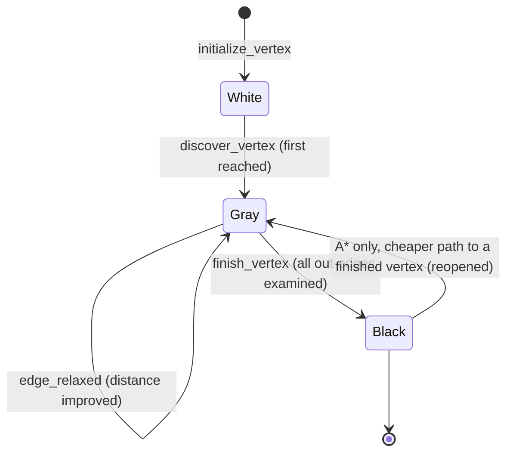

With a consistent heuristic, the Black → Gray transition never happens.

---

## 10. Step 9: DAGs and topological sort

When edges mean "must happen before", the graph should have no cycles, and a **topological order** lists the vertices so that every edge points forward:

$$
\sigma : \{1, \dots, n\} \to V \ \text{ with }\ (u, v) \in E \Rightarrow \sigma^{-1}(u) < \sigma^{-1}(v).
$$

Such an order exists exactly when the graph is a DAG.

```cpp
#include <boost/graph/adjacency_list.hpp>
#include <boost/graph/topological_sort.hpp>
#include <algorithm>
#include <iostream>
#include <iterator>
#include <string>
#include <vector>

using Dag = boost::adjacency_list<boost::vecS, boost::vecS, boost::bidirectionalS, std::string>;

int main() {
  Dag g;
  for (const char* task : {"lift tray", "drive to VRC", "ride VRC", "open bay", "drive to bay"}) { boost::add_vertex(task, g); }
  boost::add_edge(0, 1, g); boost::add_edge(1, 2, g); boost::add_edge(2, 4, g); boost::add_edge(3, 4, g);
  std::vector<boost::graph_traits<Dag>::vertex_descriptor> order;
  boost::topological_sort(g, std::back_inserter(order));   // writes the REVERSE of a topological order
  std::reverse(order.begin(), order.end());
  std::cout << "order:";
  for (auto v : order) { std::cout << " [" << g[v] << "]"; }
  std::cout << "\n";
  boost::add_edge(4, 0, g);                                 // create a cycle
  try { order.clear(); boost::topological_sort(g, std::back_inserter(order)); }
  catch (const boost::not_a_dag& e) { std::cout << "with a cycle: " << e.what() << "\n"; }
}
```

Output **[run]**:

```text
order: [open bay] [lift tray] [drive to VRC] [ride VRC] [drive to bay]
with a cycle: The graph must be a DAG.
```

- **`topological_sort`** writes the vertices in **reverse** topological order (each vertex after everything that depends on it), so the result is reversed before use.
- **Any valid order is possible.** "open bay" has no dependencies, so it may come first. BGL does not promise which valid order you get.
- **On a cycle**, it throws `boost::not_a_dag` (an `std::invalid_argument`). Catch it if a cycle can occur.
- **`bidirectionalS`** is used here so that a task's dependencies (its in-edges) can be listed too.

---

## 11. Step 10: tagged properties and an edge index

Before bundled properties existed, BGL attached data with **tagged properties**: `boost::property<Tag, Type, Next>` stores a value of `Type` that algorithms find by its `Tag`, and chains to the next property `Next`. The two styles can be mixed. That is useful for giving edges an **index**, which BGL does not provide by itself:

$$
\varepsilon : E \to \{0, 1, \dots, m - 1\},\qquad \varepsilon(e_k) = k \ \text{ for the } k\text{-th edge added}.
$$

```cpp
#include <boost/graph/adjacency_list.hpp>
#include <boost/property_map/vector_property_map.hpp>
#include <iostream>

struct Road { double length_m = 0.0; };
// Edge properties: a tagged edge_index (found by its tag) chained to the Road bundle (found by g[e])
using Graph = boost::adjacency_list<boost::vecS, boost::vecS, boost::bidirectionalS, boost::no_property,
                                    boost::property<boost::edge_index_t, std::size_t, Road>>;

int main() {
  Graph g;
  auto index = boost::get(boost::edge_index, g);              // interior tagged map: edge -> size_t
  std::size_t next = 0;
  for (auto [u, v, len] : {std::tuple{0, 1, 5.0}, {0, 2, 2.0}, {2, 1, 1.5}, {1, 3, 3.0}}) {
    auto [e, added] = boost::add_edge(u, v, {next, Road{len}}, g);   // {edge_index, Road}
    boost::put(index, e, next++);
  }
  // A vector-backed map indexed by edge_index: one slot per edge
  boost::vector_property_map<double, decltype(index)> doubled(boost::num_edges(g), index);
  for (auto [ei, end] = boost::edges(g); ei != end; ++ei) {
    boost::put(doubled, *ei, 2.0 * g[*ei].length_m);
    std::cout << "edge " << boost::get(index, *ei) << ": " << boost::source(*ei, g) << " -> "
              << boost::target(*ei, g) << ", g[e].length_m = " << g[*ei].length_m
              << ", doubled[e] = " << boost::get(doubled, *ei) << "\n";
  }
}
```

Output **[run]**:

```text
edge 0: 0 -> 1, g[e].length_m = 5, doubled[e] = 10
edge 1: 0 -> 2, g[e].length_m = 2, doubled[e] = 4
edge 2: 2 -> 1, g[e].length_m = 1.5, doubled[e] = 3
edge 3: 1 -> 3, g[e].length_m = 3, doubled[e] = 6
```

Reading the edge-property type `property<edge_index_t, std::size_t, Road>` from left to right:

$$
\underbrace{\texttt{edge\_index\_t}}_{\text{tag}},\ \underbrace{\texttt{std::size\_t}}_{\text{stored type}},\ \underbrace{\texttt{Road}}_{\text{next: the bundle}}
\quad\Longrightarrow\quad
\texttt{get(edge\_index, g)[e]} \text{ gives the index},\quad \texttt{g[e]} \text{ gives the } \texttt{Road}.
$$

- **The index is not filled in automatically.** The program writes $k$ with `put` as each edge is added (passing `{next, Road{len}}` as the edge's initial properties also sets it).
- **`boost::vector_property_map<T, IndexMap>`** is a growable vector addressed through an index map. With the edge index, it becomes "one `T` per edge", just like the exterior vertex maps of Step 6. Copies of a `vector_property_map` share the same storage, so passing one by value is cheap.
- **If edges were removed**, the indices would have gaps and would need repair. This technique suits graphs whose edges are added once and then only read.

---

## 12. Part I summary: concepts, invalidation, cheat sheet

**Concepts.** Each BGL algorithm documents which operations it needs, grouped into named *concepts*. An `adjacency_list` provides all of them except that `in_edges` needs `bidirectionalS`:

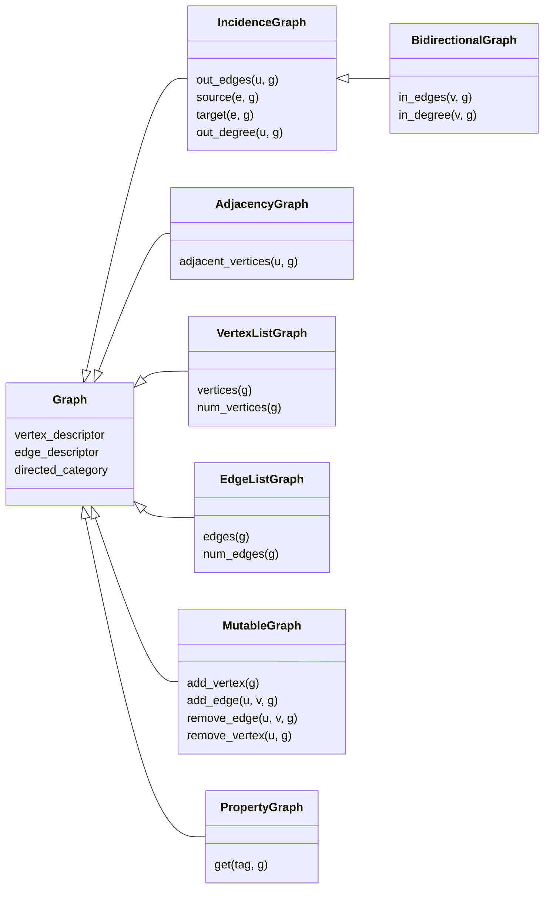

For example, `dijkstra_shortest_paths`, `breadth_first_search` and `topological_sort` need IncidenceGraph and VertexListGraph. A compile error mentioning a missing `out_edges` or `in_edges` usually means the graph type lacks a concept the algorithm needs.

**Cheat sheet.**

| I want to… | Code |
|---|---|
| declare a graph with data | `adjacency_list<vecS, vecS, bidirectionalS, VertexStruct, EdgeStruct>` |
| add a vertex, an edge | `auto v = add_vertex(data, g);` `auto [e, ok] = add_edge(u, v, data, g);` |
| check for an edge | `auto [e, exists] = edge(u, v, g);` ($O(\deg^+(u))$ with `vecS`) |
| loop over vertices, edges | `for (auto [it, end] = vertices(g); it != end; ++it)`, same with `edges(g)` |
| loop over out- or in-edges | `out_edges(u, g)`, `in_edges(v, g)` (the latter needs `bidirectionalS`) |
| read or write attached data | `g[v].field`, `g[e].field` |
| make a weight map from a field | `get(&EdgeStruct::field, g)` |
| make a per-vertex result vector | `make_iterator_property_map(vec.begin(), get(vertex_index, g))` |
| shortest paths | `dijkstra_shortest_paths(g, s, weight_map(w).distance_map(d).predecessor_map(p));` |
| stop a search early | throw from a visitor, catch around the call |
| order a DAG | `topological_sort(g, std::back_inserter(out));` then reverse |

| Algorithm | Header | Cost | Notes |
|---|---|---|---|
| `breadth_first_search` | `breadth_first_search.hpp` | $O(n + m)$ | hop counts, reachability |
| `depth_first_search` | `depth_first_search.hpp` | $O(n + m)$ | discovery and finish order, cycle detection |
| `dijkstra_shortest_paths` | `dijkstra_shortest_paths.hpp` | $O((n + m)\log n)$ | $w \ge 0$; throws `negative_edge` otherwise |
| `astar_search` | `astar_search.hpp` | at most Dijkstra's | needs a heuristic |
| `topological_sort` | `topological_sort.hpp` | $O(n + m)$ | throws `not_a_dag` |
| `dag_shortest_paths` | `dag_shortest_paths.hpp` | $O(n + m)$ | shortest or longest paths on a DAG |
| `strong_components` | `strong_components.hpp` | $O(n + m)$ | groups of mutually reachable vertices |
| `transitive_reduction` | `transitive_reduction.hpp` | $O(n\,m)$ | fewest edges with the same reachability |
| `write_graphviz` | `graphviz.hpp` | $O(n + m)$ | `.dot` text for drawing |

BGL is header-only. Only the Graphviz and GraphML *readers* need a compiled Boost library.

---

# Part II — Boost.Graph in Volley

## 13. Where Volley uses BGL

Volley builds **three** BGL graphs **[seen: documents 18, 21]**. With Part I in hand, each type can be read parameter by parameter:

| Graph | Where | Type | 1 out-edges | 2 vertices | 3 direction | 4 vertex data | 5 edge data | Changed after construction? |
|---|---|---|---|---|---|---|---|---|
| Layout graph | `common_ros` `Layout::graph_` | `adjacency_list<listS, vecS, undirectedS>` | `listS` | `vecS` | undirected | none | none | No |
| Garage graph | `common_ros` `GarageGraph::base_graph_` | `BoostPoseGraph` (section 16) | `vecS` | `vecS` | bidirectional | `GaragePose` | `property<edge_index_t, size_t, Transition>` | No |
| Event DAG | `planner_core` `DagBase<T>::dag_` | `adjacency_list<vecS, vecS, bidirectionalS, shared_ptr<T>>` | `vecS` | `vecS` | bidirectional | `shared_ptr<T>` | none | **Yes** |

Between the first two sits the **pose graph** (`common_ros` `PoseGraph`). It is *not* a BGL type: it is a flat array with 8 neighbor slots per pose, from which the garage graph is built.

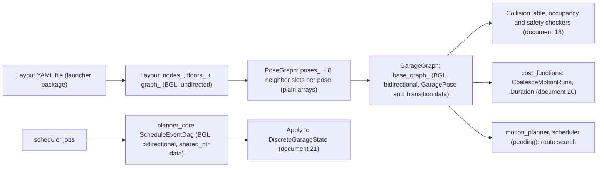

---

## 14. Worked example: how 3 layout nodes become 8 vertices and 16 edges

The layout and the garage graph describe the same garage at different levels. The **layout** says where the AGV can stop (nodes) and between which stops it can drive (edges). The **garage graph** says *in which orientation* the AGV can be at each stop, and which single motions take it from one (node, orientation) to another. This section expands a three-node layout by hand, following exactly the rules in `PoseGraph` and `GarageGraph` **[seen: document 18]**.

### 14.1 The layout

| Node | Id | Position (m) | Stored headings | Rotation allowed |
|---|---|---|---|---|
| A | 1 | (0, 0) | 90° | no |
| B | 2 | (4, 0) | 0°, 90° | yes |
| C | 3 | (4, 4) | 0° | no |

Edges: A–B (along $+x$) and B–C (along $+y$). As a BGL layout graph, this is 3 vertices and 2 undirected edges.

**What a heading means.** A heading $h$ is the rotation of the AGV's body frame, in degrees, counter-clockwise. Volley's AGV drives forward along its body $+y$ axis, so at heading $h$ it **drives along the direction $h + 90°$** in the garage frame (heading 0° drives north, $+y$; heading 90° drives west, $-x$). Moving sideways, along $h$ or $h + 180°$, is a **strafe**.

Layout files store headings in $[0°, 180°)$: an AGV facing one way can also stand facing the opposite way (the *reciprocal*), and that is implied rather than stored.

### 14.2 Step 1: allowed headings, giving 8 poses

For each node $n$, `GetAllowedHeadings` adds each stored heading's reciprocal, and wraps both into $(-180°, 180°]$:

$$
\tilde H_n = \{\operatorname{wrap}(h),\ \operatorname{wrap}(h + 180°) : h \in H_n\}.
$$

| Node | $H_n$ (stored) | $\tilde H_n$ (allowed) | $\lvert\tilde H_n\rvert$ |
|---|---|---|---|
| A | {90} | {−90, 90} | 2 |
| B | {0, 90} | {−90, 0, 90, 180} | 4 |
| C | {0} | {0, 180} | 2 |

A **pose** is a pair (node, allowed heading), so the number of poses, and of garage-graph vertices, is

$$
|V| = \sum_{n} |\tilde H_n| = 2 + 4 + 2 = 8 .
$$

**This is where 3 becomes 8:** every layout node is split into one vertex per orientation the AGV may have there. A node with one stored heading becomes 2 vertices; a node with two stored headings becomes 4.

### 14.3 Step 2: numbering the vertices

`PoseGraph` lists poses sorted by node id, then heading, and `GarageGraph` adds them to the BGL graph in that order, so **vertex descriptor = position in this list**:

| Vertex | 0 | 1 | 2 | 3 | 4 | 5 | 6 | 7 |
|---|---|---|---|---|---|---|---|---|
| Pose | A@−90 | A@90 | B@−90 | B@0 | B@90 | B@180 | C@0 | C@180 |

### 14.4 Step 3: translation edges keep the heading

For every pose $(n, h)$ and every layout neighbor $n'$ of $n$, `PoseGraph` considers the move to $(n', h)$, **with the same heading**: driving does not turn the AGV. The move exists only if $(n', h)$ is itself a pose, that is if $h \in \tilde H_{n'}$:

$$
(n, h) \to (n', h) \in E \iff \{n, n'\} \in \mathcal{E}\ \wedge\ h \in \tilde H_n \cap \tilde H_{n'} .
$$

| Layout edge | $\tilde H_n \cap \tilde H_{n'}$ | Directed edges |
|---|---|---|
| A–B | {−90, 90} | A@−90 ↔ B@−90, A@90 ↔ B@90: **4** |
| B–C | {0, 180} | B@0 ↔ C@0, B@180 ↔ C@180: **4** |

So B@0 has no translation to A (A has no 0° pose), and B@−90 has none to C. Each edge is also put in a **neighbor slot** by its bearing relative to the heading, $\beta = \operatorname{wrap}(\text{bearing} - h)$ (section 18.1 and document 18, section 7.5): for A@90 moving east (bearing 0°), $\beta = -90°$, slot `RIGHT`. Its **type** follows from the drive direction: east is the drive direction of heading −90° and the reverse drive direction of heading 90°, so all four A–B moves are *locomotes*; likewise for B–C at headings 0° and 180°. Every translation has length 4.0 m.

### 14.5 Step 4: rotation edges

On nodes that allow rotation (only B here), each pose gets two more neighbors: the nearest other allowed heading counter-clockwise (`ROT_LEFT`) and clockwise (`ROT_RIGHT`). B's four headings are 90° apart, so they form a ring, and each rotation edge has length $\pi/2 \approx 1.571$ rad:

$$
|E_\text{rot}| = 2\,|\tilde H_B| = 8 .
$$

### 14.6 The result

$$
|V| = 8,\qquad |E| = \underbrace{4 + 4}_{\text{translations}} + \underbrace{8}_{\text{rotations}} = 16 .
$$

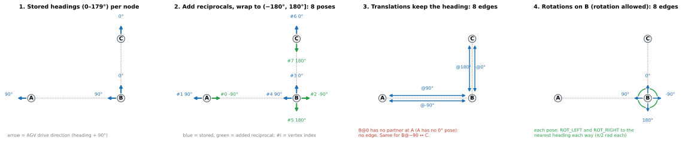

*Figure 14.1 — The expansion in four steps (A is drawn further left than its 4 m for legibility). (1) Stored headings, shown as the AGV's drive direction (heading + 90°). (2) Reciprocals added: 8 poses, numbered as BGL vertices. (3) Translations connect equal headings on neighboring nodes; B@0 has no partner at A. (4) Rotations connect B's neighboring headings in both directions.*

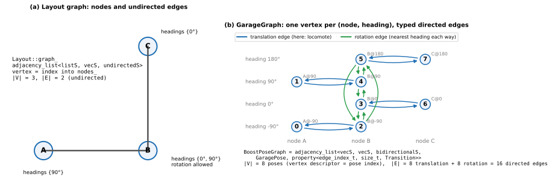

*Figure 14.2 — The same result as two graphs: (a) the layout graph, 3 vertices and 2 undirected edges; (b) the garage graph, drawn as a node × heading grid, with 8 vertices and 16 directed edges.*

The complete edge list, in the order `GarageGraph` adds edges (vertex by vertex, then slot by slot in the order `FORWARD, RIGHT, BACK, LEFT, ROT_RIGHT, ROT_LEFT, VRC_UP, VRC_DOWN`), which therefore also gives each edge's **edge index** $\varepsilon$ (Step 10):

| Edge index $\varepsilon$ | From (vertex) | To (vertex) | Slot | Type | Length |
|---:|---|---|---|---|---|
| 0 | A@-90 (0) | B@-90 (2) | `LEFT` | locomote | 4 m |
| 1 | A@90 (1) | B@90 (4) | `RIGHT` | locomote | 4 m |
| 2 | B@-90 (2) | A@-90 (0) | `RIGHT` | locomote | 4 m |
| 3 | B@-90 (2) | B@180 (5) | `ROT_RIGHT` | rotation | 1.571 rad |
| 4 | B@-90 (2) | B@0 (3) | `ROT_LEFT` | rotation | 1.571 rad |
| 5 | B@0 (3) | C@0 (6) | `LEFT` | locomote | 4 m |
| 6 | B@0 (3) | B@-90 (2) | `ROT_RIGHT` | rotation | 1.571 rad |
| 7 | B@0 (3) | B@90 (4) | `ROT_LEFT` | rotation | 1.571 rad |
| 8 | B@90 (4) | A@90 (1) | `LEFT` | locomote | 4 m |
| 9 | B@90 (4) | B@0 (3) | `ROT_RIGHT` | rotation | 1.571 rad |
| 10 | B@90 (4) | B@180 (5) | `ROT_LEFT` | rotation | 1.571 rad |
| 11 | B@180 (5) | C@180 (7) | `RIGHT` | locomote | 4 m |
| 12 | B@180 (5) | B@90 (4) | `ROT_RIGHT` | rotation | 1.571 rad |
| 13 | B@180 (5) | B@-90 (2) | `ROT_LEFT` | rotation | 1.571 rad |
| 14 | C@0 (6) | B@0 (3) | `RIGHT` | locomote | 4 m |
| 15 | C@180 (7) | B@180 (5) | `LEFT` | locomote | 4 m |

**The same graph built with the real BGL type** **[run]**. This program uses Volley's exact `BoostPoseGraph` type, with stand-in structs that have the same fields as `GaragePose` and `Transition`. It adds the 8 poses and 16 edges exactly as `GarageGraph`'s constructor does (vertex per pose, then edges with an explicit edge index), and prints what BGL holds:

```cpp
#include <boost/graph/adjacency_list.hpp>
#include <boost/property_map/vector_property_map.hpp>
#include <cstdint>
#include <iostream>
#include <unordered_map>
#include <vector>

// Stand-ins for interfaces/GaragePose and common_ros::Transition (same fields)
struct GaragePose { uint32_t node_id = 0; int16_t heading = 0; };
enum class TransitionType { LOCOMOTE, STRAFE, ROTATION, VRC_TRANSITION };
struct Transition { double length = 0.0; TransitionType type = TransitionType::LOCOMOTE; };

// The exact type used by common_ros::GarageGraph
using BoostPoseGraph = boost::adjacency_list<boost::vecS, boost::vecS, boost::bidirectionalS, GaragePose,
    boost::property<boost::edge_index_t, std::size_t, Transition>>;

int main() {
  // Poses in PoseGraph order (node id, then heading): node 1 = A, 2 = B, 3 = C
  const std::vector<GaragePose> poses = {
      {1u, -90},
      {1u, 90},
      {2u, -90},
      {2u, 0},
      {2u, 90},
      {2u, 180},
      {3u, 0},
      {3u, 180}};
  struct Neighbor { int src, dst; double length; TransitionType type; };
  // Non-empty neighbor slots, in GarageGraph's loop order (pose, then slot)
  const std::vector<Neighbor> slots = {
      {0, 2, 4.0, TransitionType::LOCOMOTE},
      {1, 4, 4.0, TransitionType::LOCOMOTE},
      {2, 0, 4.0, TransitionType::LOCOMOTE},
      {2, 5, 1.571, TransitionType::ROTATION},
      {2, 3, 1.571, TransitionType::ROTATION},
      {3, 6, 4.0, TransitionType::LOCOMOTE},
      {3, 2, 1.571, TransitionType::ROTATION},
      {3, 4, 1.571, TransitionType::ROTATION},
      {4, 1, 4.0, TransitionType::LOCOMOTE},
      {4, 3, 1.571, TransitionType::ROTATION},
      {4, 5, 1.571, TransitionType::ROTATION},
      {5, 7, 4.0, TransitionType::LOCOMOTE},
      {5, 4, 1.571, TransitionType::ROTATION},
      {5, 2, 1.571, TransitionType::ROTATION},
      {6, 3, 4.0, TransitionType::LOCOMOTE},
      {7, 5, 4.0, TransitionType::LOCOMOTE}};

  BoostPoseGraph g;
  for (const auto& p : poses) { boost::add_vertex(p, g); }              // vertex i = pose i
  auto edge_index = boost::get(boost::edge_index, g);
  for (const auto& n : slots) {
    std::size_t k = boost::num_edges(g);
    auto [e, added] = boost::add_edge(n.src, n.dst, {k, Transition{n.length, n.type}}, g);
    boost::put(edge_index, e, k);
  }
  std::cout << "num_vertices = " << boost::num_vertices(g) << ", num_edges = " << boost::num_edges(g) << "\n";
  const char* names[] = {"A", "B", "C"};
  const char* types[] = {"LOCOMOTE", "STRAFE", "ROTATION", "VRC_TRANSITION"};
  for (auto [vi, vend] = boost::vertices(g); vi != vend; ++vi) {
    const GaragePose& p = g[*vi];
    std::cout << "vertex " << *vi << " = " << names[p.node_id - 1] << "@" << p.heading
              << "  out-degree " << boost::out_degree(*vi, g) << ", in-degree " << boost::in_degree(*vi, g) << ":";
    for (auto [ei, eend] = boost::out_edges(*vi, g); ei != eend; ++ei) {
      std::cout << "  e" << boost::get(edge_index, *ei) << "->" << boost::target(*ei, g)
                << " (" << types[static_cast<int>(g[*ei].type)] << ", " << g[*ei].length << ")";
    }
    std::cout << "\n";
  }
}
```

Output **[run]**:

```text
num_vertices = 8, num_edges = 16
vertex 0 = A@-90  out-degree 1, in-degree 1:  e0->2 (LOCOMOTE, 4)
vertex 1 = A@90  out-degree 1, in-degree 1:  e1->4 (LOCOMOTE, 4)
vertex 2 = B@-90  out-degree 3, in-degree 3:  e2->0 (LOCOMOTE, 4)  e3->5 (ROTATION, 1.571)  e4->3 (ROTATION, 1.571)
vertex 3 = B@0  out-degree 3, in-degree 3:  e5->6 (LOCOMOTE, 4)  e6->2 (ROTATION, 1.571)  e7->4 (ROTATION, 1.571)
vertex 4 = B@90  out-degree 3, in-degree 3:  e8->1 (LOCOMOTE, 4)  e9->3 (ROTATION, 1.571)  e10->5 (ROTATION, 1.571)
vertex 5 = B@180  out-degree 3, in-degree 3:  e11->7 (LOCOMOTE, 4)  e12->4 (ROTATION, 1.571)  e13->2 (ROTATION, 1.571)
vertex 6 = C@0  out-degree 1, in-degree 1:  e14->3 (LOCOMOTE, 4)
vertex 7 = C@180  out-degree 1, in-degree 1:  e15->5 (LOCOMOTE, 4)
```

Every translation-only pose (on A and C) has one way in and one way out; each B pose has three (one translation and two rotations). Summing the out-degrees gives $1 + 1 + 3 \cdot 4 + 1 + 1 = 16 = |E|$, as it must, since every edge leaves exactly one vertex.

### 14.7 The general counts

For any layout,

$$
|V| = \sum_n |\tilde H_n|,\qquad
|E| = \sum_{\{n, n'\} \in \mathcal{E}} 2\,\big\lvert \tilde H_n \cap \tilde H_{n'} \big\rvert \;+\; \sum_{n : \rho_n,\ |\tilde H_n| > 1} 2\,|\tilde H_n| ,
$$

where $\rho_n$ means that node $n$ allows rotation. Two corrections apply: translations whose heading matches the edge's *disallowed orientation* are dropped, and when a node has exactly two allowed headings, its two rotation neighbors are the same pose but still two separate edges. VRC rides are translations between floors, with the same shared-heading rule.

---

## 15. The layout graph — `common_ros` `Layout::graph_` [seen: document 18]

```cpp
// layout.hpp
using graph = boost::adjacency_list<boost::listS, boost::vecS, boost::undirectedS>;
```

Read by parameter: `listS` out-edge lists, `vecS` vertices (so a vertex is an index), undirected edges, **no data attached** (parameters 4–7 left at their defaults).

- **Vertex $i$ means `nodes_[i]`,** the $i$-th node in id order. Node ids are mapped to vertices with `node_id_to_index_` ($\iota_\mathcal{N}$ in document 18, section 3.1.1).
- **Built in the constructor:** `boost::add_edge(node_id_to_index_[a], node_id_to_index_[b], graph_)` for every YAML edge, plus edges between adjacent floors of each VRC (Vertical Reciprocating Conveyor).
- **Used for:**
  - `HasEdge(src, dst)` — `boost::edge(ι(src), ι(dst), graph_).second`, $O(\deg)$;
  - `GetNeighboringNodes(id)` — `boost::adjacent_vertices` (this is what Step 3 of section 14 iterates);
  - `GetGarageLayout()` — walks `boost::edges(graph_)` to build the `GarageLayout` message. It writes `source(e)` and `target(e)`, which are **indices into `nodes`**, not node ids (pitfall 20.2).

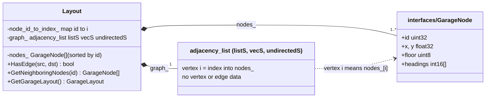

---

## 16. The garage graph — `common_ros` `GarageGraph::base_graph_` [seen: document 18]

```cpp
// garage_graph.hpp
using BoostPoseGraph = boost::adjacency_list<boost::vecS, boost::vecS, boost::bidirectionalS, GaragePoseMsg,
    boost::property<boost::edge_index_t, std::size_t, Transition>>;
```

Read by parameter, using Part I:

| Parameter | Value | Meaning here | Part I step |
|---|---|---|---|
| 1 | `vecS` | each pose's out-edges in a vector; parallel edges are allowed, and do occur: on a rotation node with exactly two allowed headings, `ROT_LEFT` and `ROT_RIGHT` both lead to the reciprocal, giving two edges (each $\pi$ rad) between the same two vertices | 4 |
| 2 | `vecS` | vertex = pose index (section 14.3) | 4 |
| 3 | `bidirectionalS` | out-edges *and* in-edges: "which moves end at this pose" is $O(\deg^-)$ | 3 |
| 4 | `GaragePoseMsg` | each vertex holds its pose: `g[v].node_id`, `g[v].heading` | 5 |
| 5 | `property<edge_index_t, size_t, Transition>` | each edge holds an index (by tag) and a `Transition {length, type}` (by `g[e]`) | 10 |

**Members of `GarageGraph`:**
- **`base_graph_`** — the BGL graph above.
- **`pose_to_vertex_`** — an `unordered_map<GaragePose, Vertex>`, the inverse of the vertex data (using the `std::hash<GaragePose>` in `garage_graph.hpp`).
- **`edge_index_`** — the interior edge-index map, `boost::get(boost::edge_index, base_graph_)`.
- **`edge_index_to_vertices_`** — `edge_index_to_vertices_[k]` = the endpoints of edge $k$, for $O(1)$ lookup from an index.
- **`layout_`** — the shared layout, for geometry.

| Method | Returns | Implementation (Part I terms) |
|---|---|---|
| `GetVertexFromPose(p)` | the vertex of pose $p$ | `pose_to_vertex_` lookup |
| `GetPoseFromVertex(v)` | the pose at vertex $v$ | `boost::get(boost::vertex_bundle, base_graph_)[v]`, i.e. `g[v]` |
| `EdgeFromPoses(p, q)` | the edge between two poses, if any | `boost::edge(...)`, $O(\deg^+)$ |
| `GetTransition(e)` | the edge's `Transition` | `g[e]` |
| `GetEdgeIndex(e)`, `VerticesFromEdgeIndex(k)` | $\varepsilon(e)$, and the inverse | `edge_index_`, `edge_index_to_vertices_` |
| `GetInEdges`, `GetOutEdges`, `GetVertices`, `GetEdges` | iterator pairs | `in_edges`, `out_edges`, `vertices`, `edges` |
| `MakeVertexVectorPropertyMap<T>()`, `MakeEdgeVectorPropertyMap<T>()` | one `T` per vertex or per edge | `vector_property_map` on the vertex or edge index |
| `LocationFromVertex(v)` | the pose's position and yaw | through the layout (document 18, section 3.1.2) |
| `GetBaseGraph()` | `const BoostPoseGraph&` | for running BGL algorithms directly |

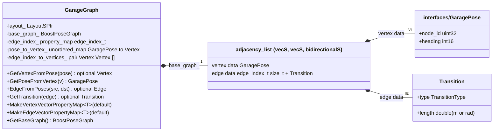

**How the constructor builds it** (the steps of section 14, in code):

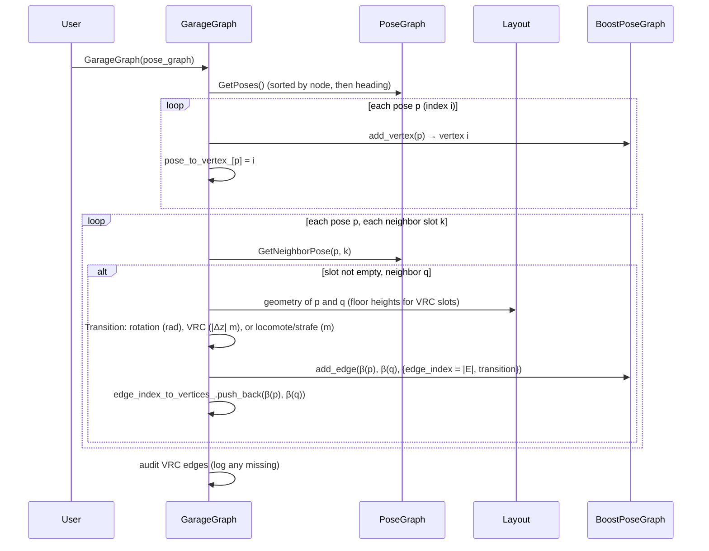

**Memory.** With `bidirectionalS`, every edge is recorded in its source's out-list and its target's in-list, and its data (index and `Transition`, about 24 bytes) is stored once in the global edge list:

$$
\text{memory} \approx n\,\big(\text{sizeof(GaragePose)} + 2\cdot\text{sizeof(vector)}\big) + m\,\big(2\cdot\text{sizeof(edge record)} + 24\ \text{bytes} + \text{list overhead}\big).
$$

The graph is never changed after construction, so none of the invalidation rules of Step 4 apply afterwards, and concurrent read-only use from several threads is safe.

---

## 17. The event DAG — `planner_core` `DagBase<T>::dag_` [seen: document 21]

```cpp
// event_dag.hpp
using DagT = boost::adjacency_list<boost::vecS, boost::vecS, boost::bidirectionalS, std::shared_ptr<T>>;
```

Read by parameter: vectors for both, bidirectional (so an event's parents are its in-edges), and each vertex holds a `shared_ptr` to an event; edges carry no data.

- **`ptr_to_vertex_`** (an `unordered_map<shared_ptr<T>, Vertex>`) is the inverse of the vertex data, keyed by pointer identity.
- **The DAG is changed after construction.** Events and dependencies are added *and removed*. Because vertices are `vecS`, removal renumbers (Step 4). `RemoveVertexHelper` therefore removes the vertex's edges, repairs `ptr_to_vertex_` for every later vertex in $O(n)$, and only then calls `boost::remove_vertex`. A vertex number kept by a caller from before the removal is stale (Figure 17.1); document 21 recommends addressing events by pointer.
- **Algorithms:**
  - `boost::topological_sort` in the base class (Step 9);
  - a Volley-written Kahn ordering by job index in `ScheduleEventDag` (section 18.2);
  - a Volley-written transitive reduction, `Reduce`, although `transitive_reduction.hpp` is included;
  - `boost::write_graphviz` for debugging.

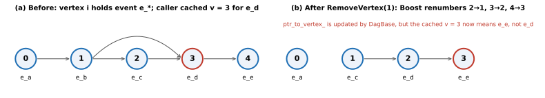

*Figure 17.1 — Removing vertex 1 from a `vecS` graph renumbers every later vertex. `DagBase` updates its pointer-to-vertex map, but a vertex number cached by the caller (3, which pointed at `e_d`) now refers to a different event.*

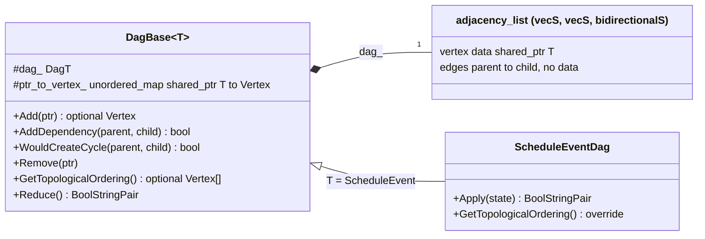

---

## 18. Property maps and algorithms in Volley

### 18.1 Property maps

| Part I idea | Volley use |
|---|---|
| `g[v]`, `g[e]` (Step 5) | `GarageGraph::GetPoseFromVertex`, `GetTransition`; `DagBase` reads `dag_[v]` through `boost::get(boost::vertex_bundle, dag_)[v]` |
| Interior tagged map (Step 10) | `GarageGraph::edge_index_` |
| `vector_property_map` on an index (Steps 6, 10) | `GarageGraph::VertexVectorPropertyMap<T>`, `EdgeVectorPropertyMap<T>`, created by `MakeVertexVectorPropertyMap` and `MakeEdgeVectorPropertyMap`, optionally filled with a default |
| Member map `get(&Struct::field, g)` (Step 6) | Possible as `get(&Transition::length, g)`, but that gives metres *or* radians depending on the edge type, not a time (section 19) |

The neighbor-slot classification of section 14.4, written out: for pose $(n, h)$ and layout neighbor $n'$,

$$
\beta = \operatorname{wrap}_{(-\pi, \pi]}\!\big(\operatorname{atan2}(y_{n'} - y_n,\ x_{n'} - x_n) - h\big),\qquad
\text{slot} = \begin{cases}\texttt{FORWARD} & |\beta| < 0.1\\ \texttt{LEFT} & |\beta - \tfrac{\pi}{2}| < 0.1\\ \texttt{BACK} & |\beta - \pi| < 0.1\\ \texttt{RIGHT} & |\beta + \tfrac{\pi}{2}| < 0.1\\ \text{error (constructor throws)} & \text{otherwise.}\end{cases}
$$

Because the AGV drives along body $+y$, the `LEFT` slot is its forward drive direction, and `FORWARD`/`BACK` are strafes.

### 18.2 Algorithms

| Algorithm (Part I) | In Volley so far |
|---|---|
| `edge(u, v, g)` | `Layout::HasEdge`, `GarageGraph::EdgeFromPoses`, `DagBase::HasDependency` |
| iteration (`vertices`, `edges`, `out_edges`, `in_edges`, `adjacent_vertices`) | everywhere |
| `topological_sort` | `DagBase::GetTopologicalOrdering`, overridden in `ScheduleEventDag` by Kahn's algorithm with the smallest job index first: $\sigma(k+1) = \arg\min_{v \in R_k} j(v)$, where $R_k$ is the set of events whose parents are all done (document 21, section 7.1) |
| `write_graphviz` | `DagBase::DrawGraph`, `ToDotFormatString`; layout printing |
| `transitive_reduction`, `filtered_graph` | headers included, **not used** |
| `breadth_first_search`, `depth_first_search` | not seen (`WouldCreateCycle` is a hand-written BFS (breadth-first search)) |
| `dijkstra_shortest_paths`, `astar_search` | **not seen yet**: expected in the motion planner or scheduler (section 21) |

---

## 19. Planning on the garage graph

This section shows how the Part I algorithms would run on `GarageGraph`, using Volley's cost model for weights. The code is **[illustrative]**: written against Volley's types, not taken from the repository.

### 19.1 Edge weights from the cost model

A route planner wants *time*, so each edge's weight is its `Transition` turned into seconds by `cost_functions` (document 20):

$$
w(e) = T_{m(e)}(\lambda_e) = \begin{cases} 2\sqrt{\lambda_e / a_m} & \lambda_e < v_m^2 / a_m\\ v_m / a_m + \lambda_e / v_m & \text{otherwise,}\end{cases}
$$

with $\lambda_e$ the transition length, and $v_m$, $a_m$ the speed and acceleration limits of the edge's motion type $m$ (loaded or not).

### 19.2 Dijkstra over the garage graph [illustrative]

```cpp
#include <boost/graph/dijkstra_shortest_paths.hpp>
#include <cost_functions/motion_cost_model.hpp>

std::optional<std::vector<GaragePoseMsg>> FastestRoute(const volley::GarageGraph& gg,
    const volley::cost::MotionCostModel& model, GaragePoseMsg from, GaragePoseMsg to, bool loaded) {
  const auto s = gg.GetVertexFromPose(from);
  const auto t = gg.GetVertexFromPose(to);
  if (!s || !t) { return std::nullopt; }
  const auto& g = gg.GetBaseGraph();
  auto w = gg.MakeEdgeVectorPropertyMap<double>(0.0);                     // Step 10: one double per edge
  for (auto [it, end] = gg.GetEdges(); it != end; ++it) {
    boost::put(w, *it, model.Duration(*gg.GetTransition(*it), loaded).count());
  }
  auto dist = gg.MakeVertexVectorPropertyMap<double>();                   // Step 6: one double per vertex
  auto pred = gg.MakeVertexVectorPropertyMap<volley::GarageGraph::Vertex>();
  boost::dijkstra_shortest_paths(g, *s, boost::weight_map(w).distance_map(dist).predecessor_map(pred));
  if (*t != *s && boost::get(pred, *t) == *t) { return std::nullopt; }      // unreachable
  std::vector<GaragePoseMsg> route;
  for (auto v = *t; v != *s; v = boost::get(pred, v)) { route.push_back(gg.GetPoseFromVertex(v)); }
  route.push_back(from);
  std::reverse(route.begin(), route.end());
  return route;   // then CoalesceMotionRuns(route, gg) for the real duration (document 20)
}
```

On the example of section 14, a route from A@90 to C@0 is A@90 → B@90 → (rotate) B@0 → C@0: two locomotes of 4 m and one quarter turn.

A function property map can replace the stored weight vector, computing each weight when the algorithm asks for it:

```cpp
#include <boost/property_map/function_property_map.hpp>
auto w = boost::make_function_property_map<volley::GarageGraph::Edge, double>(
    [&](const volley::GarageGraph::Edge& e) { return model.Duration(gg.GetBaseGraph()[e], loaded).count(); });
```

### 19.3 An A* heuristic that fits

Let $\mathbf{x}_v$ be the planar position of pose $v$'s node, and $v_\text{max}$ the fastest speed of any motion mode (1.0 m/s, unloaded locomote, by default). Then

$$
h(v) = \frac{\lVert \mathbf{x}_v - \mathbf{x}_g\rVert_2}{v_\text{max}}
$$

is consistent for the garage graph:
- **Translations.** An edge of length $\lambda = \lVert \mathbf{x}_u - \mathbf{x}_v\rVert$ costs $T(\lambda) \ge \lambda / v_m \ge \lambda / v_\text{max}$. In the trapezoid case, $v/a + \lambda/v \ge \lambda/v$. In the triangle case, $\lambda < v^2/a$ gives $\lambda/v < \sqrt{\lambda/a} < 2\sqrt{\lambda/a}$. With the triangle inequality,

$$
h(u) \le \frac{\lVert \mathbf{x}_u - \mathbf{x}_v\rVert}{v_\text{max}} + h(v) \le w(u, v) + h(v).
$$

- **Rotations and VRC rides** do not change $\mathbf{x}$, so $h(u) = h(v) \le w(u, v) + h(v)$.
- **Extra non-negative costs** (wheel turns, lifts) only increase $w$.

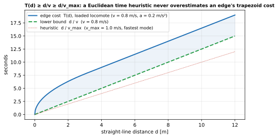

*Figure 19.1 — A straight-line time heuristic never exceeds an edge's trapezoid cost: $T(d) \ge d/v \ge d/v_\text{max}$.*

### 19.4 What plain edge weights cannot express

- **Wheel turns depend on the previous edge's type,** and a straight run costs less than the sum of its edges (document 20, sections 3.2 and 7.3). An exact search needs a state that includes the last motion mode, for example a graph over (pose, mode) pairs. Per-edge trapezoid weights *overestimate* run costs, so they are pessimistic but safe.
- **Conflicts with other AGVs over time** are outside a static graph search; SIPP (Safe Interval Path Planning), mentioned in document 20, addresses them.

### 19.5 Makespan of a schedule DAG [illustrative]

For a DAG of events with durations $\tau_v \ge 0$, the earliest start of each event and the makespan are a longest-path computation in topological order, $O(n + m)$:

$$
s_v = \max_{(u, v) \in E}(s_u + \tau_u)\quad(s_v = 0 \text{ for roots}),\qquad T_\text{makespan} = \max_v (s_v + \tau_v).
$$

```cpp
auto order = dag.GetTopologicalOrdering().value();       // nullopt only if cyclic
std::vector<double> start(dag.NumVertices(), 0.0);
for (auto v : order) {
  const double end_v = start[v] + duration_of(v);         // duration_of: from cost_functions
  for (auto [e, e_end] = dag.GetOutEdges(v); e != e_end; ++e) {
    auto c = dag.GetTargetVertex(*e);
    start[c] = std::max(start[c], end_v);
  }
}
```

---

## 20. Pitfalls, tied to RISK items in the package documents

| # | Pitfall | Part I step | Volley status | Mitigation |
|---|---|---|---|---|
| 20.1 | Stale descriptors after removal | 4 | **Bites in `planner_core`**: `DagBase` repairs its own map, but caller-held `Vertex` numbers go stale (Figure 17.1; document 21) | Address events by pointer |
| 20.2 | Index versus id | 5 | **Bites in `Layout::GetGarageLayout`**: the `Edge` message carries node *indices* (its comment says "Source node index"), while the YAML uses node *ids* | Index `nodes[edge.src]`; never `GetNodeById(edge.src)` |
| 20.3 | Cycles in a "DAG" | 9 | `DagBase::AddDependency` accepts cycle-forming edges (document 21, R2) | Call `WouldCreateCycle` first |
| 20.4 | Data races | — | The layout and garage graphs are never changed after construction, so concurrent reads are safe; the event DAG is not thread-safe | Keep DAGs on one thread; give each search its own maps |
| 20.5 | Exceptions from algorithms | 8, 9 | `DagBase` catches `std::exception` around `topological_sort` | Catch at the planning-function boundary, return `optional` |
| 20.6 | Allocation in hot paths | 7 | — (no searches seen yet) | Reuse vector property maps between searches |
| 20.7 | Invalid weights | 7 | Cost-model parameters are not validated (document 20, R1): a zero speed gives infinite weights, which silently hide edges | Validate speeds and accelerations at startup |
| 20.8 | Inadmissible heuristic | 8 | — | Use section 19.3's heuristic; test A* against Dijkstra |
| 20.9 | Unused includes | — | `filtered_graph.hpp` in `garage_graph.hpp`, `transitive_reduction.hpp` in `event_dag.hpp` | Remove, or use `filtered_graph` to hide disabled nodes per query without changing the graph |
| 20.10 | Compiler warnings inside Boost | — | `DagBase::Add` and `GarageGraph`'s constructor silence GCC's `-Wmaybe-uninitialized` around `add_vertex` (a known false positive involving Boost.Function); Boost is on system include paths (document 10) | Keep it that way |
| 20.11 | Linking | — | Volley only *writes* Graphviz, so nothing needs the compiled Boost.Graph library | `find_package(Boost REQUIRED CONFIG)` is enough |
| 20.12 | Shell execution of `.dot` output | — | `PrintGraph` pipes through `graph-easy` with `popen` (document 18, R23) | Debug use only |

---

## 21. What to check in the motion planner and scheduler packs

| Question | Why it matters | Where to look |
|---|---|---|
| Is the route search a BGL algorithm (Dijkstra, A*) or hand-written (SIPP)? | Visitors, exceptions and named parameters apply only to BGL algorithms | `motion_planner/src/**` |
| What is the edge weight: `Transition.length`, a cost-model time, or a time with wheel turns? | Units, the heuristic of section 19.3, and the per-edge versus per-run gap | weight maps, `MotionCostModel` calls |
| How are disabled nodes and occupied poses excluded: `filtered_graph`, removal, or costs? | Changing the graph would break the read-only property that makes it thread-safe | planner setup per query |
| Are property maps reused or allocated per query? | Pitfall 20.6 | search functions |
| Is a time-expanded graph built (pose × time step), or are safe intervals used? | With $n$ poses and $K$ steps, an explicit graph has $n(K + 1)$ vertices | scheduler and motion planner |
| Does anything read `GarageLayout.edges` as node ids? | Pitfall 20.2 | Python packages (`vis`, `scenario`) |

```bash
rg -n 'dijkstra_shortest_paths|astar_search|breadth_first_search|depth_first_search|filtered_graph|dag_shortest_paths' src/
rg -n 'GetBaseGraph\(\)|MakeVertexVectorPropertyMap|MakeEdgeVectorPropertyMap' src/
rg -n 'default_(astar|dijkstra|bfs)_visitor|examine_vertex' src/
```

---

## 22. Glossary

| Term | Meaning |
|---|---|
| BGL | Boost Graph Library: header-only, generic graph containers and algorithms. |
| `adjacency_list` | BGL's main graph container: a list of vertices, each with a list of its edges. |
| Selector (`vecS`, `listS`, `setS`) | A template argument choosing the container for vertices or edges (Step 4). |
| `directedS` / `bidirectionalS` / `undirectedS` | One-way edges with out-lists only; one-way edges with out- and in-lists; two-way edges (Step 3). |
| Descriptor | A non-owning handle to a vertex or edge; with `vecS` vertices, a vertex descriptor is an index. |
| Bundled property | A user struct stored in each vertex or edge, accessed as `g[v]` or `g[e]` (Step 5). |
| Tagged property | `boost::property<Tag, T, Next>`: a value found by its tag, chained to more properties (Step 10). |
| Property map | The `get`/`put` interface to per-vertex or per-edge data (Step 6). |
| Vertex index, edge index | An integer per vertex or edge in $0 \dots n-1$ or $0 \dots m-1$; free for `vecS` vertices, not provided for edges. |
| `vector_property_map` | A vector-backed property map addressed through an index map; copies share storage. |
| Named parameters | An algorithm's optional arguments chained with `.` (Step 7). |
| Visitor | A callback object receiving search events; early exit is done by throwing (Step 8). |
| Relaxation | $d_v \leftarrow \min(d_v,\ d_u + w(u, v))$. |
| Admissible / consistent heuristic | $h(v) \le d(v, g)$ / $h(u) \le w(u, v) + h(v)$. |
| Topological order | A vertex order in which every edge points forward; exists exactly for DAGs (Step 9). |
| Pose | In Volley, a (node, heading) pair; one garage-graph vertex (section 14). |
| Reciprocal | The heading turned by 180°; layout files store one of the two, and both are allowed. |
