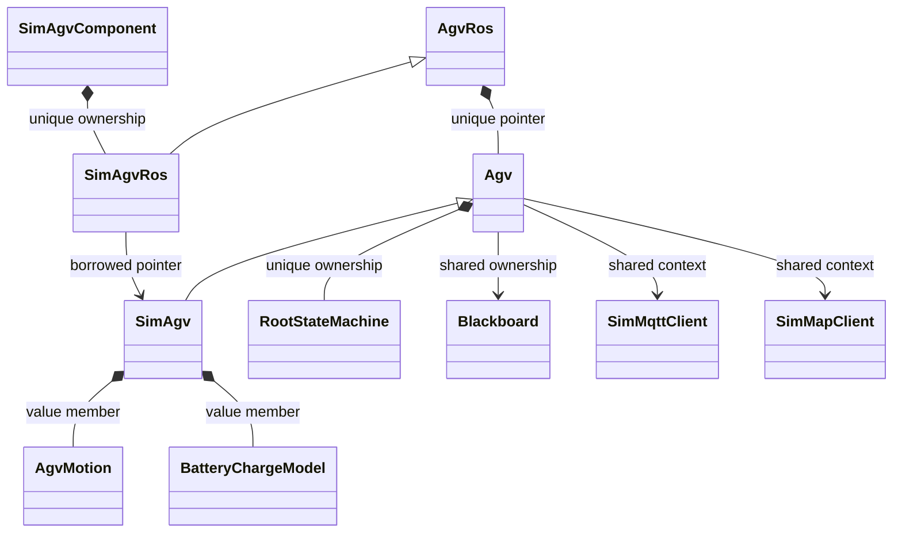
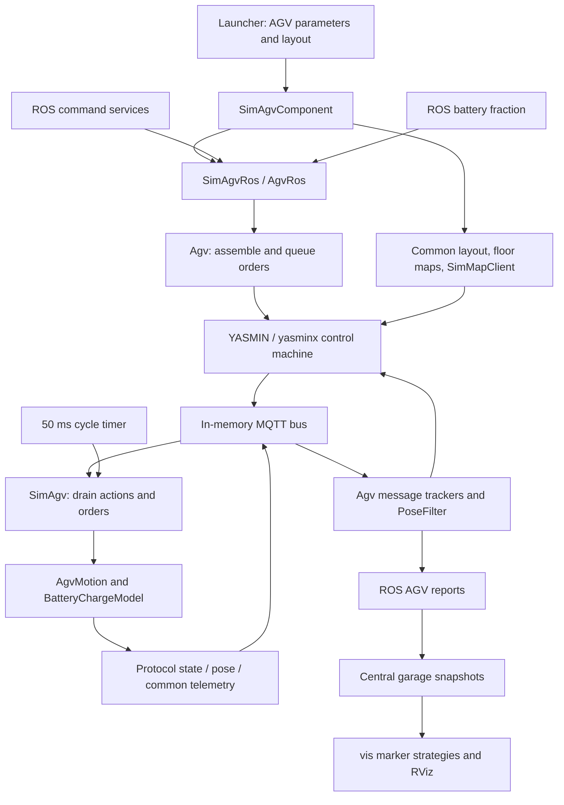
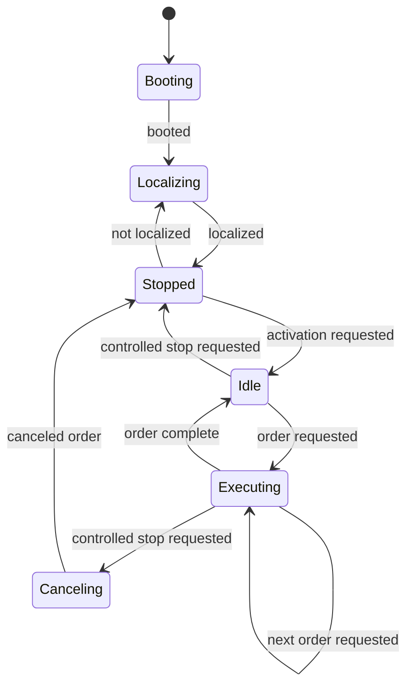
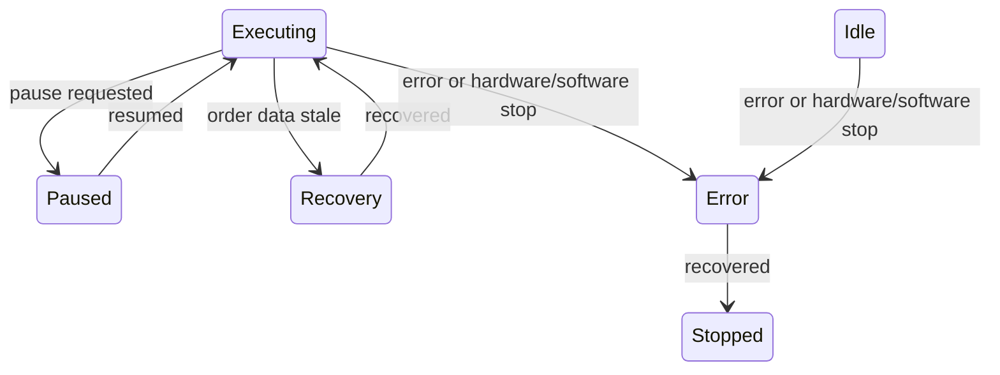
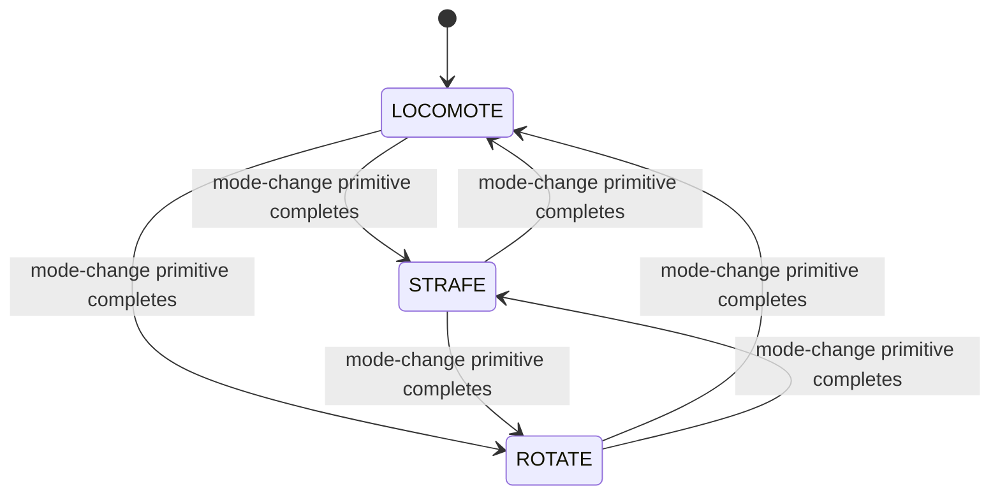
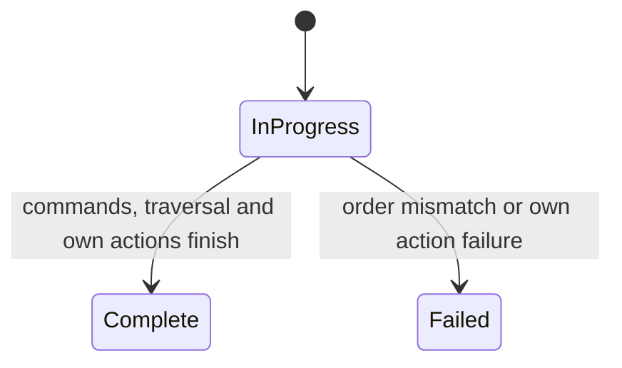

# Volley `agvhito` Package: HITO AGV Integration and Simulation

Companion guides: [overview](volley_simulation_guide.md), [sim](volley_sim_package.md), [vis](volley_vis_package.md), [launcher](volley_launcher_package.md), and [runbook](volley_simulation_runbook.md).

## Acronyms, abbreviations, and project names

HITO is a vendor/project label in this source; its formal expansion is not supplied. Code identifiers, file paths, and protocol strings retain their exact spelling. The following glossary makes this file independently readable.

| Term | Meaning and role here |
| --- | --- |
| ROS | Robot Operating System; these guides use ROS 2. Framework for nodes, messages, services, parameters and execution. |
| AGV | Automated guided vehicle. Mobile robot that transports parking trays. |
| VRC | Vertical reciprocating conveyor (standard equipment term). Here, a floor-to-floor carriage/lift with gates. The project source does not explicitly spell out its name; the conventional expansion is documented by [Wildeck](https://www.wildeck.com/vertical-conveyors-vrcs/). |
| HITO | Project/vendor label used by `agvhito`; its formal expansion is not stated in the supplied source. AGV simulation component and production AGV proxy/driver family. |
| API | Application programming interface. Callable C++/Python interfaces, ROS endpoints or the web service, depending on context. |
| UML | Unified Modeling Language. Class diagrams used to explain types and ownership. |
| TF | ROS transform system/library; TF is used as its conventional name, not a supplied formal letter expansion. Relationships between coordinate frames; marker poses here do not imply per-asset TF broadcasts. |
| QoS | Quality of service. Message delivery policies such as reliability, history depth and durability. |
| HTTP | Hypertext Transfer Protocol. Map-server web requests; ROS services are a separate request/response interface. |
| MQTT | Messaging protocol name; historically MQ Telemetry Transport, also expanded as Message Queuing Telemetry Transport in [OASIS terminology](https://www.oasis-open.org/committees/tc_home.php?wg_abbrev=mqtt). Broker-based publish/subscribe transport used by the production proxy; [protocol overview](https://mqtt.org/faq/). |
| I/O | Input/output. Sensor/driver interfaces or external data exchanges. |
| UUID | Universally unique identifier. Identifier type/notation used by generated interfaces and helper tools. |
| ID | Identifier. Numeric resource identity or a named configuration identifier. |
| YASMIN | Yet Another State MachINe. Control state machine used by both the production adapter and SimAgv; yasminx is the repository extension layer. |
| YAML | YAML Ain’t Markup Language (recursive acronym). Scenario, layout and parameter configuration format. |
| JSON | JavaScript Object Notation. VDA5050 messages and map payloads. |
| MD5 | Message Digest Algorithm 5. Layout-file checksum helper name; no security claim is implied. |
| RViz | ROS visualization application; a product/tool name rather than a supplied formal acronym. Displays MarkerArray messages and meshes; does not simulate physical motion. |
| TB / TD | Top-to-bottom / top-down Mermaid layout directives. Diagram orientation; not application components. |
| Msg / Srv / SPtr / UPtr | Message / service / shared pointer / unique pointer naming abbreviations. C++ aliases such as GarageSnapshotMsg and AddTraySrv; ConstSharedPtr is shared ownership of const data. |
| VDA5050 | VDA = Verband der Automobilindustrie (German Association of the Automotive Industry); 5050 is the specification number. [Official specification overview](https://www.vda.de/de/themen/automobilindustrie/vda-5050). Communication interface for mobile robots and their control system; `vda5050_interfaces` supplies its types. The code pins message version `2.1.0`; the vendor extensions use `hitov2`. |
| MGS | Magnetic guide sensor; measures guide-relative lateral and angular alignment. |
| IIR | Infinite impulse response; heading filter reuses its previous output. |
| SOC | State of charge; battery fraction in the interval [0, 1]. |
| RFID | Radio-frequency identification; tray identification is not implemented in the simulated report path. |
| FB / LR | Front/back and left/right sensor pairs. |
| E-stop | Emergency stop; distinguish hardware stop, software stop, and a controlled stop. |
| SemVer | Semantic versioning; firmware compatibility range parsing. |
| Hz | Hertz, or cycles per second. Units: m = metres; s = seconds; ms = milliseconds; rad = radians. |
| TLS | Transport Layer Security; encrypted transport protocol. No explicit map-client TLS configuration appears here. |
| XY / XYZ | Coordinate-axis notation, not acronyms; planar positions use X/Y and vertical height uses Z. |
| rclcpp / rclcppx | ROS client library for C++ / repository extensions to that library. |
| stdx | Repository utility/standard-library extension namespace; defines the expected-result helpers used here. |
| CMake / ament / Eigen | Build-system name / ROS build framework / C++ linear-algebra library; product names. |
| gtest | GoogleTest, the C++ testing framework. |

## 1. Summary, package design, and evidence

`agvhito` provides the bridge between Volley ROS commands/reports and HITO robot protocol messages. Production uses a discovery/instance manager, network MQTT client, HTTP map client, and firmware checks. Simulation supplies a robot implementation beneath the same adapter: orders and instant actions travel through an in-memory bus, and C++ kinematics generates pose, lift, battery, and protocol telemetry. Dependents can use the same ROS service/report interfaces for real and simulated robots.

**This is the AGV movement engine.** `sim::Simulator` orchestrates the world and scenarios; `agvhito::sim::SimAgv` moves each robot; `vis` builds display markers; RViz renders them. No Gazebo/Ignition physics engine or force/torque, suspension, contact, wheel slip, or mecanum-wheel dynamics model appears in this implementation. Acceleration and braking limits are kinematic constraints.

**Python dynamics conclusion:** the supplied `sim`, `launcher`, and now `agvhito` source/build files contain no imports, subprocess calls, installation hooks, or links to `src/sim/python/agv_simulation`. The inspected launch path reaches this C++ model directly. That Python project is therefore not used by this inspected simulation path; this is not a claim about every omitted repository tool.

Evidence is all files extracted from `agvhito-repomix.md`; the inventory below includes each packed file. Test bodies, custom ROS interface definitions, `yasminx` internals, and most common/dependency implementations are absent. This is static source analysis; no build or runtime test was executed. Paths are repository relative and line counts describe extracted source, not pack offsets.

CMake defines separate `agvhito_*_lib` libraries for comms, topics, core, state machine, adapter, ROS adapter, simulation core, simulated robot, and simulated ROS adapter. It registers `volley::agvhito::ProxyComponent` (`proxy_node`) and `volley::agvhito::sim::SimAgvComponent` (`sim_agv_node`). CMake minimum is 3.28; exact installation mechanics also depend on the omitted `volley_cmake` macros. JSON, UUID generation, Eigen, MQTT abstractions, HTTP client, common layout/ROS helpers, protocol schemas, and YASMIN extensions are lower layers.

## 2. Files in the pack

| Path (repository relative) | Approx. lines | Role |
| --- | ---: | --- |
| `src/agvhito/CMakeLists.txt` | 186 | Build layered libraries, production/simulation plugins, executable aliases, and test targets. |
| `src/agvhito/include/agvhito/action_state_manager.hpp` | 46 | Declare: track and query instant-action outcomes with synchronization. |
| `src/agvhito/include/agvhito/active_order.hpp` | 92 | Declare: track command progress and completion/failure of a published order. |
| `src/agvhito/include/agvhito/agv.hpp` | 148 | Declare: own the common robot adapter, message trackers, order queue, and root state machine. |
| `src/agvhito/include/agvhito/agv_ros.hpp` | 134 | Declare: expose robot services, reports, fault handling, and periodic adapter stepping. |
| `src/agvhito/include/agvhito/aliases.hpp` | 10 | Declare: define shared project ID, clock, and protocol type aliases. |
| `src/agvhito/include/agvhito/callback_aliases.hpp` | 11 | Declare: define callbacks used across adapter and state-machine boundaries. |
| `src/agvhito/include/agvhito/comms/i_map_client.hpp` | 45 | Declare: abstract map-server operations with expected/optional results. |
| `src/agvhito/include/agvhito/comms/map_client.hpp` | 46 | Declare: implement HTTP map upload, listing, retrieval, and health requests. |
| `src/agvhito/include/agvhito/comms/map_client_connection_options.hpp` | 14 | Declare: define map-server connection host/port options. |
| `src/agvhito/include/agvhito/comms/sim_map_client.hpp` | 55 | Declare: provide an in-memory map store implementing the same map-client interface. |
| `src/agvhito/include/agvhito/comms/sim_mqtt_client.hpp` | 49 | Declare: provide an always-connected in-memory MQTT-compatible client. |
| `src/agvhito/include/agvhito/comms/sim_mqtt_publisher.hpp` | 31 | Declare: publish into the local bus through a weak implementation reference. |
| `src/agvhito/include/agvhito/comms/sim_mqtt_subscription.hpp` | 60 | Declare: provide synchronized queued receive, timeout, and shutdown notification. |
| `src/agvhito/include/agvhito/conversions.hpp` | 90 | Declare: convert headings, poses, IDs, and protocol/project representations. |
| `src/agvhito/include/agvhito/firmware_version.hpp` | 20 | Declare: define firmware compatibility specification and constants. |
| `src/agvhito/include/agvhito/instance_manager.hpp` | 138 | Declare: discover production robots and gate construction on central registration and factsheets. |
| `src/agvhito/include/agvhito/instant_action_assembler.hpp` | 52 | Declare: build vendor/protocol instant actions and their parameters. |
| `src/agvhito/include/agvhito/layout_utils.hpp` | 36 | Declare: resolve layout/protocol node identities and movement directions. |
| `src/agvhito/include/agvhito/magnetic_guide_sensor.hpp` | 87 | Declare: estimate guide-relative offsets and yaw from magnetic sensor pairs. |
| `src/agvhito/include/agvhito/msg_conversions.hpp` | 179 | Declare: convert internal state/protocol values into ROS report values. |
| `src/agvhito/include/agvhito/order_assembler.hpp` | 79 | Declare: translate application command lists into protocol orders and map-specific segments. |
| `src/agvhito/include/agvhito/order_queue.hpp` | 54 | Declare: synchronize insertion, deduplication, and removal of pending orders. |
| `src/agvhito/include/agvhito/param_utils.hpp` | 56 | Declare: load layout, speed-limit, and firmware-range parameters. |
| `src/agvhito/include/agvhito/pose_filter.hpp` | 78 | Declare: synchronize stamped pose observations and filter heading. |
| `src/agvhito/include/agvhito/print_utils.hpp` | 18 | Declare: format protocol and command values for diagnostics. |
| `src/agvhito/include/agvhito/sim/action_utils.hpp` | 62 | Declare: interpret action parameters and build simulated action status. |
| `src/agvhito/include/agvhito/sim/agv_motion.hpp` | 90 | Declare: integrate linear, angular, mode-change, lift, waypoint, and braking primitives. |
| `src/agvhito/include/agvhito/sim/battery_charge_model.hpp` | 40 | Declare: integrate clamped charge/drain fractions independently of voltage. |
| `src/agvhito/include/agvhito/sim/kinematic_limits.hpp` | 31 | Declare: define translational/angular acceleration and actuator timing options. |
| `src/agvhito/include/agvhito/sim/motion_types.hpp` | 131 | Declare: define kinematic state, drive modes, waypoints, and motion variants. |
| `src/agvhito/include/agvhito/sim/order_parsing_utils.hpp` | 20 | Declare: parse released protocol orders into a queue of motion primitives. |
| `src/agvhito/include/agvhito/sim/sim_agv.hpp` | 220 | Declare: implement the simulated robot beneath the common Agv adapter. |
| `src/agvhito/include/agvhito/sim/sim_agv_ros.hpp` | 62 | Declare: add simulated telemetry timers, velocity publication, and battery updates. |
| `src/agvhito/include/agvhito/sim/topic_conversions.hpp` | 118 | Declare: convert simulated kinematic/actuator state into protocol telemetry. |
| `src/agvhito/include/agvhito/sm/blackboard.hpp` | 100 | Declare: define typed shared state-machine keys and request access. |
| `src/agvhito/include/agvhito/sm/booting_state.hpp` | 18 | Declare: wait for state, clear stop/pause/order/error conditions, and synchronize maps. |
| `src/agvhito/include/agvhito/sm/canceling_order_state.hpp` | 25 | Declare: cancel an active order and wait for controlled-stop completion. |
| `src/agvhito/include/agvhito/sm/context_utils.hpp` | 46 | Declare: publish and verify actions/orders with polling, cancellation, and timeouts. |
| `src/agvhito/include/agvhito/sm/error.hpp` | 72 | Declare: define state-machine error categories. |
| `src/agvhito/include/agvhito/sm/error_state.hpp` | 28 | Declare: request software emergency stop, clear orders, and attempt delayed recovery. |
| `src/agvhito/include/agvhito/sm/executing_order_state.hpp` | 33 | Declare: publish/track an order and gate completion on accurate node alignment. |
| `src/agvhito/include/agvhito/sm/execution_paused_state.hpp` | 30 | Declare: wait for resume while the order is paused. |
| `src/agvhito/include/agvhito/sm/execution_recovery_state.hpp` | 29 | Declare: pause on stale data and wait for fresh telemetry before resuming. |
| `src/agvhito/include/agvhito/sm/idle_state.hpp` | 23 | Declare: wait for an order and process controlled-stop/safety outcomes. |
| `src/agvhito/include/agvhito/sm/localizing_state.hpp` | 24 | Declare: enable localization map and wait for initialized position. |
| `src/agvhito/include/agvhito/sm/root.hpp` | 12 | Declare: build the nine-state YASMIN root control machine. |
| `src/agvhito/include/agvhito/sm/state_strings.hpp` | 118 | Declare: define state/outcome names and exact transition maps. |
| `src/agvhito/include/agvhito/sm/stopped_state.hpp` | 23 | Declare: wait for activation or loss of localization. |
| `src/agvhito/include/agvhito/sm/timing.hpp` | 13 | Declare: define default state polling and logging periods. |
| `src/agvhito/include/agvhito/speed_limits.hpp` | 40 | Declare: define loaded/unloaded speed limits and their defaults. |
| `src/agvhito/include/agvhito/topics/action_types.hpp` | 22 | Declare: define protocol/vendor action-type strings. |
| `src/agvhito/include/agvhito/topics/common_msg.hpp` | 67 | Declare: define vendor common telemetry and JSON conversion. |
| `src/agvhito/include/agvhito/topics/core.hpp` | 98 | Declare: define protocol header defaults, manufacturer, version, and topic helpers. |
| `src/agvhito/include/agvhito/topics/factsheet.hpp` | 30 | Declare: define factsheet parsing and compatibility data. |
| `src/agvhito/include/agvhito/topics/instant_actions.hpp` | 131 | Declare: define instant-action message types and helpers. |
| `src/agvhito/include/agvhito/topics/map.hpp` | 62 | Declare: construct localization/floor maps and protocol map metadata. |
| `src/agvhito/include/agvhito/topics/order.hpp` | 161 | Declare: define protocol order builders, nodes, edges, and actions. |
| `src/agvhito/include/agvhito/topics/state.hpp` | 235 | Declare: define protocol state representations and conversion helpers. |
| `src/agvhito/include/agvhito/topics/state_predicates.hpp` | 140 | Declare: test localization, stop, action, and state conditions. |
| `src/agvhito/include/agvhito/tracked_message.hpp` | 98 | Declare: retain stamped protocol messages and classify source-time freshness. |
| `src/agvhito/launch/proxy.launch.py` | 77 | Describe standalone production proxy launch configuration. |
| `src/agvhito/package.xml` | 50 | Declare the ROS package, build type, and dependencies. |
| `src/agvhito/src/action_state_manager.cpp` | 59 | Track and query instant-action outcomes with synchronization. |
| `src/agvhito/src/active_order.cpp` | 204 | Track command progress and completion/failure of a published order. |
| `src/agvhito/src/agv.cpp` | 555 | Own the common robot adapter, message trackers, order queue, and root state machine. |
| `src/agvhito/src/agv_ros.cpp` | 328 | Expose robot services, reports, fault handling, and periodic adapter stepping. |
| `src/agvhito/src/comms/map_client.cpp` | 125 | Implement HTTP map upload, listing, retrieval, and health requests. |
| `src/agvhito/src/comms/sim_mqtt_client.cpp` | 29 | Provide an always-connected in-memory MQTT-compatible client. |
| `src/agvhito/src/comms/sim_mqtt_client_impl.cpp` | 69 | Synchronize local subscriptions, topic matching, routing, and client lifetime. |
| `src/agvhito/src/comms/sim_mqtt_client_impl.hpp` | 47 | Declare: synchronize local subscriptions, topic matching, routing, and client lifetime. |
| `src/agvhito/src/comms/sim_mqtt_publisher.cpp` | 29 | Publish into the local bus through a weak implementation reference. |
| `src/agvhito/src/comms/sim_mqtt_subscription.cpp` | 74 | Provide synchronized queued receive, timeout, and shutdown notification. |
| `src/agvhito/src/instance_manager.cpp` | 385 | Discover production robots and gate construction on central registration and factsheets. |
| `src/agvhito/src/instant_action_assembler.cpp` | 59 | Build vendor/protocol instant actions and their parameters. |
| `src/agvhito/src/layout_utils.cpp` | 28 | Resolve layout/protocol node identities and movement directions. |
| `src/agvhito/src/order_assembler.cpp` | 385 | Translate application command lists into protocol orders and map-specific segments. |
| `src/agvhito/src/order_queue.cpp` | 94 | Synchronize insertion, deduplication, and removal of pending orders. |
| `src/agvhito/src/pose_filter.cpp` | 99 | Synchronize stamped pose observations and filter heading. |
| `src/agvhito/src/print_utils.cpp` | 115 | Format protocol and command values for diagnostics. |
| `src/agvhito/src/proxy_component.cpp` | 75 | Construct the production proxy, real MQTT connection, and map-client context. |
| `src/agvhito/src/sim/agv_motion.cpp` | 323 | Integrate linear, angular, mode-change, lift, waypoint, and braking primitives. |
| `src/agvhito/src/sim/battery_charge_model.cpp` | 39 | Integrate clamped charge/drain fractions independently of voltage. |
| `src/agvhito/src/sim/order_parsing_utils.cpp` | 307 | Parse released protocol orders into a queue of motion primitives. |
| `src/agvhito/src/sim/sim_agv.cpp` | 681 | Implement the simulated robot beneath the common Agv adapter. |
| `src/agvhito/src/sim/sim_agv_component.cpp` | 108 | Construct one simulated robot from layout and startup parameters. |
| `src/agvhito/src/sim/sim_agv_ros.cpp` | 85 | Add simulated telemetry timers, velocity publication, and battery updates. |
| `src/agvhito/src/sm/booting_state.cpp` | 155 | Wait for state, clear stop/pause/order/error conditions, and synchronize maps. |
| `src/agvhito/src/sm/canceling_order_state.cpp` | 71 | Cancel an active order and wait for controlled-stop completion. |
| `src/agvhito/src/sm/context_utils.cpp` | 221 | Publish and verify actions/orders with polling, cancellation, and timeouts. |
| `src/agvhito/src/sm/error_state.cpp` | 102 | Request software emergency stop, clear orders, and attempt delayed recovery. |
| `src/agvhito/src/sm/executing_order_state.cpp` | 306 | Publish/track an order and gate completion on accurate node alignment. |
| `src/agvhito/src/sm/execution_paused_state.cpp` | 62 | Wait for resume while the order is paused. |
| `src/agvhito/src/sm/execution_recovery_state.cpp` | 77 | Pause on stale data and wait for fresh telemetry before resuming. |
| `src/agvhito/src/sm/idle_state.cpp` | 113 | Wait for an order and process controlled-stop/safety outcomes. |
| `src/agvhito/src/sm/localizing_state.cpp` | 64 | Enable localization map and wait for initialized position. |
| `src/agvhito/src/sm/root.cpp` | 67 | Build the nine-state YASMIN root control machine. |
| `src/agvhito/src/sm/stopped_state.cpp` | 68 | Wait for activation or loss of localization. |
| `src/agvhito/src/topics/map.cpp` | 141 | Construct localization/floor maps and protocol map metadata. |
| `src/agvhito/src/topics/order.cpp` | 150 | Define protocol order builders, nodes, edges, and actions. |
| `src/agvhito/src/tracked_message.cpp` | 127 | Retain stamped protocol messages and classify source-time freshness. |

## 3. Public API and ROS/protocol contracts

### Main types and dependent usage

| Type/function | Source under `src/agvhito/` | Intended use |
| --- | --- | --- |
| `ProxyComponent`, `InstanceManager` | `src/proxy_component.cpp`, `include/agvhito/instance_manager.hpp` | Launch a production fleet adapter; discovers robots and creates registered per-robot ROS adapters. |
| `SimAgvComponent` | `src/sim/sim_agv_component.cpp` | Launch one component per initial AGV, configured by the launcher. |
| `Agv`, `AgvRos` | `include/agvhito/agv.hpp`, `agv_ros.hpp` | Common command/state-machine adapter and ROS interface. `AgvRos` owns the robot through a unique pointer. |
| `SimAgv`, `SimAgvRos` | `include/agvhito/sim/sim_agv.hpp`, `sim_agv_ros.hpp` | Implement a local robot beneath the common interface, then add simulated feedback and velocity timers. |
| `AgvMotion`, `MotionPrimitive`, `KinematicState`, `Waypoint` | `include/agvhito/sim/agv_motion.hpp`, `motion_types.hpp` | Set a primitive, step elapsed seconds, inspect state/velocity, and request braking. Do not bypass drive-mode preconditions. |
| `BatteryChargeModel` | `include/agvhito/sim/battery_charge_model.hpp` | Integrate a fraction using moving/charging flags, or set a clamped fraction. |
| `IMapClient`, `MapClient`, `SimMapClient` | `include/agvhito/comms/` | Use one map interface for HTTP and in-memory implementations. Missing maps can be successful optional results, distinct from request failure. |
| `SimMqttClient`, publisher/subscription wrappers | `include/agvhito/comms/sim_mqtt_*.hpp` | Substitute a local MQTT-compatible transport without a network broker. |
| `OrderAssembler`, `OrderQueue`, `ActiveOrder` | `include/agvhito/order_assembler.hpp`, `order_queue.hpp`, `active_order.hpp` | Convert commands to orders, queue a validated batch, and observe completion. Service acceptance is not execution completion. |
| `MakeRootStateMachine`, blackboard keys | `include/agvhito/sm/root.hpp`, `blackboard.hpp` | Compose the common control machine and its shared context. State transition names live in `state_strings.hpp`. |
| `TrackedMessage`, `PoseFilter` | `include/agvhito/tracked_message.hpp`, `pose_filter.hpp` | Retain stamped data across callback/state-machine boundaries; distinguish stale data from absent data. |
| map builders and conversion helpers | `include/agvhito/topics/map.hpp`, `conversions.hpp`, `msg_conversions.hpp` | Generate per-floor/localization maps and translate project/protocol frame conventions. |
| Component registration macro | `src/proxy_component.cpp`, `src/sim/sim_agv_component.cpp` | Register the classes with the ROS C++ component loader; implementation comes from dependency macros. |

### What a ROS contract means here

A ROS contract specifies an endpoint, type, fields/units, namespace, delivery policy, timing, and success meaning. Topics are publish/subscribe streams; services are request/response calls. They are distinct from HTTP map requests and MQTT protocol messages. Protocol “instant actions” are MQTT payloads, **not ROS actions**. No ROS action client/server is defined in this pack.

Per-robot service names below are relative to the adapter node. The launcher/instance manager uses the `agv/a<ID>` namespace; confirm resolved names with `ros2 service list`. Publisher topic helpers from omitted `common/topics_agv.hpp` must be read or introspected for their exact strings and full QoS policies.

| Endpoint/helper | Mechanism/type | Semantics |
| --- | --- | --- |
| `activate`, `pause`, `resume` | ROS services, `std_srvs/srv/Trigger` | Request an adapter state transition; acceptance does not mean physical completion. |
| `command`, `command_list` | ROS services, `interfaces/srv/AgvCommand`, `AgvCommandList` | Assemble commands into protocol orders and queue them. All segments are assembled before queue insertion. |
| `stop` | ROS service, `interfaces/srv/AgvStop` | `STOP_AT_NEXT_POSE` requests a controlled stop; other selection requests a software emergency stop. Read returned command status. |
| `localize` | ROS service, `interfaces/srv/LocalizeAgv` | In the supplied handler, returns existing localization status; does **not** apply the requested pose or teleport the simulated robot. |
| `TopicAgvReport`, command-list, fault, version helpers | ROS publishers, custom `interfaces/msg/*` | Feed central and observers with robot pose/status, command progress, errors, and version metadata. Exact topic/QoS helper definitions are omitted. |
| `node_accuracy` | ROS publisher, `agv_interfaces/msg/NodeAccuracyStamped`, reliable depth 1 | State-machine completion alignment estimate. A copied publisher/node capture safely crosses the state-machine callback boundary. |
| `velocity` | ROS publisher, `geometry_msgs/msg/TwistStamped`, depth 10 | Simulated body-axis linear velocity and angular velocity at 20 Hz; `frame_id` is `a<ID>`. This pack broadcasts no transform for that frame. See sign limitation in risks. |
| `TopicAgvBatteryFraction()` | ROS subscription, `interfaces/msg/AgvBatteryFraction`, helper QoS with depth 1 | Filters by AGV ID, then clamps and sets fraction. This is implemented even though `sim`'s `SET_AGV_BATTERY_FRACTION` scenario-event handler is not. |
| `/central/add_agv` | ROS service client in production discovery | Request registration, then wait until the discrete garage snapshot includes the robot. Simulation registration is separately performed by `sim::Simulator`. |
| state, visualization, common, factsheet | MQTT subscriptions/publications | Robot telemetry/schema payloads; topic construction uses the VDA5050 manufacturer/serial/subtopic convention. |
| order, instantActions | MQTT publications/subscriptions | Adapter commands the real robot, or the local `SimAgv` drains the equivalent messages. |
| `/`, `/map`, `/maps`, `/map?mapId=...` | HTTP requests in production `MapClient` | Health GET, map POST, ID listing GET, map retrieval GET. A 404 map is successful “not found”; other failures return an error. POST accepts 200/201. Simulation uses no HTTP. |

`topics/core.hpp` pins message version `2.1.0` and manufacturer `HITO`. Protocol topic helpers come from `vda5050_interfaces`; the source describes the form `vda5050/v2/{manufacturer}/{serialNumber}/{subtopic}`. Robot discovery listens for state messages using a serial wildcard. Vendor common/map payloads extend that protocol; do not assume every standard robot supports them.

`SimMqttClient` routes to matching local subscriptions with `mqtt::TopicMatches`, returns ready connection/publication futures, and is always connected. Positive queue depth drops oldest messages when full; zero depth permits an unbounded queue. The provided routing does not simulate broker persistence, retained-message replay, network delay, disconnects, or the complete network QoS behavior. No database or physical device I/O is performed by `SimAgv`.

## 4. Diagrams

### 4.1 Main type ownership (UML)

The transport/map associations shown are for simulation. Production instead gives `Agv` real implementations through the shared context. Blackboard-held order/message trackers are shared with the control machine. Transport subscriptions are weakly registered, avoiding a client/subscription ownership cycle.

### 4.2 Simulation data flow and lower layers

These arrows include direct calls and asynchronous boundaries, not a single call stack. The 50 ms cycle calls inherited `Agv::Step()`, which invokes the `SimAgv::PreStep()` override before processing feedback. Separate simulated telemetry timers publish protocol messages. The state machine runs separately from ROS callbacks; its worker lifecycle is inside omitted `yasminx`.

### 4.3 Root control state machine

Source: `sm/root.cpp` and the transition maps in `sm/state_strings.hpp`. The normal path is:

The additional branches are scoped separately to keep the graph readable:

Every state other than Error has an `errored → error` edge; Error has no additional self-error outcome. Every state maps framework cancellation to the root terminal outcome. Those common edges are omitted from the pictures, but are part of the source transition table. `Booting` is added first by the builder. State labels above shorten the exact identifiers `executing-order`, `execution-paused`, `execution-recovery`, and `canceling-order`.

Booting waits for usable state and prepares maps/stop conditions. Localizing enables the localization map and waits for initialized position. Stopped requires activation. Execution verifies order acceptance and eventually checks node alignment. Recovery waits for state, common data, and filtered pose to become fresh; its pause/unpause verification failures are logged and tolerated. Error requests software stop, clears queued orders, and allows recovery after five seconds once fresh state exists and hardware emergency stop is released.

### 4.4 Enum-driven motion and order status

`DriveMode` is the active wheel/drive mode, not the root control state. The order parser inserts `ChangeDriveModeMotion` when a later primitive needs another mode. The simulated robot stays stationary while its configured change delay runs; completion updates the mode.

`ActiveOrder` separately tracks execution phase:

The primitive executor has an optional active variant and a queued deque; lift fraction and pause/emergency-stop flags are continuous/Boolean state, not separate YASMIN machines. Freshness (`Ok`, `Degraded`, `Stale`) is a derived timestamp classification, not a control state machine. Motion completion and order completion are distinct.

## 5. Behavior: construction, steady state, shutdown, and defaults

### Construction and population

`launcher/sim_nodes.py` reads the scenario's `initial_conditions.agvs` YAML list and creates one simulation component per entry. These are configuration objects, not live robot instances. It passes ID, node ID, integer heading, and `initial_lifted=(lift_fraction==1.0)`. The AGV count is the size of that configured list; the pack provides no selected installation list or fixed count. Central registration is independently seeded by `sim::Simulator` through `/central/add_agv`.

`SimAgvComponent` resolves `layout`, loads limits, creates an in-memory map client and generated localization/floor maps, then constructs `SimAgv` and its owning `SimAgvRos`. A missing starting layout node throws `std::invalid_argument`. Position comes from that layout node's XY coordinates; heading is converted to the HITO convention; initial drive mode is LOCOMOTE. Lift starts exactly raised/lowered and battery fraction starts at 1.0. No startup battery parameter is read here. Fractional initial lift and YAML battery values are not forwarded by the supplied launcher factory.

Maps are generated per layout floor, with cross-floor edges excluded. VRC nodes use their root node IDs within protocol maps; report conversion resolves a virtual node using the relevant map/floor. The localization map is a separate generated map. This code does not itself animate the floor-to-floor lift equipment.

Production differs: `ProxyComponent` connects to MQTT, creates an HTTP map client, loads firmware/speed/layout configuration, and owns `InstanceManager`. Discovery waits for garage state, requests central registration for unknown robots, waits for registration to appear, obtains a factsheet, checks firmware, and only then creates a per-robot `AgvRos` under `agv/a<ID>`. This avoids reporting an untracked robot. Discovery and health/factsheet activity are timer-driven; a terminal instance can be removed and later rediscovered.

### ROS timers, executor, and independent state-machine work

| Owner/callback | Period/default | Work |
| --- | ---: | --- |
| `AgvRos` cycle | 50 ms | `Agv::Step()`; simulated override first drains messages and advances kinematics. |
| `AgvRos` command report list | 100 ms | Publish active command progress. |
| `AgvRos` report | 100 ms | Publish a report when fresh usable state and pose exist. |
| `AgvRos` version | 5 s, also immediately | Publish version metadata. |
| `SimAgvRos` common | 1 s | Publish vendor common feedback. |
| `SimAgvRos` state | 2 s | Publish protocol state. |
| `SimAgvRos` visualization | 100 ms | Publish protocol pose/visualization for smoother tracking. |
| `SimAgvRos` velocity | 50 ms | Publish ROS `TwistStamped`. |
| Default state-machine polling | 100 ms | Poll blackboard via lifecycle states. |
| Verification helpers | 100 ms polling; 250 ms publish wait; 35 s verification deadline | Wait for protocol observation/actions, with cancellation checks. |
| Production instance discovery / health / factsheet | 2 s / 1 s / 2 s | Register and maintain discovered robots. |

`AgvRos` creates a mutually exclusive callback group per AGV. Its protected timer/subscription helpers also place derived simulation callbacks in that group. Thus a multithreaded container can run different AGVs concurrently, while one AGV's ROS callbacks serialize. This does **not** serialize the YASMIN worker with callbacks: queues, trackers, filters, action state, and blackboard conventions provide the cross-thread boundary. The precise worker spawn/join implementation belongs to omitted `yasminx` and cannot be verified from this pack.

The cycle uses elapsed node-clock time, so consumers follow the simulated clock configured by the launcher. Nonpositive elapsed time skips simulated motion. A newly dequeued primitive is installed without stepping it in that same cycle; unused time is not carried into the next primitive. A large time jump is not subdivided or capped here. Protocol publication schedules and ROS reports remain separate; a 10 Hz report can contain state flags from a slower protocol message and pose from visualization.

### Parameters and defaults

All keys below are node parameters; startup YAML overlays can change them. They are not all launch arguments. Source: `param_utils.hpp`, `speed_limits.hpp`, and `sim_agv_component.cpp`.

| Parameter | Default / requirement | Units or interpretation |
| --- | --- | --- |
| `layout` | Required nonempty, resolvable layout name | Common layout configuration. |
| `agv_id` | Required | Robot identifier, cast to project ID type. |
| `initial_node_id` | Required | Existing layout node ID, cast to unsigned 32-bit. |
| `initial_heading` | Required integer | Volley degrees; converted to protocol heading. |
| `initial_lifted` | `false` | Boolean, not a fractional lift position. |
| `agv.performance_limits.locomote.speed` / `.loaded_speed` | 1.0 / 0.8 | m/s. |
| `agv.performance_limits.strafe.speed` / `.loaded_speed` | 0.6 / 0.32 | m/s. |
| `agv.performance_limits.rotate.speed` / `.loaded_speed` | 0.17 / 0.136 | rad/s. |
| `agv.performance_limits.restricted_node_speed_multiplier` | 0.4 | Dimensionless speed multiplier. |
| `agv.performance_limits.locomote.accel` | 0.2 | m/s². |
| `agv.performance_limits.strafe.accel` | 0.2 | m/s². |
| `agv.performance_limits.rotate.accel` | 0.035 | rad/s². |
| `agv.lift.up_time` / `.down_time` | 6 / 6 | Seconds for a full lift stroke. |
| `agv.wheel_turn_time` | 1.75 | Seconds to change drive mode. |
| `agv.firmware_version_spec` | `*` | Production SemVer compatibility; excludes prereleases under the used range convention. |
| `mqtt_broker_host`, `mqtt_broker_port` | Required by production proxy | Network broker; absent from the simulation transport. |
| `map_server_host`, `map_server_port` | Required by production proxy | HTTP map server; absent from simulation map storage. |

Battery rates are code options, **not node parameters read by this component**: charging 0.268 fraction/hour and moving drain 0.10 fraction/hour. The initial battery fraction is 1.0. Firmware factsheet fallback is `1.3.0` if no firmware version is supplied; do not confuse this with the protocol version `2.1.0`.

### Reporting, completion, and shutdown

Released order nodes are sorted by sequence ID and converted into lift, rotation, translation, and mode-change primitives. Collinear compatible movements can be chained across intermediate nodes; waypoint speed limits constrain braking before subsequent edges. The adapter also assembles application commands into map-specific protocol orders and selects speed limits based on loaded/restricted conditions.

`ActiveOrder` uses order identity, node/sequence progress, requested pose/lift, remaining traversal, and own action completion. After protocol completion, execution waits for common feedback newer than the completion state and alignment within 20 mm and 5 degrees before reporting completion. Simulated magnetic sensor feedback is zero, so this alignment gate is idealized. Simulated reports set tray ID to zero because RFID detection is not implemented.

A failed `Agv::Step()` produces a fault, resets base ROS timers/services, and sets an atomic terminal flag. The production manager checks terminal instances. The base reset does not reset the extra simulation timers/subscriber stored by `SimAgvRos`; that is a lifetime/terminal-behavior review point, not a demonstrated crash. Normal node/component destruction releases ROS handles and owned models. State-machine cancellation/join guarantees cannot be established without `yasminx` and component-container shutdown details.

## 6. Ownership, concurrency, error handling, and RISK items

`AgvRos` uniquely owns `Agv`; `SimAgvRos` retains a borrowed `SimAgv*` derived from that owned pointer. Its constructor takes a `SimAgv` unique pointer, establishing the expected dynamic type, although the cast is not separately checked. The component owns its ROS adapter; layout, clock, map and transport context use shared handles. ROS callbacks commonly capture `this`, so component teardown must quiesce callbacks before object destruction. A mutually exclusive callback group prevents simultaneous ROS access, but it is not itself a destruction barrier.

The state-machine node-accuracy callback captures the publisher/node/name by value rather than capturing the adapter's raw `this`, retaining what it needs while running across the worker boundary. `TrackedMessage`, `PoseFilter`, `OrderQueue`, action-state tracking, and simulated bus/subscriptions have mutex-based synchronization; terminal status and active-command index use atomics. `OrderQueue` validates/deduplicates the whole batch before inserting it under lock. `Front()` returns a value copy. Subscription waiting uses a condition variable; client teardown wakes receivers. Registry weak references and publisher weak implementation references avoid retention cycles.

Failures generally use `stdx::Expected`, with `std::optional` for legitimate absence (unavailable report/pose/map). JSON/schema handling and explicit constructor/motion invariant checks can also throw; there is no comprehensive exception catch around the ROS cycle. Blackboard `.value()` calls rely on construction-established keys. A source assertion/invariant is not the same as a recoverable service error.

| RISK | Source evidence | Consequence or review question |
| --- | --- | --- |
| Hard-brake rotation can snap heading | `AgvMotion::HardBrake` shortens angular travel without retargeting the stored final heading; normal completion applies that final heading. | Check continuity under pause/software emergency stop; add a regression before modifying. |
| Hard-brake translation leaves waypoints | Hard braking changes the endpoint but retains original waypoints; completion applies the final waypoint metadata. | An intermediate stop may announce a destination it has not physically reached. |
| Reverse velocity sign | `GetVelocity()` returns positive locomotion/strafe speed magnitudes; position motion follows the target direction. | ROS body velocity can have an incorrect sign for reverse/backward motion. |
| Protocol velocity is empty | Simulated state/visualization messages initialize protocol velocity to zero while ROS velocity publishes the motion result. | Consumers of different telemetry paths can disagree. |
| `driving` includes nontravel primitives | Simulation sets it from `!AgvMotion::IsDone()`. | Mode-change and lift time also drain battery; it is not a pure translation flag. |
| Loaded rotation limit discrepancy | Simulation order parser supplies the unloaded rotation-speed field. | Confirm whether incoming order metadata should constrain loaded angular speed. |
| Repeated node-pair edges | Parser indexes released edges by start/end IDs, not sequence IDs. | Repeated traversals of the same pair can collapse distinct edge limits. |
| No positive-limit validation | Acceleration/lift duration/turn time come directly from parameters. | Zero/negative or nonfinite values can invalidate braking/integration assumptions. |
| Time jumps and timestamp skew | No substep cap; freshness uses source timestamps and accepts future stamps. | Jumps can create large steps; future-dated feedback can appear healthy. |
| Queue key ambiguity | Order deduplication hashes concatenated command IDs without separators. | Different ID sequences can have the same concatenated input even before MD5 concerns. |
| New-order rejection affects action cache | Simulated order handling clears action state before some invalid/busy checks. | Inspect feedback consistency when an overlapping order is rejected. |
| Localize does not change pose | ROS handler tests existing localization only. | A scenario move/localize request must not be documented as a teleport. |
| Terminal simulation callbacks | Base terminal reset does not clear derived simulation handles. | Confirm expected behavior until component removal/destruction. |
| Production network settings | Map HTTP construction shows no explicit TLS or request timeout configuration here. | Establish those guarantees in the lower client or deployment configuration. |
| Discovery ID conversion | Serial conversion uses `std::stoul` and narrows to the project ID type. | Validate full numeric strings and range before relying on identity. |

These are static review findings, not evidence of reproduced runtime incidents. No fixes were applied to repository source.

## 7. Main kinematic equations and algorithms

### Mathematical Notation Conventions

| Notation | Convention |
| --- | --- |
| $x\in\mathbb{R}$ | Scalar, italic lowercase; units are stated locally. |
| $\mathbf{x}\in\mathbb{R}^{n}$ | Vector, bold lowercase. |
| $\mathbf{C}\in\mathbb{R}^{m\times n}$ | Matrix, bold uppercase. |
| $c_{ij}\in\mathbb{R}$ | Scalar matrix entry, when used. |
| $\mathbf{p}\in\mathbb{R}^{2}$, $\theta\in\mathbb{R}$ | Map position in metres and heading in radians. |
| $\Delta t\in\mathbb{R}$ | Positive elapsed clock time in seconds. |
| $v,a,\omega,\alpha\in\mathbb{R}$ | Linear speed/acceleration and angular speed/acceleration magnitudes. |
| $W$, $L$ | Sets; unbolded capitals. |

The formulas below describe `src/sim/agv_motion.cpp`, `battery_charge_model.cpp`, the heading filter, and sensor estimator. They describe the discrete code, not a full rigid-body dynamics model. All math uses Markdown `$...$` or `$$...$$` delimiters.

### 7.1 Translation, waypoint caps, and braking

Let $\mathbf{u}=\mathbf{p}_{\rm target}-\mathbf{p}_0$ be the primitive's target displacement and $\mathbf{d}_k$ its traveled displacement. The remaining distance is $r_k=\|\mathbf{u}-\mathbf{d}_k\|_2$, and traveled distance is $d_k=\|\mathbf{d}_k\|_2$. With positive acceleration $a$, final-stop and upcoming-edge speed constraints are:

$$
v_{\rm stop}=\sqrt{2ar_k},\qquad
v_{\rm approach,j}=\sqrt{v_j^2+2a(d_j-d_k)}.
$$

For each future intermediate waypoint $j$, $d_j$ is its distance from the primitive start and $v_j$ is the following edge's effective speed cap. The active edge's positive waypoint cap overrides the primitive cap; a zero waypoint cap inherits it. The code takes the minimum of that active cap, final-stop speed, and applicable future-edge approach limits:

$$
v_{\rm cap}=\min\left(v_{\rm edge},v_{\rm stop},\min_{j\in W_{\rm ahead}}v_{\rm approach,j}\right).
$$

The update accelerates or decelerates toward this cap, then uses the **new speed** for displacement:

$$
v_{k+1}=\begin{cases}
\min(v_{\rm cap},v_k+a\Delta t),&v_k<v_{\rm cap},\\
\max(v_{\rm cap},v_k-a\Delta t),&v_k\ge v_{\rm cap},
\end{cases}
$$

$$
\delta d=\min(v_{k+1}\Delta t,r_k),\qquad
\mathbf{p}_{k+1}=\mathbf{p}_k+
\frac{\mathbf{u}-\mathbf{d}_k}{r_k}\delta d.
$$

The same integration serves locomotion and strafing; their drive-mode and acceleration/speed options differ. Waypoint sequence progress advances as traveled distance reaches each stored waypoint distance. The code snaps the final remaining displacement and resets the primitive on a subsequent near-zero-remaining step ($10^{-9}$ threshold). With nonpositive acceleration it omits the square-root braking-cap calculations; configuration validity matters.

### 7.2 Rotation

The primitive selects the wrapped heading difference $\delta\theta=\operatorname{wrap}(\theta_{\rm end}-\theta_0)$, fixed direction $\sigma\in\{-1,1\}$, and total travel $b=|\delta\theta|$. With remaining angular distance $r_\theta$, it estimates stopping angle:

$$
b_{\rm stop}=\frac{\omega_k^2}{2\alpha}.
$$

For positive angular acceleration, the implementation switches between ramp-down and ramp-up:

$$
\omega_{k+1}=\begin{cases}
\max(0,\omega_k-\alpha\Delta t),&r_\theta\le b_{\rm stop},\\
\min(\omega_{\max},\omega_k+\alpha\Delta t),&r_\theta>b_{\rm stop}.
\end{cases}
$$

$$
\theta_{k+1}=\operatorname{wrap}\left(
\theta_k+\sigma\min(\omega_{k+1}\Delta t,r_\theta)\right).
$$

This is a sampled bang-bang-style speed ramp with endpoint clamping, not a torque/inertia solver. Completion assigns the stored end heading; see the hard-brake retargeting risk above.

### 7.3 Controlled versus hard braking

Controlled linear stopping chooses the earliest waypoint at or beyond:

$$
d_{\rm required}=d_k+\frac{v_k^2}{2a}.
$$

It retargets to that waypoint and drops later waypoints; if none qualifies it continues to the existing endpoint. Rotation analogously chooses a waypoint beyond current angular travel plus $\omega_k^2/(2\alpha)$ and retargets its end heading. A controlled lift stop freezes the requested fraction at the current value; mode-change delay is not shortened.

Hard linear braking replaces acceleration with $a_{\rm hard}=0.5\,\mathrm{m/s^2}$ and retargets displacement to current travel plus braking distance along the original target direction:

$$
\mathbf{u}_{\rm brake}=\mathbf{d}_k+
\frac{\mathbf{u}}{\|\mathbf{u}\|_2}\frac{v_k^2}{2a_{\rm hard}}.
$$

It retains waypoint metadata. Angular hard braking shortens total travel using the angular stopping distance, without the controlled-brake end-heading correction. Pause/software-stop holds block new primitives while the current brake motion can still step.

### 7.4 Lift and drive-mode delay

For current lift fraction $\ell_k$, target $\ell_\star$, and full-stroke duration $\tau>0$:

$$
\ell_{k+1}=\ell_k+\operatorname{sgn}(\ell_\star-\ell_k)
\min\left(|\ell_\star-\ell_k|,\frac{\Delta t}{\tau}\right).
$$

The implementation checks its old remaining difference against $10^{-5}$, so completion normally occurs one step after reaching the target. This is a normalized actuator fraction, not vertical position in metres. A drive-mode change accumulates elapsed time and switches mode once $t_{\rm elapsed}\ge\tau_{\rm turn}$; it does not integrate wheel angles.

### 7.5 Battery fraction

Let $q_k\in[0,1]$ be SOC, $c=0.268$ and $d=0.10$ fraction/hour. The battery model is:

$$
q_{k+1}=\operatorname{clamp}_{[0,1]}\left(q_k+
\frac{\Delta t}{3600}
\begin{cases}
-d,&\text{moving},\\
c,&\text{not moving and charging},\\
0,&\text{otherwise}.
\end{cases}\right).
$$

The owner declares moving whenever a primitive is active, and charging when no primitive is active and the current node is a charger. There is no idle drain, electrical voltage/energy conversion, mass/load dependence, or automatic motion cutoff at zero charge. A direct battery update clamps the fraction. Nonpositive time causes no integration.

### 7.6 Heading convention and filter

Project heading and protocol heading differ by a quarter-turn:

$$
\theta_{\rm HITO}=\operatorname{wrap}(\theta_{\rm Volley}+\pi/2),\qquad
\theta_{\rm Volley}=\operatorname{wrap}(\theta_{\rm HITO}-\pi/2).
$$

Initial integer degrees are converted before this offset. The discrete report heading rounds to the nearest multiple of 90 degrees; the continuous pose uses the filtered heading.

`PoseFilter` passes position through and smooths heading with coefficient $\beta=0.8$. For wrapped innovation $e_k=\operatorname{wrap}(\theta_{\rm observed}-\widehat{\theta}_{k-1})$:

$$
\widehat{\theta}_k=
\begin{cases}
\theta_{\rm observed},&|e_k|>0.5\;\text{rad},\\
\operatorname{wrap}(\widehat{\theta}_{k-1}+0.8e_k),&\text{otherwise}.
\end{cases}
$$

The first accepted pose initializes the filter. It rejects nonincreasing timestamps and samples older than five seconds; reads return no pose after five seconds of staleness. `TrackedMessage` instead rejects strictly older timestamps, accepts equal timestamps, and classifies age from the source stamp: common/visualization degraded after 2.5 s and stale after 4 s; state degraded after 4.5 s and stale after 6 s. Receipt age is also tracked but is not substituted for those source-age thresholds.

### 7.7 Magnetic-guide alignment

Let $f,b,l,r$ be valid front/back/left/right deviations in millimetres; $L_{\rm FB}=2454$ mm, $L_{\rm LR}=1494$ mm. A pair participates only when both sensors are present and valid; let its availability indicator be $a_{\rm FB},a_{\rm LR}\in\{0,1\}$. With unavailable pair sums treated as zero:

$$
s=\frac{L_{\rm FB}(f+b)+L_{\rm LR}(l+r)}
{a_{\rm FB}L_{\rm FB}^{2}+a_{\rm LR}L_{\rm LR}^{2}},\qquad
\psi=\arctan(s).
$$

When the relevant pair exists, estimated offsets are:

$$
x=\tfrac12(r-l)\cos\psi,\qquad
y=\tfrac12(f-b)\cos\psi.
$$

With both pairs the consistency residual is $(f+b)/L_{\rm FB}-(l+r)/L_{\rm LR}$. No valid pair returns an expected error. The simulator publishes ideal zero deviations, so this model is used by the common completion path without simulated guide misalignment. Offset unit conversion to metres occurs at the reporting boundary.

## 8. Tests: evidence, intended areas, and gaps

No test body or fixture content is included in this pack. CMake declares the following test structure; it does not establish that the tests pass or exactly which assertions they contain.

| Declared target/source | Intended area indicated by build wiring |
| --- | --- |
| `agvhito_comms_tests`, `test/comms` | Communication library; excludes map client for its separate launch-driven executable. |
| `test_map_client`, `test/comms/test_map_client.test.py` | HTTP map client integration via a launch test with 30 s timeout. |
| `agvhito_topics_tests`, `test/topics` | Protocol/map/order helpers and conversions. |
| `agvhito_core_tests`, `test` | Adapter-independent queue, order, filter, and message logic linked into the core library. |
| `agvhito_sim_tests`, `test/sim` | Simulation core and simulated robot behavior. |
| Installed `test/test_layout.yaml`, `test/sim/test_orders.json` | Layout/order fixtures; contents omitted. |

Useful review/regression coverage includes acceleration and waypoint caps, reverse velocity signs, rotation wrapping and hard-brake continuity, intermediate-stop sequence metadata, lift timing, mode delay, clock jumps, battery clamps/charging flags, repeated node-pair edges, source timestamp skew, batch deduplication, and cancellation/destruction while worker or receiver waits. Tests should establish observable behavior rather than mirror helper implementations. Full contract tests should also exercise the shared ROS interface against simulation and real-driver substitutes.

## 9. Idioms to reuse and open questions

Reuse the transport/map interface boundary to put a deterministic robot beneath the production adapter. Use protected `AgvRos` helpers so new timers/subscriptions inherit the per-robot callback group. Keep cross-worker data in synchronized queues/trackers, validate an entire command batch before insertion, and distinguish absent data from an actual error. Copy the specific shared resources needed by a worker callback rather than capturing its parent object's raw pointer. Central registration should be observable before production reports start.

Keep three completion meanings separate: ROS service accepted the request; protocol accepted/finished the order; physical pose/alignment satisfies the business gate. Preserve frame, units, source stamp, and sequence cursor when translating messages. Prefer wrapped angle differences to raw subtraction. Publish smooth pose separately from slower protocol status without implying that the latter is equally fresh.

Open questions for the team:

- Should hard braking preserve actual pose/node sequence consistently, and should reverse ROS velocity be signed?
- Should simulation honor loaded angular limits and distinct repeated-edge sequence metadata?
- Should `localize` implement relocation, or should scenario movement use a dedicated simulated-state API?
- Should initial battery/lift fractions pass through the launcher, and should the existing battery topic implement the currently unsupported scenario event?
- Does “driving” intentionally include wheel-turn and lift time for battery drain? Should idle drain or depleted-battery behavior exist?
- What are the cancellation/join guarantees in `yasminx`, and should terminal simulation adapters cancel their additional timers?
- What parameter range validation and protocol timestamp-skew limits should construction enforce?
- Which omitted tests reproduce the identified cases, and which MQTT failure modes need an explicit simulation transport option?
