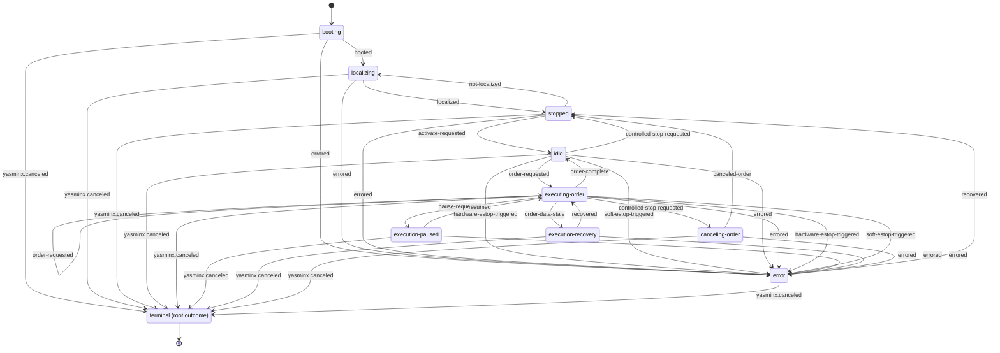
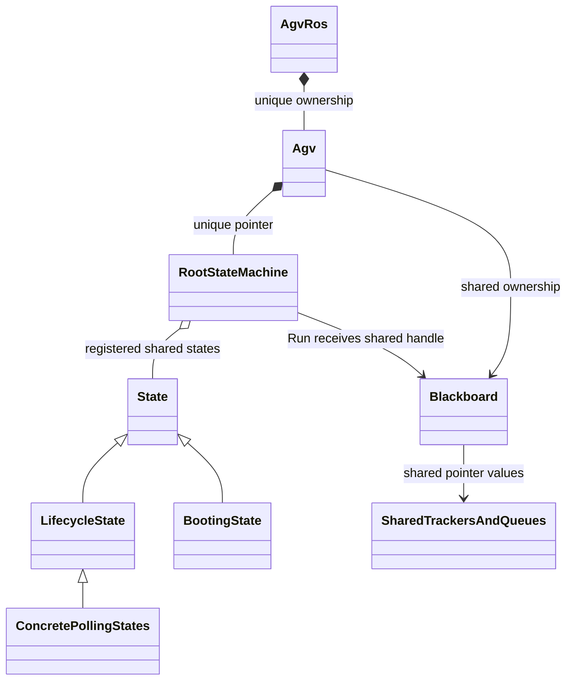
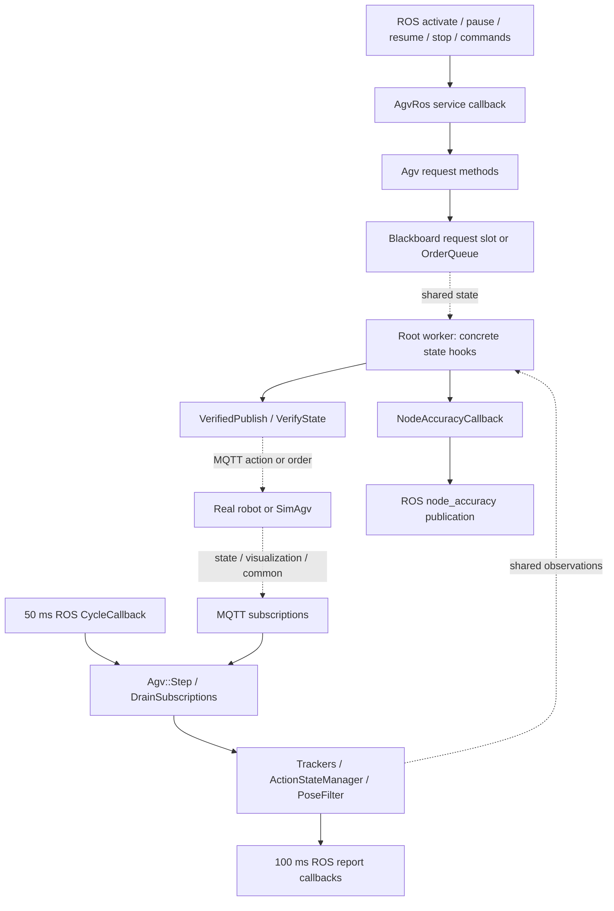
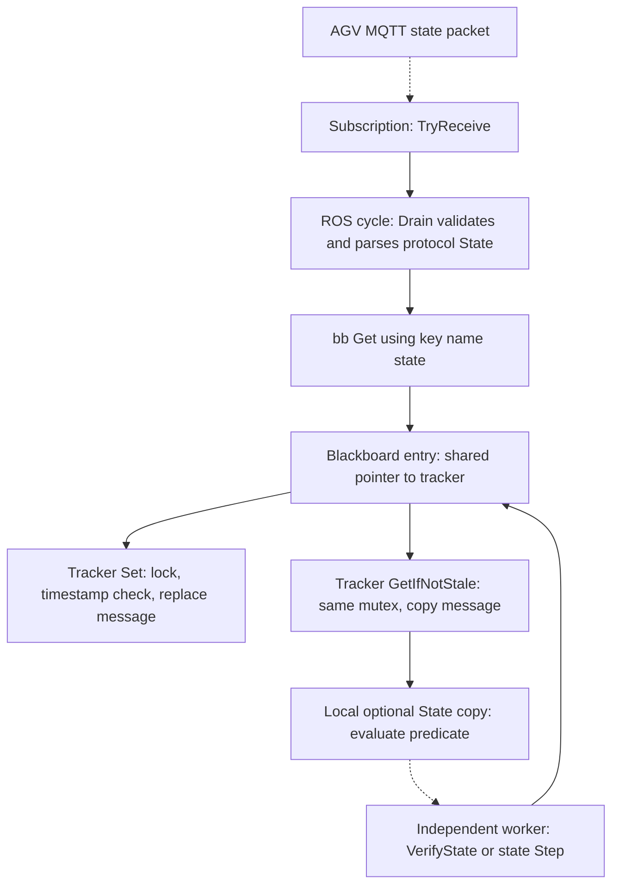

# HITO AGV State Machine: Library, C++ Implementation, and Execution Contracts

Companion guides: [AGV package](volley_agvhito_package.md), [simulation overview](volley_simulation_guide.md), and [launcher](volley_launcher_package.md).

## Acronyms, terminology, and notation

| Term | Full name or precise meaning here |
| --- | --- |
| AGV | Automated guided vehicle; the mobile tray-carrying robot. |
| HITO | Vendor/project label in this repository; no formal expansion is supplied. |
| ROS | Robot Operating System; the application uses ROS 2. |
| FSM | Finite state machine: named control states, outcomes, and a transition relation. |
| YASMIN | Yet Another State MachINe; upstream state-machine library. |
| yasminx | Volley extension package; its C++ namespace is `volley::yasminx`. Within `volley::agvhito`, enclosing-namespace lookup resolves `yasminx::...` to that namespace. |
| API | Application programming interface; types, functions, hooks, and contracts that callers use. |
| MQTT | Message Queuing Telemetry Transport, a historical expansion of the protocol name; publish/subscribe robot communication. Simulation substitutes a local queue-based bus. |
| VDA5050 | VDA = Verband der Automobilindustrie (German Association of the Automotive Industry); 5050 is the robot/control interface specification number. The adapter uses message version 2.1.0. |
| JSON | JavaScript Object Notation; protocol payload and diagnostic serialization. |
| QoS | Quality of service; message delivery/history policies. |
| MGS | Magnetic guide sensor; guide-relative alignment feedback used at order completion. |
| E-stop / HW / SW | Emergency stop / hardware / software; distinguish these from controlled stopping. |
| ID | Identifier; names an order, action, node, or robot. |
| ISO 8601 | International Organization for Standardization date/time format used by protocol timestamps. |
| MD5 | Message Digest Algorithm 5; helper used for generated order identity, not a security guarantee. |
| RAII | Resource acquisition is initialization; C++ objects tie resource cleanup to lifetime. |
| ODR | One Definition Rule; relevant to `inline` variables/functions defined in headers. |
| CTAD | Class template argument deduction; compiler infers some template arguments from initializers. |
| SIGINT / POSIX | Interrupt signal / Portable Operating System Interface; `SigintGuard` preserves the host process's signal handler around root construction. |
| `jthread` | Standard joining-thread class (`std::jthread`); its destructor requests stop and joins. The wrapper also uses YASMIN hard cancellation to end execution. |
| RTTI | Run-time type information; relevant to polymorphic `dynamic_cast` in the simulation ROS wrapper. |
| SVG | Scalable Vector Graphics; the zoomable export of the complete state diagram. |
| UML | Unified Modeling Language; class relationships and ownership diagrams. |
| ms / s / m / rad | Milliseconds / seconds / metres / radians. |
| `bb`, `sm`, `SPtr`, `UPtr`, `Msg`, `Srv` | Blackboard, state machine, shared pointer, unique pointer, message, and service naming abbreviations. |
| `rclcpp`, `rclcppx`, `stdx` | ROS C++ client library, repository client-library extensions, and repository utility/result extensions. |

A **state** is active control logic such as `executing-order`. An **outcome** is the token returned when that state finishes, such as `order-complete`. A **transition** maps one state's outcome to another state or a root terminal outcome. A **blackboard** is a shared named-data store. A **guard** is a condition checked before choosing an outcome. A robot protocol **instant action** is an MQTT message, not a ROS action server or a direct state-machine event.

For the small formal model used here, sets are unbolded capitals: $S$ is the state set, $O$ the outcome set, and $T$ the root terminal-outcome set. The partial transition function is $delta:S\times O\rightarrow S\cup T$. Scalar quantities such as $t\in\mathbb{R}$ are italic; a vector would use $\mathbf{x}\in\mathbb{R}^{n}$ and a matrix $\mathbf{C}\in\mathbb{R}^{m\times n}$. All mathematical expressions use `$...$` and `$$...$$` Markdown delimiters.

## 1. Purpose, scope, and how to read this guide

The `agvhito` control machine boots/localizes a robot, accepts activation, executes queued protocol orders, pauses/resumes, cancels at a controlled stop, and handles stale data or faults. It is used by both the production adapter and the simulated robot. It controls communication and business execution; the simulated movement equations live separately in `sim::AgvMotion`.

Read section 3 for the complete graph, section 5 for each state's exact work, section 6 for the blackboard, and sections 8–10 for the C++ API, language features, and an extension example. The machine is assembled in code, not from a YAML file or a generated enum switch.

The supplied evidence now includes `agvhito-repomix.md` and all 21 files in `P15-yasminx-part1of1.md`, including the wrapper implementations and tests. The root worker, lifecycle sequencing, blackboard helpers, and structured-error plumbing below are confirmed from source. The installed upstream YASMIN implementation and `stdx` internals remain outside these packs. Upstream reference documentation is separately version-qualified. Test assertions were inspected; no dependency-backed compilation or ROS execution was performed.

## 2. Library layers and source map

### 2.1 What belongs to which library?

| Layer | Observed types/API | Responsibility and evidence limit |
| --- | --- | --- |
| Upstream `yasmin` | `Blackboard`, `Outcomes`, `Transitions`; inherited `add_state`, state/status inspection | State-machine primitives. Public upstream documentation describes state execution and outcome-to-target maps. Installed revision is not identified by this pack. |
| Volley `yasminx` | `State`, `LifecycleState`, `RootStateMachine`, `StateContext`, `Transition`, `Outcome`, `Error`, `ErrorOutcome`, typed `bb::Key<T>`, `Get/Set/Remove` | Context-aware hooks, structured errors, typed key access, and a `std::jthread` root runner; implementation now supplied. Raw blackboard synchronization remains delegated to upstream YASMIN. |
| Volley `agvhito::sm` | Nine concrete states, `MakeRootStateMachine`, transition constants, `VerifiedPublish`, `VerifyState` | Robot-specific workflow, protocol verification, and state policy; fully visible in the pack. |
| Adapter `Agv` / `AgvRos` | Request methods, shared resources, protocol drain, ROS service/report callbacks | Starts the machine, feeds its blackboard, and exposes the application interface. |
| Simulated robot | `SimAgv` / `SimAgvRos` | Same adapter/machine; local protocol transport and kinematic robot feedback. |

Upstream YASMIN's core can execute state machines independently of ROS; ROS-specific states and viewing tools are separate packages. This application uses ROS clocks/loggers through `yasminx`. The pack does not show a YASMIN viewer publisher or XML-based factory deployment.

Background: [upstream package organization, version 4.0.0](https://uleroboticsgroup.github.io/yasmin/4.0.0/packages.html). This versioned background is not proof of the workspace's installed library version.

### 2.2 State-machine files

| Path (under `src/agvhito/`) | Approx. lines | Responsibility |
| --- | ---: | --- |
| `include/agvhito/sm/blackboard.hpp` | 100 | Typed keys and consume-and-remove request helper. |
| `include/agvhito/sm/booting_state.hpp` | 18 | Declare state hooks. |
| `include/agvhito/sm/canceling_order_state.hpp` | 25 | Declare state hooks. |
| `include/agvhito/sm/context_utils.hpp` | 46 | Action/order publication verification and state predicates. |
| `include/agvhito/sm/error.hpp` | 72 | Error categories and emergency-stop outcome helpers. |
| `include/agvhito/sm/error_state.hpp` | 28 | Declare state hooks. |
| `include/agvhito/sm/executing_order_state.hpp` | 33 | Declare state hooks. |
| `include/agvhito/sm/execution_paused_state.hpp` | 30 | Declare state hooks. |
| `include/agvhito/sm/execution_recovery_state.hpp` | 29 | Declare state hooks. |
| `include/agvhito/sm/idle_state.hpp` | 23 | Declare state hooks. |
| `include/agvhito/sm/localizing_state.hpp` | 24 | Declare state hooks. |
| `include/agvhito/sm/root.hpp` | 12 | Root factory declaration / nine-state construction. |
| `include/agvhito/sm/state_strings.hpp` | 118 | Names and all 36 explicit transition entries. |
| `include/agvhito/sm/stopped_state.hpp` | 23 | Declare state hooks. |
| `include/agvhito/sm/timing.hpp` | 13 | 100 ms lifecycle step period and 5 s logging throttle. |
| `src/sm/booting_state.cpp` | 155 | Implement state actions, checks, and outcomes. |
| `src/sm/canceling_order_state.cpp` | 71 | Implement state actions, checks, and outcomes. |
| `src/sm/context_utils.cpp` | 221 | Action/order publication verification and state predicates. |
| `src/sm/error_state.cpp` | 102 | Implement state actions, checks, and outcomes. |
| `src/sm/executing_order_state.cpp` | 306 | Implement state actions, checks, and outcomes. |
| `src/sm/execution_paused_state.cpp` | 62 | Implement state actions, checks, and outcomes. |
| `src/sm/execution_recovery_state.cpp` | 77 | Implement state actions, checks, and outcomes. |
| `src/sm/idle_state.cpp` | 113 | Implement state actions, checks, and outcomes. |
| `src/sm/localizing_state.cpp` | 64 | Implement state actions, checks, and outcomes. |
| `src/sm/root.cpp` | 67 | Root factory declaration / nine-state construction. |
| `src/sm/stopped_state.cpp` | 68 | Implement state actions, checks, and outcomes. |

Integration files to read next are `src/agvhito/src/agv.cpp`, `include/agvhito/agv.hpp`, `src/agv_ros.cpp`, `include/agvhito/agv_ros.hpp`, `src/active_order.cpp`, `include/agvhito/topics/state_predicates.hpp`, and the message-tracker/filter/queue classes. Paths without the package prefix in tables below are relative to `src/agvhito/`.

### 2.3 Newly supplied `yasminx` files and build

| Path (repository relative) | Approx. lines | Role |
| --- | ---: | --- |
| `src/core/yasminx/CMakeLists.txt` | 22 | Build one shared yasminx library and four test executables. |
| `src/core/yasminx/include/yasminx/blackboard_constants.hpp` | 16 | Typed key aggregate and transition/error record keys. |
| `src/core/yasminx/include/yasminx/blackboard_utils.hpp` | 41 | Optional Get, typed Set/Remove/Contains, variadic ContainsKeys. |
| `src/core/yasminx/include/yasminx/error.hpp` | 28 | Error/ErrorOutcome/StateError aggregates and MakeUnexpected. |
| `src/core/yasminx/include/yasminx/format.hpp` | 31 | Standard formatter specializations for wrapper records. |
| `src/core/yasminx/include/yasminx/lifecycle_state.hpp` | 54 | Variant step results and entry/step/exit virtual API. |
| `src/core/yasminx/include/yasminx/outcome.hpp` | 10 | Outcome string alias and exact cancellation/logic-error literals. |
| `src/core/yasminx/include/yasminx/root_state_machine.hpp` | 56 | Root runner API, SIGINT policy, guard, context, and joining thread. |
| `src/core/yasminx/include/yasminx/state.hpp` | 43 | Context-aware abstract state with final upstream execute adapter. |
| `src/core/yasminx/include/yasminx/state_context.hpp` | 10 | Clock/logger context aggregate. |
| `src/core/yasminx/include/yasminx/transition.hpp` | 12 | Previous state and outcome record. |
| `src/core/yasminx/package.xml` | 18 | Declare the wrapper package and dependencies. |
| `src/core/yasminx/src/lifecycle_state.cpp` | 73 | Implement rate loop, hook defaults, failure short circuits, and cancellation precedence. |
| `src/core/yasminx/src/root_state_machine.cpp` | 90 | Restore host signal handler, install callbacks, run/cancel worker, catch exceptions. |
| `src/core/yasminx/src/state.cpp` | 30 | Pass transition context, store StateError, return routing outcome. |
| `src/core/yasminx/test/test_blackboard_utils.cpp` | 50 | Assert typed/missing/contains/custom-value helper behavior. |
| `src/core/yasminx/test/test_lifecycle_state.cpp` | 112 | Assert hook counts, direct/custom exit, cancellation dominance, and entry failure. |
| `src/core/yasminx/test/test_root_state_machine.cpp` | 51 | Assert asynchronous root reaches declared final outcome. |
| `src/core/yasminx/test/test_ros_env.hpp` | 13 | Initialize/shut down ROS through a GoogleTest global environment. |
| `src/core/yasminx/test/test_state.cpp` | 80 | Assert outcome conversion, error storage, and transition context. |
| `src/core/yasminx/test/test_utils.hpp` | 13 | Provide a steady clock and logger for tests. |

`CMakeLists.txt` calls `volley_add_library(${PROJECT_NAME} SHARED DIRECTORY src)` and registers the blackboard, State, LifecycleState, and RootStateMachine tests. The package is `ament_cmake`, minimum CMake 3.28, version 0.0.1 in its manifest. Dependencies are `rclcpp`, `rclcppx`, `stdx`, and `yasmin`; repository build macros remain external.

### 2.4 Where is the state-machine architecture defined?

**The AGV architecture is defined in C++ source, not in a configuration file.** These files divide the declaration, graph, and executable behavior:

| Repository file | Format and role | How it links to execution |
| --- | --- | --- |
| `src/agvhito/include/agvhito/sm/state_strings.hpp` | C++ header: state/outcome string constants and `inline const yasmin::Transitions` routing objects. | Every state derives its allowed outcomes from its map; the root registers that same map. |
| `src/agvhito/src/sm/root.cpp` | C++ implementation of `MakeRootStateMachine`: constructs the root and registers all nine state objects. | `add_state(name, shared concrete state, transitions)` binds graph nodes/edges to compiled classes. |
| `src/agvhito/include/agvhito/sm/root.hpp` | C++ factory declaration. | Makes the construction function callable by the AGV adapter. |
| `src/agvhito/include/agvhito/sm/*_state.hpp` and `src/agvhito/src/sm/*_state.cpp` | C++ classes implementing guards, protocol actions, polling, and returned outcomes. | Virtual dispatch calls `Execute` or lifecycle hooks on the registered object. |
| `src/agvhito/src/agv.cpp` | C++ startup and adapter integration. | Initializes blackboard/transport, calls the factory, then `state_machine_->Run(blackboard_)`. |
| `src/core/yasminx/src/root_state_machine.cpp`, `state.cpp`, `lifecycle_state.cpp` | Generic C++ framework implementation. | Runs the worker, translates errors/outcomes, and invokes entry/step/exit. |
| `src/agvhito/CMakeLists.txt` | CMake build instructions. | Compiles `src/sm` into `agvhito_state_machine_lib`, linked through the robot/component libraries. |

The chain is **string constants + routing map → root registration of compiled state objects → `Run` → upstream transition routing → concrete virtual hooks**. For example, the Stopped map has `activate-requested → idle`; `StoppedState::Step` returns that outcome after consuming Activate, and `root.cpp` has registered `IdleState` under the target name. The framework then runs Idle's hooks.

Scenario YAML selects robots/initial conditions and parameter YAML supplies limits; neither defines these nine states or 36 edges. Mermaid and SVG are documentation views of the C++ tables and are not loaded at runtime. Changing a runtime parameter does not rewrite the graph. An architecture change requires changing C++ maps/registrations/behavior and rebuilding the package. `booting` is registered first; initial-state selection is inherited from upstream YASMIN rather than explicitly set by the wrapper.

## 3. Complete state diagram: every declared transition in one graph

**Nine control states, 36 explicit transition entries, one root terminal outcome.** Every transition-table entry is drawn individually, including eight `errored` edges and nine framework-cancellation edges. No “all states” shorthand or hidden error/cancellation branches are used. Open the Mermaid block at full width for detailed inspection.

Labels match the source strings. The newly supplied `outcome.hpp` defines `kOutcomeCanceled` as `"yasminx.canceled"`, which is now used verbatim on every cancellation edge. `terminal` is a root outcome, not a tenth concrete C++ state. Initial/final pseudostate arrows are diagram notation and are not additional entries in the source table. `booting` is registered first; initial-state selection is inherited from upstream YASMIN.


A [zoomable SVG export](volley_agvhito_state_machine.svg) shows the same complete graph. Blue edges are normal control, red edges target Error, and grey edges are framework cancellation. In that export, “framework cancel” abbreviates the literal `yasminx.canceled`; every cancellation edge remains individual.

### 3.1 Exact transition table

The table is an equivalent searchable view of the same single graph, extracted from `include/agvhito/sm/state_strings.hpp`.

| Current state | Returned outcome / constant | Target |
| --- | --- | --- |
| `booting` | `booted` | `localizing` |
| `booting` | `errored` | `error` |
| `booting` | `yasminx.canceled` | `terminal` |
| `localizing` | `localized` | `stopped` |
| `localizing` | `errored` | `error` |
| `localizing` | `yasminx.canceled` | `terminal` |
| `stopped` | `not-localized` | `localizing` |
| `stopped` | `activate-requested` | `idle` |
| `stopped` | `errored` | `error` |
| `stopped` | `yasminx.canceled` | `terminal` |
| `idle` | `order-requested` | `executing-order` |
| `idle` | `controlled-stop-requested` | `stopped` |
| `idle` | `hardware-estop-triggered` | `error` |
| `idle` | `soft-estop-triggered` | `error` |
| `idle` | `errored` | `error` |
| `idle` | `yasminx.canceled` | `terminal` |
| `executing-order` | `order-complete` | `idle` |
| `executing-order` | `order-requested` | `executing-order` |
| `executing-order` | `order-data-stale` | `execution-recovery` |
| `executing-order` | `errored` | `error` |
| `executing-order` | `controlled-stop-requested` | `canceling-order` |
| `executing-order` | `hardware-estop-triggered` | `error` |
| `executing-order` | `soft-estop-triggered` | `error` |
| `executing-order` | `pause-requested` | `execution-paused` |
| `executing-order` | `yasminx.canceled` | `terminal` |
| `execution-paused` | `resumed` | `executing-order` |
| `execution-paused` | `errored` | `error` |
| `execution-paused` | `yasminx.canceled` | `terminal` |
| `execution-recovery` | `recovered` | `executing-order` |
| `execution-recovery` | `errored` | `error` |
| `execution-recovery` | `yasminx.canceled` | `terminal` |
| `canceling-order` | `canceled-order` | `stopped` |
| `canceling-order` | `errored` | `error` |
| `canceling-order` | `yasminx.canceled` | `terminal` |
| `error` | `recovered` | `stopped` |
| `error` | `yasminx.canceled` | `terminal` |

### 3.2 What this graph deliberately does not imply

`Continue{}` means remain inside the current state's polling loop; it is not an additional declared graph edge. Waiting for a message, waiting for action acknowledgement, or waiting for fresh alignment is internal work within the state. The graph gives allowed **outcome routing**, not a promise that every route has identical guards or can occur in every hook.

A protocol emergency-stop flag is robot state, not automatically a root transition from every state. `IdleState` and `ExecutingOrderState` explicitly check stops and have dedicated stop outcomes. `ExecutionPausedState::Step()` only consumes resume requests. Do not add universal safety arrows that the implementation does not declare.

The simulated `DriveMode` and `ActiveOrder::Phase` statuses are separate models, not hidden children of this root graph. Their package-level descriptions are in the [AGV guide](volley_agvhito_package.md#44-enum-driven-motion-and-order-status).

## 4. Construction, execution, and ownership

### 4.1 Construction call path

The `Agv` constructor creates assemblers and a shared `yasmin::Blackboard`, then calls `InitializeBlackboard()`, `SetupMqtt()`, and `SetupStateMachine()`. It also fire-and-forgets a protocol state request to accelerate boot. The state-machine setup is exactly:

```cpp
void Agv::SetupStateMachine() {
  state_machine_ = sm::MakeRootStateMachine(context_.clock, context_.logger);
  state_machine_->Run(blackboard_);
}
```

The root factory creates `RootStateMachine("root", Outcomes{terminal}, StateContext{clock, logger})`, then registers all nine states. Each registration couples a concrete state object, its name, and its transition map:

```cpp
state_machine->add_state(
    kStateExecutingOrder,
    std::make_shared<ExecutingOrderState>(state_machine->GetStateContext()),
    kExecutingOrderTransitions);
```

`OutcomesOf(kExecutingOrderTransitions)` derives the state's allowed outcomes from the map keys. The root is uniquely owned by `Agv`; concrete states are passed as shared pointers. Their constructors receive a context containing the clock/logger. Both real and simulated robot adapters follow this construction.

### 4.2 Ownership and execution boundaries



`State` and `LifecycleState` in this diagram refer to the `yasminx` abstractions. `yasminx::State` derives from `yasmin::State`; `LifecycleState` derives from `yasminx::State`, now confirmed in the supplied headers. `ConcretePollingStates` groups the eight concrete lifecycle-state classes, not an actual repository class.

`RootStateMachine::Run` starts a **`std::jthread`**, capturing `this` and the shared blackboard by move. On that worker it invokes `(*this)(blackboard)`: the inherited YASMIN machine routes outcomes and calls the registered states. `State::execute` is the final adapter to capitalized `Execute`; lifecycle states use their private final `Execute` to call the three hooks. The worker is separate from the ROS executor.

`Run` returns `void` and does nothing if `thread_.joinable()` is already true. A completed but unjoined thread remains joinable, so this is **not a restart API**. Add all states before calling it. The thread catches `StateMachineCancelException` as normal hard-cancel shutdown. Other `std::exception` failures are logged at fatal level and mark the base state canceled when the machine is not already canceled and `rclcpp::ok()` is true; the worker does not rethrow those exceptions to the ROS caller. Non-standard exceptions are not handled by these catch clauses.

The destructor calls `cancel_state_machine()` if not already canceled; canceling only the active child with `cancel_state()` would let the outer machine keep advancing. `thread_` is declared last, so its `std::jthread` destructor joins **before** context and base members are destroyed. Its standard stop request is not the loop's explicit cancellation mechanism: this lambda does not consume a stop token. Hard YASMIN cancellation plus cooperative hook/wait behavior permits the join to complete; a permanently blocked custom hook can still prevent prompt destruction.

The constructor's default `SigintHandling::Inherit` uses a noncopyable RAII `SigintGuard` as a delegating-constructor parameter: save the host SIGINT handler before base construction and restore it when that guard dies. `YasminInstalled` instead allows the base library to install its handler. `std::call_once` replaces upstream YASMIN's global logging callback with a no-op once per process, while wrapper logging uses its ROS logger. Root start/transition/end callbacks capture `this`; the joining-thread member order is material to their lifetime.

### 4.3 Runtime call/data flow



The 50 ms cycle feeds the blackboard, logs freshness, and checks root terminal status; it does **not** manually call each state `Step`. In simulation, inherited `Agv::Step()` first invokes `SimAgv::PreStep()` to drain commands and advance motion. Protocol telemetry has its own timers. `AgvRos` puts its callbacks into a mutually exclusive group per robot, but that group does not synchronize the independent machine worker.

### 4.4 Lifecycle hook contract

| Hook | Return contract visible in callers | Role |
| --- | --- | --- |
| `State::Execute(blackboard, transition)` | `stdx::Expected<yasminx::Outcome, yasminx::ErrorOutcome>` | One execution body; Booting performs blocking cancellation-aware preparation here. |
| `LifecycleState::OnEntry(blackboard, transition)` | `stdx::Expected<void, ErrorOutcome>` | Prepare state once; empty success means entry completed. |
| `LifecycleState::Step(blackboard)` | `stdx::Expected<StepResult, ErrorOutcome>` | Return `Continue{}` to poll again or `Finished{.outcome=...}` to finish. |
| `LifecycleState::OnExit(blackboard, optional_step_outcome)` | `stdx::Expected<Outcome, ErrorOutcome>` | Complete exit and choose the final routing outcome where overridden. |

The implementation now establishes the lifecycle exactly:

| Path | `OnEntry` | `Step` loop | `OnExit` | Final result |
| --- | --- | --- | --- | --- |
| Ordinary success | Called once; default succeeds | Rate is reset on entry; poll until Finished | Called once; default returns the optional Step outcome if present | Exit-selected outcome |
| Entry error | Returns ErrorOutcome | Not called | **Not called** | Entry error propagated to `State::execute` |
| Step error | Entry succeeded | Error returned | **Not called** | Step error propagated |
| Cooperative cancellation observed between steps | Entry succeeded | Store `yasminx.canceled`, break | Called with that outcome | Cancellation overrides both an alternate exit outcome and exit error |
| `Finished{}` with no outcome | Entry succeeded | Finish with empty optional | Must choose outcome in an override | Default exit produces `yasminx.logic-error` |
| Exit error without cancellation | Entry/steps succeeded | Finished | Error returned | Exit error propagated |

`StepResult` is precisely `std::variant<Continue, Finished>`; `Finished` contains `std::optional<Outcome>`. Default entry succeeds. Default exit propagates a supplied outcome, otherwise returns a structured `yasminx.logic-error`. Paused/Recovery deliberately override exit because their normal Step returns `Finished{}` without an outcome.

`State::execute` reads the preceding `Transition` from `yasminx.transition` (or passes a default record of empty strings), calls `Execute`, and returns its successful outcome. On an ErrorOutcome it logs/stores `StateError{state_name, error}` under `yasminx.state-error`, then returns the error's routing outcome. A C++ exception is not converted into that record by this adapter; it reaches the root worker's exception handler.

The AGV transition maps do not register `yasminx.logic-error`: accidentally returning an empty Finished without a suitable exit override can therefore reach upstream validation/exception handling rather than a normal AGV error edge.

Source: `src/core/yasminx/src/state.cpp` and `lifecycle_state.cpp`. Entry/Step failure is not a general cleanup path: resource rollback must be owned by the state/RAII objects if needed. Cancellation while an entry/step helper is returning an ErrorOutcome takes that early error path; the post-exit cancellation override is reached only on paths that actually reach exit. Upstream hard machine cancellation is an additional outer-loop mechanism.

## 5. Every concrete state's technical behavior

### 5.1 `BootingState`: one-shot preparation

Base: `yasminx::State`, not `LifecycleState`. Implements `Execute`.

1. Obtain `rclcppx::GetSteadyOrSimClock(GetClock())`. Poll usable state every 500 ms for up to one minute, returning the framework cancellation outcome if canceled during this initial loop.
2. Verify a batch containing soft-stop clear, order cancel, exception clear, and **stop-pause**. The log says “setting pause,” but the code requests unpause.
3. Verify `All({AnyEStopIs(false), PausedIs(false)})`.
4. Re-read fresh state; gather expected localization/floor map IDs.
5. Download the missing localization map, enable it, delete reported unexpected maps, and download missing floor maps. Verify those action statuses.
6. Return `booted`, or return an `ErrorOutcome` selecting `errored` when preparation fails.

This state prepares protocol maps; it does not itself call a map-server HTTP endpoint. The map client/context and robot's download behavior are separate. The `GetSteadyOrSimClock` helper's internals are omitted; its name/comment should not be treated as a guarantee that simulated time always advances.

### 5.2 `LocalizingState`: wait for initialized position

`OnEntry` verifies enabling the localization map. `Step` waits for nonstale state and `IsPositionLocalized(state)`, then returns `localized`. It sends no requested pose here and has no local overall localization deadline. Missing/stale data yields `Continue`.

### 5.3 `StoppedState`: software-stopped until activation

`OnEntry` verifies engaging the software emergency stop and clears the pending order queue. `Step` waits for usable state, returns `not-localized` if localization is lost, otherwise consumes an activation request and returns `activate-requested`. Other requests consumed by `TakeRequest` are discarded. “Stopped” is therefore a control policy with an engaged software-stop request, not merely zero velocity.

### 5.4 `IdleState`: activated, paused, and ready for an order

Entry requires fresh state and checks hardware emergency stop. If software stop is engaged it verifies clearing that stop and exceptions. It verifies starting pause and that `paused=true`; if the initially captured state shows incomplete traversal, it verifies canceling that prior order. It then polls for work.

Step priority is: usable state → emergency-stop checks → consume controlled-stop request → check nonempty order queue. Stale state continues waiting. A controlled stop routes directly to Stopped; a queued order routes to Executing. Idle is deliberately paused at the protocol level, ready to unpause for the next order.

### 5.5 `ExecutingOrderState`: publish, monitor, and gate completion

`OnEntry` resets its optional completion timestamp. When re-entered from Paused or Recovery, it returns immediately so the existing order is not republished. For ordinary entry or its self-loop it:

1. Requires a nonempty queue and nonstale state.
2. If paused, verifies stop-pause plus exception clear, then verifies `paused=false`.
3. Reads the front assembled order; enables its map if needed.
4. Clears action-status tracking, publishes the order, and verifies that fresh robot state echoes its order ID.
5. Stores a new shared `ActiveOrder` on the blackboard, then pops the pending queue.

Its `Step` branches have a concrete priority, which matters if several conditions arrive together:

| Order | Condition | Result |
| ---: | --- | --- |
| 1 | State is stale | `order-data-stale` → Recovery. |
| 2 | Hardware/software stop reported | Dedicated stop `ErrorOutcome` → Error. |
| 3 | Pending Pause or ControlledStop request | Pause → Paused; controlled stop → Canceling. Other consumed requests are discarded. |
| 4 | Active order missing | `errored` with `missing-active-order`. |
| 5 | Filtered pose unavailable | `order-data-stale` → Recovery. |
| 6 | `ActiveOrder::Process` reports Failed | `errored` with `order-failed`. |
| 7 | Progress InProgress | Continue; log progress when updated. |
| 8 | Progress Complete | Apply the additional completion gates below. |

On first protocol completion, cache the completion state's source timestamp. Require nonstale common data with a **strictly later** timestamp. An equal/older common timestamp yields Continue; stale common data yields Recovery. Convert MGS/common feedback into node accuracy, invoke the optional node-accuracy callback, then require valid X/Y/yaw values and:

$$
|x|\le0.02\;\mathrm{m},\qquad |y|\le0.02\;\mathrm{m},\qquad
|\psi|\le0.0872665\;\mathrm{rad}.
$$

Equality is accepted because the code rejects `>` limits. Invalid or out-of-limit accuracy immediately produces `errored`/`node-accuracy-failed`; it does not wait for repeated alignment adjustment. Once acceptable, remove the active order. Return `order-requested` to re-enter Executing if another order is queued, otherwise `order-complete` to Idle.

`ActiveOrder::Process` checks order identity, own action failures, command/pose/lift/node-sequence progress, traversal completion, and own actions finishing. Its phase is an observation used by this control state, not a replacement for this FSM.

### 5.6 `ExecutionPausedState`: wait for resume

Entry verifies start-pause. Step consumes only Resume, returning an empty `Finished{}` when seen; otherwise Continue. Exit verifies stop-pause and returns `resumed`. An exit verification error selects `errored`.

The supplied Step does not inspect freshness, emergency-stop flags, or ControlledStop. A controlled-stop request written while paused can be consumed and ignored. External robot safety remains separate; adding a universal root stop edge would misrepresent this implementation.

### 5.7 `ExecutionRecoveryState`: reconnect to usable observations

Entry attempts to verify pause, but logs and tolerates verification errors because communication may be degraded. Step requires state and common trackers to be nonstale and `PoseFilter::Get()` to return a pose. “Fresh” here permits the Degraded classification; only Stale is rejected.

Once all three conditions hold, Step returns `Finished{}`. Exit attempts stop-pause, logs/tolerates failure, and returns `recovered`. Executing re-entry then skips order publication and resumes tracking the original order. There is no local overall recovery timeout, no queued-request processing, and no explicit stop check in this Step. The transition table declares `errored`, but the shown tolerant entry/exit paths do not manufacture it for these verification failures.

### 5.8 `CancelingOrderState`: controlled cancellation

Entry verifies the cancel-order instant action even if the blackboard has no active order. Step waits for nonstale state and traversal completion (no traversal states and no driving), removes the active order, and returns `canceled-order` → Stopped. Stale state keeps waiting; no local overall wait timeout is specified after entry verification.

This is robot order cancellation, distinct from framework cancellation that ends the root machine. In simulation, the cancel action clears queued primitives and requests `AgvMotion::ControlledBrake()`; the motion model chooses a feasible waypoint stop.

### 5.9 `ErrorState`: stop, clear work, and delayed recovery

Entry attempts to verify software emergency stop; failure is logged and tolerated. It logs the incoming transition and optional framework state-error record, logs fresh robot state when available, clears queued orders, and records entry time.

Step waits for nonstale state and for hardware emergency stop to be released. Once at least five clock seconds have elapsed since entry, remove any request and active order, clear the queue again, and return `recovered` → Stopped. The timer starts after entry's attempted stop verification, not at the original fault time.

**The actual recovery gate checks hardware stop only.** Despite its header comment, it does not also require software stop to be clear. Stopped entry reasserts software stop; a later activation through Idle clears it. The root Error state is recoverable, whereas the root `terminal` outcome ends execution.

## 6. Typed blackboard: data contracts and request semantics

### 6.1 Keys and ownership

`include/agvhito/sm/blackboard.hpp` declares these keys. Type arguments bind an expected value type to a string key; they are not themselves robot ROS messages or topics.

| Key constant / stored name | Type | Writers and readers |
| --- | --- | --- |
| `kKeyCommonMessage` / `common-message` | Shared `TrackedMessage<vendor CommonMessage>` | Initialized by Agv, filled by subscription drain; completion/recovery reads. |
| `kKeyState` / `state` | `std::shared_ptr<TrackedMessage<protocol State>>` | Handle installed by Agv initialization; subscription drain updates tracker contents; states read message copies. |
| `kKeyVisualization` / `visualization` | Shared `TrackedMessage<Visualization>` | Agv tracks pose-stream telemetry; filtered pose is separate. |
| `kKeyInstantAssembler` / `instant-assembler` | `InstantActionAssemblerSPtr` | Initialized by Agv; action publication helper reads. |
| `kKeyMqttPublisher` / `mqtt-publisher` | `mqtt::IPublisherSPtr` | Initialized by Agv; worker publishes actions/orders. |
| `kKeyFloorMapIds` / `floor-map-ids` | `FloorMapIds` | Context initialization; Booting reads expected maps. |
| `kKeyLocalizationMapId` / `localization-map-id` | `std::string` | Context initialization; Booting/Localizing read. |
| `kKeyActionStateManager` / `action-state-manager` | `ActionStateManagerSPtr` | Agv updates statuses; verification helpers inspect; Executing clears. |
| `kKeyRequest` / `request` | Scoped enum `Request` | Agv request methods write; concrete states consume/remove. |
| `kKeyOrderQueue` / `order-queue` | `OrderQueueSPtr` | RequestCommands pushes a validated batch; Executing consumes; Stopped/Error clear. |
| `kKeyActiveOrder` / `active-order` | `ActiveOrderSPtr` | Executing creates/processes; completion/cancellation/error remove; reports read. |
| `kKeyPoseFilter` / `pose-filter` | `PoseFilterSPtr` | Agv feeds observations; Executing/Recovery read. |
| `kKeyNodeAccuracyCallback` / `node-accuracy-callback` | `std::function<void(NodeAccuracy)>` alias | AgvRos registers through Agv; Executing calls if present/nonempty. |
| `yasminx::bb::kStateError` / `yasminx.state-error` | `StateError { std::string state_name; Error error; }` | State adapter writes on a returned ErrorOutcome; ErrorState reads optionally. Successful executions do not clear it here. |
| `yasminx::bb::kTransition` / `yasminx.transition` | `Transition { std::string from_state; Outcome from_outcome; }` | Root transition callback writes; the target state adapter reads. |

Required-key `.value()` accesses assume initialization succeeded and values persist for the worker lifetime. Optional active-order, callback, request, and diagnostic-error records are handled conditionally. A shared pointer extends lifetime; it does not make its pointed-to object's mutations thread-safe.

### 6.2 Reading the template syntax: key name, stored handle, message value

**The runtime key name is `"state"`. The blackboard value is a shared pointer to a message tracker, not a raw protocol State.** `kKeyState` is the C++ variable naming a typed key descriptor. This descriptor tells the helper both which name to look up and which value type to request.

**File:** `src/agvhito/include/agvhito/sm/blackboard.hpp`  
**Declaration:** `volley::agvhito::bb::kKeyState`

```cpp
/// Tracked VDA5050 State published from AGV.
inline constexpr
  yasminx::bb::Key<TrackedMessageSPtr<vda5050_interfaces::v2::state::State>>
    kKeyState {"state"};
```

Read the nested types from the inside out:

| Expression | What it means | Is it the stored blackboard value? |
| --- | --- | --- |
| `vda5050_interfaces::v2::state::State` | The C++ protocol data type parsed from a robot's MQTT state-message payload, with fields such as `paused`, `action_states`, order/position/error data. | No: the tracker holds this data internally. |
| `TrackedMessage<State>` | Holder for the latest accepted protocol message, timestamps, age thresholds, and a mutex. | No: this heap object is reached through the stored pointer. |
| `TrackedMessageSPtr<State>` | Alias for `std::shared_ptr<TrackedMessage<State>>`. | **Yes.** This shared ownership handle is stored under `"state"`. |
| `yasminx::bb::Key<TrackedMessageSPtr<State>>` | Key descriptor carrying a name and a compile-time value-type association. | No: it describes the entry; it does not contain the message or pointer value. |
| `kKeyState` | Constant C++ object of that descriptor type. | No: it is passed to `bb::Get`/`bb::Set`. |
| `"state"` | Runtime lookup name; unrelated to the full MQTT topic path. | This is the entry's **name**, not its value. |

Here `State` in the middle two rows abbreviates the fully qualified **protocol** type. It is different from `yasminx::State`, the executable state-machine base class. They share a short name, not a role or inheritance relationship.

#### What does `Key<T>` actually contain?

**File:** `src/core/yasminx/include/yasminx/blackboard_constants.hpp`  
**Type:** `volley::yasminx::bb::Key<T>`

```cpp
template <typename T>
struct Key {
  std::string_view name;
  using value_type = T;
};
```

`kKeyState.name` is a `std::string_view` viewing the literal `"state"`; the literal has static lifetime. `value_type` is a type alias, not an instance member storing data. The aggregate initializer `{"state"}` initializes only `name`. There is no tracker construction, subscription, message parsing or background update in this declaration.

The helper converts that view to `std::string` and invokes upstream typed storage access:

**File:** `src/core/yasminx/include/yasminx/blackboard_utils.hpp`  
**Functions:** `volley::yasminx::bb::Get<T>`, `Set<T>`

```cpp
template <typename T>
[[nodiscard]] std::optional<T> Get(const yasmin::Blackboard& blackboard, Key<T> key) {
  try {
    return blackboard.get<T>(std::string {key.name});
  }
  catch(const std::runtime_error&) {
    return std::nullopt;
  }
}

template <typename T>
void Set(yasmin::Blackboard& blackboard, Key<T> key, T value) {
  blackboard.set<T>(std::string {key.name}, std::move(value));
}
```

For `kKeyState`, template deduction supplies `T = std::shared_ptr<TrackedMessage<ProtocolState>>`; `ProtocolState` here is an explanatory alias for the full protocol type. Thus `Get` returns `std::optional<std::shared_ptr<TrackedMessage<ProtocolState>>>`. The optional concerns lookup success; the pointer concerns ownership of the tracker; neither is the latest State message itself.

`inline` permits this header definition across translation units; `constexpr` makes the descriptor constant. Neither makes the tracker or received message immutable. The typed descriptor does not enforce globally unique names or turn the upstream string-keyed store into a compile-time map. The wrapper catches `std::runtime_error`; other exception classes are not caught.

### 6.2a How MQTT updates the stored tracker asynchronously

**The blackboard does not update itself from MQTT.** Application code first installs a tracker handle, then the ROS cycle writes messages into that same tracker while the separate state-machine worker reads snapshots.

#### Install the handle once during AGV construction

**File:** `src/agvhito/src/agv.cpp`  
**Function:** `Agv::InitializeBlackboard`, relevant existing-source scope:

```cpp
void Agv::InitializeBlackboard() {
  // ... other required keys omitted ...
  {
    auto state =
        std::make_shared<TrackedMessage<vstate::State>>(context_.clock, kStateDegradedAge, kStateStaleAge);
    yasminx::bb::Set(*blackboard_, bb::kKeyState, std::move(state));
  }
  // ... other required keys omitted ...
}
```

`vstate` is the source's namespace alias for `vda5050_interfaces::v2::state`. Despite its local name `state`, this variable is a **shared pointer**, not a protocol message. It is allocated and stored before the root worker starts. The tracker initially has no received message. State thresholds are 4.5 s degraded and 6 s stale.

#### Poll the subscription, parse payloads, then mutate the holder

`Agv::SetupMqtt` subscribes to the robot state topic. MQTT delivery makes packets available to `mqtt::ISubscription`; the supplied host integration reads them with `TryReceive`. This pack does not establish the production MQTT client's internal network-thread/callback implementation.

On the ROS executor, the 50 ms cycle calls `AgvRos::CycleCallback → Agv::Step → Agv::DrainSubscriptions`. The file-local `Drain<Type>` helper in `src/agvhito/src/agv.cpp` calls `TryReceive`, parses payloads through `ToJson`, validates the schema and converts valid payloads with `payload.get<Type>()`. For this subscription, `Type` is the protocol State, not a ROS message or executable state object.

**File:** `src/agvhito/src/agv.cpp`  
**Function:** `Agv::DrainSubscriptions`, relevant existing-source scope:

```cpp
void Agv::DrainSubscriptions() {
  // ... common-message subscription omitted ...
  {
    auto state_msgs = Drain<vstate::State>(context_.logger, *mqtt_state_sub_, vstate::Validate);
    for(auto& state_msg : state_msgs) {
      yasminx::bb::Get(*blackboard_, bb::kKeyActionStateManager).value()->Upsert(state_msg.action_states);
      // ... position/pose-filter update omitted ...
      yasminx::bb::Get(*blackboard_, bb::kKeyState).value()->Set(std::move(state_msg));
    }
  }
  // ... visualization subscription omitted ...
}
```

The last line contains **two different APIs**: `yasminx::bb::Get(...).value()` retrieves the previously installed pointer; `->Set(...)` invokes **`TrackedMessage<State>::Set` on the pointed-to object**. It is not `yasminx::bb::Set` and does not replace the blackboard entry for each packet. Readers holding a copy of the same pointer see subsequent tracker contents when they ask for a new snapshot.

The action-state manager is updated separately before the tracker. There is no single transaction locking the action manager, pose filter and tracked State together. In particular, action statuses can be inserted from a packet whose older source timestamp then causes the tracker to reject that packet. Do not infer an atomic, same-packet snapshot across these objects.

#### Synchronization is inside the tracker

**File:** `src/agvhito/src/tracked_message.cpp`  
**Function:** `TrackedMessage<T>::Set(T message)`, relevant existing-source statements:

```cpp
template <VdaMessage T>
void TrackedMessage<T>::Set(T message) {
  const rclcpp::Time now_timestamp = clock_->now();
  // ... derive timestamp from message.timestamp, or now if absent ...
  // timestamp is declared/calculated in that omitted source block.
  std::lock_guard lock(mutex_);
  if(message_.has_value() && timestamp < timestamp_) {
    return;
  }
  message_ = std::move(message);
  timestamp_ = timestamp;
  received_timestamp_ = now_timestamp;
}
```

The actual function parses the timestamp before acquiring the mutex. Under that mutex it rejects strictly older timestamps, accepts equal timestamps, replaces its optional message and records source/receipt times. The vector overload calls this function for each message. RAII releases the lock when the function exits. A `shared_ptr` shares lifetime; this mutex, not shared ownership, protects message data.

### 6.2b What the worker reads: a new copy, not a live reference

**File:** `src/agvhito/src/sm/context_utils.cpp`  
**Function:** `VerifyState`, existing-source read/check pattern:

```cpp
stdx::Expected<void, yasminx::Error> VerifyState(const yasmin::Blackboard& blackboard,
    const yasminx::StateContext& context, StatePredicate predicate, std::function<bool()> is_canceled) {
  // ... timeout setup omitted ...
  while(!is_canceled()) {
    const auto state_or = yasminx::bb::Get(blackboard, bb::kKeyState).value()->GetIfNotStale();
    if(state_or.has_value() && predicate.holds(state_or.value())) {
      return {};
    }
    // ... timeout, logging and polling sleep omitted ...
  }
  // ... canceled error return omitted ...
}
```

`GetIfNotStale` locks the same mutex and returns an optional **message copy**:

**File:** `src/agvhito/src/tracked_message.cpp`  
**Function:** `TrackedMessage<T>::GetIfNotStale`

```cpp
template <VdaMessage T>
std::optional<T> TrackedMessage<T>::GetIfNotStale() const {
  const rclcpp::Time now = clock_->now();
  std::lock_guard lock(mutex_);
  if(!message_.has_value() || ComputeStaleness(ComputeAge(now)) == MessageStaleness::Stale) {
    return {};
  }
  return message_;
}
```

The return copy is made while the lock is held. After the read returns, its local message does not change when another packet arrives. A worker must call `GetIfNotStale()` again to observe a newer message. The outer lookup optional and inner message optional have different meanings:

| Read layer | Result | Absence means |
| --- | --- | --- |
| `bb::Get(blackboard, bb::kKeyState)` | Optional shared pointer to tracker. | Lookup did not produce the required resource handle; common callers assume initialization and use `.value()`. That can throw when absent; an engaged optional also does not itself prove a non-null pointer. |
| `tracker->GetIfNotStale()` | Optional protocol State copy. | No message accepted yet, or the held message is stale. A valid tracker can exist while this result is absent. |

Age/staleness uses the message's source timestamp; receipt age is recorded separately. “Nonstale” does not mean “sampled after this unpause” or “firmware is ready.” A missing timestamp uses current clock time; timestamp/clock assumptions still matter.



Writes and reads of the tracker are synchronized, not its surrounding algorithm as a whole. The `yasminx` key helpers add no blackboard lock; upstream raw store synchronization remains outside the supplied pack. A per-robot mutually exclusive ROS callback group does not serialize the separate root worker. `Remove`/`Contains` delegate to the upstream store; `ContainsKeys` uses `(Contains(blackboard, keys) && ...)`, with an empty pack true. None of that establishes an atomic multi-key consume operation.

### 6.3 One request slot, not an event queue

`Request` is `enum class Request : uint8_t { Activate, ControlledStop, Pause, Resume }`. `TakeRequest` gets the optional request and then removes its key before returning it—even if the caller cannot handle that request.

| Adapter method | Guard and effect |
| --- | --- |
| `RequestActivate()` | Reject outside Stopped; otherwise write Activate. |
| `RequestControlledStop()` | Return success without writing in Booting, Localizing, Stopped, or Error; elsewhere write ControlledStop. |
| `RequestPause()` | Return success without writing outside Executing; in Executing reject an existing pending request, otherwise write Pause. |
| `RequestResume()` | Return success if already Executing; reject outside Paused; in Paused reject an existing pending request, otherwise write Resume. |
| `RequestSoftEStop()` | Return success without publishing during Booting/Localizing; otherwise directly publish a stop action and wait up to 100 ms for MQTT publication. No request-slot enum value is used. |
| `RequestCommands()` | Reject/ignore invalid or unusable requests; assemble every segment before pushing the batch to the synchronized order queue. This queue is separate from the request slot. |

Read/check/remove is visibly a sequence of blackboard calls. Even if each dependency operation locks internally, that does not prove the combined consume operation is atomic. A ROS write can race a worker's Get/Remove unless the extension provides a stronger guarantee. A state-name guard followed by a write is likewise not an atomic transition transaction. This is a code-review question, not a demonstrated reproduced race.

## 7. Protocol verification, deadlines, and error propagation

### 7.1 Publish acknowledgement versus robot observation

`VerifiedPublish` has two overloads, plus `VerifyState`:

| Helper | What success means | Failure paths |
| --- | --- | --- |
| Instant-action overload | Publication completes, and every tracked action ID reaches `FINISHED`. | Pre/loop cancellation; assembly error; 250 ms publish timeout; failed publish; action FAILED; 35 s verification deadline. |
| Assembled-order overload | Publication completes, then fresh state echoes the published order ID. | Cancellation; publish timeout/failure; order-acceptance verification timeout. It does not wait for order execution to complete. |
| `VerifyState(..., StatePredicate, ...)` | Fresh state satisfies `predicate.holds(state)`. | Cancellation or 35 s clock deadline. Logs predicate description and observed state for diagnosis. |

Actions' IDs/types are saved before the assembler consumes the vector. A pending vector is scanned: absent/intermediate action status remains pending, FAILED returns an error, FINISHED erases that element. A verified empty action batch succeeds immediately after the initial cancellation check.

Before publishing an order, copy it and refresh its timestamp using the current clock. The source comment explains that old queued timestamps can make a HITO robot adjust its clock backwards; restamping is intentional protocol behavior.

`StatePredicate` contains a description string plus `std::function<bool(const State&)>`. `PausedIs`, stop predicates, `OrderAccepted`, traversal/lift/map predicates, and `All` package conditions with diagnostics. `All` moves each predicate into a captured collection and uses `std::ranges::all_of`; an empty conjunction succeeds.

### 7.2 Clocks and liveness

The publish future's `wait_for(250ms)` measures a C++ future wait. Verification deadlines use `context.clock->now()` and poll with `context.clock->sleep_for(100ms)`. Error recovery uses the state clock; boot's first loop uses a helper-selected steady-or-simulation clock. These are not interchangeable timeout semantics.

For advancing simulated time with real-time factor $r>0$, a 35-second simulated deadline corresponds approximately to $35/r$ wall seconds. Paused/backward-jumping simulated time can stop or extend deadline progress; exact wake-on-clock/shutdown behavior belongs to the clock/wrapper implementations. Cancellation is checked between waits and operations, not an instantaneous interruption of every publish or sleep.

There is no overall state deadline shown for Localizing, Stopped, Idle, Paused, Recovery, or Canceling after successful entry. Waiting indefinitely can be the intended policy; it should not be silently reported as a bounded retry.

### 7.3 Structured errors and graph outcomes

```cpp
return yasminx::MakeUnexpected(
    kOutcomeErrored,
    yasminx::Error{
        .type = kErrorMissingActiveOrder,
        .message = "Expected an active order while executing"
    });
```

This illustrative shortened call associates a routing outcome with a diagnostic type/message. `ErrorOutcome` lets a failure carry **where to go** and **why**; it is different from an absent optional observation. `CheckEStopClear` chooses hardware before software when both flags are present, and returns their dedicated stop outcome rather than generic `errored`.

Declared diagnostic types include action assembly/status failure, canceled, hardware/software stop, missing active order/request, MQTT publish failure/timeout, node accuracy failure, order empty/failed/lost, stale state, verification timeout, and wrong request. A declared category does not establish a live call path for every category.

Framework cancellation and helper error category `canceled` are different levels. Boot's initial loop explicitly returns `yasminx.canceled`; helpers return an error that many callers wrap as `errored`. The wrapper now confirms that cancellation wins after OnExit, but entry/Step errors return earlier without OnExit. Those different code paths must not be collapsed into one universal precedence rule.

## 8. API reference: actual signatures and how callers use them

### 8.1 Root, state context, and state hooks

| API | Declaration/use site | Contract |
| --- | --- | --- |
| `MakeRootStateMachine(rclcpp::Clock::SharedPtr, rclcpp::Logger) -> RootStateMachineUPtr` | `include/agvhito/sm/root.hpp` | Construct registered robot states; caller owns returned root. |
| `RootStateMachine(name, Outcomes, StateContext)` | `src/sm/root.cpp` | Supply root name, terminal outcomes, clock/logger and optional SIGINT policy (default Inherit). |
| `add_state(name, shared_state, transitions)` | `src/sm/root.cpp` | Connect a state object with its routing table. |
| `GetStateContext()`, `GetContext()` | Root construction / concrete states | Copy shared root context to a state; access it within hooks. |
| `Run(BlackboardPtr)` | `src/agv.cpp` | Returns void; starts a joining worker thread once; no-op while the thread object is joinable. |
| `get_current_state()`, `is_canceled()`, `is_completed()` | `src/agv.cpp`, hook cancellation lambdas | Request guards and terminal inspection. These queries do not atomically reserve the state for a later request. |
| `OnEntry`, `Step`, `OnExit`, `Execute` | State headers | Implement the matching hook with the exact expected/error contract. Use `override` to have the compiler check the signature. |
| `OutcomesOf(const yasmin::Transitions&) -> yasmin::Outcomes` | `state_strings.hpp` | Extract map keys, keeping declared outcomes aligned with transition entries. |

### 8.2 Verification function signatures

The declarations in `include/agvhito/sm/context_utils.hpp` are:

```cpp
stdx::Expected<void, yasminx::Error> VerifiedPublish(
    std::vector<vda5050_interfaces::v2::instant_actions::Action> actions,
    const yasmin::Blackboard& blackboard,
    const yasminx::StateContext& context,
    std::function<bool()> is_canceled);

stdx::Expected<void, yasminx::Error> VerifiedPublish(
    const AssembledOrder& assembled_order,
    const yasmin::Blackboard& blackboard,
    const yasminx::StateContext& context,
    std::function<bool()> is_canceled);

stdx::Expected<void, yasminx::Error> VerifyState(
    const yasmin::Blackboard& blackboard,
    const yasminx::StateContext& context,
    StatePredicate predicate,
    std::function<bool()> is_canceled);
```

The action vector is passed by value so ownership can move into assembly. Orders are accepted by const reference, then copied for restamping. Blackboard/context references borrow caller-owned resources during the synchronous helper call. Cancellation is type-erased callable behavior, typically `[this] { return is_canceled(); }` from a state.

### 8.3 What upstream YASMIN documentation adds

The version-4.0.0 [State API](https://uleroboticsgroup.github.io/yasmin/4.0.0/yasmin_cpp/html/classyasmin_1_1State.html) describes outcome declarations, state invocation, cancellation/status inspection, and virtual execution. Its [StateMachine API](https://uleroboticsgroup.github.io/yasmin/4.0.0/yasmin_cpp/html/classyasmin_1_1StateMachine.html) describes named shared states, outcome-to-target maps, start/current-state access, and validation. Those concepts explain the application's registration pattern.

The newly supplied `yasminx` source defines capitalized Execute, the lifecycle loop, typed keys, Run, and structured errors directly; their contracts above no longer depend on inference from upstream documentation. The installed upstream version is still not pinned by these packs, so check its own headers for raw blackboard locking, graph validation, and outer-loop cancellation details.

## 9. C++ features and design patterns, then their concrete use

### 9.1 Feature and idiom inventory

| Feature/concept | Concrete occurrence | Why it is used / important detail |
| --- | --- | --- |
| Nested namespaces and aliases | `volley::agvhito::sm`, `namespace vstate = ...` | Group robot state code and shorten long protocol names without creating new types. |
| Public inheritance and virtual dispatch | Concrete states derive from `yasminx::State` or `LifecycleState`; hooks use `override` | Framework invokes robot behavior through a uniform base interface. `override` catches signature mismatches. |
| `explicit` constructors | State constructors take `StateContext` | Prevent implicit context-to-state conversion; state construction remains deliberate. |
| Member/base initializer lists | `LifecycleState(OutcomesOf(...), std::move(context), kDefaultStepPeriod)` | Initialize the base's execution contract before the state body runs. |
| `[[nodiscard]]` | Hook declarations in state headers | Encourage handling the result; it is a compiler diagnostic attribute, not forced runtime branching. |
| Smart pointers and RAII | Unique root/adapter ownership; shared states, blackboard, trackers | Express object lifetime and ownership transfer; shared ownership alone provides no synchronization. |
| Move semantics | `std::move(context)`, moved action vector/result payload | Permit resources to transfer without required copies. A named rvalue-reference/value variable remains an lvalue until moved. |
| Scoped enum with fixed underlying type | `enum class Request : uint8_t` | Typed request tokens with scoped enumerators. The root machine itself is string/outcome-driven, not this enum switch. |
| `inline constexpr` header constants | Keys, state/outcome strings, timing constants | Share definitions across translation units under ODR and expose compile-time values. Runtime data remains mutable. |
| `inline const` transition maps | `kExecutingOrderTransitions` | One header-defined routing object. `const` does not imply it was constructed at compile time. |
| Templates and nested aliases | `Key<TrackedMessageSPtr<State>>` | Associate stored value types with key names; tracker is reusable for several message schemas. |
| Full specialization / formatter customization | `template<> struct std::formatter<bb::Request>` | Format the project enum through standard formatting; it inherits the string-view formatter. |
| Return-type deduction | `inline auto MakeHwEstopError()` | Let the wrapper expression establish the helper's concrete return type. |
| Expected-result and optional-value idioms | `stdx::Expected<void, ErrorOutcome>`, optional completion stamp | Distinguish successful operations, explicit errors, and legitimate absent data. `stdx` is not asserted to equal C++23 `std::expected`. |
| Aggregate/designated initialization | `Error{.type=..., .message=...}`, `Finished{.outcome=...}` | Name fields at construction. This syntax requires suitable aggregate types; it is not a keyword-argument call. |
| Lambdas and captures | `[this]`, `[paused]`, `[order_id=std::move(order_id)]` | Supply cancellation and state predicates; value/move captures own what they need, while `this` is borrowed. |
| `std::function` type erasure | Cancellation callbacks, `StatePredicate::holds`, node accuracy callback | Store different callable types behind one signature. May allocate; no hard-real-time guarantee follows. |
| C++17 if-initializers | `if(const auto state_or = ...; state_or.has_value())` | Keep a temporary observation/result scoped to the branch. |
| Structured bindings | `for(const auto& [_, floor_map_id] : floor_map_ids)` | Unpack map entries; `_` is an ordinary identifier, not a language discard token. |
| Ranges/views | `std::views::keys`, `std::ranges::all_of` | Derive outcomes from routing keys and compose predicates. Views borrow source data. |
| `auto` deduction and iterator-range construction | `auto keys = std::views::keys(transitions); return {keys.begin(), keys.end()};` | `auto` deduces the view type; the function's declared result type directs the braced iterator construction. This is not itself CTAD. |
| Chrono duration literals/conversion | `100ms`, `35s`, `1min`, `duration_cast`, `to_chrono<seconds>()` | Encode units in types; avoid treating all integers as seconds. |
| Future status checks | `wait_for`, `future_status::ready`, `get()` | Separate transport completion from robot-state observation. `get()` consumes the result. |
| Iterator-safe erase | `it = pending.erase(it)` | Remove finished actions while scanning without invalidating the next iterator used. |
| `std::unordered_set`, `.contains`, reserve | Boot's map-ID set and pending action storage | Membership tests/deduplication and capacity planning; do not rely on hash iteration ordering. |
| `std::format` and repository logging macros | Error details, throttled status logs | Structured diagnostics; macro implementation/rate behavior is in omitted logging helpers. |
| References, const-correctness, copying snapshots | Const helper parameters, state values from trackers | Borrow resources while using a value observation; does not make several observations one atomic snapshot. |
| Atomics and locks at integration boundaries | Adapter terminal flag, command index; tracker/queue/filter mutexes | Synchronize specific shared state. Their presence is not proof that the whole blackboard transaction is atomic. |

CTAD is included in the glossary to distinguish it from `auto` deduction; the shown `OutcomesOf` code does not demonstrate CTAD.

The SM source uses modern C++20 syntax such as ranges and designated initializers; the exact project language-mode setting belongs to build helpers. **No C++ `concept` declaration or `requires` clause is present in the supplied `sm` module or `yasminx` wrapper.** “Concepts” in this guide means design/language concepts unless specifically discussing the C++ constraint mechanism. The supplied `Key<T>` is an unconstrained class template.

### 9.1a Additional C++ features now confirmed in `yasminx`

| Feature | Exact use and rationale |
| --- | --- |
| Pure virtual function (`= 0`) | `State::Execute` and `LifecycleState::Step` require concrete behavior. These abstract classes cannot be instantiated directly. |
| `final` virtual overrides | `State::execute` prevents bypassing context/error adaptation; `LifecycleState::Execute` prevents bypassing the entry/step/exit algorithm. Derived states override the designated hooks. |
| Deleted copy/move operations | State, LifecycleState, and SigintGuard delete copy/move constructors and assignments, preserving identity and signal ownership. Smart pointers move handles without moving the state object. |
| `std::variant` and `std::optional` composition | `variant<Continue, Finished>` selects continuation/finish; Finished's optional string distinguishes explicit outcome from exit-selected outcome. |
| `std::jthread`, capture initializer, joining destruction | Run moves the shared blackboard into a worker lambda; the last-declared thread joins before context/base destruction. Its stop token is not used by this lambda. |
| Delegating constructor and temporary RAII parameter | Public root constructor creates SigintGuard and delegates; the parameter's lifetime brackets base construction and restores the host signal handler in Inherit mode. |
| Scoped signal-policy enum | `enum class SigintHandling : uint8_t` makes Inherit versus YasminInstalled explicit; default is Inherit. |
| Once-only initialization | `static std::once_flag` plus `std::call_once` changes upstream global logger once across multiple roots. |
| Variadic templates and fold expression | `ContainsKeys(Key<Ts>... keys)` evaluates `(Contains(...) && ...)`, supporting different key value types and short-circuiting. |
| Exception boundary and qualified base call | Root catches hard-cancel and std exceptions; `yasmin::State::cancel_state()` intentionally bypasses the machine's child-only cancel method on a dead worker. |
| Guaranteed copy elision | The delegating constructor passes the prvalue `SigintGuard{...}` by value although its copy/move constructors are deleted; C++17 prvalue construction permits this without a move. |
| C/POSIX signal interface | `sigaction` captures/restores SIGINT disposition; return codes are not checked in this guard. |
| Header-defined aggregate key | `Key<T>` stores a string_view and type alias; helpers allocate a string for underlying lookup. This is type-guided access, not a compile-time unique-name registry or constraint concept. |

### 9.2 Decode a typical hook declaration

```cpp
[[nodiscard]] stdx::Expected<StepResult, yasminx::ErrorOutcome> Step(
    yasmin::Blackboard::SharedPtr blackboard) override;
```

`[[nodiscard]]` encourages the caller to inspect the returned operation result. `Expected<A, B>` has success type `A` and failure type `B`; `StepResult` is the inherited hook result carrying Continue/Finished behavior. The supplied header defines `StepResult` as `std::variant<Continue, Finished>`; Finished carries an optional outcome. `SharedPtr` is a nested type alias; passing it by value copies a shared ownership handle, not the entire blackboard. `override` confirms that the function overrides a base virtual function. It does not implement that function or start a thread.

Compare `Expected<void, ErrorOutcome>`: `void` means success carries no payload. In this use, `return {};` constructs successful entry completion. `return Continue{};` succeeds while requesting another poll; `return Finished{.outcome=kOutcomeOrderComplete};` succeeds with a routing decision; `MakeUnexpected(...)` supplies the error route and diagnostic.

### 9.3 Decode the constructor and outcomes projection

```cpp
ExecutingOrderState::ExecutingOrderState(yasminx::StateContext context) :
    yasminx::LifecycleState(
        OutcomesOf(kExecutingOrderTransitions), std::move(context), kDefaultStepPeriod) {
}
```

The colon begins base/member initialization. `OutcomesOf` extracts only transition-map keys using `std::views::keys`, then constructs the declared `yasmin::Outcomes` result from those iterators. The map remains the single registration source for allowed outcomes. Moving the by-value context into the base avoids requiring another copy. The 100 ms period is state-poll timing, distinct from the adapter's 50 ms timer.

This is a table-driven FSM with polymorphic state objects and a context/blackboard pattern. The lifecycle abstraction suggests a template-method design: framework execution invokes overridable preparation/poll/exit hooks. The supplied base source confirms the template-method design: final lowercase execute adapts errors/context, and final private lifecycle Execute calls the virtual hooks.

### 9.4 Decode captures and lifetime

`[this] { return is_canceled(); }` captures a pointer to the state and invokes a member query. It does not extend the state lifetime; synchronous verification helper use is safe only while that state remains alive. Predicates such as `[order_id=std::move(order_id)]` instead own their copied/moved input.

The node-accuracy callback captures publisher, node, and robot name by value. It can be invoked on the state-machine worker, so it intentionally retains those shared resources instead of borrowing the adapter's `this`. The callback may outlive its creator's local stack frame. Ordinary ROS timer/service callbacks often capture `this`; their teardown guarantee must come from executor/component lifetime management.

## 10. Example: adding a small polling state using this repository's API

This illustrative example waits for existing usable protocol state. It uses the observed `yasminx` hook/key API rather than substituting an upstream-only `execute()` example. It requires an already-initialized blackboard containing `kKeyState`, a clock/logger context, and the workspace library headers. It has not been compiled against the workspace.

```cpp
#include <memory>
#include <utility>
#include <yasminx/lifecycle_state.hpp>
#include <yasminx/root_state_machine.hpp>
#include <agvhito/sm/blackboard.hpp>
#include <agvhito/sm/state_strings.hpp>
#include <agvhito/sm/timing.hpp>

namespace volley::agvhito::example {

inline const yasmin::Transitions kWaitTransitions{
    {"ready", "done"},
    {sm::kOutcomeErrored, "failed"},
    {yasminx::kOutcomeCanceled, "terminal"},
};

class WaitForUsableState final : public yasminx::LifecycleState {
public:
  explicit WaitForUsableState(yasminx::StateContext context)
      : yasminx::LifecycleState(sm::OutcomesOf(kWaitTransitions),
                               std::move(context), sm::kDefaultStepPeriod) {}

  [[nodiscard]] stdx::Expected<void, yasminx::ErrorOutcome> OnEntry(
      yasmin::Blackboard::SharedPtr /*blackboard*/,
      const yasminx::Transition& /*transition*/) override {
    return {};
  }

  [[nodiscard]] stdx::Expected<StepResult, yasminx::ErrorOutcome> Step(
      yasmin::Blackboard::SharedPtr blackboard) override {
    const auto tracker = yasminx::bb::Get(*blackboard, bb::kKeyState).value();
    if(!tracker->GetIfNotStale().has_value()) {
      return yasminx::LifecycleState::Continue{};
    }
    return yasminx::LifecycleState::Finished{.outcome = "ready"};
  }
};

inline yasminx::RootStateMachineUPtr MakeWaitMachine(
    rclcpp::Clock::SharedPtr clock, rclcpp::Logger logger) {
  auto root = std::make_unique<yasminx::RootStateMachine>(
      "wait-example", yasmin::Outcomes{"done", "failed", "terminal"},
      yasminx::StateContext{.clock = std::move(clock),
                           .logger = std::move(logger)});
  root->add_state("wait", std::make_shared<WaitForUsableState>(
                             root->GetStateContext()), kWaitTransitions);
  return root;
}

}  // namespace volley::agvhito::example
```

The owning application would retain the returned root, then call `root->Run(existing_blackboard)`. Existing ROS/protocol callbacks must keep feeding the tracker independently. This example's `done`/`failed`/`terminal` are root outcomes, not concrete states. The example adds `final` to prevent subclassing; existing repository state classes are not declared `final`. Do not paste its outcome names into the robot's production map without registering matching targets and choosing the intended workflow.

For a real state addition, define a state name, outcome constants, transition map, class header/source, and root registration. Decide whether the state must preserve an active order when entering/leaving, which keys are mandatory, what cancellation/error behavior is required, and which requests it consumes. Match the existing `DIRECTORY src/sm` build registration and add behavioral tests. A default exit requires Finished to carry an outcome; use an OnExit override only when exit must select one or perform additional work. Entry/Step failures skip exit, so do not rely on it for unconditional cleanup.

## 11. Concurrency, shutdown, design assessment, and tests

### 11.1 What the design does well

Transitions are centralized, searchable, and separate from state bodies. Deriving allowed outcomes from transition keys reduces drift. The shared adapter makes simulated robot communication exercise production control logic. Explicit verification separates publication from robot acknowledgement. Freshness, filtered pose, and post-completion alignment prevent one protocol flag alone from finishing an order. Structured errors preserve a route plus useful diagnostics. Synchronized queues and trackers localize much of the cross-worker mutable state.

### 11.2 Limits and review questions

| Item | Concrete evidence and consequence |
| --- | --- |
| Request consume is not visibly transactional | `TakeRequest` performs Get then Remove; new writes can race without an extension-level atomic consume guarantee. |
| Request handling is state-specific | Paused consumes Resume only; a ControlledStop can be dropped. Recovery does not consume requests. Validate intended command semantics. |
| Safety checks differ by state | Idle/Executing check stop flags, Paused/Recovery Step do not. Confirm the division between robot-level safety and adapter policy. |
| Error recovery comment differs from code | Actual Step gates hardware stop only, then goes to software-stopped Stopped. Preserve implementation semantics in tests/docs. |
| Recovery tolerates unpause verification failure | Returning to Executing can mean the robot has not actually unpaused. Observe subsequent progress and define a recovery policy. |
| Restamped order acceptance is weak acknowledgement | Matching order ID does not mean all commands or actions completed. Keep acceptance and completion distinct in API users. |
| Unbounded state waits | Localizing/recovery/cancel completion can wait indefinitely under missing observations. Clarify operator feedback and escalation. |
| Cooperative waits can delay the confirmed join | Root is declared last in Agv; it hard-cancels and its last-declared jthread joins before context teardown. Custom blocking hooks and paused clock waits still need liveness review. |
| Mixed-time observations | State, common feedback, pose, and active-order index come through separate synchronized resources. Locks do not make one coherent global snapshot. |
| Missing-key assumptions | Required key `.value()` calls rely on construction invariants; failure may escape as an exception rather than a structured state outcome. |
| String routing and inherited defaults | Compile-time type checking does not prove each returned outcome has a valid target or that every hook fallback does what callers assume. |

The source shows locks in trackers, queue, action manager, and filter, plus atomics for selected integration fields. The wrapper adds no blackboard lock/transaction; upstream storage synchronization remains external. Joining is confirmed, but it does not establish deadlock-freedom or hard-real-time shutdown. Transition/error records can persist on a reused blackboard because successful execution and root start do not clear those keys here. Signal-handler capture/restore affects process-global state; the SIGINT guard itself does not serialize concurrent construction.

### 11.3 Terminal handling

`Agv::Step()` notices a canceled/completed root and returns an error after attempting a fire-and-forget software stop when it can assemble the action. `AgvRos::CycleCallback()` then publishes a fault, resets its base timers/services, and marks the adapter terminal atomically. Production instance management can remove terminal instances and rediscover robots. Derived simulation timers/subscriptions are separate members and are not canceled by the base reset.

The supplied root destructor and member order now confirm hard cancellation followed by joining before root context teardown. ROS callback quiescence, waits on paused simulated time, and borrowed resources in user hooks still require integration-level lifetime review. Root cancellation is not proof that every external device action completed.

### 11.4 Tests and verification needed

The supplied `yasminx` pack includes test bodies. Their assertions establish intended behavior; they were inspected, not executed in this documentation task.

| Test file under `src/core/yasminx/test/` | Assertions inspected |
| --- | --- |
| `test_blackboard_utils.cpp` | Typed set/get; custom Transition values; missing Get returns nullopt; Contains and ContainsKeys for present/missing keys. |
| `test_state.cpp` | Success outcome; error route and stored error type/message; supplied transition record; empty default transition when absent. |
| `test_lifecycle_state.cpp` | One entry/exit and three steps on normal finish; custom exit-selected outcome; direct Step outcome; cancellation after two steps; cancellation overrides alternate exit outcome; entry failure skips Step/exit and stores diagnostic. |
| `test_root_state_machine.cpp` | Two registered states reach a final outcome asynchronously; end callback fulfills a promise within a one-second test wait. |
| `test_utils.hpp`, `test_ros_env.hpp` | Steady-clock context; ROS initialization/shutdown in the lifecycle test executable. |

The root test does not establish every shutdown/signal/restart guarantee. The inspected lifecycle tests do not cover Step failure, default exit with an empty outcome, canceled exit returning an error, or cancellation during a blocked hook. No AGV-specific nine-state test bodies were supplied. Core/communication/protocol/simulation target registration in agvhito still does not establish workflow coverage.

The complete documentation graph is checked against all 36 AGV map entries. Future behavior tests should exercise boot map reconciliation; request loss/races; recovery failure policy; cancellation during each hook and wait; strictly newer common-data completion gates; exact alignment thresholds; hardware/software routing; paused-clock shutdown; signal-handler preservation; and repeated Run behavior. Use a fake protocol client and controllable clock to assert externally visible outcomes/messages, then integration-test ROS callbacks alongside the worker.

Remaining source gaps are the installed upstream `yasmin` state-machine/blackboard implementation, `stdx` result internals, clock wait/shutdown behavior in `rclcpp`/`rclcppx`, and AGV integration tests. The previously missing yasminx hooks, thread lifecycle, typed helpers, and error records are now resolved by the new pack.
