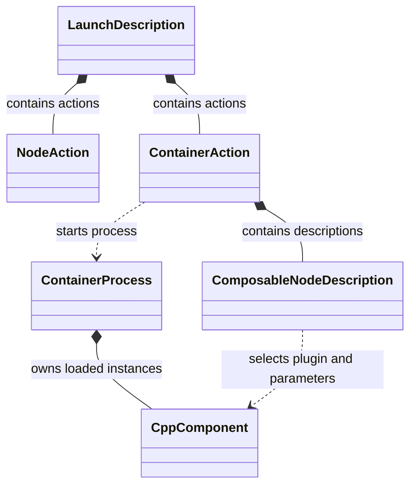
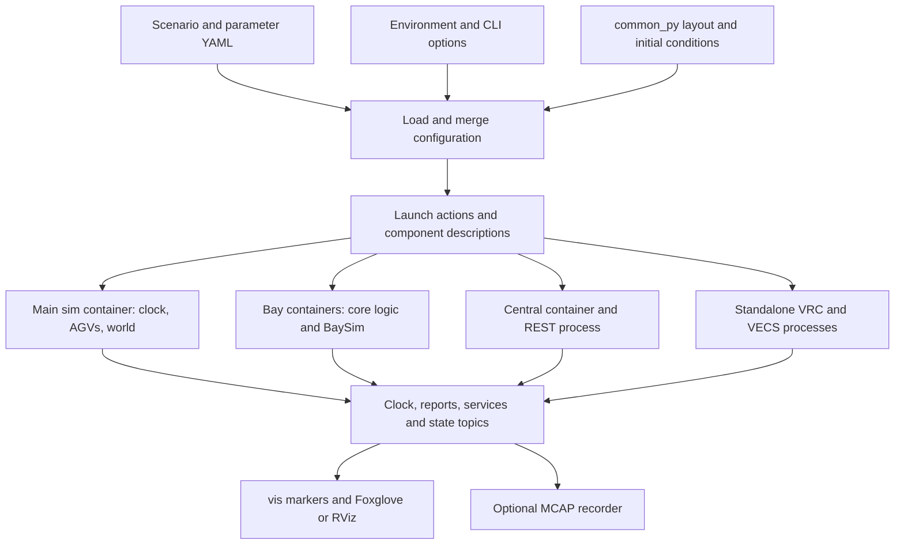
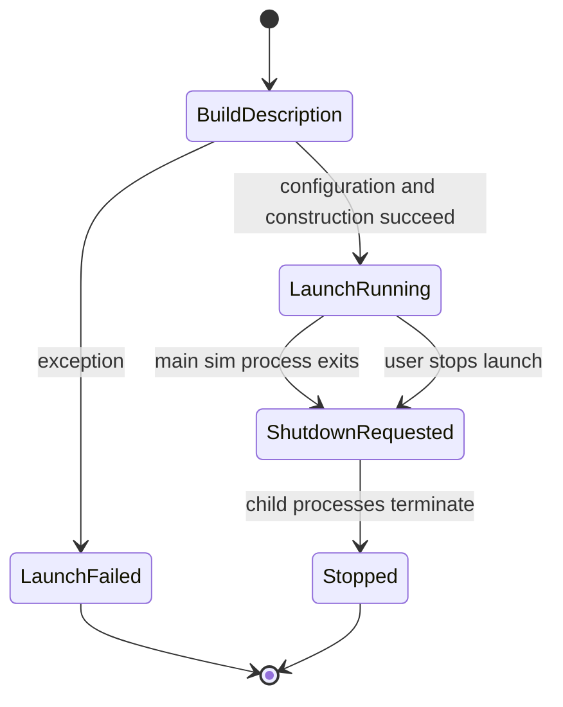

# Volley `launcher` Package: Package and Software Design

[Overview](volley_simulation_guide.md) · [Simulation package](volley_sim_package.md) · [Visualizer package](volley_vis_package.md) · [Setup and runbook](volley_simulation_runbook.md)

Source basis: all 23 files in `launcher-repomix.md`. Paths below are relative to `src/launcher/`. The pack intentionally excludes `params/`, `layouts/`, and `test/`; their contents and numerical configuration defaults cannot be reconstructed from callers. This is static source analysis: no ROS launch, component loading, or hardware test was performed.

## 1. Summary, package design, and dependencies

`launcher` turns scenarios, layouts, parameter files, environment variables, and command-line options into ROS launch descriptions. It decides which processes and C++ components exist, their namespaces, configuration, log routing, and optional visualization/recording. It supplies the orchestration layer used by simulation and production deployments; it does not implement scheduling, vehicle dynamics, bay transitions, or visualization algorithms.

The package is Python (`ament_python`), not a C++ component library. `setup.py` installs the `launcher` Python module, package-index marker, manifest, launch files, layouts, and parameter YAML. It exposes one console entry point: `layout_plotter = launcher.layout_plotter:main`. The two files under `scripts/` are source utilities, with no console entry points or explicit script installation in this setup file.

| Layer | Files | Design responsibility |
| --- | --- | --- |
| Launch entry points | `launch/*.launch.py` | Return a `LaunchDescription`; choose simulation, production device, or replay deployment. |
| Deployment factories | `launcher/*_nodes.py` | Construct standalone `Node` actions, `ComposableNode` descriptions, containers, and includes. |
| Configuration/path helpers | `launcher/utils.py`, `launcher/paths.py` | Merge parameters and resolve package/environment/artifact paths. |
| Recorder configuration | `launch/support/recorder.launch.xml` | Configure an MCAP recorder through launch arguments. |
| Offline layout tools | `launcher/layout_plotter.py`, `scripts/*.py` | Plot a graph, generate layout YAML, or export grid XML. |

Important dependencies used by the source include `launch`, `launch_ros`, `rclcpp_components`, `common_py`, `interfaces`, and deployed packages `sim`, `agvhito`, `central`, `scheduler`, `bay`, `lift`, `vecs`, `vrc`, `vis`, and `rviz2`. The manifest explicitly lists `ament_index_python`, `central_api`, `common_py`, `foxglove_bridge`, `rcl_logging_noop`, `rclpy`, MCAP/rosbag transport, and `scenario`. Many imported or launched packages are not direct manifest dependencies; availability therefore depends on the wider workspace. `yaml`, `click`, and Matplotlib are also used; `install_requires` lists only `setuptools`.

### What this confirms about the simulation

`launcher/sim_nodes.py` launches the C++ plugin `volley::agvhito::sim::SimAgvComponent`, one per entry in the Python-loaded initial `agvs` list. It passes `agv_id`, `initial_node_id`, `initial_heading`, and `initial_lifted = (lift_fraction == 1.0)`. Fractional lift positions are collapsed to a Boolean here; battery fraction is not forwarded by this factory. Central registration is a separate flow implemented by `sim`.

No supplied launcher file imports or executes `src/sim/python/agv_simulation`. Combined with the `sim` CMake/source analysis, this confirms no direct use of that Python wheel-dynamics project along the inspected launch path. An indirect call inside the omitted `agvhito` implementation remains unverified. No Gazebo/Ignition process is launched by this simulation factory.

## 2. Files

Approximate lines count extracted source rather than Repomix headers. Empty marker/module files are counted as one blank line.

| Path under `src/launcher/` | Lines (approx.) | Role |
| --- | ---: | --- |
| `launch/support/recorder.launch.xml` | 67 | MCAP storage, topic selection, splitting, and recorder arguments. |
| `launch/bagplay.launch.py` | 60 | Loop rosbag playback with visualizer and Foxglove bridge. |
| `launch/bay.launch.py` | 77 | Launch one production bay's core/driver components plus recorder. |
| `launch/central.launch.py` | 126 | Launch production central/scheduler, API/proxy, metrics, vis, bridge, recorder. |
| `launch/lift.launch.py` | 36 | Launch one standalone production lift component container. |
| `launch/sim.launch.py` | 12 | Thin simulation entry point delegating to `sim_nodes`. |
| `launch/vecs.launch.py` | 39 | Launch production EV-charging core and driver container. |
| `launcher/__init__.py` | 1 | Python package marker. |
| `launcher/bay_nodes.py` | 146 | Select ordinary/BLift core components, bridge and hardware drivers. |
| `launcher/central_nodes.py` | 133 | Define central/scheduler components, REST API, and production AGV proxy. |
| `launcher/layout_plotter.py` | 199 | Matplotlib layout graph plotter and installed Click command. |
| `launcher/lift_nodes.py` | 15 | Construct `lift::LiftComponent` description for a device ID. |
| `launcher/paths.py` | 19 | Resolve ROS home and artifact directory environment fallbacks. |
| `launcher/sim_nodes.py` | 497 | Parse simulation options, merge scenario configuration, assemble all processes. |
| `launcher/utils.py` | 103 | Boolean parsing, YAML loading, parameter precedence and device environment. |
| `launcher/vecs_nodes.py` | 90 | Build standalone charging core/simulator and production driver descriptions. |
| `launcher/vrc_nodes.py` | 53 | Build per-VRC processes with floors, motion limits, doors and initial floor. |
| `resource/launcher` | 1 | Ament package-index registration marker. |
| `scripts/generate_layout.py` | 54 | Generate corridor layout YAML through `common_py` and Click. |
| `scripts/layout_yaml_to_xml.py` | 32 | Export layout to NOC grid XML with layout checksum. |
| `package.xml` | 25 | Package identity, ament_python build type and dependency declarations. |
| `setup.cfg` | 4 | Install Python scripts beneath `lib/launcher`. |
| `setup.py` | 49 | Install Python/package data and layout-plotter console entry point. |

## 3. Public API and ROS contracts

These factories return descriptions of future runtime objects. Constructing a `ComposableNode` in Python does not instantiate its C++ class in the Python process; the container later loads the plugin.

| API | Path | Intended use |
| --- | --- | --- |
| `generate_launch_description()` | Each `launch/*.launch.py` | Entry called by `ros2 launch`; returns `LaunchDescription`. |
| `get_sim_launch_description(args, vis_default, ...)` | `launcher/sim_nodes.py` | Return `(entities, initial_conditions, layout, scenario_events, scenario_name)`; sim entry point uses entities, other callers can inspect scenario metadata. |
| `get_sim_launch_description_entities(params, initial_conditions, scenario_filepath, ...)` | Same | Build runtime actions from already loaded inputs; low-level recorder default is `True`, unlike public sim entry's `False`. |
| `load_params_and_initial_conditions(path)` | Same | Load scenario/initial conditions through `common_py`; set simulation environment defaults; return params and conditions. |
| `get_sim_clock_node(params, real_time_factor=1.0, clock_publish_period_ms=5.0)` | Same | Describe the wall-time-driven clock component; force its `use_sim_time=False`. |
| `get_core_composable_nodes(params)`, `get_driver_composable_nodes(params)` | `launcher/bay_nodes.py` | Return bay-ID-to-description-list maps; simulation uses core plus BaySim, production uses core plus physical drivers. |
| `get_composable_nodes(params)`, `get_standalone_nodes(params)` | `launcher/central_nodes.py` | Central/scheduler component list and separate API/proxy process list. |
| `get_composable_nodes(params, device_id)` | `launcher/lift_nodes.py` | Describe a standalone lift. |
| `get_vecs_sim_nodes`, `make_core_nodes`, `make_composable_driver_nodes`, `get_composable_hardware_driver_nodes` | `launcher/vecs_nodes.py` | Construct charging core/simulator/driver descriptions. |
| `get_vrc_sim_nodes(params, initial_conditions=None)` | `launcher/vrc_nodes.py` | Return VRC-ID-to-process-list map with scalar flattened parameters. |
| `load_params(device_type, layout=None, installation_id=None, use_sim_time=False)` | `launcher/utils.py` | Merge YAML and common values; return `(params, device_id)`. |
| `load_param_file(name)`, `string_to_bool(value)` | Same | Load installed YAML or recognize affirmative strings. Unknown Boolean text becomes false. |
| `get_artifacts_dir()`, `get_ros_home_dir()` | `launcher/paths.py` | Resolve artifacts and ROS home paths. |
| `write_grid_to_file(layout, layout_md5sum)` | `launcher/sim_nodes.py` | Export XML to fixed temporary `grid.xml`; not called by the supplied sim entry path. |
| `plot_grid`, `plot_nodes`, `render_layout`, `main` | `launcher/layout_plotter.py` | Draw/serialize floor-separated graph figures; CLI available with `ros2 run launcher layout_plotter`. |

### Interfaces versus deployment configuration

The Python launcher itself does not create garage-topic publishers/subscribers, service clients/servers, or action clients/servers. Its contract is deployment configuration. The launched C++/Python applications own the ROS message contracts. Parameter dictionaries, namespaces, and remappings connect those contracts; launch arguments are not ROS service requests.

| Boundary | Mechanism and source evidence | Limit of this pack |
| --- | --- | --- |
| Scenario/layout/parameters → launcher | Disk YAML via `common_py` and `yaml.FullLoader`; ament package-share lookup. | Python scenario loader and excluded YAML contents are not provided. |
| Launcher → component containers | `ComposableNode` plugin strings plus ROS parameter lists. | Plugin implementation, callback groups, component-load internals are in dependencies. |
| Simulation clock → consumers | Clock component configured to produce `/clock`; other simulation params use simulated time. | Clock recurrence is in the [sim math section](volley_sim_package.md#7-mathematics-and-algorithms). |
| Central/sim/AGVs → visualizer → RViz | Topic pub/sub; vis process uses explicit namespace `vis`. | Message type/QoS tables are in the [vis guide](volley_vis_package.md). |
| VRC → BLift bridge → bay | Source comment identifies `/vrc/r<ID>/report` to `/lift/l<bay-ID>/report`, converting VRC to lift reports. | Bridge implementation and exact QoS/schema conversion are omitted. |
| User/web client → `central_api` | Standalone `central_api/rest_api` process, with `introspection_mode=metadata`. | Routes, HTTP port and REST-to-ROS mapping are not configured in these factories. |
| Production AGV proxy → external systems | Environment supplies MQTT broker and map-server host/port parameters. Proxy omitted when `is_simulation` is truthy. | MQTT topics/payloads, map protocol, retry/security behavior belong to proxy implementation. |
| ROS data → recorded artifacts | `rosbag2_transport/recorder`, MCAP, regex-based topic selection and discovery enabled. | Exact recorded set depends on live graph and rosbag version; service/action recording is not established by the XML's comment. |
| Metrics process → telemetry endpoint | Production central adds `metrics_recorder`; OTEL host/port become `metrics.otel_endpoint`. | Transport/data schema is in central; this specific metrics process is not added by the sim factory. |

The simulation visualizer is launched as `Node(package="vis", namespace="vis", name="visualizer", ...)`. This supplies the missing namespace evidence for relative marker outputs resolving to `/vis/...`. Simulation forces local meshes by default; production central passes only shared params, so its mesh mode depends on YAML or the application's default.

## 4. Diagrams

### 4.1 UML: launch descriptions and runtime ownership

There are no package-defined application classes. This UML models framework objects the factories compose, and distinguishes descriptions from runtime ownership.

Python actions are owned by the launch description/context. C++ components live in their container process. Sharing a Python parameter dictionary is not shared-memory state between the launched components.

### 4.2 Configuration and runtime data flow

The diagram groups runtime ROS contracts; the launcher orchestrates them, rather than relaying every message. Physical drivers/MQTT proxy belong to production entry points, not the inspected sim path.

### 4.3 State machines

**No state machine.** This package defines no YASMIN or enum-driven control machine. It selects bay state-machine plugins implemented in `bay`. `OnProcessExit` is a launch event handler, not a parking-system state transition.

The following diagram shows deployment lifecycle only:

An exit of the main simulation container requests global shutdown even for return code zero, unless the launch context is already shutting down. Equivalent exit supervision is not explicitly registered for every other child.

## 5. Behavior: construction, execution, shutdown, and defaults

### Simulation assembly

1. `sim.launch.py` passes `sys.argv` and `vis_default=True` into `get_sim_launch_description()`.
2. Regexes parse recognized `name:=value` options from `args[2:]`. A scenario is required in practice: the default `None` reaches `os.path.isfile()` without validation. Existing file paths are accepted; otherwise a name is joined to the installed `scenario/scenarios` directory.
3. Python scenario loading provides layout and initial conditions. Defaults include `GITSHA=unknown` and `ROS_DOMAIN_ID=75` only when unset. Simulation calls `load_params("sim", layout=scenario["layout"], installation_id=9998, use_sim_time=True)`, so those values do not come from shell `LAYOUT`/`INSTALLATION_ID` on this path.
4. Configuration is merged, actions built, and the scenario is loaded again to obtain `events` and return layout metadata. `scenario["events"]` is a direct lookup, so absence is an error here even if another parser would accept it.
5. ROS launch executes process/container actions. Application startup, registration, and periodic operation then happen in the deployed packages.

The launcher Python scenario loader and `sim` C++ parser independently read scenario data. Their equivalence cannot be assumed because `common_py.scenario` is omitted. A mismatch can produce launched AGVs that differ from central registration requests.

### Parameter precedence

`load_params()` applies these layers, later merges overriding earlier layers through the omitted `merge_params_dict` helper:

| Order | Layer |
| ---: | --- |
| 1 | Required installed `params/params.yaml`. |
| 2 | Required `params/params_<device_type>.yaml`, e.g. `params_sim.yaml`. |
| 3 | `params/params_<layout>.yaml`; missing is tolerated for explicit simulation configuration, required in the normal production path. |
| 4 | Optional `params/params_<first-letter-of-device-type><DEVICE_ID>.yaml`, e.g. `params_s0.yaml`. |
| 5 | Common `layout`, `installation_id`, `use_sim_time` values merged into each top-level parameter block and at root. |
| 6 | Simulation scenario's `params` block. |
| 7 | Simulation sets root `is_simulation=True`, then applies optional programmatic `param_overrides`. |
| 8 | Explicit option adjustments for auto-confirm, disabling dispatch charging, dirtiness threshold, and `printdags`. |
| 9 | Per-node parameter-list entries, whose ordering differs across factories. Clock/AGV/BaySim/vis append explicit values after shared params; bay state machine puts its local values before shared params. |

Review layer 9 when adding per-instance settings: shared configuration can override bay state-machine `bay_id` or `bay.external_lift_driver` because the list is `[bay_state_machine_params, params]`. Exact nested merge behavior belongs to `common_py`; do not infer type validation from this wrapper.

### Public simulation launch options

| Option | Entry-point default | Behavior |
| --- | --- | --- |
| `scenario` | `None`; supply it | Existing file or installed scenario filename. |
| `vis` | `true` | Enables visualizer and Foxglove bridge; also gates RViz creation. |
| `rviz` | `true` | Creates RViz only when `vis` is also enabled. |
| `record_artifacts` | `false` | Adds simulation recorder. Lower-level entities factory defaults to true. |
| `artifacts_output_dir` | Artifact root plus UTC timestamp | Timestamp format `YYYYMMDDTHHMMSSZ`; root uses `ARTIFACTS_DIR`, otherwise ROS home/artifacts. |
| `artifact_basename` | Unset → `sim` in recorder include | Output subdirectory/name prefix. |
| `use_remote_meshes` | `false` | Explicitly overrides visualizer application's true default. |
| `remote_mesh_prefix` | Unset | Only passed when truthy; otherwise visualizer retains built-in prefix. |
| `real_time_factor` | `1.0` | `float()` passed to clock component; no finite/nonnegative validation here. |
| `auto_confirm_insert` | Unset | Preserve YAML default; when supplied, set `simulator.auto_confirm_insert`. |
| `enable_dispatch_charging_mode` | Parser true | Only explicit false writes the parameter; true does not force a YAML false to true. |
| `garage_dirtiness_threshold_ratio` | Unset | Preserve YAML value; explicit float sets nested dispatch parameter. |
| `printdags` | `false` | Always writes root parameter, overriding prior configuration. |

These sim options are manually parsed, not declared with `DeclareLaunchArgument`. `--show-args` is therefore not a complete option catalog. Regex matches are not anchored at the end, unknown tokens are ignored by this parser, whitespace-bearing values can be truncated, and unrecognized Boolean spellings become false. Use the table as the source-backed catalog.

### Processes, executors, and startup timing

| Deployment unit | Contents/execution |
| --- | --- |
| Main simulation container | Clock first in description list, then initial AGVs, then `SimulatorComponent`; `component_container --executor-type multi-threaded`. |
| One container per layout bay | State machine, vehicle estimator, guidance, optional BLift bridge, and BaySim; multithreaded executor. |
| Central simulation container | AGV/safety/consistency monitors, dispatcher, tracker, garage monitor, scheduler; multithreaded executor. |
| VECS | One standalone core plus simulator process per layout EV-charge ID. |
| VRC | One `vrc/vrc` standalone executable per layout VRC; launcher passes speed/accel and door times, not the internal motion algorithm. |
| Visualization | Standalone vis, included Foxglove launch, optionally standalone RViz. |
| REST API | Standalone central_api in both central and simulation paths. |
| Recorder | Optional standalone recorder in simulation; included by production bay/central entry points. |

Clock-first ordering is a description order, not a readiness barrier. Other actions are appended before the main simulation container, and no `OnProcessStart`/service-ready/clock-message condition delays their startup. Components must tolerate discovery and initialization races. Multithreaded execution permits callback overlap; it does not establish which component callback groups are mutually exclusive or make application state thread-safe.

RViz is launched as `Node(package="rviz2", executable="rviz2")` with no explicit `-d` configuration file or parameters. This source therefore does not guarantee loading `vis/config/default.rviz.in`, Fixed Frame `map`, or the matching displays automatically.

### Bay, BLift, VRC, and production selection

`bay_nodes` traverses `layout.get_bay_ids()`. It chooses `bay::BliftStateMachineComponent` when the node is TYPE_BLIFT, has multiple system floors, or its system floor differs from insert floor; otherwise it chooses `bay::StateMachineComponent`. Every bay also gets vehicle estimation and guidance. TYPE_BLIFT sets external lift driving and requires a matching VRC membership; missing membership raises `RuntimeError`. Its bridge lets the bay observe scheduler-controlled VRC movement. Legacy multi-floor bays keep internal lift driving according to the configured flag.

Production bay deployment replaces BaySim with PLC, IO-Link, and load-cell drivers. Production central additionally launches the HITO proxy when `is_simulation` is false, plus metrics recorder and visualization. Production lift and VECS entry points use the environment's selected device ID. VRC simulation initial floor comes from `initial_conditions.vrcs` by ID, falling back to `-1`; the meaning of `-1` is delegated to `vrc`.

### Recording and replay

`setup.py` recursively finds launch files and installs all of them into the single installed `share/launcher/launch` destination. Thus source `launch/support/recorder.launch.xml` is expected at installed `launch/recorder.launch.xml`; callers intentionally include that flattened path.

Recorder required arguments are `basename` and `output_dir`. Defaults: `custom_data=[unset=]`, empty exclude regex, node name `recorder`, topic regex `.*`, split duration 600 seconds, split size zero. Storage is MCAP with `zstd_fast`; keyboard controls are disabled and discovery remains enabled. All-actions/all-services/all-topics flags are explicitly false; topic regex selection is used. Capturing service/action observations is not guaranteed merely by the source comment, and depends on runtime support/introspection. The REST process gets metadata introspection, which does not establish recording complete request/response payloads.

`bagplay.launch.py` requires an existing `bagfile` and loops `ros2 bag play`; it starts vis with local meshes and Foxglove through a nested `ros2 launch` process. It passes neither layout nor `use_sim_time` to vis and does not request rosbag `--clock`. Standalone replay compatibility with layout loading and visual animations therefore needs verification; no RViz process is added here.

Shutdown: main sim-container exit triggers global launch shutdown if not already shutting down. There is no explicit restart/respawn policy, application drain protocol, temporary-grid cleanup, or supervision of every child process in this package. Child-specific shutdown belongs to ROS launch and the launched applications.

## 6. Ownership, safety, error handling, and risks

Factories synchronously create Python dictionaries/lists and framework descriptions. Parameters are serialized to launched processes, not shared references for concurrent C++ mutation. `copy.deepcopy(initial_conditions["agvs"])` isolates the AGV list used for description construction. This package creates no worker threads, ROS timers, callback groups, locks, or atomics of its own. The exit-handler lambda receives event/context objects; it does not capture a C++ `this` pointer.

Configuration errors generally propagate as Python exceptions: required files, invalid integer/float text, missing dictionary keys, invalid layout membership. Optional layout/device YAML only suppresses `FileNotFoundError`; malformed files still fail. `layout_plotter.main()` catches exceptions, prints an error and exits 127. There is no package-level retry or validation result type. Child callbacks capturing `this` must be audited in their owning packages.

| RISK | Evidence and consequence | Appropriate follow-up |
| --- | --- | --- |
| Startup ordering is not readiness | Clock list order and action order supply no data-ready barrier. | Test cold-start discovery and clocks at zero; add explicit readiness only where required. |
| YAML/parser divergence | Python and C++ load scenarios separately; their shared-schema implementation is omitted. | Cross-check initial AGV/tray/VRC sets and event/config optionality. |
| Incomplete defaults evidence | Parameter/layout folders excluded. | Review installed YAML before asserting auto-confirm, VRC limits, or production geometry defaults. |
| Instance parameters overwritten | Bay state-machine parameter list places shared params last. | Check precedence for `bay_id` and external lift driver per bay. |
| Multithreaded races/deadlocks remain possible | Containers use multithreaded executor; component groups/locks are independent. | Audit blocking calls and group serialization in component implementations. |
| Partial supervision | Only main sim-container exit triggers explicit global shutdown. | Decide policy for failed central, bay, VRC, REST, visualization, or recorder processes. |
| Argument parsing accepts mistakes | No schema/declarations; false on unknown Boolean strings; floats unvalidated. | Reject unknown options and invalid ranges; consider standard launch declarations. |
| Environment/domain surprises | Simulation uses installation ID 9998 and scenario layout; domain 75 shared when unset. | Document deployment identity and allocate domains per concurrent run. |
| Shared temporary output | `write_grid_to_file` uses fixed temp `grid.xml`. | Use a unique path if invoking helper concurrently; it is not invoked by current sim entry. |
| Asset/RViz deployment assumptions | Local assets default; RViz config not supplied on command line. | Verify installed `sim/3d` and explicitly select the desired RViz config. |
| Dependency and flattened-file collisions | Manifest omits many used packages; recursive data install flattens subdirectories. | Audit dependencies and duplicate launch/parameter basenames. |
| Replay time/layout mismatch | Bagplay gives vis no layout/sim-time and playback no `--clock`. | Test replay with explicit layout and time policy. |

## 7. Mathematics and algorithms

There are **no vehicle dynamics or kinematic integration equations in `launcher`**. It passes performance parameters to other packages and selects graph/layout tooling. VRC transit `speed`/`accel` forwarding does not prove a trapezoidal velocity profile or any particular integrator.

Parameter precedence can be expressed as an ordered configuration overlay, not numerical addition. Let $P_k$ be configuration maps and $\triangleright$ mean recursively overlay later keys according to `merge_params_dict`:

$$
P_{\mathrm{effective}}=P_1\triangleright P_2\triangleright\cdots\triangleright P_n.
$$

This notation records intended precedence; detailed recursive/type-conflict rules require the helper implementation. Maps are not vectors or matrices, and overlay is generally noncommutative.

AGV initial lifting is a Boolean decision: for configured fraction $\ell\in\mathbb{R}$,

$$
b_{\mathrm{lifted}}=\begin{cases}1,&\ell=1.0,\\0,&\ell\ne1.0.\end{cases}
$$

Clock timing and collision math are in the [sim guide](volley_sim_package.md#7-mathematics-and-algorithms), and rigid transforms/visual animation in the [vis guide](volley_vis_package.md#7-mathematics-and-kinematic-animation). AGV physical motion equations still require `agvhito` implementation.

Offline graph plotting draws each edge between the layout node vectors $\mathbf{p}_i=[x_i,y_i]^{\mathsf T}\in\mathbb{R}^2$ in metres, filters both endpoints by floor membership, and uses equal axis aspect. It renders graph topology; it does not solve routing or collision avoidance. Grid generation and layout checksum computation delegate to `common_py`.

## 8. Tests and validation gaps

No test source is in the pack: `test/` was intentionally excluded. `package.xml` declares `ament_cmake_pytest`; setup's test extra includes pytest. These declarations do not establish what behavior is covered. No dependency-backed import/launch test was run for this documentation.

Meaningful future checks should exercise parameter precedence (including shared versus local bay settings), invalid/unknown CLI options, missing scenario/events, ordinary/legacy multi-floor/BLift selection, unmatched VRCs, ID-to-process cardinalities, AGV lift conversion, VRC initial floor, expected vis namespace, installed recorder-path flattening, headless combinations, clock readiness, child-failure supervision, and replay time/layout configuration. Stubbed launch-description checks can inspect topology; live ROS tests are needed for plugin loading, resolved names, callback progress, and recording.

## 9. Idioms to reuse and open questions

Reuse thin `generate_launch_description()` entry points, reusable node factories, explicit per-device namespaces, separation of production core from hardware/simulation feedback, ordered parameter overlays, clock-source `use_sim_time=False`, and `context.is_shutdown` in exit handling to avoid redundant shutdown requests. Preserve the distinction between a Python component description and a loaded C++ instance. Treat new launch flags as configuration APIs with validation and documented precedence.

Open questions for the team:

1. Should sim options use declared launch arguments so tooling and `--show-args` expose the supported API?
2. Is installation ID 9998 intentional regardless of shell `INSTALLATION_ID`, and should domain 75 be allocated per developer/run?
3. Are Python/C++ scenario loaders tested against one schema, especially optional events and VRC initial conditions?
4. Should bay per-instance settings always be the final parameter-list entry?
5. Which startup conditions need readiness barriers, and which child failures should stop or restart the deployment?
6. Should RViz always receive an explicit installed configuration and simulated-time setting?
7. Is fractional initial AGV lift intentionally reduced to fully lifted/not lifted, and where should battery state be initialized?
8. Does `agvhito` indirectly use the Python wheel-dynamics project? Which equations govern its simulated motion?
9. Should bag playback publish a clock and pass layout/sim-time to vis?
10. Which service/action introspection data must artifacts capture, and do deployed recorder settings achieve that?
11. Are missing manifest dependencies and flattened data-file paths deliberate workspace conventions?

The excluded YAML, tests, and downstream implementation files remain necessary to close these questions. Documentation distinguishes source-confirmed factory behavior from assumptions about the deployed runtime.
