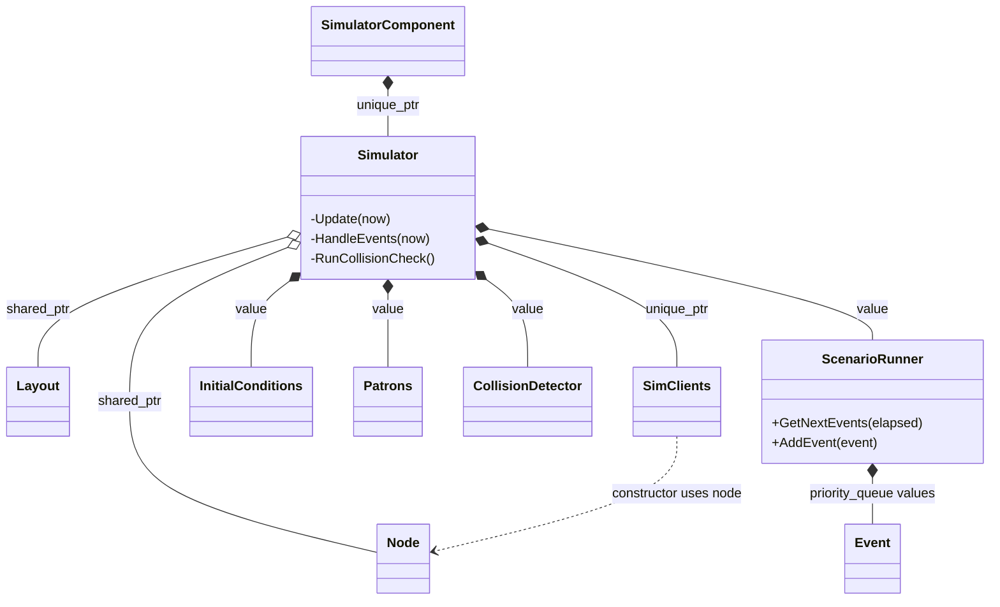
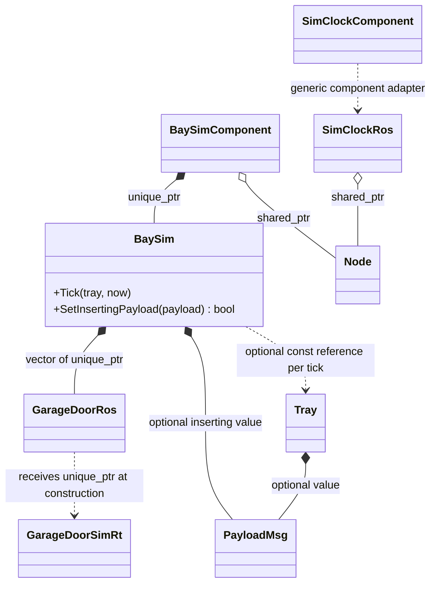
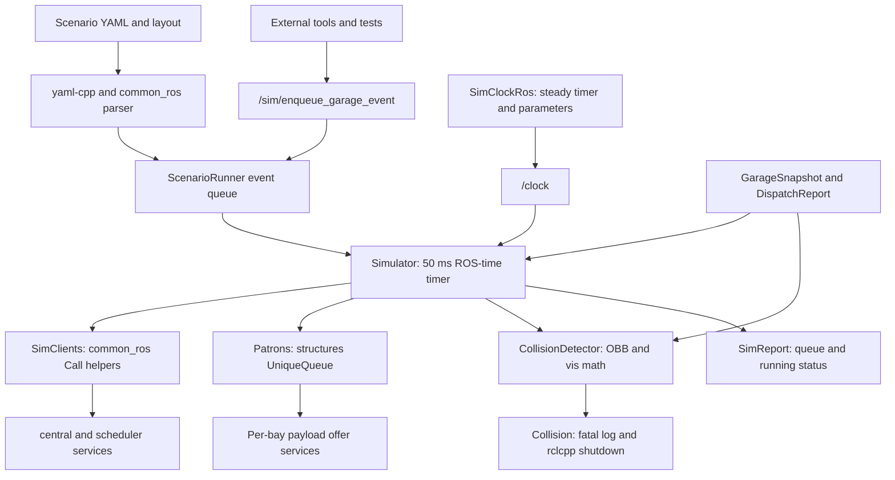
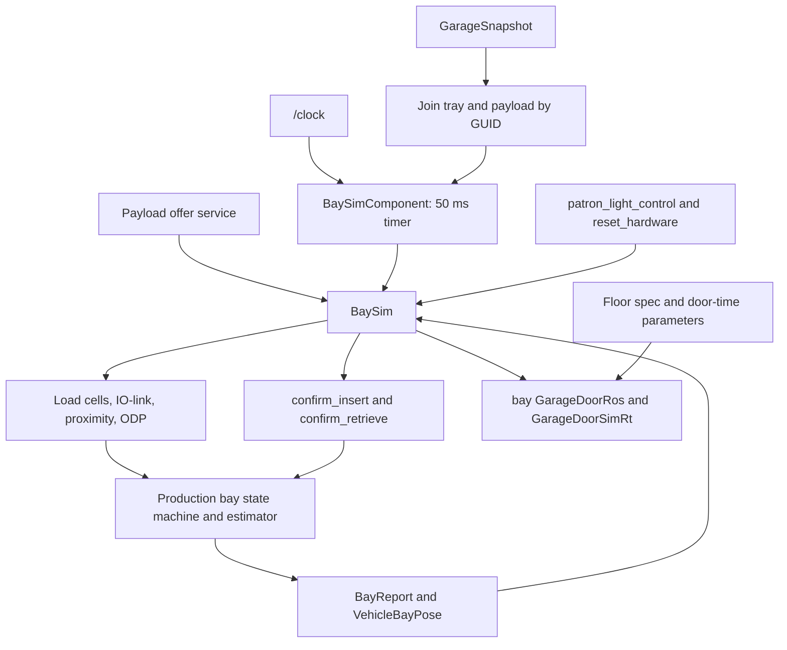
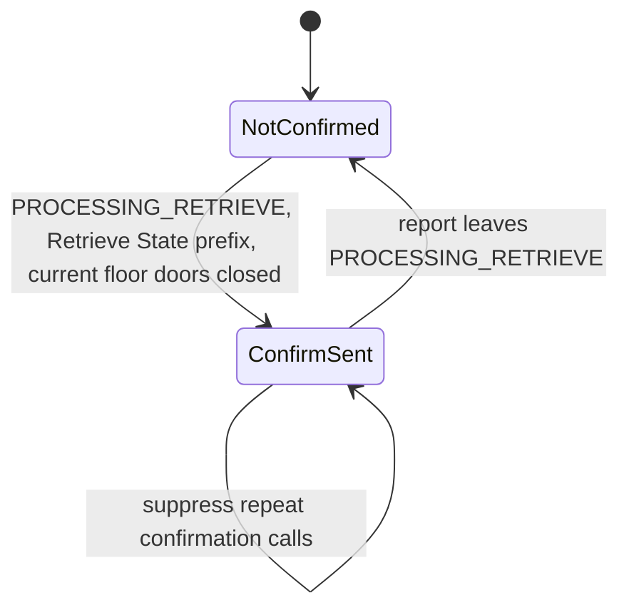
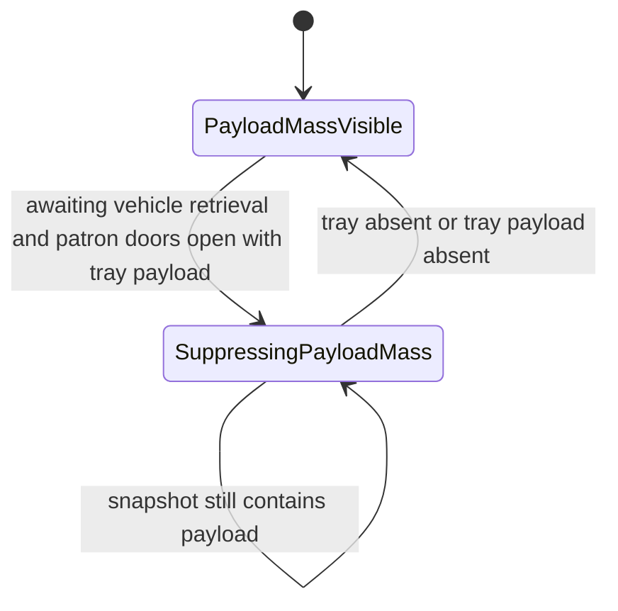

# Volley `sim` Package: Design and Source Analysis

[Overview and ROS concepts](volley_simulation_guide.md) · [Visualizer package](volley_vis_package.md) · [Setup and runbook](volley_simulation_runbook.md) · [Launcher package](volley_launcher_package.md)

## Acronyms, abbreviations, and project names

This reference is local to this document so it remains readable on its own. Formal expansions are distinguished from product/project names whose full forms are not stated in the supplied source. Acronyms inside code, endpoint names, file paths and diagrams retain their exact spelling.

| Term | Full name or meaning | Role in this document |
| --- | --- | --- |
| 2D / 3D | Two-dimensional / three-dimensional. | Planar geometry versus a volume or mesh with height/depth. |
| pub/sub | Publish/subscribe. | Topic-stream interaction; no paired response to each publication. |
| ROS | Robot Operating System; these guides use ROS 2. | Framework for nodes, messages, services, parameters and execution. |
| AGV | Automated guided vehicle. | Mobile robot that transports parking trays. |
| ODP | Overdrive plate. | Bay floor plate, observer feedback and visual slide animation. |
| API | Application programming interface. | Callable C++/Python interfaces, ROS endpoints or the web service, depending on context. |
| GUI | Graphical user interface. | RViz’s displayed interface and frame-rate setting. |
| QoS | Quality of service. | Message delivery policies such as reliability, history depth and durability. |
| REST | Representational state transfer. | Web API style; distinct from native ROS service request/response. |
| MQTT | Messaging protocol name; historically MQ Telemetry Transport, also expanded as Message Queuing Telemetry Transport in [standards-body terminology](https://www.oasis-open.org/committees/tc_home.php?wg_abbrev=mqtt). | Broker-based publish/subscribe transport used by the production proxy; [protocol overview](https://mqtt.org/faq/). |
| DB | Database. | Persistent storage; linkage alone does not prove database operations. |
| CRUD | Create, read, update and delete. | Operations on the collision-body registry, not proof of database I/O. |
| I/O | Input/output. | Sensor/driver interfaces or external data exchanges. |
| IO-Link | Industrial sensor/actuator communication interface; IO means input/output. | Bay sensor messages and the physical driver; not ordinary network pub/sub. |
| GUID | Globally unique identifier. | Vehicle/payload identity; distinct from numeric tray, bay and AGV IDs. |
| UUID | Universally unique identifier. | Identifier type/notation used by generated interfaces and helper tools. |
| ID | Identifier. | Numeric resource identity or a named configuration identifier. |
| FIFO | First in, first out. | Intended waiting-patron queue discipline. |
| OBB | Oriented bounding box. | Yaw-oriented collision volume; includes height in the 3D type. |
| SAT | Separating axis theorem. | Box-overlap test based on projected intervals. |
| YASMIN | Yet Another State MachINe. | ROS state-machine library named in the review rules; not used by the inspected packages. [Project documentation](https://github.com/uleroboticsgroup/yasmin). |
| YAML | YAML Ain’t Markup Language (recursive acronym). | Scenario, layout and parameter configuration format. |
| XYZ / XY / ZYX | Coordinate or rotation-axis notation, not acronyms. | X/Y are horizontal axes, Z is vertical; ZYX is the stated Euler rotation composition order. |
| TB / TD | Top-to-bottom / top-down Mermaid layout directives. | Diagram orientation; not application components. |
| Msg / Srv / SPtr / UPtr | Message / service / shared pointer / unique pointer naming abbreviations. | C++ aliases such as GarageSnapshotMsg and AddTraySrv; ConstSharedPtr is shared ownership of const data. |
| sim / vis / devc | Simulation / visualization / development-container wrapper names. | Package/tool shorthand, not additional engines or protocols. |
| rclcpp / rclpy / rclcppx | ROS client library for C++ / ROS client library for Python / this repository’s C++ client-library extensions. | Node/executor APIs and project-specific adapters/factories. |

Uppercase state labels (`AUTO`, `STOPPED`, `OPEN`, `CLOSED`, and similar), enum constants, macro names and build flags are exact code identifiers, not unexplained acronyms. `RISK` is a review label; `TODO` means “to do.” Units use `m` for metres, `s` for seconds, `ms` for milliseconds, `ns` for nanoseconds, and `kg` for kilograms.

## 1. Summary and evidence scope

The `sim` package supplies a ROS (Robot Operating System) simulation clock, garage-level scenario orchestration and collision checking, and per-bay simulated hardware. These let production control packages operate on simulated sensor feedback and garage state. Dependents primarily use ROS components, topics, and services; the library also exposes scenario, queue, tray-pose, and collision utilities through C++ headers.

The supported full-system entrypoint remains `ros2 launch launcher sim.launch.py`, as documented in the supplied simulation guide. Setup and exact quick-start commands are preserved in [the setup/runbook](volley_simulation_runbook.md). Running an individual `sim` executable does not replace the launcher's responsibility to start the other packages and configure them.

**Evidence:** the 28 files in `sim-repomix(1).md` and the 30 files in `vis-repomix.md` provide the implementation basis. Source behavior takes precedence over the earlier pasted architecture prose. The `sim` tests, 3D asset bytes, Python dynamics, simulated AGV (automated guided vehicle) implementation, most dependency internals, and custom interface definitions remain outside these packs. The `vis` math test is included and analyzed. This is static source analysis; no ROS build or runtime test was performed. Paths refer to the Volley repository root, and approximate line counts refer to extracted source, not positions in the packed Markdown.

### Is the Python AGV dynamics project used?

**Confirmed for the supplied `sim` build:** `src/sim/CMakeLists.txt` compiles only the listed C++ libraries/components, installs `3d` and test fixtures, and contains no Python installation, launch, subprocess, import, or linkage to `python/agv_simulation`. None of the packed implementation files references that Python project. It is therefore reasonable to omit it from an analysis of these C++ components.

**Confirmed for the inspected launcher too:** none of its 23 files imports or executes the Python dynamics project; it loads the C++ `agvhito::sim::SimAgvComponent`. Indirect use inside that omitted plugin is still unverified, so a full-repository usage claim requires its implementation. Also, this package consumes AGV state; it does not implement AGV wheel dynamics itself.

Run this from the actual repository to find possible integration points:

```bash
rg -n 'agv_simulation|agv_dynamics|agv_kinematics|dynamics_simulation|dynamic_simulation_eight_wheels' \
  src/launcher src/agvhito docker .devcontainer pyproject.toml
rg -n 'SimAgvComponent|sim_nodes|ExecuteProcess|subprocess' src/launcher src/agvhito
```

Inspect any matches and the AGV component build definitions. An absence of direct text matches is supporting evidence, not proof against dynamically constructed imports.

### Corrections to the earlier documentation

| Earlier assumption/documentation | What this source actually shows |
| --- | --- |
| Initial payloads in a top-level `initial_conditions.payloads` list | This parser reads payloads from `initial_conditions.trays[].payload`; a separate top-level payload list is not consumed. |
| Disabledness events use `disabled` | Timed event YAML (YAML Ain’t Markup Language; configuration format) uses `disable`. A tray's initial-condition field is separately named `disabled`. |
| Readiness event takes `ratio` | Timed YAML requires `bay_readiness_ratio`. |
| `set_agv_battery_fraction` changes the battery | It is parsed and enumerated, but its execution branch only logs “not implemented.” |
| Events execute in timestamp order | The runner returns ascending timestamps, but the simulator consumes the vector from the back: each due batch executes in reverse order. |
| Clock follows actual elapsed wall time exactly | Each steady-timer callback adds one configured period times the factor; delayed callbacks do not explicitly integrate elapsed wall time. |
| Geometric contact is uniformly non-colliding | XY separating-axis checks include touching; the Z interval test excludes touching. |
| Sim report contains all geometry | `PublishReport` sets timestamp, running flag, remaining count, and patron queue. `ConstructBodyMessages()` exists but is not called by this publisher. |

## 2. Files in the pack

The table includes every file in the `sim` pack; the `vis` pack has its own complete inventory in [the visualizer file inventory](volley_vis_package.md#2-files). Test and mesh installation references in CMake do not mean those files are present in the `sim` pack.

| Path | Lines (approx.) | Role |
| --- | ---: | --- |
| `src/sim/include/sim/bay_sim.hpp` | 118 | Bay hardware model API (application programming interface), ROS handles, and insert/retrieve latches. |
| `src/sim/include/sim/collision_detector.hpp` | 85 | Typed body identifiers and owned collision-volume registry API. |
| `src/sim/include/sim/collision_utils.hpp` | 35 | Vertex/projection/SAT (separating axis theorem) and interval-intersection declarations. |
| `src/sim/include/sim/oriented_bounding_box.hpp` | 32 | Yaw-only box types and entity geometry factory declarations. |
| `src/sim/include/sim/patrons.hpp` | 46 | GUID (globally unique identifier) comparator and unique patron-insertion FIFO (first in, first out) API. |
| `src/sim/include/sim/scenario_runner.hpp` | 117 | Initial conditions, typed events, YAML parser entrypoint, priority queue. |
| `src/sim/include/sim/sim_clients.hpp` | 66 | Service-client facade for central and scheduler controls/jobs. |
| `src/sim/include/sim/sim_msgs.hpp` | 151 | Generated ROS message/service includes and global aliases. |
| `src/sim/include/sim/simulator.hpp` | 98 | Engine ownership, timer callbacks, queue/client/collision orchestration. |
| `src/sim/include/sim/tray.hpp` | 29 | Tray/payload value model and payload-pose helper declaration. |
| `src/sim/scripts/confirm_insert.bash` | 7 | REST (representational state transfer) helper posting a random GUID to hardcoded localhost bay 39. |
| `src/sim/scripts/trigger_patron_arrival.bash` | 37 | Environment/domain setup and direct SimEvent patron-arrival call. |
| `src/sim/src/collision_detector.cpp` | 159 | Body registry CRUD (create, read, update and delete), ordered identifiers, pairwise checks, body messages. |
| `src/sim/src/collision_utils.cpp` | 69 | Planar box vertices, separating-axis checks, strict Z interval overlap. |
| `src/sim/src/oriented_bounding_box.cpp` | 114 | AGV/tray/bay/payload/charger geometry from constants and floor height. |
| `src/sim/src/patrons.cpp` | 37 | Unique FIFO admission, logging, optional front, copied queue reporting. |
| `src/sim/src/scenario_runner.cpp` | 225 | YAML conversion/defaults, layout and initial-condition parsing, due events. |
| `src/sim/src/sim_clients.cpp` | 239 | Create explicit clients; seed entities; send controls and job requests. |
| `src/sim/src/simulator_component.cpp` | 31 | Registered component owning the parsed scenario and engine. |
| `src/sim/src/tray.cpp` | 13 | Copy tray pose and add reciprocal payload yaw. |
| `src/sim/include/sim/sim_clock_ros.hpp` | 39 | Clock application API and owned timer/publisher/atomic factor. |
| `src/sim/src/bay_sim_component.cpp` | 108 | Per-bay wrapper, snapshot join, offer service, ROS-time ticking. |
| `src/sim/src/sim_clock_component.cpp` | 12 | Generic rclcppx clock-component alias and ROS plugin registration. |
| `src/sim/src/sim_clock_ros.cpp` | 72 | Clock parameters, steady timer, fixed-step time increments, publication. |
| `src/sim/src/simulator.cpp` | 348 | Seed/gate/update flow, event dispatch, bay offers, collision shutdown, report. |
| `src/sim/CMakeLists.txt` | 72 | Shared libraries, three component/executable targets, installs and test targets. |
| `src/sim/package.xml` | 41 | ament_cmake package metadata and dependency declarations. |
| `src/sim/src/bay_sim.cpp` | 355 | Simulated doors/sensors, insert handoff, retrieve confirmation and mass removal. |

### Build products and integration boundaries

| CMake target | Sources/purpose | Component plugin or executable |
| --- | --- | --- |
| `simulator_lib` | Bay hardware, clients, collision geometry, patrons, scenario parser/runner, tray helpers | Shared utility library; links `mysqlcppconn`. |
| `sim_clock` | `sim_clock_ros.cpp` | Shared clock implementation. |
| `sim_clock_component` | `sim_clock_component.cpp` | `volley::sim::SimClockComponent`; `sim_clock_node`. |
| `simulator_component` | `simulator.cpp`, `simulator_component.cpp` | `volley::sim::SimulatorComponent`; `sim_world_node`. |
| `bay_sim_component` | `bay_sim_component.cpp` | `volley::sim::BaySimComponent`; `bay_sim_node`. |

These names are the declarations passed to `volley_add_component`; the macro implementation is omitted, so installed behavior has not been independently checked. The package is `ament_cmake`, with a declared minimum CMake version of 3.28. `install(DIRECTORY 3d ...)` preserves mesh assets as runtime data; deleting those assets from the repository would differ from excluding them from this pack.

## 3. Public API and dependent usage

All simulator types below are in `volley::sim`, except the ROS message aliases in `sim_msgs.hpp`, which are at global scope.

### Components and application classes

| API | Definition path | How dependents use it |
| --- | --- | --- |
| `SimulatorComponent` | `src/sim/src/simulator_component.cpp` | Load the registered ROS plugin, or use its declared executable. Creates a `volley::Node("simulator", "sim", options)`, reads the required scenario path, and owns the engine. |
| `Simulator(NodeSPtr, LayoutSPtr, InitialConditions, ScenarioRunner)` | `src/sim/include/sim/simulator.hpp` | Construct with shared node/layout and value inputs. Its behavior thereafter is timer/service driven; update methods are private. |
| `BaySimComponent` | `src/sim/src/bay_sim_component.cpp` | Load once per configured bay. Owns the hardware model, joins tray/payload snapshot data, exposes the offer service, and ticks it. |
| `BaySim` | `src/sim/include/sim/bay_sim.hpp` | Construct with bay ID (identifier), door travel times, auto-confirm flag, and node. Call `Tick(optional<Tray>, now)`; use `SetInsertingPayload` to offer a patron vehicle. Copy operations are deleted. |
| `SimClockComponent` | `src/sim/src/sim_clock_component.cpp` | Alias for `rclcppx::Component<SimClockRos>`; registered as a component. |
| `SimClockRos` | `src/sim/include/sim/sim_clock_ros.hpp` | Construct with `rclcpp::Node::SharedPtr`; owns publisher, timer, and parameter callback. `kNodeName` is `"sim_clock"`. Consumers use `/clock` with `use_sim_time=true`. |
| `SimClients` | `src/sim/include/sim/sim_clients.hpp` | Construct on an existing node; call job/control wrappers. Most booleans indicate a request was sent, not that its remote operation succeeded. |

Component classes defined only in `.cpp` files are plugin entrypoints rather than directly includable public classes. `RCLCPP_COMPONENTS_REGISTER_NODE` registers all three plugins. `volley_add_library`, `volley_add_component`, `volley_add_gtest`, `volley_package`, and `volley_ament_auto_package` are dependency-provided build macros, not APIs defined by `sim`.

### Data and algorithm APIs

| API | Header path under `src/sim/include/sim/` | Contract |
| --- | --- | --- |
| `InitialConditions` | `scenario_runner.hpp` | Vectors of AGV/tray/payload service requests plus obstruction boxes. `Clear` and `IsEmpty` consider only the first three vectors. |
| `Event`, `Event::Type` | `scenario_runner.hpp` | Typed event with timestamp, resource ID, pose, float/uint/bool slots, and payload. Service construction throws `runtime_error` on unknown type. |
| `ParseScenarioFile(path)` | `scenario_runner.hpp` | Returns `tuple<vector<Event>, InitialConditions, LayoutSPtr>`; loads YAML and layout and may throw. |
| `ScenarioRunner` | `scenario_runner.hpp` | Owns a priority queue. `GetNextEvents(elapsed)` removes all due events; `AddEvent(Event&&)` enqueues another. Equal timestamps have no tie-breaker. |
| `Patrons`, `PayloadComparator` | `patrons.hpp` | Unique FIFO insert queue by payload GUID. Optional front, pop, admission boolean, queue count and copied elements. |
| `Tray`, `GetPayloadPose` | `tray.hpp` | Optional payload, geometric/discrete poses, reciprocal flags. Payload yaw is tray yaw plus π when reciprocal. |
| `BodyType`, `BodyIdentifier`, `BodyData` | `collision_detector.hpp` | Type and numeric ID identify geometry; payload bodies are keyed by tray ID in the engine, not payload GUID. |
| `AgvIdentifier`, `TrayIdentifier`, `BayIdentifier`, `PayloadIdentifier`, `ChargerIdentifier`, `ObstructionIdentifier` | `collision_detector.hpp` | Construct typed body IDs. Ordering is type then numeric ID; stream output produces identifiers such as `a1`, `t2`. |
| `CollisionDetector` | `collision_detector.hpp` | Add/update/set/remove boxes with boolean results; optional lookup; pairwise `FindCollisions`; construct ROS collision-body messages. |
| `OrientedBoundingBox`, `OrientedBoundingBox3D` | `oriented_bounding_box.hpp` | Yaw-only rectangle and Z interval. Not arbitrary roll/pitch 3D boxes. |
| `MakeBoundingBox`, `MakeBoundingBoxForAGV/Tray/Bay/Payload/Charger` | `oriented_bounding_box.hpp` | Construct geometry using state, layout, dimensions, and optional `ground_z=0`. |
| `BoxVertices`, `GetBoxVertices`, `GetProjectionExtents`, `RunSeparatingAxisTest`, `IntervalOverlaps`, `DoesIntersect` overloads | `collision_utils.hpp` | Vertex construction, projections, XY SAT, strict Z overlap, and combined box collision. |
| `*Msg`, `*Srv` aliases | `sim_msgs.hpp` | Conveniences for generated `interfaces`, `bay_interfaces`, `rosgraph_msgs`, and `std_srvs` types; not new wire interfaces. |
| `BayDoors`, `GetDoors`, `GetState`, `GetReport`, `GetPatronLight`, `SetPatronLight` | `bay_sim.hpp` | Inspect cached/generated bay status. `GetState` returns a const reference; other getters include copies. Door reporting has limitations described below. |

`YamlToEvent` and `GetValue<T>` are implementation helpers in `scenario_runner.cpp`; they have no declaration in the public header. A local `YAML::convert<GaragePoseMsg>` specialization decodes `node_id` and `heading`.

### ROS contracts

| Endpoint or family | Direction relative to `sim` | Type/meaning | Source |
| --- | --- | --- | --- |
| `/clock` | Clock output | `rosgraph_msgs::msg::Clock`, `ClockQoS`. | `sim_clock_ros.cpp` |
| `/central/` + `TopicGarageSnapshot().Name()` | Engine and bay component input | `GarageSnapshotMsg`, best-effort depth 1; latest cached snapshot. Earlier guide identifies `/central/garage_snapshot`. | `simulator.cpp`, `bay_sim_component.cpp` |
| `/central/` + `TopicCentralReport().Name()` | Engine input | `DispatchReportMsg`, best-effort depth 1. Earlier guide identifies `/central/report`. | `simulator.cpp` |
| `TopicSimReport().Name()` | Engine output | `SimReportMsg`, depth 1; actual topic string comes from omitted `common/topics_sim.hpp`. | `simulator.cpp` |
| `/sim/enqueue_garage_event` | Engine service | `interfaces::srv::SimEvent`; success means parsed and queued, not executed or completed. | `simulator.cpp` |
| `/bay/b<ID>/sim_offer_inserting_payload` | Bay service / engine client | `PlacePayloadInBaySrv`; accepts only a ready bay with no inserting payload. | `bay_sim_component.cpp`, `simulator.cpp` |
| `TopicBayReport().Name()` | Bay input | `BayReportMsg`, reliable depth 1. | `bay_sim.cpp` |
| `TopicBayVehiclePose().Name()` | Bay input | `VehicleBayPoseMsg`, depth 1; axle-count changes reset sensor counter. | `bay_sim.cpp` |
| `kLoadCellsTopic`, `kIoLinkSensorsTopic`, `kVehicleProxSensorTopic` | Bay outputs | Synthetic load cells, break beams, and proximity; names/QoS (quality of service) supplied by omitted `bay_interfaces/topics.hpp`. | `bay_sim.cpp` |
| `TopicBayOdpObserver(OVERDRIVE_LEFT).Name()` | Bay output | Default-initialized ODP (overdrive plate) observer with timestamp. | `bay_sim.cpp` |
| `reset_hardware` | Bay service | `TriggerSrv`; reports success but does not reset model state in this callback. | `bay_sim.cpp` |
| `patron_light_control` | Bay service | `PatronLightControlSrv`; stores requested light state and returns success. | `bay_sim.cpp` |
| `confirm_insert` | Bay client | `SetPayloadInfoSrv`; sends GUID, charging intent, dimensions, and mass. | `bay_sim.cpp` |
| `confirm_retrieve` | Bay client | `TriggerSrv`; automatic confirmation once per retrieve cycle. | `bay_sim.cpp` |

Relative bay endpoints resolve under the node's launch namespace; the `/bay/b<ID>/...` names above are explicit where the source spells them out. Topic constants, helper QoS, and service factory callback groups are not defined in the sim pack. Launcher source now confirms BaySim namespace `/bay/b<ID>`; see the [launcher guide](volley_launcher_package.md). Do not invent their exact values.

`SimClients` uses explicit service names:

| Method family | Outbound service(s) | Response behavior |
| --- | --- | --- |
| Initial registration | `/central/add_agv`, `/central/add_tray`, `/central/add_payload` | Wait for all three ready; blocking calls, checked responses; failures throw. AGV registration sends only its ID using `SetUInt16Srv`. |
| Move/remove resources | `/central/move_agv`, `/central/move_tray`, `/central/remove_agv` | Asynchronous send result. |
| Enable/disable resources | `/central/set_node_disabledness`, `/central/set_tray_disabledness` | Asynchronous send result. |
| Dispatcher controls | `/central/set_mode`, `/central/start`, `/central/stop`, `/central/pause` | Asynchronous send result. |
| Payload jobs | `/central/repark_tray`, `/central/retrieve`, `/central/charge_payload` | Asynchronous send result. |
| Bay transitions | `/central/transition_bay_to_insert`, `/central/transition_bay_to_retrieve` | Asynchronous send result. |
| Readiness | `/scheduler/set_bay_readiness_ratio` | Asynchronous send result. |
| Auto planner | `/central/start_auto_planner`, `/central/stop_auto_planner` | Blocking call; returns response success if present. |
| Planner trigger | `/central/trigger_plan_call` | Asynchronous; wrapper returns `void`. |

There are no ROS action clients/servers, direct MQTT (broker-based publish/subscribe messaging; historically MQ Telemetry Transport) operations, or direct database queries in the packed implementations. `mysqlcppconn` is linked and `libmysqlcppconn-dev` is declared, but linkage alone does not establish runtime DB (database) I/O (input/output) here. Door hardware is represented by `bay::GarageDoorRos` wrapping `bay::sim::GarageDoorSimRt`, whose internals are omitted.

## 4. Diagrams

### 4.1 Main ownership relationships

Composition diamonds indicate owned values or `unique_ptr`. Aggregation diamonds indicate shared ownership. Dependency arrows indicate calls, not ownership.





The dependency-provided component adapter and door wrapper were not included, so their internal ownership is not invented. ROS publishers, services, subscriptions, timers, and callback groups are retained through their `SharedPtr` handles in the corresponding owner.

### 4.2 Data flow and lower-layer calls





These flows show asynchronous ROS relationships, not one synchronous call stack. No MQTT or DB edge is drawn because none is implemented in this pack.

### 4.3 State behavior

There is **no YASMIN (Yet Another State MachINe) state machine in this pack**. `Event::Type` and `BodyType` select operations/categories; they are not state machines. `ScenarioRunner`, `Patrons`, `CollisionDetector`, and `SimClients` have **no state machine**. The following diagrams describe the engine's boolean lifecycle and the bay model's flag-driven behavior. The actual enum-driven production insert/retrieve/door state machines belong to `bay` and are not packed, so their complete transitions cannot be reconstructed here.

#### Simulator startup gate

```mermaid
stateDiagram-v2
    [*] --> Seeding
    Seeding --> Seeding : registration services not ready
    Seeding --> WaitingForDispatch : seed succeeds or initial vectors empty
    WaitingForDispatch --> WaitingForDispatch : no STOPPED consistent report
    WaitingForDispatch --> Running : STOPPED and consistent; record start_time
    Running --> Running : handle events, offer patrons, check collisions, report
    WaitingForDispatch --> ShutdownRequested : detected collision
    Running --> ShutdownRequested : detected collision
    ShutdownRequested --> [*] : executor and context teardown
```



Seeding and waiting are inferred phases, not enum values. `running_` never becomes false again here; stopping the dispatcher does not reset the scenario clock or pause event handling. Collision checking/reporting already occur while waiting for the startup gate, after seeding.

#### Bay insert handoff

```mermaid
stateDiagram-v2
    [*] --> NoInsertingPayload
    NoInsertingPayload --> SimulatingArrival : offer accepted in READY_TO_INSERT
    SimulatingArrival --> SimulatingArrival : synthetic mass and tire pulses
    SimulatingArrival --> PendingSnapshot : auto confirmation call at VEHICLE_INSERTED
    SimulatingArrival --> PendingSnapshot : external confirmation inferred from insert state
    PendingSnapshot --> PendingSnapshot : keep inserting payload until snapshot catches up
    PendingSnapshot --> NoInsertingPayload : tray has payload; clear insertion flags
```



The auto-confirm path also requires a report string beginning `Insert State:`. For external confirmation, recognized states are `PATRON_DOOR_CLOSING`, `VERIFYING_VEHICLE`, and `VEHICLE_VETTED`. The snapshot completion check only checks that a payload exists, not that its GUID equals the offered one.

#### Bay retrieve confirmation latch



#### Bay payload-removal latch



The removal condition searches `doors_reports` using `insert_floor`; confirmation searches `current_floor`. Whether that floor selection is correct for every retrieval is an open question. Neither retrieve latch is controlled by `auto_confirm_insert`.

## 5. Behavior: construction, steady state, shutdown

### 5.1 Construction and initialization

`SimulatorComponent` creates and attaches its node, requires `simulator.scenario`, parses the file, and constructs the engine with structured bindings and moved value inputs. The parser resolves `layout` through `common_ros` and accepts either an inline `initial_conditions` map or a scalar name resolved through `GetLayoutPathByName` and loaded as another YAML file.

The engine creates its service clients, publisher, snapshot/report subscriptions, enqueue service, and a blocking offer client for each bay-like layout node. It registers static chargers and scenario obstructions immediately, then starts a 50 ms ROS-clock timer. AGV/tray/payload bodies are populated later from snapshots.

On each early timer tick, nonempty initial entity vectors trigger `ProcessInitialConditions`. It returns false while any of the three add services is unavailable; the tick returns before collision checking and reporting. Once ready, registration runs AGVs → trays → payloads, synchronously. An unsuccessful response throws; there is no local rollback. A successful seed clears the entity vectors. Obstruction-only initial conditions count as empty, but their geometry was already registered in construction.

The parsed AGV pose/lift/battery fields are not sent by this package's registration call: `/central/add_agv` receives only the ID. The supplied launcher initializes node ID and heading in each `agvhito` component and reduces lift fraction to `initial_lifted=(lift_fraction==1.0)`. It does not forward battery fraction. Motion implementation remains omitted.

### 5.2 Engine steady state

Each `Update(now)` then does:

1. If `running_`, extract due events relative to `start_time_` and execute their handlers.
2. Offer the unique FIFO patron queue front to bay clients in numeric bay-ID order. Pop only after a successful response; failures leave the patron queued.
3. Upsert collision bodies from the latest snapshot; remove payload bodies no longer present; check all pairs and filter likely carried AGV/tray pairs.
4. Publish a sim report containing remaining-event count, running flag, and waiting payloads.
5. If not yet running and the dispatch report is STOPPED and consistent, set `running_` and record `start_time_`.

The report in the gate-opening tick still says `running=false`, because publishing precedes changing the flag. No report freshness or snapshot-age check is implemented. No mechanism stops the simulation when the event queue becomes empty.

**Event-order finding:** `GetNextEvents` removes events in increasing time order, but `HandleEvents` repeatedly takes `events.back()`. For overdue events at 1 s and 2 s in a 3 s tick, the 2 s handler runs first. Equal timestamps have no stable sequence field. Async service requests can also finish in a different order from handler invocation.

### 5.3 Bay steady state

`BaySimComponent` requires the bay ID and configured door times, defaults auto-confirm insertion to true, constructs `BaySim`, and ticks every 50 ms of ROS time. `GetTrayInBay` finds the first tray whose discrete node ID matches the bay and joins a payload by GUID from the cached snapshot.

`BaySim` loads default floor specification when `bay.floor_spec_file` is empty, or loads `launcher/params/<file>` otherwise. Parameter/load errors log and call `exit(1)`. For each patron/system door, it constructs a ROS door wrapper around simulated door hardware, with a callback retaining its latest true state in a map.

Every tick emits load-cell, IO-link, vehicle-proximity, and default ODP feedback. A parked payload contributes full mass unless removal is being simulated. An inserting payload contributes mass based on the estimator's axle count; tire-beam pulses cause that real estimator to progress. When confirmation is sent or detected, the model keeps the inserting payload until a tray payload appears in the snapshot, preventing the transient mass dip described in source comments.

Retrieval automatically confirms once its discriminated retrieve machine is running and current-floor doors are closed. Later, an open patron door in the awaiting-retrieval state suppresses payload mass until the snapshot drops the payload. This allows the real state machine to observe departure without waiting for the tracker to remove the payload first.

`state_` is rebuilt from a default `BayStateMsg` each tick. It sets ID, patron light, and `system_doors_closed = (report.state != READY_TO_RETRIEVE)`. It does not copy the `true_door_state_` map into that message. `GetDoors()` reads the legacy fields of `state_`, so its result is not a verified representation of the simulated doors. The component does not publish `GetState()` itself.

### 5.4 Clock steady state and concurrency

`SimClockRos` uses a steady-clock timer, independent of ROS simulated time. Each tick increments its owned ROS timestamp and publishes globally on `/clock`. A post-set parameter callback updates `real_time_factor_`, held as `std::atomic<double>`. Factor zero stops timestamp advancement while steady callbacks continue publishing. Only that parameter is explicitly propagated into live state; changing a declared period/start-time parameter later does not reconstruct the timer or reset `sim_time_` in this implementation.

| Owner | Callback/timer arrangement | Threads/executor evidence |
| --- | --- | --- |
| `Simulator` | ROS-time timer and subscriptions; enqueue factory service; separate mutually exclusive bay-offer response group. | No executor or worker thread created here. Factory service group is omitted. |
| `SimClients` | All its response callbacks share a separate mutually exclusive group. | Supports responses being serviced independently of a blocking tick, if executor/helper permits it. |
| `BaySimComponent` / `BaySim` | ROS-time timer, snapshot and bay report/pose subscriptions, factory services, and separate mutually exclusive confirmation response group. | Door-wrapper callbacks are dependency-defined. |
| `SimClockRos` | Steady-time timer, post-set parameter callback, atomic factor. | No explicit callback group or executor is selected here. |

Separate callback groups do not by themselves create threads. Blocking calls need an executor able to service responses or a helper that spins appropriately. The supplied launcher now confirms multithreaded world, central, and per-bay containers. `volley::Call` and dependency callback-group internals remain omitted, so executor configuration alone does not prove blocking progress. The separate supplied `vis` executable uses `rclcpp::spin(node)`, as discussed in [the visualizer guide](volley_vis_package.md). That distinction matters when embedding these components in a single-threaded executor.

### 5.5 Parameters and constants

| Parameter/constant | Local default or requirement | Source |
| --- | --- | --- |
| `simulator.scenario` | Required string; no local fallback. | `simulator_component.cpp` |
| `bay_id` | Required `int64_t`, cast to unsigned; no range check here. | `bay_sim_component.cpp` |
| `bay.door.open_time`, `bay.door.close_time` | Read as float; no explicit local default in call site. | `bay_sim_component.cpp` |
| `simulator.auto_confirm_insert` | `true`. | `bay_sim_component.cpp` |
| `bay.floor_spec_file` | Read without a local default; empty value selects `DefaultFloorSpec`. | `bay_sim.cpp` |
| `real_time_factor` | `1.0`; descriptor range 0 through maximum finite double. | `sim_clock_ros.cpp` |
| `clock_publish_period_ms` | `5.0` ms, fractional milliseconds supported. No local explicit positive-range validation. | `sim_clock_ros.cpp` |
| `start_time_ns` | `0` ns. | `sim_clock_ros.cpp` |
| `use_sim_time` | Required operationally for consumers to follow `/clock`; launcher now confirms consumers use sim time and clock source explicitly uses wall time. | `sim_clock_ros.hpp`, earlier guide |
| Engine/bay tick periods | Both `50ms`, fixed constants. | `simulator.cpp`, `bay_sim_component.cpp` |
| Carried-tray XY tolerance | `0.15` m independently on X and Y. | `simulator.cpp` |
| Tire broken count | Six tick samples per pulse; mass increases when current count exceeds three. | `bay_sim.cpp` |
| Default payload mass/dimensions | 1800 kg; length 4.5 m, width 2.0 m, height 1.4 m. | `scenario_runner.cpp` |
| Initial AGV lift/battery | `0.0` / `1.0` in parser. | `scenario_runner.cpp` |
| Obstruction Z | `z_loc=0`; `z_len=kHeightDefault+kTrayHeight`. | `scenario_runner.cpp` |

Other launch defaults in [the runbook launch options](volley_simulation_runbook.md#2-full-system-launch-options) are now cross-checked against launcher source; YAML-only values remain unverified because parameter files were excluded. Core geometry constants such as tray mass and AGV dimensions live in omitted `common/constants.hpp`; their numeric values are not inferred here.

### 5.6 Correct scenario schema

This replaces the earlier guide's top-level payload-list example. IDs, pose validity, and reciprocal relationships must be checked against the chosen layout; this example was not run.

```yaml
layout: 5675_pecos_sandbox_eng
initial_conditions:
  agvs:
    - id: 1
      garage_pose: {node_id: 101, heading: 180}
      lift_fraction: 0.0
      battery_fraction: 1.0
  trays:
    - id: 1
      agv_id: 1
      reciprocal_to_agv: false
      disabled: false
      payload:
        id: "00000000-0000-0000-0000-000000001234"
        length_m: 4.5
        width_m: 2.0
        height_m: 1.4
        mass: 1800.0
        reciprocal_to_tray: false
# Optional timed events:
events:
  - type: start_dispatch
    time: 0.5
  - type: patron_arrival
    time: 2.0
    payload_id: "00000000-0000-0000-0000-000000005678"
    mass: 1500.0
    length_m: 4.5
    width_m: 2.0
    height_m: 1.4
    ev_charge_requested: false
```

This C++ parser does not read a scenario `params` block. Parameter merging described in the earlier architecture guide happens in `launcher/sim_nodes.py`: scenario overrides follow loaded parameter files, before programmatic and explicit launch-option adjustments.

| Timed YAML event | Required/additional fields | Execution |
| --- | --- | --- |
| Every event | `type`, `time` | Case-insensitive enum parse; timestamp is seconds relative to engine scenario start. |
| `move_agv`, `move_tray` | `agv_id` or `tray_id`; `pose: {node_id, heading}` | Central service call. |
| `remove_agv` | `agv_id` | Async removal plus local collision-body removal. |
| `set_agv_battery_fraction` | `agv_id`, `battery_fraction` | Logs unimplemented; no state change. |
| `set_node_disabledness`, `set_tray_disabledness` | `node_id` or `tray_id`; `disable` | Central service call. |
| `set_dispatch_mode` | Numeric `mode` | Cast to `uint8_t`; AUTO/MANUAL numeric constants are omitted. |
| `start_dispatch`, `stop_dispatch`, `pause_dispatch`, `call_planner` | No additional field | Control call. |
| `set_auto_planner` | `enabled` | Blocking start/stop planner call. |
| `patron_arrival` | `payload_id`; optional dimensions, mass, `ev_charge_requested` | Queue payload; defaults above. |
| `retrieve_request`, `charge_payload` | `payload_id` | Central service call. |
| `repark_tray` | `tray_id`, `pose`; optional `allow_reciprocal=false` | Central service call. |
| `set_bay_readiness_ratio` | `bay_readiness_ratio` | Scheduler service call. |
| `transition_bay_to_insert`, `transition_bay_to_retrieve` | `bay_id` | Central service call. |

The `SimEvent` service uses generic fields (`resource_id`, `pose`, `float_value`, `uint_value`, `bool_value`, `payload`) rather than the YAML names. It copies values as supplied; YAML payload defaults are not automatically applied to service requests. Unknown service event types return `success=false` with a message. Negative or overdue event timestamps are not rejected here and become due on the next running tick.

### 5.7 Shutdown

The packed classes define no custom teardown routine, lifecycle-node state transitions, or explicit timer cancellation. Their retained ROS handles and owned objects are released through C++ destruction. Safe teardown requires executor callbacks to be quiescent before owners are destroyed.

On an unfiltered collision, the engine logs with `RCLCPP_FATAL_STREAM` and calls `rclcpp::shutdown()`. It does not immediately return from `Update`; the code continues toward `PublishReport`. The source TODO asks for clean stack teardown. This is a ROS-context shutdown request, not a direct `kill` call, and does not prove the other processes launched by the full system are stopped. Floor-spec failure instead calls `exit(1)`, bypassing normal automatic-object unwinding.

## 6. Ownership, safety, and error handling

### Object lifetimes and synchronization

The engine owns its algorithm state by value, its clients by `unique_ptr`, and shared references to node/layout and latest immutable message objects. Bay components own their model by `unique_ptr`; door wrappers are unique-owned in a vector. The clock retains its shared node and ROS callback handles. `Tray` and `Event` hold message values, avoiding dangling references to received payload buffers.

Timers, subscriptions, services, parameter callbacks, and simulated-door callbacks frequently capture raw `this`. That capture does not extend object lifetime. `GetState()` returns a reference into `BaySim`; callers must not retain it after destruction or assume it is stable across ticks. The code defines no mutexes around the engine queue, snapshots, patron queue, report cache, bay flags, or door-state map. Only the clock's factor is atomic; the timestamp is not.

Default mutually exclusive callback-group serialization can protect callbacks sharing that group, but service-factory and door-helper group choices are absent. Any claim of complete thread safety depends on those helpers, adapter ownership, and executor teardown behavior.

### Error model

| Mechanism | Examples | Implication |
| --- | --- | --- |
| `std::optional` | Missing front patron, tray/payload, geometry lookup, enum conversion, floor lookup | Missing data can be handled without failure; some callers instead use `.value()`. |
| Boolean result | Add/remove/update geometry, accept payload, queue duplicate rejection | Distinguishes local acceptance/existence; does not uniformly mean remote job success. |
| Returned service error | Unknown event type caught as `runtime_error` by enqueue callback | Client gets parse failure instead of an escaped exception for that case. |
| Exceptions | YAML conversion, missing layout path, `.value()` on invalid enum/GUID, failed initial registration | No engine/component-level recovery is shown. |
| Logging only | Unimplemented battery event, duplicate patron | Handler continues; event may be consumed without desired action. |
| Fatal/context shutdown | Collision | Simulation context is asked to stop. |
| Process exit | Floor-spec parameter/load failure | Terminates the process containing the bay component. |

No `assert` usage was found in the packed implementations. Do not infer validation from the generated interface types or omitted helpers.

### RISK items and concrete evidence

These are static findings or review questions, not runtime reproductions.

| Risk | Evidence and possible consequence | Suggested verification/change |
| --- | --- | --- |
| **RISK: reversed due-event batch** | `ScenarioRunner::GetNextEvents` returns oldest first; `Simulator::HandleEvents` uses `back()/pop_back()`. Late ticks invert chronology. | Test multi-event overdue batches; iterate the returned vector forwards. |
| **RISK: parsed but unsupported event** | Battery-fraction branch logs an error and consumes the event. | Reject unsupported types or implement the handler and verify state change. |
| **RISK: acceptance mistaken for success** | Enqueue success only means queued; async wrapper returns mean sent. Handler usually ignores those returns. | Track responses and job completion separately. |
| **RISK: blocking callback progress** | Seeding, bay offers, planner toggle, and confirmations block; multithreaded containers confirmed; helper/group behavior omitted. | Verify multithreaded execution or independent response spinning; test unavailable/slow services. |
| **RISK: confirmation failure latched** | Insert and retrieve call results are ignored; pending/sent flags are set even if the call fails. | Gate flags on successful responses or define bounded retry behavior. |
| **RISK: wrong payload completes handoff** | Pending insert clears whenever a tray payload exists, without a GUID equality check. | Verify the placed payload matches the inserting GUID. |
| **RISK: partial initialization** | Some entities may register before a later call throws; no rollback or per-entity completion tracking. | Test failure after first successful registration. |
| **RISK: stale collision bodies** | Payload bodies have snapshot-based removal; AGV removal only happens in explicit event handler and trays have no analogous reconciliation. | Remove all dynamic bodies absent from current authoritative snapshot. |
| **RISK: carried-tray false exemption** | Any overlapping AGV/tray with independent XY differences under 0.15 m is exempt, without ownership, yaw, floor, or lift checks. | Compare actual AGV↔tray association and compatible geometry. |
| **RISK: mixed touching semantics** | XY separation uses strict `>`/`<`; Z overlap uses strict positive overlap. Header says abutting is not collision. | Boundary/tolerance tests in XY and Z; agree intended policy. |
| **RISK: clock throughput drift** | Clock adds configured period per callback, not measured elapsed time. Callback delays reduce achieved wall-time ratio. | Measure under load; decide desired determinism versus wall-time catch-up. |
| **RISK: raw-this callbacks during teardown** | No custom cancellation/drain protocol; callbacks borrow the owner. | Verify adapter/executor lifetime order and unload behavior. |
| **RISK: unconstrained concurrent state** | No locks on mutable engine/bay state; factory/door callback groups omitted. | Audit effective groups before moving callbacks to reentrant/different groups. |
| **RISK: floor fallback masks invalid IDs** | Geometry builders use `GetFloorZForNodeId(...).value_or(0)`. | Validate layout associations; distinguish missing floor from a true zero-height floor. |
| **RISK: door status approximated** | True door callback map is not transferred into `state_`; system closure follows high-level report state. | Verify collision doors match actual simulated hardware travel. |
| **RISK: fragile machine discriminator** | Correctness depends on prefixes `Insert State:` / `Retrieve State:` because enum integers overlap. | Expose a typed active-machine discriminator in bay reporting. |
| **RISK: hardcoded/diagnostic scripts** | Insert helper uses bay 39 and localhost REST; arrival helper prints an unrelated UUID (universally unique identifier) string and sends random bytes. | Parameterize bay/endpoint; derive printed GUID from the sent bytes. |

`InitialConditions::Clear()` leaves obstructions, and `IsEmpty()` ignores them. In current flow that is consistent with construction-time registration, but the method names could mislead future reuse. `AddEvent(Event&&)` passes its named argument as an lvalue into `emplace`, so it copies rather than moves the event. `SET_AUTO_PLANNER`'s YAML switch branch falls through into a no-op group without an explicit `break`; presently behavior is unchanged, but intent should be made explicit. The floor-spec logging ternary prints an empty string for empty input and `"default"` for a nonempty filename, which appears reversed.

## 7. Mathematics and algorithms

Sections 7.1–7.5 describe the supplied `sim` algorithms. Rigid transforms and visual kinematic-animation equations are in the [visualizer math section](volley_vis_package.md#7-mathematics-and-kinematic-animation). Vehicle force/acceleration and AGV motion integration remain outside the supplied source.

### Notation conventions

Inline equations use `$...$`; display equations use `$$...$$`. Scalar letters are italic; vectors are bold lowercase and matrices bold uppercase. Dimensionality is stated explicitly.

| Quantity | Notation and dimensionality | Meaning/units |
| --- | --- | --- |
| Box center, vertex, unit axis | $\mathbf{c},\mathbf{v},\mathbf{u}\in\mathbb{R}^{2}$ | Center/vertex in metres; unit axis dimensionless. |
| Rotation matrix | $\mathbf{R}(\theta)\in\mathbb{R}^{2\times2}$ | Planar rotation. |
| Half lengths | $h_x,h_y\in\mathbb{R}_{>0}$ | Metres for valid nondegenerate boxes. |
| Yaw | $\theta\in\mathbb{R}$ | Radians; discrete garage heading is decoded separately as an integer. |
| Height interval endpoints | $z_{\mathrm{lo}},z_{\mathrm{hi}}\in\mathbb{R}$ | Metres; lower endpoint precedes upper for valid volume. |
| Time and period | $t,\tau\in\mathbb{R}_{\ge0}$; $p\in\mathbb{R}_{>0}$ | Seconds. |
| Factor | $r\in\mathbb{R}_{\ge0}$ | Simulated/wall time ratio setting. |
| Mass | $m,m_{\mathrm{tray}},m_{\mathrm{payload}}\in\mathbb{R}_{\ge0}$ | Kilograms. |
| Counts | $n,a,k,N\in\mathbb{N}_{0}$ | Bodies, axles, timer index, load cells as applicable; $N>0$ for mass division. |

These domains express meaningful inputs, not validation implemented by every function.

### 7.1 Oriented-box geometry and separating axes

`GetBoxVertices` constructs the four planar corners. Equivalently:

$$
\mathbf{R}(\theta)=
\begin{bmatrix}
\cos\theta&-\sin\theta\\
\sin\theta&\cos\theta
\end{bmatrix},\qquad
\mathbf{v}_{s_x,s_y}=\mathbf{c}+\mathbf{R}(\theta)
\begin{bmatrix}s_xh_x\\s_yh_y\end{bmatrix},\qquad
s_x,s_y\in\{-1,1\}.
$$

`GetProjectionExtents` projects vertices onto an axis relative to a base point $\mathbf{b}\in\mathbb{R}^{2}$:

$$
\ell=\min_{\mathbf{v}}(\mathbf{v}-\mathbf{b})^{\mathsf T}\mathbf{u},\qquad
h=\max_{\mathbf{v}}(\mathbf{v}-\mathbf{b})^{\mathsf T}\mathbf{u}.
$$

For each of box A's two local axes, the implementation rejects intersection when $\ell>h_A$ or $h<-h_A$, where $h_A$ is the corresponding half length. It repeats with A/B swapped: four axis checks in total. Equality is accepted in XY, so exact planar contact can pass the implemented SAT checks.

`OrientedBoundingBox3D` adds a vertical interval. Its combined collision rule is:

$$
\operatorname{intersects}(A,B)=\operatorname{SAT}_{xy}(A,B)
\land (z_{A,\mathrm{hi}}>z_{B,\mathrm{lo}})
\land (z_{B,\mathrm{hi}}>z_{A,\mathrm{lo}}).
$$

Thus Z contact alone is not a collision. There is no explicit floating-point tolerance, broad-phase acceleration, swept-volume test, or mesh intersection in this code. Collision checking uses snapshots, so collisions between samples can be missed.

For $n$ registered bodies, the detector visits all unordered pairs:

$$
N_{\mathrm{pairs}}=\frac{n(n-1)}{2},\qquad T(n)=O(n^2).
$$

Map updates/lookups are $O(\log n)$; each box-pair test has fixed small geometry work. The engine runs nominally 20 checks per simulated second, subject to callback scheduling and blocking service calls.

### 7.2 Body heights and carried-tray exemption

AGV upper height uses the largest lift fraction $f_i\in\mathbb{R}$:

$$
z_{\mathrm{hi}}=z_{\mathrm{ground}}+h_{\mathrm{lowered}}+
(h_{\mathrm{raised}}-h_{\mathrm{lowered}})\max_i f_i.
$$

Tray geometry spans `ground_z + kTrayHeight - kTrayThickness` through `ground_z + kTrayHeight`. Payload geometry starts at `ground_z + kTrayHeight` and extends by payload height. An open bay's overdrive volume is moved to the interval `[ground_z-0.2, ground_z-0.1]` to remove it from ordinary above-floor collision geometry.

A colliding AGV/tray pair is exempt when:

$$
\operatorname{abs}(x_{\mathrm{agv}}-x_{\mathrm{tray}})<0.15
\quad\land\quad
\operatorname{abs}(y_{\mathrm{agv}}-y_{\mathrm{tray}})<0.15.
$$

This is a rectangular coordinate test, not a Euclidean distance test or verified carrying relationship.

### 7.3 Bay sensor model

For a tray with a stored payload, total simulated load is tray plus payload mass unless departure is being simulated. During insertion:

$$
m_{\mathrm{total}}=m_{\mathrm{tray}}+m_{\mathrm{payload}}\frac{a}{2}.
$$

The model assumes two axles. When the tire counter exceeds half of six samples during an axle pulse, it temporarily uses $a+1$. Each of the $N$ load cells receives equal mass:

$$
m_{\mathrm{cell}}=\frac{m_{\mathrm{total}}}{N}.
$$

Six broken-beam samples at a 50 ms bay tick correspond nominally to 0.30 simulated seconds. Sensor publication precedes the later removal/confirmation flag updates in a tick, so those changes affect the following sensor publication. No wheel force, suspension, friction, or Python dynamics integration is used by this load model.

### 7.4 Clock and scenario timing

The implemented clock recurrence is:

$$
t_{k+1}=t_k+p\,r_k,\qquad p=0.005\text{ s by default}.
$$

For evenly serviced callbacks and constant factor, the intended relationship is $\Delta t_{\mathrm{sim}}\approx r\,\Delta t_{\mathrm{wall}}$. It is not computed from the measured wall interval between callbacks. The default factor of one yields a nominal 200 clock publications per wall second; simulation/bay timers use 50 ms of the resulting ROS time.

An event with timestamp $\tau$ becomes due when:

$$
\tau\le t_{\mathrm{now}}-t_{\mathrm{start}}.
$$

The priority queue reverses `operator<` to make its top the smallest timestamp. Push/pop are $O(\log e)$ for $e$ queued events. Equal timestamps have no stable ordering, and the engine's vector-back consumption reverses the due batch as noted above.

### 7.5 Tray-to-payload pose

`GetPayloadPose` copies the tray pose and changes only yaw:

$$
\theta_{\mathrm{payload}}=\theta_{\mathrm{tray}}+b\pi,\qquad b\in\{0,1\}.
$$

There is no yaw normalization in this helper. `reciprocal_to_agv` exists in `Tray` but is not used by this pose computation.

### 7.6 Motion-model boundary

The supplied `sim` source advances the clock, produces simplified bay sensor values, executes scenario controls, and checks collision boxes. It consumes tracked AGV/tray poses rather than implementing the AGV wheel model. The exact velocity/acceleration and force/torque equations require the omitted `agvhito::sim::SimAgvComponent` implementation.

The simulator also calls `vis` pose composition when constructing bay/charger collision geometry. Its rigid-transform equations are documented in [the visualizer math section](volley_vis_package.md#7-mathematics-and-kinematic-animation). Visual door motion is separate from the omitted `bay` door-hardware dynamics.

## 8. Tests: known registration, intended behavior, and gaps

The `sim` test source and fixtures were intentionally excluded. Consequently, their actual assertions, coverage, passing status, and regression guarantees cannot be reported. The separately supplied `vis` math test is described in [the visualizer test analysis](volley_vis_package.md#8-tests). CMake registers the following when `BUILD_TESTING` is enabled:

| Test target / source | Coverage area suggested by name | What is verified from this pack |
| --- | --- | --- |
| `obb_collision_tests` / `test/obb_collision_tests.cpp` | Box intersection/geometry | Links `simulator_lib`; assertions absent. |
| `scenario_runner_tests` / `test/scenario_runner_tests.cpp` | YAML parsing/event scheduling | Links `yaml-cpp` and `simulator_lib`; assertions absent. |
| `patrons_tests` / `test/patrons_tests.cpp` | Queue order and uniqueness | Links `simulator_lib`; assertions absent. |
| `bay_sim_tests` / `test/bay_sim_tests.cpp` | Sensor and bay simulation behavior | Links `simulator_lib`; assertions absent. |

The earlier tree lists fixtures for bad events, bad initial conditions, external initial conditions, and a scenario example. Their names suggest parser failure and external-file cases, but their contents and expected outcomes were not provided. No dedicated clock or engine test target is declared in this CMake file. Dependency/system tests may cover these behaviors elsewhere.

Source comments reveal intended regressions: preserve insertion mass until snapshot handoff, reset removal suppression for the next payload, avoid repeated retrieval confirmation, and distinguish transition versus retrieve machine enums using report prefixes. Those intentions are visible; tests enforcing them are not.

Priority verification gaps for the team:

- Due batches with several distinct timestamps, and deterministic equal-time events.
- Invalid event type/GUID, required YAML fields, direct-service zero/default payload data, and unsupported battery events.
- Partial seed failures, unavailable services, confirmation failure/retry, and single-threaded executor behavior.
- Insert handoff GUID matching, delayed/lost snapshot delivery, retrieve floor selection, and repeated cycles.
- Carried-tray association, removed AGV/tray reconciliation, floor errors, planar/vertical contact, and fast motion between samples.
- Clock pause/resume, runtime factor changes, delayed callbacks, invalid periods, and component unload with callbacks in flight.

No new tests were written or executed for this document update.

## 9. Idioms to reuse and questions for the team

### Patterns worth following

| Idiom | Example | How to reuse it carefully |
| --- | --- | --- |
| Thin component wrapper around application logic | `SimulatorComponent` → `Simulator`; `rclcppx::Component<SimClockRos>` | Keep registration/node plumbing small; place behavior in separately testable classes. |
| Value-owned algorithm state and unique-owned helpers | `ScenarioRunner`, `Patrons`, `CollisionDetector`, `unique_ptr<SimClients>` | Make ownership visible; avoid borrowing from callback-local data. |
| Optional absence instead of sentinel payloads | `optional<Tray>`, `optional<PayloadMsg>`, optional geometry lookup | Check absence explicitly; reserve `.value()` for genuinely fail-fast boundaries. |
| Immutable received snapshot pointer | `GarageSnapshotMsg::ConstSharedPtr` | Retain message lifetime without copying; serialize pointer updates and reads correctly. |
| Dedicated service-response callback groups | Bay offers and confirmation clients | Preserve executor progress for blocking callers; confirm actual executor/helper behavior. |
| Steady-clock producer, ROS-clock consumers | Clock timer versus engine/bay timers | Keep time production independent of paused simulated time. |
| Atomic runtime scalar | `real_time_factor_` | Use atomics for independent shared values; do not treat one atomic as protection for the entire object. |
| Admission handshake before queue pop | Offer payload, check success, then dequeue | Avoid losing work when a bay is not ready. |
| GUID-based unique queue | `PayloadComparator` + `structures::UniqueQueue` | Prevent duplicate waiting patrons; distinguish queue uniqueness from garage-wide uniqueness. |
| Explicit handoff latch across asynchronous observations | `pending_insert_payload_` | Preserve sensor continuity until authoritative state catches up; validate the matching entity. |
| Publish by unique ownership transfer | `make_unique<Msg>()`, `publish(std::move(msg))` | Express message ownership and avoid retaining pointers after transfer. |
| Typed geometry factories | `MakeBoundingBoxForPayload`, etc. | Centralize domain dimensions; document frame, axis, floor, and unit conventions. |

Do not copy the raw-this teardown assumptions, response-ignored latches, reverse due-batch loop, or unimplemented handlers as patterns. `sim_msgs.hpp` reduces verbosity but introduces many global aliases and transitive-include dependencies; narrower/qualified names would make reusable headers more self-contained.

### Open questions

1. With multithreaded containers now confirmed, do effective callback groups permit all blocking-response paths to progress, and what does `volley::Call` do while waiting?
2. Is the Python wheel-dynamics project exclusively an offline tool, and does the omitted `agvhito` implementation import it indirectly? The inspected launcher does not.
3. Is launcher conversion of initial lift to a Boolean intentional, and where should initial battery fraction be applied? Node ID/heading are now confirmed as plugin parameters.
4. Should enqueue reject unsupported events, and should event execution provide acknowledgement or retries?
5. Is reverse due-batch execution intentional? If not, should equal-time events also receive an insertion-order tie-breaker?
6. Should clock advancement track actual elapsed steady time or preserve fixed-step behavior even under load?
7. Should collision contact semantics include touching, and should dynamic bodies be reconciled uniformly with snapshots?
8. Can the bay report expose the active internal machine as a typed field, replacing string-prefix discrimination?
9. Are `insert_floor` in retrieve removal and approximate door-closure collision state valid across all multi-floor bays?
10. Should insert/retrieve flags only latch after successful confirmation, and should handoff verify the payload GUID?
11. Is `mysqlcppconn` still required here, and should test/support dependencies be narrowed in `package.xml`?
12. Are graceful shutdown/unload guarantees supplied by component adapters, or should these applications explicitly cancel and drain callbacks?


## Source and rendering notes

Primary source: `sim-repomix(1).md`, with `vis-repomix.md` supplying referenced pose math and `launcher-repomix.md` confirming deployment configuration. Scenario/layout contents, simulator test source, custom interface definitions and simulated AGV implementation remain omitted. This is static analysis; no ROS build or runtime checks were performed. Use `$...$` / `$$...$$` for math and Mermaid fenced blocks for diagrams.
