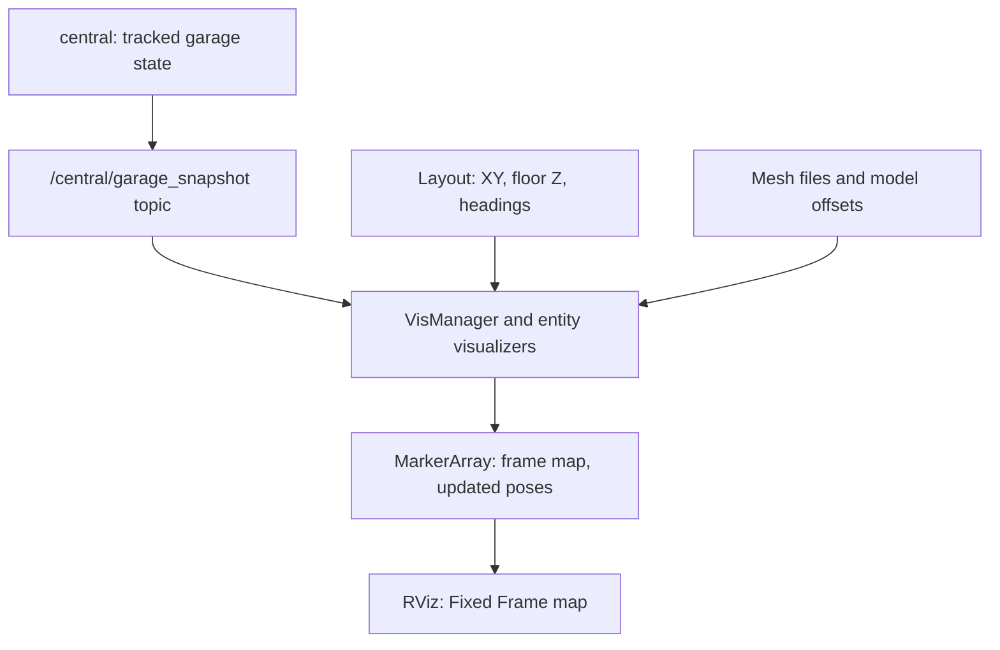

# Volley Simulation: Overview and Reading Guide

## Acronyms, abbreviations, and project names

This reference is local to this document so it remains readable on its own. Formal expansions are distinguished from product/project names whose full forms are not stated in the supplied source. Acronyms inside code, endpoint names, file paths and diagrams retain their exact spelling.

| Term | Full name or meaning | Role in this document |
| --- | --- | --- |
| 2D / 3D | Two-dimensional / three-dimensional. | Planar geometry versus a volume or mesh with height/depth. |
| pub/sub | Publish/subscribe. | Topic-stream interaction; no paired response to each publication. |
| ROS | Robot Operating System; these guides use ROS 2. | Framework for nodes, messages, services, parameters and execution. |
| AGV | Automated guided vehicle. | Mobile robot that transports parking trays. |
| VRC | Vertical reciprocating conveyor (standard equipment term). | Here, a floor-to-floor carriage/lift with gates. The project source does not explicitly spell out its name; the conventional expansion is documented by [Wildeck](https://www.wildeck.com/vertical-conveyors-vrcs/). |
| VECS | Project label for the electric-vehicle charging subsystem (`vecs`); its complete formal expansion is not stated in the supplied source. | Charging core, simulated feedback and physical charging drivers. |
| BLift | Project name for a bay integrated with a lift; not a verified letter-by-letter acronym expansion. | Bay state-machine selection and VRC-to-lift report bridge. |
| API | Application programming interface. | Callable C++/Python interfaces, ROS endpoints or the web service, depending on context. |
| GUI | Graphical user interface. | RViz’s displayed interface and frame-rate setting. |
| TF | ROS transform system/library; TF is used as its conventional name, not a supplied formal letter expansion. | Relationships between coordinate frames; marker poses here do not imply per-asset TF broadcasts. |
| QoS | Quality of service. | Message delivery policies such as reliability, history depth and durability. |
| REST | Representational state transfer. | Web API style; distinct from native ROS service request/response. |
| HTTP | Hypertext Transfer Protocol. | Web requests to REST endpoints. |
| GUID | Globally unique identifier. | Vehicle/payload identity; distinct from numeric tray, bay and AGV IDs. |
| ID | Identifier. | Numeric resource identity or a named configuration identifier. |
| YAML | YAML Ain’t Markup Language (recursive acronym). | Scenario, layout and parameter configuration format. |
| URL | Uniform Resource Locator. | Web/resource address including a mesh base URL. |
| URI | Uniform Resource Identifier. | Resource identifier such as `package://sim/3d/...`. |
| VS Code | Visual Studio Code. | Editor used to open the development container and preview Markdown. |
| MQTT | Message Queuing Telemetry Transport (historical expansion); publish/subscribe protocol used by the production robot adapter and emulated locally in simulation. | Protocol boundary; no network broker is needed by SimAgv. |
| YASMIN | Yet Another State MachINe. | Shared production/simulated AGV control state machine; yasminx is its repository extension layer. |
| RViz | ROS visualization application; a product/tool name rather than a supplied formal acronym. | Displays MarkerArray messages and meshes; does not simulate physical motion. |
| XYZ / XY / ZYX | Coordinate or rotation-axis notation, not acronyms. | X/Y are horizontal axes, Z is vertical; ZYX is the stated Euler rotation composition order. |
| TB / TD | Top-to-bottom / top-down Mermaid layout directives. | Diagram orientation; not application components. |
| Msg / Srv / SPtr / UPtr | Message / service / shared pointer / unique pointer naming abbreviations. | C++ aliases such as GarageSnapshotMsg and AddTraySrv; ConstSharedPtr is shared ownership of const data. |
| sim / vis / devc | Simulation / visualization / development-container wrapper names. | Package/tool shorthand, not additional engines or protocols. |

Environment variables are configuration names, rather than independent protocols:

| Name | Meaning |
| --- | --- |
| `INSTALLATION_ID` | Installation identifier; sim path explicitly uses 9998. |
| `LAYOUT` | Layout-name environment variable for production loading; sim chooses scenario layout. |

Uppercase state labels (`AUTO`, `STOPPED`, `OPEN`, `CLOSED`, and similar), enum constants, macro names and build flags are exact code identifiers, not unexplained acronyms. `RISK` is a review label; `TODO` means “to do.” Units use `m` for metres, `s` for seconds, `ms` for milliseconds, `ns` for nanoseconds, and `kg` for kilograms.

The supported simulation uses Volley's C++/ROS (Robot Operating System) simulation components with production scheduling, tracking, and bay control. RViz displays state through the `vis` package's mesh-marker topics. The supplied source contains clock/sensor/collision logic and visual kinematics; the AGV (automated guided vehicle) motion implementation is now confirmed in `agvhito`: a C++ kinematic model with shared production control logic and in-memory protocol transport.

The documentation is split into seven linked files. Keep them together when downloading so relative links work in VS Code (Visual Studio Code).

| Document | Read it for |
| --- | --- |
| [This overview](volley_simulation_guide.md) | Basic concepts, what ROS contracts mean, engine/TF (the ROS coordinate-transform system) explanations, tray/bay population and C++ responsibility map. |
| [Simulation package design](volley_sim_package.md) | Nine-part `sim` source analysis: 28 files, APIs (application programming interfaces), ROS endpoints, diagrams, lifecycle, safety, math, tests and idioms. |
| [Visualizer package design](volley_vis_package.md) | Nine-part `vis` package/software analysis: 30 files, build/dependency design, APIs, topic contracts, ownership/state diagrams, callbacks, visual equations and tests. |
| [Launcher package design](volley_launcher_package.md) | Nine-part analysis of 23 files: configuration precedence, deployment topology, namespaces, executors, recording/replay, and safety. |
| [HITO AGV package design](volley_agvhito_package.md) | Nine-part analysis of 101 files: real/simulated adapters, ROS and MQTT contracts, YASMIN control, kinematics, lift, battery, ownership, and risks. |
| [AGV state-machine deep dive](volley_agvhito_state_machine.md) | One complete 36-transition graph, every state hook/guard, YASMIN/yasminx library/API, typed blackboard, protocol verification, C++ features, concurrency, and an extension example. |
| [Setup and runbook](volley_simulation_runbook.md) | Container/environment setup, build, exact launch/exercise commands, metrics and troubleshooting. |

## What does “ROS contract” mean?

A **contract** is the documented agreement between components about how to communicate and interpret data. It is not a separate ROS feature or transport. Pub/sub and request/response are communication patterns; the contract additionally states endpoint names, data types, field meaning, units, coordinate frames, timing, QoS (quality of service), errors, and ownership expectations.

| Mechanism | Interaction | Example here | Interface definition |
| --- | --- | --- | --- |
| Topic | Publishers send messages; subscribers receive streams. No paired response for each publication. | Central publishes `/central/garage_snapshot`; `vis` subscribes and publishes `/vis/trays`. | `.msg` type, such as `interfaces/msg/GarageSnapshot` or `visualization_msgs/msg/MarkerArray`. |
| Service | Client sends one request; server returns a response. Calls can be initiated asynchronously in C++. | Simulator calls `/central/add_tray`; external tools call `/sim/enqueue_garage_event`. | `.srv` type containing request and response definitions, such as `interfaces/srv/AddTray`. |
| Action | Client requests a goal; server provides progress feedback and a result, with cancellation semantics. | No application ROS action client/server is implemented in the supplied `sim` or `vis` code. | `.action` definition. |
| Parameter | Named node configuration value, optionally changeable at runtime. | Clock's `real_time_factor`; visualizer's startup `layout` and mesh settings. | ROS parameter infrastructure plus application-defined validation/change behavior. |
| TF / frame convention | Describes coordinate relationships or the coordinate frame used by message poses. | Markers carry `frame_id=map`; RViz uses Fixed Frame `map`. No per-asset TF broadcasting here. | Frame/transform data and application frame agreement. |
| HTTP (Hypertext Transfer Protocol) REST (representational state transfer) API | Separate HTTP interface with URLs (Uniform Resource Locators), request bodies and responses. | The supplied shell helper posts to `http://localhost:5000/api/bay/b39/confirm-insert`. | Separate web API, not a native ROS topic/service. Its server source is omitted. |

“Request/response” is the term for the ROS service pattern; **REST** refers to an HTTP API style. They are different interfaces even if a REST backend eventually calls a ROS service. The shell helper's REST call does not establish how that backend maps to ROS.

For a concrete **visualizer topic contract**: publish a `MarkerArray` on the correctly resolved `/vis/trays` topic, assign stable marker namespace/ID (identifier) pairs, express poses in metres using frame `map`, use compatible QoS, and match RViz's Fixed Frame/display topic. A subscriber that sees a freshly published marker is not guaranteed that the underlying garage snapshot is fresh, because the visualizer can republish cached state.

For a concrete **simulator service contract**: send a request of type `interfaces/srv/SimEvent` to `/sim/enqueue_garage_event`. Its `success=true` means the event was parsed and queued. It does not mean the requested garage job executed successfully; job completion is a separate observation from reports. Contract descriptions should state that semantic distinction rather than just listing a name/type.

Primary ROS background: [interface definitions and patterns](https://github.com/ros2/ros2_documentation/blob/rolling/source/ROS-Framework/interfaces/About-Interfaces.rst) and [QoS compatibility](https://github.com/ros2/ros2_documentation/blob/rolling/source/ROS-Framework/interfaces/topics/About-Quality-of-Service-Settings.rst). The application-specific claims above come from the supplied `sim`/`vis` source.

## Basic questions: engine, population, and business logic

### What is the simulation engine: Gazebo, Ignition, or RViz?

**The engine shown by this source is Volley's own C++/ROS implementation.** `volley::sim::Simulator` in `src/sim/src/simulator.cpp` orchestrates scenario events, patron queues, and collision checking. `BaySim` supplies simulated bay hardware; `SimClockRos` supplies time. `agvhito::sim::SimAgvComponent` owns one `SimAgvRos` adapter and one `SimAgv` model per initial AGV. `SimAgv` uses `AgvMotion` for translation, rotation, lift, and drive-mode delay, plus `BatteryChargeModel` for charge/drain. Its inherited adapter runs the same YASMIN (Yet Another State MachINe) control machine as the production driver.

There is no Gazebo/Ignition dependency, world loader, physics-server interface, or integration call in the packed `sim` build or implementation. The supplied launcher also directly launches these C++ components and no Gazebo/Ignition process. The supplied `agvhito` implementation also contains no Gazebo/Ignition integration; its simulated transport and motion are implemented locally.

**RViz is the display, not the engine.** The documented `vis::visualizer_node` and RViz show the garage state and its 3D assets. Turning off `vis` and `rviz` leaves the documented headless simulation workflow available. A `.dae` mesh depicts an object; it does not decide how many objects exist, register trays, run bay operations, or supply the collision algorithm. This engine checks parameterized boxes, not those meshes.

| Layer | What it does | Implementation/location |
| --- | --- | --- |
| Scenario engine | Inject events, queue patrons, offer vehicles to bays, check collisions. | `src/sim/src/simulator.cpp`. |
| Simulated hardware | Produce bay sensors/doors and AGV motion feedback. | `src/sim/src/bay_sim.cpp`; `src/agvhito/src/sim/sim_agv.cpp` and `agv_motion.cpp`. |
| Production business logic | Decide jobs, plans, garage state, and bay insert/retrieve transitions. | `central`, `scheduler`, and `bay`; their implementations are mostly outside the pack. |
| Visualization | Publish mesh-marker poses in the `map` frame and display them. | Supplied `vis` code; RViz configuration is `src/vis/config/default.rviz.in`. |

### How are simulation elements populated?

Two inputs have different jobs: the **layout** describes the garage and its node locations/types, while the **scenario's initial conditions** enumerate starting movable resources and vehicles. The launcher starts the participating ROS nodes; it is not necessary to instantiate a separate ROS node for every tray.

Here is what the names mean before tracing the flow:

| Name | What kind of thing is it? | Meaning |
| --- | --- | --- |
| Scenario `.yaml` file | Configuration file on disk | Selects the layout, supplies initial entity data, and optionally schedules events. |
| `initial_conditions.trays` | A YAML (YAML Ain’t Markup Language; configuration format) key path written in dotted notation | The `trays` list under the `initial_conditions` key. The dots are explanatory notation; they are not literal dots in the YAML key or a C++ expression. |
| `InitialConditions` | Internal C++ struct | Declared in `src/sim/include/sim/scenario_runner.hpp`; holds parsed AGV/tray/payload request objects and obstruction geometry in memory. |
| `initial_conditions.trays` in C++ code | A member expression on a C++ object | When `initial_conditions` is an `InitialConditions` variable, this means its `std::vector<AddTraySrv::Request>` member. This spelling resembles the YAML path but refers to parsed in-memory data. |
| `AddTraySrv` | C++ alias for a custom ROS 2 service interface type | `using AddTraySrv = interfaces::srv::AddTray;` in `sim_msgs.hpp`. ROS interface generation supplies its `Request` and `Response` C++ types. |
| `AddTraySrv::Request` | Generated C++ request data type | Holds the fields sent when asking central to add a tray. It is the request half of a service, not a published topic message or the tray's ongoing state. |
| `/central/add_tray` | ROS 2 service name | A client sends an `interfaces/srv/AddTray` request and receives its response; this is not a ROS topic. The server implementation belongs to central and is outside the pack. |
| `/central/garage_snapshot` | ROS 2 topic name | Carries successive `interfaces/msg/GarageSnapshot` messages describing tracked garage state. `GarageSnapshotMsg` is the C++ alias used by subscribers here. |
| `sim::Tray` | Separate internal C++ data struct | A convenient tray/payload view assembled from a snapshot for bay simulation. It is not the YAML list, service request, or central's full business object. |

For example, this configuration contains one tray entry:

```yaml
initial_conditions:
  trays:
    - id: 1
      garage_pose: {node_id: 101, heading: 180}
```

`ParseScenarioFile()` reads that YAML list and fills an internal `InitialConditions` struct. For each entry it constructs an `AddTraySrv::Request` object. Later, `SimClients` sends that object's fields to the `/central/add_tray` service. Central's periodically published garage-snapshot topic is then the state input used by the simulator. Thus the stages are **configuration file → in-memory C++ request objects → ROS service requests/responses → ROS state-topic messages**.

Alternatively, `initial_conditions` in the scenario can be a scalar string naming a separate initial-conditions configuration file. The parser resolves that name with `GetLayoutPathByName()`, loads the referenced YAML file, and reads its root-level `trays` list. That reference is configuration-file indirection, not a reference to a C++ object.

| Element | Where its starting definition comes from | How it becomes part of the running simulation |
| --- | --- | --- |
| Trays | The `trays` configuration list inside the scenario's `initial_conditions` YAML map, or the root `trays` list in a referenced initial-conditions YAML file. | Parser creates generated ROS 2 `AddTraySrv::Request` objects in the internal C++ struct; engine calls the `/central/add_tray` ROS service; later `GarageSnapshot` topic messages provide tracked tray state. |
| Payloads/cars already parked | Optional `payload` YAML map nested under each starting tray entry. | Parser creates generated `AddPayloadSrv::Request` objects; engine calls the `/central/add_payload` ROS service; snapshot-topic data associates each payload GUID (globally unique identifier) with a tray. |
| AGVs | The `agvs` YAML configuration list in the resolved initial conditions. | Parser collects generated request objects; engine registers IDs using the `/central/add_agv` ROS service. The supplied launcher creates one `agvhito` simulated AGV component per initial AGV, passing node ID, heading, and `initial_lifted=(lift_fraction==1.0)`; it does not pass battery fraction. |
| Bays | Bay-like nodes in the selected layout. | The launcher confirms a per-layout-bay container with production bay logic and a `BaySimComponent`; the engine creates one offer client per `GetBayLikeNodeIds()` result. |
| Chargers | Layout nodes of type `TYPE_AGV_CHARGE`. | Engine registers static charger collision boxes during construction. |
| Extra obstructions | `initial_conditions.obstructions`. | Parser constructs boxes; engine registers them during construction. |
| New patron vehicles | `patron_arrival` events or live `SimEvent` requests. | Enter the waiting queue, then are accepted by a ready bay and pass through production insert handling. |

The tray path is explicit in this pack:

1. `ParseScenarioFile()` in `src/sim/src/scenario_runner.cpp` reads every `initial_conditions.trays` entry.
2. `SimulatorComponent` passes those requests into `Simulator`.
3. `Simulator::Update()` calls `SimClients::ProcessInitialConditions()` until registration services are ready.
4. `ProcessInitialConditions()` in `src/sim/src/sim_clients.cpp` sends each tray to `/central/add_tray`, then sends nested payloads to `/central/add_payload`.
5. The engine and bay components receive garage snapshots. Collision geometry and sensor behavior use those snapshots; the central service implementation owns the registration business logic.

That means population is a data-registration flow through ROS services, not a Gazebo-style mesh spawn implemented here.

To verify those categories in a running container:

```bash
ros2 service type /central/add_tray
ros2 interface show interfaces/srv/AddTray
ros2 topic type /central/garage_snapshot
ros2 interface show interfaces/msg/GarageSnapshot
```

The first pair inspects a request/response service; the second pair inspects a published state-message topic. The custom interface definitions themselves were not included in the pack, so these commands also expose fields beyond those used by the supplied C++.

### How many trays are there, and where are they placed?

**There is no fixed tray count in the simulator.** The initial requested count is the number of entries in the resolved `initial_conditions.trays` list. Runtime registration can fail, so distinguish that requested count from the trays actually present in `/central/garage_snapshot`. The selected sandbox scenario and its layout contents were not supplied; their exact counts cannot be calculated from this pack.

For each tray the parser reads `id`, optional `agv_id`, `reciprocal_to_agv`, `garage_pose`, and `disabled`. These specify an AGV association and/or discrete garage position. `garage_pose` contains a layout `node_id` and a `heading`; node geometry comes from the layout. The central add-tray handler decides how to interpret or validate combinations of those fields. Its source is omitted, so the parser alone does not establish placement precedence when both an AGV and a garage pose are provided.

For a bay, `BaySimComponent::GetTrayInBay()` finds the first snapshot tray with `garage_tray.pose.node_id == bay_id_`. The simulator therefore knows a tray is in a bay from its tracked discrete position, not from the mesh's location or a fixed tray-to-bay assignment.

To inspect the actual initial count, open the chosen scenario under `src/scenario/scenarios/`. If `initial_conditions` is a scalar reference, follow it to the resolved YAML before counting `trays`. To inspect the running population:

```bash
ros2 topic echo /central/garage_snapshot --once
```

Count the entries in the snapshot's `trays`, `agvs`, `payloads`, and `bays` lists, and inspect tray `pose.node_id` values. This observes current published state; the engine's constructor log separately reports its requested initial tray/payload counts.

### How many bays are there, and where are they placed?

**Bays come from the selected layout, not the initial tray list.** The supplied architecture guide says the launcher starts one bay container per bay. In this pack, `Simulator` traverses `layout_->GetBayLikeNodeIds()` to create `/bay/b<ID>/sim_offer_inserting_payload` clients. The supplied launcher traverses Python `layout.get_bay_ids()` to create bay containers; the engine uses C++ `GetBayLikeNodeIds()`. Their exact agreement and selected counts still require the omitted layout/helper implementations.

The bay hardware component receives `bay_id` as a required parameter. That ID ties it to a layout node, its ROS offer-service endpoint, and the snapshot tray position lookup. Collision placement uses the layout node's X/Y, inbound heading, and floor Z in `MakeBoundingBoxForBay()`. Door hardware additionally uses the floor specification and configured open/close times. More bays therefore generally means more configured bay components, while more trays means more registered tray data, not more bay nodes.

### Is there a transform tree so RViz knows where movable assets go?

**The supplied visualizer places movable assets by publishing their mesh-marker poses directly in the `map` coordinate frame. It does not build a per-asset TF transform tree.** This is now confirmed by `vis-repomix.md`, rather than just a possible implementation.

- `src/vis/src/utils.cpp`: `CreateDefaultMarker()` sets `header.frame_id = "map"`; its mesh factory sets `type = MESH_RESOURCE`.
- `src/vis/src/vis_manager.cpp`: a 50 ms ROS-clock timer publishes `visualization_msgs/msg/MarkerArray` values.
- `src/vis/src/visualizer/agv_visualizer.cpp`: AGV markers get X/Y/yaw from the garage snapshot and Z from floor or reported VRC (vertical reciprocating conveyor; the floor-to-floor lift) height.
- `src/vis/src/visualizer/tray_visualizer.cpp`: tray/car markers get tracked positions and model offsets.
- `src/vis/config/default.rviz.in`: Fixed Frame is `map`, and its displays subscribe to the expected `/vis/...` marker-array topics.

Each `Marker` contains a frame name, pose, mesh-resource URI (Uniform Resource Identifier), namespace, and ID. A `MarkerArray` is a ROS topic message carrying a list of these display instructions. Republishing the same marker namespace/ID with an updated pose moves that displayed object; it does not call a central registration service or move the real/simulated resource by itself.

Because marker frame and RViz Fixed Frame are both `map`, this display path needs no separate `map → tray_1` or `map → agv_1` transform. The pose values already express where to draw each object in that common frame. The `map` string names a coordinate frame, not a physical map publisher or a ROS node. Other repository packages could publish TF for other purposes, but neither supplied `sim` nor `vis` implementation broadcasts it here.

The render data path is:



The supplied launcher explicitly gives vis namespace `vis`, resolving its relative marker names under `/vis`. It starts RViz without an explicit `-d` configuration file, so display/template loading must be verified. The supplied RViz template expects `/vis/trays`, `/vis/agvs`, `/vis/payloads`, and `/vis/bays`. Marker output names in C++ are relative, so the launch namespace/remappings must match that configuration. Verify on a running instance:

```bash
ros2 topic type /vis/trays
ros2 topic echo /vis/trays --once
ros2 topic echo /central/garage_snapshot --once
```

The first command should identify `visualization_msgs/msg/MarkerArray` when launched with the expected topic namespace. Compare a marker's `header.frame_id`, `pose`, `mesh_resource`, `ns`, and `id` with the tracked object. The [visualizer guide](volley_vis_package.md) maps the remaining topics and gives the pose/animation equations.

### Where is the associated C++ business logic?

| Responsibility | Source to read | What this pack establishes |
| --- | --- | --- |
| AGV movement and shared robot control | `src/agvhito/src/sim/agv_motion.cpp`, `sim_agv.cpp`, `src/agvhito/src/agv_ros.cpp`, `src/agvhito/src/sm/`. | C++ kinematics generates feedback; the production-compatible adapter/state machine controls order execution. |
| Tray population and initial placement request | `src/sim/src/scenario_runner.cpp`, `src/sim/src/sim_clients.cpp`. | Decode tray data and send add-tray/add-payload requests. |
| Authoritative tray state and service handling | `src/central/` implementation of `/central/add_tray` and garage tracking. | Engine consumes central snapshots; exact central handler source was not packed. |
| Tray assignment and movement plans | `src/planner/scheduler/`, `src/planner/task_planner/`, `src/planner/motion_planner/`, plus central dispatch. | Earlier architecture guide says production planning logic is reused; its implementations were not packed. |
| Tray collision shape and payload orientation | `src/sim/src/oriented_bounding_box.cpp`, `src/sim/src/tray.cpp`, `src/sim/src/simulator.cpp`. | Construct geometry, apply reciprocal payload yaw, and consume tracked poses. `sim::Tray` itself is a small data struct, not the tray scheduler. |
| Bay component creation and snapshot join | `src/sim/src/bay_sim_component.cpp`. | Own a hardware model, accept payload offers, find a tray/payload in the bay, and tick. |
| Bay hardware and simulated patron behavior | `src/sim/src/bay_sim.cpp`. | Sensor streams, simulated doors, and insert/retrieve confirmations. |
| Bay operation/state-machine business logic | `src/bay/`; referenced headers include `bay/bay_insert_state_machine.hpp` and `bay/bay_retrieve_state_machine.hpp`. | `BaySim` observes the production bay report and supplies feedback; it does not replace the production state machines. |
| Bay launch population | `src/launcher/launcher/sim_nodes.py`. | Confirmed per-layout-bay core plus BaySim containers; plugin selection and BLift (bay integrated with a lift) bridge are in `bay_nodes.py`. |

To locate the omitted central handler in your checkout:

```bash
rg -n 'add_tray|AddTray|GarageTracker' src/central
rg -n 'BaySimComponent|GetBayLikeNodeIds|bay_id' src/launcher
```

The practical distinction is that simulation code supplies the environment and feedback, while production C++ still decides where trays should move and how bays complete inserts and retrieves.


## Evidence and remaining limits

Source basis: `sim-repomix(1).md` (28 files), `vis-repomix.md` (30 files), `launcher-repomix.md` (23 files), `agvhito-repomix.md` (101 files), `P15-yasminx-part1of1.md` (21 files), the supplied repository tree and getting-started/simulation/architecture guides. `vis` math assertions were inspected; no ROS build/runtime/test execution was performed. Simulator test source, actual sandbox scenario/layout/parameter YAML contents, most dependency internals, custom interface definitions and `agvhito` test bodies remain absent.

There is no fixed tray/bay count inferred here. Use the selected initial-conditions YAML for requested starting trays, the selected layout for bay definitions, and live garage snapshots for current tracked entities. These counts describe different stages and can differ after failures or runtime changes.

Use `$...$` and `$$...$$` for math. Mermaid diagrams live in the package guides. All companion files use relative links for portable navigation.

### Launcher evidence added

The [launcher guide](volley_launcher_package.md) explains how scenario data becomes processes and components. On the sim path it selects layout from the scenario and passes installation ID `9998`, irrespective of shell `LAYOUT`/`INSTALLATION_ID`. It configures multithreaded containers for world/AGVs, central, and each bay, with separate VRC/VECS (the project’s electric-vehicle charging subsystem; formal expansion not supplied) processes. The clock has `use_sim_time=False` while consumers use simulated time; listing it first is not a readiness barrier. The excluded `params/`, `layouts/`, and tests remain outside the source evidence.

### HITO AGV evidence added

The [AGV guide](volley_agvhito_package.md) traces the shared ROS adapter, YASMIN control machine, in-memory MQTT-compatible transport, and C++ motion model. The inspected simulation path does not execute the omitted Python wheel-dynamics project. Starting position comes from the configured layout node; lift becomes raised/lowered, and the simulated battery starts full. Initial central registration still sends only the AGV ID.

The simulated `localize` ROS service returns existing localization status rather than moving the robot. The scenario engine sends `MOVE_AGV` to `/central/move_agv`; that central handler is omitted, so its relationship to robot relocation remains unverified. The supplied AGV `localize` implementation alone does not establish teleport behavior. The battery-fraction ROS subscription is implemented in `agvhito`, while the corresponding `sim` scenario event remains unsupported.

There is no new transform tree for AGV assets in this pack: continuous pose reaches central and then `vis` marker poses in `map`. The separate velocity message names frame `a<ID>`, but this source broadcasts no transform for that frame. Main movement, braking, lift, battery, and heading-filter equations are in the [AGV math section](volley_agvhito_package.md#7-main-kinematic-equations-and-algorithms).

### State-machine architecture and library evidence

The AGV state graph is compiled C++: `src/agvhito/include/agvhito/sm/state_strings.hpp` defines names and routing tables, `src/agvhito/src/sm/root.cpp` registers concrete C++ states, and `src/agvhito/src/agv.cpp` builds/runs the root. Scenario/parameter YAML configures the run but does not define these transitions. The [state-machine guide](volley_agvhito_state_machine.md#24-where-is-the-state-machine-architecture-defined) traces that linkage and now explains the supplied `src/core/yasminx/` implementation, joining worker, hook defaults, cancellation/error rules, typed keys, and inspected tests.

The [AGV math section](volley_agvhito_package.md#7-main-kinematic-equations-and-algorithms) now derives translation braking caps from basic kinematics, explains lift/mode timing, gives a piecewise battery update, and derives magnetic-guide alignment with a Python-generated SVG. Cancellation diagram labels use the literal `yasminx.canceled` to avoid the C++ scope-separator parsing issue in Mermaid.
