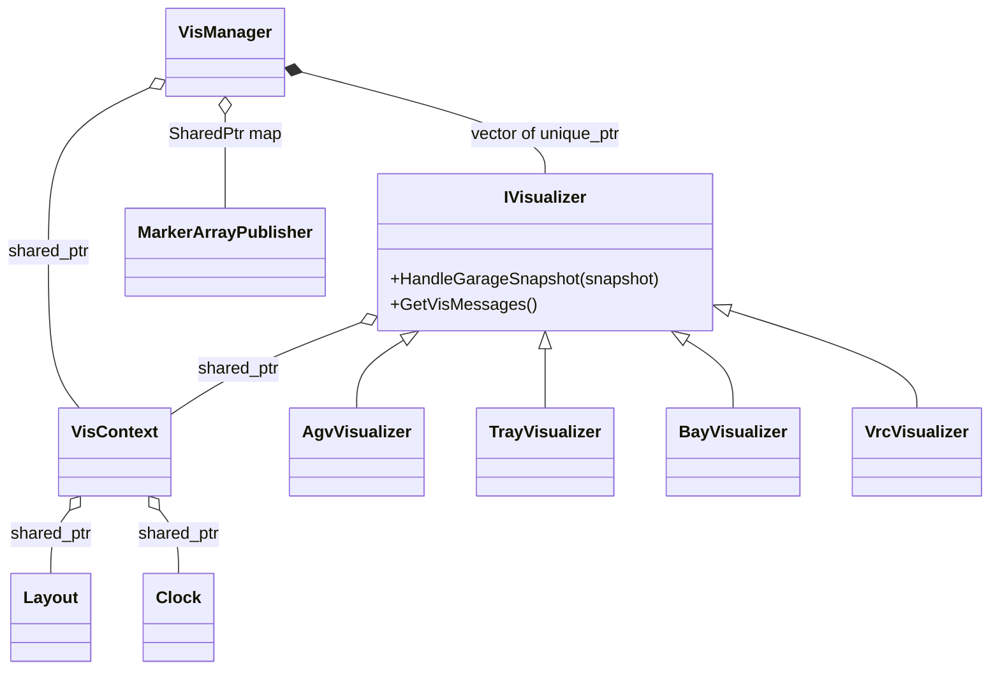
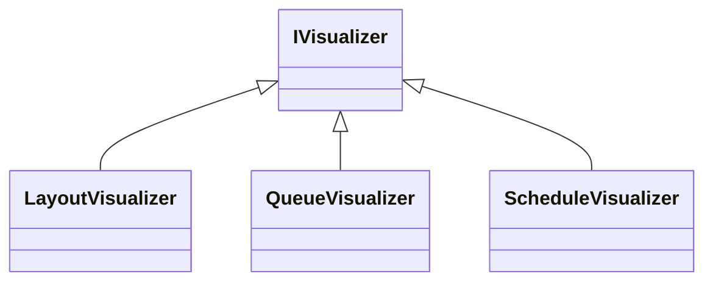
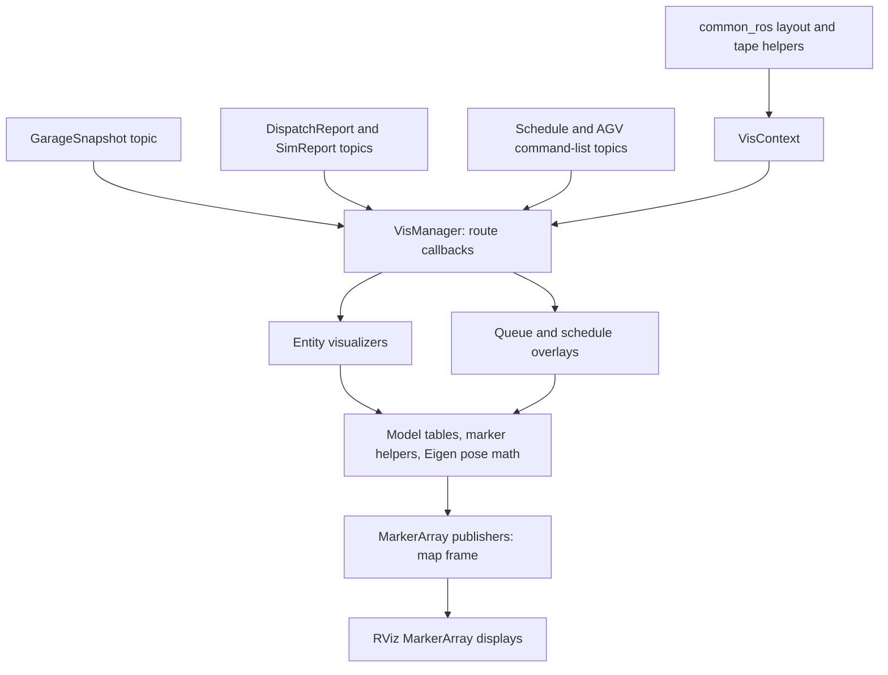
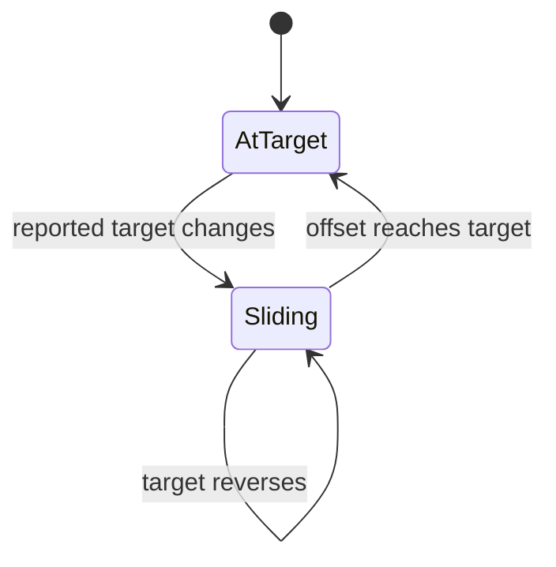

# Volley `vis` Package: Package and Software Design

[Overview and ROS concepts](volley_simulation_guide.md) · [Simulation package](volley_sim_package.md) · [Setup and runbook](volley_simulation_runbook.md) · [Launcher package](volley_launcher_package.md)

## Acronyms, abbreviations, and project names

This reference is local to this document so it remains readable on its own. Formal expansions are distinguished from product/project names whose full forms are not stated in the supplied source. Acronyms inside code, endpoint names, file paths and diagrams retain their exact spelling.

| Term | Full name or meaning | Role in this document |
| --- | --- | --- |
| 2D / 3D | Two-dimensional / three-dimensional. | Planar geometry versus a volume or mesh with height/depth. |
| DAG | Directed acyclic graph. | Dependency graph for scheduled work; `printdags` controls diagnostic output. |
| pub/sub | Publish/subscribe. | Topic-stream interaction; no paired response to each publication. |
| ROS | Robot Operating System; these guides use ROS 2. | Framework for nodes, messages, services, parameters and execution. |
| AGV | Automated guided vehicle. | Mobile robot that transports parking trays. |
| VRC | Vertical reciprocating conveyor (standard equipment term). | Here, a floor-to-floor carriage/lift with gates. The project source does not explicitly spell out its name; the conventional expansion is documented by [Wildeck](https://www.wildeck.com/vertical-conveyors-vrcs/). |
| BLift | Project name for a bay integrated with a lift; not a verified letter-by-letter acronym expansion. | Bay state-machine selection and VRC-to-lift report bridge. |
| API | Application programming interface. | Callable C++/Python interfaces, ROS endpoints or the web service, depending on context. |
| GUI | Graphical user interface. | RViz’s displayed interface and frame-rate setting. |
| UML | Unified Modeling Language. | Class diagrams used to explain types and ownership. |
| TF | ROS transform system/library; TF is used as its conventional name, not a supplied formal letter expansion. | Relationships between coordinate frames; marker poses here do not imply per-asset TF broadcasts. |
| QoS | Quality of service. | Message delivery policies such as reliability, history depth and durability. |
| REST | Representational state transfer. | Web API style; distinct from native ROS service request/response. |
| HTTP | Hypertext Transfer Protocol. | Web requests to REST endpoints. |
| MQTT | Messaging protocol name; historically MQ Telemetry Transport, also expanded as Message Queuing Telemetry Transport in [standards-body terminology](https://www.oasis-open.org/committees/tc_home.php?wg_abbrev=mqtt). | Broker-based publish/subscribe transport used by the production proxy; [protocol overview](https://mqtt.org/faq/). |
| I/O | Input/output. | Sensor/driver interfaces or external data exchanges. |
| GUID | Globally unique identifier. | Vehicle/payload identity; distinct from numeric tray, bay and AGV IDs. |
| ID | Identifier. | Numeric resource identity or a named configuration identifier. |
| FIFO | First in, first out. | Intended waiting-patron queue discipline. |
| GPU | Graphics processing unit. | Rendering device; distinct from ROS simulation/control execution. |
| YASMIN | Yet Another State MachINe. | ROS state-machine library named in the review rules; not used by the inspected packages. [Project documentation](https://github.com/uleroboticsgroup/yasmin). |
| YAML | YAML Ain’t Markup Language (recursive acronym). | Scenario, layout and parameter configuration format. |
| RViz | ROS visualization application; a product/tool name rather than a supplied formal acronym. | Displays MarkerArray messages and meshes; does not simulate physical motion. |
| XYZ / XY / ZYX | Coordinate or rotation-axis notation, not acronyms. | X/Y are horizontal axes, Z is vertical; ZYX is the stated Euler rotation composition order. |
| TB / TD | Top-to-bottom / top-down Mermaid layout directives. | Diagram orientation; not application components. |
| Msg / Srv / SPtr / UPtr | Message / service / shared pointer / unique pointer naming abbreviations. | C++ aliases such as GarageSnapshotMsg and AddTraySrv; ConstSharedPtr is shared ownership of const data. |
| sim / vis / devc | Simulation / visualization / development-container wrapper names. | Package/tool shorthand, not additional engines or protocols. |
| rclcpp / rclpy / rclcppx | ROS client library for C++ / ROS client library for Python / this repository’s C++ client-library extensions. | Node/executor APIs and project-specific adapters/factories. |

Uppercase state labels (`AUTO`, `STOPPED`, `OPEN`, `CLOSED`, and similar), enum constants, macro names and build flags are exact code identifiers, not unexplained acronyms. `RISK` is a review label; `TODO` means “to do.” Units use `m` for metres, `s` for seconds, `ms` for milliseconds, `ns` for nanoseconds, and `kg` for kilograms.

Source basis: all 30 files in `vis-repomix.md`; inventory below. This is static source analysis. `math_test.cpp` assertions were inspected, but no ROS (Robot Operating System) build or executable/test run was performed. Custom interface definitions, mesh bytes, and the simulated AGV (automated guided vehicle) implementation are outside this pack.

## 1. Summary, package design, and dependencies

`vis` converts configuration and tracked ROS state into RViz marker arrays. It does not create the underlying trays/bays in central, schedule jobs, or integrate AGV velocity. It supplies `math_lib` (Eigen-based pose helpers), `visualizer_lib` (models, marker helpers and visualizers), and the `visualizer_node` executable. `sim` uses its mathematical helpers for some collision geometry; RViz consumes its marker topics.

### Package boundaries and design intent

`vis` is a **read-only projection of garage state into display messages**. It is not an RViz plugin: it is a ROS executable publishing standard `MarkerArray` messages consumed by RViz's built-in displays. Its C++ helpers also supply reusable geometry to other packages. This separation means the control system can run headless, and changing car colors or model offsets does not change scheduler behavior.

| Build/dependency boundary | Role in the package |
| --- | --- |
| `math_lib` | Small shared library compiled from `src/math.cpp`, linked to `Eigen3::Eigen`; reusable pose math used by the simulator as well as visualization. |
| `visualizer_lib` | Shared library built from recursively collected `src` files, excluding `math.cpp` and `visualizer_node.cpp`; linked to `math_lib`. Holds all state-to-marker implementations. |
| `visualizer_node` | Thin executable linked to `visualizer_lib`; initializes ROS, constructs the manager, spins, and shuts down. No component registration macro is used by this package. |
| `volley_cmake` | Provides build/package/test macros. `vis` declares `ament_cmake` and CMake minimum 3.28. Exact macro export/install behavior is outside the supplied source. |
| `common`, `common_ros` | Domain constants, pose/layout/heading helpers, motion-type interpretation, tape segments, logging and node/parameter utilities. |
| `interfaces` | Custom snapshot, schedule, report, command, job and pose data definitions. `vis` consumes these types; it does not define new `.msg`, `.srv`, or `.action` files. |
| `geometry_msgs`, `std_msgs`, `visualization_msgs` | Point/pose/quaternion, color/header, and standard RViz marker interfaces. |
| `bay_interfaces`, `vrc_interfaces` | Bay light values and VRC (vertical reciprocating conveyor; the floor-to-floor lift) gate/report types used in rendering. |
| `rclcpp`, `eigen` | ROS callbacks/timers/publishers and rigid-transform computation. |
| `launcher` | Declared execution dependency; supplies system orchestration/configuration confirmed by `launcher-repomix.md`; see its companion guide. |
| Installed `sim/3d` assets | Resource dependency when local mesh mode is selected; path is `package://sim/3d/`. `vis/package.xml` does not explicitly declare `sim`, although the local mesh path requires its installed resources. |

The command-display code classifies `AgvCommand` with `common_ros` helpers and draws overlays. A label such as LOCOMOTE or LIFT expresses a reported/planned operation, not a command executed by `vis`. Similarly, a rendered waiting car is an illustration of queued work, not another central payload registration.

The software design has three layers:

1. **ROS adapter/orchestrator:** `VisManager` owns subscriptions, timer, publishers, and routes inputs.
2. **Presentation strategies:** the seven `IVisualizer` implementations turn their relevant data into marker-array values.
3. **Shared utilities/context:** `VisContext`, pose math, model selection, and marker factories keep frame/time/resources consistent.

This uses composition and runtime polymorphism rather than a large render switch in the manager. `IVisualizer` declares the same snapshot callback for every strategy; layout, queue, and schedule strategies intentionally implement it as a no-op. Specialized report methods are routed through cached typed pointers instead of dynamic casts. That choice is simple, but adding a new input channel still requires manager changes: visualizers do not discover or subscribe to their own inputs.

## 2. Files

Approximate line counts refer to extracted source, not positions in Repomix output.

| Path | Lines (approx.) | Role |
| --- | ---: | --- |
| `src/vis/config/default.rviz.in` | 357 | RViz displays/topics, marker namespaces, map Fixed Frame and GUI (graphical user interface) settings. |
| `src/vis/include/vis/visualizer/agv_visualizer.hpp` | 42 | AGV pose/command rendering interface and cached state/height maps. |
| `src/vis/include/vis/visualizer/bay_visualizer.hpp` | 44 | Bay rendering interface and per-bay overdrive animation state. |
| `src/vis/include/vis/visualizer/i_visualizer.hpp` | 34 | Virtual visualizer contract, unique-pointer alias, topic/MarkerArray value. |
| `src/vis/include/vis/visualizer/layout_visualizer.hpp` | 43 | Static layout marker interface and cached layout/tape/messages. |
| `src/vis/include/vis/visualizer/queue_visualizer.hpp` | 60 | Insert/retrieve display queues and deferred marker deletion state. |
| `src/vis/include/vis/visualizer/schedule_visualizer.hpp` | 27 | Schedule input and AGV-command overlay interface. |
| `src/vis/include/vis/visualizer/tray_visualizer.hpp` | 43 | Tray/payload snapshot caches and VRC height associations. |
| `src/vis/include/vis/visualizer/vrc_visualizer.hpp` | 39 | VRC snapshot rendering and gate-animation timestamp cache. |
| `src/vis/include/vis/math.hpp` | 26 | ROS/Eigen quaternion conversions, point/quaternion constructors, pose composition. |
| `src/vis/include/vis/models.hpp` | 48 | Mesh paths/prefixes, bay-piece and car-model selection APIs (application programming interfaces). |
| `src/vis/include/vis/topics.hpp` | 27 | Relative marker output topic constants. |
| `src/vis/include/vis/utils.hpp` | 50 | Marker factories and AGV-command/payload display helpers. |
| `src/vis/include/vis/vis_context.hpp` | 31 | Shared layout, mesh resource prefix and clock context. |
| `src/vis/include/vis/vis_manager.hpp` | 72 | Manager ownership, ROS subscriptions, publishers and timer declarations. |
| `src/vis/src/visualizer/agv_visualizer.cpp` | 119 | Snapshot AGV marker poses, VRC height override, lift color and commands. |
| `src/vis/src/visualizer/bay_visualizer.cpp` | 277 | Layout/snapshot bay pieces, cardinal overdrive slide and light display. |
| `src/vis/src/visualizer/layout_visualizer.cpp` | 317 | Cached graph/tape/nodes/windows/charger/floor geometry. |
| `src/vis/src/visualizer/queue_visualizer.cpp` | 271 | Waiting-job car illustrations, display queue bookkeeping and deletion. |
| `src/vis/src/visualizer/schedule_visualizer.cpp` | 54 | Scheduled AGV-command marker overlays from ActionNode entries. |
| `src/vis/src/visualizer/tray_visualizer.cpp` | 129 | Tray mesh/ID (identifier) and three-part payload markers with floor/VRC offsets. |
| `src/vis/src/visualizer/vrc_visualizer.cpp` | 208 | VRC shaft/door/carriage markers and three-second gate interpolation. |
| `src/vis/src/math.cpp` | 75 | Euler quaternions, Eigen conversions and rotate-then-translate composition. |
| `src/vis/src/models.cpp` | 293 | Bay mesh tables and process-salted GUID (globally unique identifier) car/model palette selection. |
| `src/vis/src/utils.cpp` | 212 | map-frame marker defaults, command shapes/arrows, body/wheel/window markers. |
| `src/vis/src/vis_manager.cpp` | 148 | Load context, route snapshot/report inputs, render and lazily publish. |
| `src/vis/src/visualizer_node.cpp` | 20 | Initialize ROS, construct manager, spin node, request shutdown. |
| `src/vis/test/math_test.cpp` | 120 | Point/quaternion/conversion and pose-composition assertion cases. |
| `src/vis/CMakeLists.txt` | 26 | math_lib, visualizer_lib, visualizer_node and math_test targets. |
| `src/vis/package.xml` | 32 | ament_cmake visualization package dependencies and metadata. |

## 3. Public API and ROS contracts

| Interface | Path under `src/vis/` | Contract |
| --- | --- | --- |
| `VisManager(NodeSPtr)` | `include/vis/vis_manager.hpp` | Creates context, owns all visualizers, subscribes to state, renders and publishes marker arrays. |
| `VisContext`, `VisContextSPtr` | `include/vis/vis_context.hpp` | Shared layout, mesh prefix, and ROS clock; `GetTimeNow`, `GetLayout`, `GetMeshResourcePrefix`. |
| `IVisualizer`, `VisualizerUPtr`, `VisMessage` | `include/vis/visualizer/i_visualizer.hpp` | Polymorphic snapshot handler and `GetVisMessages`; each returned value pairs a topic name with a `MarkerArray`. Virtual destructor permits unique-owned derived destruction. |
| `AgvVisualizer`, `TrayVisualizer`, `BayVisualizer`, `VrcVisualizer` | Corresponding `include/vis/visualizer/*_visualizer.hpp` | Cache snapshot entities and convert them into markers. AGV also accepts command reports. |
| `LayoutVisualizer` | `include/vis/visualizer/layout_visualizer.hpp` | Creates/caches static layout markers; ignores garage snapshots. |
| `QueueVisualizer`, `ScheduleVisualizer` | Corresponding visualizer headers | Render pending insert/retrieve queues and scheduled AGV-command overlays. |
| `Point`, `Quaternion`, pose `operator*`, Eigen/ROS quaternion conversions | `include/vis/math.hpp` | Coordinate construction/composition; formulas in Section 7.1. |
| `CreateDefaultMarker`, `CreateDefaultMeshMarker`, `CreatePayloadMarkers` | `include/vis/utils.hpp` | Markers in `map`; payload helper returns body, wheels, and windows markers. |
| `VisAgvCommandConfig`, `CreateAgvCommandMarkers` | `include/vis/utils.hpp` | Illustrate motion type/command endpoints; do not execute or simulate commands. |
| `BayPiece`, `CarModel`, mesh-prefix constants, model/color selection | `include/vis/models.hpp` | Choose mesh resources; absent bay pieces return `optional` empty. GUID hash selects car model/color. |
| Topic-name constants | `include/vis/topics.hpp` | Relative marker output names, not a TF (the ROS coordinate-transform system) frame registry. |

### ROS contracts: concrete guarantees and assumptions

A **ROS contract** here means the agreement between a producer and consumer: communication mechanism, resolved endpoint name, generated data type, field meaning, delivery settings, timing, coordinate frame, and missing/stale-data behavior. It is documentation terminology, not an extra ROS transport or a special C++ class. See the [overview's interface explanation](volley_simulation_guide.md#what-does-ros-contract-mean).

`vis` uses **publish/subscribe topics for application communication**. It consumes reports and state and publishes markers. No application-specific ROS service/action or HTTP (Hypertext Transfer Protocol) REST (representational state transfer) server is created here. Node parameter infrastructure may expose standard ROS endpoints, but those are not hand-written garage-control APIs in this code.

| Contract aspect | What the source promises | What consumers/producers must arrange |
| --- | --- | --- |
| Endpoint names | Inputs are explicit absolute `/central/...`, `/sim/report`, `/agv/a<ID>/command_list`. Outputs are relative strings such as `trays`. | The launch namespace/remappings must match RViz's expected `/vis/...` names. |
| Input schema | Generated `interfaces::msg::*` types; examples are snapshot and dispatch report. | Publish the correct type and valid layout IDs; complete `.msg` definitions are omitted. |
| Input delivery | `GetBestEffortQoS(1)` requested at each state subscription. | Use compatible QoS (quality of service); repeated state delivery is expected. No reliable event log is reconstructed here. |
| Output schema | `visualization_msgs/msg/MarkerArray`, with mesh/shape/text markers. | Configure RViz MarkerArray displays, not a custom snapshot-message display. |
| Output delivery | `create_publisher<MarkerArray>(name, 1)`, and the supplied RViz config requests reliable/volatile keep-last delivery. | Verify effective QoS in the running deployment; subscriptions cannot assume past data is latched for late joiners. |
| Coordinate frame | Default marker factory sets `header.frame_id="map"`. | Use RViz Fixed Frame `map`, or supply a valid transform to a different fixed frame. This package broadcasts no TF. |
| Orientation/units | Snapshot geometric yaw is radians; layout headings are degrees converted before marker quaternion construction. | Keep frame conventions and units consistent; wrong units create plausible but incorrect graphics. |
| Time | Render timer uses node clock; marker headers use `VisContext` clock. | Enable ROS simulated time for simulation deployment; paused ROS time pauses these timers/animations. |
| Identity | Marker `ns` plus numeric `id` identifies a displayed element; an update uses `ADD`. | Preserve identity across updates. Mesh parts use different namespace suffixes. |
| Freshness | Cache last input; render periodically. No age/sequence validity gate. | A refreshed marker can represent stale source state. Header render time is not proof of fresh measurement time. |
| Removal | Queue emits DELETE; trays/payloads rebuild their active maps, with absent markers ceasing to be refreshed; other entity caches retain entries. | Do not infer authoritative garage membership solely from visible meshes. |

QoS compatibility is separate from type/name compatibility: matching names and message types alone does not guarantee delivery. See the [official ROS QoS documentation](https://github.com/ros2/ros2_documentation/blob/rolling/source/ROS-Framework/interfaces/topics/About-Quality-of-Service-Settings.rst). The standard marker factory has one-second lifetime, but disappearance depends on time advancing and whether a stale cache still republishes the marker.

| Input topic | ROS message type | Consumer |
| --- | --- | --- |
| `/central/garage_snapshot` | `interfaces/msg/GarageSnapshot` | Entity state/poses for AGV, tray, payload, bay, VRC displays. |
| `/central/schedule` | `interfaces/msg/Schedule` | Schedule overlay. |
| `/central/report` | `interfaces/msg/DispatchReport` | Unplanned/executing retrieve-job queue. |
| `/sim/report` | `interfaces/msg/SimReport` | Waiting patron insert queue. |
| `/agv/a<ID>/command_list` | `interfaces/msg/AgvCommandReportList` | AGV command overlay; subscribed dynamically. |

All outputs below carry `visualization_msgs/msg/MarkerArray`. The code uses **relative names**; `default.rviz.in` expects them under `/vis`. The supplied simulation, production central, and bagplay launch files explicitly supply namespace `vis`. Naming a node `vis` alone does not make its relative topics `/vis/...`.

| Expected topic in supplied RViz configuration | Contents |
| --- | --- |
| `/vis/agvs`, `/vis/agv_commands` | AGV mesh and reported command geometry. |
| `/vis/trays`, `/vis/payloads` | Tray mesh/ID labels and three-part car meshes. |
| `/vis/bays`, `/vis/vrcs` | Bay pieces/animated overdrive plates and VRC shaft/gates/carriage. |
| `/vis/edges`, `/vis/tape`, `/vis/nodes`, `/vis/layout_spaces` | Layout graph, tape segments, node labels, clearance windows. |
| `/vis/chargers`, `/vis/environment` | Charger cubes and floor/bounds meshes. |
| `/vis/request_markers`, `/vis/schedule_dag` | Waiting-job illustrations and scheduled command overlays. |

## 4. Diagrams and state behavior

### 4.1 UML ownership and runtime polymorphism

Composition diamonds show unique ownership; aggregation diamonds show shared ownership. Dependency arrows do not transfer lifetime.

The manager also owns layout, queue, and schedule visualizers through the same interface. Its raw AGV/queue/schedule pointers are non-owning aliases to heap objects held by the unique-pointer vector, used to route specialized input messages. Vector movement does not move those allocated visualizer objects; removing/destroying them would invalidate the aliases.

The following overlay strategies share the same ownership/dispatch scheme:

### 4.2 Topic data flow and lower-layer calls

The render timer is driven by the node's ROS clock. Configuration parameters select layout and mesh resources; there is no MQTT (broker-based publish/subscribe messaging; historically MQ Telemetry Transport), database, physical hardware I/O (input/output), or application service/action flow in this package.

### 4.3 State diagrams

There is **no YASMIN (Yet Another State MachINe) or standalone enum-driven state machine in `vis`**. Reported door/gate enums select presentation behavior. Bay animation retains an offset and last-update timestamp; VRC gate animation retains a movement-start timestamp. This conceptual diagram describes the bay animation, not a new production bay state machine:

#### VRC gate movement timestamp

No YASMIN machine or production control state machine is implemented in `vis`. It **observes** door/gate states published by other packages. Its own stored offset and timestamps produce the following presentation-state behavior.

```mermaid
stateDiagram-v2
    [*] --> NoGateTimer
    NoGateTimer --> NoGateTimer : OPEN or CLOSED; return terminal height
    NoGateTimer --> GateTimerActive : transitional gate state; store start time
    GateTimerActive --> GateTimerActive : interpolate by elapsed time
    GateTimerActive --> GateTimerActive : direction changes without terminal report
    GateTimerActive --> NoGateTimer : OPEN or CLOSED; clear start time
```

A transition to a terminal gate report clears the timestamp; a direction change while still transitional does not. The first-transitional-sample bug is documented with its exact code expression in the math section. The overdrive slide animation shown above uses distance-to-target clamping.

## 5. Behavior and configuration

### Construction → callbacks → shutdown, with lifetime details

The executable constructs the shared node first and then the stack-local manager. Manager construction synchronously resolves the layout and chooses a mesh prefix before registering ROS subscriptions and a 50 ms timer. This is not a lifecycle-managed ROS node with configure/activate/deactivate methods. Configuration errors can therefore fail during ordinary C++ construction.

After callbacks start, `HandleGarageSnapshot` dispatches a shared const snapshot to each strategy. Strategies either copy entity values or retain a shared message pointer, so they do not borrow from a callback-local message that will immediately disappear. The manager subscribes to each newly observed AGV's command topic once. The render callback publishes all strategy outputs in construction order: bay, layout, tray, VRC, queue, AGV, schedule. It does not wait for all data channels to reach a common timestamp.

There is no snapshot barrier between schedule, AGV commands, dispatch reports, and garage state. An overlay and an asset can describe different update times. No lock or atomic protects these caches; the executable's `rclcpp::spin(node)` path supplies ordinary serialized node execution, and no reentrant group or custom executor is configured here. Embedding the manager in a concurrent execution scheme changes this safety assumption.

On exit from spin, `main` calls ROS shutdown before its manager goes out of scope. Timer/subscription handles are then destroyed as members, and unique-owned strategies are destroyed with them. The generic lifetime requirement remains that no callback run against a destroyed manager. Explicit unload/drain/cancel hooks and a destructor publishing scene-wide deletion are absent.

### Responsibility of each visualizer

| Strategy | State it owns/caches | Rendering behavior |
| --- | --- | --- |
| `LayoutVisualizer` | Layout snapshot, consolidated tape segments, optional cached marker messages. | Graph edges, node centers/IDs, rotation spaces, parking windows, chargers, floor/bounds. Marker data is constructed once and reused. |
| `AgvVisualizer` | AGV states, command-list pointers, AGV→VRC height map. | One AGV mesh per cached ID, command footprints/arrows/text. Uses max lift fraction to tint the mesh; does not compute motion. |
| `TrayVisualizer` | Current tray map, payload map, tray/GUID→VRC height maps. | Tray meshes and labels; each payload car is body, wheels, windows. Active entity maps are cleared/rebuilt per snapshot. |
| `BayVisualizer` | BayState map and per-bay slide offset/timestamp. | Selects bay/blift mesh pieces, door-open/closed mesh, overdrive slide and patron light. Requires layout plus matching bay state. |
| `VrcVisualizer` | VRC reports and per-node gate start timestamps. | Shaft/tracks/gate/carriage; carriage follows reported height; gate cube height is visually interpolated. BLift (bay integrated with a lift) nodes skip duplicated VRC shaft/door structures. |
| `QueueVisualizer` | GUID→marker groups, display-order vectors, pending deletions. | Inserts from SimReport; unplanned/executing retrieves from DispatchReport. Cars are illustrative positions near the first bay-like node. |
| `ScheduleVisualizer` | Latest schedule shared pointer. | Draws only AGV-command action nodes; uses a different color and Z offset to distinguish planned overlays. |

The array-per-topic interface is a value return, not a shared scene graph. A strategy can produce several topics; the manager's publisher map creates each topic once and reuses its handle. Small caches and repeated messages favor simplicity over incremental scene updates. There is no graphics GPU (graphics processing unit)/OpenGL renderer in this package; RViz loads/renders the supplied mesh resources.

### Marker generation and presentation rules

The RViz template sets Fixed Frame `map` and GUI Frame Rate 30. That GUI rate does not change the manager's 50 ms ROS-time render timer. Markers have `ADD` action, namespace/ID identity, a one-second lifetime, and common `map` frame. Mesh loading uses `package://sim/3d/` when local resources are selected. A car's body/wheels/windows share its position/orientation; the GUID selects model and palette color using a process-salted hash, so appearance is stable within a process but can change on restart. Those selections are presentation choices, not payload geometry or physics.

Bay visual markers require both a bay-like layout node and a cached matching BayState. AGV/tray/payload meshes follow snapshot state. Layout markers come from layout configuration alone. Queue-car illustrations are placed by the first bay-like layout node using fixed offsets, not the actual patron's measured location; they should not be counted as additional registered payloads in the garage.

### Parameters and defaults

| Setting | Local `vis` behavior/default |
| --- | --- |
| `layout` | Read as a string with no explicit local fallback; resolved with `GetLayoutPathByName`. Resolution failure logs and exits. |
| `use_remote_meshes` | **`true` in `BuildVisContext`**. Simulation launcher explicitly passes `false` unless overridden; bagplay also passes false. Production central passes shared params, so inspect YAML (YAML Ain’t Markup Language; configuration format) or application default. |
| `remote_mesh_prefix` | `https://aws-mesh-proxy.tailfadbb4.ts.net/model/`. |
| Local mesh prefix | `package://sim/3d/`. |
| Render period | Fixed 50 ms of the node's ROS clock. |
| Marker frame/lifetime | `map` / one second. |
| Overdrive slide | Hardcoded 2.4384 m travel and 4 s nominal duration; no live hardware-time parameter read. |
| VRC gate animation | Hardcoded 3 s; default floor-to-ceiling height 3.6 m if neighboring floor data is unavailable. |

Local parameter reads happen during construction. Unlike the clock's dynamic `real_time_factor`, `vis` has no custom parameter-change callback rebuilding its layout/context or mesh prefix. A ROS parameter update therefore does not imply all cached presentation data is reconfigured here. Use the launch configuration as the authority for startup overrides.

## 6. Ownership, concurrency, and safety

`VisManager` retains a shared node/context and owns strategies by `unique_ptr`. Each strategy retains a shared context; copied entity values and shared const message pointers keep its input data alive. Manager raw pointers are aliases to owned strategies, not additional owners. Publishers/subscriptions/timer are kept by shared ROS handles. Callbacks capturing `this` do not extend manager lifetime.

There are no explicit mutexes or atomics in these implementations. `rclcpp::spin(node)` is the ordinary serialized executable path, and no custom concurrent groups are configured. If this library is reused with callbacks able to overlap, input maps, pending-deletion vectors, dynamic subscription creation, and rendering require synchronization or group serialization. `const` on a message pointer protects the message; it does not protect the mutable map holding it.

| Error mechanism | Examples | Consequence |
| --- | --- | --- |
| `std::optional` | Missing bay piece, layout node/window/floor, VRC height, movement timestamp. | Skip a display piece or use a fallback; absence is sometimes silently rendered at zero height. |
| Null shared pointer | No schedule or command report yet. | Return no corresponding markers until input arrives. |
| Boolean + log | Duplicate publisher detected by `AddPublisher`. | Returns false; normal `Publish` first checks the map, so its ordinary creation path avoids duplication. |
| Exceptions | Required parameter conversion, `node.headings.at(0)`, map/table `.at`, file/layout construction. | No enclosing exception recovery is shown in the executable. |
| Explicit process exit | Layout name cannot be resolved in `BuildVisContext`. | Logs and `exit(EXIT_FAILURE)` during construction. |
| Assertions | None in production files; EXPECT assertions exist in math test source. | Runtime preconditions are not checked by the test assertions. |

| RISK / limitation | Evidence |
| --- | --- |
| Stale AGV/bay/VRC caches | Snapshot handlers add/update entries without removing absent entities. Tray and payload caches are cleared/rebuilt. Removed AGVs can continue being rendered/subscribed. |
| ID narrowing | Manager stores a snapshot AGV ID in `uint8_t` before constructing its command topic/capture; IDs outside that range can be misrouted. |
| Displayed queue order is not guaranteed FIFO (first in, first out) | New inserts/retrieves are traversed from unordered maps before appending their display-order vectors. Engine patron FIFO and display order can differ. |
| Visual animation can disagree with hardware | Overdrive uses hardcoded time, cardinal-only translation, state/light heuristics; VRC uses hardcoded 3 s. Formulas and boundary bugs are detailed in Sections 7.3–7.4. |
| Mesh geometry differs from physical/collision geometry | Car selection is hashed; payload dimensions do not resize each rendered car model here. |
| Missing layout data silently falls back | Many floor-height lookups use zero fallback; the VRC carriage no-report fallback also differs from its comment. |
| Layout-bound maximum initialization | `CreateEnvironmentMarkerArray` initializes maxima with `numeric_limits<float>::min()`, the smallest positive value, rather than `lowest()`. Negative-only coordinates can produce incorrect bounds. |
| Static-marker timestamps are cached | `LayoutVisualizer` caches complete marker arrays after first construction, including timestamps/lifetimes. Runtime behavior under clock jumps should be checked. |
| Borrowed callbacks and mutable state | Manager lambdas capture `this` implicitly with `[&]` or explicitly. No mutex/drain protocol is added; correct object lifetime depends on stopping spin before destruction. |

Normal executable flow returns from spin, calls `rclcpp::shutdown`, and then destroys the manager on leaving `main`. There is no explicit marker deletion for every visualizer on shutdown; default lifetime provides eventual display expiry when time is advancing. QueueVisualizer does explicitly publish `DELETE` markers when removing queued illustrations.

Additional design implications: the map coordinate frame and mesh-origin offsets are part of the display contract. Hardcoded defaults make deployment simple, but they also couple the implementation to those frames/models. Marker lifetimes do not solve stale-source detection when caches continuously republish obsolete entities. Per-process salted model/color selection provides stable appearance during a run, not reproducible screenshots across restarts.

## 7. Mathematics and kinematic animation

These are implemented geometric and visual kinematic equations, not AGV force/velocity integration. The simulation's clock, sensor-load and collision formulas are in the [sim math section](volley_sim_package.md#7-mathematics-and-algorithms). Scalars are italic, vectors bold lowercase, matrices bold uppercase; their dimensions and units are defined with each equation. Inline math uses `$...$`, display math uses `$$...$$`.

### 7.1 Rigid transforms and Euler-to-quaternion conversion

Source: `src/vis/src/math.cpp`, shared through `math_lib`. `sim` calls the pose-multiplication helper when positioning charger and bay collision geometry.

For position vectors $\mathbf{p}_1,\mathbf{p}_2\in\mathbb{R}^{3}$, rotation matrices $\mathbf{R}_1,\mathbf{R}_2\in\mathbb{R}^{3\times3}$, and unit quaternion vectors $\mathbf{q}_1,\mathbf{q}_2\in\mathbb{R}^{4}$, the implemented `pose1 * pose2` operation is equivalent to:

$$
\mathbf{p}_{12}=\mathbf{p}_1+\mathbf{R}_1\mathbf{p}_2,
\qquad
\mathbf{q}_{12}=\mathbf{q}_1\otimes\mathbf{q}_2.
$$

Here $\otimes$ denotes quaternion multiplication. The corresponding homogeneous transform is:

$$
\mathbf{T}_i=
\begin{bmatrix}\mathbf{R}_i&\mathbf{p}_i\\\mathbf{0}^{\mathsf T}&1\end{bmatrix}
\in\mathbb{R}^{4\times4},
\qquad
\mathbf{T}_{12}=\mathbf{T}_1\mathbf{T}_2.
$$

The local translation is rotated by pose 1, then translated by pose 1. This is an in-process mathematical coordinate transform; it does not publish a TF message. The comment in `math.hpp` says the second pose is expressed in frame Q; the implementation treats its translation as local coordinates to be rotated by pose 1, so that comment's frame wording deserves review.

`Quaternion(roll, pitch, yaw)` implements ZYX orientation composition. Let $\phi,\theta,\psi\in\mathbb{R}$ be roll, pitch, yaw in radians, and define $c_\phi=\cos(\phi/2)$, $s_\phi=\sin(\phi/2)$, with analogous definitions for pitch and yaw. In ROS component order, $\mathbf{q}=[q_x,q_y,q_z,q_w]^{\mathsf T}\in\mathbb{R}^{4}$:

$$
\begin{aligned}
q_x&=s_\phi c_\theta c_\psi-c_\phi s_\theta s_\psi,\\
q_y&=c_\phi s_\theta c_\psi+s_\phi c_\theta s_\psi,\\
q_z&=c_\phi c_\theta s_\psi-s_\phi s_\theta c_\psi,\\
q_w&=c_\phi c_\theta c_\psi+s_\phi s_\theta s_\psi.
\end{aligned}
$$

For yaw-only poses this reduces to:

$$
\mathbf{q}(\psi)=
\begin{bmatrix}0&0&\sin(\psi/2)&\cos(\psi/2)\end{bmatrix}^{\mathsf T}.
$$

The conversion helper preserves named ROS quaternion components when constructing Eigen's `Quaterniond(w,x,y,z)`. Callers must supply valid rotation quaternions; pose multiplication does not explicitly normalize inputs.

### 7.2 Rendered asset poses and mesh offsets

Sources: `src/vis/src/visualizer/agv_visualizer.cpp`, `tray_visualizer.cpp`, `bay_visualizer.cpp`, and `vrc_visualizer.cpp`.

Let $x,y,z\in\mathbb{R}$ be metres, $\psi\in\mathbb{R}$ yaw in radians, and $z_b$ the selected base height. For AGVs, trays, and associated payloads the visualizer chooses the VRC report's carriage height when the entity's discrete node belongs to that VRC; otherwise it uses the layout's floor Z, falling back to zero when missing.

$$
z_b=
\begin{cases}
z_{\mathrm{carriage}},&\text{entity is associated with a reported VRC node},\\
z_{\mathrm{floor}},&\text{otherwise}.
\end{cases}
$$

| Asset | Rendered position/orientation | Meaning |
| --- | --- | --- |
| AGV | $\mathbf{p}=[x,y,z_b]^{\mathsf T}\in\mathbb{R}^{3}$; yaw is `Wrap(snapshot_yaw + π)`. | Extra 180° corrects the AGV mesh's orientation; it is not a rotation command. |
| Tray | $\mathbf{p}=[x,y,z_b]^{\mathsf T}$; yaw is snapshot `geometric_pose.yaw`. | Tray mesh follows current tracked pose. |
| Payload car | $\mathbf{p}=[x,y,z_b+h_{\mathrm{AGV,raised}}+d_{\mathrm{tray}}/2]^{\mathsf T}$; yaw is payload snapshot yaw. | Fixed visual Z offset for mesh placement, using `kAgvHeightRaised` and `kTrayThickness`. |
| Bay | $\mathbf{p}=[x_{\mathrm{node}},y_{\mathrm{node}},z_{\mathrm{floor}}]^{\mathsf T}$; yaw is $(\eta+180b)\pi/180$. | $\eta$ is the first layout heading in degrees and $b\in\{0,1\}$ is `faces_reciprocal`. |
| VRC carriage | $\mathbf{p}=[x_{\mathrm{bottom}},y_{\mathrm{bottom}},z_{\mathrm{report}}-0.5]^{\mathsf T}$. | Reported carriage height minus a 0.5 m mesh-origin correction. |

For the VRC carriage, the actual no-report fallback starts at Z=0 before subtracting 0.5 m. Its comment says “bottom floor,” but the code does not obtain that floor height for the fallback. Visual mesh origins and collision-box origins are separate: for example, the collision payload starts at `ground_z + kTrayHeight`; its rendering offset follows the formula above.

The visualizer does not scale the selected car mesh to each payload's length/width/height in `CreatePayloadMarkers`; it applies a chosen model at the supplied pose. Collision geometry uses payload dimensions separately. An apparent mesh clearance therefore need not exactly match collision clearance.

### 7.3 Bay overdrive-plate kinematic animation

Source: `BayVisualizer::CreateBayMarkers()` in `src/vis/src/visualizer/bay_visualizer.cpp`. This is **visual animation**, independent of the `bay` package's simulated door-hardware implementation.

The model slides a distance $d=2.4384\text{ m}$ over the hardcoded nominal time $T=4\text{ s}$, giving constant speed:

$$
v=\frac{d}{T}=0.6096\text{ m s}^{-1}.
$$

Let $s_k\in\mathbb{R}_{\ge0}$ be the current offset in metres, $s^\star\in\{0,d\}$ the target, and $\Delta t_k=t_k-t_{k-1}$ ROS elapsed seconds. For nonnegative elapsed time, the update is equivalent to:

$$
s_{k+1}=s_k+\operatorname{sgn}(s^\star-s_k)
\min\!\left(\operatorname{abs}(s^\star-s_k),v\Delta t_k\right).
$$

The first render stores its timestamp without taking a step. Open/moving overdrive or system door fields, or patron-light state greater than one, select target $d$; otherwise the target is zero. A changed target reverses movement without restarting a fixed-duration interpolation.

For supported cardinal headings, the marker displacement is:

$$
\mathbf{p}_{xy}=\mathbf{p}_{\mathrm{bay},xy}
+s_k\begin{bmatrix}\cos\psi_{\mathrm{bay}}\\\sin\psi_{\mathrm{bay}}\end{bmatrix}
\in\mathbb{R}^{2}.
$$

The source implements that displacement with a switch for 0°, ±90°, ±180°, 270°, 360°, and -270°. Other headings receive no positional offset even though the animation state advances. The speed is not read from `bay.door.open_time` or `close_time`; changing those parameters can desynchronize this animation from hardware state. Negative ROS-time jumps are not guarded and invalidate the nonnegative-step assumption in the compact formula.

### 7.4 VRC gate-height animation

Source: `VrcVisualizer::GetDoorHeightAtVrcNode()` in `src/vis/src/visualizer/vrc_visualizer.cpp`.

After the first transitional sample, let $H\in\mathbb{R}_{>0}$ be floor-to-ceiling height in metres and $t_0$ the first observed movement timestamp. The code uses elapsed milliseconds with a 3000 ms denominator, equivalent to:

$$
\alpha=\operatorname{clip}\!\left(\frac{t-t_0}{3\text{ s}},0,1\right),
\qquad
h(t)=
\begin{cases}
H(1-\alpha),&\text{OPENING},\\
H\alpha,&\text{otherwise treated as CLOSING}.
\end{cases}
$$

Here $\operatorname{clip}(x,0,1)=\min(1,\max(0,x))$. Fully OPEN yields $h=0$ and fully CLOSED yields $h=H$; either clears the movement timestamp. The door cube has Z scale $h$ and center:

$$
z_{\mathrm{center}}=z_{\mathrm{floor}}+H-\frac{h}{2}.
$$

This keeps its upper edge at the ceiling while it shrinks/grows. It is a visualization of reported gate state, not the actual VRC actuator law. The first transitional return contains `(GateState::STATE_OPENING) ? H : 0` without comparing the incoming gate state, so its first-sample behavior is determined by the enum constant rather than direction. Reversals without a terminal state also reuse the prior timestamp.

## 8. Tests

Unlike the omitted `sim` tests, this pack **includes** `src/vis/test/math_test.cpp`. Its assertions check point construction, identity/90°/general Euler quaternions, ROS↔Eigen quaternion component preservation, identity-local pose composition, translation-only composition, yaw composition, and one combined translation/rotation example. CMake registers `math_test` linked to `math_lib`. The tests were read, not compiled or run.

No marker-placement, TF/frame-contract, overdrive/VRC animation, namespace/QoS, queue-order, or stale-cache tests are declared in this `vis` CMake file. The math tests substantiate intended transform behavior, not whole-system visual correctness.

| Existing test case | Intended behavior demonstrated by assertions | Gaps |
| --- | --- | --- |
| `GeometryUtils.Point` | Constructor preserves supplied XYZ. | No special-value/input-range checks. |
| `GeometryUtils.Quaternion` | Identity, 90° yaw, and one general roll/pitch/yaw case. | No property tests for unit norm, wrap boundaries, or invalid angles. |
| `GeometryUtils.QuatToQuatd` / `QuatdToQuat` | Named components survive ROS/Eigen conversions. | Does not require/verify normalized arbitrary inputs. |
| `GeometryUtils.PoseMultiplication` | Identity local pose, additive translations without rotation, combined yaw, and full rotate/translate example. | No arbitrary 3D composition round-trip or nonunit-quaternion behavior. |

Targeted missing behavior tests would cover snapshot removals, marker frame/identity, namespace and QoS alignment, high AGV IDs, unordered-map queue order, VRC fallback/first-sample/reversal, overdrive noncardinal headings, runtime clock jumps, and changes to hardware travel times. These are proposed checks, not tests run by this documentation task.

## 9. Idioms to reuse and questions for the team

| Reusable idiom | Design benefit | Condition to preserve |
| --- | --- | --- |
| Thin ROS executable around library code | Geometry/marker logic can be tested without starting RViz. | Keep simulation control out of presentation code. |
| Shared context + unique-owned strategies | Consistent layout/resources/time with clear strategy lifetimes. | Raw routing aliases must remain valid. |
| `IVisualizer` virtual contract and virtual destructor | New rendering strategies fit manager dispatch safely. | Define meaningful no-op input handlers where appropriate. |
| Value-returned `VisMessage` | Separates conversion from publication and endpoint creation. | Avoid confusing marker data with authoritative state. |
| Common marker factory | Centralizes map frame, lifetime, identity and mesh mode. | Use stable IDs and make exceptional frames explicit. |
| Quaternion/Eigen bridge | Centralizes rigid transforms and component order. | Unit quaternions and coordinate conventions are caller requirements. |
| Optional asset piece | Missing BLift/bay parts can be skipped intentionally. | Distinguish intentional absence from broken resource configuration. |
| Explicit DELETE for queue removal | Removes departed illustrations without waiting only for timeout. | Reconcile display bookkeeping with current source data. |

### Adding a visualizer without changing simulator behavior

A new visualizer should derive from `IVisualizer`, accept the shared context, implement snapshot handling, and return `VisMessage` values from `GetVisMessages()`. Use the common marker factory so frame, lifetime, and identity follow existing conventions. Register the strategy as a `unique_ptr` in `VisManager` and add an appropriate RViz MarkerArray display. If it needs a new input type, add a clearly named handler and route a manager subscription to it.

Choose a stable marker namespace/ID scheme; define whether entities missing from a snapshot are removed, whether DELETE is published, and how old source timestamps are handled. Document which coordinates are physical state and which are display offsets. Do not mutate central state or integrate physical movement in a rendering strategy; running headless must preserve the same simulated garage behavior.

### Open questions for the team

1. With `/vis` namespace confirmed, should sim launch also explicitly load the installed RViz configuration and simulated-time settings?
2. Should local mesh resources be an explicit `sim` runtime dependency, or should assets live in a separate resource package?
3. Should fresh marker headers preserve the source snapshot stamp or expose age, so stale data is visible?
4. Should all entity caches be reconciled on removal and AGV command subscriptions removed with them?
5. Should visual door speeds use hardware parameters, and should noncardinal headings use vector rotation instead of a switch?
6. Should the VRC first-transitional-sample expression compare the actual state, and should direction changes restart animation from current height?
7. Is display queue order intended to match engine FIFO, and should insertion traverse the received payload vector rather than an unordered map?
8. Should model/color selection be reproducible across processes, and should car meshes reflect each payload's physical dimensions?
9. Is the expected deployment always serialized, or should library APIs explicitly document concurrency constraints?
10. Should layout/tape marker timestamps be refreshed on cached messages, and should ROS-time jumps reset animation state?

## Source and rendering notes

Primary source: `vis-repomix.md`, all 30 files listed above. The companion `sim` pack establishes its caller relationship to `math_lib` and local asset installation. Internal helper implementations in omitted packages are not assumed. Mermaid blocks describe ownership/data flow or presentation-state retention, not a physical dynamics engine. ROS concept references are linked in the overview and contract discussion.

### Confirmed launcher integration

`launcher/sim_nodes.py` creates `/vis/visualizer`, passes `use_remote_meshes=False` by default, and includes Foxglove when `vis` is enabled. RViz creation is nested under that same condition: `vis:=false` disables RViz regardless of `rviz`. The RViz action has no explicit `-d` config argument. Production central and bagplay also use namespace `vis`; bagplay does not pass layout or simulated time. See [launcher design](volley_launcher_package.md) for option precedence, replay limitations and startup timing.
